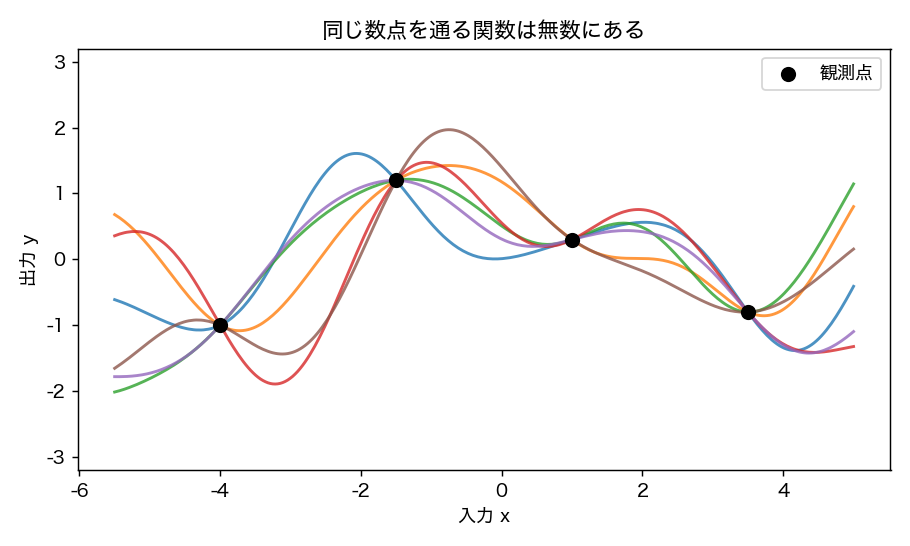
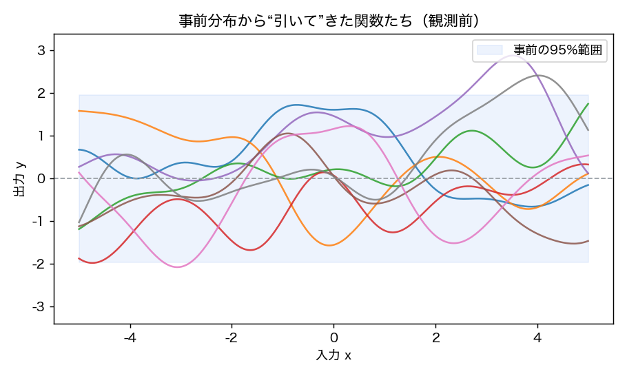
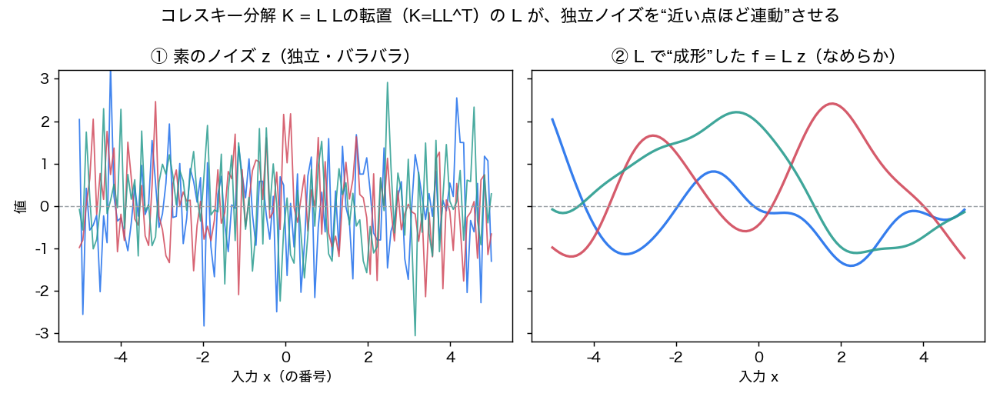
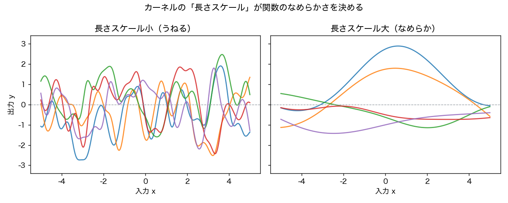
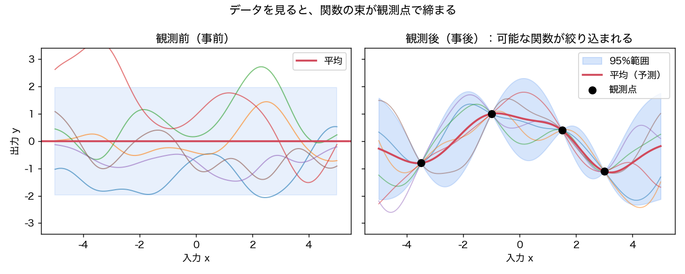

# ガウス過程、数式なしで腑に落とす

> これは「ガウス過程（GP; Gaussian Process）を数式を極力使わずに直感的に説明して」という問いへの回答記事。これまで取り込んだ GP 入門 6 本（[[sources/2019-gp-not-for-dummies]] / [[sources/2020-gp-regression-tutorial]] / [[sources/2022-gpr-part1-basics]] / [[sources/2022-gpr-part2-concrete]] / [[sources/2025-gp-intuitive-intro]] / [[sources/2021-gp-models-intro]]）と概念ページ [[gaussian-process]] を統合し、必要に応じて外部資料も参照して書き下ろした。図はこの記事のために新規作成したもの（matplotlib）と、各原典からの再掲を併用する。**式はほとんど出てこない**——絵と言葉で「GP が何をしているのか」を掴むことを目指す。

---

## 0. ひとことで言うと

ガウス過程とは、**「1 本の関数」ではなく「あり得る関数の“集まり”に確率を割り振ったもの」**である。データを見せると、その集まりの中から「データと辻褄が合う関数」だけが生き残るように更新される。そして予測のとき、ただ 1 つの答えを返すのではなく、**「だいたいこの辺り、自信のほどはこれくらい」**という“幅つきの答え”を返す。これがガウス過程の最大の魅力だ。

以下、この一文を 7 ステップに分けてほどいていく。

---

## 1. そもそもの問題：通る関数は無数にある

回帰（regression）の問題は「いくつかの観測点（下図の黒丸）を説明する関数を見つけ、まだ見ていない場所の値を予測する」こと。ところが、**同じ点を通る関数はいくらでも引ける**。下の図はどれも 4 つの黒丸を通っているが、点と点のあいだの振る舞いはバラバラだ。

<figure>

<figcaption>図1: 同じ観測点（黒丸）を通る関数は無数にある。「唯一の正解の曲線」を選ぶのは本来むずかしい。</figcaption>
</figure>

ふつうの回帰（例えば多項式フィッティング）は、この中から「いちばん良さそうな 1 本」を選んで返す。でも、ほぼ同じくらい良い候補が他にもあるのに、それらを切り捨ててよいのだろうか？ もう 1 点観測したら、捨てた中の 1 本のほうが正解に近かった、ということも起こりうる。

**ガウス過程の発想は「1 本に決めない」こと。**「どの関数もあり得る。ただし“ありそうさ”には差がある」として、関数全体に確率を割り振る。

---

## 2. 「関数の上の確率分布」とは

ふつう確率分布は「数（身長や気温）」の上に置く。ガウス過程はそれを **「関数」の上に置く**。「滑らかな関数ほど“ありそう”、ギザギザな関数は“ありそうにない”」というふうに、関数そのものに確率の重みをつけるイメージだ（この「関数の上の確率分布」を数学では確率過程と呼び、その中で扱いやすいガウス分布に限ったものがガウス過程）。

まだ何もデータを見ていない状態の重み付けを**事前分布（prior, 観測前の思い込み）**と呼ぶ。事前分布から関数を“何本か引いて”みると、下の図のようになる。中心（平均）はまっすぐ 0 で、上下に薄く広がった帯（ここでは「だいたいこの範囲に収まる」95% の幅）の中で、いろいろな滑らかな関数が揺れている。

<figure>

<figcaption>図2: 事前分布から“引いて”きた関数たち（観測前）。どれも滑らかで、薄い帯の中に収まっている。「滑らかな関数なら何でもありそう」という素朴な思い込みを表す。</figcaption>
</figure>

ポイントは、**「関数を引く（サンプリングする）」ことができる**という点。ガウス過程は、こうした関数を生み出す“くじ引き箱”だと思ってよい。

---

## 3. 正体：点で見れば、ただの「多変量正規分布」

「関数全体に確率を置く」と聞くと無限の話で難しそうだが、ここにガウス過程のいちばん賢いトリックがある。

関数を「各 $x$ での高さ（値）を並べた、とても長いベクトル」だと考える。$x$ は連続だから本当は無限に長いが、**私たちが実際に気にするのは有限個の点だけ**だ（観測した点と、予測したい点）。ガウス過程は「**どの有限個の点を取り出しても、その高さの組は“多変量正規分布（複数の数がいっしょに従う釣鐘型の分布）”に従う**」という約束になっている。

下の図は、その有名な可視化。左のように 2 次元正規分布の等高線からランダムに 1 点を選び、その 2 座標 $y_1, y_2$ を「番号 1, 2 の高さ」として右にプロットし直す。これを繰り返すと、点と点が“連動して上下する”様子が見え、だんだん「関数」に見えてくる。点の数を 2 → 5 → 20 と増やせば、なめらかな曲線に近づく。

<figure>

<figcaption>図3（再掲・出典: [[sources/2019-gp-not-for-dummies]]）: 「インデックスプロット」。多変量正規分布から取った点の各座標を“番号ごとの高さ”として描き直すと、関数のサンプルに見えてくる。</figcaption>
</figure>

つまり、**無限の関数空間を相手にしているつもりでも、計算では「いま興味のある有限個の点だけ」を多変量正規分布として扱えばよい**。これがガウス過程を「計算できるもの」にしている核心だ（残りの無限個の点は“積分して消す＝marginalization”ことで、気にしなくてよくなる）。

---

## 補足：関数を“引く”とは具体的にどうするか（サンプリングの仕組み）

§2 で「ガウス過程は関数を生み出す“くじ引き箱”」と書いた。その“くじ引き”が実際にどう行われるのかを、§3 の「有限点なら多変量正規分布」を使ってほどく。連続関数を丸ごと引くことはできないので、**描きたいグリッド点での“高さの組”を 1 つ引いて、点を線でつなぐ**——これがサンプリングの正体だ。

**事前分布から関数を 1 本引く手順（観測前）:**

1. **グリッドを決める** — 描きたい範囲に入力点 $x_1,\dots,x_n$ を等間隔に並べる（例: -5〜5 に 300 点）。
2. **連動の表を作る** — 各ペア $(x_i,x_j)$ について、カーネル（§4）の値 $k(x_i,x_j)$ を並べた**共分散行列 $K$**（点どうしの連動の強さの一覧表）を用意する。平均はふつう全点 0。
3. **$K$ を「平方根」に分解する** — $K = LL^{\top}$ となる下三角行列 $L$ を求める（**コレスキー分解**。$L$ は行列版の“平方根”のようなもの）。[[sources/2020-gp-regression-tutorial]] が紹介する標準アルゴリズム（Rasmussen 2006）の中核。
4. **素のノイズを引く** — $\mathbf{z}=(z_1,\dots,z_n)$、各 $z_i$ は独立な標準正規乱数（バラバラに揺れる“素の”ノイズ）。
5. **混ぜて完成** — $\mathbf{f}=L\mathbf{z}$（平均が 0 でなければ足す）。これがグリッド上の高さベクトル。$x_i$ に対し高さ $f_i$ を打って線でつなぐと「引いてきた関数」になる。別の $\mathbf{z}$ を引けば別の関数。

**なぜこれで“滑らかな関数”が出るのか。** $\mathbf{z}$ をそのまま並べると、隣どうしが無関係なギザギザの点列にしかならない（下図の左）。**$L$ を掛ける操作が、その独立な揺れを「近い点どうしは一緒に動く」ように相関させる“成形役”**で、結果なめらかな関数になる（下図の右、色は左右で対応）。カーネルが「どんな連動か」を $K$ に書き込み、$L$ がそれを実際の形に変換する、という分担だ。

<figure>

<figcaption>図3.5: 左＝独立でバラバラな素のノイズ z。右＝同じ z をコレスキー分解の L で“成形”した f = L z（左右で色が対応）。L が「近い点ほど連動」を与えて、ギザギザを滑らかな関数に変える。</figcaption>
</figure>

**事後分布から引くときも、まったく同じ手順。** 違うのは 2・3 で使う中身だけで、平均を**事後平均**（観測点を通るよう引き寄せられた線）に、$K$ を**事後共分散**（観測点近くで“縮んだ”もの）に差し替えてコレスキー分解する。だから事後サンプル（後の図6・図7）は観測点でほぼ一致し、遠くでばらける。

> 実務メモ: グリッド点が近いと $K$ がほぼ特異になりコレスキー分解が失敗するので、対角に微小な値 $\varepsilon I$（$10^{-6}$ 程度のジッタ）を足して安定させる（[[sources/2021-gp-models-intro]] でも言及）。コレスキーの代わりに固有値分解でも引けるが、点数が増えると計算が重い（$O(n^3)$）ため、大規模では近似サンプリングに切り替える。**この記事の図2・図4・図5・図6 は、すべてこの「$K$ を作る → コレスキー分解 → $\mathbf{f}=\boldsymbol{\mu}+L\mathbf{z}$」で描いている。**

---

## 4. カーネル：「近い入力は似た出力」という事前の信念

では「滑らかな関数ほどありそう」という思い込みは、どこに込められているのか。それが**カーネル（kernel, 共分散関数）**だ。カーネルは「**2 つの入力 $x$ と $x'$ がどれくらい“連動”するか（似た値を取りやすいか）**」を決める。

いちばんよく使われる RBF カーネル（放射基底関数、別名「二乗指数」）は、**「2 点が近いほど強く連動し（相関ほぼ 1）、離れるほど無関係になる（相関 0 に減衰）」**というシンプルなルール。これが「近所では値が急に飛ばない＝滑らか」という性質を生む。下の図は、点どうしの連動の強さを色で表したもの（対角線＝自分自身でいちばん濃く、離れるほど薄い）。

<figure>

<figcaption>図4（再掲・出典: [[sources/2025-gp-intuitive-intro]]）: RBF カーネルによる「点どうしの連動の強さ」。近い点ほど濃く（強く連動）、離れると薄い（無関係に近づく）。</figcaption>
</figure>

カーネルには“つまみ”があり、いちばん効くのが**長さスケール（lengthscale）**だ。これは「どれくらい離れたら連動が切れるか」の目安。短くすると「すぐ無関係になる」のでギザギザにうねる関数を、長くすると「遠くまで連動する」のでなめらかな関数を“ありそう”とみなす。

<figure>

<figcaption>図5: 長さスケールの効果。短い（左）と細かくうねり、長い（右）となめらかになる。「どんな関数をありそうとみなすか」をこのつまみで調整する。</figcaption>
</figure>

要するに**カーネル＝「関数についての事前の好み」を表す道具**。「滑らかさ」「周期性」「直線っぽさ」などを、カーネルの選択で表現できる（§7 で触れる）。

---

## 5. データを見る＝可能な関数を絞り込む（事前 → 事後）

いよいよ学習。といっても、ガウス過程の「学習」はパラメータを少しずつ調整することではない。**「事前分布に入っていた“あり得る関数の集まり”から、観測点と辻褄が合わない関数を消していく」**だけだ。

下の図の左が観測前（事前）。関数の束が自由に広がっている。右が数点を観測したあと（**事後分布 posterior, 観測後の更新された思い込み**）。**観測点では関数の束がギュッと締まり**（そこを通らない関数は消えた）、観測から離れた場所では相変わらず広がっている。

<figure>

<figcaption>図6: 観測前（左）と観測後（右）。データを見ると、関数の束は観測点（黒丸）で締まり、赤い線（平均＝いちばんありそうな予測）と水色の帯（95% の範囲）になる。</figcaption>
</figure>

この「絞り込み」は、§3 の多変量正規分布の言葉でいえば**条件付け（conditioning）**——「観測点での高さはこの値だった」という条件をつけて、残りの点の分布を計算し直すこと——にあたる。うれしいことに、正規分布どうしの条件付けの答えも**また正規分布**になり、ペンと紙の計算（厳密な式）で一発で求まる。少しずつ最適化する必要はない。

---

## 6. ごほうび：予測と一緒に「自信のなさ」が出てくる

ガウス過程がただの曲線当てはめと決定的に違うのは、**予測の“幅”（不確実性）が自動でついてくる**ことだ。

下の図を見てほしい。赤い線が予測（平均）、水色の帯が「だいたいこの範囲」（95% の幅）。**観測点の近くでは帯が細く（自信あり）、観測から遠ざかると帯が太くなる（自信なし）**。これは誰かが手で調整したのではなく、カーネルの「近い点は連動する」というルールから自然に出てくる。

<figure>

<figcaption>図7: 予測には“幅”がついてくる。観測の近くは細く（自信あり）、遠くは太い（自信なし）帯になる。</figcaption>
</figure>

この「自信のなさ」が正直であること（＝**較正されている**：本当に不確かな所ではちゃんと帯が広い）は実データでも確かめられる。下は実際の回帰問題（材料の強度予測）での例で、予測を大きく外しそうな点では帯が広がり、「この予測はあまり信用しないで」とモデル自身が知らせている。

<figure>

<figcaption>図8（再掲・出典: [[sources/2022-gpr-part2-concrete]]）: 実データ（コンクリート強度予測）での予測 対 真値と 95% の帯。誤差が大きい点ほど帯が広く、モデルが不確かさを“自覚”している。</figcaption>
</figure>

「点推定（1 つの値）」だけでなく「どれくらい確からしいか」まで返せることが、ガウス過程が今も重宝される最大の理由だ。

---

## 補足：予測の平均と分散はどう計算するか（条件付け）と、帯の描き方

§5・§6 で「観測点で束が締まり、平均と帯が出る」と言った。その平均と分散が**具体的にどう計算されるのか**、そして図7 のような**帯をどうやって描いているのか**をほどく。ひとことで言うと——**「周辺化」で無限を有限に落とし、「観測値で条件付け」して平均と分散を出す**（両方使う）。

**手順1：同時分布を書く（周辺化）。** §3 のとおり、GP では「どの有限個の点もまとめて多変量正規分布」。本当は入力空間に無限の点があるが、いま要るのは**観測点 $X$ と予測したいテスト点 $X_*$ だけ**。残り無限個は“積分して消える”（**周辺化**）ので、$(X, X_*)$ の有限の同時正規分布だけを考えればよい。その共分散は、訓練どうし $K=K(X,X)$、訓練×テスト $K_*=K(X,X_*)$、テストどうし $K_{**}=K(X_*,X_*)$ の 3 ブロックでできている（観測ノイズがあれば $K$ に $\sigma_n^2 I$ を足す）。

**手順2：観測値で条件付ける（ここが平均・分散の本体）。** 「訓練点での値は実際に $\mathbf{y}$ だった」という条件をつけて、テスト点の分布を計算し直す（**条件付け**）。正規分布どうしの条件付けの答えも正規分布で、**閉じた式で一発**で出る:

- **平均**（予測の中心・赤い線）：$\boldsymbol{\mu}_* = K_*^{\top}(K+\sigma_n^2 I)^{-1}\,\mathbf{y}$ ——観測 $\mathbf{y}$ の重み付き和（重みはカーネルが決める）。
- **共分散**：$\Sigma_* = K_{**} - K_*^{\top}(K+\sigma_n^2 I)^{-1}K_*$ ——事前の不確かさから「観測で減った分」を引いたもの。

未観測点 1 点 $x_*$ の分散は、この $\Sigma_*$ の対角成分にあたる。**平均も分散も $(K+\sigma_n^2 I)^{-1}$ という同じ逆行列**を使う（これが $O(n^3)$ の重さの正体）。なお**分散は観測値 $\mathbf{y}$ に依存せず入力の配置だけで決まる**——だから「どこが不確かか」は値を見る前から分かる（§7 の能動学習の根拠）。

> 「周辺化か条件付けか？」の答えは**両方**。周辺化は「無限を有限の同時分布に落とす土台」、条件付けは「その上で平均・分散を出す本体」。予測の点推定として平均 $\boldsymbol{\mu}_*$ をそのまま使うのは MAP（最大事後）推定にあたる。

**手順3：帯を描く（点ごとに計算）。** 図7 のような帯は、**プロット範囲に等間隔のテスト点グリッドを多数取り、各点で上の式を計算**して描く。実際にこの記事の図を描いたスクリプトでは `np.linspace(-5, 5, 300)`（300 点、間隔 ≈ 0.033）を使った。各グリッド点で平均 $\mu(x_*)$ と標準偏差 $\sigma(x_*)=\sqrt{\Sigma_*\text{の対角}}$ を求め、$\mu(x_*) \pm 1.96\,\sigma(x_*)$（正規分布は ±1.96σ の中に 95%）を塗りつぶしで繋ぐ。グリッドが細かいほど帯はなめらかに見える（精度が上がるわけではなく、見た目だけ）。

ここで大事な区別が 2 つ:

- **帯は「点ごと（周辺）の 95% 区間」**。各 $x$ で独立に「その点の値が 95% でこの範囲」を表すだけで、「関数全体がまるごとこの帯に収まる確率が 95%」という**同時帯ではない**。各点で対角分散だけを使って描いているからだ。
- **帯を描くだけなら対角分散（各点の分散）で足りる**が、§2・§5 のような**関数の標本を 1 本引く**ときは点どうしの相関を含む**フル共分散 $\Sigma_*$** が要る（前の補足のコレスキー分解で $\boldsymbol{\mu}_* + L\mathbf{z}$ として引く）。図7 の帯は前者、図2・図4 の細い曲線は後者。

---

## 7. 使いどころと、気をつけること

**カーネルを選ぶ＝事前の信念を選ぶ。** 直線っぽさを表す線形カーネル、滑らかさを表す RBF カーネル、周期性を表す周期カーネルなどがあり、足したり掛けたりして組み合わせられる。下の図は「線形だけ（単純すぎて当たらない＝未学習）」「RBF だけ（ノイズに引っぱられすぎ＝過学習気味で外側が苦手）」「線形＋RBF（バランス良）」の比較。**カーネル選びは、ガウス過程でいちばん腕が出るところ**だ。

<figure>

<figcaption>図9（再掲・出典: [[sources/2022-gpr-part1-basics]]）: カーネルによる予測の違い。線形（緑）＝単純すぎ、RBF（赤）＝外側が苦手、線形＋RBF の和（紫）＝バランス良。各曲線に 95% の帯がつく。</figcaption>
</figure>

**「自信のなさ」は次の一手を選ぶのにも使える。** いちばん不確かな場所を狙って次のデータを取れば、少ない観測で効率よく関数の形を掴める（これは能動学習や、未知関数の最適化＝ベイズ最適化の発想につながる）。下のアニメは「最も不確かな点」を順に選んでいく様子。

<figure>

<figcaption>図10（再掲・出典: [[sources/2025-gp-intuitive-intro]]）: 最も不確かな点を優先して観測すると、少ないサンプルで効率よく当てはまる。</figcaption>
</figure>

気をつけることも 3 つ。

- **データが増えると重くなる。** ガウス過程は観測点どうしの関係をすべて見るため、点が増えると計算量が急に膨らむ（おおまかに「点の数の 3 乗」のオーダー）。大規模データには工夫（スパース近似など）が要る。
- **「定常性」の仮定。** RBF のような標準的カーネルは「場所が変わっても性質は同じ」と仮定する。株価のように時期で性質がガラッと変わるデータは、素直には扱いにくい。
- **カーネル選びに敏感。** 事前の好み（カーネル）が外れていると、予測も帯もずれる。問題に合うカーネルを選ぶこと自体が腕の見せどころになる。

---

## 8. まとめ

- ガウス過程は **「あり得る関数の集まりに確率を置いたもの」**。1 本に決めず、束で考える。
- カーネルが **「どんな関数をありそうとみなすか（滑らかさなど）」** を決める＝事前の信念。
- データを見ると、辻褄の合わない関数が消え（**事前 → 事後**）、観測点で束が締まる。
- 予測は **平均（いちばんありそうな線）＋幅（自信のなさ）** のセットで返る。観測の近くは細く、遠くは太い。
- 強み＝**較正された不確実性**。弱み＝**データ増で重い・定常性の仮定・カーネル依存**。

> もう少しだけ踏み込みたい人へ（式は最小限）。ガウス過程は「平均関数（ふつう 0）」と「カーネル」の 2 つだけで決まる。学習は“最適化”ではなく、観測点で**条件付け**して事後の平均と分散を求めるだけ（正規分布どうしなので答えも正規分布で、閉じた式で一発）。厳密な予測式や、カーネルの“つまみ”を周辺尤度で選ぶ話は [[sources/2020-gp-regression-tutorial]]（体系的）や [[sources/2021-gp-models-intro]]（上級・再生核ヒルベルト空間や誤差の保証まで）にある。

---

## もっと読む

レベル別に、この wiki 内の GP 解説。

- 直感を絵で掴む: [[sources/2019-gp-not-for-dummies]]（インデックスプロット）・[[sources/2025-gp-intuitive-intro]]（ノンパラメトリック性／ニューラルネットとの関係）
- 体系的な入門（式つき）: [[sources/2020-gp-regression-tutorial]]
- 実際に手を動かす: [[sources/2022-gpr-part1-basics]]（カーネル選択・ハイパラ調整）・[[sources/2022-gpr-part2-concrete]]（実データ応用＋解釈）
- 理論を厳密に: [[sources/2021-gp-models-intro]]（RKHS・モデル誤差の保証・GP 動的モデル）
- 概念ハブ: [[gaussian-process]]

## 参考にした外部資料（web）

- Görtler, Kehlbeck, Deussen, "A Visual Exploration of Gaussian Processes", Distill, 2019. <https://distill.pub/2019/visual-exploration-gaussian-processes/> — 多変量正規分布の「周辺化＝次元に沿って積分」「条件付け＝分布を切る」、カーネル＝類似度という直感（§3〜5 の説明の下敷き）。

> 注: 図1・図2・図3.5・図5・図6・図7 はこの記事のために新規作成（matplotlib、1 次元 RBF カーネルの素朴なガウス過程）。図3・図4・図8・図9・図10 は wiki 内 source からの再掲（各キャプションに出典）。Distill の図は引用せず、発想のみ参考にして自作した。
