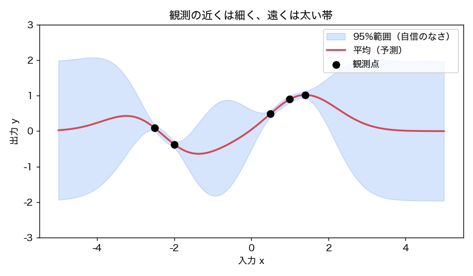
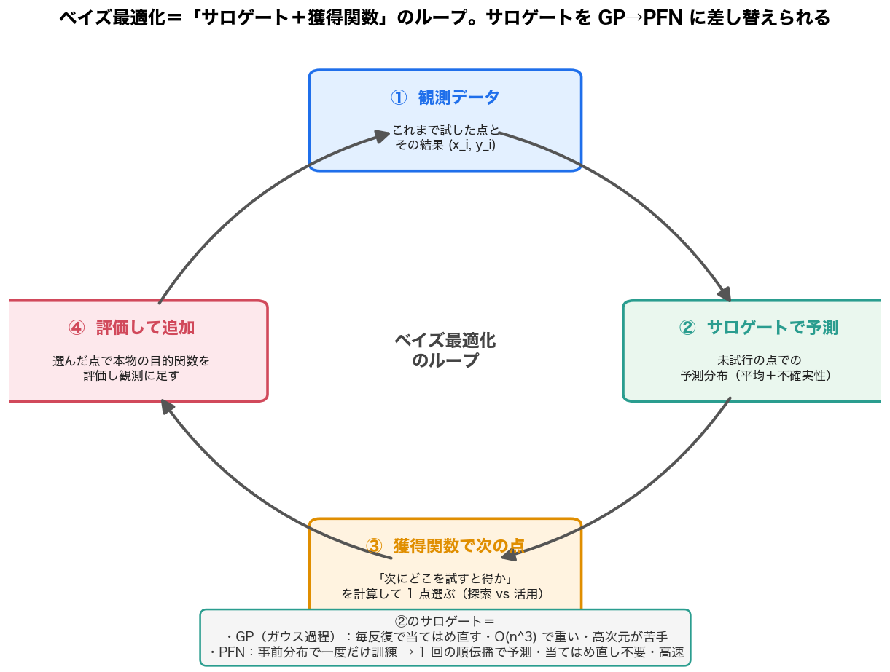

# PFN とベイズ最適化の関係——初心者向け解説

> 「PFN（Prior-Data Fitted Network）とベイズ最適化はどう関係するの？」への、図中心の入門記事。ひとことで言うと——**ベイズ最適化の“心臓”であるサロゲート（代理モデル）を、これまでのガウス過程（GP）から PFN に差し替えられる**、というのが両者の関係です。専門用語は初出で説明します。深掘りは各リンク先へ。

## 0. ひとことで

- **ベイズ最適化（BO; Bayesian Optimization）** ＝「試すのが高コストな関数を、なるべく少ない試行で“いちばん良い設定”を見つける」方法。
- その中身は **「サロゲート（代理モデル）＋獲得関数」のループ**。
- 従来サロゲートは **GP（ガウス過程）** だったが、$O(n^3)$ で重い・毎回当てはめ直す・高次元が苦手、という弱点がある。
- **PFN** は「事前分布から作った合成データで一度だけ訓練しておき、推論は 1 回の順伝播で予測分布を返す」モデル。これを**サロゲートに差し替える**と、当てはめ直し不要・高速で、GP では難しいこともできる。
- 代表例：低次元なら **PFNs4BO**、高次元（100〜500 次元）なら **GIT-BO**。

---

## 1. ベイズ最適化（BO）とは：少ない回数で“当たり”を探す

世の中には「1 回試すのにすごくコストがかかる」関数があります。例えば——

- 機械学習モデルの**ハイパーパラメータ調整**（1 回の学習に数時間）
- **材料・創薬**の実験（1 回の実験に時間とお金）
- **工学設計**（1 回のシミュレーションが重い）

こういう「ブラックボックス（中身が分からない）で・評価が高コスト・ノイズもある」関数を、**できるだけ少ない試行回数で最適化**するのがベイズ最適化です。中身を仮定せず、これまでの観測から「次にどこを試すと得か」を賢く選んでいきます。体系的な入門は [[sources/2018-bayesian-optimization-tutorial]]（Frazier のチュートリアル）。

<figure>

<figcaption>図1（再掲・出典: [[sources/2018-bayesian-optimization-tutorial]]）: BO の 1 ステップ。上：3 点の観測（青）と、サロゲートが出した予測（赤線＝平均、赤破線＝信頼幅）。下：獲得関数。次はこの獲得関数が最大の点（×）を試す。</figcaption>
</figure>

## 2. サロゲートと獲得関数：BO の心臓

BO は次の 2 つの部品を交互に回す**ループ**です。

1. **サロゲート（surrogate, 代理モデル）**：これまでの観測から、**まだ試していない点での“予測分布”（予測の中心＝平均と、どれくらい不確かか＝不確実性）**を出す。本物の関数の代わりに使う安い見積もりモデル。
2. **獲得関数（acquisition function）**：その予測分布をもとに「**次にどこを試すと最も得か**」をスカラーで測る。安く計算でき、これが最大の点を次に試す。

獲得関数のキモは **探索 vs 活用（exploration vs exploitation）** のバランス——「不確かで未知の場所を試して情報を得る」か「期待値の高い既知の良い場所を攻める」か。代表が **EI（Expected Improvement, 期待改善）** です。

<figure>

<figcaption>図2（再掲・出典: [[questions/gaussian-process-intuitive-explainer]]）: サロゲートの予測分布の例。赤線＝平均、水色帯＝不確実性（95%）。観測の近くは細く・遠くは太い。獲得関数はこの「平均」と「不確実性」を入力に「次にどこを試すか」を決める。</figcaption>
</figure>

## 3. これまでのサロゲートは GP（ガウス過程）。その弱点

長らくサロゲートの定番は **GP（ガウス過程, [[gaussian-process]]）** でした。GP は観測から**予測平均と信頼幅を綺麗に出せる**ので、BO と相性が良かったのです。でも弱点があります。

- **重い**：データ点が増えると計算が「点の数の 3 乗（$O(n^3)$）」で膨らむ。
- **毎回当てはめ直す**：反復のたびにカーネル（GP の“事前の好み”）のハイパーパラメータを当てはめ直す（経験ベイズ）。
- **高次元が苦手**：扱う変数が 100 を超えると「次元の呪い」で急に苦しくなる。
- **表せる事前分布が限られる**：GP は「カーネルで書ける滑らかさ」しか表現できず、カテゴリ・階層構造などは入れにくい。

## 4. PFN とは：1 回の順伝播で予測分布を返す

**PFN（Prior-Data Fitted Network）** は、ここ数年の新しい考え方です（[[prior-data-fitted-networks]]）。

- **事前分布（＝どんな関数があり得るかの仮定）から合成データを大量に作り、Transformer を一度だけ訓練**しておく。
- 推論時は、観測データを**文脈として丸ごと入力するだけ**で、**重み更新なし・1 回の順伝播で予測分布**（平均と不確実性）を返す（これを [[in-context-learning|文脈内学習]] と呼ぶ）。

つまり PFN も GP と同じ「平均＋不確実性」を出せますが、**当てはめ直しが要らず高速**で、事前分布は「サンプリングできれば何でも書ける」自由度があります。GP との関係をもっと知るには [[questions/pfn-paper-and-gaussian-process]]。

<figure>

<figcaption>図3（再掲・出典: [[questions/pfn-paper-and-gaussian-process]]）: PFN の使い方。①設計者が事前分布を選ぶ →②合成データを大量生成 →③一度だけ事前訓練 →④推論は文脈＋クエリを 1 回の順伝播で予測分布に。</figcaption>
</figure>

## 5. PFN を BO のサロゲートに使う＝関係の核心

ここが本題です。**BO のループの“サロゲート”の部分を、GP から PFN に差し替えるだけ**——これが PFN とベイズ最適化の関係です。

<figure>

<figcaption>図4: ベイズ最適化のループ（①観測 →②サロゲートで予測 →③獲得関数で次の点 →④評価して追加 →①…）。②のサロゲートを GP の代わりに PFN にできる。GP は毎反復で当てはめ直し（O(n^3)）だが、PFN は事前分布で一度訓練しておけば 1 回の順伝播で予測でき、当てはめ直しが要らない。</figcaption>
</figure>

差し替えると、こんな良いことがあります。

- **再訓練不要で高速**：PFN は事前訓練済みなので、反復のたびに当てはめ直す必要がない。観測を文脈として渡すだけ。
- **獲得関数はそのまま使える**：PFN が出す予測分布（連続値の回帰では**リーマン分布**＝ヒストグラム型。→ [[questions/riemann-distribution-buckets]]）から、EI・PI・UCB といった獲得関数を計算できる。
- **事前分布を自由に書ける**：GP のカーネルでは表しにくい“好み”も、PFN なら事前分布として書き込める。

なお「PFN が GP のベイズ推論をちゃんと近似できる」ことは PFN 原典（[[sources/2021-transformers-can-do-bayesian-inference]]）が示しており、これが「GP の代わりに使える」根拠になっています。

## 6. 代表例（簡潔に）

**PFNs4BO（低次元 BO）** — [[sources/2023-pfns4bo]]（PFN 原典と同じグループ）。PFN を **GP の「ベイズ的ドロップイン置換」** として BO に据えた最初の本格例。固定 GP の事後をほぼ厳密に再現しつつ、**GP では入れにくい拡張**——最適解の位置のヒント（ユーザー事前分布）・出力に効かない無関係次元の無視・将来を見据えた非近視眼的獲得関数（知識勾配）——を「事前分布を書くだけ」で実現し、ハイパラ最適化ベンチで GP ベースの最強手法（HEBO）を上回りました。

**GIT-BO（高次元 BO, 100〜500 次元）** — [[sources/2025-git-bo]]（MIT）。**TabPFN v2**（表形式の PFN）をサロゲートに使う。固定モデルなので GP のように「探索方向」を適応できない弱点があるが、GIT-BO は **TabPFN の順伝播の勾配から“探索すべき低次元の部分空間”を毎反復つくり直す**ことでこれを補い、GP ベースの高次元 BO 手法を **2 桁速く**凌駕しました。

<figure>

<figcaption>図5（再掲・出典: [[sources/2025-git-bo]]）: GIT-BO のアブレーション。勾配で部分空間を作らない“素の”TabPFN v2 を BO に使うと高次元で大きく失敗（GIT-BO がリグレットで 8.6 倍良い）。「PFN をサロゲートに置くだけ」では不十分で、高次元では工夫（部分空間）が要ることを示す。</figcaption>
</figure>

## 7. GP サロゲート vs PFN サロゲート（比較）

| 観点 | GP サロゲート（従来） | PFN サロゲート（新しい） |
|---|---|---|
| 反復ごとの当てはめ | **毎回**カーネルを当てはめ直す | **不要**（事前訓練済み、文脈を渡すだけ） |
| 速度 | データ増で $O(n^3)$ と重い | 1 回の順伝播で高速 |
| 事前分布の自由度 | カーネルで書けるものに限る | サンプリングできれば**何でも書ける** |
| 高次元（>100） | 苦手（次元の呪い） | 工夫つきで対応（GIT-BO の部分空間）。素のままは苦手 |
| 不確実性 | 閉形式で厳密 | 学習された近似（較正は良好） |
| 成熟度・実績 | 長年の蓄積・理論が厚い | 新しい。GPU 前提・次元上限などの制約あり |

> 大事なのは、これは**対立ではなく差し替え**だということ。BO の枠組み（サロゲート＋獲得関数）はそのままで、サロゲートの“中身”を GP から PFN に替えられる、という関係です。

## 8. まとめ

- ベイズ最適化＝**「サロゲート＋獲得関数」のループ**で、高コストな関数を少ない試行で最適化する。
- そのサロゲートを、従来の **GP** から **PFN** に**差し替えられる**——これが PFN とベイズ最適化の関係。
- PFN サロゲートの利点＝**当てはめ直し不要・高速・事前分布が自由**。獲得関数は PFN の予測分布から計算する。
- 代表例＝**PFNs4BO**（低次元・GP の置換＋GP では難しい拡張）、**GIT-BO**（高次元・勾配で部分空間を作る）。

## もっと読む

- [[bayesian-optimization]] — ベイズ最適化の概念（サロゲート＋獲得関数・EI/KG/ES）
- [[prior-data-fitted-networks]] — PFN の概念（事前分布を焼き込み・ICL 推論）
- [[sources/2018-bayesian-optimization-tutorial]] — BO の体系的入門（Frazier）
- [[sources/2023-pfns4bo]] — PFN を BO サロゲートに（低次元・ユーザー事前分布・非近視眼）
- [[sources/2025-git-bo]] — TabPFNv2 を高次元 BO サロゲートに（勾配誘導部分空間）
- [[questions/pfn-paper-and-gaussian-process]] — PFN と GP の関係（GP の置き換え・出力の仕組み）
- [[questions/riemann-distribution-buckets]] — PFN の予測分布（リーマン分布）と、そこから平均・分散・区間を得る話

## 用語と略称

- **BO** = Bayesian Optimization（ベイズ最適化）→ [[bayesian-optimization]]
- **PFN** = Prior-Data Fitted Network（事前分布の合成データで一度訓練し、推論は文脈内学習で行う枠組み）→ [[prior-data-fitted-networks]]
- **GP** = Gaussian Process（ガウス過程。従来のサロゲート）→ [[gaussian-process]]
- **サロゲート（surrogate）** = 高コストな目的関数の代わりに使う安い予測モデル（予測分布を出す）
- **獲得関数（acquisition function）** = 「次にどこを試すと得か」を測る関数。EI（期待改善）など
- **ICL** = In-Context Learning（文脈内学習。推論時に重み更新なしで文脈から予測）→ [[in-context-learning]]
- **PFNs4BO / GIT-BO** = PFN を BO サロゲートに使う代表手法（低次元 / 高次元）
- **PPD / 予測分布** = 観測を条件にした予測の分布（平均と不確実性）→ [[bayesian-inference]]
