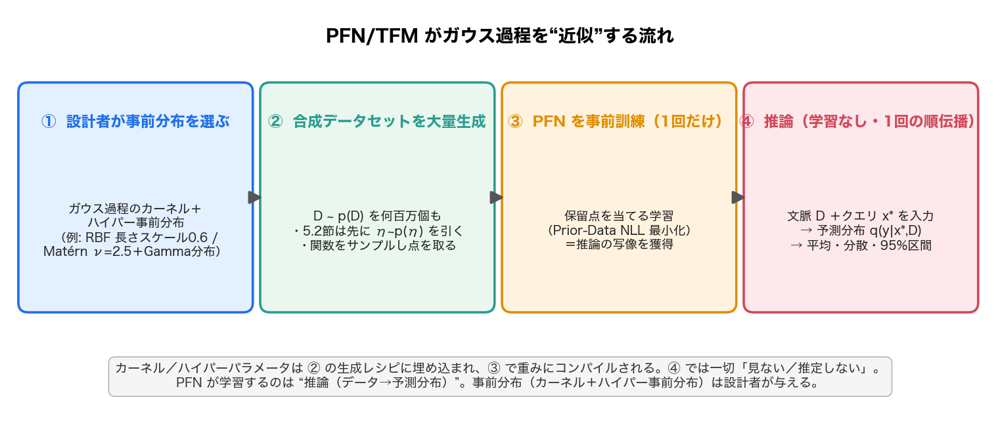

# PFN 原典とガウス過程の関係

> 問い「PFN の論文とガウス過程の関係を教えてください」への回答。PFN 原典＝[[sources/2021-transformers-can-do-bayesian-inference]]（Müller et al. 2021, ICLR 2022「Transformers Can Do Bayesian Inference」）と、ガウス過程（GP; Gaussian Process, [[gaussian-process]]）の関係を、原典 source・[[prior-data-fitted-networks]]・[[bayesian-inference]] を統合して整理する。

## 一言で

ガウス過程は PFN 原典にとって、**(1) PFN の近似が正しいかを測る「物差し」**であり、**(2) PFN に与える「事前分布（データ生成器）」の素材**でもあり、そして**(3) GP が解析的に解けなくなる場面でこそ PFN が高速に肩代わりする相手**でもある。要するに PFN は GP を **模倣の対象**にも **事前分布の素材**にもでき、GP の弱点を **償却（amortize）** で埋める。

前提として、PFN は「データセット $\mathcal{D}$ を条件にテスト点のラベル分布＝**事後予測分布（PPD; posterior predictive distribution, 訓練データを所与としたテスト点の予測分布）**」を Transformer の 1 回の順伝播で近似する枠組み（[[prior-data-fitted-networks]] / [[bayesian-inference]]）。PPD は一般に解析的に解けないが、**GP はその PPD が閉形式で厳密に解ける数少ない例**——この性質が以下の関係すべての土台になる。

## 関係1: GP は PFN の正しさを測る「物差し」

PPD がほとんどの事前分布で解けない以上、「PFN の近似がどれだけ正しいか」を厳密に検証するのは難しい。ところが**固定ハイパーパラメータの GP は PPD が閉形式で厳密に求まる**。そこで原典は、GP 事前分布から合成データを引いて PFN を訓練し、その出力を**厳密 GP の真値と直接突き合わせた**。

- PFN の予測平均・95% 信頼区間は厳密 GP とほぼ区別がつかない（原典 図3）。
- メタ訓練データセットを増やすほど真値に近づく（過適合の概念がなく、訓練するほど較正も良くなる）。
- 同じ設定で Attentive Neural Processes より明確に優れる。

これが論文題名「Transformers Can Do Bayesian Inference（Transformer はベイズ推論ができる）」の最も直接的な実証になっている。

## 関係2: GP は PFN に与える「事前分布（データ生成器）」の素材

PFN の設計思想は、「学習アルゴリズムを設計する」のではなく「**事前分布＝データ生成器を書く**」だけでベイズ予測器を得ること。要件は「事前分布からサンプリングできる」という非常に弱い条件だけ。**GP 自体をそのデータ生成器として使える**。

- 原典の表形式分類実験では、GP 事前分布（と、層数・幅・活性化まで積分するアーキテクチャ上の BNN 事前分布）で PFN を訓練している。
- これは後継の [[sources/2022-tabpfn]] における GP ベースの分類事前分布（PFN-GP；ターゲットの中央値でクラス分けして二値化）に連なる。
- つまり GP は「PFN がそこから世界を学ぶ事前分布のカタログ」の一項目でもある（[[structural-causal-model]] ベースの事前分布と並ぶ選択肢）。

## 関係3: GP が「扱いにくくなる」場面でこそ PFN が効く（高速な償却近似）

GP の PPD が閉形式で解けるのは**ハイパーパラメータを固定したとき**だけ。現実的にはカーネルのスケールや長さスケールに**ハイパー事前分布**を置いて積分したいが、そうすると PPD はもう解析的に解けず、従来は MLE-II（ハイパラの最大事後推定）や MCMC（NUTS）/ 変分推論（SVI）で近似していた——いずれも遅く、データセットごとに高コスト。

PFN はこの扱いにくいケースでこそ威力を発揮する。

- ハイパー事前分布付き GP: **MLE-II より 200 倍以上、NUTS より 1000〜8000 倍速く**、真の PPD に最も近い近似。
- ベイズニューラルネット（BNN）でも同等性能を **SVI より 1000 倍、NUTS より 10000 倍速く**達成。

「事前計算（事前分布での一括訓練）で個々の推論を安価にする」のが**償却（amortize）**。GP は推論のたびにカーネル計算をやり直すが、PFN は一度訓練すれば任意のデータセットを順伝播一発で処理する。

## 深掘り1: TFM/PFN は平均・分散をどう出力するのか

「観測データ $(x_1,y_1)\dots(x_n,y_n)$ を文脈に与えると、未観測点の平均と分散が出るのか？」——**出ます**。ただし出力の形は「平均と分散の 2 値」ではなく、**予測分布そのもの**で、平均・分散はそこから読み取る。

- **入力**: 文脈データセット $D=\{(x_i,y_i)\}$ ＋ クエリの**入力** $x_*$（$y_*$ は与えない＝これが予測したいもの）。
- **出力**: クエリのラベル $y$ の予測分布 $q_\theta(y\mid x_*, D)$ を、**1 回の順伝播**で。推論時に勾配学習はしない＝大規模言語モデルと同じ [[in-context-learning]]（文脈内学習）の構図。
- **連続値の回帰**は、出力範囲を等確率バケットに区切った **リーマン分布（Riemann distribution, バケット化したヒストグラム型の予測分布）** で表す。この分布から**平均・分散・任意の分位点・95% 区間**を計算できる。図の「帯」はこの予測分布から[[questions/gaussian-process-intuitive-explainer|点ごと]]に作ったもの（クエリ点ごとに独立に予測分布が出る）。
- 真の事後がガウスになる固定 GP（§5.1）では、この予測分布が**厳密 GP のガウス事後にほぼ一致**し、平均・95% 信頼区間が重なる（原典 図3）。表形式特化の TabPFN v2（[[sources/2025-tabpfn-v2]]）も、分類はクラス確率、回帰は予測分布を同様に 1 回の順伝播で出す。

つまり「平均・分散を出せるか」への答えは **「予測分布を出し、そこから平均・分散・区間が得られる」**。GP が条件付けで $\mu_*, \sigma_*$ を計算するのと同じ役割を、PFN は学習済みの順伝播で果たす。

## 深掘り2: では GP のカーネルとハイパーパラメータはどこへ？（PFN は何を学習するのか）

「PFN は事前分布を学習で獲得するのに、GP の事前分布＝カーネル＋ハイパラはどう近似されている？」——ここが最大の誤解ポイント。**正確には、PFN は事前分布を“学習”しない**。

> **PFN が学習するのは「推論（データセット → 予測分布 PPD の写像）」。事前分布（カーネル形＋ハイパー事前分布）は設計者が選んで“合成データ生成器”として与える、固定の設計物。** カーネル/ハイパラは PFN の入力でも、テスト時の推定対象でもない。

<figure>

<figcaption>図: PFN/TFM がガウス過程を“近似”する流れ。①設計者が事前分布（カーネル＋ハイパー事前分布）を選ぶ → ②合成データセットを大量生成 → ③PFN を 1 回だけ事前訓練（推論の写像を獲得）→ ④推論は文脈＋クエリの 1 回の順伝播で予測分布。カーネル/ハイパラは②に埋め込まれ③で重みにコンパイルされ、④では見ない／推定しない。</figcaption>
</figure>

**§5.1（固定カーネル）の場合.** 設計者が GP を 1 つ固定する（原典 付録F: RBF カーネル・長さスケール 0.6・出力スケール 1・対角ノイズ 1e-4）。訓練データは「入力 $x_i$ を一様サンプル → 共分散行列 $K_{ij}=k(x_i,x_j)$ → $\mathbf{y}\sim\mathcal{N}(\mathbf{0},K)$」で何百万個も生成し、保留点予測で PFN を訓練する。**カーネルの効果（共分散構造・長さスケール由来の滑らかさ）は、生成された訓練データの統計を通じて PFN の重みに暗黙にコンパイルされる**。PFN は推論時に $k(x_*,X)$ を陽に計算するのではなく、「この種の GP から来た文脈なら予測はこう」を学んでいる。表現力が十分なら最適解は**厳密 GP 事後に一致**する（原典 系1.2）。

**§5.2（ハイパー事前分布）の場合.** ハイパラ自体に分布を置く（原典 付録F: Matérn ν=2.5、長さスケール・出力スケール・ノイズをそれぞれ Gamma 分布から）。データセット生成時に**まず $\eta\sim p(\eta)$ を引いてから**関数をサンプルする。すると PFN は**ハイパラ上の積分（周辺化）を学習で内在化**し、推論時には「ハイパー事前分布で積分した PPD」を 1 回の順伝播で返す。これは MLE-II（ハイパラの点推定）や NUTS（サンプリング）が遅く近似していた量そのもので、PFN は **テストデータごとに $\eta$ を推定するのではなく**「文脈と整合する尤もらしい $\eta$ を平均する」を学習済みの重みで実行する。だから精度で上回りつつ MLE-II 比 200 倍・NUTS 比 1000〜8000 倍速い（関係3）。

**まとめ.** GP の「事前分布＝カーネル＋ハイパラ」は、PFN では **②データ生成のレシピに化け → ③事前訓練で重みに焼き込まれ → ④推論時には一切見ない／推定しない**。だから「PFN がカーネルを近似している」のではなく、**「設計者が選んだカーネルが定める“正しい推論”を、PFN がデータ駆動で再現できるようになっている」**のが正しいイメージ。GP の事前分布を別のもの（[[structural-causal-model]] ベースなど）に差し替えれば、同じ PFN の枠組みで別の推論器が得られる。

## GP と PFN の比較表

| 観点 | ガウス過程（GP） | Prior-Data Fitted Network（PFN） |
| --- | --- | --- |
| 何の上の分布か | 関数そのものの上の分布（カーネルで規定） | PPD（事後予測分布）を**直接**出力 |
| 推論の方法 | 観測点での**条件付け**＝厳密なカーネル計算（行列演算） | 訓練済み Transformer の**1 回の順伝播**（重み更新なし＝[[in-context-learning]]） |
| 事前分布の表現 | カーネル関数（滑らかさ・周期性などに限られる） | **サンプリングさえできれば任意**の生成器（GP・BNN・[[structural-causal-model]] 等） |
| 不確実性 | 閉形式で厳密（固定ハイパラ時） | 学習された近似（訓練するほど真の PPD に近づく・較正良好） |
| 学習 | 事前学習は不要（ハイパラは周辺尤度で最適化） | 事前分布の合成データで**一度だけ大規模に事前訓練** |
| 計算コスト | データ点数の 3 乗オーダー（$O(n^3)$）。**PPD が解けない事前分布は困難** | 事前訓練は重いが**推論は高速**。扱いにくい事前分布も近似可（GP 比 200〜10000 倍速） |
| 適用範囲（原典時点） | 連続関数の回帰など。次元・規模に制約 | 小規模な表形式分類・回帰・few-shot（後に [[tabular-foundation-model]] で大規模化） |

> 注: 表は PFN 原典時点の比較。GP と PFN は対立ではなく**補完的**——PFN は GP を物差しにし、事前分布に使い、GP が苦しむ所を肩代わりする。

## PFN 文脈での含意

- **設計パラダイムの転換**: 「学習則を書く」→「事前分布（データ生成器）を書く」。GP はその事前分布の代表例であり、同時に「正解（厳密 PPD）が分かる検証台」でもある稀有な存在。
- **GP の弱点の裏返し**: GP の $O(n^3)$ コストと「解ける事前分布の狭さ」という制約が、PFN（償却近似）の存在意義を際立たせる。
- **GP の他用途との接続**: GP は[[bayesian-optimization|ベイズ最適化]]のサロゲート（代理モデル）としても最重要だが、その $O(n^3)$ 制約ゆえ、PFN 系（[[tabular-foundation-model]]）が高速サロゲートとして GP を置き換えうる、という発展もある（GIT-BO が TabPFNv2 を採用）。

## 用語と略称

- **PFN** = Prior-(Data) Fitted Network（事前データ当てはめネットワーク）→ [[prior-data-fitted-networks]]
- **GP** = Gaussian Process（ガウス過程）→ [[gaussian-process]]
- **PPD** = Posterior Predictive Distribution（事後予測分布）→ [[bayesian-inference]]
- **amortize（償却）** = 事前の一括計算で個別推論を安価にすること
- **MLE-II** = ハイパーパラメータの最大（事後）尤度推定
- **MCMC / NUTS** = マルコフ連鎖モンテカルロ／No-U-Turn Sampler（事後分布の標準的サンプリング近似）
- **VI / SVI** = 変分推論／確率的変分推論
- **BNN** = Bayesian Neural Network（重みを分布として扱うニューラルネット）
- **ICL** = In-Context Learning（文脈内学習。推論時に重み更新なしで文脈から予測）→ [[in-context-learning]]
- **リーマン分布（Riemann distribution）** = 出力範囲を等確率バケットに区切ったヒストグラム型の予測分布。連続値の回帰を分類に変換し、平均・分散・分位点を読み取れる
- **ハイパー事前分布（hyper-prior）** = カーネルのハイパーパラメータ自体に置く分布。PFN はこれをデータ生成で取り込み、推論時に周辺化（積分）を学習で代行する

## 関連ページ

- [[sources/2021-transformers-can-do-bayesian-inference]] — PFN の原典（GP を物差し・事前分布に使用）
- [[gaussian-process]] — GP 概念ハブ（「なぜ PFN の文脈で重要か」節に同主旨の整理）
- [[prior-data-fitted-networks]] — PFN の中核概念
- [[bayesian-inference]] — 近似対象である PPD の理論的背景
- [[sources/2022-tabpfn]] — GP ベースの分類事前分布（PFN-GP）を持つ後継
- [[questions/gaussian-process-intuitive-explainer]] — GP 側の直感（事前→事後・不確実性）の説明記事
- [[bayesian-optimization]] — GP の代表的応用（PFN がサロゲートを置き換えうる）
