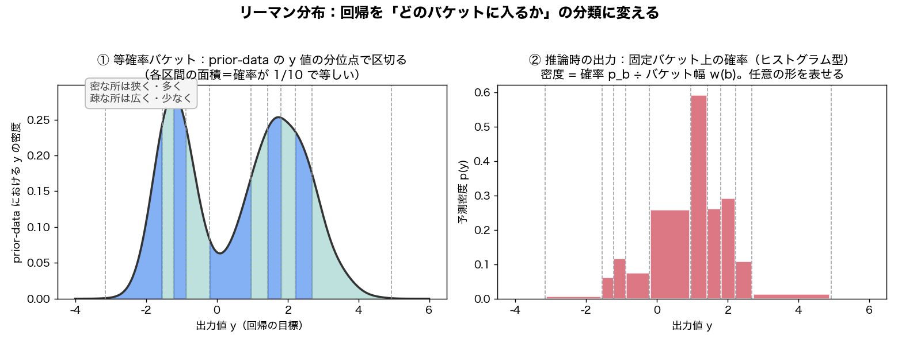

# リーマン分布：回帰を「どのバケットに入るか」の分類に変える

> 問い: [[sources/2021-transformers-can-do-bayesian-inference]] の「リーマン分布は prior-data 上で等確率になるようバケットに離散化する」が分からない。prior-data とは？ バケットとは？ への回答。原典の付録 E.2、より噛み砕いた [[sources/2025-mitra]] 付録 E.1、[[sources/2023-pfns4bo]] §3.4 を統合。

## 一言で

**リーマン分布（Riemann distribution）は、PFN が回帰の予測分布を出すための「ヒストグラム型の予測ヘッド」**。連続値の y 軸を区間（＝**バケット/ビン**）に区切り、「どの区間に入るか」の確率を出すことで、**回帰を分類問題に変換**する。バケットの境界は、**事前分布から作った合成訓練データ（＝prior-data）の分位点**に置くので、各バケットに同じ量のデータが入る（＝等確率）。これにより、どんな形の予測分布でも表せる。

## なぜリーマン分布が要るのか

PFN が出力するのは「テスト点のラベルの**分布**」（事後予測分布 PPD、[[bayesian-inference]]）。分類なら「各クラスの確率」をソフトマックスで出せばよいが、**回帰は出力が連続値**なので「分布の形」をニューラルネットで直接出すのが難しい。

そこで発想を変える——**回帰を分類に変換する**。y 軸（出力値の範囲）を細かい区間に区切り、「どの区間に入るか」の確率を予測すれば、回帰も分類と同じ枠組みで扱える。これがリーマン分布で、分布型強化学習（Bellemare 2017）に着想を得ており「ニューラルネットは分類が得意」という性質を活かす。古典的な回帰ヘッド（平均1点や平均＋分散のガウス）より明確に有利だと示されている。

## バケット（bucket）とは

**y 軸を区切った区間（ビン）**＝ヒストグラムの「棒1本ぶんの横幅」。

- 出力範囲 $[a,b]$ を、重なりなく隙間なく $|\mathbf{B}|$ 個の区間に分割する。
- モデルは各バケット $b$ に**確率 $p_b$**（そのバケットに入る確率）を出力する。全バケットの確率の和は 1。
- 見た目は**ヒストグラム型の予測分布**＝「区分定数分布（piece-wise constant）」（各バケット内では密度が一定）。

密度として書くと（原典 付録 E.2）:

$$
p(y) = \frac{p_{b(y)}}{w(b(y))}
$$

$b(y)$ は $y$ が属するバケット、$w(b)$ はそのバケットの**幅**。モデルが出すのは「バケットに入る確率 $p_b$」だが、知りたいのは「点 $y$ での密度」なので、**幅で割って密度に直す**（広いバケットほど密度は薄まる）。

## prior-data とは

**事前分布から人工生成した合成データセット**のこと。PFN の訓練（事前当てはめ／prior-fitting）では、事前分布 $p(\mathcal{D})$ からデータセットを大量にサンプリングして「保留点を当てる」訓練をする（[[prior-data-fitted-networks]]）。この**訓練に使う合成データ全体**が prior-data。要するに「PFN がそこから世界を学ぶ、事前分布が吐き出した合成データ」。

## 核心：「prior-data 上で等確率になるよう離散化」の意味

これは**バケットの“境界をどこに置くか”の決め方**の話。区切り方を 2 通り比べると分かりやすい:

- **等幅（equal-width）**: y 軸を機械的に等間隔で割る。→ データが少ない領域に無駄な細かさを使い、密集する領域の解像度が足りない。
- **等確率（equal-probability）**: **prior-data の y 値の分位点（パーセンタイル）で境界を置く**。→ 各バケットに**同じ量のデータ**が入る。

リーマン分布は後者を採り、境界を「prior-data 上で各バケットの確率が均等 $p(y\in b)=1/|\mathbf{B}|$ になる」よう選ぶ（原典 付録 E.2、[[sources/2025-mitra]] 付録 E.1 も同記述）。

**具体例**: バケットを 100 個にしたいとする。prior-data の y 値を全部ソートし、境界を 1・2・…・99 パーセンタイルに置く。各バケットはちょうど「全 y 値の 1%」を含む。

<figure>

<figcaption>図1: ① 左＝prior-data の y 値の分布（歪んだ2山）を、分位点で 10 個の等確率バケットに区切る。各バケットの面積（確率）は 1/10 で等しく、データが密な所は狭く・多く、疎な所は広く・少なくなる。② 右＝推論時、モデルは固定したバケットの上に確率を出す（ヒストグラム型）。密度は「確率 ÷ バケット幅」で、尖った形も多峰も表せる。</figcaption>
</figure>

等確率（分位点）バケットの利点は 2 つ:
1. **解像度を“データがある所”に集中**できる（情報の多い領域を細かく表現）。
2. 訓練時、**どのバケットも均等に正解になる**ので、分類問題としてクラス不均衡が起きにくく学習が安定する。

なお境界は prior-data の統計から**一度決めて固定**する。固定バケットに対し、モデルは推論のたびに per-クエリの確率（図1 右のように尖ったり多峰だったり）を出す——境界が均等でも出力分布は自由な形を取れる。

## 両端の半正規（非有界サポート）

バケットで区切ると、最小バケットより下・最大バケットより上の「裾」を表せない。そこで**両端のバケットを半正規分布（half-normal）に置き換え**、無限に伸びる裾をカバーする（原典 付録 E.2、確率重みの半分が端バケットの境界内に入るようスケール）。これで $(-\infty,\infty)$ 全体をカバーできる。

## なぜこの設計が強力か

- **どんな分布の形でも近似できる**——原典 **定理1**: バケットを十分増やせば、任意の連続分布を任意精度で KL 近似できる。PPD は多峰・歪み・非対称になりうるので、平均だけ／ガウス1個では表せない形もヒストグラムなら表せる。
- **GP のような単峰ガウス事後も、複雑な BNN 事後も同じヘッドで扱える**。
- [[sources/2023-pfns4bo]] §3.4 では、この区分定数のリーマン分布から **EI・PI・UCB（獲得関数、[[bayesian-optimization]]）を厳密に閉形式で計算**している（付録 F に PI の式）。

## 推論時にどう使うか

モデルが各バケットの確率（ヒストグラム）を出したら、そこから **平均・分散**（バケット代表値と確率の重み付き）や **分位点・95% 区間**（累積確率から）を計算する。これは [[questions/gaussian-process-intuitive-explainer]] の「帯は予測分布から点ごとに作る」「TFM は予測分布を出して平均・分散を読む」（[[questions/pfn-paper-and-gaussian-process]] 深掘り1）と同じ仕組み。

## 用語と略称

- **リーマン分布（Riemann distribution）** = 出力範囲をバケットに離散化した区分定数（ヒストグラム型）の予測分布。回帰を分類に変える PFN の回帰ヘッド
- **バケット（bucket / bin）** = y 軸を区切った区間。各バケットにモデルが確率 $p_b$ を割り当てる
- **prior-data** = 事前分布 $p(\mathcal{D})$ から合成した訓練用データセット全体 → [[prior-data-fitted-networks]]
- **等確率バケット** = prior-data の分位点で境界を置き、各バケットの確率を 1/|B| に揃える区切り方
- **PPD** = Posterior Predictive Distribution（事後予測分布。リーマン分布が近似する対象）→ [[bayesian-inference]]
- **半正規（half-normal）** = 非有界サポートのため両端バケットを置き換える裾の分布

## 関連ページ

- [[sources/2021-transformers-can-do-bayesian-inference]] — リーマン分布を導入した原典（付録 E.2 定義・定理1）
- [[sources/2023-pfns4bo]] — リーマン分布から EI/PI/UCB を厳密計算（BO 応用）
- [[sources/2025-mitra]] — リーマン分布の簡潔な定義（付録 E.1）
- [[prior-data-fitted-networks]] — prior-data＝合成訓練データを生む枠組み
- [[bayesian-inference]] — 近似対象である PPD
- [[questions/pfn-paper-and-gaussian-process]] — 予測分布から平均・分散を読む仕組み（深掘り1）
- [[questions/gaussian-process-intuitive-explainer]] — 予測分布と帯の関係
