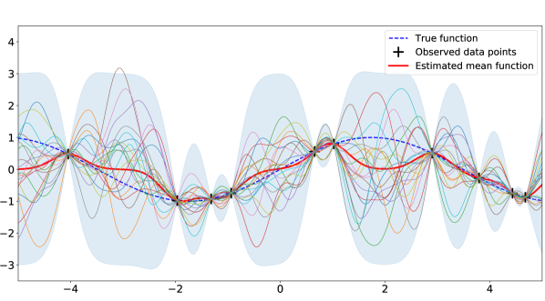

# ガウス過程回帰への直感的チュートリアル（arXiv 2020）

> 原典: [[translations/2020-gp-regression-tutorial]] ・ `raw/articles/An Intuitive Tutorial to Gaussian Process Regression.md`（arXiv:2009.10862）
> 著者・年: Jie Wang（University of Waterloo）/ 2020

## 一言まとめ

**ガウス過程回帰（GPR）** を、正規分布 → 多変量正規分布 → カーネル → ノンパラメトリックモデル → ガウス過程、と図を多用して直感的に積み上げる入門チュートリアル。GP は「点の集合に当てはまる**無限個の関数の上に置いた確率分布**」で、予測平均（最尤推定）と分散（不確実性）を同時に与える。この wiki では [[gaussian-process]] 概念の**リファレンス**にあたる。GP は PFN 系が「近似する対象」かつ「合成 prior の素材」として繰り返し登場する（[[sources/2021-transformers-can-do-bayesian-inference]] が固定 GP をほぼ完璧に模倣、TabICL/TabICLv2 が GP 関数を prior に採用）ため、その土台を押さえる位置づけ。

## 背景と問題意識

回帰の目的は観測データ点を表す関数を作り新しい点を予測すること。だが観測点に当てはまる関数は無限にある。伝統的な非線形回帰は「最良の単一関数」を返すが、同程度に当てはまる関数は複数ありうる。**ガウス過程は単一関数でなく「関数上の確率分布」を扱い、予測に不確実性を付ける**。ただし多変量正規分布・カーネル・ノンパラメトリックといった概念に依存するため理解が難しい——本チュートリアルはこれを図解で平易に解く。

## 内容（直感の積み上げ）

1. **ガウス分布 → 多変量正規分布（MVN）**: 独立な一変量ガウスのベクトルを点として結ぶと「関数」に見えるが、ノイズが多すぎて回帰に使えない。点を**相関させる**＝同時ガウス（MVN）にする必要がある。MVN は平均ベクトル $\mu$ と共分散行列 $\Sigma$ で規定され、二変量（BVN）の 3D ベル曲線を「スライス」すると**条件付き分布もガウス**になる（回帰には同時でなく条件付き確率が要る）。
2. **カーネル（共分散関数）**: 「似た入力は似た出力」という事前知識を内包し、関数を滑らかにする。**カーネルトリック**で特徴空間の内積を陽に計算せず求める。代表は **RBF（二乗指数）カーネル**で、その事前関数は滑らか・無限回微分可能。恒等カーネル（相関なし）だとノイジーな線、RBF だと滑らかな線になる。
3. **無限次元 MVN → カーネル化された事前関数**: MVN の次元を無限に増やすと、関心領域の全点を表せ、無限パラメータの関数を当てはめられる。観測前の「prior 関数」群がこれ（図8）。
4. **ノンパラメトリックモデル**: パラメータ数がデータサイズとともに増える（＝無限個のパラメータ）。GP はノンパラメトリック。
5. **ガウス過程（本体）**: 関数上の分布 $P(\mathbf{f}|\mathbf{X})=\mathcal{N}(\mathbf{f}|\boldsymbol{\mu},\mathbf{K})$。観測で prior → posterior に更新。予測は同時分布から条件付き分布を取り、
   $$\bar{\mathbf{f}}_*=\mathbf{K}_*^{\top}[\mathbf{K}+\sigma_n^2\mathbf{I}]^{-1}\mathbf{y},\quad \text{cov}(\mathbf{f}_*)=\mathbf{K}_{**}-\mathbf{K}_*^{\top}[\mathbf{K}+\sigma_n^2\mathbf{I}]^{-1}\mathbf{K}_*.$$
   ノイズなしだと予測分散は入力のみに依存（$\mathbf{y}$ に非依存）＝ガウスの際立った性質。
6. **実装と最適化**: Cholesky 分解ベースの標準アルゴリズム（Rasmussen 2006）。RBF の $\sigma_f$（縦スケール）と $l$（長さスケール）を**対数周辺尤度の最大化**で最適化（$l$ が大→滑らか）。ハイパラ最適化後は予測分散が出力 $\mathbf{y}$ にも依存。実装パッケージは GPy / GPflow / GPyTorch。

<figure>

<figcaption>図10（再掲）: 標準 GPR の例。黒十字＝観測点、青点線＝真の関数。事後関数の 20 サンプル（色線）、赤実線＝平均関数（回帰結果）、青陰影＝予測分散の 3 倍。観測点近くで不確実性が小さく、遠いと大きい。［[[translations/2020-gp-regression-tutorial]] 図10 より］</figcaption>
</figure>

## 限界・批判的視点

- **標準（vanilla）GPR の計算量は $O(N^3)$、メモリは $O(N^2)$**。大規模データでは非現実的 → スパース GP が必要。
- 入門チュートリアルであり新規手法の提案ではない（理論の証明や最先端アルゴリズムは扱わない）。
- 分類は触れず回帰中心。

## 意義（なぜこの wiki に重要か）

PFN 系の理解には GP の理解が前提になる。具体的には:
- **PFN が近似する対象**: [[sources/2021-transformers-can-do-bayesian-inference]] は、固定ハイパラ GP の事後予測分布（閉形式で厳密）を「物差し」にして PFN の近似精度を検証した。本チュートリアルの GPR 予測式（条件付きガウス）がその厳密 PPD の正体。
- **合成 prior の素材**: [[structural-causal-model]] の項にある通り、TabICL（[[sources/2025-tabicl]]）と TabICLv2（[[sources/2026-tabicl-v2]]）は **GP 関数（ランダムカーネル）を合成データ生成の関数型**に使う。カーネルの裾と関数の滑らかさの関係（TabICLv2 付録 G で定理化）も、本チュートリアルの「カーネル＝滑らかさの事前知識」という直感の延長。
- **不確実性と較正**: GP が予測分散を自然に与えることは、TFM が「較正のよい予測分布」を売りにする文脈（[[bayesian-inference]] の PPD）の原型。

## 用語と略称

- **GP / GPR** = Gaussian Process / Gaussian Process Regression（ガウス過程／その回帰）→ [[gaussian-process]]
- **MVN / BVN** = Multivariate / Bivariate Normal distribution（多変量／二変量正規分布）
- **カーネル（共分散関数）** = 入力間の類似性を測り関数の滑らかさ（事前知識）を決める関数。$K_{ij}=k(x_i,x_j)$
- **RBF / SE カーネル** = Radial Basis Function / Squared Exponential（二乗指数）カーネル。$\sigma_f$（縦スケール）・$l$（長さスケール）を持つ
- **カーネルトリック** = 特徴空間の内積を陽に計算せずカーネルで求める手法
- **ノンパラメトリックモデル** = パラメータ数がデータサイズとともに増える（実質無限個）モデル
- **PPD / 事後予測分布** = 観測を条件にした予測分布 → [[bayesian-inference]]
- **対数周辺尤度（log marginal likelihood）** = ハイパラ最適化の目的関数
- **スパース GP** = $O(N^3)$ を緩和する大規模化手法

## 関連ページ

- [[gaussian-process]] — 本チュートリアルが解説する概念そのもの（この source がリファレンス）
- [[bayesian-inference]] — GP の事後予測分布／不確実性の枠組み
- [[sources/2021-transformers-can-do-bayesian-inference]] — 固定 GP を物差しに PFN を検証した原典
- [[sources/2025-tabicl]] / [[sources/2026-tabicl-v2]] — GP 関数を合成 prior に使う TFM
- [[structural-causal-model]] — GP 関数を含む合成 prior
- [[translations/2020-gp-regression-tutorial]] — 本文の翻訳
