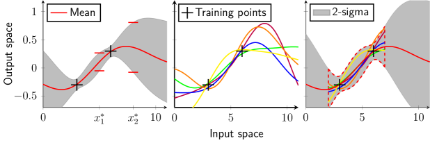

# ガウス過程モデル入門（arXiv 2021）

> 原典: [[translations/2021-gp-models-intro]] ・ `raw/articles/An Introduction to Gaussian Process Models.md`（arXiv:2102.05497）
> 著者・年: Thomas Beckers（TU München, Chair of Information-oriented Control）/ 2020 原版・2021 改訂

## 一言まとめ

**制御・システム同定の観点から書かれた、ガウス過程（[[gaussian-process]]）の中〜上級の入門**。[[sources/2020-gp-regression-tutorial]]（Jie Wang）が「正規分布→MVN→カーネル→GP」と直感を積み上げる**初級リファレンス**だったのに対し、本稿は同じ予測式を起点にしつつ、**(1) カーネルに基づく見方（線形回帰の双対化＋カーネルトリック）、(2) 再生核ヒルベルト空間（RKHS）と RKHS ノルム、(3) GPR の予測分散を使ったモデル誤差の保証付き上界（ロバスト／シナリオ／情報理論的）、(4) 多出力回帰、(5) 動的システムへの埋め込み（GP-SSM / GP-NOE）**まで踏み込む。この wiki では [[gaussian-process]] の**理論面の上級リファレンス**にあたり、特に「GP の不確実性は飾りでなく、真の関数との誤差を確率付きで抑える数学的保証になる」点が PFN の「較正のよい予測分布」という売り（[[bayesian-inference]]）の理論的下地になる。

## 背景と問題意識

ガウス過程回帰（GPR）は、平均予測だけでなく**モデル忠実度（不確実性）の尺度**を同時に出す数少ない手法で、データ駆動かつ少ない事前知識で非線形関数を回帰できる。制御・システム同定の文脈では、この不確実性を**安全性の保証**（「真のシステムと推定モデルの誤差はこの範囲に収まる」）に変換できるかが鍵になる。本稿は GPR の基礎から、その保証を支える RKHS 理論とモデル誤差境界までを橋渡しする。

## 内容（要点の再解釈）

1. **GP と GPR の基礎（§2.1）**　GP は平均関数 $m$ とカーネル $k$ で完全に規定され、任意の有限点集合で多変量ガウスに従う＝「関数上の分布」。観測 $\mathcal{D}=\{X,Y\}$ で条件付けると事後予測分布が閉形式で出る（[[sources/2020-gp-regression-tutorial]] と同じ予測式）。重要な観察: **平均はカーネルの重み付き和（個数が訓練点数とともに増える＝ノンパラメトリック）、分散は観測値 $Y$ に依存せず入力位置のみで決まる**（ガウス性の帰結）。
2. **カーネルに基づく見方と RKHS（§2.3〜2.4）**　GPR はベイズ線形回帰を特徴写像 ${\boldsymbol{\phi}}$ で持ち上げ、内積をカーネルで置換（**カーネルトリック**）したものと等価。任意のカーネルには一意の**再生核ヒルベルト空間（RKHS）**が対応し（Moore-Aronszajn）、その**RKHS ノルム** $\|f\|_{\mathcal{H}}^2={\boldsymbol{\alpha}}^\top K{\boldsymbol{\alpha}}$ は「関数がカーネルの幾何に対しどれだけ激しく変動するか」を測るリプシッツ的指標。
3. **モデル誤差の保証付き上界（§2.5）**　GPR の予測分散を使い、真の未知関数 $f_{\text{uk}}$ との誤差を**確率付きで上から抑える**。3 流派: **ロバスト**（各点で $|\text{誤差}|\le c\cdot\text{var}$、相関無視で保守的）、**シナリオ**（多数サンプルで近似）、**情報理論的**（Srinivas et al.: $\Delta\le\beta\Sigma^{1/2}$、$\beta$ は RKHS ノルムと**情報利得 $\gamma_{\max}$** で決まる。コンパクト集合全体で一様に抑えられる）。前提は「$f_{\text{uk}}$ が RKHS の要素（有限 RKHS ノルム）」（仮定 1）。
4. **カーネル動物園とハイパラ最適化（§3）**　定数・線形・多項式・Matérn・二乗指数・有理二次・二乗指数 ARD を整理（表 1）。Matérn と二乗指数は**普遍カーネル**（コンパクト集合上で任意の連続関数を任意精度で近似）。ハイパラは**負の対数周辺尤度の最小化**（データ適合＋複雑さ罰則＋正規化の 3 項、非凸で局所解が各々データの解釈に対応）か**交差検証**で決める。
5. **GP 動的モデル（§4）**　GP をシステム同定に使う再帰構造として **GP-SSM（状態空間）** と **GP-NOE（非線形出力誤差、多段先予測向き）** を導入。

<figure>

<figcaption>図4（再掲）: モデル誤差を定量化する 3 アプローチ（左ロバスト／中シナリオ／右情報理論的）。GPR の予測不確実性を真の関数との誤差境界に変換する。［[[translations/2021-gp-models-intro]] 図4 より］</figcaption>
</figure>

## 限界・批判的視点

- **計算量**: 本稿は明示的に強調しないが、グラム行列の逆計算ゆえ標準 GP は $O(n^3)$（[[sources/2020-gp-regression-tutorial]] / [[gaussian-process]] が指摘）。大規模データには別途スパース化が要る。
- **保証の前提**: モデル誤差境界は「$f_{\text{uk}}$ が選んだカーネルの RKHS に属する（有限 RKHS ノルム）」という仮定 1 に依存し、実際にはその RKHS ノルムは未知で上界推定が必要。
- 入門であり新規手法の提案ではない（Rasmussen 2006 を主たる下敷きとする整理）。
- 制御・システム同定寄りで、表形式データや分類は扱わない。

## 意義（なぜこの wiki に重要か）

1. **PFN の「較正のよい不確実性」の理論的下地**　PFN/TFM の売りは予測分布が**較正されている（well-calibrated）**ことだが、その「正しい不確実性とは何か」の規範例が GPR である。本稿の §2.5 は、GP の予測分散が単なる目安でなく**真の関数との誤差を確率付きで抑える量**になりうることを示す。これは [[bayesian-inference]] の事後予測分布（PPD）を Transformer で償却近似する PFN が、最終的に何を再現しようとしているのかを明確にする。
2. **PFN が近似する対象の精密化**　[[sources/2021-transformers-can-do-bayesian-inference]] は固定カーネル GP の厳密 PPD を「物差し」に PFN を検証した。本稿の予測式・カーネル・RKHS は、その物差しの中身そのもの。RKHS ノルム＝関数の滑らかさという視点は、[[structural-causal-model]] 系の合成 prior（TabICL/TabICLv2 が GP 関数を採用、カーネルの裾と滑らかさを関係づける）の理解にも効く。
3. **ベイズ最適化との接続**　§2.5.3 の情報理論的境界（Srinivas et al. の**情報利得 $\gamma_{\max}$**）は、[[bayesian-optimization]] の GP-UCB のリグレット解析と同じ系譜。GP の不確実性境界が「探索すべき場所」を定める獲得関数の理論的根拠になる。BayesOpt のサロゲートとしての GP（[[sources/2018-bayesian-optimization-tutorial]]）を、より厳密な保証の側から見た一篇。

## 用語と略称

- **GP / GPR** = Gaussian Process / GP Regression（ガウス過程／その回帰）→ [[gaussian-process]]
- **RKHS** = Reproducing Kernel Hilbert Space（再生核ヒルベルト空間）。カーネルに一意対応する関数空間
- **RKHS ノルム** $\|f\|_{\mathcal{H}}$ = カーネルの幾何に対する関数の変動の激しさ（リプシッツ的指標）
- **カーネルトリック** = 特徴写像の内積をカーネルで陽に計算せず求める手法
- **普遍カーネル（universal kernel）** = コンパクト集合上で任意の連続関数を任意精度で近似できるカーネル（Matérn・二乗指数）
- **ARD** = Automatic Relevance Determination（自動関連度決定）。次元ごとに独立な長さスケール
- **情報利得 $\gamma_{\max}$（information gain）** = モデル誤差境界 $\beta$ を決める量。多くのカーネルで訓練点数に劣線形依存
- **対数周辺尤度（log marginal likelihood）** = ハイパラ最適化の目的関数（データ適合＋複雑さ罰則）
- **GP-SSM / GP-NOE** = GP State Space Model / GP Nonlinear Output Error model（GP 動的モデルの 2 構造）
- **PPD / 事後予測分布** = 観測を条件にした予測分布 → [[bayesian-inference]]

## 関連ページ

- [[gaussian-process]] — 本稿が解説する概念（この source はその上級リファレンス）
- [[sources/2020-gp-regression-tutorial]] — 同じ GP の初級リファレンス（直感の積み上げ）。本稿はその理論的続編
- [[bayesian-inference]] — GP の事後予測分布／較正された不確実性の枠組み
- [[bayesian-optimization]] — 情報利得 $\gamma_{\max}$ 経由の接続（GP-UCB の理論的下地）
- [[sources/2021-transformers-can-do-bayesian-inference]] — 固定 GP を物差しに PFN を検証した原典
- [[structural-causal-model]] — GP 関数を含む合成 prior（カーネル＝滑らかさ）
- [[translations/2021-gp-models-intro]] — 本文 §1〜5 の翻訳
