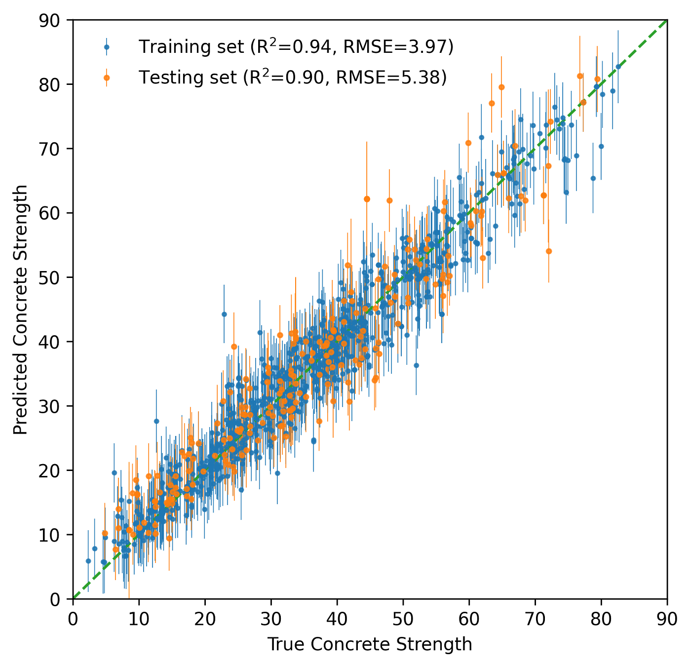

# ガウス過程回帰入門 Part 2: コンクリート強度予測への応用（Medium 2022）

> 原典: [[translations/2022-gpr-part2-concrete]] ・ `raw/articles/Introduction to Gaussian process regression, Part 2_ Application to predicting concrete strength.md`（medium.com/data-science-at-microsoft, 2022-10-11）
> 著者・媒体: Kaixin Wang（Data Science at Microsoft）/ Medium。[[sources/2022-gpr-part1-basics]] の続編

## 一言まとめ

**ガウス過程回帰（GPR; [[gaussian-process]]）を実世界の表形式回帰に適用した実践記事**。UCI コンクリート圧縮強度データ（約 1000 試料、化学組成 7 特徴量 → 強度 MPa）に、線形＋RBF カーネルの GPR を GPflow で当てはめ、**ニューラルネット（ANN）に匹敵する精度（テスト R²≈0.90, RMSE≈5.4 / ANN はテスト R²≈0.92）を、予測の不確実性（95% 信頼区間）つきで達成**。さらに **SHAP（SHapley Additive exPlanations）でブラックボックスを解釈**し、セメントが最重要（線形）・材齢が二次的・水セメント比の効きを定量化。[[sources/2022-gpr-part1-basics]]（理論＋トイ例）の応用編で、この wiki では [[gaussian-process]] の「応用」事例として位置づける。**コンクリート強度は表形式 ML の定番ベンチで、TabPFN（[[tabular-foundation-model]]）が GPR/ANN と競合する土俵そのもの**であり、SHAP による解釈という主題も TFM と直結する。

## 背景と問題意識

高性能コンクリートの強度は化学組成に複雑に依存し、モデル化が難しい。元研究（Yeh 1998）は ANN を使った。本記事は同じ表形式回帰に **GPR を持ち込むと、ANN 並みの精度に加えて「どの予測が不確かか」を信頼区間として得られる**ことを示す。Part 1 が理論＋トイデータだったのに対し、Part 2 は前処理（標準化）・相関分析・訓練/テスト分割・評価（R²/RMSE）・解釈（SHAP）まで含む**一通りの実務フロー**を見せる。

## 手法とワークフロー（要点の再解釈）

1. **データと前処理**: 約 1000 試料、特徴量＝セメント/高炉スラグ/フライアッシュ/水/粗骨材/細骨材/材齢、目的＝圧縮強度（0〜100 MPa）。特徴量はレンジが異なるため scikit-learn の標準スケーラーで標準化。相関ヒートマップ（図2）で、セメント・減水剤・材齢が強度と正相関、フライアッシュ・骨材が負相関。
2. **モデル**: **線形＋RBF カーネルの GPR**（内挿・外挿に頑健な組み合わせ＝Part 1 の結論を踏襲）。RBF の分散・長さスケールは GPflow の組み込み最適化器で決定。80/20 の訓練/テスト分割。
3. **結果**: テスト **R²≈0.90, RMSE≈5.4**。ANN（訓練 R²≈0.945, テスト R²≈0.92）に匹敵。図5 の 95% 信頼区間は真値をおおむね覆い、**誤差の大きい点では帯域幅が広がる＝モデルが不確かさを「自覚」**している（較正された不確実性の実演）。
4. **解釈（SHAP）**: ブラックボックスを **SHAP（ゲーム理論のシャープレイ値で各特徴量の貢献を配分）** で説明。任意モデルに使える **kernel explainer** を採用。サマリープロット（図6）でセメントが最重要、材齢が 2 位。依存プロット（図7）でセメント＝線形傾向、材齢＝二次関係、セメント・材齢は**水と最も相互作用**（水セメント比の重要性と整合）。

<figure>

<figcaption>図5（再掲）: GPR の予測 対 真値と 95% 予測信頼区間。誤差が大きい点ほど区間が広く、モデルが不確かさを自覚していることを示す。［[[translations/2022-gpr-part2-concrete]] より］</figcaption>
</figure>

## 限界・批判的視点

- **入門シリーズの応用編**で、GPR の $O(n^3)$ スケール（約 1000 試料なら問題ないが、大規模では効く）には触れない。
- カーネルは Part 1 の結論（線形＋RBF）を流用し、カーネル探索自体は深掘りしない。
- ANN との比較は元研究の数値を引くのみで、統一条件での厳密なベンチマークではない。
- SHAP の kernel explainer は計算が重い（モデルを多数回評価する）——記事は触れないが、**この「繰り返し予測のコスト」こそ TabPFN-3 が KV キャッシュで SHAP を最大 120× 高速化した動機**（[[tabular-foundation-model]] 参照）。

## 意義（なぜこの wiki に重要か）

1. **PFN/TFM が戦う土俵そのもの**: コンクリート強度は**表形式回帰の定番ベンチ**で、GPR・ANN・GBDT・そして TabPFN（[[tabular-foundation-model]] / [[prior-data-fitted-networks]]）が直接比較される問題設定。本記事の「GPR は ANN 並みの精度＋不確実性」という主張は、**TabPFN が掲げる「小〜中規模表データで較正された予測分布を出す」価値命題の GPR 版**であり、PFN が GP を近似・代替する文脈（[[bayesian-inference]]）の実応用側の絵になる。
2. **較正された不確実性の実演**: 図5 の「誤差が大きい点で信頼区間が広がる」挙動は、PFN/TFM が売りにする較正（well-calibrated）の具体例。PFN はこの GPR の事後予測分布を Transformer の前向き計算で償却近似する。
3. **解釈可能性（SHAP）という共通主題**: 本記事の SHAP による特徴量重要度の可視化は、[[tabular-foundation-model]] が「TabPFN-3 は KV キャッシュ高速化で SHAP 計算を最大 120× 高速化」と述べる、まさにその解釈手法。表形式 ML では予測精度と並んで解釈可能性が重視されることを示す。
4. **GP リファレンス群の「応用」事例**: [[gaussian-process]] の入門群（[[sources/2019-gp-not-for-dummies]] / [[sources/2020-gp-regression-tutorial]] / [[sources/2022-gpr-part1-basics]]）と上級理論（[[sources/2021-gp-models-intro]]）に対し、本記事は「実データで一通り回す」応用編として補完する。

## 用語と略称

- **GPR** = Gaussian Process Regression（ガウス過程回帰）→ [[gaussian-process]]
- **SHAP** = SHapley Additive exPlanations（シャープレイ値に基づくモデル説明手法）。kernel explainer は任意モデル向けの汎用説明器
- **ANN** = Artificial Neural Network（人工ニューラルネットワーク）。元研究のベースライン
- **R² / RMSE** = 決定係数 / 二乗平均平方根誤差（回帰の評価指標）
- **線形＋RBF カーネル** = 内挿（RBF）と外挿（線形）のバランスが良いカーネルの和（Part 1 の結論）
- **標準スケーリング** = $(x-\mu)/\sigma$ による特徴量標準化
- **水セメント比（c/m）** = コンクリート強度を左右する主要因。SHAP 相互作用で確認
- **PPD / 事後予測分布** = 観測を条件にした予測分布 → [[bayesian-inference]]

## 参照（原典内リンク）

- Yeh, I.-C. "Modeling of strength of high-performance concrete using artificial neural networks." *Cement and Concrete Research* 28 (1998) — 元データ・ANN ベースライン
- GPflow（Matthews et al. 2017, JMLR）— 実装
- Lundberg & Lee, "A unified approach to interpreting model predictions"（NeurIPS 2017）— SHAP

## 関連ページ

- [[sources/2022-gpr-part1-basics]] — 本記事の前編（GPR の理論＋トイ例・カーネル選択）
- [[gaussian-process]] — 本記事が応用する概念
- [[tabular-foundation-model]] — 同じ表形式回帰の土俵（TabPFN）／SHAP 高速化の接続
- [[prior-data-fitted-networks]] — GP を近似・代替する PFN
- [[bayesian-inference]] — 較正された事後予測分布（信頼区間）
- [[translations/2022-gpr-part2-concrete]] — 本文の翻訳
