# TabPFN: 小規模な表形式分類を 1 秒で解く Transformer

> 原典: [[translations/2022-tabpfn]] ・ `raw/articles/TabPFN_ A Transformer That Solves Small Tabular Classification Problems in a Second.md`（arXiv:2207.01848）
> 著者・年・会議: Noah Hollmann, Samuel Müller, Katharina Eggensperger, Frank Hutter（University of Freiburg ほか）/ 2022（ICLR 2023 採択）

## 一言まとめ

小規模な表形式データの分類を、**新しいデータごとの訓練を一切せず**に、ラベル付き訓練データとテストデータをまとめて 1 回 Transformer に通すだけ（1 回の順伝播）で解く手法 TabPFN を提案した論文。事前に「合成データで一度だけ」訓練しておくことで、推論時は GBDT（勾配ブースティング決定木）を上回り、1 時間かけた AutoML と同等の性能を 1 秒未満で達成する。

## 背景と問題意識

表形式データ（行＝サンプル、列＝特徴量の、いわゆるスプレッドシート的データ）は実務で最も多いデータ型だが、画像・言語と違って深層学習がなかなか勝てず、**勾配ブースティング決定木（GBDT; Gradient-Boosted Decision Trees, XGBoost / LightGBM / CatBoost など）** が長く王者だった。GBDT が好まれる理由は訓練が速くロバストなこと。

通常の機械学習は「新しいデータセットが来たら、そのデータに対してモデルをゼロから当てはめ（fit）、さらに良いハイパーパラメータ（学習率や木の深さなどの設定値）を探索する」という流れを踏む。この当てはめ＋探索が時間とコストを食う。

この論文の出発点は、先行研究の **PFN（Prior-Data Fitted Network, 事前分布からサンプリングした合成データで一度だけ訓練し、推論時は重み更新なしにベイズ推論を近似するネットワーク）** という枠組み。PFN は「データセットそのものを入力に取り、予測を返す」よう訓練されるため、**学習アルゴリズム自体を学習する**（メタ学習の一種）。詳しくは [[prior-data-fitted-networks]] を参照。先行研究の PFN は 30 サンプル・二値・バランス済みという極小設定に留まっており、実用に足りなかった。本論文はこれを最大 1,000 サンプル・10 クラス・不均衡ありまでスケールさせ、表形式データ専用の事前分布を新設計した点が貢献。

## 提案手法 / 主張

中心アイデアは 2 つ。**(1) 推論を 1 回の順伝播に変える**（PFN の枠組み）と、**(2) 表形式データに合った "事前分布" を設計する**。

**(1) PFN の枠組み（[[prior-data-fitted-networks]] / [[in-context-learning]] / [[bayesian-inference]]）**
- ベイズの教師あり学習では、知りたいのは「訓練データ $D_{train}$ を見たうえでのテスト点のラベル分布」＝**事後予測分布（PPD; posterior predictive distribution）**。これは仮説空間（あり得るデータ生成メカニズム全体）について積分した量で、ふつう直接は計算できない。
- PFN は、事前分布から合成データセットを大量にサンプリングし、「訓練部分を見てテスト部分を当てる」交差エントロピー損失で Transformer を訓練する。先行研究の理論により、この損失最小化が**真の PPD を近似する**ことが示されている。つまり訓練済み PFN の 1 回の順伝播 ≒ 近似ベイズ推論。
- 推論時は、実データの $D_{train}$ とテスト特徴量を**集合**としてまとめて入力し（順序不変に扱う）、テスト集合全体の予測を一度に出す。これは大規模言語モデルで観測される **文脈内学習（ICL; In-Context Learning, 入力に与えた例から重み更新なしにタスクを解く能力）** と同じ構図であり、本論文は表形式データにこの構図を持ち込んだ代表例である。

**(2) 表形式データのための事前分布（[[structural-causal-model]]）**
- 「どんなデータが来そうか」という前提（事前分布）を、**構造的因果モデル（SCM; Structural Causal Model, 変数間の因果関係を有向非巡回グラフ＝DAG と各ノードの生成式で表すモデル）** と **ベイズニューラルネットワーク（BNN; Bayesian Neural Network, 重みを確率分布として扱う NN）** の混合で定義した。
- 実装上は MLP 状のグラフを作り、辺をランダムに落として DAG（SCM）を作る → ノイズを流して特徴量とターゲットを生成、という手順で合成データを作る。**単純な構造（ノード・パラメータが少ない）ほど高確率**になるよう設計し、オッカムの剃刀（簡潔な説明を選好する原則）を事前分布に埋め込んでいる。
- ハイパーパラメータは点ではなく**分布**で与える（例: 層数やノード数を対数一様分布で）。これにより TabPFN は「ハイパーパラメータ全体について積分した」予測を返し、ユーザ側のチューニングが不要になる。
- スカラー出力を区間分割して多クラスラベルに変換する仕組み、カテゴリ特徴量・欠損値・相関特徴量・指数スケールへの前処理上の工夫（付録 C.2）も加えている。

**TabPFN 本体**: 12 層・埋め込み 512・25.82M パラメータの Transformer を、512 データセット×18,000 バッチ（計 約 920 万合成データセット）で 8GPU・20 時間かけて**一度だけ**訓練。以後この単一モデルを全実験で使い回す。推論を速くするためアテンションマスクを工夫し（行列サイズを $(n+m)^2 → n^2+nm$ に縮小）、特徴量数の違いはゼロパディングで吸収する。

<figure>

<figcaption>図1（再掲）: 左 (a) オフラインの事前当てはめ段階で事前分布の PPD を学習し、オンライン段階で新しいデータセットを 1 回の順伝播で予測する。右 (b) 各 (特徴量, ラベル) をトークン化し、訓練サンプル同士は注意を向け合い、テストサンプルは訓練サンプルにのみ注意を向ける。［translations/2022-tabpfn 図1 より］</figcaption>
</figure>

## 実験結果と知見

- **メインの土俵**: OpenML-CC18 から選んだ、欠損値なし・純数値の 18 データセット。TabPFN は GBDT を明確に上回り、最良の AutoML（Auto-sklearn 2.0, AutoGluon）が**1 時間**かけた性能に、**1 秒未満**で並ぶ。速度は CPU で約 230 倍、GPU で約 5,700 倍。
- **較正と滑らかさ**: トイデータ（moons, circles 等）では決定境界が滑らかで、観測点から遠いと不確実性が上がる（ガウス過程に似た挙動）。較正のよい（well-calibrated, 予測確率が実際の正解率と整合する）予測。

<figure>

<figcaption>図5（再掲）: 訓練・調整に許す時間に対する ROC AUC（18 個の数値データセット）。赤い星が TabPFN（32 順列, GPU 0.62 秒）。1 秒未満で、1 時間かけた AutoML に並び、調整済み GBDT を上回る。［translations/2022-tabpfn 図5 より］</figcaption>
</figure>
- **アンサンブル適性**: TabPFN の誤りは GBDT 系と相関が低い（得意なデータセットが違う）。そのため `TabPFN + AutoGluon` の単純平均が全手法を上回る。評価が一瞬で済むのでアンサンブルコストはほぼゼロ。
- **汎化**: 訓練時に見た最大サイズ（1024）を超える訓練サンプル数（最大 5000）にも外挿できる。
- **追加検証**: OpenML-AutoML ベンチの小規模データや、149 の検証データセットでも数値データでの強さを確認。臨界差図＋ウィルコクソン検定で、数値データの高速レジームでは全ベースラインに統計的有意差で勝つ。
- **アブレーション**: SCM 事前分布が BNN 単独より強い。SCM 単独と SCM+BNN 混合の差は小さい（最終モデルは混合）。

## 限界・批判的視点

- **計算量が二次**: Transformer のアテンションは入力サンプル数に対して $O(n^2)$。大規模データ（> 10 万）は現行 GPU では困難（線形アテンション系の導入が今後の課題）。
- **適用範囲が固定**: この TabPFN は特徴量 ≤ 100・クラス ≤ 10・訓練サンプル小規模に固定されており、超えると使えない。
- **カテゴリ／欠損が弱い**: 開発を純数値・欠損なしに絞ったため、カテゴリ特徴量や欠損値が多いデータでは性能が落ちる。NaN は単にゼロ置換しているだけ。
- **無情報特徴量に弱い**: 無意味な特徴量を足すと性能が劣化（事前分布が無情報特徴量を想定していないため）。最悪ケース collins はこれが原因で、上位 5 特徴量だけ残せば精度 1.0 になる。これは相対的な**回転不変性**（特徴量を混ぜる回転に対する頑健さ。完全に回転不変だと無関係特徴量に弱くなるという理論的トレードオフ）と関連。
- **純粋な因果推論ではない**: SCM を事前分布に使うが、因果グラフを推定する（介入・反事実を扱う）わけではなく、Pearl の「因果のはしご」で言う"段 1.5"＝観測データ上の連関ベース予測に留まる。
- **集計の罠**: 報告は多数データセットの**集計**で、TabPFN が全データセットで勝つわけではない。数値データでも負ける例、カテゴリデータで勝つ例の両方が存在する。

## 意義（なぜ重要か）

この論文は「**モデルを当てはめる**」という機械学習の基本動作を「**訓練済みネットワークに 1 回通す**」に置き換え、AutoML 級の性能を秒単位・チューニング不要で実現した点で、表形式 ML のパラダイムを変えた。これは [[bayesian-inference]]（ふつう計算困難な事後予測分布）を Transformer の forward 一回で**償却（amortize, 事前の一括計算で個別推論を高速化）**する初の本格的な実用例であり、言語モデルで観測された [[in-context-learning]] を表形式データに移植した代表例でもある。後続の TabPFN v2 や基盤表形式モデルの起点となった研究。

## 用語と略称

- **PFN** = Prior-Data Fitted Network（事前分布からの合成データで一度訓練し、推論時に重み更新なしでベイズ推論を近似するネットワーク）→ [[prior-data-fitted-networks]]
- **PPD** = Posterior Predictive Distribution（事後予測分布。訓練データを条件としたテスト点のラベル分布）→ [[bayesian-inference]]
- **ICL** = In-Context Learning（文脈内学習。入力に与えた例から重み更新なしにタスクを解く）→ [[in-context-learning]]
- **SCM** = Structural Causal Model（構造的因果モデル。DAG と生成式で因果関係を表す）→ [[structural-causal-model]]
- **BNN** = Bayesian Neural Network（ベイズニューラルネット。重みを分布として扱う）
- **GBDT** = Gradient-Boosted Decision Trees（勾配ブースティング決定木。XGBoost / LightGBM / CatBoost）
- **AutoML** = Automated Machine Learning（モデル選択・ハイパラ探索を自動化する枠組み。Auto-sklearn, AutoGluon）
- **ROC AUC / OVO** = ROC 曲線下面積／多クラスでの一対一（one-vs-one）平均
- **ablation（アブレーション）** = 構成要素を取り除いて寄与を測る実験
- **amortize（償却）** = 事前の一括計算で、個別の推論を安価にすること

## 関連ページ

- [[prior-data-fitted-networks]] — 本手法が属する中核概念
- [[in-context-learning]] — 推論時に重み更新なしで予測する枠組み
- [[bayesian-inference]] — 近似対象である事後予測分布（PPD）
- [[structural-causal-model]] — 表形式事前分布の中核
- [[translations/2022-tabpfn]] — 全文翻訳（付録含む）
