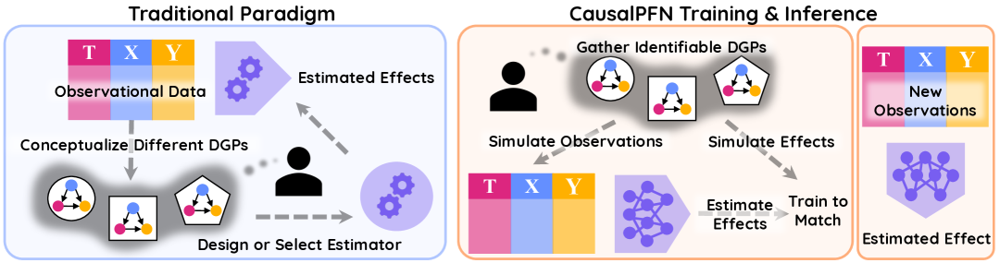
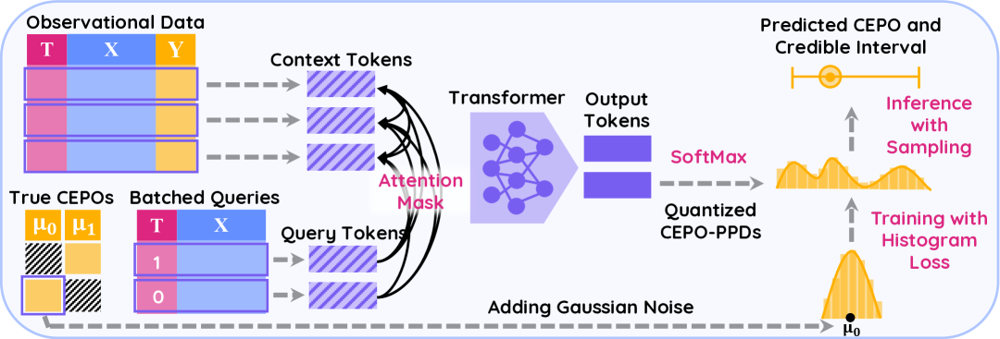

# CausalPFN: 文脈内学習による償却的な因果効果推定

> 原典: [[translations/2025-causalpfn]] ・ `raw/articles/CausalPFN_ ... .md`（ar5iv, arXiv:2506.07918）
> 著者・年・所属: Vahid Balazadeh, Hamidreza Kamkari, Valentin Thomas, Benson Li, Junwei Ma, Jesse C. Cresswell, Rahul G. Krishnan（University of Toronto / Vector Institute / Layer 6 AI, 2025）
> コード: https://github.com/vdblm/CausalPFN

## 一言まとめ

**PFN（Prior-Data Fitted Network, 事前分布から合成したデータで一度だけ訓練し、推論時には重み更新なしに文脈内学習でベイズ推論を近似するネットワーク）を「因果効果推定」へ拡張した初の本格モデル。** 無視可能性（ignorability）を満たす多数の合成データ生成過程で一度だけ事前訓練し、新しい観測データセットを文脈として与えるだけで、追加の訓練・チューニングなしに処置効果（ATE/CATE）を即座に推定する。

## 背景と問題意識

**因果効果推定**とは、「ある介入（処置 treatment）をしたら結果がどれだけ変わるか」を、介入を明示的に行っていない**観測データ**から見積もる問題である。例えば「この薬を投与したら回復確率がどれだけ上がるか」「このクーポンを配ったら購入がどれだけ増えるか」。難しさの核心は**交絡（confounding）**——処置の有無と結果の両方に効く別の要因——が真の効果を覆い隠すことにある。

この分野では過去40年で**数十もの専門的な推定器**（Meta-Learner、二重頑健法、二重機械学習 DML、各種ニューラル手法など）が乱立し、「どのデータにどの推定器を選び、どうチューニングするか」自体が専門知識を要する重い手作業になっていた。

ベイズのパラダイムはこれをエレガントに解く枠組みを与える。データ生成過程（**DGP**, Data-Generating Process）に事前分布を置き、因果量を DGP パラメータの汎関数として定義し、観測を条件とした**事後予測分布（PPD**, Posterior Predictive Distribution, 観測を踏まえた予測の分布で点推定と不確実性を同時に与える）を導けばよい。だが事後分布の計算は高コストなサンプリング（MCMC 等）を要し、実用化を阻んでいた。

ここで本研究は、表形式予測で成功した **PFN** の発想——「高コストなベイズ推論を事前訓練時に**償却（amortize**, 一度払えば後は安く済ませる）してしまい、推論は順伝播一回で済ませる」——を因果推論に持ち込む。ただし既存の PFN（[[prior-data-fitted-networks]]）は回帰・分類のために設計されており、因果推論はできなかった。CausalPFN はその空白を埋める。これは [[bayesian-inference]] の償却を [[in-context-learning|文脈内学習]] で行う PFN の枠組みを、新しいドメイン（因果）へ展開した例であり、ベイズ最適化への展開（[[sources/2023-pfns4bo]]・[[sources/2025-git-bo]]）と並ぶ「PFN の応用先拡大」の一つに位置づけられる。

## 提案手法 / 主張

**設定（潜在結果フレームワーク）。** 処置 $T$、共変量 $X$、各処置 $t$ のもとでの**潜在結果** $Y_t$ を考える（Rubin の potential-outcomes 流。`[[structural-causal-model]]` の DAG/SCM 流とは別形式の因果推論）。推定対象は次の3つを総称した「因果効果」：
- **CEPO**（Conditional Expected Potential Outcome, 条件付き期待潜在結果）$\mu_t(X)=\mathbb{E}[Y_t\mid X]$
- **ATE**（Average Treatment Effect, 平均処置効果）= 集団全体での $Y_1-Y_0$ の期待
- **CATE**（Conditional ATE, 条件付き平均処置効果）= 共変量 $X$ ごとの $Y_1-Y_0$ の期待

これらが観測だけから同定できるよう、**強い無視可能性（strong ignorability）**＝(i) 無交絡（観測共変量で条件づければ処置は潜在結果と独立）＋(ii) 正値性（どの処置も確率が0でない）を仮定する。

**核心アイデア①: ignorability を満たす DGP 事前分布の設計。** 任意の表（OpenML の実データ表＋TabPFN v1 のランダム NN 生成器による合成表）を、機械的に「有効な因果データセット」へ変換する手続きを作る。共変量 $X$ を選び、2列を $\mu_0,\mu_1$ に割り当て、ノイズを足して潜在結果 $Y_0,Y_1$ を作り、**処置 $T$ を $X$ だけから（シグモイド経由で）生成**する。$T$ が $X$ のみに依存するので**設計上 ignorability が必ず成り立ち**、真値の CEPO も手元にある（＝訓練ラベルが得られる）。異質性パラメータ $\gamma$・正値性パラメータ $\xi$ で多様な DGP を生む。「同定可能な事前分布のみを台に含めれば一致推定できる」ことを命題1（Doob の定理ベース）で理論保証する。

**核心アイデア②: 因果 data-prior 損失＝前向き KL の最小化。** PFN の data-prior 損失を因果版にしたもの。Transformer $q_\theta$ が出す予測分布（**CEPO-PPD**）の、真の CEPO に対する負の対数尤度を最小化するだけ。付録 C で、これが真の CEPO-PPD への**前向き KL ダイバージェンスの最小化**と同じ最適解を持つことを証明する（＝事後分布を一度も陽に計算せずに事後予測推論を学習する）。

**核心アイデア③: ヒストグラム型の予測ヘッド＋非対称マスク Transformer。** 連続値の CEPO を、$[-10,10]$ を **1024 ビン**に離散化した分布で表す（[[sources/2021-transformers-can-do-bayesian-inference|PFN 原典]]のリーマン分布と同じ発想、→ [[questions/riemann-distribution-buckets]]）。20層・隠れ次元384の Transformer エンコーダで、文脈行 $(t,x,y)$ とクエリ行 $(t,x)$ をトークン化し、**非対称マスキング**（文脈・クエリとも文脈にのみ注意）で各クエリの予測を相互独立にする。推論時は CEPO-PPD の平均を点推定、1万サンプルから信用区間を得る。約2000万パラメータ、予測フェーズ→因果フェーズの2段訓練（A100×4 を最大1週間＋H100 を2日）。

<figure>

<figcaption>図2（出典: 本論文）: 従来法 vs CausalPFN。(左) 専門家がデータごとに推定器を手で構築・選択。(右) 専門家は多様な DGP をシミュレートするだけで、Transformer が因果推論を自動的に償却することを学習する。</figcaption>
</figure>

<figure>

<figcaption>図5（出典: 本論文）: アーキ・訓練・推論。観測行＝文脈トークン (t,x,y)、クエリ＝(t,x)。非対称マスクの Transformer エンコーダ → 1024 次元ロジット → softmax で離散 CEPO-PPD。真の CEPO に狭いガウスを置いてヒストグラム（交差エントロピー）損失で訓練。推論時は平均を点推定、サンプルで信用区間。</figcaption>
</figure>

## 実験結果と知見

- **真値ありベンチマーク（IHDP・ACIC 2016・Lalonde CPS/PSID, 計130実現）**: CATE は **PEHE**（Precision in Estimation of Heterogeneous Effect, 予測 CATE と真 CATE の二乗平均平方根偏差）、ATE は相対誤差で評価。CausalPFN は**平均順位・平均相対誤差ともに全ベースライン中1位**（T/X/S-Learner, BART, DragonNet, GRF, DML, DR-Learner, TarNet, RA-Net, IPW を比較）。**評価データを一度も見ず、合成データのみで訓練**している点が際立つ。チューニングなしでも上位を維持（表4）。
- **マーケティング RCT のアップリフト評価**: 真の CATE が無くても、RCT があれば **Qini 曲線/Qini スコア**（予測 CATE 降順にユニットを並べたときの累積処置効果）で政策の質を測れる。Hillstrom など5つの大規模 RCT で CausalPFN が最良の平均 Qini を達成（50k サブサンプル）。ただしフルテーブル（最大250万行）では性能が落ち、**PFN 系の文脈長制約**が露呈（取得＝retrieval ヒューリスティックで緩和）。
- **TabPFN との比較**: 無調整の最新 TabPFN を CEPO の代理に使っても驚くほど健闘するが、CausalPFN がほぼ全ベンチで上回る。TabPFN を CausalPFN の因果事前分布で48時間ファインチューニングすると性能が上がり、**「同定可能な（因果）事前分布」の付加価値**を裏づける。
- **不確実性と較正**: 分布内では信用区間がよく較正されるが、**OOD（事前分布外の DGP）では過信**になる（ニューラルモデルの分布シフト下の既知の病理）。真の CATE は観測できないので直接較正できないが、観測可能な**回帰較正**（観測 $y$ の被覆）を代理に使い、$\mathrm{ICE}_\mu\le\mathrm{ICE}_\tau$（ICE = 積分被覆誤差）という関係を利用して**温度スケーリング**でロジットを調整すると、OOD でも較正済み/保守的になる。

## 限界・批判的視点

- **強い無視可能性は検証不能**: 未観測交絡がないという仮定が崩れれば妥当性の保証はない。適用可否の判断には依然として分野の専門知識が要る。
- **理論は理想化された仮定依存**: well-specified な事前分布と漸近的に大きいデータでの一致性のみ。有限標本理論・事前分布誤特定への頑健性は未解決。
- **大規模テーブルで性能低下**: PFN 系の文脈長＝サイズ-スケーラビリティのトレードオフ（最大250万行で劣化）。取得アプローチで緩和するが根本解決ではない。
- **二値処置のみ実装**: 多腕離散・連続処置は未実装。バックドア（ignorability）以外の同定（操作変数など）への拡張も今後の課題。

## 研究の意義

「因果効果推定」という、推定器選択が職人芸だった領域を、**単一の事前訓練済み Transformer が無調整で専門手法に匹敵・凌駕する**ことを初めて示した。PFN／文脈内学習の射程が、表形式の予測（[[sources/2022-tabpfn]]）・ベイズ最適化（[[sources/2023-pfns4bo]]・[[sources/2025-git-bo]]）に続いて**因果**へ届くことを実証し、表形式基盤モデル（[[tabular-foundation-model]]）が「構造化データ推論の汎用エンジン」へ向かう流れを補強する。とくに「**ignorability を設計で焼き込んだ事前分布**＝同定可能な prior が一致推定の鍵」という主張は、[[structural-causal-model]] でみた「事前分布設計が PFN 性能を決める」という教訓の因果版である。

## 用語と略称

- **PFN** = Prior-Data Fitted Network（事前分布の合成データで一度訓練し、推論は文脈内学習で行う枠組み）→ [[prior-data-fitted-networks]]
- **CEPO** = Conditional Expected Potential Outcome（条件付き期待潜在結果）$\mu_t(X)=\mathbb{E}[Y_t\mid X]$
- **ATE** = Average Treatment Effect（平均処置効果）／ **CATE** = Conditional ATE（条件付き平均処置効果）
- **DGP** = Data-Generating Process（データ生成過程）
- **PPD** = Posterior Predictive Distribution（事後予測分布）→ [[bayesian-inference]]／**CEPO-PPD** = CEPO の事後予測分布
- **ignorability（無視可能性）** = 強い無交絡（unconfoundedness）＋正値性（positivity）。観測共変量で条件づければ因果効果が同定可能になる十分条件
- **PEHE** = Precision in Estimation of Heterogeneous Effect（異質効果推定の精度。予測 CATE と真 CATE の RMSE）
- **Qini スコア** = アップリフトモデルの政策評価指標（予測 CATE 降順での累積処置効果＝Qini 曲線の下面積）
- **ICE** = Integrated Coverage Error（積分被覆誤差。被覆率の対角線からのずれの積分。負＝過信）
- **ICL** = In-Context Learning（文脈内学習）→ [[in-context-learning]]
- **DML** = Double Machine Learning（二重機械学習）／ **IPW** = Inverse Propensity Weighting（逆傾向重み付け）／ **BART** = Bayesian Additive Regression Trees / **GRF** = Generalized Random Forests（いずれも比較ベースライン）

## 関連ページ

- [[prior-data-fitted-networks]] — PFN の中核概念。CausalPFN はその因果効果推定への拡張
- [[in-context-learning]] — 文脈＝観測データから因果効果を ICL で償却推定
- [[bayesian-inference]] — 償却対象の PPD。因果 data-prior 損失＝前向き KL 最小化（付録 C）
- [[structural-causal-model]] — 因果推論の概念ハブ。CausalPFN は SCM/DAG ではなく潜在結果＋ignorability に立つ別形式
- [[tabular-foundation-model]] — prior に TabPFN v1 生成器＋OpenML 実表を流用、TFM の因果応用
- [[sources/2021-transformers-can-do-bayesian-inference]] — PFN 原典。ヒストグラム予測ヘッド（リーマン分布）の源流
- [[sources/2023-pfns4bo]] ・ [[sources/2025-git-bo]] — PFN の別の応用先（ベイズ最適化）。本論文と並ぶ「PFN の展開」
- [[questions/riemann-distribution-buckets]] — CEPO-PPD と同型のヒストグラム型回帰ヘッドの解説
