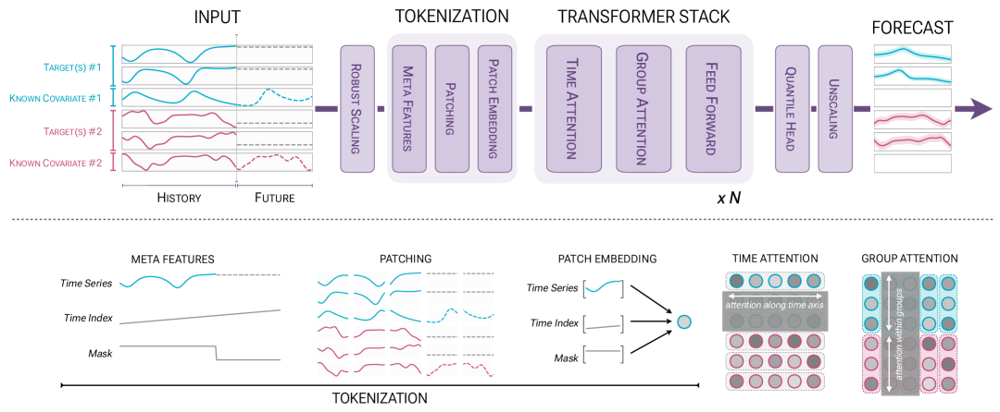
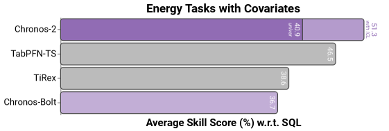

# Chronos-2: 単変量から普遍的予測へ

> 原典: [[translations/2025-chronos-2]] ・ `raw/articles/Chronos-2_ ... .md`（ar5iv, arXiv:2510.15821）
> 著者・年・所属: Abdul Fatir Ansari ほか（Amazon Web Services / Amazon / Freiburg / JKU Linz ほか, 2025）

## 一言まとめ

**単変量・多変量・共変量つきの時系列予測を「ゼロショット」で扱う Amazon の時系列基盤モデル。** 鍵は **group attention**——バッチ内の関連系列・多変量の変量・ターゲットと共変量を「グループ」として束ね、その内部で情報を共有することで**文脈内学習（ICL）**を実現する機構。fev-bench・GIFT-Eval・Chronos Benchmark II で SOTA、とくに**共変量つきタスク**で既存モデルを大差で上回る。

## 背景と問題意識

時系列予測（time series forecasting）は「過去の数値の並びから未来を当てる」問題。近年、言語モデルにならって**事前訓練済み基盤モデル（foundation model）**——大規模な時系列で一度訓練し、未知のデータセットに**追加訓練なし（ゼロショット）**で適用する——が主流になった。Amazon の Chronos 系（→本作の前身 Chronos-Bolt）や Google の TimesFM、Moirai、TiRex などが代表。

だが**ほとんどの基盤モデルは「単変量（univariate）」止まり**——1本の系列の過去だけを見て予測し、(a) 複数系列を同時に予測する**多変量（multivariate）**や、(b) 外部情報（プロモ・天気など）を使う**共変量つき（covariate-informed）**予測ができなかった。現実の予測（小売需要・エネルギー価格・クラウド負荷）ではこれらが決定的なので、実運用への普及を妨げていた。難所は2つ: ①タスクごとに変数の数・意味が違い、未知タスクでの変数間相互作用を**文脈から推論**せねばならない、②多変量・共変量つきの高品質な事前訓練データが希少。

**このリポジトリ（PFN/TabPFN 中心）との接点**: Chronos-2 は PFN ではないが、(1) **in-context learning**（→ [[in-context-learning]]）を予測能力の中核に据える、(2) **合成データのみで汎用能力を獲得**する（TabPFN 流の発想、→ [[prior-data-fitted-networks]]）、(3) 比較対象に **TabPFN-TS**（[[tabular-foundation-model|表形式基盤モデル]]を時系列に適応したもの）が登場し、共通ベンチ **fev-bench**（TabPFN-3 の時系列版 TabPFN-TS-3 も使う）で競合する——という形で表形式基盤モデルの世界と地続きである。

## 提案手法 / 主張

**核心①: group attention（＝ICL の正体）。** Transformer ブロックを **time attention（時間軸＝1系列内のパッチ間で情報集約）** と **group attention（グループ軸＝同一グループの全系列間で各時刻に情報集約）** の交互で構成。「グループ」は柔軟な概念で、用途に応じて (i) 単一系列（＝単変量）、(ii) ソース/メタデータを共有する関連系列の集合（＝**クロス学習**＝few-shot）、(iii) 多変量系列の変量集合（＝多変量予測）、(iv) ターゲット＋過去のみ共変量＋既知共変量（＝共変量つき予測）を表す。バッチ内の**グループ ID** $\bm{g}$ を指定するだけで、アーキ変更なしに全タスク型を1モデルで解ける。連結で文脈を伸ばすのではなく**バッチ軸で共有**するので、変量数 $V$ に対し線形 $\mathcal{O}(V)$ でスケール（Moirai/COSMIC の $\mathcal{O}(V^2)$ より有利）。

**核心②: 合成データで多変量・共変量能力を付与。** 単変量の実データ＋合成（TSI＝トレンド/季節性/不規則性、TCM＝時間的因果モデル）に加え、**multivariatizer（多変量化器）**を導入——基底の単変量生成器（AR/ETS/TSI/KernelSynth）から複数系列を引き、同時刻的（瞬間相関）or 逐次的（リード・ラグ・共和分）に依存を課して多変量構造を合成する。多変量・共変量つきの能力は**完全に合成データ由来**。

**核心③: アーキの細部。** T5 エンコーダ流の encoder-only Transformer。入力は $\sinh^{-1}$（逆双曲線正弦）つきロバストスケーリングで外れ値を抑え、時間インデックス・マスクのメタ特徴量を足してパッチ化→残差ネットで埋め込み。出力は **21分位点**（0.01〜0.99、極端分位点込みで稀イベント・異常検知に強い）の **quantile head**＝確率的予測。base 120M／small 28M パラメータ、A10G 1枚で毎秒300系列。

<figure>

<figcaption>図1（出典: 本論文）: Chronos-2 のパイプライン。正規化→メタ特徴量→パッチ化→埋め込み→time/group attention 交互の Transformer→複数パッチ分位点出力。group attention が「グループ内の系列横断」で情報共有し ICL を実現（青・赤がグループ例）。</figcaption>
</figure>

<figure>

<figcaption>図（出典: 本論文・エネルギー領域）: 共変量つきタスクのスキルスコア。Chronos-2（ICL あり）が TabPFN-TS・TiRex・Chronos-Bolt を大差で上回る。"univar"（単変量モード）からの ICL による上積みが大きい。共変量を扱える TabPFN-TS が2位という構図が繰り返し現れる。</figcaption>
</figure>

## 実験結果と知見

- **3ベンチで SOTA**: fev-bench（100タスク・SQL 指標で勝率 90.7%／スキルスコア 47.3%、次点 TiRex 80.8/42.6 を統計的有意差で凌駕）、GIFT-Eval（97タスク）、Chronos Benchmark II（27タスク・短文脈）すべてで首位。前身 Chronos-Bolt を大きく改善。
- **ICL の効き方を切り分け（§5.2）**: ①**共変量つきタスクで最大の利得**（単変量モードは共変量を無視するので大差）。②**短文脈の単変量タスク**でもクロス学習で改善（Chronos Benchmark II で顕著）。③**多変量タスクでは利得が小さい**——単変量モードでも多変量ネイティブの Toto-1.0 を上回る。著者は Takens の埋め込み定理（1変数の遅延観測から系の力学を再構成できる）を引き、「十分長い過去があれば強い単変量モデルが多変量構造の多くを捉える」と説明。
- **領域ケーススタディ**: エネルギー（電力価格 EPF-DE）・小売（Rossmann 売上）で、共変量（負荷予測・太陽光/風力・プロモ・祝日）を ICL で活用し、平坦・不正確な単変量予測を大きく改善。
- **アブレーション**: small（28M）が base（120M）にスキルスコア約1pt 差・約2倍速。**合成データのみ版（Chronos-2-Synth）が実データ混合版にわずか差**（fev-bench はやや差大）——「実データは無くても効果的な事前訓練ができるかも」を示唆。長文脈（2K→8K）ポストトレーニングが高頻度・長季節性で効く。

## 限界・批判的視点

- **共変量は数値・カテゴリのみ**——テキスト等のマルチモーダル入力は未対応（将来課題）。
- **多変量モデル化の利得が限定的**——明示的な変量間モデル化の価値が、強い単変量＋ICL の前では小さくなる場合がある（タスク依存）。
- **ゼロショットの厳密性**: GIFT-Eval は一部データセットの訓練部分とコーパスが重複（テスト部分は除外）。厳密ゼロショットは合成のみ版で別途評価。
- PFN 的なベイズ的解釈（PPD 近似）は前面に出さず、**分位点回帰（pinball loss）**による点・確率予測。理論的な「事後予測分布の償却」という枠組みでは説明されていない。

## 研究の意義（このリポジトリの文脈で）

時系列基盤モデルを「単変量予測器」から、**多変量・共変量を文脈から取り込む“普遍的”予測器**へ押し上げた。鍵の **group attention は、まさに [[in-context-learning|ICL]] の時系列版**——「関連データを文脈として束ね、重み更新なしにその場で活用する」という、TabPFN/PFN が表形式で行うのと同じ発想を、時系列の多変量・共変量に一般化したもの。さらに **合成データのみで汎用能力が出る**という知見は、TabPFN（[[sources/2022-tabpfn]]）・TabPFN-TS の「合成 prior で事前訓練」路線と強く共鳴する。表形式（TabPFN 一族）と時系列（Chronos 一族）という別系統の基盤モデルが、**ICL ＋合成データ事前訓練**という共通の設計原理に収斂しつつあることを示す一例。なお両者は fev-bench という同じ土俵で競合し、共変量タスクでは TabPFN-TS が Chronos-2 に次ぐ2位を占める。

## 用語と略称

- **時系列基盤モデル（time series foundation model）** = 大規模時系列で一度事前訓練し、未知データにゼロショット適用する予測モデル
- **ICL** = In-Context Learning（文脈内学習）→ [[in-context-learning]]。Chronos-2 では group attention が担う
- **group attention** = グループ（関連系列・変量・ターゲット＋共変量）内で各時刻に情報を集約する注意層。Chronos-2 の ICL の中核
- **クロス学習（cross learning）** = 関連する複数の単変量系列の情報を共有して各系列の予測を改善すること（few-shot 的）
- **共変量（covariates, 外生変数）** = 予測を助ける外部情報。**過去のみ（past-only）** と **既知（known＝未来値も分かる）**、**カテゴリ**を区別
- **単変量/多変量予測** = 1本/複数本の系列を予測。**共変量つき予測（covariate-informed）** = 共変量を使う予測
- **ゼロショット予測** = 追加訓練・適応なしで未知データセットを予測
- **分位点ヘッド（quantile head）/ 分位点回帰（pinball loss）** = 21分位点を出力し確率的予測を行う。pinball 損失で訓練
- **multivariatizer** = 単変量生成器から多変量構造を合成する仕掛け（同時刻的/逐次的）
- **fev-bench / GIFT-Eval / Chronos Benchmark II** = 評価ベンチマーク。fev-bench は共変量タスクを含み TabPFN-TS-3 等も使う
- **SQL/WQL/MASE/WAPE** = スケール化分位点損失/重み付き分位点損失/平均絶対スケール化誤差/重み付き絶対パーセント誤差（評価指標）
- **TabPFN-TS** = 表形式基盤モデル TabPFN を時系列に適応したもの（→ [[tabular-foundation-model]]）。本論文の主要比較対象

## 関連ページ

- [[in-context-learning]] — group attention＝時系列版 ICL。クロス学習・few-shot の構図
- [[tabular-foundation-model]] — TabPFN-TS との競合・fev-bench 共有・合成データ事前訓練という共通路線
- [[prior-data-fitted-networks]] — 「合成 prior で一度訓練し未知データにゼロショット」という共通の設計思想
- [[sources/2022-tabpfn]] — 合成データのみで強い性能、という路線の源流
- [[sources/2026-tabpfn-3]] — 時系列版 TabPFN-TS-3 が同じ fev-bench で評価される（表形式 TFM の時系列展開）
