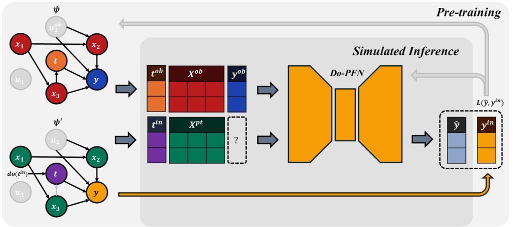
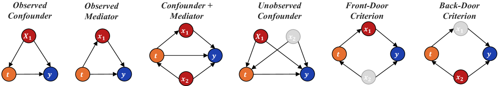

# Do-PFN: 因果効果推定のための文脈内学習

> 原典: [[translations/2025-do-pfn]] ・ `raw/articles/Do-PFN_ ... .md`（ar5iv, arXiv:2506.06039）
> 著者・年・所属: Jake Robertson, Arik Reuter, Siyuan Guo, Noah Hollmann, Frank Hutter, Bernhard Schölkopf（ELLIS Tübingen / MPI-IS / Cambridge / Freiburg / Prior Labs, 2025）

## 一言まとめ

**PFN（Prior-Data Fitted Network, 事前分布から合成したデータで一度だけ訓練し、推論時は重み更新なしに文脈内学習でベイズ推論を近似するネットワーク）を「介入（do 操作）の効果推定」へ拡張したモデル。** 多数の構造的因果モデル（SCM）からなる事前分布で事前訓練し、観測データを文脈として与えるだけで、**因果グラフを一切知らずに**条件付き介入分布 $p(y\mid do(t),x)$ を予測する。**無交絡性を仮定せず**、効果が同定できないケースの不確実性まで表現する点が核心。

## 背景と問題意識

因果効果推定は「ある介入をしたら結果がどう変わるか」を見積もる問題で、医学・経済学などで基盤的。最良の方法は**無作為化比較試験（RCT, randomized controlled trial）**だが、高コスト・非倫理的・不可能なことが多く、現実には**観測データ**から推定せざるを得ない。

既存手法には共通して**強い制約**があった——(1) 介入データそのものを要求する、(2) 真の因果グラフを既知とする、(3) **無交絡性（unconfoundedness＝無視可能性 ignorability）**——「観測共変量で条件づければ処置が潜在結果から独立」という、実務では検証困難な仮定——を要求する。因果フォレストや二重頑健法はみなこの (3) に依拠する。

Do-PFN の問いは「**TabPFN のメタ学習の発想を、予測より難しい『因果』に転移できるか**」。TabPFN（[[sources/2022-tabpfn]]）は合成データのみで事前訓練して実データの予測で SOTA を出した。これは [[bayesian-inference]] の事後予測分布（PPD）を [[in-context-learning|文脈内学習]] で償却（amortize, 一度払えば後は安く済ます）近似する [[prior-data-fitted-networks|PFN]] の典型例。Do-PFN は、その合成 prior を「**介入つき SCM の集合**」にすることで、PFN を因果効果推定へ持ち込む。

> **同時期の姉妹研究 CausalPFN との違いが本論文の理解の鍵**（→ [[sources/2025-causalpfn]]）。両者とも「PFN を因果効果推定へ」だが、立つ因果の枠組みが正反対に近い:
> - **CausalPFN**（Toronto/Layer6）: **潜在結果フレームワーク（Rubin）＋強い ignorability を要求**。CATE/ATE を推定。
> - **Do-PFN**（Freiburg/Tübingen, Hutter・Schölkopf）: **SCM／do 計算（Pearl）**に立つ。SCM 上の事前分布から**条件付き介入分布（CID）**を予測し、**ignorability を要求しない**（交絡・同定不能ケースも prior に含め、不確実性として表現）。

## 提案手法 / 主張

**狙う量＝条件付き介入分布（CID, Conditional Interventional Distribution）** $p(y\mid do(t),\mathbf{x})$。「特徴量 $\mathbf{x}$ を持つ個体に介入 $do(t)$ を施したら結果 $y$ はどう分布するか」。ここから CATE（条件付き平均処置効果）$\tau(x)=\mathbb{E}[y\mid do(1),x]-\mathbb{E}[y\mid do(0),x]$ が出る。$do(t)$ は Pearl の介入演算子で、SCM のグラフで「$t$ に入る辺を全部切って $t$ を固定する」操作。

**核心アイデア①: SCM 上の事前分布＋介入のシミュレーション。** 事前訓練の各反復で (1) ランダムな SCM $\psi$（DAG＋加法ノイズモデルの構造方程式）をサンプリングし、(2) そこから観測データセット $\mathcal{D}^{ob}=\{(t,x,y)\}$ を生成、(3) さらに**介入 $do(t^{in})$ を施した SCM** から介入結果 $y^{in}$ を生成する。共変量 $\mathbf{x}^{pt}$ は**介入前（pre-treatment）の値**として取る（処置の子孫も含めて）。これにより「観測データだけ見て介入結果を当てる」タスクを大量に作る。重要なのは prior に**交絡あり・未観測交絡あり・同定不能**な SCM も含めること——TabPFN が SCM を予測の prior に使ったのに対し、Do-PFN は**介入まで含む SCM**を prior にする。

**核心アイデア②: 前向き KL 最適性（命題1）。** Algorithm 1 の負の対数尤度最小化（SGD）が、真の CID と モデル $q_\theta$ の間の**期待前向き KL ダイバージェンスの最小化**に一致することを証明（付録 A）。PFN 原典の「損失最小化＝PPD 近似」を**介入分布 CID** へ一般化した形。注意点として、最適性は**合成データ生成過程に関する期待**で成り立つ（prior が現実を捉えている限りで有効）。また prior は同定可能性を保証しないので、**同定不能な効果の不確実性を $q_\theta$ がそのまま捉えるのが理想**——実験でそれが実際に起きることを示す。

**核心アイデア③: TabPFN ベースの軽量アーキテクチャ。** TabPFN v2 とほぼ同じ Transformer。入力に「先頭列＝処置、残り＝共変量」を示す指示子を足すだけ。**730 万パラメータ**と小さく、RTX 2080 一枚で48時間訓練。出力は離散ビン分布（bar distribution）で不確実性を表現。CATE は $do(1)$ と $do(0)$ の予測平均の差として得る。

<figure>

<figcaption>図1（出典: 本論文）: Do-PFN の概観。事前訓練で多数の SCM をサンプリングし、各 SCM から観測データ D^ob と介入データ D^in を生成。観測データ全体＋クエリ (t^in, x^pt) を入力に介入結果 ŷ を予測し、真値 y^in との損失で訓練。推論時は観測データのみで条件付き介入分布（CID）を予測し、因果グラフは不要。</figcaption>
</figure>

<figure>

<figcaption>図2（出典: 本論文）: 6つの因果ケーススタディのグラフ。処置 t（橙）・共変量 x（赤）・結果 y（青）・未観測変数（灰）。Observed/Unobserved Confounder、Observed Mediator、Confounder+Mediator、Back-Door、Front-Door を含み、フロントドア/バックドア調整を Do-PFN が自動で行うことを要求する。</figcaption>
</figure>

## 実験結果と知見

- **CID 予測（6合成ケーススタディ・1000+データセット）**: Do-PFN は Random Forest・TabPFN(v2)・**Dont-PFN**（同じ prior で観測結果だけを予測するよう訓練した対照モデル）を統計的に有意に上回る。Do-PFN と Dont-PFN の差が「事前訓練が単なる観測 PPD とは別物（＝因果効果）を学んでいる」証拠。**真のグラフを使えるゴールドスタンダード DoWhy(Int./Cntf.)** と competitive で、グラフを知らないのに DoWhy(Cntf.) に最も近い。
- **同定不能ケースでも勝つ**: 「Unobserved Confounder」は正確な効果が原理的に推定不能だが、Do-PFN はデータに残る「因果的痕跡」から**もっともらしい解の集合**を出し、伝統手法（解けないと見なす）を上回る。
- **CATE 推定**: Do-PFN-CATE がメタ学習器・DML（二重機械学習）を有意に上回り、DoWhy-CATE(Cntf.) と同等。**十分性が破れるとゴールドスタンダードすら上回る**（図6）。バイアス分解（付録 D.4）で、Do-PFN は小さい正バイアスを持つが $do(0)/do(1)$ で同程度なので **CATE では相殺**され、CID 単体予測より CATE が強い理由を説明。
- **実世界ハイブリッド（Amazon Sales・Law School Admissions）**: 合意された因果グラフを持つ実データで、ゴールドスタンダードに近い予測。合成 prior の強さが実データに転移する初期証拠。
- **アブレーション**: 小規模データ（5〜2000 サンプル）に強い、ATE のベースレートに鈍感（「処置は必ず効く」という帰納バイアスを持たない＝問題誤特定に頑健）、大グラフ（最大10ノード）でも一貫。**較正（PICP）**: 同定可能ケースではやや自信過小だが、**同定不能ケースでは正しく不確実**（高エントロピー）。

## 限界・批判的視点

- **prior への依存**: 汎化は SCM 上の合成 prior $p(\psi)$ が実世界の因果的複雑さを捉えるかに決定的に依存。prior-現実の不一致への頑健性・prior 設計の原理・実世界ベンチマークが今後の課題。
- **同定可能性理論が未整備**: 学習された予測的不確実性が形式的な因果同定可能性の境界とどう対応するか、償却推定器の統計的保証は発展途上。
- **解釈可能性**: Do-PFN が内部で「暗黙にグラフを同定→調整」しているのか不明。機構的解釈可能性が必要。
- **二値介入のみ**: 多値・連続介入、反事実、非 i.i.d. データは未対応。

## 研究の意義

CausalPFN と並んで「**PFN／文脈内学習が因果効果推定に届く**」ことを示した、ほぼ同時期の双子論文。とくに Do-PFN は **Pearl の do 計算／SCM の系譜**に立ち、(a) **因果グラフを与えなくてよい**、(b) **無交絡性を要求しない**、(c) **同定不能性を不確実性として正しく表現する**——という、伝統的な因果推論の3つの強い前提を同時に緩める点が新しい。これは [[structural-causal-model]] が「予測の prior 素材」だった用法を超え、**SCM そのもの（介入込み）を PFN の prior に据える**最初の本格例。PFN の射程が予測（TabPFN）・最適化（[[sources/2023-pfns4bo]]・[[sources/2025-git-bo]]）・因果（本論文・[[sources/2025-causalpfn]]）へ広がる潮流を、do 計算側から補強する。

## 用語と略称

- **PFN** = Prior-Data Fitted Network → [[prior-data-fitted-networks]]
- **SCM** = Structural Causal Model（構造的因果モデル。DAG＋構造方程式）→ [[structural-causal-model]]
- **CID** = Conditional Interventional Distribution（条件付き介入分布）$p(y\mid do(t),x)$
- **do(t) / do 計算** = Pearl の介入演算子。$t$ に入る辺を切り $t$ を固定する操作と、その効果を観測量から計算する規則
- **CATE** = Conditional Average Treatment Effect（条件付き平均処置効果）／ **ATE** = Average Treatment Effect
- **無交絡性（unconfoundedness）= 無視可能性（ignorability）** = 観測共変量で条件づければ処置が潜在結果から独立、という仮定。Do-PFN は**これを要求しない**
- **同定可能性（identifiability）** = 因果効果が観測分布だけから一意に決まる性質。未観測交絡があると同定不能になりうる
- **バックドア/フロントドア基準** = do 計算で因果効果を観測量から推定可能にする調整法
- **ANM** = Additive Noise Model（加法ノイズモデル）。$z_k=\gamma(\sum w_l z_l)+\epsilon_k$
- **PPD** = Posterior Predictive Distribution（事後予測分布）→ [[bayesian-inference]]
- **PICP** = Prediction Interval Coverage Probability（予測区間被覆確率。較正の指標）
- **DoWhy** = 因果グラフを与えて SCM を当てはめ介入/反事実を予測するゴールドスタンダードのライブラリ（本論文では構造方程式に TabPFN を使用）
- **DML** = Double Machine Learning（二重機械学習）

## 関連ページ

- [[structural-causal-model]] — Do-PFN の prior の中核（介入つき SCM）。本論文の主たる概念ハブ
- [[sources/2025-causalpfn]] — 姉妹研究。潜在結果＋ignorability で CATE を推定（Do-PFN は do 計算＋SCM で CID を推定）
- [[prior-data-fitted-networks]] — PFN の中核概念。Do-PFN は因果（介入）への拡張
- [[in-context-learning]] — 観測データ＝文脈から介入効果を ICL で予測
- [[bayesian-inference]] — 償却推論。data-prior 損失＝CID への前向き KL 最小化（命題1）
- [[sources/2022-tabpfn]] — Do-PFN のアーキテクチャ・prior 生成器の土台
- [[sources/2021-transformers-can-do-bayesian-inference]] — 「損失最小化＝PPD 近似」の原典（本論文はそれを CID へ一般化）
