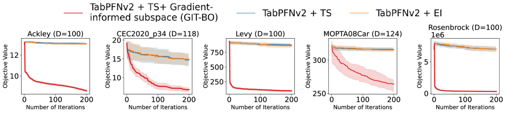

# GIT-BO: 表形式基盤モデルによる高次元ベイズ最適化（arXiv 2025）

> 原典: [[translations/2025-git-bo]] ・ `raw/articles/GIT-BO_ High-Dimensional Bayesian Optimization with Tabular Foundation Models.md`（arXiv:2505.20685）
> 著者・年: Rosen Ting-Ying Yu, Cyril Picard, Faez Ahmed（MIT）/ 2025

## 一言まとめ

**TabPFN v2 を高次元ベイズ最適化（[[bayesian-optimization]]）のサロゲートに使い、GP ベース手法を最大 500 次元で凌駕した論文**。これまで [[bayesian-optimization]] / [[tabular-foundation-model]] / [[gaussian-process]] が「高次元 BO のサロゲートに TabPFNv2 を使う流れの源流」として名前だけ挙げてきた **GIT-BO の本体**。鍵は、固定重みの TabPFN v2（[[prior-data-fitted-networks|PFN]] の表形式版）が GP のように「カーネルを適応できない」弱点を、**TabPFN の順伝播から得る勾配で“探索すべき低次元部分空間”を毎反復つくり直す**ことで補った点。GP の $O(n^3)$ 再訓練を不要にし、SAASBO 等より 2 桁速く、23 ベンチ・63 変種で SOTA。

## 背景と問題意識

BO は「サロゲート＋獲得関数」で高コストなブラックボックス関数を少ない評価回数で最適化する（[[sources/2018-bayesian-optimization-tutorial]]）。だが**次元が 100 を超えると次元の呪い**で苦戦する。従来の高次元 BO は (i) 低次元埋め込み（REMBO/HESBO/ALEBO/BAXUS）か (ii) 構造活用（TURBO の信頼領域、SAASBO の疎な軸選択）で緩和するが、いずれも**GP の反復再訓練**（$O(n^3)$ かサンプル数の 3 乗）と固定仮定のオーバーヘッドを抱える。

一方 [[prior-data-fitted-networks|PFN]] 系は GP を置き換える高速サロゲートになりうる（[[sources/2023-pfns4bo]] が低次元 BO で実証）。TabPFN v2（[[sources/2025-tabpfn-v2]]）は最大 500 次元入力に対応。だが**固定パラメータの基盤モデルゆえ、GP のようにカーネルハイパラを最適化中に適応して“主要な探索方向”を見つけられない**——この弱点を埋めるのが GIT-BO。

## 提案手法 / 主張

**(1) TabPFN v2 をサロゲートに**　各反復で観測データ $D_n$ を文脈に与え、TabPFN v2 回帰モデルが**1 回の順伝播で予測平均 $\mu_n(x)$ と予測分散 $\sigma_n^2(x)$**（ベイズ事後平均の近似）を出す。GP 事後の当てはめは一切しない。

**(2) 勾配誘導部分空間（GI subspace）— 本論文の核心**　TabPFN の予測平均に対する**1 ステップの誤差逆伝播で勾配 $\nabla_x\mu_n(x)$** を得る（固定重みでも順伝播の微分は取れる）。観測点での勾配から**診断行列（フィッシャー情報行列）$H=\mathbb{E}[\nabla_x\mu_n\,\nabla_x\mu_n^\top]$** を作り、その**上位 $r$ 固有ベクトル $V_r$**（既定 $r=15$）が「TabPFN の予測が最も敏感に動く方向」＝能動部分空間を張る。次の探索候補をこの低次元部分空間に制限し $x_{\text{cand}}=\bar{x}_{ref}+V_r z$ で元空間に戻す。**データが増えるたびに部分空間を再計算**（GP の再訓練の代わりに、勾配で“探索方向”を更新）。
- 着想は非線形ベイズ逆問題の次元削減（$\phi$-Sobolev 不等式・能動部分空間）。LLM で勾配がモデル挙動の誘導や分布シフト適応に使える知見も動機。

**(3) 獲得関数＝トンプソンサンプリング（TS）**　予測事後から 512 サンプルを引き、最大値の候補を次に評価。ただし**GI 部分空間内に制限**して選ぶ。

**(4) アルゴリズム全体（Algorithm 1）**　LHS で 200 点初期化 → 各反復: TabPFN 当てはめ→勾配→$H$→$V_r$→部分空間でサンプリング→TS で次点→評価して追加。

<figure>

<figcaption>図5（再掲）: アブレーション。GI 部分空間なしのバニラ TabPFNv2 BO（EI/TS とも）は高次元探索に大きく失敗し、GIT-BO がリグレットで 8.6 倍良い。勾配誘導部分空間が性能の決定的要因であることを示す。［[[translations/2025-git-bo]] 図5 より］</figcaption>
</figure>

## 実験結果と知見

- **設定**: 23 ベンチ（合成11＋実世界12）、スケーラブル問題は $D=\{100,200,300,400,500\}$ で計 63 変種。各 20 試行、同一の 200 点初期化。ベースライン＝ランダム探索・SAASBO・TURBO・HESBO・ALEBO。Friedman/Wilcoxon＋Holm 補正で統計ランク。
- **全体ランク（図2）**: GIT-BO が**首位（1.97）**、SAASBO 3.51・ALEBO(d=10) 4.11・HESBO(d=20) 5.14。25 反復以内に支配的に。実行時間 1 試行 ≈ $10^3$ 秒で **SAASBO/ALEBO より 2 桁速い** → 速度×質のパレートフロント。
- **合成（図3）**: 45 変種中 **35 で勝利**。高次元 $D\geq 300$ で特に優位（Ackley は全次元支配、Levy は高次元で逆転）。Styblinski-Tang・Michalewicz は苦手（No Free Lunch）。
- **実世界（図4）**: CEC 電力系統 4 問題と 388 次元 SVM-HPO で全ベースライン超え。平均ランク 1.15。MOPTA08/Mazda 等は 3 位（TabPFN v2 の訓練分布と異なる可能性）。SAASBO が最良の問題でも、SAASBO 3 時間に対し GIT-BO は 15 分。
- **アブレーション（図5）**: **GI 部分空間なしのバニラ TabPFNv2 は EI でも TS でも大失敗**（GIT-BO がリグレット 8.6 倍良い）。部分空間が肝。

## 限界・批判的視点

- **GPU 必須**（大きな基盤モデルゆえ。GPU なしユーザーには不利）。
- **500 次元の上限**（TabPFN v2 の入力次元上限。超えるにはモデル再訓練かアンサンブルが要る）。
- **$r$ と参照点 $x_{ref}$ の選択**が性能に影響（自動化・メタ学習は今後）。
- **訓練分布と離れた実問題（車設計等）で順位が落ちる**——TabPFN v2 の prior 依存（[[tabular-foundation-model]] の「事前分布が想定しない状況で劣化」と整合）。

## 意義（なぜ重要か）

これまで wiki が「TabPFNv2 を高次元 BO のサロゲートに使う」と何度も予告してきた、その**具体実装の本体**。PFNs4BO（[[sources/2023-pfns4bo]]）が**低次元**で PFN を GP の置換にしたのに対し、GIT-BO は **高次元（100〜500 次元）** で、しかも「固定基盤モデルは探索方向を適応できない」という弱点を**順伝播の勾配で能動部分空間を作る**という独自手法で克服した。GP の $O(n^3)$ 再訓練という [[gaussian-process]] のボトルネックを、TabPFN の 1 回の順伝播＋勾配で置き換える発想で、[[bayesian-optimization]] のサロゲートを TFM へ移す流れ（[[tabular-foundation-model]]）を高次元まで押し広げた。「基盤モデルの順伝播から勾配を取り出して使う」のは LLM 的な発想を BO に持ち込んだ点でも示唆的。

## 用語と略称

- **BO** = Bayesian Optimization（ベイズ最適化）→ [[bayesian-optimization]]
- **TFM** = Tabular Foundation Model（表形式基盤モデル。ここでは TabPFN v2）→ [[tabular-foundation-model]]
- **PFN** = Prior-Data Fitted Network → [[prior-data-fitted-networks]]
- **GIT-BO** = Gradient-Informed Bayesian Optimization using Tabular Foundation Models
- **GI 部分空間（gradient-informed / active subspace）** = TabPFN 予測が最も敏感に動く低次元方向。診断行列 $H$ の上位固有ベクトルで張る
- **診断行列 / フィッシャー情報行列 $H$** = $\mathbb{E}[\nabla_x\mu_n\,\nabla_x\mu_n^\top]$。勾配の外積の期待
- **TS** = Thompson Sampling（予測事後からサンプルし最大値を選ぶ獲得関数）→ [[bayesian-optimization]]
- **次元の呪い（curse of dimensionality）** = 次元増で探索が指数的に難しくなる現象
- **SAASBO / TURBO / HESBO / ALEBO / REMBO / BAXUS** = GP ベースの高次元 BO 手法（ベースライン）
- **LHS** = Latin Hypercube Sampling（ラテン超方格サンプリング、初期点生成）
- **HPO** = Hyperparameter Optimization（ハイパーパラメータ最適化）

## 関連ページ

- [[bayesian-optimization]] — GIT-BO が属する BO の枠組み（サロゲート＋獲得関数）
- [[tabular-foundation-model]] — サロゲートに使う TabPFN v2（高次元 BO 応用の本体）
- [[prior-data-fitted-networks]] — TabPFN を生む PFN の枠組み（固定重みでの ICL 推論）
- [[sources/2023-pfns4bo]] — PFN を**低次元** BO サロゲートにした先行（GIT-BO は高次元版）
- [[sources/2025-tabpfn-v2]] — サロゲートとして使う 500 次元対応 TabPFN v2
- [[gaussian-process]] — 置き換える従来サロゲート（$O(n^3)$・カーネル適応のボトルネック）
- [[sources/2018-bayesian-optimization-tutorial]] — 獲得関数・BO の基礎
- [[questions/pfn-paper-and-gaussian-process]] — PFN が GP を置き換える関係
- [[translations/2025-git-bo]] — 本文 §1〜6 の翻訳
