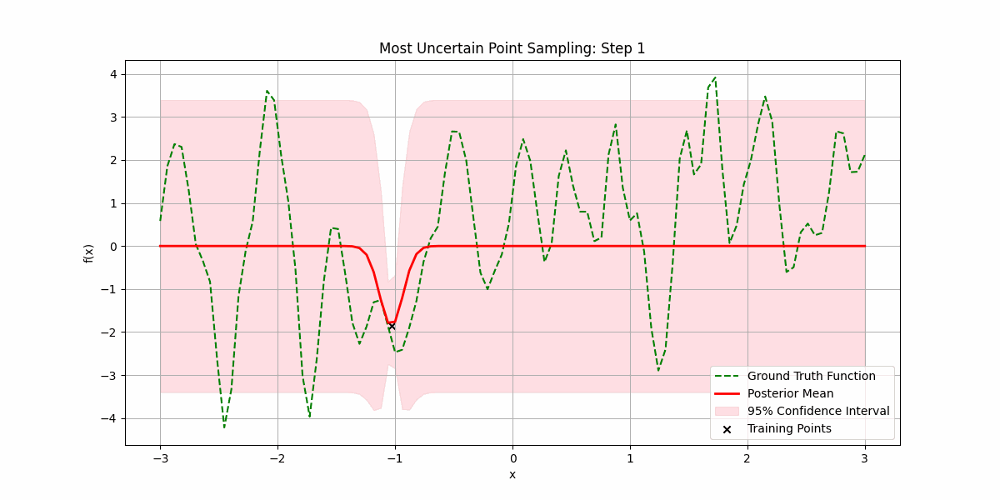

# ガウス過程への直感的入門（fanpu.io 2025）

> 原典: [[translations/2025-gp-intuitive-intro]] ・ `raw/articles/An Intuitive Introduction to Gaussian Processes.md`（fanpu.io/blog/2025/gaussian-processes/）
> 著者・媒体・年: Fan Pu Zeng / 個人ブログ fanpu.io / 2025

## 一言まとめ

**ガウス過程（[[gaussian-process]]）を「ノンパラメトリックモデル」と「ニューラルネットとの深い関係」という 2 つの切り口から動機づける直感的入門ブログ**。「関数を無限次元ベクトルと見なし、訓練点という有限部分だけを考えれば非可算無限の関数空間と同じモデルが計算可能になる」という核心を、事前/事後の図・ランダムサンプリングと**不確実性優先サンプリング（能動学習）**・株価予測（NVDA、定常性の限界つき）のアニメで見せる。ベイズモデリング（コイン投げ）を復習してから GP の定義・RBF カーネル・閉形式の事後予測・MAP を導く。締めくくりは**「ガウス重みで初期化した NN は無限幅極限で GP に収束する」**という予告（NNGP）。この wiki では [[gaussian-process]] の **6 本目のリファレンス**で、特に **NN ↔ GP の橋渡し**という角度が他の入門にない独自価値であり、PFN（[[prior-data-fitted-networks]]）が「なぜニューラルネットでベイズ推論を近似できるのか」を理解する補助線になる。

## 背景と問題意識

深層学習はパラメトリックモデル（固定個数の重み）に支配されているが、k-NN・決定木・カーネル密度推定のような**ノンパラメトリック**（データ量に応じて複雑さが増す）モデルもある。著者は GP を「過小評価されたノンパラメトリック手法」と位置づけ、回帰の本質的課題——観測点を通る関数は非可算個あり、どれを選ぶか——への 2 つの構え（(1) 関数クラスを制限する＝制限的すぎ/過学習のリスク、(2) 関数空間に事前分布を置く＝計算困難に見える）を提示する。GP は (2) を**有限のデータ点だけ見れば計算可能**にする枠組みとして導入される。

## 内容（直感の積み上げ）

1. **なぜ「過程」か**: 変数の確率分布 → 関数の確率分布＝**確率過程**。ガウスに限ると学習・推論が容易。
2. **動機の可視化**: 事前分布（平均 0・±1.96 の 95% 帯、図1）→ 2 点観測後の事後（観測点で帯が縮む、図2）。カーネルが「近い点ほど相関」を与える。点を増やして滑らかな関数に当てはめる（図3）。**不確実性が高い所を優先サンプリング**して少数で当てはめる（図4＝能動学習 / 獲得関数の発想）。時系列予測（NVDA 株価、図5）は**定常性（stationarity）仮定**ゆえ株式には不向き、と限界も率直に示す。
3. **ベイズモデリングの復習**: コイン投げの偏り $\theta$ に一様な Beta(1,1) 事前→共役性で事後も Beta（図6、表7裏3で平均0.7）。ベイズ則 `posterior = likelihood×prior / marginal`、**予測分布** $p(\mathcal{D}_*\mid\mathcal{D})=\int p(\mathcal{D}_*\mid\theta)p(\theta\mid\mathcal{D})d\theta$。
4. **GP 本体**: 定義（任意有限個が同時ガウス）、平均関数 $m(x)$・共分散関数 $k(x,x')$。**RBF（二乗指数）カーネル** $\exp(-(x-x')^2/2\sigma^2)$（近い→1、遠い→0、図の共分散行列）。**予測**: 訓練とテストの同時ガウスから、事後も閉形式ガウス——$\mu_*=K(X_*,X)K(X,X)^{-1}\mathbf{f}$、$\Sigma_*=K(X_*,X_*)-K(X_*,X)K(X,X)^{-1}K(X,X_*)$。値はサンプリングか、MAP＝事後平均で得る。
5. **NN との関係（予告）**: 次稿で「ガウス重み初期化の NN が**無限幅極限で GP に収束**」を示す、と締める（NNGP）。

<figure>

<figcaption>図4（再掲）: 最も不確実な点を優先してサンプリングし、少数の観測で滑らかな関数に当てはめる（能動学習＝不確実性で次の観測点を選ぶ）。［[[translations/2025-gp-intuitive-intro]] より］</figcaption>
</figure>

## 限界・批判的視点

- **入門ブログ**で、事後の式変形の導出や RKHS、$O(n^3)$ スケール問題には踏み込まない（そこは [[sources/2021-gp-models-intro]] / [[gaussian-process]]）。
- 著者自身が示すとおり、RBF 等の**定常カーネルは株価のような非定常データに不向き**（NVDA 例の失敗）。
- 核心の **NN-GP 等価性は本稿では予告のみ**（証明・詳細は次稿に委ねられる）。
- コードは Jupyter ノートブックの `<iframe>` 埋め込みで、本文には数式以外の式画像はない。

## 意義（なぜこの wiki に重要か）

1. **NN ↔ GP の橋渡し（最重要）**: 「無限幅 NN ＝ GP（NNGP）」は、ニューラルネットがベイズ的な関数事前を実装しているという視点を与える。これは PFN（[[prior-data-fitted-networks]]）が **Transformer の前向き計算でベイズ推論（[[bayesian-inference]] の事後予測分布）を償却近似できる**ことの理論的土壌の一つ。GP を「近似する対象」「事前分布の素材」として扱う本 wiki の文脈（[[sources/2021-transformers-can-do-bayesian-inference]]）に、NN 側からの接続を補う。
2. **能動学習＝獲得関数の直感**: 図4 の「不確実な所を優先サンプリング」は、[[bayesian-optimization]] の獲得関数（探索 vs 活用）の最も平易な絵。GP の予測不確実性が「次にどこを観測すべきか」を導くという発想を視覚的に掴ませる。
3. **GP リファレンス群の「NN 接続つき直感」層**: [[gaussian-process]] の入門群（[[sources/2019-gp-not-for-dummies]] / [[sources/2020-gp-regression-tutorial]] / [[sources/2022-gpr-part1-basics]]）・応用（[[sources/2022-gpr-part2-concrete]]）・上級理論（[[sources/2021-gp-models-intro]]）に対し、本稿は**ノンパラメトリック性とニューラルネットとの関係**を軸にした直感的入門として補完する。

## 用語と略称

- **GP** = Gaussian Process（ガウス過程）→ [[gaussian-process]]
- **ノンパラメトリックモデル** = データ量に応じて複雑さ（実質パラメータ数）が増すモデル（k-NN・決定木・KDE・GP）
- **確率過程（stochastic process）** = 関数の上の確率分布。ガウスに限ったものが GP
- **RBF / 二乗指数（SE）カーネル** = $\exp(-(x-x')^2/2\sigma^2)$。近い点ほど高相関＝滑らかさを与える
- **定常性（stationarity）** = 統計的特性が位置/時間で不変というカーネルの仮定（株価のような非定常データに不向き）
- **能動学習（active learning）** = 最も不確実な点を優先して観測しサンプル効率を上げる戦略 → [[bayesian-optimization]]
- **NNGP（無限幅 NN ＝ GP）** = ガウス重みで初期化した NN が無限幅極限で GP に収束する対応
- **MAP** = Maximum A Posteriori（最大事後）推定。GP では事後平均 $\mu_*$
- **PPD / 予測分布（predictive distribution）** = 観測を条件にした予測分布 → [[bayesian-inference]]

## 参照（原典内リンク）

- コード: Jupyter ノートブック `fanpu.io/assets/jupyter/gaussian-processes/gp.ipynb.html`（§Code Walkthrough の iframe 埋め込み）
- 続編予告: ガウス重み初期化 NN の無限幅極限＝GP（NNGP）を扱う次稿

## 関連ページ

- [[gaussian-process]] — 本記事が解説する概念（この source は「NN 接続つき直感」リファレンス）
- [[sources/2019-gp-not-for-dummies]] / [[sources/2020-gp-regression-tutorial]] — 他の直感的入門
- [[sources/2021-gp-models-intro]] — 上級（RKHS・モデル誤差境界・GP 動的モデル）
- [[prior-data-fitted-networks]] — NN でベイズ推論を償却近似（NN-GP 接続が土壌）
- [[bayesian-inference]] — 事後予測分布／較正された不確実性
- [[bayesian-optimization]] — 不確実性優先サンプリング＝能動学習/獲得関数の発想
- [[translations/2025-gp-intuitive-intro]] — 本文の翻訳
