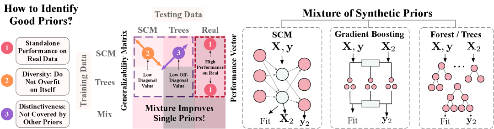

# Mitra: 表形式基盤モデルを強化する混合合成事前分布（arXiv 2025）

> 原典: [[translations/2025-mitra]] ・ `raw/articles/Mitra_ Mixed Synthetic Priors for Enhancing Tabular Foundation Models.md`（arXiv:2510.21204）
> 著者・年: Xiyuan Zhang ら（Amazon、一部 CMU）/ 2025

## 一言まとめ

**「表形式基盤モデル（[[tabular-foundation-model]]）の性能は、合成データを生成する事前分布の設計でほぼ決まる」という主張を、事前分布の良し悪しを測る原理（性能・多様性・独自性）として初めて体系化した論文**。Amazon の Mitra は、[[structural-causal-model|SCM]]（構造的因果モデル）と**木ベース事前分布（TBP; 決定木・extra tree・勾配ブースティング・ランダムフォレスト）の混合**を厳選して [[prior-data-fitted-networks|PFN]] 流に事前訓練した TFM で、TabPFNv2・TabICL を分類・回帰で一貫して上回り、サンプル効率も高い。これまで [[prior-data-fitted-networks]] / [[structural-causal-model]] が「PFN の性能は事前分布の設計に決定的に依存する」と述べてきたことを、**「どんな事前分布を混ぜれば良いか」を測る定量的フレームワーク**に落とし込んだ点が新しい。

## 背景と問題意識

TFM（TabPFN 系）は、実データを一切見ず**純粋な合成データで一度だけ事前訓練**し、推論時は下流データを文脈内例として [[in-context-learning|ICL]] で予測する。性能は「どんな合成データ＝どんな事前分布から生成したか」に決定的に依存するが、これまでの研究は**固定的・ヒューリスティックな事前分布**に頼り、「何が良い事前分布か」「どう混ぜれば汎化するか」が未解明だった（TabPFN は SCM、TabForestPFN/Attic は SCM＋決定木、TabICL は SCM＋XGBoost を**理由を説明せず**混ぜていた）。Mitra はこの空白を埋める。

## 提案手法 / 主張

**(1) 良い事前分布の 3 基準（本論文の核心）**
事前訓練済みモデルを「各事前分布から生成したデータ」上で相互評価した**汎化性行列 $\mathbf{G}$**（行＝訓練元の事前分布、列＝テスト先の事前分布）と、実データ性能の**性能ベクトル $\mathbf{P}$** を作り、良い事前分布を 3 軸で測る:
- **性能（Performance）**: その事前分布だけで訓練したモデルの実データ性能（$\mathbf{P}_i$ が高い）。
- **多様性（Diversity）**: 自分自身の分布に過適合しにくい（$\mathbf{G}$ の**対角 $\mathbf{G}_{ii}$ が低い**）。
- **独自性（Distinctiveness）**: 他の事前分布で訓練したモデルに予測されにくい（混合内の他事前分布から見た**非対角 $\mathbf{G}_{ij}$ が低い**）。
混合は「性能と多様性のバランス」で選び、$\min_j\max_{i\in\text{mix}}\mathbf{G}_{ij}$ が最小の事前分布を足すとカバレッジが増える。

**(2) Mitra の事前分布混合**
- **SCM**: 多様性が高く実データ単独性能も最良 → 採用。
- **TBP（木ベース）**: SCM で訓練したモデルが TBP 生成データに必ずしも汎化しない＝**独自性**ゆえ採用。間接サンプリング（DT/ET/GB/RF を合成データに当てはめて生成）＋**直接サンプリング DSRF**（モデル当てはめ不要。ランダムな分割インデックス/閾値で条件付き分布を直接構築）。
- 最終混合は **50% SCM ＋ 50% TBP（6 種を等重み）**。アブレーションで SCM→ET→GB→DT→RF→DSRF の順に重要。

**(3) モデル非依存・SOTA**
事前分布は**行ベース 1D アテンション（Mitra 1D, 37M）でも要素ベース 2D アテンション（Mitra, 72M）でも**一貫して効く。2D の Mitra が SOTA。アーキは 12 層・512 埋め込み・FlashAttention。**最大 16 特徴量・640 行**でしか事前訓練しないのに大きな下流に汎化。

<figure>

<figcaption>図1（再掲）: Mitra の事前分布混合と、汎化性行列 G・性能ベクトル P。良い事前分布の 3 要因（性能・多様性・独自性）が SCM＋木ベース事前分布の混合に至る。［[[translations/2025-mitra]] 図1 より］</figcaption>
</figure>

## 実験結果と知見

- **分類（137 データセット統合: TabRepo/TabZilla/AMLB）**: **Mitra (+ef) が首位**（Elo 1136）、Attic (+ef) 1128・TabPFNv2 (+e) 1107 を上回る。ICL 単独でも、最大 16 特徴量（TabPFNv2 の 1/10）の事前訓練にもかかわらず TabPFNv2 に肉薄。
- **回帰（TabRepo 10 分割）**: **Mitra (+ef) が首位**（Elo 1140）。ただし大特徴量回帰（AMLB+CTR23, 表18）では TabPFNv2 (+e) が優勢で、Mitra の小規模特化が出る。
- **サンプル効率**: ICL 例を 10〜75% に減らしても、全比率で **Mitra > TabPFNv2 > TabICL**。多様な事前分布ほど少データ汎化に効く。
- **高度なアンサンブル**: **交差検証バギングを fine-tuned TFM に適用したのは本研究が初**。Mitra (bagging) が TabPFNv2 PHE・AutoGluon best を 300〜3600 秒予算で上回る。
- **ファインチューニング**: アンサンブルサイズによらず Mitra が最良。少特徴量事前訓練ゆえ下流適応の伸びしろが大きい。
- **スケーリング則**: モデルは 12 層超で飽和、データは約 18K ステップ（≒3700 万データセット）で飽和。
- **TabArena**: Mitra は**最強の単一モデル**で、他手法が 200 反復 HPO してもパレート効率（訓練/推論時間）で優位。TabPFNv2 を HPO＋アンサンブルしたときのみ上回られる。
- **決定境界（付録 C.8）**: 軸並行データで Mitra は TabPFNv2 より規則的・断片化が少ない。スパイラル/Swiss roll では **GP 分類器が強く、GP ベース事前分布を混合に足す今後の課題**を動機づける。

## 限界・批判的視点

- **大特徴量回帰で TabPFNv2 を一貫して超えない**（最大 16 特徴量・640 行でしか事前訓練しないため）。
- 混合重みは固定（HPO で下流適応する余地あり）。
- **連続事前分布（GP）が混合に未導入**——著者自身が GP ベース事前分布の追加を今後の課題に挙げる（[[gaussian-process]] が TFM の合成 prior 素材として繰り返し登場する流れと符合）。
- 事前訓練のスケール（行・特徴量）が今後の伸びしろ。

## 意義（なぜ重要か）

PFN 系の「性能は事前分布の設計次第」という経験則を、**「どんな事前分布を混ぜると良いか」を測れる原理（性能・多様性・独自性＝汎化性行列 $\mathbf{G}$ と性能ベクトル $\mathbf{P}$）**に変えた点が貢献。これは [[structural-causal-model]] が述べる「prior の多様性が最大の性能要因」（TabICLv2 のアブレーション）を、**事前分布の選び方の方法論**として一般化したものにあたる。TabPFNv2/TabICL の「SCM＋1 つの木 prior」を、原理に基づく **SCM＋複数 TBP の混合**へ発展させ、しかも**アーキテクチャ非依存**であることを示した。[[tabular-foundation-model]] の中核命題（合成 prior の設計が適用範囲を決める）に、定量的な設計指針を与える。

## 用語と略称

- **TFM** = Tabular Foundation Model（表形式基盤モデル）→ [[tabular-foundation-model]]
- **PFN** = Prior-Data Fitted Network → [[prior-data-fitted-networks]]
- **ICL** = In-Context Learning（文脈内学習）→ [[in-context-learning]]
- **SCM** = Structural Causal Model（構造的因果モデル。DAG＋生成式で因果を表す合成 prior）→ [[structural-causal-model]]
- **TBP** = Tree-Based Prior（木ベース事前分布。DT/ET/GB/RF）
- **DSRF** = Directly Sampled Random Forest（モデル当てはめ不要で条件付き分布を直接構築する RF prior）
- **汎化性行列 $\mathbf{G}$ / 性能ベクトル $\mathbf{P}$** = 事前分布の多様性・独自性・性能を測る本論文の道具
- **多様性 / 独自性（diversity / distinctiveness）** = 自分の分布に過適合しにくさ / 他 prior に予測されにくさ
- **Mitra 1D / Mitra** = 行ベース 1D アテンション版（37M）/ 要素ベース 2D アテンション版（72M）
- **+e / +f / bagging** = ICL アンサンブル / ファインチューニング / 交差検証バギング
- **Elo / RAcc / CΔ** = ペアワイズ比較の相対強度 / 再スケール正解率 / チャンピオンとの性能差%

## 関連ページ

- [[tabular-foundation-model]] — 本論文が属する TFM の枠組み（合成 prior 設計が中核）
- [[prior-data-fitted-networks]] — 合成 prior で一度訓練し ICL で推論する PFN 流
- [[structural-causal-model]] — Mitra 混合の主役 prior（多様性・実データ性能が最良）
- [[in-context-learning]] — 推論メカニズム
- [[sources/2025-tabpfn-v2]] — 2D アテンションと SCM prior の精緻化（Mitra のベースライン・基盤）
- [[sources/2026-tabicl-v2]] — prior 多様性が最大の性能要因という同主旨（別系統）
- [[sources/2025-tabicl]] / [[sources/2022-tabpfn]] — SCM＋木 prior を混ぜた先行（理由は未説明）
- [[gaussian-process]] — 今後混合に足す候補の連続 prior（決定境界実験で GP が強い）
- [[translations/2025-mitra]] — 本文 §1〜5 ＋ 付録 A〜D の翻訳
