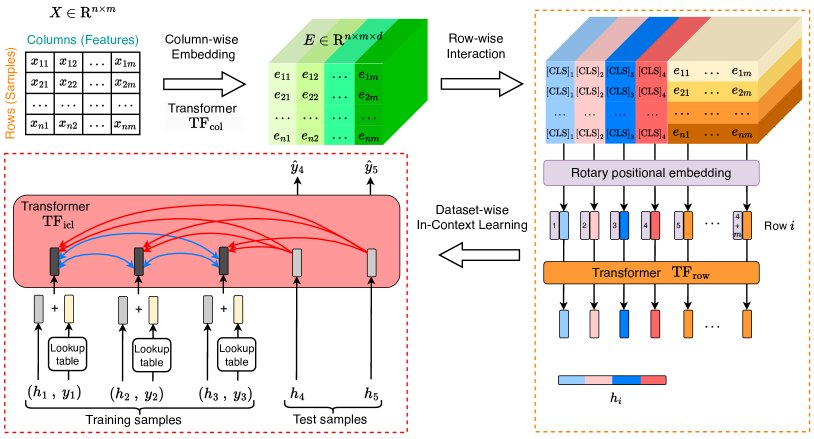
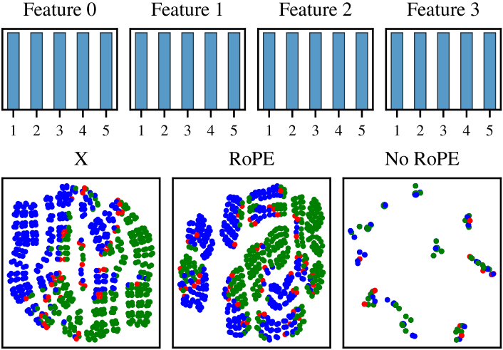

# TabICL: 大規模データでの ICL のための表形式基盤モデル（ICML 2025）

> 原典: [[translations/2025-tabicl]] ・ `raw/articles/TabICL_ A Tabular Foundation Model for In-Context Learning on Large Data.md`（arXiv:2502.05564, ICML 2025）
> 著者・年: Jingang Qu, David Holzmüller, Gaël Varoquaux, Marine Le Morvan（Inria, Soda チーム）/ 2025

## 一言まとめ

**TabPFN とは別グループ（Inria）が作った兄弟の表形式基盤モデル（[[tabular-foundation-model]]）**。TabPFNv2 の「行×列の交互アテンション」が大規模で重い問題を、**列ごと埋め込み → 行ごと相互作用（各行を 1 ベクトルに圧縮）→ データセット ICL** という 3 段アーキテクチャで解決し、**最大 50 万サンプル**を手頃な資源（GPU 20GB）で扱う。TabPFNv2 と同等精度で最大 10 倍高速、1 万サンプル超では TabPFNv2 と CatBoost を上回る。**この 3 段「行圧縮 ICL」設計を後に [[sources/2026-tabpfn-3]] が採用**した点で、PFN 系の進化に直接影響した重要文献。分類専用。

<figure>

<figcaption>図1（再掲）: TabICL の 3 段アーキテクチャ。列ごと埋め込み（TF_col）→ 行ごと相互作用（[CLS]＋RoPE, TF_row）で各行を 1 ベクトル H に圧縮 → データセット単位 ICL（TF_icl）で 1 順伝播予測。［[[translations/2025-tabicl]] 図1 より］</figcaption>
</figure>

## 背景と問題意識

ICL（[[in-context-learning]]）ベースの表形式基盤モデル（TabPFN 系）は GBDT の牙城を崩しつつあるが、自己アテンションが**二次コスト**のためスケールしない。特に TabPFNv2（[[sources/2025-tabpfn-v2]]）は列方向・行方向アテンションを交互適用するため、訓練集合が大きいと計算・メモリが法外で、3 万サンプル超で失敗しうる。「ICL を大規模データへスケールさせ、そこで利益を出せるか？」が本論文の問い。LLM をシリアライズして表に使う路線（文脈窓制約・数値の扱い・データ汚染の懸念）とは異なり、TabICL は **合成データのみで事前訓練する PFN 流** を踏襲しつつアーキテクチャでスケールを解く。

## 提案手法 / 主張

**3 段アーキテクチャ（本論文の核心。後に TabPFN-3 が採用）**
1. **分布認識の列ごと埋め込み**（[[in-context-learning]] の前段）: 各列を **Set Transformer** で埋め込む（特徴量埋め込みを「置換不変なセル値集合 → 一対一の埋め込み」という**集合入力問題**として再定式化）。ISAB（誘導自己アテンション、誘導点 128）で計算量を $O(n)$ に。学習された埋め込みが歪度・尖度など分布的性質をエンコードし、**列名なしで特徴を識別**（図3）。リーク防止のため訓練サンプルのみをキー/値に。
2. **文脈認識の行ごと相互作用**: 3 層 Transformer で行内の特徴間相互作用をモデル化し、4 つの [CLS] トークンで各行を **固定次元（512）の 1 ベクトル**に集約（列次元を潰す→後続 ICL が行数のみに比例し大規模に効率的）。同一分布の特徴が区別できなくなる「**表現崩壊**」を、**RoPE（回転位置埋め込み）** で対称性を破って緩和（図4）。スケーリング因子 100,000 で特徴量数の汎化。
3. **データセット単位 ICL**: 行埋め込み＋ラベルを 12 層 Transformer に通し、テスト行は訓練行にのみアテンションして 1 順伝播で予測。

**事前訓練・推論の工夫（[[structural-causal-model]]）**
- **SCM 合成事前分布の精緻化**: 活性化関数を 4→19+ に多様化（ガウス過程由来のランダム関数含む）。**木ベース SCM 事前分布**（XGBoost を各層に当てはめ）を 30% 混ぜ、木モデルの帰納バイアスを注入。
- **カリキュラム学習**: データセットサイズを 1K→40K→60K と段階的に拡大して事前訓練（A100×3 で 2 週間）。
- **階層的クラス拡張**: 10 クラス超を $\leq$10 クラスの部分問題の木に分解（ラベル非依存の行埋め込みを共有して効率化）。
- **メモリ効率推論**: ピークメモリを多項式回帰でモデル化しバッチサイズを動的調整＋CPU/ディスクオフロード → 10 万サンプル・500 特徴量を GPU 5GB で。

<figure>

<figcaption>図4（再掲）: balance scale データセットでの表現崩壊と RoPE による緩和。同一分布の 4 特徴では RoPE なしだと別個のサンプルが同じ表現に崩壊するが、RoPE が対称性を破って区別を保つ。［[[translations/2025-tabicl]] 図4 より］</figcaption>
</figure>

## 実験結果と知見

- **TALENT ベンチ（200 分類データセット）**: 最大 10 クラスの 188 データセットで、TabICL は最良の相対精度中央値。臨界差図で TabICL・TabPFNv2 が競合を大差で上回り、両者差は有意でない。1K サンプルあたり訓練＋推論 1.1 秒（CatBoost 調整 ~3 分、RealMLP/ModernNCA ~7 分）。
- **TabPFNv2 比の高速化**: 小で 1.5×、大で 3〜10×（スケーリング則で平均 ~5×）。
- **大規模データ（1万サンプル超 55 データセット）**: TabPFNv2（3 万超で失敗しうる）と CatBoost の両方を上回る → 「ICL は few-shot だけでなく大規模でも有効」。
- **較正**: 対数損失でも TabICL・TabPFNv2 が調整済み競合を有意に上回る（信頼できる確率）。
- **>10 クラス**: 階層的分類で 2 番目に良い正規化精度（TabPFNv2 はネイティブに 10 クラス超を扱えない）。
- **頑健性（付録 A）**: 特徴量数に対しよく振る舞う。多くのカテゴリ変数では TabICL が TabPFNv2 をわずかに上回る（TabPFNv2 の方が洗練されたカテゴリ生成を持つのに）。

## 限界・批判的視点

- **分類専用**: 回帰は未対応（TabPFNv2 同様の方法論で可能とは述べる）。後継の TabPFN-3 が回帰を含めて統合。
- **推論速度**: 基盤モデル共通の遅さ。TabPFNv2 のような KV キャッシュは本論文時点では未導入。
- **置換不変性のトレードオフ**: RoPE は列順序の置換不変性を破る（崩壊緩和と引き換え）。列置換アンサンブルで近似回復。
- **評価が TALENT に依存**: ホールドアウト調整の単一モデル比較で、交差検証アンサンブルなら他モデルが伸びうる。
- **クラス数・特徴量数の事前訓練上限**（$\leq$10 クラス・$\leq$100 特徴量）を階層分類・RoPE で外挿。

## 意義（なぜ重要か）

TabICL は **「ICL を大規模表データへスケールできる」ことを示した**点と、**「列ごと埋め込み→行圧縮→行 ICL」という 3 段アーキテクチャ**を確立した点で重要。この設計は、各行を 1 ベクトルに圧縮して ICL の系列長をサンプル数のみに依存させることで二次コスト問題を回避するもので、**TabPFN-3（[[sources/2026-tabpfn-3]]）が「TabICLv2 の設計に基づく」として採用**した（TabPFN-2.x の交互アテンションから v1 流の行 ICL へ回帰する流れ）。TabPFN 一族（Freiburg/Prior Labs）とは別系統（Inria）の TFM が相互に影響し合っている好例で、[[tabular-foundation-model]] が単一チームの産物でないことを示す。

## 用語と略称

- **TabICL** = Tabular In-Context Learning model（Inria の表形式基盤モデル）→ [[tabular-foundation-model]]
- **ICL** = In-Context Learning（文脈内学習）→ [[in-context-learning]]
- **Set Transformer / ISAB** = 集合を順序不変に処理する Transformer／誘導自己アテンションブロック（計算量 $O(n)$）
- **誘導点（inducing points / vectors）** = 全サンプルへの二次アテンションを避ける固定数（128）の要約ベクトル
- **[CLS] トークン** = 行の特徴量埋め込みを 1 ベクトルに集約するための学習可能トークン（4 個→512 次元）
- **RoPE** = Rotary Positional Embedding（回転位置埋め込み。クエリ/キーを回転させ相対位置をエンコード）。ここでは同一分布特徴の表現崩壊を防ぐ識別子として使用
- **表現崩壊（representation collapse）** = 同一分布の特徴が区別できず別個のサンプルが同じ表現になる現象
- **SCM** = Structural Causal Model（構造的因果モデル）→ [[structural-causal-model]]。木ベース SCM 事前分布＝XGBoost を各層に
- **GBDT** = Gradient-Boosted Decision Trees（CatBoost/XGBoost/LightGBM）
- **TALENT** = 200 分類データセットのベンチマーク
- **proper scoring rule（適切なスコアリング則）** = 真の確率を当てるほど報われる損失（対数損失など）

## 関連ページ

- [[tabular-foundation-model]] — TabICL が属する枠組み（TabPFN とは別系統の代表例）
- [[in-context-learning]] — 推論メカニズム（3 段で大規模 ICL を効率化）
- [[structural-causal-model]] — 合成事前分布（木ベース SCM・活性化多様化）
- [[prior-data-fitted-networks]] — SCM 事前分布＋ICL を共有する PFN 流の兄弟
- [[sources/2026-tabpfn-3]] — TabICLv2 の 3 段設計を採用した後続（TabPFN-3）
- [[sources/2025-tabpfn-v2]] — 比較対象・スケール課題の出発点（TabPFNv2）
- [[translations/2025-tabicl]] — 本文 §1〜6 ＋ 付録 A〜E の翻訳
