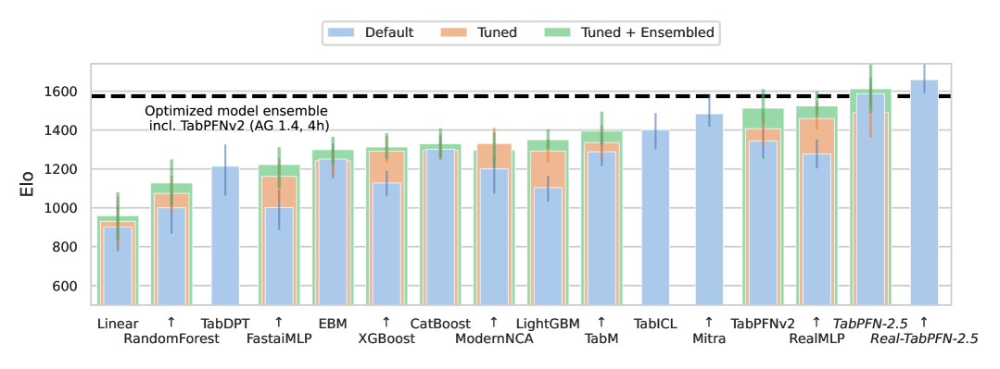
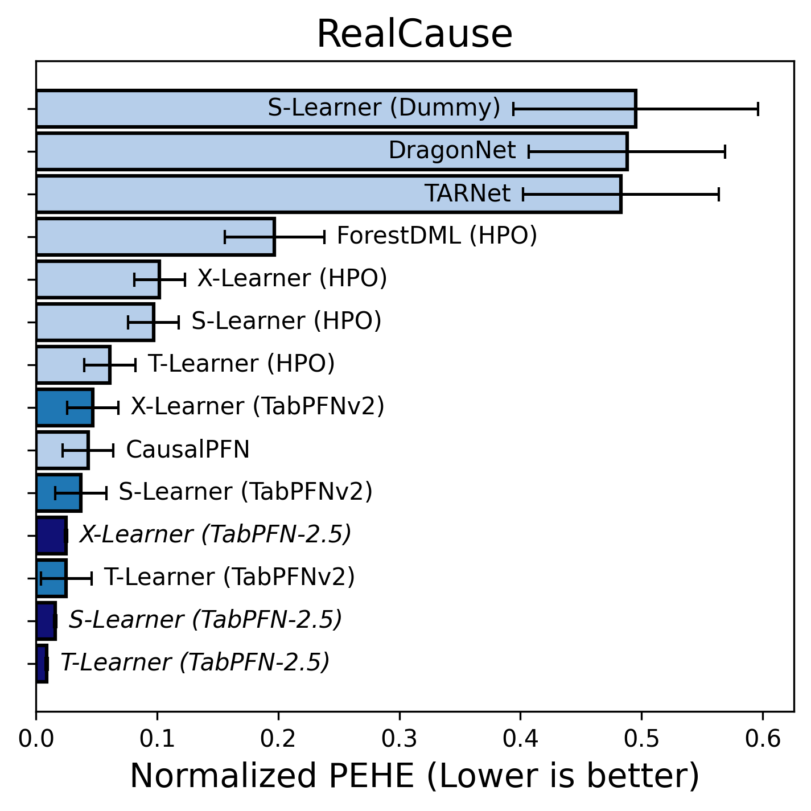

# TabPFN-2.5: 表形式基盤モデルの最先端を前進（arXiv 2025）

> 原典: [[translations/2025-tabpfn-2-5]] ・ `raw/articles/TabPFN-2.5 Advancing the State of the Art in Tabular Foundation Models.md`（arXiv:2511.08667, Prior Labs テクニカルレポート）
> 著者・年: Prior Labs（Grinsztajn, Flöge, …, Purucker, Hollmann, Hutter ほか）/ 2025

## 一言まとめ

[[sources/2025-tabpfn-v2]]（TabPFN v2, Nature）の後継。表形式基盤モデル（[[tabular-foundation-model]]）を **最大 50,000 データ点・2,000 特徴量**（v2 比でデータセル 20×）へスケールし、業界標準ベンチマーク **TabArena で首位**に立った。デフォルトの 1 順伝播で、4 時間チューニングした AutoGluon 1.4（TabPFNv2 を含むアンサンブル）に並び、デフォルト XGBoost に分類で 100%・大規模で 87% の勝率。加えて、本番展開用に **蒸留エンジン（TabPFN-2.5-as-MLP / -as-TreeEns）**、実データ微調整版 **Real-TabPFN-2.5**、因果推論（RealCause で CATE 推定上位独占）を導入した、PFN 系の最新到達点。

## 背景と問題意識

表形式データは金融〜医療まで意思決定の屋台骨だが、伝統手法（GBDT・RF・線形）はデータごとの大がかりなチューニングを要し、較正の悪い不確実性しか出さず、基盤モデルの汎化・転移性を欠く。**表形式基盤モデル（TFM）** は「合成タスクで事前訓練し、勾配降下でなく文脈内学習（[[in-context-learning]]）で推論する訓練不要予測器」という新パラダイムで、データ希少領域に特に強い。TabPFN は v1（[[sources/2022-tabpfn]], 〜1k）→ v2（[[sources/2025-tabpfn-v2]], 〜10k）と進化してきたが、本レポートはさらにスケール・速度・展開性・適用範囲を押し広げる。

## 提案手法 / 主張（v2 からの差分）

[[prior-data-fitted-networks]] の枠組み（合成事前分布で一度訓練→推論時 ICL で近似ベイズ予測）と、各セルを 1 トークンとする双対（特徴量×サンプル）アテンションは v2 を継承。主な変更:

- **スケール拡張**: 〜50,000 サンプル（v2 比 5×）・2,000 特徴量（4×）。データセル数で 20×。上限は厳密でなく、最大 100k 行の TabArena でも強い。
- **より深いアーキテクチャ＋ thinking rows**: 分類 24 層・回帰 18 層（v2 は 12）、特徴量グループサイズ 3（v2 は 2、訓練・推論が速い）、回帰エンコーダを 2 層 MLP 化。さらに学習可能な **64 個の「思考（thinking）」行**を入力に追加（LLM の思考トークン/レジスタに着想。追加計算容量＋アテンションシンク）。
- **Real-TabPFN-2.5**: 合成事前訓練後、OpenML/Kaggle の実データ 43 件（全ベンチに対し重複除去）でファインチューン。デフォルト性能がさらに向上（Appendix C）。
- **蒸留エンジン（本番展開用）**: 訓練データを与えると、その上で TabPFN に近い性能の **MLP（as-MLP）または木アンサンブル（as-TreeEns）** を出力。蒸留先はデータセット固有・ICL を行わず・単一データ点入力・低レイテンシ/低メモリで、既存パイプライン（規制・解釈性・遅延制約あり）に統合しやすい。→ [[tabular-foundation-model]] の「展開」課題への解。
- **較正・指標最適化**: 決定閾値チューニング（F1 等の最適化）、多クラスの温度スケーリング（ただし本文の分類結果は未較正デフォルト）。
- **高速化**: v2 より大きいのに 1〜2.3× 速い（最適化前処理＋大きい特徴量グループ＋FlashAttention-3＋複数 GPU 並列）。
- **TabPFN が TabPFN をチューニング**: 約 50 ハイパラ×100 データ点では過適合するので、v2 自身をサロゲート回帰に使い 10,000 構成の性能を予測して有望領域を探索。

## 実験結果と知見

- **TabArena（業界標準, NeurIPS2025 D&B）首位**: TabArena-Lite（51 データセット）で、デフォルト TabPFN-2.5 が順伝播で全既存手法を上回り、**分類では 4 時間チューニングの AutoGluon 1.4 に並ぶ/上回る**。Real-TabPFN-2.5 はさらにリードを広げ、1 順伝播で他の任意のチューニング・アンサンブルモデルを上回る（図1, 3, 4）。回帰はチューニングの恩恵が大きい。

<figure>

<figcaption>図1（再掲）: TabArena-Lite の Elo ランキング。TabPFN-2.5 と Real-TabPFN-2.5 が最上位に立ち、TabPFNv2 を含む 4 時間チューニングの AutoGluon 1.4（点線）を順伝播で上回る。［[[translations/2025-tabpfn-2-5]] 図1 より］</figcaption>
</figure>
- **対 XGBoost 勝率**: デフォルト同士で、小〜中規模分類（≤10k・500特徴量）100%、大規模（〜100k・2k特徴量）87%、回帰 85%。
- **v2 から大幅改善**: TabArena のほぼ全データセットで v2 を上回り、大きく劣ることがない（図2）。TabICL・LimiX も上回る（Appendix G）。
- **内部ベンチ**: 〜50k サンプル・〜2,000 特徴量で、1 順伝播が 1 時間チューニングの GBDT 群（XGB/CatBoost/LightGBM）を上回る（図5,6,12）。
- **蒸留**: TabPFN-2.5-as-MLP は木ベースを上回りつつ推論が大幅高速（図7）。
- **因果推論（[[structural-causal-model]] 関連の応用）**: RealCause ベンチで PFN ベースの CATE 推定器が上位 7 位を独占。T-Learner としての TabPFN-2.5 が最強で、専用の因果フォレスト等を上回る。ベース予測性能の改善が因果推論に転移（図9, Appendix D）。

<figure>

<figcaption>図9（再掲）: RealCause ベンチで PFN ベースの CATE 推定器が専用の木・深層学習ベース手法を上回り上位を独占。傾向スコア/結果モデルの選択が CATE 推定に重要。［[[translations/2025-tabpfn-2-5]] 図9 より］</figcaption>
</figure>
- **速度スケーリング**: $\mathcal{O}(r^2\min(c,500)+r\min(c,500)^2)$。テスト行数に線形（Appendix I）。
- **エコシステム**: v2 は 10 か月で約 400 被引用・PyPI 200 万 DL。時系列（TabPFN-TS）・グラフ・データストリーム・RL・ベイズ最適化・マルチモーダル・因果（Do-PFN 等）の基盤層に。

## 限界・批判的視点

- **非商用ライセンス**: TABPFN-2.5 License v1.0 は研究・内部評価のみ許可。商用/本番利用は別途エンタープライズライセンスが必要（高速推論エンジンは独自・非公開）。
- **メモリ/コスト**: fit 済みキャッシュは分類でセルあたり ~6.1KB(GPU)/48.8KB(CPU) と重く小規模向け。大規模/CPU は as-MLP 推奨。リアルタイム推論には不向き。
- **スケール上限**: 50k/2k 向け設計（100k まで動くが保証外）。数百万行は今後の課題（検索・FT・新アーキテクチャを開発中）。
- **比較の留保**: LimiX 比較（図16）は原著者未検証で本文非掲載。TabPFN-2.5 のチューニングは 60 構成のみ（ベースラインは 200）で条件が対称でない面もある。
- **テクニカルレポート**: 査読論文ではなく、コア手法（事前分布生成・出力エンジン）の一部は独自・非公開（"proprietary"）。

## 意義（なぜ重要か）

TabPFN を「研究モデル」から「**スケール・速度・展開性・適用範囲を備えた実用的な表形式基盤モデル**」へ押し上げ、TabArena で首位という形で TFM が GBDT/AutoML を明確に凌ぐ段階に来たことを示した。特に **蒸留による本番展開**（ICL の重さを MLP/木に落とす）と **因果推論への転移** は、[[tabular-foundation-model]] が予測器を超えて「構造化データ推論のコアエンジン」へ向かう方向を具体化する。PFN 系の系譜＝原典(2021, [[sources/2021-transformers-can-do-bayesian-inference]]) → v1(2022, [[sources/2022-tabpfn]]) → v2(2025 Nature, [[sources/2025-tabpfn-v2]]) → **2.5(2025, 本レポート)** の現時点の最前線。

## 用語と略称

- **TFM** = Tabular Foundation Model（表形式基盤モデル）→ [[tabular-foundation-model]]
- **TabPFN** = Tabular Prior-data Fitted Network → [[prior-data-fitted-networks]]
- **ICL** = In-Context Learning（文脈内学習）→ [[in-context-learning]]
- **TabArena** = 51 データセットからなる業界標準の厳選表形式ベンチマーク（NeurIPS 2025 D&B）。"TabArena-Lite" は 1 フォールド版
- **AutoGluon 1.4** = 木・NN・TabPFNv2 等を束ねるスタックドアンサンブル AutoML（4 時間チューニングが比較基準）
- **蒸留（distillation）** = 大きい/重いモデルの予測を、小さく速いモデル（ここでは MLP・木アンサンブル）に写し取る技法。as-MLP/as-TreeEns
- **Real-TabPFN-2.5** = 合成事前訓練後に実データ 43 件で微調整した版
- **thinking rows** = 入力に足す学習可能な追加行。計算容量とアテンションシンクを与える
- **CATE** = Conditional Average Treatment Effect（条件付き平均処置効果。因果推論の中心量）→ [[structural-causal-model]]
- **PEHE** = Precision in Estimating Heterogeneous Effects（CATE 推定の誤差指標）
- **T/S/X-Learner** = 処置効果推定のメタ学習器（処置/対照に別モデル等）
- **GBDT** = Gradient-Boosted Decision Trees（XGBoost/CatBoost/LightGBM）
- **SVD** = 特異値分解（前処理で高エネルギー方向を追加特徴量に）
- **HPO** = ハイパーパラメータ最適化

## 関連ページ

- [[tabular-foundation-model]] — 本レポートが前進させた枠組み（スケール・蒸留・エコシステム）
- [[prior-data-fitted-networks]] — 中核概念（系譜の最新点）
- [[in-context-learning]] — 推論メカニズム
- [[structural-causal-model]] — 因果推論（CATE）応用との接続
- [[sources/2025-tabpfn-v2]] — 直前の世代（TabPFN v2, Nature）
- [[sources/2022-tabpfn]] / [[sources/2021-transformers-can-do-bayesian-inference]] — v1・原典
- [[translations/2025-tabpfn-2-5]] — 本文＋付録 A〜I の翻訳（B は件数サマリ）
