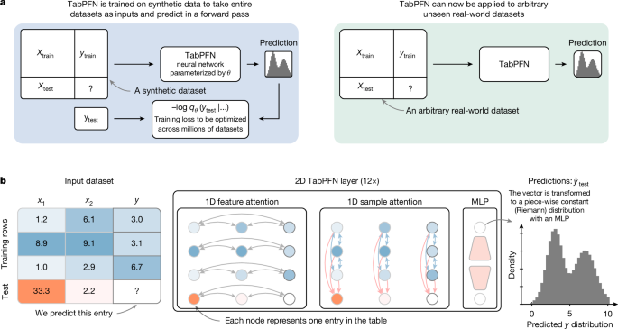
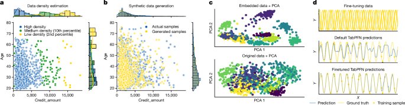

# TabPFN v2: 表形式基盤モデルによる小規模データでの正確な予測（Nature 2025）

> 原典: [[translations/2025-tabpfn-v2]] ・ `raw/articles/Accurate predictions on small data with a tabular foundation model.md`（Nature, doi:10.1038/s41586-024-08328-6）
> 著者・年・会議: Noah Hollmann, Samuel Müller, Lennart Purucker, … Frank Hutter / 2025（Nature）

## 一言まとめ

[[sources/2022-tabpfn]]（TabPFN v1）の正式な後継。表形式データの予測を「データセットを丸ごと 1 回 Transformer に通すだけ」で解く **PFN（[[prior-data-fitted-networks]]）** を、**最大 10,000 サンプル・500 特徴量**へ 50 倍スケールさせ、カテゴリ・欠損・外れ値をネイティブに扱い、回帰にも対応した。分類で 2.8 秒のデフォルト推論が、4 時間調整した最強アンサンブルを上回る（5,140 倍速）。さらに**生成・密度推定・埋め込み・ファインチューニング**という「表形式基盤モデル（[[tabular-foundation-model]]）」の能力を示し、Nature に掲載された。

## 背景と問題意識

表形式データ（行＝サンプル、列＝特徴量のスプレッドシート）は科学・実務で最も多いデータ型だが、データセットごとに列の意味が全く違う（ある列は化学的性質、別のデータでは熱物性…）ため**異質**で、深層学習が苦手としてきた。openml.org のデータセットの 76% は 1 万行未満という「小規模が普通」の世界で、過去 20 年は **GBDT（勾配ブースティング決定木; XGBoost/CatBoost/LightGBM）** が王者だった。GBDT は分布外予測や知識転移が弱く、勾配を流さないため NN と組み合わせにくい、という弱点も持つ。

v1（[[sources/2022-tabpfn]]）は「PFN を表データに適用できる」ことを原理的に示したが、30〜1000 サンプル・二値中心・数値のみという制約で実用には遠かった。本論文はこの制約を一気に外し、TabPFN を**実用的な表形式基盤モデル**に仕上げた。理論的土台は PFN 原典（[[sources/2021-transformers-can-do-bayesian-inference]]）の「損失最小化＝事後予測分布 PPD の近似」。

## 提案手法 / 主張

**(1) 原理的な ICL（[[in-context-learning]] / [[prior-data-fitted-networks]]）**
- 約 1 億の合成データセットで Transformer を 1 度だけ事前訓練（8×RTX2080 で約 2 週間）。推論時は訓練データ＋テストデータを文脈として与え、**重み更新なし・1 順伝播**でテスト集合の予測（ベイズ的な PPD）を返す。
- 「アルゴリズムを書く」のではなく「望ましい挙動を示す合成データを生成して学習させる」＝**例示ベースの宣言的プログラミング**という設計思想を前面に出した。

<figure>

<figcaption>図1（再掲）: (a) 合成データで一度訓練し、データセット全体を入力に取って 1 順伝播で予測。(b) 各セル＝1 トークンの 2 次元アテンション（特徴量方向・サンプル方向）＋MLP、出力は区分定数（リーマン）分布。［[[translations/2025-tabpfn-v2]] 図1 より］</figcaption>
</figure>

**(2) 表のための 2 次元アテンション・アーキテクチャ（[[tabular-foundation-model]] の基盤）**
- 表の**各セルを 1 トークン**にし、「特徴量方向（行内）アテンション」と「サンプル方向（列内）アテンション」を交互に行う 2 次元構造。これによりサンプル順・特徴量順の両方に**不変**になり、訓練時より大きい表へ外挿できる。
- テストサンプルは互いに注意せず訓練データにのみ注意する設計で、**訓練状態をキャッシュ**して fit-predict 的再利用を可能に（CPU 推論 最大 800 倍速）。flash attention・半精度 LayerNorm 等でセルあたり 1KB 未満に圧縮し、H100 で最大 5,000 万セルまで扱える。
- 回帰は**区分定数（リーマン）分布**を出力ヘッドにし、双峰など複雑な分布も予測（v1 から継承）。

**(3) 因果モデルベースの合成事前分布（[[structural-causal-model]]）**
- 各合成データセットを **構造的因果モデル（SCM）の DAG** から生成。ルートノードに初期化ノイズを流し、各辺で「小さな NN・カテゴリ離散化・決定木・ガウスノイズ」を適用して伝播させ、特徴量ノードとターゲットノードの値を取り出す。
- 欠損値・外れ値・無情報特徴量・カテゴリ・スケール差などの「データ課題」を後処理（Kumaraswamy ワーピング、量子化、MCAR 欠損注入）で合成データに織り込み、モデルにそれらへの対処戦略を自律学習させる。合成データなのでプライバシー・著作権・テスト汚染の問題を回避。

**(4) 基盤モデルとしての追加能力（[[tabular-foundation-model]]）**
- **密度推定 / 生成**: 回帰・分類 TabPFN を組み合わせ、同時分布を $p(\mathbf{x},y)=\prod_j p(x_j\mid \mathbf{x}_{<j})\cdot p(y\mid\mathbf{x})$ と因数分解して推定→異常検知や合成データ生成（データ拡張・プライバシー保護共有）に利用。
- **埋め込み**: 最終層のターゲット列表現を再利用可能な特徴量埋め込みとして抽出（補完・クラスタリング）。
- **ファインチューニング**: NN なので関連データセットで FT 可能（木ベースにはできない）。
- **解釈性**: SHAP による特徴量重要度。TabPFN は高精度かつ単純で解釈しやすい関係を学習。

<figure>

<figcaption>図6（再掲）: 表形式基盤モデルとしての TabPFN。(a) 密度推定、(b) 合成データ生成、(c) 再利用可能な埋め込み（クラス分離の改善）、(d) ファインチューニング。［[[translations/2025-tabpfn-v2]] 図6 より］</figcaption>
</figure>

## 実験結果と知見

- **ベンチマーク**: AutoML Benchmark ＋ OpenML-CTR23 から、≤10,000 サンプル・500 特徴量・10 クラスの分類 29・回帰 28 データセット。木ベース・線形・SVM・MLP と比較（各 30 秒〜4 時間調整）。
- **箱出しで圧勝**: デフォルト TabPFN（分類 2.8 秒・回帰 4.8 秒）が、4 時間調整した全ベースラインを上回る（分類 5,140 倍速・回帰 3,000 倍速）。正規化 ROC AUC でデフォルト CatBoost を 0.187 上回る。
- **頑健性**: 無情報特徴量・外れ値に強く（NN では普通苦手）、半分のサンプルでも次善手法の全サンプル性能に匹敵。カテゴリ/欠損/サンプル数/特徴量数のサブグループで相対性能がほぼ落ちない。
- **アンサンブル（PHE）**: TabPFN (PHE) は正規化 ROC AUC 0.971（TabPFN 0.939、AutoGluon 0.914）。4 時間の AutoGluon を 2.8 秒のデフォルト TabPFN が分類で上回る。
- **定性**: 二重スリット実験の多峰密度を 1.2 秒で予測（CatBoost は分位点モデルを多数訓練しても劣る）。滑らか・非滑らか両方の関数を箱出しでモデル化。

## 限界・批判的視点

- **推論速度**: 高度に最適化された CatBoost より遅い（1 サンプル予測で 0.2 秒 vs 0.0002 秒）。リアルタイム推論向けではない。
- **メモリがデータサイズに線形**: 非常に大きいデータセットでは制約。アテンションは $O(n^2+m^2)$。
- **スケール上限**: 評価は ≤10,000 サンプル・500 特徴量。それを超える領域では CatBoost/XGB/AutoGluon が上回りうる（著者も明記）。サブグループ結果を「10k 超でもスケールする証拠」と解釈してはいけないと釘を刺している。
- **ネイティブ 10 クラス上限**: 分類はターゲットのカテゴリ特徴量を流用するため最大 10 クラス（OvO/OvR/ECOC で拡張可）。
- **非滑らかな回帰**: 非常に非滑らかな回帰では木ベースが有利な場合がある。

## 意義（なぜ重要か）

「モデルを当てはめる」を「訓練済みネットワークに通す」に置き換える PFN の発想を、**実用レベルの表形式基盤モデル**へ結実させ、20 年続いた GBDT 優位を小〜中規模データで覆して **Nature** に載った画期。単一の事前訓練モデルが予測だけでなく生成・密度推定・埋め込み・FT までこなす点で、言語・画像に続く「**表形式の基盤モデル**（[[tabular-foundation-model]]）」時代の幕開けを示した。PFN 系の系譜＝原典(2021, [[sources/2021-transformers-can-do-bayesian-inference]]) → v1(2022, [[sources/2022-tabpfn]]) → **v2(2025, 本論文)** の到達点。

## 用語と略称

- **TabPFN** = Tabular Prior-data Fitted Network（表形式 PFN）→ [[prior-data-fitted-networks]]
- **PFN** = Prior-data Fitted Network → [[prior-data-fitted-networks]]
- **ICL** = In-Context Learning（文脈内学習）→ [[in-context-learning]]
- **PPD** = Posterior Predictive Distribution（事後予測分布）→ [[bayesian-inference]]
- **SCM** = Structural Causal Model（構造的因果モデル）→ [[structural-causal-model]]
- **GBDT** = Gradient-Boosted Decision Trees（XGBoost/CatBoost/LightGBM）
- **PHE** = Post Hoc Ensembling（事後アンサンブル。GES=貪欲アンサンブル選択で重み学習）
- **HPO** = Hyperparameter Optimization（ハイパーパラメータ最適化）
- **SHAP** = Shapley Additive Explanations（特徴量寄与のゲーム理論的説明）
- **ROC AUC / RMSE / R²** = 分類・回帰の評価指標
- **z 正規化** = 平均 0・標準偏差 1 への標準化
- **MCAR** = Missing Completely At Random（完全にランダムな欠損）

## 関連ページ

- [[prior-data-fitted-networks]] — 本手法が属する中核概念
- [[tabular-foundation-model]] — 本論文が打ち出す枠組み（予測＋生成＋密度推定＋埋め込み）
- [[in-context-learning]] — 重み更新なしで文脈から予測
- [[structural-causal-model]] — 合成事前分布の中核（v1 から継承・発展）
- [[bayesian-inference]] — 近似対象である PPD
- [[sources/2022-tabpfn]] — 前身（TabPFN v1, ICLR 2023）
- [[sources/2021-transformers-can-do-bayesian-inference]] — PFN 原典・理論的土台
- [[translations/2025-tabpfn-v2]] — Main＋Methods の翻訳
