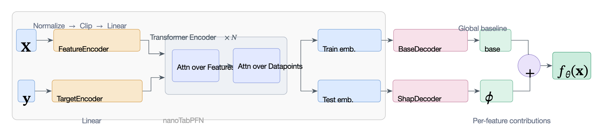

# ShapPFN: 表形式基盤モデルのためのリアルタイム説明

> 原典: [[translations/2026-shappfn]] ・ `raw/articles/Real-Time Explanations for Tabular Foundation Models.md`（ar5iv, arXiv:2603.29946）
> 著者・年・所属: Luan Borges Teodoro Reis Sena, Francisco Galuppo Azevedo（Kunumi Institute / Universidade Federal de Minas Gerais, Brazil, 2026）
> コード: https://github.com/kunumi/ShapPFN

## 一言まとめ

**表形式基盤モデルに「説明（Shapley 値）」をアーキテクチャごと組み込み、予測と説明を1回の順伝播で同時に出すモデル ShapPFN。** 事後計算が必要で重い SHAP（KernelSHAP で 1 データ約 610 秒）を、**1000 倍以上速い 0.06 秒**で同等品質（KernelSHAP との一致 R²=0.96、cosine=0.99）に置き換え、「リアルタイム説明」を可能にする。直前に ingest した [[sources/2025-nanotabpfn|nanoTabPFN]] をベースに構築。

## 背景と問題意識

科学の現場では「モデルが*なぜ*その予測をしたか」を理解できることが、仮説の生成・検証に不可欠である。この説明可能性（interpretability）の標準的な道具が **Shapley 値**——協力ゲーム理論由来の、各特徴量の「貢献度」を加法性・公平性などの公理を満たす形で配分する手法。だが厳密計算は特徴量の組み合わせ爆発のため非現実的で、近似手法の **SHAP（とくにモデル非依存の KernelSHAP）** が広く使われる。

しかし KernelSHAP は**事後（post-hoc）に多数回モデルを呼び出す**ため計算が重く、研究者がインタラクティブに探索したい場面（リアルタイムのフィードバックが要る科学ワークフロー）には遅すぎる。表形式基盤モデル（[[tabular-foundation-model]]、TabPFN 等）は予測が速く強力だが、その説明づけは依然ボトルネックだった。

この問題に先に取り組んだのが **ViaSHAP**（ICML 2025）で、「Shapley 値回帰」——予測そのものを Shapley 値の和として学習し、特殊な損失で SHAP の性質を強制する——により、説明を事後ステップではなく**順伝播の一部**にした。ただし ViaSHAP は多様なデータセットに汎化する基盤モデルには適用されていなかった。本論文はこのギャップ（**TabPFN 系の汎化能力 × ViaSHAP の説明内蔵**）を埋める。

## 提案手法 / 主張

**ベースは nanoTabPFN（[[sources/2025-nanotabpfn]]）**。コアの Transformer ブロック（特徴量間 attention とデータポイント間 attention の交互適用）はそのままに、**2つの専用デコーダーヘッド**を追加して予測を「ベース項＋特徴量ごとの加法的寄与」に分解する。

- **BaseDecoder**: 訓練ターゲットトークンの平均埋め込みに条件づけた**グローバルベースライン** `base`（全テスト行で共有）を出力。
- **ShapDecoder**: テスト特徴量埋め込みから**特徴量ごと・クラスごとの寄与** $\phi_f(x)$ を出力。
- 最終ロジットは加法的に: $f_{\theta}(x)=\mathrm{base}+\sum_{f=1}^{F}\phi_f(x)$。

この**設計上の加法性**が、アーキテクチャから直接 SHAP 風の分解を可能にする（$\phi_f$ がそのまま特徴量 $f$ の寄与＝説明）。

<figure>

<figcaption>図1（出典: 本論文）: ShapPFN のアーキテクチャ。X→FeatureEncoder、y→TargetEncoder で埋め込み→ nanoTabPFN の Transformer（Attn over Features / Attn over Datapoints ×N）→ Train/Test 埋め込み → BaseDecoder（base＝グローバルベースライン）と ShapDecoder（φ＝特徴量ごとの寄与）→ 和 base+Σφ = f_θ(x)。予測が特徴量に対し明示的に加法的。</figcaption>
</figure>

**損失（ViaSHAP ベース）**: マスクした特徴量の Shapley 値は 0、部分集合に基づく予測は対応する Shapley 寄与の和に等しいべき、という制約を課す。手順は、(1) マスクなしで順伝播し base と各 $\phi$ を得る、(2) サイズ $1\sim F-1$ の特徴量連合 $s$ を $S$ 個サンプリング、(3) 除外特徴量をデータセットの $K$ 行からの値で置換（**介入的 Shapley 定義**＝周辺分布で期待を取る）、(4) 各連合で「$K$ 回順伝播のモンテカルロ推定 $\hat f$」と「学習した Shapley 値の加法和 $\bar f$」を比較し、**Shapley カーネル重み付き平均二乗誤差**（Shapley 一致性損失）を計算。訓練ではこれを標準の交差エントロピー損失に重み付きで加える。**この SHAP 損失は事前訓練時のみコストを増やし、推論時間は変わらない**。

## 実験結果と知見

- **予測性能（OpenML-CC18, ROC-AUC）**: ShapPFN(+loss) は全データセット平均 **0.848**、SHAP 制約なしの nanoTabPFN（0.848）と同等。SHAP 損失なしの同アーキ ShapPFN(arch) は 0.837（小さなアーキテクチャコスト）。TabPFN v2 が 0.872 で首位だが、ShapPFN はランダムフォレスト（0.851）と競争力があり、他の古典手法を上回る。
- **説明の品質と速度（vs KernelSHAP）**: ShapPFN(+loss) は **R²=0.963・cosine=0.987・Spearman=0.954** と高一致を保ちつつ、**平均 1000 倍以上（610 秒 → 0.06 秒、一部データセットで最大 50,000 倍）** 高速化。
- **SHAP 損失が説明の鍵**: 損失なしの ShapPFN(arch) は説明品質が大幅劣化（R²=0.179、cosine=0.750）。**加法的アーキテクチャだけでは不十分で、Shapley 一致性損失が忠実な説明に不可欠**。
- 事前訓練は 256,000 個の **TabICL 生成合成データセット**で 8,000 ステップ。SHAP 損失のため nanoTabPFN の 250 秒に対し約 3,000 秒かかるが、これは1回限りのオフラインコスト。

## 限界・批判的視点

- **TabPFN v2 には予測性能で及ばない**（0.848 vs 0.872）。フル機能の基盤モデルではなく nanoTabPFN ベースの軽量モデル上での実証。
- **二値分類・小特徴量に限定**: 訓練は 2〜5 特徴・最大 200 サンプルの二値分類。多クラスは OVA（One-vs-All）で対応。KernelSHAP 比較も特徴量数の少ないデータに限定（KernelSHAP 自体が高次元で法外に遅いため）。
- **prior の独自性は薄い**: 訓練データ生成は TabICL のパイプライン流用。説明の「忠実度」は KernelSHAP との一致で測っており、KernelSHAP 自体の近似誤差は前提。
- **介入的 Shapley の選択**: マスクを周辺分布からの置換で実装（条件付きではなく介入的）。因果的解釈に注意が要る論点（Janzing et al. の議論）。

## 研究の意義

PFN／表形式基盤モデルの系譜に「**説明可能性（XAI）をアーキテクチャに内蔵する**」という新しい軸を加えた。これまでの流れ——予測（TabPFN）、ベイズ最適化（PFNs4BO/GIT-BO）、因果（CausalPFN/Do-PFN）、時系列（Chronos-2）、教育（nanoTabPFN）——に続く「PFN の応用拡張」の一つで、とくに **nanoTabPFN を実際の研究の踏み台として使った最初の公開例**でもある（nanoTabPFN が掲げた「研究プロトタイピングの加速」がさっそく結実）。「重い事後説明（SHAP）を、設計で焼き込んで順伝播1回に償却する」という発想は、PFN が「ベイズ推論を事前訓練に償却する」のと構造的に相似——**説明の計算を事前訓練に償却する**と言える。

## 用語と略称

- **PFN** = Prior-Data Fitted Network → [[prior-data-fitted-networks]]
- **TFM** = Tabular Foundation Model（表形式基盤モデル）→ [[tabular-foundation-model]]
- **Shapley 値** = 協力ゲーム理論由来の、各特徴量の貢献度を公理的に配分する量（特徴量帰属の理論的基盤）
- **SHAP** = SHapley Additive exPlanations。Shapley 値の効率的近似手法群（**KernelSHAP** はモデル非依存版）
- **ViaSHAP** = 予測を Shapley 値回帰として学習し説明を内蔵する手法（本論文のベース）
- **特徴量帰属（feature attribution）** = どの特徴量が予測にどれだけ効いたかを数値化すること
- **加法的説明（additive explanation）** = 予測＝ベース＋各特徴量の寄与の和、という形の説明
- **介入的 Shapley（interventional Shapley）** = マスク特徴量を周辺分布から置換して期待を取る Shapley の定義
- **連合（coalition）** = Shapley 値計算で考える特徴量の部分集合
- **ROC-AUC / R² / cosine / Spearman** = 評価指標（分類性能／説明の一致度）
- **OVA** = One-vs-All（多クラスを二値分類の集まりに分解する方式）
- **OpenML-CC18** = 多様な分類タスクからなる標準ベンチマークスイート

## 関連ページ

- [[sources/2025-nanotabpfn]] — ShapPFN のベースアーキテクチャ（nanoTabPFN を踏み台にした最初の公開研究）
- [[prior-data-fitted-networks]] — PFN の中核概念。ShapPFN は「説明内蔵 PFN」
- [[tabular-foundation-model]] — 表形式基盤モデル。ShapPFN は説明可能性を内蔵した派生
- [[in-context-learning]] — ShapPFN も文脈内学習で予測（＋説明）
- [[sources/2025-tabpfn-v2]] — 予測性能のリファレンス（ShapPFN が及ばない上限）
- [[sources/2025-tabicl]] — 訓練データ生成パイプラインを流用
