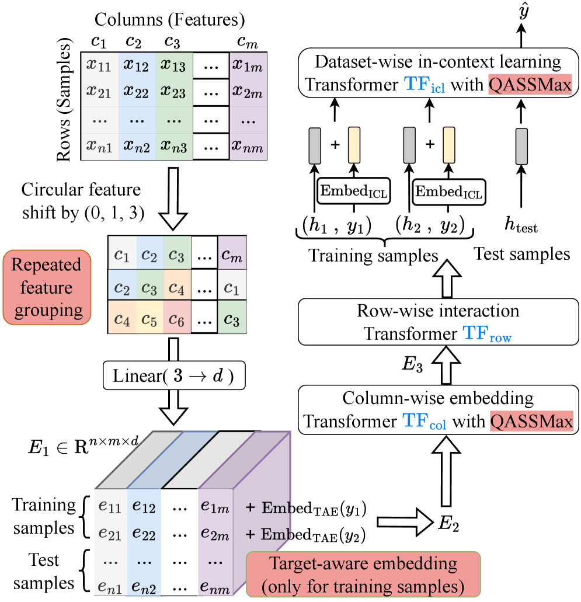
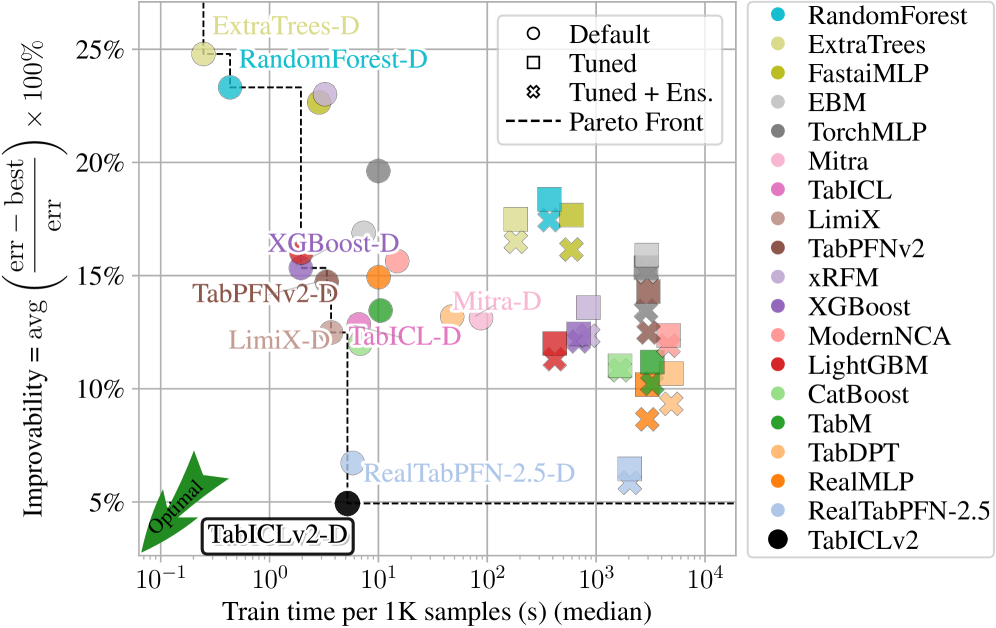

# TabICLv2: より良く・速く・スケーラブルで・オープンな表形式基盤モデル（ICML 2026）

> 原典: [[translations/2026-tabicl-v2]] ・ `raw/articles/TabICLv2_ A better, faster, scalable, and open tabular foundation model.md`（arXiv:2602.11139, ICML）
> 著者・年: Jingang Qu, David Holzmüller, Gaël Varoquaux, Marine Le Morvan（Inria, Soda チーム）/ 2026

## 一言まとめ

[[sources/2025-tabicl]]（TabICL v1）の**直接の後継**で、かつ [[sources/2026-tabpfn-3]] が「TabICLv2 ベース」と明言する**そのアーキテクチャ本体**。回帰（分位点分布）対応・**QASSMax**（長系列での attention fading 対策）・**Muon オプティマイザ**・多様性重視の新しい合成 prior を 3 本柱に、**一切のチューニングなしで** 現最先端 RealTabPFN-2.5（調整・アンサンブル・実データ FT 済み）を TabArena/TALENT で上回る。100 万行を 50GB GPU・450 秒（ディスクオフロード）で処理し TabPFN-2.5 比最大 11.8× 高速。**オープンウェイト**で公開。PFN 系（[[prior-data-fitted-networks]] / [[tabular-foundation-model]]）の SOTA。

<figure>

<figcaption>図2（再掲）: TabICLv2 のアーキテクチャ。repeated feature grouping ＋ target-aware embedding ののち、TF_col（列ごと埋め込み）→ TF_row（行を 1 ベクトルに集約）→ TF_icl（ICL 予測）。QASSMax を TF_col の誘導点集約部と TF_icl に適用。［[[translations/2026-tabicl-v2]] 図2 より］</figcaption>
</figure>

## 背景と問題意識

TFM（TabPFNv2・TabICL）は GBDT を予測ベンチで打倒したが、自己アテンションの二次コストがスケーラビリティの脅威。特に TabPFNv2 の行×列交互アテンションは $O(n^2 m+nm^2)$ で大規模に法外。TabICL v1（[[sources/2025-tabicl]]）は列→行→ICL の 3 段で $O(n^2+nm^2)$ に削減したが**分類専用**だった。本論文はこの 3 段アーキを継承しつつ、回帰対応・長系列汎化・新 prior・最適化された事前訓練で SOTA かつオープンな TFM を作る。クローズドソースに匹敵する完全オープンの TFM を出して最高性能を民主化するのが狙い。

## 提案手法 / 主張（v1 からの差分・3 本柱）

3 段アーキ（列ごと埋め込み TF_col → 行ごと相互作用 TF_row で各行を 1 ベクトルに圧縮 → データセット ICL TF_icl）は v1 から継承（計算量 $O(n^2+nm^2)$）。

**(1) 新しい合成 prior（[[structural-causal-model]]）**: SCM 枠組みを保ちつつ大幅拡張。**8 種のランダム関数**（MLP/Tree Ensemble〔CatBoost 風対称木〕/Discretize/GP〔多変量・滑らかさを理論証明〕/Linear/Quadratic/EM〔プラトー〕/Product）、**random Cauchy graph**（木構造に限らない多様な接続）、ランダム行列 5 型・ランダム活性化・相関スカラーサンプリング、ExtraTrees ベースの**データフィルタリング**（$y\perp x$ なグラフを除外）。prior が最大の効果（アブレーションで TabICL prior だと TabICLv2 は失敗）。

**(2) アーキテクチャ革新**:
- **Repeated feature grouping**: 各特徴を巡回シフト $(j,j+1,j+3)$ で複数グループに配置し、有効特徴量数を保ちつつ表現崩壊を緩和。
- **Target-aware embedding**: ラベルを最初から全特徴埋め込みに加算（v2 の追加列方式と異なる）。表現崩壊の緩和にも寄与。
- **QASSMax（query-aware scalable softmax）→ [[in-context-learning]]**: attention fading（文脈長 $n$ 増で softmax 分母が増え注意が平坦化）対策。SSMax の $s\log n$ を $\mathrm{MLP}_{\mathrm{base}}(\log n)\cdot(1+\tanh(\mathrm{MLP}_{\mathrm{gate}}(q)))$ に拡張（要素ごと・クエリ認識ゲーティング）。長系列事前訓練なしに大規模汎化を改善（needle-in-haystack で 15K 負例でも 100% 精度）。
- **Mixed-radix ensembling**: 多クラス（>10）を混合基数で複数ビューに分解し TF_col 出力を平均（ECOC 風だが埋め込みレベル）＋ ICL 段の階層的分類で任意クラス数対応。
- **分位点回帰**: 999 分位点を pinball 損失で予測（v1 は分類専用→**v2 で回帰対応**）。推論時に単調性強制（ソート/isotonic）・指数裾外挿で CDF/PDF/CRPS/モーメントを閉形式導出（付録 I）。

**(3) 事前訓練**: **Muon オプティマイザ**（AdamW でなく、高学習率可）、cautious weight decay、3 段カリキュラム（1K→10K→60K サンプル）、計 24.5 GPU-日（H100）。FlashAttention-3、選択的 QKV 射影、ディスクオフロードで 100 万行をコモディティ HW で。

<figure>

<figcaption>図1（再掲）: TabArena での improvability（低いほど良い）対訓練時間。無調整の TabICLv2 が improvability 対実行時間のパレートを支配し、調整・アンサンブルした RealTabPFN-2.5 を上回る。［[[translations/2026-tabicl-v2]] 図1 より］</figcaption>
</figure>

## 実験結果と知見

- **TabArena（51 データセット）**: 無調整の TabICLv2 が improvability 対実行時間のパレートを支配し、RealTabPFN-2.5（T+E）を上回る。平均ランク 4.82（AutoGluon 1.4 extreme 4h の 5.24、RealTabPFN-2.5 の 5.88 を上回る）。AutoGluon 1.5（3.88）には平均ランクで劣るが勝率では 57% で勝ち越し。
- **TALENT（300 データセット）**: 平均ランク 4.66 で最良（RealTabPFN-2.5 5.11、TabPFN-2.5 5.45）。勝率 62%/65%。LimiX・TabPFNv2 は約 2 倍のランク。AUC・log-loss で特に強く（較正が良い）、多クラスで明確に優位、大規模（>10K・>20K）で RealTabPFN-2.5 を上回る。
- **速度**: TabPFN-2.5 比 H100・5 万サンプルで 10.6×、CPU・1 万サンプルで 11.8×。
- **多クラス（>10）**: ECOC とネイティブ mixed-radix の両方で全ベースライン超。
- **大規模**: 60 万サンプル（TALENT 拡張）でも強い（TabPFN-2.5 は OOM）。
- **アブレーション**: prior が最大効果。早期ターゲット注入・Muon・QASSMax が各約 100 Elo・64% 勝率。アーキと prior の強い相互作用（TabICLv2 アーキは高い prior 多様性を要する）。

## 限界・批判的視点

- **テキスト非対応**: 列名・テキスト特徴をネイティブに活用しない（TabPFN-3-Plus と対照的）。
- **数百万サンプル**: 改善されたがなお挑戦的。多出力回帰・分布シフトは今後。
- **分布回帰の評価不足**: 確立ベンチがなくトイデータ（§I.9）のみ。
- **欠損値**: 現状は平均補完（欠損指標は未探索）。
- **多クラス平均ランク**: TabArena 多クラスでは RealTabPFN-2.5（T+E）に及ばない（ただし TabICLv2 は無調整）。
- **査読前のテクニカルレポート**だが、TabICL 系として**コード・重みをオープン公開**する点が TabPFN 系（コア非公開）と対照的。

## 意義（なぜ重要か）

TabICLv2 は **TabPFN-3 が採用したアーキテクチャ本体**（[[sources/2026-tabpfn-3]] の「TabICLv2 ベース」）であり、PFN 系の 2 系統（Prior Labs の TabPFN 一族と Inria の TabICL 一族）の交差点に立つ。v1 の 3 段「行圧縮 ICL」を、回帰対応・QASSMax による長系列汎化・新 prior で SOTA に押し上げ、しかも**完全オープン**で最高性能を民主化した点が重要。特に **QASSMax（学習・推論で系列長に応じてアテンション温度を動的調整）** と **多様性最大化の合成 prior** は、TFM 設計の一般的教訓として他系統にも波及しうる。系譜上、Inria 系は TabICL（2025, [[sources/2025-tabicl]]）→ **TabICLv2（2026, 本論文）** と進み、Prior Labs 系の TabPFN-3 がこの v2 アーキを取り込んだ。

## 用語と略称

- **TabICLv2** = Inria の表形式基盤モデル第 2 世代（回帰対応・オープンウェイト）→ [[tabular-foundation-model]], [[prior-data-fitted-networks]]
- **QASSMax** = Query-Aware Scalable Softmax（クエリ認識スケーラブルソフトマックス。長文脈での attention fading 対策）→ [[in-context-learning]]
- **attention fading** = 文脈長増大で softmax 分母が増え注意分布が平坦化する現象
- **SSMax** = Scalable Softmax（$s\log n$ でロジットをスケール。QASSMax の基)
- **Muon** = 行列パラメータ向けオプティマイザ（AdamW の代替、高学習率可）
- **repeated feature grouping** = 巡回シフトで各特徴を複数グループに入れる埋め込み（表現崩壊緩和）
- **target-aware embedding** = ラベルを早期に特徴埋め込みへ加算
- **mixed-radix ensembling** = 多クラスを混合基数で複数ビューに分解しアンサンブル（>10 クラス対応）
- **分位点回帰 / pinball 損失** = 999 分位点を予測し pinball 損失で訓練（回帰の予測分布）
- **CRPS** = Continuous Ranked Probability Score（確率予測の指標）
- **ISAB / Set Transformer / 誘導点** = 集合を $O(n)$ で処理する誘導自己アテンション（列ごと埋め込み）
- **RoPE** = 回転位置埋め込み（行ごと相互作用で対称性を破る）
- **SCM** = Structural Causal Model（合成 prior の枠組み）→ [[structural-causal-model]]
- **improvability / Elo** = 最良手法との相対誤差ギャップ／ペアワイズ勝率ベースのレーティング
- **TabArena / TALENT** = 表形式ベンチマーク（51 / 300 データセット）

## 関連ページ

- [[sources/2025-tabicl]] — 前世代（TabICL v1, 分類専用）
- [[sources/2026-tabpfn-3]] — 本 v2 アーキを採用した Prior Labs 系の最新（TabPFN-3）
- [[tabular-foundation-model]] — TabICLv2 が属する枠組み（別系統 TFM の最新）
- [[prior-data-fitted-networks]] — SCM 事前分布＋ICL を共有する PFN 流
- [[in-context-learning]] — QASSMax による長文脈 ICL 汎化
- [[structural-causal-model]] — 8 種ランダム関数の新 prior
- [[translations/2026-tabicl-v2]] — 本文 §1〜9 ＋ 付録 A〜K の全訳
