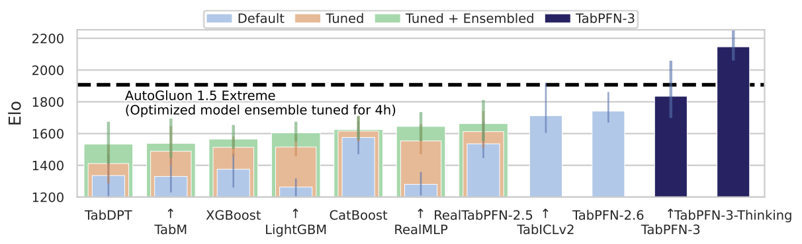
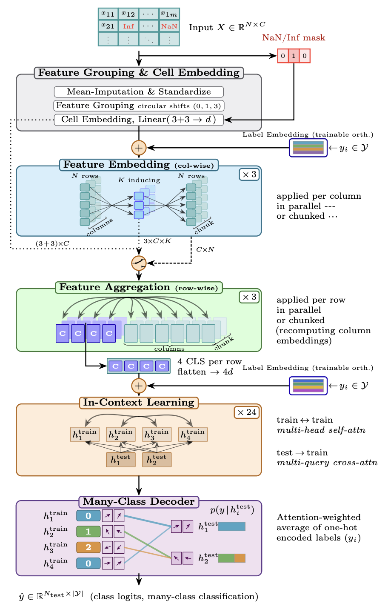

# TabPFN-3 テクニカルレポート（arXiv 2026）

> 原典: [[translations/2026-tabpfn-3]] ・ `raw/papers/TabPFN-3- Technical Report.pdf`（arXiv:2605.13986, 2026-05-12）
> 著者・年: Prior Labs Team / 2026

## 一言まとめ

TabPFN 系（[[prior-data-fitted-networks]] / [[tabular-foundation-model]]）の最新世代。[[sources/2025-tabpfn-2-5]] を **100 万行・200 特徴量**へスケール（v2.5 比 20×高速）し、アーキテクチャを刷新（TabICLv2 系の 3 段「行圧縮 ICL」へ回帰）、**テスト時計算スケーリング（Thinking mode / TabPFN-3-Plus）** を表形式基盤モデルに導入。アテンションベース多クラスデコーダ（最大160クラス）、関係データ（RelBenchV1 で RFM 新 SOTA）・テキスト表（TabSTAR SOTA）・時系列（fev-bench 2位、合成のみ訓練）・因果推論へ適用拡大。標準 TabArena で TabPFN-3 が 1 順伝播で全モデルを上回り、Thinking 版は 4 時間 AutoGluon 1.5 extreme を 10× 高速で凌駕。

<figure>

<figcaption>図1（再掲）: TabArena 最大データ部分集合（1万〜10万行）の Elo。TabPFN-3 が 1 順伝播で全モデルを上回り、TabPFN-3-Thinking はさらに上、4 時間チューニングの AutoGluon 1.5 extreme（点線）を 10× 高速で凌駕。［[[translations/2026-tabpfn-3]] 図1 より］</figcaption>
</figure>

## 背景と問題意識

表形式データは科学・産業の意思決定の中心で、長く GBDT が王者だったが、この 1 年で表形式基盤モデル（TFM）が標準ベンチで最強予測器になった。TabPFN は原典(2021)→v1(2022, 〜1k)→v2(2025 Nature, 〜10k)→2.5(2025, 〜100k)と進化。ユーザー/エコシステムのフィードバック（200超の公開応用・320万DL）をもとに、TabPFN-3 は (1) 10万行を超え **100万行へスケール**、(2) 大規模での推論メモリ/レイテンシ削減、(3) 多クラスのネイティブ対応、(4) 較正された予測分布の洗練、(5) 時系列・関係・テキスト・解釈性など下流拡張の底上げ、を狙う。

## 提案手法 / 主張（2.5 からの差分）

PFN の枠組み（合成 SCM 事前分布で一度訓練→推論時 ICL で近似ベイズ予測）は継承。主な変更:

- **アーキテクチャ刷新（v1 流 ICL へ回帰）**: v2.x の「行×特徴量の交互アテンション」は大規模で高コストなため廃止。TabICLv2 由来の **3 段** に再設計——(1) 列ごとの特徴量分布埋め込み（誘導点アテンションで二次コスト回避）、(2) 行ごとの特徴量集約（CLS トークンで固定次元の行ベクトル化）、(3) 行全体に対する v1 流 ICL（系列長が**行数のみ**に比例→大規模に効率的）。**QASSMax**（query-aware scalable softmax）で ICL の長さ汎化を改善。RMSNorm・直交ラベル埋め込み・NaN ネイティブ処理（二値指標を連結）。
- **アテンションベース多クラスデコーダ**（[[in-context-learning]]）: 固定幅 MLP ヘッドを「文脈内訓練集合上の soft nearest-neighbor 検索」に置換。最終層訓練埋め込み=キー、one-hot ラベル=値、テスト埋め込み=クエリ。$p_m=\frac1H\sum_h\sum_n \alpha^{(h)}_{m,n}\mathbf{y}_n$。**クラス数に非パラメトリック**（最大160クラス、置換同変）。

<figure>

<figcaption>図5（再掲）: TabPFN-3 のアーキテクチャ。セル埋め込み → (1) 列ごと特徴量分布埋め込み（誘導点）→ (2) 行ごと特徴量集約（CLS）→ (3) 行 ICL → 多クラスデコーダ。点線は低メモリのチャンク推論パス。［[[translations/2026-tabpfn-3]] 図5 より］</figcaption>
</figure>
- **推論最適化（1M 行を単一 GPU・サブ秒）**: ① **行チャンク**（誘導状態を全訓練集合で一度計算→行を固定チャンクでストリーム。チャンクなしと厳密等価でピークメモリを行×列から切り離す）、② **単一ヘッドの KV キャッシュ**（テスト→訓練の交差アテンションをマルチクエリ単一ヘッド化で KV を 1/8、保存は行数のみに比例→1M 行で推定器あたり 7GiB、cached-predict が 1〜3 桁高速）、③ 蒸留（CPU 向け MLP/木へ）、④ torch.compile / FlashAttention-3。
- **Thinking mode（TabPFN-3-Plus, API/エンタープライズ）**: 表形式基盤モデルに**テスト時計算スケーリング**を導入。非 TabPFN を 200+ Elo（最大データで 420 Elo）上回り、4 時間 AutoGluon 1.5 extreme を 1/10 時間で凌駕。**LLM・実データ・検索・他モデルを一切使わない**。テキスト列もネイティブ対応。→ [[tabular-foundation-model]] のテスト時計算という新軸。
- **SCM 事前分布の拡張**（[[structural-causal-model]]）: グラフ生成の多様化、combiner 機構、表現力あるカテゴリ、高周波振動、**空間活性化**、多クラス、**時間（離散時間 Dynamic SCM）**、**OOD/外挿 prior**。最終モデルは 8 兆トークン超で訓練。

## 実験結果と知見

- **TabArena（公開標準, 51 データセット）**: TabPFN-3 が 1 順伝播で全モデル上回り Real-TabPFN-2.5（調整・アンサンブル）比 +72 Elo。**Thinking 版**は非 TabPFN を 200+ Elo、AutoGluon 1.5 extreme（4h）を 100+ Elo 上回り 10× 高速。時間/性能パレートを支配。最大データ（1万〜10万行）では TabPFN-3 が +100 Elo、Thinking が AutoGluon 比 +220 Elo。
- **TALENT（274 データセット）**: 集計・タスク型別とも首位。
- **TabSTAR（テキスト表 50 データセット）**: TabPFN-3-Plus がリーダーボード支配。テキスト省略勢の中でも TabPFN-3 が最良。
- **大規模データ（10万〜100万行・13 データセット）**: デフォルト/8時間チューニングの GBDT と TabICLv2 を 1 順伝播で上回り、100k→1M で滑らかにスケール。
- **多クラス（最大100クラス合成）**: 正規化 ROC-AUC 1.00 で首位（TabICLv2 0.89、2.5 0.83）。
- **多特徴量（102〜322 サンプル・1.1k〜22k 特徴量）**: 32 推定器で最良。木ベースに難しい高次元低サンプルで強い。
- **分位点回帰**: bar-distribution ヘッドで 1 順伝播・分位点ごとの再訓練なし。正規化 pinball loss ≈1.00 で首位。
- **時系列（fev-bench 100 タスク）**: TabPFN-TS-3 が **合成のみ訓練**で SQL/MASE スキル 2 位（Chronos-2 に次ぐ）。実データ訓練勢のリーク問題（TimesFM-2.5 10%・Moirai-2.0 28%）と対照的に汚染ゼロ。
- **関係データ（RelBenchV1）**: TabPFN-REL が RFM 中 SOTA（分類・回帰）。RDBLearn+TabPFN-3 がオープンソース RFM 新 SOTA。完全教師あり RelGNN には僅差で及ばないが訓練は数桁安い。
- **因果推論**: scikit-uplift の QINI で全メタ学習器が 2.5 超（T/S 学習器が上位）。RealCause では 2.5 比やや劣る。
- **埋め込み**: ICL 層出力がクラスごとにクラスタ化。

## 限界・批判的視点

- **アーキテクチャのトレードオフ**: 早期に特徴量を行ベクトルへ圧縮するため、**行数・特徴量数が共に非常に大きい**と圧縮がボトルネック。数万特徴量では Real-TabPFN-2.5（推定器あたり500特徴量・交互アテンション）が僅かに上回る場合があり、TabPFN-3 は推定器数を増やして対処。
- **Thinking mode は非公開**: TabPFN-3-Plus / Thinking はオープンソースに含まれず API/エンタープライズのみ。コア推論エンジンも独自（proprietary）。テクニカルレポート（査読前）。
- **ライセンス**: TABPFN-3.0 License v1.0 は研究・内部評価のみ。商用/本番は別途。
- **時系列の勝率順位**: スキルでは 2 位だが勝率順では 4 位（少数データの微差に敏感）。Thinking は時間データ未対応。
- **因果（RealCause）**: 2.5 比で改善せずやや劣後。
- **クラス数上限 160**: デコーダは非パラメトリックだが事前訓練で $C_{\max}=160$ 固定。

## 意義（なぜ重要か）

表形式基盤モデルを **100 万行スケール＋テスト時計算（Thinking）** の段階へ進め、単一モデルが分類・回帰・多クラス・時系列・関係・テキスト・因果・埋め込みを横断する「構造化データ推論のコアエンジン」像を具体化した。特に **TFM へのテスト時計算スケーリングの持ち込み**（LLM の "thinking" を表データへ）と、アーキテクチャを v1 流の行 ICL へ回帰させて大規模スケールと両立させた点が技術的な肝。系譜＝原典(2021, [[sources/2021-transformers-can-do-bayesian-inference]]) → v1(2022, [[sources/2022-tabpfn]]) → v2(2025 Nature, [[sources/2025-tabpfn-v2]]) → 2.5(2025, [[sources/2025-tabpfn-2-5]]) → **3(2026, 本レポート)** の現最前線。

## 用語と略称

- **TabPFN-3 / TabPFN-3-Plus / Thinking** = 本世代モデル／API・テキスト対応版／テスト時計算版 → [[prior-data-fitted-networks]], [[tabular-foundation-model]]
- **TFM** = Tabular Foundation Model（表形式基盤モデル）→ [[tabular-foundation-model]]
- **ICL** = In-Context Learning → [[in-context-learning]]
- **テスト時計算（test-time compute）スケーリング** = 推論時に計算量を増やして予測品質を上げる枠組み（LLM の reasoning に由来）→ [[tabular-foundation-model]]
- **QASSMax** = Query-Aware Scalable Softmax（入力長に応じてアテンションを再スケール、長さ汎化）
- **誘導点（inducing points）** = 全行への二次アテンションを避けるための固定数の要約ベクトル（128個）
- **KV キャッシュ** = 訓練側のキー/値を保存し再 fit を避け predict を高速化
- **多クラスデコーダ** = soft nearest-neighbor retrieval によるクラス非依存の出力ヘッド
- **SCM / Dynamic SCM** = 構造的因果モデル／離散時間版 → [[structural-causal-model]]
- **RFM** = Relational Foundation Model（関係基盤モデル）。RelBenchV1 はその標準ベンチ
- **fev-bench / TabArena / TALENT / TabSTAR** = 時系列／表形式／大規模表形式／テキスト表のベンチマーク
- **QINI / CATE** = uplift・因果効果の評価指標 → [[structural-causal-model]]
- **RMSNorm** = 平均中心化を省いた正規化

## 関連ページ

- [[prior-data-fitted-networks]] — 中核概念（系譜の最新点）
- [[tabular-foundation-model]] — テスト時計算・1M スケール・適用拡大の枠組み
- [[in-context-learning]] — 推論メカニズム（テスト時計算・QASSMax）
- [[structural-causal-model]] — 拡張 SCM 事前分布／因果推論応用
- [[sources/2025-tabpfn-2-5]] — 直前世代（TabPFN-2.5）
- [[sources/2025-tabpfn-v2]] / [[sources/2022-tabpfn]] / [[sources/2021-transformers-can-do-bayesian-inference]] — v2・v1・原典
- [[translations/2026-tabpfn-3]] — 本文 §1〜5 の翻訳
