# No-U-Turn Sampler: ハミルトニアンモンテカルロにおける経路長の適応的設定

> 原題: The No-U-Turn Sampler: Adaptively Setting Path Lengths in Hamiltonian Monte Carlo
> 著者: Matthew D. Hoffman, Andrew Gelman（Columbia University）
> 出典: arXiv 1111.4246（JMLR 15(1):1593–1623, 2014）, ar5iv 版
>
> 訳注: 本文（§1〜§5）と各アルゴリズムを訳出する。付録 A（有効サンプルサイズの推定）・参考文献一覧・謝辞は除外。アルゴリズムの擬似コードは制御語のみ和訳し、数式・代入はそのまま残す。

## Abstract（要旨）

ハミルトニアンモンテカルロ（Hamiltonian Monte Carlo, HMC）は、一次の勾配情報に基づく一連のステップを取ることで、多くの MCMC 手法を悩ませるランダムウォーク的な振る舞いと相関したパラメータへの敏感さを避ける、マルコフ連鎖モンテカルロ（Markov chain Monte Carlo, MCMC）アルゴリズムである。これらの特徴により、ランダムウォーク Metropolis やギブスサンプリングのような単純な手法よりもはるかに速く高次元の目標分布へ収束できる。しかし、HMC の性能はユーザーが指定する2つのパラメータ——ステップサイズ $\epsilon$ と望ましいステップ数 $L$——に強く依存する。特に、$L$ が小さすぎるとアルゴリズムは望ましくないランダムウォーク的な振る舞いを示し、$L$ が大きすぎるとアルゴリズムは計算を無駄にする。我々は、ステップ数 $L$ を設定する必要をなくす HMC の拡張、No-U-Turn Sampler（NUTS）を導入する。NUTS は、目標分布の広い範囲にわたる尤もらしい候補点の集合を構築する再帰的アルゴリズムを使い、後戻りして自分の足跡をたどり始めたら自動的に停止する。経験的には、NUTS は、ユーザーの介入やコストのかかる調整実行を要さずに、よく調整された標準的な HMC 法と少なくとも同程度、時にはより効率的に動作する。また、原始双対平均化（primal-dual averaging）に基づいてステップサイズ $\epsilon$ をその場で適応させる方法も導出する。したがって NUTS は、手による調整を一切せずに使える。NUTS は、効率的な「ターンキー（turnkey, すぐ使える）」サンプリングアルゴリズムを必要とする BUGS スタイルの自動推論エンジンのような応用にも適している。

キーワード: マルコフ連鎖モンテカルロ, ハミルトニアンモンテカルロ, ベイズ推論, 適応的モンテカルロ, 双対平均化。

## 1 はじめに

階層ベイズモデルは機械学習と統計の分野の主力である。しかし、そのようなモデルでの厳密な事後推論はめったに扱いやすくないので、研究者や実務家はふつう近似的な統計推論手法に頼らざるを得ない。決定論的な近似推論アルゴリズム（例えば [^25] でレビューされたもの）は効率的でありうるが、バイアスを導入し、一部のモデルへの適用が難しいことがある。マルコフ連鎖モンテカルロ（MCMC）法は、目標（事後）分布への決定論的な近似を計算する代わりに、分布として目標分布に収束する一連の相関したサンプルを引く枠組みを提供する [^16]。MCMC 法は決定論的な対応物より効率が劣ることがあるが、より一般的に適用でき、漸近的に不偏である。

すべての MCMC アルゴリズムが同等に作られているわけではない。多くのパラメータを持つ複雑なモデルでは、ランダムウォーク Metropolis [^14] やギブスサンプリング [^9] のような単純な手法は、目標分布へ収束するのに許容できないほど長い時間を要しうる。これは主に、これらの手法が非効率なランダムウォークでパラメータ空間を探索する傾向によるものである [^16]。モデルパラメータが離散ではなく連続のとき、ハミルトニアンモンテカルロ（HMC、ハイブリッドモンテカルロとも呼ばれる）は、目標分布からのサンプリング問題をハミルトン力学のシミュレーション問題へと変換する巧妙な補助変数の仕組みによって、そのようなランダムウォーク的振る舞いを抑制できる [^19]。次元 $D$ の目標分布からの独立サンプル1つあたりの HMC のコストはおよそ $O(D^{5/4})$ で、ランダムウォーク Metropolis の $O(D^{2})$ のコストとは際立った対照をなす [^3]。

HMC の効率の向上には代償がある。第一に、HMC は対数事後分布の勾配を必要とする。複雑なモデルの勾配を計算するのは、よくて面倒、悪くて不可能だが、この要件は自動微分（automatic differentiation）を使えば軽減できる [^12]。第二に、HMC はユーザーが少なくとも2つのパラメータ——ステップサイズ $\epsilon$ と、シミュレートしたハミルトン系を走らせるステップ数 $L$——を指定することを要求する。これらのどちらかの選択が悪いと、HMC の効率は劇的に低下する。適応的 MCMC の文献（レビューは [^1]）の手法を使えば $\epsilon$ をその場で調整できるが、$L$ の設定にはふつう1回以上のコストのかかる調整実行と、その結果を解釈する専門知識が要る。このハードルが HMC のより広い利用を制限し、BUGS [^10]・JAGS・Infer.NET [^15]・HBC [^4]・PyMC [^21] のような汎用推論エンジンに HMC を組み込むのを難しくしている。

本論文の主な貢献は、HMC によく似ているが、問題含みのステップ数パラメータ $L$ を選ぶ必要をなくす MCMC アルゴリズム、No-U-Turn Sampler（NUTS）である。我々はまた、HMC と NUTS の両方でステップサイズパラメータ $\epsilon$ を自動調整する新しい双対平均化 [^20] の方式も提供し、NUTS を手による調整を一切せずに走らせることを可能にする。我々は、調整不要版の NUTS が、HMC の最適な調整パラメータを見つけるコストを無視してさえ、HMC と同程度（時にはより）効率的にサンプルすることを示す。したがって NUTS は、MCMC アルゴリズムの微調整に時間を費やせない／費やしたくないユーザー（および汎用推論システム）に HMC の効率をもたらす。

## 2 ハミルトニアンモンテカルロ

ハミルトニアンモンテカルロ（HMC）[^19] [^16] [^5] では、各モデル変数 $\theta_{d}$ に対して補助的な運動量変数（momentum variable）$r_{d}$ を導入する。通常の実装では、これらの運動量変数は標準正規分布から独立にサンプルされ、（正規化されていない）同時密度

$$
\textstyle p(\theta,r)\propto\exp\{\mathcal{L}(\theta)-\frac{1}{2}r\cdot r\}
$$

を生む。ここで $\mathcal{L}$ は関心のある変数 $\theta$ の同時密度の対数（正規化定数を除く）であり、$x\cdot y$ はベクトル $x$ と $y$ の内積を表す。この拡張モデルは物理的には、$\theta$ が $D$ 次元空間における粒子の位置、$r_{d}$ がその粒子の $d$ 番目の次元での運動量、$\mathcal{L}$ が位置依存の負のポテンシャルエネルギー関数、$\frac{1}{2}r\cdot r$ が粒子の運動エネルギー、$\log p(\theta,r)$ が粒子の負のエネルギーである架空のハミルトン系として解釈できる。この系のハミルトン力学の時間発展は、次の更新に従う「リープフロッグ（leapfrog, 蛙跳び）」積分器でシミュレートできる:

$$
r^{t+\epsilon/2}=r^{t}+(\epsilon/2)\nabla_{\theta}\mathcal{L}(\theta^{t});\quad\theta^{t+\epsilon}=\theta^{t}+\epsilon r^{t+\epsilon/2};\quad r^{t+\epsilon}=r^{t+\epsilon/2}+(\epsilon/2)\nabla_{\theta}\mathcal{L}(\theta^{t+\epsilon}),
$$

ここで $r^{t}$ と $\theta^{t}$ は時刻 $t$ における運動量・位置変数 $r$ と $\theta$ の値、$\nabla_{\theta}$ は $\theta$ に関する勾配を表す。各座標の更新が他の座標のみに依存するので、リープフロッグ更新は**体積保存的（volume-preserving）**——すなわち、ある領域の各点をリープフロッグ積分器で新しい点へ写しても、その領域の体積は不変——である。

**アルゴリズム1: ハミルトニアンモンテカルロ**
$\theta^{0}$, $\epsilon$, $L$, $\mathcal{L}$, $M$ が与えられたとき:
$m=1$ から $M$ まで:
　$r^{0}\sim\mathcal{N}(0,I)$ をサンプル。
　$\theta^{m}\leftarrow\theta^{m-1}$, $\tilde{\theta}\leftarrow\theta^{m-1}$, $\tilde{r}\leftarrow r^{0}$ と置く。
　$i=1$ から $L$ まで: $\tilde{\theta},\tilde{r}\leftarrow\mathrm{Leapfrog}(\tilde{\theta},\tilde{r},\epsilon)$ と置く。
　確率 $\alpha=\min\left\{1,\frac{\exp\{\mathcal{L}(\tilde{\theta})-\frac{1}{2}\tilde{r}\cdot\tilde{r}\}}{\exp\{\mathcal{L}(\theta^{m-1})-\frac{1}{2}r^{0}\cdot r^{0}\}}\right\}$ で、$\theta^{m}\leftarrow\tilde{\theta}$, $r^{m}\leftarrow-\tilde{r}$ と置く。
関数 $\mathrm{Leapfrog}(\theta,r,\epsilon)$:
　$\tilde{r}\leftarrow r+(\epsilon/2)\nabla_{\theta}\mathcal{L}(\theta)$;　$\tilde{\theta}\leftarrow\theta+\epsilon\tilde{r}$;　$\tilde{r}\leftarrow\tilde{r}+(\epsilon/2)\nabla_{\theta}\mathcal{L}(\tilde{\theta})$;　return $\tilde{\theta},\tilde{r}$。

HMC で $M$ サンプルを引く標準的な手続きをアルゴリズム1に示す。$I$ は単位行列、$\mathcal{N}(\mu,\Sigma)$ は平均 $\mu$・共分散行列 $\Sigma$ の多変量正規分布を表す。各サンプル $m$ について、まず運動量変数を標準多変量正規から再サンプルする（これはギブスサンプリング更新と解釈できる）。次に位置・運動量変数 $\theta$ と $r$ に $L$ 回のリープフロッグ更新を適用し、提案位置・運動量の対 $\tilde{\theta},\tilde{r}$ を生成する。$\theta^{m}=\tilde{\theta}$, $r^{m}=-\tilde{r}$ と置くことを提案し、Metropolis アルゴリズム [^14] に従って受容/棄却する。これが妥当な Metropolis 提案なのは、時間反転可能（time-reversible）であり、リープフロッグ積分器が体積保存的だからである。体積を保存しないハミルトン力学のシミュレーションアルゴリズムを使うと、Metropolis 受容確率の計算が深刻に複雑化する。提案における $\tilde{r}$ の符号反転は時間反転可能性を生むのに理論上必要だが、$p(\theta)$ からのサンプリングだけに関心があるなら実用上は省略できる。このアルゴリズムの元の名「ハイブリッドモンテカルロ」は、$\theta$ と $r$ をハミルトンシミュレーションで更新することと $r$ をギブスサンプリングで更新することを交互に行うハイブリッドなアプローチを指す。

受容確率 $\alpha$ が依存する項 $\log\frac{p(\tilde{\theta},\tilde{r})}{p(\theta,r)}$ は、時刻0から時刻 $\epsilon L$ までのシミュレートしたハミルトン系のエネルギーの負の変化である。ハミルトン力学を厳密にシミュレートできれば、ハミルトン系ではエネルギーが保存されるので $\alpha$ は常に1になる。離散時間シミュレーションによる誤差はステップサイズパラメータ $\epsilon$ に依存する——具体的には、エネルギーの変化 $|\log\frac{p(\tilde{\theta},\tilde{r})}{p(\theta,r)}|$ は大きな $L$ で $\epsilon^{2}$ に、$L=1$ なら $\epsilon^{3}$ に比例する [^13]。理論上、誤差は $L$ の関数として際限なく大きくなりうるが、リープフロッグ離散化を使うと実用上はふつうそうならない。これにより、前のサンプルから遠くにあっても高い受容確率を持つ $\theta$ の提案を生成しながら、多くのリープフロッグステップで HMC を走らせられる。

HMC の性能は $\epsilon$ と $L$ の適切な値の選択に強く依存する。$\epsilon$ が大きすぎるとシミュレーションが不正確になり低い受容率を生む。$\epsilon$ が小さすぎると、多くの小さなステップを取って計算が無駄になる。$L$ が小さすぎると、連続するサンプルが互いに近くなり、望ましくないランダムウォーク的振る舞いと遅い混合（mixing）をもたらす。$L$ が大きすぎると、HMC はループして自分の足跡をたどる軌跡を生成する。これは二重に無駄である。提案 $\tilde{\theta}$ を初期位置 $\theta^{m-1}$ に近づける仕事をしているからだ。さらに悪いことに、各反復でパラメータが空間の一方から他方へ飛ぶように $L$ が選ばれると、マルコフ連鎖はエルゴード的（ergodic）ですらなくなりうる [^19]。より現実的には、不運な $L$ の選択は、エルゴード的だが低密度・高密度の領域間の移動が遅い連鎖をもたらしうる。

## 3 HMC の手による調整の必要をなくす

HMC は強力なアルゴリズムだが、その有用性はステップサイズパラメータ $\epsilon$ とステップ数 $L$ を調整する必要によって制限される。任意の特定の問題でこれらのパラメータを調整するには、ある程度の専門知識と、ふつう1回以上の予備実行が要る。$L$ の選択は特に問題含みである。軌跡がいつ短すぎ、長すぎ、「ちょうどよい」かの単純な尺度を見つけるのが難しく、実務家はふつう予備実行からの自己相関統計に基づくヒューリスティックに頼る [^19]。

以下では、固定値 $L$ を指定する必要をなくす HMC の拡張、No-U-Turn Sampler（NUTS）を提示する。§3.2 では、[^20] の双対平均化アルゴリズムに基づいて $\epsilon$ を設定する方式を提示する。

### 3.1 No-U-Turn ハミルトニアンモンテカルロ

我々の最初の目標は、提案を生成するためにアルゴリズムが取るリープフロッグステップ数 $L$ を設定する必要なしに、ランダムウォーク的振る舞いを抑制する HMC の能力を保持する MCMC サンプラーを考案することである。力学を「十分長く」シミュレートしたか、すなわちさらにステップを走らせても提案 $\tilde{\theta}$ と $\theta$ の初期値の距離がもはや増えなくなったか、を教えてくれる何らかの基準が必要である。我々は $\tilde{r}$（現在の運動量）と $\tilde{\theta}-\theta$（初期位置から現在位置へのベクトル）の内積に基づく便利な基準を使う。これは初期位置 $\theta$ と現在位置 $\tilde{\theta}$ の間の距離の二乗の半分の、（ハミルトン系における）時間に関する微分である:

$$
\frac{d}{dt}\frac{(\tilde{\theta}-\theta)\cdot(\tilde{\theta}-\theta)}{2}=(\tilde{\theta}-\theta)\cdot\frac{d}{dt}(\tilde{\theta}-\theta)=(\tilde{\theta}-\theta)\cdot\tilde{r}.
$$

言い換えれば、シミュレーションをさらに微小な時間だけ走らせると、この量は出発点 $\theta$ から離れる進み具合に比例する。

これは、式（上式）の量が0より小さくなるまでリープフロッグステップを走らせるアルゴリズムを示唆する。そのようなアプローチは、提案位置 $\tilde{\theta}$ が $\theta$ へ戻り始めるまで系の力学をシミュレートするだろう。残念ながらこのアルゴリズムは時間反転可能性を保証せず、したがって正しい分布へ収束する保証がない。NUTS は、[^18] がスライスサンプリングのために考案した倍化（doubling）手続きを思わせる再帰的アルゴリズムによってこの問題を克服する。

<figure>

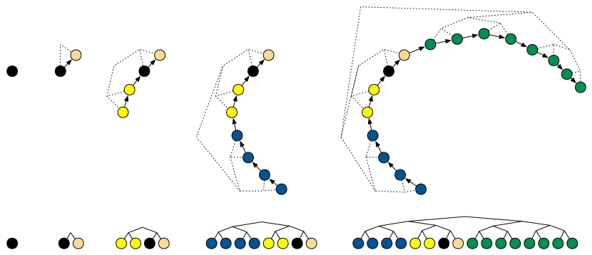

<figcaption>図1: NUTS の倍化（doubling）プロセスで二分木（binary tree）を構築する様子。各ステップで木の高さを倍にし、葉ノードが位置・運動量状態に対応する。前後ランダムに 1→2→4→… ステップ進み、平衡な部分木が「U ターン」を始めたら停止する。</figcaption>
</figure>

<figure>

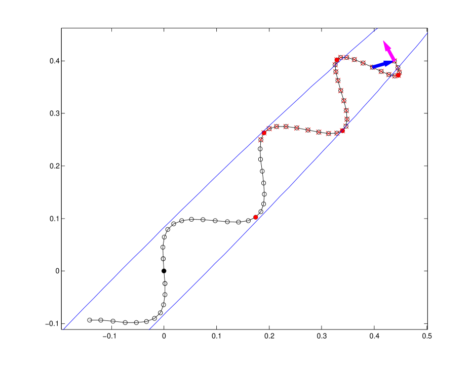

<figcaption>図2: NUTS の1反復で計算された軌跡の例。初期点（黒）から前後にハミルトン軌跡をたどり、青の帯（スライス変数 u で定義される領域）の中の状態から次の点を選ぶ。終端で高さ3の部分木が U ターン基準（式9）を満たして停止。桃・黄・青・緑は倍化の各段階。</figcaption>
</figure>

NUTS はまず、条件付き分布 $p(u|\theta,r)=\mathrm{Uniform}(u;[0,\exp\{\mathcal{L}(\theta)-\frac{1}{2}r\cdot r\}])$ を持つスライス変数（slice variable）$u$ を導入する。これは条件付き分布 $p(\theta,r|u)=\mathrm{Uniform}(\theta,r;\{\theta',r'|\exp\{\mathcal{L}(\theta)-\frac{1}{2}r\cdot r\}\geq u\})$ を生む。このスライスサンプリングのステップは厳密には必要ないが、NUTS の導出と実装の両方を単純化する。スライス変数を消す類似のアルゴリズムは、より複雑なうえ、経験的に本論文のアルゴリズムよりわずかに非効率に見える。

高レベルでは、$u|\theta,r$ を再サンプルした後、NUTS はリープフロッグ積分器を使って架空の時間で前後に経路をたどる。まず前または後ろに1ステップ、次に前または後ろに2ステップ、次に4ステップ、というように。この倍化プロセスは、葉ノードが位置・運動量状態に対応する平衡二分木を暗黙に構築する（図1）。倍化は、全体の二分木のいずれかの平衡な部分木の最左端から最右端までの部分軌跡が後戻りを始めた（架空の粒子が「U ターン」を始めた）ときに停止される。この時点で NUTS はシミュレーションを止め、詳細釣り合いを保つよう注意しながら、シミュレーション中に計算された点の集合から1つをサンプルする。図2は NUTS の1反復で計算された軌跡の例を示す。

効率的版 NUTS の擬似コードをアルゴリズム3に示す。詳細な導出を以下に示し、アルゴリズム3の動機づけと直感を与える単純化版（ただしずっと多くのメモリを使い、より小さなジャンプをする）も併せて示す。

#### 3.1.1 単純化版 NUTS アルゴリズムの導出

NUTS はモデル $p(\theta,r)\propto\exp\{\mathcal{L}(\theta)-\frac{1}{2}r\cdot r\}$ をスライス変数 $u$ [^18] でさらに拡張する。$\theta,r,u$ の同時確率は

$$
\textstyle p(\theta,r,u)\propto\mathbb{I}[u\in[0,\exp\{\mathcal{L}(\theta)-\frac{1}{2}r\cdot r\}]],
$$

ここで $\mathbb{I}[\cdot]$ は括弧内の式が真なら1、偽なら0である。$\theta$ と $r$ の（正規化されていない）周辺確率（$u$ について積分）は、標準 HMC と同じく $p(\theta,r)\propto\exp\{\mathcal{L}(\theta)-\frac{1}{2}r\cdot r\}$ である。条件付き確率 $p(u|\theta,r)$ と $p(\theta,r|u)$ は、条件 $u\leq\exp\{\mathcal{L}(\theta)-\frac{1}{2}r\cdot r\}$ が満たされる限り、各々一様である。

我々はさらに、候補となる位置・運動量状態の有限集合 $\mathcal{C}$ と、別の有限集合 $\mathcal{B}\supseteq\mathcal{C}$ をモデルに加える。$\mathcal{B}$ は、与えられた NUTS 反復中にリープフロッグ積分器がたどるすべての位置・運動量状態の集合で、$\mathcal{C}$ は、詳細釣り合いを破らずに遷移できるそれらの部分集合である。$\mathcal{B}$ は前後にランダムにリープフロッグステップを取って構築され、$\mathcal{C}$ は $\mathcal{B}$ から決定論的に選ばれる。$\theta,r,u,\epsilon$ が与えられたときに $\mathcal{B}$ と $\mathcal{C}$ を構築するランダムな手続きが条件付き分布 $p(\mathcal{B},\mathcal{C}|\theta,r,u,\epsilon)$ を定義し、これに次の条件を課す:

1. $\mathcal{C}$ のすべての要素は体積を保存する仕方で選ばれねばならない。すなわち、状態 $\theta',r'$ を $\mathcal{C}$ に加えるのに使う $\theta,r$ の決定論的変換は、ヤコビアンの行列式が1でなければならない。
2. $p((\theta,r)\in\mathcal{C}|\theta,r,u,\epsilon)=1$。
3. $p(u\leq\exp\{\mathcal{L}(\theta')-\frac{1}{2}r'\cdot r'\}|(\theta',r')\in\mathcal{C})=1$。
4. $(\theta,r)\in\mathcal{C}$ かつ $(\theta',r')\in\mathcal{C}$ なら、任意の $\mathcal{B}$ について $p(\mathcal{B},\mathcal{C}|\theta,r,u,\epsilon)=p(\mathcal{B},\mathcal{C}|\theta',r',u,\epsilon)$。

C.1 は $p(\theta,r|(\theta,r)\in\mathcal{C})\propto p(\theta,r)$ を保証する。すなわち $\mathcal{C}$ の要素に注目を限れば、$\mathcal{C}$ の特定要素の正規化されていない確率密度を正規化されていない確率質量として扱える。C.2 は現在の状態 $\theta,r$ が $\mathcal{C}$ に含まれねばならないと言う。C.3 は $\mathcal{C}$ の任意の状態が $u$ で定義されるスライス内にあること、すなわち任意の状態 $(\theta',r')\in\mathcal{C}$ が等しい（正の）条件付き密度 $p(\theta',r'|u)$ を持つことを要求する。C.4 は、$(\theta,r)\in\mathcal{C}$ である限り（C.2 によりそうでなければならない）、現在の状態 $\theta,r$ によらず $\mathcal{B}$ と $\mathcal{C}$ が選ばれる確率が等しくなければならないと述べる。

これらの条件を満たす分布 $p(\mathcal{B},\mathcal{C}|\theta,r,u,\epsilon)$ をどう構築しサンプルするかは後回しにして、次の手続きが同時分布 $p(\theta,r,u,\mathcal{B},\mathcal{C}|\epsilon)$ を不変に保つことを示す: (1) $r\sim\mathcal{N}(0,I)$ をサンプル、(2) $u\sim\mathrm{Uniform}([0,\exp\{\mathcal{L}(\theta^{t})-\frac{1}{2}r\cdot r\}])$ をサンプル、(3) $\mathcal{B},\mathcal{C}$ をその条件付き分布 $p(\mathcal{B},\mathcal{C}|\theta^{t},r,u,\epsilon)$ からサンプル、(4) $\theta^{t+1},r\sim T(\theta^{t},r,\mathcal{C})$ をサンプル。ここで $T(\theta',r'|\theta,r,\mathcal{C})$ は $\mathcal{C}$ 上の一様分布を不変に保つ遷移核である。ステップ1・2・3 は $\theta^{t}$ が与えられたときの $r,u,\mathcal{B},\mathcal{C}$ の条件付き同時分布からの再サンプルなので、合わせて妥当なギブスサンプリング更新を構成する。ステップ4 は、$u,\mathcal{B},\mathcal{C},\epsilon$ が与えられたときの $\theta,r$ の同時分布が $\mathcal{C}$ の要素上で一様だから妥当である。

NUTS が使う $p(\mathcal{B},\mathcal{C}|\theta,r,u,\epsilon)$ の具体形に話を移そう。概念的には、$\mathcal{B}$ を構築する生成プロセスは、葉が位置・運動量状態に対応する二分木のサイズを繰り返し倍にすることで進む。初期の木は初期状態に対応する単一ノードを持つ。倍化は、ランダムな方向 $v_{j}\sim\mathrm{Uniform}(\{-1,1\})$ を選び、サイズ $v_{j}\epsilon$ の $2^{j}$ 回のリープフロッグステップを取る（$j$ は木の現在の高さ）ことで進む。例えば $v_{j}=1$ なら、新しい木の左半分は古い木、右半分は新しいリープフロッグ軌跡が訪れた $2^{j}$ 個の状態に対応する高さ $j$ の平衡二分木である（図1）。高さ $j$ の木を構築する仕方は $2^{j}$ 通りあり、各々等しく尤もらしい。逆に、その木のどの葉から始めても特定の高さ $j$ の木を再構築する確率は、どの葉から始めても $2^{-j}$ である。

もちろん木を永遠に拡張し続けることはできない。シミュレートしている軌跡の一端が「U ターン」して軌跡上の別の位置へ戻り始めるまで $\mathcal{B}$ を拡張し続けたい。その時点で続けると、軌跡が足跡をたどってすでに訪れた近くの場所を訪れるので無駄になりがちだ。また、シミュレーションの誤差が極端に大きくなったら（指定した $\epsilon$ が大きすぎる、または目標分布が対数密度を $-\infty$ にする硬い制約を含む場合に起こりうる）も拡張を止めたい。

第2の規則は形式化が容易で、木が次を満たす状態 $\theta,r$ の葉ノードを含むなら倍化を止める:

$$
\mathcal{L}(\theta)-\frac{1}{2}r\cdot r-\log u<-\Delta_{\mathrm{max}}
$$

（ある非負の $\Delta_{\mathrm{max}}$ について）。$\Delta_{\mathrm{max}}$ は1000のような大きな値に設定し、シミュレーションがそこそこ正確である限りアルゴリズムを妨げないようにすることを推奨する。

第1の規則は、詳細釣り合いを破らず過度の計算オーバーヘッドも導入しないサンプラーを作れるよう、慎重に定義せねばならない。高さ $j$ で倍化を止めるか決めるため、NUTS は高さ $j$ の木の、高さが0より大きい $2^{j}-1$ 個の平衡二分部分木を考える。NUTS は、それらの部分木の1つについて、その最左・最右の葉に関連する状態 $\theta^{-},r^{-}$ と $\theta^{+},r^{+}$ が

$$
(\theta^{+}-\theta^{-})\cdot r^{-}<0\quad\mathrm{or}\quad(\theta^{+}-\theta^{-})\cdot r^{+}<0
$$

を満たすとき、倍化プロセスを止める。すなわち、時間で前または後ろに微小に続けると位置ベクトル $\theta^{-}$ と $\theta^{+}$ の距離が減るなら止める。高さ $j$ の木の各平衡部分木についてこの条件を評価するには $2^{j+1}-2$ 個の内積が要り、これは軌跡を計算する $2^{j}-1$ 回のリープフロッグステップに要する内積数に匹敵する。データが非常に少ない非常に単純なモデルを除けば、これらの内積のコストはふつう勾配計算のコストに比べて無視できる。

（この倍化プロセスが $p(\mathcal{B}|\theta,r,u,\epsilon)$ を定義する。次に $\mathcal{B}$ の要素のうちどれを候補集合 $\mathcal{C}$ に入れるかの決定論的プロセスを、上の条件 C.1–C.4 を満たすよう注意して定義する。C.1 はリープフロッグステップが体積保存的なので自動的に満たされる。C.2 は初期状態 $\theta,r$ を $\mathcal{C}$ に含めれば満たされ、C.3 は $\exp\{\mathcal{L}(\theta')-\frac{1}{2}r'\cdot r'\}<u$ となる $\mathcal{B}$ の要素を除外すれば満たされる。C.4 を満たすには、$\mathcal{B}$ を生成できなかった状態を $\mathcal{C}$ から除外すればよい。詳しくは原典 §3.1.1 を参照。）

**アルゴリズム2: 単純（Naive）No-U-Turn Sampler**
$\theta^{0}$, $\epsilon$, $\mathcal{L}$, $M$ が与えられたとき:
$m=1$ から $M$ まで:
　$r^{0}\sim\mathcal{N}(0,I)$ を再サンプル。
　$u\sim\mathrm{Uniform}([0,\exp\{\mathcal{L}(\theta^{m-1})-\frac{1}{2}r^{0}\cdot r^{0}\}])$ を再サンプル。
　$\theta^{-}=\theta^{m-1},\theta^{+}=\theta^{m-1},r^{-}=r^{0},r^{+}=r^{0},j=0,\mathcal{C}=\{(\theta^{m-1},r^{0})\},s=1$ で初期化。
　$s=1$ である間:
　　方向 $v_{j}\sim\mathrm{Uniform}(\{-1,1\})$ を選ぶ。
　　$v_{j}=-1$ なら $\theta^{-},r^{-},-,-,\mathcal{C}',s'\leftarrow\mathrm{BuildTree}(\theta^{-},r^{-},u,v_{j},j,\epsilon)$、
　　そうでなければ $-,-,\theta^{+},r^{+},\mathcal{C}',s'\leftarrow\mathrm{BuildTree}(\theta^{+},r^{+},u,v_{j},j,\epsilon)$。
　　$s'=1$ なら $\mathcal{C}\leftarrow\mathcal{C}\cup\mathcal{C}'$。
　　$s\leftarrow s'\,\mathbb{I}[(\theta^{+}-\theta^{-})\cdot r^{-}\geq 0]\,\mathbb{I}[(\theta^{+}-\theta^{-})\cdot r^{+}\geq 0]$;　$j\leftarrow j+1$。
　$\mathcal{C}$ から一様ランダムに $\theta^{m},r$ をサンプル。
関数 $\mathrm{BuildTree}(\theta,r,u,v,j,\epsilon)$:
　$j=0$ なら（基底ケース）: $\theta',r'\leftarrow\mathrm{Leapfrog}(\theta,r,v\epsilon)$;　$u\leq\exp\{\mathcal{L}(\theta')-\frac{1}{2}r'\cdot r'\}$ なら $\mathcal{C}'\leftarrow\{(\theta',r')\}$ そうでなければ $\emptyset$;　$s'\leftarrow\mathbb{I}[u<\exp\{\Delta_{\mathrm{max}}+\mathcal{L}(\theta')-\frac{1}{2}r'\cdot r'\}]$;　return $\theta',r',\theta',r',\mathcal{C}',s'$。
　そうでなければ（再帰）: 左右の部分木を構築し、$s'$ に U ターン基準の指示子を掛け、$\mathcal{C}'\leftarrow\mathcal{C}'\cup\mathcal{C}''$ として返す。

アルゴリズム2は、$\mathcal{B}$ を構築しながら $\mathcal{C}$ を漸増的に構築する方法を示す。初期運動量・スライス変数を再サンプルした後、深さ優先探索に似た再帰手続きを使い、倍化が使う木を明示的に格納する必要をなくす。要約すると、アルゴリズム2は $p(\theta,r,u,\mathcal{B},\mathcal{C}|\epsilon)$ を不変に保つ遷移核を定義し、したがって目標分布 $p(\theta)\propto\exp\{\mathcal{L}(\theta)\}$ を不変に保つ。

#### 3.1.2 効率的 NUTS

アルゴリズム2は $\mathcal{L}(\theta)$ とその勾配を $2^{j}-1$ 回評価し、倍化をいつ止めるか決めるのに $O(2^{j})$ の追加演算を要する。実際、最小の問題を除けば $\mathcal{L}$ とその勾配の計算コストがオーバーヘッドを支配するので、アルゴリズム2のリープフロッグステップあたりの計算コストは標準 HMC に匹敵する。しかしアルゴリズム2は $2^{j}$ 個の位置・運動量ベクトルの格納を要し、許容できないほど大きなメモリが要りうる。さらに、$\mathcal{C}$ 上の一様分布に関して詳細釣り合いを満たし、単純な一様サンプリングより平均してより大きなジャンプを生む別の遷移核がある。最後に、最後の倍化反復の途中で停止基準が満たされるなら、決して使われない集合 $\mathcal{C}'$ を構築する計算は無駄である。

第3の問題は容易に対処できる——停止指示子 $s$ がゼロになった瞬間に再帰から抜ければ、正しさは影響を受けず計算を節約できる。第2の問題は、$\mathcal{C}$ 上の一様分布を不変に保ちながらある状態 $(\theta,r)\in\mathcal{C}$ から別の状態 $(\theta',r')\in\mathcal{C}$ へ移る、より洗練された遷移核で対処できる。この核は $O(2^{j})$ ではなく $O(j)$ 個の位置・運動量ベクトルの格納だけを要するメモリ効率的な実装を許す。

具体的には、$\mathcal{C}$ を互いに素な部分集合 $\mathcal{C}^{\textrm{new}}$（最後の倍化で加えられた要素）と $\mathcal{C}^{\textrm{old}}$ に分け、$\mathcal{C}^{\textrm{old}}$ から $\mathcal{C}^{\textrm{new}}$ のランダムな状態への移動を確率 $\frac{|\mathcal{C}^{\textrm{new}}|}{|\mathcal{C}^{\textrm{old}}|}$ で受容する遷移核 $T$ を使う。これは $\mathcal{C}$ 上の一様分布に関して詳細釣り合いを満たす。各倍化の後ごとに $T$ を適用すると、初期状態 $\theta^{t}$ から遠い状態 $\theta^{t+1}$ へジャンプする確率が増す——逆向きに考えれば、まず $\mathcal{C}$ の反対側へ飛ぼうとし、失敗すればより控えめなジャンプを試み、というふうである。この遷移核は遅延棄却（delayed-rejection）MCMC [^24] に似ているが、ここでは新しい提案を評価する通常のコストを避けられる。さらに、図1の二分木構造を利用すると、完全な集合 $\mathcal{C}'$ をメモリに保持せずに $\mathcal{C}'$ からサンプルでき、$O(2^{j})$ ではなく $O(j)$ 個のベクトルの格納だけで済む。

アルゴリズム3は上記の改善をすべて擬似コードで実装する。Matlab コードは http://www.cs.princeton.edu/~mdhoffma で入手可能で、C++ 実装は近日公開の Stan 推論パッケージの一部としても提供される。

**アルゴリズム3: 効率的 No-U-Turn Sampler**（要点）
$\theta^{0}$, $\epsilon$, $\mathcal{L}$, $M$ が与えられたとき、各 $m$ で: $r^{0}$ を再サンプル、$u$ を再サンプル、$\theta^{-}=\theta^{+}=\theta^{m-1}$, $r^{-}=r^{+}=r^{0}$, $j=0$, $\theta^{m}=\theta^{m-1}$, $n=1$, $s=1$ で初期化。$s=1$ の間: 方向 $v_{j}$ を選び、$\mathrm{BuildTree}$ で半木を構築（$\theta',n',s'$ を返す）。$s'=1$ なら確率 $\min\{1,\frac{n'}{n}\}$ で $\theta^{m}\leftarrow\theta'$。$n\leftarrow n+n'$, $s\leftarrow s'\,\mathbb{I}[(\theta^{+}-\theta^{-})\cdot r^{-}\geq 0]\,\mathbb{I}[(\theta^{+}-\theta^{-})\cdot r^{+}\geq 0]$, $j\leftarrow j+1$。$\mathrm{BuildTree}$ の基底ケースは1リープフロッグステップ＋$n'=\mathbb{I}[u\leq\exp\{\mathcal{L}(\theta')-\frac{1}{2}r'\cdot r'\}]$、再帰は左右部分木を暗黙に構築し、確率 $\frac{n''}{n'+n''}$ で代表点を更新する（$O(j)$ メモリで $\mathcal{C}'$ から1点をサンプルする）。

### 3.2 ϵ の適応的調整

ステップ数 $L$ をどう選ぶかの問題に対処したので、次にステップサイズパラメータ $\epsilon$ に注目する。NUTS と HMC の両方で $\epsilon$ を設定するため、消失する適応（vanishing adaptation）を伴う確率的最適化 [^1]、具体的には [^20] の原始双対アルゴリズムの適応を使うことを提案する。

MCMC で最もよく使われる消失適応アルゴリズムは [^23] の確率近似法である。反復 $t\geq 1$ での MCMC アルゴリズムの振る舞いのある側面を記述する統計 $H_{t}$ があり、その期待値 $h(x)\equiv\mathbb{E}_{t}[H_{t}|x]$ を定義する（$x\in\mathbb{R}$ は調整可能なパラメータ）。例えば $\alpha_{t}$ が反復 $t$ の Metropolis 受容確率なら、$H_{t}=\delta-\alpha_{t}$（$\delta$ は望ましい平均受容確率）と定義できる。$h$ が $x$ の非減少関数で他のいくつかの条件が満たされれば、更新 $x_{t+1}\leftarrow x_{t}-\eta_{t}H_{t}$ は、ステップサイズ列 $\eta_{t}$ が $\sum_{t}\eta_{t}=\infty$ かつ $\sum_{t}\eta_{t}^{2}<\infty$ を満たす限り、$h(x_{t})$ を0へ収束させることが保証される。これらは $\eta_{t}\equiv t^{-\kappa}$（$\kappa\in(0.5,1]$）で満たされる。適応の反復ごとの影響が0に向かう限り、サンプラーの漸近的振る舞いは変わらない。実務では、調整可能パラメータをバーンイン中に適応させ、その後は凍結するのが一般的である [^8]。

**双対平均化（Dual averaging）:** バーンイン段階と定常段階での最適パラメータ値はしばしばかなり異なるので、初期の過渡的状態から定常状態へ移るにつれてパラメータが速く適応してほしい。しかし Robbins-Monro の減少するステップサイズは初期の反復に不釣り合いな重みを与え、望ましいことの逆である。同様の問題が [^20] の双対平均化（非平滑・確率的凸最適化のアルゴリズム）を動機づける。確率的勾配を統計 $H_{t}$ で置き換えれば、双対平均化を MCMC の適応に容易に適応できる。$h(x)\equiv\mathbb{E}_{t}[H_{t}|x]=0$ となる $x$ を見つけたいと仮定し、次の更新を適用する:

$$
x_{t+1}\leftarrow\mu-\frac{\sqrt{t}}{\gamma}\frac{1}{t+t_{0}}\sum_{i=1}^{t}H_{i};\quad\bar{x}_{t+1}\leftarrow\eta_{t}x_{t+1}+(1-\eta_{t})\bar{x}_{t},
$$

ここで $\mu$ は反復 $x_{t}$ が縮約される自由に選んだ点、$\gamma>0$ は $\mu$ への縮約量を制御する自由パラメータ、$t_{0}\geq 0$ は初期反復を安定化する自由パラメータ、$\eta_{t}\equiv t^{-\kappa}$ はステップサイズ列、$\bar{x}_{1}=x_{1}$。Robbins-Monro と同様、これらの更新の $x$ への反復ごとの影響は $t\to\infty$ で0に向かう。平均化された反復 $\bar{x}_{t}$ の列は $h(\bar{x}_{t})$ が0へ収束する値へ収束することが保証される。我々は全実験で $\gamma=0.05,t_{0}=10,\kappa=0.75$ を使った。

**HMC での $\epsilon$ の設定:** HMC では、小さすぎず（小さなステップで計算を無駄にする）大きすぎない（高い棄却率で計算を無駄にする）$\epsilon$ を見つけたい。標準的なアプローチは、HMC の平均 Metropolis 受容確率がある値 $\delta$ に等しくなるよう $\epsilon$ を調整することである。実際、（かなり強い仮定のもとで）与えられたシミュレーション長 $\epsilon L$ に対する最適な $\epsilon$ は、平均 Metropolis 受容確率がおよそ 0.65 を生むものであることが示されている [^2] [^19]。$H^{\mathrm{HMC}}_{t}\equiv\min\{1,\frac{p(\tilde{\theta}^{t},\tilde{r}^{t})}{p(\theta^{t-1},r^{t,0})}\}$ とし、$H_{t}\equiv\delta-H^{\mathrm{HMC}}_{t}$, $x\equiv\log\epsilon$ で上の更新を適用すれば、任意の $\delta\in(0,1)$ について $h^{\mathrm{HMC}}=\delta$ に強制できる。

**NUTS での $\epsilon$ の設定:** NUTS には単一の受容/棄却ステップがないので、Metropolis 受容確率の代替統計を定義せねばならない。各反復で $H^{\mathrm{NUTS}}_{t}\equiv\frac{1}{|\mathcal{B}_{t}^{\mathrm{final}}|}\sum_{\theta,r\in\mathcal{B}_{t}^{\mathrm{final}}}\min\{1,\frac{p(\theta,r)}{p(\theta^{t-1},r^{t,0})}\}$ を定義する（$\mathcal{B}_{t}^{\mathrm{final}}$ は反復 $t$ の最後の倍化で探索したすべての状態の集合）。$H^{\mathrm{NUTS}}$ は、最後の倍化で探索した位置・運動量状態に HMC が与えるであろう平均受容確率と理解できる。同様に $H_{t}\equiv\delta-H^{\mathrm{NUTS}}$, $x\equiv\log\epsilon$ で更新を適用すれば $h^{\mathrm{NUTS}}=\delta$ に強制できる。

**アルゴリズム4: $\epsilon$ の初期値を選ぶヒューリスティック** — $\mathrm{FindReasonableEpsilon}(\theta)$: $\epsilon=1$, $r\sim\mathcal{N}(0,I)$ で初期化、1リープフロッグステップを取り、ステップサイズ $\epsilon$ のランジュバン提案の受容確率が 0.5 を横切るまで $\epsilon$ を倍化または半減する。要するに、受容確率が 0.5 をまたぐまで $\epsilon$ を倍／半にする。

**アルゴリズム5・6**（双対平均化つき HMC / NUTS）は、上の双対平均化を組み込み、$\mu=\log(10\epsilon_{0})$, $\gamma=0.05,t_{0}=10,\kappa=0.75$ で初期化、$M^{\mathrm{adapt}}$ 反復まで適応してその後 $\epsilon$ を凍結する。アルゴリズム5は目標シミュレーション長 $\lambda\approx\epsilon L$・目標平均受容確率 $\delta$・適応打ち切り回数 $M^{\mathrm{adapt}}$ を入力に取り、アルゴリズム6（NUTS）は $\delta$ と $M^{\mathrm{adapt}}$ だけを要する。すなわち**アルゴリズム6（双対平均化つき NUTS）は、ユーザーが目標受容確率 $\delta$ を1つ指定するだけで走る**——これが「手による調整ゼロ」の到達点である。

## 4 経験的評価

本節では、§3.2 の双対平均化アルゴリズムの有効性を調べ、双対平均化の目標 $\delta$ のどの値が効率的なサンプラーを生むかを調べ、NUTS と HMC の効率を比較する。各目標分布について、HMC（アルゴリズム5）と NUTS（アルゴリズム6）を4つの目標分布に対し 2000 反復走らせ、最初の 1000 反復で双対平均化により $\epsilon$ を適応させた。効率は、各アルゴリズムが使った勾配評価回数で正規化した**有効サンプルサイズ（ESS）**で測る。$M$ 個の相関サンプルの ESS は、相関サンプルと同じ精度のモンテカルロ平均推定を与えるのに必要な独立サンプルの数であり、より効率的なサンプラーはより少ない計算で大きな ESS を与える。計算量の代理として勾配評価回数を使う（HMC も NUTS もコストは勾配計算が支配する）。各実験で最初の 1000 サンプルをバーンインとして捨てた。ESS は1変量統計なので、各次元で別々に計算し全次元の最小 ESS を報告する（サンプラーに全次元を効果的に探索してほしいから）。

### 4.1 モデルとデータセット

NUTS と HMC を、4つの目標分布から——1つは合成、他の3つは実データから生じる事後分布——サンプルして評価した:

- **250次元多変量正規（MVN）**: $p(\theta)\propto\exp\{-\frac{1}{2}\theta^{T}A\theta\}$。精度行列 $A$ は単位スケール・自由度250の Wishart 分布から生成し、多くの強い相関を持つ目標分布を生む。
- **ベイズロジスティック回帰（LR）**: German credit データセット（UCI [^6]）に当てはめたベイズロジスティック回帰の事後分布。24次元予測子、切片 $\alpha$、24個の回帰係数 $\beta$、弱い正規事前（分散 $\sigma^{2}=100$）。1000顧客。
- **階層ベイズロジスティック回帰（HLR）**: 同じ German credit データだが、事前の分散パラメータを指数事前で推定し、2次の交互作用を含めて $\binom{24}{2}+24=300$ 次元の予測子・係数に拡張。事後は高次元で、分散項 $\sigma^{2}$ が残り301変数と強く相互作用する、より難しい問題。
- **確率的ボラティリティ（SV）**: S&P 500 指数の 3000日のリターンに当てはめた比較的単純な確率的ボラティリティモデルの事後分布。精度パラメータ $\tau$ を積分消去し、3001 次元の目標分布になる。

### 4.2 双対平均化の収束

<figure>

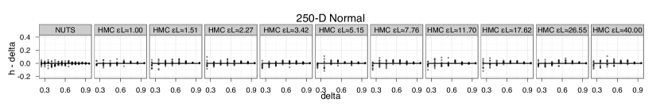

<figcaption>図3a（250次元正規 MVN）: 統計 h の実現値と目標値 δ（横軸）。NUTS（左パネル）と、さまざまな εL の HMC（右の10パネル）について、h−δ をプロット。0 付近に集まっていれば双対平均化が h を目標 δ にうまく強制できている。</figcaption>
</figure>

<figure>

<figcaption>図3b（ロジスティック回帰 LR）: 同上。h−δ vs δ。</figcaption>
</figure>

<figure>

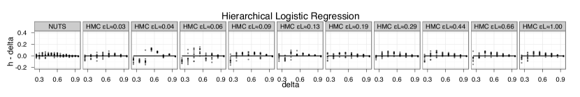

<figcaption>図3c（階層ロジスティック回帰 HLR）: 同上。h−δ vs δ。</figcaption>
</figure>

<figure>

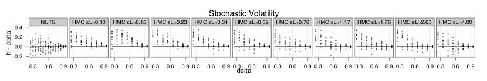

<figcaption>図3d（確率的ボラティリティ SV）: 同上。SV はバーンインが長く必要なため、双対平均化がやや劣る（特に小さい δ の HMC）。</figcaption>
</figure>

図3は統計 $h^{\mathrm{HMC}}$ と $h^{\mathrm{NUTS}}$ の実現値と目標値をプロットする。§3.2 の双対平均化アルゴリズムはふつう $h$ を望ましい値 $\delta$ にうまく強制する。確率的ボラティリティモデルでやや劣るのは、このモデルが長いバーンイン期間を要するためで、適応アルゴリズムが定常分布に適切な $\epsilon$ に調整する時間が少なくなる。

<figure>

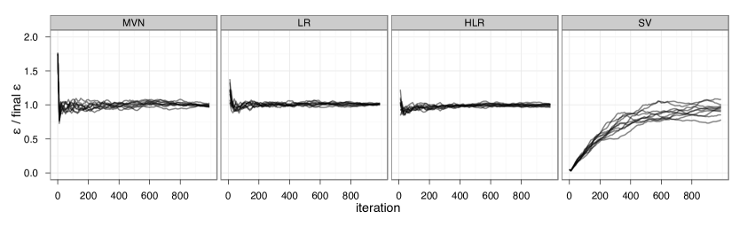

<figcaption>図4: NUTS（δ=0.65）について、双対平均化更新回数（横軸 iteration）に対する平均化反復 ε̄ / final ε の収束。MVN・LR・HLR は数百反復でおよそ収束。SV はバーンインに時間を要し収束が遅い。</figcaption>
</figure>

図4は、NUTS（$\delta=0.65$）について平均化反復 $\bar{\epsilon}_{m}$ の収束を双対平均化更新回数の関数としてプロットする。バーンインに時間を要する確率的ボラティリティモデルを除き、$\bar{\epsilon}$ は数百反復以内でおよそ収束する。

### 4.3 NUTS の軌跡長

<figure>

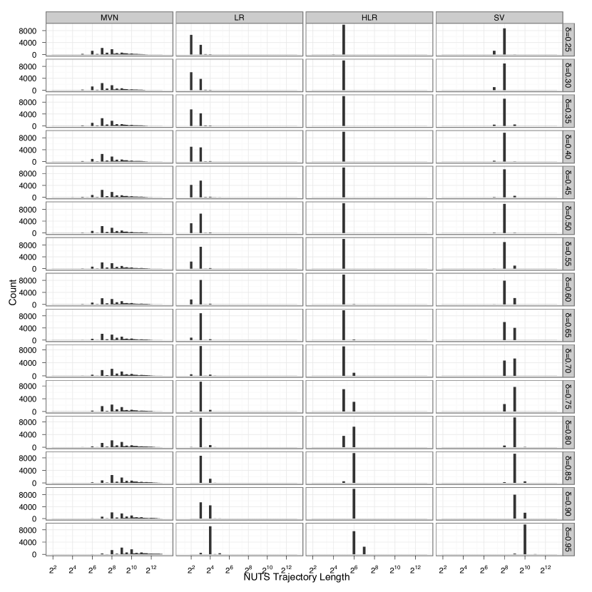

<figcaption>図5: NUTS が生成する軌跡長（訪れた状態数、横軸は対数で 2² 〜 2¹²）のヒストグラム。4モデル（MVN/LR/HLR/SV）×δ（0.25〜0.95）。長さはほぼ2の整数乗に集中＝U ターン基準が倍化完了後にのみ満たされる傾向。δ が大きいほど ε が小さくなり軌跡が長くなる。</figcaption>
</figure>

図5は NUTS が生成する軌跡長のヒストグラムを示す。軌跡長のほとんどは2の整数乗であり、U ターン基準（式9）がふつう倍化完了後にのみ満たされ、倍化途中の部分木では満たされないことを示す。これは、詳細釣り合いのために半軌跡全体を捨てる必要が時々しかないことを意味し、望ましい。軌跡長は受容率の目標 $\delta$ が大きくなるにつれ増える（$\delta$ が大きいと $\epsilon$ が小さくなり、軌跡が後戻りするまでにより多くのリープフロッグステップが要るから）。

### 4.4 HMC と NUTS の効率の比較

<figure>

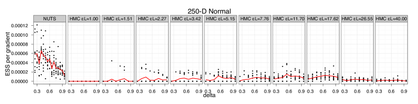

<figcaption>図6a（MVN）: HMC（さまざまな εL）と NUTS（軌跡長を自動選択）の効率。横軸 δ、縦軸＝勾配評価あたりの ESS。NUTS（赤線等）が HMC の最良 ESS を約3倍上回る。</figcaption>
</figure>

<figure>

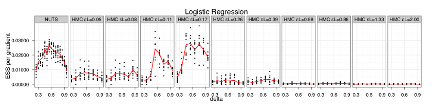

<figcaption>図6b（LR）: 同上。NUTS は HMC と同程度に効率的に独立サンプルを生む。</figcaption>
</figure>

<figure>

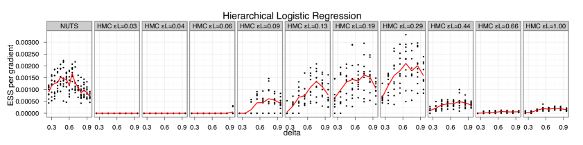

<figcaption>図6c（HLR）: 同上。</figcaption>
</figure>

<figure>

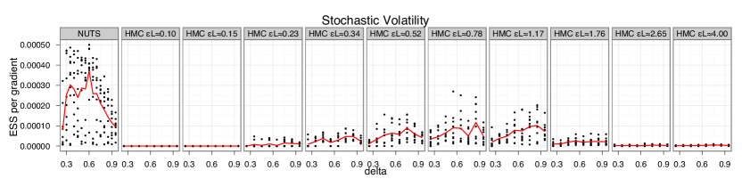

<figcaption>図6d（SV）: 同上。NUTS（δ=0.6）が HMC の最良を約3倍上回る。</figcaption>
</figure>

図6は HMC（さまざまなシミュレーション長 $\lambda\approx\epsilon L$）と NUTS（シミュレーション長を自動選択）の効率を比較する。各プロットの横軸は双対平均化が $\epsilon$ を自動調整するのに使う目標 $\delta$、縦軸は勾配評価回数で正規化した ESS。HMC の最良性能は $\delta=0.65$ 付近で、これが多様な問題の妥当なデフォルトであることを示唆する。NUTS の最良性能は $\delta=0.6$ 付近だが、$\delta\in[0.45,0.65]$ の範囲では $\delta$ に強く依存しないので、$\delta=0.6$ が NUTS の妥当なデフォルトに見える。2つのロジスティック回帰問題で NUTS は HMC と同程度に効率的に実質独立なサンプルを生む。多変量正規と確率的ボラティリティ問題では、$\delta=0.6$ の NUTS が HMC の最良 ESS を約3倍上回る。予想どおり、不適切なシミュレーション長が選ばれると HMC の性能は劣化する。4つの目標分布で HMC の最良シミュレーション長 $\lambda$ は約100倍ばらついた。図6の結果は、NUTS が——HMC のシミュレーション長を調整する予備実行のコストを割り引いてさえ——少なくとも HMC と同程度に効率的にサンプルを生成できることを示唆する。

### 4.5 NUTS・ランダムウォーク Metropolis・ギブスの定性的比較

> 訳注: 図7（ランダムウォーク Metropolis・ギブス・NUTS が生成したサンプルの比較。250次元の強相関分布の最初の2次元を表示）は ar5iv に画像が無いため、本翻訳では本文の記述で代える。

図7（本文記述）: 強相関の250次元正規分布から、独立サンプル1000点（右）と、ランダムウォーク Metropolis（RWM）の100万サンプル（表示用に1000点に間引き、左）、ギブスサンプリングの100万サンプル（同、左から2番目）、NUTS の1000サンプル（右から2番目）を比較。最初の2次元を表示。

§4.4 では NUTS と HMC の効率を比較した。本節では、人気のランダムウォーク Metropolis（RWM）とギブスサンプリングに対する NUTS の利点を非形式的に示す。§4.1 の250次元多変量正規で NUTS（$\delta=0.5$, 2000反復、うち1000をバーンイン・$\epsilon$ 適応）、RWM（100万反復、理論最適受容率 0.234 [^7] に調整）、ギブス（100万スイープ）を走らせた。図7は、目標分布からの独立サンプル（最初の2次元へ射影）と3つの MCMC が生成したサンプルを視覚的に比較する。RWM は空間をほとんど探索し始めたばかり、ギブスはより良いが一部の空間を未探索のまま残し、NUTS は多くの実質独立なサンプルを生成できる。RWM とギブスは、パラメータを i.i.d. にする変換が見つかり安価に適用できるという楽観的な仮定のもとでさえ、実質独立サンプル1つあたり $O(D^{2})$ の演算を要する。NUTS は、目標分布の形に合わせて調整せずに高次元の目標分布から効率的にサンプルできる。

## 5 議論

我々は、強力なハミルトニアンモンテカルロ（HMC）MCMC アルゴリズムの変種で、ステップ数パラメータ $L$ への HMC の依存をなくしつつ、実質独立なサンプルを効率的に生成する HMC の能力を保持（時には改善）する No-U-Turn Sampler（NUTS）を提示した。また、[^20] の双対平均化アルゴリズムの適応により、NUTS と HMC が共有するステップサイズパラメータ $\epsilon$ を自動適応する方法を開発し、NUTS を手による調整を一切せずに走らせることを可能にした。本論文の双対平均化アプローチは、Robbins-Monro 確率近似に基づく従来の適応的 MCMC の代わりに、他の MCMC アルゴリズムにも適用できる。

本論文では NUTS を基本的な HMC とのみ比較し、その拡張（[^19] でレビュー）とは比較していない。我々は $\frac{1}{2}r\cdot r$ の形の単純な運動エネルギー関数のみを考えたが、NUTS と HMC はともに「質量（mass）」行列 $M$ を導入し運動エネルギー $\frac{1}{2}r^{T}M^{-1}r$ を使うことで恩恵を受けられる。$M^{-1}$ が $p(\theta)$ の共分散行列を近似すれば、強い相関と悪いスケーリングが効率に与える負の影響を減らせる。[^17] の窓付き HMC の有効性は、NUTS が単一の受容/棄却ステップを持たないことが、素の HMC に対する性能向上の一部の原因かもしれないことを示唆する。[^11] のリーマン多様体 HMC（RMHMC）は位置依存の質量行列を許すが、$O(D^{3})$ の行列反転コストが高次元で高くつく。NUTS の軌跡長適応と RMHMC の質量行列適応を組み合わせるのは自然な将来の方向である。

HMC と同様、NUTS は目標分布がほぼいたるところ微分可能な、制約のない連続値変数の再サンプルにのみ使える。離散変数は積分消去するか、ギブスサンプリングのような他のアルゴリズムで扱わねばならない。NUTS は軌跡長を自動選択できるので、離散変数があるとき HMC より効果的でありうる。また、HMC は0事後確率の領域に出くわすと止まって新しい運動量で再開し、制約違反前の仕事を無駄にするしかないが、NUTS は0確率領域に出くわすとそこまでに訪れた点の集合からサンプルし、少なくともいくらか前進する。

双対平均化つき NUTS は、HMC のパラメータを手で調整する時間と労力をかけずに HMC の効率を得ることを可能にする。これは HMC の経験者にとっても望ましいが、経験のない人々には特に価値がある。特に、ユーザー介入なしに効率的に動作する NUTS の能力は、これまで主にギブスサンプリングのようなずっと非効率なアルゴリズムに頼ってきた BUGS [^10] の系譜の汎用推論エンジンでの利用に適している。我々は現在、連続値パラメータの中核推論アルゴリズムとして NUTS を使う自動ベイズ推論システム **Stan** を開発中で、Stan は複雑なモデルの事後から、BUGS や JAGS のような従来システムより桁違いに速く実質独立なサンプルを生成できると約束する。

要約すると、NUTS は、大きなクラスの複雑な高次元モデルでベイズ事後推論を、最小限の人間の介入で効率的に行うことを可能にする。NUTS により、研究者やデータ分析者が、モデルをデータに当てはめる方法を心配する時間を減らし、モデルの開発・検証により多くの時間を費やせるようになることを願う。
