# ハミルトニアン・モンテカルロの概念的入門

> 原題: A Conceptual Introduction to Hamiltonian Monte Carlo
> 著者: Michael Betancourt（コロンビア大学 応用統計センター）
> 出典: arXiv:1701.02434
> 訳注: 本翻訳は付録 A も含めて全文を一文ずつ訳出している（謝辞・参考文献一覧は除外）。図は ar5iv／arXiv ソースから取得した原図、およびインライン SVG をラスタライズした画像を、原文の該当位置に配置した。

## Abstract（要旨）

ハミルトニアン・モンテカルロ（Hamiltonian Monte Carlo）は目覚ましい経験的成功を収めてきたが、それが難しい問題でなぜこれほどうまく機能するのか、また実務でどう適用するのが最善なのかを厳密に理解しはじめたのはごく最近のことである。

残念ながら、その理解は微分幾何学の数学の内側に閉じ込められており、そのことが——とりわけこの手法が特に重要となる応用分野の人々への——普及を妨げてきた。

本総説では、これらの理論的基盤について包括的な概念的説明を与える。網羅的な厳密さよりも、手法とその最適な実装の背後にある筋の通った直観を養うことに焦点を当てる。

実務家であれ統計学者であれ、熱心な読者であれば、ハミルトニアン・モンテカルロがどう機能するか、いつ成功するか、そしておそらく最も重要な、いつ失敗するかについて、確かな把握を得られるだろう。

## 序

ハミルトニアン・モンテカルロは、長く曲がりくねった道を経て現代の統計計算に至った。

この手法はもともと、1980年代後半に*ハイブリッド・モンテカルロ（Hybrid Monte Carlo）*として、格子量子色力学（Lattice Quantum Chromodynamics）の計算に取り組むために開発された。これは原子核・原子、ひいては我々を取り巻く世界を構成する陽子と中性子の構造を理解しようとする分野である。

数年のうちに Radford Neal が、ベイズニューラルネットワークに関する先駆的研究の中で、この手法が応用統計の問題に対して持つ潜在能力を認識した。

その後の10年間で、この手法は教科書に登場しはじめた。とりわけ、ハイブリッド・モンテカルロに代えて初めて*ハミルトニアン・モンテカルロ*という用語を用いた MacKay や、Bishop の教科書が挙げられる。

しかし、この手法を統計計算の主流へと本当に導き入れたのは、Neal の影響力ある総説であった。

Stan のような高性能なソフトウェア実装の台頭とともに、この手法はいまや多くの科学的・医学的・産業的応用にわたって広く普及した道具となっている。

しかし、ハミルトニアン・モンテカルロの成功がなぜこれほど広範だったのかを理解しはじめたのは、ごく最近のことである。

脆い経験則に頼るのではなく、この手法は、応用上重要な高次元問題に独自に適した豊かな理論的基盤の上に築かれている。

残念ながら、この理論的基盤は微分幾何学——統計教育にめったに含まれない数学の高度な一分野——の言葉で定式化されている。

その結果、この形式的な構成は、理論統計学者にも応用統計学者にも、しばしば手の届かないものになっている。

本論文の目的は、数学的な細部を避けつつ、ハミルトニアン・モンテカルロの成功の背後にある直観を導入することである。特に、確率と微積分の基礎的な知識のみを前提とする。

そのような取り組みは必然的に厳密さを犠牲にするが、これらの概念が、応用分野で働く読者を満足させるのに十分なほど直観的であることを願っている。

ハミルトニアン・モンテカルロについてさらに学びたい、あるいはその発展に貢献したいという読者には、参考文献で論じた文献をたどることを強く勧める。

我々の物語は、高次元確率分布の幾何学と、その幾何学が効率的な統計計算をいかに妨げるかの導入から始まる。

次に、この幾何学的観点からマルコフ連鎖モンテカルロを考察し、この手法をそのような高次元問題へとスケールさせるために必要となる特徴を動機づける。

これらの条件を本質的に満たす手法を構築することで、我々はごく自然にハミルトニアン・モンテカルロへと導かれていく。

最後に、この理解をどう拡張すれば、手法そのものだけでなく、その効率的な実用的実装——最適化されたチューニングや病的な振る舞いに対する固有の診断を含む——をも動機づけられるかを論じる。

## 1 確率分布を探索することによる期待値の計算

統計計算における究極の課題は、ある特別な*目標（target）*確率分布に関する期待値を評価することである。

たとえば、ベイズ推論ではモデルの設定空間上の事後分布から情報を抽出したいかもしれないし、頻度論統計ではデータ空間上の尤度に関する推定量の被覆率を計算したいかもしれない。

ここでは中立的な立場をとり、$D$ 次元の標本空間 $Q$ 上の目標分布 $\pi$ と、それに対応する関数の期待値 $\mathbb{E}_{\pi}\!\left[f\right]$ のみを考える。

しかし、確率分布とそれに対応する期待値はかなり抽象的な対象であり、実用に供したいならば、それらを指定するより明示的な手段が必要になる。

ここでは、標本空間が滑らかであると仮定する。この場合、目標分布を*確率密度関数（probability density function）*で表現でき、期待値を積分として表現できる。

ただし注意が必要である。この表現は、これらの積分——したがって望ましい期待値——を効率的に計算する方法を理解するうえで決定的に重要な、高次元空間のより微妙な振る舞いの一部を覆い隠してしまうからである。

### 1.1 期待値を実際に計算する

まず、目標となる標本空間 $Q$ が実数によってパラメータ化できると仮定する。すなわち、すべての点 $q\in Q$ が $D$ 個の実数で指定できるとする。

パラメータ空間 $\mathcal{Q}$ が与えられれば、目標分布を滑らかな確率密度関数 $\pi\!\left(q\right)$ として指定でき、期待値はパラメータ空間上の積分に帰着する。

$$
\mathbb{E}_{\pi}\!\left[f\right]=\int_{\mathcal{Q}}\mathrm{d}q\,\pi\!\left(q\right)f\!\left(q\right).
$$

パラメータ化は一意ではない。常に別のパラメータ化 $\mathcal{Q}^{\prime}$ をとることができ、その上で目標分布を異なる確率密度関数 $\pi^{\prime}\!\left(q^{\prime}\right)$ で指定でき、期待値は新しい積分に帰着する。

$$
\mathbb{E}_{\pi}\!\left[f\right]=\int_{\mathcal{Q}^{\prime}}\mathrm{d}q^{\prime}\,\pi(q^{\prime})f(q^{\prime}).
$$

しかし決定的に重要なことに、期待値そのものは特定のパラメータ化の選び方に対して不変であり、したがってこれらの積分は等しくなければならない。

$$
\mathbb{E}_{\pi}\!\left[f\right]=\int_{\mathcal{Q}}\mathrm{d}q\,\pi(q)f(q)=\int_{\mathcal{Q}^{\prime}}\mathrm{d}q^{\prime}\,\pi^{\prime}(q^{\prime})f(q^{\prime}).
$$

本総説では期待値の計算に単一のパラメータ化のみを考えるが、そのような計算が、確率密度関数の具体的な形状のような、パラメータ化の無関係な細部に依存しないように注意しなければならない。

パラメータ化を選んでしまえば、抽象的な期待値は具体的な積分になる。

残念ながら、自明でない目標分布に対しては、これらの積分を解析的に評価することはできず、代わりにそれらを*近似*するだけの数値的手法に頼らざるを得ない。

しかしこれらの近似の精度——したがって任意のアルゴリズムの有用性——は、我々の有限な計算能力によって制限される。

ある手法が応用統計の最前線にある複雑な問題へとスケールするためには、目標密度 $\pi\!\left(q\right)$ と関連する関数 $f\!\left(q\right)$ の評価の一つ一つを効果的に使わなければならない。

これらの評価を最適化することは、確率分布の自然な幾何学、とりわけ高次元パラメータ空間上の幾何学によって妨げられる、微妙な問題である。

### 1.2 倹約的な期待値計算

計算上の*非効率*を確実に招く一つの方法は、望ましい期待値への寄与が無視できる、パラメータ空間の領域で目標密度と関連する関数を評価して計算資源を浪費することである。

これらの領域を避け、計算をパラメータ空間の重要な領域だけに集中させるためには、まず目標密度と目標関数が全体の期待値にどう寄与するかを見極める必要がある。

積分は線形演算であるため、被積分関数を比例的にスケールすれば積分も比例的にスケールする。

その結果、被積分関数が最大となる領域に注目するというのが一般的な直観である。この直観は、目標密度と目標関数が最大値をとる領域を考えることを示唆する。

実際には、我々はしばしば多くの目標関数に関する期待値の計算に関心がある。たとえばベイズ推論では、通常、平均と分散の両方、あるいは複数の分位点で不確実性を要約する。

任意の一つの関数の具体的な細部に依存する手法は、新しい関数に出会うたびに繰り返し調整しなければならなくなり、一つの計算問題を多数の問題へと膨らませてしまう。

その結果、以降では、関連する任意の関数はパラメータ空間において十分に一様であり、その変動が被積分関数に強く影響しないと仮定する。ただし、もし実際に単一の期待値だけが関心の対象であるなら、その関数の構造を利用することで大幅な改善が得られることは心に留めておいてほしい。

この仮定は、被積分関数の変動が目標密度によって支配されることを意味し、したがって密度が最大となる*モード（mode, 密度の最頻値・ピーク）*の近傍を考えるべきだということになる。

この直観は、最尤推定量やラプラス近似のようにモードを利用する多くの統計手法と整合的だが、目標密度の具体的な細部を避けたいという我々の願いとは衝突する。実際、この直観は致命的に素朴であり、決定的な細部を見落としている。

期待値は被積分関数をパラメータ空間の*体積（volume）*にわたって積み上げることで与えられる。そして、密度はモードの周りで最大になるものの、そこには大した体積がない。

期待値を支配するパラメータ空間の領域を見極めるには、密度と体積の両方の振る舞いを考える必要がある。高次元空間では体積は密度とはまったく異なる振る舞いをし、その結果、パラメータ空間の重要な領域をどちらの極端からも遠ざける緊張関係が生じる。

### 1.3 高次元空間の幾何学

高次元空間の特徴的な性質の一つは、任意の与えられた近傍の*内側*よりも*外側*にはるかに多くの体積があることである。

これは一見すると奇妙に思えるかもしれないが、いくつかの簡単な場合を考えることで、この振る舞いを直観的に解き明かすことができる。

たとえば、パラメータ空間をモードを中心とする矩形の箱に分割することを考える（図1）。

1次元では中心の区画に隣接する区画は2つだけで、モードの周りにはかなりの体積が残る。しかし次元を1つ増やすと、隣接する区画は8つになり、3次元ではすでに26になる。

一般に $D$ 次元空間には $3^{D}-1$ 個の隣接区画があり、小さな $D$ ですら、モードに隣接する体積がモードのすぐ周りの体積を圧倒する。このパターンは、モードからさらに遠い、もっと速く増える区画を考えれば、いっそう増幅される。

図1: 体積の分布が次元の増加とともにどう振る舞うかを理解するために、モードのような特別な点を中心とする矩形分割を考えることができる。(a) 1次元では中心区画の相対的な重みは $1/3$、(b) 2次元では $1/9$、(c) 3次元ではわずか $1/27$ である。中心区画の体積は隣接する体積に比べて、たちまち無視できるほど小さくなる。

あるいは、パラメータ空間を球面的な視点でとらえ、球殻の内側と外側で距離 $\delta$ にある相対的な体積を考えることもできる（図2）。

1次元では内側と外側の体積は等しいが、2次元・3次元では殻の外側にますます多くの体積が集中する。殻をモードに中心化すれば、ここでも、モードを含む任意の近傍の体積が、パラメータ空間の次元が増えるにつれてますます無視できるようになることがわかる。

<figure>

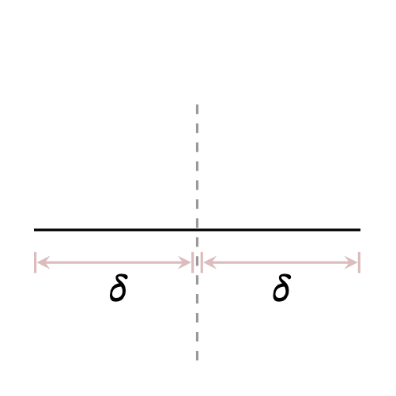

<figcaption>図2 (a): 1次元では球殻は線分であり、内側と外側の体積は等しい。点線が球殻、δ が半径方向の距離を表す。</figcaption>
</figure>

<figure>

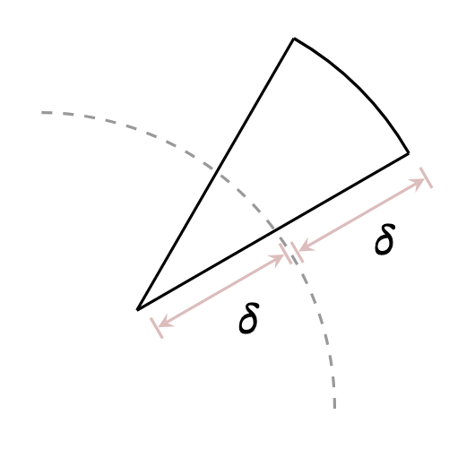

<figcaption>図2 (b): 2次元では球殻は円になり、殻のすぐ外側のほうがすぐ内側より体積が大きい。</figcaption>
</figure>

<figure>

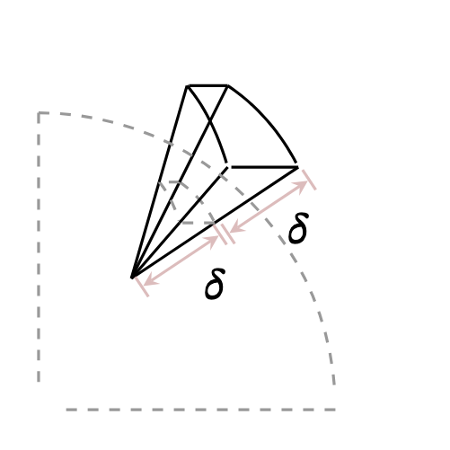

<figcaption>図2 (c): 3次元では球殻は球の表面になり、外側の体積は内側に対していっそう大きくなる。</figcaption>
</figure>

図2: パラメータ空間の任意の点から離れた場所に体積が支配的に存在することは、球面的な視点からも見てとれる。ここでは、$D$ 次元の球殻（点線で示す）の内側と外側の、半径方向の距離 $\delta$ に含まれる体積を考える。(a) 1次元では球殻は線分であり、内側と外側の体積は等価である。(b) 2次元では球殻は円になり、殻のすぐ内側よりすぐ外側に多くの体積がある。(c) 3次元では球殻は球面になり、外側の体積は内側の体積に対していっそう大きくなる。実際、次元の増加とともに外側の体積は内側の体積に対して指数関数的に大きくなり、モードの周りの体積はたちまちモードから離れた体積に圧倒される。

一般に、体積は目標分布のモードから離れた*裾（tails）*で最大になり、この格差はパラメータ空間の次元とともに指数関数的に増大する。

その結果、密度は小さくても、積分する膨大な体積がそれを補って、目標期待値に有意な寄与をもたらしうる。期待値に最も寄与する近傍を見極めるには、密度と体積の両方の振る舞いを注意深く釣り合わせる必要がある。

### 1.4 高次元確率分布の幾何学

モードのすぐ周りの近傍は大きな密度をもつが、数次元を超えると、その近傍の体積の小ささのために、どの期待値にも大した寄与をもたない。

一方、モードから遠く離れた相補的な近傍ははるかに大きな体積をもつが、消えゆく密度のために、同様に期待値への寄与は無視できる。

有意な寄与は、これら2つの極端のあいだにある、*典型集合（typical set）*と呼ばれる近傍からのみ生じる（図3）。重要なことに、確率密度と体積は任意の再パラメータ化のもとで反対に変換されるため、典型集合は、特定のパラメータの選び方の無関係な細部に依存しない不変な対象である。

<figure>

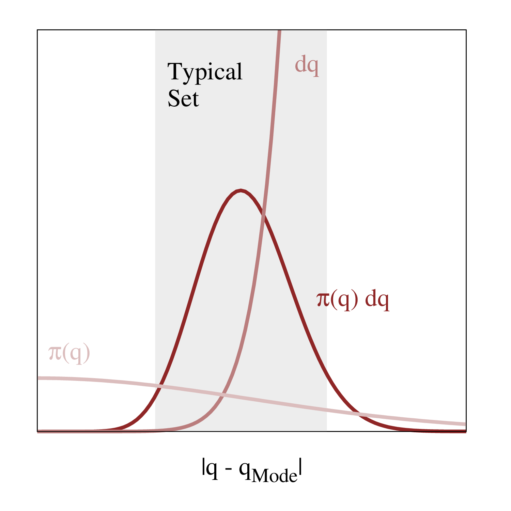

<figcaption>図3: 高次元では確率密度 π(q) はそのモードの周りに集中するが、その密度を積分する体積 dq はモードから離れたところではるかに大きい。任意の期待値への寄与は密度と体積の積 π(q) dq によって決まり、これが典型集合（灰色）と呼ばれるほぼ特異的な近傍に集中する。</figcaption>
</figure>

パラメータ空間の次元が増えるにつれて、密度と体積のあいだの緊張は強まり、密度と体積の両方が有意な寄与をもたらすのに十分大きい領域はますます狭くなる。

その結果、典型集合は次元の増加とともにますます特異的になる。これは*測度の集中（concentration of measure）*の現れである。

測度の集中の直接的な帰結は、任意の期待値への有意な寄与が典型集合からのみ生じるということである。典型集合の外で被積分関数を評価しても期待値にはほとんど影響せず、したがって貴重な計算資源の浪費になる。

言い換えれば、パラメータ空間全体ではなく典型集合上で平均することによって、期待値を正確に推定できる。したがって期待値を効率的に計算するには、典型集合を見極め、そこに計算資源を集中させられなければならない（図4）。

図4: 高次元パラメータ空間では、確率質量 $\pi\!\left(q\right)\mathrm{d}q$、したがって期待値への支配的な寄与は、*典型集合*と呼ばれる近傍に集中する。期待値を正確に推定するには、典型集合がパラメータ空間のどこにあるかを見極め、最も効果的な場所に計算資源を集中できなければならない。（訳注: 原文の ar5iv markdown には本図の画像が含まれていなかったため、キャプションのみを訳出した。）

これは、たとえば素朴な求積法（quadrature, 格子点での数値積分）のような力任せの手法が、なぜ次元に対してこれほど劣悪にスケールするのかを説明する助けになる。

$D$ 次元パラメータ空間に一様に分布した長さ $N$ の格子は $N^{D}$ 個の点を必要とし、したがって被積分関数の $N^{D}$ 回の評価を必要とする。

しかし $N$ がとてつもなく大きくない限り、これらの点のいずれかが狭い典型集合と交わる見込みは薄く、格子上での平均にかかる指数関数的に増大するコストは、期待値の近似をますます悪化させていく。

一般に、アルゴリズムを「それが典型集合をどう定量化するか」という観点で捉えることは、そのアルゴリズムが実際にどう振る舞うかを素早く直観する強力な方法である。

もちろん、*なぜ*典型集合に注目したいのかを理解するのは最初の一歩にすぎない。任意の目標分布の典型集合を定量化できるアルゴリズムを*どう*構築するかは、まったく別の問題である。

この課題には多くの戦略があるが、最も汎用的で、したがって応用実務で最も有用なものの一つが*マルコフ連鎖モンテカルロ（Markov chain Monte Carlo）*である。

## 2 マルコフ連鎖モンテカルロ

マルコフ連鎖モンテカルロは、マルコフ連鎖を用いて典型集合を確率的に探索し、高確率の領域にわたるランダムな格子を生成する。そこから正確な期待値の推定値を構築できる。

十分な計算資源があれば、適切に設計されたマルコフ連鎖は*いずれは*任意の分布の典型集合を探索する。しかしより実用的で、はるかに難しい問いは、与えられたマルコフ連鎖が、現実の解析で使える有限の時間のうちに典型集合を探索できるかどうかである。

本節では、マルコフ連鎖モンテカルロのより実質的な定義を導入し、その理想的な振る舞いと病的な振る舞いの両方を論じる。最後に、マルコフ連鎖モンテカルロを実際にどう実装するかを考え、それがいかに脆い試みになりうるかを見る。

### 2.1 マルコフ連鎖で期待値を推定する

*マルコフ連鎖（Markov chain）*とは、*マルコフ遷移（Markov transition）*と呼ばれるランダムな写像を逐次的に適用することで生成される、パラメータ空間内の点の連なりである。

あるいは、マルコフ遷移を条件付き確率密度 $\mathbb{T}(q^{\prime}\mid q)$ と考えることもできる。これは初期点 $q$ からどの点 $q^{\prime}$ へ最も飛びやすいかを定める（図5）。

図5: (a) マルコフ連鎖は、現在の点が与えられたときの新しい点の確率を定めるマルコフ遷移密度（緑）によって生成される、パラメータ空間内の点の列である。(b) その分布からサンプリングすると、マルコフ連鎖の新しい状態と、そこからサンプリングする新しい分布が得られる。(c) この過程を繰り返すことで、パラメータ空間をさまよい歩くマルコフ連鎖が生成される。（訳注: 原文 markdown に本図の画像は含まれていなかった。）

任意のマルコフ連鎖は単にパラメータ空間をさまようだけで、期待値の計算には特に役立たない。

しかし、マルコフ遷移が目標分布を*保存（preserve）*するならば、何か非常に特別なことが起こる。

$$
\pi\!\left(q\right)=\int_{\mathcal{Q}}\mathrm{d}q^{\prime}\,\pi(q^{\prime})\,\mathbb{T}(q\mid q^{\prime}).
$$

より直観的には、この条件は、目標分布から標本のアンサンブル（集まり）を生成して遷移を適用すると、依然として目標分布に従って分布する新しいアンサンブルが得られることを意味する。

この条件が成り立つ限り、あらゆる初期点でマルコフ遷移は典型集合の*ほうへ*集中する。

その結果、パラメータ空間のどこから始めても、対応するマルコフ連鎖はいずれ典型集合の中へ漂い込み、やがてそれを横断する（図6）。

図6: マルコフ遷移（緑）が目標分布を保存するとき、それはどこに適用されても典型集合（赤）のほうへ集中する。その結果、得られるマルコフ連鎖は初期状態によらず典型集合の中へ、そしてそれを横断するように漂っていき、そこから正確な期待値推定量を導ける典型集合の強力な定量化を与える。（訳注: 原文 markdown に本図の画像は含まれていなかった。）

十分な時間があれば、マルコフ連鎖の履歴 $\left\{q_{0},\ldots,q_{N}\right\}$——マルコフ連鎖が生成した*標本（samples）*と呼ばれる——は典型集合の便利な定量化になる。

特に、目標関数をこの履歴にわたって平均することで、典型集合にわたる期待値、したがってパラメータ空間全体にわたる期待値を推定できる。

$$
\hat{f}_{N}=\frac{1}{N}\sum_{n=0}^{N}f\!\left(q_{n}\right).
$$

マルコフ連鎖をますます長く走らせるにつれて、それは典型集合をよりよく探索し、いくつかの技術的事項を別にすれば、これらの*マルコフ連鎖モンテカルロ推定量*は真の期待値に収束する。

$$
\lim_{N\rightarrow\infty}\hat{f}_{N}=\mathbb{E}_{\pi}\!\left[f\right].
$$

残念ながら、この漸近的な振る舞いは実務では限られた有用性しかない。十分な探索を達成できるほど長くマルコフ連鎖を走らせられる無限の計算資源は、我々にはないからである。

頑健な道具を開発するには、マルコフ連鎖が有限回の遷移ののちにどう振る舞うかを理解する必要がある。

### 2.2 理想的な振る舞い

理想的な条件のもとでは、マルコフ連鎖は目標分布を3つの異なる相で探索する。

第1の相では、マルコフ連鎖はパラメータ空間内の初期位置から典型集合へ向かって収束し、その間、マルコフ連鎖モンテカルロ推定量は強いバイアス（偏り）に苦しむ（図7a）。

第2の相は、マルコフ連鎖が典型集合を見つけた時点で始まり、典型集合を横切る最初の滞在を通じて続く。この初期の探索は極めて効果的で、初期の標本によるバイアスが除かれるにつれてマルコフ連鎖モンテカルロ推定量の精度は急速に改善する（図7b）。

第3の相は、それ以降のすべての探索からなる。ここではマルコフ連鎖が典型集合の探索を精緻化し、マルコフ連鎖モンテカルロ推定量の精度は——より遅い速度ではあるが——改善していく（図7c）。

<figure>

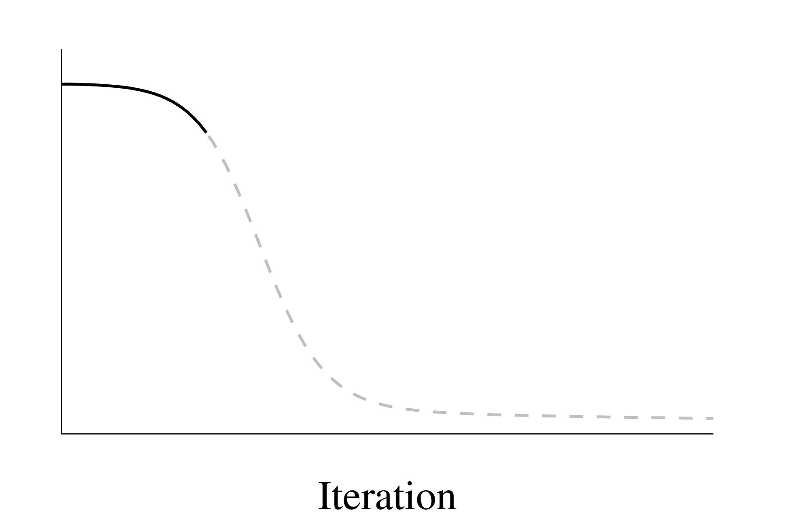

<figcaption>図7 (a): まずマルコフ連鎖は典型集合へ収束し、推定量は初期の、しかし最終的には一過性のバイアスに苦しむ。縦軸は推定量の値、横軸は反復回数（Iteration）。</figcaption>
</figure>

<figure>

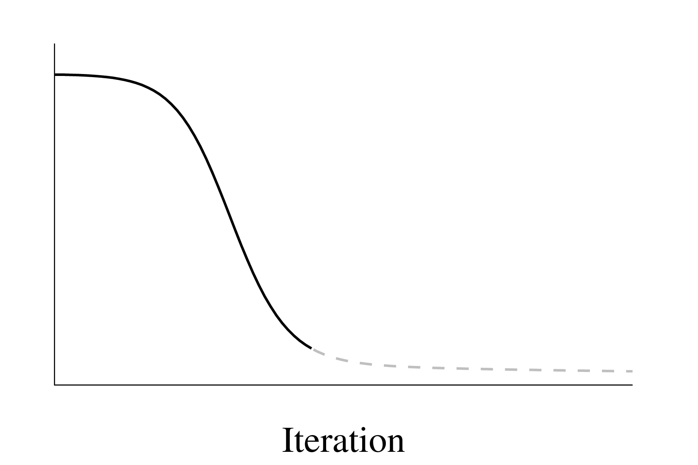

<figcaption>図7 (b): マルコフ連鎖が典型集合を見つけ、それを最初に横断すると、この初期バイアスは急速に消え、推定量ははるかに正確になる。</figcaption>
</figure>

<figure>

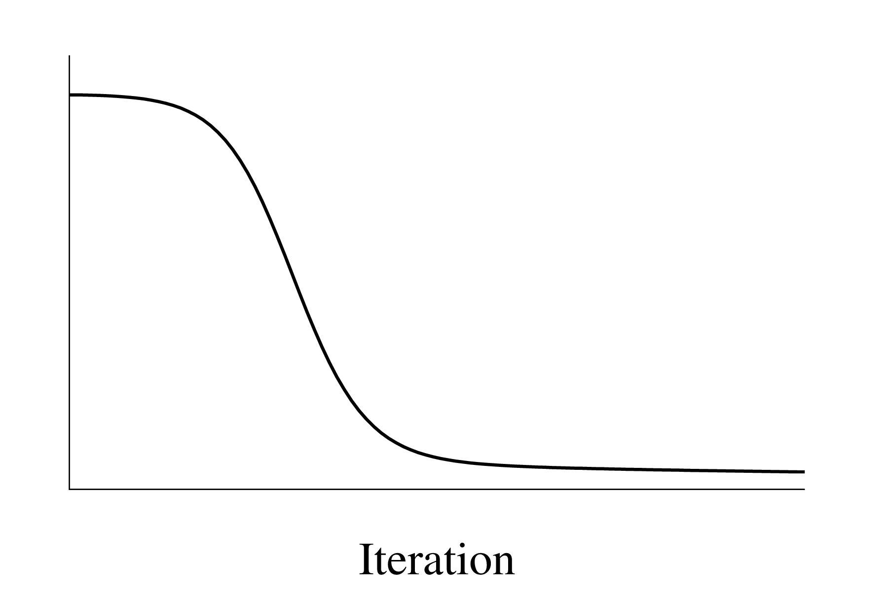

<figcaption>図7 (c): マルコフ連鎖が続くにつれて典型集合のより細かい部分を探索し、マルコフ連鎖モンテカルロ推定量の精度（分散）を徐々にゼロへ向けて下げていく。</figcaption>
</figure>

図7: 理想的な状況のもとで、マルコフ連鎖は目標分布を3つの相で探索する。(a) まずマルコフ連鎖は典型集合へ収束し、推定量は初期の、しかし最終的には一過性のバイアスに苦しむ。(b) マルコフ連鎖が典型集合を見つけ、それを最初に横断すると、この初期バイアスは急速に消え、推定量ははるかに正確になる。(c) マルコフ連鎖が続くにつれて典型集合のより細かい部分を探索し、マルコフ連鎖モンテカルロ推定量の精度を徐々にゼロへ向けて下げていく。

マルコフ連鎖がこの第3の相に入ると、マルコフ連鎖モンテカルロ推定量は中心極限定理を満たす。

$$
\hat{f}_{N}^{\mathrm{MCMC}}\sim\mathcal{N}\!\left(\mathbb{E}_{\pi}[f],\text{MCMC-SE}\right),
$$

ここで*マルコフ連鎖モンテカルロ標準誤差（Markov Chain Monte Carlo Standard Error）*は次で与えられる。

$$
\text{MCMC-SE}\equiv\sqrt{\frac{\mathrm{Var}_{\pi}[f]}{\mathrm{ESS}}}.
$$

*有効標本サイズ（effective sample size）*は次のように定義される。

$$
\mathrm{ESS}=\frac{N}{1+2\sum_{l=1}^{\infty}\rho_{l}},
$$

ここで $\rho_{l}$ はマルコフ連鎖の履歴にわたる $f$ のラグ $l$ の自己相関である。

有効標本サイズは、同等の推定量の精度を与えるのに必要な目標分布からの厳密な標本の数を定量化し、したがってマルコフ連鎖に「含まれる」厳密な標本の実効的な数を表す。これを、マルコフ連鎖が典型集合を横断した滞在の総数と解釈することもできる。実際には、有効標本サイズはマルコフ連鎖そのものから推定できるが、バイアスを避けるよう注意しなければならない。

初期収束相のあいだに生成されたマルコフ連鎖の状態はほとんどマルコフ連鎖モンテカルロ推定量を偏らせるため、マルコフ連鎖が典型集合を探索しはじめてから生成された標本だけを使えば、これらの推定量の精度を大幅に改善できる。

その結果、マルコフ連鎖モンテカルロ推定量を計算する前に、初期の収束しつつある標本を捨てることでマルコフ連鎖を*ウォームアップ（warm up）*するのが一般的な慣行である。ウォームアップはさらに、後続の推定量を偏らせることなく、マルコフ遷移の任意の自由度を経験的に最適化するためにも拡張できる。

### 2.3 病的な振る舞い

残念ながら、この理想化された振る舞いは、マルコフ遷移が目標分布の構造と整合的であることを要求する。しかし目標分布が病的な振る舞いを示すと、マルコフ遷移は探索に手こずり、マルコフ連鎖モンテカルロは失敗する。

たとえば、典型集合が高曲率の領域へとくびれていく目標確率分布を考える（図8）。

ほとんどのマルコフ遷移はこうした細部を解像できず、したがってこれらの狭い領域へ入り込めない。結果として得られるマルコフ連鎖はそれらを単に無視し、不完全な探索のために後続のマルコフ連鎖モンテカルロ推定量を偏らせる。

それはあたかも、パラメータ空間内の表面に、薄いが深い亀裂が走っていて、そこに有意な確率が隠れているのに、マルコフ連鎖がその上を素通りして完全に見落としてしまうかのようである。

図8: マルコフ連鎖は典型集合のうち曲率の大きい領域（緑）の探索に通常手こずる。不完全な探索はマルコフ連鎖モンテカルロ推定量を偏らせ、中心極限定理のような決定的な結果を台無しにする。（訳注: 原文 markdown に本図の画像は含まれていなかった。）

マルコフ連鎖は漸近的には厳密な期待値を回復しなければならないため、これらの領域を探索できないことを何らかの形で埋め合わせなければならない。

通常、マルコフ連鎖は病的領域の境界付近で立ち往生することでこれを達成する。連鎖が病的領域の周りに留まるあいだ、推定量はあたかもマルコフ連鎖が病的領域を探索しているかのように引き下げられる。

やがてこれは推定量を過剰補正させ、反対方向のバイアスを誘発する。その時点でマルコフ連鎖は脱出し、典型集合の残りを探索する（図9）。

<figure>

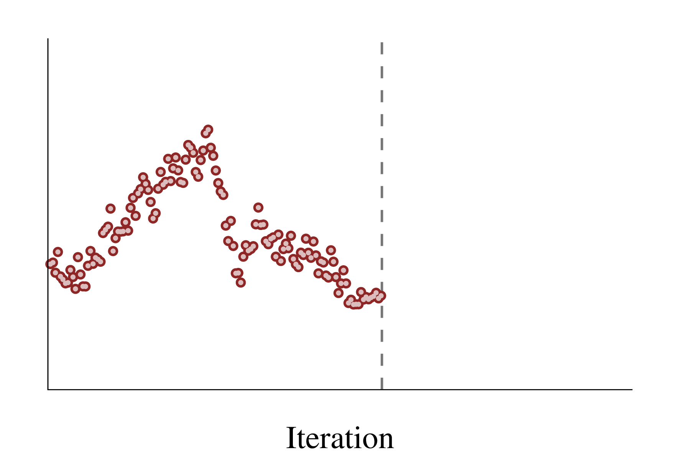

<figcaption>図9 (a): 初め、マルコフ連鎖は典型集合の素直な領域を探索し、病的近傍を完全に避けてマルコフ連鎖モンテカルロ推定量を偏らせる。横軸は反復回数（Iteration）。</figcaption>
</figure>

<figure>

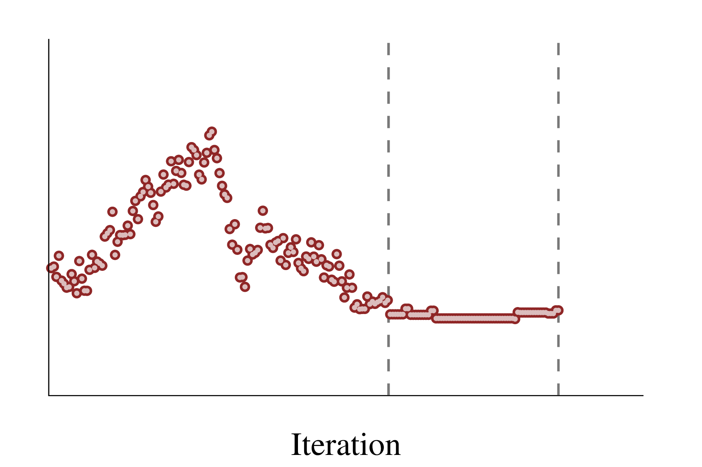

<figcaption>図9 (b): マルコフ連鎖を十分長く走らせると、病的領域の境界付近で立ち往生し、マルコフ連鎖モンテカルロ推定量をゆっくりと補正する。</figcaption>
</figure>

<figure>

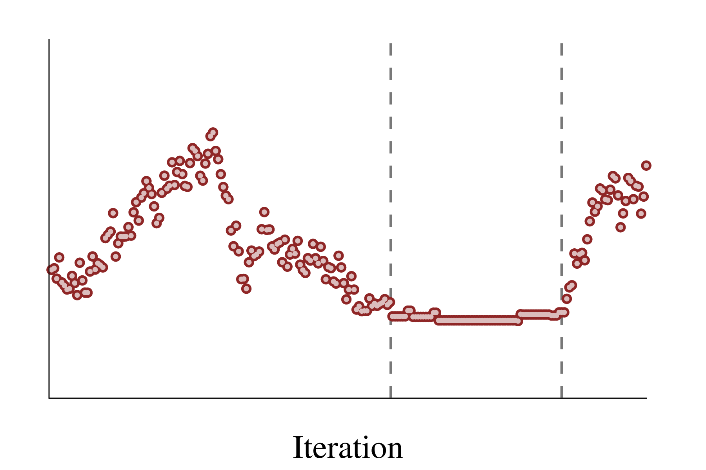

<figcaption>図9 (c): やがてマルコフ連鎖は脱出して典型集合の残りを探索する。この過程が繰り返され、推定量は真の期待値の周りで振動し、ちょうど良い時刻でありえないほど都合よく停止しない限り強いバイアスを生む。</figcaption>
</figure>

図9: 実際には、典型集合の病的領域は通常、マルコフ連鎖を「立ち往生」させる。(a) 初め、マルコフ連鎖は典型集合の素直な領域を探索し、病的近傍を完全に避けて推定量を偏らせる。(b) マルコフ連鎖を十分長く走らせると、病的領域の境界付近で立ち往生し、推定量をゆっくり補正する。(c) やがてマルコフ連鎖は脱出して典型集合の残りを探索する。この過程が繰り返され、推定量は真の期待値の周りで振動し、ちょうど良い時刻でありえないほど都合よく停止しない限り強いバイアスを生む。

最終的に、この振る舞いは真の期待値の周りで強く振動する推定量をもたらす。漸近的には振動は平均されて真の値を与えるが、その釣り合いは脆い。

有限時間ののちにマルコフ連鎖を打ち切ると、ほとんどの場合この釣り合いは壊れ、得られる推定量は実質的なバイアスに苦しむ。

与えられたマルコフ連鎖モンテカルロの適用において、目標分布の特徴が病的になるかどうかは、与えられたマルコフ遷移がそれらの特徴とどう相互作用するかに正確に依存する。

ある遷移は特定の特徴に対して一般により頑健であり、また遷移の自由度を注意深くチューニングすることで頑健な性能を達成できるものもある。いずれにせよ、マルコフ遷移が与えられた適用に使えるほど十分に頑健であることを保証するには、細心の注意を払わなければならない。

形式的には、理想化された振る舞い——とりわけマルコフ連鎖モンテカルロ推定量に対する中心極限定理——を保証する十分条件は、*幾何学的エルゴード性（geometric ergodicity）*として知られている。

残念ながら、幾何学的エルゴード性は、最も単純な問題を除けば理論的に検証するのが極めて難しく、代わりに経験的な診断に頼らざるを得ない。

その中で最も強力なものが分割 $\hat{R}$ 統計量であり、これはパラメータ空間内の異なる点から初期化されたマルコフ連鎖のアンサンブルの変動を定量化する。

幾何学的エルゴード性を妨げる病理は、アンサンブル内の個々の連鎖のあいだに不整合を誘発し、したがって大きな分割 $\hat{R}$ の値を生む。

その結果、分割 $\hat{R}$ が名目値 $1$ の近くにないとき、幾何学的エルゴード性が満たされていること、したがって得られる推定量の実用的な有用性を疑うべきである。

### 2.4 メトロポリス・ヘイスティングス・アルゴリズム

望ましい分布を目標とするマルコフ遷移が与えられれば、マルコフ連鎖モンテカルロは典型集合を定量化する汎用的な戦略を定める。しかし、そのような遷移を構築すること自体が自明でない問題である。

幸いにも、任意の目標分布に対して適切な遷移を自動的に構築する手続きがいくつかあり、その筆頭が*メトロポリス・ヘイスティングス（Metropolis-Hastings）*アルゴリズムである。

メトロポリス・ヘイスティングス・アルゴリズムは2つのステップ、すなわち提案（proposal）と補正（correction）からなる。

提案は初期状態の任意の確率的な摂動であり、補正は目標分布の典型集合から遠く離れすぎた提案を棄却する。

より形式的には、$\mathbb{Q}(q^{\prime}\mid q)$ を各提案を定める確率密度とする。すると、与えられた提案を受理する確率は次で与えられる。

$$
a\!\left(q^{\prime}\mid q\right)=\min\!\left(1,\frac{\mathbb{Q}(q\mid q^{\prime})\,\pi(q^{\prime})}{\mathbb{Q}(q^{\prime}\mid q)\,\pi(q)}\right).
$$

最初のマルコフ連鎖モンテカルロ・アルゴリズムであり、今日でも一般に使われているものは、提案機構としてガウス分布を用いる。

$$
\mathbb{Q}(q^{\prime}\mid q)=\mathcal{N}(q^{\prime}\mid q,\Sigma),
$$

私はこのアルゴリズムを*ランダムウォーク・メトロポリス（Random Walk Metropolis）*と呼ぶことにする。

提案機構は初期点と提案点の交換に関して対称であるため、提案密度は受理確率の中で打ち消し合い、単純な形が残る。

$$
a(q^{\prime}\mid q)=\min\!\left(1,\frac{\pi(q^{\prime})}{\pi(q)}\right).
$$

ランダムウォーク・メトロポリスは実装が単純なだけでなく、特に良い直観をもっている。提案分布は大きな体積、したがって目標分布の裾のほうへ偏っている一方、メトロポリス補正は密度が小さすぎる近傍へ飛び込む提案を棄却する。

組み合わさった手続きは、高い確率質量をもつ近傍に落ちる提案を優先的に選び出し、望みどおり典型集合のほうへ集中する。

その概念的な単純さと、実務家が実装しやすいことから、ランダムウォーク・メトロポリスは多くの応用で今なお人気がある。しかし、その魅惑的な単純さは、目標分布の次元と複雑さの増加に対して劣悪にスケールする性能を覆い隠している。

第1節で導入した幾何学的観点は、これらの問題を明らかにするのに特に強力であることがわかる。

目標分布の次元が増えるにつれて、典型集合の外側の体積が内側の体積を圧倒し、ほとんどすべてのランダムウォーク・メトロポリス提案は典型集合の外側、裾のほうの点を生成する（図10a）。

しかしこれらの点の密度は非常に小さく、受理確率は無視できるほどになる。この場合、ほとんどすべての提案が棄却され、得られるマルコフ連鎖はめったに動かない。

提案のサイズを縮めて典型集合内に留まれば、より大きな受理確率を誘導できる（図10b）が、その小さな跳躍はマルコフ連鎖を極めてゆっくりとしか動かさない。

図10: 高次元では、ランダムウォーク・メトロポリス提案密度（緑）は典型集合の外側へ強く偏り、そこでは目標密度、したがってメトロポリス受理確率が消える。(a) 提案分散が大きいと提案は典型集合から遠く離れすぎて棄却される。(b) 提案分散が小さいと典型集合内に留まり受理されるが、得られる遷移密度は初期点の周りにきつく集中する。いずれにせよ、典型集合をごく、ごくゆっくりとしか探索しないマルコフ連鎖になってしまう。（訳注: 原文 markdown に本図の画像は含まれていなかった。）

ランダムウォーク・メトロポリス提案の共分散をどうチューニングしようと、また目標分布の具体的な細部がどうであろうと、得られるマルコフ連鎖は、最も低次元の空間を除いて典型集合を極めてゆっくりと探索する。

最悪の場合、この探索はあまりに遅く、有限の計算資源では典型集合を横断する1回の滞在すら完了できず、得られるマルコフ連鎖モンテカルロ推定量は大きく偏る。

たとえ安全に混合（mixing）の領域に達せたとしても、遅い探索は大きな自己相関と極めて不正確な推定量をもたらす。

その結果、マルコフ連鎖モンテカルロを実用上重要な高次元確率分布へとスケールさせたいなら、典型集合を探索するより良い方法が必要である。特に、典型集合そのものの幾何学をより良く利用する必要がある。

## 3 ハミルトニアン・モンテカルロの基礎

ランダムウォーク・メトロポリスの「当てずっぽうで試す（guess-and-check）」戦略は、当てるべき方向が指数関数的に多数あるのに、典型集合内に留まって検査を通過する方向はわずかしかない高次元空間では、失敗する運命にある。

初期点から大きく跳躍して典型集合の新しい未探索の領域へ入るには、典型集合そのものの幾何学についての情報を利用する必要がある。具体的には、高い確率質量の等高線に沿って進み、典型集合の中を首尾一貫して滑走できる遷移が必要である（図11）。

図11: ほとんどのマルコフ遷移は拡散的（diffusive）であり、初期点の周りに集中するため、対応するマルコフ連鎖は典型集合の小さな近傍に長い時間とどまってしまう。計算資源の有用性を最大化するには、典型集合を横切って新しい未探索の近傍へと滑走できる*首尾一貫した（coherent）*マルコフ遷移が必要である。（訳注: 原文 markdown に本図の画像は含まれていなかった。）

ハミルトニアン・モンテカルロは、十分に素直な目標分布に対して、この首尾一貫した探索を自動的に生成する唯一の手続きである。

本節では、まず目標確率密度の微分構造を注意深く利用することで、いかにして望ましい探索を生成できるかを動機づける直観を導入する。続いて、この手続きをより形式的に論じ、ハミルトニアン・マルコフ遷移の完全な構成で締めくくる。

### 3.1 効果的なマルコフ遷移に情報を与える

典型集合の幾何学を、その中をどう動くかについての情報へと、どうやって蒸留できるだろうか。

標本空間が連続であるとき、この方向情報を符号化する自然な方法は、典型集合に沿った*ベクトル場（vector field）*を用いることである（図12）。

ベクトル場とは、パラメータ空間の各点に方向を割り当てることであり、それらの方向が典型集合に沿っているなら、それらは最大の目標確率をもつこの近傍を通る道しるべとして働く。

<figure>

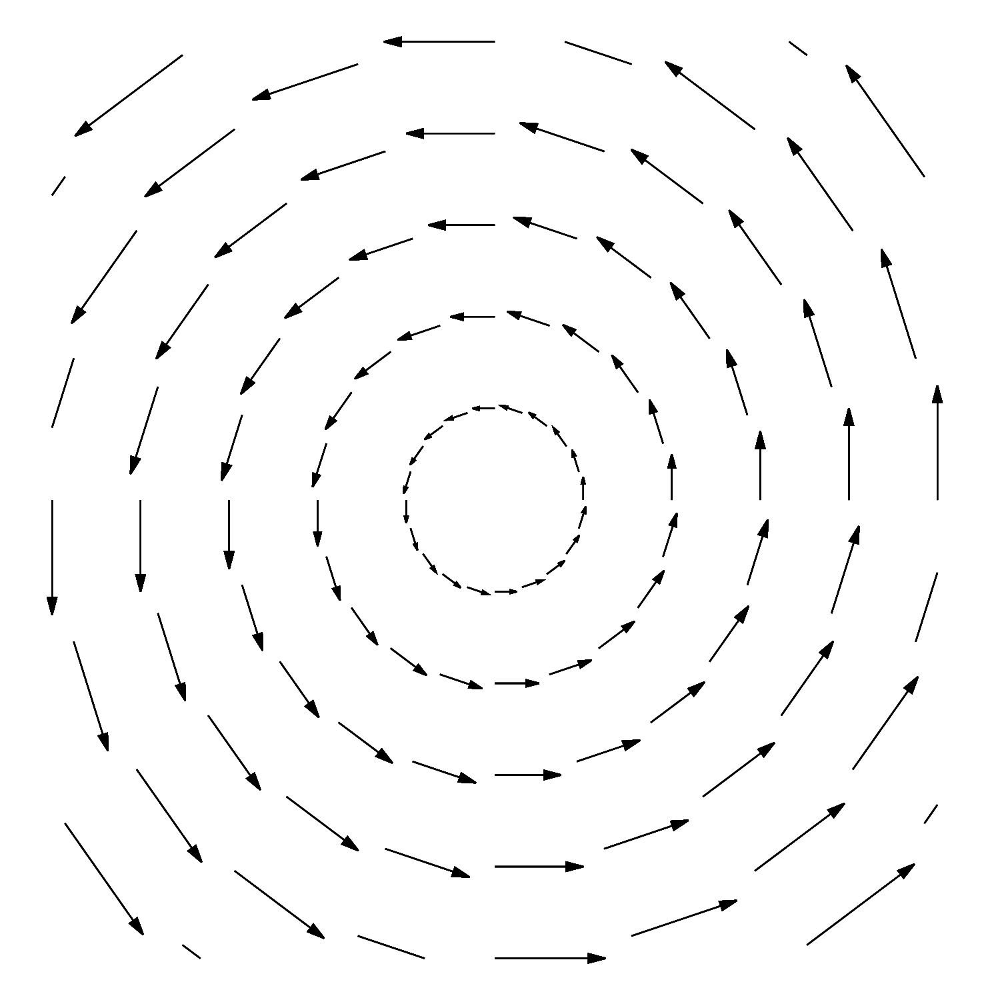

<figcaption>図12: ベクトル場とは、パラメータ空間の各点に方向を割り当てることである。それらの方向が典型集合に沿っているとき、それらを道しるべのようにたどることで、目標分布の首尾一貫した探索を生成できる。</figcaption>
</figure>

言い換えれば、ランダムで情報のない跳躍でパラメータ空間を手探りする代わりに、各点に割り当てられた方向を少しの距離だけたどればよい。

構成上、これは我々を典型集合の新しい点へ移動させ、そこで次にたどるべき新しい方向が見つかる。この過程を続けることで、典型集合の中を貫く首尾一貫した軌道が描かれ、初期点から遠く離れた典型集合の新しい未探索の領域へと、できるだけ素早く効率的に我々を運んでくれる。

しかし、目標分布から抽出できる情報だけを使って典型集合に沿ったベクトル場を構築する、という問題が残っている。

我々がまだ利用していない自然な情報は、目標分布の微分構造であり、これは目標確率密度関数の*勾配（gradient）*を通じて問い合わせることができる。特に、勾配は目標分布の構造に敏感な、パラメータ空間内のベクトル場を定める（図13）。

残念ながら、その敏感さだけでは不十分である。勾配は決して典型集合に沿わないからである。勾配の導きに従うと、我々は典型集合から引き離され、目標密度のモードのほうへ引き寄せられる。

しかしこの振る舞いは必ずしも驚くべきことではない。目標密度はパラメータ化の選び方に依存するため、その勾配もまた依存する。

その結果、勾配はモードの周りのようなパラメータ化に敏感な近傍へしか我々を導けず、典型集合内のパラメータ化に不変な近傍へは導けない。

<figure>

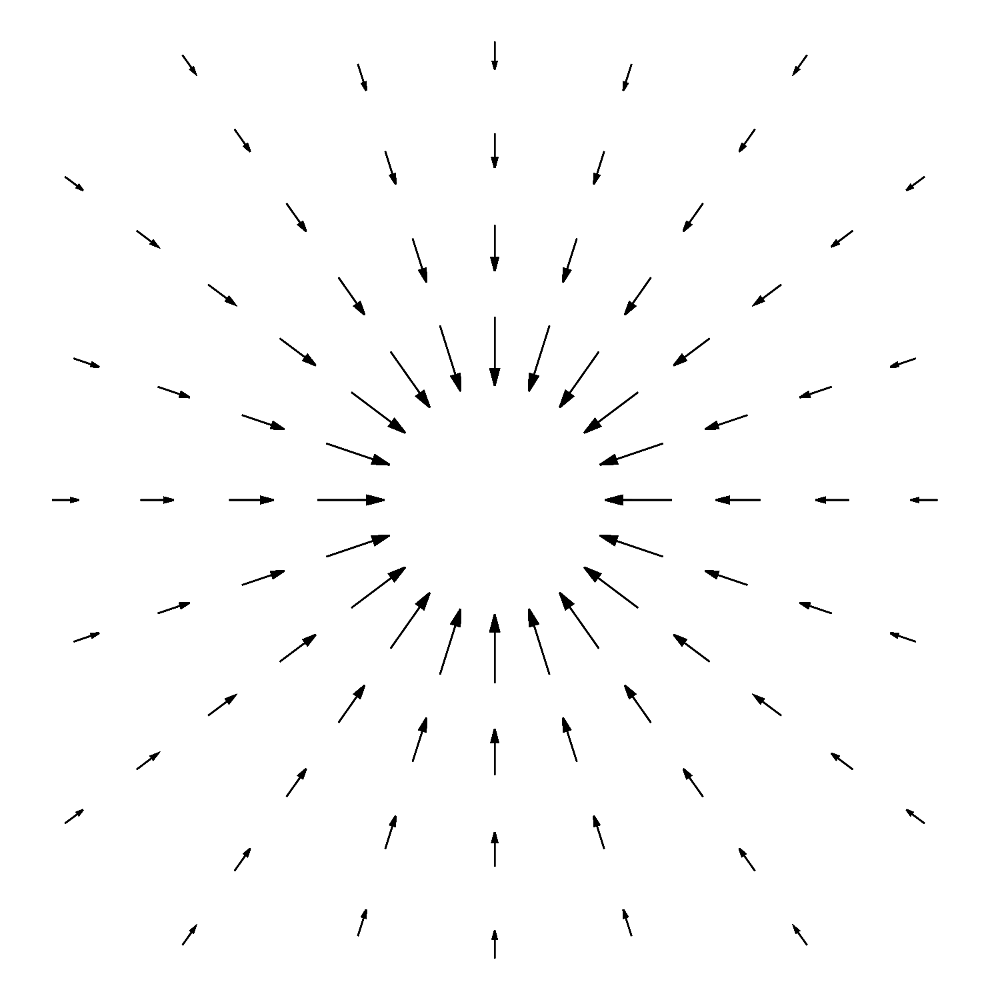

<figcaption>図13: 目標確率密度関数の勾配は典型集合の幾何学についての情報を符号化するが、それ単独で典型集合の中を導くには不十分である。勾配に沿って進むと、かえって典型集合から引き離され、目標密度のモードのほうへ引き寄せられてしまう。典型集合の中を動く運動を生成するには、勾配を典型集合に沿うよう注意深くねじる追加の構造を導入する必要がある。</figcaption>
</figure>

勾配の情報を利用するには、それを追加の幾何学的制約で補い、特定のパラメータ化への依存を注意深く取り除きつつ、方向を典型集合に沿うようねじる必要がある。

幸いにも、まさにこれを行うエレガントな手続きが、微分幾何学（differential geometry）として知られる数学の一分野にある。しかし微分幾何学は応用統計のカリキュラムでめったに教えられない難しい主題であるため、その手続きの細部と機微を理解するのは容易な課題ではない。

幸いにも、技術的な細部に立ち入ることなくこの手続きの直観を養うために利用できる、便利な等価性がある。

密度の勾配を補正するために使う必要のあるその微分幾何学は、たまたま古典物理学を記述する数学でもある。言い換えれば、あらゆる確率的システムに対して、より簡単に推論できる数学的に等価な*物理的*システムが存在する。

たとえば、モード、勾配、典型集合について推論しようとする代わりに、等価に、惑星、重力場、軌道について推論できる（図14）。典型集合を探索するという確率的な営みは、仮想の惑星の周りの安定軌道に人工衛星を乗せるという物理的な営みになる。

図14: 確率的システムの探索は、物理的システムの探索と数学的に等価である。たとえば、目標密度のモードを巨大な惑星と解釈し、目標密度の勾配をその惑星の重力場と解釈できる。典型集合は、人工衛星のようなテスト物体を周回させたい、惑星の周りの空間になる。（訳注: 原文 markdown では本図に勾配場の画像が流用されており、合成された惑星の図は含まれていなかったため、キャプションのみを訳出した。）

これらは同じ数学的システムの2つの異なる見方にすぎないため、同じ病理に苦しむことになる。

実際、人工衛星を宇宙空間に静止させて置けば、それは重力場の中を落下して惑星の表面に衝突する。ちょうど素朴な勾配駆動の軌道がモードに衝突するのと同じである（図15）。確率的観点からも物理的観点からも、我々には破滅的な結末が残される。

図15: 類似の物理的システムは、動機となった確率的システムと同じ病理に苦しむ。特に、静止した人工衛星は惑星の重力のもとで落下して惑星の表面に衝突する。ちょうど任意の勾配駆動の軌道がモードに衝突するのと同じである。（訳注: 原文 markdown には本図の画像は含まれていなかった。）

しかし物理的な描像は即座に解決策を与える。静止した物体は惑星に衝突するが、重力の引力に対抗するのに十分な*運動量（momentum）*を人工衛星に与えれば、安定軌道を維持できる。

ただし、人工衛星にどう運動量を加えるかには注意が必要である。たとえば、重力場に対して横方向の運動量を加えなさすぎると、重力の引力が強すぎて人工衛星はやはり惑星に衝突する（図16a）。

一方、運動量を加えすぎると、重力の引力が弱すぎて人工衛星を捕らえきれず、宇宙の深淵へ飛び去ってしまう（図16b）。

図16: (a) 惑星の重力の引力と釣り合うだけの横方向の運動量がないと、人工衛星はやはり惑星に衝突する。(b) 一方、人工衛星に運動量を与えすぎると、重力の引力が弱すぎて安定軌道に捕らえられず、惑星を見捨てて宇宙の深淵へ向かう。（訳注: 原文 markdown には本図 satellite_crashed の画像が参照されていたが、合成図は取得できなかったためキャプションのみを訳出した。）

しかし、ちょうど良い量の運動量を加えれば、運動量は重力と正確に釣り合い、対応するシステムの力学は*保存的（conservative）*になる。

人工衛星が惑星へ向かって落下するにつれて運動量は増大し、やがて人工衛星を惑星から押し出すのに十分なほど大きくなる。同様に、人工衛星が惑星から遠ざかると運動量は縮小して人工衛星は減速し、重力が引き戻すための時間が稼げる。

この巧妙な交換は望みの軌道に沿って釣り合い、システムのその後の発展がまさに我々の必要とする軌道を生成することを保証する（図17）。

<figure>

<figcaption>図17: 物理的システムにちょうど良い量の運動量を導入すると、人工衛星の発展を記述する方程式が、軌道に沿ったベクトル場を定める。システムのその後の発展は周回軌道を描き出す。（再掲: 図12 と同じ vector_field 図。原文ではこの軌道整合ベクトル場の図が再利用されている。）</figcaption>
</figure>

この物理的直観を確率的観点に引き戻すと、勾配ベクトル場を典型集合に沿ったベクトル場——したがって効率的な探索を生成できるベクトル場——へとねじる鍵は、補助的な運動量パラメータの導入によって元の確率的システムを拡張することである。

しかし物理的システムと同様、これらの運動量パラメータを勝手に加えることはできない。それらには保存的な力学を保証する確率的構造を与える必要がある。

驚くべきことに、そのような確率的構造をもつ補助運動量を導入する手続きはただ一つしかない。それがハミルトニアン・モンテカルロである。

### 3.2 相空間とハミルトンの方程式

物理的システムにおける保存的な力学は、体積が正確に保存されることを要求する。

システムが発展するにつれて、位置空間における任意の圧縮や膨張は、運動量空間における対応する膨張や圧縮で補われ、位置・運動量*相空間（phase space）*内の任意の近傍の体積が変化しないことが保証されなければならない（図18）。

<figure>

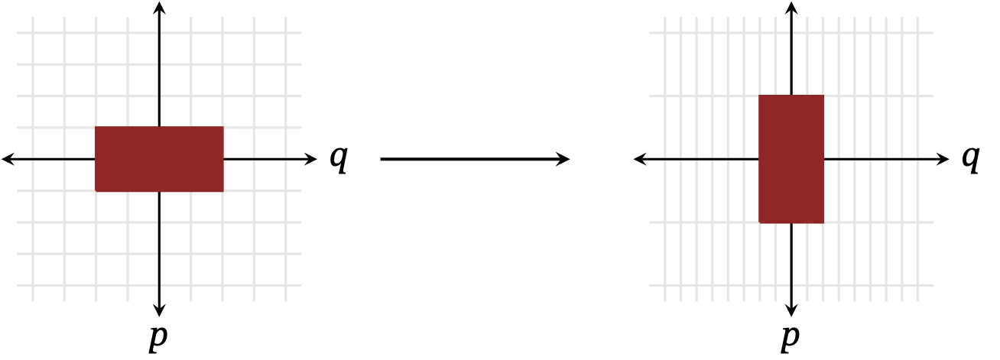

<figcaption>図18: 保存的な力学を特徴づける性質は、位置・運動量相空間における体積の保存である。たとえば力学は位置空間で体積を圧縮するかもしれないが、対応する運動量空間の体積は膨張して補い、全体積が不変であることを保証する。このような体積保存写像は*ずらし（shear）*変換とも呼ばれる。左の正方形（q 方向に潰れ p 方向に伸びる）から右の長方形への変換が体積を保つ様子を示す。</figcaption>
</figure>

この振る舞いを我々の確率的システムで模倣するには、目標パラメータ空間の各次元を補完する補助運動量パラメータ $p_{n}$ を導入する必要がある。

$$
q_{n}\rightarrow\left(q_{n},p_{n}\right),
$$

これにより $D$ 次元のパラメータ空間が $2D$ 次元の相空間へと拡張される。さらに、これらの補助運動量は目標パラメータに対して双対（dual）でなければならず、任意の再パラメータ化のもとで反対の仕方で変換し、相空間の体積が不変になるようにする。

目標パラメータ空間を相空間へ拡張したので、いまや目標分布を、*正準分布（canonical distribution）*と呼ばれる相空間上の同時確率分布へと持ち上げることができる。

これは、補助運動量に関する条件付き確率分布を選ぶことで行う。

$$
\pi\!\left(q,p\right)=\pi\!\left(p\mid q\right)\pi\!\left(q\right),
$$

これは、運動量を周辺化（積分消去）すれば即座に目標分布が回復されることを保証する。さらに重要なことに、相空間分布の典型集合を探索する任意の軌道が、目標分布の典型集合を探索する軌道へと射影されることを保証する（図19）。

<figure>

<figcaption>図19: 周辺化すると目標分布になる確率分布を相空間上に構築することで、相空間上の典型集合が目標分布の典型集合へと射影されることを保証する。特に、同時分布を効率的に探索する軌道（黒）を構築できれば、それらは目標分布を効率的に探索する軌道（緑）へと射影される。</figcaption>
</figure>

目標パラメータと補助運動量の双対性のために、対応する確率密度もまた互いに反対に変換する。

特に、正準密度 $\pi\!\left(q,p\right)$ は特定のパラメータ化の選び方に依存せず、不変な*ハミルトニアン（Hamiltonian）*関数 $H\!\left(q,p\right)$ を用いて書ける。

$$
\pi\!\left(q,p\right)=e^{-H(q,p)}.
$$

$H\!\left(q,p\right)$ は任意のパラメータ化の細部に依存しないため、相空間分布の不変な確率的構造、そして最も重要なことにその典型集合の幾何学を捉えている。物理的類推に訴えれば、相空間の任意の点におけるハミルトニアンの値は、その点における*エネルギー（energy）*と呼ばれる。

同時密度の分解のために、ハミルトニアンは

$$
H\!\left(q,p\right)\equiv-\log\pi\!\left(q,p\right),
$$

それ自身が2つの項に分解する。

$$
\displaystyle H\!\left(q,p\right)
$$

$$
\displaystyle=-\log\pi\!\left(p\mid q\right)-\log\pi\!\left(q\right)
$$

$$
\displaystyle\equiv\quad\;\;K\!\left(p,q\right)\quad+\;V\!\left(q\right).
$$

ふたたび物理的類推を用いると、補助運動量に関する密度に対応する項 $K\!\left(p,q\right)$ は*運動エネルギー（kinetic energy）*と呼ばれ、目標分布の密度に対応する項 $V\!\left(q\right)$ は*ポテンシャルエネルギー（potential energy）*として知られる。

ポテンシャルエネルギーは目標分布によって完全に決定されるが、運動エネルギーは制約されておらず、実装によって指定されなければならない。

ハミルトニアンは典型集合の幾何学を捉えているため、これを使って正準分布の典型集合に沿った——したがって我々の求める軌道を生成できる——ベクトル場を生成できるはずである。

実際、望ましいベクトル場は、与えられたハミルトニアンから*ハミルトンの方程式（Hamilton's equations）*によって生成できる。

$$
\displaystyle\frac{\mathrm{d}q}{\mathrm{d}t}
$$

$$
\displaystyle=+\frac{\partial H}{\partial p}=\frac{\partial K}{\partial p}
$$

$$
\displaystyle\frac{\mathrm{d}p}{\mathrm{d}t}
$$

$$
\displaystyle=-\frac{\partial H}{\partial q}=-\frac{\partial K}{\partial q}-\frac{\partial V}{\partial q}.
$$

$\partial V/\partial q$ が目標密度の対数の勾配であることを認識すると、ハミルトンの方程式が第3.1節で導入した直観をまさに実現することがわかる。

勾配を目標パラメータに直接ではなく運動量を通じて流すことで、ハミルトンの方程式は微分情報をねじって正準分布の典型集合に沿わせる。

ハミルトニアン・ベクトル場をある時間 $t$ だけたどると、相空間内を素早く移動しつつ典型集合に拘束された軌道 $\phi_{t}(q,p)$ が生成される。これらの軌道を目標パラメータ空間へ射影し戻すことで、ついに我々の探していた、目標の典型集合の効率的な探索が得られる。

### 3.3 理想化されたハミルトニアン・マルコフ遷移

これらのハミルトニアン軌道を利用して効率的なマルコフ遷移を構築するには、目標パラメータ空間の与えられた点に運動量を導入する機構が必要である。

幸いにも、システムにすでに与えた確率的構造を利用すれば、これは簡単である。

パラメータ空間の初期点を相空間上の点へ持ち上げるには、運動量に関する条件付き分布から単にサンプリングすればよい。

$$
p\sim\pi\!\left(p\mid q\right).
$$

初期点が目標分布の典型集合内にあったと仮定すると、条件付き分布から運動量を直接サンプリングすることで、持ち上げが相空間上の典型集合に確実に落ちることが保証される。

相空間に乗ったら、ハミルトンの方程式をある時間だけ積分することで同時典型集合を探索できる。

$$
\left(q,p\right)\rightarrow\phi_{t}\!\left(q,p\right).
$$

構成上、これらの軌道はマルコフ遷移を初期点や既に探索した近傍から首尾一貫して遠ざけつつ、同時典型集合に拘束され続ける。

同時分布の注意深く選ばれた構造のために、これらの軌道は目標分布を探索する軌道へと射影される。

その結果、ハミルトンの方程式を積分したのち、運動量を単に射影し去ることで目標パラメータ空間へ戻れる。

$$
\left(q,p\right)\rightarrow q.
$$

これら3つのステップを合成すると、目標分布を素早く探索するランダムな軌道からなるハミルトニアン・マルコフ遷移が、まさに望みどおりに得られる（図20）。

目標分布の裾の外側では、運動量サンプリングと射影のステップが、得られるマルコフ連鎖を典型集合へ向けて素早く落下させる。連鎖が典型集合に達したら、ハミルトニアン軌道が極めて効率的な探索を保証する。

<figure>

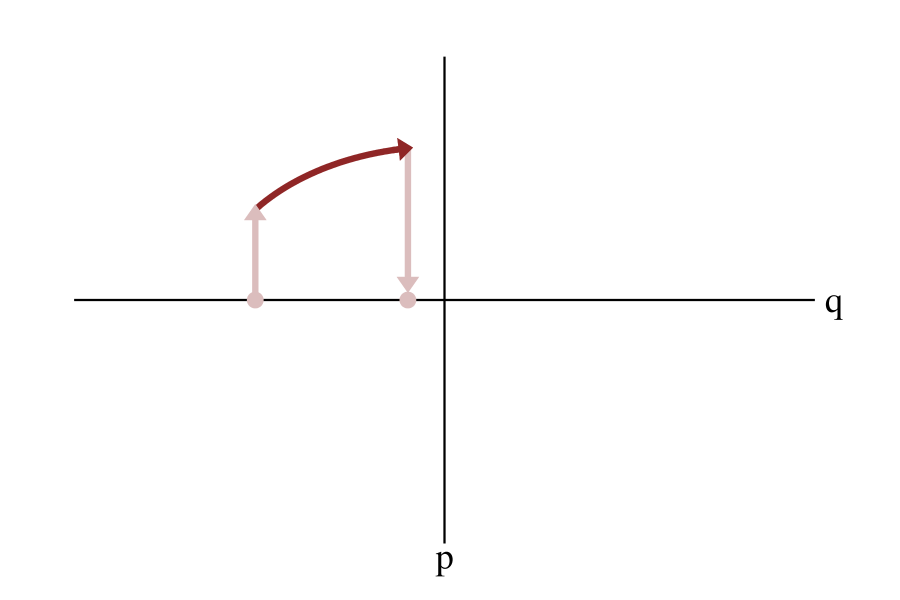

<figcaption>図20: あらゆるハミルトニアン・マルコフ遷移は、目標パラメータ空間から相空間へのランダムな持ち上げ（薄い赤）、相空間を貫く決定論的なハミルトニアン軌道（濃い赤）、そして目標パラメータ空間への射影（薄い赤）からなる。</figcaption>
</figure>

## 4 効率的なハミルトニアン・モンテカルロ

この基礎的な構成の直接的な複雑さは、それが唯一のマルコフ遷移ではなく、むしろ無限個の遷移を定めることにある。

運動エネルギーと積分時間の選び方ごとに、与えられた目標分布と異なる仕方で相互作用する新しいハミルトニアン遷移が得られる。

残念ながら、これらの相互作用は通常、準最適な性能をもたらし、我々には繊細なチューニング問題が残される。これらの自由度がうまく選ばれれば、得られるハミルトニアン・モンテカルロの実装は、応用上重要な難しい高次元問題ですら良好に機能する。しかし、それらが下手に選ばれれば、性能は劇的に悪化しうる。

ハミルトニアン・モンテカルロ法の適用を最適化し、頑健な性能を保証できるようにするには、これらの自由度が目標分布とどう相互作用するかを正確に理解する必要がある。

これは手強い課題に思えるが、ハミルトニアン・モンテカルロそのものの潜在的な幾何学を利用することで容易にできる。特に、相空間の異なる見方を考えることで解析がはるかに容易になる。

### 4.1 相空間の自然な幾何学

ハミルトンの方程式の特徴的な性質の一つは、それがハミルトニアンの値を保存することである。

言い換えれば、あらゆるハミルトニアン軌道はエネルギーの*等位集合（level set）*に拘束される。

$$
H^{-1}\!\left(E\right)=\left\{q,p\mid H\!\left(q,p\right)=E\right\},
$$

これは、無視できるいくつかの例外を除いて、すべて相空間内の $(2D-1)$ 次元のコンパクトな曲面である。

実際、特異な等位集合を取り除いてしまえば、相空間全体はきれいに同心円状の等位集合へと分解、すなわち*葉層化（foliate）*する（図21）。その結果、相空間内の任意の点を、まずそれが乗る等位集合のエネルギー $E$ と、その等位集合内での位置 $\theta_{E}$ によって指定できる（図21）。

<figure>

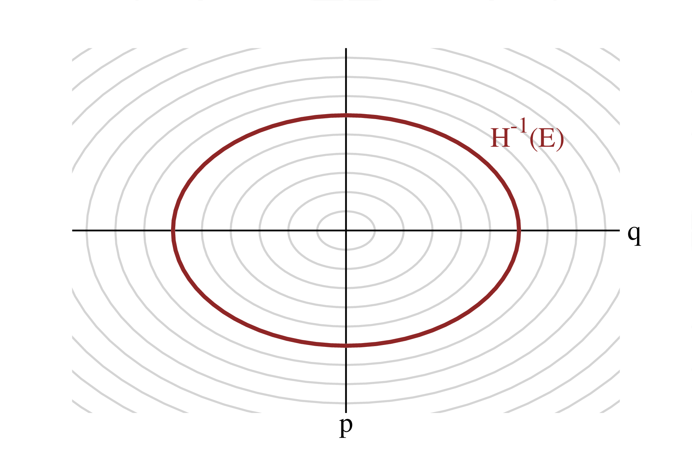

<figcaption>図21: 相空間はハミルトニアンの等位集合 H⁻¹(E) へと自然に分解する。相空間内の点を位置と運動量で指定する代わりに、エネルギー E と、対応する等位集合上の位置 θ_E ∈ H⁻¹(E) で指定できる。図は q-p 平面上で同心の等位集合（灰色）と一つの等位集合 H⁻¹(E)（赤）を示す。</figcaption>
</figure>

これに対応して、相空間上の正準分布は、この葉層化にわたる*ミクロカノニカル分解（microcanonical decomposition）*を許す。

$$
\pi\!\left(q,p\right)=\pi\left(\theta_{E}\mid E\right)\pi\!\left(E\right),
$$

各等位集合に関する条件付き分布 $\pi\left(\theta_{E}\mid E\right)$ は*ミクロカノニカル分布（microcanonical distribution）*と呼ばれ、等位集合をまたぐ分布 $\pi\!\left(E\right)$ は*周辺エネルギー分布（marginal energy distribution）*と呼ばれる。

同じ幾何学から導かれるため、このミクロカノニカル分解はハミルトニアン遷移の解析に特に適している。

これをより明確に見るために、複数の遷移からなるハミルトニアン・マルコフ連鎖を考える（図22a）。

各ハミルトニアン軌道は一つの等位集合を探索し、その間の射影と持ち上げが等位集合そのもののあいだのランダムな跳躍を定める。

その結果、ハミルトニアン・マルコフ連鎖全体は2つの異なる相に分離する。すなわち、個々の等位集合の決定論的な探索と、等位集合のあいだの確率的な探索である（図22b）。

<figure>

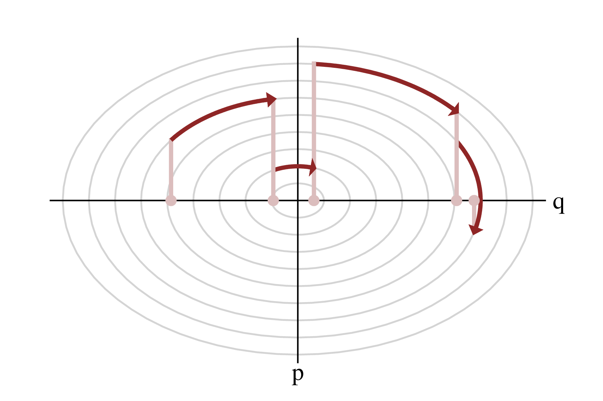

<figcaption>図22: (a) 各ハミルトニアン・マルコフ遷移は初期状態をハミルトニアンのランダムな等位集合へ持ち上げ、ハミルトニアン軌道でそれを探索したのち、目標パラメータ空間へ射影し戻す。(b) 射影とランダムな持ち上げを一つの運動量再サンプリングのステップと見なせば、ハミルトニアン・マルコフ連鎖は、これらの等位集合に沿った決定論的軌道（濃い赤）と、等位集合をまたぐランダムウォーク（薄い赤）を交互に行う。</figcaption>
</figure>

この分離により、各相の効率、したがってハミルトニアン・マルコフ遷移全体の効率を解析するのが特に容易になる。

たとえば、決定論的な探索の有効性は、ハミルトニアン軌道がどれだけ長く積分されるか、したがって対応する等位集合をどれだけ完全に探索するかによって決まる。しかしこの相のコストは、最終的には総積分時間に比例する。

各等位集合を十分に探索するのに必要な積分時間、したがって決定論的探索の全体的な効率は、エネルギー等位集合の幾何学に依存する。等位集合がより一様で規則的であるほど、与えられた積分時間で軌道はより速く探索する。

同様に、確率的探索の性能は、ランダムウォークが周辺エネルギー分布に典型的なエネルギーをまたいでどれだけ速く拡散できるかによって決まる。

ある位置 $q$ での運動量再サンプリングによって誘導されるエネルギーの遷移分布を $\pi(E\mid q)$ と書くと、拡散の速さは、周辺エネルギー分布が $\pi(E\mid q)$ に対してどれだけ裾が重いかに依存する。

たとえば、このエネルギー遷移分布が周辺エネルギー分布に対して狭い場合（図23a）、ランダムウォークは非常にゆっくりとしか進まず、目標分布を完全に探索するのに多くのコストのかかる遷移を要する。

一方、エネルギー遷移分布が周辺エネルギー分布と似ている場合（図23b）、各遷移で周辺エネルギー分布からほぼ独立な標本を生成し、関連するエネルギーを最大効率で素早く調べ上げる。

<figure>

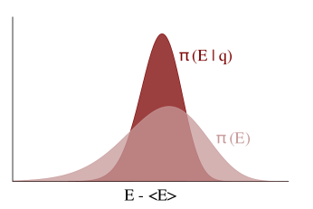

<figcaption>図23: ハミルトニアン・マルコフ遷移における運動量再サンプリングはエネルギーをランダムに変え、等位集合のあいだのランダムウォークを誘導する。(a) エネルギー遷移分布 π(E|q) が周辺エネルギー分布 π(E) に対して狭いとき、このランダムウォークは周辺エネルギー分布を非常にゆっくりとしか探索せず、関連するすべてのエネルギーを調べるのに多くの高コストな遷移を要する。(b) 一方、2つの分布がよく一致するとき、ランダムウォークは周辺エネルギー分布を極めて効率的に探索する。</figcaption>
</figure>

ハミルトニアン・マルコフ遷移のこれらのアルゴリズム的自由度が、目標分布と相互作用してミクロカノニカル幾何学をどう決めるかを解析することで、それらが得られるハミルトニアン・マルコフ連鎖の性能にどう影響するかを判定できる。

特に、これらの自由度の最適な選び方を特定する基準を構築でき、それが——実務で出会う複雑な目標分布に対してさえ——手法の効果的なチューニングを動機づける。

### 4.2 運動エネルギーの選択の最適化

ハミルトニアン・モンテカルロ法でチューニングできる最初の実質的な自由度は、運動量に関する条件付き確率分布の選択、すなわち等価に、運動エネルギー関数の選択である。

目標分布とともに、この選択が相空間上の確率的構造を完成させ、それがミクロカノニカル分解の幾何学を決める。

その結果、理想的な運動エネルギーは目標分布と相互作用して、エネルギー等位集合をできるだけ一様にし、かつエネルギー遷移分布を周辺エネルギー分布にできるだけよく一致させる。

残念ながら、可能な運動エネルギーは無限にあり、任意の目標分布に対して最適な選択を見つけるためにそれらすべてを探索するのは不可能である。

運動エネルギーの制限された族の中を探索するほうがはるかに実用的であり、特にその族が問題そのものの構造から構築されている場合はそうである。

#### 4.2.1 ユークリッド・ガウス運動エネルギー

たとえば、多くの問題で標本空間にはユークリッド計量 $g$ が備わっており、これによって——他の量に加えて——任意の2点間の距離を測ることができる。

与えられたパラメータ化において、$g$ は $D\times D$ 行列で表現され、そこから距離を次のように計算できる。

$$
\Delta(q,q^{\prime})=(q-q^{\prime})^{T}\cdot g\cdot(q-q^{\prime}),
$$

さらに、この自然な計量をスケールしてから回転させることで、修正されたユークリッド計量 $M$ の族全体を構築できる。

$$
M=R\cdot S\cdot g\cdot S^{T}\cdot R^{T},
$$

ここで $S$ は対角のスケーリング行列、$R$ は直交回転行列である。

目標パラメータ空間上の任意のそのようなユークリッド構造は、ただちに運動量空間上に逆の構造を誘導し、運動量間の距離を測れるようにする。

$$
\Delta(p,p^{\prime})=(p-p^{\prime})^{T}\cdot M^{-1}\cdot(p-p^{\prime}).
$$

最後に、運動量空間の距離を使って、$0$ を中心とするガウス分布のような、運動量に関する多くの一般的な確率分布を構築できる。

$$
\pi\!\left(p\mid q\right)=\mathcal{N}\!\left(p\mid 0,M\right).
$$

この特定の選択は*ユークリッド・ガウス（Euclidean-Gaussian）*運動エネルギーを定める。

$$
K\!\left(q,p\right)=\frac{1}{2}p^{T}\cdot M^{-1}\cdot p+\log\left|M\right|+\mathrm{const}.
$$

物理的観点では、ユークリッド計量は*質量行列（mass matrix）*として知られ、この用語はハミルトニアン・モンテカルロの文献で一般的になっている。

運動量上のユークリッド構造は、パラメータ上のユークリッド構造に双対であるため、その目標分布との相互作用は導出が容易である。

変換 $p^{\prime}=\sqrt{M^{-1}}p$ を適用すると運動エネルギーが簡単になるが、ハミルトニアン幾何学を保つには、パラメータに*反対の*変換 $q^{\prime}=\sqrt{M}q$ を適用しなければならないことを忘れてはならない。

その結果、$M^{-1}$ の選択は、目標パラメータ空間を実効的に回転してから再スケールし、目標分布を相関させたり脱相関させたりして、対応してエネルギー等位集合を歪める。

特に、逆ユークリッド計量が目標分布の共分散により近く似ているほど、それは目標分布を脱相関させ、結果としてエネルギー等位集合はますます一様になって探索が容易になる。

そこで、逆ユークリッド計量を目標共分散に設定することで、ユークリッド・ガウス運動エネルギーの族の中を容易に最適化できる。

$$
M^{-1}=\mathbb{E}_{\pi}[\left(q-\mu\right)\left(q-\mu\right)^{T}].
$$

実際には、拡張したウォームアップ相の中でマルコフ連鎖そのものを使って目標共分散の経験的な推定値を計算できる。

まず典型集合へ収束したのち、デフォルトのユークリッド計量を使ってマルコフ連鎖を短い窓のあいだ走らせて目標共分散の初期推定値を作り、次に計量をこの推定値に更新してから、より最適化された連鎖を走らせて改善された推定値を作る。この適応を数回繰り返せば、通常、目標共分散の正確な推定値、したがってほぼ最適な計量が得られる。

#### 4.2.2 リーマン・ガウス運動エネルギー

しかし目標分布が厳密にガウスでない限り、いかなる大域的な回転と再スケールも完全に一様な等位集合を生まない。局所的には、等位集合は依然として強い曲率を示し、ハミルトニアン軌道の探索を遅くしうる。

さらに改善するには、ユークリッド計量と違ってパラメータ空間を動くにつれて変化する*リーマン（Riemannian）*計量を導入する必要がある。

リーマン構造は、現在のパラメータ空間内の位置に依存する共分散をもつ、運動量に関するガウス分布を構築できるようにする。

$$
\pi\!\left(p\mid q\right)=\mathcal{N}\!\left(p\mid 0,\Sigma\!\left(q\right)\right),
$$

これは*リーマン・ガウス（Riemannian-Gaussian）*運動エネルギーを定める。

$$
K\!\left(q,p\right)=\frac{1}{2}p^{T}\cdot\Sigma^{-1}\!\left(q\right)\cdot p+\frac{1}{2}\log\left|\Sigma\!\left(q\right)\right|+\mathrm{const}.
$$

得られるハミルトニアン・モンテカルロの実装は*リーマン・ハミルトニアン・モンテカルロ（Riemannian Hamiltonian Monte Carlo）*として知られる。

逆リーマン計量の変動は、パラメータ空間のどこにいるかに応じて変化する、目標分布への局所的な補正を可能にする。

計量が目標分布のヘッセ行列（Hessian, 2階微分の行列）に似ていれば、これらの局所補正は目標分布の空間的に変化する相関を是正し、極めて一様な等位集合と効率的な探索を保証する。

ただし、逆リーマン計量——したがって運動エネルギー全体——が素直に振る舞うようにヘッセ行列を模倣しようとするときには、技術的な注意が必要である。SoftAbs 計量は実用上うまく機能する経験的な正則化でこれを達成するが、この手続きを形式化することは研究の活発な主題である。

リーマン・ガウス運動エネルギーの追加の利点は、対数行列式の変動 $\frac{1}{2}\log\left|\Sigma\!\left(q\right)\right|$ が周辺エネルギー分布を修正することである。

計量がうまく選ばれれば、この修正は周辺エネルギー分布をエネルギー遷移分布により近づけ、複雑な分布を目標とするときのハミルトニアン遷移の性能を大幅に改善しうる。

#### 4.2.3 非ガウス運動エネルギー

理論上、我々は運動量に関するガウス分布に限定されない。ユークリッドまたはリーマン構造は、2次の十分統計量をもつ任意の分布を構築できるようにする。

特に、なぜ運動量分布として特に裾の重いものや軽いものを考えてはいけないのだろうか。

これを支持する理論は多くないが、経験的には、非ガウス運動エネルギーは、とりわけ高次元問題で性能が劣る傾向がある。

ガウス運動エネルギーの優位性についての直観は、周辺エネルギー分布の漸近を考えることから得られるかもしれない。

ますます高次元のモデルを目標とするにつれて、周辺エネルギー分布はますます多くのパラメータの畳み込みになり、比較的弱い条件のもとで中心極限定理に従う傾向がある。

周辺エネルギー分布がガウスへ収束するとき、運動量に関するガウス分布のみが最適なエネルギー遷移をもたらす。

### 4.3 積分時間の選択の最適化

運動エネルギーの選択はミクロカノニカル幾何学、したがってエネルギー等位集合の形を完全に指定する。

各ハミルトニアン軌道がそれらの等位集合をどれだけ効果的に探索するかは、相空間にわたる積分時間 $T\left(q,p\right)$ の選択によって完全に決まる。

直観的には、短い時間しか積分しないと、ハミルトニアン軌道の首尾一貫した探索を十分に活用できず、性能が悪化すると予想される。

一方、素直な問題では等位集合は位相的にコンパクトであるため、軌道はやがて既に探索した近傍へ戻ってきてしまい、長く積分しすぎると収穫逓減に陥る。

この直観は*動的エルゴード性（dynamic ergodicity）*の概念で形式化される。

ここでは軌道の*オービット（orbit）*$\phi$ を考える。これは積分時間を無限大まで増やしたときに軌道が到達するすべての点からなる。

オービットは等位集合全体を覆うかもしれないし、等位集合の部分集合に限られるかもしれないが、いずれの場合も任意の軌道は、そのオービットに制限されたミクロカノニカル分布を探索する。

動的エルゴード性は、積分時間が増えて軌道が伸びるにつれて、軌道からの一様な標本がこの制限されたミクロカノニカル分布からの標本にますます近くなることを保証する。

言い換えれば、積分時間が伸びるにつれて、軌道にわたる時間期待値が、そのオービットにわたる空間期待値へ収束する。

しかしハミルトニアン遷移の性能は、これらの期待値が収束する*速度*に依存する。

通常の正則条件のもとで、時間期待値は初め空間期待値へ向かってかなり急速に収束する（図24a, b）。これは首尾一貫した探索が極めて効果的であるという我々の直観と整合的である。

しかしやがてその収束は遅くなり、探索の利益がますます高いコストでしか得られない漸近領域に入る。

最適な積分時間はこれら2つの領域をまたぎ、序盤の首尾一貫した探索を活用しつつ、長い積分時間の収穫逓減に計算を浪費しない（図24c）。

<figure>

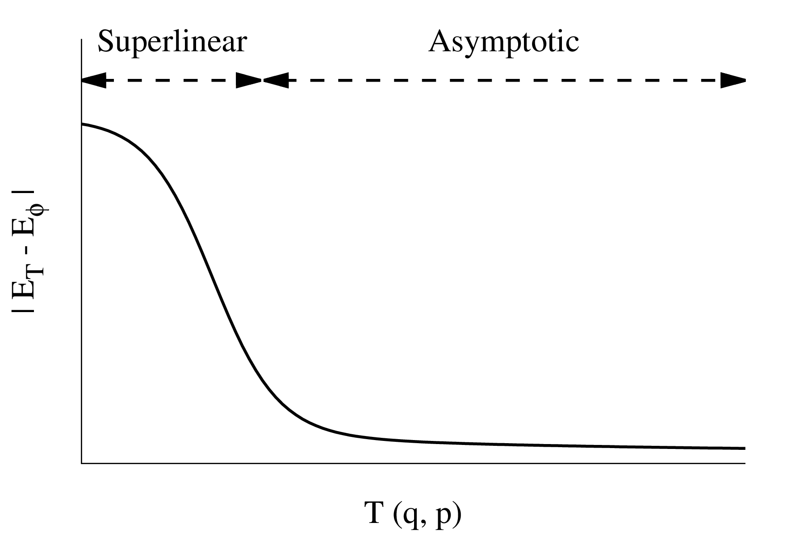

<figcaption>図24 (a): ハミルトニアン軌道に沿った時間平均 𝔼_T は、積分時間が増えるにつれて、そのオービットにわたる対応する空間期待値 𝔼_φ へ収束する。</figcaption>
</figure>

<figure>

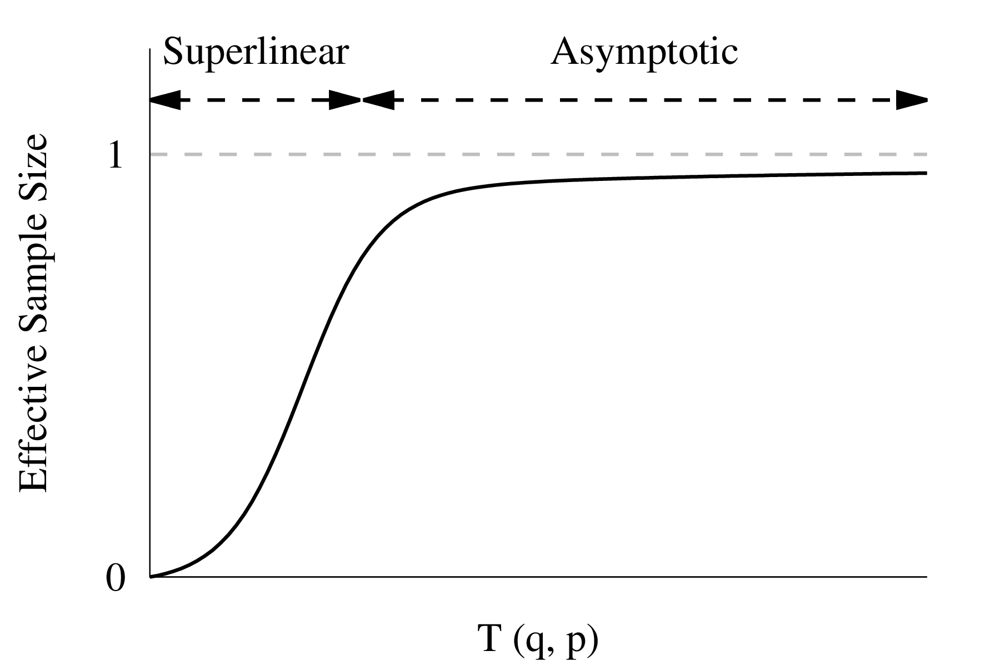

<figcaption>図24 (b): これに対応して、軌道からの一様な標本は、軌道のオービットに制限されたミクロカノニカル分布からの標本へ収束する（ここでは有効標本サイズで表される）。通常この収束は初め急速かつ超線形で、その後、積分時間の2乗でのみ収束が進む漸近領域に落ち着く。</figcaption>
</figure>

<figure>

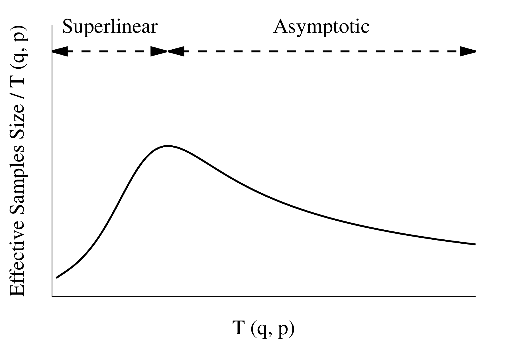

<figcaption>図24 (c): 各軌道を生成するコストは積分時間に比例してスケールするため、これら2つの領域の移行を特定する積分時間が最適な性能をもたらす。</figcaption>
</figure>

図24: (a) ハミルトニアン軌道に沿った時間平均 𝔼_T は、積分時間が増えるにつれて、そのオービットにわたる空間期待値 𝔼_φ へ収束する。(b) これに対応して、軌道からの一様な標本はオービットに制限されたミクロカノニカル分布からの標本へ収束する。通常この収束は初め急速かつ超線形で、その後、積分時間の2乗でのみ収束が進む漸近領域に落ち着く。(c) 各軌道の生成コストは積分時間に比例するため、2つの領域の移行を特定する積分時間が最適な性能をもたらす。

この最適化基準には有益な幾何学的解釈もある。

超線形の領域は、軌道のオービットを一巡する最初の滞在に対応し、前方への一歩ごとに新しく有益である（図25a）。

しかしやがて軌道は既に探索した近傍へ戻り、漸近領域に入る（図25b）。この追加の探索はオービットの探索を精緻化するが、時間期待値の精度はごくゆっくりとしか改善しない。

<figure>

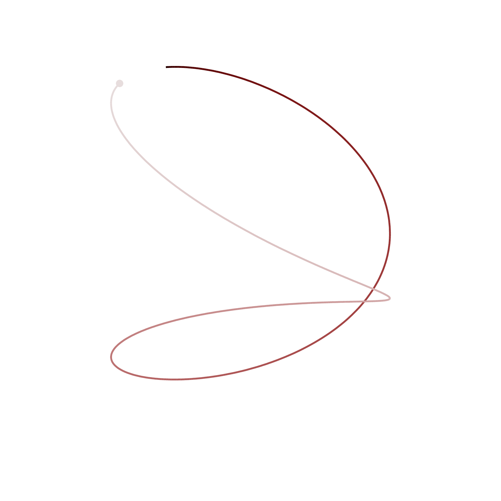

<figcaption>図25 (a): ハミルトニアン軌道がオービットを最初に一巡するあいだは、絶えず新しい未調査の近傍に出会うため、対応する探索は極めて効率的である。</figcaption>
</figure>

<figure>

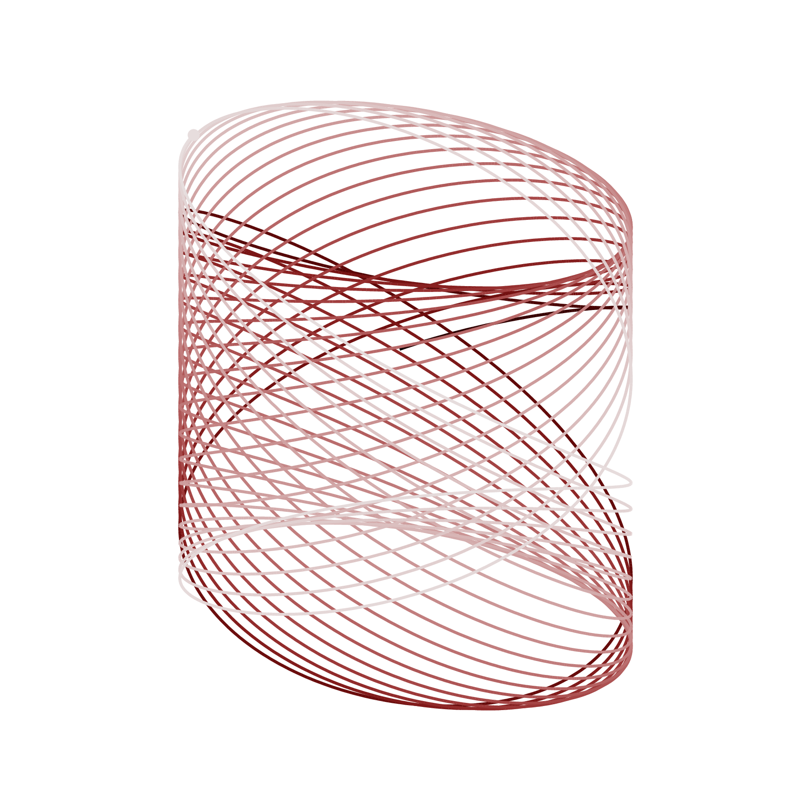

<figcaption>図25 (b): より長い軌道はこれらの近傍へ戻り、この初期の探索を精緻化して、より良いがはるかに遅い収束をもたらす。</figcaption>
</figure>

図25: (a) ハミルトニアン軌道がオービットを最初に一巡するあいだは絶えず新しい未調査の近傍に出会うため、探索は極めて効率的である。(b) より長い軌道はこれらの近傍へ戻り、初期の探索を精緻化して、より良いがはるかに遅い収束をもたらす。

一般に、この最適積分時間は、どの軌道を考えているかに強く依存して変化する。どこでもうまく機能する単一の積分時間は存在しない。

これは、最適積分時間を解析的に特定できる1次元で明示的にできる。

たとえば、目標密度の族

$$
\pi_{\beta}\!\left(q\right)\propto e^{-\left|q\right|^{\beta}},
$$

に対して、ユークリッド・ガウス運動エネルギー

$$
\pi(p\mid q)=\mathcal{N}\!\left(0,1\right),
$$

を用いると、最適積分時間は軌道を含む等位集合のエネルギーに比例してスケールする。

$$
T_{\mathrm{optimal}}\!\left(q,p\right)\propto\left(H\!\left(q,p\right)\right)^{\frac{2-\beta}{2\beta}}.
$$

特に、目標分布が裾が重い場合 $\beta<2$ には、最適積分時間は、バルク（中心部）を探索する軌道から裾を探索する軌道へ移るにつれて急速に増大する（図26）。

その結果、任意の*静的（static）*積分時間の軌道が生成する探索は減衰し、ハミルトニアン・マルコフ連鎖はのろのろとしか進まなくなる。

<figure>

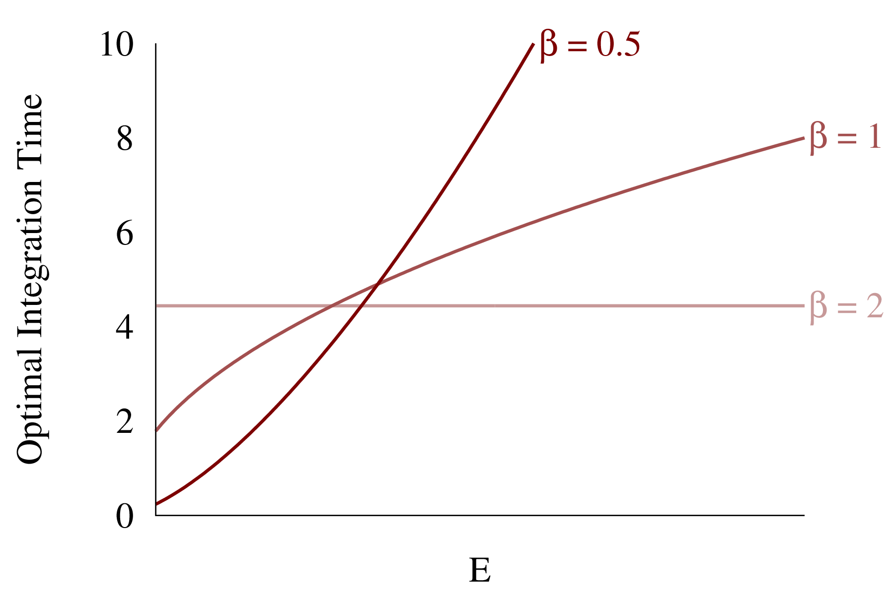

<figcaption>図26: 最適積分時間の空間的変動は、最適積分時間を解析的に計算でき、相空間の初期点のエネルギーに比例してスケールすることがわかる1次元の例で明らかになる。ガウス目標分布 β=2 のときのみ、最適積分時間はすべてのエネルギーで一定である。裾の重い目標分布 β<2 の最適積分時間は、より高いエネルギーをもつ裾の奥へ進むにつれて大きくなる。ある静的な積分時間は低エネルギーでは十分かもしれないが、より高いエネルギーの等位集合を効果的に探索するには短すぎる軌道を生む。</figcaption>
</figure>

したがって、これらのハミルトニアン軌道を十分に活用したいなら、軌道を生成しながら、最適積分時間を*動的に（dynamically）*特定する必要がある。

軌道が最適な長さに達したことを正確にどう特定すればよいのか。一つの経験則は、第4.2節で論じた運動エネルギーと同様に目標パラメータ空間上のユークリッドまたはリーマン構造を利用する、*ノーユーターン（No-U-Turn）*停止基準である。ノーユーターン停止基準の明示的な形は付録A.4.2で導入する。

いくつかの単純な場合には、ノーユーターン基準のほぼ最適性を厳密に示せるが、それは応用問題で出会う信じられないほど多様な目標分布に対して経験的な成功を収めてきた。

より最近提案された可能性は、ミクロカノニカル幾何学そのものを利用して最適な停止時刻を特定する*網羅的（exhaustive）*停止基準である。網羅的停止基準はノーユーターン停止基準よりも頑健になりうるが、注意深いチューニングを要し、これは未解決の研究主題である。

## 5 ハミルトニアン・モンテカルロを実際に実装する

注意深いチューニングを施せば、ハミルトニアン・モンテカルロ法は、少なくとも理論上は、大きなクラスの目標分布に対して良好に機能する強力なマルコフ遷移を定める。

残念ながら、*実際に*そのまま適用できるハミルトニアン遷移はほとんど存在しない。

ハミルトニアン・モンテカルロ法を実装する際の主な障害は、ハミルトニアン軌道そのものを生成することである。

いくつかの自明な例を別にすれば、我々はハミルトンの方程式を厳密に解くことができず、いかなる実装もそれらを数値的に解かなければならない。

しかし数値的な不正確さは、最もよくチューニングされたハミルトニアン遷移の有用性すら、たちまち損ないうる。

形式的には、ハミルトンの方程式が定めるベクトル場に沿って積分することは、相空間上の常微分方程式系を解くことと等価である。この系を数値的に正確に解けるほど、我々の実装はより効果的になる。

人気のある計算ライブラリには常微分方程式ソルバー、すなわち数値積分器が豊富にあるが、それらのソルバーの多くは不幸な*ドリフト（drift, 漂流）*に苦しむ。

ますます長い軌道を数値的に解くにつれて、ソルバーの誤差が首尾一貫して積み重なり、近似軌道を真の軌道、そして我々が探索したい典型集合から押しのける（図27）。

このドリフトの大きさは相空間の次元とともに急速に増大するため、これらの汎用数値積分器の有用性は、エネルギー等位集合を非効率にしか探索しない短いハミルトニアン軌道を近似することに限られる。

<figure>

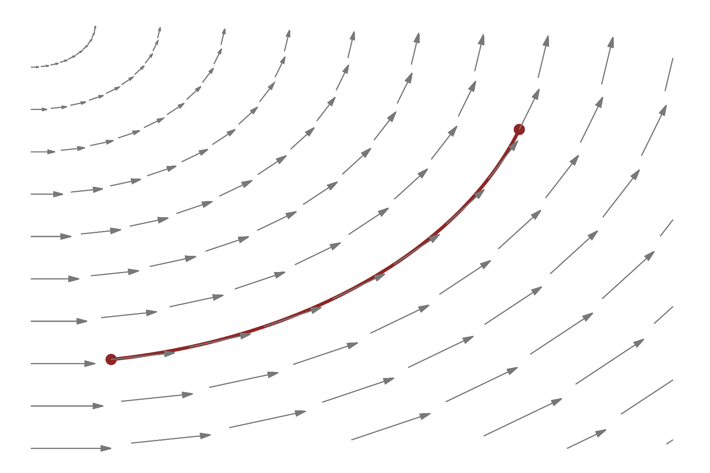

<figcaption>図27: ほとんどの数値積分器の近似解は厳密解からドリフトしていく傾向がある。システムをますます長く積分するにつれて、誤差が首尾一貫して積み重なり、数値軌道を厳密軌道から押しのける。</figcaption>
</figure>

幸いにも、相空間そのものの幾何学を使って、*シンプレクティック積分器（symplectic integrators）*として知られる極めて強力なソルバーの族を構築できる。これはドリフトのような現象に頑健で、ハミルトニアン・モンテカルロ法の高性能な実装を可能にする。

本節では、シンプレクティック積分器の実用的な性質と、それが導入する小さな誤差をどう補正できるかを示す。最後に、与えられた問題に最適なシンプレクティック積分器をどう選ぶかを論じる。

本節は本総説の概念的な提示に従うが、内容の重要性に鑑みて、技術的な細部のより徹底した議論を付録Aに用意している。

### 5.1 シンプレクティック積分器

シンプレクティック積分器が強力なのは、それが生成する数値軌道が、近似している当のハミルトニアン軌道と同じように、相空間の体積を正確に保存するからである。

この非圧縮性は、数値軌道の誤差が厳密軌道のエネルギーからどれだけ逸脱できるかを制限する。

その結果、数値軌道は厳密なエネルギー等位集合からドリフトし去ることができず、代わりに長い積分時間でもその近くで振動する（図28）。

図28: シンプレクティック積分器は、近似している厳密なハミルトニアン軌道と同じように非圧縮な数値軌道を生成する。その結果、近似誤差は首尾一貫して積み重なって数値軌道を厳密軌道から引き離すことができない。代わりに、数値軌道は、ますます長く積分しても厳密な等位集合の周りで振動する。（訳注: 原文 markdown では本図に図27と同じ vector_field_corner の画像が流用されている。）

実装にとって都合がよいことに、シンプレクティック積分器は実際に実装するのも簡単である。

たとえば、ユークリッド・ガウス運動エネルギーのように運動量の確率分布が位置に依存しないように選ばれていれば、見かけによらず単純な*リープフロッグ積分器（leapfrog integrator, 蛙跳び積分器）*を使える。

時間の離散化、すなわちステップサイズ $\epsilon$ を与えると、リープフロッグ積分器は厳密軌道を次のようにシミュレートする。

$q_{0}\leftarrow q,p_{0}\leftarrow p$

$0\leq n<\llcorner\,T/\epsilon\,\lrcorner$ について、

$p_{n+\frac{1}{2}}\leftarrow p_{n}-\frac{\epsilon}{2}\,\frac{\partial V}{\partial q}\!\left(q_{n}\right)$ ・ $q_{n+1}\leftarrow q_{n}+\epsilon\,p_{n+\frac{1}{2}}$ ・ $p_{n+1}\leftarrow p_{n+\frac{1}{2}}-\frac{\epsilon}{2}\,\frac{\partial V}{\partial q}\!\left(q_{n+1}\right)$

を実行する。

この単純だが精密な、離散的な運動量更新と位置更新の交互配置が、相空間上の正確な体積保存、したがってハミルトニアン遷移の潜在能力を実現するのに必要な正確な数値軌道を保証する。

しかし、シンプレクティック積分器の性能には一つ重要な例外がある。

厳密なエネルギー等位集合が、有限の時間離散化では解像できない高曲率の近傍を特徴とするとき、長時間の精度が損なわれうる。

これらの近傍は*発散（divergence）*を誘発し、数値軌道をほとんど即座に無限大のエネルギーへ向けて吹き飛ばす（図29）。

しかしこの特徴的な振る舞いは実際には有益であることがわかる。シンプレクティック積分器の失敗を特定、したがって診断するのが容易になるからである。

図29: 厳密軌道が高曲率の領域をもつエネルギー等位集合上にあるとき、シンプレクティック積分器が生成する数値軌道は発散し、相空間の境界へ向けて急速に飛び去りうる。汎用数値積分器のより遅いドリフトと違って、これらの発散——したがってシンプレクティック積分器が正確な解を与えられないこと——は実際には特定が容易である。（訳注: 原文 markdown では本図に図27と同じ vector_field_corner の画像が流用されている。）

シンプレクティック積分器を用いることは、ハミルトニアン・モンテカルロ法の理論的な性能を実用的な実装へと翻訳する機会を与える。

しかし、この翻訳を実現するには、なお2つの障害が残っている。第1に、シンプレクティック積分器は高精度であるとはいえ、それが実際に導入する小さな誤差は、厳密な補正なしには、得られるハミルトニアン遷移を偏らせる。第2に、与えられた目標分布に適したシンプレクティック積分器を選べなければならない。

### 5.2 シンプレクティック積分器の誤差を補正する

シンプレクティック積分器の誤差が導入するバイアスを補正する特に自然な戦略の一つは、ハミルトニアン遷移を相空間上のメトロポリス・ヘイスティングス・スキームの提案として扱うことである。

受理確率を解析的に構築できれば、この補正は相空間上の正準分布からの厳密な標本をもたらし、それが目標分布からの厳密な標本へと射影される。

しかしその受理確率を構築するには、ハミルトニアン遷移を注意深く拡張しなければならない。

たとえば、初期状態 $(q_{0},p_{0})$ をある静的な時間、すなわち $L$ 回のシンプレクティック積分器ステップだけ前方に積分し、数値軌道の最後の状態 $(q_{L},p_{L})$ を提案する単純なスキームを考える。

$$
\mathbb{Q}(q^{\prime},p^{\prime}\mid q_{0},p_{0})=\delta(q^{\prime}-q_{L})\,\delta(p^{\prime}-p_{L}).
$$

我々は前方の状態しか提案できず後方の状態は提案できないため（図30）、提案密度の比、したがってメトロポリス・ヘイスティングス受理確率は常に消える。

$$
\frac{\mathbb{Q}(q_{0},p_{0}\mid q_{L},p_{L})}{\mathbb{Q}(q_{L},p_{L}\mid q_{0},p_{0})}=\frac{0}{1}.
$$

<figure>

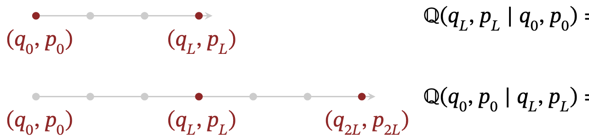

<figcaption>図30: ハミルトニアン軌道とその数値近似は決定論的かつ非可逆であるため、メトロポリス・ヘイスティングス提案は常に棄却される。特に、時間前方には正の提案確率をもつが、時間後方には消える提案確率をもち、これがメトロポリス・ヘイスティングス受理確率を恒等的にゼロにする。</figcaption>
</figure>

しかしハミルトニアン遷移を*可逆（reversible）*に変えれば、提案密度の比がゼロでなくなり、有用な補正スキームが得られる。

可逆な提案を達成する最も単純な方法は、運動量の符号を反転する反転ステップで数値積分を拡張することである。

$$
\left(q,p\right)\rightarrow\left(q,-p\right).
$$

これは可逆な提案を与える（図31）。

$$
\mathbb{Q}(q^{\prime},p^{\prime}\mid q_{0},p_{0})=\delta(q^{\prime}-q_{L})\,\delta(p^{\prime}+p_{L}),
$$

対応するメトロポリス・ヘイスティングス受理確率は次のようになる。

$$
\displaystyle a(q_{L},-p_{L}\mid q_{0},p_{0})
$$

$$
\displaystyle=\min\!\left(1,\frac{\mathbb{Q}(q_{0},p_{0}\mid q_{L},-p_{L})\,\pi(q_{L},-p_{L})}{\mathbb{Q}(q_{L},-p_{L}\mid q_{0},p_{0})\,\pi(q_{0},p_{0})}\right)
$$

$$
\displaystyle=\min\!\left(1,\frac{\delta(q_{L}-q_{L})\,\delta(-p_{L}+p_{L})\,\pi(q_{L},-p_{L})}{\delta(q_{0}-q_{0})\,\delta(p_{0}-p_{0})\,\pi(q_{0},p_{0})}\right)
$$

$$
\displaystyle=\min\!\left(1,\frac{\pi(q_{L},-p_{L})}{\pi(q_{0},p_{0})}\right)
$$

$$
\displaystyle=\min\!\left(1,\frac{\exp\left(-H(q_{L},-p_{L})\right)}{\exp\left(-H(q_{0},p_{0})\right)}\right)
$$

$$
\displaystyle=\min\!\left(1,\exp\left(-H(q_{L},-p_{L})+H(q_{0},p_{0})\right)\right),
$$

ハミルトニアンは常に評価できるため、ただちに受理確率を構築し、シンプレクティック積分器の誤差が誘発するバイアスを補正できる。

さらに、シンプレクティック積分器は厳密なエネルギー等位集合の近くで振動するため、この受理確率は、ますます高次元の目標分布を考えても無視できるほどしか劣化しない。

<figure>

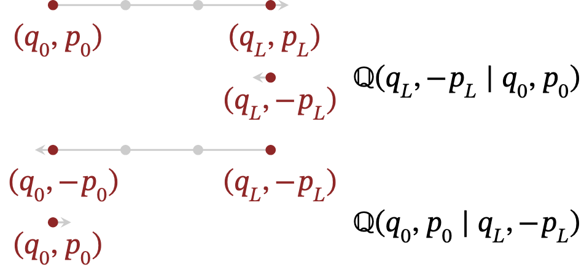

<figcaption>図31: 数値軌道を運動量反転で拡張すると、前方と後方の提案確率がともに素直に振る舞う、可逆なメトロポリス・ヘイスティングス提案が定まり、妥当な補正スキームが回復される。</figcaption>
</figure>

しかし第4.3節における最適積分時間の解析は、ハミルトニアン軌道から最後の状態をとるのではなく、ミクロカノニカル分布からの標本を最もよく近似するために軌道全体から一様に点をサンプリングすることを動機づけた。

この目的に向けて、最終点だけでなく数値軌道のすべての点を提案するように、メトロポリス・ヘイスティングスのアプローチを修正できる。

$$
\mathbb{Q}(q^{\prime},p^{\prime}\mid q_{0},p_{0})=\frac{1}{L}\sum_{l=0}^{L}\delta(q^{\prime}-q_{l})\,\delta(p^{\prime}+p_{l}).
$$

この一般化された提案も依然として可逆であり、受理確率も同様に次に帰着する。

$$
\displaystyle a(q_{l},-p_{l}\mid q_{0},p_{0})=\min\!\left(1,\exp\left(-H(q_{l},-p_{l})+H(q_{0},p_{0})\right)\right),
$$

これは $0\leq l\leq L$ について成り立ち、それ以外では消える。

残念ながら、この一般化された提案は、状態をその受理確率と独立に提案するため、準最適な性能に苦しみうる。

特に、誤差の大きい状態を提案して棄却を強いられる一方、数値軌道には誤差がはるかに小さく、したがって受理確率がはるかに高い他の状態があるかもしれない。

最適な性能を達成するには、軌道のすべての状態への提案を、単一の効率的な提案へと*平均*しなければならない。

そのような平均を達成するスキームは多数あり、それらはすべて、初期状態を時間前方だけでなく後方にも積分して数値軌道を生成することを要する。

両方向に積分しはじめると、ハミルトニアン・マルコフ遷移を2段階の過程として推論するほうが容易になる。

まず、初期点を含む長さ $L$ のすべての数値軌道の中から軌道 $\mathfrak{t}$ を一様にサンプリングし、次にその軌道から次の確率で点をサンプリングする。

$$
\pi\!\left(q,p\right)=\frac{e^{-H(q,p)}}{\sum_{(q^{\prime},p^{\prime})\in\mathfrak{t}}e^{-H(q^{\prime},p^{\prime})}}.
$$

このスキームの妥当性、およびそれの動的な軌道長への拡張を示す詳細な証明は、付録Aにある。

### 5.3 シンプレクティック積分器の最適な選択

シンプレクティック積分器でハミルトニアン・モンテカルロ法をどう実装するかがわかったので、残るはシンプレクティック積分器そのものの正確な構成の選択である。

これらの構成は、ステップサイズ $\epsilon$ と、各離散積分器ステップで何回の勾配評価を使うかを定める次数 $K$ の選択で特徴づけられる。

一般に、より正確だがより高コストな構成と、より不正確だがより安価な構成のあいだには、繊細な釣り合いがある。

たとえば、積分器の正確な次数によらず、ステップサイズは積分器ステップの数 $L=T/\epsilon$、したがって各ハミルトニアン遷移の全体的なコストを制御する。

ステップサイズが小さいほど、数値軌道は正確になり探索は良くなるが、その代償としてはるかに多くの積分器ステップを要する。

同様に、積分器の次数が高いほど、より正確だがより高コストになる。

幸いにも、この直観は、シンプレクティック積分器に固有の幾何学を利用して形式化・定量化できる。

特に、シンプレクティック積分器の体積保存は、それが厳密なハミルトニアンが生成する軌道をよく近似するだけでなく、ある*修正ハミルトニアン（modified Hamiltonian）*または*影ハミルトニアン（shadow Hamiltonian）*が生成する軌道を*厳密に*解くことを保証する。

これは、数値軌道がこの修正ハミルトニアンのエネルギー等位集合に拘束されることを意味し、厳密な等位集合と修正された等位集合の差を調べることで積分器の性能を定量化できる（図32a）。たとえば、発散は、修正された等位集合が非コンパクトになって相空間の境界まで伸びるときに起こる（図32b）。

<figure>

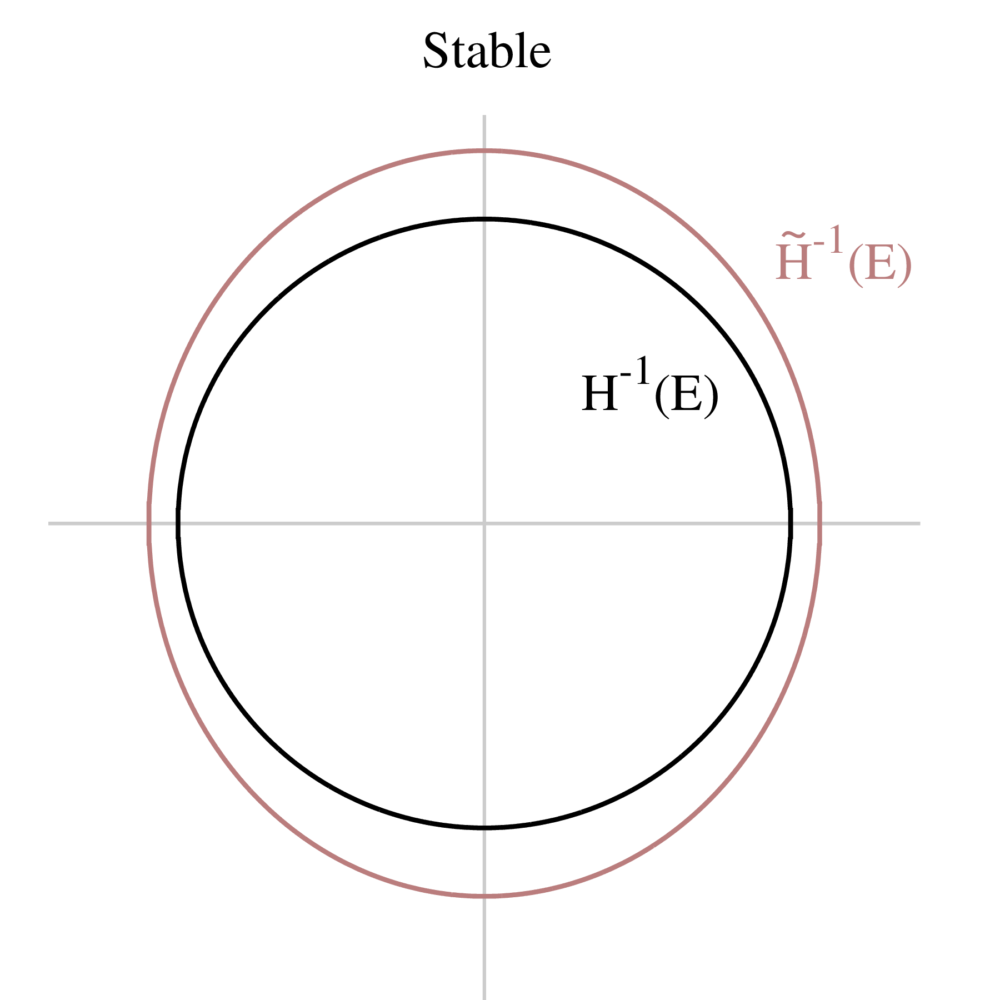

<figcaption>図32 (a): 修正ハミルトニアン H̃ の等位集合が厳密ハミルトニアン H の等位集合と同じ位相をもつとき、数値軌道は安定で高精度になる。図は厳密な等位集合（黒）と修正された等位集合（赤）がともに閉じたコンパクトな曲線である「Stable（安定）」な場合を示す。</figcaption>
</figure>

<figure>

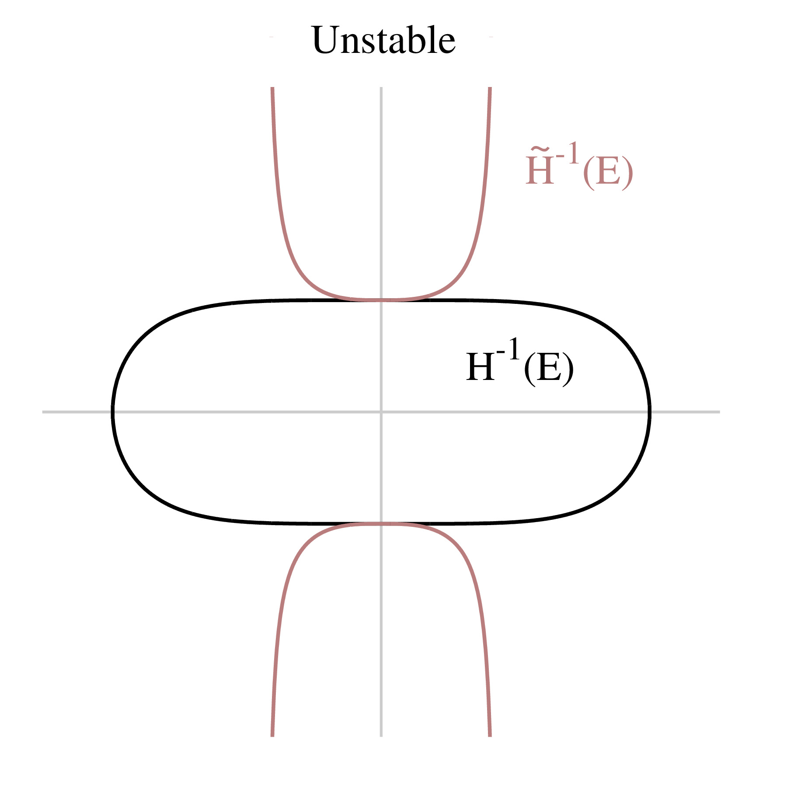

<figcaption>図32 (b): 修正された等位集合が異なる位相をもつとき、数値軌道は不安定になり発散する。図は厳密な等位集合 H⁻¹(E)（黒）は閉じているのに、修正された等位集合 H̃⁻¹(E)（赤）が開いて相空間の境界へ伸びていく「Unstable（不安定）」な場合を示す。</figcaption>
</figure>

図32: シンプレクティック積分器は、厳密ハミルトニアン H に似た修正ハミルトニアン H̃ から厳密な軌道を生成し、対応するエネルギー等位集合を比較することでシンプレクティック積分器の精度を定量化できる。(a) 修正ハミルトニアンの等位集合が厳密ハミルトニアンの等位集合と同じ位相を共有するとき、数値軌道は安定で高精度になる。(b) しかし修正された等位集合が異なる位相をもつとき、数値軌道は不安定になり発散する。

修正された等位集合が素直に振る舞い、発散に出会わないとき、厳密な等位集合と修正された等位集合の形を比較することでシンプレクティック積分器の性能を定量化できる。

静的な時間 $T$ だけ積分し、運動量を反転し、最終状態にメトロポリス・ヘイスティングス補正を適用する、ハミルトニアン・モンテカルロの単純な実装については、この比較が、アルゴリズムのコストと——それ自身がステップサイズに依存する——平均メトロポリス・ヘイスティングス受理確率との関係の境界を与える（図33）。

これらの境界は、第4.2.1節で論じたユークリッド計量の適応と同様に、拡張したウォームアップのあいだにステップサイズを適応させて平均メトロポリス受理確率を0.6から0.8のあいだに達成する、自動チューニング・アルゴリズムの基礎を与える。

この解析の多くはより洗練されたハミルトニアン・モンテカルロの実装にも持ち越せるが、対応する結果を形式化するにはさらなる研究が必要である。

<figure>

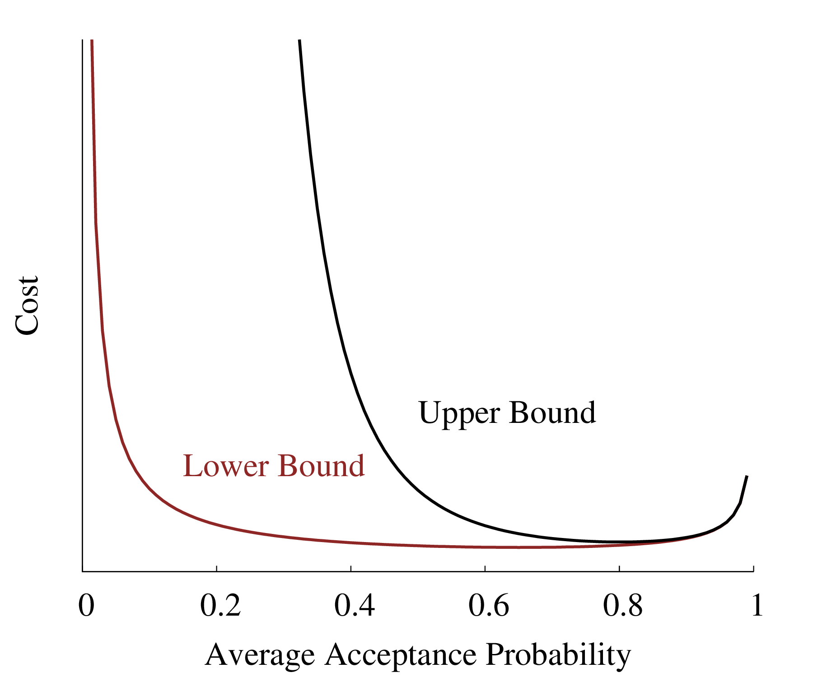

<figcaption>図33: シンプレクティック積分器が誘導する修正された等位集合の幾何学を厳密な等位集合と比較することで、少なくともハミルトニアン・モンテカルロ法の単純な実装については、ハミルトニアン遷移の計算コストと平均メトロポリス受理確率のあいだの境界を計算できる。これらの境界は、積分器のステップサイズを調整して、最小のコストをもたらす平均受理確率を達成する適応手続きに情報を与える。</figcaption>
</figure>

最後に、シンプレクティック積分器の次数を考えることが残っている。

ハミルトニアン・モンテカルロの議論のほとんどは、その単純さと経験的な成功のために、1次のリープフロッグ積分器のみを考える。

しかし最近の研究は、とりわけ高次元問題では、より高次の積分器がより効果的であるかもしれないことを示唆している。

高次の積分器が導入する一つの深刻な複雑さは、性能に大きく影響しうる追加の自由度である。これらの積分器パラメータを下手に選ぶと、リープフロッグ積分器に対する利得を完全に打ち消しかねない。

これらの追加の積分器の自由度が与えられた問題とどう相互作用するかを理解し、自動適応手続きを開発することは、高次の手法を取り入れるための重要な次の一歩である。

## 6 ハミルトニアン・モンテカルロの頑健性

ここまで我々は、ハミルトニアン軌道がなぜ与えられた目標分布を素早く探索するか、そして次に、この探索の効率を最大化するためにハミルトニアン・マルコフ遷移をどう構成できるかに焦点を当ててきた。

しかしまだ、その探索がどれだけ頑健かという決定的な問いには取り組んでいない。最速のアルゴリズムでも、典型集合のすべてを定量化しないなら無価値である。

第2.3節で論じたように、我々が考えなければならない形式的な問いは、どのような目標分布に対してハミルトニアン・モンテカルロの実装が幾何学的にエルゴード的になり、素直で不偏なマルコフ連鎖モンテカルロ推定量をもたらすか、である。

この問いは非常に一般的であるため、理論的な解析は極めて難しい。

しかし予備的な結果は、ハミルトニアン・モンテカルロ法の単純な実装ですら、大きなクラスの目標分布にわたって幾何学的にエルゴード的であることを示している。

特に、このクラスは、ランダムウォーク・メトロポリスのような勾配に基づかないアルゴリズムのクラスよりもはるかに大きく、高次元問題における頑健なマルコフ連鎖モンテカルロには勾配が決定的に重要であるという直観と整合的である。

おそらくより重要なことに、この理論的解析は、幾何学的エルゴード性を妨げる目標分布の病的な振る舞いを特定する。

さらにこの研究は、これらの病理が精密な経験的振る舞いとして現れることを示しており、それがハミルトニアン・モンテカルロに固有の実用的診断をただちに動機づける。

### 6.1 下手に選ばれた運動エネルギーを診断する

たとえば、幾何学的エルゴード性を妨げる一つの病的な振る舞いは、目標分布の重い裾である。

重い裾は典型集合をパラメータ空間の極端へ深く押し込み、成功するマルコフ連鎖は、典型集合の有意な領域を見逃さないために、裾へ、そして裾から戻る長い滞在をしなければならなくなる。

動的積分時間の実装が可能にする漸進的に長い軌道は、ハミルトニアン・マルコフ連鎖におけるこれらの滞在を促進するが、ときには指数関数的に増大する積分時間ですら不十分なことがある。

特に、運動エネルギーが下手に選ばれていると、周辺エネルギー分布そのものが裾の重いものになりうる。その場合、等位集合のあいだの確率的探索が非常に遅くなり、有限回の遷移ののちでもマルコフ連鎖の探索は不完全なままになる。

幸いにも、そのような不適切な運動エネルギーは、マルコフ連鎖そのものを使って周辺エネルギー密度とエネルギー遷移密度を可視化することで容易に特定できる（図34）。

この可視化は、運動量再サンプリングがエネルギー等位集合を非効率に探索する場合を素早く特定する。とりわけ、散らばった出発点から初期化された複数の連鎖を集約するときにそうである。

これら2つの分布の不一致を、*欠落情報のベイズ割合（Bayesian fraction of missing information）*を使って形式化することもできる。

$$
\text{E-BFMI}\equiv\frac{\mathbb{E}_{\pi}\!\left[\mathrm{Var}_{\pi_{E\mid q}}\!\left[E\mid q\right]\right]}{\mathrm{Var}_{\pi_{E}}\!\left[E\right]}\approx\widehat{\text{E-BFMI}}\equiv\frac{\sum_{n=1}^{N}\left(E_{n}-E_{n-1}\right)^{2}}{\sum_{n=0}^{N}\left(E_{n}-\bar{E}\right)^{2}}.
$$

経験的には、このエネルギーの欠落情報のベイズ割合が0.3を下回る値は問題があることがわかっているが、正確な閾値を形式化するにはさらなる理論的研究が必要である。

<figure>

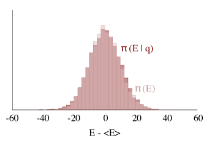

<figcaption>図34: ハミルトニアン・マルコフ連鎖が探索したエネルギーは、エネルギー遷移密度 π(E|q) と周辺エネルギー分布 π(E) の両方を可視化するのに使える。(a) これらの分布がよく一致するとき、ハミルトニアン・マルコフ連鎖は頑健に機能するはずである。(b) しかしエネルギー遷移密度が周辺エネルギー分布より著しく狭いと、連鎖は目標分布の裾を完全には探索できないかもしれない。</figcaption>
</figure>

### 6.2 高曲率の領域を診断する

幾何学的エルゴード性へのもう一つの一般的な障害は、目標分布が大きな曲率を示すパラメータ空間の近傍である。

第2.3節で見たように、ほとんどのマルコフ遷移はこれらの狭い近傍を解像できず、不完全な探索と偏ったマルコフ連鎖モンテカルロ推定量をもたらす。ハミルトニアン・マルコフ遷移も例外ではない。

そのような近傍は多くの重要なモデル、とりわけ階層モデル（hierarchical models）の特徴であるため、これらの病理は応用実務で無視できない。

都合がよいことに、これらの高曲率の近傍はシンプレクティック積分器にとっても病的であることがわかる。シンプレクティック積分器はそこに入ると不安定になり発散する（図35）。

重要なことに、これは、発散する数値軌道がこれらの病的近傍の極めて鋭敏な特定子であり、したがって強力で即時的な診断を与えることを意味する。

図35: 幾何学的エルゴード性を妨げる典型集合の高曲率の近傍（緑）は、シンプレクティック積分器にとっても病的であり、それを発散させる。この病理の合流は実際には有利である。容易に観測できる発散を使って、より微妙な統計的病理を特定できるからである。（訳注: 原文 markdown には本図の画像は含まれていなかった。）

特に、ハミルトニアン・マルコフ連鎖で出会う発散遷移はすべて、任意のマルコフ連鎖モンテカルロ推定量の妥当性への疑念を促すべきである。

病理が十分に軽微なとき、シンプレクティック積分器のステップサイズを小さくすることで発散を取り除き、推定量の妥当性を回復できる。

しかししばしば病理は重すぎて、ステップサイズをどれだけ小さくしても発散は持続し、得られる推定量に有意なバイアスがあることを示す。

これらの場合、目標分布そのものを、たとえばより強い事前分布や代替の表現で正則化する必要がある。後者の代表的な例は、潜在ガウスモデルにおいて中心化パラメータ化と非中心化パラメータ化を切り替えることである。

### 6.3 診断の限界

これら2つの診断は多くの病的な目標分布を特定する強力な手段だが、それらはマルコフ連鎖モンテカルロ推定量の妥当性の必要条件にすぎず、十分条件ではない。

明示的な理論的解析なしには、目標分布が——とりわけ我々がますます複雑な問題へ向かうにつれて——ハミルトニアン・モンテカルロを脱線させうるより微妙な病理を示さない保証はない。

それでも、これらの診断は、とりわけ複数の並列連鎖を用いた分割 $\hat{R}$ 統計量のような汎用診断と組み合わせると、ハミルトニアン・モンテカルロを独自に頑健な手法にする。

## 7 結論

典型集合の幾何学を利用することで、ハミルトニアン・モンテカルロは滑らかな目標分布の首尾一貫した探索を生成する。

この効果的な探索は、他のマルコフ連鎖モンテカルロ・アルゴリズムよりも良い計算効率をもたらすだけでなく、得られる推定量の妥当性についてのより強い保証ももたらす。

さらに、この幾何学の注意深い解析は、手法の最適な実装を自動的に構築する筋の通った戦略を促し、ユーザーが統計計算の苛立ちと格闘する代わりに、より良いモデルを構築することに専門知識を集中できるようにする。

その結果、ハミルトニアン・モンテカルロは、Stan のような道具の大きな成功が示すように、応用統計の最前線にある最も難しい問題に取り組むのに独自に適している。

振り返ってみれば、この成功は特に驚くべきことではないはずである。確率的期待値を推定する究極の課題は、パラメータ空間内の複雑な曲面の近くに集中する目標分布の典型集合を定量化することである。曲面についての情報を定量化し利用するのに、その幾何学を通じて行うより自然な方法があるだろうか。

この幾何学的観点を活用し続けることは、ハミルトニアン・モンテカルロ法とその最適な実装についての我々の理解をさらに前進させるうえで決定的に重要である。これには、幾何学的エルゴード性の解析の改善、既存の実装技術の精緻化、そして非ガウス・非ユークリッド運動エネルギーの適切な利用の動機づけまで、あらゆることが含まれる。

さらに、微分幾何学の技法は、ハミルトニアン・モンテカルロの原理を、より難しい他の計算問題へ一般化することを可能にするかもしれない。

たとえば、幾何学的手法はすでに、*断熱モンテカルロ（Adiabatic Monte Carlo）*において首尾一貫した探索を熱力学的アルゴリズムへ一般化している。より洗練された幾何学的技法を取り入れることで、これらの考えを、離散空間・木空間・ヒルベルト空間のような、より入り組んだ構造をもつパラメータ空間へ拡張できるかもしれない。

## 付録A 実用的実装の技術的詳細

第4.1節で論じたように、ハミルトニアン系は、エネルギー等位集合に関するミクロカノニカル分布と、エネルギーそのものをまたぐ周辺エネルギー分布へと自然に分解する。

ハミルトニアン・モンテカルロはこの構造を利用して正準分布の効率的な探索を生成し、与えられたエネルギー等位集合の探索と、周辺エネルギー分布上のランダムウォークを生成する運動量の再サンプリングを交互に行う。

特に、エネルギー等位集合上の探索は、ハミルトニアンが生成する軌道をたどることで容易に達成される。

これらの軌道はエネルギーを保存し、したがって単一のエネルギー等位集合に拘束されるだけでなく、典型的にはエルゴード的であり、ますます長く積分するにつれてその等位集合全体を探索する。より形式的には、エルゴード的な軌道からの一様な標本は、ミクロカノニカル分布からの標本へ収束する。

残念ながら、この理想化された手法は実際には実装できない。いくつかの例外的な系を除いて、ハミルトニアン軌道を解析的に生成できないからである。

代わりに、数値積分器が与える近似軌道を扱わなければならない。幸いにも、ハミルトニアン系は非常に強力なシンプレクティック積分器を許し、その数値誤差は小さいだけでなく、素直な確率的補正によって厳密に是正できる。

この付録では、シンプレクティック積分器の数値軌道を利用して厳密なミクロカノニカル分布から標本を生成する技術的詳細を、まず固定長の*静的*軌道の場合について、次に与えられた停止基準が満たされるまで伸びる*動的*軌道について検討する。最後に、これらの実装がノーユーターン・サンプラーや Stan とどう関係するかを述べる。

### A.1 記法

$z=(q,p)$ を相空間内の点とする。シンプレクティック積分器は、そのような任意の点から、時間の増分 $\epsilon$ だけ前方または後方に積分することで数値軌道 $\mathfrak{t}$ を生成し、相空間全体を、シンプレクティック積分器が到達できる離散的な点の集合へと縮約する。

初期点 $z_{0}$ が与えられたとき、$z_{n}$ を前方に $n$ 回積分して到達する点、$z_{-n}$ を後方に $n$ 回積分して到達する点とする。長さ $L=3$ の軌道の例には、$\mathfrak{t}=\left\{z_{0},z_{1},z_{2}\right\}$、$\mathfrak{t}=\left\{z_{-1},z_{0},z_{1}\right\}$、$\mathfrak{t}=\left\{z_{-2},z_{-1},z_{0}\right\}$ などがある。

点 $z$ を含む長さ $L$ のすべてのシンプレクティック積分器軌道の集合を $\mathfrak{T}^{L}_{z}$ と書く。同様に、点 $z$ と $z^{\prime}$ を含む長さ $L$ の数値軌道の集合を $\mathfrak{T}^{L}_{z,z^{\prime}}$ と表す。すなわち

$$
\mathfrak{T}^{L}_{z,z^{\prime}}=\mathfrak{T}^{L}_{z}\cap\mathfrak{T}^{L}_{z^{\prime}}.
$$

### A.2 静的実装

シンプレクティック積分器は厳密にはエネルギーを保存せず、その数値軌道は目標エネルギー等位集合から逸脱する。

特に、任意の数値軌道から状態を一様にサンプリングしても、正準分布からの標本は生成されない。しかしこの誤差は、軌道から一様にではなく、望ましい正準密度関数に比例する重みでサンプリングすることで厳密に補正できる。

そのようなスキームを推論する最も簡単な方法は逐次的に考えることである。まず初期点を含む数値軌道をサンプリングし $\mathbb{T}(\mathfrak{t}\mid z)$、次にその軌道から状態をサンプリングして $\mathbb{T}(z^{\prime}\mid\mathfrak{t})$、同時遷移を得る。

$$
\mathbb{T}(z^{\prime}\mid z)=\sum_{\mathfrak{t}}\mathbb{T}(z^{\prime}\mid\mathfrak{t})\,\mathbb{T}(\mathfrak{t}\mid z),
$$

ここで和はすべての数値軌道にわたる。

#### A.2.1 軌道のサンプリング

静的な場合には、初期点 $z$ を含む長さ $L$ の軌道のみを考え、その場合 $\mathbb{T}(\mathfrak{t}\mid z)$ は $\mathfrak{T}^{L}_{z}$ 上にのみ台（サポート）をもつ。

妥当な補正を保証するには、状態から軌道へのこの遷移が、ある種の可逆性を示さなければならない。

形式的には、軌道への遷移確率が、その軌道のどの状態から始めても同じであることを要求する。

$$
\mathbb{T}(\mathfrak{t}\mid z)=\mathbb{T}(\mathfrak{t}\mid z^{\prime}),\,\mathfrak{t}\in\mathfrak{T}^{L}_{z,z^{\prime}}.
$$

これは次の重要な含意をもつ。

$$
\mathbb{I}(z^{\prime}\in\mathfrak{t})\,\mathbb{T}(\mathfrak{t}\mid z)=\mathbb{I}(z\in\mathfrak{t})\,\mathbb{T}(\mathfrak{t}\mid z),
$$

ここで $\mathbb{I}$ は指示関数（条件が真なら1、偽なら0）である。

実際には、この条件は、初期点を含むすべての軌道にわたって一様にサンプリングすることで最も容易に満たされる。

$$
\mathbb{T}(\mathfrak{t}\mid z)=U\!\left(\mathfrak{T}^{L}_{z}\right),
$$

なぜなら $\mathfrak{T}^{L}_{z,z^{\prime}}\neq\emptyset$ ならば $\mathbb{T}(\mathfrak{t}\mid z)=\mathbb{T}(\mathfrak{t}\mid z^{\prime})=L^{-1}$ となるからである。

#### A.2.2 状態のサンプリング

数値軌道をサンプリングしたら、遷移確率を正準密度に比例させる任意の過程によって、厳密な正準分布からの標本を生成できる。

$$
\displaystyle\mathbb{T}(z^{\prime}\mid\mathfrak{t})
$$

$$
\displaystyle=\frac{\pi\!\left(z^{\prime}\right)}{\sum_{z^{\prime\prime}\in\mathfrak{t}}\pi\!\left(z^{\prime\prime}\right)}\mathbb{I}(z^{\prime}\in\mathfrak{t})
$$

$$
\displaystyle=\frac{e^{-H(z^{\prime})}}{\sum_{z^{\prime\prime}\in\mathfrak{t}}e^{-H(z^{\prime\prime})}}\mathbb{I}(z^{\prime}\in\mathfrak{t}).
$$

シンプレクティック積分器が厳密で、数値軌道が初期エネルギー等位集合に拘束されていれば、これらの遷移確率は望みどおり、軌道内の状態に関する一様分布に帰着する。

実際には、数値軌道の誤差が、より高いエネルギーへの逸脱を嫌う非一様な遷移確率を誘導する。

望ましい遷移確率をもたらすスキームはさまざまある。たとえば、補助変数 $u\sim U\left(0,\pi\!\left(z\right)\right)$ で遷移を拡張し、$\pi\!\left(z^{\prime}\right)>u$ を満たす軌道内の状態から一様にサンプリングする、スライス・サンプラーを実装できる。

しかし、望ましい遷移確率を直接達成することもできる。軌道内の状態に関する多項分布から、次の確率で単に抽出すればよい。

$$
\mathbb{P}(z^{\prime})=\frac{\pi\!\left(z^{\prime}\right)}{\sum_{z^{\prime\prime}\in\mathfrak{t}}\pi\!\left(z^{\prime\prime}\right)}.
$$

このアプローチは実装が容易であるだけでなく、ラオ・ブラックウェルの定理（Rao-Blackwell Theorem）が、補助確率変数がないことでより良い性能が保証されることを確立する。

#### A.2.3 正準分布の不変性

シンプレクティック積分器がこれほど高い実用的性能を実現できるのは、相空間の体積を厳密に保存するからである。

都合がよいことに、この体積保存はまた、正準密度を保存する任意の遷移によって厳密な正準分布からの標本を達成できることを保証する。

$$
\pi(z)\propto e^{-H(z)}.
$$

明示的な計算により、上で述べた性質がこの不変性を保証するのに十分であることが示される。

$$
\displaystyle\sum_{z}\mathbb{T}(z^{\prime}|z)\pi(z)
$$

$$
\displaystyle=\sum_{z}\sum_{\mathfrak{t}}\mathbb{T}(z^{\prime}\mid\mathfrak{t})\,\mathbb{T}(\mathfrak{t}\mid z)\pi(z)
$$

$$
\displaystyle=\sum_{z}\sum_{\mathfrak{t}}\frac{\pi\!\left(z^{\prime}\right)}{\sum_{z^{\prime\prime}\in\mathfrak{t}}\pi\!\left(z^{\prime\prime}\right)}\mathbb{I}(z^{\prime}\in\mathfrak{t})\mathbb{T}(\mathfrak{t}\mid z)\pi(z)
$$

$$
\displaystyle=\sum_{z}\sum_{\mathfrak{t}}\frac{\pi\!\left(z^{\prime}\right)}{\sum_{z^{\prime\prime}\in\mathfrak{t}}\pi\!\left(z^{\prime\prime}\right)}\mathbb{I}(z\in\mathfrak{t})\mathbb{T}(\mathfrak{t}\mid z^{\prime})\pi(z)
$$

$$
\displaystyle=\sum_{\mathfrak{t}}\frac{\pi\!\left(z^{\prime}\right)}{\sum_{z^{\prime\prime}\in\mathfrak{t}}\pi\!\left(z^{\prime\prime}\right)}\mathbb{T}(\mathfrak{t}\mid z^{\prime})\sum_{z}\mathbb{I}(z\in\mathfrak{t})\pi(z)
$$

$$
\displaystyle=\pi\!\left(z^{\prime}\right)\sum_{\mathfrak{t}}\frac{1}{\sum_{z^{\prime\prime}\in\mathfrak{t}}\pi\!\left(z^{\prime\prime}\right)}\mathbb{T}(\mathfrak{t}\mid z^{\prime})\sum_{z\in\mathfrak{t}}\pi(z)
$$

$$
\displaystyle=\pi\!\left(z^{\prime}\right)\sum_{\mathfrak{t}}\mathbb{T}(\mathfrak{t}\mid z^{\prime})
$$

$$
\displaystyle=\pi\!\left(z^{\prime}\right).
$$

### A.3 効率的な静的実装

この最初のスキームの問題は、遷移を生成するために軌道全体をメモリに保持する必要があることである。

長さ $L$ の静的軌道では、任意の時点で $L$ 個の状態をメモリに保持する必要があり、高次元問題では負担になりうる。

しかし、$\mathbb{T}(z^{\prime}\mid\mathfrak{t})$ からのサンプリングを軌道 $\mathfrak{t}$ そのものの構築に織り込むことで、はるかに効率的な遷移を構築できる。

#### A.3.1 一様な漸進的サンプリング

初期点を含む軌道を一度にサンプリングする代わりに、ランダムな軌道を逐次的に生成することを考える。

初期点を含む軌道 $\mathfrak{t}_{\mathrm{old}}$ から始め、時間前方または後方にランダムに積分して新しい軌道 $\mathfrak{t}_{\mathrm{new}}$ を付け加える。これら2つの構成要素の軌道の和集合が完全な軌道 $\mathfrak{t}=\mathfrak{t}_{\mathrm{old}}\cup\mathfrak{t}_{\mathrm{new}}$ を与える。

もし古い軌道と新しい軌道の両方から (1) に従う標本があれば、

$$
z_{\mathrm{old}}\sim\mathbb{T}(z^{\prime}\mid\mathfrak{t}_{\mathrm{old}}),\,z_{\mathrm{new}}\sim\mathbb{T}(z^{\prime}\mid\mathfrak{t}_{\mathrm{new}}),
$$

確率 $p_{\mathrm{old}}$ で $z=z_{\mathrm{old}}$、そうでなければ $z=z_{\mathrm{new}}$ をとるベルヌーイ過程によって、軌道全体からの標本を生成できる（図36）。ここで

$$
p_{\mathrm{old}}=\frac{w_{\mathrm{old}}}{w_{\mathrm{old}}+w_{\mathrm{new}}},
$$

であり、$w_{\mathrm{old}}=\sum_{z\in\mathfrak{t}_{\mathrm{old}}}\pi\!\left(z\right)$、$w_{\mathrm{new}}=\sum_{z\in\mathfrak{t}_{\mathrm{new}}}\pi\!\left(z\right)$ である。

<figure>

<figcaption>図36 (a): 隣接する2つの数値軌道（古い構成要素と新しい構成要素）からの標本が与えられたとき。</figcaption>
</figure>

<figure>

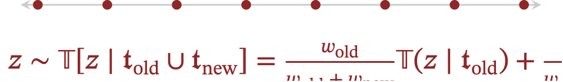

<figcaption>図36 (b): ベルヌーイ過程によってそれらの和集合からの標本を生成でき、2つの構成要素の遷移分布を正しい同時遷移分布へと実効的に混合する。これにより、軌道を構築しながら漸進的にサンプリングでき、まず古い構成要素と新しい構成要素のあいだで遷移し、次にその中で標本を選ぶ。</figcaption>
</figure>

図36: (a) 隣接する2つの数値軌道からの標本が与えられたとき、(b) ベルヌーイ過程によってそれらの和集合からの標本を生成でき、2つの構成要素の遷移分布を正しい同時遷移分布へと実効的に混合する。これにより、軌道を構築しながら漸進的にサンプリングできる。

形式的には次が成り立つ。

$$
\displaystyle\mathbb{T}(z^{\prime}\mid\mathfrak{t})
$$

$$
\displaystyle=p_{\mathrm{old}}\,\mathbb{T}(z^{\prime}\mid\mathfrak{t}_{\mathrm{old}})+(1-p_{\mathrm{old}})\,\mathbb{T}(z^{\prime}\mid\mathfrak{t}_{\mathrm{new}})
$$

$$
\displaystyle=\frac{w_{\mathrm{old}}}{w_{\mathrm{old}}+w_{\mathrm{new}}}\mathbb{T}(z^{\prime}\mid\mathfrak{t}_{\mathrm{old}})+\frac{w_{\mathrm{new}}}{w_{\mathrm{old}}+w_{\mathrm{new}}}\mathbb{T}(z^{\prime}\mid\mathfrak{t}_{\mathrm{new}}),
$$

これは定義から、（一様な漸進的サンプリングでの遷移確率の重み付き和が）軌道全体に関する正しい遷移確率 $\frac{\pi\!\left(z^{\prime}\right)}{\sum_{z^{\prime\prime}\in\mathfrak{t}}\pi\!\left(z^{\prime\prime}\right)}\mathbb{I}(z^{\prime}\in\mathfrak{t})=\mathbb{T}(z^{\prime}\mid\mathfrak{t})$ に等しいことが、ただちに従う（原論文の逐次的な代入計算を参照）。

図37: 数値軌道の長さが2の累乗 $L=2^{D}$ のとき、その軌道は深さ $D$ の完全な順序付き二分木の葉と等価である。（訳注: 原文 markdown に本図の画像は含まれていなかった。）

軌道を一度にサンプリングするのではなく漸進的にサンプリングするこのアプローチは、軌道長を2の累乗に保ったまま*乗法的に（multiplicatively）*——すなわち軌道を毎回倍々に伸ばして——構築するのにも使える（図38）。各倍化のステップで、現在の軌道と同じ長さの新しい構成要素を前方または後方にランダムに積分して付け加え、(2) による標本を同時に生成する。

<figure>

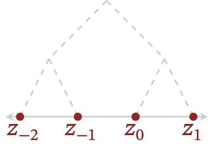

<figcaption>図38 (a): 乗法的な軌道拡張では、初期点 z₀ を含む長さ L=2^D の古い軌道構成要素から始める。</figcaption>
</figure>

<figure>

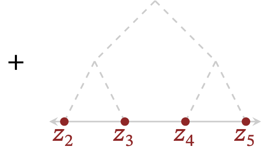

<figcaption>図38 (b): 時間前方または後方にランダムに積分して、同じ長さの新しい軌道構成要素を付け加える。</figcaption>
</figure>

<figure>

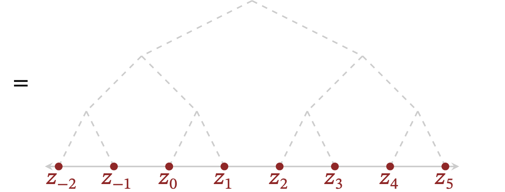

<figcaption>図38 (c): これにより初期軌道の2倍の長さの軌道が得られ、t ∼ U(𝔗^{2L}_{z₀}) からサンプリングされる。対応する標本 z′ も同時に生成される。z₋₂…z₅ の点が二分木（破線）を成す様子を示す。</figcaption>
</figure>

<figure>

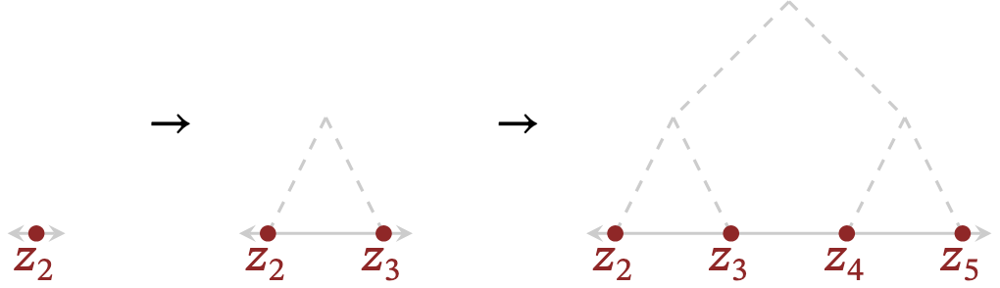

<figcaption>図38 (d): 同じ過程は新しい軌道構成要素を再帰的に構築するのにも使える。ここでは z₂ から初期化し、対応する標本 z_new を生成する。</figcaption>
</figure>

図38: 乗法的な軌道拡張では、(a) 初期点 z₀ を含む長さ L=2^D の古い軌道構成要素から始め、(b) 時間前方または後方にランダムに積分して同じ長さの新しい構成要素を付け加える。(c) これにより初期軌道の2倍の長さの軌道が一様にサンプリングされ、標本 z′ も同時に生成される。(d) 同じ過程を再帰的に使って新しい構成要素そのものを構築できる。

#### A.3.2 偏った漸進的サンプリング

ランダムな軌道から状態をサンプリングするこの漸進的アプローチは、遷移に反相関（anti-correlation）を導入して性能を改善する機会も与える。

具体的には、次を満たす別の遷移を使える。

$$
\mathbb{T}(z^{\prime}\mid\mathfrak{t})=\min\!\left(1,\frac{w_{\mathrm{new}}}{w_{\mathrm{old}}}\right)\,\mathbb{T}(z^{\prime}\mid\mathfrak{t}_{\mathrm{new}})+\left(1-\min\!\left(1,\frac{w_{\mathrm{new}}}{w_{\mathrm{old}}}\right)\right)\,\mathbb{T}(z^{\prime}\mid\mathfrak{t}_{\mathrm{old}}),
$$

ここで $\mathbb{T}(z^{\prime}\mid\mathfrak{t}_{\mathrm{old}})$ と $\mathbb{T}(z^{\prime}\mid\mathfrak{t}_{\mathrm{new}})$ は、一様な漸進的サンプリングと同様に (1) で与えられる。

そのような遷移は新しい軌道構成要素からの標本を優先し、したがって遷移を初期状態から遠ざけるように偏らせる。

しかし与えられた軌道内のすべての可能な初期状態にわたって平均すると、これらの反発は打ち消し合い、サンプリングされた軌道に制限された正準分布を保存することを保証する。

$$
\displaystyle\sum_{z}\mathbb{T}(z^{\prime}\mid z)\pi\!\left(z\right)\mathbb{I}(z\in\mathfrak{t})
$$

$$
\displaystyle=\sum_{z}\mathbb{T}(z^{\prime}\mid z)\pi\!\left(z\right)\mathbb{I}(z\in\mathfrak{t}_{\mathrm{old}})+\sum_{z}\mathbb{T}(z^{\prime}\mid z)\pi\!\left(z\right)\mathbb{I}(z\in\mathfrak{t}_{\mathrm{new}})
$$

$$
\displaystyle=\mathbb{T}(z^{\prime}\mid\mathfrak{t}_{\mathrm{old}})w_{\mathrm{old}}+\mathbb{T}(z^{\prime}\mid\mathfrak{t}_{\mathrm{new}})w_{\mathrm{new}}
$$

$$
\displaystyle=\pi(z^{\prime})\,\mathbb{I}(z^{\prime}\in\mathfrak{t}_{\mathrm{old}})+\pi(z^{\prime})\,\mathbb{I}(z^{\prime}\in\mathfrak{t}_{\mathrm{new}})
$$

$$
\displaystyle=\pi(z^{\prime})\,\mathbb{I}(z^{\prime}\in\mathfrak{t}).
$$

（訳注: 上式は原論文の逐次的な代入計算の要点を抜粋したもので、$\min$ 項を含む中間の展開を経て最終的に重み $w_{\mathrm{old}}, w_{\mathrm{new}}$ が打ち消し合うことを示している。）

### A.4 動的実装

静的なスキームをどれだけ効率的にできても、それは残念ながら根本的に限界がある。

いくつかの例外的に単純な問題を別にすれば、各エネルギー等位集合は、同じ実効的な探索を達成するのに異なる積分時間を要する。

ある等位集合は短い積分時間で調べ上げられるが、他のものは非常に長い積分時間を要する。

ハミルトニアン・モンテカルロ法の最適な性能を保証するには、すべてのエネルギー等位集合にわたるほぼ一様な探索を近似するよう積分時間を自動的にチューニングできる、動的な実装が必要である。

幸いにも、第A.3節で論じた効率的な静的スキームは、軌道が対応するエネルギー等位集合を十分に探索するほど長く伸びたかを判定する基準を選んでしまえば、反復することで動的な実装を達成できる。

まず与えられた長さの初期軌道を構築し、停止基準を確認する。基準が満たされなければ軌道をさらに拡張して繰り返し、基準が満たされれば軌道とその対応する標本を返す。

ただし、そのような動的スキームが軌道サンプリングの可逆性、したがって正準分布の望ましい不変性を妨げないように注意しなければならない。

本節では、まず素朴な動的スキームがいかに可逆性を妨げうるか、そしてこれらの問題を避けるためにどんな手立てをとらなければならないかを示す。妥当な動的実装を理解したうえで、可能な停止基準を検討する。

#### A.4.1 可逆性を維持する

上で論じた素朴な動的スキームの問題は、拡張された軌道について可逆性条件

$$
\mathbb{T}(\mathfrak{t}\mid z)=\mathbb{T}(\mathfrak{t}\mid z^{\prime}),\,\mathfrak{t}\in\mathfrak{T}^{L}_{z,z^{\prime}},
$$

を破り、したがって得られるマルコフ連鎖の定常分布を偏らせうることである。

特に、最終的な軌道の異なる点から初期化すると、動的な軌道拡張が最終軌道に達する前に早期に停止してしまい、ある初期状態では $\mathbb{T}(\mathfrak{t}\mid z)$ が消えるのに他の状態ではそうならないことが起こりうる（図39）。

<figure>

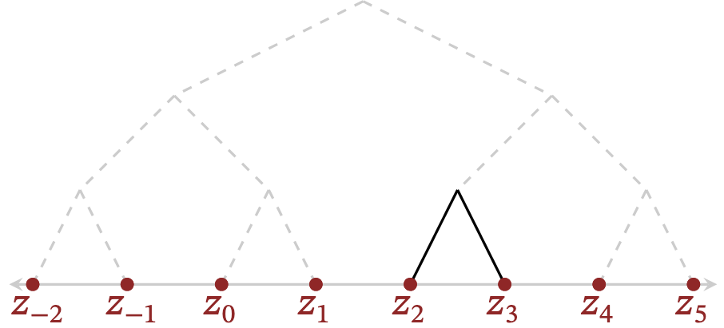

<figcaption>図39: 動的停止基準が満たされるまで軌道を素朴に拡張するだけでは、可逆性、したがって得られるマルコフ連鎖の妥当性を保証するのに不十分である。たとえば軌道を乗法的に拡張するとき、いずれかの部分木（たとえば z₂ に始まり z₃ に終わる軌道）が停止基準を満たすと、T(t|z₀)≠0 であるにもかかわらず T(t|z₂)=0 かつ T(t|z₃)=0 となる。この病理を避けるには、そのような病的な部分軌道を含む軌道拡張をすべて棄却しなければならない。</figcaption>
</figure>

遷移確率を等しくするには、停止基準を満たすある種の部分軌道——したがって、もしそこから始めていれば早期に停止していたであろう状態——を含む軌道拡張をすべて棄却しなければならない。

たとえば軌道を加法的に拡張するなら、古い軌道のすべての状態に始まり新しい軌道の単一の状態に終わる部分軌道について停止基準を確認する必要があり、古い軌道のサイズに線形なコストを生む（図40a）。これを各拡張で行うと、最終的な軌道長に2次のコストになる。

しかし軌道を乗法的に拡張すると、新しい軌道の二分部分木に等価な部分軌道のみを確認すればよく、古い軌道のサイズに対数的なコストですみ（図40b）、総コストは最終的な軌道長の対数にのみ2次となる。さらに、これらの確認は部分木にわたって行われるため、新しい軌道を構築しながら同時に計算できる。いずれかの部分木が早期に停止基準を満たせば、新しい軌道を完成させることなくただちに棄却できる。

<figure>

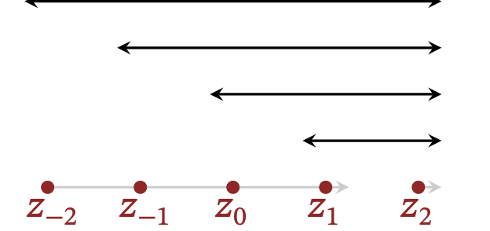

<figcaption>図40 (a): 加法的拡張スキームでは、古い軌道の各点と、新しい軌道の単一の点とのあいだのすべての部分軌道について停止基準を確認しなければならない。</figcaption>
</figure>

<figure>

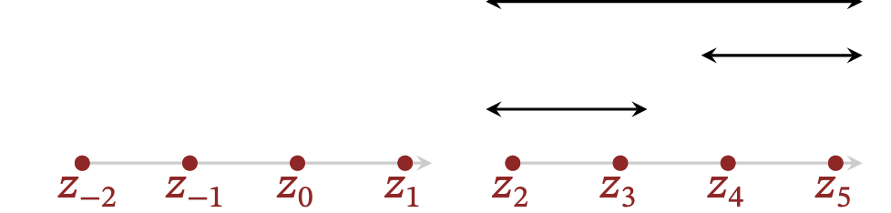

<figcaption>図40 (b): しかし乗法的拡張スキームでは、新しい軌道の二分部分木にわたってのみ停止基準を確認すればよい。</figcaption>
</figure>

図40: (a) 加法的拡張スキームでは、古い軌道の各点と新しい軌道の単一の点とのあいだのすべての部分軌道について停止基準を確認しなければならない。(b) しかし乗法的拡張スキームでは、新しい軌道の二分部分木にわたってのみ停止基準を確認すればよい。

#### A.4.2 動的停止基準

ようやく、軌道が現在のエネルギー等位集合の近傍を十分に探索するほど長くなったかを——さまざまな成功の度合いで——特定できる、明示的な停止基準を考えられる。

特に、積分が短すぎてハミルトニアン軌道を十分に活用できないことも、積分が長すぎて収穫逓減の探索に貴重な計算資源を浪費することも、ともに避けたい。

この形式の最初の基準は、軌道の境界のみを考える、ノーユーターン・サンプラーで導入された経験則であった。

$z_{-}(\mathfrak{t})$ と $z_{+}(\mathfrak{t})$ を、それぞれ時間後方と前方に積分して到達できる軌道 $\mathfrak{t}$ の境界とする（図41）。同様に、各境界での位置と運動量を $q_{\pm}(\mathfrak{t})$、$p_{\pm}(\mathfrak{t})$ と表す。

ユークリッド空間では、ノーユーターン停止基準を次のように書ける。

$$
\displaystyle p_{+}(\mathfrak{t})^{T}\cdot\left(q_{+}(\mathfrak{t})-q_{-}(\mathfrak{t})\right)<0
$$

$$
\displaystyle\mathrm{AND}\;p_{-}(\mathfrak{t})^{T}\cdot\left(q_{-}(\mathfrak{t})-q_{+}(\mathfrak{t})\right)<0.
$$

<figure>

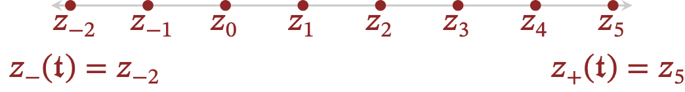

<figcaption>図41: ノーユーターン停止基準は軌道の境界のみを考える。負の境界 z₋(t) は時間後方に積分して到達できる境界、正の境界 z₊(t) は時間前方に積分して到達できる境界を指す。</figcaption>
</figure>

<figure>

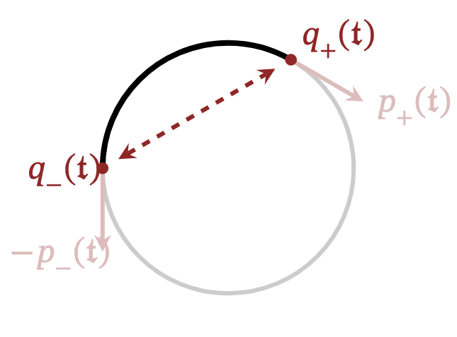

<figcaption>図42 (a): ノーユーターン停止基準が満たされないとき、いずれの方向に軌道を拡張しても、典型的には軌道をエネルギー等位集合（灰色）の未探索の近傍へさらに伸ばす。q₊(t), q₋(t) は境界の位置、p₊(t), -p₋(t) は対応する運動量。</figcaption>
</figure>

<figure>

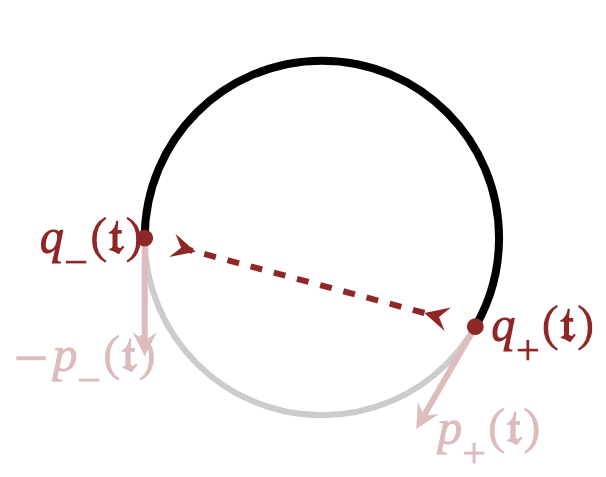

<figcaption>図42 (b): しかしノーユーターン停止基準が満たされるとき、さらなる拡張は典型的には軌道の境界を互いに、そして既に探索した近傍へと縮める。基準がちょうど満たされた時点で停止すると、各軌道がエネルギー等位集合の約半分を効率的に探索することが典型的に保証される。</figcaption>
</figure>

図42: (a) ノーユーターン停止基準が満たされないとき、いずれの方向に軌道を拡張しても、典型的には軌道をエネルギー等位集合（灰色）の未探索の近傍へさらに伸ばす。(b) しかし基準が満たされるとき、さらなる拡張は典型的には軌道の境界を互いに、そして既に探索した近傍へと縮める。基準がちょうど満たされた時点で停止すると、各軌道がエネルギー等位集合の約半分を効率的に探索することが典型的に保証される。これは過度に積極的なこともあるが、経験的にはうまく機能し、静的な積分時間のみのいかなるスキームよりもはるかに優れている。

しかし、元のノーユーターン停止基準は、点同士の引き算を厳密に定義できるユークリッド多様体でのみ well-defined（明確に定義される）であり、したがって非ユークリッド運動エネルギーには適用できない。

幸いにも、この基準は容易に一般化できる。まず、ユークリッド多様体では次が成り立つ。

$$
q_{+}(\mathfrak{t})-q_{-}(\mathfrak{t})=\int_{t=0}^{t=T(\mathfrak{t})}\mathrm{d}t\,M^{-1}\cdot p(t),
$$

ここで $T(\mathfrak{t})$ は、負の境界から正の境界 $z_{+}(\mathfrak{t})$ に達するのに必要な積分時間である。これを (3) に代入すると、たとえばノーユーターン停止基準の第1項を次のように書ける。

$$
p_{+}(\mathfrak{t})^{T}\cdot\left(q_{+}(\mathfrak{t})-q_{-}(\mathfrak{t})\right)=p_{+}(\mathfrak{t})^{T}\cdot M^{-1}\cdot\int_{t=0}^{t=T(\mathfrak{t})}\mathrm{d}t\,p(t)=p^{\sharp}_{+}(\mathfrak{t})^{T}\cdot\rho(\mathfrak{t})
$$

ここで

$$
p^{\sharp}(\mathfrak{t})\equiv M^{-1}\cdot p(\mathfrak{t})
$$

および

$$
\rho(\mathfrak{t})\equiv\int_{t=0(\mathfrak{t})}^{t=T(\mathfrak{t})}\mathrm{d}t\,p(t).
$$

第2項への代入を続け、符号に注意すると、等価な停止基準が得られる。

$$
p^{\sharp}_{+}(\mathfrak{t})^{T}\cdot\rho(\mathfrak{t})<0\quad\mathrm{AND}\quad p^{\sharp}_{-}(\mathfrak{t})^{T}\cdot\rho(\mathfrak{t})<0.
$$

この新しい形は任意のリーマン多様体で well-defined であり、したがってノーユーターン停止基準のリーマン多様体への適切な一般化を定める。

実際には $\rho$ を解析的に計算できないが、シンプレクティック積分器が生成する数値軌道の運動量にわたる離散和として容易に近似できる。

$$
\rho(\mathfrak{t})\approx\sum_{z\in\mathfrak{t}}p(z).
$$

シンプレクティック積分器の高い精度のために、この近似は元のノーユーターン基準とほぼ同一の結果をもたらす。

ハミルトニアン・モンテカルロの背後にあるハミルトニアン系の幾何学は、リーマン構造をまったく必要としない別の停止基準も動機づける。

*網羅（Exhaustions）*は、ハミルトニアン系に固有のビリアル（virial）と呼ばれる量を追跡して、エネルギー等位集合が十分に探索された時点を判定する。

残念ながら網羅は、得られる実装の性能に強く影響する追加のチューニングパラメータを導入する。注意深い手動チューニングはノーユーターン停止基準を使う実装より良い性能をもたらしうるが、網羅を実用的な競合にするには、それを自動的にチューニングする方法を理解する必要がある。

### A.5 ノーユーターン・サンプラーと Stan の現状

この解析の後知恵をもってすれば、元のノーユーターン・サンプラーがハミルトニアン・モンテカルロの動的な実装であることがわかる。

第A.4.2節で論じたノーユーターン停止基準を用いることに加えて、ノーユーターン・サンプラーは各軌道の乗法的拡張と、それらの軌道から状態をサンプリングするスライス・サンプラーを使う。

各新しい軌道構成要素は一様な漸進的サンプリングでサンプリングされるが、新しい構成要素を付け加えるときの標本の更新は、偏った漸進的サンプリングで生成される。

Stan は当初この元のノーユーターン・サンプラーを中心に開発されたが、より最近のリリースはいくつかの修正を採用している。

一般化されたノーユーターン停止基準に加えて、Stan のハミルトニアン・モンテカルロの実装は、各軌道からのサンプリングにスライス・サンプリングではなく多項サンプリングを使い、これが全体的な性能を大幅に改善する。
