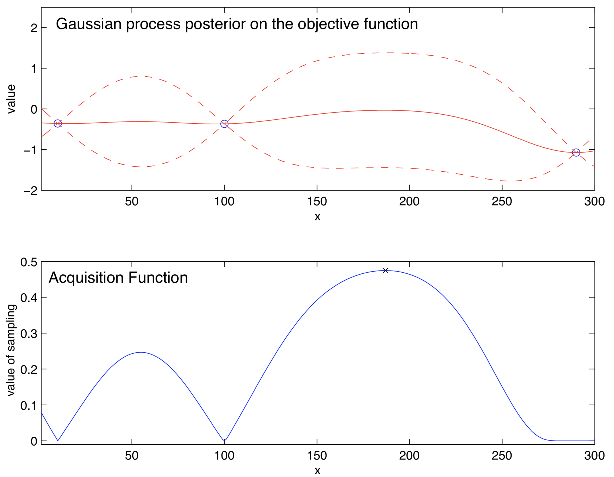
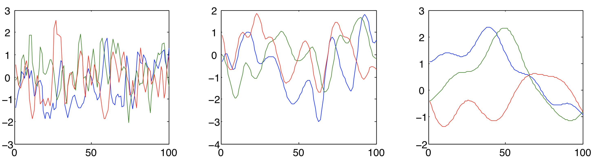
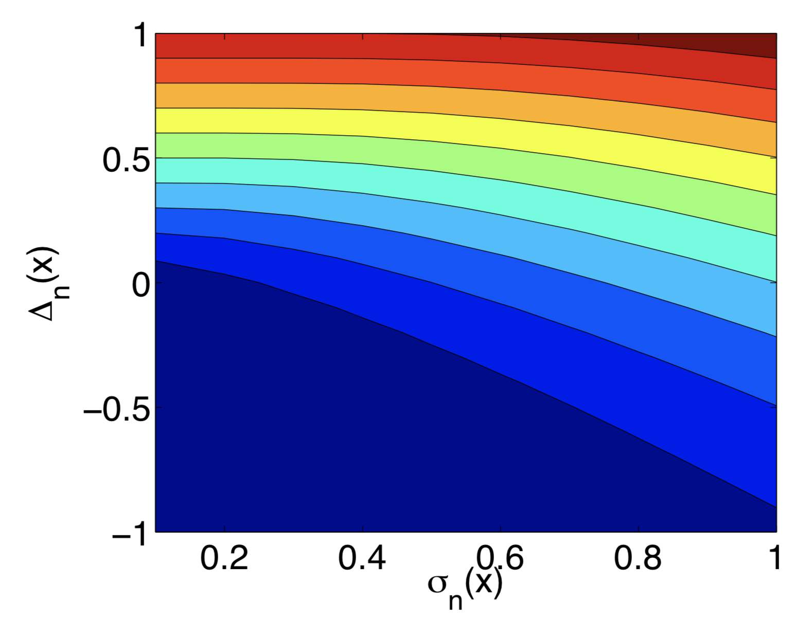

# ベイズ最適化のチュートリアル

> 原題: A Tutorial on Bayesian Optimization
> 著者: Peter I. Frazier（Cornell University）
> 出典: arXiv:1807.02811（2018）

> 注: 本翻訳は **本文 §1〜7 のみ**を一文ずつ訳出する（ユーザーは appendix 指定なし）。Acknowledgments・References は対象外。図は ar5iv 原典から `raw/assets/2018-bayesian-optimization-tutorial/` にローカル保存して該当位置に引用する。数式は LaTeX を保持。文献参照記号は省略。

## Abstract（要旨）

ベイズ最適化は、評価に長い時間（数分〜数時間）を要する目的関数を最適化するアプローチである。

20 次元未満の連続領域での最適化に最も適し、関数評価の確率的ノイズを許容する。

目的関数の代理（サロゲート）を構築し、その代理の不確実性をベイズ機械学習技術であるガウス過程回帰で定量化し、この代理から定義した獲得関数（acquisition function）を使って次にどこをサンプリングするか決める。

本チュートリアルでは、ガウス過程回帰と 3 つの一般的な獲得関数——期待改善（expected improvement）、エントロピー探索（entropy search）、知識勾配（knowledge gradient）——を含め、ベイズ最適化の仕組みを述べる。

次に、複数の関数評価を並列実行すること、多忠実度（multi-fidelity）・多情報源最適化、評価が高コストな制約、ランダムな環境条件、マルチタスクベイズ最適化、導関数情報の取り込みといった、より高度な技法を論じる。

最後にベイズ最適化ソフトウェアと、この分野の今後の研究方向の議論で締めくくる。本チュートリアル内では、期待改善のノイズあり評価への一般化を、（より一般的に適用されるノイズなし設定を超えて）提供する。この一般化は形式的な決定理論的議論で正当化され、従来の場当たり的な修正とは対照的である。

## 1 Introduction（はじめに）

ベイズ最適化（BayesOpt）は、次の問題を解くことに焦点を当てた機械学習ベースの最適化手法のクラスである。

$$
\max_{x\in A}f(x),
$$

ここで実行可能集合と目的関数は典型的に次の性質を持つ。

- 入力 $x$ は $\mathbb{R}^{d}$（$d$ はあまり大きくない。成功する応用の多くで $d\leq 20$）。
- 実行可能集合 $A$ は単純な集合で、所属判定が容易（典型的にハイパー矩形か $d$ 次元単体）。後述（§5）でこの仮定を緩める。
- 目的関数 $f$ は連続（ガウス過程回帰でモデル化するのに通常必要）。
- $f$ は「評価が高コスト」——実行できる評価回数が限られる（典型的に数百回）。各評価に多大な時間（典型的に数時間）がかかる、あるいは金銭的・機会コストを伴うため。
- $f$ は凹性や線形性のような既知の特殊構造を欠く（＝「ブラックボックス」）。
- $f$ を評価しても $f(x)$ のみ観測し、1 階・2 階導関数は観測しない（＝「導関数フリー」）。これが勾配降下・ニュートン法・準ニュートン法の適用を妨げる。
- 記事の大半で $f(x)$ はノイズなしで観測されると仮定する。後述（§5）でノイズを許す。ほぼ全研究でノイズは評価間で独立・定分散ガウスと仮定される。
- 局所最適でなく大域最適を見つけることに焦点を当てる。

これらを「BayesOpt はブラックボックス・導関数フリー・大域最適化のために設計される」と要約する。

高コストなブラックボックス導関数フリー関数を最適化できる能力は BayesOpt を極めて多用途にする。近年、機械学習アルゴリズム（特に深層ニューラルネット）のハイパーパラメータ調整で非常に人気になった。より長い期間では 1960 年代から工学システムの設計に広く使われてきた。材料・創薬の実験選択、環境モデルの較正、強化学習にも使われている。

BayesOpt は Kushner・Zilinskas・Močkus の研究に始まり、Efficient Global Optimization（EGO）アルゴリズムで普及した後に大きな注目を集めた。多忠実度最適化・多目的最適化・収束率の研究などの革新がこの文献から発展した。BayesOpt が深層ニューラルネットの訓練に有用という観察が機械学習内の関心の急増を引き起こし、マルチタスク最適化・並列手法などの補完的革新が生まれた。ガウス過程回帰、その近縁のクリギング、BayesOpt は離散事象シミュレーションでモデル化されるシステムの最適化のためシミュレーション文献でも研究されてきた。

BayesOpt の外にも高コストな導関数フリーブラックボックス関数を最適化する技法はある。多くは BayesOpt と似た趣を持つ。目的関数をモデル化する代理（サロゲート）を保ち、それを使ってどこを評価するか選ぶ（「サロゲート法」と呼ばれる一般的クラス）。ベイズ最適化はベイズ統計で構築した代理を使い、その代理のベイズ的解釈で評価点を決める点で他のサロゲート法と区別される。

§2 でベイズ最適化アルゴリズムの典型的な形を導入する。この形は 2 つの主要構成要素を含む。統計推論の手法（典型的にガウス過程回帰）と、どこをサンプリングするか決める獲得関数（しばしば期待改善）。これらを §3 と §4.1 で詳述する。続いて 3 つの代替獲得関数——知識勾配（§4.2）、エントロピー探索と予測エントロピー探索（§4.3）——を述べる。これらは上記の厳密な仮定から外れる「エキゾチック」なベイズ最適化問題（§5）で特に有用。§6 でソフトウェアを論じ、§7 で今後の研究方向で締めくくる。

本チュートリアルは非標準（エキゾチック）なベイズ最適化問題のカバー、獲得関数への重点（GP 回帰への重点を減らす）、ノイズあり測定での期待改善の新しい分析、で他のチュートリアルと異なる。

## 2 Overview of BayesOpt（BayesOpt の概観）

BayesOpt は 2 つの主要構成要素から成る。目的関数をモデル化するベイズ統計モデルと、次にどこをサンプリングするか決める獲得関数。初期の空間充填的な実験計画（しばしば一様ランダム点）に従って目的を評価した後、これらを反復的に使い、残りの $N$ 回の関数評価の予算を配分する（アルゴリズム 1）。

**アルゴリズム1（ベイズ最適化の基本擬似コード）**:
1. $f$ にガウス過程事前分布を置く。
2. 初期の空間充填実験計画に従って $n_{0}$ 点で $f$ を観測。$n=n_{0}$ とする。
3. $n\leq N$ の間: 利用可能な全データで $f$ の事後確率分布を更新し、現在の事後分布で計算した獲得関数を $x$ について最大化する点 $x_{n}$ を求め、$y_{n}=f(x_{n})$ を観測し、$n$ を増やす。
4. 解を返す: 観測した中で最大の $f(x)$ を持つ点、または事後平均が最大の点。

統計モデル（不変にガウス過程）は、候補点 $x$ での $f(x)$ の取り得る値を記述するベイズ事後確率分布を与える。新点で $f$ を観測するたびこの事後分布が更新される。獲得関数は、現在の $f$ の事後分布に基づき、新点 $x$ での評価が生む価値を測る。

GP 回帰と期待改善を使った 1 反復を図 1 に示す。上段は 3 点でのノイズなし観測（青丸）と GP 回帰の出力。GP 回帰は各 $f(x)$ に平均 $\mu_{n}(x)$・分散 $\sigma^{2}_{n}(x)$ の正規分布の事後分布を生む。図では $\mu_{n}(x)$ が赤実線、95% ベイズ信用区間 $\mu_{n}(x)\pm 1.96\sigma_{n}(x)$ が赤破線。平均は $f(x)$ の点推定、信用区間は頻度論の信頼区間のように働き、事後分布で 95% の確率で $f(x)$ を含む。平均は既評価点を内挿し、信用区間はそこで幅 0、離れると広がる。

<figure>

<figcaption>図1: 1 次元連続入力の目的関数 f を最大化する BayesOpt の例示。上段: 3 点でのノイズなし観測（青）、f(x) の推定（赤実線）、ベイズ信用区間（赤破線）——いずれも GP 回帰で得る。下段: 獲得関数。ベイズ最適化は獲得関数を最大化する点（×印）を次にサンプリングする。</figcaption>
</figure>

下段は対応する期待改善獲得関数。既評価点で値 0 を取る（ノイズなしではそこを評価しても情報がないため）。信用区間が大きい点（不確実性が高い点）や事後平均が大きい点で大きくなる傾向がある。

## 3 Gaussian Process (GP) Regression（ガウス過程回帰）

GP 回帰は関数をモデル化するベイズ統計的アプローチである。ここでは簡単な導入を示す（完全な扱いは Rasmussen の教科書）。

まず有限個の点 $x_{1},\ldots,x_{k}\in\mathbb{R}^{d}$ での $f$ の値に注目する。関数値をベクトル $[f(x_{1}),\ldots,f(x_{k})]$ にまとめる。ベイズ統計で未知の量があるとき、それが何らかの事前確率分布から自然によって無作為に引かれたと仮定する。GP 回帰はこの事前分布を、特定の平均ベクトルと共分散行列を持つ多変量正規分布とする。

平均ベクトルは平均関数 $\mu_{0}$ を各 $x_{i}$ で評価して構成する。共分散行列は共分散関数（カーネル）$\Sigma_{0}$ を各点対 $x_{i},x_{j}$ で評価して構成する。カーネルは、入力空間で近い点 $x_{i},x_{j}$ が大きい正の相関を持つよう選ぶ（近い点は似た関数値を持つべきという信念をエンコード）。カーネルは結果の共分散行列が正定値になる性質も持つべき。

$[f(x_{1}),\ldots,f(x_{k})]$ の事前分布は

$$
f(x_{1:k})\sim\mathrm{Normal}\left(\mu_{0}(x_{1:k}),\Sigma_{0}(x_{1:k},x_{1:k})\right).
$$

$f(x_{1:n})$ をノイズなしで観測し、新点 $x$ での $f(x)$ を推論したいとする。$k=n+1$, $x_{k}=x$ とし、ベイズ則で条件付き分布を計算する。

$$
\begin{split}f(x)|f(x_{1:n})&\sim\mathrm{Normal}(\mu_{n}(x),\sigma^{2}_{n}(x))\\
\mu_{n}(x)&=\Sigma_{0}(x,x_{1:n})\Sigma_{0}(x_{1:n},x_{1:n})^{-1}\left(f(x_{1:n})-\mu_{0}(x_{1:n})\right)+\mu_{0}(x)\\
\sigma^{2}_{n}(x)&=\Sigma_{0}(x,x)-\Sigma_{0}(x,x_{1:n})\Sigma_{0}(x_{1:n},x_{1:n})^{-1}\Sigma_{0}(x_{1:n},x).\end{split}
$$

この条件付き分布が事後確率分布。事後平均 $\mu_{n}(x)$ は事前 $\mu_{0}(x)$ とデータに基づく推定の加重平均、事後分散 $\sigma_{n}^{2}(x)$ は事前共分散から観測で除かれた分散を引いたもの。

数値安定性のため、直接の行列反転でなく Cholesky 分解で線形方程式系を解くのが通常速く安定。$\Sigma_{0}(x_{1:n},x_{1:n})$ の対角に小さい正数（$10^{-6}$ 等）を足すと固有値が 0 に近づくのを防げる（近接点があるとき特に有用）。

有限点でモデル化したが、連続領域 $A$ でも同じアプローチが使える。形式的に、平均関数 $\mu_{0}$・カーネル $\Sigma_{0}$ のガウス過程は、任意の点集合 $x_{1:k}$ で $f(x_{1:k})$ の周辺分布が上式で与えられる、関数 $f$ 上の確率分布である。複数の未評価点での条件付き分布も計算でき、結果は多変量正規（平均関数とカーネルを持つガウス過程）になる。

### 3.1 Choosing a Mean Function and Kernel（平均関数とカーネルの選択）

カーネルは典型的に、入力空間で近い点ほど強く相関する性質を持つ（$\|x-x'\|<\|x-x''\|$ なら $\Sigma_{0}(x,x')>\Sigma_{0}(x,x'')$）。また正定値関数である必要がある。2 つの例カーネルを述べる。

よく使われる単純なカーネルは**べき指数（ガウス）カーネル**:

$$
\Sigma_{0}(x,x^{\prime})=\alpha_{0}\exp\left(-\|x-x^{\prime}\|^{2}\right),
$$

ここで $\|x-x'\|^{2}=\sum_{i=1}^{d}\alpha_{i}(x_{i}-x'_{i})^{2}$、$\alpha_{0:d}$ はカーネルのパラメータ。図 2 は $\alpha_{1}$ の値を変えたガウス過程事前分布からの 1 次元入力ランダム関数で、$f(x)$ が $x$ とともにどれだけ速く変わるかの異なる信念を作る。

<figure>

<figcaption>図2: べき指数カーネルのガウス過程事前分布から引いたランダム関数 f。各プロットはパラメータ α₁ の異なる値に対応（左から右へ減少）。このパラメータが f(x) の変化の速さの信念を決める。</figcaption>
</figure>

もう 1 つよく使われるのは **Matérn カーネル**:

$$
\Sigma_{0}(x,x^{\prime})=\alpha_{0}\frac{2^{1-\nu}}{\Gamma(\nu)}\left(\sqrt{2\nu}\|x-x^{\prime}\|\right)^{\nu}K_{\nu}(\sqrt{2\nu}\|x-x^{\prime}\|),
$$

ここで $K_{\nu}$ は変形ベッセル関数、$\nu$ は $\alpha_{0:d}$ に加わるパラメータ。

平均関数の最も一般的な選択は定数 $\mu_{0}(x)=\mu$。$f$ にトレンドや応用固有のパラメトリック構造があると思われるとき、$\mu_{0}(x)=\mu+\sum_{i=1}^{p}\beta_{i}\Psi_{i}(x)$（$\Psi_{i}$ はパラメトリック関数、しばしば低次多項式）とも取れる。

### 3.2 Choosing Hyperparameters（ハイパーパラメータの選択）

平均関数とカーネルはパラメータを含む。これらを事前分布のハイパーパラメータと呼び、ベクトル $\eta$ で示す（例: Matérn カーネル＋定数平均なら $\eta=(\alpha_{0:d},\nu,\mu)$）。

3 つのアプローチが典型的に考えられる。第 1 は**最尤推定（MLE）**: 観測 $f(x_{1:n})$ の事前分布下の尤度 $P(f(x_{1:n})|\eta)$（多変量正規密度）を最大化する $\hat{\eta}=\arg\max_{\eta}P(f(x_{1:n})|\eta)$。

第 2 は、ハイパーパラメータ $\eta$ 自体が事前分布 $P(\eta)$ から選ばれたと考え、**最大事後（MAP）推定** $\hat{\eta}=\arg\max_{\eta}P(f(x_{1:n})|\eta)P(\eta)$ で推定する。MLE は $P(\eta)$ を定数密度にした MAP の特殊ケース。MAP は MLE が不合理な値を推定する場合（速すぎる/遅すぎる変化、図 2 参照）に有用で、妥当な値に重みを置く事前分布を選ぶことで応用によりよく対応できる。事前分布の一般的選択は一様・正規・対数正規・切断正規。

第 3 は**完全ベイズアプローチ**: ハイパーパラメータの全値で周辺化した $f(x)$ の事後分布を計算する。

$$
P(f(x)=y|f(x_{1:n}))=\int P(f(x)=y|f(x_{1:n}),\eta)P(\eta|f(x_{1:n}))\,d\eta.
$$

この積分は通常扱いにくいが、$P(\eta|f(x_{1:n}))$ から MCMC（例: slice sampling）でサンプリングした $\hat{\eta}_{j}$ で近似できる。MAP 推定は、事後を最大値の点質量で近似する完全ベイズ推論の近似と見なせる。

## 4 Acquisition Functions（獲得関数）

ガウス過程を概観したので、アルゴリズム 1 のループで使う獲得関数に戻る。ノイズなし評価の「標準」問題に注目し、ノイズあり・並列・導関数・他の「エキゾチック」拡張は §5 で論じる。

最も一般的なのは期待改善で、§4.1 で最初に論じる（性能がよく使いやすい）。次に知識勾配（§4.2）、エントロピー探索と予測エントロピー探索（§4.3）。これら代替獲得関数は、「サンプリングの主な便益はサンプル点での改善を通じて生じる」という期待改善の仮定が成り立たないエキゾチック問題で最も有用。

### 4.1 Expected Improvement（期待改善）

期待改善獲得関数は思考実験で導かれる。アルゴリズム 1 で (1) を解いており、$x_{n}$ は反復 $n$ でサンプリングした点、$y_{n}$ は観測値とする。最終解として評価済みの点しか返せないとし、今、残りの評価がなく既評価点から解を返さねばならないとする。ノイズなしで $f$ を観測するので、最適選択は最大の観測値を持つ既評価点。その値を $f^{*}_{n}=\max_{m\leq n}f(x_{m})$ とする。

今、追加で 1 回評価でき、どこでも評価できるとする。$x$ で評価すると $f(x)$ を観測する。この後、最良観測点の値は $f(x)$（$f(x)\geq f^{*}_{n}$ なら）か $f^{*}_{n}$（そうでないなら）。最良観測点の値の改善は $[f(x)-f^{*}_{n}]^{+}$（$a^{+}=\max(a,0)$ は正部分）。

$f(x)$ は評価まで未知なので、この改善の期待値を取り、それを最大化する $x$ を選ぶ。期待改善を次で定義する。

$$
\mathrm{EI}_{n}(x):=E_{n}\left[[f(x)-f^{*}_{n}]^{+}\right],
$$

$E_{n}[\cdot]=E[\cdot|x_{1:n},y_{1:n}]$ は $x_{1},\ldots,x_{n}$ での評価が与えられた事後分布下の期待値。$f(x)$ は平均 $\mu_{n}(x)$・分散 $\sigma^{2}_{n}(x)$ の正規分布。期待改善は部分積分で閉形式で評価できる。

$$
\mathrm{EI}_{n}(x)=[\Delta_{n}(x)]^{+}+\sigma_{n}(x)\varphi\left(\frac{\Delta_{n}(x)}{\sigma_{n}(x)}\right)-|\Delta_{n}(x)|\Phi\left(\frac{\Delta_{n}(x)}{\sigma_{n}(x)}\right),
$$

ここで $\Delta_{n}(x):=\mu_{n}(x)-f^{*}_{n}$ は提案点 $x$ と従来最良の品質の期待差。期待改善アルゴリズムは $x_{n+1}=\arg\max\mathrm{EI}_{n}(x)$ で評価する（Močkus が最初に提案、EGO として普及）。

$\mathrm{EI}_{n}(x)$ は評価が安価で 1 階・2 階導関数も容易なので、連続最適化法（例: L-BFGS-B）で解ける。図 3 は $\Delta_{n}(x)$ と事後標準偏差 $\sigma_{n}(x)$ での $\mathrm{EI}_{n}(x)$ の等高線。EI は両方について増加し、**高い期待品質（高 $\Delta_{n}$）と高い不確実性（高 $\sigma_{n}$）の間のトレードオフ**を取る。前者は良い大域最適がそこにありそうだから、後者は知識の少ない遠方で学べるから価値がある。

<figure>

<figcaption>図3: 期待改善 EI(x) の等高線。Δₙ(x)（提案点と従来最良点の品質の期待差）と事後標準偏差 σₙ(x) で表す。青が小・赤が大。EI は両方について増加し、等 EI 曲線が「高期待品質 vs 高不確実性」の暗黙のトレードオフを定義する。</figcaption>
</figure>

この「高期待性能 vs 高不確実性」のトレードオフは多腕バンディットや強化学習にも現れ、しばしば「探索 vs 活用（exploration vs exploitation）トレードオフ」と呼ばれる。

### 4.2 Knowledge Gradient（知識勾配）

知識勾配（KG）獲得関数は、EI 導出で置いた「最終解として評価済み点しか返せない」という仮定を見直して導かれる。ノイズなしで非常にリスク回避的なら妥当だが、リスクを許容するなら不確実性のある最終解を報告してもよいかもしれない。ノイズありなら最終解は必然的に不確実な価値を持つ。

この仮定を、**意思決定者が評価済みでなくても任意の解を返せる**と置き換え、リスク中立（期待値で評価）も仮定する。$n$ サンプル後に止めるなら最大 $\mu_{n}(x)$ の点 $\widehat{x^{*}}$ を選び、その条件付き期待値は $\mu^{*}_{n}=\max_{x'}\mu_{n}(x')$。$x$ で 1 サンプル追加すると新事後平均 $\mu_{n+1}(\cdot)$ が得られ、報告解の期待値は $\mu^{*}_{n+1}=\max_{x'}\mu_{n+1}(x')$。サンプリングによる条件付き期待解価値の増加は $\mu^{*}_{n+1}-\mu^{*}_{n}$。

サンプル前は未知なので、観測を所与にその期待値を計算する。これを $x$ で測る知識勾配と呼ぶ。

$$
\mathrm{KG}_{n}(x):=E_{n}\left[\mu^{*}_{n+1}-\mu^{*}_{n}\,|\,x_{n+1}=x\right].
$$

KG を獲得関数とし $\arg\max_{x}\mathrm{KG}_{n}(x)$ をサンプリングする。KG はシミュレーションで計算でき（アルゴリズム 2: $y_{n+1}$ をサンプリングし新事後平均の最大 $\mu^{*}_{n+1}$ を計算、$\mu^{*}_{n}$ を引く、を $J$ 回平均）、より効率的にはマルチスタート確率的勾配上昇法（アルゴリズム 3）で最適化する。確率的勾配は無限小摂動解析と包絡定理で得る（アルゴリズム 4）。

EI が**サンプル点での事後のみ**を考えるのに対し、KG は **$f$ の全域の事後とサンプルがそれをどう変えるか**を考える。事後平均の最大が改善する測定に正の価値を置く（サンプル点の値が従来最良を超えなくても）。標準問題ではわずかな利得だが、ノイズあり・多忠実度・導関数観測・環境条件積分などのエキゾチック問題で大きく EI を上回る。

### 4.3 Entropy Search and Predictive Entropy Search（エントロピー探索と予測エントロピー探索）

エントロピー探索（ES）獲得関数は、大域最大の位置に関する情報を微分エントロピーで価値づけ、微分エントロピーの減少が最大になる評価点を求める（小さい微分エントロピー＝不確実性が小さい）。予測エントロピー探索（PES）は同じ点を求めるが、相互情報量に基づくエントロピー減少目的の再定式化を使う。ES と PES の厳密計算は等価だが、厳密計算は通常不可能で、近似計算法の違いが実際のサンプリング決定の違いを生む。

$x^{*}$ を $f$ の大域最適とする。時刻 $n$ の事後分布は $x^{*}$ の確率分布を誘導する。$x$ をサンプリングするエントロピー減少は

$$
\mathrm{ES}_{n}(x)=H(P_{n}(x^{*}))-E_{f(x)}\left[H(P_{n}(x^{*}|f(x)))\right].
$$

KG 同様、ES/PES は測定が全域の事後をどう変えるかに影響され、エキゾチック問題で EI に対し大きな価値を提供しうる。ES は近似計算・最適化が難しい（最大値のエントロピーが閉形式でない、多数の $y$ で計算が必要、最適化が困難）。

PES は (11) の代替計算を提供する。$f(x)$ の測定による $x^{*}$ のエントロピー減少が、$f(x)$ と $x^{*}$ の相互情報量に等しく、それが $x^{*}$ の測定による $f(x)$ のエントロピー減少に等しいことに着目する。

$$
\mathrm{PES}_{n}(x)=\mathrm{ES}_{n}(x)=H(P_{n}(f(x)))-E_{x^{*}}\left[H(P_{n}(f(x)|x^{*}))\right].
$$

ES と違い PES の第 1 項 $H(P_{n}(f(x)))$ は閉形式で計算でき、第 2 項は $x^{*}$ をサンプリングし期待値伝播で近似する。

### 4.4 Multi-Step Optimal Acquisition Functions（多段最適獲得関数）

(1) を解く行為は逐次意思決定問題と見なせる。$x_{n}$ を逐次選び $y_{n}=f(x_{n})$ を観測し、最後に報酬（最良観測値、新点での値、$x^{*}$ の事後エントロピーなど）を受ける。EI/KG/ES/PES は $N=n+1$ のとき（期待報酬最大化の意味で）最適だが、$N>n+1$ では明らかには最適でない。一般の $N$ で期待報酬を最大化する多段最適獲得関数は確率的動的計画で計算可能だが、次元の呪いで実際の計算は極めて困難。

近年、近似法が現れ始めたが、近似に伴う誤差・追加コストが多段考慮の便益を上回ることが多く、まだ広く実用展開できる状態にない。一方、特定の関連設定（ベイズ実行可能性判定、1 次元確率的求根）では多段最適アルゴリズムを計算でき、驚くべきことに既存の獲得関数が多段最適にほぼ匹敵する（KG は最適の 98% 以内、ES は設定によっては多段最適）。1 段獲得関数が十分最適に近いのか、未発見の重要設定で多段最適が大きく勝るのかは未解明。

## 5 Exotic Bayesian Optimization（エキゾチックなベイズ最適化）

上記は §1 の「標準」問題（所属判定が容易な実行可能集合、導関数なし、ノイズなし評価）の方法論。これらの仮定の 1 つ以上が破れる問題を「エキゾチック」と呼ぶ。

**ノイズあり評価**　GP 回帰は既知分散の独立正規ノイズに自然に拡張でき、(3) の共分散行列に分散の対角項を足す。実際は分散が未知なので共通分散をハイパーパラメータに含めるのが一般的。KG/ES/PES はノイズ設定に直接適用でき 1 段最適性を保つ。EI は「改善」の定義が難しく $f(x)$ が観測されないため概念的課題があり、ヒューリスティックな代替が使われる。ノイズが大きいと KG が EI を大きく上回りうる。代替として、報告解を評価済み点に制限した 1 段最適サンプリング（KGCP, EI のノイズあり一般化として最も自然）がある。

**並列評価**　複数計算資源で並列評価すると、逐次で 1 回かかる時間で複数評価を得られる。EI/KG/ES/PES は並列に拡張でき、例えば EI は $\mathrm{EI}_{n}(x^{(1:q)})=E_{n}[[\max_{i}f(x^{(i)})-f^{*}_{n}]^{+}]$（複数点を同時最大化）。最適化は逐次版より難しく、Constant Liar 近似や無限小摂動解析による確率的勾配（最大 $q=128$ 並列）が使われる。

**制約**　$g_{i}$ が $f$ と同程度に高コストな制約 $g_{i}(x)\geq 0$ 付き最大化。EI は、評価点が実行可能（全 $g_{i}\geq 0$）かつ $f(x)$ が従来最良実行可能点より良いとき改善とする形で自然に一般化。PES もこの設定で研究されている。

**多忠実度・多情報源評価**　単一目的でなく忠実度 $s$ で添字付けた情報源 $f(x,s)$ の集まりを持つ（低 $s$ ほど高忠実・高コスト、$f(x,0)$ が元の目的）。例: 工学系の設計でメッシュサイズ、NN 訓練の反復数/データ量。$\max_x f(x,0)$ を、総コスト予算内で $f(x,s)$ を観測して解く。多情報源最適化では $f(\cdot,s)$ が精度・コストで順序付くという仮定を外す。EI は $s\neq 0$ で改善を与えないため直接適用が難しく、KG/ES/PES は直接適用できる。

**ランダム環境条件・マルチタスクベイズ最適化**　$\max_x\int f(x,w)p(w)\,dw$ や $\max_x\sum_w f(x,w)p(w)$（多忠実度に近い）。統計では「ランダム環境条件下の最適化」、機械学習では「マルチタスクベイズ最適化」。目的全体を評価単位にせず、関心ある $x$ で少数の $w$ で $f(x,w)$ を評価する方が、近い $x$ の観測を活用でき効率的。工学・生物医学設計（人工関節、心血管バイパス）や機械学習の交差検証性能最適化（$w$ がフォールド）で生じる。KG/PES/EI の修正が使われる。

**導関数観測**　$\nabla f(x)$ の観測（任意にノイズあり）を GP 回帰に直接取り込める。EI は導関数観測の追加で値が変わらないため導関数情報を活用しない。KG 法はこの問題を緩和する。導関数は GP 回帰の共分散行列の条件数改善にも使われる。

## 6 Software（ソフトウェア）

GP 回帰とベイズ最適化のコードは多様。GP 回帰パッケージと一緒に開発される BayesOpt パッケージもあれば、単独のものもある。主要なもの: DiceKriging/DiceOptim（R）、GPyOpt（GPy ベースの Python）、Metric Optimization Engine（MOE, C++/Python, GPU 対応。Cornell MOE は並列・導関数対応 KG をサポート）、Spearmint（Python）、DACE（MATLAB）、GPFlow / GPyTorch（TensorFlow / PyTorch ベースの GP 回帰）、laGP（R, 不等式制約対応）。

## 7 Conclusion and Research Directions（結論と研究方向）

ベイズ最適化を導入し、GP 回帰、期待改善・知識勾配・エントロピー探索・予測エントロピー探索の獲得関数、そしてノイズあり・並列・制約・多忠実度/多情報源・ランダム環境条件/マルチタスク・導関数観測といったエキゾチック問題を論じた。

多くの研究方向がある。第 1 に、ベイズ最適化のより深い理論的理解（多段最適アルゴリズム、有限時間限界、収束率）。第 2 に、ガウス過程以外の新しい統計的アプローチを活用する手法。第 3 に、高次元でうまく働く手法（高次元目的の構造を特定・活用する統計手法、新しい獲得関数）。第 4 に、今日の手法が考慮しないエキゾチックな問題構造を活用する手法。第 5 に、化学・化学工学・材料設計・創薬など、繰り返しの物理実験が年単位・多大な費用を要する分野への応用による大きなインパクト。
