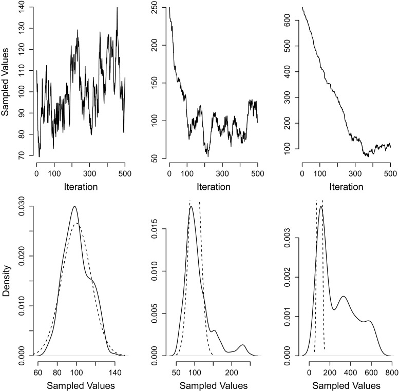
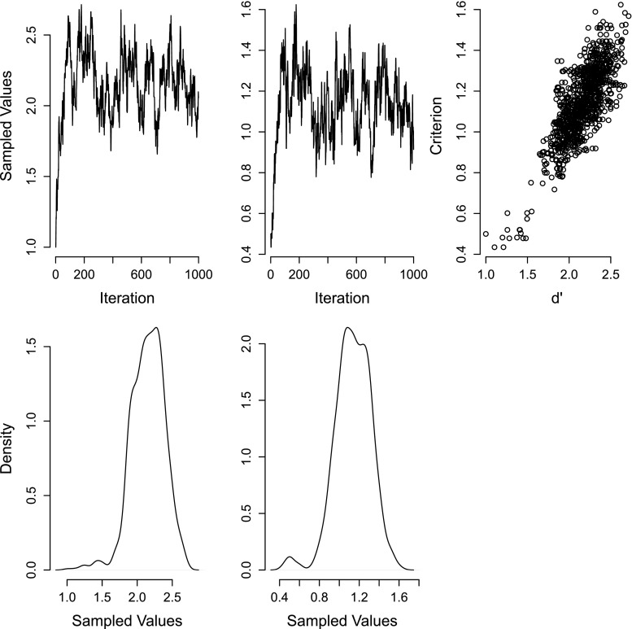
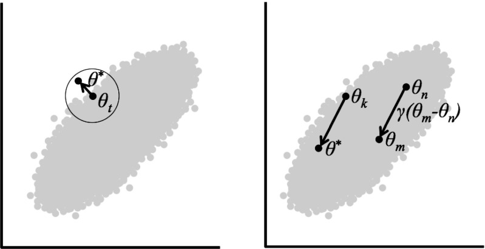

# マルコフ連鎖モンテカルロ・サンプリングへの簡単な入門

> 原題: A simple introduction to Markov Chain Monte–Carlo sampling
> 著者: Don van Ravenzwaaij, Pete Cassey, Scott D. Brown
> 出典: Psychonomic Bulletin & Review（2018）, PMC5862921

## Abstract（要旨）

マルコフ連鎖モンテカルロ（Markov Chain Monte–Carlo, MCMC）は、分布についての情報を得るための、特にベイズ推論（Bayesian inference）における事後分布（posterior distribution）の推定のための、ますます人気のある手法である。本稿は MCMC サンプリングへの非常に基礎的な入門を提供する。MCMC とは何か、それが何に使えるかを、単純な例示とともに記述する。MCMC サンプリングの利点と限界のいくつか、ならびに認知科学者を最も悩ませそうな限界を回避するためのさまざまなアプローチを強調する。

**キーワード:** マルコフ連鎖モンテカルロ, MCMC, ベイズ推論, チュートリアル

---

21世紀の間に、マルコフ連鎖モンテカルロ・サンプリング、すなわち *MCMC* の使用は劇的に増加してきた。しかし、MCMC とは正確には何なのか？ そしてなぜその人気はこれほど急速に高まっているのか？ これらの問いに取り組み、MCMC への優れた入門を提供する他のチュートリアル記事は多くある。本稿の目的はそれらを複製することではなく、ごく初学の研究者にもアクセスしやすいはずの、より基礎的な入門を提供することである。より詳細、またはより上級の扱いに関心のある読者は、認知科学に焦点を当てた Lee（[^12]）や Kruschke（[^10]）による本書、あるいは Gilks ら（[^7]）によるより技術的な解説を参照されたい。

MCMC はコンピュータ駆動のサンプリング手法である（Gamerman and Lopes [^5]; Gilks et al. [^7]）。それは、分布の数学的性質をすべて知らなくても、分布から値をランダムにサンプリングすることで分布を特徴づけることを可能にする。MCMC の特に強力な点は、分布について分かっているのが「異なるサンプルに対して密度をどう計算するか」だけであっても、その分布からサンプルを引くのに使えることである。MCMC という名前は2つの性質を組み合わせている: *モンテカルロ（Monte–Carlo）* と *マルコフ連鎖（Markov chain）* である。[^1] モンテカルロは、分布からのランダムなサンプルを調べることで分布の性質を推定する手法である。例えば、正規分布の平均を分布の方程式から直接計算する代わりに、モンテカルロのアプローチは、正規分布から多数のランダムなサンプルを引き、それらの標本平均を計算することである。モンテカルロのアプローチの利点は明らかである: 大量の数の平均を計算することは、正規分布の方程式から平均を直接計算するよりはるかに容易になりうる。この利点は、ランダムなサンプルが引きやすく、分布の方程式が他の方法では扱いにくいときに最も顕著になる。MCMC のマルコフ連鎖の性質は、ランダムなサンプルが特別な逐次的プロセスによって生成されるという考えである。各ランダムサンプルは、次のランダムサンプルを生成するための踏み石として使われる（ゆえに *連鎖*）。連鎖の特別な性質は、各新しいサンプルが直前のサンプルに依存する一方、新しいサンプルは直前より前のどのサンプルにも依存*しない*ことである（これが「マルコフ」性）。

MCMC は、解析的な検討では扱いにくいことの多い事後分布に焦点が当たるため、ベイズ推論において特に有用である。これらの場合、MCMC は、直接計算できない事後分布の側面（例: 事後分布からのランダムサンプル、事後平均など）をユーザーが近似することを可能にする。ベイズ推論は、（一連の）パラメータについて観測データが提供する情報、正式には *尤度（likelihood）* を使って、（一連の）パラメータについての *事前（prior）* の信念の状態を、（一連の）パラメータについての *事後（posterior）* の信念の状態へと更新する。正式には、ベイズ則は次のように定義される

$$
p(\mu\mid D)\propto p(D\mid\mu)\,p(\mu) \tag{1}
$$

ここで *μ* は関心のある（一連の）パラメータ、*D* はデータを示し、*p*(*μ* | *D*) は事後または「データが与えられたときの *μ* の確率」、*p*(*D* | *μ*) は尤度または「*μ* が与えられたときのデータの確率」、*p*(*μ*) は事前または「*μ* のア・プリオリな確率」を示す。記号 ∝ は「に比例する」を意味する。

このプロセスについてのより多くの情報は Lee（[^12]）、Kruschke（[^10]）、または本特集の他の箇所にある。この解説にとって重要な点は、データが事前の信念を更新する仕方が、関心のあるパラメータの特定の（一連の）値が与えられたときのデータの尤度を調べることによる、ということである。理想的には、この尤度をパラメータ値のすべての組み合わせについて評価したい。この尤度の解析的表現が利用可能なら、それを事前分布と組み合わせて事後分布を解析的に導ける。実際にはしばしば、そのような解析的表現にアクセスできない。ベイズ推論では、この問題は MCMC で解かれることが最も多い: 事後分布から一連のサンプルを引き、その平均・範囲などを調べるのである。

ベイズ推論は MCMC の力から大いに恩恵を受けてきた。心理学の領域だけでも、MCMC は、ベイズモデル比較（Scheibehenne et al. [^17]）、記憶保持（Shiffrin et al. [^18]）、信号検出理論（Lee [^11]）、超感覚的知覚（Wagenmakers et al. [^28]）、多項処理木（Matzke et al. [^13]）、リスクテイキング（van Ravenzwaaij et al. [^24]）、ヒューリスティックな意思決定（van Ravenzwaaij et al. [^25]）、霊長類の意思決定（Cassey et al. [^4]）を含む、膨大な範囲の研究パラダイムに応用されてきた。

MCMC は抽象的に記述されると複雑に聞こえるかもしれないが、その実践的な実装は非常に単純でありうる。次の節は、MCMC の直截的な性質を示す単純な例を提供する。

## 例: クラス内テスト

ある講師が学生集団のテスト得点の平均を学ぶことに関心があるとする。平均テスト得点は未知だが、講師は得点が標準偏差15の正規分布に従うことを知っている。これまでに、講師は1人の学生のテスト得点 100 を観測した。MCMC を使って *目標分布（target distribution）*、この場合は事後分布——この1つの観測が与えられたときの母平均の各可能な値の確率を表す——からサンプルを引ける。これは、事後分布に解析的表現（*N*(100,15)）があるので過度に単純化された例だが、その目的は MCMC を例示することである。

テスト得点の分布からサンプルを引くために、MCMC は初期推測から始める: 分布からもっともらしく引かれるかもしれない、ただ1つの値である。この初期推測が110だとする。次に、この初期推測から新しいサンプルの連鎖を生成するために MCMC が使われる。各新しいサンプルは2つの単純なステップで生成される: 第一に、直近のサンプルに小さなランダムな摂動を加えることで新しいサンプルの *提案（proposal）* が作られる。第二に、この新しい提案は、新しいサンプルとして受容されるか、棄却される（その場合は古いサンプルが保持される）。提案を作るためにランダムノイズを加える方法は多くあり、受容と棄却のプロセスにもさまざまなアプローチがある。以下は、*メトロポリス・アルゴリズム（Metropolis algorithm）*（Smith and Roberts [^20]）と呼ばれる非常に単純なアプローチで MCMC を例示する:

1. もっともらしい *開始値（starting value）* から始める。この例では110。
2. 直近のサンプル（110）にランダムノイズを加えて新しい提案を生成する。このランダムノイズは *提案分布（proposal distribution）* から生成され、これは対称でゼロを中心とすべきである。この例では、平均ゼロ・標準偏差5の正規分布の提案分布を使う。つまり新しい提案は、110（直近のサンプル）＋ *N*(0,5) からのランダムサンプルである。これが提案108になったとする。
3. 新しい提案の値での事後分布の高さを、直近のサンプルでの事後分布の高さと比較する。目標分布は平均100（1つの観測の値）・標準偏差15の正規分布なので、これは *N*(100|108,15) を *N*(100|110,15) と比較することを意味する。ここで *N*(*μ* | *x*,*σ*) は事後分布のための正規分布、すなわちデータ *x* と標準偏差 *σ* が与えられたときの値 *μ* の確率を示す。これら2つの確率は、提案と直近のサンプルが目標分布のもとでどれだけもっともらしいかを教えてくれる。
4. 新しい提案が直近のサンプルより高い事後値を持つなら、新しい提案を受容する。
5. 新しい提案が直近のサンプルより低い事後値を持つなら、両方の事後値の高さに等しい確率で、新しい提案を受容するか棄却するかをランダムに選ぶ。例えば、新しい提案値での事後分布が直近のサンプルの事後分布の5分の1の高さなら、20% の確率で新しい提案を受容する。
6. 新しい提案が受容されれば、それが MCMC 連鎖の次のサンプルになる。そうでなければ、MCMC 連鎖の次のサンプルは直近のサンプルの単なるコピーである。
7. これで MCMC の1回の *反復（iteration）* が完了する。次の反復はステップ2に戻って完了する。
8. 十分なサンプルがあれば（例: 500）停止する。いつ十分なサンプルがあるかを決めることは別個の問題で、本節で後述する。

この非常に単純な MCMC サンプリング問題は、統計フリーソフト R（[cran.r-project.org](http://www.cran.r-project.org/) でオンライン入手可能）でわずか数行のコーディングしかかからない。これを行うコードは付録 A にある。このサンプラーを1回実行した結果を図1の左列に示す。これらのサンプルはモンテカルロの目的に使える。例えば、学生集団のテスト得点の平均は、500個のサンプルの標本平均を計算することで推定できる。

<figure>

<figcaption>図1: MCMC の単純な例。左列: 良い開始値（真の分布の最頻値）から始まるサンプリング連鎖。中列: 真の分布の裾の開始値から始まる連鎖。右列: 真の分布から遠い値から始まる連鎖。上段: マルコフ連鎖。下段: サンプル密度。解析的（真の）分布を破線で示す。</figcaption>
</figure>

図1の左上パネルは500回の反復の推移を示す。これがマルコフ連鎖である。サンプルされた値は標本平均100の近くを中心とするが、より稀な値も含む。左下パネルはサンプルされた値の密度を示す。ここでも値は標本平均の周りを中心とし、その標準偏差は真の母標準偏差15に非常に近い（実際、このマルコフ連鎖の標本標準偏差は16.96）。したがって MCMC 法は、比較的少数のランダムサンプルだけで真の母分布の本質を捉えている。

### 限界

MCMC アルゴリズムは、分布について分かっているのが「その尤度をどう計算するか」だけのときに、その分布からサンプルを引く強力な道具を提供する。例えば、得点100が母平均得点100のもとで生じる尤度が、母平均得点150のもとよりどれだけ高いかを計算できる。この手法は、特定の条件が満たされる限り「機能する」（すなわち、サンプリング分布が真に目標分布になる）。第一に、新しい提案を受容/棄却するためにステップ4・5で計算される尤度の値が、目標分布における提案の密度を正確に反映しなければならない。MCMC をベイズ推論に適用するとき、これは計算される値が事後尤度であるか、少なくとも事後尤度に比例する（すなわち、互いに対して計算される尤度の比が正しい）ことを意味する。第二に、提案分布は対称であるべきである（または、非対称な分布を使う場合は、「メトロポリス・ヘイスティングス（Metropolis–Hastings）」アルゴリズムとして知られる修正された受容/棄却ステップが必要）。第三に、初期推測は非常に間違っているかもしれないので、マルコフ連鎖の最初の部分は無視すべきである。これらの初期のサンプルは目標分布から引かれたことが保証されない。マルコフ連鎖の初期部分を無視するプロセスは本節で後述する。

上記の例の MCMC アルゴリズムは、平均ゼロ・標準偏差5の正規分布から提案を引いた。理論的には、どんな対称分布でも同様にうまく機能しただろうが、実際には提案分布の選択がサンプラーの性能を大きく左右しうる。これは、上記の例の提案分布の標準偏差を50のような非常に大きな値に置き換えることで可視化できる。すると提案の多くが目標分布の十分外側になり（例: 負のテスト得点の提案！）、高い *棄却率（rejection rate）* につながる。一方、1のような非常に小さい標準偏差では、サンプラーが開始値から目標分布へ収束するのに多くの反復がかかりうる。また、*局所最大（local maxima）* ——ある値の尤度が近い隣よりは高いがより遠い隣より低い領域——に詰まるリスクもある。

提案分布の幅は、この MCMC アルゴリズムの *チューニングパラメータ（tuning parameter）* と呼ばれることがある。サンプラーの実践的な性能がチューニングパラメータの値に依存しうるという事実は、標準的なメトロポリス・ヘイスティングス・サンプリングアルゴリズムの限界だが、この問題を改善する拡張手法は多くある。例えば、提案分布の幅をデータと分布の性質に適応させる「自動調整（auto-tuning）」アルゴリズムである（概観は Roberts & Rosenthal [^15] を参照）。

第三の条件——初期サンプルは非常に間違っているかもしれないので無視すべきという事実——は、*収束（convergence）* と *burn-in* として知られる問題を扱う。例えば、初期推測が、テスト得点250、あるいは650のような、目標分布から来る可能性が非常に低いものだったとする。これらの値から始まるマルコフ連鎖を図1の中列と右列に示す。図1の中上パネルを調べると、マルコフ連鎖が最初すぐに真の事後分布へ向かって下がることが分かる。わずか80反復後、連鎖は真の母平均を中心とする。さらに極端な開始点を持つ図1の右上パネルを調べると、真の母平均に達するのに必要な反復回数——約300——が、より良い開始点よりずっと大きいことが示される。これら2つの例は、どんなマルコフ連鎖でも最初の数反復が目標分布から引かれたと安全には仮定できないことを明らかにする。例えば、中上パネルの最初の80反復や右上パネルの最初の300反復を含めると、母分布の不正確な反映につながり、それが図1の中下・右下パネルに示される。

この問題を緩和する1つの方法は、より良い開始点を使うことである。事後分布の最頻値に近い開始値は、より速い burn-in とより少ない収束の問題を保証する。実際には事後最頻値の近くの開始点を見つけるのが難しいことがあるが、最尤推定（またはその他の近似）が良い候補の特定に有用でありうる。別のアプローチは複数の連鎖を使うことである。異なる開始値（例: 事前分布からサンプルした開始値）でサンプリングを何度も走らせる。異なる連鎖からのサンプルの分布間の差は、burn-in と収束の問題を示しうる。解の別の要素は初期のサンプル——連鎖の非定常な部分からのサンプル——を除去することである。図1の上段の連鎖を再び調べると、左上の連鎖がある種の平衡に達した（連鎖が「収束した」と言われる）ことが分かる。中上・右上パネルの連鎖も収束するが、それぞれ約80・300反復後である。ここで重要な問題は、収束前のすべてのサンプルが目標分布からのサンプルでは*なく*、破棄しなければならないことである。

連鎖が収束する点を決めることは難しく、MCMC の新規ユーザーにとって混乱の源になることがある。把握すべき burn-in の重要な側面は、その決定が事後的（post-hoc）な性質であること、すなわち burn-in についての決定はサンプリングの後、連鎖を観測した後に行わなければならないことである。保守的であるのが良い考えである: 余分なサンプルを破棄するのは安全である。残りのサンプルが収束した部分からである可能性が最も高いからである。この保守性に対する唯一の制約は、分布の適切な近似を保証するのに十分なサンプルを burn-in 後に持つことである。burn-in を評価するより自動化された、または客観的な方法を望むユーザーは、R̂ 統計量（Gelman and Rubin [^6]）を調べるとよい。

## 認知モデルへの MCMC の適用

私たちはしばしば、行動データから認知モデルのパラメータを推定することに関心がある。序論で述べたように、MCMC 法はベイズの枠組みでのパラメータ推定に優れたアプローチを提供する: 詳細は Lee（[^12]）を参照。そのような認知モデルの例には、応答時間モデル（Brown and Heathcote [^3]; Ratcliff [^14]; Vandekerckhove et al. [^26]）、記憶モデル（Hemmer and Steyvers [^9]; Shiffrin and Steyvers [^19]; Vickers and Lee [^27]）、信号検出理論（SDT; Green & Swets [^8]）に基づくモデルがある。SDT に基づくモデルは、おそらく一部にはその直感的な心理学的魅力と計算の単純さゆえに、認知科学で画期的な歴史を持つ。SDT の計算の単純さは、それを MCMC でパラメータを推定する良い候補にする。

ある記憶研究者が、単純な視覚検出実験からヒットとフォールスアラームの形でデータを得たとする。SDT の枠組みを適用すれば、研究者はデータを記述的（例: ANOVA）な観点ではなくプロセスの観点から理解できる。すなわち、SDT モデルのパラメータを推定すれば、研究者は人々が不確実性のもとでどう意思決定するかへの洞察を得られる。SDT は、不確実性のもとで意思決定するとき、ある特定のパターンが「信号」（例: 霧の夜の道標）である可能性が高いか、単なる「ノイズ」（例: ただの霧）かを決める必要があると仮定する。SDT のパラメータは、人々がただのノイズとノイズの中の意味あるパターンをどう区別するかの理論的理解を提供する: 感度（sensitivity）すなわち *d′* は、ノイズとパターンを区別する個人の能力の尺度を与え、基準（criterion）すなわち *C* は、個人のバイアスの尺度——どのレベルのノイズで彼らがノイズを意味あるパターンと呼ぶ気になるか——を与える。

データから SDT パラメータを推定する1つの方法は、ベイズ推論を使ってそれらのパラメータ上の事後分布を調べることである。SDT モデルは2つのパラメータ（*d′* と *C*）を持つので、事後分布は二変量である。すなわち、事後分布は *d′* と *C* の値のすべての異なる組み合わせ上で定義される。MCMC は、任意の与えられたサンプルの密度を計算できる限り、この二変量事後分布からサンプルを引くことを可能にする。この密度は式 1 で与えられる: SDT パラメータが与えられたときのヒットとフォールスアラームの尤度に、それらの SDT パラメータの事前を掛けたものである。この計算が手元にあれば、*d′* と *C* 上の事後分布から MCMC サンプリングするプロセスは比較的単純で、上記のクラス内テストの例のアルゴリズムからわずかな変更しか要さない。注意すべき第一の変更は、サンプリング連鎖が多変量であること: マルコフ連鎖の各サンプルが2つの値（*d′* 用と *C* 用）を含む。

もう1つの重要な変更は、目標分布がパラメータ上の事後分布であることである。これにより研究者は、*d′* が確かにゼロより大きいか、*C* がバイアスのない値と確かに異なるか、といった推論的な問いに答えられる。目標分布をパラメータ上の事後分布にするには、上のステップ3の尤度比を式 1 を使って計算しなければならない。SDT モデルのためのそのような MCMC サンプラーの単純な動作例は付録 B にある。

これまで出てこなかった SDT の例の重要な側面は、モデルパラメータが相関していることである。言い換えれば、*d′* のパラメータ値の相対的な尤度は、*C* の異なるパラメータ値で異なる。相関したモデルパラメータは理論的には MCMC に問題ないが、実際には大きな困難を引き起こしうる。パラメータ間の相関は、サンプリング連鎖の極めて遅い収束、時には（少なくとも実際的なサンプリング時間内では）非収束につながりうる。MCMC がそのような相関を効率的に扱えるようにする、より洗練されたサンプリングアプローチがある。単純なアプローチが *blocking* である。blocking は特定のパラメータの集合の間でサンプリングを分離することを可能にする。例えば、上記の検出実験が、視覚刺激の質が高い条件と低い条件がある難易度操作を含んでいたとする。異なる条件の中で2つの SDT パラメータの間に強い相関がほぼ確実にある: 各条件の中で、高い *d′* の値は高い *C* の値とともにサンプルされる傾向があり、低い値も同様である。これらの相関からの問題は blocking で減らせる: すなわち、2つの難易度条件のパラメータについて提案・受容・棄却ステップを分離するのである（例: Roberts & Sahu [^16] を参照）。

## 基本的なメトロポリス・ヘイスティングスを超えたサンプリング

メトロポリス・ヘイスティングス・アルゴリズムは非常に単純で、多くの問題に十分強力である。しかし、パラメータが非常に強く相関しているときは、より複雑な MCMC へのアプローチを使うことが有益でありうる。

### ギブスサンプリング

上記の SDT の例のような多変量分布が与えられたとき、ギブスサンプリング（Gibbs sampling; Smith and Roberts [^20]）は、各パラメータのサンプルをそのパラメータの *条件付き分布（conditional distribution）*、すなわち別のパラメータの特定の値が*与えられた*ときのあるパラメータの確率分布から直接引くことで、問題を分解する。このタイプの MCMC の例がギブスサンプリングと呼ばれ、次の段落で前節の SDT の例を使って例示する。より典型的には、ギブスサンプリングはメトロポリスのアプローチと組み合わされ、この組み合わせはしばしば「Metropolis within Gibbs」と呼ばれる。鍵は、多変量の密度に対して各パラメータが別々に扱われること: 提案/受容/棄却ステップがパラメータごとに取られる。このアルゴリズムは、SDT の例に Metropolis within Gibbs がどう使われうるかを示す:

1. *d′* と *C* の両方の開始値を選ぶ。これらの値がそれぞれ1と0.5だとする。
2. 上で述べたメトロポリス・ヘイスティングス・サンプリングの第2ステップと同様に、*d′* の新しい提案を生成する。提案が1.2だとする。
3. *現在の C の値が与えられたとき*、*d′* の現在値より母分布から出た可能性が高ければ、新しい提案を受容する。つまり、*C* の値0.5が与えられたとき、その特定の *C* 値に対して *d′* = 1.2 が1より尤もらしい *d′* の値なら、提案 *d′* = 1.2 を受容する。0.5の *C* が与えられたときの、新しい *d′*（1.2）と現在の *d′*（1）の尤度の比に等しい確率で新しい値を受容する。新しい提案（*d′* = 1.2）が受容されたとする。
4. *C* の新しい提案を生成する。これには第2の提案分布が必要である。この例では平均ゼロ・標準偏差0.1の正規分布の第2の提案分布を使う。*C* の新しい提案が0.6だとする。
5. *現在の d′ の値が与えられたとき*、*C* の値より母分布から出た可能性が高ければ、新しい提案を受容する。つまり、*d′* の値1.2が与えられたとき、その特定の *d′* 値に対して *C* = 0.6 が0.5より尤もらしい *C* の値なら、提案 *C* = 0.6 を受容する。1.2の *d′* が与えられたときの、新しい *C*（0.6）と現在の *C*（0.5）の尤度の比に等しい確率で新しい値を受容する。この場合は *C* の提案（0.6）が棄却されたとする。すると *C* のサンプルは0.5のままである。
6. これで Metropolis within Gibbs サンプリングの1回の反復が完了する。ステップ2に戻って次の反復を始める。

この例の R コードは付録 C にある。このサンプラーを実行した結果を図2に示す。左列と中列はそれぞれ *d′* と *C* の変数を示す。重要なことに、右列は同時事後——二変量分布——からのサンプルを示す。これからパラメータが相関していることが分かる。そのような相関は認知モデルのパラメータに典型的である。これはメトロポリス・ヘイスティングス・サンプリングに問題を引き起こしうる。相関した目標分布が、パラメータ間の相関を含まない提案分布と非常にうまく一致しないからである。無相関の同時分布から提案をサンプルすることは、各パラメータの確率分布が他のパラメータの値に応じて異なるという事実を無視する。Metropolis within Gibbs サンプリングはこの問題を緩和できる。多変量の提案を考える必要をなくし、代わりに受容/棄却ステップを各パラメータに別々に適用するからである。

<figure>

<figcaption>図2: Metropolis within Gibbs サンプリングの例。左列: d′ のマルコフ連鎖とサンプル密度。中列: C。右列: 同時サンプルで、明らかに相関している。</figcaption>
</figure>

### 差分進化

前節は、ギブスサンプリングが条件付き分布からサンプルすることで相関したパラメータの分布をよりよく捉えられることを示した。このプロセスは長期的には正確だが、遅いことがある。その理由を図3の左パネルで例示する。

<figure>

<figcaption>図3: 左パネル: 従来の対称な提案分布を使った MCMC サンプリング。右パネル: 差分進化のクロスオーバー法を使った MCMC サンプリング。詳細は本文参照。θ_t を中心とする円が無相関の提案分布、θ_k は別チェーンの現在値、γ(θ_m − θ_n) が他の2チェーンの差分に基づく提案方向。</figcaption>
</figure>

図3は、上記の SDT の例の事後分布に非常に似た二変量密度を示す。サンプリング中、現在の MCMC サンプルが図3の *θ_t* で示される値だとする。これまで議論した MCMC のアプローチはすべて、*θ_t* を囲む円で表される無相関の提案分布を使う。この円は、y 軸のパラメータのどの異なる値に対しても x 軸のパラメータの高い値と低い値が等しく尤もらしい、という事実を例示する。この無相関の提案分布が相関した目標分布と一致しないため、問題が生じる。目標分布では、x 軸パラメータの高い値が y 軸パラメータの高い値と共起する傾向があり、逆も同様である。y 軸パラメータの高い値が x 軸パラメータの低い値とともに生じることはほとんどない。

目標分布と提案分布の不一致は、すべての潜在的な提案値のほぼ半分が事後分布の外に落ち、したがって確実に棄却されることを意味する。これは円の中の白い領域——提案が y 軸で高い値だが x 軸で低い値を持つ——で例示される。より高次元の問題（より多くのパラメータ）では、この問題はずっと悪化し、提案がほぼ確実にすべての場合で棄却される。これはサンプリングが長い時間、時には待つには長すぎる時間がかかりうることを意味する。

この問題への1つのアプローチは、提案を改善してパラメータの相関を尊重させることである。これを行う方法は多くあるが、単純なアプローチが「差分進化（differential evolution）」すなわち DE と呼ばれる。このアプローチは、複数の連鎖を使う多くの MCMC アルゴリズムの1つである: 1つの推測から始めてその推測から単一のサンプル連鎖を生成する代わりに、DE は多くの初期推測の集合から始め、各初期推測から1つのサンプル連鎖を生成する。これらの複数の連鎖は、ある連鎖の提案が他の連鎖からのサンプル間の相関によって情報を得ることを可能にし、図3に示した問題に対処する。DE アルゴリズムの鍵となる要素は、連鎖が独立でない——サンプリング中に互いに相互作用する——ことであり、これがパラメータの相関による問題への対処を助ける。

DE–MCMC のプロセスを例示するために、複数の連鎖 *θ_1, θ_2, …* があるとする。DE–MCMC アルゴリズムは、提案が他の連鎖から借りた情報によって生成される点を除いて、上記の単純なメトロポリス・ヘイスティングス・アルゴリズムとちょうど同じように機能する（図3の右パネルを参照）:

1. 連鎖 *θ_k* の新しい値の提案を生成するために、まず他の2つの連鎖をランダムに選ぶ。これらが連鎖 *n* と *m* だとする。それら2つの連鎖の現在のサンプル間の距離、すなわち *θ_m* − *θ_n* を求める。
2. 連鎖 *m* と *n* の間の距離に値 *γ* を掛ける。この掛けた距離を現在のサンプルに加えて新しい提案を作る。つまり、ここまでの提案は *θ_k* + *γ*(*θ_m* − *θ_n*) である。値 *γ* は DE アルゴリズムのチューニングパラメータである。
3. 同一サンプルの問題（「退化, degeneracy」）を避けるため、得られた提案に非常に少量のランダムノイズを加える。これが新しい提案値 *θ\** につながる。

DE は他の連鎖の差を使って新しい提案値を生成するので、同時分布のパラメータの相関を自然に考慮する。なぜそうなるかの直感を得るには、図3の右パネルを考える。分布の相関のため、異なる連鎖からのサンプルはこの軸に沿って向く傾向がある。例えば、ある対のサンプルが他のサンプルより x 値が高いが y 値が低い対はごくわずかである（すなわち図3の左パネルの円の中の白い領域）。これを考慮して提案値を生成することは、したがって真の根底の分布の外の領域からサンプルされる提案値を減らし、より低い棄却率とより高い効率につながる。DE を使った MCMC についてのより多くの情報は ter Braak（[^21]）にある。

すべての MCMC 法と同様に、DE アルゴリズムは、アルゴリズムを効率的にサンプルさせるために調整が必要な「チューニングパラメータ」を持つ。先に述べたメトロポリス・ヘイスティングス・アルゴリズムがすべてのモデルパラメータに別々のチューニングパラメータ（例: *d′* パラメータ用の提案分布幅、*C* パラメータ用の別の幅）を持つ一方、DE アルゴリズムは合計2つのチューニングパラメータ——*γ* パラメータと「非常に少量のランダムノイズ」のサイズ——だけを必要とする利点がある。これらのパラメータは選びやすいデフォルト値を持つ（例: Turner et al. [^22]）。デフォルト値は非常に多様な問題でうまく機能し、これが DE–MCMC アプローチをほぼ「自動調整（auto–tuning）」にする（ter Braak [^21]）。典型的に、ランダムノイズは、パラメータのサイズと比べて非常に狭い、ゼロを中心とした一様分布からサンプルされる。例えば SDT の例では、*d′* と *C* のパラメータが 0.5–1 の領域にあり、ランダムノイズは最小 -0.001・最大 +0.001 の一様分布からサンプルされるかもしれない。*γ* パラメータは推定すべきモデルのパラメータ数に応じて異なる選び方をすべきだが、良い目安は（*K* をモデルのパラメータ数として）である。

実際に相関したパラメータを扱う認知モデルの例は、意思決定の応答時間モデリングのクラス（例: Brown & Heathcote [^3]; Ratcliff [^14]; Usher & McClelland [^23]）である。したがってそれらは、DE–MCMC によるパラメータ推定から恩恵を受ける種類のモデルである。この特定のタイプの MCMC は自明でなく、応答時間モデルのパラメータを推定する DE–MCMC の完全に動作する例は本チュートリアルの範囲を超える。関心のある読者は、応答時間の線形弾道蓄積（Linear Ballistic Accumulator）モデルのパラメータを推定する DE–MCMC の応用を Turner et al.（[^22]）に見いだせる。

## まとめ

本チュートリアルは、MCMC サンプリング法とその応用に関心のある初学の研究者への入門を、認知科学におけるベイズ推論への具体的な言及とともに提供した。3つの MCMC サンプリング手続き——メトロポリス（・ヘイスティングス）、ギブス、差分進化——を概説した。[^2] 各手法は、その複雑さと最も適する状況のタイプで異なる。加えて、（どれが使われることになっても）MCMC サンプリングのルーチンを最大限に活用するためのいくつかのヒント——複数の連鎖を使う、burn-in を評価する、チューニングパラメータを使う——に言及した。MCMC サンプリングが興味深い分布からサンプルする優れた道具となるさまざまなシナリオを記述した。例はベイズ推論に焦点を当てた。MCMC が認知モデルに対して推論を行い、そのパラメータ上の事後分布について学ぶ強力な方法だからである。本稿の目的は MCMC サンプリングを分かりやすくし、新規ユーザーが自分の研究で MCMC 法を採用するよう促す単純な例を提供することだった。

## 用語集（Glossary）

**受容（Accepting）**: 直前に受容された値より尤もらしいと評価された提案値、または尤もらしくないが偶然により受容された提案値。この値は次の反復で使われる値になる。

**blocking**: 一度にパラメータの部分集合だけをサンプルし、残りのパラメータを直前に受容された値に保つこと。

**burn-in**: 連鎖が収束していないために破棄される初期サンプル。burn-in についての決定はサンプリングのルーチンが完了した後に行われる。適切な burn-in を決めることは、推論を行う前に不可欠である。

**連鎖（Chain）**: サンプルされた値の1つの系列。

**条件付き分布（Conditional Distribution）**: 別のパラメータの特定の値が与えられたときの、あるパラメータの確率分布。条件付き分布は、パラメータが相関しているとき——一方のパラメータの値が他方の確率分布に影響するため——に関連する。

**収束（Convergence）**: 分布が連鎖内の位置に依存しない、サンプルの連鎖の性質。非公式には、サンプリング連鎖の後半部分で、サンプルが定常点の周りをさまよっている（すなわち、もはや一貫して上方・下方に漂流せず平衡に移った）ときに見られる。収束後にのみ、サンプラーは目標分布からサンプルしていることが保証される。

**差分進化（Differential Evolution）**: MCMC サンプリングで提案を生成する方法。より詳しい記述は「差分進化」節を参照。

**ギブスサンプリング（Gibbs Sampling）**: MCMC サンプリングへのパラメータごとのアプローチ。より詳しい記述と例は「ギブスサンプリング」節を参照。

**反復（Iteration）**: ルーチンに関わらず、MCMC サンプリングの1サイクルまたは1ステップ。

**局所最大（Local maxima）**: 近い隣より尤度が高いが、より遠い隣より尤度が低いパラメータ値。これはサンプラーを「詰まら」せ、貧弱に推定された目標分布をもたらしうる。

**マルコフ連鎖（Markov chain）**: 現在の状態が、ある特定の仕方で直前の状態にのみ依存する逐次的プロセスの名称。

**MCMC**: マルコフ連鎖とモンテカルロの性質を組み合わせたもの。それぞれの項目を参照。

**メトロポリス・アルゴリズム（Metropolis algorithm）**: MCMC サンプリングの一種。より詳しい記述と例は「クラス内テスト」節を参照。

**モンテカルロ（Monte–Carlo）**: 分布からのランダムなサンプルを調べることで分布の性質を推定する原理。

**事後（Posterior）**: データを観測した後の、ある仮説（パラメータ値など）についての研究者の更新された信念の状態を定量化するためにベイズ推論で使われる。

**事前（Prior）**: いかなるデータも観測する前の、ある仮説（パラメータ値など）についての研究者の信念の状態を定量化するためにベイズ推論で使われる。典型的には、異なる信念の状態上の確率分布として表される。

**提案（Proposal）**: サンプリングしているパラメータの提案された値。受容（次の反復で使用）または棄却（古いサンプルが保持される）されうる。

**提案分布（Proposal Distribution）**: 受容または棄却される新しい候補サンプルをランダムに生成するための分布。

**棄却（Rejecting）**: 提案は、現在のサンプルより尤もらしくないと評価されれば破棄されうる。現在のサンプルは、より尤もらしい値がサンプルされるまで後続の反復で使われる。

**棄却率（Rejection Rate）**: サンプリングプロセスの過程で提案が破棄される回数の割合。

**開始値（Starting Value）**: 関心のあるパラメータの値の初期「推測」。これは MCMC サンプリングルーチンの開始点である。

**目標分布（Target Distribution）**: その性質を推定しようとしてサンプルする分布。ベイズ推論では非常にしばしば事後分布である。

**チューニングパラメータ（Tuning Parameter）**: MCMC サンプラーの振る舞いに影響するが、モデルのパラメータではないパラメータ。例えば提案分布の標準偏差。棄却率を変えることでサンプラーの性能に大きく影響しうるので、このパラメータを選ぶときは注意せよ。
