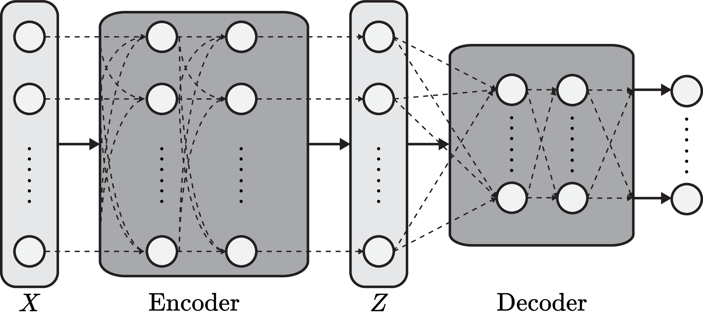
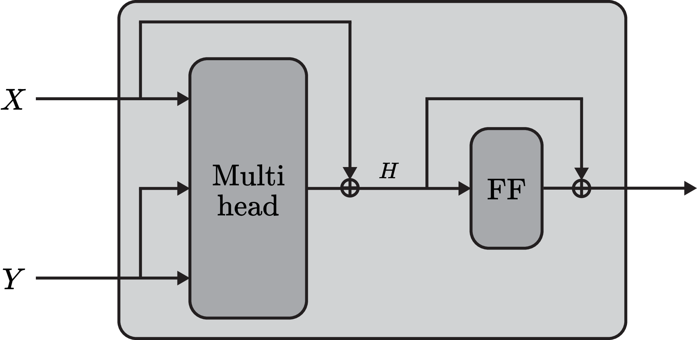
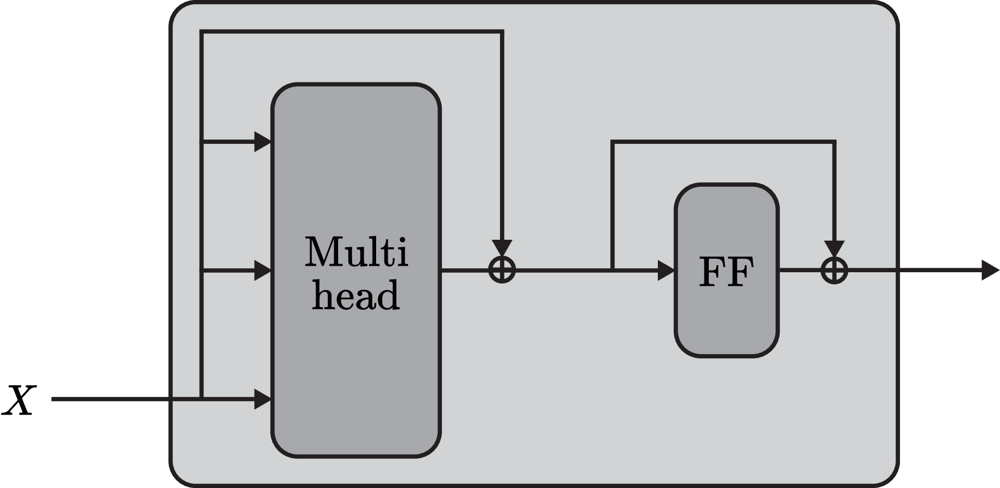
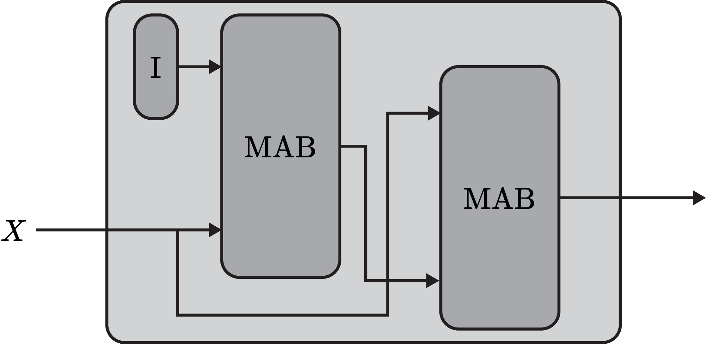
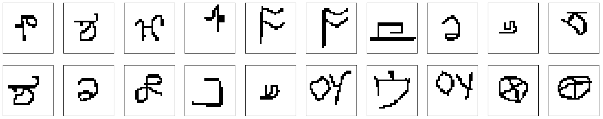
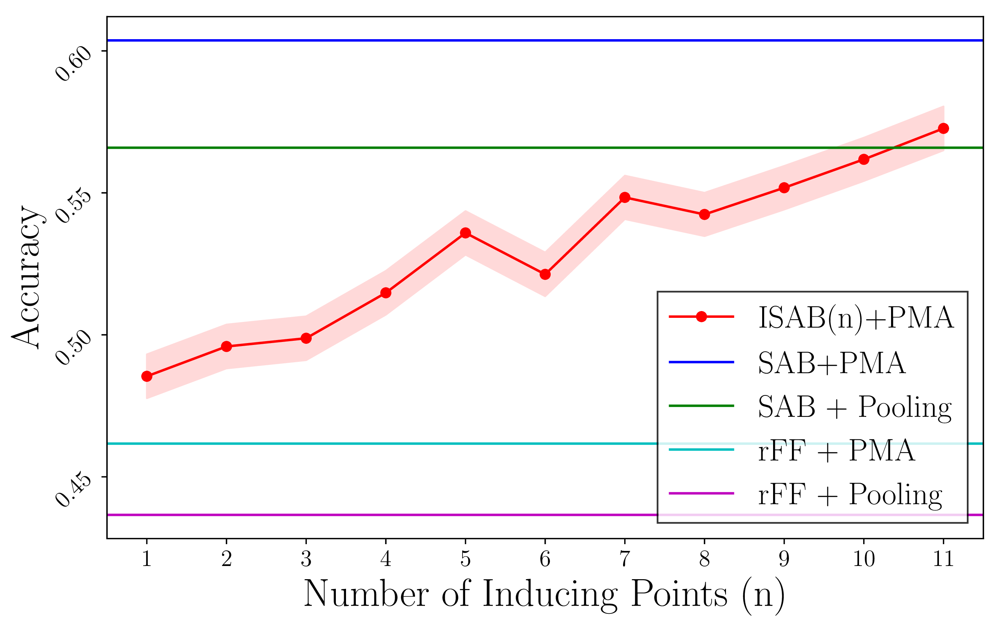
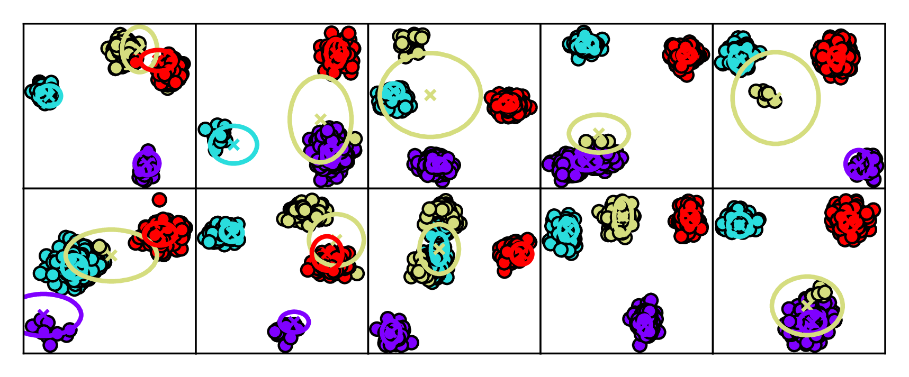
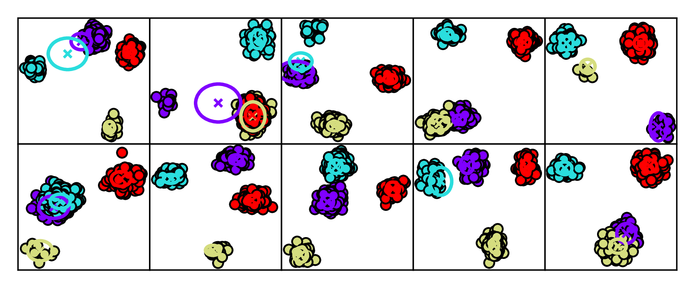
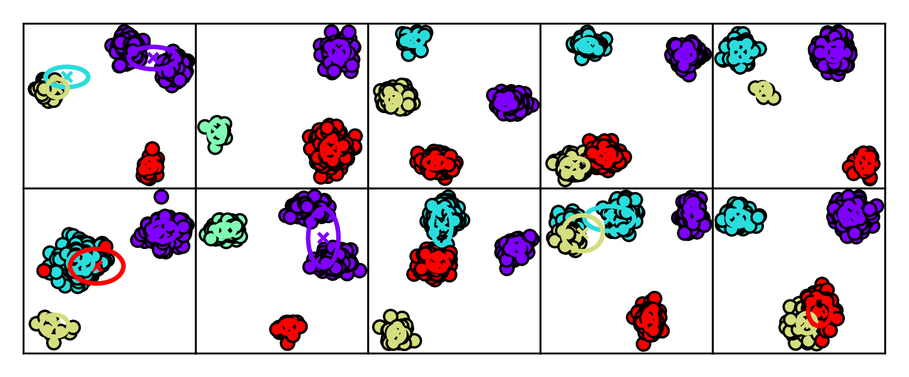
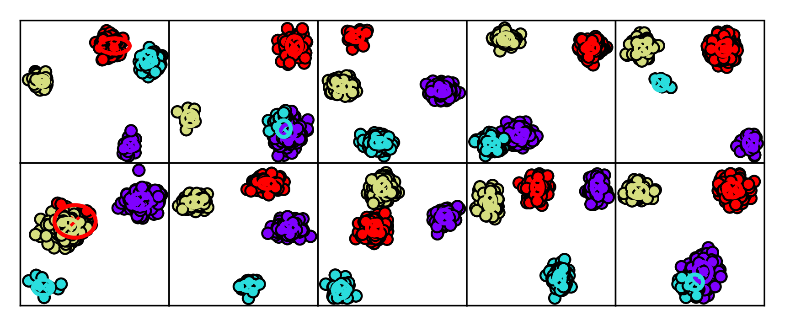

# Set Transformer: アテンションに基づく置換不変ニューラルネットワークの枠組み

> 原題: Set Transformer: A Framework for Attention-based Permutation-Invariant Neural Networks
> 著者: Juho Lee, Yoonho Lee, Jungtaek Kim, Adam R. Kosiorek, Seungjin Choi, Yee Whye Teh
> 出典: arXiv:1810.00825（ICML 2019）
> 訳注: 本文（Abstract〜§6）を一文ずつ訳出。補足資料（supplementary material）・謝辞・参考文献一覧は除外。図は ar5iv の PNG と arXiv ソース tarball の PDF から取得しローカル保存した。

## Abstract（要旨）

多重インスタンス学習、3D 形状認識、few-shot 画像分類など、多くの機械学習タスクはインスタンスの集合の上で定義される。

このような問題の解は集合の要素の順序に依存しないため、それらに取り組むモデルは置換不変（permutation invariant）であるべきである。

我々は、入力集合内の要素間の相互作用をモデル化するために特別に設計された、アテンションに基づくニューラルネットワーク・モジュールである Set Transformer を提示する。

このモデルはエンコーダとデコーダからなり、そのどちらもアテンション機構に依拠する。

計算複雑性を削減する取り組みとして、スパースガウス過程の文献における誘導点（inducing point）法に着想を得たアテンション方式を導入する。

これは自己アテンションの計算時間を、集合の要素数に関して2次から線形へと削減する。

我々はこのモデルが理論的に魅力的であることを示し、さまざまなタスクで評価して、集合構造データを扱う最近の手法と比べて性能が向上することを実証する。

## Keywords（キーワード）

Set transformer、集合入力ネットワーク、アテンションに基づくネットワーク、置換不変ネットワーク

## 1 Introduction（はじめに）

表現の学習は、深層学習とその数々の成功物語にとって本質的な問題であることが証明されてきた。

深層学習が取り組む問題の大部分はインスタンスベースであり、固定次元の入力テンソルを対応するターゲット値へ写像する形をとる。

一部の応用では、*集合構造データ（set-structured data）* を処理することが求められる。

多重インスタンス学習は、そのような集合入力問題の一例であり、インスタンスの集合が入力として与えられ、対応するターゲットは集合全体に対するラベルである。

3D 形状認識、系列の順序付け、さまざまな集合演算といった他の問題も、集合入力問題と見なせる。

さらに、異なるが関連するタスクを使って学習する多くのメタ学習の問題も、入力集合が単一タスクの訓練データセットに対応する集合入力タスクとして扱える。

たとえば few-shot 画像分類は、画像のサポート集合を使って分類器を構築し、クエリ画像で評価することで動作する。

集合入力問題のためのモデルは、2つの決定的な要件を満たすべきである。

第一に、置換不変であるべきである——モデルの出力は、入力集合の要素のいかなる置換のもとでも変化してはならない。

第二に、そのようなモデルは任意のサイズの入力集合を処理できるべきである。

これらの要件は集合の定義から生じるものだが、ニューラルネットワークに基づくモデルで満たすのは容易ではない。古典的なフィードフォワード・ニューラルネットワークは両方の要件に違反し、RNN は入力の順序に敏感である。

最近、Edwards & Storkey および Zaheer らは、両方の基準を満たすニューラルネットワーク・アーキテクチャを提案した。我々はこれを *set pooling* 手法と呼ぶ。

このモデルでは、集合の各要素はまず、固定サイズの入力を取るフィードフォワード・ニューラルネットワークに独立に入力される。

得られた特徴空間の埋め込みは、その後 *プーリング（pooling）* 演算（$\operatorname{mean}$、$\operatorname{sum}$、$\operatorname{max}$ など）を使って集約される。

最終出力は、集約された埋め込みをさらに非線形処理することで得られる。

この驚くほど単純なアーキテクチャは前述の両方の要件を満たし、さらに重要なことに、任意の集合関数の普遍近似器（universal approximator）であることが証明されている。

この性質のおかげで、フィードフォワードや再帰型のニューラルネットワークと同じように、入力集合とそのターゲット出力のあいだの複雑な写像をブラックボックス的に学習することが可能である。

この set pooling アプローチは理論的には魅力的であるものの、インスタンスベースの特徴抽出器と単純なプーリング演算だけで複雑な写像をうまく近似できるのかは不明のままである。

set pooling 演算では集合内のすべての要素が独立に処理されるため、要素間の相互作用に関する情報の一部は必然的に捨てられざるを得ない。

これは一部の問題を不必要に難しくしうる。

*償却クラスタリング（amortized clustering）* の問題を考えよう。ここでは、点の入力集合から、その集合内の点のクラスタ中心への、パラメトリックな写像を学習したい。

2D 空間の toy データセットに対してさえ、これは容易な問題ではない。

主な困難は、パラメトリックな写像が各点を対応するクラスタに割り当てつつ、結果として得られるクラスタたちが入力集合の重複する部分集合を説明しようとしないように、説明の取り合い（explaining away）のパターンをモデル化しなければならないことである。

この本質的な難しさのため、クラスタリングは通常、ランダムに初期化されたクラスタを収束まで改良していく反復アルゴリズムで解かれる。

set pooling 演算をもつニューラルネットワークも、空間を量子化することを学習してそのような償却写像を近似できるが、決定的な欠点は、この量子化が集合の内容に依存できないことである。

これは解の品質を制限し、そのようなモデルの最適化をより難しくもしうる。第5節で、こうしたプーリング・アーキテクチャが過少適合（under-fitting）に苦しむことを経験的に示す。

本論文では、*Set Transformer* と呼ぶ新しい集合入力の深層ニューラルネットワーク・アーキテクチャを提案する（cf. *Transformer*, Vaswani et al.）。

Set Transformer の新規性は、3つの重要な設計上の選択にある:

1. 入力集合のすべての要素を処理するために自己アテンション機構を使う。これにより我々のアプローチは、集合内の要素間のペアワイズあるいはより高次の相互作用を自然に符号化できる。
2. 完全な自己アテンション（例: Transformer）の $\mathcal{O}(n^{2})$ の計算時間を $\mathcal{O}(nm)$（$m$ は固定のハイパーパラメータ）へ削減する方法を提案する。これにより我々の手法は大きな入力集合へスケールできる。
3. 特徴を集約するためにも自己アテンション機構を使う。これは、メタクラスタリングの問題のように、互いに依存し合う複数の出力を必要とする問題で特に有益である。そこでは各クラスタ中心の意味は、他のクラスタとの相対的な位置に大きく依存する。

我々は Set Transformer をいくつかの集合入力問題に適用し、これらの設計上の選択の重要性と有効性を経験的に実証し、ほとんどのタスクで最先端の性能を達成できることを示す。

## 2 Background（背景）

### 2.1 Pooling Architecture for Sets（集合のためのプーリング・アーキテクチャ）

物体の集合が関わる問題は、置換不変性という性質をもつ。すなわち、与えられた集合に対するターゲット値は、集合内の物体の順序によらず同じである。

置換不変なモデルの単純な例は、集合の要素から抽出した埋め込みの上でプーリングを行うネットワークである。より形式的には、

$$
\displaystyle\mathrm{net}(\{x_{1},\ldots,x_{n}\})=\rho(\mathrm{pool}(\{\phi(x_{1}),\ldots,\phi(x_{n})\})).
$$

Zaheer らは、$\mathrm{pool}$ が $\operatorname{sum}$ 演算子で $\rho,\phi$ が任意の連続関数であるとき、すべての置換不変関数が (1) の形で表現できることを証明しており、集合入力問題にこのアーキテクチャを使うことを正当化している。

(1) は2つの部分に分解できることに注意しよう。すなわち、$n$ 個の要素からなる集合の各要素に独立に作用するエンコーダ（$\phi$）と、これらの符号化された特徴を集約して望みの出力を生み出すデコーダ（$\rho(\mathrm{pool}(\cdot))$）である。

集合構造データのためのほとんどのネットワーク・アーキテクチャは、このエンコーダ・デコーダ構造に従う。

Zaheer らはさらに、エンコーダが置換同変（permutation-equivariant）な層の積み重ねであっても、モデルは置換不変のままであることを観察した:

###### 定義 1.

$S_{n}$ を添字 $\{1,\ldots,n\}$ のすべての置換の集合とする。関数 $f:X^{n}\rightarrow Y^{n}$ が置換同変であるとは、任意の置換 $\pi\in S_{n}$ について $f(\pi x)=\pi f(x)$ が成り立つとき、かつそのときに限る。

置換同変な層の一例は

$$
\displaystyle f_{i}(x;\{x_{1},\ldots,x_{n}\})=\sigma_{i}(\lambda x+\gamma\mathrm{pool}(\{x_{1},\ldots,x_{n}\}))
$$

であり、ここで $\mathrm{pool}$ はプーリング演算、$\lambda,\gamma$ は学習可能なスカラー変数、$\sigma(\cdot)$ は非線形活性化関数である。

<figure>

<figcaption>図1 (a): 我々のモデル。入力集合 X をエンコーダ（要素間で相互作用する層の積み重ね）が特徴集合 Z に変換し、デコーダがそれを集約して出力を生む。</figcaption>
</figure>

<figure>

<figcaption>図1 (b): MAB（Multihead Attention Block）。2つの集合 X, Y を受け取り、X を問い合わせ（クエリ）、Y をキー/値としてマルチヘッド・アテンションと行ごとのフィードフォワードを適用する。</figcaption>
</figure>

<figure>

<figcaption>図1 (c): SAB（Set Attention Block）。MAB(X, X)、すなわち集合 X の要素間の自己アテンション。</figcaption>
</figure>

<figure>

<figcaption>図1 (d): ISAB（Induced Set Attention Block）。学習可能な誘導点 I がまず入力集合 X にアテンションして要約 H を作り（1つ目の MAB）、次に X が H にアテンションして出力を作る（2つ目の MAB）。</figcaption>
</figure>

図1: 我々のアテンションに基づく集合演算のダイアグラム。

### 2.2 Attention（アテンション）

$n$ 個のクエリベクトル（$n$ 要素の集合に対応する）があり、それぞれ次元 $d_{q}$ をもつとする: $Q\in\mathbb{R}^{n\times d_{q}}$。

アテンション関数 $\mathrm{Att}(Q,K,V)$ は、$n_{v}$ 個のキーと値のペア $K\in\mathbb{R}^{n_{v}\times d_{q}},V\in\mathbb{R}^{n_{v}\times d_{v}}$ を使って、クエリ $Q$ を出力へ写像する関数である。

$$
\displaystyle\mathrm{Att}(Q,K,V;\omega)=\omega\left(QK^{\top}\right)V.
$$

ペアワイズの内積 $QK^{\top}\in\mathbb{R}^{n\times n_{v}}$ は、クエリベクトルとキーベクトルの各ペアがどれだけ似ているかを測り、重みは活性化関数 $\omega$ で計算される。

出力 $\omega(QK^{\top})V$ は $V$ の加重和であり、対応するキーがクエリとより大きな内積をもつ値ほど、より大きな重みを得る。

マルチヘッド・アテンションは、Vaswani らで最初に導入された、上述のアテンション方式の拡張である。

単一のアテンション関数を計算する代わりに、この手法はまず $Q,K,V$ をそれぞれ $h$ 個の異なる $d^{M}_{q},d^{M}_{q},d^{M}_{v}$ 次元ベクトルに射影する。

これら $h$ 個の射影のそれぞれにアテンション関数（$\mathrm{Att}(\cdot;\omega_{j})$）が適用される。

出力は、すべてのアテンション出力の連結の線形変換である:

$$
\displaystyle\mathrm{Multihead}(Q,K,V;\lambda,\omega)=\mathrm{concat}(O_{1},\cdots,O_{h})W^{O},
$$

$$
\displaystyle\mathrm{where}\ \ O_{j}=\mathrm{Att}(QW_{j}^{Q},KW^{K}_{j},VW^{V}_{j};\omega_{j})
$$

$\mathrm{Multihead}(\cdot,\cdot,\cdot;\lambda)$ は学習可能なパラメータ $\lambda=\{W_{j}^{Q},W_{j}^{K},W_{j}^{V}\}_{j=1}^{h}$ をもち、$W_{j}^{Q},W_{j}^{K}\in\mathbb{R}^{d_{q}\times d_{q}^{M}}$、$W_{j}^{V}\in\mathbb{R}^{d_{v}\times d_{v}^{M}}$、$W^{O}\in\mathbb{R}^{hd_{v}^{M}\times d}$ であることに注意。

次元ハイパーパラメータの典型的な選び方は $d_{q}^{M}=d_{q}/h$、$d_{v}^{M}=d_{v}/h$、$d=d_{q}$ である。

簡潔さのため、以降の本論文では $d_{q}=d_{v}=d$、$d_{q}^{M}=d_{v}^{M}=d/h$ とする。

特に指定のない限り、スケール付きソフトマックス $\omega_{j}(\cdot)=\mathrm{softmax}(\cdot/\sqrt{d})$ を使う。我々の実験では、これはほとんどの設定で頑健に機能した。

## 3 Set Transformer

本節では、Set Transformer——データの集合を処理するために設計された、アテンションに基づくニューラルネットワーク——を動機づけ、記述する。

他のアーキテクチャと同様に、Set Transformer はエンコーダとそれに続くデコーダからなる（cf. 第2.1節）が、際立った特徴は、エンコーダとデコーダの各層が、活性を生み出すためにその入力へアテンションすることである。

さらに、$\mathrm{mean}$ のような固定のプーリング演算の代わりに、我々の集約関数 $\mathrm{pool}(\cdot)$ はパラメータ化されており、したがって目の前の問題に適応できる。

### 3.1 Permutation Equivariant (Induced) Set Attention Blocks（置換同変な（誘導）集合アテンションブロック）

まず、我々のアテンションに基づく集合演算——SAB と ISAB と呼ぶ——を定義することから始める。

既存の集合向けプーリング手法が、他のインスタンスと独立にインスタンス特徴を得るのに対し、我々は自己アテンションを使って集合全体を同時に符号化する。

これにより Set Transformer は、符号化の過程で、インスタンス間のペアワイズおよびより高次の相互作用を計算する能力を得る。

この目的のため、Transformer で使われるマルチヘッド・アテンション機構を適応させる。

ここで導入するすべてのブロックは、固定された関数ではなく、それ自身のパラメータをもつニューラルネットワークのブロックであることを強調しておく。

$d$ 次元ベクトルの2つの集合を表す行列 $X,Y\in\mathbb{R}^{n\times d}$ が与えられたとき、パラメータ $\omega$ をもつ Multihead Attention Block（MAB）を次のように定義する:

$$
\displaystyle\mathrm{MAB}(X,Y)=\mathrm{LayerNorm}(H+\mathrm{rFF}(H)),
$$

$$
\displaystyle\textrm{where}\ \ H=\mathrm{LayerNorm}(X+\mathrm{Multihead}(X,Y,Y;\omega)),
$$

$\mathrm{rFF}$ は任意の行ごとのフィードフォワード層（すなわち、各インスタンスを独立かつ同一に処理する層）であり、$\mathrm{LayerNorm}$ は層正規化である。

MAB は、位置エンコーディングとドロップアウトを除いた、Transformer のエンコーダブロックの適応である。

MAB を使って、Set Attention Block（SAB）を次のように定義する:

$$
\displaystyle\mathrm{SAB}(X)\coloneqq\mathrm{MAB}(X,X).
$$

言い換えれば、SAB は集合を受け取り、集合内の要素間で自己アテンションを行い、同じサイズの集合を返す。

SAB の出力は入力集合 $X$ の要素間のペアワイズ相互作用についての情報を含むので、複数の SAB を積み重ねることで、より高次の相互作用を符号化できる。

SAB (8) は $Q=K=V=X$ とするマルチヘッド・アテンション演算 (7) を含むが、これは $X$ に残差ブロックを適用するだけに退化しうることに注意。実際には、アテンションヘッド内の $X$ の線形射影 (3), (5) のおかげで、より複雑な関数を学習する。

集合構造データに SAB を使うことの潜在的な問題は、2次の時間計算量 $\mathcal{O}(n^{2})$ であり、大きな集合（$n\gg 1$）には高価すぎるかもしれない。

そこで我々は、この問題を回避する Induced Set Attention Block（ISAB）を導入する。

集合 $X\in\mathbb{R}^{n\times d}$ に加えて、$m$ 個の $d$ 次元ベクトル $I\in\mathbb{R}^{m\times d}$ を追加で定義する。これを誘導点（inducing points）と呼ぶ。

誘導点 $I$ は ISAB 自身の一部であり、ネットワークの他のパラメータと一緒に訓練する*学習可能なパラメータ*である。

$m$ 個の誘導点 $I$ をもつ ISAB は次のように定義される:

$$
\displaystyle\mathrm{ISAB}_{m}(X)=\mathrm{MAB}(X,H)\in\mathbb{R}^{n\times d},
$$

$$
\displaystyle\textrm{where}\ \ H=\mathrm{MAB}(I,X)\in\mathbb{R}^{m\times d}.
$$

ISAB はまず、入力集合にアテンションすることで $I$ を $H$ に変換する。

入力集合 $X$ についての情報を含む、変換された誘導点の集合 $H$ に、今度は入力集合 $X$ が再びアテンションして、最終的に $n$ 要素の集合を生み出す。

これは低ランク射影やオートエンコーダのモデルに類似している。そこでは入力（$X$）がまず低次元の対象（$H$）に射影され、その後、出力を生むために再構成される。

違いは、これらの手法の目標が再構成であるのに対し、ISAB は最終タスクのための良い特徴を得ることを狙う点である。

学習された誘導点は、入力 $X$ を説明するのに役立つ何らかの大域的構造を符号化すると期待される。

たとえば 2D 平面上の償却クラスタリング問題では、誘導点は 2D 平面上に適切に分布した点となり、エンコーダはクエリデータセットの要素を、これらの格子点への近さを通じて間接的に比較できるだろう。

(9) と (10) では、サイズ $m$ の集合とサイズ $n$ の集合のあいだでアテンションが計算されたことに注意。

したがって $\mathrm{ISAB}_{m}(X;\lambda)$ の時間計算量は $\mathcal{O}(nm)$ であり、$m$ は（通常小さい）ハイパーパラメータである——SAB の2次計算量からの改善である。

また、我々の集合演算（SAB と ISAB）はどちらも*置換同変*（定義は第2.1節）であることを強調する:

###### 性質 1.

$\mathrm{SAB}(X)$ と $\mathrm{ISAB}_{m}(X)$ はどちらも置換同変である。

### 3.2 Pooling by Multihead Attention（マルチヘッド・アテンションによるプーリング）

置換不変ネットワークにおける一般的な集約方式は、特徴ベクトルの次元ごとの平均または最大である（cf. 第1節）。

我々は代わりに、$k$ 個の学習可能なシードベクトルの集合 $S\in\mathbb{R}^{k\times d}$ にマルチヘッド・アテンションを適用して特徴を集約することを提案する。

$Z\in\mathbb{R}^{n\times d}$ をエンコーダから構築された特徴の集合とする。$k$ 個のシードベクトルをもつ Pooling by Multihead Attention（PMA）は次のように定義される:

$$
\displaystyle\mathrm{PMA}_{k}(Z)=\mathrm{MAB}(S,\mathrm{rFF}(Z)).
$$

$\mathrm{PMA}_{k}$ の出力は $k$ 個の要素の集合であることに注意。

ほとんどの場合は1個のシードベクトル（$k=1$）を使うが、償却クラスタリングのように $k$ 個の相関した出力を必要とする問題では、$k$ 個のシードベクトルを使うのが自然である。

$k$ 個の出力間の相互作用をさらにモデル化するため、その後に SAB を適用する:

$$
\displaystyle H=\mathrm{SAB}(\mathrm{PMA}_{k}(Z)).
$$

プーリング後のこのような自己アテンションが、（例えば償却クラスタリング問題におけるクラスタ間の）説明の取り合いのモデル化に役立つことを、後で経験的に示す。

直感的には、アテンションを使った特徴集約が有益であるはずなのは、各インスタンスがターゲットに及ぼす影響が必ずしも等しくないからである。

たとえば、実数の集合の最大値がターゲット値である問題を考えよう。ターゲットはただ1つのインスタンス（最大のもの）だけで復元できるので、集約の際にそのインスタンスを見つけてアテンションすることが有利になる。

### 3.3 Overall Architecture（全体アーキテクチャ）

上で説明した部品を使って、エンコーダとデコーダからなる Set Transformer をどう構築するかを述べる。

エンコーダ $\mathrm{Encoder}:X\mapsto Z\in\mathbb{R}^{n\times d}$ は SAB または ISAB の積み重ねであり、たとえば:

$$
\displaystyle\mathrm{Encoder}(X)=\mathrm{SAB}(\mathrm{SAB}(X))
$$

$$
\displaystyle\mathrm{Encoder}(X)=\mathrm{ISAB}_{m}(\mathrm{ISAB}_{m}(X)).
$$

SAB と ISAB を $\ell$ 段積んだときの時間計算量はそれぞれ $\mathcal{O}(\ell n^{2})$ と $\mathcal{O}(\ell nm)$ であることを再度指摘しておく。

これにより、（SAB と比べて）ISAB を使うと、高い表現力を保ちながら、処理時間を大幅に短縮できる。

エンコーダがデータ $X\in\mathbb{R}^{n\times d_{x}}$ を特徴 $Z\in\mathbb{R}^{n\times d}$ に変換したのち、デコーダはそれらを単一の、あるいは複数のベクトルへ集約し、それをフィードフォワード・ネットワークに入力して最終出力を得る。

$k>1$ 個のシードベクトルをもつ PMA の後には、$k$ 個の出力間の相関をモデル化するために SAB を続けるべきであることに注意。

$$
\displaystyle\mathrm{Decoder}(Z;\lambda)=\mathrm{rFF}(\mathrm{SAB}(\mathrm{PMA}_{k}(Z)))\in\mathbb{R}^{k\times d}
$$

$$
\displaystyle\textrm{where}\ \ \mathrm{PMA}_{k}(Z)=\mathrm{MAB}(S,\mathrm{rFF}(Z))\in\mathbb{R}^{k\times d},
$$

### 3.4 Analysis（解析）

エンコーダを構成するブロック（すなわち SAB、ISAB）は置換同変なので、エンコーダの写像 $X\rightarrow Z$ も置換同変である。

デコーダ内の PMA が置換不変な変換であるという事実と組み合わせると、次が得られる:

###### 命題 1.

Set Transformer は置換不変である。

任意の関数を近似できることは、とりわけ深層ニューラルネットワークのようなブラックボックスモデルにとって望ましい性質である。

置換不変関数の普遍近似に関する先行結果の上に、Set Transformer の普遍性を証明する:

###### 命題 2.

Set Transformer は置換不変関数の普遍近似器である。

###### 証明.

補足資料を参照。∎

## 4 Related Works（関連研究）

**置換不変写像のためのプーリング・アーキテクチャ**　集合のためのプーリング・アーキテクチャは、3D 形状認識、因果性の発見、集合の統計量の学習、few-shot 画像分類、条件付き回帰・分類など、さまざまな問題で使われてきた。

Zaheer らはこの構造を一般に論じ、プーリング・アーキテクチャの普遍性の部分的な証明を与え、Wagstaff らはプーリング・アーキテクチャの限界をさらに論じている。

Bloem-Reddy & Teh は、確率的な交換可能性（exchangeability）とプーリング・アーキテクチャとのあいだの関連を与えている。

**集合のためのアテンションに基づくアプローチ**　最近のいくつかの研究は、集合のモデル化におけるアテンション機構の力量を強調している。

Vinyals らは、アテンション機構で計算した重みを使った加重平均によって集合の要素をプールする。

Yang らは多視点 3D 再構成のための AttSets を提案しており、そこでは符号化された特徴を加重和でプールするために使う重みの計算にドット積アテンションが適用される。

同様に Ilse らは、多重インスタンス学習のためにアテンションに基づく加重和プーリングを使う。

これらのアプローチと比べて、我々のものは集約にマルチヘッド・アテンションを使い、さらに重要なことに、複数の出力間の相関をモデル化するためにプーリングの後に自己アテンションを適用することを提案する。

$k=1$ 個のシードベクトルとシングルヘッド・アテンションをもつ PMA は、これらの先行アプローチにおおよそ対応する。

置換不変ではないが、Mishra らは、入力の系列を使ってさまざまなタスクを解くことをメタ学習するための中核部品の一つとしてアテンションをもつ。

Kim らはアテンションに基づく条件付き回帰を提案しており、そこではクエリ集合に自己アテンションが適用される。

**集合内の要素間の相互作用のモデル化**　Transformer を使う重要な理由は、集合内の要素間の高次の相互作用を明示的にモデル化することである。

Santoro らは relational network を提案した。これは与えられた集合の要素のすべてのペアワイズ相互作用を和プールする単純なアーキテクチャだが、より高次の相互作用は扱わない。

我々の研究と同様に、Ma らは動画内の物体間の相互作用をモデル化するために Transformer を使う。彼らは平均プーリングで集約特徴を得て、それを LSTM に入力する。

**誘導点法**　学習可能なベクトル $I$ をデータ点と直接相互作用させるという考えは、スパースガウス過程で使われる誘導点法や、行列分解のための Nyström 法に緩やかに基づいている。

$m$ 個の学習可能な誘導点は、アテンション機構でアクセスされる $m$ 個の独立なメモリセルと見なすこともできる。

differential neural dictionary は過去の経験をキーと値のペアとして保存し、これを使ってクエリを処理する。

ISAB はこの考えの逆転と見なせる。すなわち、クエリ $I$ が保存されており、入力特徴がキーと値のペアとして使われる。

## 5 Experiments（実験）

Set Transformer を評価するため、データ点の集合が関わる一連のタスクに適用する。

すべての実験を5回繰り返し、対応するテストデータセットで評価した性能指標を報告する。

ベースラインとともに、エンコーダとデコーダにアテンションをもつかどうかの選択の組み合わせから生じる、さまざまなアーキテクチャを比較した。

特に指定のない限り、「単純プーリング」は平均プーリングを意味する。

- rFF + Pooling: エンコーダに rFF 層、デコーダに単純プーリング＋rFF 層。
- rFFp-mean/rFFp-max + Pooling: エンコーダに置換同変な変種の rFF 層、デコーダに単純プーリング＋rFF 層。
- rFF + Dotprod: エンコーダに rFF 層、デコーダにドット積アテンションに基づく加重和プーリング＋rFF 層。
- SAB（ISAB）+ Pooling（我々の手法）: エンコーダに SAB（ISAB）の積み重ね、デコーダに単純プーリング＋rFF 層。
- rFF + PMA（我々の手法）: エンコーダに rFF 層、デコーダに PMA（およびそれに続く SAB の積み重ね）。
- SAB（ISAB）+ PMA（我々の手法）: エンコーダに SAB（ISAB）の積み重ね、デコーダに PMA（およびそれに続く SAB の積み重ね）。

### 5.1 Toy Problem: Maximum Value Regression（トイ問題: 最大値回帰）

**表1**: 最大値回帰タスクにおける平均絶対誤差。

| アーキテクチャ | MAE |
| --- | --- |
| rFF + Pooling ($\mathrm{mean}$) | 2.133 $\pm$ 0.190 |
| rFF + Pooling ($\mathrm{sum}$) | 1.902 $\pm$ 0.137 |
| rFF + Pooling ($\mathrm{max}$) | 0.1355 $\pm$ 0.0074 |
| SAB + PMA（我々の手法） | 0.2085 $\pm$ 0.0127 |

アテンションに基づく集合集約が単純なプーリング演算に対してもつ利点を実証するため、トイ問題を考える: 与えられた集合の最大値への回帰である。

実数の集合 $\{x_{1},\ldots,x_{n}\}$ が与えられたとき、目標は $\mathrm{max}(x_{1},\cdots,x_{n})$ を返すことである。

予測 $p$ が与えられたとき、平均絶対誤差 $|p-\mathrm{max}(x_{1},\cdots,x_{n})|$ を損失関数として使う。

3つの異なるプーリング演算（$\operatorname{max}$、$\operatorname{mean}$、$\operatorname{sum}$）で単純プーリング・アーキテクチャを構築した。

訓練後の損失値を表1に報告する。

平均プーリングと和プーリングのアーキテクチャは、高い平均絶対誤差（MAE）に終わる。

max プーリングをもつモデルは、エンコーダを恒等関数になるよう学習することで出力を完璧に予測でき、したがって最高の性能を達成する。

注目すべきことに、Set Transformer は max プーリングのモデルに匹敵する性能を達成しており、これはアテンション機構によって与えられる追加の柔軟性の重要性を裏付けている——最大の要素を見つけてそれにアテンションすることを学習できるのである。

<figure>

<figcaption>図2: ユニーク文字数え上げ: これは Omniglot データセットからランダムにサンプリングされた20枚の画像の集合である。この集合の中には14種類の異なる文字がある。</figcaption>
</figure>

### 5.2 Counting Unique Characters（ユニークな文字の数え上げ）

**表2**: ユニーク文字数え上げタスクにおける精度。

| アーキテクチャ | 精度 |
| --- | --- |
| rFF + Pooling | 0.4382 $\pm$ 0.0072 |
| rFFp-mean + Pooling | 0.4617 $\pm$ 0.0076 |
| rFFp-max + Pooling | 0.4359 $\pm$ 0.0077 |
| rFF + Dotprod | 0.4471 $\pm$ 0.0076 |
| rFF + PMA（我々の手法） | 0.4572 $\pm$ 0.0076 |
| SAB + Pooling（我々の手法） | 0.5659 $\pm$ 0.0077 |
| SAB + PMA（我々の手法） | 0.6037 $\pm$ 0.0075 |

集合内の物体間の相互作用をモデル化する能力をテストするため、入力集合の中のユニークな要素を数え上げるという新しいタスクを導入する。

Omniglot データセットを使う。これはさまざまなアルファベットに属する 1,623 種類の異なる手書き文字からなり、各文字は20枚の異なる画像で表現されている。

すべての文字（と対応する画像）を訓練・検証・テスト集合に分割し、訓練文字クラスの画像だけを使って訓練する。

6〜10枚の画像をサンプリングして入力集合を生成し、集合内の異なる文字の数を予測するようモデルを訓練する。

この数を予測するためにポアソン回帰モデルを使い、レート $\lambda$ はニューラルネットワークの出力として与えた。

このモデルの対数尤度を確率的勾配上昇法で最大化した。

テスト集合の文字からサンプリングした画像の集合を使ってモデルの性能を評価した。

表2に精度を報告する。精度は、ネットワークが選んだポアソン分布のモードが入力集合内の文字数に等しい頻度として測った。

さらに、誘導点の数が性能にどう影響するかを見る実験を行った。

誘導点の数（$n$）を変えながら、このタスクで $\mathrm{ISAB}_{n}+\mathrm{PMA}$ を訓練した。

精度を図3に示す。比較のため、他のアーキテクチャは水平線で示している。

まず、$\mathrm{ISAB}_{1}+\mathrm{PMA}$ の精度でさえ $\mathrm{rFF}+\mathrm{Pooling}$ と $\mathrm{rFF}+\mathrm{PMA}$ の両方を上回ること、そして $n$ を増やすにつれて性能が向上する傾向があることに注意されたい。

<figure>

<figcaption>図3: ユニーク文字数え上げタスクにおける ISABₙ+PMA の精度。x 軸は誘導点の数 n、y 軸は精度。誘導点1個の ISAB でも rFF 系を上回り、n を増やすと精度が上がっていく。</figcaption>
</figure>

### 5.3 Amortized Clustering with Mixture of Gaussians（ガウス混合による償却クラスタリング）

集合入力ネットワークを、ガウス混合（MoG; mixture of Gaussians）の最尤推定のタスクに適用した。

$k$ 成分の MoG から生成されたデータセット $X=\{x_{1},\dots,x_{n}\}$ の対数尤度は

$$
\displaystyle\log p(X;\theta)=\sum_{i=1}^{n}\log\sum_{j=1}^{k}\pi_{j}\mathcal{N}(x_{i};\mu_{j},\mathrm{diag}(\sigma^{2}_{j})).
$$

目標は最適なパラメータ $\theta^{*}(X)=\operatorname{argmax}_{\theta}\log p(X;\theta)$ を学習することである。

この問題への典型的なアプローチは、期待値最大化（EM）のような反復アルゴリズムを収束まで走らせることである。

その代わりに我々は、入力集合 $X$ を $\theta^{*}(X)$ へ直接写像する汎用のメタアルゴリズムを学習することを狙う。

これは償却最尤学習（amortized maximum likelihood learning）と見なすこともできる。

具体的には、データセット $X$ が与えられたとき、次を最大化するパラメータ $f(X;\lambda)=\{\pi(X),\{\mu_{j}(X),\sigma_{j}(X)\}_{j=1}^{k}\}$ を出力するニューラルネットワークを訓練する。

$$
\displaystyle\mathbb{E}_{X}\left[\sum_{i=1}^{|X|}\log\sum_{j=1}^{k}\pi_{j}(X)\mathcal{N}(x_{i};\mu_{j}(X),\mathrm{diag}(\sigma_{j}^{2}(X)))\right].
$$

$f(\cdot;\lambda)$ を集合入力ニューラルネットワークとして構成し、そのパラメータ $\lambda$ を確率的勾配上昇法で学習した。勾配は*データセットたち*のミニバッチで近似する。

2つのデータセットで、他の集合入力ネットワークとともに Set Transformer をテストした。

PMA には4個のシードベクトル（$S\in\mathbb{R}^{4\times d}$）を使い、各シードベクトルが1つのクラスタのパラメータを生成するようにした。

合成 2D ガウス混合: 各データセットは 2D 平面上の $n\in[100,500]$ 個の点を含み、それぞれ4つのガウス分布のいずれかからサンプリングされる。

CIFAR-100: 各データセットは、CIFAR-100 データセットのランダムな4クラスからサンプリングされた $n\in[100,500]$ 枚の画像を含む。各画像は事前学習済み VGG ネットワークから得た 512 次元ベクトルで表現される。

**表3**: メタクラスタリングの結果。括弧内の数字はエンコーダの ISAB で使った誘導点の数を示す。合成データセットにはデータあたり平均尤度を、CIFAR-100 実験には調整ランド指数（ARI）を示す。LL1/data、ARI1 は EM 更新1ステップ後の評価指標である。合成データセットのオラクルは集合の生成に実際に使ったパラメータの対数尤度であり、CIFAR のオラクルは EM を収束まで走らせて計算した。

| アーキテクチャ | LL0/data | LL1/data | ARI0 | ARI1 |
| --- | --- | --- | --- | --- |
| オラクル | -1.4726 | | 0.9150 | |
| rFF + Pooling | -2.0006 $\pm$ 0.0123 | -1.6186 $\pm$ 0.0042 | 0.5593 $\pm$ 0.0149 | 0.5693 $\pm$ 0.0171 |
| rFFp-mean + Pooling | -1.7606 $\pm$ 0.0213 | -1.5191 $\pm$ 0.0026 | 0.5673 $\pm$ 0.0053 | 0.5798 $\pm$ 0.0058 |
| rFFp-max + Pooling | -1.7692 $\pm$ 0.0130 | -1.5103 $\pm$ 0.0035 | 0.5369 $\pm$ 0.0154 | 0.5536 $\pm$ 0.0186 |
| rFF + Dotprod | -1.8549 $\pm$ 0.0128 | -1.5621 $\pm$ 0.0046 | 0.5666 $\pm$ 0.0221 | 0.5763 $\pm$ 0.0212 |
| SAB + Pooling（我々の手法） | -1.6772 $\pm$ 0.0066 | -1.5070 $\pm$ 0.0115 | 0.5831 $\pm$ 0.0341 | 0.5943 $\pm$ 0.0337 |
| ISAB (16) + Pooling（我々の手法） | -1.6955 $\pm$ 0.0730 | -1.4742 $\pm$ 0.0158 | 0.5672 $\pm$ 0.0124 | 0.5805 $\pm$ 0.0122 |
| rFF + PMA（我々の手法） | -1.6680 $\pm$ 0.0040 | -1.5409 $\pm$ 0.0037 | 0.7612 $\pm$ 0.0237 | 0.7670 $\pm$ 0.0231 |
| SAB + PMA（我々の手法） | -1.5145 $\pm$ 0.0046 | -1.4619 $\pm$ 0.0048 | 0.9015 $\pm$ 0.0097 | 0.9024 $\pm$ 0.0097 |
| ISAB (16) + PMA（我々の手法） | -1.5009 $\pm$ 0.0068 | -1.4530 $\pm$ 0.0037 | 0.9210 $\pm$ 0.0055 | 0.9223 $\pm$ 0.0056 |

<figure>

<figcaption>図4 (左上): rFF+Pooling による10個のテストデータセットのクラスタリング結果（中心と共分散行列を重ね描き）。</figcaption>
</figure>

<figure>

<figcaption>図4 (右上): SAB+Pooling によるクラスタリング結果。</figcaption>
</figure>

<figure>

<figcaption>図4 (左下): rFF+PMA によるクラスタリング結果。</figcaption>
</figure>

<figure>

<figcaption>図4 (右下): Set Transformer（SAB+PMA）によるクラスタリング結果。</figcaption>
</figure>

図4: 10個のテストデータセットに対するクラスタリング結果（中心と共分散行列とともに示す）。rFF+Pooling（左上）、SAB+Pooling（右上）、rFF+PMA（左下）、Set Transformer（右下）。カラーで拡大して見るのが最適。

**表4**: $100,1000,5000$ 点を使った点群分類タスクのテスト精度。

| アーキテクチャ | 100 pts | 1000 pts | 5000 pts |
| --- | --- | --- | --- |
| rFF + Pooling (Zaheer et al.) | \- | 0.83 $\pm$ 0.01 | \- |
| rFFp-max + Pooling (Zaheer et al.) | 0.82 $\pm$ 0.02 | 0.87 $\pm$ 0.01 | 0.90 $\pm$ 0.003 |
| rFF + Pooling | 0.7951 $\pm$ 0.0166 | 0.8551 $\pm$ 0.0142 | 0.8933 $\pm$ 0.0156 |
| rFF + PMA（我々の手法） | 0.8076 $\pm$ 0.0160 | 0.8534 $\pm$ 0.0152 | 0.8628 $\pm$ 0.0136 |
| ISAB (16) + Pooling（我々の手法） | 0.8273 $\pm$ 0.0159 | 0.8915 $\pm$ 0.0144 | 0.9040 $\pm$ 0.0173 |
| ISAB (16) + PMA（我々の手法） | 0.8454 $\pm$ 0.0144 | 0.8662 $\pm$ 0.0149 | 0.8779 $\pm$ 0.0122 |

オラクルの性能を、集合入力ニューラルネットワークとともに表3に報告する。

加えて、EM 更新を1回行った後のすべてのモデルのスコアも報告する。

全体として、Set Transformer は正確なパラメータを見つけ、EM 更新1回後にはオラクルすら上回った。

これは入力集合が比較的小さいことによるかもしれない。一部のクラスタは10点未満しかもたない。

この領域では標本統計量が母集団統計量から大きく外れうるため、オラクルの性能は制限される一方、Set Transformer はそれに応じて適応できる。

注目すべきことに、わずか16個の誘導点をもつ Set Transformer が最高性能を示し、完全な Set Transformer さえ上回った。

これは、誘導点を介した知識の転移と正則化が、ネットワークが大域的構造を学習するのを助けているためだと我々は考える。

我々の結果はまた、PMA を使うことによる改善が SAB によるものより大きいことも示唆しており、アテンションに基づくデコーダの重要性という我々の主張を支持している。

詳細な生成過程、ネットワーク・アーキテクチャ、訓練方式、およびさまざまな誘導点数での追加実験は補足資料で与える。

### 5.4 Set Anomaly Detection（集合内異常検出）

<figure>

<figcaption>図5: サンプリングされたデータセット。各行が1つのデータセットで、7枚の正常画像と1枚の異常（赤枠）からなる。サブサンプリングされた各データセットにおいて、正常画像は2つの属性（最右列）をもつが、異常はそれをもたない。</figcaption>
</figure>

**表5**: メタ集合異常検出の結果。各アーキテクチャは、テスト AUROC とテスト AUPR の平均で評価する。

| アーキテクチャ | Test AUROC | Test AUPR |
| --- | --- | --- |
| ランダム推測 | 0.5 | 0.125 |
| rFF + Pooling | 0.5643 $\pm$ 0.0139 | 0.4126 $\pm$ 0.0108 |
| rFFp-mean + Pooling | 0.5687 $\pm$ 0.0061 | 0.4125 $\pm$ 0.0127 |
| rFFp-max + Pooling | 0.5717 $\pm$ 0.0117 | 0.4135 $\pm$ 0.0162 |
| rFF + Dotprod | 0.5671 $\pm$ 0.0139 | 0.4155 $\pm$ 0.0115 |
| SAB + Pooling（我々の手法） | 0.5757 $\pm$ 0.0143 | 0.4189 $\pm$ 0.0167 |
| rFF + PMA（我々の手法） | 0.5756 $\pm$ 0.0130 | 0.4227 $\pm$ 0.0127 |
| SAB + PMA（我々の手法） | 0.5941 $\pm$ 0.0170 | 0.4386 $\pm$ 0.0089 |

CelebA データセットを使い、集合内のメタ異常検出のタスクで我々の手法を評価する。

このデータセットは 202,599 枚の画像からなり、合計40の属性をもつ。

1,000 個の画像集合をランダムにサンプリングする。

各集合について2つの属性をランダムに選び、両方の属性を含む7枚の画像と、どちらももたない1枚の画像を選んで集合を構成する。

このタスクの目標は、集合に属さない画像を見つけることである。

実験設定の詳細な記述は補足資料で与える。

受信者操作特性曲線下面積（AUROC）と適合率-再現率曲線下面積（AUPR）を表5に報告する。

Set Transformer は、他のすべての手法を大きな差で上回った。

### 5.5 Point Cloud Classification（点群分類）

ModelNet40 データセットを使った分類タスクで Set Transformer を評価した。このデータセットは40の異なるカテゴリの3次元物体を含む。

各物体は点群として表現され、これを $\mathbb{R}^{3}$ の $n$ 個のベクトルの集合として扱う。

サイズ $n\in\{100,1000,5000\}$ の入力集合で実験を行った。

集合サイズが大きいため、MAB はその $\mathcal{O}(n^{2})$ の時間計算量ゆえに、時間がかかりすぎて使えない。

表4に分類精度を示す。

Zaheer らは 5000 点の実験にかなり多くのエンジニアリングを使ったことを指摘しておく。この実験に限り、彼らはデータ拡張（スケーリング・回転）を行い、異なるオプティマイザ（Adamax）と学習率スケジュールを使った。

Set Transformer は小さな集合を与えられたときに優れていたが、より大きな集合では ISAB (16) + Pooling に上回られた。

まず、点数が少ないほど分類は難しくなることに注意されたい。

大きな集合の問題で Set Transformer が上回られたのは、そのような集合が分類に十分な情報をすでにもっており、点間の複雑な相互作用をモデル化する必要が薄れたためだと我々は考える。

他のすべての実験では PMA が単純プーリングを上回ったことを指摘しておく。

## 6 Conclusion（結論）

本論文では、アテンションに基づく集合入力ニューラルネットワーク・アーキテクチャである Set Transformer を導入した。

提案手法は特徴の符号化と集約の両方にアテンション機構を使い、集合の要素間の複雑な相互作用をモデル化するにはその両方が必要であることを経験的に検証した。

また、自己アテンションのための誘導点法を提案し、これにより我々のアプローチは大きな集合へスケーラブルになる。

さらに、置換不変関数の普遍近似器であるという事実を含む、このモデルの有用な理論的性質を示した。

興味深い将来の研究としては、Set Transformer をメタ学習の問題に適用することが挙げられる。

特に、ベイズモデルにおける事後推論をメタ学習するために Set Transformer を使うことは、有望な研究の道筋に思われる。

我々の研究のもう一つの刺激的な拡張は、原理立った方法で Set Transformer にノイズ変数を注入することで、集合関数の不確実性をモデル化することだろう。
