# マルコフ連鎖モンテカルロ法への概念的入門

> 原題: A Conceptual Introduction to Markov Chain Monte Carlo Methods
> 著者: Joshua S. Speagle (jspeagle@cfa.harvard.edu)
> 出典: arXiv 1909.12313（ar5iv 版）

## Abstract（要旨）

マルコフ連鎖モンテカルロ（Markov Chain Monte Carlo, MCMC）法は、一連のランダムサンプルを使ってモデルのパラメータの不確実性を数値的に推定する直截的なアプローチを提供することで、多くの現代的な科学分析の礎石となってきた。本稿は、MCMC 法が解こうとしている問題は何か、なぜそれを使いたいのか、そして理論的・実践的にどう機能するのか、についての強固な概念的理解を確立することで、MCMC 法の基礎的な入門を提供する。これらの概念を展開するために、私はベイズ推論（Bayesian inference）の基礎を概説し、事後分布（posterior distribution）が実際にどう使われるかを議論し、事後分布に基づく量を推定する基本的アプローチを探り、それらとモンテカルロサンプリングおよび MCMC との結びつきを導く。次に、単純なトイ問題を用いて、これらの概念がさまざまな MCMC アプローチの利点と欠点を理解するのにどう使えるかを示す。さまざまな概念を強調するために設計された演習も、記事を通じて含めている。

## 1 はじめに

科学的分析は一般に、さまざまな観測データの源から、根底にある物理モデルについての推論を行うことに基づいている。過去数十年で、これらのデータの質と量は、収集・保存がより速く安価になるにつれて、大幅に増加してきた。同時に、膨大な量のデータの収集を可能にしたのと同じ技術が、それらを分析するために利用できる計算能力とリソースの大幅な増加ももたらした。

これらの変化が相まって、これらの計算リソースを活用できる手法を使って、ますます複雑なモデルを探索することが可能になった。これにより、数値シミュレーションと乱数生成の組み合わせを使ってこれらのモデルを探索するモンテカルロ法（Monte Carlo methods）に依拠する出版物の数が劇的に増加した。

モンテカルロ法の中でも特に人気のある一群が、マルコフ連鎖モンテカルロ（MCMC）として知られている。MCMC 法が魅力的なのは、未知の分布から値をシミュレートし、そのシミュレートされた値を使って後続の分析を行う、直截的で直感的な方法を提供するからである。これにより、それらは非常に多様な領域に適用可能になる。

その広範な利用ゆえに、MCMC 法のさまざまな概観が、査読付き・査読なしの両方の文献で一般的である。一般に、これらは2つのグループに分かれる傾向がある: MCMC 法のさまざまな統計的基礎に焦点を当てた記事と、実装と実践的な利用に焦点を当てた記事である。どちらのトピックについてもより詳細を読みたい読者は、関連する文献とともに [^3] と [^10] を参照されたい。

本稿は代わりに、統計的直感に基づく MCMC の「何を・なぜ・どのように」についての強固な概念的理解を構築することに焦点を当てた MCMC 法の概観を提供する。特に、次の問いに体系的に答えようとする:

1. MCMC 法はどんな問題を解こうとしているのか？
2. なぜ私たちはそれらを使うことに関心があるのか？
3. それらは理論的・実践的にどう機能するのか？

これらの問いに答える際、本稿は一般に、読者がベイズ推論の理論（例: 事前分布の役割）と実践（例: 事後分布の導出）の基礎、基本的な統計（例: 期待値）、基本的な数値手法（例: リーマン和）にいくらか馴染みがあることを仮定する。高度な統計的知識は必要ない。これらのトピックのより詳細については、関連文献とともに [^5] と [^2] を参照されたい。

本稿の概要は以下の通りである。§2 で、ベイズ推論と事後分布の簡単な復習を提供する。§3 で、実際に事後分布が何に使われるかを、積分と周辺化（marginalization）に焦点を当てて議論する。§4 で、これらの事後分布の積分を離散グリッドを使って近似する基本的な枠組みを概説する。§5 で、モンテカルロ法がグリッドベースのアプローチの自然な拡張としてどう現れるかを示す。§6 で、MCMC 法が可能なアプローチのより広い範囲の中でどう位置づけられるか、その利点と欠点を議論する。§7 で、MCMC 法が直面する一般的な課題を探る。§8 で、これらの概念が単純な例を使って実際にどう結びつくかを検討する。§9 で結論を述べる。

## 2 ベイズ推論

多くの科学的応用では、私たちは何らかのデータ $\mathbf{D}$ にアクセスでき、それを使って身の回りの世界についての推論を行いたい。最もよくあるのは、これらのデータを、その特定のモデルのいくつかのパラメータ $\boldsymbol{\Theta}_{M}$ の関数として、観測すると期待されるデータについて予測できる根底にあるモデル $M$ に照らして解釈したい場合である。

これらの要素を組み合わせて、モデル $M$ からのパラメータ $\boldsymbol{\Theta}_{M}$ の特定の選択を条件として（すなわち仮定して）、実際に収集したデータ $\mathbf{D}$ を観測する確率 $P(\mathbf{D}|\boldsymbol{\Theta}_{M},M)$ を推定できる。言い換えれば、モデル $M$ が正しく、パラメータ $\boldsymbol{\Theta}_{M}$ がデータを記述すると仮定したとき、観測データ $\mathbf{D}$ に基づくパラメータ $\boldsymbol{\Theta}_{M}$ の尤度（likelihood）$P(\mathbf{D}|\boldsymbol{\Theta}_{M},M)$ はいくらか？ $\boldsymbol{\Theta}_{M}$ の異なる値を仮定すれば異なる尤度が得られ、どのパラメータの選択が観測データを最もよく記述するように見えるかを教えてくれる。

ベイズ推論では、私たちは反転した量 $P(\boldsymbol{\Theta}_{M}|\mathbf{D},M)$ を推論することに関心がある。これは、データ $\mathbf{D}$ が与えられ特定のモデル $M$ を仮定したとき、根底にあるパラメータが実際に $\boldsymbol{\Theta}_{M}$ である確率を記述する。確率の因数分解を使って、この新しい確率 $P(\boldsymbol{\Theta}_{M}|\mathbf{D},M)$ を、上で述べた尤度 $P(\mathbf{D}|\boldsymbol{\Theta}_{M},M)$ と次のように関係づけられる:

$$
P(\boldsymbol{\Theta}_{M}|\mathbf{D},M)P(\mathbf{D}|M)=P(\boldsymbol{\Theta}_{M},\mathbf{D}|M)=P(\mathbf{D}|\boldsymbol{\Theta}_{M},M)P(\boldsymbol{\Theta}_{M}|M)
$$

ここで $P(\boldsymbol{\Theta}_{M},\mathbf{D}|M)$ は、データを記述する根底のパラメータ集合 $\boldsymbol{\Theta}_{M}$ を持ち、かつすでに収集した特定のデータ集合 $\mathbf{D}$ を観測する、という同時確率（joint probability）を表す。

この等式をより便利な形に並べ替えると、ベイズの定理（Bayes' Theorem）が得られる:

$$
P(\boldsymbol{\Theta}_{M}|\mathbf{D},M)=\frac{P(\mathbf{D}|\boldsymbol{\Theta}_{M},M)P(\boldsymbol{\Theta}_{M}|M)}{P(\mathbf{D}|M)}
$$

この式は、私たちの2つの確率が互いにどう関係するかを正確に記述する。

$P(\boldsymbol{\Theta}_{M}|M)$ はしばしば事前分布（prior）と呼ばれる。これは、データを条件とする前の、与えられたモデル $M$ に対する特定の値の集合 $\boldsymbol{\Theta}_{M}$ を持つ確率を記述する。これはデータと独立なので、この項はしばしば、過去の測定・物理的考慮・その他の既知の要因に基づいて $\boldsymbol{\Theta}_{M}$ がどうあるべきかについての私たちの「事前の信念」を表すものと解釈される。実際には、これは本質的にデータを他の情報で「補強する」効果を持つ。

分母

$$
P(\mathbf{D}|M)=\int P(\mathbf{D}|\boldsymbol{\Theta}_{M},M)P(\boldsymbol{\Theta}_{M}|M){\rm d}\boldsymbol{\Theta}_{M}
$$

は、すべての可能なパラメータ値 $\boldsymbol{\Theta}_{M}$ にわたって周辺化（すなわち積分）した、モデル $M$ に対する証拠（evidence）または周辺尤度（marginal likelihood）として知られる。これは大まかに、真の根底にあるパラメータのすべての可能な値 $\boldsymbol{\Theta}_{M}$ にわたって平均した後、モデル $M$ がデータ $\mathbf{D}$ をどれだけよく説明するかを定量化しようとするものである。言い換えれば、モデルが予測する観測がデータ $\mathbf{D}$ に似ているなら、$M$ は良いモデルである。これがより頻繁に成り立つモデルは、時折は優れた一致を与えるがほとんどの場合は一致しないモデルよりも好まれる傾向もある。ほとんどの場合 $\mathbf{D}$ を所与とするので、これはしばしば定数になる。

最後に、$P(\boldsymbol{\Theta}_{M}|\mathbf{D},M)$ は私たちの事後分布（posterior）を表す。これは、事前の直感 $P(\boldsymbol{\Theta}_{M}|M)$ を現在の観測 $P(\mathbf{D}|\boldsymbol{\Theta}_{M},M)$ と組み合わせ、全体の証拠 $P(\mathbf{D}|M)$ で正規化した後の、$\boldsymbol{\Theta}_{M}$ に対する私たちの信念を定量化する。事後分布は事前分布と尤度の間の何らかの折衷であり、正確な組み合わせは事前分布の強さと性質、および尤度を導くのに使われたデータの質に依存する。模式的な図解を図1に示す。

<figure>

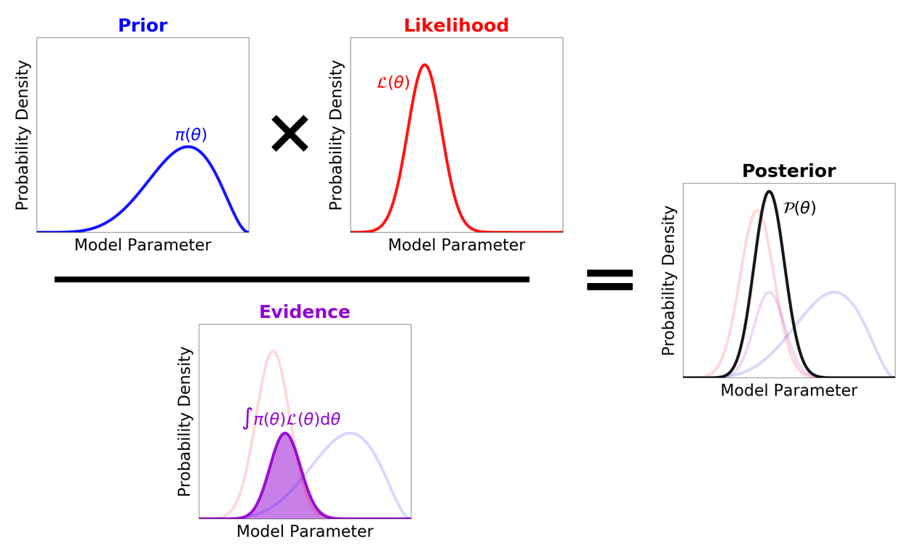

<figcaption>図1: ベイズの定理の図解。モデルパラメータ Θ の事後確率 𝒫(Θ)（黒）は、事前の信念 π(Θ)（青）と尤度 ℒ(Θ)（赤）の組み合わせに基づき、その特定のモデルに対する全体の証拠 𝒵 = ∫π(Θ)ℒ(Θ)dΘ（紫）で正規化される。詳細は §2 を参照。</figcaption>
</figure>

本稿の残りでは、これら4つの項（尤度・事前・証拠・事後）を次のような短縮記法を使って書く:

$$
\mathcal{P}(\boldsymbol{\Theta})\equiv\frac{\mathcal{L}(\boldsymbol{\Theta})\pi(\boldsymbol{\Theta})}{\int\mathcal{L}(\boldsymbol{\Theta})\pi(\boldsymbol{\Theta}){\rm d}\boldsymbol{\Theta}}\equiv\frac{\mathcal{L}(\boldsymbol{\Theta})\pi(\boldsymbol{\Theta})}{\mathcal{Z}}
$$

ここで $\mathcal{P}(\boldsymbol{\Theta})\equiv P(\boldsymbol{\Theta}_{M}|\mathbf{D},M)$ は事後分布、$\mathcal{L}(\boldsymbol{\Theta})\equiv P(\mathbf{D}|\boldsymbol{\Theta}_{M},M)$ は尤度、$\pi(\boldsymbol{\Theta})\equiv P(\boldsymbol{\Theta}_{M}|M)$ は事前分布、定数 $\mathcal{Z}\equiv P(\mathbf{D}|M)$ は証拠である。ここではほとんどの場合データとモデルは固定とみなされるので、便宜上モデル $M$ とデータ $\mathbf{D}$ の表記を省略したが、必要に応じて再導入する。

先に進む前に、いかなる結果の解釈も、その根底にあるモデルと事前分布の良さ以上にはならない、ということを強調して締めくくりたい。例えば本稿で述べる手法のいくつかを使って特定のモデルの含意を探ることは、そもそもよく動機づけられた事前分布を持つ妥当なモデルを構築することの背後にある、本質的に副次的な関心事である。読者には、本稿の残りを通じてこの考えを心に留めておくことを強く勧める。

### 演習: ノイズのある平均

#### 設定

都市の各所に温度監視ステーションがある場合を考える。各ステーション $i$ は、ある測定ノイズ $\sigma_{i}$ を伴って、任意の日の温度のノイズのある測定値 $\hat{T}_{i}$ を取る。測定値 $\hat{T}_{i}$ は、平均 $T$ と標準偏差 $\sigma_{i}$ を持つ正規（すなわちガウス）分布に従うと仮定する:

$$
\hat{T}_{i}\sim\mathcal{N}\left[{T},{\sigma_{i}}\right]
$$

これは各観測について次の確率に翻訳される:

$$
P(\hat{T}_{i}|T,\sigma_{i})\equiv\mathcal{N}\left[{T},{\sigma_{i}}\right]=\frac{1}{\sqrt{2\pi\sigma_{i}^{2}}}\exp\left[-\frac{1}{2}\frac{(\hat{T}_{i}-T)^{2}}{\sigma_{i}^{2}}\right]
$$

そして $n$ 個の観測の集まりについては

$$
P(\{\hat{T}_{i}\}_{i=1}^{n}|T,\{\sigma_{i}\}_{i=1}^{n})=\prod_{i=1}^{n}P(\hat{T}_{i}|T,\sigma_{i})
$$

となる。

いくつかの監視ステーションからの、温度（摂氏）の5つの独立なノイズのある測定値を持つと仮定しよう:

$$
\hat{T}_{1}=26.3,\>\hat{T}_{2}=30.2,\>\hat{T}_{3}=29.4,\hat{T}_{4}=30.1,\>\hat{T}_{5}=29.8
$$

対応する不確実性は

$$
\sigma_{1}=1.7,\>\sigma_{2}=1.8,\>\sigma_{3}=1.2,\sigma_{4}=0.5,\>\sigma_{5}=1.3
$$

である。過去のデータを見ると、似たような日の典型的な根底の温度 $T$ は、平均 $T_{\rm prior}=25$、変動 $\sigma_{\rm prior}=1.5$ でおおよそ正規分布していることが分かる:

$$
T\sim\mathcal{N}\left[{T_{\rm prior}=25},{\sigma_{\rm prior}=1.5}\right]
$$

#### 問題

これらの仮定を使って、観測データ $\{\hat{T}_{i}\}$ と誤差 $\{\sigma_{i}\}$ が与えられたとき、温度 $T$ の範囲にわたって、(1) 事前分布 $\pi(T)$、(2) 尤度 $\mathcal{L}(T)$、(3) 事後分布 $\mathcal{P}(T)$ を計算せよ。3つの項はどう異なるか？ 事前分布は良い仮定に見えるか？ なぜそう言える／言えないのか？

## 3 事後分布は何の役に立つのか？

上では、ベイズの定理が私たちの事前の信念と観測データを新しい事後推定 $\mathcal{P}(\boldsymbol{\Theta})\propto\mathcal{L}(\boldsymbol{\Theta})\pi(\boldsymbol{\Theta})$ にどう組み合わせられるかを述べた。しかし、これは問題の半分にすぎない。いったん事後分布を得たら、次にそれを使って身の回りの世界についての推論を行う必要がある。一般に、事後分布を使いたい方法はいくつかの広いカテゴリに分かれる:

1. 教育された推測を行う: 根底のモデルパラメータが何であるかについて妥当な推測を行う。
2. 不確実性を定量化する: 可能なモデルパラメータ値の範囲に制約を与える。
3. 予測を生成する: 根底のモデルパラメータの不確実性にわたって周辺化し、観測量やモデルパラメータに依存する他の変数を予測する。
4. モデルを比較する: 異なるモデルからの証拠を使って、どのモデルがより好ましいかを決定する。

これらの目標を達成するために、私たちはしばしば、パラメータ $\boldsymbol{\Theta}$ そのもの、またはそれらに基づく他の量 $f(\boldsymbol{\Theta})$ に対するさまざまな制約を、事後分布を使って推定しようとすることにより関心がある。これはしばしば、（尤度と事前分布を介して）私たちの事後分布によって特徴づけられる不確実性にわたって周辺化することに依存する。例えば証拠 $\mathcal{Z}$ は、ここでも単に、すべての可能なパラメータにわたる尤度と事前分布の積分である:

$$
\mathcal{Z}=\int\mathcal{L}(\boldsymbol{\Theta})\pi(\boldsymbol{\Theta}){\rm d}\boldsymbol{\Theta}\equiv\int\tilde{\mathcal{P}}(\boldsymbol{\Theta}){\rm d}\boldsymbol{\Theta}
$$

ここで $\tilde{\mathcal{P}}(\boldsymbol{\Theta})\equiv\mathcal{L}(\boldsymbol{\Theta})\pi(\boldsymbol{\Theta})$ は正規化されていない事後分布（unnormalized posterior）である。

同様に、$\boldsymbol{\Theta}=\{\boldsymbol{\Theta}_{\rm int},\boldsymbol{\Theta}_{\rm nuis}\}$ のうち「興味のある」パラメータの部分集合 $\boldsymbol{\Theta}_{\rm int}$ の振る舞いを調べているなら、残りの「局外（nuisance）」パラメータ $\boldsymbol{\Theta}_{\rm nuis}$ の振る舞いにわたって周辺化し、それらが $\boldsymbol{\Theta}_{\rm int}$ にどう影響しうるかを見たい。このプロセスは、$\boldsymbol{\Theta}$ 全体の事後分布が既知であれば、かなり直截的である:

$$
\mathcal{P}(\boldsymbol{\Theta}_{\rm int})=\int\mathcal{P}(\boldsymbol{\Theta}_{\rm int},\boldsymbol{\Theta}_{\rm nuis})\,{\rm d}\boldsymbol{\Theta}_{\rm nuis}=\int\mathcal{P}(\boldsymbol{\Theta}){\rm d}\boldsymbol{\Theta}_{\rm nuis}
$$

他の量は一般に、事後分布に関するさまざまなパラメータ依存の関数 $f(\boldsymbol{\Theta})$ の期待値から導ける:

$$
\mathbb{E}_{{\mathcal{P}}}\left[{f(\boldsymbol{\Theta})}\right]\equiv\frac{\int f(\boldsymbol{\Theta})\mathcal{P}(\boldsymbol{\Theta}){\rm d}\boldsymbol{\Theta}}{\int\mathcal{P}(\boldsymbol{\Theta}){\rm d}\boldsymbol{\Theta}}=\frac{\int f(\boldsymbol{\Theta})\tilde{\mathcal{P}}(\boldsymbol{\Theta}){\rm d}\boldsymbol{\Theta}}{\int\tilde{\mathcal{P}}(\boldsymbol{\Theta}){\rm d}\boldsymbol{\Theta}}=\int f(\boldsymbol{\Theta})\mathcal{P}(\boldsymbol{\Theta}){\rm d}\boldsymbol{\Theta}
$$

なぜなら定義により $\int\mathcal{P}(\boldsymbol{\Theta}){\rm d}\boldsymbol{\Theta}=1$ であり、$\tilde{\mathcal{P}}(\boldsymbol{\Theta})\propto\mathcal{P}(\boldsymbol{\Theta})$ だからである。これは $f(\boldsymbol{\Theta})$ の加重平均を表し、各値 $\boldsymbol{\Theta}$ において、その値が正しいと信じる確からしさに基づいて、結果の $f(\boldsymbol{\Theta})$ を重みづけする。

まとめると、ほとんどすべての場合で、私たちは事後分布そのものを知ることよりも、事後分布にわたる積分を計算することにより関心があることが分かる。別の言い方をすれば、事後分布はそれ単体ではめったに有用でなく、主にそれにわたって積分することによって有用になる。

事後分布上の期待値やその他の積分を推定することと、事後分布そのものを推定することのこの区別は、ベイズ推論の鍵となる要素である。この区別は、実際に推論を行うときに非常に重要である。なぜなら、$\mathcal{P}(\boldsymbol{\Theta})$ や $\tilde{\mathcal{P}}(\boldsymbol{\Theta})$ の推定が極めて貧弱であっても、$\mathbb{E}_{{\mathcal{P}}}\left[{f(\boldsymbol{\Theta})}\right]$ の優れた推定を得られることがしばしばあるからである。

上で述べた特定のカテゴリが、（正規化されていない）事後分布上の特定の積分にどう翻訳されるかをさらに説明するために、以下に詳細を示す。例を図2に示す。

<figure>

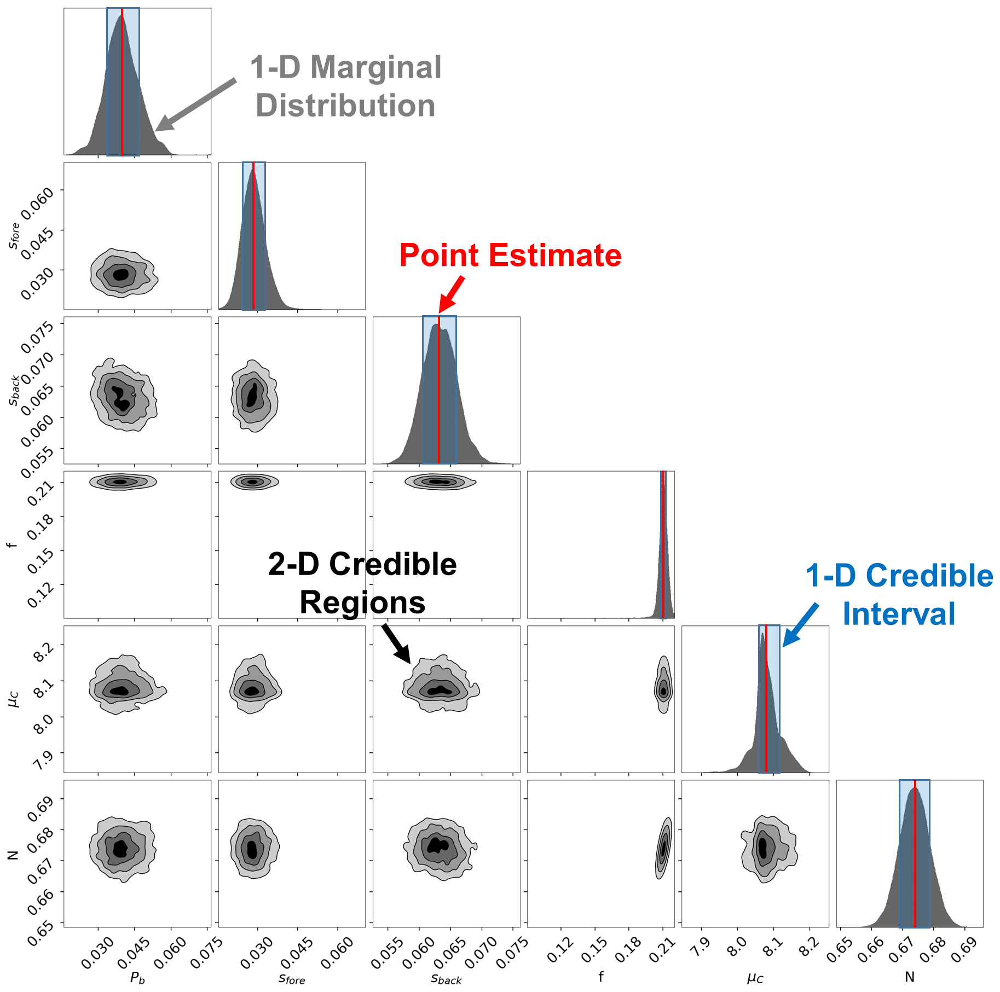

<figcaption>図2: 事後分布が実際にどう使われるかの例を示す「コーナープロット」。上段の各パネルは各パラメータの1次元周辺化事後分布（灰）と、対応する中央値の点推定（赤）・68% 信用区間（青）を示す。中央の各パネルは各2次元周辺化事後分布の 10%・40%・65%・85% 信用領域を示す。詳細は §3 を参照。</figcaption>
</figure>

### 3.1 教育された推測を行う

ベイズ推論の中核的な信条の一つは、私たちは観測データを特徴づける真のモデル $M_{*}$ もその真の根底のパラメータ $\boldsymbol{\Theta}_{*}$ も知らない、ということである: 私たちが持つモデル $M$ は、実際に起きていることの単純化であることがほぼ常である。しかし、現在のモデル $M$ が正しいと仮定するなら、事後分布 $\mathcal{P}(\boldsymbol{\Theta})$ を使って、真の値 $\boldsymbol{\Theta}_{*}$ のかなり良い推測だと思う点推定 $\hat{\boldsymbol{\Theta}}$ を提案しようとできる。

正確には何が「良い」とみなされるのか？ これは私たちが正確に何を気にするかに依存する。一般に、反対の問いを問うことで「良さ」を定量化できる: 推定 $\hat{\boldsymbol{\Theta}}\neq\boldsymbol{\Theta}_{*}$ が間違っていたら、どれだけ悪くペナルティを受けるか？ これはしばしば、点推定 $\hat{\boldsymbol{\Theta}}$ が $\boldsymbol{\Theta}_{*}$ と異なるときにペナルティを与える損失関数（loss function）$L(\hat{\boldsymbol{\Theta}}|\boldsymbol{\Theta}_{*})$ の使用を通じて表される。一般的な損失関数の例は $L(\hat{\boldsymbol{\Theta}}|\boldsymbol{\Theta}_{*})=|\hat{\boldsymbol{\Theta}}-\boldsymbol{\Theta}_{*}|^{2}$（すなわち二乗損失）であり、誤った推測は推測 $\hat{\boldsymbol{\Theta}}$ と真の値 $\boldsymbol{\Theta}_{*}$ の間の隔たりの大きさの二乗に基づいてペナルティを受ける。

残念ながら、真の損失を評価するための $\boldsymbol{\Theta}_{*}$ の実際の値を私たちは知らない。しかし、次善の策として、事後分布に基づいて $\boldsymbol{\Theta}_{*}$ のすべての可能な値にわたって平均した期待損失（expected loss）を計算できる:

$$
L_{\mathcal{P}}(\hat{\boldsymbol{\Theta}})\equiv\mathbb{E}_{{\mathcal{P}}}\left[{L(\hat{\boldsymbol{\Theta}}|\boldsymbol{\Theta})}\right]=\int L(\hat{\boldsymbol{\Theta}}|\boldsymbol{\Theta})\mathcal{P}(\boldsymbol{\Theta}){\rm d}\boldsymbol{\Theta}
$$

そして $\hat{\boldsymbol{\Theta}}$ の妥当な選択は、実際の（未知の）損失の代わりに、この期待損失を最小化する値である:

$$
\hat{\boldsymbol{\Theta}}\equiv\operatorname*{argmin}_{\boldsymbol{\Theta}^{\prime}}\left[L_{\mathcal{P}}(\boldsymbol{\Theta}^{\prime})\right]
$$

ここで $\operatorname*{argmin}$ は、期待損失 $L_{\mathcal{P}}(\boldsymbol{\Theta}^{\prime})$ を最小化する $\boldsymbol{\Theta}^{\prime}$ の値（引数）を示す。

この戦略は任意の損失関数に対して機能しうるが、$\hat{\boldsymbol{\Theta}}$ を解くにはしばしば数値手法と $\mathcal{P}(\boldsymbol{\Theta})$ にわたる繰り返しの積分が必要になる。しかし、特定の損失関数には解析解が存在する。例えば、二乗損失の下での最適な点推定 $\hat{\boldsymbol{\Theta}}$ が単に平均であることを示すのは直截的である（関心のある読者には洞察に富む演習である）。

### 3.2 不確実性を定量化する

多くの場合、私たちは $\boldsymbol{\Theta}_{*}$ の予測 $\hat{\boldsymbol{\Theta}}$ を計算することだけでなく、$\boldsymbol{\Theta}_{*}$ がある程度の確からしさで存在しうる可能な値の領域 $\mathcal{C}(\boldsymbol{\Theta})$ を制約することにも関心がある。言い換えれば、$\boldsymbol{\Theta}_{*}$ を含む確率が $X\%$ あると信じる領域 $\mathcal{C}_{X}$ を構築できるか？

この信用領域（credible region）には多くの可能な定義がある。一般的な定義の一つは、事後分布の $X\%$ が含まれる、ある事後分布の閾値 $\mathcal{P}_{X}$ より上の領域である。すなわち、

$$
\int_{\boldsymbol{\Theta}\,\in\,\mathcal{C}_{X}}\mathcal{P}(\boldsymbol{\Theta}){\rm d}\boldsymbol{\Theta}=\frac{X}{100}
$$

ただし

$$
\mathcal{C}_{X}\equiv\left\{\boldsymbol{\Theta}:\mathcal{P}(\boldsymbol{\Theta})\geq\mathcal{P}_{X}\right\}
$$

である。言い換えれば、値 $\mathcal{P}(\boldsymbol{\Theta})>\mathcal{P}_{X}$ がある閾値 $\mathcal{P}_{X}$ より大きいすべての $\boldsymbol{\Theta}$ にわたって事後分布を積分したい。ここで $\mathcal{P}_{X}$ は、この積分が事後分布全体の $X\%$ を包含するように設定される。$X$ の一般的な選択には $68\%$ と $95\%$ がある（すなわち「1シグマ」「2シグマ」信用区間）。

（周辺化された）事後分布が1次元という特別な場合、信用区間はしばしば閾値ではなくパーセンタイルを使って定義される。ここで $p$ パーセンタイルの位置 $x_{p}$ は次のように定義される:

$$
\int_{-\infty}^{x_{p}}\mathcal{P}(x){\rm d}x=\frac{p}{100}
$$

これらを使って、$x_{\rm low}=x_{(1-Y)/2}$ と $x_{\rm high}=x_{(1+Y)/2}$ をとることで、データの $Y\%$ を含む信用領域 $[x_{\rm low},x_{\rm high}]$ を定義できる。これは非対称な閾値をもたらし高次元には一般化しないが、常に中央値 $x_{50}$ を包含し、等しい裾確率（すなわち各側に事後分布の $(1-Y)/2\%$）を持つという利点がある。

一般に、本文を通じて「信用区間」を指すときは、明示的に別途述べられない限り、パーセンタイルの定義を仮定すべきである。

### 3.3 予測を行う

モデルの根底のパラメータを推定しようとすることに加えて、私たちはしばしば、モデルパラメータに依存する他の観測量や変数の予測も行いたい。根底の真のモデルパラメータ $\boldsymbol{\Theta}_{*}$ を知っていると思うなら、このプロセスは直截的である。しかし、$\boldsymbol{\Theta}_{*}$ が取りうる可能な値にわたる事後分布 $\mathcal{P}(\boldsymbol{\Theta})$ にしかアクセスできないことを考えると、何が起こるかを予測するには、この不確実性にわたって周辺化する必要がある。

この直感を、既存のデータ $\mathbf{D}$ に基づいて何らかの新しいデータ $\tilde{\mathbf{D}}$ を見る確率を表す、事後予測（posterior predictive）$P(\tilde{\mathbf{D}}|\mathbf{D})$ を使って定量化できる:

$$
P(\tilde{\mathbf{D}}|\mathbf{D})\equiv\int P(\tilde{\mathbf{D}}|\boldsymbol{\Theta})P(\boldsymbol{\Theta}|\mathbf{D}){\rm d}\boldsymbol{\Theta}\equiv\int\tilde{\mathcal{L}}(\boldsymbol{\Theta})\mathcal{P}(\boldsymbol{\Theta}){\rm d}\boldsymbol{\Theta}=\mathbb{E}_{{\mathcal{P}}}\left[{\tilde{\mathcal{L}}(\boldsymbol{\Theta})}\right]
$$

言い換えれば、仮想的なデータ $\tilde{\mathbf{D}}$ について、現在の事後分布 $\mathcal{P}(\boldsymbol{\Theta})$ に基づいて、$\boldsymbol{\Theta}$ のすべての可能な値にわたる尤度 $\tilde{\mathcal{L}}(\boldsymbol{\Theta})$ の期待値を計算したい。

### 3.4 モデルを比較する

多くのベイズ分析における最後の関心事の一つは、データが私たちの分析で仮定しているモデルのいずれかを特に支持するかどうかを調べようとすることである。私たちの事前分布の選択や、データをパラメータ化する特定の方法は、結果を解釈したい方法に大きな違いをもたらしうる。

ベイズ因子（Bayes factor）を計算することで2つのモデルを比較できる:

$$
\mathcal{R}^{1}_{2}\equiv\frac{P(M_{\rm 1}|\mathbf{D})}{P(M_{\rm 2}|\mathbf{D})}=\frac{P(\mathbf{D}|M_{\rm 1})P(M_{\rm 1})}{P(\mathbf{D}|M_{\rm 2})P(M_{\rm 2})}\equiv\frac{\mathcal{Z}_{\rm 1}}{\mathcal{Z}_{\rm 2}}\frac{\pi_{\rm 1}}{\pi_{\rm 2}}
$$

ここで $\mathcal{Z}_{M}$ はここでもモデル $M$ の証拠であり、$\pi_{M}$ は競合モデルに対して $M$ が正しいという私たちの事前の信念である。まとめると、ベイズ因子 $\mathcal{R}$ は、観測データが与えられたとき、根底のモデルパラメータ $\boldsymbol{\Theta}_{M}$ のすべての可能な値にわたって周辺化し、モデルに対する私たちの以前の相対的な確信を考慮して、特定のモデルが別のモデルよりどれだけ好まれるかを教えてくれる。

ここでも、$\mathcal{Z}_{M}$ の計算には、$\boldsymbol{\Theta}$ にわたる正規化されていない事後分布 $\tilde{\mathcal{P}}(\boldsymbol{\Theta})$ の積分 $\int\tilde{\mathcal{P}}(\boldsymbol{\Theta}){\rm d}\boldsymbol{\Theta}$ の計算が必要なことに注意。本節で概説した他の例と合わせると、ベイズ分析の多くの一般的な用途が、（場合によっては正規化されていない）事後分布上の積分の計算に依拠していることは明らかである。

### 演習: ノイズのある平均、再訪

#### 設定

§2 の温度の事後分布 $\mathcal{P}(T)$ に戻ろう。この結果を使って、可能な根底の温度 $T$ についての興味深い推定と制約を導きたい。

#### 点推定

平均は、二乗損失の下で期待損失 $L_{\mathcal{P}}(\hat{\boldsymbol{\Theta}})$ を最小化する点推定 $\hat{\boldsymbol{\Theta}}$ として定義できる:

$$
L_{\rm mean}(\hat{\boldsymbol{\Theta}}|\boldsymbol{\Theta}_{*})=|\hat{\boldsymbol{\Theta}}-\boldsymbol{\Theta}_{*}|^{2}
$$

中央値は、絶対損失の下で $L_{\mathcal{P}}(\hat{\boldsymbol{\Theta}})$ を最小化する点推定として定義できる:

$$
L_{\rm med}(\hat{\boldsymbol{\Theta}}|\boldsymbol{\Theta}_{*})=|\hat{\boldsymbol{\Theta}}-\boldsymbol{\Theta}_{*}|
$$

そして最頻値は、「破滅的（catastrophic）」損失の下で $L_{\mathcal{P}}(\hat{\boldsymbol{\Theta}})$ を最小化する点推定として定義できる:

$$
L_{\rm mode}(\hat{\boldsymbol{\Theta}}|\boldsymbol{\Theta}_{*})=-\delta(|\hat{\boldsymbol{\Theta}}-\boldsymbol{\Theta}_{*}|)
$$

ここで $\delta(\cdot)$ は次のように定義されるディラックのデルタ関数である:

$$
\int f(x)\delta(x-a){\rm d}x=f(a)
$$

平均・中央値・最頻値のこれらの表現が与えられたとき、対応する事後分布から対応する温度の点推定 $T_{\rm mean}$・$T_{\rm med}$・$T_{\rm mode}$ を推定せよ。これらの計算を行うために、さまざまな解析的・数値的手法を自由に試してみよ。

私たちの事前分布に使った過去のデータは、平均温度に何らかの長期的変化があったなら、今日では同じようにはあてはまらないかもしれないと予想できる。例えば、平均温度は時間とともに上昇していると予想されるので、より暑い温度 $T\geq T_{\rm prior}$ を、より涼しい温度 $T<T_{\rm prior}$ ほどにはペナルティを与えたくないかもしれない。この情報を、次のような非対称な損失関数に符号化できる:

$$
L(\hat{T}|T_{*})=\begin{cases}|\hat{T}-T_{*}|^{3}&T<T_{\rm prior}\\
|\hat{T}-T_{*}|&T\geq T_{\rm prior}\end{cases}
$$

この場合に期待損失を最小化する最適な点推定 $T_{\rm asym}$ は何か？

#### 信用区間

次に、不確実性を定量化しよう。事後分布 $\mathcal{P}(T)$ が与えられたとき、事後分布の閾値 $\mathcal{P}_{X}$ を使って 50%・80%・95% 信用区間を計算せよ。次に、これらの信用区間をパーセンタイルを使って計算せよ。2つの方法で計算した信用区間に違いはあるか？ なぜそうなる／ならないのか？

#### 事後予測

不確実性を次の観測に伝播させるために、前の5つ $\{\hat{T}_{1},\dots,\hat{T}_{5}\}$ が与えられたとき、次の観測について、$\sigma_{6}=0$・$\sigma_{6}=0.5$・$\sigma_{6}=2$ の不確実性を仮定して、可能な温度測定値 $\hat{T}_{6}$ の範囲にわたって事後予測 $P(\hat{T}_{6}|\{\hat{T}_{1},\dots,\hat{T}_{5}\})$ を計算せよ。

#### モデル比較

最後に、私たちの事前分布が良い仮定に見えるかどうかを調べたい。数値手法を使って、平均 $T_{\rm prior}=25$、標準偏差 $\sigma_{\rm prior}=1.5$ のデフォルトの事前分布に対する証拠 $\mathcal{Z}$ を計算せよ。次に、温度がおよそ5度上昇したと仮定し、平均 $T_{\rm prior}=30$ だが対応するより大きな不確実性 $\sigma_{\rm prior}=3$ を持つ代替の事前分布に基づいて推定した証拠と比較せよ。一方のモデルが他方より特に好まれるか？

## 4 グリッドによる事後分布の積分の近似

ここで、事後分布の積分を推定する手法を調べたい。場合によっては（例: 共役事前分布）これらは解析的に計算できるが、これは一般には成り立たない。したがって §3 で概説したような量を適切に推定するには、数値手法の使用が必要になる（前の演習で強調した通り）。

まず、$\boldsymbol{\Theta}$ にわたる積分が1次元の場合に焦点を当てる。その場合、離散的な点のグリッドにわたるリーマン和（Riemann sum）のような標準的な数値手法を使ってそれを近似できる:

$$
\mathbb{E}_{{\mathcal{P}}}\left[{f(\boldsymbol{\Theta})}\right]=\int f(\boldsymbol{\Theta})\mathcal{P}(\boldsymbol{\Theta}){\rm d}\boldsymbol{\Theta}\approx\sum_{i=1}^{n}f(\boldsymbol{\Theta}_{i})\mathcal{P}(\boldsymbol{\Theta}_{i})\Delta\boldsymbol{\Theta}_{i}
$$

ここで

$$
\Delta\boldsymbol{\Theta}_{i}=\boldsymbol{\Theta}_{j+1}-\boldsymbol{\Theta}_{j}
$$

は単に根底のグリッド上の $j=1,\dots,n+1$ 個の点の間隔であり、

$$
\boldsymbol{\Theta}_{i}=\frac{\boldsymbol{\Theta}_{j+1}+\boldsymbol{\Theta}_{j}}{2}
$$

は $\boldsymbol{\Theta}_{j}$ と $\boldsymbol{\Theta}_{j+1}$ の中点と定義される。図3に示すように、このアプローチは、高さ $f(\boldsymbol{\Theta}_{i})\mathcal{P}(\boldsymbol{\Theta}_{i})$・幅 $\Delta\boldsymbol{\Theta}_{i}$ の $n$ 個の離散的な長方形を使って積分を近似しようとすることに似ている。

<figure>

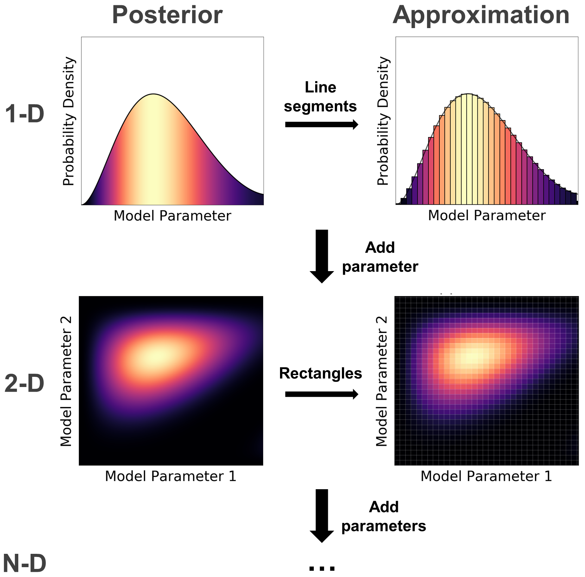

<figcaption>図3: 離散的な点のグリッドを使って事後分布の積分を近似する方法の図解。事後分布を、位置 Θᵢ（端点や中点）・対応する事後密度 𝒫(Θᵢ)・体積 ΔΘᵢ で定義される i=1,…,n 個の連続した領域に分割する。積分は各領域をその中に含まれる事後質量 𝒫(Θᵢ)×ΔΘᵢ に比例して足し合わせることで近似できる。1次元（上）ではこの体積要素は線分に、2次元（中）では長方形に対応する。高次元（下）へ一般化でき、そこでは N 次元の直方体を使う。詳細は §4 を参照。</figcaption>
</figure>

この考えは高次元に一般化できる。その場合、積分を $n$ 個の1次元の線分に分割する代わりに、$n$ 個の N 次元の直方体（cuboid）に分解できる。各要素の寄与は、「高さ」$f(\boldsymbol{\Theta}_{i})\mathcal{P}(\boldsymbol{\Theta}_{i})$ と体積

$$
\Delta\boldsymbol{\Theta}_{i}=\prod_{j=1}^{d}\Delta\Theta_{i,j}
$$

の積に比例する。ここで $\Delta\Theta_{i,j}$ は $i$ 番目の直方体の $j$ 番目の次元での幅である。この手続きの視覚的表現は図3を参照。

期待値に $\mathcal{P}(\boldsymbol{\Theta})=\tilde{\mathcal{P}}(\boldsymbol{\Theta})/\mathcal{Z}$ を代入し、任意の積分をそのグリッドベースの近似で置き換えると、次が得られる:

$$
\mathbb{E}_{{\mathcal{P}}}\left[{f(\boldsymbol{\Theta})}\right]=\frac{\int f(\boldsymbol{\Theta}){\mathcal{P}}(\boldsymbol{\Theta}){\rm d}\boldsymbol{\Theta}}{\int{\mathcal{P}}(\boldsymbol{\Theta}){\rm d}\boldsymbol{\Theta}}=\frac{\int f(\boldsymbol{\Theta})\tilde{\mathcal{P}}(\boldsymbol{\Theta}){\rm d}\boldsymbol{\Theta}}{\int\tilde{\mathcal{P}}(\boldsymbol{\Theta}){\rm d}\boldsymbol{\Theta}}\approx\frac{\sum_{i=1}^{n}f(\boldsymbol{\Theta}_{i})\tilde{\mathcal{P}}(\boldsymbol{\Theta}_{i})\Delta\boldsymbol{\Theta}_{i}}{\sum_{i=1}^{n}\tilde{\mathcal{P}}(\boldsymbol{\Theta}_{i})\Delta\boldsymbol{\Theta}_{i}}
$$

分母がいまや証拠の推定になっていることに注意:

$$
\mathcal{Z}=\int\tilde{\mathcal{P}}(\boldsymbol{\Theta}){\rm d}\boldsymbol{\Theta}\approx\sum_{i=1}^{n}\tilde{\mathcal{P}}(\boldsymbol{\Theta}_{i})\Delta\boldsymbol{\Theta}_{j}
$$

事後分布 $\mathcal{P}(\boldsymbol{\Theta})$ をこの正規化されていない事後分布 $\tilde{\mathcal{P}}(\boldsymbol{\Theta})$ で置き換えることは、実際に期待値を計算する上で決定的に重要な部分である。なぜなら $\mathcal{Z}$ を知らなくても $\tilde{\mathcal{P}}(\boldsymbol{\Theta})=\mathcal{L}(\boldsymbol{\Theta})\pi(\boldsymbol{\Theta})$ を直接計算できるからである。

### 4.1 次元の呪い

このアプローチは直截的だが、一つの即座かつ深刻な欠点がある: グリッド点の総数が次元数の増加とともに指数関数的に増加する。例えば、各次元におよそ $k\geq 2$ 個のグリッド点があると仮定すると、グリッド内の総点数 $n$ は次のようにスケールする:

$$
n\sim\prod_{j=1}^{d}k=k^{d}
$$

これは、$k=2$ という絶対的な最良の場合でさえ、$2^{d}$ のスケーリングを持つことを意味する。

このひどいスケーリングはしばしば次元の呪い（curse of dimensionality）と呼ばれる。この指数的依存は、高次元分布（すなわちパラメータ数の多いモデルの事後分布）の一般的な特徴であることが判明し、§7 で再びこれに立ち返る。

### 4.2 有効サンプルサイズ

この次元の指数的スケーリングとは別に、グリッドの使用にはより微妙な欠点がある。分布の形を事前に知らないので、グリッドの各部分（すなわち各 N 次元直方体）の寄与は、グリッドの構造に依存して非常に不均一になりうる。言い換えれば、このアプローチの有効性は、グリッド点の数 $n$ だけでなく、それらがどこに割り当てられるかにも依存する。グリッド点をうまく指定しないと、$\tilde{\mathcal{P}}(\boldsymbol{\Theta})$ かつ／または $f(\boldsymbol{\Theta})\tilde{\mathcal{P}}(\boldsymbol{\Theta})$ が比較的小さい領域に多くの点が位置することになりうる。これはすると、それぞれの和が、はるかに大きな相対的「重み」を持つ少数の点に支配されることを意味する。理想的には、この効果を緩和するために、事後分布が大きい領域でグリッドの解像度を上げ、他の場所では下げたい。

前の段落での「重み」という用語の使用はかなり意図的であることに注意。元の近似に立ち返ると、式 (19) の形は、$f(\boldsymbol{\Theta})$ の加重標本平均を計算するのに使われるかもしれない形にかなり似ている。その場合、$n$ 個の観測 $\{f_{1},\dots,f_{n}\}$ と対応する重み $\{w_{1},\dots,w_{n}\}$ があるとき、加重平均は単に:

$$
\hat{f}_{\rm mean}\equiv\frac{\sum_{i=1}^{n}w_{i}f_{i}}{\sum_{i=1}^{n}w_{i}}
$$

である。実際、

$$
f_{i}\equiv f(\boldsymbol{\Theta}_{i}),\quad w_{i}\equiv\tilde{\mathcal{P}}(\boldsymbol{\Theta}_{i})\Delta\boldsymbol{\Theta}_{i}
$$

と定義すれば、式 (22) の加重標本平均と式 (19) のグリッドからの期待値の間のつながりが明示的になる:

$$
\mathbb{E}_{{\mathcal{P}}}\left[{f(\boldsymbol{\Theta})}\right]\approx\frac{\sum_{i=1}^{n}f(\boldsymbol{\Theta}_{i})\tilde{\mathcal{P}}(\boldsymbol{\Theta}_{i})\Delta\boldsymbol{\Theta}_{i}}{\sum_{i=1}^{n}\tilde{\mathcal{P}}(\boldsymbol{\Theta}_{i})\Delta\boldsymbol{\Theta}_{i}}\equiv\frac{\sum_{i=1}^{n}w_{i}f_{i}}{\sum_{i=1}^{n}w_{i}}
$$

グリッドを $n$ 個のサンプルの集合と考えることで、対応する有効サンプルサイズ（effective sample size, ESS）$n_{\rm eff}\leq n$ を考えることもできる。ESS は、すべてのサンプルが同じ量の情報を寄与するわけではない、という考えを表す: 互いに非常に似た $n$ 個のサンプルを持つなら、かなり異なる $n$ 個のサンプルを持つ場合よりも、推定が大幅に悪くなると予想される。これは、相関したサンプルの情報が少なくとも部分的に互いに冗長であり、その冗長性の量が相関の強さとともに増加するからである: 2つの独立なサンプルは分布について完全に固有の情報を提供し互いについての情報は提供しないが、2つの相関したサンプルは、根底の分布についての情報を犠牲にして互いについての情報を提供する。

<figure>

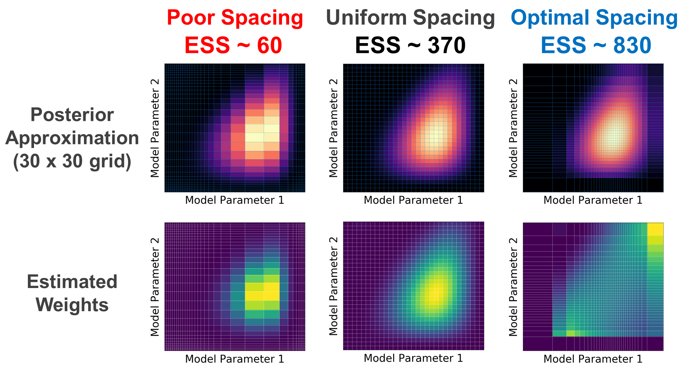

<figcaption>図4: グリッドの間隔（体積要素）を変えることが、対応する事後分布の積分の推定にどれほど劇的に影響しうるかの例。トイの2次元事後分布 𝒫(Θ) 上で、対応する 30×30 の2次元グリッドの間隔を変えるだけで、有効サンプルサイズ（ESS）が劇的に変わる（§4.2 参照）。貧弱な間隔（左）・一様な間隔（中）・最適な間隔（右）の違いが、各グリッドの体積要素に対応する重みの分布（下）に示されるように、ESS に1桁の違いをもたらす。詳細は §4 を参照。</figcaption>
</figure>

グリッドに戻ると、この対応は、グリッド点をより効率的に割り当てられれば、現在持っているものと少なくとも同じくらい良い期待値 $\mathbb{E}_{{\mathcal{P}}}\left[{f(\boldsymbol{\Theta})}\right]$ の推定を、より少ない数 $n_{\rm eff}\leq n$ のグリッド点を使って理論的に得られることを意味する。この区別が重要なのは、期待値の推定の誤差が一般に $n$ ではなく $n_{\rm eff}$ の関数としてスケールするからである。例えば、平均の誤差は典型的に $\propto n^{-1/2}$ ではなく $\propto n_{\rm eff}^{-1/2}$ となる。

上で議論した ESS の背後にある考えを、[^11] に従って形式的な定義を導入することで定量化できる:

$$
n_{\rm eff}\equiv\frac{\left(\sum_{i=1}^{n}w_{i}\right)^{2}}{\sum_{i=1}^{n}w_{i}^{2}}
$$

私たちの直感に沿って、この定義の下での最良の場合は、すべての重みが等しい（$w_{i}=w$）場合である:

$$
n_{\rm eff}^{\rm best}=\frac{\left(\sum_{i=1}^{n}w_{i}\right)^{2}}{\sum_{i=1}^{n}w_{i}^{2}}=\frac{(nw)^{2}}{\sum_{i=1}^{n}w^{2}}=\frac{n^{2}w^{2}}{nw^{2}}=n
$$

同様に、最悪の場合は、すべての重みが単一のサンプルに集中している（$i=j$ で $w_{i}=w$、それ以外で $w_{i}=0$）場合である:

$$
n_{\rm eff}^{\rm worst}=\frac{\left(\sum_{i=1}^{n}w_{i}\right)^{2}}{\sum_{i=1}^{n}w_{i}^{2}}=\frac{(w)^{2}}{w^{2}}=1
$$

前者の状況（$n_{\rm eff}^{\rm best}$）は、グリッドの各要素がすべて積分におよそ同じ寄与をする場合であり、後者（$n_{\rm eff}^{\rm worst}$）は、積分全体が本質的に $n$ 個の N 次元直方体領域のうちのただ1つに含まれる場合である。この振る舞いの図解を図4に示す。

### 4.3 収束と一貫性

グリッドの構造と ESS の関係を概説したところで、最後の2つの問題、収束（convergence）と一貫性（consistency）を検討したい。収束とは、$n$ 個のサンプル（グリッド点）を使った推定はノイズが多いかもしれないが、$n\rightarrow\infty$ につれて何らかの基準値に近づくという考えである:

$$
\lim_{n\rightarrow\infty}\frac{\sum_{i=1}^{n}f(\boldsymbol{\Theta}_{i})\tilde{\mathcal{P}}(\boldsymbol{\Theta}_{i})\Delta\boldsymbol{\Theta}_{i}}{\sum_{i=1}^{n}\tilde{\mathcal{P}}(\boldsymbol{\Theta}_{i})\Delta\boldsymbol{\Theta}_{i}}=C
$$

一貫性は続いて、収束する値が、推定したい真の値であるという考えである:

$$
\lim_{n\rightarrow\infty}\frac{\sum_{i=1}^{n}f(\boldsymbol{\Theta}_{i})\tilde{\mathcal{P}}(\boldsymbol{\Theta}_{i})\Delta\boldsymbol{\Theta}_{i}}{\sum_{i=1}^{n}\tilde{\mathcal{P}}(\boldsymbol{\Theta}_{i})\Delta\boldsymbol{\Theta}_{i}}=\mathbb{E}_{{\mathcal{P}}}\left[{f(\boldsymbol{\Theta})}\right]
$$

<figure>

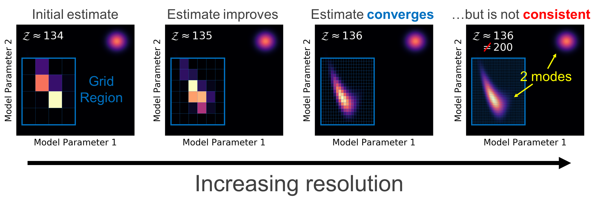

<figcaption>図5: グリッドベースの推定が収束的（グリッド点数の増加につれ単一の値に収束する）だが一貫的でない（収束する値が正しい答えでない）ことがありうる様子の図解。トイの2次元の正規化されていない事後分布 𝒫̃(Θ) は、よく離れた2つのモードを持ち、総証拠は 𝒵=200。第2のモードに気づかないと、全パラメータ空間の一部しか包含しないグリッド領域を定義してしまうかもしれない（左）。この領域内でグリッドの解像度を上げると推定 𝒵 は単一の答えに収束する（左から右）が、これは他の成分の寄与を無視したため正しい答えに等しくない（右）。詳細は §4.3 を参照。</figcaption>
</figure>

期待値が well-defined（すなわち存在する）であり、グリッドが $\boldsymbol{\Theta}$ の全領域を覆う（すなわちすべての次元で最小・最大の可能な値にわたる）なら、グリッドを使うことが期待値を推定する一貫的な方法であることを示すのは直截的である。これは直感的に納得できるはずだ: パラメータ空間のどの領域も「見逃さない」ように、グリッドが $\boldsymbol{\Theta}$ で十分に広範であれば、単に $\Delta\boldsymbol{\Theta}$ の解像度を上げることで $\mathbb{E}_{{\mathcal{P}}}\left[{f(\boldsymbol{\Theta})}\right]$ を任意の精度で推定できるはずである。

残念ながら、グリッドが $\boldsymbol{\Theta}$ のどの範囲の値にわたるべきかを事前には知らない。パラメータは $(-\infty,+\infty)$ にわたりうるが、グリッドは有限体積の要素に依拠するので、グリッド化する何らかの有限の部分空間を選ばなければならない。したがって、グリッドはグリッド点がわたる範囲内で何らかの値に収束する推定を与えるかもしれないが、事後分布のかなりの部分がその範囲外にある可能性が常にある。これらの場合、グリッドは $\mathbb{E}_{{\mathcal{P}}}\left[{f(\boldsymbol{\Theta})}\right]$ の一貫的な推定量であることが保証されない。この問題の図解を図5に示す。この根本的な問題は、§5 で扱うモンテカルロ法には共有されない。

### 演習: 2次元ガウス上のグリッド

#### 設定

平均 $(\mu_{x},\mu_{y})$・標準偏差 $(\sigma_{x},\sigma_{y})$ を中心とする2次元ガウス（正規）分布でよく近似される、正規化されていない事後分布を考える:

$$
\tilde{\mathcal{P}}(x,y)=\exp\left\{-\frac{1}{2}\left[\frac{(x-\mu_{x})^{2}}{\sigma_{x}^{2}}+\frac{(y-\mu_{y})^{2}}{\sigma_{y}^{2}}\right]\right\}
$$

事後分布が平均 $0$・標準偏差 $1$ を持つと予想すると仮定する。しかし実際には、事後分布は平均 $(\mu_{x},\mu_{y})=(-0.3,0.8)$・標準偏差 $(\sigma_{x}^{2},\sigma_{y}^{2})=(2,0.5)$ を持ち、事前の予想と事後の推論がいくらか食い違うという一般的な場合を模している。

#### グリッドベースの推定

2次元グリッドを使ってさまざまな形の事後分布の積分を推定したい。$[-2,2]$ から等間隔の $5\times 5$ グリッドから始めて、(1) 証拠 $\mathcal{Z}$、(2) 平均 $\mathbb{E}_{{\mathcal{P}}}\left[{x}\right]$ と $\mathbb{E}_{{\mathcal{P}}}\left[{y}\right]$、(3) 68% 信用区間（または最も近い近似）$[x_{\rm low},x_{\rm high}]$ と $[y_{\rm low},y_{\rm high}]$、(4) 有効サンプルサイズ $n_{\rm eff}$ を計算せよ。これらの各量は、予想される値に対してどれだけ正確か？ $n_{\rm eff}/n$ は、グリッド点をどれだけ効率的に割り当てたかについて何を教えてくれるか？

#### 収束

上の演習を、$20\times 20$ 点と $100\times 100$ 点の等間隔グリッドを使って繰り返せ。違いについてコメントせよ。全体の精度はどれだけ向上したか？ 推定は収束的に見えるか？

#### 一貫性

次に、グリッドの境界を $[-5,5]$ に拡張し、上と同じ演習を行え。答えは大きく変わるか？ もしそうなら、これは私たちの以前の推定の一貫性について何を教えてくれるか？ 答えが収束的かつ一貫的に見えるまで、グリッドの密度と境界を調整せよ。事後分布の正確な形を事前に知らないことを思い出せ。これはグリッドを実際に適用する際の一般的な懸念について何を含意するか？

#### 有効サンプルサイズ

最後に、§4.2 で概説した定義に基づいて有効サンプルサイズを最大化するように $x$ と $y$ のグリッド点の位置を調整する直截的な方式があるかどうかを探れ。もしあれば、なぜそれが機能するか説明できるか？ なければ、なぜか？ 等価な等間隔グリッドと比べて、グリッド間隔を適応的に調整することで $n_{\rm eff}$ と推定の全体的な精度をどれだけ改善できるか？

## 5 グリッドからモンテカルロ法へ

### 5.1 グリッド点とサンプルを結びつける

先に、$n$ 個の点のグリッドを使って $\mathbb{E}_{{\mathcal{P}}}\left[{f(\boldsymbol{\Theta})}\right]$ を推定することを、$n$ 個のサンプル $\{f_{1},\dots,f_{n}\}$ と一連の対応する重み $\{w_{1},\dots,w_{n}\}$ を使った等価な推定にどう関係づけられるかを概説した。主な結果は、事後分布とグリッドの構造が、各点 $f_{i}\equiv f(\boldsymbol{\Theta}_{i})$ に対する重み $w_{i}\equiv\tilde{\mathcal{P}}(\boldsymbol{\Theta}_{i})\Delta\boldsymbol{\Theta}_{i}$ の相対的な振幅と密接に結びついていることである。グリッドの解像度を調整するとこれらの重みが影響を受け、重みのより一様な分布がより大きい ESS をもたらし、推定を改善しうる。

間隔を減らす（グリッドを密にする）と重みも減るという事実は理にかなっている: その領域により多くの点があるので、$\mathbb{E}_{{\mathcal{P}}}\left[{f(\boldsymbol{\Theta})}\right]$ を計算するとき各点は一般により少ない相対的な重みを得るべきだ。同様に、同じ間隔でも事後分布の相対的な形を変えれば、$\mathbb{E}_{{\mathcal{P}}}\left[{f(\boldsymbol{\Theta})}\right]$ を推定するときのその点の重みもそれに応じて変わるはずだ。

ここで、この基本的な関係をさらに拡張したい。理論的には、グリッドの解像度を適応的に上げることで、重みを導くのに使う体積要素 $\Delta\boldsymbol{\Theta}_{i}$ をより制御できる。事後分布の形を十分よく知っていれば、大きな $n$ に対して、重み $w_{i}=\tilde{\mathcal{P}}(\boldsymbol{\Theta}_{i})\Delta\boldsymbol{\Theta}_{i}$ が望む精度まで一様になるように $\Delta\boldsymbol{\Theta}_{i}$ を理論的に調整できるはずだ。考察により、これは次のときに起こるはずである:

$$
\Delta\boldsymbol{\Theta}_{i}\propto\frac{1}{\tilde{\mathcal{P}}(\boldsymbol{\Theta}_{i})}
$$

がすべての $i$ について成り立つとき。

この推論を概念的な極限まで進めると、$n\rightarrow\infty$ につれて、間隔 $\Delta\boldsymbol{\Theta}$ が $\boldsymbol{\Theta}$ の関数として変化する、ますます多くのグリッド点を使って事後分布を推定することを想像できる。これを使って、$\boldsymbol{\Theta}$ の関数としての無限に細かいグリッドの変化する解像度 $\Delta\boldsymbol{\Theta}(\boldsymbol{\Theta})$ に基づいて、点の密度 $\mathcal{Q}(\boldsymbol{\Theta})$ を定義できる:

$$
\mathcal{Q}(\boldsymbol{\Theta})\propto\frac{1}{\Delta\boldsymbol{\Theta}(\boldsymbol{\Theta})}
$$

この結果は、$n\rightarrow\infty$ の連続極限では、無限解像度のグリッドの構造が新しい連続分布 $\mathcal{Q}(\boldsymbol{\Theta})$ に等価であることを示唆する。この概念の図解を図6に示す。$\mathcal{Q}(\boldsymbol{\Theta})$ を使って、元の期待値を次のように書き直せる:

$$
\mathbb{E}_{{\mathcal{P}}}\left[{f(\boldsymbol{\Theta})}\right]\equiv\frac{\int f(\boldsymbol{\Theta})\tilde{\mathcal{P}}(\boldsymbol{\Theta}){\rm d}\boldsymbol{\Theta}}{\int\tilde{\mathcal{P}}(\boldsymbol{\Theta}){\rm d}\boldsymbol{\Theta}}=\frac{\int f(\boldsymbol{\Theta})\frac{\tilde{\mathcal{P}}(\boldsymbol{\Theta})}{\mathcal{Q}(\boldsymbol{\Theta})}\mathcal{Q}(\boldsymbol{\Theta}){\rm d}\boldsymbol{\Theta}}{\int\frac{\tilde{\mathcal{P}}(\boldsymbol{\Theta})}{\mathcal{Q}(\boldsymbol{\Theta})}\mathcal{Q}(\boldsymbol{\Theta}){\rm d}\boldsymbol{\Theta}}=\frac{\mathbb{E}_{{\mathcal{Q}}}\left[{f(\boldsymbol{\Theta})\tilde{\mathcal{P}}(\boldsymbol{\Theta})/\mathcal{Q}(\boldsymbol{\Theta})}\right]}{\mathbb{E}_{{\mathcal{Q}}}\left[{\tilde{\mathcal{P}}(\boldsymbol{\Theta})/\mathcal{Q}(\boldsymbol{\Theta})}\right]}
$$

まもなく明らかになる理由から、$\mathcal{Q}(\boldsymbol{\Theta})$ を提案分布（proposal distribution）と呼ぶ。

<figure>

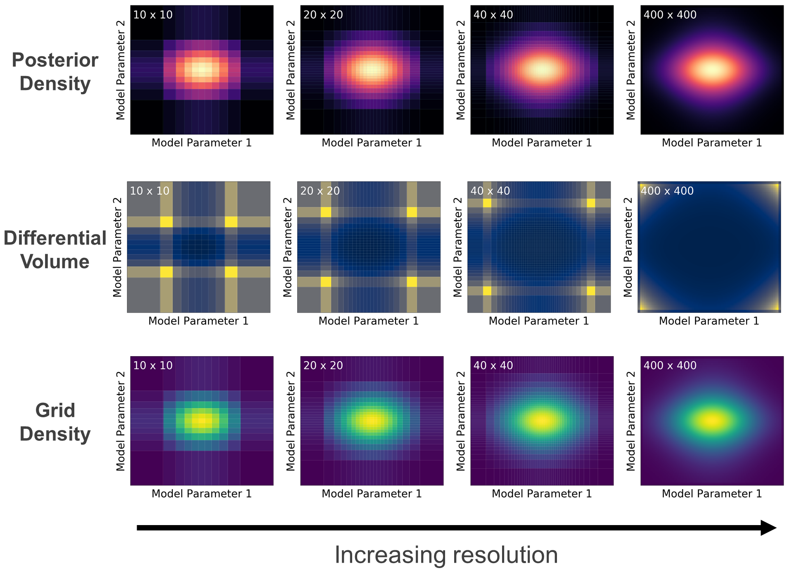

<figcaption>図6: グリッドと連続密度分布の間のつながりの図解。グリッド点数を増やすと、事後分布 𝒫(Θ) の推定が改善する（上）。グリッド点間の間隔が有効サンプルサイズを最大化するように変化する（図4・§4.2 参照）ので、微分体積要素 ΔΘᵢ は位置に依存して変わる（中）。体積要素の数を増やし続けると、任意の位置でのグリッド点の密度 ρ(Θᵢ)=[ΔΘᵢ]⁻¹ が、その分布が 𝒫 に似た連続関数 𝒬(Θ) のように振る舞う（下）。これは 𝒬 を何らかの形で 𝒫 の推定に使えるはずだということを含意する。詳細は §5 を参照。</figcaption>
</figure>

この時点では、これは主に数学的なトリックに見えるかもしれない: 私がしたのは、（正規化されていない）事後分布 $\tilde{\mathcal{P}}(\boldsymbol{\Theta})$ に関する元の単一の期待値を、提案分布 $\mathcal{Q}(\boldsymbol{\Theta})$ に関する2つの期待値で書き直しただけだ。しかしこの置き換えは、実際にはグリッド点とサンプルの間のつながりを完全に実現させてくれる。

先に、グリッド点からの期待値の推定が、グリッド点が重み $\{w_{1},\dots,w_{n}\}$ を持つランダムサンプル $\{f_{1},\dots,f_{n}\}$ だと仮定して導く推定と正確に類似していることを示した。しかし、いったん期待値を $\mathcal{Q}(\boldsymbol{\Theta})$ に関して定義すれば、$\mathcal{Q}(\boldsymbol{\Theta})$ から明示的にサンプルを生成できると仮定して、この主張は厳密になりうる。

これが何を意味するか手早く復習しよう。最初、$n$ 個の点のグリッド上で $\mathbb{E}_{{\mathcal{P}}}\left[{f(\boldsymbol{\Theta})}\right]$ を推定しようとした。しかし無限解像度の極限では、グリッドは何らかの分布 $\mathcal{Q}(\boldsymbol{\Theta})$ に等価になる。$\mathcal{Q}(\boldsymbol{\Theta})$ を使って、元の式を $\mathcal{P}(\boldsymbol{\Theta})$ の代わりに $\mathcal{Q}(\boldsymbol{\Theta})$ に関する2つの期待値 $\mathbb{E}_{{\mathcal{Q}}}\left[{f(\boldsymbol{\Theta})\tilde{\mathcal{P}}(\boldsymbol{\Theta})/\mathcal{Q}(\boldsymbol{\Theta})}\right]$ と $\mathbb{E}_{{\mathcal{Q}}}\left[{\tilde{\mathcal{P}}(\boldsymbol{\Theta})/\mathcal{Q}(\boldsymbol{\Theta})}\right]$ で書き直せる。これが役立つのは、これらの最終的な式を、$\mathcal{Q}(\boldsymbol{\Theta})$ からランダムに生成した一連の $n$ 個のサンプルを使って理論的に明示的に推定できるからである。このアプローチに内在するランダム性ゆえに、これはランダム性と賭博との歴史的なつながりから、$\mathbb{E}_{{\mathcal{P}}}\left[{f(\boldsymbol{\Theta})}\right]$ を推定するモンテカルロアプローチと一般に呼ばれる。

一見すると、これは驚くべき主張に映るはずだ。関数 $f(\boldsymbol{\Theta})$ の積分を有界なグリッド上で計算するとき、グリッドの離散化に関係する近似の誤差があることを私たちは知っている。この誤差は完全に決定論的である: グリッド点の数 $n$ と特定の離散化密度 $\mathcal{Q}(\boldsymbol{\Theta})\propto 1/\Delta\boldsymbol{\Theta}(\boldsymbol{\Theta})$ が与えられれば、$\mathbb{E}_{{\mathcal{P}}}\left[{f(\boldsymbol{\Theta})}\right]$ について毎回同じ結果（と誤差）が得られる。

対照的に、$\mathcal{Q}(\boldsymbol{\Theta})$ から $n$ 個のサンプル $\{\boldsymbol{\Theta}_{1},\dots,\boldsymbol{\Theta}_{n}\}$ を引くことは、本質的にランダムな（すなわち確率的な）プロセスであり、点のグリッドとは似ても似つかないように見える。そしてこれらの点は本質的にランダムなので、私たちの推定と $\mathbb{E}_{{\mathcal{P}}}\left[{f(\boldsymbol{\Theta})}\right]$ の真の値との間の実際の偏差もランダムになる。ランダムサンプルからの「誤差」は、$\mathcal{Q}(\boldsymbol{\Theta})$ から生成した特定の数 $n$ のサンプルが与えられたとき、ランダムプロセスの多くの可能な実現にわたって推定がどれだけ異なりうると予想されるかについて教えてくれる。$n$ と $\mathcal{Q}(\boldsymbol{\Theta})$ を調整するにつれて、これらの非常に異なるアプローチからおよそ等価な推定を導けるという事実が、グリッド点とサンプルの間のつながりの核心にある。

適応的な間隔のグリッドから連続分布 $\mathcal{Q}(\boldsymbol{\Theta})$ へ移ることには、3つの主要な利点がある。第一に、グリッドは常に何らかの最小解像度 $\Delta\boldsymbol{\Theta}_{i}$ を持ち、重みをおよそ一様にするのを難しくし、実際の最大 ESS を制限する。対照的に、$\mathcal{Q}(\boldsymbol{\Theta})$ を事後分布 $\mathcal{P}(\boldsymbol{\Theta})$ により近く一致させ、固定の $n$ でより大きい ESS を与えることが理論的にできる。

第二に、いまや有限のグリッド点数ではなく分布を扱っているので、期待値を推定するときに何らかの有限体積に制限されない。分布は $(-\infty,+\infty)$ にわたりうるので、事後分布 $\mathcal{P}(\boldsymbol{\Theta})$ が定義されうるすべての可能な $\boldsymbol{\Theta}$ 値にわたって $\mathcal{Q}(\boldsymbol{\Theta})$ が十分なカバレッジを提供することを保証できる。これは、$(-\infty,+\infty)$ にわたる事後分布にグリッドを適用することに関連する §4.3 で提起した理論的問題のいくつかが、もはや適用されないことを意味する。したがってモンテカルロ法は、グリッドベースの手法よりも広い範囲の可能な事後分布の期待値に対して一貫的な推定量として機能でき、大幅に柔軟になる。

最後に、グリッド点の最小数は、周辺化したいパラメータの数に関わらず、常に次元数とともに指数関数的にスケールする（§4.1 参照）。モンテカルロ法はこれらに依拠しないので、期待値 $\mathbb{E}_{{\mathcal{P}}}\left[{f(\boldsymbol{\Theta})}\right]$ を推定するときパラメータの周辺化を完全に活用できる。したがってこの効果の影響を受けにくい（ただし §7.2 を参照）。

### 5.2 重点サンプリング

これまで強調しようとしてきたように、本稿の中核的な信条は、私たちは $\mathcal{P}(\boldsymbol{\Theta})$ がどう見えるかを事前に知らない、ということである。これは、どのグリッド構造が $\mathbb{E}_{{\mathcal{P}}}\left[{f(\boldsymbol{\Theta})}\right]$ の最適な推定（すなわち最大 ESS）を提供するかを知らず、ましてや連続極限でそれが $\mathcal{Q}(\boldsymbol{\Theta})$ としてどう振る舞うべきかも知らないことを意味する。これは、そこからのサンプル生成を簡単で直截的にするように $\mathcal{Q}(\boldsymbol{\Theta})$ を選ぶ十分な動機を与える。

そのような $\mathcal{Q}(\boldsymbol{\Theta})$ を選んだと仮定すると、続いてそこから $n$ 個のサンプルを生成できる。これらのサンプルが重み $q_{i}$ を持つと仮定し、

$$
f(\boldsymbol{\Theta}_{i})\equiv f_{i},\quad\tilde{\mathcal{P}}(\boldsymbol{\Theta}_{i})/\mathcal{Q}(\boldsymbol{\Theta}_{i})\equiv\tilde{w}(\boldsymbol{\Theta}_{i})\equiv\tilde{w}_{i}
$$

と定義すると、元の式は次に簡約される:

$$
\mathbb{E}_{{\mathcal{P}}}\left[{f(\boldsymbol{\Theta})}\right]=\frac{\mathbb{E}_{{\mathcal{Q}}}\left[{f(\boldsymbol{\Theta})\tilde{w}(\boldsymbol{\Theta})}\right]}{\mathbb{E}_{{\mathcal{Q}}}\left[{\tilde{w}(\boldsymbol{\Theta})}\right]}\approx\frac{\sum_{i=1}^{n}f_{i}\tilde{w}_{i}q_{i}}{\sum_{i=1}^{n}\tilde{w}_{i}q_{i}}
$$

さらに、独立同分布（iid）なサンプルをシミュレートできるように $\mathcal{Q}(\boldsymbol{\Theta})$ を選んだと仮定すると、対応する標本の重みは即座に $q_{i}=1/n$ に簡約され、結果は次になる:

$$
\mathbb{E}_{{\mathcal{P}}}\left[{f(\boldsymbol{\Theta})}\right]\approx\frac{n^{-1}\sum_{i=1}^{n}f_{i}\tilde{w}_{i}}{n^{-1}\sum_{i=1}^{n}\tilde{w}_{i}}
$$

グリッドを使った前の場合（§4）と同様に、この式の分母はここでも証拠の直接的な近似である:

$$
\mathcal{Z}=\int\tilde{\mathcal{P}}(\boldsymbol{\Theta}){\rm d}\boldsymbol{\Theta}\approx n^{-1}\sum_{i=1}^{n}\tilde{w}_{i}
$$

これは、元の期待値を推定する直截的なレシピを与える:

1. $\mathcal{Q}(\boldsymbol{\Theta})$ から $n$ 個の iid サンプル $\{\boldsymbol{\Theta}_{1},\dots,\boldsymbol{\Theta}_{n}\}$ を引く。
2. それらの対応する重み $\tilde{w}_{i}=\tilde{\mathcal{P}}(\boldsymbol{\Theta}_{i})/\mathcal{Q}(\boldsymbol{\Theta}_{i})$ を計算する。
3. 加重標本平均を使って $\mathbb{E}_{{\mathcal{Q}}}\left[{\tilde{w}(\boldsymbol{\Theta})}\right]$ と $\mathbb{E}_{{\mathcal{Q}}}\left[{f(\boldsymbol{\Theta})\tilde{w}(\boldsymbol{\Theta})}\right]$ を計算して $\mathbb{E}_{{\mathcal{P}}}\left[{f(\boldsymbol{\Theta})}\right]$ を推定する。

このプロセスは単に $\tilde{w}_{i}$ に基づいてサンプルを「再重みづけ」することを含むので、これらの重みはしばしば重点重み（importance weights）と呼ばれ、この手法は重点サンプリング（Importance Sampling）と呼ばれる。重点サンプリングの模式的な図解を図7に示す。

<figure>

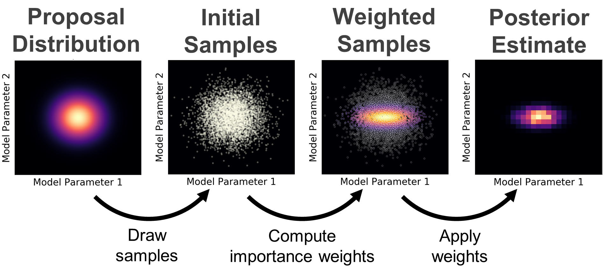

<figcaption>図7: 重点サンプリングの模式的な図解。まず与えられた提案分布 𝒬(Θ)（左）を取り、そこから n 個の iid サンプルを生成する（中左）。次に各サンプルを、その位置で持つ対応する「重要度」𝒫̃(Θ)/𝒬(Θ) に基づいて重みづけする（中右）。これらの重みづけされたサンプルを使って事後分布の期待値を近似できる（右）。詳細は §5.2 を参照。</figcaption>
</figure>

重点重みは、元の推測 $\mathcal{Q}(\boldsymbol{\Theta})$ が真実 $\mathcal{P}(\boldsymbol{\Theta})$ からどれだけ「外れている」かを補正する方法と解釈できる。位置 $\boldsymbol{\Theta}_{i}$ で事後密度が提案密度に対して高いなら、事後分布から直接サンプルを引いた場合に見られたであろうものと比べて、その位置でサンプルを生成する可能性が低かった。結果として、その位置でのサンプルの期待される不足を考慮するために、対応する重みを増やすべきである。事後密度が提案密度に対して低いなら、逆が真であり、その位置でのサンプルの期待される過剰を考慮するために、対応するサンプルの重みを下げたい。

### 5.3 サンプリング戦略の例

重点サンプリングは、$n$ 個のサンプルの対応する集合に対する重み $\{\tilde{w}_{1},\dots,\tilde{w}_{n}\}$ が、異なるモンテカルロサンプリング戦略にどう関係するかを理解するための有用な第一歩として役立つ。

例として、一般的なアプローチの一つは、体積 $V$ の何らかの直方体内に一様にサンプルを生成することである。このための提案分布は次になる:

$$
\mathcal{Q}^{\rm unif}(\boldsymbol{\Theta})=\begin{cases}1/V&\boldsymbol{\Theta}\>{\rm が直方体内}\\
0&{\rm それ以外}\end{cases}
$$

対応する重点重みは続いて、与えられた位置での事後分布に単に比例する:

$$
\tilde{w}_{i}^{\rm unif}=\frac{\tilde{\mathcal{P}}(\boldsymbol{\Theta}_{i})}{\mathcal{Q}^{\rm unif}(\boldsymbol{\Theta}_{i})}=V\tilde{\mathcal{P}}(\boldsymbol{\Theta}_{i})\propto\mathcal{P}(\boldsymbol{\Theta}_{i})
$$

別の可能なアプローチは、代わりに提案を事前分布とすることである:

$$
\mathcal{Q}^{\rm prior}(\boldsymbol{\Theta})=\pi(\boldsymbol{\Theta})
$$

これはよく動機づけられた選択に見える: 事前分布はデータを見る前の知識を特徴づけるので、有用な最初の推測として機能し、すべての可能性の範囲を包含するはずだ。この仮定の下で、いまや重みが各位置で尤度 $\mathcal{L}(\boldsymbol{\Theta})$ に等しいことが分かる:

$$
w_{i}^{\rm prior}=\frac{\tilde{\mathcal{P}}(\boldsymbol{\Theta}_{i})}{\mathcal{Q}^{\rm prior}(\boldsymbol{\Theta}_{i})}=\frac{\mathcal{L}(\boldsymbol{\Theta}_{i})\pi(\boldsymbol{\Theta}_{i})}{\pi(\boldsymbol{\Theta}_{i})}=\mathcal{L}(\boldsymbol{\Theta}_{i})
$$

最後に、最適なサンプリング戦略は、提案を事後分布と同一に取れると仮定することであることに注意:

$$
\mathcal{Q}^{\rm post}(\boldsymbol{\Theta})=\mathcal{P}(\boldsymbol{\Theta})
$$

対応する重みは続いて単に定数で、証拠 $\mathcal{Z}$ に等しくなる:

$$
w_{i}^{\rm post}=\frac{\tilde{\mathcal{P}}(\boldsymbol{\Theta}_{i})}{\mathcal{Q}^{\rm post}(\boldsymbol{\Theta}_{i})}=\frac{\mathcal{Z}\mathcal{P}(\boldsymbol{\Theta}_{i})}{\mathcal{P}(\boldsymbol{\Theta}_{i})}=\mathcal{Z}
$$

予想通り、この最終結果は $n_{\rm eff}=n$ という可能な最大 ESS を保証する。したがって $\mathcal{Q}(\boldsymbol{\Theta})$ を $\mathcal{P}(\boldsymbol{\Theta})$ にできるだけ「近く」することが、重点サンプリングを使って期待値を推定しようとする分析の決定的な部分になる。§6 以降で議論するマルコフ連鎖モンテカルロ（MCMC）法の使用を特に動機づけるのは、まさにこの結果である: もし何らかの方法で $\mathcal{P}(\boldsymbol{\Theta})$ そのもの、またはそれに近いものから直接サンプルを生成できれば、対応する期待値の最適な推定を達成できる。

### 演習: 2次元ガウス上の重点サンプリング

#### 設定

§4 の演習に戻ろう。そこでは正規化されていない事後分布が2次元ガウス（正規）分布でよく近似される:

$$
\tilde{\mathcal{P}}(x,y)=\exp\left\{-\frac{1}{2}\left[\frac{(x-\mu_{x})^{2}}{\sigma_{x}^{2}}+\frac{(y-\mu_{y})^{2}}{\sigma_{y}^{2}}\right]\right\}
$$

ここで $(\mu_{x},\mu_{y})=(-0.3,0.8)$、$(\sigma_{x}^{2},\sigma_{y}^{2})=(2,0.5)$ である。

#### 重点サンプリング

重点サンプリングを使って、この分布からさまざまな事後分布の積分を近似したい。まず提案分布 $\mathcal{Q}(x,y)$ を、平均 $0$・標準偏差 $1$ の2次元ガウスとして選ぶことから始める:

$$
\mathcal{Q}(x,y)=\mathcal{N}\left[{(\mu_{x},\mu_{y})=(0,0)},{(\sigma_{x},\sigma_{y})=(1,1)}\right]
$$

提案分布から引いた $n=25$ 個の iid ランダムサンプルを使って、(1) 証拠 $\mathcal{Z}$、(2) 平均 $\mathbb{E}_{{\mathcal{P}}}\left[{x}\right]$ と $\mathbb{E}_{{\mathcal{P}}}\left[{y}\right]$、(3) 68% 信用区間（または最も近い近似）、(4) 有効サンプルサイズ $n_{\rm eff}$ の推定を計算せよ。これらの各量は予想される値に対してどれだけ正確か？ $n_{\rm eff}/n$ は、提案 $\mathcal{Q}(x,y)$ が根底の事後分布 $\mathcal{P}(x,y)$ をどれだけよくたどっているかについて何を教えてくれるか？

#### 不確実性

上の演習を $m=100$ 回繰り返して、各量の推定がどれだけばらつきうるかの推定を得よ。ばらつきは、典型的な有効サンプルサイズが与えられたときに予想されるものと一致するか？ なぜそうなる／ならないのか？

#### 収束

次に、$n=25$ 点ではなく $n=100$・$n=1000$・$n=10000$ 点を使って上の演習を繰り返し、違いについてコメントせよ。全体の精度はどれだけ向上したか？ $n_{\rm eff}$ が増えるにつれて推定は収束的かつ一貫的に見えるか？ 量の誤差は $n$ かつ／または $n_{\rm eff}$ の関数としてどれだけ縮むか？ この振る舞いは予想通りか？

#### 一貫性

次に、提案分布を $(\sigma_{x},\sigma_{y})=(2,2)$ に拡張して、事後分布の「裾」でより多くのカバレッジを得よ。$n=\{100,1000,10000\}$ 個の iid ランダムサンプルで上と同じ演習を行え。答えは大きく変わるか？ なぜそうなる／ならないのか？

理論的には $n_{\rm eff}\approx n$ となるように $\mathcal{Q}(x,y)\approx\mathcal{P}(x,y)$ を選べるが、事後分布の正確な形を事前には知らない。$\tilde{\mathcal{P}}(x,y)$ が当初の予想と異なりうることを考えると、この演習は重点サンプリングを実際に適用する際の一般的な懸念について何を含意するか？

## 6 マルコフ連鎖モンテカルロ

重みがさまざまなモンテカルロサンプリング戦略（例: 事前分布からのサンプル生成）にどう関係するかを見たところで、ここでマルコフ連鎖モンテカルロ（MCMC）の背後にある考えを概説する。簡潔に言えば、MCMC 法は、各サンプルに対応する重点重み $\{\tilde{w}_{1},\dots,\tilde{w}_{n}\}$ が定数になるようにサンプルを生成しようとする。§5.3 の結果に基づくと、これは MCMC が、期待値の最適な推定に到達するために、事後分布 $\mathcal{P}(\boldsymbol{\Theta})$ に比例してサンプルを生成しようとすることを意味する。

MCMC はこれを、$n$ 回の反復にわたって（相関した）パラメータ値の連鎖 $\{\boldsymbol{\Theta}_{1}\rightarrow\dots\rightarrow\boldsymbol{\Theta}_{n}\}$ を作ることで達成する。ここで、$\boldsymbol{\Theta}_{i}$ を中心とする特定の領域 $\delta_{\boldsymbol{\Theta}_{i}}$ で費やされる反復回数 $m(\boldsymbol{\Theta}_{i})$ は、その領域内に含まれる事後密度 $\mathcal{P}(\boldsymbol{\Theta}_{i})$ に比例する。言い換えれば、MCMC から生成されるサンプルの「密度」

$$
\rho(\boldsymbol{\Theta})\equiv\frac{m(\boldsymbol{\Theta})}{n}
$$

を位置 $\boldsymbol{\Theta}$ で $\delta_{\boldsymbol{\Theta}}$ にわたって積分したものは、おおよそ

$$
\int_{\boldsymbol{\Theta}\in\delta_{\boldsymbol{\Theta}}}\mathcal{P}(\boldsymbol{\Theta}){\rm d}\boldsymbol{\Theta}\approx\int_{\boldsymbol{\Theta}\in\delta_{\boldsymbol{\Theta}}}\rho(\boldsymbol{\Theta}){\rm d}\boldsymbol{\Theta}\approx n^{-1}\sum_{j=1}^{n}\mathds{1}\left[{\boldsymbol{\Theta}_{j}\in\delta_{\boldsymbol{\Theta}}}\right]
$$

である。ここで $\mathds{1}\left[{\cdot}\right]$ は、内部の条件が真なら $1$、それ以外なら $0$ と評価される指示関数（indicator function）である。したがって、$\delta_{\boldsymbol{\Theta}}$ 内のサンプル数を単に足し上げ、サンプルの総数 $n$ で正規化することで密度を近似できる。この概念の模式的な図解を図8に示す。

<figure>

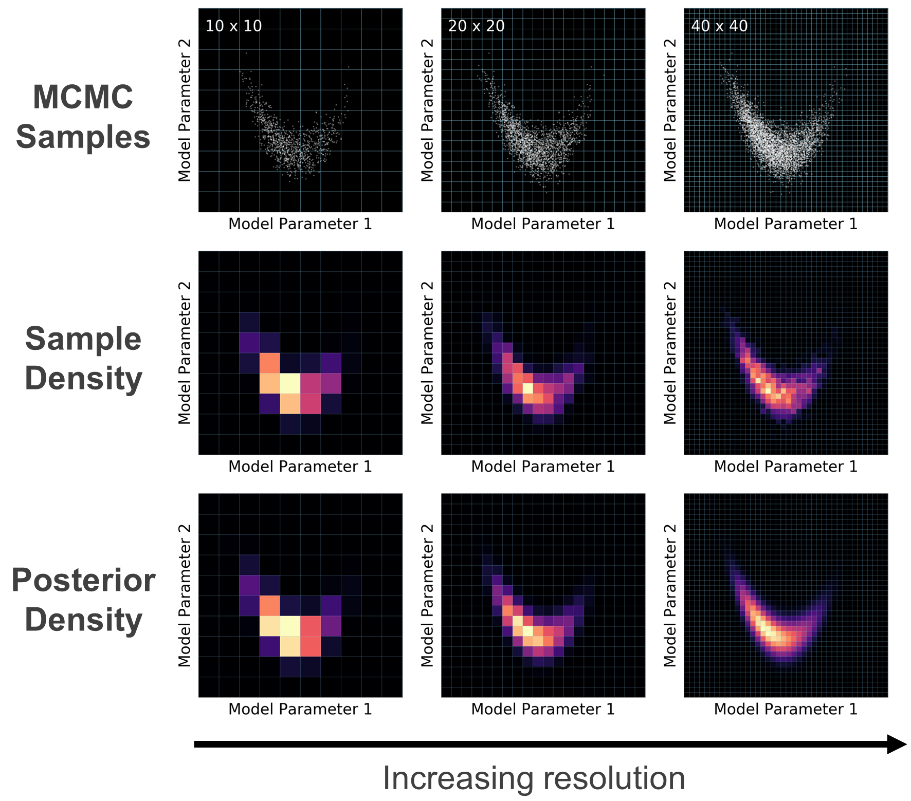

<figcaption>図8: マルコフ連鎖モンテカルロ（MCMC）の模式的な図解。MCMC は、ある特定の体積 δ 内のサンプル数 m が、同じ体積にわたって積分した事後分布 𝒫(Θ)（下）に匹敵する相対密度 m/n（中）を与えるように、n 個の（相関した）サンプルの連鎖 {Θ₁→…→Θₙ}（上）を作ろうとする。詳細は §6 を参照。</figcaption>
</figure>

これは任意の有限の $n$ に対してはおよそ真であるにすぎないが、サンプル数 $n\rightarrow\infty$ につれて、この手続きは一般に $\rho(\boldsymbol{\Theta})\rightarrow\mathcal{P}(\boldsymbol{\Theta})$ がいたるところで成り立つことを保証する。すると理論的には、$\rho(\boldsymbol{\Theta})$ の十分よい近似を得たら、$\rho(\boldsymbol{\Theta})$ から生成したサンプル $\{\boldsymbol{\Theta}_{1}\rightarrow\dots\rightarrow\boldsymbol{\Theta}_{n}\}$ を使って、§5 で導入したのと同じ置き換えのトリックで証拠の推定も得られる:

$$
\mathcal{Z}=\int\frac{\tilde{\mathcal{P}}(\boldsymbol{\Theta})}{\rho(\boldsymbol{\Theta})}\rho(\boldsymbol{\Theta}){\rm d}\boldsymbol{\Theta}\equiv\mathbb{E}_{{\rho}}\left[{\tilde{\mathcal{P}}(\boldsymbol{\Theta})/\rho(\boldsymbol{\Theta})}\right]\approx n^{-1}\sum_{i=1}^{n}\frac{\tilde{\mathcal{P}}(\boldsymbol{\Theta}_{i})}{\rho(\boldsymbol{\Theta}_{i})}
$$

これは単に、すべての $n$ 個のサンプルにわたる $\tilde{\mathcal{P}}(\boldsymbol{\Theta}_{i})$ と $\rho(\boldsymbol{\Theta}_{i})$ の比の平均である。

最後に、私たちの MCMC 手続きは事後分布からの $n$ 個のサンプルを与えるので、期待値は単に次に簡約される:

$$
\mathbb{E}_{{\mathcal{P}}}\left[{f(\boldsymbol{\Theta})}\right]\approx\frac{n^{-1}\sum_{i=1}^{n}f_{i}\tilde{w}_{i}}{n^{-1}\sum_{i=1}^{n}\tilde{w}_{i}}=\frac{n^{-1}\sum_{i=1}^{n}f_{i}}{n^{-1}\sum_{i=1}^{n}1}=n^{-1}\sum_{i=1}^{n}f_{i}
$$

これは単に、$n$ 個のサンプルの集合にわたる対応する $\{f_{1},\dots,f_{n}\}$ 値の標本平均である。

ここで、MCMC 法をめぐる一般的な誤解に関連する、上の結果の2つの特徴を強調したい。第一に、MCMC 法は事後分布に従う振る舞いのサンプルの連鎖を生成するので、証拠 $\mathcal{Z}$ のような正規化定数を推定するのにそれらを使う能力が一切ない、という広く信じられている考えがある。上で示したように、これはまったく真でない: $\rho(\boldsymbol{\Theta})$ を使ってこれができるだけでなく、導く推定は実際に一貫的なものである（ただし収束は遅い。§7.1 参照）。

第二の誤解は、MCMC の主な目的が事後分布を「近似」または「探索」することだ、というものである。言い換えれば、$\rho(\boldsymbol{\Theta})$ を推定すること。しかし上で示したように、MCMC 法が $\rho(\boldsymbol{\Theta})$ を推定する能力は、実際には証拠 $\mathcal{Z}$ を推定するのにしか役立たない。実際、重点サンプリングベースの手法からの系譜をたどると、その主な目的は実際には期待値（すなわち事後分布上の積分）を推定することだと分かる。この誤解を避けるため、ここまで「事後分布を近似する」という言及を導入することを明示的に避けてきたが、この点については §7.1 でより詳しく議論する。

まとめると、MCMC の背後にある考えは、一連の値 $\{\boldsymbol{\Theta}_{1}\rightarrow\dots\rightarrow\boldsymbol{\Theta}_{n}\}$ を、ある時間後のその密度 $\rho(\boldsymbol{\Theta})$ が根底の事後分布 $\mathcal{P}(\boldsymbol{\Theta})$ に従うようにシミュレートすることである。すると、特定の領域 $\delta_{\boldsymbol{\Theta}}$ 内でシミュレートしたサンプル数を単に数え上げ、生成したサンプルの総数 $n$ で正規化することで、その領域内の事後分布を推定できる。事後分布から直接値をシミュレートしているので、任意の期待値も単純な標本平均に簡約される。この手続きは信じられないほど直感的で、MCMC 法がこれほど広く採用された理由の一部である。

### 6.1 Metropolis–Hastings アルゴリズムでサンプルを生成する

サンプルを生成するさまざまなアプローチについては膨大な文献がある。本稿は MCMC 法の概念的理解の構築に焦点を当てているので、これらの手法の大半が理論的・実践的にどう振る舞うかを探ることは本稿の範囲を超える。

概観の代わりに、これらの手法がどう動作するかの基礎を明確にすることを目指す。中心的な考えは、$n\rightarrow\infty$ につれて最終的なサンプルの分布 $\rho(\boldsymbol{\Theta})$ が (1) 定常的（stationary, すなわち何かに収束する）であり、(2) $\mathcal{P}(\boldsymbol{\Theta})$ に等しい、ように新しいサンプル $\boldsymbol{\Theta}_{i}\rightarrow\boldsymbol{\Theta}_{i+1}$ を生成する方法が欲しい、ということである。これらは本質的に §4.3 で議論した収束と一貫性の制約の類似物である。

第一の条件は、詳細釣り合い（detailed balance）を呼び出すことで満たせる。これは、ある位置から別の位置へ移るときに確率が保存される（すなわちプロセスが可逆である）という考えである。より形式的には、これは単に確率の因数分解に簡約される:

$$
P(\boldsymbol{\Theta}_{i+1}|\boldsymbol{\Theta}_{i})P(\boldsymbol{\Theta}_{i})=P(\boldsymbol{\Theta}_{i+1},\boldsymbol{\Theta}_{i})=P(\boldsymbol{\Theta}_{i}|\boldsymbol{\Theta}_{i+1})P(\boldsymbol{\Theta}_{i+1})
$$

ここで $P(\boldsymbol{\Theta}_{i+1}|\boldsymbol{\Theta}_{i})$ は $\boldsymbol{\Theta}_{i}\rightarrow\boldsymbol{\Theta}_{i+1}$ へ移る確率、$P(\boldsymbol{\Theta}_{i}|\boldsymbol{\Theta}_{i+1})$ は逆の移動 $\boldsymbol{\Theta}_{i+1}\rightarrow\boldsymbol{\Theta}_{i}$ の確率である。並べ替えると次の制約が得られる:

$$
\frac{P(\boldsymbol{\Theta}_{i+1}|\boldsymbol{\Theta}_{i})}{P(\boldsymbol{\Theta}_{i}|\boldsymbol{\Theta}_{i+1})}=\frac{P(\boldsymbol{\Theta}_{i+1})}{P(\boldsymbol{\Theta}_{i})}=\frac{\mathcal{P}(\boldsymbol{\Theta}_{i+1})}{\mathcal{P}(\boldsymbol{\Theta}_{i})}
$$

ここで最後の等式は、サンプルを生成しようとしている分布が事後分布 $\mathcal{P}(\boldsymbol{\Theta})$ であるという事実から来る。

いまや、この確率を計算することで実際に新しい位置に移れる手続きを実装する必要がある。これは各移動を2つのステップに分けることで可能である。第一に、重点サンプリング（§5.2）で使った $\mathcal{Q}(\boldsymbol{\Theta})$ に似た性質の提案分布 $\mathcal{Q}(\boldsymbol{\Theta}_{i+1}^{\prime}|\boldsymbol{\Theta}_{i})$ に基づいて新しい位置 $\boldsymbol{\Theta}_{i}\rightarrow\boldsymbol{\Theta}_{i+1}^{\prime}$ を提案したい。次に、何らかの遷移確率 $T(\boldsymbol{\Theta}_{i+1}^{\prime}|\boldsymbol{\Theta}_{i})$ で、新しい位置を受容する（$\boldsymbol{\Theta}_{i+1}=\boldsymbol{\Theta}_{i+1}^{\prime}$）か、新しい位置を棄却する（$\boldsymbol{\Theta}_{i+1}=\boldsymbol{\Theta}_{i}$）かを決める。これらの項を組み合わせると、新しい位置に移る確率が得られる:

$$
P(\boldsymbol{\Theta}_{i+1}|\boldsymbol{\Theta}_{i})\equiv\mathcal{Q}(\boldsymbol{\Theta}_{i+1}|\boldsymbol{\Theta}_{i})T(\boldsymbol{\Theta}_{i+1}|\boldsymbol{\Theta}_{i})
$$

重点サンプリングと同様に、数値シミュレーションで新しいサンプル $\boldsymbol{\Theta}_{i+1}^{\prime}$ を提案するのが直截的になるように $\mathcal{Q}(\boldsymbol{\Theta}_{i+1}^{\prime}|\boldsymbol{\Theta}_{i})$ を選べる。次に、$\boldsymbol{\Theta}_{i+1}^{\prime}$ を受容すべきか棄却すべきかの遷移確率 $T(\boldsymbol{\Theta}_{i+1}^{\prime}|\boldsymbol{\Theta}_{i})$ を決める必要がある。詳細釣り合いの式に代入すると、遷移確率の形が次の制約を満たさなければならないことが分かる:

$$
\frac{T(\boldsymbol{\Theta}_{i+1}|\boldsymbol{\Theta}_{i})}{T(\boldsymbol{\Theta}_{i}|\boldsymbol{\Theta}_{i+1})}=\frac{\mathcal{P}(\boldsymbol{\Theta}_{i+1})}{\mathcal{P}(\boldsymbol{\Theta}_{i})}\frac{\mathcal{Q}(\boldsymbol{\Theta}_{i}|\boldsymbol{\Theta}_{i+1})}{\mathcal{Q}(\boldsymbol{\Theta}_{i+1}|\boldsymbol{\Theta}_{i})}
$$

Metropolis 基準（Metropolis criterion）[^12]

$$
T(\boldsymbol{\Theta}_{i+1}|\boldsymbol{\Theta}_{i})\equiv\min\left[1,\frac{\mathcal{P}(\boldsymbol{\Theta}_{i+1})}{\mathcal{P}(\boldsymbol{\Theta}_{i})}\frac{\mathcal{Q}(\boldsymbol{\Theta}_{i}|\boldsymbol{\Theta}_{i+1})}{\mathcal{Q}(\boldsymbol{\Theta}_{i+1}|\boldsymbol{\Theta}_{i})}\right]
$$

がこの制約を満たすことを示すのは直截的である。

このアプローチに従ってサンプルを生成することは、Metropolis–Hastings（MH）アルゴリズム [^12] [^9] を使って行える:

1. 提案分布 $\mathcal{Q}(\boldsymbol{\Theta}_{i+1}^{\prime}|\boldsymbol{\Theta}_{i})$ からサンプルを生成して新しい位置 $\boldsymbol{\Theta}_{i}\rightarrow\boldsymbol{\Theta}_{i+1}^{\prime}$ を提案する。
2. 遷移確率 $T(\boldsymbol{\Theta}_{i+1}^{\prime}|\boldsymbol{\Theta}_{i})=\min\left[1,\frac{\mathcal{P}(\boldsymbol{\Theta}_{i+1}^{\prime})}{\mathcal{P}(\boldsymbol{\Theta}_{i})}\frac{\mathcal{Q}(\boldsymbol{\Theta}_{i}|\boldsymbol{\Theta}_{i+1}^{\prime})}{\mathcal{Q}(\boldsymbol{\Theta}_{i+1}^{\prime}|\boldsymbol{\Theta}_{i})}\right]$ を計算する。
3. $[0,1]$ から乱数 $u_{i+1}$ を生成する。
4. $u_{i+1}\leq T(\boldsymbol{\Theta}_{i+1}^{\prime}|\boldsymbol{\Theta}_{i})$ なら、移動を受容し $\boldsymbol{\Theta}_{i+1}=\boldsymbol{\Theta}_{i+1}^{\prime}$ とする。$u_{i+1}>T(\boldsymbol{\Theta}_{i+1}^{\prime}|\boldsymbol{\Theta}_{i})$ なら、移動を棄却し $\boldsymbol{\Theta}_{i+1}=\boldsymbol{\Theta}_{i}$ とする。
5. $i=i+1$ と増分し、このプロセスを繰り返す。

このプロセスの模式的な図解は図9を参照。

<figure>

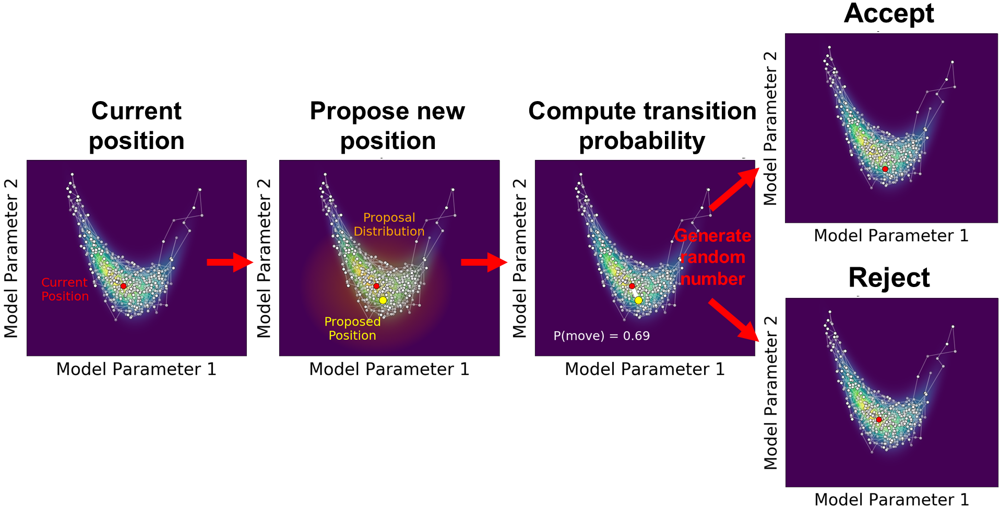

<figcaption>図9: Metropolis–Hastings アルゴリズムの模式的な図解。ある反復 i で、現在の位置 Θᵢ（赤）まで連鎖 {Θ₁→…→Θᵢ}（白）を生成済み。その振る舞いは根底の事後分布 𝒫(Θ)（viridis カラーマップ）に従う。提案分布（橙の陰影領域）から新しい位置 Θ′ᵢ₊₁（黄）を提案し、事後 𝒫 と提案 𝒬(Θ′|Θ) の密度に基づいて遷移確率 T(Θ′ᵢ₊₁|Θᵢ)（白）を計算する。0〜1 から一様に乱数 uᵢ₊₁ を生成し、uᵢ₊₁≤T なら移動を受容し次の位置を Θᵢ₊₁=Θ′ᵢ₊₁ に、棄却なら Θᵢ₊₁=Θᵢ にする。詳細は §6.1 を参照。</figcaption>
</figure>

MH アルゴリズムのようなアルゴリズムは、次に提案される位置が過去の位置のいずれでもなく現在の位置にのみ依存する（すなわち過去を「忘れる」）状態の連鎖を生成するので、マルコフ過程（Markov processes）として知られる。これら2つの用語を、新しい位置をシミュレートするモンテカルロの性質と組み合わせたものが、マルコフ連鎖モンテカルロ（MCMC）にその名を与える。

実際にサンプルの連鎖を生成する際の問題は、連鎖が有限の長さと開始位置 $\boldsymbol{\Theta}_{0}$ しか持たないという事実である。連鎖が無限に長ければ、パラメータ空間のすべての可能な位置を訪れると予想され、正確な開始位置は重要でなくなる。しかし実際には $n$ 回の反復後にサンプリングを終了するので、極めて低い確率を持つ位置 $\boldsymbol{\Theta}_{0}$ から始めると、$n$ 個のサンプルの不相応な割合がこの低確率領域を占めることになり、最終結果にバイアスをかける可能性がある。$\boldsymbol{\Theta}_{0}$ が事後分布に対してどこにあるかについて事前の知識が限られているので、実際には、連鎖がより高確率の領域からサンプリングし始めたと確信できたら、初期の状態の連鎖を除去したい。この burn-in 期間からサンプルを特定し除去するさまざまなアプローチの議論は本稿の範囲を超える。詳細は関連文献とともに [^7]・[^5]・[^18] を参照されたい。

### 6.2 有効サンプルサイズと自己相関時間

この時点で、MCMC はあらゆる状況に対して最適な手法であるべきように見える: （未知の）事後分布から直接サンプルをシミュレートすることで、評価したい任意の期待値の最適な推定を達成できる。しかし実際には、これは成り立たない。MCMC の値は、サンプルを生成するために MH アルゴリズムのような特定のアルゴリズム手続きに依拠し、その極限の振る舞いは、分布が事後分布に従うサンプルの連鎖 $\{\boldsymbol{\Theta}_{1}\rightarrow\dots\rightarrow\boldsymbol{\Theta}_{n}\}$ に簡約される。しかし、任意のサンプル $\boldsymbol{\Theta}_{i}$ は、連鎖の前のサンプル $\boldsymbol{\Theta}_{i-1}$ とも後のサンプル $\boldsymbol{\Theta}_{i+1}$ とも相関している可能性が高い。

これは2つの理由で起こる。第一に、$\mathcal{Q}(\boldsymbol{\Theta}_{i}|\boldsymbol{\Theta}_{i-1})$ から引いた新しい位置 $\boldsymbol{\Theta}_{i}$ は、構成上、現在の位置 $\boldsymbol{\Theta}_{i-1}$ に依存する傾向がある。これは、反復 $i+1$ で提案する位置が反復 $i$ の位置と相関し、それ自体が反復 $i-1$ の位置と相関し、という具合になることを意味する。

第二に、すべての提案位置が無相関になるように $\mathcal{Q}(\boldsymbol{\Theta}^{\prime}|\boldsymbol{\Theta})=\mathcal{Q}(\boldsymbol{\Theta}^{\prime})$ と設定しても、遷移確率 $T(\boldsymbol{\Theta}^{\prime}|\boldsymbol{\Theta})$ はやはり、最終的に新しい位置を棄却して $\boldsymbol{\Theta}_{i+1}=\boldsymbol{\Theta}_{i}$ となることを保証する。まったく同じ位置のサンプルは最大限に相関しているので、これは連鎖からのサンプルが「平均して」非ゼロの相関を持つことを保証する。低い受容率（すなわち棄却ではなく受容される提案の割合）を持つと、連鎖のより大きな割合がこれらの完全に相関したサンプルを含むことになり、全体の相関が増すことに注意。

§4.2 で述べたように、相関したサンプルは、その振る舞いが根底の分布だけでなく系列内の近傍のサンプルにも依存するので、サンプリングされる根底の分布についてより少ない情報を提供する。より強く相関したサンプルは、すると ESS を減らすはずである。

この直感は、ある整数のラグ $t$ に対する自己共分散（auto-covariance）$C(t)$ を導入することで定量化できる。無限に長い連鎖 $\{\boldsymbol{\Theta}_{1}\rightarrow\dots\}$ を持つと仮定すると、自己共分散 $C(t)$ は:

$$
C(t)\equiv\mathbb{E}_{{i}}\left[{(\boldsymbol{\Theta}_{i}-\bar{\boldsymbol{\Theta}})\cdot(\boldsymbol{\Theta}_{i+t}-\bar{\boldsymbol{\Theta}})}\right]=\lim_{n\rightarrow\infty}\frac{1}{n}\sum_{i=1}^{n}(\boldsymbol{\Theta}_{i}-\bar{\boldsymbol{\Theta}})\cdot(\boldsymbol{\Theta}_{i+t}-\bar{\boldsymbol{\Theta}})
$$

である。ここで $\cdot$ は内積である。言い換えれば、ある反復 $i$ での $\boldsymbol{\Theta}_{i}$ と別の反復 $i+t$ での $\boldsymbol{\Theta}_{i+t}$ の間の共分散を、無限に長い連鎖内のすべての可能なサンプルのペア $(\boldsymbol{\Theta}_{i},\boldsymbol{\Theta}_{i+t})$ にわたって平均したものを知りたい。振幅 $|C(t)|$ は、比較される2つのサンプルが同一の $|C(t=0)|$ で最大になり、$\boldsymbol{\Theta}_{i}$ と $\boldsymbol{\Theta}_{i+t}$ が互いに完全に独立なとき $|C(t)|=0$ で最小になることに注意。

自己共分散を使って、対応する自己相関（auto-correlation）$A(t)$ を次のように定義できる:

$$
A(t)\equiv\frac{C(t)}{C(0)}
$$

これはいまや、整数のラグ $t$ だけ離れたサンプル間の平均的な相関の度合いを測る。$t=0$ の場合、両サンプルは同一で $A(t=0)=1$。サンプルがラグ $t$ にわたって無相関な場合、$A(t)=0$。

連鎖の全体の自己相関時間（auto-correlation time）は、すべての非ゼロのラグ（$t\neq 0$）にわたって自己相関 $A(t)$ を足し合わせたものである:

$$
\tau\equiv\sum_{t=-\infty}^{\infty}A(t)-1=2\sum_{t=1}^{\infty}A(t)
$$

ここで $-1$ はラグなしの自己相関が単に $A(t=0)=1$ である（すなわち各サンプルは自分自身と完全に相関する）という事実から、置き換えは対称性により $A(t)=A(-t)$ である事実から来る。$\tau=0$ なら、サンプルが無相関になるのに時間が一切かからず、サンプルは iid と仮定できる。$\tau>0$ なら、サンプルが無相関になるのに平均 $\tau$ 回の追加の反復がかかる。このプロセスの図解を図10に示す。

<figure>

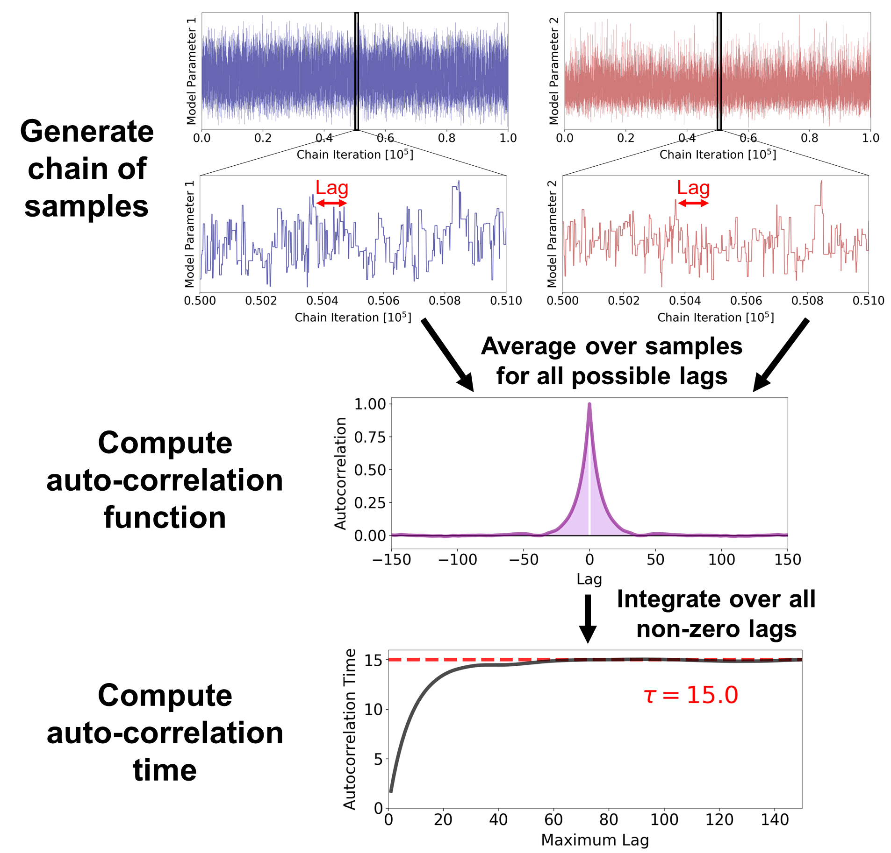

<figcaption>図10: MCMC に関連する自己相関の模式的な図解。MCMC 法はサンプルの連鎖 {Θ₁→…→Θₙ}（上）を生成するが、これらは小さい長さスケールで強く相関する傾向がある（上中）。対応する自己相関 A(t) を、サンプルの集合とすべての可能な時間ラグにわたって計算することで、相関の度合いを定量化できる（下中）。この量は t=0 のとき 1 で、t→±∞ につれて 0 に下がる。連鎖の全体の自己相関時間 τ は、t≠0 にわたって積分した自己相関である。詳細は §6.2 を参照。</figcaption>
</figure>

自己相関時間を取り込むと、ESS の修正された定義が直接得られる:

$$
n_{\rm eff}^{\prime}\equiv\frac{n_{\rm eff}}{1+\tau}
$$

実際には、無限のサンプル数を持たず $\mathcal{P}(\boldsymbol{\Theta})$ を知らないので、$\tau$ を正確に計算できない。したがってしばしば、持っている $n$ 個のサンプルの集合を使って自己相関時間の推定 $\hat{\tau}$ を生成する必要がある。$\hat{\tau}$ を導くさまざまなアプローチの議論は本稿の範囲を超える。詳細は [^3] を参照されたい。

MCMC 法が非負の自己相関時間（$\tau\geq 0$）を持つが最適な重点重み $\tilde{w}_{i}=1$ を持つという事実は、

$$
n_{\rm eff,MCMC}^{\prime}=\frac{n_{\rm eff,MCMC}}{1+\tau}=\frac{n}{1+\tau}\leq n
$$

という ESS を与える。これは、MCMC が最大の ESS を達成する常に最適な選択であるという保証がないことを意味する。特に、自己相関時間なし（$\tau=0$）で完全に iid なサンプルを生成できるが非最適な重点重み $\tilde{w}_{i}$ を持つ重点サンプリング法は、代わりに

$$
n_{\rm eff,IS}^{\prime}=\frac{n_{\rm eff,IS}}{1+\tau}=n_{\rm eff,IS}=\frac{\left(\sum_{i=1}^{n}\tilde{w}_{i}\right)^{2}}{\sum_{i=1}^{n}\tilde{w}_{i}^{2}}\leq n
$$

という ESS を持ち、これは固定の $n$ で $n_{\rm eff,MCMC}^{\prime}$ より大きくなりうる。

上の結果から、MCMC 法の中心的な動機となる懸念は、重点サンプリングを上回るのに十分小さい自己相関時間を持つサンプルの連鎖を生成できるかどうかである、ということがいまや明らかなはずだ。これが真かどうかは、事後分布、サンプルの連鎖を生成するのに使うアプローチ（§6.1・§8 参照）、重点サンプリングに使う提案分布 $\mathcal{Q}(\boldsymbol{\Theta})$（§5.3 参照）に依存する。

### 演習: 2次元ガウス上の MCMC

#### 設定

§4 と §5 の例にまた戻ろう。正規化されていない事後分布が2次元ガウス（正規）分布でよく近似される:

$$
\tilde{\mathcal{P}}(x,y)=\exp\left\{-\frac{1}{2}\left[\frac{(x-\mu_{x})^{2}}{\sigma_{x}^{2}}+\frac{(y-\mu_{y})^{2}}{\sigma_{y}^{2}}\right]\right\}
$$

ここで $(\mu_{x},\mu_{y})=(-0.3,0.8)$、$(\sigma_{x}^{2},\sigma_{y}^{2})=(2,0.5)$ である。

MCMC を使って、この分布からさまざまな事後分布の積分を近似したい。まず提案分布 $\mathcal{Q}(x^{\prime},y^{\prime}|x,y)$ を、平均 $0$・標準偏差 $1$ の2次元ガウスとして選ぶことから始める:

$$
\mathcal{Q}(x^{\prime},y^{\prime}|x,y)=\mathcal{N}\left[{(\mu_{x},\mu_{y})=(x,y)},{(\sigma_{x},\sigma_{y})=(1,1)}\right]
$$

#### パラメータ推定

上の提案を使い、位置 $(x_{0},y_{0})=(0,0)$ から始めて MH アルゴリズムに従って $n=1000$ 個のサンプルを生成せよ。これらのサンプルを使って、平均 $\mathbb{E}_{{\mathcal{P}}}\left[{x}\right]$ と $\mathbb{E}_{{\mathcal{P}}}\left[{y}\right]$、対応する 68% 信用区間を推定せよ。これらの各量は予想される値に対してどれだけ正確か？

#### 証拠の推定

次に、$x=[-5,5]$・$y=[-5,5]$ から $10\times 10$ のビンの集合を使って、結果のサンプル集合から推定 $\rho(x,y)$ を構築せよ。この密度の推定を使って、証拠 $\mathcal{Z}$ の推定を計算せよ。近似はどれだけ正確か？ ビンの数かつ／またはサイズを調整すると大きく変わるか？

#### 自己相関時間と有効サンプルサイズ

数値手法を使って、自己相関時間 $\tau$ と対応する有効サンプルサイズ $n_{\rm eff}$ の推定を計算せよ。サンプリングの効率（$n_{\rm eff}/n$）は、§5 の演習のデフォルトの重点サンプリングアプローチと比べてどうか？ これは提案の受容率が与えられたときに予想されるものを反映するか？ これらの量は、提案 $\mathcal{Q}(x,y)$ が根底の事後分布 $\mathcal{P}(x,y)$ の構造にどれだけよく一致するかについて何を教えてくれるか？

#### 不確実性

上の演習を $m=30$ 回繰り返して、各量の推定がどれだけばらつきうるかの推定を得よ。ばらつきは、典型的な有効サンプルサイズが与えられたときに予想されるものと一致するか？

#### 一貫性と収束

次に、$n=2500$ と $n=10000$ サンプル点を使って上の演習を繰り返し、違いについてコメントせよ。全体の精度はどれだけ向上したか？ $n_{\rm eff}$ が増えるにつれて推定は収束的かつ一貫的に見えるか？ 量の誤差は $n$ かつ／または $n_{\rm eff}$ の関数としてどれだけ縮むか？ これは §5 の重点サンプリング演習で観測された依存と似ているか異なるか？

#### サンプリング効率

次に、固定の $n$ で $n_{\rm eff}$ を改善しようと提案分布の $(\sigma_{x},\sigma_{y})$ を調整せよ。提案の最終的な比 $\sigma_{x}/\sigma_{y}$ は根底の事後分布のそれにどれだけ近いか？ 提案 $\mathcal{Q}(x^{\prime},y^{\prime}|x,y)$ の大まかなサイズと根底の事後分布 $\mathcal{P}(x,y)$ の間に追加のスケーリングの違いはあるか？ $\tilde{\mathcal{P}}(x,y)$ が $\mathcal{Q}$ を選ぶときに仮定した構造と異なりうることを考えると、既存のサンプル集合を使って提案を調整しようとする可能な方式を考えられるか？

#### Burn-In

最後に、開始位置を $(0,0)$ ではなく $(x_{0},y_{0})=(10,10)$ に調整し、新しいサンプルの連鎖を生成せよ。連鎖の $x$ と $y$ の位置を時間にわたってプロットせよ。burn-in 期間の明らかな兆候はあるか？ 何個のサンプルをおよそ burn-in に割り当て、続いて連鎖から除去すべきか？ 初期の burn-in 期間を特定するのに役立つヒューリスティックはあるか？

## 7 MCMC で事後分布をサンプリングする

MCMC 法がサンプルの連鎖を生成できるアプローチは、連鎖が事後分布を「探索する」という心象を即座に与える。連鎖からのサンプルの密度 $\rho(\boldsymbol{\Theta})\rightarrow\mathcal{P}(\boldsymbol{\Theta})$ が $n\rightarrow\infty$ につれて成り立つのは真だが、MCMC の主な目的は期待値 $\mathbb{E}_{{\mathcal{P}}}\left[{f(\boldsymbol{\Theta})}\right]$ を推定することである。これは微妙な違いに見えるかもしれないが、この区別は MCMC アルゴリズムが実際にどう振る舞う（べき）かを理解するのに実際に決定的である。これについて以下でより詳しく議論する。

### 7.1 事後分布を近似する

MH（§6.1）のようなアルゴリズムは、MCMC が生成するサンプルの連鎖の密度 $\rho(\boldsymbol{\Theta})$ が $n\rightarrow\infty$ につれて事後分布 $\mathcal{P}(\boldsymbol{\Theta})$ に収束することを保証するよう構成されているが、これは実際に事後分布を近似する効率的な手法に必ずしも翻訳されない。言い換えれば、この制約が成り立つには $n$ が極めて大きくなる必要があるかもしれない。では、$\rho(\boldsymbol{\Theta})$ が $\mathcal{P}(\boldsymbol{\Theta})$ の良い近似であることを保証するのに、いくつのサンプルが必要か？

まず、「良い」近似が何かについて何らかの指標を定義する必要がある。妥当なものは、ある領域 $\delta_{\boldsymbol{\Theta}}$ 内の事後分布を、ある精度 $\epsilon$ 以内で知りたい、というものかもしれない:

$$
\left|\frac{1}{n}\sum_{i=1}^{n}\mathds{1}\left[{\boldsymbol{\Theta}_{i}\in\delta_{\boldsymbol{\Theta}}}\right]-\int_{\delta_{\boldsymbol{\Theta}}}\mathcal{P}(\boldsymbol{\Theta}){\rm d}\boldsymbol{\Theta}\right|\equiv|\hat{p}(\delta_{\boldsymbol{\Theta}})-p(\delta_{\boldsymbol{\Theta}})|<\epsilon
$$

ここで $p(\delta_{\boldsymbol{\Theta}})$ は $\delta_{\boldsymbol{\Theta}}$ 内に含まれる総確率、$\hat{p}(\delta_{\boldsymbol{\Theta}})$ は同じ領域内に含まれる MCMC サンプル連鎖の割合である。これを1つの領域についてだけ推定するのは奇妙に見えるかもしれないが、まもなくこれを事後分布全体を包含するよう一般化する。

サンプルが iid で $\mathcal{P}(\boldsymbol{\Theta})$ から引かれる理想的な場合、各サンプルは $\delta_{\boldsymbol{\Theta}}$ 内にある確率 $p(\delta_{\boldsymbol{\Theta}})$ を持つ。$\hat{p}(\delta_{\boldsymbol{\Theta}})=m/n$ である確率は、すると二項分布（binomial distribution）に従う:

$$
P\left(\hat{p}(\delta_{\boldsymbol{\Theta}})=\frac{m}{n}\right)=\binom{n}{m}\left[p(\delta_{\boldsymbol{\Theta}})\right]^{m}\left[1-p(\delta_{\boldsymbol{\Theta}})\right]^{n-m}
$$

言い換えれば、サンプルは確率 $p(\delta_{\boldsymbol{\Theta}})$ で合計 $m$ 回 $\delta_{\boldsymbol{\Theta}}$ 内に入り、確率 $1-p(\delta_{\boldsymbol{\Theta}})$ で合計 $n-m$ 回 $\delta_{\boldsymbol{\Theta}}$ の外に入る。追加の二項係数「$n$ 個から $m$ 個を選ぶ」$\binom{n}{m}$ は、総サンプルサイズ $n$ のうち $m$ 個のサンプルが $\delta_{\boldsymbol{\Theta}}$ 内に入りうるすべての可能な固有の場合を考慮する。

この分布は平均 $p(\delta_{\boldsymbol{\Theta}})$ を持つので、任意の有限の $n$ に対して $\hat{p}(\delta_{\boldsymbol{\Theta}})$ は $p(\delta_{\boldsymbol{\Theta}})$ の不偏推定量であると予想される:

$$
\mathbb{E}\left[{\hat{p}(\delta_{\boldsymbol{\Theta}})-p(\delta_{\boldsymbol{\Theta}})}\right]=p(\delta_{\boldsymbol{\Theta}})-p(\delta_{\boldsymbol{\Theta}})=0
$$

しかし分散はサンプルサイズに依存する:

$$
\mathbb{E}\left[{|\hat{p}(\delta_{\boldsymbol{\Theta}})-p(\delta_{\boldsymbol{\Theta}})|^{2}}\right]=\frac{p(\delta_{\boldsymbol{\Theta}})\left[1-p(\delta_{\boldsymbol{\Theta}})\right]}{n}
$$

実際には、何らかの非ゼロの自己相関時間 $\tau>0$ があると予想できる。これは、推定 $\hat{p}(\delta_{\boldsymbol{\Theta}})$ がよく振る舞うと確信するために生成する必要がある MCMC サンプル数を増やす。$1+\tau$ の因子を挿入し、上の期待値を精度の制約に代入すると、$\epsilon$ の関数として必要なサンプル数 $n$ の大まかな制約が得られる:

$$
n\gtrsim\frac{p(\delta_{\boldsymbol{\Theta}})\left[1-p(\delta_{\boldsymbol{\Theta}})\right]}{\epsilon^{2}/(1+\tau)}\sim\frac{\hat{p}(\delta_{\boldsymbol{\Theta}})\left[1-\hat{p}(\delta_{\boldsymbol{\Theta}})\right]}{\epsilon^{2}}\times(1+\hat{\tau})
$$

$p(\delta_{\boldsymbol{\Theta}})$ と $\tau$ をそれらのノイズのある推定 $\hat{p}(\delta_{\boldsymbol{\Theta}})$ と $\hat{\tau}$ で最終的に置き換えるのは、実際には $p(\delta_{\boldsymbol{\Theta}})$ も $\tau$ も知らない（どちらも事後分布の完全な知識を要する）事実から来る。したがって $n$ 個のサンプルの集合から導いた推定量に頼らざるを得ない。

この結果をより詳しく検討しよう。予想通り、総サンプル数は $1+\hat{\tau}$ に比例する: 独立なサンプルを生成するのに時間がかかるなら、ある領域で事後分布をよく特徴づけたと確信するにはより多くのサンプルが必要だ。また $n\propto\epsilon^{-2}$ も分かるので、誤差を $x$ 倍減らしたければサンプルサイズを $x^{2}$ 倍増やす必要がある。

分子の振る舞いはより興味深い。$\hat{p}(\delta_{\boldsymbol{\Theta}})\left[1-\hat{p}(\delta_{\boldsymbol{\Theta}})\right]$ は $\hat{p}(\delta_{\boldsymbol{\Theta}})=0.5$ で最大になるので、必要な最大のサンプルサイズは事後分布をちょうど半分に分割したときである。他のすべての場合では、活用できる情報を持つ、関心領域の外または内のサンプルがより多くあるので、必要なサンプルサイズはより小さくなる。$\hat{p}(\delta_{\boldsymbol{\Theta}})$ の正確な値はもちろん事後分布 $\mathcal{P}(\boldsymbol{\Theta})$ と対象領域 $\delta_{\boldsymbol{\Theta}}$ の両方に依存する: 分布のピーク付近（$\mathcal{P}(\boldsymbol{\Theta})$ が大きい小さい領域）で事後分布を何らかの $\epsilon$ まで近似するのに必要なサンプルサイズは、分布の裾（$\mathcal{P}(\boldsymbol{\Theta})$ が小さい大きい領域）を正確に推定するのに必要なサンプルサイズとは異なるだろう。

上の議論は事後分布をただ1つの領域で推定しようとする場合に成り立つが、「事後分布に収束する」ことは、$\rho(\boldsymbol{\Theta})$ が $\mathcal{P}(\boldsymbol{\Theta})$ のいたるところで良い近似になることを望むことを含意する。この新しい要件を、事後分布を $m$ 個の異なる部分領域 $\{\delta_{\boldsymbol{\Theta}_{1}},\dots,\delta_{\boldsymbol{\Theta}_{m}}\}$ に分割し、各部分領域がよく制約されることを要求することで課せる:

$$
|\hat{p}(\delta_{\boldsymbol{\Theta}_{1}})-p(\delta_{\boldsymbol{\Theta}_{1}})|<\epsilon_{1}\quad\quad\dots\quad\quad|\hat{p}(\delta_{\boldsymbol{\Theta}_{m}})-p(\delta_{\boldsymbol{\Theta}_{m}})|<\epsilon_{m}
$$

これらの各制約に期待される誤差を代入すると、各領域 $\delta_{\boldsymbol{\Theta}_{j}}$ で事後分布を推定するのに必要なサンプル数 $n_{j}$ のおおよその限界が得られる:

$$
n_{j}\gtrsim\frac{\hat{p}(\delta_{\boldsymbol{\Theta}_{j}})\left[1-\hat{p}(\delta_{\boldsymbol{\Theta}_{j}})\right]}{\epsilon_{j}^{2}}\times(1+\hat{\tau})
$$

必要な総サンプル数は、すると単に:

$$
n\gtrsim\sum_{j=1}^{m}n_{j}
$$

である。事後分布を部分領域に分割するこのアプローチは、§4 で述べたグリッドベースのアプローチと概念的に似ている。そのため、同じ欠点も受ける: 領域の数 $m$ は次元数 $d$ とともに指数関数的に増えると予想される。例えば、事後分布を $m$ 個の象限（orthant）に分けたければ、$m=2^{d}$ 個の領域になる: 1次元で2個（左右）、2次元で4個（左上・左下・右上・右下）、3次元で8個、など。

この効果は、ある指定された精度 $\epsilon$ について $\rho(\boldsymbol{\Theta})$ が $\mathcal{P}(\boldsymbol{\Theta})$ の良い近似であることを保証するのに必要なサンプル数が、一般に

$$
n\gtrsim k^{d}
$$

としてスケールすると予想すべきことを含意する。ここで $k$ は精度要件に依存する定数である。これは、完全な事後分布を近似することを「次元の呪い」の領域にしっかりと置く（§4.1 参照）。

多くの実践者は MCMC を事後分布を「近似する」効率的な手法と語るが、実際には $\mathcal{P}(\boldsymbol{\Theta})$ を直接近似するのにめったに使われない。§3 で議論し図2で示したように、文献で報告されるほとんどすべての量は、完全な $d$ 次元の事後分布の近似ではなく、ほぼ常に一度に $k\lesssim 3$ パラメータ以下に制限される周辺化分布の近似に依拠する。残りの $d-k$ パラメータを周辺化する行為が、ここで図解した次元の呪いに対抗するのに役立つ。MCMC が特定の限られたパラメータ集合について周辺化された $k$ 次元の事後分布を「探索」できると言うのは技術的には公正だが、この種の言い回しはしばしば洞察より多くの誤解をもたらす。

### 7.2 事後分布の体積

§7.1 で概説した基本的な帰結は、事後分布を象限や他の領域に分割することを想像する特定の場合よりも一般的である。根本的に、事後分布上の任意の期待値 $\mathbb{E}_{{\mathcal{P}}}\left[{f(\boldsymbol{\Theta})}\right]$ の計算には、パラメータ $\boldsymbol{\Theta}$ の全領域にわたる積分が必要である。したがって、この領域の体積がどう振る舞うか（すなわちパラメータの組み合わせがいくつあるか）を理解したい。これがどう振る舞うかを把握したら、これが推定にどう影響するかを定量化し始められる。

まず、すべての $d$ 次元で辺の長さ $\ell$ を持つ $d$ 次元超立方体（$d$-cube）を考えよう。その体積は次のようにスケールする:

$$
V(\ell)=\prod_{i=1}^{d}\ell=\ell^{d}
$$

$\ell$ と $\ell+{\rm d}\ell$ の間の微分体積要素は

$$
{\rm d}V(\ell)=(d\times\ell^{d-1})\times({\rm d}\ell)\propto\ell^{d-1}
$$

である。この次元との指数的スケーリングは、体積が、$d$-cube の中心から次第に遠く離れた領域にある薄い殻にますます集中することを意味する。例として、$\ell_{50}$ より内側に体積の 50%、外側に 50% が含まれるように $d$-cube を2つの等しいサイズの領域に分ける長さスケール

$$
\ell_{50}=2^{-1/d}\ell
$$

を考える。1次元では、これは予想通り $\ell_{50}/\ell=0.5$ を与える。2次元では $\ell_{50}/\ell\approx 0.7$、3次元では $\ell_{50}/\ell\approx 0.8$、7次元では $\ell_{50}/\ell\approx 0.9$ を与える。15次元に達する頃には $\ell_{50}/\ell\approx 0.95$ となり、これは体積の 50% が $d$-cube の境界近くの長さスケールの最後の 5% に位置することを意味する。他の形状（例: 球）を考えると定数は変わりうるが、一般にこの $d$ の関数としての指数的スケーリングは高次元の体積の一般的な特徴である。言い換えれば、パラメータ数を増やすと、探索すべき利用可能なパラメータの組み合わせの数が指数関数的に増える。

<figure>

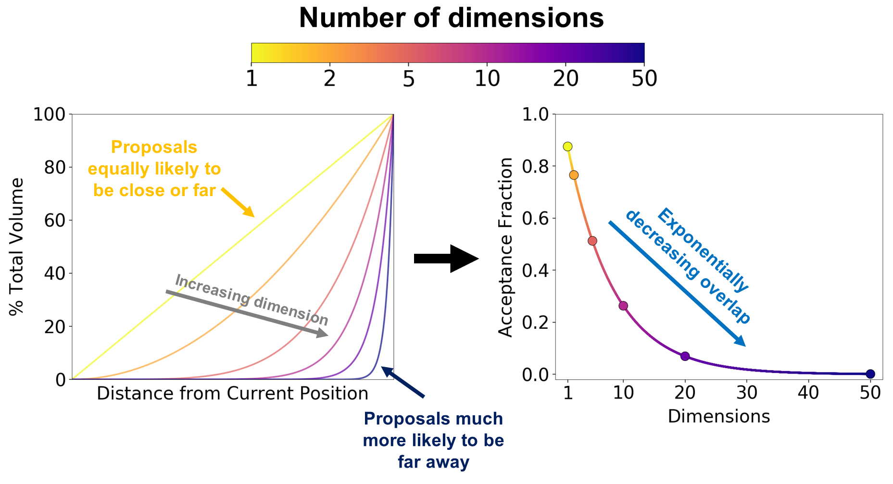

<figcaption>図11: 次元の呪いが事後分布の体積を介して MCMC の受容率にどう影響するかの模式的な図解。ある位置 Θ で、体積はその位置からの距離の関数として ∝rᵈ で増える（左）。次元が増えると、これは体積が次第に遠くに集中することを含意し、提案位置 Θ′ と現在位置の間の距離が大きくなる。これらの位置のほとんどは現在値 𝒫(Θ) に比べて大幅に低い事後確率 𝒫(Θ′) を持ち、次元が増えるにつれて典型的な受容率が指数的に低下する（と対応して自己相関時間が増す）（右）。提案 𝒬(Θ′|Θ) のサイズかつ／または形を調整することがこの振る舞いに対抗するのに役立つ。詳細は §7.2 を参照。</figcaption>
</figure>

MCMC の長期的な振る舞いに影響するのに加えて、この指数的な体積の増加は MCMC 法の動作にも直接影響する。なぜそうなるかを見るには、§6.1 で議論した MH アルゴリズムで使われる遷移確率を見るだけでよい:

$$
T(\boldsymbol{\Theta}_{i+1}|\boldsymbol{\Theta}_{i})\equiv\min\left[1,\frac{\mathcal{P}(\boldsymbol{\Theta}_{i+1})}{\mathcal{P}(\boldsymbol{\Theta}_{i})}\frac{\mathcal{Q}(\boldsymbol{\Theta}_{i}|\boldsymbol{\Theta}_{i+1})}{\mathcal{Q}(\boldsymbol{\Theta}_{i+1}|\boldsymbol{\Theta}_{i})}\right]
$$

この式の非自明な部分はきれいに2つの項に分かれる。第一は体積に依存し、$\mathcal{Q}(\boldsymbol{\Theta}^{\prime}|\boldsymbol{\Theta})$ から次の位置をどう提案したかに関係する。第二は密度に依存し、2つの位置の間で事後密度がどう変わるかに関係する。

実際には、遷移確率は基本的な補正アプローチと解釈できる: 何らかの近傍の体積から新しい位置を提案した後、根底の密度の変化に基づいてこれらの移動を時々のみ受容することで、提案と根底の事後分布の間の違いを「補正」しようとする。高次元では、体積（提案）と密度（事後分布）の間のこの基本的な「綱引き」は、物体の体積の大部分が外縁付近に集中するにつれて破綻しうる。例えば、提案 $\mathcal{Q}(\boldsymbol{\Theta}^{\prime}|\boldsymbol{\Theta})$ が $\boldsymbol{\Theta}$ を中心とする辺の長さ $\ell$ の立方体の場合、これは中央値の長さスケール $\ell_{50}=2^{-1/d}\ell$ をもたらし、次元が増えるにつれて $0.5\ell$ から $\approx\ell$ へ急速に増える。同じ論理は他の提案分布にも適用される（§8 参照）。$\ell_{50}\rightarrow\ell$ につれて遠くにある、または非常に似た隔たりの長さスケールを持つ位置に集中するこの傾向は、$\mathcal{Q}(\boldsymbol{\Theta}^{\prime}|\boldsymbol{\Theta})$ の多くの選択が「行き過ぎ」、現在位置に比べてはるかに小さい事後密度を持つ新しい位置を提案する傾向があることを意味する。これらの新しい位置はすると、ほぼ常に棄却され、極めて低い受容率と対応する長い自己相関時間をもたらす。この効果の例を図11に示す。

この振る舞いに対抗する主な方法の一つは、提案された位置のうち受容される割合が十分高く保たれるように、提案 $\mathcal{Q}(\boldsymbol{\Theta}^{\prime}|\boldsymbol{\Theta})$ のサイズ／形を調整することである。これは、新しい位置を提案するときに事後密度 $\mathcal{P}(\boldsymbol{\Theta})$ があまり劇的に変わらないことを保証し、全体の自己相関時間を低くするのに役立つ。これらの方式を実際にどう実装するかの詳細は本稿の範囲を超える。詳細は関連文献を参照されたい。

### 7.3 事後分布の質量と典型集合

上で、高次元の体積の振る舞いが MCMC の MH サンプリングアルゴリズムの性能にどう影響し、非効率な提案と低い受容率をもたらしうるかを述べた。この問題を解決し、サンプルの連鎖を生成する効率的な方法を持つと仮定しよう。いまや第二の問いがある: これらのサンプルはどこに位置するのか？

§7.1 の議論から、サンプルの最高密度 $\rho(\boldsymbol{\Theta})$ は、事後密度 $\mathcal{P}(\boldsymbol{\Theta})$ も対応して高い場所に位置することが分かる。しかし、この領域 $\delta_{\boldsymbol{\Theta}}$ は事後分布の小さな部分にしか対応しないかもしれない。実際、次元が増えると指数関数的に多くの体積があるので、多くのパラメータ $\boldsymbol{\Theta}$ を持つモデルは、事後分布の大部分が最高密度の領域の外に位置することがほぼ保証される。

この帰結は、連鎖内のサンプルの大半がピーク密度から離れて位置することである。結果として、連鎖はこれらの領域でサンプルを生成するのにほとんどの時間を費やす。これは連鎖が振る舞うと予想される仕方に大きな影響を持つ: サンプルの最高濃度は最高事後密度の領域に位置するが、最大量のサンプルは実際には最高事後質量（posterior mass, すなわち密度×体積）の領域に位置する。これは、（ランダムに選んだ）「典型的な」サンプルがこの高事後質量の領域に位置する可能性が最も高いことを含意するので、この領域は典型集合（typical set）とも一般に呼ばれる。

この議論を少し概念化しやすくするために、3パラメータのモデル $\boldsymbol{\Theta}=(x,y,z)$ を持ち、$\mathcal{P}(x,y,z)$ が球対称だと想像しよう。$\mathcal{P}(x,y,z)$ を ${\rm d}x{\rm d}y{\rm d}z$ で直接積分しようとすることも想像できるが、半径 $r=\sqrt{x^{2}+y^{2}+z^{2}}$ の関数として微分体積 ${\rm d}V(r)=4\pi r^{2}{\rm d}r$ の「殻」でそのような分布を積分する方がほぼ常に容易である。これにより、$(x,y,z)$ にわたる3次元の積分を $r$ にわたる1次元の積分として書き直せる:

$$
\int\mathcal{P}(x,y,z){\rm d}x{\rm d}y{\rm d}z=\int\mathcal{P}(r)4\pi r^{2}{\rm d}r\equiv\int\mathcal{P}^{\prime}(r){\rm d}r
$$

ここで $\mathcal{P}^{\prime}(r)\equiv 4\pi r^{2}\mathcal{P}(r)$ はいまや $r$ の関数としての1次元密度である。これは $\mathcal{P}(r)$ に関連する殻の微分体積要素によって $r$ の関数としての寄与を「押し上げ」、事後分布が何らかの殻状の構造を持つ（すなわち $\mathcal{P}^{\prime}(r)$ が $r>0$ で最大になる）ことを含意する。

すべての事後密度がこのように球対称であると期待できるわけではないが、一般に、$\boldsymbol{\Theta}$ にわたる $d$ 次元の積分を、何らかの未知の等事後分布の等高線で定義される $V$ にわたる1次元の体積積分として書き直せる:

$$
\int\mathcal{P}(\boldsymbol{\Theta}){\rm d}\boldsymbol{\Theta}=\int\mathcal{P}(V){\rm d}V
$$

§7.2 で概説したように、各体積要素のサイズは一般に ${\rm d}V\sim r^{d-1}{\rm d}r$ として進むと予想される。ここで $r$ は事後分布のピークからの距離である。したがって、単純な球対称の場合から得る基本的な直感がやはり適用され、次が予想される:

$$
\int\mathcal{P}(V){\rm d}V\sim\int\mathcal{P}(r)r^{d-1}{\rm d}r=\int\mathcal{P}^{\prime}(r){\rm d}r
$$

前と同様に、$\mathcal{P}(r)$ に関連する殻の微分体積要素が $r$ の関数としての全体の寄与を「押し上げる」。この押し上げは $d$ が増えるにつれて指数関数的に強くなる。したがって中程度のサイズの $d$ でも、事後質量は半径 $r^{\prime}$・幅 $\Delta r^{\prime}$ の薄い殻にほとんど含まれると予想される。§8.1 で提示するトイ問題に基づくこの効果の図解は図12を参照。

<figure>

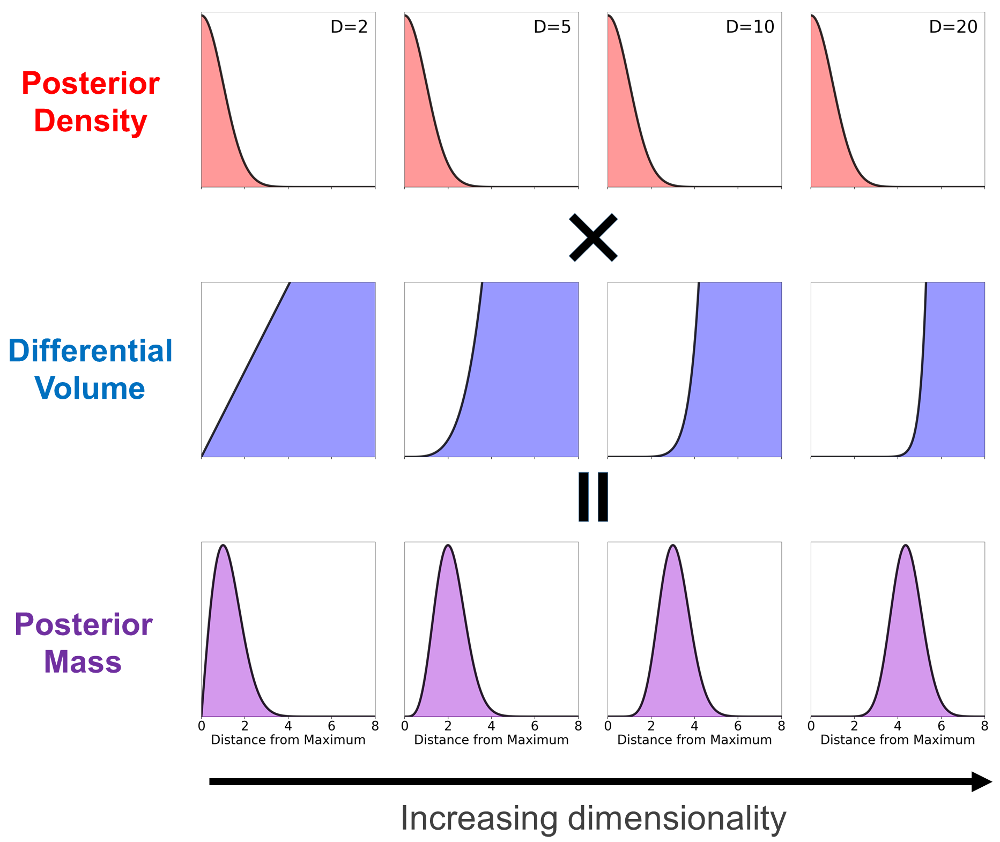

<figcaption>図12: 事後質量が次元の関数としてどう振る舞うかを d 次元ガウスを使って模式的に図解。上段は最大事後密度 r=0 からの距離の関数としてプロットした事後密度 𝒫(r)∝e^{−r²/2}（赤）を、次元が増える（左から右）につれて示す。予想通りこの分布は一定。中段は半径 r の対応する殻の微分体積要素 dV(r)∝r^{d−1}dr（青）。最大から遠くの殻が寄与する指数的に増える体積を図解する。下段は半径の関数としての対応する「事後質量」𝒫′(r)∝r^{d−1}𝒫(r)∝r^{d−1}e^{−r²/2}（紫）。最大事後密度から遠くに位置する体積が増えるため、事後質量の大半（したがって MCMC で生成する任意のサンプルの大半）が実際には最大から遠く離れた殻に位置することが分かる。詳細は §7.3 を参照。</figcaption>
</figure>

この結果は2つの即座の含意を持つ。第一に、サンプルの大半は事後密度が最大になる場所には位置しない。これは、指数関数的に増えるパラメータの組み合わせの数の結果であり、データへの少数の優れた当てはめが、はるかに多数の平凡な当てはめに容易に圧倒されることを許す。したがって MCMC 法は一般に、ピーク事後密度の領域を見つけたり特徴づけたりするのに非効率である。

第二に、$d$ が増えるにつれて、事後質量の大部分を含む殻の半径が増え、指数関数的に増える利用可能な体積のため、ピーク密度からますます遠ざかると一般に予想される。サンプルの大半がこの領域に位置するので、連鎖はこの殻からサンプルを生成するのに大半の時間を費やす。

これにより、高次元で効率的にサンプルを提案するのがなぜ難しいかを正確に概説できる:

1. 受容率を妥当に保つには、提案位置が事後質量のこの殻内にほとんど位置することを保証する必要がある。
2. しかし、独立なサンプルを得るには、（理論的には）この殻内の任意の位置を提案できる必要がある。
3. これは、自己相関時間が主に殻を「歩き回る」のにかかる時間で決まることを意味し、それは全体のサイズ $r^{\prime}$・幅 $\Delta r^{\prime}$・次元数 $d$ の関数になる。

## 8 単純なトイ問題への応用

ここで、§6 と §7 で議論したすべての概念が実際にどう結びつくかを図解する、具体的で詳細な例を考える。本節を通じて、いくつかの解析的結果を概説し、サンプルの連鎖を生成するためにいくつかの異なる MCMC サンプリング戦略を利用する。関心のある読者には、ここで概説する手法の独自の版を実装することを強く勧める。それを使って本節の数値結果を完全に再現できる。

### 8.1 トイ問題

このトイ問題では、（正規化されていない）事後分布を、すべての次元で平均 $\mu=0$・標準偏差 $\sigma$ を持つ $d$ 次元ガウス（正規）分布とする:

$$
\tilde{\mathcal{P}}(\boldsymbol{\Theta})=\exp\left[-\frac{1}{2}\frac{|\boldsymbol{\Theta}|^{2}}{\sigma^{2}}\right]
$$

ここで $|\boldsymbol{\Theta}|^{2}=\sum_{i=1}^{d}\Theta_{i}^{2}$ は位置ベクトルの大きさの二乗である。

§7.3 の結果に基づいて、中心からの「半径」$r\equiv|\boldsymbol{\Theta}|=\sqrt{\sum_{i=1}^{d}\Theta_{i}^{2}}$ で事後密度を書き直すことで、この分布の性質をよりよく理解できる:

$$
\tilde{\mathcal{P}}(r)=\exp\left[-\frac{r^{2}}{2\sigma^{2}}\right]
$$

与えられた半径 $r$ 内に含まれる対応する体積は、すると

$$
V(r)\propto r^{d}
$$

である。対応する事後質量 $\tilde{\mathcal{P}}^{\prime}(r)$ は、すると次のように定義される:

$$
\tilde{\mathcal{P}}(V){\rm d}V(r)\propto e^{-r^{2}/2\sigma^{2}}r^{d-1}{\rm d}r\equiv\tilde{\mathcal{P}}^{\prime}(r){\rm d}r
$$

これはカイ二乗分布（chi-square distribution）と密接に関係していることに注意。

事後質量がピークになり（すなわち最大になり）、サンプルが位置する可能性が最も高い典型的な半径 $r_{\rm peak}$ は、${\rm d}\tilde{\mathcal{P}}^{\prime}(r)/{\rm d}r=0$ と置くことで導ける。これを解くと

$$
r_{\rm peak}=\sqrt{d-1}\sigma
$$

が得られる。言い換えれば、1次元では典型的なサンプルは $r_{\rm peak}=0$ で分布のピークに位置する可能性が最も高いが、高次元ではこれがかなり劇的に変わる。$r_{\rm peak}$ は2次元で $1\sigma$、5次元で $2\sigma$、10次元で $3\sigma$、26次元で $5\sigma$ である。これは高次元の大きな半径での膨大な量の体積の直接的な帰結である: $r=5\sigma$ のサンプルは $r=0$ のサンプルより事後密度 $\mathcal{P}(r)$ が桁違いに悪いが、$r=5\sigma$ で利用可能なパラメータの組み合わせ（体積）の膨大な数がそれを補って余りある。

一般に、事後質量は何らかの半径

$$
r_{\rm mean}\equiv\mathbb{E}_{{\mathcal{P}^{\prime}}}\left[{r}\right]=\int_{0}^{\infty}r\mathcal{P}^{\prime}(r){\rm d}r=\sqrt{2}\frac{\Gamma\left(\frac{d+1}{2}\right)}{\Gamma\left(\frac{d}{2}\right)}\sigma\approx\sqrt{d}\sigma
$$

を中心とする「ガウスの殻」を構成すると予想される。標準偏差は

$$
\Delta r_{\rm mean}\equiv\sqrt{\mathbb{E}_{{\mathcal{P}^{\prime}}}\left[{(r-r_{\rm mean})^{2}}\right]}=\sigma\sqrt{d-2\left(\frac{\Gamma\left(\frac{d+1}{2}\right)}{\Gamma\left(\frac{d}{2}\right)}\right)^{2}}\approx\frac{\sigma}{\sqrt{2}}
$$

である。ここで $\Gamma(d)$ はガンマ関数で、近似は大きな $d$ について取られる。この振る舞いの図解は図12を参照。

### 8.2 ガウス提案による MCMC

ここでサンプルの連鎖 $\{\boldsymbol{\Theta}_{1}\rightarrow\dots\rightarrow\boldsymbol{\Theta}_{n}\}$ を考えよう。何らかのラグ $t$ だけ離れた2つのサンプル $\boldsymbol{\Theta}_{m}$ と $\boldsymbol{\Theta}_{m+t}$ の間の距離は

$$
|\boldsymbol{\Theta}-\boldsymbol{\Theta}^{\prime}|=\sqrt{\sum_{i=1}^{d}(\Theta_{m,i}-\Theta_{m+t,i})^{2}}
$$

になる。ラグ $t\gg\tau$ が自己相関時間 $\tau$ より十分大きいと仮定すると、各サンプルはガウス事後分布に従っておよそ iid 分布していると仮定できる。これは、期待される隔たり

$$
\Delta r_{\rm sep}\equiv\sqrt{\mathbb{E}_{{\mathcal{P}}}\left[{|\boldsymbol{\Theta}_{m}-\boldsymbol{\Theta}_{m+t}|^{2}}\right]}=\sqrt{2d}\sigma\approx\sqrt{2}r_{\rm mean}
$$

を与える。単純なガウス提案分布を使うことで、提案位置 $\boldsymbol{\Theta}_{i+1}$ と現在位置 $\boldsymbol{\Theta}_{i}$ の間の隔たり $|\boldsymbol{\Theta}_{i+1}-\boldsymbol{\Theta}_{i}|$ が上で導いた理想的な隔たり $\sqrt{2}r_{\rm mean}$ に従うように、理論的にサンプルを提案できる:

$$
\mathcal{Q}(\boldsymbol{\Theta}_{i+1}|\boldsymbol{\Theta}_{i})\propto\exp\left[-\frac{1}{2}\frac{|\boldsymbol{\Theta}_{i+1}-\boldsymbol{\Theta}_{i}|^{2}}{2\sigma^{2}}\right]
$$

この提案は事後分布と同じ形を持つが、$0$ ではなく $\boldsymbol{\Theta}_{i}$ を中心とする。§7.2 に基づく体積の振る舞いの直感を使うと、この $\mathcal{Q}(\boldsymbol{\Theta}^{\prime}|\boldsymbol{\Theta})$ の選択から提案されるサンプルの大半が、おそらく事後分布とほとんど重ならないと結論できる。

<figure>

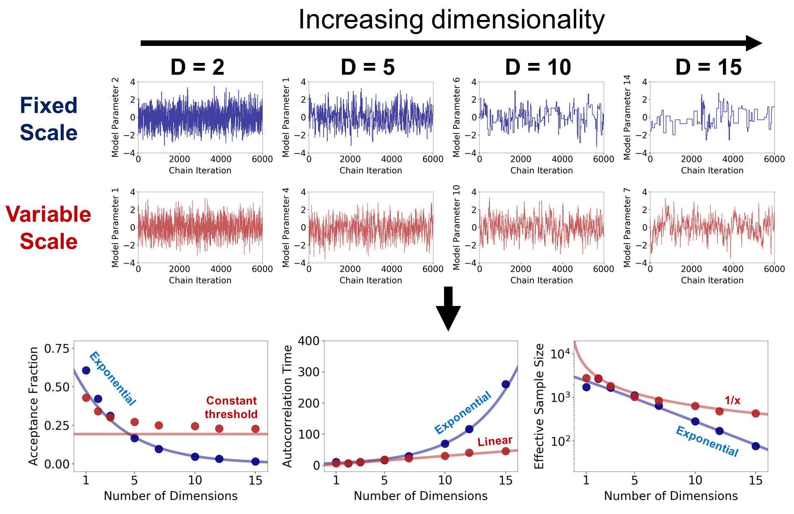

<figcaption>図13: トイ問題（すべての次元で平均 μ=0・標準偏差 σ=1 の d 次元ガウス）上での、ガウス提案を持つ単純な MH MCMC サンプラーの性能を示す数値結果。上段のパネル列は、一定のスケール因子 γ=√2 の不変な提案（青）と、約 25% の一定の受容率を狙うよう設計された γ=2.5/√d の縮小する提案（赤）を仮定して、連鎖からのランダムなパラメータのスナップショットを次元の関数として（左から右へ増加）示す。下段のパネルは、対応する受容率（左）・自己相関時間（中）・有効サンプルサイズ（右）を次元の関数として示す。§8.2 の近似は薄い色の線で示す。提案のサイズを縮小することがサンプルを事後質量の大部分の中に保つのに役立ち、自己相関時間を大幅に減らし有効サンプルサイズを増やす。そうしないと、良い提案の割合が指数的に減り、対応して自己相関時間／有効サンプルサイズが指数的に増加／減少する。詳細は §8 を参照。</figcaption>
</figure>

実際、数値シミュレーションは、上の提案が与えられたときに受容される位置の典型的な割合がおおよそ

$$
\langle f_{\rm acc}(d)\rangle\equiv\exp\left[\mathbb{E}_{{\mathcal{P},\mathcal{Q}}}\left[{\ln T(\boldsymbol{\Theta}_{i+1}|\boldsymbol{\Theta}_{i})}\right]\right]\sim\exp\left[-\frac{d}{4}-\frac{1}{2}\right]
$$

としてスケールすることを示唆する。これは図11と同様に、次元が増えるにつれて指数的に減る。同様に、自己相関時間がおおよそ

$$
\langle\tau(d)\rangle\equiv\exp\left[\mathbb{E}_{{\mathcal{P},\mathcal{Q}}}\left[{\ln\tau}\right]\right]\sim\exp\left[\frac{d}{4}+\frac{7}{4}\right]
$$

としてスケールすることが分かる。この指数的依存は、典型的なガウス提案 $\mathcal{Q}(\boldsymbol{\Theta}^{\prime}|\boldsymbol{\Theta})$ と根底の事後分布 $\mathcal{P}(\boldsymbol{\Theta})$ の間の重なりが、本質的に2つの薄い殻が重なる小さい体積に簡約されることから生じる。殻の半径は $\propto\sqrt{d}$ で進む一方で幅はおよそ一定なので、殻の「相対的なサイズ」（と対応する重なり）は指数的に減ることになる。

この効果に対抗するには、提案分布の $\sigma$ を何らかの因子 $\gamma$ で調整する必要がある:

$$
\mathcal{Q}_{\gamma}(\boldsymbol{\Theta}_{i+1}|\boldsymbol{\Theta}_{i})\propto\exp\left[-\frac{1}{2}\frac{|\boldsymbol{\Theta}_{i+1}-\boldsymbol{\Theta}_{i}|^{2}}{(\gamma\sigma)^{2}}\right]
$$

ここで前の提案は $\gamma=\sqrt{2}$ を仮定する。次元 $d$ の関数として典型的な受容率をおよそ一定に保ちたければ、$\gamma$ は次のようにスケールする必要がある:

$$
\langle f_{\rm acc}(\gamma(d))\rangle\approx C\quad\Rightarrow\quad\gamma(d)\propto\frac{1}{\sqrt{d}}
$$

これは典型集合の期待半径 $r_{\rm mean}$ を逆にたどる。

$$
\gamma=\frac{\delta}{\sqrt{d}}
$$

と取ると、$d$ が大きくなるにつれて典型的な受容率

$$
\langle f_{\rm acc}(\delta/\sqrt{d})\rangle\approx\exp\left[-\left(\frac{\delta^{2}}{4}\right)^{2}-\frac{\delta}{2}\right]
$$

と、妥当な $\delta$ の選択に対する典型的な自己相関時間

$$
\langle\tau(\delta/\sqrt{d})\rangle\approx 3d
$$

がもたらされる。この線形の依存は、先の指数的スケーリングに対する大幅な改善である。

#### 数値テスト

これらの結果を確認するために、これらの提案分布に基づく2つの MH MCMC アルゴリズムを使って、$n=20{,}000$ 回の反復でこの $d$ 次元ガウス事後分布（簡単のため $\sigma=1$ と仮定）からサンプリングする。第一は $\gamma=\sqrt{2}$ を仮定して新しい点を提案する。第二は、おおよそ一定の受容率 25% を維持するために $\gamma=2.5/\sqrt{d}$ を仮定する。図13に示すように、連鎖は次元の関数として理論的予測通りに振る舞い、一定の提案はすぐに行き詰まる一方、適応的な提案は通常通りサンプリングを続ける。自己相関時間 $\tau$ は両方の場合で増えるが、後者の場合（提案分布のサイズ／スケールの減少によって駆動される）の増加は、前者の場合（指数的に減少する受容率によって駆動される）よりもはるかに扱いやすい。

### 8.3 アンサンブル提案による MCMC

上で探ったガウス提案の一つの欠点は、分布の構造を事前に指定しなければならないことである。この特定の場合、(1) 各次元（パラメータ）での事後分布の幅が一定で $\sigma_{1}=\sigma_{2}=\dots=\sigma_{n}=\sigma$、(2) パラメータが互いに完全に無相関で、任意の2つの次元 $i$ と $j$ の間の相関係数 $\rho_{ij}=0$、と仮定した。

一般に、これらのいずれかが真であると仮定する良い理由はない。これは、未知の事後分布の全体の共分散構造を決める $d(d+1)/2$ 個の自由パラメータの集合全体も推定しなければならないことを意味する。サンプリング効率を改善し自己相関時間を減らすために共分散構造を調整しようとすること（§5・§6 参照）が、実際に MCMC アルゴリズムを実行する最も難しい部分の一つになる。

これらの調整を延長した burn-in 期間に行う方式はある（例: [^3]）が、ユーザーからの追加の入力をあまり要さずに「自動調整」できる手法には大きな魅力がある。そのようなアプローチの一群はアンサンブル法（ensemble methods）または粒子法（particle methods）として知られる。これらの手法は、同時に（すなわち並列に）走る多数の $m$ 個の連鎖を使って、個々の連鎖の性能を改善しようとする。

ここでは、$m\gtrsim d(d+1)/2$ 個の連鎖を同時に走らせて活用しようとするアンサンブル法の3つのバリエーションを探る: (1) 粒子のアンサンブルを使ってガウス提案分布を条件づける、(2) ガウスの「ジッター」とともに複数の粒子の軌跡を使う、(3) 複数の粒子の軌跡のアフィン不変変換を使う。これらの手法の模式的な図解を図14に示す。

予想されるように、これらの手法の即座の欠点は、空間の全体構造を特徴づける（すなわち次元の呪い）のに十分な粒子を持つことに依拠することである。これは高次元空間からのサンプリングでの有用性を制限するが、数百の粒子でしばしば妥当な性能を保証するのに十分な中程度の次元の空間（$d\lesssim 25$）では魅力的な選択肢になりうる。

<figure>

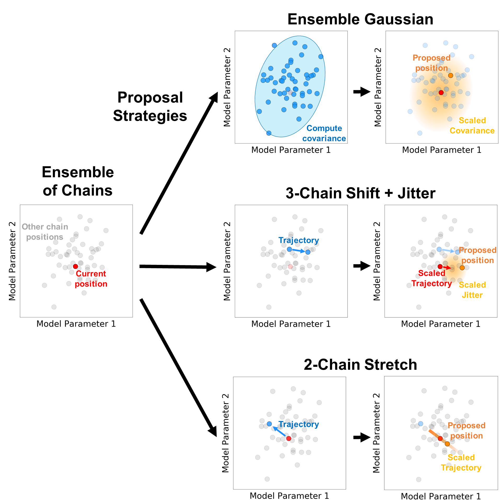

<figcaption>図14: §8.3 で述べる3つのアンサンブル MCMC 法の模式的な図解。更新したい関心のある連鎖の現在の状態（赤）とアンサンブル内の他の連鎖（灰）を左に示す。上段（アンサンブルガウス、§8.3.1）では、他の k≠j 連鎖の共分散を計算し（中）、そのスケールした版を使って新しい位置を提案する。中段（3連鎖シフト＋ジッター、§8.3.2）では、2つの追加の連鎖 k≠l≠j を使って軌跡を計算し、そのスケールした軌跡＋少量の「ジッター」に基づいて新しい位置を提案する。下段（2連鎖ストレッチ、§8.3.3）では、1つの追加連鎖だけを使って新しい軌跡を提案し、そのスケールした版に沿ってランダムな位置を、スケールの関数として変わる提案確率で提案する。詳細は §8 を参照。</figcaption>
</figure>

#### 8.3.1 ガウス提案

第一のアプローチは単に修正されたガウス提案である: 任意の連鎖 $j$ の任意の反復 $i$ で、現在位置 $\boldsymbol{\Theta}_{i}^{j}$ を使ってガウス提案

$$
\mathcal{Q}_{\gamma}^{j}(\boldsymbol{\Theta}_{i+1}^{j}|\boldsymbol{\Theta}_{i}^{j})\propto\exp\left[-\frac{1}{2}(\boldsymbol{\Theta}_{i+1}^{j}-\boldsymbol{\Theta}_{i}^{j})^{\rm T}(\gamma^{2}\mathbf{C}_{i}^{j})^{-1}(\boldsymbol{\Theta}_{i+1}^{j}-\boldsymbol{\Theta}_{i}^{j})\right]
$$

に基づいて新しい位置 $\boldsymbol{\Theta}_{i+1}^{j}$ を提案する。ここで ${\rm T}$ は転置演算子で、

$$
\mathbf{C}_{i}^{j}={\rm Cov}\left[\{\boldsymbol{\Theta}_{i}^{1},\dots,\boldsymbol{\Theta}_{i}^{j-1},\boldsymbol{\Theta}_{i}^{j+1},\dots,\boldsymbol{\Theta}_{i}^{m}\}\right]
$$

は、連鎖 $j$ を除く $m$ 個の連鎖の現在位置から推定された経験的共分散行列である。このプロセスを $m$ 個の連鎖それぞれについて順に繰り返す。

言い換えれば、各反復 $i$ で全 $m$ 個の連鎖を更新したい。それを、他の連鎖が現在何をしているかに基づいて各連鎖 $j$ を順に更新することで行う。各連鎖の現在位置が根底の事後分布 $\mathcal{P}(\boldsymbol{\Theta})$ に従って分布していると仮定すると、$\mathbf{C}_{i}^{j}$ が事後分布の未知の共分散構造の妥当な近似であることを示すのは直截的である。加えて、$\mathbf{C}_{i}^{j}$ を計算するとき $j$ を除くので、この提案は $\boldsymbol{\Theta}_{i}^{j}\rightarrow\boldsymbol{\Theta}_{i+1}^{j}$ と $\boldsymbol{\Theta}_{i+1}^{j}\rightarrow\boldsymbol{\Theta}_{i}^{j}$ で対称である。これは詳細釣り合いを満たし、遷移確率を計算するときに提案依存の因子を取り込む必要がないことを意味する。

#### 8.3.2 ガウス提案を持つアンサンブル軌跡

§8.3.1 のアプローチは、初期のガウス提案の共分散を調整しようとする問題を解く。しかし、ガウス提案が最適解であると依然仮定する。より一般的なアプローチは、提案を明示的に仮定せず、残りの粒子の分布にのみ依拠するものである。

文献で使われるそのようなアプローチの一つが、Differential Evolution MCMC（DE-MCMC）[^16] [^17] である。DE-MCMC の背後にある主な考えは、新しい提案を行うときに、ある反復 $i$ での連鎖の相対位置に依拠することである。まず、$\boldsymbol{\Theta}^{j}_{i}\neq\boldsymbol{\Theta}^{k}_{i}\neq\boldsymbol{\Theta}^{l}_{i}$ である他の2つの粒子 $k$ と $l$ をランダムに選ぶ。次に、他の2つの粒子の間のベクトル距離 $\boldsymbol{\Theta}^{k}_{i}-\boldsymbol{\Theta}^{l}_{i}$ に何らかのスケーリング $\gamma$ と、追加の「ジッター」$\epsilon$ を加えたものに基づいて新しい位置を提案する:

$$
\boldsymbol{\Theta}_{i+1}^{j}=\boldsymbol{\Theta}_{i}^{j}+\gamma\times(\boldsymbol{\Theta}^{k}_{i}-\boldsymbol{\Theta}^{l}_{i}+\epsilon)
$$

連鎖 $k$ と $l$ の振る舞いがおよそ互いに独立で、根底の事後分布 $\mathcal{P}(\boldsymbol{\Theta})$ が何らかの未知の平均 $\boldsymbol{\mu}$ と共分散 $\mathbf{C}$（と「標準偏差」$\mathbf{C}^{1/2}$）を持つガウスと仮定すると、$\boldsymbol{\Theta}^{k}_{i}-\boldsymbol{\Theta}^{l}_{i}$ の分布が次に従うことを示すのは直截的である:

$$
\boldsymbol{\Theta}^{k}_{i}-\boldsymbol{\Theta}_{l}\sim\mathcal{N}\left[{\mathbf{0}},{(2\mathbf{C})^{1/2}}\right]
$$

典型的に、ジッター $\epsilon$ も共分散 $\mathbf{C}_{\epsilon}$ でガウス分布するよう選ばれる:

$$
\epsilon\sim\mathcal{N}\left[{\mathbf{0}},{\mathbf{C}_{\epsilon}^{1/2}}\right]
$$

一般に $\mathbf{C}_{\epsilon}$ は、有限粒子サンプリングによる問題を避けようとするのに主に使われる: 一意な軌跡の数（対称性を無視）は

$$
n_{\rm traj}=\binom{m-1}{2}=\frac{(m-1)!}{2!(m-3)!}=\frac{(m-1)(m-2)}{2}
$$

なので、$m$ が十分小さいと DE-MCMC 手続きは任意の時点で少数の可能な軌跡しか探索できず、極めて非効率なサンプリングをもたらす。

これらを組み合わせると、提案位置が次の分布を持つことを含意する:

$$
\boldsymbol{\Theta}_{i+1}^{j}\sim\mathcal{N}\left[{\boldsymbol{\Theta}_{i}^{j}},{\gamma\times(2\mathbf{C}+\mathbf{C}_{\epsilon})^{1/2}}\right]
$$

これは、3粒子 DE-MCMC 手続きが、最初に議論したアンサンブルガウス提案と類似の仕方で新しい位置を生成できることを示す。

#### 8.3.3 アンサンブル軌跡のアフィン不変変換

文献で使われる別のアプローチ [^4] は、[^8] からのアフィン不変「ストレッチ移動（stretch move）」である。これは2つではなく1つの追加粒子 $\boldsymbol{\Theta}_{i}^{k}$ のみを使う:

$$
\boldsymbol{\Theta}_{i+1}^{j}=\boldsymbol{\Theta}_{i}^{k}+\gamma\times(\boldsymbol{\Theta}^{j}_{i}-\boldsymbol{\Theta}^{k}_{i})
$$

DE-MCMC のジッター項 $\epsilon$ の代わりに、ストレッチ移動は $\gamma$ を変化させることで何らかの量のランダム性を注入する。$\gamma$ を何らかの確率分布 $g(\gamma)$ からサンプリングすることで、提案が方向ベクトルのさまざまな「ストレッチ」を探索できる。[^8] で示されているように、この関数が

$$
g(\gamma^{-1})=\gamma\times g(\gamma)
$$

となるよう選ばれれば、この提案は対称である。典型的に、$g(\gamma)$ は

$$
g(\gamma|a)=\begin{cases}\gamma^{-1/2}&a^{-1}\leq\gamma\leq a\\
0&{\rm それ以外}\end{cases}
$$

と選ばれ、$a=2$ がしばしば典型的な値として取られる。$\gamma=1$ のとき、この移動は $\boldsymbol{\Theta}_{i+1}^{j}=\boldsymbol{\Theta}_{i}^{j}$ を不変に保つことに注意。

DE-MCMC と比べると、ストレッチ移動には一つの明確な利点があるように見える: 提案にスケール依存性を再導入する「ジッター」項 $\epsilon$ への依拠がない。これは提案をアフィン変換に対して不変にし、ストレッチ因子 $\gamma$ が探索できるスケールの範囲を支配する単一のパラメータ $a$ にのみ敏感にする。

しかしこのジッターの欠如は、実際にはあまり大きな利点ではない。§8.3.2 で述べたように、$\epsilon$ は実際には利用可能な軌跡の限られた数による退化を避けるよう設計されている。その場合 $(m-1)(m-2)/2\sim m^{2}/2$ 個の可能な軌跡があった。しかしここでは（$\boldsymbol{\Theta}^{j}_{i}$ が常に含まれるので）$m$ 個しかない。これは与えられた $m$ で可能な軌跡のはるかに小さい数であり、この特定の提案をその特定の効果の影響を受けやすくする。

<figure>

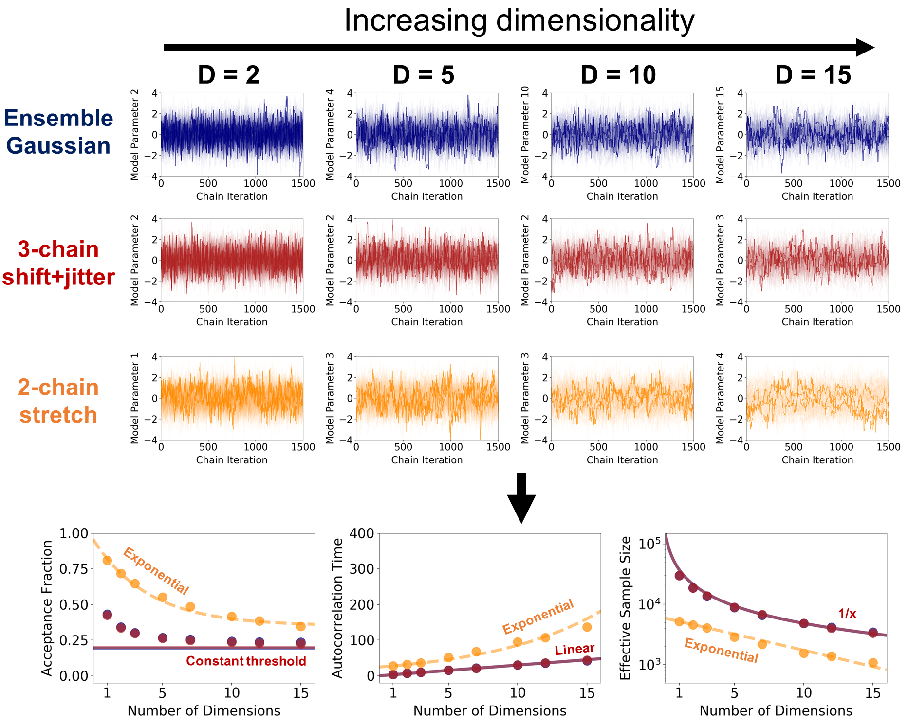

<figcaption>図15: トイ問題（すべての次元で平均 μ=0・標準偏差 σ=1 の d 次元ガウス）上での、いくつかのアンサンブル MH MCMC サンプラーの性能を示す数値結果。上段のパネル列は、γ=2.5/√d のアンサンブルガウス提案（青）・γ=1.7/√d の3連鎖「シフト＆ジッター」提案（赤）・§8.3.3 で述べた a=2 の g(γ|a) から引いた γ の2連鎖「ストレッチ」提案（橙）を仮定して、連鎖の集まりからのランダムなパラメータ（いくつかの連鎖を強調）のスナップショットを次元の関数として（左から右へ増加）示す。下段のパネルは対応する受容率（左）・自己相関時間（中）・有効サンプルサイズ（右）を次元の関数として示す。§8.2 に基づく近似を薄い実線で、大まかな当てはめを破線で示す。提案のサイズを縮小できる最初の2つの手法は、事後質量の大部分の中にサンプルを提案できる。それができない最後の手法は、次元が増えるにつれて指数的に少ない良い位置を提案する。詳細は §8.3 を参照。</figcaption>
</figure>

加えて、この提案は $\gamma$ を調整し、したがって軌跡そのものの長さを調整することを含むので、$\gamma$ を変えることが $\boldsymbol{\Theta}^{j}_{i}$ を中心とする半径 $\boldsymbol{\Theta}^{k}_{i}-\boldsymbol{\Theta}^{j}_{i}$ の球の総体積にどう影響するかを考える必要がある。§7.2 で議論したように、微分体積は $r^{d-1}$ として増える。したがって $\gamma$ を増減させることは提案の微分体積を大きく調整する。これは遷移確率に急峻な押し上げ／ペナルティを導入することを含み、それはいまや次になる:

$$
T(\boldsymbol{\Theta}_{i+1}^{j}|\boldsymbol{\Theta}_{i}^{j},\gamma)=\min\left[1,\gamma^{d-1}\frac{\mathcal{P}(\boldsymbol{\Theta}^{j}_{i+1})}{\mathcal{P}(\boldsymbol{\Theta}_{i}^{j})}\right]
$$

これは、大きな半径での指数的に増える体積を考慮するため、$d$ が増えるにつれて $\gamma>1$（外向き）の提案を強く優遇し、$\gamma<1$ の提案を強く冷遇する。

最後に、このストレッチ移動は実際には全体として正しい方向に提案を生成するが、次元が増えるにつれて事後質量の大部分の中にサンプルを生成するのに効率的でない。§8.2 で議論したように、$\boldsymbol{\Theta}_{i}^{j}$ の典型的な位置が与えられたとき、新しいサンプルが事後質量の大部分の中に留まることを保証するには、提案位置の典型的な長さスケールが $\propto 1/\sqrt{d}$ で縮む必要がある。しかし上で指定した $g(\gamma|a)$ の形は、代わりに $\gamma$ が常に $1/a$ と $a$ の間にあることを保証する。一定の受容率を狙いより多くの重なりを保証するために $d\rightarrow\infty$ につれて $a(d)\rightarrow 1$ とすることでこの効果を考慮しようとしても、提案の非対称性と遷移確率の $\gamma^{d-1}$ 項が、理想的な分布と比べて提案・受容される位置を系統的にバイアスする。これは続いてより大きい自己相関時間をもたらし、期待される利得をほとんど打ち消す。

#### 数値テスト

これらの結果を確認するために、これらの各アンサンブル MH MCMC アルゴリズムを使って、$m=100$ 個の連鎖で $n=1500$ 回の反復で、この $d$ 次元ガウス事後分布（簡単のため $\sigma=1$ と仮定）からサンプリングする。第一の場合、残りの $k\neq j$ 連鎖のアンサンブルにわたって計算した共分散 $\gamma^{2}\mathbf{C}_{i}^{j}$ を持つガウス分布を使って、反復 $i$ で連鎖 $j$ の新しい位置を提案する。ここでスケール因子 $\gamma=2.5/\sqrt{d}$ はおおよそ 25% の一定の受容率を狙うよう選ばれる。第二の場合、スケール因子 $\gamma=1.7/\sqrt{d}$ と、アンサンブルの残りの連鎖から導いた共分散 $\mathbf{C}_{\epsilon}=\mathbf{C}_{i}^{j}/5$ を持つ追加のガウスジッターを持つ DE-MCMC アルゴリズムを使って新しい位置を提案し、ここでもおおよそ 25% の受容率を狙う。第三の場合、$a=2$ の $g(\gamma|a)$ の典型的な形を仮定したアフィン不変ストレッチ移動を使って新しい位置を提案する。

図15に示すように、連鎖は次元の関数として理論的予測通りに振る舞う。適応的なガウスの場合と同様に、最初の2つのアプローチは $d$ が増えても効率的にサンプリングを続ける。しかしアフィン不変ストレッチ移動は、指数的に減少する効率を経験し、事後分布を効果的にサンプリングするのに苦労する。

## 9 結論

ベイズ統計手法は、モデルがより複雑になるにつれて、現代の科学的分析でますます普及してきた。これらのモデルから引き出せる推論を探ることはしばしば数値手法の使用を要し、その最も人気のあるものがマルコフ連鎖モンテカルロ（MCMC）として知られる。

本稿では、全体的なアプローチの「何を・なぜ・どのように」を強調しようとする MCMC への概念的入門を提供する。まずベイズ推論の概観を与え、ベイズ推論が一般に解こうとする問題の種類を議論し、計算したい量のほとんどが事後密度にわたる積分を要することを示す。次に、これらの積分をグリッドベースのアプローチを使って計算する方法を概説し、グリッドの解像度を適応的に変えることがモンテカルロ法の使用へ自然に移行する様子を図解する。異なるサンプリング戦略が全体の効率にどう影響するかを図解し、なぜ MCMC 法を使うのかを動機づける。次に、MCMC 法がどう機能するかに関連するさまざまな詳細を議論し、パラメータ数が増えるにつれて体積と事後密度がどう振る舞うかから導いた単純な議論に基づいて、それらの期待される全体の振る舞いを検討する。最後に、いくつかの MCMC 法の性能を単純なトイ問題で比較することで、この概念的理解が実際に持つ影響を強調する。

本稿の内容が、演習と応用とともに、MCMC や他のモンテカルロ法がどう機能するかの直感を構築するのに役立つ有用な資源として役立つことを願う。この直感は、可能な代替手段よりも MCMC 法を自分の問題にいつ適用するかを決めるとき、新しい提案やサンプリング戦略を開発するとき、そしてそうする際に遭遇しうる問題を特徴づけるときに役立つはずである。
