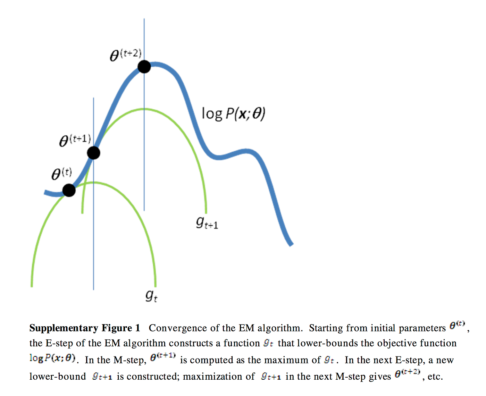
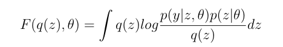
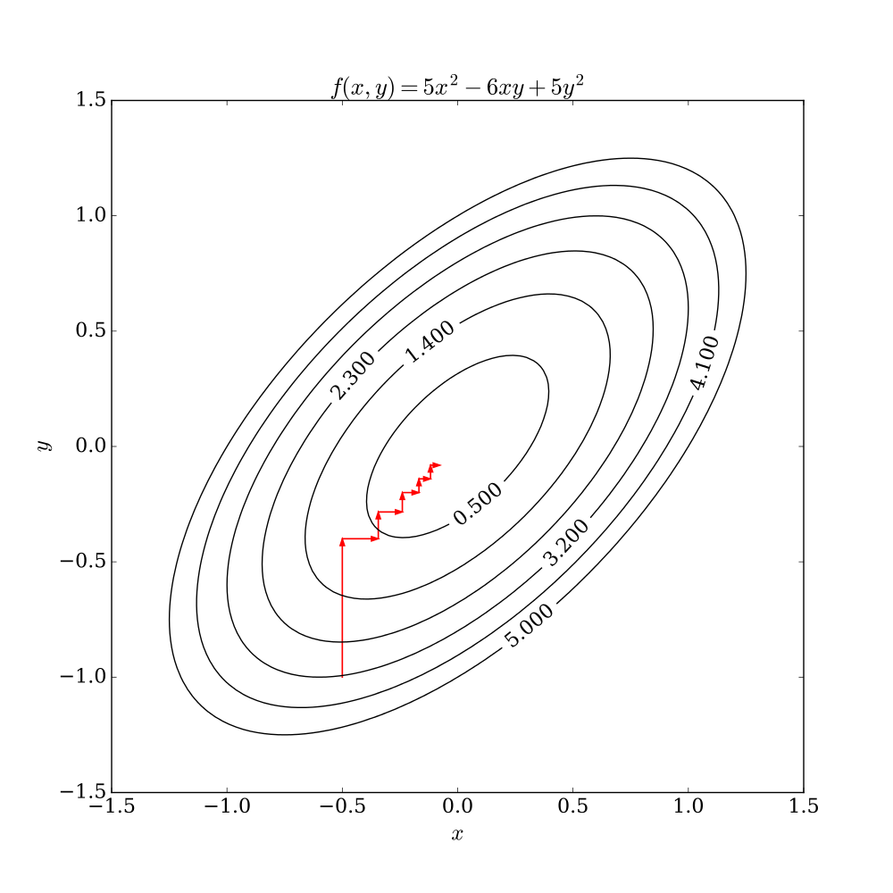

# EM アルゴリズムの解説

> 原題: The EM Algorithm Explained
> 著者: Chloe Bi
> 出典: Medium（2019-02-08）, https://medium.com/@chloebee/the-em-algorithm-explained-52182dbb19d9

期待値最大化アルゴリズム（Expectation-Maximization algorithm, 略して EM）は、おそらくこの分野で最も影響力があり広く使われている機械学習アルゴリズムの一つである。私が初めて EM アルゴリズムを学んだとき、それが何を達成しようとしているかについての直感的な説明と、なぜそれが理論レベルで機能するかの徹底的な分析の両方を提供するチュートリアルを見つけるのは驚くほど難しかった。これはもちろん困難な仕事である: このアルゴリズムは表面上はわずか2ステップしか関わらないので非常に単純に見えるが、重い数学的な裏付けのため極めて複雑でもある。余談だが、これは実は今日私が尋ねられた質問を思い出させる: 私たちは常に「ガウス分布の周辺分布もまたガウスである」ことを当然と思っているが、それを証明するのにどれだけの代数が必要か？ まあ、少なくとも2ページだと言われた。

EM が何かを説明するために、まずこの例を考えよう。ある大学にいて、この大学の男子学生と女子学生の身長分布を学ぶことに関心があるとする。おそらくあなたも同意するように、最も理にかなったことは、両方の性別の N 人の学生を無作為に標本抽出し、彼らの身長情報を集めて、男子と女子について別々に最尤法で平均と標準偏差を推定することである。

さて、身長情報を集める間、学生の性別を知ることができないとしよう。すると、推測/推定しなければならないことが2つある: (1) 個々の身長情報の標本が男子に属するか女子に属するか、(2) いまや観測できない各性別のパラメータ (μ, θ)。これが厄介なのは、誰がどのグループに属するかを知って初めて、グループのパラメータを別々に妥当に推定できるからである。同様に、グループを定義するパラメータを知って初めて、対象を適切に割り当てられる。これはまさに鶏と卵の問題になってしまった。この無限ループからどう抜け出すか？ EM アルゴリズムは、初期のランダムな推測から始めよ、と言うだけである。

身長の例に戻ろう。いま標本の前半を一方のグループに、後半をもう一方に無作為に割り当てると、2つのグループのパラメータの推定が得られる。特定されたグループで、メンバーシップの割り当てを見直して適切に再割り当てできる。これを反復的に行うと、メンバーの割り当てにもグループパラメータにもこれ以上の更新が必要なくなる段階に最終的に達することが保証される。これが有名な K-means アルゴリズムを思い出させるなら、まさにその通りである。実際、==K-means は、クラスタが球状であるという仮定を置いた EM アルゴリズムの特別な変種である。==

<figure>

<figcaption>図: EM アルゴリズムの素敵な可視化（Wikipedia より）。2次元データに対し、E-step（所属確率の更新）と M-step（ガウスのパラメータ更新）を反復して2つのガウス成分が収束していくアニメーション。</figcaption>
</figure>

反復プロセスがなぜ局所最適に達することを保証できるかを自分で納得したいなら、より数学的なやり方で再び説明してみよう。

数学的記法を使って問題を形式的に提示することから再び始めよう。確率モデルには、可視変数 (y)、潜在変数 (z)、そして関連するパラメータ (θ) がある。最大化したい尤度 p(y|θ) は、パラメータ（平均や分散などのグループの特徴）が与えられたときの観測量（身長）の確率を測る。θ は z に依存するが z は隠れているので、argmax 問題を解くのに最尤推定を直接適用できない。また、潜在変数 z の任意の分布として q(z) を定義しよう。すると、次が得られる:

<figure>

<figcaption>式(1)〜(3)。(1) ベイズ則: p(z|y,θ) = p(y|z,θ)p(z|θ) / p(y|θ)。(2) 左右辺を並べ替え: p(y|θ) = p(y|z,θ)p(z|θ) / p(z|y,θ)。(3) 人為的に q(z) で掛けて割る: p(y|θ) = [p(y|z,θ)p(z|θ)/q(z)] · [q(z)/p(z|y,θ)]。</figcaption>
</figure>

式(1)がベイズ則から導かれることは明らかなはずだ。式(1)の左辺と右辺から項を並べ替えると、式(2)に達する。次に、人為的に q(z) で掛けて割ると、式(3)が得られる。

<figure>

<figcaption>式(4)。式(3)の両辺の対数をとる: log p(y|θ) = log[p(y|z,θ)p(z|θ)/q(z)] + log[q(z)/p(z|y,θ)]。</figcaption>
</figure>

式(3)の両辺の対数をとると式(4)が得られる。両辺の q(z) に関する期待値を計算すると、次が得られる:

<figure>

<figcaption>式(5)。q(z) に関する期待値: 𝔼(log p(y|θ)) = ∫q(z)log[p(y|z,θ)p(z|θ)/q(z)]dz + ∫q(z)log[q(z)/p(z|y,θ)]dz。第2項は q(z) と p(z|y,θ) の KL ダイバージェンスで常に非負。</figcaption>
</figure>

さて、イェンセンの不等式（Jensen's inequality）の助けが必要になる。任意の狭義凸関数について E(f(x)) ≥ f(E(x)) が成り立つことを思い出そう。狭義凹関数では不等号が逆になる。式(5)に戻ると、log 関数は実際に凹関数なので（すなわち2階微分が -1/x² で < 0）、いまや「θ が与えられたときの y の対数尤度が式(5)に示される下界を持つ」ことを導ける。さらに、式(5)の第2項は本質的に q(z) と p(z|y, θ) の間の KL ダイバージェンス（KL divergence）であり、常に非負である。したがって、下界は第1項だけに簡約でき、これを F(q(z), θ) と表す。

尤度を最大化するには、式1〜4のどれかで単に1階微分をとってゼロに置きパラメータを解けばよいのでは、と尋ねるかもしれない。考えてみると、微分の部分は実は簡単な仕事ではない。しかし式(5)の F(q(z), θ) は対数の和なので、扱いやすい。

さて、こういう疑問が生じるかもしれない: 下界の最大は、私たちが本当に求めている実際の対数尤度の最大ではない、よね？ では、どうするか？ 以下は、デューク大学の計算統計学コースからの、EM アルゴリズムの収束の非常に素敵な可視化である。

<figure>

<figcaption>図: EM アルゴリズムの収束（出典: Computational Statistics in Python, Duke University）。E-step で下界関数を対象の尤度関数に接するよう持ち上げ、M-step でその下界を最大化、を繰り返して対数尤度の局所最大へ登っていく様子。</figcaption>
</figure>

E-step は固定された θ(t) から始め、下界（LB）関数 F(q(z), θ) を q(z) に関して最大化しようとする。直感的には、これは LB 関数が対象の尤度関数に接するときに起こる。数学的には、尤度関数は q(z) に依存しないので、下界の最大化は q(z) と p(z|y, θ(t)) の KL ダイバージェンスの最小化と等価になるからである。したがって、E-step は q(z) = p(z|y, θ(t)) を与える。

一方、M-step は、固定された q(z) に基づいて下界関数を θ(t) に関して最大化しようとする。式(5)から思い出そう

<figure>

<figcaption>式: 下界関数 F(q(z), θ) = ∫q(z)log[p(y|z,θ)p(z|θ)/q(z)]dz。</figcaption>
</figure>

分母の q(z) は θ に依存しないので無視できる。したがって、M-step は時刻 t において次の argmax 問題になる:

<figure>

<figcaption>式(6)。M-step: θ_t = argmax ∫q_t(z)log(p(y|z,θ_{t-1})p(z|θ_{t-1}))dz。</figcaption>
</figure>

E-step と M-step を繰り返し実行すると、上のグラフが示すように、尤度関数の局所最大に達することが期待される。

EM アルゴリズムを考えるもう一つのやり方は、座標上昇法（coordinate ascent）である。以下は Wikipedia からの素晴らしい可視化である。

<figure>

<figcaption>図: 座標上昇法の可視化（Wikipedia より）。EM は一度に一方向（q または θ）ずつ最適化を進め、徐々に最適値に達する。等高線上を軸に沿って階段状に登っていく様子。</figcaption>
</figure>

これは、関数が直接微分可能でない（したがって勾配降下法/上昇法が使えない）ときの強力な最適化アルゴリズムである。グラフから分かるように、最適化器は一度に一方向に向かって動き、徐々に最適値に達する。

EM アルゴリズムは（確率的）勾配降下法とどう比較されるか？ まず第一に、SGD を適用するには、根底の目的関数が微分可能である必要があるが、常にそうとは限らない。また、EM は map-reduce を使って簡単に並列化できる（マッパーが E-step を担当し、リデューサーが M-step を扱う）。大規模データで SGD を走らせるには、おそらく高価な GPU に頼ることになるだろう。

締めくくりに、EM アルゴリズムの応用について少しだけ話したい。これはガウス混合（Mixture of Gaussian）、クラスタリング（すなわち K-means）、隠れマルコフモデル（Hidden Markov Model）で一般的に使われる。入力データに現れない潜在変数をモデル化できる能力のおかげで、うまく機能する。Carl Rasmussen と Andrew Ng の講義ノートも下に置いた。

役に立つことを願う :)
