# ガウス過程、完全な初心者向けとまではいかないが

> 原題: Gaussian Processes, not quite for dummies
> 著者: Yuge Shi（University of Oxford, Torr Vision Group）
> 出典: The Gradient, 2019-11-14（thegradient.pub/gaussian-process-not-quite-for-dummies/）

> 注: 本翻訳は **本文（§Motivation 〜 §The end）のみ**を一文ずつ訳出する。末尾の Author Bio・Acknowledgments・Citation・購読案内は対象外。数式は LaTeX を保持。これは arXiv でなく Web ブログのため Obsidian Web Clipper が本文中の図をほぼ取りこぼしていた。**図は原サイト（thegradient.pub）から再取得して `raw/assets/2019-gp-not-for-dummies/` にローカル保存**し、原文の文脈に従って該当位置に配置した（全 44 枚＝PNG 37・アニメ GIF 7）。図のキャプションは原文に明示がないため、本文に基づく簡潔な訳注を付した。本文中の YouTube リンクは画像でなく講演動画なので参照リンクとして残す。

---

私はずっと、ガウス過程（GP; Gaussian Processes）について「関数の集合の上に確率分布を定義できる魔法のようなアルゴリズム」という漠然とした印象を抱きつつ、詳細を読むのを先延ばしにしてきた。とはいえ完全に私のせいでもない。「Gaussian Processes」とググるたびに、非線形回帰までは生き生きとした図で丁寧に説明してくれるのに、情報理論の話になった途端に逃げ腰になる、よく書けたチュートリアルばかりが見つかるのだ。結論はいつも次の一文に集約される。

> ガウス過程とは、ある点の集合に当てはまる「可能な関数」の上の確率分布である。

この一文を暗記しておけば、街中で見知らぬ人が突然ガウス過程の定義を尋ねてきても答えられる——そんな状況がしょっちゅう起きるとは思うが——が、それ以上には進めない。アルゴリズムはどの範囲で「可能な関数」を探すのか？ 連続で無限の空間上で物事をモデル化する能力は何が与えているのか？

困った私は、この分野の「あの本」、Carl Edward Rasmussen と Christopher K. I. Williams の [*Gaussian Processes for Machine Learning*](http://www.gaussianprocess.org/gpml/chapters/RW.pdf) に手を伸ばした。統計寄りの友人たちはこの本を絶賛するが、線形回帰についての 2 ページを読むのに 30 分かけたところで、私は実存的危機に陥った。良い本なのは間違いないが、数学が私の手に余る。

> 参照（原文では動画埋め込み）: Richard Turner 博士の講演 "Gaussian Processes: From the Basic to the State-of-the-Art" — YouTube `https://www.youtube.com/watch?v=92-98SYOdlY`

最終的に私は、上記の Richard Turner 博士による YouTube 講義に行き当たった。GP とその最先端アプローチへの素晴らしい入門だった。この動画を観た後では *Gaussian Processes for Machine Learning* を読むのがずっと楽になった。本稿はその講義のノートである。「機械学習 for dummies」的なチュートリアルで表面をなでる以上のことを知りたいが、まだ教科書に挑む準備はできていない、という人の助けになれば幸いだ。

## 動機: 非線形回帰

機械学習のほとんど全てと同じく、まず回帰から始めねばならない。問題を振り返ろう。誰かがデータ点（下図の赤い点）を持ってきて、特定の $x$ における $y$ の値を予測したい、という状況だ。

<figure>

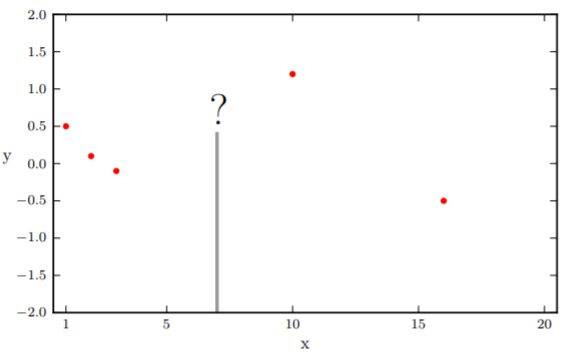

<figcaption>訳注: 回帰の問題設定。赤い点が観測データ点。</figcaption>
</figure>

非線形回帰では、観測に何らかの非線形曲線を当てはめる。選ぶ多項式の次数が高いほど、観測によく当てはまる。

<figure>

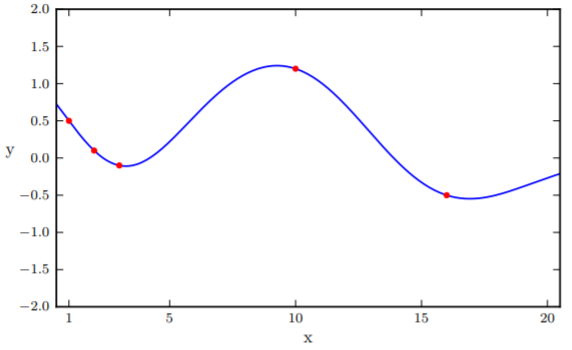

<figcaption>訳注: 観測に当てはめた非線形曲線（多項式の次数が高いほどよく当てはまる）。</figcaption>
</figure>

しかしこの種の伝統的な非線形回帰は、典型的にこれらの観測に最もよく当てはまると判断した**1 つの**関数を返す。だが、同じくらいよく当てはまる他の関数は？ もう 1 点観測したら、そのうちの 1 つが「最良」解よりずっと良い当てはまりになるとしたら？

<figure>

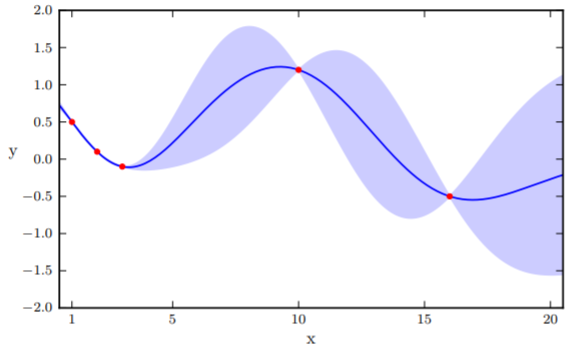

<figcaption>訳注: 同程度によく当てはまる関数は複数あり得る——単一の「最良」曲線だけでは不十分。</figcaption>
</figure>

この問題を解くために、おなじみのガウス分布に頼る。

## ガウス分布の世界

多変量ガウス分布は同時正規分布とも呼ばれ、一変量ガウス分布を高次元空間に一般化したものである。形式的な定義は次の通り。

> 確率変数は、その $k$ 個の成分の任意の線形結合が一変量正規分布を持つとき、$k$ 変量正規分布に従うという。

数学的には、$X = (X_1, ...X_k)^T$ は、任意の定数ベクトル $a \in \mathcal{R}^{k}$ に対して $Y = a_{1} X_{1} + a_{2} X_{2} + ... + a_{k} X_{k}$ が正規分布するとき、多変量ガウス分布を持つ。

**注**: *$k$ 個の成分がすべて独立なガウス確率変数なら、$X$ は必ず多変量ガウスである（独立なガウス確率変数の和は常にガウスだから）。また、確率変数の和は分布の和とは異なる——2 つのガウス分布の和はガウス混合になり、特殊な場合を除いてガウスではない。*

<figure>

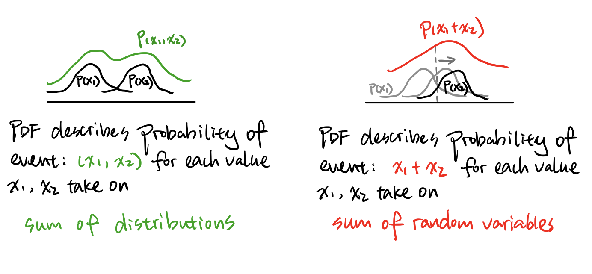

<figcaption>訳注: ガウス分布の図解（独立なガウスの和はガウス／分布の和はガウス混合）。</figcaption>
</figure>

## 2D ガウスの例

### 共分散行列

平均 0 の 2D ガウス分布の例を示す。楕円の等高線は確率が一定の点を表す。

<figure>

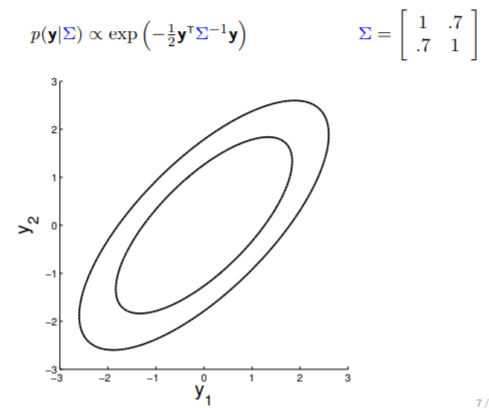

<figcaption>訳注: 平均 0 の 2D ガウス分布。楕円等高線＝等確率の点。</figcaption>
</figure>

共分散行列 $\Sigma$ は、(1) 各確率変数の**分散**（対角成分）と (2) 確率変数間の**共分散**（非対角成分）を教えてくれる。上図の共分散行列は $y_1$ と $y_2$ が正に相関している（共分散 $0.7$）ことを示し、ゆえに等高線がやや「伸びた」形になる。分散を変えずに共分散を減らし続けると、次の遷移が観察できる。

<figure>

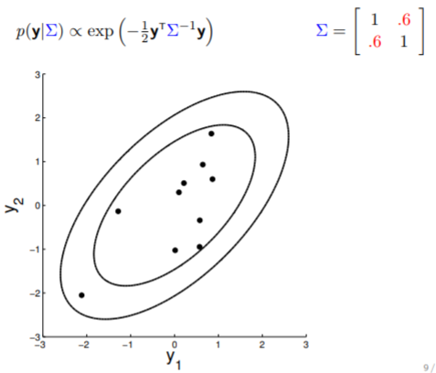
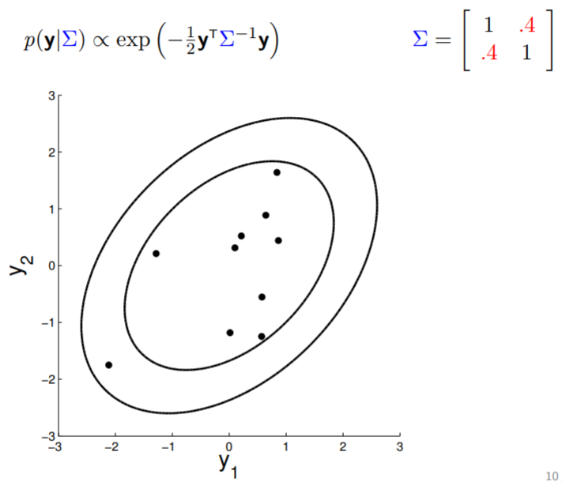
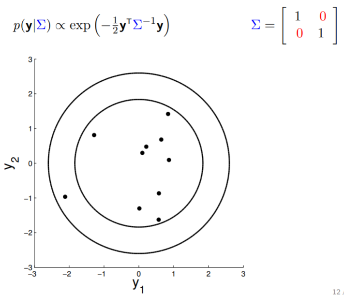

<figcaption>訳注: 分散を保ったまま共分散を減らしていく遷移（左から右へ）。</figcaption>
</figure>

$y_1$ が $y_2$ から独立なとき（上の最も右のプロット）、等高線は球状になることに注意。

### 条件付け

多変量ガウスでできるもう 1 つの面白いことは条件付けである。2D では図で示せる。

<figure>

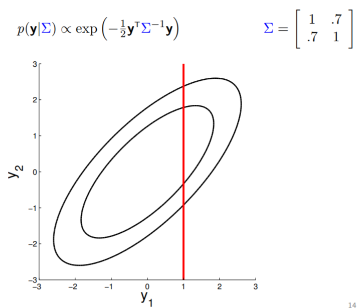

<figcaption>訳注: 2D での条件付けの図解。</figcaption>
</figure>

$y_1$ の値を固定し、赤線に沿って $y_2$ の密度を計算する——すなわち $y_1$ で条件付ける。ここでは $y_2 \in \mathcal{N}(\mu, \sigma)$ なので、条件付けによって再びガウスが得られることに注意。

<figure>

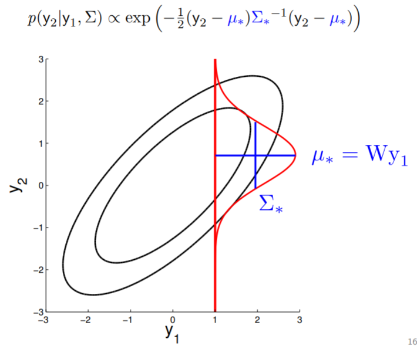

<figcaption>訳注: $y_1$ を固定して赤線に沿う $y_2$ の密度を見る＝条件付き分布もガウス。</figcaption>
</figure>

相関が下がるにつれてこの条件付きガウスがどう変化するかも可視化できる——相関が $0$ のとき、$y_1$ は $y_2$ について何も教えてくれないので、$y_2$ の平均は $0$ に落ち、分散は高くなる。

<figure>

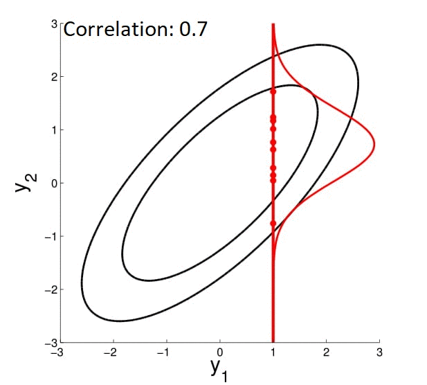

<figcaption>訳注（アニメ GIF）: 相関が下がるにつれ、条件付き $y_2$ の平均は 0 へ・分散は増大していく。</figcaption>
</figure>

## 高次元ガウス

## 2D ガウス

ガウスの楕円等高線グラフは、多変量ガウス分布の平均と共分散の情報を与えるが、サンプリングの過程で確率変数が互いにどう相関するかについての直感はあまり与えてくれない。

そこで、次のようにプロットできる新しい解釈を考える。

2D ガウスの楕円等高線グラフ（下図の左上）を取り、その上の**ランダムな点**を選ぶ。次にその点の $y_1$ と $y_2$ の値を、新しいグラフ上の index = $1$ と $2$ にそれぞれプロットする。

<figure>

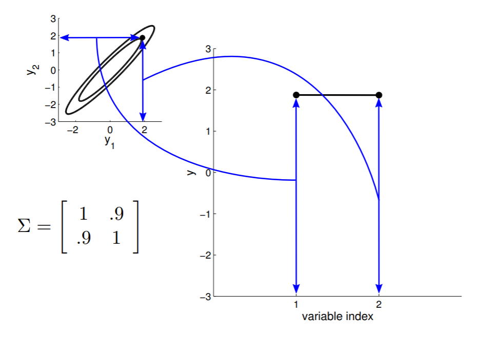

<figcaption>訳注: 「インデックスプロット」の考え方。等高線上の 1 点の $y_1,y_2$ を index 1,2 の高さとして描く。</figcaption>
</figure>

この設定のもとで、複数の「**ランダムな点**」を取り、$y_1$ と $y_2$ を index $1$ と $2$ に何度もプロットすることで、サンプリング操作を新しい仕方で可視化できる。$y_1$ と $y_2$ は相関している（相関 $0.9$）ため、複数サンプルを取ると、index グラフ上のバーは 2 つの端点が一緒に上下しながらごくわずかに「揺れる」だけになる。

<figure>

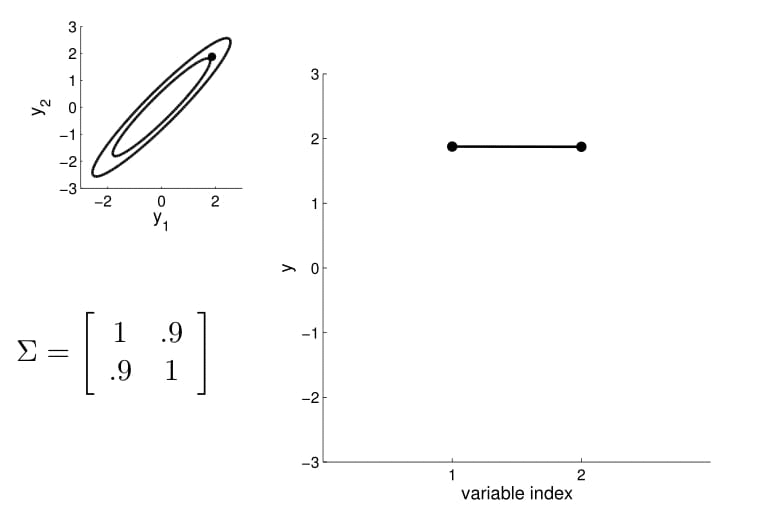

<figcaption>訳注（アニメ GIF）: 相関 0.9 の 2D ガウスから複数サンプル。2 端点は一緒に動き、バーはわずかに揺れる。</figcaption>
</figure>

条件付けについては、index グラフ上の端点の 1 つを固定（下のプロットでは $y_1$ を 1 に固定）し、$y_2$ からサンプリングすればよい。

<figure>

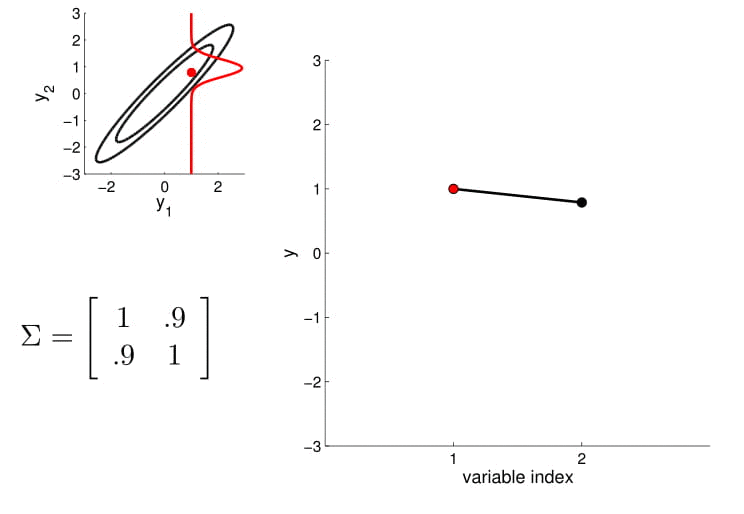

<figcaption>訳注（アニメ GIF）: index 上で $y_1=1$ に固定し $y_2$ をサンプリング（条件付け）。</figcaption>
</figure>

## より高次元のガウス

### 5D ガウス

次に、より高次元のガウスを 5D から考える——共分散行列は 5×5 になる。

共分散行列をよく見て、次に気づいてほしい。

1. すべての分散（対角）は 1 に等しい。
2. 2 点の index が離れているほど、相関は低い（例えば $y_1$ と $y_2$ の相関はかなり高く、$y_1$ と $y_3$ は低く、$y_1$ と $y_4$ は最も低い）。

<figure>

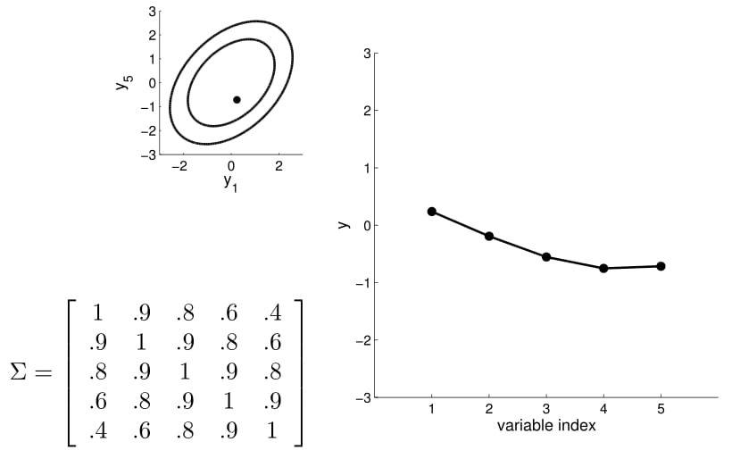

<figcaption>訳注（アニメ GIF）: 5D ガウスとその共分散構造（index が離れるほど相関が低い）。</figcaption>
</figure>

再び $y_1$ で条件付け、他のすべての点についてサンプリングできる。$y_2$ が $y_3$〜$y_5$ より動きが小さいのは、$y_1$ により強く相関しているからである。

<figure>

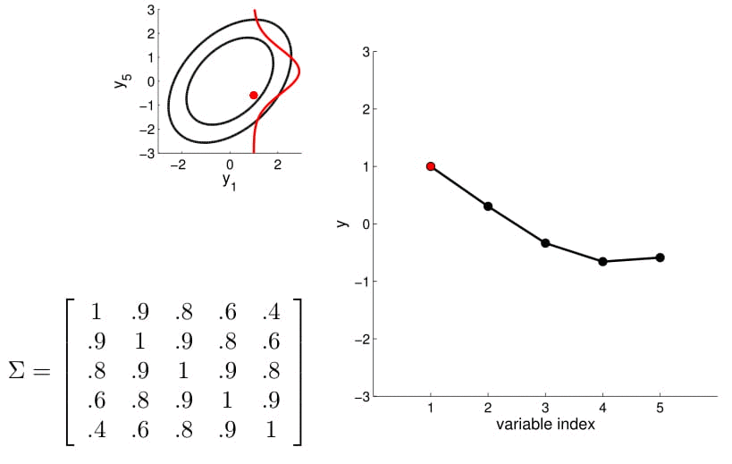

<figcaption>訳注（アニメ GIF）: $y_1$ で条件付けて他点をサンプリング。$y_1$ に強く相関する $y_2$ ほど動きが小さい。</figcaption>
</figure>

### 20D ガウス

より直感的にするため、20D ガウスでは数値の共分散行列をカラーマップに置き換える。暖色ほど高い相関を表す。

<figure>

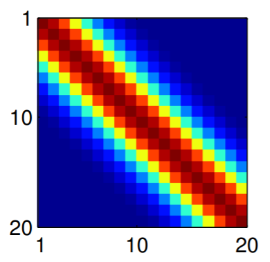

<figcaption>訳注: 20D ガウスの共分散行列をカラーマップで表示（暖色＝高相関）。</figcaption>
</figure>

これは次のようなサンプルを与える。

<figure>

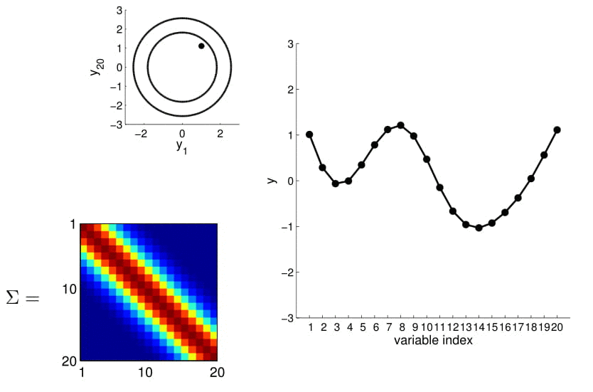

<figcaption>訳注（アニメ GIF）: 20D ガウスからのサンプル（index プロット）。</figcaption>
</figure>

では、$y_1$ と $y_2$ で条件付けた 20D ガウスに何が起こるか見てみよう。

<figure>

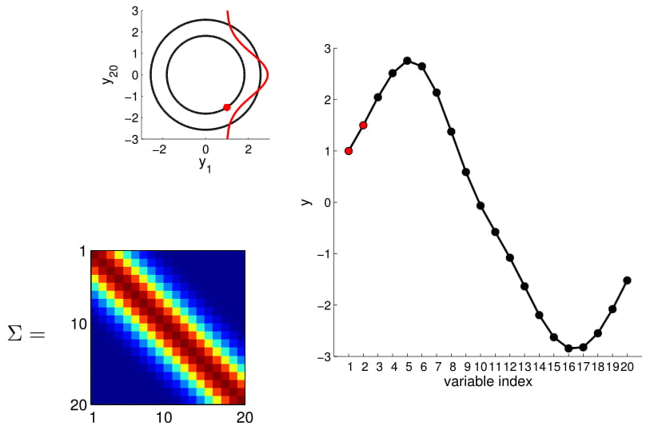

<figcaption>訳注（アニメ GIF）: $y_1, y_2$ で条件付けた 20D ガウスのサンプル。</figcaption>
</figure>

そろそろこう思っているかもしれない。「ああ、これは最初に始めた非線形回帰問題そっくりだ！」 まさにその通りで、これは $y_1$ と $y_2$ を観測として与えた非線形回帰問題とちょうど同じである。この 20D ガウスの index プロットを使えば、これらの観測に当てはまる**関数の族**を生成できる。さらに良いことに、それらを何本も生成すれば、ランダムに生成した曲線を使って当てはめの平均と分散を計算できる。下のプロットでこれを可視化する。

<figure>

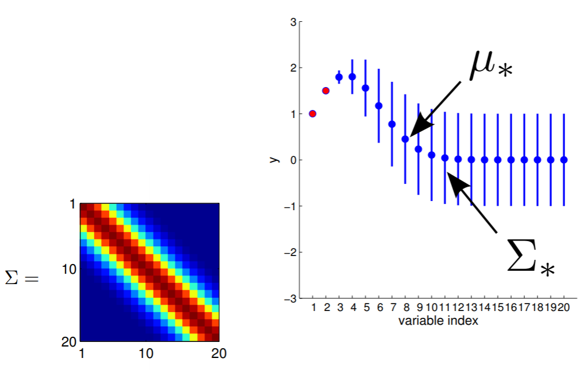

<figcaption>訳注: 観測に当てはまる関数族から平均と分散を計算（＝回帰）。観測に近い点は不確実性が小さく、遠い点は大きい。</figcaption>
</figure>

上図から、共分散行列の構造（近い点ほど高相関）ゆえに、観測に近い点は非ゼロの平均で不確実性が非常に低く、遠い点は不確実性が高く平均ゼロになることがわかる。*（注: 実際には平均と標準偏差の推定にサンプルを取るわけではない。それらは完全に解析的である。）*

ここではもう少し*刺激的な*例として、20D ガウスの 4 点で条件付ける場合も示す（統計学者がなぜ嫌われるのか、まだ不思議に思う？）。

<figure>

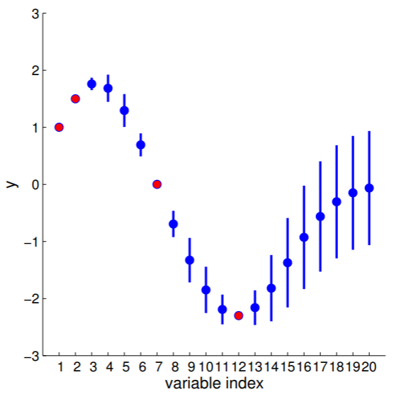

<figcaption>訳注: 20D ガウスを 4 点で条件付けた場合の回帰。</figcaption>
</figure>

## 「現実」に踏み込む

非線形回帰へのこのアプローチの問題は明らかに見える——x 軸の点はすべて整数でなければならないように感じる（それらは index だから）が、現実には実数値の観測をモデル化したい。これに対する 1 つの明白な解決策は、ガウスの次元を増やし続けて観測の近くに多くの点を計算することだが、これは少々不格好だ。

解決策は共分散行列の生成法にある。慣例的に $\Sigma$ は次の 2 段階の過程で計算される。

$$
\Sigma (x_1, x_2) = K(x_1, x_2) + I \sigma_y^2
$$
$$
K(x_1, x_2) = \sigma^2 e^{-\frac{1}{2l^2}(x_1 - x_2)^2}
$$

<figure>

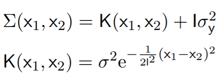

<figcaption>訳注: 共分散行列の 2 段階生成（RBF カーネル $K$ ＋ ノイズ項 $I\sigma_y^2$）。</figcaption>
</figure>

上のすべての例の共分散行列は、放射基底関数（RBF; Radial Basis Function）カーネル $K(x_1, x_2)$ を使い、$x_1, x_2$ に整数値を取って計算されている。この RBF カーネルは、互いに近い $x_1, x_2$ には大きな出力値を、遠い入力には小さい値を生成することで、共分散行列の**「滑らかさ」**を保証する。$x_1 = x_2$ なら $K(x_1, x_2) = \sigma^2$ になることに注意。最終的な共分散行列はノイズを織り込むため $K$ に $I\sigma_y^2$ を足す——詳細は後述。

これは原理的に、**任意の実数値 $x_1, x_2$ について、それらを単に代入するだけでこの共分散行列を計算できる**ことを意味する。実数値の $x$ は事実上、共分散行列で定義される無限次元ガウスを生む。

<figure>

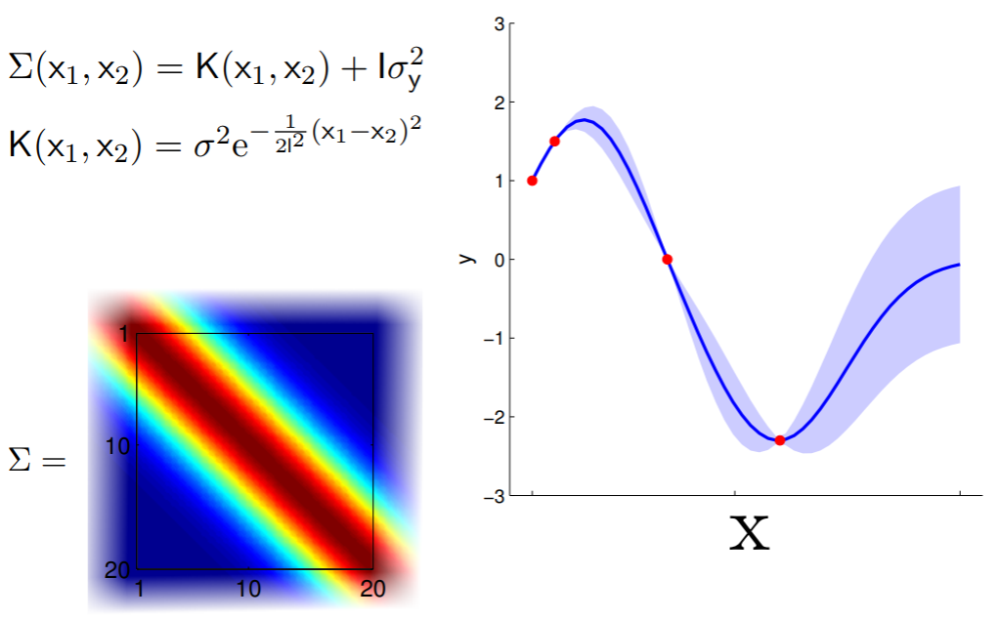

<figcaption>訳注: 実数値 $x$ により共分散行列が定義する無限次元ガウス＝GP。</figcaption>
</figure>

さて、それこそが**ガウス過程**である（マイクドロップ）。

## ガウス過程

## 教科書的定義

上の導出から、ガウス過程は多変量ガウス分布を無限個の変数に一般化したものと見なせる。宣誓の上で証言せねばならない場合に備え、GP の教科書的定義も示す。

> ガウス過程とは確率変数の集まりであり、その任意の有限個が無矛盾なガウス分布を持つ。

ガウス分布が平均と分散で規定されるのと同様、ガウス過程は (1) 入力空間の任意の点での平均を与える平均関数 $m(x)$ と、(2) 点間の共分散を定める共分散関数 $K(x, x')$ で完全に定義される。平均は任意の値でよく、共分散行列は正定値であるべきである。

$$
f(x) \sim \mathcal{G}\mathcal{P}(m(x), K(x, x'))
$$

## パラメトリック vs. ノンパラメトリック

ガウス過程は、パラメトリックな非線形回帰モデルとは対照的に、ノンパラメトリックである。そしてここに秘密がある。

### ノンパラメトリックモデル ＝ 無限個のパラメータを持つモデル

パラメトリックモデルでは、関数をいくつかのパラメータで明示的に定義する。

$$
y(x) = f(x) + \epsilon \sigma_y
$$
$$
p(\epsilon) = \mathcal{N}(0,1)
$$

ここで $\sigma_y$ は、当てはめが実際の観測にどれだけノイジーかを記述するガウスノイズである（図的には、データが当てはめ曲線の上にどれだけ頻繁に乗るかを表す）。

<figure>

<figcaption>訳注: ノンパラメトリック＝実質無限個のパラメータを持つモデルの図解。</figcaption>
</figure>

非線形関数の上にガウス過程事前分布を置ける——つまり、上のパラメトリック関数が次のように定義されるガウス過程から引かれたと仮定する。

$$
p(f(x)\mid \theta) = \mathcal{G}\mathcal{P}(0, K(x, x'))
$$
$$
K(x, x') = \sigma^2 \text{exp}(-\frac{1}{2l^2}(x-x')^2)
$$

<figure>

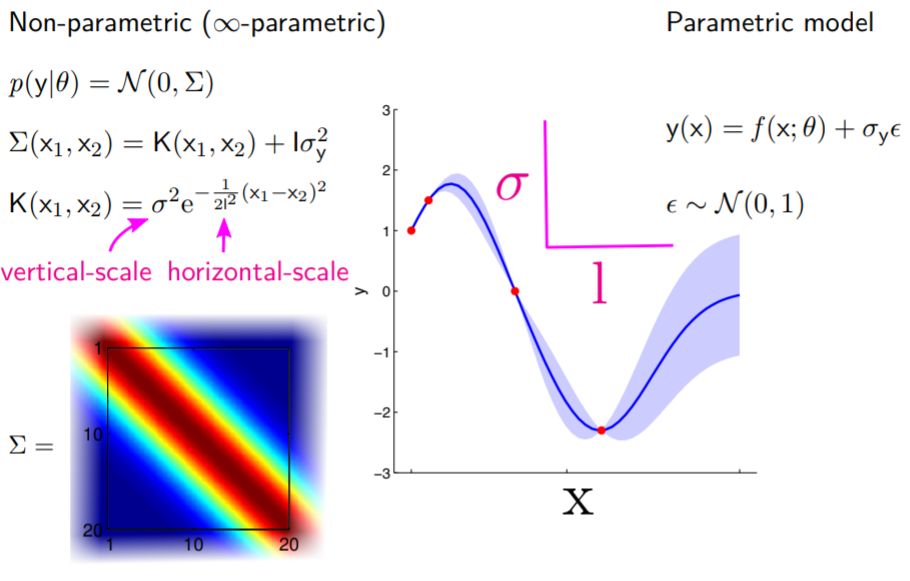

<figcaption>訳注: GP 事前分布が生成する滑らか／うねった関数群。</figcaption>
</figure>

この GP はたくさんの滑らか／うねった関数を生成する。自分のパラメトリック関数がこの GP が生成する関数族に入ると思うなら、これは非線形回帰を行う理にかなった方法である。

ガウス変数の和もまたガウスなので、ガウスノイズ $\sigma_y$ をモデルに直接足すこともできる。

$$
p(f(x)\mid \theta) = \mathcal{G}\mathcal{P}(0, K(x, x') + I\sigma_y^2)
$$

まとめると、GP 回帰はパラメトリックモデルによる回帰とまったく同じだが、ただこのデータセットで考えたい関数の集合に事前分布を置く点が異なる。この「関数の集合」の特徴は、選んだカーネル $K(x, x')$ で定義される。慣例的に事前分布は平均 0 であることに注意。

## ハイパーパラメータ

ここには 2 つのハイパーパラメータがある。

- **縦スケール** $\sigma$: 関数が縦方向にどれだけの幅を持つかを記述する。
- **横スケール** $l$: 2 点間の距離が増すにつれて相関がどれだけ速く落ちるかを記述する——高い $l$ は*滑らかな*関数を、低い $l$ は*うねった*関数を与える。

<figure>

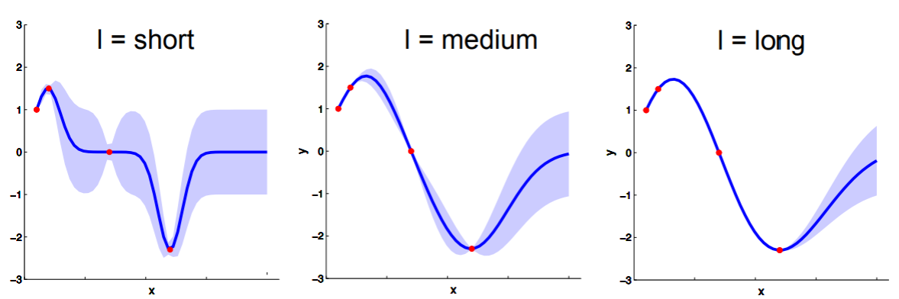

<figcaption>訳注: 横スケール（長さスケール）$l$ の効果。高い $l$＝滑らか、低い $l$＝うねる。</figcaption>
</figure>

幸い $p(y \mid \theta)$ はガウスなので、その尤度を閉形式で計算できる。つまり、勾配最適化器を使って、これらのハイパーパラメータのもとで $p(y \mid \theta)$ の尤度を最大化すればよい。

<figure>

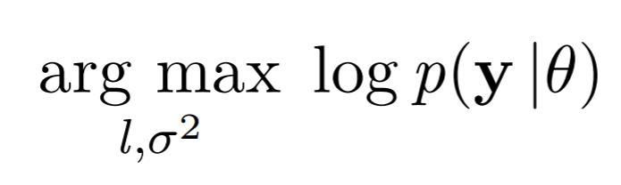

<figcaption>訳注: 周辺尤度 $p(y\mid\theta)$ をハイパラについて勾配最適化で最大化。</figcaption>
</figure>

## 実装の詳細

***始める前に:** ここではかなり高レベルにとどまる——コードは示さないが、GP の実装は GitHub で簡単に見つかる（個人的には [this repo](https://github.com/dfm/gp/blob/master/worksheet.ipynb) が好き。ステップごとの説明つき Jupyter Notebook ウォークスルーだ）。ただしこの部分は GP が実際にどう動くかを理解するのに重要なので、飛ばさないように。*

## 計算

ここまでで、こう思っているはずだ。無限次元の共分散行列を持つこの滑らかな関数の話は結構なものだが、無限×無限の行列で実際にどう計算するのか？

**周辺化（Marginalization）！** 2 つのベクトル変数 $y_1$ と $y_2$ 上の多変量ガウスがあると想像しよう。

<figure>

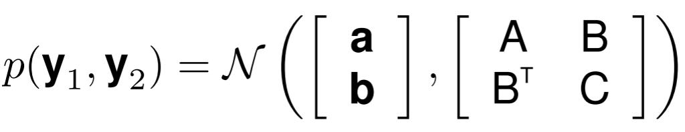

<figcaption>訳注: $y_1, y_2$ 上の多変量ガウス。平均は $a, b$、共分散は $A, B, B^\top, C$ に分割。</figcaption>
</figure>

ここで平均を $y_1$ の平均 $a$ と $y_2$ の平均 $b$ に分割する。同様に共分散行列も、$y_1$ の共分散 $A$、$y_1$ と $y_2$ の共分散 $B$、$y_2$ と $y_1$ の $B^T$、$y_2$ の $C$ に分割する。すると、周辺化の性質を使って $y_1$ の確率を簡単に計算できる。

<figure>

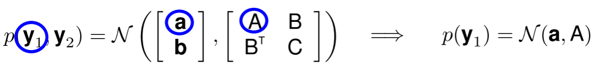

<figcaption>訳注: 周辺化の性質——$y_1$ の周辺分布は $\mathcal{N}(a, A)$ で $y_2$ を無視できる。</figcaption>
</figure>

この定式化は極めて強力だ——$p(y_1, y_2)$ の同時分布のもとで、$y_2$ を完全に無視しながら $y_1$ の尤度を計算できる！ ここで $y_1$ と $y_2$ の定義を次のように変えることで、2 変数から**無限個**へ一般化できる。

- $y_1$: 関心のある有限個の変数を含む。
- $y_2$: 気にしない変数をすべて含む。これは無限個である。

2 変数の場合と同様に、$y_2$ の無限の部分を気にせず、$y_1$ の分割についてのみ平均と共分散を計算できる。この性質のおかげで、根底にある無限の対象の有限次元射影をコンピュータ上で考えられる。裏で起きている無限のことは忘れてよい。

## 予測

上の $y_1, y_2$ の例を取るが、今度はすべての観測が $y_2$ の分割に、予測したいすべての点が $y_1$ にあると想像する（やはり無限の点は背景にあり、ここでは省略する $y_3$ に押し込めたと考える）。

<figure>

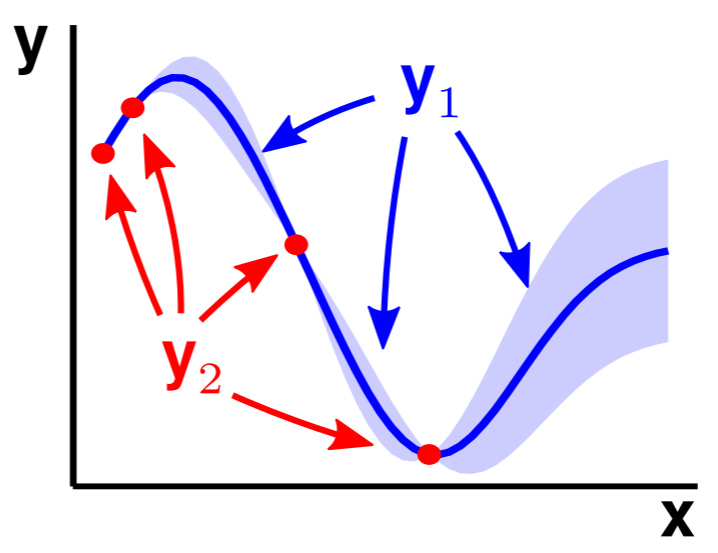

<figcaption>訳注: 予測の設定。観測を $y_2$、予測対象を $y_1$、無限の残りを $y_3$（省略）に置く。</figcaption>
</figure>

$y_2$ の観測が与えられたとき $y_1$ について予測するには、ベイズ則で $p(y_1 \mid y_2)$ を計算すればよい。

<figure>

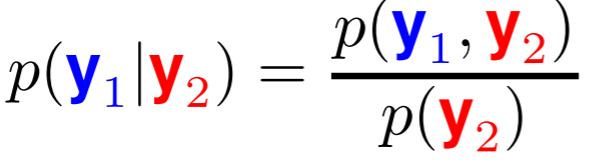

<figcaption>訳注: ベイズ則による $p(y_1\mid y_2)$ の計算。</figcaption>
</figure>

$p(y_1)$, $p(y_2)$, $p(y_1, y_2)$ はすべてガウスなので、$p(y_1 \mid y_2)$ もガウスである。したがって $p(y_1 \mid y_2)$ を解析的に計算できる。

<figure>

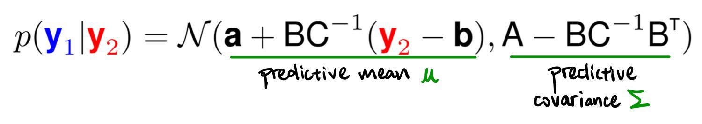

<figcaption>訳注: $p(y_1\mid y_2)$ の解析解（ガウス）。</figcaption>
</figure>

> 注: ここで GP のボトルネックを垣間見る。この解析解は観測の共分散行列の逆 $C^{-1}$ の計算を含み、$n$ 個の観測に対して $O(n^3)$ の演算になる。これが Cholesky 分解を使う理由である——詳細は後述。

もう少し直感を得るために、予測平均と予測共分散を次のように書き下せる。

<figure>

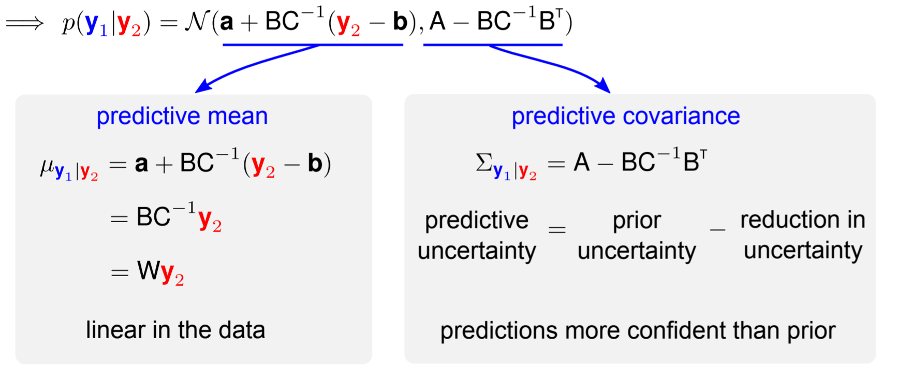

<figcaption>訳注: 予測平均（観測 $y_2$ に線形）と予測共分散（事前の不確実性から観測による減少を引いたもの）。</figcaption>
</figure>

つまり $p(y_1 \mid y_2)$ の平均は $y_2$ に線形に関係し、予測共分散は事前の不確実性から観測を見た後の不確実性の減少を引いたものである。したがって、より多くのデータを見るほど、より確信を持てる。

## より高次元のデータ

これは（もちろんより大きな計算コストで）高次元データにも行える。ここでは共分散関数を拡張して 2D データに RBF カーネルを組み込む。

<figure>

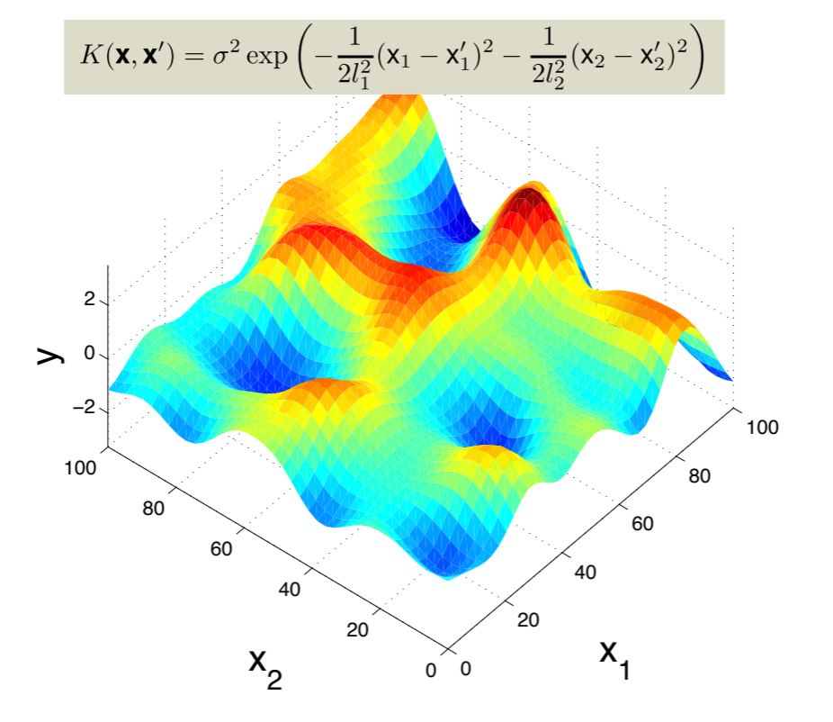

<figcaption>訳注: 2D データへの RBF カーネルによる GP（高次元データへの拡張）。</figcaption>
</figure>

## 共分散行列の選択

最後の細部として、GP に使う様々な共分散行列について話そう。一般に GP のカーネル選択について権威ある助言は持っていないし、実際には大半の人がいくつかの人気カーネルを試し、自分のデータ／問題に最もよく当てはまるものを選ぶのだと思う。そこでここでは、最もよく見るいくつかのカーネルの形を紹介し、プロットで感触をつかむだけにとどめ、詳細には立ち入らない。（ただしいくつか実装して遊んでみることを強く勧める！ 良いコーディング練習になり、これらのカーネルの直感を得る最良の方法だ。）

### ラプラシアン関数

この関数は連続だが微分不可能である。次のように見える。

<figure>

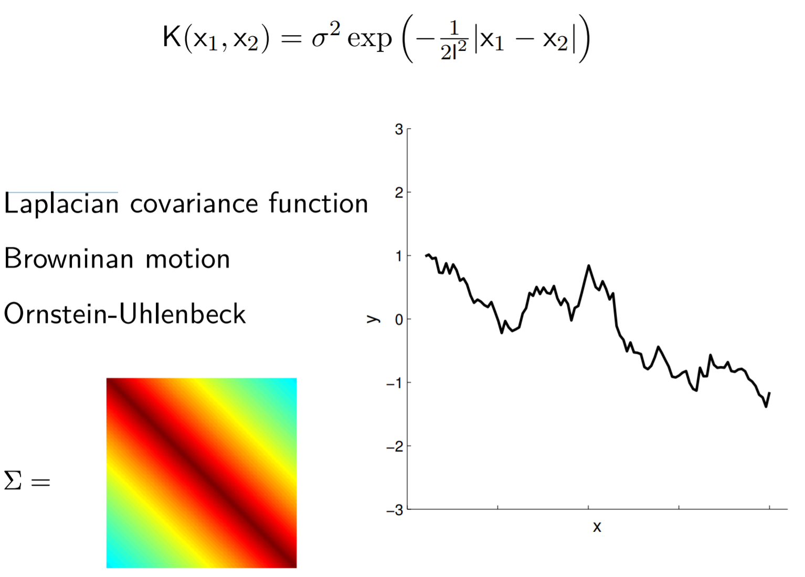

<figcaption>訳注: ラプラシアンカーネルのサンプル（連続だが微分不可能）。</figcaption>
</figure>

すべてのサンプルで平均を取ると、データ点を結ぶ直線が得られる。これはブラウン橋（Brownian bridges）と呼ばれる。

<figure>

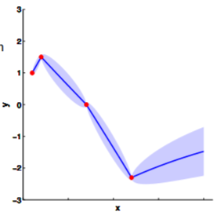

<figcaption>訳注: ラプラシアンカーネルの全サンプル平均＝データ点を結ぶ直線（ブラウン橋）。</figcaption>
</figure>

### 有理二次

<figure>

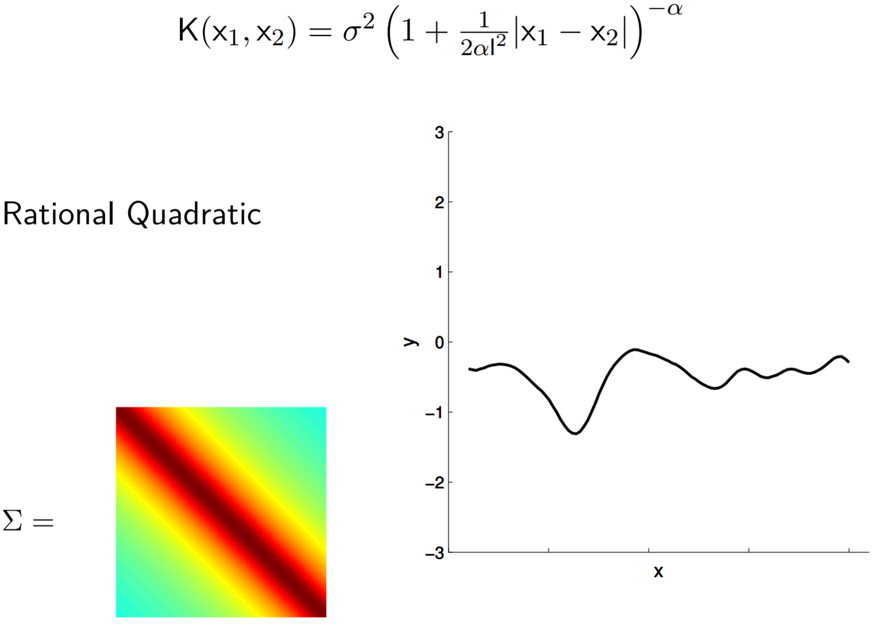
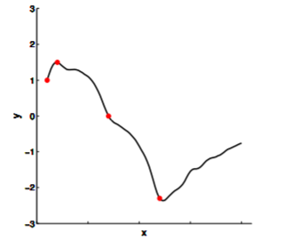

<figcaption>訳注: 有理二次カーネルのサンプルと、全サンプルの平均。</figcaption>
</figure>

すべてのサンプルで平均を取ると次のようになる。

<figure>

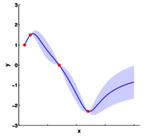

<figcaption>訳注: 有理二次カーネルの全サンプル平均。</figcaption>
</figure>

### 周期関数

<figure>

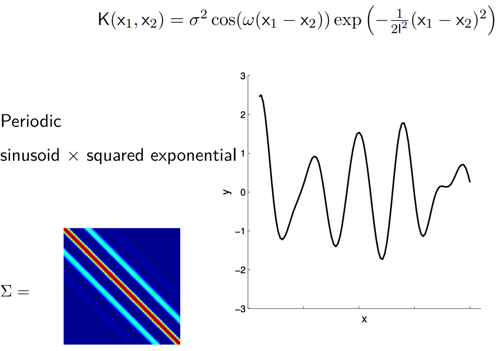
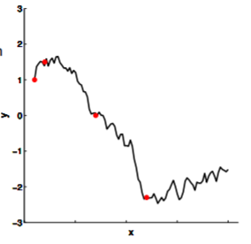

<figcaption>訳注: 周期カーネルのサンプルと、全サンプルの平均。</figcaption>
</figure>

すべてのサンプルで平均を取ると次のようになる。

<figure>

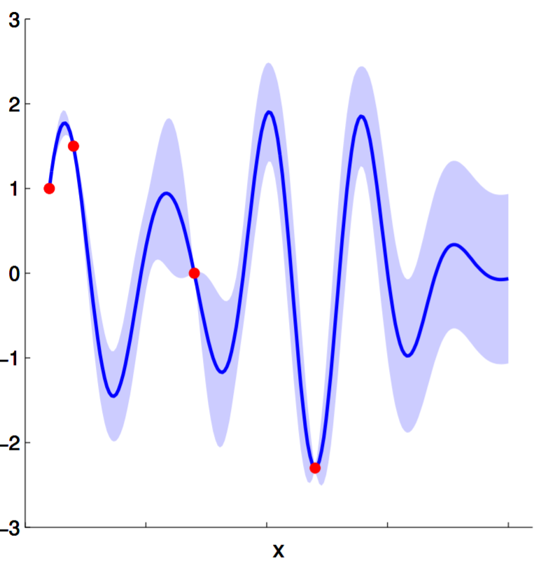

<figcaption>訳注: 周期カーネルの全サンプル平均。</figcaption>
</figure>

### まとめ

特定の問題に適した共分散関数のカーネルを調べられる本があり、より複雑な共分散関数を作る規則もある（例えば、2 つの共分散関数の積も有効な共分散関数である）。それらは大きく異なる結果を与えうる。

<figure>

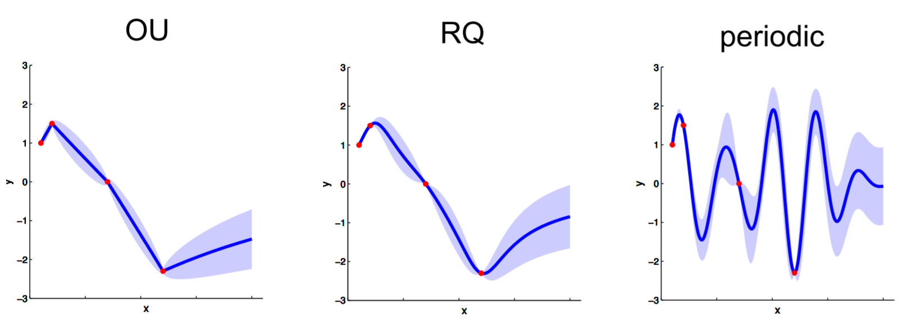

<figcaption>訳注: 異なるカーネルは大きく異なる回帰結果を与える。</figcaption>
</figure>

適切な共分散関数を見つけるのは厄介だが、モデル選択の手法も用意されている。その 1 つがベイズモデル比較で、次のように定義される。

<figure>

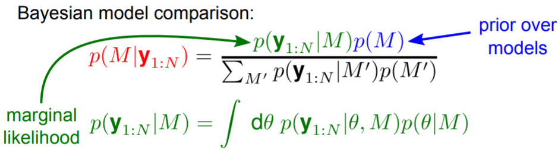

<figcaption>訳注: ベイズモデル比較の定義（ハイパラ上の積分／和を含む）。</figcaption>
</figure>

ただしこれは、GP のハイパーパラメータ上の非常に難しい積分（離散の場合は上で示したように和）を含むため非現実的で、ハイパーパラメータに置く事前分布にも非常に敏感である。実際には、自動カーネル設計のために深層ガウス過程（deep Gaussian Processes）を使う方が一般的で、訓練を通じてデータに適した共分散関数の選択を最適化する。

## おわりに

本稿がガウス過程の助けになる手引きであったことを願う。ここでは比較的短くシンプルに保つため、実際に GP を使う際の複雑さには立ち入らなかった。現実には、GP は大規模データセットでのスケーリング問題と、カーネル選択への非常に高い感度に悩まされる。最近のいくつかのアプローチがこれらの問題に取り組んでいる（[deep GP](https://arxiv.org/abs/1602.04133) と [sparse GP](https://arxiv.org/abs/1605.07066) を参照）が、私はこの分野の専門家では到底ないので、探求は読者に委ねる。
