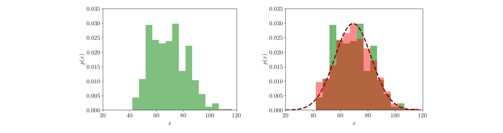
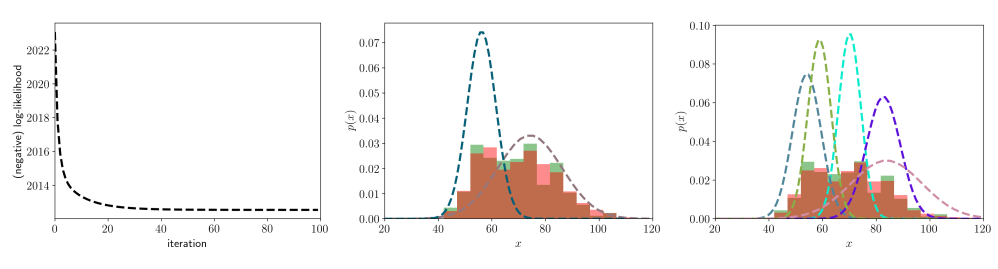

# ガウス混合モデルの概観

> 原題: An overview of Gaussian Mixture Models
> 著者: Massimiliano Patacchiola
> 出典: 個人ブログ（mpatacchiola.github.io, 2020-07-31）, https://mpatacchiola.github.io/blog/2020/07/31/gaussian-mixture-models.html

この記事では、ガウス混合モデル（Gaussian Mixture Models, GMMs）の概観を、GMM のコンパクトな実装を含む Python コードとトイデータセットへの応用とともに提供する。この記事は、Deisenroth, Faisal, Ong による書籍 *“Mathematics for Machine Learning”*（PDF は[こちら](https://mml-book.com/)、ペーパーバック版は[こちら](https://www.cambridge.org/gb/academic/subjects/computer-science/pattern-recognition-and-machine-learning/mathematics-machine-learning?format=PB)で入手可能）の第11章に基づく。

**何を知っておく必要があるか？** この記事を楽しむには、基本的な確率論（確率変数・確率分布など）、いくらかの微積分（微分）、そしてプログラミング部分に踏み込みたいならいくらかの Python を知っている必要がある。記事は次の筋書きに従う:

- ガウス分布の手早い復習
- ガウス分布の尤度と最尤推定（ML）
- 例: ガウス分布で分布を当てはめる
- 潜在変数モデルへの導入
- ガウス混合モデル（GMMs）
- GMM の尤度と責任（responsibilities）
- GMM のための期待値最大化（EM）
- 例: GMM で分布を当てはめる（Python コードつき）
- GMM と EM の長所と短所

**この記事で使うコードはどこにあるか？** 本質的なコードは記事自体に含めてあり、拡張版のコードは[私のリポジトリ](https://gist.github.com/mpatacchiola/f892afb2d178246af133851e42c8fefc)にある。例で使うデータセットは[私のリポジトリ](https://gist.github.com/mpatacchiola/9f91bddb09ddf9a53627d054f9bc9a48)に軽量な CSV ファイルとしてあり、ローカルフォルダに簡単にコピー＆ペーストできる。

## ガウス分布の手早い復習

ガウス分布を多用するので、ここで手早い復習を提示する。ガウス分布は、その対称な釣鐘型で特徴づけられる連続確率分布である。**1変量ガウス（univariate Gaussian）**分布は次のように定義される:

$$
p\left(x \mid \mu, \sigma^{2}\right)= \mathcal{N}\left(\mu, \sigma^{2}\right) = \frac{1}{\sqrt{2 \pi \sigma^{2}}} \exp \left(-\frac{(x-\mu)^{2}}{2 \sigma^{2}}\right).
$$

$\mu$ と $\sigma$ は分布の平均と標準偏差を表すスカラーであることに注意。ガウス分布が好まれるのは、いくつかの良い性質を持つから、例えば**ガウス分布の周辺分布と条件付き分布は依然としてガウス分布である**から。これらの性質のおかげで、ガウス分布はカルマンフィルタ（Kalman filter）やガウス過程（Gaussian processes）など、さまざまなアルゴリズムや手法で広く使われてきた。

1変量ガウスは単一の確率変数上の分布を定義するが、多くの問題では複数の確率変数を持つので、この多変量の場合を扱えるガウスのバージョンが必要になる。**多変量ガウス（multivariate Gaussian）**分布は次のように定義できる:

$$
p(\boldsymbol{x} \mid \boldsymbol{\mu}, \boldsymbol{\Sigma}) = \mathcal{N}\left(\boldsymbol{\mu}, \boldsymbol{\Sigma}\right) = (2 \pi)^{-\frac{D}{2}}|\boldsymbol{\Sigma}|^{-\frac{1}{2}} \exp \left(-\frac{1}{2}(\boldsymbol{x}-\boldsymbol{\mu})^{\top} \boldsymbol{\Sigma}^{-1}(\boldsymbol{x}-\boldsymbol{\mu})\right).
$$

$\boldsymbol{\mu}$ と $\boldsymbol{\Sigma}$ はスカラーではなく、（平均の）ベクトルと（分散の）行列であることに注意。$|\boldsymbol{\Sigma}|$ は $\boldsymbol{\Sigma}$ の行列式（determinant）であり、$D$ は次元数 $\boldsymbol{x} \in \mathbb{R}^{D}$ である。$\boldsymbol{\mu}$ を補間すると $D$ 次元の（超）平面上でガウスを平行移動する効果があり、行列 $\boldsymbol{\Sigma}$ を変えるとガウスの形を変える効果がある。

## ガウス分布の尤度

データの集まりが与えられ、このデータを当てはめる分布を見つけたいとしよう。データは根底のプロセスによって生成されたと仮定でき、このプロセスをモデル化したいとする。データをモデル化するガウス分布を選べる。いまの目標はガウスの平均と分散を見つけることである。これは**最尤推定（Maximum Likelihood, ML）**を介して行える。

点のデータセット $\mathcal{X}= \{x_{n} \}_{n=1}^{N}$ が与えられたとき、1変量ガウス分布の平均 $\mu$ を推定したい（分散は既知とする）。次のように進められる: (i) 尤度（パラメータが与えられたときの訓練データの予測分布）$p(\mathcal{X} \vert \mu)$ を定義する、(ii) 対数尤度 $\log p(\mathcal{X} \vert \mu)$ を評価する、(iii) 対数尤度の $\mu$ に関する微分を求める。独立同分布（i.i.d.）の確率変数を仮定している。3つのステップは:

$$
\begin{aligned}
p(\mathcal{X} \vert \mu) &=\prod_{n=1}^{N} \frac{1}{\sqrt{2 \pi \sigma^{2}}} \exp -\frac{\left(x_{n}-\mu\right)^{2}}{2 \sigma^{2}}, \\
\mathcal{L} &= \log p(\mathcal{X} \vert \mu) =\sum_{n=1}^{N}\left[\log \left(\frac{1}{\sqrt{2 \pi \sigma^{2}}}\right)-\frac{\left(x_{n}-\mu\right)^{2}}{2 \sigma^{2}}\right], \\
\frac{d \mathcal{L}}{d \mu}  &=\sum_{n=1}^{N} \frac{x_{n}-\mu}{\sigma^{2}}.
\end{aligned}
$$

第2ステップで尤度に対数を適用すると、積が和に変わり、指数を取り除くのに役立ったことに注意。第3ステップは対数尤度の微分を与えた。いま必要なのは、微分をゼロに等しいと置き、関心のあるパラメータ $\mu$ を孤立させることである。これは1変量ガウスの平均の ML 推定量につながる:

$$
\mu_{\text{ML}}=\frac{\sum_{n=1}^{N} x_{n}}{N}.
$$

上の式は、平均の ML 推定がすべての値を合計して点の総数で割ることで得られることを述べているだけである。分散の ML 推定は、対数尤度から始めて $\sigma$ に関して微分し、微分をゼロに等しいと置いて目標変数を孤立させる、という似た手順で計算できる:

$$
\sigma_{\text{ML}}^{2}=\frac{\sum_{n=1}^{N} (x_{n} - \mu)^{2}}{N}.
$$

## 例: 分布の当てはめ

**単峰分布の当てはめ。** 単純な例を考え、それ用の Python コードを書こう。根底の（未知の）分布によって生成されたデータの集合があるとする。この例では、Heinz ら（2003）が提供する身体測定データセット（[私のリポジトリ](https://gist.github.com/mpatacchiola/9f91bddb09ddf9a53627d054f9bc9a48)からダウンロードできる）を考える。これは軽量な CSV データセットで、ローカルのテキストファイルに単純にコピー＆ペーストできる。特に、体重（キログラム）の部分集合を集める。データがあれば、ML を使ってガウス分布の平均と標準偏差を推定したい。これは平均と標準偏差の閉形式の式を代入することで簡単に行える:

```python
import numpy as np

data = np.genfromtxt('./bdims.csv', delimiter=',', skip_header=1)[:,-3]
N = len(data)
mean = data.sum() / N 
std = np.sqrt(np.sum((data - mean)**2) / N)
print("{mean:.3f} +- {std:.3f} (N={N:d})".format(mean=mean, std=std, N=N))
```

このスニペットは次を出力する:

```
69.148 +- 13.333 (N=507)
```

これは507個の測定値を考えると、真の根底の分布の良い近似に見える。大数の法則（law of large numbers）により、測定数が増えるにつれて真の根底のパラメータの推定はより精密になる。データ点を15ビンのヒストグラム（緑）に割り当てて生の分布を可視化できる（左の画像）。次に ML を介して推定したガウスをプロットし、そこから1000サンプルを引いて、同じ15ビンに割り当てる（赤）。実データ（緑）とシミュレートしたデータ（赤）の重なりは、私たちの近似が元データにどれだけよく当てはまるかを示す（右の画像）:

<figure>



<figcaption>図: 体重データ。左＝生のヒストグラム（緑、15ビン）。右＝ML で推定した単一ガウス（赤い破線）とそこから引いた1000サンプル（赤）を緑のヒストグラムに重ねたもの。重なりが近似の良さを示すが、単一ガウスでは捉えきれない不連続が見える。</figcaption>
</figure>

**多峰分布の当てはめ。** データを単一のガウス分布で近似した。しかし、実データとモデルからサンプルしたデータの重なりを見ると、いくつかの不連続に気づく。データを生んだ潜在的な変動要因がある可能性が高い。例えば、身長は年齢・体重・性別と相関することが分かっているので、単一のガウスモデルでは捉えなかった部分母集団が存在し、貧弱な当てはめになっている可能性がある。この問題をどう解けばよいか？

## 潜在変数アプローチ

**復習**: 複数の根底の部分分布によって生み出された可能性が高いデータセット（体重）を持っている。

**目標**: 全体の母集団内の部分母集団の存在を表現する方法を見つけたい。

各データ点 $x_{n}$ が**潜在変数（latent variable）**$z$ によって生み出されたと仮定し、この因果関係を $z \rightarrow x$ と表せる。私たちの特定のケースでは、$z$ を $K$ 個の根底の分布を表すカテゴリ分布（categorical distribution）と仮定できる。各データ点は、$z$ を、そのデータ点がある成分に属することを示すワンホットベクトルと考えることで、特定の分布に対応づけられる。例えば $\boldsymbol{z}=\left[z_{1}, z_{2}, z_{3}\right]^{\top}=[0,1,0]^{\top}$ は、データ点が2番目の成分に属することを意味する。これは各点をその生成分布への**ハードな割り当て**に対応する。実際には、ワンホットベクトルにはアクセスできないので、**ソフトな割り当て**を表す $z$ 上の分布を課す:

$$
p(\boldsymbol{z})=\boldsymbol{\pi}=\left[\pi_{1}, \ldots, \pi_{K}\right]^{\top}, \quad \text{with} \quad 0 \leq \pi_{k} \leq 1 \quad \text{and} \quad \sum_{k=1}^{K} \pi_{k}=1.
$$

いまや、各データ点はある特定の成分に排他的に属するのではなく、異なる確率ですべての成分に属する。このアプローチが**混合モデル（mixture models）**として知られるものを定義する。

## ガウス混合モデル（GMMs）

私たちの目標は体重データセット内の根底の部分分布を見つけることで、混合モデルが役立ちそうである。ここにアイデアがある: 混合の一部として複数のガウスを使ったらどうか？ 各ガウスは自前の平均と分散を持ち、比例係数 $\pi$ を調整することでそれらを混ぜられる。これはコンソールのスライダーを使って異なる音を混ぜるようなものだ。このようなものが**ガウス混合モデル（Gaussian Mixture Model, GMM）**として知られる。

潜在モデルの枠組みから GMM の尤度を導くのは直截的である。まずガウスのパラメータをベクトル $\boldsymbol{\theta}$ に集める。尤度 $p(x \vert \boldsymbol{\theta})$ は潜在変数 $z$ の周辺化（marginalization）を通じて得られる（書籍の第8章を参照）。私たちの場合、周辺化は同時分布 $p(x, z)$ からすべての潜在変数を和で消すことから成り、次を生む:

$$
p(x \mid \boldsymbol{\theta})=\sum_{z} p(x \mid \boldsymbol{\theta}, z) p(z \mid \boldsymbol{\theta})
$$

いまや、$p(x \mid \boldsymbol{\theta}, z_{k})$ が $K$ 個の成分から成る $z$ を持つガウス分布 $\mathcal{N}\left(x \mid \mu_{k}, \sigma_{k}\right)$ であることを思い出すことで、この周辺化を GMM に結びつけられる。特定の重み $\pi_{k}$ は $k$ 番目の成分の確率 $p(z_{k}=1 \vert \boldsymbol{\theta})$ を表す。$K$ 個の**1変量**ガウス成分を持つ GMM は次のように定義できる:

$$
\mathcal{N}\left(\mu_{k}, \sigma_{k} \right) = \sum_{k=1}^{K} \pi_{k} \mathcal{N}\left(x \mid \mu_{k}, \sigma_{k}\right)
\quad \text{where}
$$

$$
0 \leqslant \pi_{k} \leqslant 1, \quad \sum_{k=1}^{K} \pi_{k}=1
\quad \text{and} \quad
\boldsymbol{\theta}=\left\{\mu_{k}, \sigma_{k}, \pi_{k} \right\}_{k=1}^{K}
$$

同様に、**多変量**の場合の GMM も定義できる:

$$
\mathcal{N}\left(\boldsymbol{\mu}_{k}, \boldsymbol{\Sigma}_{k} \right) = \sum_{k=1}^{K} \pi_{k} \mathcal{N}\left(\boldsymbol{x} \mid \boldsymbol{\mu}_{k}, \boldsymbol{\Sigma}_{k}\right)
$$

$\pi$ に対する同一の制約のもと、$\boldsymbol{\theta}=\left\{\boldsymbol{\mu}_{k}, \boldsymbol{\Sigma}_{k}, \pi_{k} \right\}_{k=1}^{K}$ とする。GMM は単純なガウスより表現力があり、しばしばデータの微妙な違いを捉えられる。

**GMM からのサンプリング**: 祖先サンプリング（ancestral sampling）によって GMM から新しいデータ点をサンプルできる。まず親分布——これはカテゴリ分布——から値をサンプルし、次にそのカテゴリのインデックスに関連付けられたガウスから値をサンプルする。私たちの潜在変数モデルでは、これは重み $\boldsymbol{\pi}=\left[\pi_{1}, \ldots, \pi_{K}\right]^{\top}$ に従って混合成分をサンプルし、次に対応するガウス分布からサンプルを引くことから成る。

**GMM の事後分布**: あるデータ点が $k$ 番目の成分によって生成された確率を知りたい。すなわち、事後分布を推定したい:

$$
p\left(z_{k}=1 \mid x\right)=\frac{p\left(z_{k}=1\right) p\left(x \mid z_{k}=1\right)}{p(x)}.
$$

$p(x)$ は上で推定した周辺分布にすぎず、$p(z_{k}=1) = \pi_{k}$ であることに注意。したがって、事後分布を得るのに必要なものはすべて揃っている:

$$
p\left(z_{k}=1 \mid x\right)=\frac{p\left(z_{k}=1\right) p\left(x \mid z_{k}=1\right)}{\sum_{j=1}^{K} p\left(z_{j}=1\right) p\left(x \mid z_{j}=1\right)}=\frac{\pi_{k} \mathcal{N}\left(x \mid \mu_{k}, \sigma_{k}\right)}{\sum_{j=1}^{K} \pi_{j} \mathcal{N}\left(x \mid \mu_{j}, \sigma_{j}\right)}.
$$

**重要**: GMM はガウス密度の重み付き和である。これはガウス確率変数の重み付き和とは異なる。例えば、2つのガウス確率変数 $\boldsymbol{x}$ と $\boldsymbol{y}$ が与えられたとき、それらの重み付き和は次のように定義される:

$$
p(a \boldsymbol{x}+b \boldsymbol{y})=\mathcal{N}\left(a \boldsymbol{\mu}_{x}+b \boldsymbol{\mu}_{y}, a^{2} \boldsymbol{\Sigma}_{x}+b^{2} \boldsymbol{\Sigma}_{y}\right).
$$

## GMM の尤度

以下では、$K$ 個の成分を持つ1変量 GMM の最尤推定をどう得るかを詳述する。そうするには、1変量ガウスの平均推定で採用したのと同じ手順——3ステップ: (i) 尤度を定義、(ii) 対数尤度を推定、(iii) 対数尤度の $\mu_{k}$ に関する偏微分を求める——に従う必要がある。手短に:

$$
\begin{aligned}
p(\mathcal{X} \mid \theta) &= \prod_{n=1}^{N} \sum_{k=1}^{K} \pi_{k} \frac{1}{\sqrt{2 \pi \sigma_{k}^{2}}} \exp -\frac{\left(x_{n}-\mu_{k} \right)^{2}}{2 \sigma_{k}^{2}}, \\
\mathcal{L} &= \log p(\mathcal{X} \mid \theta) = \sum_{n=1}^{N} \log \Bigg[ \sum_{k=1}^{K} \pi_{k} \frac{1}{\sqrt{2 \pi \sigma^{2}}} \exp -\frac{\left(x_{n}-\mu_{k}\right)^{2}}{2 \sigma_{k}^{2}} \Bigg], \\
\frac{\partial \mathcal{L}}{\partial \mu_{k}} &= \sum_{n=1}^{N} \frac{\pi_{k} \mathcal{N}\left(x_{n} \mid \mu_{k}, \sigma_{k}\right)}{\sum_{j=1}^{K} \pi_{j} \mathcal{N}\left(x_{n} \mid \mu_{j}, \sigma_{j}\right)} \cdot \frac{x_{n}-\mu_{k}}{\sigma_{k}^{2}}.
\end{aligned}
$$

上の式を1変量ガウスの式と比べると、第2ステップに追加の因子——$K$ 個の成分にわたる和——があることに気づくだろう。この和は、対数関数が正規密度に適用されるのを妨げるので問題になる。積の対数と違い、和の対数はすぐには簡約しない。結果として、$\mu_{k}$ の偏微分は $K$ 個の平均・分散・混合重みに依存する。

**パラメータの非識別可能性（Unidentifiability）。** データセット $\mathcal{X}$ に単一のガウスを ML 推定量を使って1ステップで当てはめられる。これが可能なのは、パラメータ上の事後分布 $p(\boldsymbol{\theta} \vert \mathcal{X})$ が単峰、すなわちデータを当てはめられるパラメータの可能な構成が1つだけ——例えば $\mu=a$（分散は与えられているとする）——だからである。GMM では、事後分布は複数のモードを持ちうる。例えば、2成分の GMM を考えると、2つの可能な最適構成がありうる: 1つは $\mu_{1}=a, \mu_{2}=b$、もう1つは $\mu_{1}=b, \mu_{2}=a$。一意の ML 推定が存在しないので、パラメータは**識別可能でない（not identifiable）**と言う。この問題のため、対数尤度は凸でも凹でもなく、局所最適を持つ。追加の詳細は Murphy（2012, 第11.3章「混合モデルのパラメータ推定」）を参照。

## 責任（Responsibilities）

一意の ML 推定量がないなら、GMM のパラメータをどう見つけられるか？ この問いに答えるには、責任（responsibility）の概念を導入する必要がある。単純な1変量ガウスの $\mu$ に関する微分 $d \mathcal{L} / d \mu$ と、1変量 GMM の $\mu_{k}$ の偏微分 $\partial \mathcal{L} / \partial \mu_{k}$ を比べれば、責任が何かをすぐに掴める:

$$
\frac{d \mathcal{L}}{d \mu} =  \sum_{n=1}^{N} \frac{x_{n}-\mu}{\sigma^{2}},
\quad \text{and} \quad
\frac{\partial \mathcal{L}}{\partial \mu_{k}} = \sum_{n=1}^{N} 
\underbrace{
\frac{\pi_{k} \mathcal{N}\left(x_{n} \mid \mu_{k}, \sigma_{k}\right)}{\sum_{j=1}^{K} \pi_{j} \mathcal{N}\left(x_{n} \mid \mu_{j}, \sigma_{j}\right)} 
}
_{\text{responsibilities}}
\cdot \frac{x_{n}-\mu_{k}}{\sigma_{k}^{2}}.
$$

見てのとおり、2つの項はほぼ同一である。GMM の微分の追加因子が、私たちが責任と呼ぶものである。より形式的には、$k$ 番目の成分と $n$ 番目のデータ点に対する責任 $r_{nk}$ は次のように定義される:

$$
r_{nk} = p\left(z_{k}=1 \mid x_{n} \right) = \frac{\pi_{k} \mathcal{N}\left(x_{n} \mid \mu_{k}, \sigma_{k}\right)}{\sum_{j=1}^{K} \pi_{j} \mathcal{N}\left(x_{n} \mid \mu_{j}, \sigma_{j}\right)}.
$$

さて、注意深ければ、$r_{nk}$ が以前に推定した**事後分布**にほかならないことに気づいたはずだ。まさに、責任 $r_{nk}$ は $p(z_{k}=1 \mid x_{n})$——データ点 $x_{n}$ が混合の $k$ 番目の成分によって生成された確率——に対応する。

$r_{nk} \propto \pi_{k} \mathcal{N}\left(x_{n} \mid \mu_{k}, \sigma_{k}\right)$ であることに注意。これは、データ点 $x_{n}$ がその成分からの尤もらしいサンプルであるとき、$k$ 番目の混合成分がそのデータ点に対して高い責任を持つことを意味する。また $r_{n}:=\left[r_{n 1}, \ldots, r_{n K}\right]^{\top} \in \mathbb{R}^{K}$ は、$\pi$ への制約により個々の責任が1に合計されるので、確率ベクトルであることにも注意。このベクトルは、点の $K$ 個の成分への重み付き割り当てと考えられる。責任は行列 $\in \mathbb{R}^{N \times K}$ に並べられる。データセット全体に対する $k$ 番目の混合成分の総責任は次のように定義される:

$$
N_{k} = \sum_{n=1}^{N} r_{n k}.
$$

責任は**ソフトラベル（soft labels）**と考えられる。基本的に、各データ点がどのガウスから来た可能性が高いかを教えてくれる。2つのガウスとデータ点 $x_{1}$ があれば、関連する責任は $\{0.2, 0.8\}$ のようなものになりうる。すなわち、$x_{1}$ が1番目のガウスから来る確率が $20\%$、2番目のガウスから来る確率が $80\%$ である。責任は平均・（共）分散・混合重みにわたる一連の連動した方程式を課し、パラメータの解は責任の値を必要とする（その逆も同様）。

## 鶏と卵の問題

GMM を当てはめる際の主な問題をよりよく理解するために、この例を考えよう。実数値のデータセット $\mathcal{X} = \{x_{1}, x_{2}, \dots, x_{N} \}$ があり、値の半分がガウス分布 $\mathcal{N}_{A}$ によって、もう半分がガウス分布 $\mathcal{N}_{B}$ によって生成されたとする。

**目標:** 2つのガウスのパラメータ（平均と標準偏差）と、各データ点がどのガウスから来たかを知りたい。

この設定が与えられると、2つの可能なシナリオがある:

1. **ラベルなしデータ・既知パラメータ。** 第1のシナリオでは、2つのガウス $\mathcal{N}_{A}(\mu_A, \sigma_A)$ と $\mathcal{N}_{B}(\mu_B, \sigma_B)$ が与えられるが、どのガウスが各データ点を生成したかは分からない（ラベルなしデータ）。各ガウスの確率密度関数を使って、各サンプルがどちらから来た可能性が高いかを推定できる（責任）。
2. **ラベルありデータ・未知パラメータ。** 第2のシナリオでは、各データ点がどのガウスから来たか（$x_{1} \sim \mathcal{N}_{A}, x_{2} \sim \mathcal{N}_{B}, x_{3} \sim \mathcal{N}_{A}, \dots$）を知っている。ガウスのパラメータは分からないが、2組のデータにわたる ML 推定で見つけられる。

さて、**ラベルなしデータ・未知パラメータ**という**第3のシナリオ**を考えよう。この場合をどう扱えるか？ これは問題含みである。分布のパラメータを見つけるにはラベル付きデータが必要で、データにラベルを付けるには分布のパラメータが必要である。鶏と卵の問題を抱えている。

しかし、2つのシナリオへの概念的な分離が反復的な手法を示唆する。2つのガウスをランダムなパラメータで初期化し、次に2つのステップを交互に行える: (i) パラメータを固定したままラベルを推定する（第1のシナリオ）、(ii) ラベルを固定したままパラメータを更新する（第2のシナリオ）。これら2つのステップを反復すると、最終的に局所最適に達する。いま見つけた解は、期待値最大化アルゴリズムの特定の例であることが判明する。

## GMM のための期待値最大化（EM）

期待値最大化（Expectation Maximization, EM）アルゴリズムは、一連のパラメータの最尤推定（または最大事後確率推定, MAP）を見つける反復的な手法として Dempster ら（1977）によって提案された。アルゴリズムは2つのステップから成る: 現在のパラメータに基づいて対数尤度の期待値の関数を計算する**E-step** と、第1ステップで見つけた関数を最大化する**M-step**。EM の各反復は対数尤度関数を増やす（または負の対数尤度を減らす）。収束については、対数尤度をチェックし、ある閾値 $\epsilon$ に達したとき、または事前に定義したステップ数に達したときにアルゴリズムを止められる。

アルゴリズムは4ステップにまとめられる:

**ステップ1（初期化）**: パラメータ $\mu_k, \pi_k, \sigma_k$ をランダムな値に初期化する。これは見た目ほど自明ではない。この最初のステップには注意が必要である。EM アルゴリズムは局所最適に収束しがちだからである。成分をデータ多様体からあまり離れないように初期化でき、こうすることで外れ値に詰まるリスクを最小化できる。

**ステップ2（E-step）**: $\mu_k, \pi_k, \sigma_k$ の現在の値を使って、各成分と各データ点について責任 $r_{nk}$（事後分布）を評価する

$$
r_{nk} = \frac{\pi_{k} \mathcal{N}\left(x_{n} \mid \mu_{k}, \sigma_{k}\right)}{\sum_{j=1}^{K} \pi_{j} \mathcal{N}\left(x_{n} \mid \mu_{j}, \sigma_{j}\right)}.
$$

**ステップ3（M-step）**: 2で見つけた責任を使って新しい $\mu_k, \pi_k, \sigma_k$ を評価する。責任と前節で定義した $N_{k}$ 記法の両方を使って、**1変量**の場合のこれらの式をコンパクトに表せる:

$$
\mu_{k} =\frac{1}{N_{k}} \sum_{n=1}^{N} r_{n k} x_{n}, \quad
\sigma_{k} =\frac{1}{N_{k}} \sum_{n=1}^{N} r_{n k}\left(x_{n}-\mu_{k}\right)^{2}, \quad
\pi_{k} =\frac{N_{k}}{N},
$$

同様に、**多変量**の場合の $\boldsymbol{\mu}_{k}$, $\boldsymbol{\Sigma}_{k}$, $\pi_{k}$ の式:

$$
\boldsymbol{\mu}_{k} =\frac{1}{N_{k}} \sum_{n=1}^{N} r_{n k} \boldsymbol{x}_{n}, \quad
\boldsymbol{\Sigma}_{k} =\frac{1}{N_{k}} \sum_{n=1}^{N} r_{n k}\left(\boldsymbol{x}_{n}-\boldsymbol{\mu}_{k}\right)\left(\boldsymbol{x}_{n}-\boldsymbol{\mu}_{k}\right)^{\top}, \quad
\pi_{k} =\frac{N_{k}}{N}.
$$

**ステップ4（チェック）**: このステップでは、停止基準に達したかをチェックするだけである。これは、ある反復回数に達すること、または尤度がある閾値に達した時点として定義できる。検証集合（validation set）も使える。第2の解を選ぶなら、負の対数尤度を評価して閾値 $\epsilon$ と比較する必要がある

$$
-\sum_{n=1}^{N}\left[\log \left(\frac{1}{\sqrt{2 \pi \sigma^{2}}}\right)-\frac{\left(x_{n}-\mu\right)^{2}}{2 \sigma^{2}}\right] < \epsilon
$$

この不等式が *True* と評価されればアルゴリズムを止め、そうでなければステップ2から繰り返す。EM の興味深い性質は、反復的な最大化手続きの間、対数尤度の値が各反復後に増え続ける（同様に負の対数尤度が減り続ける）ことである。言い換えれば、EM アルゴリズムは決して物事を悪化させない。したがって、対数尤度に振動が見られればコードのバグを簡単に見つけられる。

## 例: GMM による分布の当てはめ

曲線当てはめの例を再訪し、1変量ガウスから成る GMM を適用できる。コードをできるだけコンパクトに保とうとし、上で述べた4ステップに基づいてブロックに分けるコメントを加えた。（プロットつきの）拡張版コードは[私のリポジトリ](https://gist.github.com/mpatacchiola/f892afb2d178246af133851e42c8fefc)からダウンロードできる。`K` の値を変えると GMM の成分数を変えられる。初期化ステップでは、平均の値を、データ平均から（おおよそ）1標準偏差として定義した境界を持つ一様分布から引く。分散の初期化にも似た手順を使った。停止基準としては反復回数を使った。

```python
import numpy as np
from scipy.stats import norm

data = np.genfromtxt('./bdims.csv', delimiter=',', skip_header=1)
data = data[:,-3] # select the "weight" column in the dataset
N = data.shape[0] # number of data points
K=2 # two components GMM
tot_iterations = 100 # stopping criterium

# Step-1 (Init)
mu = np.random.uniform(low=42.0, high=95.0, size=K) # mean
sigma = np.random.uniform(low=5.0, high=10.0, size=K) # standard deviaiton
pi = np.ones(K) * (1.0/K) # mixing coefficients
r = np.zeros([K,N]) # responsibilities
nll_list = list() # used to store the neg log-likelihood (nll)

for iteration in range(tot_iterations):
    # Step-2 (E-Step)
    for k in range(K):
        r[k,:] = pi[k] * norm.pdf(x=data, loc=mu[k], scale=sigma[k])
    r = r / np.sum(r, axis=0) #[K,N] -> [N]
        
    # Step-3 (M-Step)
    N_k = np.sum(r, axis=1) #[K,N] -> [K]
    for k in range(K):
        mu[k] = np.sum(r[k,:] * data) / N_k[k] # update mean
        numerator = r[k] * (data - mu[k])**2
        sigma[k] = np.sqrt(np.sum(numerator) / N_k[k]) # update std
    pi = N_k/N # update mixing coefficient
        
    # Estimate likelihood and print info
    likelihood = 0.0
    for k in range(K):
        likelihood += pi[k] * norm.pdf(x=data, loc=mu[k], scale=sigma[k])
    nll_list.append(-np.sum(np.log(likelihood)))
    print("Iteration: "+str(iteration)+"; NLL: "+str(nll_list[-1]))
    print("Mean "+str(mu)+"\nStd "+ str(sigma)+"\nWeights "+ str(pi)+"\n")
   
    # Step-4 (Check)
    if(iteration==tot_iterations-1): break
```

スニペットを実行すると、端末にさまざまな情報を出力する。初期化値によって異なる数値が得られるが、`K=2` と `tot_iterations=100` を使うと、GMM は似た解に収束する。特に、ほとんどの実行は、平均 $\sim 55$ のガウスと、平均 $\sim 75$ のもう一方のガウス（後者は前者より幅広い）に収束する。

```
Iteration: 0; NLL: 2023.9831239837204
Mean [62.62522015 85.42117302]
Std [8.66814056 7.92670882]
Weights [0.71388279 0.28611721]
...
Iteration: 99; NLL: 2012.8920961962986
Mean [56.87072309 75.33979836]
Std [ 5.94313559 11.62910854]
Weights [0.33527742 0.66472258]
```

下の画像では、負の対数尤度（左）、$K=2$ の GMM（中央）、$K=5$ の GMM（右）をプロットした。元データセットのデータは15ビン（緑）に、GMM からの1000サンプルは同じビン（赤）に割り当てた。

<figure>



<figcaption>図: 左＝負の対数尤度の反復に対する推移（最初の数反復で急減）。中央＝K=2 の GMM（2つのガウス成分の破線）を緑のヒストグラムに重ねたもの。右＝K=5 の GMM（5つのガウス成分の破線）。成分を増やすと当てはまりは良くなるが、増やしすぎると過適合のリスクがある。</figcaption>
</figure>

見てのとおり、負の対数尤度は異常なく最初の反復で急速に下がる。元データ（緑）と GMM からのサンプル（赤）の重なりを見て、2つの分布がどれだけ近いかを確認できる。2成分の GMM は分布を近似するのに良い仕事をしているが、成分を増やすとさらに良くなるように見える。しかし、成分を無限に増やすことはできない。訓練データに過適合するリスクがあるからである（この問題を避けるには検証集合を使える）。

## 長所と短所

**長所:**

- GMM は実装が簡単で、1変量・多変量の両方の分布をモデル化するのに使える。
- EM は（ほとんどの場合は局所的な）最小値への収束が保証され、対数尤度は各反復で減ることが保証される（デバッグに良い）。
- EM は他の解（例: 勾配降下法）より速く安定している。
- EM は制約（例: 多変量成分での共分散行列の正定値性）を扱いやすい。

**短所:**

- パラメータの初期化（ステップ1）は繊細で、崩壊した解（例: ほとんどの点が1つの成分で当てはめられる）に陥りやすい。
- 特異性（Singularities）。成分が崩壊（$\sigma=0$）し、対数尤度が無限大に発散しうる。
- 最適な成分数 $K$ を見つけるのは難しいことがある。

## 結論

この記事では、ガウス成分に基づく強力な混合モデルである GMM と、GMM を効率的に当てはめる反復的な手法である EM アルゴリズムを紹介した。フォローアップとして、[私のリポジトリ](https://gist.github.com/mpatacchiola/f892afb2d178246af133851e42c8fefc)の Python コードを見て、多変量の場合に拡張することを勧める。例えば、[身体測定データセット](https://gist.github.com/mpatacchiola/9f91bddb09ddf9a53627d054f9bc9a48)から体重と身長の両方を選んで、2変量分布をモデル化してみるとよい。
