# ガウス過程回帰への直感的チュートリアル

> 原題: An Intuitive Tutorial to Gaussian Process Regression
> 著者: Jie Wang（University of Waterloo）
> 出典: arXiv:2009.10862（IEEE feature article 版）

> 注: 本翻訳は **本文（MATHEMATICAL BASICS 〜 CONCLUSION）のみ**を一文ずつ訳出する（ユーザーは appendix 指定なし）。ACKNOWLEDGMENTS・REFERENCES は対象外。図は ar5iv 原典から `raw/assets/2020-gp-regression-tutorial/` にローカル保存して該当位置に引用する。数式は LaTeX を保持。文献参照記号は省略。

## Abstract（要旨）

本チュートリアルはガウス過程回帰（Gaussian process regression, GPR）への直感的な導入を提供することを目的とする。

GPR モデルは、その表現の柔軟性と予測の不確実性を本質的に定量化できる能力により、機械学習応用で広く使われてきた。

チュートリアルはまず、ガウス過程が構築される基本概念——多変量正規分布、カーネル、ノンパラメトリックモデル、同時確率と条件付き確率——を説明することから始める。

次に GPR の簡潔な記述と標準的な GPR アルゴリズムの実装を提供する。

加えて、最先端のガウス過程アルゴリズムを実装するパッケージをレビューする。

本チュートリアルは機械学習に不慣れな人を含む幅広い読者がアクセスでき、GPR の基礎の明快な理解を保証する。

ガウス過程は確率的教師あり機械学習の鍵となるモデルで、回帰・分類タスクで広く応用される。事前知識（カーネル）を組み込んで予測を行い、予測に対する不確実性の尺度を与える。広範な応用にもかかわらず、多変量正規分布・カーネル・ノンパラメトリックモデルといった複雑な概念に依拠するため、特にコンピュータ科学以外の専門家には GPR の理解が難しいことがある。

本チュートリアルは、多変量正規分布・カーネル・ノンパラメトリックモデル・同時/条件付き確率といった基礎的な数学概念から始め、GPR を明快でアクセスしやすい形で説明することを目指す。直感的理解を促すため、プロットを多用し実践的なコード例を提供する。

## MATHEMATICAL BASICS（数学的基礎）

本節は GPR を理解するのに不可欠な基礎概念を説明する。ガウス（正規）分布から始め、多変量正規分布（multivariate normal distribution, MVN）の理論、カーネル、ノンパラメトリックモデル、同時・条件付き確率の原理を説明する。回帰の目的は、観測データ点を正確に表現する関数を定式化し、その関数を新しいデータ点の予測に用いることである。図 1(a) に描いた観測データ点の集合を考えると、これらのデータ点に当てはまる関数は無限に存在しうる。図 1(b) はそのような 5 つのサンプル関数を示す。GPR では、ガウス過程がこの無限個の関数に対する分布を定義することで回帰を行う。

<figure>

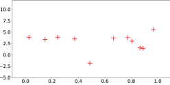

<figcaption>図1(a): データ点の観測。これらに当てはまる関数は無限に存在しうる。</figcaption>
</figure>

### Gaussian Distribution（ガウス分布）

確率変数 $X$ は、その確率密度関数（PDF）が次のとき、平均 $\mu$・分散 $\sigma^{2}$ のガウス（正規）分布に従う。

$$
P_{X}(x)=\frac{1}{\sqrt{2\pi}\sigma}\exp\left(-\frac{(x-\mu)^{2}}{2\sigma^{2}}\right)\ .
$$

ここで $X$ は確率変数、$x$ は実数の引数。この $X$ の正規分布は通常 $P_{X}(x)\sim\mathcal{N}(\mu,\sigma^{2})$ と表す。一変量正規（ガウス）分布の PDF を図 2 にプロットした。一変量正規分布から 1000 点をランダム生成し $X$ 軸に沿ってプロットした。

<figure>

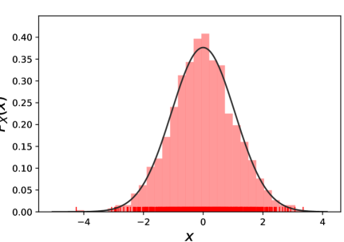

<figcaption>図2: 1000 個の正規分布データ点を X 軸上の赤い縦棒として、その PDF を 2 次元のベル曲線として併せて可視化。</figcaption>
</figure>

これらランダム生成したデータ点はベクトル $x_{1}=[x_{1}^{1},x_{1}^{2},\ldots,x_{1}^{n}]$ と表せる。ベクトル $x_{1}$ を新しい $Y$ 軸の $Y=0$ にプロットすることで、点 $[x_{1}^{1},\ldots,x_{1}^{n}]$ を別の空間（図 3）に射影した。$Y,x$ 座標空間にベクトル $x_{1}$ の点を垂直にプロットしただけである。同様に、別の独立なガウスベクトル $x_{2}=[x_{2}^{1},\ldots,x_{2}^{n}]$ を同じ座標系の $Y=1$ にプロットできる（図 3）。$x_{1}$ も $x_{2}$ も図 2 の一変量正規分布である点に注意。

<figure>

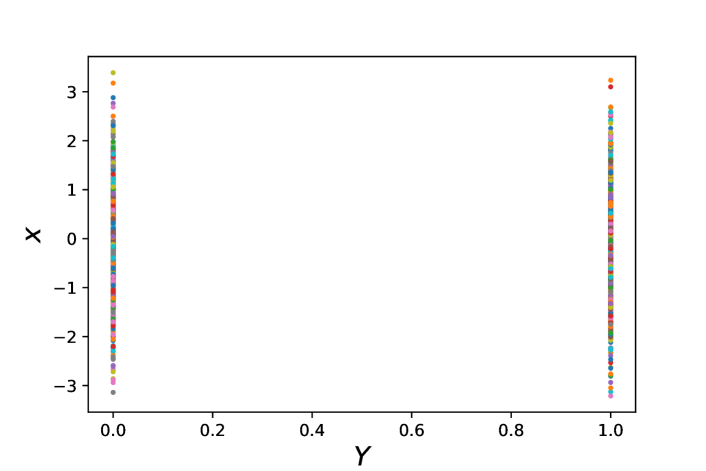

<figcaption>図3: 2 つの独立な一変量ガウスベクトルの点を Y,x 座標空間に垂直にプロット。</figcaption>
</figure>

次に、ベクトル $x_{1}$ と $x_{2}$ からそれぞれ 10 点をランダムに選び、順に線で結ぶ（図 4(a)）。これらの結んだ線は $[0,1]$ 区間に広がる線形関数のように見える。新しいデータ点がこれらの線形線上（または近傍）にあれば回帰予測に使えるが、新しいデータ点が常に線形関数上にあるという仮定はしばしば成り立たない。さらに多くのランダム生成した一変量ガウスベクトル（例: $x_{1},\ldots,x_{20}$）を $[0,1]$ にプロットし、各ベクトルから 10 点を選んで線で結ぶと、$[0,1]$ 内の関数らしい 10 本の線が得られる（図 4(b)）。しかしこれらの線はノイズが多すぎて回帰予測には使えない。これらの関数はより滑らかでなければならない。すなわち、互いに近い入力点は似た出力値を持つべきである。独立なガウスベクトルの点を結んで生成した「関数」は回帰に必要な滑らかさを欠く。したがって、これら独立なガウスを相関させ、多変量正規分布の理論が記述する同時ガウス分布を形成する必要がある。

<figure>

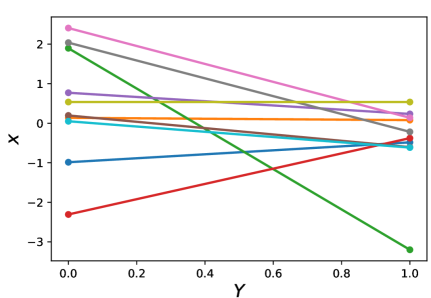

<figcaption>図4(a): 2 つのガウスベクトルから 10 点ずつ選び線で結んだもの。線形関数のように見えるが、回帰にはノイズが多すぎる。</figcaption>
</figure>

### Multivariate Normal Distribution（多変量正規分布）

システムが互いに相関する複数の特徴変数 $(x_{1},x_{2},\ldots,x_{D})$ で記述されることはよくあり、しばしば必要である。これらの変数をまとめて 1 つのガウスモデルとしてモデル化するには、多変量ガウス/正規（MVN）分布モデルを使う。$D$ 次元 MVN の PDF は次で定義される。

$$
\mathcal{N}(x|\mu,\Sigma)=\dfrac{1}{(2\pi)^{D/2}|\Sigma|^{1/2}}\exp\left[-\dfrac{1}{2}(x-\mu)^{\mathsf{T}}\Sigma^{-1}(x-\mu)\right],
$$

ここで $D$ は次元数、$x$ は変数、$\mu=\mathbb{E}[x]\in\mathbb{R}^{D}$ は平均ベクトル、$\Sigma=\text{cov}[x]$ は $D\times D$ 共分散行列。$\Sigma$ は対称行列で、同時にモデル化される全確率変数の対ごとの共分散を格納し、$(i,j)$ 要素は $\Sigma_{ij}=\text{cov}(y_{i},y_{j})$。

二変量正規（BVN）分布は MVN 概念を理解する単純な例を与える。BVN 分布は 3 次元のベル曲線として可視化でき、垂直軸（高さ）が確率密度を表す（図 5(a)）。$x_{1},x_{2}$ 平面上の楕円の等高線（図 5(a), 5(b)）はこの 3 次元曲線の射影である。楕円の形は $x_{1}$ と $x_{2}$ の点の相関の度合いを示す。関数 $P(x_{1},x_{2})$ は $x_{1}$ と $x_{2}$ の同時確率密度を表す。

<figure>

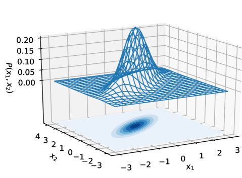

<figcaption>図5(a): 二変量正規分布（BVN）の 3 次元ベル曲線。x₁,x₂ 平面への射影が楕円の等高線で、相関の度合いを示す。</figcaption>
</figure>

BVN では平均ベクトル $\mu$ は 2 次元ベクトル $[\mu_{1},\mu_{2}]^{\mathsf{T}}$ で、$\mu_{1},\mu_{2}$ はそれぞれ $x_{1},x_{2}$ の独立な平均。共分散行列は $\begin{bmatrix}\sigma_{11}&\sigma_{12}\\\sigma_{21}&\sigma_{22}\end{bmatrix}$ で、対角項 $\sigma_{11},\sigma_{22}$ はそれぞれ $x_{1},x_{2}$ の独立な分散、非対角項 $\sigma_{12},\sigma_{21}$ は $x_{1}$ と $x_{2}$ の相関を表す。BVN は次のように表される。

$$
\begin{bmatrix}x_{1}\\ x_{2}\end{bmatrix}\sim\mathcal{N}\left(\begin{bmatrix}\mu_{1}\\ \mu_{2}\end{bmatrix},\begin{bmatrix}\sigma_{11}&\sigma_{12}\\ \sigma_{21}&\sigma_{22}\end{bmatrix}\right)=\mathcal{N}(\mu,\Sigma)\ .
$$

回帰タスクには同時確率でなく条件付き確率が必要なことは直感的に理解できる。BVN の 3 次元ベル曲線をある定数点で切る（図 5(a)）と、$x=x_{2}=\text{定数}$ での条件付き確率分布 $P(x_{1}|x_{2})$ が得られる（図 6）。この条件付き分布もガウスである。

<figure>

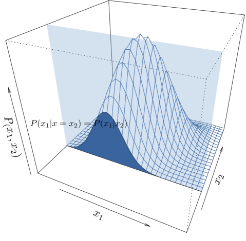

<figcaption>図6: BVN の PDF 3 次元ベル曲線をスライスして得た条件付き確率分布 P(x₁|x₂)。これもガウス分布になる。</figcaption>
</figure>

### Kernels（カーネル）

MVN 分布を導入したので、図 4(b) の関数を回帰のために滑らかにしたい。カーネル（共分散関数）はこの平滑化過程で中心的役割を果たし、モデル化したい関数についての事前知識を内包する。回帰では予測が滑らかで論理的であってほしい。すなわち似た入力は似た出力を生むべき。例えばサイズ・立地・特徴が同等の家 A, B は市場価格も似ると期待する。2 入力間の「類似性」の自然な尺度は内積 $A\cdot B=\lVert A\rVert\lVert B\rVert\cos\theta$（$\theta$ は 2 入力ベクトル間の角度）。角度が小さい（高類似）ほど内積は大きく、逆もしかり。

家を「魔法の」空間に持ち上げ、そこで内積がより強力になり家の類似性をより多く教えてくれる、という状況を想像する。この魔法の空間が「特徴空間（feature space）」。この持ち上げと特徴空間での強化された比較を助ける関数が「カーネル関数」$k(x,x^{\prime})$ である。実際にはデータを高次元特徴空間に移動しない（計算的に高コストになりうる）。代わりにカーネル関数は、移動したのと同じ内積結果を提供してデータの比較を可能にする。これが有名な「カーネルトリック」。形式的に、カーネル関数 $k(x,x^{\prime})$ は入力を明示的に変換せずに高次元特徴空間でのデータ点間の類似性を計算する。変換した入力の内積 $\langle\phi(x),\phi(x^{\prime})\rangle$（$\phi$ は特徴写像）を直接計算する代わりに、カーネル関数は同じ結果を計算効率的に達成する。

二乗指数（SE）カーネル（ガウスまたは Radial Basis Function (RBF) カーネルとも呼ぶ）は、その優れた性質によりガウス過程で広く使われる。様々な関数への適応性で知られ、その事前分布の全関数が滑らかで無限回微分可能で、自然に滑らか・微分可能なモデル予測につながる。SE カーネル関数は次で定義される。

$$
\text{cov}(x_{i},x_{j})=\exp\left(-\frac{(x_{i}-x_{j})^{2}}{2}\right)\ .
$$

図 4(b) では 20 個の独立なガウスベクトルを各 10 点を結んでプロットした。20 個の独立ガウスをプロットする代わりに、恒等共分散関数を持つ 10 個の 20 変量正規（20-VN）分布を生成できる（図 7(a)）。恒等をカーネルに使うため点間に相関がなく図 4(b) と同じになる。一方、RBF カーネルを共分散関数に使うと、図 7(b) の滑らかな線が得られる。

<figure>

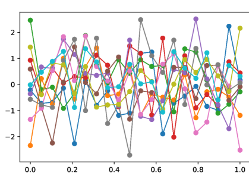

<figcaption>図7(a): 恒等カーネルの 20 変量正規（20-VN）事前分布からの 10 サンプル（相関なし＝図4(b) と同じノイズの多い線）。RBF カーネルを使うと滑らかな線になる。</figcaption>
</figure>

共分散関数を取り込むことでより滑らかな線が得られ、関数らしく見え始める。MVN の次元を増やし続けるのは自然である（ここで次元は MVN の変数の数）。MVN の次元が大きくなると関心領域がより多くの点で埋まる。次元が無限になると、あらゆる入力点を表す点が存在する。無限次元の MVN を使うと無限のパラメータを持つ関数を回帰に当てはめられ、関心領域全体で予測できる。図 8 では、無限パラメータの関数を概念化するため 200 変量正規（200-VN）分布から 200 サンプルを示す。これらの関数を「カーネル化された事前関数」と呼ぶ。まだ観測データ点がないからである。全関数は、観測データ点を持つ前にカーネル関数を事前知識として MVN モデルでランダム生成される。

<figure>

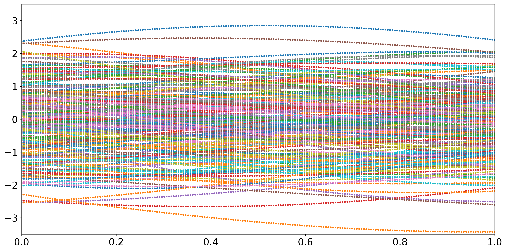

<figcaption>図8: 200 変量正規分布からの 200 個のカーネル化された事前関数（観測データ前の prior）。</figcaption>
</figure>

### Non-parametric Model（ノンパラメトリックモデル）

本節はパラメトリックモデルとノンパラメトリックモデルの区別を説明する。パラメトリックモデルは、データ分布が有限個のパラメータの集合で表せると仮定する。回帰では、いくつかのデータ点が与えられ、新しい特定の $x$ について関数値 $y=f(x)$ を予測したい。線形回帰モデル $y=\theta_{1}+\theta_{2}x$ を仮定すると、関数を定義するパラメータ $\theta_{1},\theta_{2}$ を特定する必要がある。線形モデルでは不十分なことが多く、$y=\theta_{1}+\theta_{2}x+\theta_{3}x^{2}$ のようにより多くのパラメータを持つ多項式モデルが必要になる。$n$ 個の観測点から成る訓練データセット $D=[(x_{i},y_{i})\,|\,i=1,\ldots,n]$ でモデルを訓練し、基底関数 $f(x)$ を通じて $x$ から $y$ への写像を確立する。訓練後、データセットの全情報は特徴パラメータ $\theta$ に内包されると仮定され、予測は訓練データセット $D$ から独立になる。これは $P(f_{*}|X_{*},\theta,D)=P(f_{*}|X_{*},\theta)$ と表せる。したがってパラメトリックモデルで回帰を行うとき、モデルの複雑さ・柔軟性は本質的にパラメータ数で制限される。逆に、モデルのパラメータ数が観測データセットのサイズとともに増えるなら、それはノンパラメトリックモデルである。ノンパラメトリックモデルはパラメータがないという意味ではなく、無限個のパラメータを伴うということである。

## GAUSSIAN PROCESSES（ガウス過程）

ガウス過程に入る前に、これまで扱った基礎概念を簡単に復習する。回帰では、未知の関数 $\mathbf{f}$ からの観測データ点 $D$（訓練データセット）に基づいて関数 $\mathbf{f}$ をモデル化することが目的。伝統的な非線形回帰法はしばしばデータセットに最もよく当てはまると見なされる単一の関数を与える。しかし観測データ点に同程度によく当てはまる関数は複数ありうる。MVN の次元が無限のとき、これら無限個の関数を使って任意の点で予測できることを見た。これらの関数が MVN なのは我々の（事前の）仮定だからである。より形式的には、これら無限個の関数の事前分布が MVN で、データ観測前の入力 $\mathbf{x}$ 上の $\mathbf{f}$ の期待出力を表す。観測を持ち始めると、無限個の関数の代わりに、観測データ点に当てはまる関数だけを保持し、事後分布を形成する。この事後分布は観測データで更新された事前分布である。新しい観測があれば、現在の事後分布を事前分布とし、新しい観測点で新たな事後分布を得る。

ガウス過程の定義: ガウス過程モデルは、点の集合に当てはまる可能な関数に対する確率分布を記述する。可能な全関数に対する確率分布を持つので、関数の最尤推定を表す平均と、予測信頼度の指標となる分散を計算できる。要点: (i) 関数の事前分布は新しい観測で更新される、(ii) ガウス過程モデルは可能な関数に対する確率分布で、関数の任意の有限サンプルは同時ガウス分布に従う、(iii) 可能な関数の事後分布から導いた平均関数が回帰予測に使う関数である。

標準的なガウス過程モデルを探る。全パラメータ定義は Rasmussen (2006) の古典的教科書に揃える。多変量ガウスでモデル化される回帰関数は次で与えられる。

$$
P(\mathbf{f}\,|\,\mathbf{X})=\mathcal{N}(\mathbf{f}\,|\,\boldsymbol{\mu},\mathbf{K})\ ,
$$

ここで $\mathbf{X}=[\mathbf{x}_{1},\ldots,\mathbf{x}_{n}]$ は観測データ点、$\mathbf{f}=[f(\mathbf{x}_{1}),\ldots,f(\mathbf{x}_{n})]$ は関数値、$\boldsymbol{\mu}=[m(\mathbf{x}_{1}),\ldots,m(\mathbf{x}_{n})]$ は平均関数、$K_{ij}=k(\mathbf{x}_{i},\mathbf{x}_{j})$ はカーネル関数（正定値）。観測がないとき、データが平均ゼロに正規化されていると仮定し平均関数を $m(\mathbf{X})=0$ にデフォルトする。ガウス過程モデルは、その形（滑らかさ）が $\mathbf{K}$ で定義される関数上の分布である。点 $\mathbf{x}_{i},\mathbf{x}_{j}$ がカーネルで似ているとされるなら、対応する関数出力 $f(\mathbf{x}_{i}),f(\mathbf{x}_{j})$ も似ると期待される。ガウス過程による回帰過程を図 9 に示す。観測データ（赤点）とそこから推定した平均関数 $\mathbf{f}$（青線）が与えられ、新しい点 $\mathbf{X}_{*}$ で $\mathbf{f}(\mathbf{X}_{*})$ を予測する。

<figure>

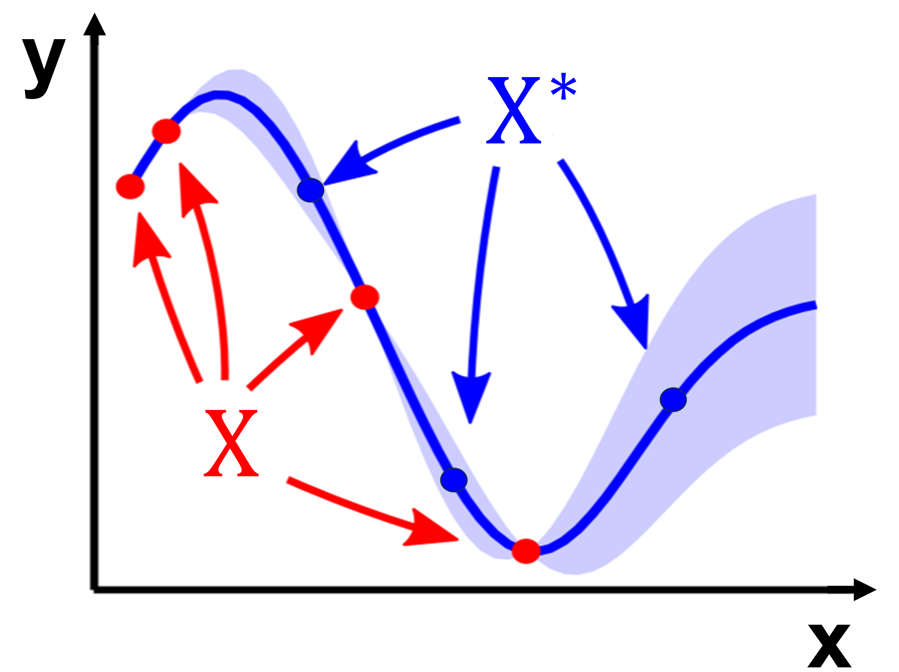

<figcaption>図9: ガウス過程による回帰の例示的過程。赤点は観測データ、青線は観測データから推定した平均関数、予測は新しい青点で行う。</figcaption>
</figure>

$\mathbf{f}$ と $\mathbf{f}_{*}$ の同時分布は次のように表される。

$$
\begin{bmatrix}\mathbf{f}\\ \mathbf{f}_{*}\end{bmatrix}\sim\mathcal{N}\left(\begin{bmatrix}m(\mathbf{X})\\ m(\mathbf{X}_{*})\end{bmatrix},\begin{bmatrix}\mathbf{K}&\mathbf{K}_{*}\\ \mathbf{K}_{*}^{\mathsf{T}}&\mathbf{K}_{**}\end{bmatrix}\right)\ ,
$$

ここで $\mathbf{K}=K(\mathbf{X},\mathbf{X})$, $\mathbf{K}_{*}=K(\mathbf{X},\mathbf{X}_{*})$, $\mathbf{K}_{**}=K(\mathbf{X}_{*},\mathbf{X}_{*})$。平均は $(m(\mathbf{X}),m(\mathbf{X}_{*}))=\mathbf{0}$ と仮定。

この式は $\mathbf{f},\mathbf{f}_{*}$ の同時確率分布 $P(\mathbf{f},\mathbf{f}_{*}|\mathbf{X},\mathbf{X}_{*})$ を記述するが、回帰では $\mathbf{f}_{*}$ のみの条件付き分布 $P(\mathbf{f}_{*}|\mathbf{f},\mathbf{X},\mathbf{X}_{*})$ が必要。同時分布から条件付き分布を導くのは MVN の周辺・条件付き分布の定理で達成される。結果は:

$$
\mathbf{f}_{*}\,|\,\mathbf{f},\mathbf{X},\mathbf{X}_{*}\sim\mathcal{N}\left(\mathbf{K}_{*}^{\mathsf{T}}\,\mathbf{K}^{-1}\,\mathbf{f},\>\mathbf{K}_{**}-\mathbf{K}_{*}^{\mathsf{T}}\,\mathbf{K}^{-1}\,\mathbf{K}_{*}\right)\ .
$$

現実のシナリオでは通常、真の関数値のノイズ付き版 $y=f(x)+\epsilon$ にのみアクセスできる（$\epsilon$ は分散 $\sigma_{n}^{2}$ の加法的 i.i.d. ガウスノイズ）。これらノイズ付き観測の事前分布は $\text{cov}(y)=\mathbf{K}+\sigma_{n}^{2}\mathbf{I}$ になる。観測値と新しいテスト点での関数値の同時分布は:

$$
\begin{pmatrix}\mathbf{y}\\ \mathbf{f}_{*}\end{pmatrix}\sim\mathcal{N}\left(\mathbf{0},\begin{bmatrix}\mathbf{K}+\sigma_{n}^{2}\mathbf{I}&\mathbf{K}_{*}\\ \mathbf{K}_{*}^{\mathsf{T}}&\mathbf{K}_{**}\end{bmatrix}\right)\ .
$$

条件付き分布を導くことで、ガウス過程回帰の予測式が得られる。

$$
\mathbf{\bar{f}_{*}}\,|\,\mathbf{X},\mathbf{y},\mathbf{X}_{*}\sim\mathcal{N}\left(\mathbf{\bar{f}_{*}},\text{cov}(\mathbf{f}_{*})\right)\ ,
$$

ここで

$$
\mathbf{\bar{f}_{*}}=\mathbb{E}[\mathbf{\bar{f}_{*}}\,|\,\mathbf{X},\mathbf{y},\mathbf{X}_{*}]=\mathbf{K}_{*}^{\mathsf{T}}[\mathbf{K}+\sigma_{n}^{2}\mathbf{I}]^{-1}\mathbf{y}\ ,\qquad \text{cov}(\mathbf{f}_{*})=\mathbf{K}_{**}-\mathbf{K}_{*}^{\mathsf{T}}[\mathbf{K}+\sigma_{n}^{2}\mathbf{I}]^{-1}\mathbf{K}_{*}\ .
$$

この式で、分散関数 $\text{cov}(\mathbf{f}_{*})$ は、予測の不確実性が入力値 $\mathbf{X},\mathbf{X}_{*}$ のみに依存し観測出力 $\mathbf{y}$ には依存しないことを示す。これはガウス分布の際立った性質である。

## ILLUSTRATIVE EXAMPLE（例示）

本節は Rasmussen (2006) のアルゴリズムに従い標準 GPR の実装を示す。

$$
\begin{split}L&=\text{cholesky}(\mathbf{K}+\sigma^{2}_{n}\mathbf{I})\\ \boldsymbol{\alpha}&=L^{\top}\setminus(L\setminus\mathbf{y})\\ \mathbf{\bar{f}_{*}}&=\mathbf{K}_{*}^{\top}\boldsymbol{\alpha}\\ \mathbf{v}&=L\setminus\mathbf{K}_{*}\\ \mathbb{V}[\mathbf{\bar{f}_{*}}]&=K(\mathbf{X}_{*},\mathbf{X}_{*})-\mathbf{v}^{\top}\mathbf{v}\\ \log p(\mathbf{y}\mid\mathbf{X})&=-\tfrac{1}{2}\mathbf{y}^{\top}(\mathbf{K}+\sigma_{n}^{2}\mathbf{I})^{-1}\mathbf{y}-\tfrac{1}{2}\log\det(\mathbf{K}+\sigma_{n}^{2}\mathbf{I})-\tfrac{n}{2}\log 2\pi\end{split}
$$

このアルゴリズムの入力は $\mathbf{X}$（入力）, $\mathbf{y}$（ターゲット）, $K$（共分散関数）, $\sigma^{2}_{n}$（ノイズレベル）, $\mathbf{X_{*}}$（テスト入力）。出力は $\mathbf{\bar{f}_{*}}$（平均）, $\mathbb{V}[\mathbf{\bar{f}_{*}}]$（分散）, $\log p(\mathbf{y}\mid\mathbf{X})$（対数周辺尤度）。

例の結果を図 10 に示す。$[-5,5]$ 区間で回帰を行った。観測データ点（訓練データセット）は $-5$ から $5$ の一様分布から生成。関数は $-5$ から $5$ の等間隔点で評価。回帰関数は GPR モデルで推定した平均値から成る。20 個の事後平均関数のサンプルと 3 倍の分散も併せてプロットした。

<figure>

<figcaption>図10: 標準 GPR の例示。黒い十字は青い点線（真の関数）から生成した観測データ点。これらが与えられると無限の事後関数が得られ、20 サンプルを異なる色でプロット。平均関数（赤実線）が回帰に使う関数で、青い陰影は予測分散の 3 倍。</figcaption>
</figure>

### Hyperparameters Optimization（ハイパーパラメータ最適化）

GPR の基礎と簡単な例を扱った。しかし実用的な GPR モデルはしばしばより複雑である。カーネル関数の選択はモデルの汎化能力に大きく影響するため決定的。カーネル関数は確立された RBF から、滑らかさ・疎性・急変・微分可能性などのモデル要件に応じた独自設計まで幅がある。特定の GPR タスクに適切なカーネルを選ぶ方法は Duvenaud (2014) に詳しい。加えて、ハイパーパラメータ最適化はカーネルベース手法で本質的な役割を果たす。例として広く使われる RBF カーネル:

$$
k(\mathbf{x}_{i},\mathbf{x}_{j})=\sigma_{f}^{2}\exp\Big(-\frac{1}{2l}(\mathbf{x}_{i}-\mathbf{x}_{j})^{\mathsf{T}}(\mathbf{x}_{i}-\mathbf{x}_{j})\Big)\ ,
$$

このカーネルで $\sigma_{f}$（垂直スケール）と $l$（水平スケール）はハイパーパラメータ。$\sigma_{f}$ は関数の垂直方向の広がりを決め、$l$ は距離の増加に伴い 2 点間の相関が減る速さを示す。$l$ が関数の滑らかさに与える影響を図 11 に示す。$l$ を大きくすると関数は滑らかになり、$l$ が小さいと変動（wiggle）の多い関数になる。

<figure>

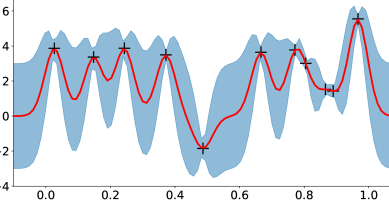

<figcaption>図11(a): l が小さい場合。RBF カーネルの長さスケール l が関数の滑らかさに与える影響（小さい l ほど変動が多い）。</figcaption>
</figure>

最適なハイパーパラメータ $\boldsymbol{\Theta^{*}}$ は対数周辺尤度を最大化して決める。

$$
\boldsymbol{\Theta^{*}}=\arg\max_{\Theta}\log p(\mathbf{y}\,|\,\mathbf{X},\boldsymbol{\Theta})\ .
$$

したがってハイパーパラメータを考慮した、新しいテスト点でのより一般化された予測式は:

$$
\mathbf{\bar{f}_{*}}\,|\,\mathbf{X},\mathbf{y},\mathbf{X}_{*},\boldsymbol{\Theta}\sim\mathcal{N}\left(\mathbf{\bar{f}_{*}},\text{cov}(\mathbf{f}_{*})\right)\ .
$$

ハイパーパラメータを学習/最適化した後、予測分散 $\text{cov}(\mathbf{f}_{*})$ は入力 $\mathbf{X},\mathbf{X}_{*}$ だけでなく出力 $\mathbf{y}$ にも依存する点に注意。最適化したハイパーパラメータ $\sigma_{f}=0.0067$, $l=0.0967$ で、図 11 の観測データ点の回帰結果を図 12 に示す。ハイパーパラメータ最適化は次節で紹介する GPy パッケージで行った。

<figure>

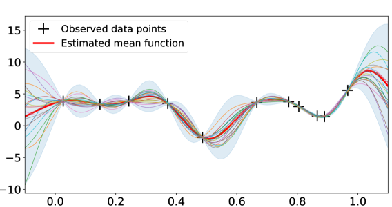

<figcaption>図12: 最適化したハイパーパラメータ σ_f と l による回帰結果。</figcaption>
</figure>

### Gaussian Processes Packages（ガウス過程パッケージ）

本節はガウス過程を実装する 3 つの Python パッケージをレビューする。GPy は 2012 年から開発される成熟しよく文書化されたパッケージで、計算に NumPy を使い、計算集約的でないタスクに十分な安定性を提供する。ただし GPR は高次元空間（数十を超える）で計算的に高コスト。複雑で計算集約的なタスクには、先進的アルゴリズムと GPU アクセラレーションを組み込んだパッケージが特に好ましい。GPflow は GPy 由来で似たインタフェースを持ち、計算バックエンドに TensorFlow を活用する。GPyTorch はより新しいパッケージで PyTorch を通じて GPU アクセラレーションを提供する。GPflow 同様、GPyTorch は自動勾配をサポートし、GP 枠組みに深層ニューラルネットを埋め込むような複雑なモデルの開発を簡単にする。

## CONCLUSION（結論）

ガウス過程は、点の集合に当てはまる可能な関数に対する確率分布である。ガウス過程回帰モデルは予測値とともに不確実性推定を提供する。モデルはカーネル関数を通じて関数の性質についての事前知識を組み込む。

本チュートリアルで論じた GPR モデルはガウス過程への標準的（vanilla）アプローチである。2 つの主要な限界がある。1) 計算量が $O(N^{3})$（$N$ は共分散行列 $\mathbf{K}$ の次元）。2) メモリ消費がデータサイズに対して二次的に増える。これらの制約のため、標準 GPR モデルは大規模データセットでは非現実的になる。そのような場合は計算量を緩和するスパースガウス過程が用いられる。
