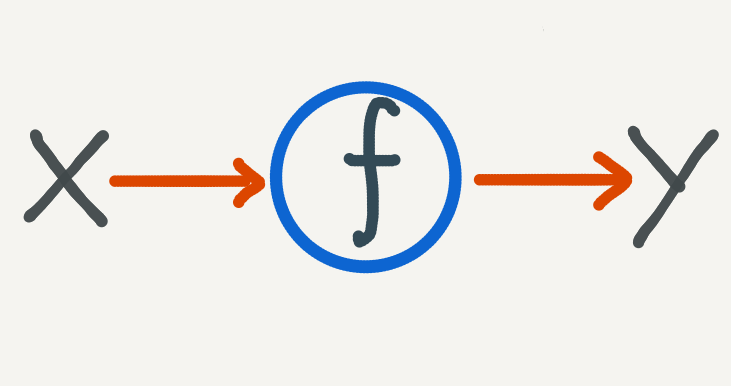
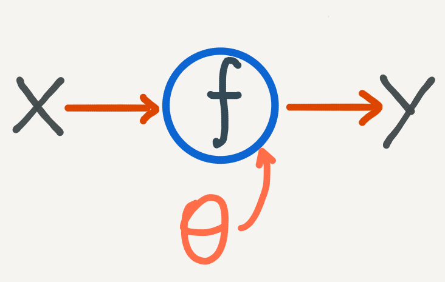
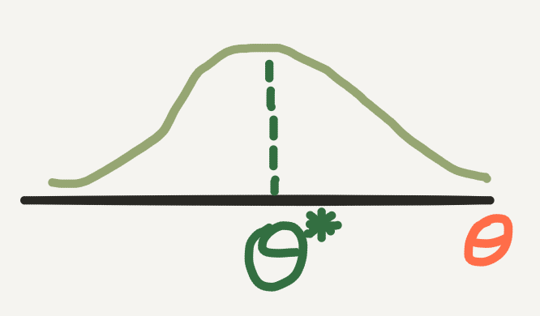
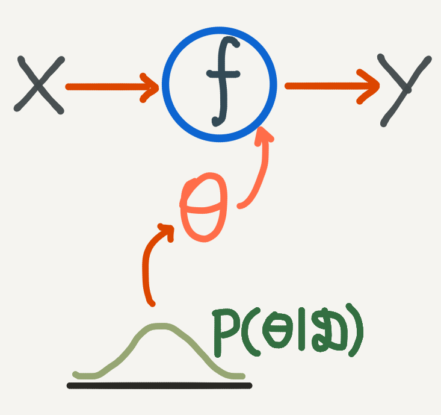
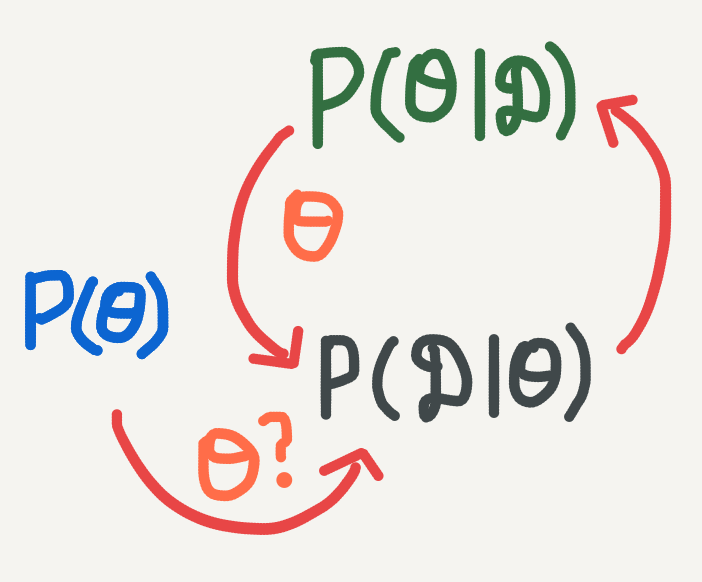
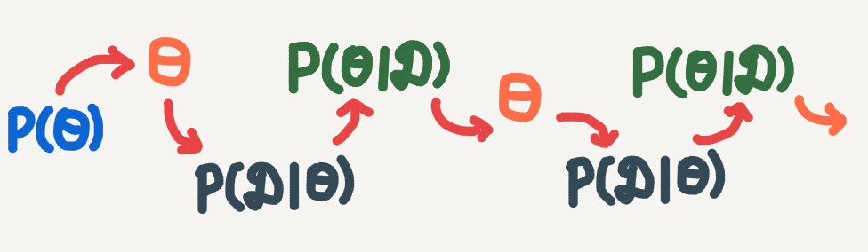

# ベイズ推論を理解する

> 原題: Understanding Bayesian Inference
> 著者: Jonty Sinai
> 出典: 個人ブログ（jontysinai.github.io, 2020-04-19）, https://jontysinai.github.io/jekyll/update/2020/04/19/understanding-bayesian-inference.html

*「ベイズ推論」と言うとき、私たちは何を意味しているのでしょうか？ より具体的には、ベイズ推論は私の機械学習やデータモデリングの問題にとって何を意味するのでしょうか？ このブログ記事では、ベイズ推論を紹介し、それがどのように機械学習のパラダイムであるかを説明します。さらに重要なことに、理論的枠組みとしてのベイズ推論と、機械学習のアプローチとしてのベイズ推論との間のギャップを、直感的に橋渡しすることを試みます。*

## 現実世界: データとモデリング

そもそも私たちが解こうとしている問題から始めましょう。私たちは何らかの取得済みデータを持っていて、将来の事例を予測したいと考えています。[ニューラル ODE についての私の記事](https://jontysinai.github.io/jekyll/update/2019/01/18/understanding-neural-odes.html)と同じ出発点を使って、この設定を次のように形式化できます:

1. $x, y$ の $N$ 個の観測値を持っている: $\mathcal{D} = \{(x_1, y_1), (x_2, y_2), \ldots, (x_N, y_N)\}$。$\mathcal{X}$ は入力領域、$\mathcal{Y}$ は出力領域。
2. 新しい入力 $x^{*}$ が与えられたとき、未知の出力 $y^{*}$ を予測したい。
3. 入力領域と出力領域を写像する何らかの関数が存在すると仮定する: $f: \mathcal{X} \to \mathcal{Y}$。

<figure>

<figcaption>図: 入力 X から出力 Y への写像。問題を「𝒳 から 𝒴 への関数 f を見つけること」としてモデル化する。</figcaption>
</figure>

> 私たちは、この問題を「$\mathcal{X}$ から $\mathcal{Y}$ への関数写像を見つけようとすること」としてモデル化します。

機械学習のアプローチは、柔軟な関数のクラス——典型的には*ニューラルネットワーク*——を選ぶことです。これらはパラメータ $\theta$ によって記述されます。私たちは確率的勾配降下法（stochastic gradient descent）のような*学習アルゴリズム*を使って、関数 $f$ がデータによく適合するようにパラメータ $\theta$ を最適化します。「よく適合する」とは何を意味するかは、学習手続きの中で最小化される*コスト*関数によって成文化されます。伝統的に、このコスト関数はデータがモデルにどの程度よく適合するかを測ります。もし適合していなければ、モデルのパラメータを調整して、コストが十分に低くなるまで再び測定します。

<figure>

<figcaption>図: パラメータ θ を持つ関数 f による X→Y の写像。f はパラメータ θ で記述される。</figcaption>
</figure>

私たちはその後、最適なパラメータ $\theta^{*}$ を使って新しい予測を行います。このアプローチの一つの欠点は、いったん最適な $\theta^{*}$ を見つけてしまうと、予測の過程が完全に決定論的（deterministic）になることです。これは、予測に不確実性が必要な場合には問題になります:

- 患者 $x$ が転帰 $y$ を持つと、私たちはどれだけ確信できるか？
- 画像 $x$ が $y$ に分類できると、私たちはどれだけ確信できるか？
- 測定値 $x$ が信号 $y$ を生むと、私たちはどれだけ確信できるか？

一般に、データの分散が大きい場合には不確実性が望ましいです。学習アルゴリズムは、これまでに見たほとんどのデータ点に対してうまく機能する $\theta^{*}$ を見つけます。$x$ が外れ値（outlier）であるとき——ほとんどのデータ点とは似ていないとき——、$\theta^{*}$ はどれだけ信頼できるでしょうか？

サンプル数が多くないときにも、不確実性は望ましいです。この場合、各サンプル間の分散が大きければ、$\theta$ の特定の一つの値を支持するのに十分な証拠がないかもしれません。代わりに私たちは、パラメータ $\theta$ そのものの値に対する不確実性を考慮しながら予測を行う方法が欲しいのです。

> これこそが、私たちがベイズ推論で達成しようとすることです。

## 古くからのお気に入り: ベイズの定理

その名が示すように、ベイズ推論はベイズの定理（Bayes' Theorem）と深く関係しています。実際、ベイズの定理は、私たちのデータの不確実性と予測の不確実性との間の橋渡しを形成します。あなたはすでにベイズの定理に馴染みがあるかもしれませんが（私の[条件付き確率](https://jontysinai.github.io/jekyll/update/2018/12/23/probability-part-two-conditional-probability.html)についての記事でも扱いました）、復習として、ここで私たちがベイズの定理と呼ぶものを述べます:

> *$A$ と $B$ を確率測度 $\mathbb{P}$ を持つ確率変数とし、$\mathbb{P}(A) \neq 0$ とする。このとき*
> $$
> \mathbb{P}(B|A) = \frac{\mathbb{P}(A|B)\,\mathbb{P}(B)}{\mathbb{P}(A)}.
> $$

> - $\mathbb{P}(B)$ は $B$ の**事前確率（prior probability）**として知られる——これは、$A$ の影響を考慮する前に $B$ について私たちが知っている（仮定している）ことである。
> - $\mathbb{P}(A)$ は $A$ の**証拠（evidence）**として知られる——これは $A$ について私たちが知っているすべてである。
> - $\mathbb{P}(A|B)$ は $B$ が与えられたときの $A$ の**尤度（likelihood）**として知られる——これは、$B$ のあり得る値が与えられたとき、私たちが観測した $A$ がどれだけ尤もらしいかの推定である。
> - $\mathbb{P}(B|A)$ は $A$ が与えられたときの $B$ の**事後確率（posterior probability）**として知られる——これは、$A$ の証拠を得た*後の* $B$ の*条件付き確率*である。

ベイズの定理は、$B$ の事後確率を直接計算するのが難しいときに有用です。私たちは、$A$ についてのデータを得ていて、尤度と事前確率をより容易に測れるときに、ベイズの定理を使います。

\* 確率変数と確率測度についてのより詳しい説明は、私の[確率についての入門記事](https://jontysinai.github.io/jekyll/update/2017/11/23/probability-for-everyone.html)を参照してください。

## ベイズの定理が現実世界と出会う

基本的なモデリング問題に戻りましょう。私たちは $\theta$ によって記述されるパラメトリックな関数を持っていて、その関数がデータをよく記述するように適切な $\theta$ を選びたいと考えています。また、自信を持って予測を行い、いつこの不確実性が高いのかを知るために、$\theta$ に対する不確実性も計算したいのです。

> しかし、$f$ と $\theta$ のモデリングに不確実性を含めるとは、どういう意味でしょうか？

これはまさに、確率——不確実性の数学的言語——を使うことを意味し、特に*確率分布*を使うことを意味します。$\theta$ の単一の値を最適化する代わりに、*私たちは $\theta$ を、最適値で**最高の確率**を持つ**確率変数**として扱える*のです。

> しかし、$\theta$ に対する確率分布が最適値で最高の確率を持つことを、どうやって保証するのでしょうか？

私たちはこれをベイズの定理を使って行います。特に、この分布がどのようなものかについての最良の推測から始めて、それを私たちの**事前分布（prior distribution）**と呼びます。

$$
P(\theta).
$$

> 何が良い事前分布なのか、どうやって分かるのでしょうか？

これは難しい問いですが、[理論的には](https://en.wikipedia.org/wiki/Bernstein%E2%80%93von_Mises_theorem)、十分なデータを得られるなら、事前分布の選択は問題になりません。実際には、事前分布の選択は事後分布に影響を与え、$\theta$ についての私たちの仮定を符号化する（そして検証する！）のに役立ちます。例えば、$\theta$ が離散なら離散確率分布を使い、$\theta$ が非負でなければならないなら正の分布を使う、といった具合です。

ベイズ推論で重要なのは、どんな事前分布を選んだとしても、私たちが得る追加のデータが事前分布の形を変え、目標とする事後分布を形作るということです。ベイズの定理に戻ると、私たちは**尤度**を使ってデータ $\mathcal{D}$ を式に取り込めます。

$$
P(\mathcal{D} | \theta).
$$

私たちが $\theta$ の最適性を事後分布に符号化するのは、この尤度を通じてです。事後分布は、$\theta$ がデータにどの程度よく適合するかによって定義されます。厳密に言えば、尤度は $\theta$ の関数です——データは観測済みで固定されていると仮定します。この観点では、尤度は*$\theta$ のあり得る値が与えられたときに、観測されたデータが生じる尤もらしさ*と解釈できます。より高い尤度は、より良い $\theta$ の値を示します。

> - 実際、多くの機械学習の損失関数は尤度から導かれ、通常は負の対数尤度（negative log-likelihood）の形をとります（尤度に対数変換を施すことは、特に大きなデータセットにおいて、数値的安定性のために役立ちます）。
> - 尤度関数は厳密に確率分布である必要はありません。

これで私たちは、ベイズの定理を使って $\theta$ の**事後分布（posterior distribution）**の式を書き下せます:

$$
P(\theta | \mathcal{D}) = \frac{P(\mathcal{D} | \theta)\,P(\theta)}{P(\mathcal{D})}.
$$

事後分布は、$\theta$ に対する私たちの不確実性（事前分布に取り込まれている）を、実際に観測したデータ（尤度、そしてデータの証拠に取り込まれている）によって調整したものを考慮に入れています。尤度と事前分布の組み合わせによって、事後分布は、不確実性の尺度を加えた上で $\theta$ の最適値を推定するのに適したものになります。

> この事後分布は、私たちをどう助けてくれるのでしょうか？

最適な $\theta$ の単一の推定値を計算する代わりに、私たちは $\theta$ に対する（事後）分布を探します。この分布から、$\theta$ の標本平均を計算し、信用区間（credible interval）——例えば分布の中央 95%——にわたって私たちの確信度を報告できます。

<figure>

<figcaption>図: θ に対する事後分布。最適値 θ* のあたりにピークを持つ分布で、点推定 θ* の代わりに分布全体（と不確実性）を得る。</figcaption>
</figure>

元の関数推定問題に戻ると、これは、$y$ の予測を計算するとき、まず事後分布から $\theta$ を推定し、予測が $\theta$ に条件づけられるようにすることを意味します:

<figure>

<figcaption>図: 事後分布 P(θ|𝒟) から θ をサンプルし、その θ で条件づけて X→Y の予測を行う。予測がパラメータの不確実性を反映する。</figcaption>
</figure>

しかし、この事後分布を計算することは、大文字の*H*で書く **Hard（困難）** になり得ることが分かります。二つの理由があります:

1. 尤度関数はしばしば高度に非線形で、訓練データセットのあらゆるサンプルを含まなければなりません。加えて、尤度の複雑さはデータの次元とともに増加します。
2. 証拠 $P(\mathcal{D})$ は計算が極めて困難になり得ます。それは、データが取り得るあらゆる値にどれだけの確率を割り当てるかを知ることを要求します。不確実な世界では、これは実質的に不可能です。

ここでのアルゴリズム的な洞察は、**近似推論（approximate inference）**と呼ばれるものを使うことです。事後分布を直接計算する代わりに、私たちはそれを近似しようとします。

\* **注:** 以前は個々の確率について*確率測度*を表すために黒板太字の $\mathbb{P}$ を使いましたが、ここでは**確率分布関数**を表すために普通の $P$ を使っています。これらは概念的には微妙に異なるもので、記法の変更はそれを表現する杓子定規なやり方です。要するに、*確率分布関数*とは、確率変数のすべての確率をその定義域にわたって記述する関数です。

## 近似推論

大まかに言えば、近似推論アルゴリズムには3つの主要な種類があり、最初の二つが最も人気があります。簡潔に述べると、それらは:

- **モンテカルロサンプリング（Monte Carlo Sampling）:** これは、サンプルを計算することによって目標分布を近似する広いクラスのアルゴリズムです。ベイズ推論では、**マルコフ連鎖モンテカルロ（Markov Chain Monte Carlo, MCMC）**として知られる特別な種類のモンテカルロサンプリングアルゴリズムを使います。これは、直前のサンプルと近似しようとしている目標分布の情報だけを使って、反復的にサンプルを計算します:
	$$
	\theta_{t} \leftarrow \theta_{t-1}, \ \theta_{t} \sim P(\theta | \mathcal{D}).
	$$
	モンテカルロアルゴリズムでは、分布を明示的に計算しようとはせず、むしろ $\theta$ の候補サンプルを、最終的にほとんどのサンプルが $\theta$ の最適値に近くなるまで計算しようとします。
- **変分推論（Variational Inference）$^{*}$:** ここでは、事後分布そのものを近似しようとします。私たちは、機械学習を使って関数を近似するのとほぼ同じやり方でこれを行います: $\phi$ でパラメータ化された柔軟な関数 $q$ を選び、$\phi$ を最適化して
	$$
	q(\theta) \approx P(\theta | \mathcal{D})
	$$
	となるようにします。
- **期待値伝播（Expectation Propagation）:** ここでも事後分布を扱いやすい関数 $q$ で近似しますが、ただしこの関数を、互いに条件づけられた分布の積に因数分解できるように特別に選びます。そして*メッセージパッシングアルゴリズム*を使って、$q$ が事後分布によく適合するまで、その因子を反復的に更新します。

これらのアルゴリズムのそれぞれについてこれ以上詳しくは立ち入りませんが——それらはそれ自体が丸ごとブログ記事（あるいはそれ以上！）になります——、この記事の残りでは近似推論の基本的な原理を解きほぐすことを試みます。

$^{*}$ 変分推論という名前は、パラメータを変化させることで関数を見つける微積分である*変分法（variational calculus）*に由来します。関数 $q$ は*ガイド（guide）*として知られることもあります。

#### 鶏と卵の問題

あなたは、近似推論に鶏と卵の問題があることに気づいたかもしれません。私たちはサンプルを引くことで事後分布を近似したいのですが、事後分布を直接計算できないのに、どうやって事後分布からサンプルを引けるのでしょうか？ あるいは、何らかのパラメータ化されたガイド分布で事後分布を近似したいのですが、事後分布を直接評価せずに、それが事後分布によく一致しているとどうやって分かるのでしょうか？

私たちは次のようにしてこれを回避します:

1. ベイズの定理の分母は*正規化定数（normalization constant）*です。この定数（実際には定数関数）を無視すれば、事後分布は尤度と事前分布（どちらも私たちにとって計算可能）の積に*比例*します。これを次のように書きます:
	$$
	P(\theta | \mathcal{D}) \propto P(\mathcal{D} | \theta)\,P(\theta).
	$$
2. さらに近似推論では、私たちは $\theta$ そのものの確率よりも、事後分布の*argmax*——どの $\theta$ が最大の確率を持つか？——により関心があります。したがって、$g$ を目的関数、$C$ を定数とすると、次の最適化の性質を利用できます:
	$$
	\mathrm{argmax}\{g\} = \mathrm{argmax}\left\{\tfrac{1}{C} g\right\}.
	$$
	> 特に MCMC の場合、私たちは $\theta$ のサンプルを更新するのに $P(\mathcal{D})$ を知る必要が明示的にないアルゴリズムを使い、最大の確率を持つ $\theta$ をサンプリングし始めるまでそれを続けます。
3. いったん正規化定数を除いた事後分布を得たら、それを確率分布にするために単純に正規化すればよいのです。

## グラフを解きほぐす

ベイズ推論の循環的な性質を、次のようにグラフで表現できます:

<figure>

<figcaption>図: ベイズ推論の循環的な性質。事前 P(θ) → θ をサンプル → 尤度 P(𝒟|θ) → 事後 P(θ|𝒟) → よりよい θ をサンプル → さらに尤度を検証…という循環。</figcaption>
</figure>

> - $\theta$ の事前分布から始める。これを使って $\theta$ をサンプリングできる。
> - データが与えられたとき、$\theta$ の尤度は何か？
> - $\theta$ の事後確率を得る。これを使って $\theta$ のよりよい推定値をサンプリングできる。
> - しかし私たちは、この $\theta$ の尤度をまだ検証できる……

これで、私たちがベイズ推論で何をしようとしているのかが少しよく見えてきます。事前分布と尤度から始め（グラフを前向きに進み）、それから後ろ向きに進んで適切な事後分布を計算します。この事後分布を厳密に計算できないとき（最も単純なモデルでのみ実行可能）、私たちは近似推論に頼ります。近似推論は、事後分布を反復的に更新し（前向き）、それから $\theta$ のサンプルが良いかどうかを確認する（後ろ向き）ことで機能します。一般に、近似推論アルゴリズムは次のように機能します:

*事前分布と尤度関数が与えられたとき:*

1. $\theta$ の初期の開始点を選ぶ。
2. 尤度関数と事前分布を使って、$\theta$ の現在の値から事後分布（または事後分布のサンプル）を推定する。
3. これまでの適合の良し悪しに基づいて、事後分布を適切に更新する。
4. 現在の事後分布から新しい $\theta$ の値をサンプリングする。
5. 事後分布の適切な適合が得られるまで、ステップ 2〜4 を繰り返す。

> **注:** 変分推論では、代わりにパラメータ $\phi$ を更新して事後分布の良い関数的近似を得て、その近似から $\theta$ をサンプリングします。

グラフに戻ると、私たちは本質的に、事後分布の推定と $\theta$ のサンプリングとの間の循環的な関係を、アルゴリズムの反復の連続的な列へと展開しているのです:

<figure>

<figcaption>図: 近似推論のグラフ。循環を展開した形。θ の初期値から始め、事後を更新→新しい θ の推定値をサンプル、を逐次的に繰り返す。</figcaption>
</figure>

> $\theta$ の初期値から始める。事後分布を逐次的に更新し、それから $\theta$ の新しい推定値をサンプリングする。

ステップ 2〜4 の正確な詳細と、いつアルゴリズムを終了すると判断するかは、使用するアルゴリズムの選択に依存します。これらのアルゴリズムはこの近似推論の入門の範囲を超えていますが、将来の記事で扱うつもりです。

## まとめ直す

これまで見てきたのは、機械学習問題のモデリングパラメータに対する不確実性を表現したいとき、私たちはベイズの定理を使えるということです。具体的には:

1. データセット $\mathcal{D} = \{(x_1, y_1), (x_2, y_2), \ldots, (x_N, y_N)\}$ を持ち、
2. パラメータ $\theta$ を持つモデル $f: \mathcal{X} \to \mathcal{Y}$ を持つとき、
3. 私たちはベイズの定理を使って、*事前分布*と*尤度関数*を指定することで、モデリングパラメータ $\theta$ に対する**事後分布**を次のように記述できます:
	$$
	P(\theta | \mathcal{D}) \propto P(\mathcal{D} | \theta)\,P(\theta).
	$$

いったんこの事後分布を得れば、いわゆる*予測分布（predictive distribution）*——$x^{*}$ *および* **パラメータ $\theta$ に対する私たちの不確実性**が与えられたときの $y^{*}$ に対する確率分布——を使って、新しい点 $x^{*}$ で予測 $y^{*}$ を行えます:

$$
P(y^{*} | x^{*}; \mathcal{D}) = \int_{\theta} P(y^{*} | x^{*}, \theta)\,P(\theta | \mathcal{D})\,d\theta.
$$

実際には、私たちは $P(y^{*} | x^{*}, \theta)$ を関数 $f$ で近似し、事後分布を使ってサンプル $\{\theta_1, \theta_2, \ldots, \theta_M\}$ を計算できます。そして、*モンテカルロ*推定を使って $y^{*}$ の*標本平均*を計算できます:

$$
y^{*} \approx \widehat{y} = \frac{1}{M}\sum_{s=1}^{M} f(x^{*}; \theta_s).
$$

予測の不確実性を測るために、*標本分散*を計算できます:

$$
\mathrm{Var}(y^{*}) \approx \frac{1}{M}\sum_{s=1}^{M}\big(f(x^{*}; \theta_s) - \widehat{y}\big)^{2}.
$$

### ベイズ推論はモデリングパラダイムである

伝統的な機械学習では、私たちはモデルを指定し、データに最もよく適合するモデルのパラメータを見つけようとします。私たちが使うコスト関数——典型的には*尤度*——は、*パラメータがデータにどれだけよく適合するか*の尺度を与えてくれます。

ベイズ推論は代わりに、データが与えられたときの*最も確率の高い*パラメータを見つけようとします。*最も確率が高い*ものを求めることによって、私たちはモデルに予測的不確実性を吹き込みます。ベイズ推論では、私たちはパラメータに対する*事後分布*をモデル化します。

### ベイズ推論は最適化パラダイムである

伝統的な機械学習のアプローチでは、私たちは最適パラメータ $\theta^{*}$ の単一の点推定しか見つけられません。これは*最尤推定（maximum likelihood estimate, MLE）*として知られ、次のように解釈できます: *もし真であれば、このモデルの下で私たちが持っているデータを観測する可能性が高いだろう*。

ベイズ推論のアプローチでは、私たちは尤度を使って事前分布を事後分布へと作り替え、*最適な $\theta$ に最高の確率*を置くようにします。この $\theta$ は*最大事後確率推定（maximum a posteriori estimate, MAP）*として知られることがあり、*不確実性を考慮した上で、データに最もよく適合するパラメータ*と解釈できます。

> 上記の予測分布を使うとき、私たちは $\theta$ について MAP 推定を明示的に使っているのではなく、むしろ $\theta$ の多くのサンプルを取っていることに注意してください。もちろん、$\theta$ に対する私たちの不確実性がそれほど大きくなければ、ほとんどの $\theta$ サンプルは MAP 推定に近くなります。

アルゴリズム的なアプローチでは、私たちの目的はデータに基づいて $\theta$ を最適化することです。ただし今や、私たちは事後分布にしたがって $\theta$ を最適化できます。

### ベイズ推論は機械学習パラダイムである

現代の機械学習において、ベイズ推論は、正確なアルゴリズムへの欲求を不確実性の尺度とともに解決できる枠組みを私たちに与えてくれます。近似推論を使うことで、私たちはベイズ推論を、大規模なデータセットや、ニューラルネットワークのような高次元パラメータを持つモデルへとスケールさせられます。

実のところ、この記事全体は、ベイズの定理を使って機械学習をどう捉え直せるかについてのものであり、結局のところ、それこそがベイズ推論なのです。

## ボーナス: 情報理論を少しだけ

ある意味で、私たちはベイズ推論（そして一般に機械学習）を圧縮（compression）の演習として考えられます。私たちは、自分の問題について世界中のすべてのデータにアクセスできるわけではありません。代わりに、手元にあるデータを使って、$\mathcal{X}$ と $\mathcal{Y}$ の間の関係を記述できることを願う関数のパラメータ $\theta$ を最適化します。一般に $\theta$ の次元はデータよりもずっと低いので、実のところ私たちは、データセットのすべての情報をパラメータ $\theta$ へと*圧縮*しているのです。

<figure>

<figcaption>図: データ 𝒟 をパラメータ θ へ圧縮（符号化）し、θ から 𝒟 を復元する、という圧縮の見立て。</figcaption>
</figure>

ベイズ推論の前向きの方向に進むとき、私たちはデータを最も*尤もらしく*記述する $\theta$ を見つけています。言い換えれば、*尤度*はデータを $\theta$ へと**符号化（encode）**するのを助けてくれます。後ろ向きの方向（事後推論）に進むとき、私たちは不確実性を考慮するために $\theta$ の多くの値をサンプリングします。私たちの事後分布が良ければ、ほとんどの場合 $\theta$ の最適値をサンプリングするので、元のデータセットを復元できるはずです。言い換えれば、事後分布は入力を目標値へと**復号（decode）**するのを助けてくれます。

<figure>

<figcaption>図: 事後分布 P(θ|𝒟) を介した符号化／復号。データ 𝒟 を θ へ符号化し、事後を使って 𝒟 を復号する。</figcaption>
</figure>
