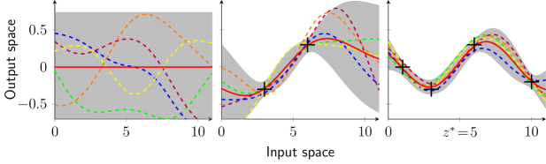
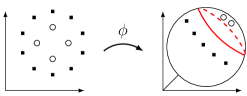

# ガウス過程モデル入門

> 原題: An Introduction to Gaussian Process Models
> 著者: Thomas Beckers（Chair of Information-oriented Control, Technical University of Munich）
> 出典: arXiv:2102.05497（原版 2020年4月／現改訂 2021年2月10日）。試用: gpr.tbeckers.com

> 注: 本翻訳は **本文 §1〜5 のみ**を一文ずつ訳出する（ユーザーは appendix 指定なし）。Appendix A（Conditional Distribution）・References は対象外。数式は LaTeX を保持。文献参照記号 \[..\] は省略。図は ar5iv 原典から `raw/assets/2021-gp-models-intro/` にローカル保存して該当位置に引用する。図 3・5・6・7・8 は原典 markdown に画像が含まれていないため、キャプションのみ訳出する。

## Abstract（要旨）

過去 20 年間、ガウス過程回帰は、バイアス・バリアンスのトレードオフやベイズ数学との強い結びつきといった有益な性質ゆえに、動的システムのモデリングにますます使われてきた。

データ駆動の手法として、ガウス過程は多くの事前知識を必要とせずに非線形関数回帰を行える強力なツールである。

他のほとんどの手法と対照的に、ガウス過程モデリングは平均予測だけでなくモデルの忠実度の尺度も提供する。

本稿では、ガウス過程と、動的システムの回帰タスクにおけるその利用法を紹介する。

## 1 Introduction（はじめに）

ガウス過程（GP; Gaussian Process）は、一般に時間や空間で添字づけられた確率変数の集まりである確率過程である。その特別な性質は、これらの変数の任意の有限な集まりが多変量ガウス分布に従うことである。したがって GP は無限個の変数上の分布であり、ゆえに連続な定義域を持つ関数上の分布である。結果として、無限次元のベクトル空間上の確率分布を記述する。

工学応用では、GP は教師あり機械学習の手法として注目を集めており、ベイズ推論において関数上の事前確率分布として使われる。連続変数の推論はガウス過程回帰（GPR; Gaussian Process Regression）に至り、事前 GP モデルが訓練データで更新されて事後 GP 分布を得る。

歴史的に、GPR は時系列予測に使われ（1940 年代に Wiener と Kolmogorov が最初に提示）、1970 年代に地球統計学で人気になった（そこでは GPR は *クリギング（kriging）* として知られる）。近年、機械学習の領域に戻ってきて、急速に増大する計算能力に後押しされた。

本稿では、主に Rasmussen の教科書に基づき、制御への応用に焦点を当てて GP と GPR の背景情報を提示する。GP の導入から始め、基礎となるカーネル関数の役割を説明し、再生核ヒルベルト空間との関係を示す。その後、動的システムへの埋め込みと、モデル不確実性の誤差境界としての解釈を提示する。

## 2 Gaussian Processes（ガウス過程）

$(\Omega_{\text{ss}},\mathcal{F}_{\sigma},P)$ を、標本空間 $\Omega_{\text{ss}}$、対応する $\sigma$-代数 $\mathcal{F}_{\sigma}$、確率測度 $P$ を持つ確率空間とする。添字集合は正整数 $n_z$ を持つ $\mathcal{Z}\subseteq\mathbb{R}^{n_{z}}$ で与えられる。このとき、添字 ${\boldsymbol{z}}\in\mathcal{Z}$ を持ち $\omega_{\text{ss}}\in\Omega_{\text{ss}}$ の可測関数である関数 $f_{\text{GP}}({\boldsymbol{z}},\omega_{\text{ss}})$ を確率過程と呼ぶ。${\boldsymbol{z}}\in\mathcal{Z}$ が指定されれば $f_{\text{GP}}({\boldsymbol{z}})$ は $\Omega_{\text{ss}}$ 上の確率変数になる。GP は、平均関数 $m\colon\mathcal{Z}\to\mathbb{R}$ と共分散関数 $k\colon\mathcal{Z}\times\mathcal{Z}\to\mathbb{R}$ によって完全に記述される確率過程である。

$$
f_{\text{GP}}({\boldsymbol{z}})\sim\mathcal{GP}\left(m({\boldsymbol{z}}),k({\boldsymbol{z}},{\boldsymbol{z}}^{\prime})\right)
$$
$$
\begin{split}m({\boldsymbol{z}})&=\operatorname{E}\left[f_{\text{GP}}({\boldsymbol{z}})\right]\\
k({\boldsymbol{z}},{\boldsymbol{z}}^{\prime})&=\operatorname{E}\left[\left(f_{\text{GP}}({\boldsymbol{z}})-m({\boldsymbol{z}})\right)\left(f_{\text{GP}}({\boldsymbol{z}}^{\prime})-m({\boldsymbol{z}}^{\prime})\right)\right]\end{split}
$$

共分散関数は 2 つの状態 $({\boldsymbol{z}},{\boldsymbol{z}}^{\prime})$ の相関の尺度であり、GP と組み合わせる場合はカーネルと呼ばれる。一般に GP の確率密度関数の解析的記述は存在しないが、興味深い性質は、その確率変数の任意の有限な集まり $\{f_{\text{GP}}({\boldsymbol{z}}_{1}),\ldots,f_{\text{GP}}({\boldsymbol{z}}_{n_{\text{GP}}})\}$ が $n_{\text{GP}}$ 次元多変量ガウス分布に従うことである。GP は関数上の分布を定義するので、各実現値も添字集合 $\mathcal{Z}$ 上の関数である。例として、平均 $m(t_c)=1\,\mathrm{A}$、$t_c=t_c'$ のとき $k=(0.1\,\mathrm{A})^2$・$t_c\neq t_c'$ のとき $0$ という GP は、標準偏差 $0.1\,\mathrm{A}$・平均 $1\,\mathrm{A}$ のガウス白色雑音を持つ時間依存の電流信号を記述する。

### 2.1 Gaussian Process Regression（ガウス過程回帰）

GP はベイズ推論において事前確率分布として利用でき、これにより関数回帰を実行できる。ベイズの方法論に従い、新しい情報が既存の情報と結合される。ベイズの定理を用いて事前分布を新しいデータと結合し、事後分布を得る。新しい情報は訓練データ集合 $\mathcal{D}=\{X,Y\}$ として表現される。これは入力値 $X$ と出力値 $Y$ を含み、

$$
\tilde{y}_{\text{dat}}^{\{i\}}=f_{\text{GP}}({\boldsymbol{x}}_{\text{dat}}^{\{i\}})+\nu
$$

である（$i=1,\ldots,n_{\mathcal{D}}$）。出力データはガウス雑音 $\nu\sim\mathcal{N}(0,\sigma_{n}^{2})$ で汚染されうる。

**注意 1.** 本稿を通じて入力訓練データに標準記法 $X$、出力訓練データに $Y$ を常に用いる。

GP の任意の有限部分集合は多変量ガウス分布に従うので、任意の試験点 ${\boldsymbol{z}}^{*}\in\mathcal{Z}$ について同時分布を書ける。

$$
\begin{bmatrix}Y\\ f_{\text{GP}}({\boldsymbol{z}}^{*})\end{bmatrix}\sim\mathcal{N}\left(\begin{bmatrix}m(X)\\ m({\boldsymbol{z}}^{*})\end{bmatrix},\begin{bmatrix}K(X,X)+\sigma_{n}^{2}I_{n_{\mathcal{D}}} & {\boldsymbol{k}}({\boldsymbol{z}}^{*},X)\\ {\boldsymbol{k}}({\boldsymbol{z}}^{*},X)^{\top} & k({\boldsymbol{z}}^{*},{\boldsymbol{z}}^{*})\end{bmatrix}\right)
$$

ここで $m$ は平均関数、$K\colon\mathcal{Z}^{1\times n_{\mathcal{D}}}\times\mathcal{Z}^{1\times n_{\mathcal{D}}}\to\mathbb{R}^{n_{\mathcal{D}}\times n_{\mathcal{D}}}$ は共分散行列（グラム行列）で $K_{j,l}(X,X)=k(X_{:,l},X_{:,j})$、各要素は訓練データ $X$ の 2 要素間の共分散を表す。ベクトル値カーネル関数 ${\boldsymbol{k}}({\boldsymbol{z}}^{*},X)=[k({\boldsymbol{z}}^{*},X_{:,1}),\ldots,k({\boldsymbol{z}}^{*},X_{:,{n_{\mathcal{D}}}})]^{\top}$ は試験入力 ${\boldsymbol{z}}^{*}$ と入力訓練データ $X$ の間の共分散を計算する。

$f_{\text{GP}}({\boldsymbol{z}}^{*})$ の事後予測分布を得るには、試験点 ${\boldsymbol{z}}^{*}$ と訓練データ集合 $\mathcal{D}$ で条件付ける。条件付き事後ガウス分布は次の平均と分散で定義される。

$$
\operatorname{\mu}(f_{\text{GP}}({\boldsymbol{z}}^{*})|{\boldsymbol{z}}^{*},\mathcal{D})=m({\boldsymbol{z}}^{*})+{\boldsymbol{k}}({\boldsymbol{z}}^{*},X)^{\top}(K+\sigma_{n}^{2}I_{n_{\mathcal{D}}})^{-1}\left(Y-m(X)\right)
$$
$$
\operatorname{var}(f_{\text{GP}}({\boldsymbol{z}}^{*})|{\boldsymbol{z}}^{*},\mathcal{D})=k({\boldsymbol{z}}^{*},{\boldsymbol{z}}^{*})-{\boldsymbol{k}}({\boldsymbol{z}}^{*},X)^{\top}(K+\sigma_{n}^{2}I_{n_{\mathcal{D}}})^{-1}{\boldsymbol{k}}({\boldsymbol{z}}^{*},X)
$$

事後平均と分散の同時分布に基づく詳細な導出は付録 A にある。この式から次の観察ができる。

i) 平均予測は $\operatorname{\mu}(\cdot)=m({\boldsymbol{z}}^{*})+\sum_{j=1}^{n_{\mathcal{D}}}\alpha_{j}k({\boldsymbol{z}}^{*},X_{:,j})$（${\boldsymbol{\alpha}}=(K+\sigma_{n}^{2}I)^{-1}(Y-m(X))$）と書ける。この定式化は GPR のデータ駆動的特徴を強調する。事後平均はカーネル関数の和であり、その個数は訓練データ数 $n_{\mathcal{D}}$ とともに増える。

ii) 分散は観測データに依存せず入力のみに依存する（ガウス分布の性質）。分散は 2 項の差である。第 1 項 $k({\boldsymbol{z}}^{*},{\boldsymbol{z}}^{*})$ は単なる事前共分散で、そこから観測が関数について含む情報を表す（正の）項が引かれる。予測の不確実性は $f_{\text{GP}}({\boldsymbol{z}}^{*})$ にのみ成立し、訓練データの雑音は考慮しない。この目的には追加の雑音項 $\sigma_n^2 I$ を分散に足せる。式は事後平均・分散がカーネル $k$ に強く依存することを明確に示す（§3 で詳述）。

（具体例）零平均・二乗指数カーネル $k(z,z')=0.3679^2\exp(-(z-z')^2/(2\cdot 2.7183^2))$ を事前分布とし、訓練データ $X=[1,3,6,10]$, $Y=[0,-0.3,0.3,-0.2]$（雑音 $\sigma_n=0.0498$）、試験点 $z^*=5$ とすると、グラム行列・カーネルベクトルから予測平均 $0.0278$・分散 $0.0015$（$2\sigma=0.0775$）が計算される。図 1 は、事前分布（左）、訓練点 2 点での事後分布（中）、全訓練集合 $\mathcal{D}$ での事後分布（右）を示す。赤実線が平均関数、灰色陰影が $2\sigma$ 標準偏差、5 本の実現（破線）が関数上の分布の特徴を可視化する。

<figure>

<figcaption>図1: GP の事前分布がデータで更新され事後分布に至る。</figcaption>
</figure>

### 2.2 Multi-output Regression（多出力回帰）

これまで GP 回帰はスカラー出力の関数を扱った。ベクトル値出力への拡張には複数のアプローチがある: i) カーネルを多変量出力に拡張、ii) 出力次元を訓練データとして追加、iii) 各出力に分離した GPR を使う。前 2 つは出力次元間の相関に事前分布を置き、3 つ目は一般性を失わず相関を無視する。アプローチ iii) に従い、訓練集合をベクトル値出力に拡張し、ベクトル値 GP を各次元ごとの GP として定義する。各出力次元 $i$ について予測平均・分散は §2.1 と同型の式で与えられ、$\sigma_{n,i}$ は出力の $i$ 次元を汚染するガウス雑音の標準偏差を表す。$n_{y\text{dat}}$ 個の成分は対角共分散行列を持つ多変量ガウス分布に結合される。このアプローチは各出力次元を別々に扱い、多くの場合十分で扱いやすい。高相関の出力データには多出力カーネルが有益かもしれない。

**注意 2.** データのトレンドについての特定知識がなければ、事前平均関数はしばしば零に設定される。以降、特に断らない限り平均関数を零とする。

### 2.3 Kernel-based View（カーネルに基づく見方）

§2.1 では GPR をベイズの観点から扱った。しかし応用によっては別の観点、すなわちカーネルの観点が有益である。以下では、カーネル変換で拡張された線形回帰から GPR を導く。パラメトリックモデルの予測は通常、訓練データで学習したパラメータベクトル ${\boldsymbol{w}}$ に基づく。対照的にノンパラメトリックモデルは、新データの予測のために訓練データ点の少なくとも一部をメモリに保持する。多くの線形モデルは、予測がカーネル関数の線形結合に基づく双対表現に変換できる。アイデアは、データ点をしばしば高次元の特徴空間に変換し、そこで線形回帰を適用して出力を予測することである（図 2）。非線形特徴写像 ${\boldsymbol{\phi}}\colon\mathcal{Z}\to\mathcal{F}$（$\mathcal{F}$ は $n_\phi$ 次元ヒルベルト空間）に対し、カーネル関数は内積 $k({\boldsymbol{z}},{\boldsymbol{z}}^{\prime})=\langle{\boldsymbol{\phi}}({\boldsymbol{z}}),{\boldsymbol{\phi}}({\boldsymbol{z}}^{\prime})\rangle$ で与えられる。

<figure>

<figcaption>図2: 写像 ϕ がデータ点を、線形回帰器が出力を予測できる特徴空間へ変換する。</figcaption>
</figure>

したがってカーネルは、データ点が高次元空間にどう変換されるかを暗黙にエンコードする。特徴空間の内積としての定式化は多くの標準回帰法を拡張できる。GPR も標準線形回帰モデル $f_{\text{lin}}({\boldsymbol{z}})={\boldsymbol{z}}^{\top}{\boldsymbol{w}}$ から導ける。重みに事前分布 ${\boldsymbol{w}}\sim\mathcal{N}({\boldsymbol{0}},\Sigma_{p})$ を置くと、よく知られた線形ベイズ回帰に至る（平均 $\frac{1}{\sigma_n^2}{{\boldsymbol{z}}^{*}}^{\top}A_{\text{lin}}^{-1}XY$、分散 ${{\boldsymbol{z}}^{*}}^{\top}A_{\text{lin}}^{-1}{\boldsymbol{z}}^{*}$、$A_{\text{lin}}=\sigma_n^{-2}XX^{\top}+\Sigma_p^{-1}$）。${\boldsymbol{z}}$ の代わりに特徴写像 ${\boldsymbol{\phi}}({\boldsymbol{z}})$ を使うと $f_{\text{GP}}({\boldsymbol{z}})={\boldsymbol{\phi}}({\boldsymbol{z}})^{\top}\check{{\boldsymbol{w}}}$ となる。射影がパラメータに依存しない固定関数である限り、モデルはパラメータについて線形のままで解析的に扱える。これを整理すると

$$
(f_{\text{GP}}({\boldsymbol{z}}^{*})|{\boldsymbol{z}}^{*},\mathcal{D})\sim\mathcal{N}\big{(}{\boldsymbol{k}}({\boldsymbol{z}}^{*},X)^{\top}K^{-1}Y,\ k({\boldsymbol{z}}^{*},{\boldsymbol{z}}^{*})-{\boldsymbol{k}}({\boldsymbol{z}}^{*},X)^{\top}K^{-1}{\boldsymbol{k}}({\boldsymbol{z}}^{*},X)\big{)}
$$

となり、$k({\boldsymbol{z}},{\boldsymbol{z}}^{\prime})={\boldsymbol{\phi}}({\boldsymbol{z}})^{\top}\check{\Sigma}_{p}{\boldsymbol{\phi}}({\boldsymbol{z}}^{\prime})$ で §2.1 の式に等しい。この式で特徴写像 ${\boldsymbol{\phi}}({\boldsymbol{z}})$ が不要であることは *カーネルトリック* として知られ、サポートベクターマシン（SVM）など他のカーネル法でも使われる。

### 2.4 Reproducing Kernel Hilbert Space（再生核ヒルベルト空間）

カーネルは特徴写像も特徴空間も一意には定めないが、あるカーネルが与えられれば常に標準的な特徴空間、すなわち再生核ヒルベルト空間（RKHS; Reproducing Kernel Hilbert Space）を構成できる。ヒルベルト空間 $\mathcal{F}$ は、あるクラスの関数（例: 連続度 $i$ の全関数 $\mathcal{C}^i$）の全実現を表す。ヒルベルト空間はベクトル空間で、任意の関数 $f_{\mathcal{F}}\neq 0$ は非負ノルム $\|f_{\mathcal{F}}\|_{\mathcal{F}}>0$ を持ち、内積を備える。簡単に言えば、ヒルベルト空間は多くの操作が有限の場合のように振る舞う無限次元ベクトル空間である。

ヒルベルト空間の極めて有用な性質は、それが対応するカーネル関数と等価であることである。この等価性により、対応するベクトル空間を完全に定義する代わりに単にカーネルを定義すればよい。形式的に、ヒルベルト空間 $\mathcal{H}$ が RKHS であれば、空間 $\mathcal{H}$ を張る一意の正定値カーネル $k$ を持つ。**[Moore-Aronszajn]** すべての正定値カーネル $k$ は一意の RKHS $\mathcal{H}$ に対応する。

重要なことに、$\mathcal{H}$ の任意の関数 $f_{\mathcal{H}}$ は、空間上で評価したカーネルの重み付き線形和で表せる。

$$
f_{\mathcal{H}}(\cdot)=\langle f_{\mathcal{H}}(\cdot),k(x,\cdot)\rangle_{\mathcal{H}}=\sum_{i=1}^{n_{\phi}}\alpha_{i}k\left({\boldsymbol{x}}_{\text{dat}}^{\{i\}},\cdot\right)
$$

再生性（reproducing property）は $\forall{\boldsymbol{z}}\in\mathcal{Z},\forall f_{\mathcal{H}}\in\mathcal{H},\,\langle f_{\mathcal{H}},k(x,\cdot)\rangle_{\mathcal{H}}=f_{\mathcal{H}}({\boldsymbol{z}})$、特に $k({\boldsymbol{z}},{\boldsymbol{z}}^{\prime})=\langle k(\cdot,{\boldsymbol{z}}),k(\cdot,{\boldsymbol{z}}^{\prime})\rangle_{\mathcal{H}}$ として現れる。

（例: 次数 2 の多項式カーネル）$k({\boldsymbol{z}},{\boldsymbol{z}}^{\prime})=({\boldsymbol{z}}^{\top}{\boldsymbol{z}}^{\prime})^{2}$ の RKHS を求める。特徴写像の候補 ${\boldsymbol{\phi}}({\boldsymbol{z}})=[z_{1}^{2},\sqrt{2}z_{1}z_{2},z_{2}^{2}]^{\top}$ が内積として元のカーネルを再現する。RKHS は $\mathcal{H}=\{f_{\mathcal{H}}\colon\mathbb{R}^{2}\to\mathbb{R}\,|\,f_{\mathcal{H}}({\boldsymbol{z}})=c_{1}z_{1}^{2}+c_{2}\sqrt{2}z_{1}z_{2}+c_{3}z_{2}^{2}\}$ となり、(i) ヒルベルト空間であること、(ii) 再生性を満たすこと、を確認すると、これが次数 2 多項式カーネルの RKHS である。写像 ${\boldsymbol{\phi}}$ はカーネルに対し一意でないが、$k$ と RKHS $\mathcal{H}$ の関係は一意である。

$n_{\mathcal{D}}$ 個の観測で定義される関数 $f_{\mathcal{H}}\in\mathcal{H}$ の RKHS ノルムは $\|f_{\mathcal{H}}\|_{\mathcal{H}}^{2}=\langle f_{\mathcal{H}},f_{\mathcal{H}}\rangle_{\mathcal{H}}={\boldsymbol{\alpha}}^{\top}K(X,X){\boldsymbol{\alpha}}$ と定義される。RKHS と $k$ の一意な関係から $\|f_{\mathcal{H}}\|_{\mathcal{H}}$ は $\|f_{\mathcal{H}}\|_{k}$ とも書ける。RKHS ノルムは、カーネルが定める幾何に関して関数が $\mathcal{Z}$ 上でどれだけ速く変化するかを示し、$\frac{|f_{\mathcal{H}}({\boldsymbol{z}})-f_{\mathcal{H}}({\boldsymbol{z}}^{\prime})|}{d({\boldsymbol{z}},{\boldsymbol{z}}^{\prime})}\leq\|f_{\mathcal{H}}\|_{\mathcal{H}}$（距離 $d({\boldsymbol{z}},{\boldsymbol{z}}^{\prime})^{2}=k({\boldsymbol{z}},{\boldsymbol{z}})-2k({\boldsymbol{z}},{\boldsymbol{z}}^{\prime})+k({\boldsymbol{z}}^{\prime},{\boldsymbol{z}}^{\prime})$）というリプシッツ的な指標になる。有限の RKHS ノルムを持つ関数は RKHS の要素でもある。

（例: RKHS ノルムの計算）次数 2 多項式カーネルの RKHS の要素 $f_{\mathcal{H}}({\boldsymbol{z}})=11z_1^2+6z_1z_2-4z_2^2$（$\alpha=[1,-2,3]$）について、$\|f_{\mathcal{H}}\|_{\mathcal{H}}^{2}={\boldsymbol{\alpha}}^{\top}K(X,X){\boldsymbol{\alpha}}=155$。あるいは $c_1=11,c_2=6/\sqrt{2},c_3=-4$ から $\|{\boldsymbol{c}}\|^2=155$ と同じ値を得る。図 3 は同じ RKHS ノルム（左上・右上）、より小さいノルム（左下）、より大きいノルム（右下）の二次関数を示す。同一ノルムは似た変動を、より高いノルムはより変動の激しい関数を意味する。

> 図3: RKHS ノルムの異なる関数: $\|f_{1}\|_{\mathcal{H}}^{2}=\|f_{2}\|_{\mathcal{H}}^{2}=4\|f_{3}\|_{\mathcal{H}}^{2}=\frac{1}{2}\|f_{4}\|_{\mathcal{H}}^{2}$。（原典 markdown に画像なし）

まとめると、カーネルとその RKHS の一意な関係を調べた。再生性により内積を扱いやすい関数として書け、それが暗黙に高次元（あるいは無限次元）の特徴空間を定義する。関数の RKHS ノルムはカーネルが定める計量に基づくリプシッツ的指標である。この RKHS の見方は機械学習のカーネルトリックと関係する。次節では RKHS ノルムを使って GPR の予測と実際のデータ生成関数の誤差を決定する。

### 2.5 Model Error（モデル誤差）

GPR の最も興味深い性質の 1 つは、予測分散にエンコードされた不確実性の記述である。この不確実性は、実際の下層のデータ生成過程と GPR の間の誤差を定量化するのに有益である。本節では、訓練データを生成する未知関数 $f_{\text{uk}}\colon\mathbb{R}^{n_{z}}\to\mathbb{R}$ が存在すると仮定する。データは $\tilde{y}_{\text{dat}}^{\{i\}}=f_{\text{uk}}({\boldsymbol{x}}_{\text{dat}}^{\{i\}})+\nu$、$\nu\sim\mathcal{N}(0,\sigma_n^2)$ で生成される。$f_{\text{uk}}$ に何の仮定もなければモデル誤差を定量化できない。大まかに言えば、カーネル $k$ を持つ GPR の事前分布が未知関数を学習するのに適していなければならない。より技術的には、$f_{\text{uk}}$ はカーネルが張る RKHS の要素でなければならない。

**仮定 1.** 関数 $f_{\text{uk}}$ はカーネル $k$ に関して有限の RKHS ノルムを持つ。すなわち $\|f_{\text{uk}}\|_{\mathcal{H}}<\infty$。

これは $f_{\text{uk}}$ が未知と仮定されることと逆説的に聞こえる。しかし任意の連続関数を任意に正確に近似できるカーネルが存在する（普遍カーネル）。誤差の定量化を 3 つのアプローチに分類する: i) ロバストアプローチ、ii) シナリオアプローチ、iii) 情報理論的アプローチ（図 4 に可視化）。

#### 2.5.1 Robust approach（ロバストアプローチ）

ロバストアプローチは GPR の予測がガウス分布であることを利用する。任意の ${\boldsymbol{z}}^{*}$ について、モデル誤差は高確率で $|f_{\text{uk}}({\boldsymbol{z}}^{*})-\operatorname{\mu}(f_{\text{GP}}|{\boldsymbol{z}}^{*},\mathcal{D})|\leq c\operatorname{var}(f_{\text{GP}}|{\boldsymbol{z}}^{*},\mathcal{D})$ で抑えられる（$c>0$ が確率を調整）。しかし複数の試験点ではこのアプローチは点間の相関を無視する。各予測を独立に扱うため、非常に保守的な境界になる。

#### 2.5.2 Scenario approach（シナリオアプローチ）

平均と分散を使う代わりに、シナリオアプローチは GPR のサンプルを直接扱う。直接のモデル誤差定量化ではなくサンプルに基づく定量化である。多数 $n_{\text{scen}}$ のサンプル関数を $n_s$ 個のサンプリング点上で引く。サンプリングは多変量ガウス分布から複数のインスタンスを引いて行う。各サンプルを未知関数の代わりに応用で使える。多数のサンプルでは未知関数がそのうちの 1 つに近いと仮定する。要点は、与えられたモデル誤差 $c$ に対し、$\operatorname{P}(|f_{\text{uk}}({\boldsymbol{z}}^{*})-f_{\text{GP}}^{i}({\boldsymbol{z}}^{*})|\leq c)\geq\delta_{scen}$ を満たす必要なサンプル数 $n_{\text{scen}}$ と確率 $\delta_{scen}$ を決めることである。

#### 2.5.3 Information-theoretical approach（情報理論的アプローチ）

代わりに、Srinivas らの研究はコンパクト集合上の GPR のサンプルに対する上界を特定の確率で導く。ロバストアプローチと対照的に、関数値間の相関を考慮する。**[Srinivas et al.]** 仮定 1 のもとで、モデル誤差 $\Delta=|\operatorname{\mu}(f_{\text{GP}}|{\boldsymbol{z}},\mathcal{D})-f_{\text{uk}}({\boldsymbol{z}})|$ は、コンパクト集合 $\Omega$ 上のすべての ${\boldsymbol{z}}$ について少なくとも確率 $\delta$ で

$$
\Delta\leq|\beta\operatorname{\Sigma}^{\frac{1}{2}}(f_{\text{GP}}|{\boldsymbol{z}},\mathcal{D})|,\quad \beta=\sqrt{2\|f_{\text{uk}}\|^{2}_{k}+300\gamma_{\text{max}}\ln^{3}\left(\frac{n_{\mathcal{D}}+1}{1-\delta}\right)}
$$

で抑えられる。$\gamma_{\text{max}}$ は情報利得（information gain）の最大値 $\gamma_{\text{max}}=\max\frac{1}{2}\log|I+\sigma_{n}^{-2}K({\boldsymbol{z}},{\boldsymbol{z}}^{\prime})|$ である。この境界の計算には $f_{\text{uk}}$ の RKHS ノルムが必要で、通常は未知だが、しばしば上界で抑えられる（RKHS ノルムとリプシッツ定数の関係が有益）。情報利得の計算は一般に非凸最適化問題だが、多くの一般的カーネルで情報容量 $\gamma_{\text{max}}$ は訓練点数に対し劣線形に依存する。したがって $\beta$ は訓練データ数とともに増えるが、真の関数 $f_{\text{uk}}$ を任意に正確に学習できる。他のアプローチと対照的に、これはコンパクト集合内の任意の試験点で誤差を抑えられる。

<figure>

<figcaption>図4: 3 つのモデル誤差定量化アプローチ（左: ロバスト／中: シナリオ／右: 情報理論的）。</figcaption>
</figure>

## 3 Model Selection（モデル選択）

式は事後平均・分散へのカーネルの甚大な影響を明確に示す。実用上、どうカーネルを選ぶかという問いが生じる。加えて、ほとんどのカーネルは定義すべきハイパーパラメータ集合に依存する。GPR を強力な実用ツールにするには、モデル選択問題に取り組む手法が不可欠である。ここではモデル選択をカーネルとそのハイパーパラメータの決定と見なす。

**注意 3.** カーネル関数の選択はパラメトリックモデルのモデル選択に似て見えるが、2 つの大きな違いがある: i) 選択がベイズの方法論で完全にカバーされる、ii) 多くのカーネルは幅広い関数をモデル化できるのに対し、パラメトリックモデルは通常非常に特定の型の関数に限られる。

### 3.1 Kernel Functions（カーネル関数）

カーネル関数の値 $k({\boldsymbol{z}},{\boldsymbol{z}}^{\prime})$ は 2 状態の相互作用の指標である。GPR の本質的部分はカーネル関数の選択とその自由パラメータ（ハイパーパラメータ $\varphi_1,\ldots,\varphi_{n_\varphi}$）の推定である。関数 $k$ が有効なカーネルである必要十分条件は、グラム行列がすべての入力値で半正定値であることである。

**注意 4.** §2.4 で示したように、カーネル関数は一意の RKHS を張るには *正定値* でなければならない。これはグラム行列の *半正定値性* と矛盾するように見えるが、正定値カーネルの定義が半正定値グラム行列と等価であることで解決する。

条件を満たす関数の集合を $\mathcal{K}$ とする。カーネルは *定常（stationary）* と *非定常（non-stationary）* に分けられる。定常カーネルは距離 ${\boldsymbol{z}}-{\boldsymbol{z}}^{\prime}$ の関数で入力空間の平行移動に不変。非定常カーネルは ${\boldsymbol{z}},{\boldsymbol{z}}^{\prime}$ に直接依存し、しばしばドット積の関数。$\mathcal{K}$ は加算やスカラー倍などの操作で閉じているので新しいカーネルを容易に構成できる。以下、一般的なカーネルを挙げる（表 1 に集約）。

**3.1.1 定数カーネル** $k({\boldsymbol{z}},{\boldsymbol{z}}^{\prime})=\varphi_{1}^{2}$。主に他のカーネルに加えて使う。

**3.1.2 線形カーネル** $k({\boldsymbol{z}},{\boldsymbol{z}}^{\prime})={\boldsymbol{z}}^{\top}{\boldsymbol{z}}^{\prime}$。ドット積カーネルで非定常。ベイズ線形回帰から得られ、バイアスを含めるため定数カーネルと組み合わせることが多い。

**3.1.3 多項式カーネル** $k({\boldsymbol{z}},{\boldsymbol{z}}^{\prime})=({\boldsymbol{z}}^{\top}{\boldsymbol{z}}^{\prime}+\varphi_{1}^{2})^{p}$。次数 $p$ を持ち非定常。$\|{\boldsymbol{z}}\|>1$ で事前分散が急増するため一部の回帰問題で用途が限られる。

**3.1.4 Matérn カーネル** $\check{p}=p+\frac{1}{2}$ でパラメータ化される強力な定常カーネル。GP からのサンプルは $p$ 回微分可能。これは *普遍カーネル（universal kernel）* で、コンパクト集合上の任意の連続関数を任意に正確に近似できる。$p\to\infty$ で二乗指数カーネルになる。

**3.1.5 二乗指数カーネル** $k({\boldsymbol{z}},{\boldsymbol{z}}^{\prime})=\varphi_{1}^{2}\exp(-\|{\boldsymbol{z}}-{\boldsymbol{z}}^{\prime}\|^{2}/(2\varphi_{2}^{2}))$。GPR で最も広く使われる。$\varphi_1$ は信号分散、$\varphi_2$（長さスケール）は入力空間の特定軸に沿って関数値が無相関になるまでの距離を定める。無限回微分可能で GPR は滑らかな挙動を示す。Matérn の極限として普遍カーネルでもある。図 5 はこの普遍カーネルの回帰の柔軟性（同じ GP モデル＝同じカーネルで異なるデータ集合）を示す。

> 図5: 同じ GP モデルに基づく回帰の柔軟性の例。（原典 markdown に画像なし）

**3.1.6 有理二次カーネル** $k({\boldsymbol{z}},{\boldsymbol{z}}^{\prime})=\varphi_{1}^{2}(1+\|{\boldsymbol{z}}-{\boldsymbol{z}}^{\prime}\|^{2}/(2p\varphi_{2}^{2}))^{-p}$。異なる長さスケールの無限個の二乗指数カーネルを足し合わせたものに等しい。$p$ が大小スケール変動の相対重みを決め、$p\to\infty$ で二乗指数カーネルと一致する。

**3.1.7 二乗指数 ARD カーネル** $k({\boldsymbol{z}},{\boldsymbol{z}}^{\prime})=\varphi_{1}^{2}\exp(-({\boldsymbol{z}}-{\boldsymbol{z}}^{\prime})^{\top}P^{-1}({\boldsymbol{z}}-{\boldsymbol{z}}^{\prime}))$, $P=\operatorname{diag}(\varphi_2^2,\ldots)$。*自動関連度決定（ARD; Automatic Relevance Determination）* 拡張で各次元に独立な長さスケールを持つ。無関係な次元では長さスケールが大きくなり、共分散がその入力にほぼ独立になる。図 6 は同じデータで二乗指数・線形・多項式カーネルの異なる回帰形状を示す。

> 図6: 異なるカーネルの GPR: 二乗指数（左）・線形（中）・次数 2 多項式（右）。（原典 markdown に画像なし）

| カーネル名 | $k({\boldsymbol{z}},{\boldsymbol{z}}^{\prime})=$ |
| --- | --- |
| 定数 | $\varphi_{1}^{2}$ |
| 線形 | ${\boldsymbol{z}}^{\top}{\boldsymbol{z}}^{\prime}+\varphi_{1}^{2}$ |
| 多項式（$p\in\mathbb{N}$） | $({\boldsymbol{z}}^{\top}{\boldsymbol{z}}^{\prime}+\varphi_{1}^{2})^{p}$ |
| Matérn（$\check{p}=p+\frac{1}{2}$） | $\varphi_{1}^{2}\exp(-\sqrt{2\check{p}}\|{\boldsymbol{z}}-{\boldsymbol{z}}^{\prime}\|/\varphi_{2})\frac{p!}{(2p)!}\sum_{i=0}^{p}\frac{(p+i)!}{i!(p-i)!}(\sqrt{8\check{p}}\|{\boldsymbol{z}}-{\boldsymbol{z}}^{\prime}\|/\varphi_{2})^{p-i}$ |
| 二乗指数 | $\varphi_{1}^{2}\exp(-\|{\boldsymbol{z}}-{\boldsymbol{z}}^{\prime}\|^{2}/(2\varphi_{2}^{2}))$ |
| 有理二次 | $\varphi_{1}^{2}(1+\|{\boldsymbol{z}}-{\boldsymbol{z}}^{\prime}\|^{2}/(2p\varphi_{2}^{2}))^{-p}$ |
| 二乗指数 ARD | $\varphi_{1}^{2}\exp(-({\boldsymbol{z}}-{\boldsymbol{z}}^{\prime})^{\top}P^{-1}({\boldsymbol{z}}-{\boldsymbol{z}}^{\prime}))$, $P=\operatorname{diag}(\varphi_{2}^{2},\ldots,\varphi_{1+n_{z}}^{2})$ |

表1: 一般的なカーネル関数の概観。

### 3.2 Hyperparameter Optimization（ハイパーパラメータ最適化）

カーネル関数の選択に加え、回帰を行うには各ハイパーパラメータの値を決めねばならない。全ハイパーパラメータをベクトル ${\boldsymbol{\varphi}}\in\Phi\subseteq\mathbb{R}^{n_\varphi}$ に連結する。しばしば信号雑音 $\sigma_n^2$ もハイパーパラメータとして扱うが、ここでは分けておく。ベイズの観点では、入力 $X$ と GP モデルが与えられたとき出力データ $Y$ に対し最も尤もらしいハイパーパラメータ ${\boldsymbol{\varphi}}$ を見つけたい。1 つのアプローチは GP の *対数周辺尤度関数* を最適化すること。もう 1 つは訓練集合を訓練用と検証用に分ける *交差検証（cross-validation）* である。

**3.2.1 対数周辺尤度アプローチ**　ハイパーパラメータ最適化の非常に一般的な手法は *負の対数周辺尤度関数* による。関数 $f_{\text{GP}}$ について周辺化して得られるため *周辺* と呼ぶ。

$$
\log p(Y|X,{\boldsymbol{\varphi}})=-\frac{1}{2}Y^{\top}(K+\sigma_{n}^{2}I)^{-1}Y-\frac{1}{2}\log|K+\sigma_{n}^{2}I|-\frac{n_{\mathcal{D}}}{2}\log 2\pi
$$

3 項の役割: 第 1 項は $Y$ に依存する唯一の項でデータ適合を表す、第 2 項はカーネルと入力 $X$ に依存して複雑さを罰する、第 3 項は正規化定数。最適ハイパーパラメータ ${\boldsymbol{\varphi}}^{*}$・信号雑音 $\sigma_n^*$ は負の対数周辺尤度の最小値として得る。解析解は不可能なので通常は勾配ベースの最適化を使うが、負の対数尤度は一般に非凸で最適解の保証はない。各局所最小はデータの特定の解釈に対応する。

図 7 は二乗指数カーネルを 8 点で訓練した例で、長さスケールの影響を可視化する。短い長さスケールは過学習、大きい長さスケールは訓練データを平滑化しすぎる。図 8 は信号雑音 $\sigma_n$ と長さスケール $\varphi_2$ を変え、負の対数尤度関数の 2 つの極小（データを「わずかに雑音あり」と解釈する極小と「トレンドなしの非常に雑音が多い」と解釈する極小）を示す。初期値次第で勾配ベース最適化器はどちらかに収束する。

> 図7: 左: 異なる長さスケールの回帰（$\varphi_2=0.67$ シアン実線、$\varphi_2=7.39$ 茶破線、$\varphi_2=1.58$ 赤点線）。右: 信号分散 $\varphi_1$ と長さスケール $\varphi_2$ 上の負の対数尤度関数。（原典 markdown に画像なし）

> 図8: 左: データの異なる解釈（トレンドなし雑音データ＝シアン実線、わずかに雑音＝赤点線）。右: 信号雑音 $\sigma_n$ と長さスケール $\varphi_2$ 上の負の対数尤度関数。（原典 markdown に画像なし）

**3.2.2 交差検証アプローチ**　データ集合 $\mathcal{D}$ を訓練用と検証用に分ける。通常 $k_{\text{cv}}$-分割交差検証で、$k_{\text{cv}}$ 個の互いに素な等サイズ部分集合に分け、1 つで検証・残りで訓練を $k_{\text{cv}}$ 回繰り返す。ここでは一個抜き交差検証（leave-one-out, $k_{\text{cv}}=n_{\mathcal{D}}$）を示す。訓練点 $\{{\boldsymbol{x}}_{\text{dat}}^{\{i\}},\tilde{y}_{\text{dat}}^{\{i\}}\}$ を抜いたときの予測対数確率を全点について足し合わせた $L_{\text{LOO}}$ を最大化する。対数尤度アプローチと比べ一般に計算コストは高いが、データ集合のより良い表現を見つけうる。

## 4 Gaussian Process Dynamical Models（ガウス過程動的モデル）

これまで入力から出力への写像のみを考える非動的設定の GPR を扱った。しかしガウス過程動的モデル（GPDM; Gaussian Process Dynamical Model）は、バイアス・バリアンスのトレードオフやベイズ数学との強い結びつきといった有益な性質ゆえ、システム同定で多用途のツールになっている。多くの研究では GP の平均関数のみが使われる（GP モデルが決定論的パラメトリックモデルの代替として使われるため）。しかし GPDM は下層のダイナミクスのより豊かな記述を含み、完全な確率的表現を考えればモデル自体の不確実性も含む。

GPDM の主要な側面は、再帰的構造と非再帰的構造を区別することである。回帰ベクトルの一部がモデルの出力に依存するモデルを再帰的（recurrent）と呼ぶ。再帰的モデルは挙動が複雑になるがデータ系列をモデル化できる。すべての状態がモデル自身からフィードバックされると、再帰構造の特別な場合であるシミュレーションモデルになり、多段先予測に適する。本稿では 2 つの再帰構造、ガウス過程状態空間モデル（GP-SSM）とガウス過程非線形出力誤差（GP-NOE）モデルに焦点を当てる。

### 4.1 Gaussian Process State Space Models（ガウス過程状態空間モデル）

GP-SSM は離散時間システムとして構造化される。状態が回帰子になる（図 9）。回帰子の内部構造が入出力モデルほど制約されないため、より効率的になりうる。状態から出力への写像はしばしば既知と仮定される（既知のセンサーモデルなど）。状態写像と出力写像の両方に柔軟すぎるモデルを使うと非同定性の問題が生じうるため、既知の出力写像に焦点を当てる。数学モデルは

$$
\begin{split}{\boldsymbol{x}}_{t+1}&={\boldsymbol{f}}({\boldsymbol{\xi}}_{t}),\quad f_{j}({\boldsymbol{\xi}}_{t})\sim\mathcal{GP}(m^{j}({\boldsymbol{\xi}}_{t}),k^{j}({\boldsymbol{\xi}}_{t},{\boldsymbol{\xi}}_{t}^{\prime}))\\
{\boldsymbol{y}}_{t}&\sim p({\boldsymbol{y}}_{t}|{\boldsymbol{x}}_{t},{\boldsymbol{\gamma}}_{y})\end{split}
$$

で与えられる。${\boldsymbol{\xi}}_{t}=[{\boldsymbol{x}}_{t};{\boldsymbol{u}}_{t}]$ は状態ベクトルと入力の連結。GP-SSM のシステム同定タスクは主に ${\boldsymbol{f}}$ に焦点を当て、観測訓練データで条件付けた状態遷移確率を見つけることとして記述できる。

**注意 6.** 回帰子の数は確立された非線形同定法や ARD のような埋め込み技術で決定できる。

<figure>

<figcaption>図9: GP-SSM の構造。𝔓 は後退シフト演算子で 𝔓⁻¹𝒙ₜ₊₁=𝒙ₜ。</figcaption>
</figure>

### 4.2 Gaussian Process Nonlinear Output Error Models（ガウス過程非線形出力誤差モデル）

GP-NOE モデルは、過去 $n_{\text{in}}$ 個の入力値と過去 $n_{\text{out}}$ 個の出力値を回帰子として使う。図 10 は出力がフィードバックされる構造を示す。GP-SSM と同様に、数学モデルは

$$
{\boldsymbol{y}}_{t+1}={\boldsymbol{h}}({\boldsymbol{\zeta}}_{t}),\quad h_{j}({\boldsymbol{\zeta}}_{t})\sim\mathcal{GP}(m^{j}({\boldsymbol{\zeta}}_{t}),k^{j}({\boldsymbol{\zeta}}_{t},{\boldsymbol{\zeta}}_{t}^{\prime}))
$$

で与えられる。${\boldsymbol{\zeta}}_{t}$ は過去の出力と入力の連結。一段先予測に焦点を当てる非線形自己回帰外生（NARX）モデルと対照的に、NOE モデルは多段先予測を考慮するためシミュレーションに適する。ただし再帰構造ゆえ非線形最適化が必要で訓練手順がより複雑という欠点がある。

<figure>

<figcaption>図10: GP-NOE モデルの構造。𝔓 は後退シフト演算子（𝔓⁻¹𝒚ₜ₊₁=𝒚ₜ）。</figcaption>
</figure>

**注意 7.** 同定した入出力モデルを状態空間モデルに変換することは常に可能である。ただし状態空間モデルのみに焦点を当てると、多くの有用な同定結果の発展を妨げる。

**注意 8.** GP-SSM と GP-NOE モデルの制御に関連する性質は別の文献で議論されている。

## 5 Summary（まとめ）

本稿では GP と GPR でのその利用を紹介した。GP の任意の有限部分集合が多変量ガウス分布に従うという性質に基づき、新しい試験点の平均と分散を予測する閉形式の式を導ける。GPR はガウス分布の雑音出力データを本質的に扱える。データ駆動の手法なので回帰に必要な事前知識はわずかである。さらに GP モデルの複雑さは訓練点数とともにスケールする。モデリングの自由度はカーネル関数とそのハイパーパラメータの選択である。一般的なカーネルの概観と有効なカーネル関数であるための必要な性質を提示した。ハイパーパラメータ決定には数値最適化に基づく 2 つのアプローチを示した。GP のカーネルは RKHS と一意に関係し、それが GP のサンプルの形状を決める。これに基づき、GPR と実際のデータ生成関数の間の誤差を定量化するモデル誤差の異なるアプローチを比較した。最後に、GP モデルが GP-SSM と GP-NOE モデルとして動的システムにどう使えるかを紹介した。
