# モンテカルロ・マルコフ連鎖（MCMC）の解説

> 原題: Monte Carlo Markov Chain (MCMC) explained
> 著者: Shivam Agrahari
> 出典: Towards Data Science（2021-07-27）, https://towardsdatascience.com/monte-carlo-markov-chain-mcmc-explained-94e3a6c8de11/

### ランダム性を使って複雑な量を推定する、その背後にある魔法を理解する

MCMC は、ベイズ統計学において、特に推論を行う際に、最も重要で人気のある概念の一つであり続けてきました。

より大きな文脈に位置づけると、高次元での推論の推定は計算上実行不可能になることがあり、そのような場合には、それを近似することに頼ります——***サンプリングアプローチ***（その一つが **MCMC**）を使うか、***パラメータ化された分布***で近似する（**変分推論, Variational Inference**）かのいずれかです。

この記事では、MCMC をその構成要素に分解し、例とともに理解していきます。記事の後半では、この概念を取り入れたアルゴリズムの一つ、**Metropolis–Hastings アルゴリズム**を見ます。

それでは、さっそく始めましょう！

> 注: 「Extras（おまけ）」と記された小節は、概念の一般的な理解に影響を与えることなく飛ばせます。

---

**サンプリング**

*サンプリングとは、母集団の部分集合を研究対象に取ることで、母集団全体の特定の特性を近似的に推定する方法です。*

サンプリングにはさまざまな用途があります——

- 扱いにくい（intractable）和や積分を近似するのに使える。
- 扱えるが計算コストの高い和や積分の推定を、大幅に高速化するのに使える。
- 密度推定のような場合には、単に確率分布を近似し、それから欠損データを補完するのに使える。

いくつかのサンプリング手法 —— **祖先サンプリング（Ancestral Sampling）、逆変換サンプリング（Inverse Transform Sampling）、棄却サンプリング（Rejection Sampling）、重点サンプリング（Importance Sampling）、モンテカルロサンプリング（Monte Carlo Sampling）、MCMC サンプリング。**

この記事では、もっぱら MCMC 法に焦点を当てます。他の手法は別の記事での議論とします。

---

### はじめに

MCMC 法は、マルコフ連鎖（Markov Chains）を使ってモンテカルロ推定（Monte Carlo estimate）を行うアルゴリズムの一群です。

その名前がヒントを与えてくれます——それは2つの構成要素、*モンテカルロ（Monte Carlo）*と*マルコフ連鎖（Markov Chain）*から成ります。それらを別々に、そして組み合わせた形で理解していきましょう。

## モンテカルロサンプリング

**（直感的に）**

モンテカルロ法は、その名をモナコのモンテカルロ・カジノに由来しています。

これは、確率分布からサンプリングし、それらのサンプルを使って望む量を近似する技術です。言い換えれば、ランダム性を使って、関心のある何らかの決定論的な量を推定します。

> 例: 下の画像に与えられた曲線について曲線下の面積を計算するよう求められたとき、複雑な解析的公式にわたって積分する必要があるかもしれません。しかしモンテカルロ法を使えば、長方形の中にランダムに赤い点を生成し（精度を上げるにはより多くの点を）、長方形全体に落ちる点に対して曲線の下に落ちる点の比率を計算します——その比率が、長方形の面積を所与として、面積を与えてくれます。

<figure>

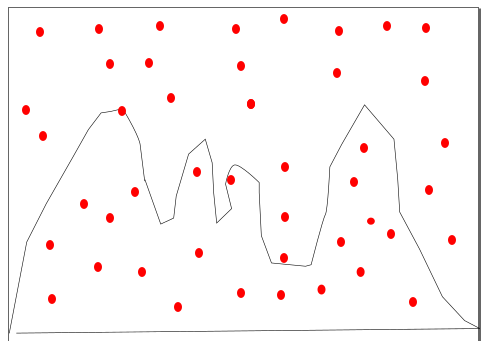

<figcaption>図（著者による）: 曲線下の面積を推定するモンテカルロ法。長方形内に一様な赤点を撒き、曲線の下に落ちた点の割合×長方形の面積で面積を近似する。</figcaption>
</figure>

基本的に、ある量の計算が複雑な解析的構造を持つなら、単純にシミュレーションを行って大量のサンプルを生成し、それらを使ってその量を近似できます。これらは、漸近的に中心極限定理（central limit theorem）に従う限り機能します。

これはリスク分析、信頼性分析などにも多くの用途があります。

**（数学的に）**

推定したい期待値 (s) があるとしましょう。これは非常に複雑な積分かもしれず、あるいは推定が扱いにくい（intractable）ものですらあるかもしれません——モンテカルロ法を使って、私たちはそのような量を、サンプルにわたって平均することで近似することに頼ります。

<figure>

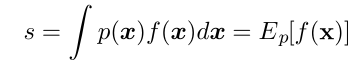

<figcaption>式: 計算したい元の期待値。s = ∫ p(x) f(x) dx = E_p[f(x)]。</figcaption>
</figure>

<figure>

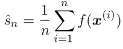

<figcaption>式: f(x) の大量サンプルをシミュレートして生成した近似期待値。ŝₙ = (1/n) Σ_{i=1}^n f(x⁽ⁱ⁾)。</figcaption>
</figure>

多数のサンプルにわたって平均を計算すれば、標準誤差を減らし、かなり正確な近似を与えてくれます。

" ***この方法には限界があります。なぜなら、確率分布から容易にサンプリングできることを仮定しているからです。しかしそうすることは常に可能とは限りません。時には、分布からサンプリングすることすらできません。そのような場合、私たちはマルコフ連鎖を利用して、扱いにくい確率分布から効率的にサンプリングします。"***

---

## マルコフ連鎖

***マルコフ連鎖***に入る前に、それを定義する有用な性質を見ておきましょう——

**マルコフ性（Markov property）:**

<figure>

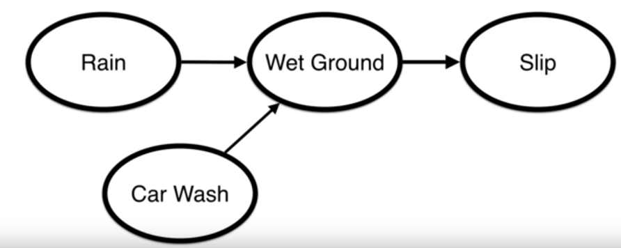

<figcaption>図: 楕円の中の要素が状態（state）。Rain（雨）または Car Wash（洗車）が Wet Ground（濡れた地面）を引き起こし、それが Slip（滑る）を引き起こす。</figcaption>
</figure>

上の画像にある4つの状態のシステムを考えます——

「*雨*」または「*洗車*」が「*濡れた地面*」を引き起こし、続いて「*濡れた地面*」が「*滑る*」を引き起こします。

マルコフ性は単純に一つの仮定を置きます——***ある状態から次の状態へ飛ぶ確率は、現在の状態のみに依存し、その現在の状態に至った過去の状態の系列には依存しない。***

> 誰かが滑る確率を計算するなら、地面が濡れているかどうかを知ることが、それを推定するのに十分な証拠を提供します。そこに至った状態（「雨」や「洗車」）は必要ありません。

***数学的に言えば:***

<figure>

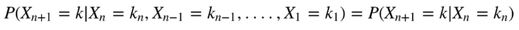

<figcaption>式: マルコフ性が分布を切り詰める。P(X_{n+1}=k | X_n=kₙ, X_{n-1}=k_{n-1}, …, X₁=k₁) = P(X_{n+1}=k | X_n=kₙ)。次状態は現在状態だけで決まる。</figcaption>
</figure>

この数学的な式から、マルコフ性の仮定が私たちに多くの計算を節約しうることは明らかです。

振り返ってみると、もしあるプロセスが***マルコフ性***を示すなら、それは***マルコフ連鎖***として知られます。

マルコフ連鎖を見たところで、それをこれほど望ましいものにする性質——**定常分布（Stationary Distribution）**——を議論しましょう。

---

### 定常分布:

いくつかの状態を持つプロセスがあり、状態間を飛び移る固定された遷移確率 **(Q)** を持つとします。時刻ステップ **i** ですべての状態にわたる何らかのランダムな確率分布 (**Sᵢ**) から始め、次の時刻ステップ、すなわち **i+1** ですべての状態にわたる確率分布を推定するために、それに遷移確率 **Q** を掛けます。

<figure>

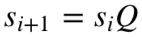

<figcaption>式: 状態分布の更新。sᵢ₊₁ = sᵢ Q。現在の分布に遷移行列 Q を掛けて次ステップの分布を得る。</figcaption>
</figure>

これを続けていくと、しばらくして **S** は行列 Q を掛けても変化しなくなります。これが、***定常分布***に達したと言うときです。

<figure>

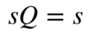

<figcaption>式: 定常分布に達した状態。sQ = s。Q を掛けても分布が変わらない不動点。</figcaption>
</figure>

例で見てみましょう——

この例では、3つの状態（X₁, X₂, X₃）があります。

<figure>

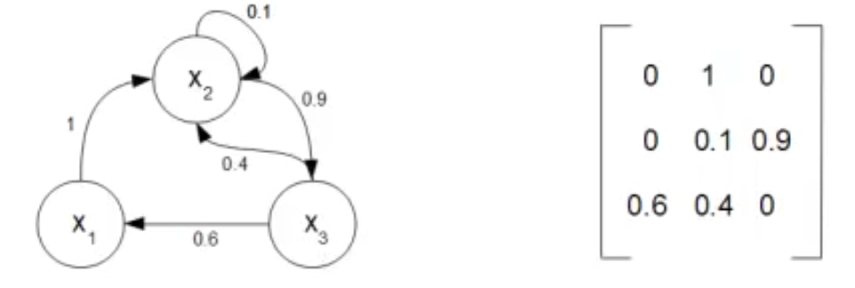

<figcaption>図: 状態間の遷移確率（T）。左が状態遷移図（X₁→X₂ が 1、X₂ は自己ループ 0.1・X₂→X₃ が 0.9、X₃→X₁ が 0.6・X₃→X₂ が 0.4）、右が対応する遷移行列。</figcaption>
</figure>

状態 **S₂** にいるなら、**S₂** に留まる確率は 0.1、状態 **S₁** へ遷移する確率は 0、状態 **S₃** へ遷移する確率は 0.9 です（行列の2行目から明らか）。

ベクトル **Sᵢ** の何らかのランダムな値から始めましょう（ベクトルは、任意の特定の時刻ステップで各状態にいる確率を示します）。ベクトルが 1 に合計されることが分かります。

<figure>

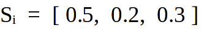

<figcaption>式: 初期の状態ベクトル。Sᵢ = [0.5, 0.2, 0.3]（各状態にいる確率、合計1）。</figcaption>
</figure>

<figure>

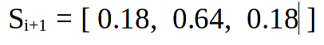

<figcaption>式: Sᵢ₊₁ = Sᵢ Q を適用した後。Sᵢ₊₁ = [0.18, 0.64, 0.18]。</figcaption>
</figure>

時刻ステップを進め続けると、最終的に定常状態に達します。

<figure>

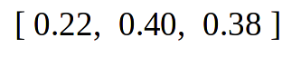

<figcaption>式: 定常分布。[0.22, 0.40, 0.38]。Q を掛けても変わらなくなった分布。</figcaption>
</figure>

そして知っておくべき最良の点は、この定常分布が初期状態に依存しないことです。さまざまな初期状態 **Sᵢ** で実験してみるとよいでしょう。

```
import numpy as np
```
```
Q = np.matrix([[0,1,0],[0,0.1,0.9],[0.6,0.4,0]])
S_initial = np.matrix([[0.3, 0.4 , 0.3]])
epsilon = 1
```
```
while epsilon > 10e-8:
    S_next = np.dot(S_initial, Q)
    epsilon = np.sqrt(np.sum(np.square(S_next - S_initial)))
    S_initial = S_next
```
```
print(S_initial)
```

定常分布は、任意の与えられた時刻に任意の状態にいる確率を示します。

直感的に言えば、**マルコフ連鎖は連鎖の上を歩くことと考えられます。ある特定のステップでの状態が与えられたとき、次のステップにわたる「状態の確率分布」を見ることで、次の状態を決められます。**

さて、マルコフ連鎖とモンテカルロの両方を見たので、これらの美しいものの組み合わさった形、すなわち MCMC に焦点を当てましょう。

---

**Extras（おまけ）—**

**マルコフ連鎖がそもそもなぜ定常分布に収束するのか**を理解したい好奇心旺盛な人は、下の画像を参照してください——

<figure>

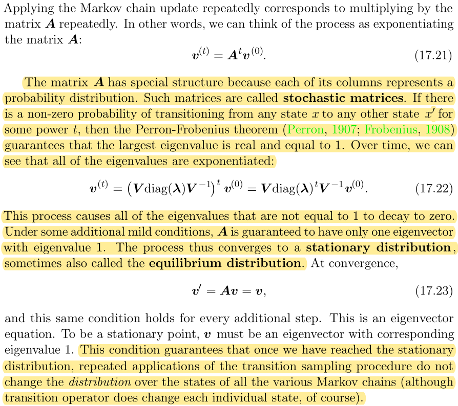

<figcaption>図（出典: Goodfellow, Bengio, Courville『Deep Learning』MIT Press, 2016）: 行列 A（確率遷移行列）が確率質量を保つことで、マルコフ連鎖の更新がべき乗反復として固有値・固有ベクトルで表現でき、最大固有値1に対応する固有ベクトルへ収束＝定常分布になることを示す抜粋。</figcaption>
</figure>

---

## マルコフ連鎖モンテカルロ（MCMC）

***MCMC は任意の確率分布からサンプリングするのに使えます。多くの場合、私たちはそれを、推論の目的で、扱いにくい事後分布からサンプリングするのに使います。***

ベイズを使って事後分布を推定することは時に難しいことがあります。ほとんどの場合、私たちは **尤度（Likelihood）** × **事前（Prior）** の関数形を見つけられます。しかし、周辺化された確率 P(B) を計算することは、特にそれが連続分布のときに、計算上高コストになりえます。

<figure>

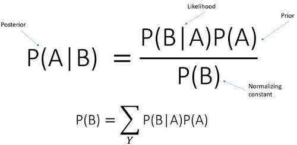

<figcaption>図（著者による）: 離散の周辺確率を持つベイズの定理。P(A|B) = P(B|A)P(A) / P(B)（事後＝尤度×事前÷正規化定数）、P(B) = Σ_Y P(B|A)P(A)。</figcaption>
</figure>

ここでのトリックは、正規化定数の計算を完全に避けることです。

**このアルゴリズムの一般的な考え方は、何らかのランダムな確率分布から始めて、徐々に望む確率分布へと移動していくことです。**

簡単そうに聞こえますが、どうやってこれを行うのでしょうか？

> 状態にわたるランダムな確率分布でマルコフ連鎖を初期化し、連鎖の中を徐々に動いて定常分布へ収束させ、この定常分布が望む確率分布に似ることを保証する何らかの条件（**詳細釣り合い, Detailed Balance Sheet**）を適用します。

こうして、定常分布に到達したとき、私たちは事後確率分布を近似したことになります。

<figure>

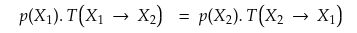

<figcaption>式: 詳細釣り合い（Detailed Balance Sheet）の条件。p(X₁)·T(X₁→X₂) = p(X₂)·T(X₂→X₁)。</figcaption>
</figure>

確率 p(A) は A にいる確率を表し、確率 T(A → B) は A から B へ移動する確率を表します。

確率 p(B) は B にいる確率を表し、確率 T(B → A) は B から A へ移動する確率を表します。

各辺は、A から B あるいは B から A への確率の流れを表します。この条件が満たされれば、定常状態が事後分布をおおよそ表すことが保証されます。

MCMC 自体は複雑ですが、それらは多くの柔軟性を提供します。高次元での効率的なサンプリングを提供します。大きな状態空間を持つ問題を解くのに使えます。

**限界** —— MCMC は、多峰（multi modes）を持つ確率分布の近似ではうまく機能しません。

### Extras（おまけ）—

**[この場合の周辺確率 P(B) は正規化定数として知られる定数で、分子の取りうる値全体にわたって和をとったものです](https://stats.stackexchange.com/questions/481390/why-is-the-normalisation-constant-in-bayesian-not-a-marginal-distribution)。**

扱いにくい正規化定数（分配関数 partition function とも呼ばれる）を持つモデルを訓練・評価する技術があります。それらのいくつかは、アルゴリズムの中でサンプリングに MCMC を使います。

例 —— **コントラスティブ・ダイバージェンス（Contrastive Divergence, CD）** は、*制限ボルツマンマシン（Restricted Boltzmann machine）*のような非構造的なグラフィカルモデルを訓練するのに有用です。

---

## Metropolis–Hastings アルゴリズム

分布 p(x) = f(x) / Z からサンプリングしているとします。ここで Z は扱いにくい正規化定数です。

私たちの目的は、分子のみを利用し、分母を推定せずに済むようなやり方で p(x) からサンプリングすることです。

**（提案確率）**

**提案確率（proposal probability, g）**を見ることから始めましょう。あるサンプルが与えられると、それはマルコフ連鎖における次の候補サンプルを提案してくれます。（候補サンプルを受容するか棄却するかをどう決めるかは、次の節で見ます。）

<figure>

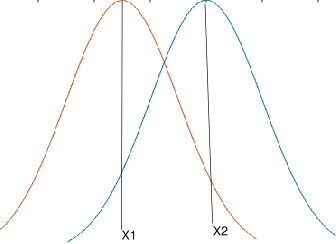

<figcaption>図（著者による）: 提案分布（Proposal Distribution）。現在のサンプル X₁ を平均とする正規分布から次の候補 X₂ をサンプルする様子。</figcaption>
</figure>

**g(X₂ | X₁) = Normal(X₁, σ)** と仮定します ***（**どんな分布でもよかったのですが、簡単のために正規分布を選びました**）***。

X₁ を平均として保ち、正規分布を作ります。それからこの分布から X₂ をサンプリングします。

X₂ を平均として保つことで、X₃ をサンプリングするのに同じステップを繰り返します。

**（メインアルゴリズム）**

詳細釣り合いの条件に従って、このアルゴリズムを始めましょう。

<figure>


<figcaption>式（再掲）: 詳細釣り合い（Detailed Balance Sheet）。p(X₁)·T(X₁→X₂) = p(X₂)·T(X₂→X₁)。</figcaption>
</figure>

X₁ から X₂ へ遷移する確率は、状態 X₁ にいることを考えると、2ステップのプロセスと見なせます——

第1ステップは、何らかの***提案確率* g** で状態 X₂ を提案することです（前の節で議論しました）。

第2ステップは、何らかの***受容確率（acceptance probability）* A** で新しい状態 X₂ を受容することです。

遷移確率を式に代入すると……

<figure>

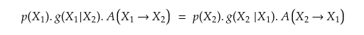

<figcaption>式: 遷移確率 T を「提案 g × 受容 A」に分解して代入。p(X₁)·g(X₁|X₂)·A(X₁→X₂) = p(X₂)·g(X₂|X₁)·A(X₂→X₁)。</figcaption>
</figure>

p(x) を f(x)/Z で置き換えると、両辺にある Z が打ち消し合って、次が得られます……

<figure>

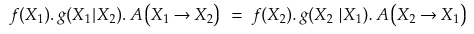

<figcaption>式: Z が両辺で打ち消された後。f(X₁)·g(X₁|X₂)·A(X₁→X₂) = f(X₂)·g(X₂|X₁)·A(X₂→X₁)。正規化定数 Z が消える。</figcaption>
</figure>

式を再構成すると、次に至ります。

<figure>

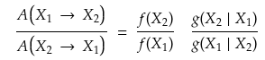

<figcaption>式: 再構成。A(X₁→X₂) / A(X₂→X₁) = [f(X₂)/f(X₁)] · [g(X₂|X₁)/g(X₁|X₂)]。</figcaption>
</figure>

短縮記法を代入します。

<figure>

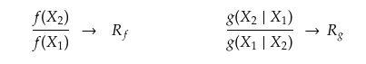

<figcaption>式: 短縮記法。f(X₂)/f(X₁) → R_f、g(X₂|X₁)/g(X₁|X₂) → R_g。</figcaption>
</figure>

<figure>

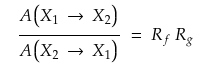

<figcaption>式: 最終的に受容確率の比。A(X₁→X₂) / A(X₂→X₁) = R_f · R_g。（実際の受容確率は A = min(1, R_f·R_g) ととる。）</figcaption>
</figure>

最終的に、**受容確率 A** が得られます。

まとめると——

- ランダムな状態から始める。
- 提案確率（g）に基づいて、ランダムに新しい状態を選ぶ。
- 提案された新しい状態の受容確率（A）を計算する。
- 表が出る確率が受容確率に等しいコインを投げ、表が出たらサンプルを受容し、そうでなければ棄却する。
- このプロセスをかなりの間繰り返す。

長い間サンプリングを続け、連鎖がまだ定常状態に達していない初期のいくつかのサンプルは捨てます（この期間は **burn-in 期間（burn-in period）** として知られます）。

<figure>

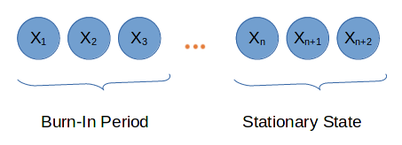

<figcaption>図（著者による）: 連鎖の初期 X₁, X₂, X₃, … は Burn-In 期間として捨て、定常状態に達した後の Xₙ, X_{n+1}, … をサンプルとして使う。</figcaption>
</figure>

**限界:**

- 多峰（multi-modal）分布を近似する際に連鎖が詰まり、偏ったサンプルになって、望む量の推定精度が下がること。
- Metropolis–Hastings は、サンプル空間が高次元のときに非常に遅くなる（別の素晴らしい MCMC 法である **ハミルトニアンモンテカルロ, Hamiltonian Monte Carlo** はこれらの欠点を克服しますが、それは別の記事での議論です）。

**結論:**

これで MCMC 法の議論を締めくくります。同様の議論に関するさらなる記事が続く予定です。

これは、まさに諸概念の融合であり、それらの概念が数学の背後に隠れているがゆえに、正確に理解するのが決して容易な概念ではありませんでした。

**ここまでたどり着いたあなたに、称賛を！！ 頑張ってください！！**
