# 例で理解する EM アルゴリズム（コードと可視化つき）

> 原題: Understanding the EM Algorithm by Examples (with code and visualization)
> 著者: Clarice Wang
> 出典: Medium（2022-07-31）, https://medium.com/@clarice.wang/understanding-the-em-algorithm-by-examples-with-code-and-visualization-dc93657adc84
>
> 訳注: 本文中のコードは Medium の埋め込み（gist の iframe）で提供されており、クリップした markdown には含まれていないため、本翻訳ではコード本体は割愛し、本文の説明と図のみを訳出する。

期待値最大化（Expectation Maximization, EM）アルゴリズムに飛び込む前に、最尤推定（Maximum Likelihood Estimation, MLE）の概念を理解することが重要である。観測されたデータが与えられたとき、MLE は、そのデータを**最も尤もらしく**生成する、仮定した確率分布のパラメータを見つける。

言い換えれば、MLE は θ、すなわちデータ D を見る最大の確率を与えるパラメータの集合を見つける。

<figure>

<figcaption>式: 最尤推定。θ_MLE = argmax_θ p(D|θ)。データ D の確率を最大にする θ を選ぶ。</figcaption>
</figure>

仮定した分布がガウスなら、MLE を使って θ = [µ, σ]（µ は平均、σ は標準偏差）を、データに最もよく当てはまるように見つける。

例として、1000人の成人の身長を測ると、データは次のように見えるかもしれない:

<figure>

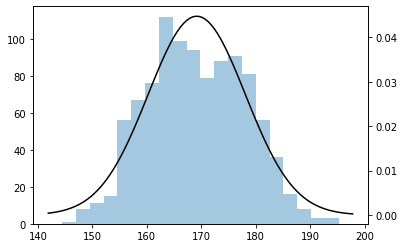

<figcaption>図: 1000人の成人の身長のヒストグラム。視覚的には平均 ~170 cm・標準偏差 ~10 cm のガウス分布を形成しているように見える。</figcaption>
</figure>

視覚的には、データが平均 ~170 cm・標準偏差 ~10 cm のガウス分布を形成していることが分かるかもしれない。

数学的には、対数尤度関数の微分をとって µ を解け、これは結局期待値になる。標準偏差も、対数尤度関数を σ に関して微分することで同様に解ける。

<figure>

<figcaption>図: 偏微分による µ の導出。対数尤度を µ で微分してゼロと置くと、µ はデータの平均（期待値）になる。</figcaption>
</figure>

<figure>

<figcaption>図: 偏微分による σ の導出。対数尤度を σ で微分してゼロと置くと、σ はデータの標準偏差になる。</figcaption>
</figure>

では EM はどこで登場するのか？

先ほどの例で、身長を単一のガウス分布でモデル化する代わりに、男性の身長をあるガウス分布で、女性の身長を別のガウス分布でモデル化するかもしれない。しかし、私たちは1000人の成人の性別を知らない。2つのガウス分布をどう見つけるか？ この問題では、潜在変数（性別）の存在が、EM アルゴリズムが必要な理由である。

<figure>

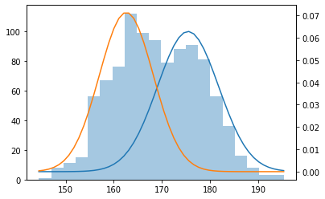

<figcaption>図: 身長を2つのガウス分布（男性・女性）の混合でモデル化する。性別が潜在変数。</figcaption>
</figure>

EM アルゴリズムは、潜在変数の存在下で MLE を用いる、反復的な統計分析の手法である。これは2つの主要なステップに分解できる（図1）: 期待ステップ（expectation step）と最大化ステップ（maximization step）。

1. 初期推測: 両方の分布の初期の平均と標準偏差をランダムに推測してアルゴリズムを始める。
2. E-step: 各身長測定について、それが男性分布と女性分布によって生成された確率を求める。その確率に基づいて、測定値を男性グループと女性グループに割り当てる。
3. M-step: 男性グループと女性グループに MLE を走らせ、2つの分布の平均と標準偏差を再推定する。
4. 収束テスト: パラメータが変化しなくなるまで E-step と M-step を何度も繰り返す——身長データに最もよく当てはまる2つの正規分布を見つけた。

<figure>

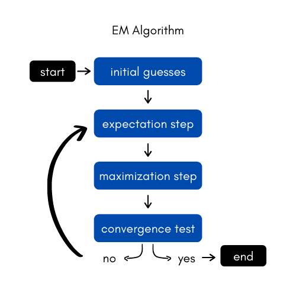

<figcaption>図1: 期待値最大化アルゴリズムのプロセス。初期推測 → E-step（所属確率で割り当て）→ M-step（MLE でパラメータ再推定）→ 収束テスト、の反復。</figcaption>
</figure>

収束は EM アルゴリズムの初期推測に大きく依存する。その結果、可能な限り最良の解に到達するために、さまざまな初期推測でアルゴリズムを試すのが一般的な慣行である。

この記事の残りでは、EM アルゴリズムの3つの例を、コードと可視化つきで扱う: K-Means、Two Coins（2枚のコイン）、ガウス混合。

## K-Means

K-Means アルゴリズムは、EM プロセスを実装した、広く使われるデータクラスタリングアルゴリズムである。K-Means は、反復的な手法を使って *n* 個の点が属する *k* 個のクラスタを特定することを含む。手順は次のとおり。

1. *k* 個のクラスタを持つデータを生成する
2. 各クラスタにランダムな初期重心を設定する
3. 重心が収束するまで E-step と M-step を反復する

まず、アルゴリズムを走らせる点のデータセットを作らねばならない。*sklearn.datasets* ライブラリには、これを行ってくれる便利な関数 [*make_blobs*](https://scikit-learn.org/stable/modules/generated/sklearn.datasets.make_blobs.html) がある。私はそれぞれ200点を持つ *k* = 3 個のクラスタを作り、最終的に *n* = 600点のデータセットになった。散布図でクラスタを可視化できる（図2）。

<figure>

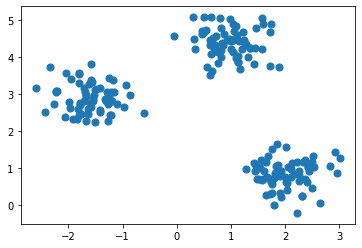

<figcaption>図2: make_blobs で生成した3つのクラスタ（合計600点）の散布図。</figcaption>
</figure>

データと所望のクラスタ数が与えられると、アルゴリズムはまず、各クラスタの中心——**重心（centroid）**としても知られる——を表す3つのランダムな初期点を選ぶ。

### E-step

次に、アルゴリズムは各点を、その点に最も近い重心のクラスタに割り当てる。

### M-step

続いて、各クラスタの重心は、そのクラスタに新しく割り当てられた点の平均に再決定される。

<figure>

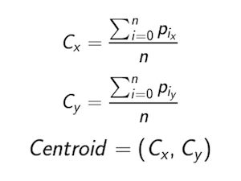

<figcaption>図: クラスタの重心座標を計算する式（割り当てられた点の各座標の平均）。</figcaption>
</figure>

E-step と M-step は、重心が変化しなくなるまで繰り返され（図3）、プログラムは終了する。

<figure>

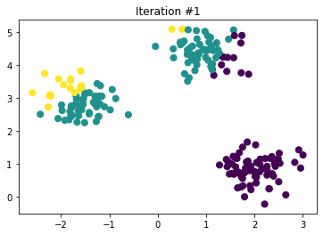

<figcaption>図3a: EM プロセスを用いる K-Means アルゴリズムの反復（初期）。</figcaption>
</figure>

<figure>

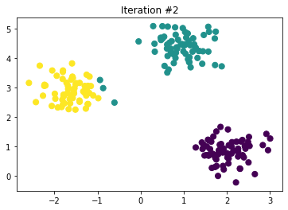

<figcaption>図3b: K-Means アルゴリズムの反復（途中）。</figcaption>
</figure>

<figure>

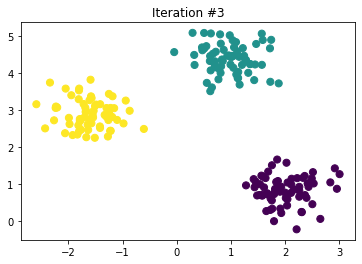

<figcaption>図3c: K-Means アルゴリズムの反復（収束）。重心が3クラスタの中心に落ち着く。</figcaption>
</figure>

## Two Coins（2枚のコイン）

ポケットに2枚のコイン、コイン A とコイン B があり、それぞれ異なるが未知の、表が出る確率を持つと想像してほしい。コインを取り出すたびに10回投げ、表が出た回数を記録し、ポケットに戻す。このプロセスを5回繰り返し、毎回コイン A か B かをランダムに使う。最後には、合計50回コインを投げたことになる。そうした上で、コイン A とコイン B が表を出す確率はいくらか？

<figure>

<figcaption>図: 2枚のコイン問題。コイン A・B のどちらかを毎回ランダムに選んで10回投げ、表の数を記録する。どちらを使ったか（潜在変数）は記録しない。</figcaption>
</figure>

これは混合問題（mixture problem）として知られる。2つの分布から生成されたデータを扱っており、目標はそれらの分布のパラメータを決めること——聞き覚えがあるだろうか？ 手順を見ていこう。

1. コイン投げのデータを生成する
2. ランダムな初期 *θ* 値（推測）を設定する
3. *θ* 値が収束するまで E-step と M-step を反復する

NumPy の *random* 関数を使って、コインの真の確率と試行あたりの投げる回数が与えられたとき、コイン投げの配列を生成する。この例では、コイン A・B の真の確率としてそれぞれ 0.6 と 0.2 を、試行あたり10投を使う。表は1、裏は0で表す。

上の問題文ではプロセスを5試行だけ繰り返すが、アルゴリズムが収束するには50データ点よりずっと多くが必要である。試行数を500に増やそう。つまりデータを完全に生成するには *roll* 関数を500回呼ぶ必要がある。

NumPy の *random* 関数を初期推測確率にも再び使い、コイン A・B についてそれぞれ 0.8 と 0.7 を得る。

### E-step

K-Means の問題と同様に、初期推測に従ってデータを分割しなければならない（今回は重心の位置ではなく *θ* 値による）。

各試行について、何回表が出たかを数え、各コインからその10投が出る確率を計算する。

<figure>

<figcaption>図: ある試行 D=[1,1,0,0,1,1,1,1,1,1]（表8・裏2）について、各コインからこの結果が出る確率。p(D|θ̂_A)=θ̂_A⁸(1−θ̂_A)²=(0.8)⁸(0.2)²=0.00671、p(D|θ̂_B)=(0.7)⁸(0.3)²=0.00519。</figcaption>
</figure>

さて、ここがこの問題を K-Means と異なるものにする点である。K-Means では各点を最も近い重心のクラスタに割り当てる。これはこの試行を（確率が大きいので）コイン A に割り当てるのと等価である。しかし実際には、もう一歩進めて、試行の**一部**をコイン A に、残りの一部をコイン B に割り当てられる。そのために、各コインへの重みを計算する。

<figure>

<figcaption>図: 各コインへの重み（事後確率）。p(コインA|D)=p(D|θ̂_A)/(p(D|θ̂_A)+p(D|θ̂_B))=0.00671/(0.00671+0.00519)=0.564、p(コインB|D)=1−0.564=0.436。</figcaption>
</figure>

これは、この試行の8回の表のうち 0.564×8 = 4.512 回がコイン A に、残りの 3.488 回がコイン B に帰せられることを教えてくれる。裏の分割についても同じ計算を行う。最終的に、各コインに帰せられる表と裏の数が全試行にわたって累積される。

### M-step

いまや MLE を使ってコイン A・B の *θ* 値を再計算できる。これはかなり直截的である。例えば、確率 *θ* = 2/5 のコインからは表2回・裏3回を見る可能性が最も高い。したがって、各コインに帰せられた表と裏が与えられると、各コインの表の数の割合を求める。これらの割合が新しい推測になる。

このアルゴリズムは、この場合 E-step と M-step の15回の反復を経て（図4）、真の確率 0.6 と 0.2 にうまく収束する。

<figure>

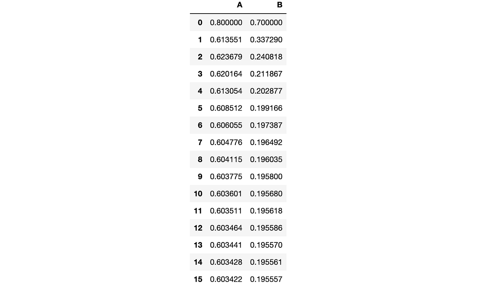

<figcaption>図4: EM プロセスを用いる Two Coins アルゴリズムの反復。初期推測 A=0.8, B=0.7 から、15反復で A≈0.603, B≈0.196 へ収束（真値 0.6, 0.2）。</figcaption>
</figure>

## ガウス混合（Gaussian Mixtures）

この例の目標は、*n* 個の正規分布したデータ部分集合からガウス混合モデルを生成することである。先ほどの身長問題を覚えているだろうか？ あれは *n* = 2 個の分布のガウス混合問題だった。これも Two Coins と同様に混合問題だが、いまや扱うのはベルヌーイ分布ではなくガウス分布である。始めよう。

1. 1次元の点のデータセットを生成する
2. ランダムな初期パラメータ（平均と標準偏差）を設定する
3. パラメータが収束するまで E-step と M-step を反復する

次のパラメータ [µ, σ] を持つ3つのガウス分布を生成した: [-10, 3]、[30, 7]、[3, 5]。各ガウスは1000個の正規分布した点を持つ。3000点のデータセットのヒストグラムを作って分布を見てみよう（図5）。

<figure>

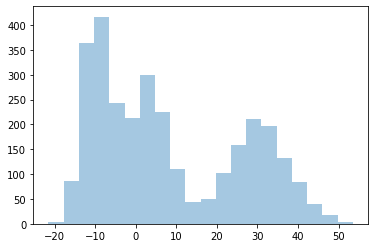

<figcaption>図5: データセットのヒストグラム。3つのガウス（µ,σ = [-10,3]・[30,7]・[3,5]、各1000点）を重ねた3000点。</figcaption>
</figure>

では初期推測を設定しよう。平均については、データ範囲内の3つのランダムな数を生成する。標準偏差については、1から10の間の3つのランダムな数を生成する。

### E-step

データと初期パラメータが揃ったので、次のステップは各正規分布が各点を生成した確率を求めることである。これらの確率を「メンバーシップ確率（membership probabilities）」と呼び、それらを格納する次元 (3000, 3) の配列 *r* を作れる。

まず SciPy の *stats* ライブラリの *norm* を使って、各平均・標準偏差の組について分布関数を設定する。次に、各分布の *pdf*（確率密度関数）をデータに適用してメンバーシップ確率を求める。この関数は正規/ガウス分布について標準化されている（図9）。

<figure>

<figcaption>図9: ガウス分布の確率密度関数（pdf）。N(x|µ,σ) = (1/√(2πσ²)) exp(−(x−µ)²/2σ²)。</figcaption>
</figure>

最後に、各行が1に合計されるよう *r* を正規化する。

### M-step

次に、E-step で得た確率の配列を使って、混合に関わる各ガウスの平均と標準偏差のパラメータを調整する。ここでも MLE を使う（図10）。

<figure>

<figcaption>図10: すべてのガウス分布について新しい平均と標準偏差を計算する式。µ'_d = Σ r_{d,i} x_i / Σ r_d、σ'_d = √(Σ r_{d,i}(x_i − µ'_d)²)。r は E-step のメンバーシップ確率（重み）。</figcaption>
</figure>

E-step と M-step を *k* = 20 反復繰り返す（図6）。

<figure>

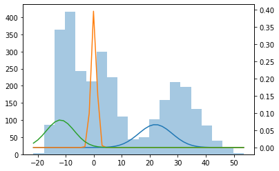

<figcaption>図6（左）: 初期のランダムなガウス。</figcaption>
</figure>

<figure>

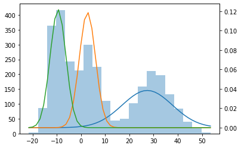

<figcaption>図6（中央）: 5反復後のガウス。</figcaption>
</figure>

<figure>

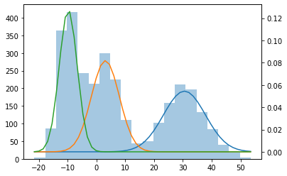

<figcaption>図6（右）: 20反復後のガウス。3つの真の分布に収束する。</figcaption>
</figure>

## 結論

EM アルゴリズムは、潜在変数の存在下で MLE を用いる反復プロセスである。私たちはこのアルゴリズムが3つの異なる例——K-Means（クラスタリング）、Two Coins（二項混合）、ガウス混合——で働く様子を見てきた。
