# ガウス過程回帰入門 Part 1: 基礎

> 原題: Introduction to Gaussian process regression, Part 1: The basics
> 著者: Kaixin Wang（Data Science at Microsoft）
> 出典: Medium, 2022-10-04（medium.com/data-science-at-microsoft/...）

> 注: 本翻訳は **本文（§Methodology 〜 §Discussion and conclusion）のみ**を一文ずつ訳出する。冒頭の装飾的なカバー写真（Unsplash）、本文途中に挿入された購読ウィジェット「Get Kaixin Wang's stories in your inbox」、末尾の LinkedIn 紹介・次稿への誘導・References は対象外。数式は原典では画像として埋め込まれているため、**その式画像を `raw/assets/2022-gpr-part1-basics/` にローカル保存して該当位置に配置**し、何の式かを訳注で添える（全 12 図＝式画像 8・プロット 4）。Medium 原典は miro CDN ホストで、画像は柔軟に再取得した。

---

ガウス過程（GP; Gaussian process）は、回帰と確率的分類の問題を解くために使われる教師あり学習の手法である。各ガウス過程は多変量ガウス分布の無限次元への一般化と見なせるため、名前に「ガウス」が付く。本稿では回帰目的のガウス過程、すなわちガウス過程回帰（GPR; Gaussian process regression）に焦点を当てる。GPR は材料科学・化学・物理・生物学など、いくつかの異なる種類の実世界問題を解くのに応用されてきた。

## 方法論（Methodology）

GPR は推論のためのノンパラメトリックなベイズ的アプローチである。パラメトリック関数のパラメータ上の分布を推論する代わりに、==ガウス過程は関心のある関数の上の分布を直接推論するのに使える==。ガウス過程は事前関数を定義し、それは事前分布からいくつかの値を観測した後に事後関数に変換される。

ガウス過程はランダム過程であり、実領域の任意の点 *x* に確率変数 *f(x)* が割り当てられ、これらの有限個の変数の同時分布 *p(f(x₁), …, f(xₙ))* がガウス分布に従う。

<figure>

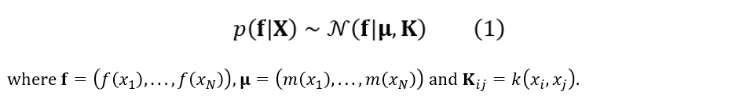

<figcaption>訳注: 式(1)。ガウス過程の定義——有限個の関数値の同時分布が平均関数 m と共分散行列 K を持つガウスに従う。</figcaption>
</figure>

式(1) で *m* は*平均*関数で、GP は最初に任意の値に設定しても平均を十分柔軟にモデル化できるため、通常は *m(x) = 0* が使われる。**k** は*カーネル*関数（*共分散*関数）と呼ばれる正定値関数である。したがってガウス過程は、共分散行列 **K** で定義される分布である。2 点がカーネル空間で類似していれば、それらの点での関数値も類似した値になる。

入力 *x* におけるノイズなし関数 *f* の値が与えられたとする。この場合、GP 事前分布は GP 事後分布に変換でき、新しい入力での予測に使える。GP の定義により、観測値と予測の同時分布はガウスであり、次のように分割できる。

<figure>

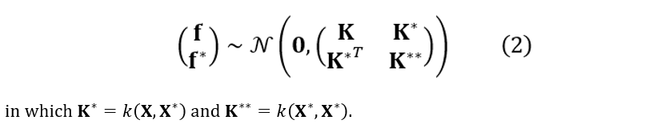

<figcaption>訳注: 式(2)。観測値と予測の同時ガウス分布を K（訓練×訓練）・K*（訓練×テスト）・K**（テスト×テスト）に分割。</figcaption>
</figure>

*m* 個の訓練データ点と *n* 個の新しい観測（テストデータ点）があるとき、**K** は *m × m* 行列、**K\*** は *m × n* 行列、**K\*\*** は *n × n* 行列である。

ガウス分布の性質に基づき、予測分布（事後分布）は次で与えられる。

<figure>

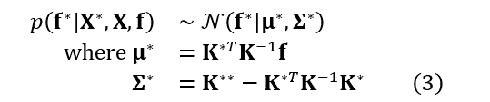

<figcaption>訳注: 式(3)。ノイズなしの場合の予測事後分布（平均と共分散）。</figcaption>
</figure>

ここで、ノイズを伴う目的関数 *y = f +* ε を考える。ノイズは

<figure>

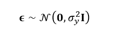

<figcaption>訳注: ノイズ ε の分布（独立同分布な零平均ガウス）。</figcaption>
</figure>

のように独立同分布（i.i.d.）である。事後分布は次のように表せる。

<figure>

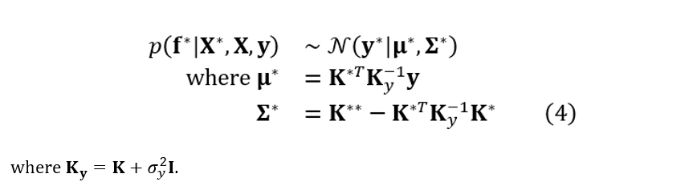

<figcaption>訳注: 式(4)。ノイズを含む場合の事後分布。</figcaption>
</figure>

最後に、ノイズ σ を予測に含めるには、共分散行列の対角に加える必要がある。

<figure>

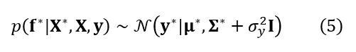

<figcaption>訳注: 式(5)。共分散行列の対角にノイズ項を加える。</figcaption>
</figure>

## Python 実装と例

前節で見たように、カーネル関数は GPR の予測において鍵となる役割を果たす。カーネルと GPR のアーキテクチャをゼロから構築する代わりに、GPR を実装済みの既存 Python パッケージを活用できる。よく使われるのは scikit-learn/sklearn、GPyTorch、GPflow である。

sklearn 版は主に NumPy 上に実装され、シンプルで使いやすいが、ハイパーパラメータ調整の選択肢は限られる。GPyTorch は PyTorch 経由で構築され、非常に柔軟だがアーキテクチャ構築に PyTorch の予備知識が要る。GPflow は TensorFlow 上に構築され、ハイパーパラメータ最適化の点で柔軟で、モデル構築も素直である。各実装の長所短所を比較し、以下の節で示す GPR モデルは GPflow を使って実装する。

## トイデータセットの作成

GPR でカーネルがどう機能するかを示すため、意図的に作った単純なトイデータセットを見る。図 1 は真の分布と収集した観測を示す。目標は観測データに基づいて真の信号を見つけるモデルを構築することだが、課題は実世界の観測には常に下層のパターンを乱すノイズが伴うことである。したがって、適切なカーネルの選択とそのハイパーパラメータの調整は、モデルが*過学習*にも*未学習*にもならないようにするために重要である。

<figure>

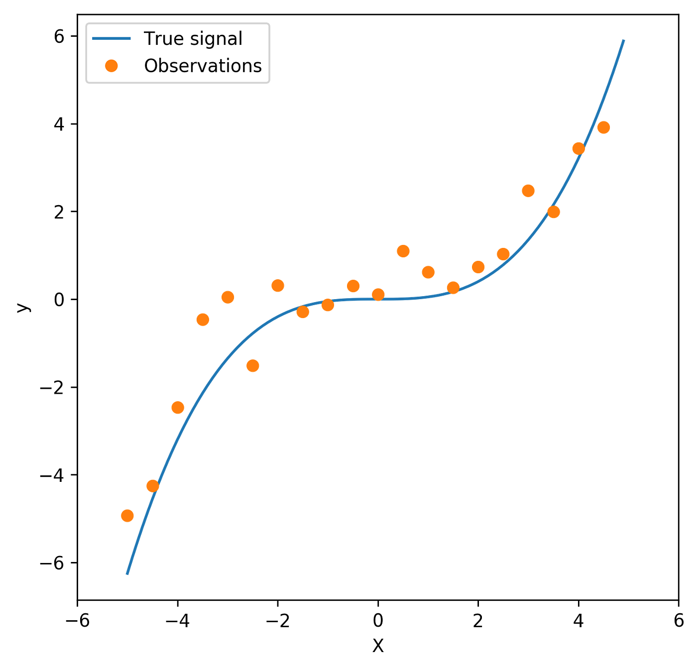

<figcaption>図1: 例のデータセット。青線は真の信号（f）、オレンジの点は観測（y = f + σ）を表す。</figcaption>
</figure>

## カーネルの選択

GPR モデルを当てはめる際に選べるカーネルは無限にある。簡単のため、最もよく使われる 2 つの関数——線形カーネルと放射基底関数（RBF; Radial basis function）カーネル——だけを見る。

線形カーネルは最も単純なカーネル関数の 1 つで、分散（σ²）パラメータでパラメータ化される。カーネルの構成は次の通り。

<figure>

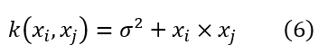

<figcaption>訳注: 式(6)。線形カーネル（分散 σ² でパラメータ化）。</figcaption>
</figure>

σ² = 0 のとき、このカーネルは同次（homogeneous）線形カーネルと呼ばれることに注意。

RBF カーネルは定常カーネルである。「二乗指数（squared exponential）」カーネルとしても知られる。長さスケール（*l*）パラメータ（スカラーまたは入力と同次元のベクトル）と、分布の広がりを制御する分散（σ²）パラメータでパラメータ化される。カーネルは次で与えられる。

<figure>

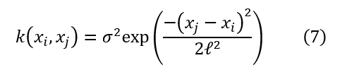

<figcaption>訳注: 式(7)。RBF（二乗指数）カーネル（長さスケール l と分散 σ²）。</figcaption>
</figure>

RBF カーネルは無限回微分可能であり、これはこのカーネルを持つ GP が全次数の二乗平均微分を持ち、ゆえに滑らかな形になることを意味する。

観測データを使い、異なるカーネル関数で GPR モデルを当てはめると何が起こるか見よう。図 2 はカーネルの効果を示す。線形カーネルが入力と目標の間に純粋に線形な関係を予測し、未学習のモデルになるのは明らかである。RBF カーネルはデータ点をかなりよく内挿するが、外挿（未見のデータ点の予測）はあまり得意でない。見ての通り、できるだけ多くのデータ点を通そうとして、RBF カーネルはノイズに当てはまり、過学習のモデルを作る。比較すると、線形と RBF カーネルの組み合わせは内挿と外挿の最良のバランスを持つ——データ点を十分よく内挿しつつ、両端の未見のデータ点も合理的に外挿する。

<figure>

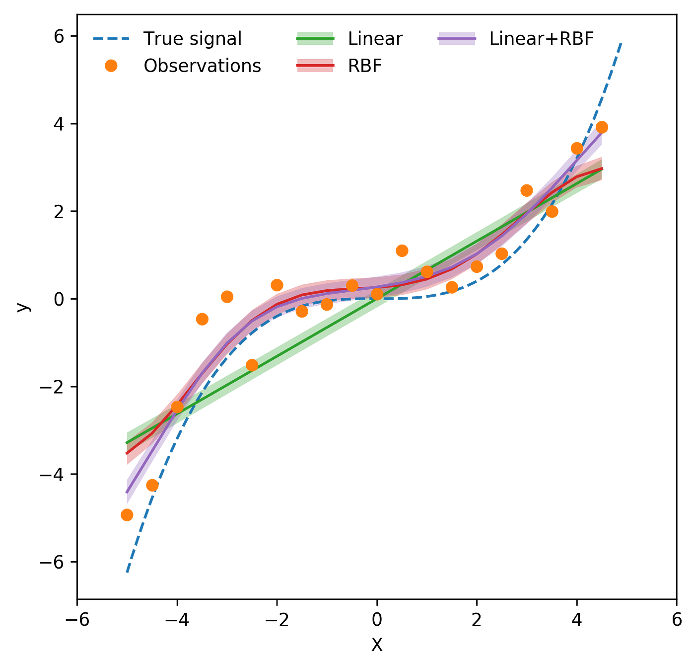

<figcaption>図2: カーネルの選択。緑・赤・紫の線はそれぞれ線形・RBF・線形と RBF の和のカーネルを使ったときの GPR の予測を示す。各曲線の周りの陰影領域は点推定に伴う 95% 信頼区間を表す。</figcaption>
</figure>

3 つの予測曲線のそれぞれに付随する経験的信頼区間があることに注意。GPR は確率的モデルなので、点推定だけでなく各予測の確信度も計算できる。図 2 に示す信頼区間（各曲線周りの陰影領域）は各カーネルの 95% 信頼区間で、非線形カーネル（RBF カーネル、および線形と RBF の組み合わせ）の区間が真の信号に触れている——すなわちそれらの予測は十分な確信を持って真値に近いことがわかる。

## ハイパーパラメータ最適化

使うカーネルの決定に加え、ハイパーパラメータ調整はよく当てはまるモデルを保証するもう 1 つの重要なステップである。式(6) と (7) に示したように、RBF カーネルは 2 つのパラメータに依存する——分布の滑らかさを制御する長さスケール（*l*）と、曲線の広がりを決める分散（σ²）である。

図 3 はこの 2 つの主要パラメータの最適化を示す。左のプロットから、長さスケールが減るにつれて当てはめ曲線は滑らかさを失いノイズに過学習し、長さスケールを増やすとより滑らかな形になることがわかる。プロットから、選ばれた長さスケールは 2.5 で、過学習と未学習のバランスが良い値である。右の図は長さスケールを 2.5 に固定して分散パラメータの効果を示す。分散が小さいと滑らかな曲線に、大きいとより過学習なモデルになる。プロットから、分散の値を変えることは長さスケールの調整に比べて曲線の形への影響が相対的に小さいことが観察される。前と同様、分散パラメータは過学習と未学習のバランスが保たれるように選ばれる。よって長さスケール 2.5 を使い、最適化された分散は 0.1 と選ばれる。

<figure>

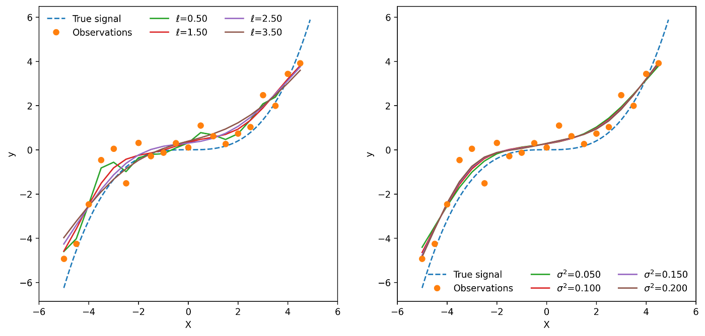

<figcaption>図3: 長さスケール（左）と分散（右）ハイパーパラメータの最適化。</figcaption>
</figure>

## 考察と結論

本稿では GPR モデルの背後にある理屈を概観し、異なるカーネル関数と付随するハイパーパラメータの選択の効果を示す簡単な例を示した。下の図 4 は、カーネル選択とハイパーパラメータ最適化のステップの後に見つかった最適モデルを示す。線形と RBF カーネルの組み合わせが真の信号をかなり正確に捉え、その 95% 信頼区間がデータ分布のノイズの度合いとよく整合しているのは明らかである。

<figure>

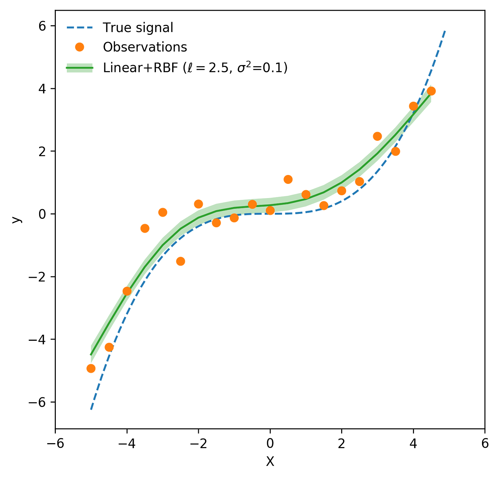

<figcaption>図4: 最適化された GPR モデルからの予測と、付随する 95% 信頼区間。</figcaption>
</figure>

まとめると、GPR が他の多くの ML モデルに対して持つ 3 つの利点がある。(1) 内挿——GPR の予測はほとんどの種類のカーネル関数で観測を内挿する。(2) 確率的——予測が確率的なので、経験的信頼区間を計算できる。(3) 多用途——異なる種類・組み合わせのカーネル関数をモデルの当てはめに使える。
