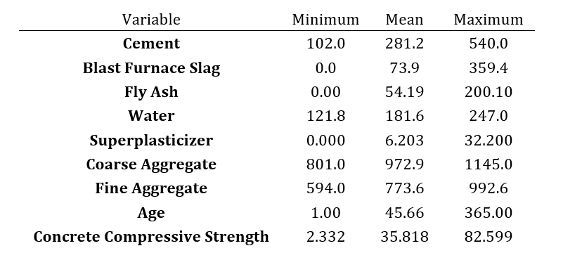
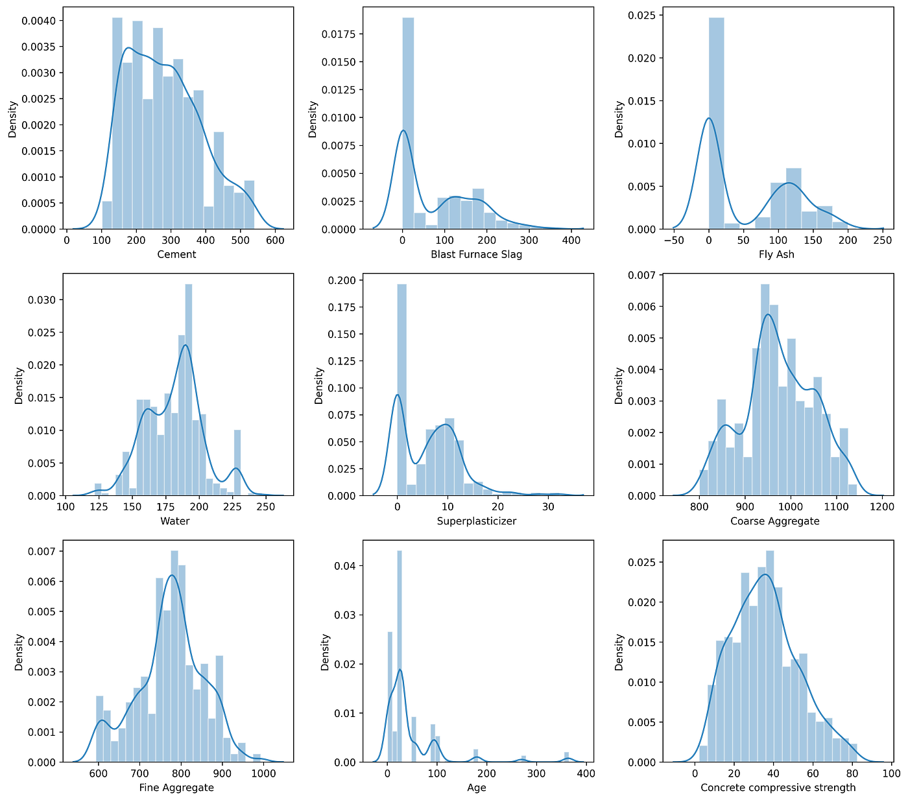
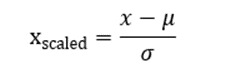
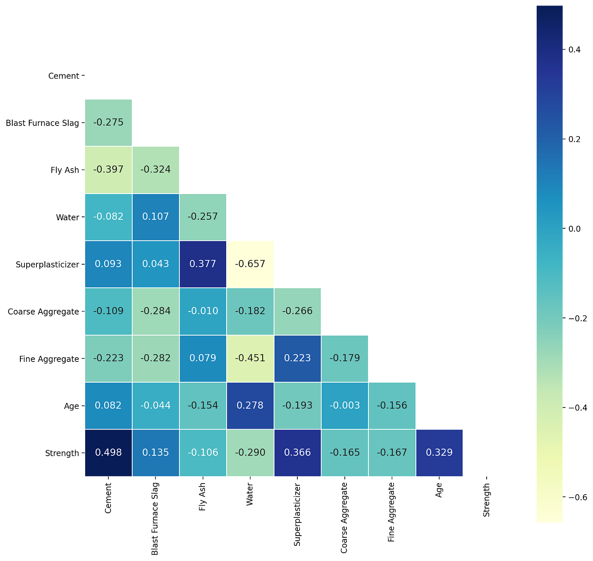
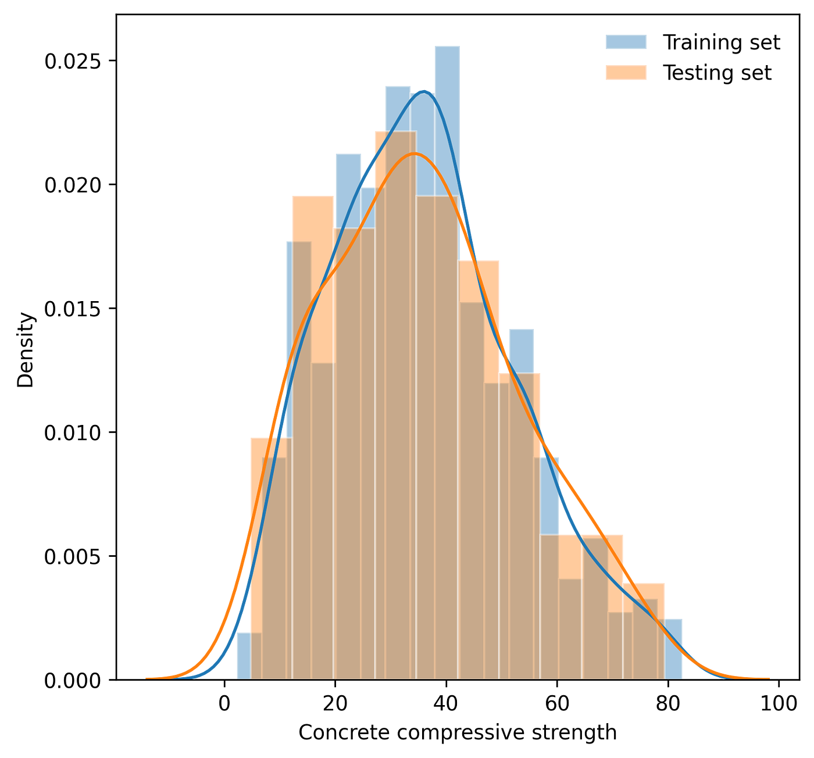
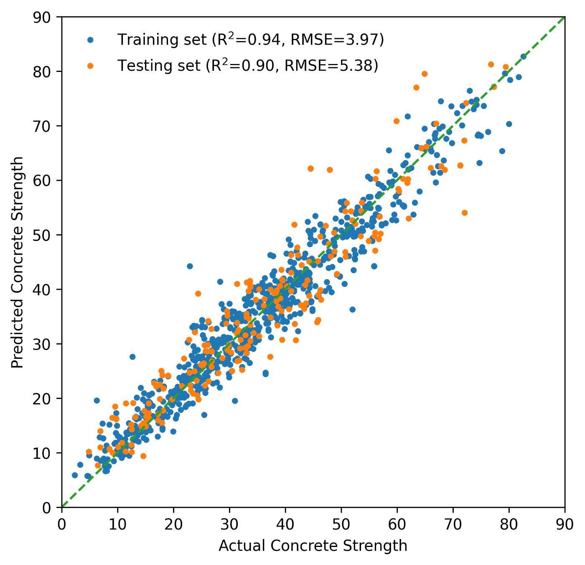
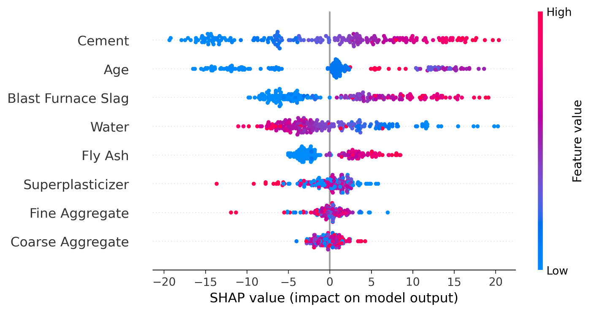
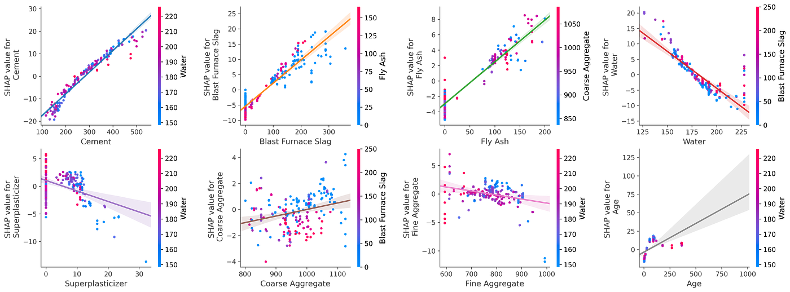

# ガウス過程回帰入門 Part 2: コンクリート強度予測への応用

> 原題: Introduction to Gaussian process regression, Part 2: Application to predicting concrete strength
> 著者: Kaixin Wang（Data Science at Microsoft）
> 出典: Medium, 2022-10-11（medium.com/data-science-at-microsoft/...）

> 注: 本翻訳は **本文（§Background 〜 §Discussion and conclusion）のみ**を一文ずつ訳出する。冒頭の装飾的カバー写真（Unsplash）、本文途中に挿入された購読ウィジェット「Get Kaixin Wang's stories in your inbox」、末尾の LinkedIn 紹介・References は対象外。表・数式・図は原典では画像としてレンダリングされているため、**その画像を `raw/assets/2022-gpr-part2-concrete/` にローカル保存して該当位置に配置**する（全 9 図＝表1・式1・図1〜7）。Medium 原典は miro CDN ホストで、画像は柔軟に再取得した（`format:webp` を外して原 PNG を取得）。本記事は [[translations/2022-gpr-part1-basics]] の続編。

---

ガウス過程回帰（GPR; Gaussian Process Regression）の数学的定式化と簡単な例は、この 2 部構成シリーズの[第 1 稿](https://medium.com/data-science-at-microsoft/introduction-to-gaussian-process-regression-part-1-the-basics-3cb79d9f155f)の基礎となった。この結びの稿では、GPR を実世界の回帰問題——コンクリート材料の圧縮強度の予測——に適用して、より深く掘り下げる。これから見るように、GPR は点推定とそれに付随する予測の不確実性を与え、SHapley Additive exPlanations（SHAP）分析で容易に解釈できる。

## 背景（Background）

高性能コンクリート材料の挙動のモデル化は、その複雑な性質ゆえに難しい。本研究の目標は、機械学習を介してコンクリートの化学組成からその強度を予測することである。コンクリートのデータセットには約 1000 個のコンクリート試料が含まれる。特徴量の集合は、セメント量（kg/m³）、高炉スラグ（kg/m³）、フライアッシュ（kg/m³）、水（kg/m³）、粗骨材（kg/m³）、細骨材（kg/m³）、および試験時のコンクリートの材齢（日数）といった性質を含む。目的変数はコンクリートの圧縮強度（メガパスカル、MPa）で、0 から 100 の範囲の値を取る。下の図 1 は特徴量と目的変数の分布を示す。

<figure>

<figcaption>表1: コンクリートデータセットの特徴量と目的変数の要約統計量。</figcaption>
</figure>

<figure>

<figcaption>図1: コンクリートデータセットにおける特徴量と目的変数の分布。</figcaption>
</figure>

元研究の著者らは予測に人工ニューラルネットワーク（ANN; Artificial Neural Network）モデルを使った。本記事では GPR をこの機械学習の課題に適用し、ANN に匹敵する性能を達成すると同時に、予測の不確実性のレベルも提供する。

## 方法論（Methodology）

ML モデルを確立する前に実装すべきステップがいくつかある。表 1 に示すように、異なる特徴量は異なる値の範囲を持つ。スケールの影響を下げるため、特徴量は scikit-learn の標準スケーラーで標準化する。標準スケーリングの式は次の通り。

<figure>

<figcaption>訳注: 標準スケーリングの式。μ は x の平均値、σ はその標準偏差。</figcaption>
</figure>

ここで μ は *x* の平均値、σ はその標準偏差である。

下の図 2 は、特徴量をスケーリングした後のコンクリートデータセットの相関ヒートマップを示す。セメント・高性能減水剤（superplasticizer）・材齢が強度と正に相関する上位 3 特徴量で、一方フライアッシュや骨材などの組成は目的変数と負に相関する。

<figure>

<figcaption>図2: 相関ヒートマップ。</figcaption>
</figure>

もう 1 つの重要なステップは、モデル性能を評価できるようデータセットを訓練集合とテスト集合に分割することである。図 3 は、80/20 パーセントの比率でランダムな訓練・テスト分割を適用したときの、訓練集合とテスト集合におけるコンクリート強度の分布を示す。

<figure>

<figcaption>図3: 訓練集合とテスト集合における目的変数の分布（80/20 パーセント比）。</figcaption>
</figure>

これで GPR モデルの訓練過程を始められる。選ばれたカーネルは線形カーネルと放射基底関数（RBF; Radial Basis Function）カーネルの組み合わせで、データをよく内挿・外挿できる頑健な組み合わせである。最適なハイパーパラメータの集合（RBF カーネルの分散と長さスケールのパラメータ）は GPflow の組み込み最適化器で決定する。下の図 4 は予測対真のコンクリート強度を示す。モデルがテスト集合で訓練集合と同程度の性能を達成し、決定係数（R²）が約 0.90、二乗平均平方根誤差（RMSE）が約 5.4 であることがわかる。この結果は、訓練 R² が約 0.945・テスト R² が約 0.92 のニューラルネットワークモデルの結果に近い。

<figure>

<figcaption>図4: GPR による予測コンクリート強度 対 真値。</figcaption>
</figure>

図 5 は各予測に付随する 95% 信頼区間を示す。大きな予測誤差を持つ少数の点を除き、ほとんどの信頼区間が目的変数の真値を覆っていることが観察される。それらの区間は相対的に大きな帯域幅を持つ。これはモデルが誤差を「自覚」しており、予測が他ほど確信的でないことを意味する。

<figure>

<figcaption>図5: GPR による予測コンクリート強度 対 真値、付随する 95% 予測信頼区間つき。</figcaption>
</figure>

## モデルの解釈（Model interpretation）

ML モデルは、入力と出力の間に確立された関係を解釈するのがしばしば難しいため、「ブラックボックス」モデルとも呼ばれる。GPR モデルで各特徴量が果たす役割をよりよく理解するため、SHapley Additive exPlanations（SHAP）分析を使って特徴量の重要度を可視化する。

SHAP 分析は、ML モデルの出力を説明するゲーム理論に基づくアプローチである。ゲーム理論の古典的なシャープレイ値を使って、最適な貢献度の配分と局所的な説明を結びつける。異なる ML アーキテクチャを解釈する際には、アンサンブル木手法向けの tree explainer、深層ニューラルネット向けの deep learning explainer など、異なる種類の「explainer（説明器）」を適用できる。GPR モデルの研究には、任意の種類のモデルに使える汎用的な説明器である kernel explainer を用いる。

ここでは 2 種類の SHAP プロットを見る。図 6 は SHAP サマリーのウォーターフォールプロットで、特徴量を SHAP 値に基づいてランク付けする（大きい SHAP 値はその特徴量が予測に強い影響を持つことを示す）。各点は特徴量の値に対応して色付けされ、入力と予測の関連を容易に可視化できる。図 7 は SHAP 依存プロット（特徴量相互作用プロット）で、SHAP 値と特徴量値の間の分布、および各予測子と最も相関する特徴量の両方を含む。

<figure>

<figcaption>図6: 最適化された GPR モデルに基づく SHAP サマリーのウォーターフォールプロット。</figcaption>
</figure>

<figure>

<figcaption>図7: 最適化された GPR モデルに基づく SHAP 依存（特徴量相互作用）プロット。</figcaption>
</figure>

SHAP サマリープロットから、コンクリート強度の予測においてセメントが最も重要な特徴量で、セメント量が多いほど通常は強度が高くなり、相関マップの観察と整合することがわかる。2 番目の上位特徴量はコンクリートの材齢で、出力と二次的な関係を持つ。依存プロットからは、セメントの分布に強い線形傾向があり、材齢特徴量のプロットに二次的な関係があることがさらに裏付けられる。加えて、セメントと材齢は水と最も強く相互作用することがわかり、これは水セメント比（c/m）がコンクリートの強度に影響を与える最も重要な要因の 1 つであるという事実と整合する。

## 考察と結論（Discussion and conclusion）

本記事では、材料科学における GPR の実世界応用を見た。モデルは元研究で確立されたニューラルネットワークに匹敵する性能を達成し、予測の不確実性のレベルも明らかにした。GPR は、その確率的でノンパラメトリックな性質、ならびに内挿・外挿における良好な性能——点推定と予測信頼区間を提供する——ゆえに、ML 問題の解決にますます広く応用されつつある。
