# TabPFN: 小規模な表形式分類問題を 1 秒で解く Transformer

> 原題: TabPFN: A Transformer That Solves Small Tabular Classification Problems in a Second
> 著者: Noah Hollmann（∗,1,2）, Samuel Müller（∗,1）, Katharina Eggensperger（1）, Frank Hutter（1,3）
> 所属: 1 University of Freiburg, 2 Charité University Medicine Berlin, 3 Bosch Center for Artificial Intelligence（∗ は equal contribution）
> 出典: arXiv:2207.01848（ar5iv 版クリッピング）

> 注: 本翻訳は付録（Appendix A〜F）も含めて訳出している（ユーザー指示による）。references（参考文献一覧）と acknowledgments（謝辞）は除外している。原文中の文献参照記号 [^N] は省略した。図表は SVG／外部画像として埋め込まれているため本文には再掲せず、図表のキャプションのみ訳出する。

## Abstract（要旨）

我々は TabPFN を提示する。これは訓練済みの Transformer であり、小規模な表形式データセットに対する教師あり分類を 1 秒未満で行い、ハイパーパラメータ調整を一切必要とせず、最先端の分類手法と競合する性能を持つ。

TabPFN は文脈内学習（in-context learning, ICL）を行う。すなわち、入力として与えられたラベル付き例の系列 (x, f(x)) を用いて予測の仕方を学習し、追加のパラメータ更新を必要としない。

TabPFN はネットワークの重みの中に完全に内包されており、訓練サンプルとテストサンプルを集合値の入力として受け取り、1 回の順伝播でテスト集合全体に対する予測を出力する。

TabPFN は Prior-Data Fitted Network（PFN）であり、我々の事前分布から抽出した合成データセット上でベイズ推論を近似するように、オフラインで一度だけ訓練される。

この事前分布は因果推論のアイデアを取り込んでいる。すなわち、単純な構造を選好する、構造的因果モデル（structural causal model）の広大な空間を内包している。

OpenML-CC18 スイートに含まれる 18 個のデータセット（訓練データ点が最大 1,000、欠損値のない純粋に数値的な特徴量が最大 100、クラス数が最大 10 のもの）において、我々の手法はブースティング木を明確に上回り、複雑な最先端の AutoML システムと同等の性能を最大 $230\times$ の高速化で達成することを示す。

GPU を使用すると、この高速化は $5\,700\times$ にまで増大する。

我々はこれらの結果を、OpenML から取得した追加の 67 個の小規模数値データセットでも検証する。

我々はすべてのコード、訓練済み TabPFN、対話的なブラウザデモ、Colab ノートブックを [https://github.com/automl/TabPFN](https://github.com/automl/TabPFN) で提供する。

## 1 Introduction（はじめに）

表形式データは、実世界の機械学習（machine learning, ML）応用において最も一般的なデータ型であるにもかかわらず、深層学習研究では長く見過ごされてきた。

深層学習手法は多くの ML 応用で優れた成果を上げているが、表形式データの分類問題は依然として勾配ブースティング決定木（Gradient-Boosted Decision Trees, GBDT）に支配されている。これは主にその短い訓練時間とロバスト性によるものである。

我々は、表形式分類の行い方に対して抜本的な変更を提案する。新しいデータセットの訓練部分に対して新たなモデルをゼロから当てはめることはしない。代わりに、このステップを、表形式データセットの事前分布から人工的に生成された分類タスクを解くよう事前訓練された大きな Transformer による 1 回の順伝播に置き換える。

我々の手法は Prior-Data Fitted Networks（PFNs; 第 2 節参照）の上に構築されており、これは訓練・予測アルゴリズムそのものを学習する。PFN は、サンプリング可能な任意の事前分布が与えられたときにベイズ推論を近似し、事後予測分布（posterior predictive distribution, PPD）を直接近似する。

NN や GBDT における帰納バイアス（inductive bias, モデルが持つ前提・選好）はそれらを効率的に実装できること（例えば $L_{2}$ 正則化、ドロップアウト、木の深さの制限などを通じて）に依存するのに対し、PFN では、望ましい事前分布をエンコードするデータセット生成アルゴリズムを単に設計すればよい。これは学習アルゴリズムの設計方法を根本的に変える。

我々は、複雑な特徴量間の依存関係と表形式データの背後にある潜在的な因果メカニズムをモデル化するために、ベイズニューラルネットワーク（Bayesian Neural Networks, BNNs）と構造的因果モデル（Structural Causal Models, SCMs）に基づく事前分布（第 4 節参照）を設計する。

我々の事前分布はオッカムの剃刀（Occam's razor）のアイデアも取り入れている。すなわち、より単純な（パラメータの少ない）SCM と BNN ほど高い尤度を持つ。

我々の事前分布はパラメトリックな分布によって定義される。例えば、データ生成 SCM のノード数の平均には対数スケールの一様分布を用いる。

得られる PPD は、起こり得るすべてのデータ生成メカニズムに関する不確実性を暗黙的にモデル化し、それらをデータが与えられたときの尤度と事前確率によって重み付けする。

したがって PPD は、無限に大きいデータ生成メカニズム（すなわち SCM と BNN のインスタンス）のアンサンブルに対応する。

我々はこの複雑な PPD を 1 回の順伝播で近似することを学習し、交差検証やモデル選択を一切必要としない。

我々の主要な貢献は TabPFN（第 3 節参照）の導入である。これは、上記の新しい事前分布に対する確率的推論を 1 回の順伝播で近似するよう事前訓練された単一の Transformer であり、その結果、新規の小規模表形式分類タスク（訓練例 $\leq$ 1,000、欠損値のない純粋に数値的な特徴量 $\leq$ 100、クラス数 $\leq$ 10）を 1 秒未満で解くことを学習し、最先端の性能を達成する。

この主張を裏付けるため、我々は TabPFN の挙動と性能をさまざまなタスクで定性的・定量的に分析し、18 個の小規模な数値データセット（第 5 節参照）において既存の表形式分類手法と比較する。

定量的には、TabPFN は、XGBoost、LightGBM、CatBoost による勾配ブースティングといった個々の「ベースレベル」分類アルゴリズムのいずれよりもはるかに優れた性能を示し、1 秒未満で、最良の AutoML フレームワークが 1 時間かけて達成する性能と競合する性能を得る。

我々の詳細な定性分析は、TabPFN の予測が滑らかで直感的であることを示す。

しかし、その誤りは既存手法の誤りとはかなり相関が低く、アンサンブルによる追加的な性能向上を可能にする。

我々は TabPFN の性能を、OpenML からの追加の 67 個のデータセットでも検証する。

我々は、自分たちの主張の革命的な性格が当初は懐疑をもって受け止められるであろうことを予期しており、したがってコミュニティによる精査のために、すべてのコードと事前訓練済み TabPFN を、scikit-learn ライクなインタフェース、Colab ノートブック、2 つのオンラインデモとともにオープンソース化する。リンクは第 8 節を参照されたい。

## 2 Background on Prior-Data Fitted Networks (PFNs)（PFN の背景）

まず、PFN がどのように動作するかを要約する。詳細はオリジナル文献を参照されたい。

**教師あり学習のための事後予測分布**　教師あり学習のベイズ的枠組みにおいて、事前分布は入力 $x$ の集合と出力ラベル $y$ の関係に関する仮説の空間 $\Phi$ を定義する。

各仮説 $\phi\in\Phi$ は、データ分布を生成するメカニズムとみなすことができ、そこからサンプルを抽出してデータセットを形成できる。

例えば、構造的因果モデルに基づく事前分布が与えられた場合、$\Phi$ は SCM の空間であり、仮説 $\phi$ は 1 つの特定の SCM であり、データセットはこの SCM を通じて生成されたサンプルから成る。

実際には、データセットは観測されたラベルを持つ訓練データと、ラベルが欠落しているか予測性能を評価するために保留されているテストデータから成る。

テストサンプル $x_{test}$ に対する PPD は、その正解ラベルの分布 $p(\cdot|x_{test},D_{train})$ を指定し、これは訓練サンプルの集合 $D_{train}:=\{(x_{1},y_{1}),\dots,(x_{n},y_{n})\}$ に条件付けられている。

PPD は仮説空間 $\Phi$ にわたる積分によって得られ、仮説 $\phi\in\Phi$ の重みはその事前確率 $p(\phi)$ と、$\phi$ が与えられたときのデータ $D$ の尤度 $p(D|\phi)$ によって決定される。

$$
p(y|x,D)\propto\int_{\Phi}p(y|x,\phi)p(D|\phi)p(\phi)d\phi.
$$

**合成的な事前当てはめ（Synthetic Prior-fitting）**　事前当てはめ（prior-fitting）とは、PPD を近似し、したがってベイズ的予測を行うように PFN を訓練することである。

我々はこれを、$p(D)=\operatorname*{\mathbb{E}}_{\phi\sim p(\phi)}[p(D|\phi)]$ の形の事前サンプリングスキームによって指定される事前分布で実装する。これはまず $\phi\sim p(\phi)$ で仮説（生成メカニズム）をサンプリングし、次に $D\sim p(D|\phi)$ で合成データセットをサンプリングする。

我々はこのような合成データセット $D:={(x_{i},y_{i})}_{i\in\{1,\dots,n\}}$ を繰り返しサンプリングし、残りのデータセット $D_{train}=D\setminus D_{test}$ に条件付けて $D_{test}\subset D$ に対する予測を行うように PFN のパラメータ $\theta$ を最適化する。

したがって PFN 訓練の損失は、合成データセットの保留例に対する交差エントロピーである。

単一のテスト点 $\{(x_{test},y_{test})\}=D_{test}$ について、訓練損失は次のように書ける。

$$
\mathcal{L}_{\textit{PFN}}=\operatorname*{\mathbb{E}}_{(\{(x_{test},y_{test})\}\cup D_{train})\sim p(D)}[-\log q_{\theta}(y_{test}|x_{test},D_{train})].
$$

先行研究が示したように、この損失を最小化することは真のベイズ事後予測分布を近似する。

これを図 1(a) に可視化し、完全な訓練設定を付録のアルゴリズム 1 で詳述する。

重要なことに、この合成的な事前当てはめの段階は、与えられた事前分布 $p(D)$ に対してアルゴリズム開発の一部として一度だけ実行される。

<figure>

<figcaption>図1: 左 (a): PFN は、オフライン段階で与えられた事前分布の PPD を近似することを学習し、オンライン段階では新しいデータセットに対して 1 回の順伝播で予測を出力する。右 (b): 訓練サンプル (x₁,y₁),…,(x₃,y₃) は 3 つのトークンに変換され、互いに注意を向け合う。テストサンプル x₄ と x₅ は訓練サンプルにのみ注意を向ける。</figcaption>
</figure>

**実世界推論（Real-World Inference）**　推論時には、訓練済みモデルが未知の実世界データセットに適用される。

訓練サンプル $D_{train}$ とテスト特徴量 $x_{test}$ を持つ新規データセットに対して、$\langle{}D_{train},x_{test}\rangle$ を上記で訓練したモデルへの入力として与えると、1 回の順伝播で PPD $q_{\theta}(y|x_{test},D_{train})$ が得られる。

PPD のクラス確率は、その後、我々の実世界タスクの予測として用いられる。

したがって PFN は訓練と予測を 1 ステップで行い（ガウス過程による予測と同様に）、推論時に見たデータに対して勾配ベースの学習を用いない。

この学習能力は文脈内学習（in-context learning, ICL）と呼ぶことができ、言語タスク向けに大きなニューラル系列モデルを訓練する際に驚くべきことに創発することが観察されてきた。

**アーキテクチャ**　PFN は、各特徴量ベクトルとラベルをトークンとしてエンコードする Transformer に依拠しており、図 1(b) に示すようにトークン表現が互いに注意を向け合うことを可能にする。

それらは可変長の訓練集合 $D_{train}$（順序不変性を利用するため集合値の入力として扱われる特徴量ベクトルとラベルベクトル）と、可変長のクエリ集合の特徴量ベクトル $x_{test}=\{x_{({test},1)},\dots,x_{({test},m)}\}$ を受け取り、各クエリに対する PPD の推定値を返す。

**表形式データ**　他の実験の中でも、先行研究は 30 個の訓練例を持つ、極小でバランスの取れた表形式データセットの二値分類において PFN による PPD 近似を実証した。

ここで我々は性能を大幅に改善し、最大 1,000 データ点、最大 10 クラス（不均衡を含む）の小規模データセットへとスケールアップする。詳細な変更点は付録 C.2.6 で論じる。

## 3 The TabPFN: A PFN fitted on a new prior for tabular data（表形式データの新しい事前分布で当てはめた PFN）

我々の TabPFN は Prior-data Fitted Network（PFN, 第 2 節参照）であり、第 4 節で導入する表形式データのための新しい事前分布から抽出したデータに当てはめられる。

我々はオリジナルの PFN アーキテクチャを 2 つの点で修正する。i) アテンションマスクをわずかに修正し、より短い推論時間を実現する。ii) さらに、ゼロパディングによって異なる特徴量数を持つデータセットでもモデルが動作できるようにする。

これらのアーキテクチャ上の強化点と、オリジナルと比較した我々の主要な貢献は付録 E.2 で詳述する。

事前当てはめの段階では、第 4 節で述べる事前分布からのサンプルで TabPFN を一度だけ訓練する。

より正確には、512 個の合成生成データセットから成る 18,000 バッチで 12 層の Transformer を訓練し、これには 8 GPU（Nvidia RTX 2080 Ti）を備えた 1 台のマシンで合計 20 時間を要した。

これにより、我々のすべての評価に使用される単一のネットワークが得られた。

この訓練ステップは中程度に高コストだが、オフラインで、事前に、TabPFN に対してアルゴリズム開発の一部として一度だけ行われる。

本論文のすべての実験には同一の TabPFN モデルが使用される。TabPFN の訓練に関する完全な詳細は付録 E で与える。

推論時には、TabPFN は我々のデータセット事前分布に対する PPD を近似する。すなわち、SCM と BNN の空間（第 4 節参照）にわたる周辺予測を、単純で因果的な説明への選好（バイアス）も含めて近似する。

実験では、TabPFN の 1 回の順伝播による予測に加え、べき変換（power transformation, 確率 0.5 で適用）と特徴量列・クラスラベルのインデックスの回転によって修正された 32 回の順伝播をアンサンブルした予測も提示する（詳細は付録 C.2.6 参照）。

## 4 A Prior for Tabular Data（表形式データのための事前分布）

我々の手法の性能は、適切な事前分布の指定に決定的に依存する。なぜなら PFN はこの事前分布に対する PPD を近似するからである。

第 4.1 節では、我々の事前分布の基本的な技法を概説する。我々は事前分布のほぼすべてのハイパーパラメータに対して点推定の代わりに分布を用いる。

第 4.2 節では事前分布における単純性の動機づけを行い、第 4.3 節と第 4.4 節では、複雑なデータを生成する基本メカニズムとして構造的因果モデル（SCM）とベイズニューラルネットワーク（BNN）をどのように用いるかを述べる。

我々の SCM および BNN 事前分布は回帰タスクしか生み出さないため、第 4.5 節でそれらを分類タスクに変換する方法を示す。

我々は、表形式データの特性（相関した特徴量・カテゴリ特徴量、指数的にスケールしたデータ、欠損値）をより良く反映するための事前分布への追加の精緻化を付録 C.2 で述べる。

### 4.1 Fundamentally Probabilistic Models（根本的に確率的なモデル）

モデルの当てはめには通常、適切なハイパーパラメータ（例えば NN の埋め込みサイズ、層数、活性化関数）を見つけることが必要となる。

一般に、適切なハイパーパラメータを見つけるには資源集約的な探索を行う必要がある。

しかしこれらの探索の結果は、ハイパーパラメータ選択の点推定にすぎない。

複数のアーキテクチャやハイパーパラメータ設定にわたるアンサンブルは、これらのハイパーパラメータ上の分布に対する大まかな近似を与え、性能を向上させることが示されている。

しかしこれは、考慮する選択肢の数に対してコストが線形にスケールする。

対照的に、PFN は我々の事前分布のハイパーパラメータについて完全にベイズ的であることを可能にする。

事前分布のハイパーパラメータの空間（例えば BNN アーキテクチャ）上に確率分布を定義することで、TabPFN が近似する PPD はこの空間と対応するモデル重みを同時に積分する。

我々はこのアプローチを、ハイパーパラメータだけでなく異なる事前分布の混合にまで拡張する。すなわち BNN 事前分布と SCM 事前分布を混合し、それぞれがさらにアーキテクチャとハイパーパラメータの混合を伴う。

### 4.2 Simplicity（単純性）

我々は事前分布を、オッカムの剃刀や速度事前分布（Speed Prior）に述べられているような単純性の概念に基づかせる。

競合する仮説を考えるとき、より単純なものが選好されるべきである。

認知科学の研究も、人間の思考におけるこの単純な説明への選好を明らかにしてきた。

しかし、いかなる単純性の概念も、単純性を定義する特定の基準を選ぶことに依存する。

以下では、SCM と BNN に基づく事前分布を導入し、その中で単純性を「ノードとパラメータが少ないグラフ」として実装する。

### 4.3 SCM Prior（SCM 事前分布）

<figure>


<figcaption>図2: 我々の事前分布でデータを生成するグラフの概観。入力 x は、観測されない（潜在）ノード z を通して出力 y に写像される。(a) BNN、(b) SCM、(c) 事前分布からサンプリングされた SCM 群。</figcaption>
</figure>

因果的知識が、半教師あり学習、転移学習、分布外汎化を含むさまざまな ML タスクを促進できることが実証されてきた。

表形式データはしばしば列間の因果関係を示し、因果メカニズムは人間の推論において強力な事前分布であることが示されてきた。

したがって、我々は TabPFN の事前分布を、因果関係をモデル化する SCM に基づかせる。

SCM は構造的代入（メカニズムと呼ばれる）の集まり $Z:=(\{z_{1},\dots,z_{k}\})$ から成る。$z_{i}=f_{i}(z_{\text{PA}_{\mathcal{G}}(i)},\epsilon_{i})$ で、$\text{PA}_{\mathcal{G}}(i)$ は基底の有向非巡回グラフ（DAG）$\mathcal{G}$（因果グラフ）におけるノード $i$ の親（直接の原因）の集合、$f_{i}$ は（潜在的に非線形な）決定論的関数、$\epsilon_{i}$ はノイズ変数である。

$\mathcal{G}$ における因果関係は、原因から結果へ向かう有向辺によって表され、各メカニズム $z_{i}$ は図 2 に可視化されるように $\mathcal{G}$ のノードに割り当てられる。

**因果モデルに基づく事前分布の定義**　SCM に基づく PFN 事前分布を作るには、教師あり学習タスク（すなわちデータセット）を生成するサンプリング手順を定義しなければならない。

ここで、各データセットは 1 つのランダムにサンプリングされた SCM（DAG 構造と決定論的関数 $f_{i}$ を含む）に基づく。

SCM が与えられると、合成データセットの各特徴量に対して 1 つずつ、因果グラフ $\mathcal{G}$ のノードの集合 $z_{X}$ をサンプリングし、さらに $\mathcal{G}$ から 1 つのノード $z_{y}$ をサンプリングする。

これらは観測ノードである。$z_{X}$ の値は特徴量の集合に含まれ、$z_{y}$ の値はターゲットとして機能する。

このような各 SCM とノードのリスト $z_{X}$, $z_{y}$ について、SCM 内のすべてのノイズ変数を $n$ 回サンプリングし、それらをグラフを通して伝播させ、すべての $n$ サンプルについてノード $z_{X}$ と $z_{y}$ の値を取得することで、$n$ 個のサンプルが生成される。

図 2(b) は、観測された特徴量ノードとターゲットノードを灰色で示した SCM を描いている。

得られた特徴量とターゲットは生成 DAG 構造を通じて相関している。

これにより、特徴量は順方向・逆方向の因果関係を通じて条件付き依存し、すなわちターゲットは特徴量の原因にも結果にもなり得る。

図 3 では、2 つの異なる SCM によって生成されたサンプルを実際のデータセットと比較し、我々の事前分布がモデル化できるデータセット空間の多様性を示す。

本研究では、付録 C.1 で述べる SCM を構築するために、DAG と決定論的関数 $f_{i}$ の大きな部分族をインスタンス化する。

効率的なサンプリングが唯一の要件であるため、インスタンス化された部分族は非常に一般的であり、複数の活性化関数とノイズ分布を含む。

**因果推論のアイデアに基づく予測**（図 3 後の段落）　先行研究は、介入データと観測データを用いてシステムの構成要素間の因果関係を特定しようとする手法である因果推論（causal inference）を用いて、未知データ上の観測を予測するために因果推論を適用してきた。

予測された因果表現は、その後、新規サンプル上での観測的予測を行うため、あるいは説明可能性を提供するために用いられる。

既存研究の多くは、下流の予測に用いる単一の因果グラフを決定することに焦点を当てているが、これは問題となり得る。なぜなら、ほとんどの種類の SCM は介入データなしでは識別不能であり、DAG の空間の組合せ的な性質のため、両立する DAG の数が爆発的に増えるからである。

最近では、Transformer を用いて観測データと介入データから因果グラフを近似する研究がある。

我々は推論ステップにおいて明示的なグラフ表現を一切スキップし、PPD を直接近似する。

したがって、我々は因果推論を行わず、下流の予測タスクを直接解く。

この、SCM のような過程がデータを生成しているという暗黙の仮定は、Pearl の「因果のはしご（ladder of causation）」（推論カテゴリの抽象化で、各上位の段がより込み入った推論概念を表す）において説明できる。

最下段には、ML の大部分を含む「連関（association）」がある。

第 2 段は介入の効果の予測、すなわち特徴量を直接操作したときに何が起こるかを考える。

我々の研究は「段 1.5」とみなすことができる。すなわち、因果推論は行わないが、SCM が一般的なデータセットをよくモデル化すると仮定して、観測データ上で連関ベースの予測を行う。

付録 B の図 8 で、我々の予測が実際に単純な SCM 仮説と整合することを実験的に示す。

<figure>

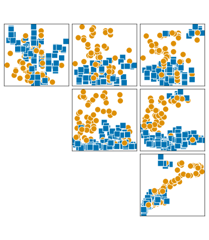

<figcaption>図3: (a) 合成データセット。2 つの異なる SCM から生成されたサンプルを実際のデータセットと比較し、事前分布がモデル化できるデータセット空間の多様性を示す。</figcaption>
</figure>

### 4.4 BNN Prior（BNN 事前分布）

我々はまた、先行研究で導入された BNN 事前分布も考慮し、PFN 訓練時にどちらかの事前分布から等確率でデータセットをランダムにサンプリングすることで、上述の SCM 事前分布と混合する。

BNN 事前分布からデータセットをサンプリングするには、まず NN アーキテクチャとその重みをサンプリングする。

次に、生成すべきデータセットの各データ点について、入力 $x$ をサンプリングし、それをサンプリングされたノイズ変数とともに BNN に通し、その出力 $y$ をターゲットとして用いる（図 2(a) 参照）。

付録 B.4 における、この BNN 事前分布と、SCM ベースおよび BNN ベースの両事前分布の最終的な混合との実験的アブレーション（ablation, 構成要素を取り除いて寄与を測る実験）は、我々の新しい SCM ベース事前分布の強さを示している。

### 4.5 Multi-class Prediction（多クラス予測）

ここまで述べた事前分布はスカラーのラベルを返す。

不均衡な多クラスデータセットの合成分類ラベルを生成するには、スカラーラベル $\hat{y}$ を離散的なクラスラベル $y$ に変換する必要がある。

我々はこれを、$\hat{y}$ の値をクラスラベルに対応する区間に分割することで行う。

1. クラス数 $N_{c}\sim p(N_{c})$ をサンプリングする。ここで $p(N_{c})$ は整数上の分布である。
2. 連続ターゲット $\hat{y}$ の集合から $N_{c}-1$ 個のクラス境界 $B_{i}$ をランダムにサンプリングする。
3. 各スカラーラベル $\hat{y}_{i}$ を、それを含む一意な区間のインデックスに写像する。$y_{i}\leftarrow\sum_{j}[B_{j}<\hat{y}_{i}]$、ここで $[\cdot]$ は指示関数である。

例えば、$N_{c}=3$ クラスで境界 $B_{c}=\{-0.1,0.5\}$ は 3 つの区間 $\{(-\infty,-0.1],(-0.1,0.5],(0.5,\infty)\}$ を定義する。

任意の $\hat{y}_{i}$ は、$-0.1$ より小さければラベル 0 に、$(-0.1,0.5]$ にあれば 1 に、それ以外なら 2 に写像される。

最後に、クラスのラベルをシャッフルする。すなわち、範囲に関するクラスラベルの順序を取り除く。

## 5 Experiments（実験）

<figure>

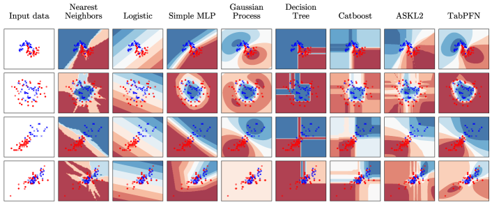

<figcaption>図4: scikit-learn で生成したトイデータセット上の決定境界。</figcaption>
</figure>

### 5.1 Evaluation on Toy Problems（トイ問題での評価）

我々はまず、図 4 で TabPFN を（ハイパーパラメータ調整なしの）標準的な分類器と定性的に比較する。

最上段はノイズを加えた moons データセットを示す。TabPFN はサンプル間の決定境界を正確にモデル化し、また、ガウス過程と同様に、観測サンプルから遠い点では不確実性が大きい。

第 2 段はノイズを加えた circles データセットを示す。TabPFN は円の形状を正確にモデル化し、サンプルが混在する領域の外側ではどこでも高い確信度を持つ。

第 3 段は iris データセットの 2 クラスと 2 特徴量を、第 4 段は wine データセットの 2 クラスと 2 特徴量を示す（いずれも scikit-learn）。どちらの場合も、TabPFN は直感的で較正のよい（well-calibrated）予測を行う。

### 5.2 Evaluation on Tabular ML Tasks（表形式 ML タスクでの評価）

次に、実世界の分類タスクに対する我々の手法の経験的分析に移る。

我々は表形式分類のための最先端の ML および AutoML 手法と我々の手法を比較する。

**データセット**　テストデータセットとして、最大 2,000 サンプル（訓練分割は 1,000）、100 特徴量、10 クラスを含む、厳選されたオープンソースの OpenML-CC18 ベンチマークスイートのすべてのデータセットを用いた。

得られた集合は 30 個のデータセットから成る。

我々はこれらのデータセットを、数値的特徴量のみで欠損値のない 18 個のデータセットと、カテゴリ特徴量および／または欠損値を含む他の 12 個のデータセットに分割する。

本文では、図 5 と表 1 において、TabPFN の事前分布の開発で焦点を当てた、欠損値のない数値データセットの場合に分析を限定する。

30 個すべてのデータセットの結果は付録 B.1 で与えられ、TabPFN は依然として強い集計性能を示すが、カテゴリ特徴量および／または欠損値を持つデータセットでの一般的に劣る性能のため、純粋に数値的な場合ほどには強くない。

我々が小規模データセットに焦点を当てるのは、(1) 小規模データセットは実世界の応用でしばしば遭遇すること、(2) 既存の DL 手法はこの領域で最も制限されること、(3) より大きなデータセットでは TabPFN の訓練と評価が著しく高コストになること（付録 A で詳述する制限）による。

**ベースライン**　我々は 5 つの標準的な ML 手法と、表形式データのための 2 つの最先端 AutoML システムと比較する。

ML モデルとしては、2 つの単純で高速なベースライン、k 近傍法（K-nearest-neighbors, KNN）とロジスティック回帰（Logistic Regression, LogReg）を考慮した。

さらに、3 つの人気のある木ベースのブースティング手法、XGBoost、LightGBM、CatBoost を考慮した。

各 ML モデルについて、与えられた予算が尽きるか 10,000 構成が評価されるまで、ランダムに抽出したハイパーパラメータ構成を評価するために 5 分割交差検証を用いた（探索空間については付録 F.2 参照）。

その後、最も性能のよいハイパーパラメータ構成（最大 ROC AUC OVO）を選び、訓練集合全体で再当てはめした。

必要に応じて、欠損値を平均で補完し、カテゴリ入力を one-hot またはオーディナルエンコードし、特徴量を正規化し、カテゴリ特徴量の指標を渡した。

より複雑だが強力なベースラインとして、2 つの最先端 AutoML システムを選んだ。AutoGluon（ニューラルネットワークと木ベースモデルを含む ML モデルをスタックドアンサンブルに統合する）と、Auto-sklearn 2.0（ベイズ最適化を用い、評価したモデルを重み付きアンサンブルに統合する）である。

先行研究が、DL ベースラインは小〜中規模の表形式データ（< 10,000 サンプル）に対して GBDT や AutoML 手法の性能を上回ったり同等になったりしない（一方でより大きなデータセットでは GBDT 性能に匹敵する）ことを見出していることに注意する。

さらに、TabNet、SAINT、Regularization Cocktails、Non-parametric Transformers といった DL 手法は、はるかに大きなデータセットで評価され、しばしばカスタムのパラメータ調整と前処理を用いる。

それでも我々は 2 つの著名な DL 手法、Regularization Cocktails と SAINT を評価する。

<figure>

<figcaption>図5: 手法の訓練と調整に許される時間の関数としての ROC AUC（OpenML-CC18 ベンチマークの 18 個の数値データセット上）。増加する予算に対して、5 分割にわたる平均、平均勝利数とランク、95% 信頼区間を報告する。赤い星は 32 順列の TabPFN の性能を示す（GPU 上で 0.62 秒を要する）。さらなる結果は表 1 で報告する。</figcaption>
</figure>

**評価プロトコル**　各データセットと手法について、それぞれ異なるランダムシードと訓練・テスト分割（訓練 50%・テスト 50%。所与のシードに対しすべての手法が同じ分割を使用）で 5 回の反復を評価した。

データセットにわたる結果を集計するため、ROC AUC（多クラス分類には一対一（OVO））の平均、ランク、勝利数を 95% 信頼区間とともに報告し、$\{30,60,300,900,3600\}$ 秒の予算でベースラインの性能と比較する。

我々の TabPFN は第 3 節で述べたようにアンサンブルのため 32 個のデータ順列を用いる。順列なしの TabPFN も評価し、これを表 1 で「TabPFN（n.e.）」と表記する。

表1: 各データ分割あたり要求時間 60 分での、OpenML-CC18 の 18 個の数値データセットに対する結果。$\pm$ 値は指標の標準偏差を示す。利用可能な場合、すべてのベースラインは ROC AUC を最適化する。TabPFN n.e. はアンサンブルなしの我々の手法の高速版であり、TabPFN + AutoGluon は TabPFN と AutoGluon のアンサンブルである。推論時間は表 2 に別途示す。

**結果**　欠損値のない 18 個の純粋な数値データセットの結果を、図 5 と表 1 で詳述する。

図 5 は、TabPFN が他のすべての手法よりも劇的に優れた精度と訓練速度のトレードオフを達成することを示す。すなわち、1 GPU 上で 1 秒未満で予測を行い、これは最良の競合手法（AutoML システム）が 1 時間訓練した後の性能に並び、調整された GBDT 手法の性能を凌駕する。

当然ながら、単純なベースライン（LogReg、KNN）は小さい予算でも既に結果を出すが、全体としては最も性能が悪い。

GBDT（XGBoost、CatBoost、LightGBM）はより良い性能を示すが、それでも TabPFN と最先端の AutoML システム（Auto-sklearn 2.0、AutoGluon）には及ばない。

TabPFN は、同等の性能を持つ手法よりもはるかに高速である。以下では、訓練と予測（および該当する場合は調整）の合計時間を比較する。

TabPFN（n.e.）は、1 データセットの予測に CPU で平均 1.30 秒、GPU で 0.05 秒を要し、5 分時点での最強のベースラインと同等の性能を示す。したがって CPU で $230\times$、GPU で $5\,700\times$ の高速化をもたらす。

我々は各手法の計算的な開発コストを無視する。その理由は付録 F.5 を参照されたい。

我々は、論じている結果がデータセットにわたる「集計」結果であること、そして TabPFN を含むどの分類手法もすべての個々のデータセットで最良の性能を示すわけではないことを強調したい。

実際、デフォルトのベースラインにさえ TabPFN が劣るデータセットは存在する。

一般に、TabPFN はカテゴリ特徴量や欠損値が存在する場合に弱い。

付録 B.1 は、カテゴリ特徴量および／または欠損値を持つ 12 個を含む、OpenML-CC18 ベンチマークの 30 個すべてのテストデータセットの結果を提示する。

付録 B.5 は、OpenML からの追加の 149 個の検証データセットを含む、さまざまな種類のデータセットに対するより詳細な結果概観を提示し、純粋な数値データセットに対する TabPFN の強い性能を確認する。

我々はまた、179 個のデータセット（30 個のテストデータセットと 149 個の検証データセット）のそれぞれについてデータセット単位の結果を示す。これらは、TabPFN が一般に数値特徴量を持つデータセットでより良い性能を示す一方で、TabPFN がベースラインより良い性能を示さない純粋な数値データセットもいくつか存在すること、また TabPFN が明確に最良の性能を示すカテゴリデータセットも存在することを実証する。

**OpenML-AutoML ベンチマーク**　さらに、外部検証された性能値が利用可能な、OpenML-AutoML ベンチマークの小規模（訓練サンプル $\leq$ 1,000、特徴量 100、クラス 10）データセットで TabPFN を評価した。

OpenML-AutoML ベンチマークが提供する設定、すなわち指標、公式評価スクリプト、より広範な AutoML ベースラインに対する事前公開済み評価を用いる。

単一 CPU 上でデータセットあたり平均わずか 4.4 秒（ベースラインの 60 分に対して）を用いて、TabPFN は平均交差エントロピー、精度、OpenML 指標のすべてにおいてすべてのベースラインを上回った。

詳細な結果は付録 B.2 で提供する。

**TabPFN の予測の詳細分析**　我々はモデルの予測をさまざまな方法で評価し、手法の帰納バイアスなどの追加的な洞察を提供する（付録 B.3 参照）。

我々は、TabPFN が単純で因果的な説明に偏った予測を行うことを学習する（B.3.1 で詳述）一方、GBDT 手法はこの帰納バイアスを共有しないことを確認する。

我々はまた、付録 B.3.2 と B.3.3 で、我々の手法の特徴量回転に対する不変性と無情報な特徴量に対するロバスト性を評価する。

図 6 では、データセットがカテゴリ特徴量や欠損値を含まない場合に、TabPFN がベースラインと比べて特に強いことを観察する。

**アンサンブル**　我々は、TabPFN がベースラインとは異なるデータセットで最も良い性能を示すこと、すなわち TabPFN と強いベースラインとの間のデータセット単位の正規化 ROC AUC スコアの相関が、強いベースライン同士の相関よりも低いことを観察する（付録の図 11 に可視化）。

これはおそらく、我々のアプローチの新しい帰納バイアスによるものであり、それが異なる予測をもたらす。

考慮する手法が相関の少ない誤りをするときにアンサンブル予測はより効果的であり、これがより多様な戦略の使用を促し、TabPFN をベースライン手法とアンサンブルする理想的な候補にする。

また、TabPFN は非常に高速に評価されるため、予測はベースラインの長い実行時間に比べてほぼ無料である。

そのアンサンブルの可能性を示すため、表 1 に「TabPFN + AutoGluon」のエントリを含める。これは TabPFN と AutoGluon の予測を平均することで生成され、他のすべての手法を強く上回る。

**モデルの汎化**　PFN アーキテクチャは任意の長さのデータセットを入力として受け入れる。

しかし、合成的な事前当てはめの段階でモデルを訓練する際、事前当てはめがより大きなデータセットで高コストになるため、合成データを最大サイズ 1,024 に制限した。

それでも我々は疑問に思った。TabPFN は、訓練時に決して見られなかったより大きな訓練集合サイズに汎化するだろうか。

これを検証するため、OpenML-AutoML ベンチマークからの 18 個のデータセット（表 11 参照）の集まりを用い、それぞれから 10,000 サンプルを選んだ。

5 つのランダムなデータ分割と 5,000 個のテストサンプルを用いて、最大 5,000 個の訓練サンプルで TabPFN を評価した。

驚くべきことに、付録 B.1 の図 10 に示すように、我々のモデルは訓練時に見られたサンプルサイズを超えて汎化する。

## 6 Conclusions & Future Work（結論と今後の課題）

我々は、単一の Transformer である TabPFN が、表形式データに対する完全な AutoML フレームワークの仕事を行うように訓練でき、最良の AutoML フレームワークが 5〜60 分で達成する性能と競合する予測を 0.4 秒で出せることを示した。

これは AutoML の計算コストを大幅に削減し、手頃で環境に優しい（グリーンな）AutoML を可能にする。

TabPFN にはなお重要な制限がある。基底の Transformer アーキテクチャは付録 A で詳述するように小規模データセットにしかスケールしない。我々の評価は、訓練サンプル最大 1,000、欠損値のない純粋な数値特徴量最大 100、クラス最大 10 の分類データセットに焦点を当てており、これが (1) 大規模データセットへのスケールアップに関する研究を動機づける。

TabPFN の帰納バイアスに関する我々の詳細分析（付録 B.3 参照）は、(2) カテゴリ特徴量の改善された取り扱い、(3) 欠損値、(4) 重要でない特徴量に対するロバスト性、への拡張を示唆する。

また我々の研究は、(5) TabPFN の既存 AutoML フレームワークへの統合、(6) より多くの時間が与えられたときに改善を続けるためのアンサンブル、(7) データセット依存の事前分布の選択、(8) 非表形式データへの一般化、(9) 回帰タスク、ならびに信頼できる AI の諸次元（例えば (10) 分布外ロバスト性、(11) アルゴリズム的公平性、(12) 敵対的例へのロバスト性、(13) 説明可能性）に関する TabPFN の研究、といった多数のわくわくする後続研究を動機づける。

TabPFN のほぼ即時の最先端予測は、(14) 新しい探索的データ分析手法、(15) 新しい特徴量エンジニアリング手法、(16) 新しい能動学習手法も生み出す可能性が高い。

最後に、我々の因果推論における進展は、(17) SCM の分布を考慮した介入と反事実の効果の近似に関する後続研究を正当化する。

## 7 Ethics Statements（倫理声明）

本研究の広範な社会的影響について、予見可能な強く否定的な影響は見当たらない。

しかし、本論文は学習アルゴリズムのカーボンフットプリントとアクセス可能性に肯定的な影響を与え得る。

機械学習研究に必要な計算は数か月ごとに倍増しており、大きなカーボンフットプリントをもたらしている。

さらに、計算の金銭的コストは、研究者や学生がこれらの手法を適用することを困難にし得る。

TabPFN が示す計算時間の削減は、CO2 排出量とコストの削減につながり、大規模計算へのアクセスを持たない人々にも利用可能にする。

TabPFN はリアルタイムで動作する新しい分類器を構築する高い可搬性と利便性を提供するため、機械学習の浸透をさらに高める可能性が高い。

これは社会に多くの肯定的な効果（より良い個別化医療、顧客満足度の向上、プロセスの効率化など）をもたらし得るが、計算的持続可能性以外の信頼できる AI の多くの次元（アルゴリズム的公平性、敵対的例へのロバスト性、説明可能性、監査可能性など）の観点から TabPFN を研究・改善することも重要になる。

我々は、その因果モデルと単純性への基盤が、これらの方向に沿った研究の可能性を開くことを期待する。

## 8 Reproducibility（再現性）

**コード公開**　再現性を確保するため、我々は事前訓練済み TabPFN と実験を再現するノートブックとともにコードを [https://github.com/automl/TabPFN](https://github.com/automl/TabPFN) で公開する。

**公開ベンチマークへの適用**　本研究では、公開されているベンチマーク（OpenML-CC18 ベンチマークと OpenML-AutoML ベンチマーク）で TabPFN を評価する。これにより、データセットの選択が我々の手法に都合よく選ばれていないことを保証する。また、OpenML-AutoML ベンチマークについては、公式のベースライン結果を用い、このベンチマーク向けに公開された評価スクリプトを用いて我々の手法を評価する。

**データセットの利用可能性**　実験で用いたすべてのデータセットは OpenML.org で自由に利用可能であり、ダウンロード手順が提出物に含まれている。用いたデータセットのさらなる詳細は第 F.3 節に記載されている。

**オンラインリソース**　我々の scikit-learn インタフェースと対話できる Colab ノートブックを作成した。

179 個のテスト・検証データセットでの評価とプロットを容易に再現できる別の Colab も作成した。

また 2 つのデモも作成した。1 つは TabPFN の予測を実験するもの、もう 1 つは新しいデータセットでの交差検証 ROC AUC スコアを確認するものである。どちらも非力な CPU 上で動作するため、少し時間がかかることがある。

**TabPFN とベースラインの訓練手順の詳細**　すべての Transformer モデルの訓練手順で共有される詳細は付録 F に記載されている。TabPFN とベースラインの実行に用いたハイパーパラメータの概観は表 5 と表 6 に記載されている。

## Appendix A Limitations（付録 A: 制限）

本研究で用いた Transformer ベースの PFN アーキテクチャの実行時間とメモリ使用量は、入力数（すなわち渡される訓練サンプル数）に対して二次的にスケールする。

したがって、より長い系列（> 100,000）に対する推論は現在のコンシューマ向け GPU では難しい。

この問題に取り組み、入力数に対して線形にスケールしながら同様の性能を報告する手法が増えている。

これらの手法は PFN アーキテクチャに、したがって TabPFN に統合できる。

さらに、実験では第 5 節で述べたように特徴量数を 100、クラス数を 10 に制限する。

この選択は柔軟だが、我々が当てはめた特定の TabPFN はこれらの上限を超えるデータセットでは動作できない。

我々はまた、TabPFN の開発を欠損値のない純粋な数値データセットに焦点を当てており、カテゴリ特徴量および／または欠損値を持つデータセットにも適用「できる」が、その性能は一般に劣る。

将来のバージョンの TabPFN では、修正したアーキテクチャと事前分布によってこの問題に取り組むことを期待する。

最後に、我々は事前分布において多数の無情報な特徴量の存在を考慮しておらず、そのような特徴量が追加されると性能が低下する。将来のバージョンの TabPFN でこの問題に対処することを期待する。

ベースラインモデル（ガウス過程を除く）が当てはめと予測を別々のステップで行うのに対し、TabPFN は両方を同時に行う。

したがって、純粋な推論時間の観点では、ベースラインモデルはしばしば TabPFN より高速である（表 2 参照）。

## Appendix B Additional Results（付録 B: 追加の結果）

### B.1 Detailed Tabular Results（詳細な表形式の結果）

<figure>


<figcaption>図6: データセットの特性で分けた、OpenML-CC18 ベンチマークのデータセット上の正規化 ROC AUC 性能。各プロットで、データセットを 2 グループに分割する。左: オレンジのバーはカテゴリ特徴量を持つデータセットの性能を示す。中央: オレンジのバーは欠損値を含むデータセットを示す。右: オレンジのバーは多クラスデータセットを、他は二値を示す。</figcaption>
</figure>

図 6 では、評価するデータセットの種類が、ベースラインと比較して TabPFN の性能にどう影響するかを探る。

我々は、カテゴリ特徴量が存在しない場合に TabPFN がはるかに良い性能を示すことを見出す。

また、データに欠損値が存在しない場合に TabPFN がより良い性能を示すことも見出す。

これは、カテゴリデータと欠損データにより特化させるために、将来の研究で事前分布を拡張することを正当化する。

我々の手法は、二値問題と多クラス問題で同程度によく機能するように見える。

本文の第 5.2 節の結果に加えて、十分小さいがカテゴリ特徴量と欠損値を含み得る OpenML-CC18 の 30 個すべてのデータセットの詳細な結果を報告する。

時間に対する性能を図 7 に、1 時間の時間制限での広範な性能値とデータセット単位の結果を表 2 に示す。

<figure>




<figcaption>図7: カテゴリ特徴量と欠損値を持つデータセットを含む、30 個の小規模 OpenML-CC18 上の時間に対する ROC AUC 性能。増加する訓練・調整時間予算に対して、5 分割にわたる平均、平均勝利数とランク、95% 信頼区間を報告する（ラベルなしの目盛: 1 分、15 分）。赤い星は 32 データ順列の TabPFN の性能を示す（GPU 上で 0.62 秒）。60 分予算での詳細な結果は表 1 で報告する。</figcaption>
</figure>

表2: カテゴリ特徴量と欠損値を持つデータセットを含む、30 個の小規模 OpenML-CC18 に対する、データセットおよび分割あたり要求時間 60 分での ROC AUC OVO 結果。利用可能な場合、すべてのベースラインは ROC AUC 最適化を目的として与えられ、他は CE を最適化する。各手法は合計 150 時間の時間予算を得たが、すべての手法が全予算を使ったわけではない。TabPFN の時間は GPU 上の時間を指す。TabPFN は訓練と予測を結合したステップで実行し、ハイパーパラメータ調整を一切行わないため、単一の集計時間のみが示される。

### B.2 Results on the OpenML-AutoML Benchmark（OpenML-AutoML ベンチマークでの結果）

表3: 5 個の小規模データセット（$\leq$ 1,111 例、100 特徴量、10 クラス）に対する、データセットおよび分割あたり要求時間 60 分での ROC AUC OVO 結果。利用可能な場合、すべてのベースラインは ROC AUC 最適化を目的として与えられ、他は CE を最適化する。このベンチマークでの評価は、テスト集合への過適合を緩和するため、以前に公開した TabPFN を用いて行った。平均 OpenML 指標は、交差エントロピーと ROC AUC の混合にわたる平均化が問題含みであるため表には示さない（ただし TabPFN は平均でも最も強かった）。

**表3（数値結果, 原表より抜粋）**: 列は AutoGluon / ASKL / ASKL2.0 / TunedRandomForest / FLAML / TPOT / TabPFN。

| データセット | AutoGluon | ASKL | ASKL2.0 | TunedRF | FLAML | TPOT | TabPFN |
| --- | --- | --- | --- | --- | --- | --- | --- |
| vehicle | -0.3084 | -0.3816 | -0.3412 | -0.4849 | -0.4286 | -0.3433 | -0.2955 |
| eucalyptus | -0.6905 | -0.7255 | -0.6967 | -0.7209 | -0.7433 | -0.7123 | -0.665 |
| blood-transfusion-service-center | 0.7532 | 0.749 | 0.7557 | 0.6879 | 0.7332 | 0.7359 | 0.7593 |
| Australian | 0.941 | 0.9315 | 0.9411 | 0.9394 | 0.9356 | 0.9382 | 0.9395 |
| credit-g | 0.7977 | 0.7891 | 0.7984 | 0.8017 | 0.7838 | 0.7821 | 0.7989 |
| Wins OpenML Metric | 0 | 0 | 0 | 1 | 0 | 0 | 3 |
| Wins Acc. | 1 | 0 | 0 | 1 | 0 | 1 | 2 |
| Wins CE | 3 | 0 | 0 | 0 | 0 | 0 | 2 |
| 平均ランク OpenML | 2.4 | 5.4 | 2.6 | 4.8 | 6.2 | 5 | 1.6 |
| 平均ランク Acc. | 2.4 | 5.7 | 4.7 | 4.4 | 5.7 | 3 | 2.1 |
| 平均ランク CE | 1.4 | 5.8 | 4.4 | 5.4 | 4.4 | 4.7 | 1.9 |
| 平均 Acc. | 0.793 | 0.763 | 0.775 | 0.763 | 0.761 | 0.784 | 0.794 |
| 平均 CE | 0.454 | 0.537 | 0.502 | 0.545 | 0.499 | 0.73 | 0.449 |
| 平均時間 (s) | 3182 | 3611 | 3609 | 2877 | 3600 | 3400 | 4.374 (CPU) |

我々は、OpenML-AutoML ベンチマークの公式ベンチマーキングスクリプト、データセット、分割、ベースライン結果を用いて TabPFN を評価する。

5 個のデータセットの全リストは表 10 に記載されている。

これらのデータセットは我々の評価データセットと互いに素ではないことに注意する。実際、これらのうち 3 個（"credit-g", "vehicle", "blood-transfusion-service-center"）は OpenML-CC18 ベンチマークからの評価データセットにも含まれており、1 個のデータセット（"Australian"）は 150 個のメタ検証データセットのリストに含まれていた。

しかし、別のベンチマーキングスクリプトの集合と、以前に公開された訓練・テスト分割およびベースライン結果を用いた評価は、次のことを確認するのに役立つ。(1) 我々のベースラインはよく調整されており、広範な OpenML-AutoML ベンチマークの別の手法に上回られていない。(2) TabPFN の実行時間は、OpenML-AutoML ベンチマークが提供する制御された環境で再現可能である。(3) TabPFN はデータ分割や評価指標に過適合していない。

我々は表 3 の実験では 5 反復の 50-50 訓練・テスト分割を用いたが、OpenML-AutoML ベンチマークは 10 分割交差検証を用い、これは 10 反復の 90-10 分割をもたらす。

したがって OpenML-AutoML ベンチマークでは、すべての手法が OpenML-CC18 ベンチマークでの実験よりも多くの訓練サンプルを用い、これがわずかに強い結果につながる。

### B.3 In-depth analysis of model biases（モデルバイアスの詳細分析）

先行研究は、木ベースおよび深層学習モデルの帰納バイアスを経験的に調査している。

彼らは表形式特化モデルの開発における 3 つの課題を特定している。モデルは (1) 不規則な関数を当てはめられること、(2) 無情報な特徴量にロバストであること、(3) データの向き（orientation）を保つこと、が必要である。

我々は以下の節でこの分析を実施し拡張する。

我々は分析において 3 つのモデル型を考慮する。TabPFN、GBDT（LightGBM）、NN（隠れ次元 100 の標準的な Sklearn 多層パーセプトロン）である。

我々はこれらのモデル型間の絶対的な比較を行おうとはしない（それにはベースラインの調整が必要となる）。以下の実験でそれらの定性的な挙動を調査することのみを目指す。

#### B.3.1 Fitting irregular patterns（不規則なパターンの当てはめ）

<figure>

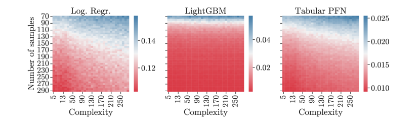

<figcaption>図8: ランダムな SCM から生成した合成データ上の平均訓練集合不確実性（交差エントロピー損失）。訓練サンプル数を y 軸に、生成データの複雑さ（データ生成グラフの隠れユニット数）を x 軸に変化させる。交差エントロピー平均は、各点について 100 サンプルと 1,000 SCM にわたって平均される。</figcaption>
</figure>

我々は、GBDT 手法はターゲットにおける非滑らかで不規則なパターンを学習する傾向があり、一方 MLP は滑らかで低周波な関数を学習すると考える（図 4 参照）。

TabPFN は、図 4 が示唆するように、かなり滑らかなターゲット関数を学習する。

これは、単純な SCM を説明として選好し、したがってより不規則でない決定面を選好する、我々のモデルの事前分布によるものである。

ただし、多くの訓練サンプルが提供される場合、TabPFN もより複雑な関数を当てはめることに注意する。

複雑さと訓練サンプル数の間のトレードオフを図 8 で探る。

ここでは、ランダムな SCM から生成した合成データ上の訓練集合交差エントロピー損失を評価する。

訓練サンプル数と生成データの複雑さ（データ生成グラフの隠れユニット数）を変化させる。

#### B.3.2 Robustness to uninformative features（無情報な特徴量に対するロバスト性）

<figure>


<figcaption>図9: 左: 特徴量空間にランダムな回転を適用したときの LightGBM、MLP、TabPFN の性能。LightGBM は回転が適用されると最も予測精度を失い、MLP は影響を受けず、TabPFN はわずかに性能が落ちるのみである。中央: ランダムフォレストから得た重要度ランクの逆順に従って反復的に特徴量を除去すると、MLP は当初より良い性能を示し LightGBM の性能を追い越す。TabPFN は予測精度を失い、ほとんどの特徴量が除去されるとベースラインと同様の性能になる。右: 無情報な特徴量の追加は MLP と TabPFN の性能低下を招くが、LightGBM は比較的一定を保つ。</figcaption>
</figure>

表形式データセットは大きな割合の無情報な特徴量を含む。

無情報な特徴量に対するロバスト性を評価するため、データに次第に大きな割合の無情報な特徴量を加え、結果を図 9 に示す。

無情報な特徴量は、既存の特徴量をコピーし、その値をサンプル間でランダムにシャッフルすることで生成される。

我々は、TabPFN と MLP が LightGBM よりも無情報な特徴量に対するロバスト性が低いことを見出す。

TabPFN は、用いる事前分布により多くの無情報な特徴量を含めることで適応できるであろう。

2 つ目の実験では、次第に大きな割合の特徴量を落とす。

我々は特徴量重要度（ランダムフォレストでランク付け）に従ってこれらの特徴量を落とし、まず最も情報の少ない特徴量を除去する。

結果を図 9（中央）に示し、TabPFN と GBDT の分類精度は最大 30% の特徴量を除去してもあまり影響を受けないが、絶えず低下することを観察する。

無情報な特徴量に対するロバスト性が低い MLP は、最も情報の少ない 20% の特徴量が除去されるとむしろ良い性能を示す。

我々は OpenML CC-18 ベンチマークの検証タスクを用い、分析を簡単にするため、多クラスデータセットと 50 を超える特徴量を含むデータセットを落とす（50 を超える特徴量を持つデータセットに 100% の特徴量を追加すると 100 を超える特徴量になり、TabPFN が扱えないため）。

#### B.3.3 Invariance to feature rotation（特徴量回転に対する不変性）

表形式データセットの各特徴量は、年齢や性別といった列名で表されるように、通常それぞれ個別に意味を持つ。

学習アルゴリズムは、訓練集合とテスト集合の両方の特徴量に回転（ユニタリ）行列が適用されたとき、すなわち特徴量が混合されたときに変化しない場合、回転不変（rotationally invariant）であるという。

特徴量回転下で無情報な特徴量を除去するには、アルゴリズムはまず特徴量の元の向きを復元し、次に情報のあるものを選択しなければならない。

回転不変なアルゴリズムはデータの向きを捨てるため、内部で元の向きを復元しなければならない。

したがって先行研究は、任意の回転不変な学習アルゴリズムが、無関係な特徴量の数に対して少なくとも線形に増大する最悪ケースのサンプル複雑度を持つことを示している。

図 9（左）は、データセットをランダムに回転させたときのテスト ROC AUC の変化を示し、MLP のみが回転不変であることを確認する。

GBDT 手法は回転に非常に敏感であり、一方 TabPFN は敏感さが低いが、それでも回転が適用されない場合により良い性能を示す。

理論的結果と経験的結果は、無情報な特徴量が追加されたときの TabPFN の性能低下が、その相対的な回転不変性に関連していることを示唆する。

事前分布をより多くの無情報な特徴量を含むように調整することで、これらの結果に対処できるであろう。

我々は OpenML CC-18 ベンチマークの検証タスクから数値特徴量のみのデータセットを用いる。なぜならカテゴリデータセットの回転は問題含みであり、一部の GBDT 分類器がカテゴリ変数を特別に扱う（例えばカテゴリごとに埋め込みを生成する）からである。

### B.4 Ablation on the selection of prior models（事前モデルの選択に関するアブレーション）

我々は、BNN のみ、SCM のみ、両者の混合に基づく事前分布について、事前当てはめ中のサンプリング尤度を制御するハイパーパラメータを用いてアブレーション実験を行う。

各事前分布の PFN は最終実験よりも少ない計算量で当てはめられるため、それらのスコアは一般にわずかに劣る。

BNN 事前分布は、先行研究で用いられたものと類似しており、SCM に基づく事前分布と比較して性能が低下する。

さらに、BNN と SCM の事前分布を混合しても、純粋な SCM 事前分布と比較して、我々のテスト集合では大きな差を生まないように見える。

**表4（数値結果）**: 最終性能への事前分布の混合の影響の評価。我々の最終モデルは SCM + BNN 設定で訓練された（事前分布の詳細は第 4 節参照）。

| | BNN | SCM | SCM + BNN |
| --- | --- | --- | --- |
| 平均 CE | 0.811 ± 0.009 | 0.771 ± 0.006 | 0.776 ± 0.009 |
| 平均 ROC AUC | 0.865 ± 0.007 | 0.881 ± 0.002 | 0.883 ± 0.003 |

<figure>


<figcaption>図10: 訓練時に決して見られなかったデータセットサイズへの TabPFN の外挿性能。訓練時の最大サンプル数は 1024（赤い破線）。陰影はランダムなデータ分割にわたる 95% 信頼区間を示す。汎化しない手法は 1024 で頭打ちになると予想される。</figcaption>
</figure>

<figure>

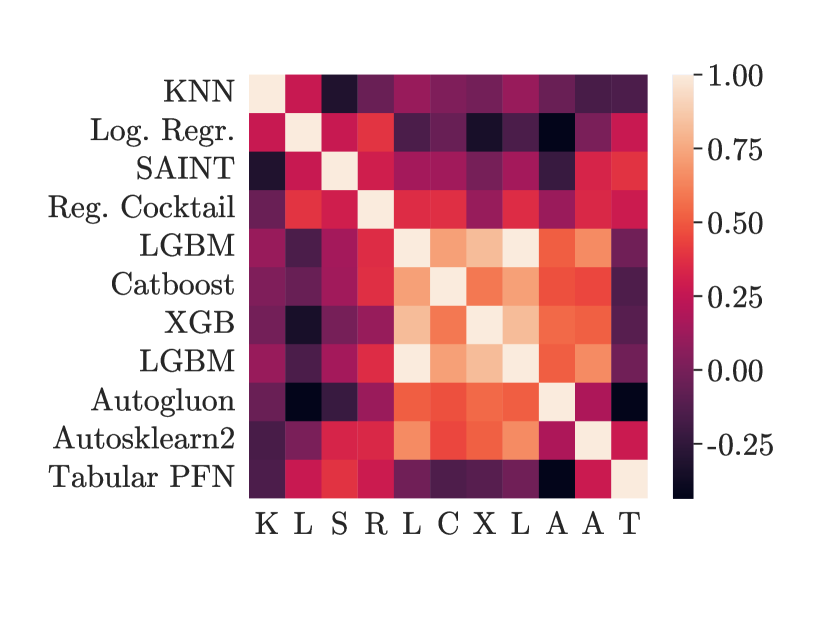

<figcaption>図11: 考慮した手法間の、データセット単位の正規化 ROC AUC 性能のスピアマン相関（すなわちデータセット単位の正規化 ROC AUC スコアの順位相関）。x 軸の順序は y 軸と同じ。TabPFN はベースラインとは異なるデータセット集合で良い性能を示す。すなわち GBDT 手法とのスピアマン相関は低く、一方 GBDT と AutoML 手法は高く相関し、したがって同じデータセットで良い性能を示す。TabPFN は DL ベースの手法（SAINT と Reg. Cocktail）とより強く相関するが、それらは絶対的な ROC AUC 性能では GBDT 手法ほど良くない。</figcaption>
</figure>

### B.5 Extended analysis on a larger benchmark of datasets（より大きなデータセットベンチマークでの拡張分析）

ここで我々は、結果の一般性を評価し、その強みと弱みをよりよく理解するため、追加の 149 個の検証データセット（表 8 に記載）の分析を含む拡張ベンチマークを提供する。

ここではデフォルトのランダムフォレスト（RF）、サポートベクターマシン（SVM）、デフォルトの XGBoost などとの比較も、1 時間後の調整版とともに含める。

この評価は 5 分割を用い、付録 F で述べたのと同じ実験設定に従った。

<figure>

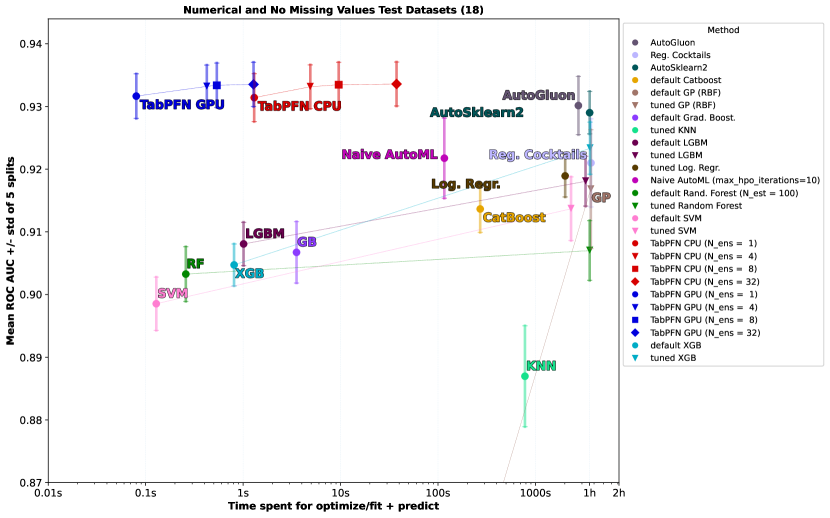

<figcaption>図12: OpenML-CC18 ベンチマークでの ROC AUC 比較。ベースラインは 1 時間、または 10000 構成が尽きるまで（Log. Reg と KNN）調整された。</figcaption>
</figure>

<figure>

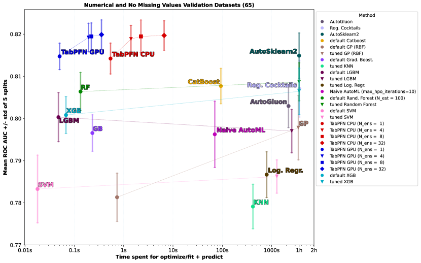

<figcaption>図13: 149 個の検証データセット（表 8 参照）での ROC AUC 比較。ベースラインは 1 時間、または 10,000 構成が尽きるまで（Log. Reg と KNN）調整された。</figcaption>
</figure>

図 12 は我々の 30 個のテストデータセット（本文で焦点を当てた欠損値のない 18 個の純粋な数値データセットと、残りの 12 個に分割）の結果を示し、図 13 は 149 個の検証データセット（再び欠損値のない数値データセットと残りに分割）の結果を示す。

これらの図は、欠損値のない純粋な数値データセットにおいて、TabPFN が ROC と費やした時間のトレードオフの観点で、データセットにわたる集計結果において他のすべての手法をパレート支配することを実証する。

カテゴリデータセットと欠損値を持つデータセットについては、なお良い性能を示すが、我々が標的とした欠損値のない数値の場合ほどには良くない。

我々はまた統計的検定を用いて性能を評価する。

新しい分類器を評価する際、1 つのデータセットでの性能は 1 つのデータ点にすぎないことに注意する。

統計的検定を適用するには、データセットにわたる分析を行う必要がある。

このための標準的な方法は臨界差図（critical difference diagram）である。

我々はウィルコクソン順位検定を用い、Holm–Bonferroni 法を用いて多重検定を補正する。

臨界差図には有意水準 $\alpha=0.05$ を用いる。

図 14 はこれらの統計的検定を行い、2 つのレジーム（最大 30 秒を要する高速実行と、最大 1 時間を要する調整済み実行）で手法を比較する。

<figure>

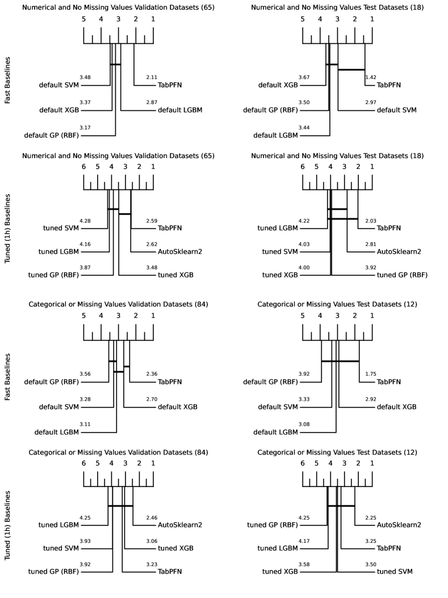

<figcaption>図14: 平均ランクに関する臨界差図（critical difference plot）。ウィルコクソン有意性分析を伴う。テスト集合（OpenML-CC18）と検証集合の両方について、欠損値のない純粋な数値データセットの部分集合と残りに分けて示す。i) 高速ベースライン（平均 30 秒未満で調整・訓練・予測を終える）と ii) 1 時間予算の調整済みベースラインの 2 集合と比較する。高速レジームの欠損値のない数値データセットでは、TabPFN は他のすべての手法を統計的に有意に上回る。</figcaption>
</figure>

我々は再び、TabPFN が欠損特徴量のない純粋な数値データセットではるかに強いことに注意する。

この場合、短い実行では、他のすべてのベースラインを統計的に有意に上回る。

長い実行では、1 対 1 の比較において、AutoML フレームワークを除く他のすべての手法も統計的に有意に上回る。ただし、複数のペアワイズ検定のために適用された多重検定補正のため、これは図には見えない。

上記の分析はデータセットにわたって集計しているが、データセット間のばらつきは大きく、TabPFN は決して「すべての」データセットで最良に機能するわけではない。

すべての分類器に最悪のケースと最良のケースがあり、我々は TabPFN の強い集計性能の報告を、現バージョンがうまく機能しなかった出会った例で補完することが重要だと考える。

我々はすべてのデータセットの結果を 1 つずつ [https://github.com/automl/TabPFNResults/blob/main/individual_plots.pdf](https://github.com/automl/TabPFNResults/blob/main/individual_plots.pdf) で示す。

TabPFN にとって相対的な性能が最悪のデータセットは collins であり、結果は図 15 に示される。

他のほとんどの手法が 1.0 に近いかそれと同一の ROC AUC を得るのに対し、TabPFN は約 98% しか達成しない。

我々はこれが無情報な特徴量によって引き起こされることを見出した。これは第 B.3.2 節で TabPFN の性能に否定的な影響を与えることを既に示している。

最も重要な 5 つの特徴量だけ（ランダムフォレストが判断）で、TabPFN も精度 1.0 を達成する。

<figure>

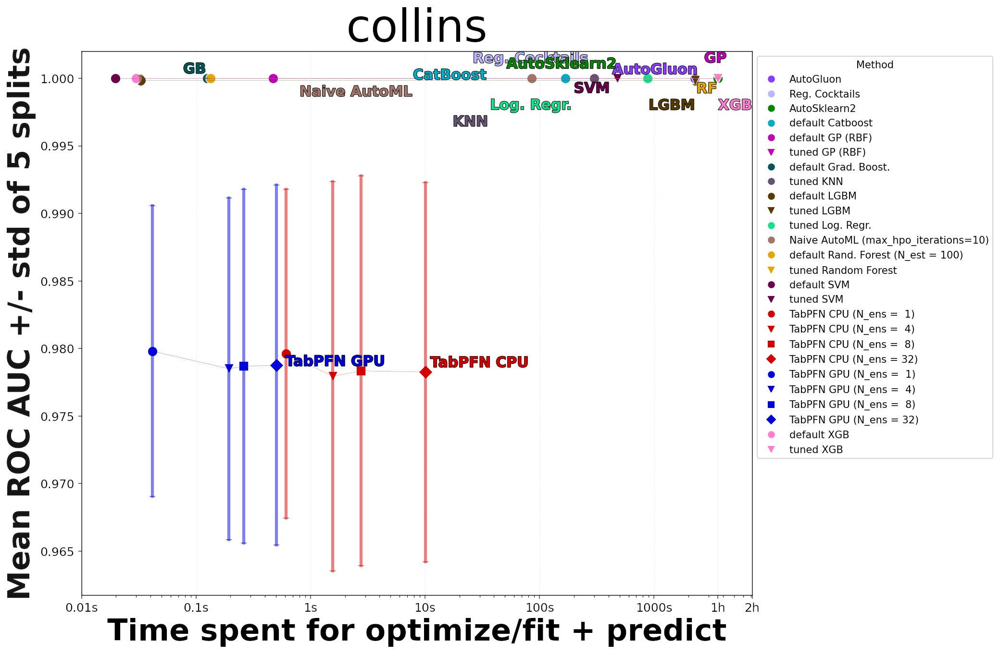

<figcaption>図15: TabPFN にとって最悪の結果: collins、無情報な特徴量による。TabPFN の作成時に無情報な特徴量に焦点を当てなかった。最も重要な 5 つの特徴量だけ（ランダムフォレストが判断）で TabPFN も精度 1.0 を達成する。</figcaption>
</figure>

TabPFN はまた、純粋にカテゴリ的なデータセット（例: sensory）や、多くの欠損値を持つデータセット（例: meta）でうまく機能しない。

<figure>

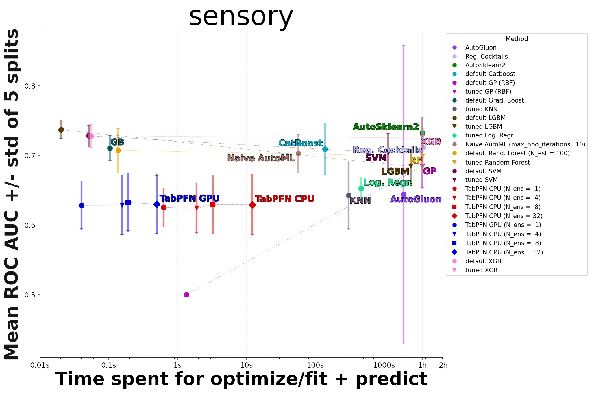

<figcaption>図16: (a) sensory, 純粋にカテゴリ的。TabPFN は純粋にカテゴリ的なデータセットや多くの欠損値を持つデータセットでうまく機能しない例。</figcaption>
</figure>

TabPFN は欠損値のない純粋な数値データセット（例: Touch2 と vehicle）で最もよく機能する（図 17 参照）。

<figure>

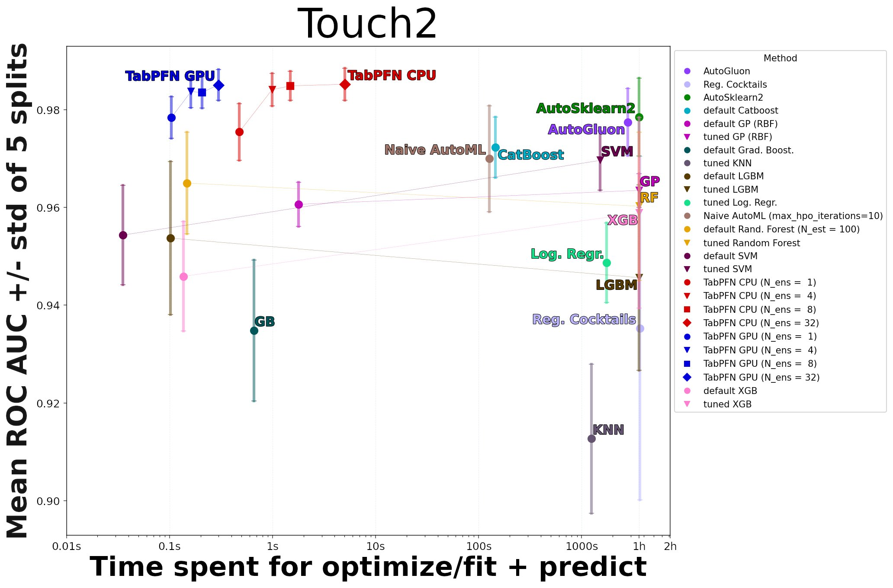

<figcaption>図17: (a) Touch-2。TabPFN は欠損値のない純粋な数値データセット（例: Touch2, vehicle）で最もよく機能する例。</figcaption>
</figure>

TabPFN は、ベースラインでハイパーパラメータ最適化が役立たない（おそらく過適合のため）いくつかのデータセット（例: Pizza-cutter1 と arsenic-female-bladder）でも依然としてよく機能する（図 18 参照）。

我々はこれを、ベイズ的であること、すなわち因果性の原理を用いた単純性事前分布によって小規模データセットで過適合しないようメタ学習したことに帰する。

<figure>

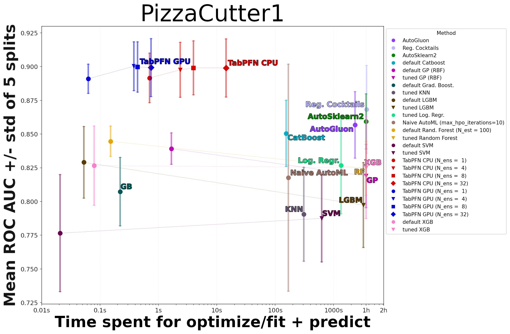

<figcaption>図18: (a) PizzaCutter1。ベースラインでハイパーパラメータ最適化が役立たない（おそらく過適合のため）データセットでも TabPFN は依然としてよく機能する例。</figcaption>
</figure>

しかし、TabPFN が欠損値のないすべての数値データセットで素晴らしく機能し、すべてのカテゴリデータセットで貧弱に機能するわけではない。

例えば、TabPFN は数値データセット pm10 で貧弱に機能し、カテゴリデータセット monks-problem2 で素晴らしく機能する（図 19 参照）。

したがって、全体像を得るには個々のデータセットを超えて見ることが必要である。

<figure>

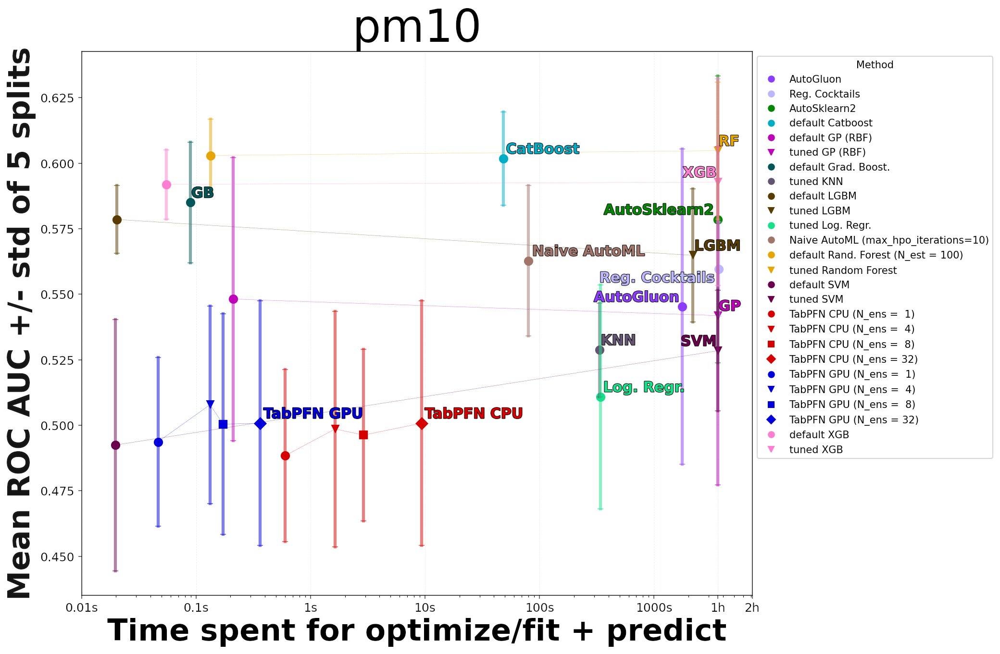

<figcaption>図19: (a) pm10, 純粋に数値的だが性能は依然として貧弱。TabPFN は数値データセット pm10 で貧弱に、カテゴリデータセット monks-problem2 で素晴らしく機能する（個々のデータセットを超えて見る必要があることを示す）。</figcaption>
</figure>

## Appendix C Details of the TabPFN Prior（付録 C: TabPFN 事前分布の詳細）

### C.1 SCM Prior（SCM 事前分布）

**サンプリングアルゴリズム**　我々は、MLP アーキテクチャから始めて重みを落とすことで効率的にサンプリングできる DAG の部分族をインスタンス化する。

すなわち、我々の事前分布から $k$ 特徴量と $n$ サンプルのデータセットをサンプリングするには、各データセットについて以下のステップを実行する。
(1) MLP 層数 $l\sim p(l)$ とノード数 $h\sim p(h)$ をサンプリングし、隠れサイズ $h$ の $l$ 層 MLP のように構造化されたグラフ $\mathcal{G}$（$Z$, $E$）をサンプリングする。
(2) 各辺 $E_{ij}$ の重みを $W_{i,j}\sim p_{w}(\cdot)$ としてサンプリングする。
(3) ランダムな辺の集合 $e\in E$ を落として、ランダムな DAG を得る。
(4) ノード $Z$ から $k$ 個の特徴量ノードの集合 $N_{x}$ とラベルノード $N_{y}$ をサンプリングする。
(5) メタ分布からノイズ分布 $p(\epsilon)\sim p(p(\epsilon))$ をサンプリングする。これにより、すべての $f_{i}$ がランダムなアフィン写像とそれに続く活性化としてインスタンス化された SCM が得られる。各 $z_{i}$ は MLP 内の疎に接続されたニューロンに対応する。

上記のパラメータを固定した上で、データセットの各メンバーについて以下のステップを実行する。
(1) ノイズ変数 $\epsilon_{i}$ をその特定の分布からサンプリングする。
(2) すべての $z\in Z$ の値を $z_{i}=a((\sum_{j\in\text{PA}_{\mathcal{G}(i)}}E_{ij}z_{j})+\epsilon_{i})$ で計算する。
(3) 特徴量ノード $N_{x}$ と出力ノード $N_{y}$ の値を取得して返す。

我々はデータセットごとに 1 つの活性化関数 $a$ を $\{Tanh,LeakyReLU,ELU,Identity\}$ からサンプリングする。

層数 $p(l)$ とノード数 $p(h)$ のサンプリングスキームは離散化されたノイズ付き対数正規分布に従うように設計され、$p(\epsilon)$ はノイズ付き対数正規分布、ドロップアウト率はベータ分布に従う。

完全な情報は表 5 に記載されている。

### C.2 Tabular Data Refinements（表形式データの精緻化）

表形式データセットは一連の特性を含む。例えば特徴量型は数値的・順序的・カテゴリ的であり得て、特徴量値は欠損し得て、疎な特徴量につながる。

我々は以下の節で述べるように、これらの特性を事前分布の設計に反映させようとする。

#### C.2.1 Preprocessing（前処理）

事前当てはめ中、入力データは平均 0・分散 1 に正規化され、実データで評価する際にも同じステップを適用する。

表形式データは、事前当てはめ中には存在しないかもしれない指数的にスケールしたデータをしばしば含むため、推論時にべきスケーリングを適用する。

したがって、実際の表形式データセットでの推論時には、特徴量は事前当てはめ中に見られたものとより密接に一致する。

我々は z 統計量、べき変換、その他すべての前処理の計算に訓練サンプルのみを用いる。

我々はこの前処理時間を、手法の推論時間を報告する際に考慮に入れる。

#### C.2.2 Correlated Features（相関した特徴量）

<figure>

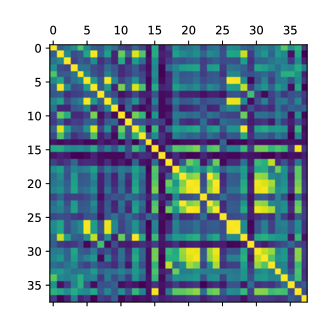

<figcaption>図20: 実世界の（"PC4 ソフトウェア欠陥予測", 左）データセットと合成（右）データセットの特徴量相関行列。明るい色ほど高い相関を示す。</figcaption>
</figure>

表形式データの特徴量相関はデータセット間で変化し、独立から高相関までの範囲に及ぶ。

これは古典的な深層学習手法に問題を引き起こす。

SCM の大きな空間を考えるとき、さまざまな程度の相関した特徴量が我々の事前分布で自然に生じる。

さらに、実世界の表形式データでは、特徴量の順序はしばしば構造化されていないが、隣接する特徴量は他よりも高く相関することが多い。

我々は順序付けられた特徴量間の相関構造を反映させるため「ブロック単位の特徴量サンプリング（Blockwise feature sampling）」を用いる。

SCM の生成方法は、これを行う方法を自然に提供する。

我々の SCM 生成の最初のステップは、ある層のノードが直前の層からのみ入力を受け取れる単方向の層状ネットワーク構造を生成することである。

したがって、同じ層内の特徴量はより高く相関する傾向がある。

我々はこれを、層状ネットワーク構造内の隣接ノードをブロック単位でサンプリングし、これらの順序付けられたブロックを特徴量の集合として用いることで活用する。

図 20 では、このように生成されたデータセットの相関（右）を可視化し、実世界データセット（左）と比較して、我々の事前分布が実データセットと類似した相関構造を生み出すことを実証する。

#### C.2.3 Generating irregular functions（不規則な関数の生成）

実世界データでは、一部の特徴量が他より一貫して重要である。

ランダムなネットワーク重み初期化はわずかに異なる特徴量重要度をもたらすが、隠れ次元が増えると入力特徴量の平均的な効果は平均へと回帰する。

我々は各入力特徴量に重みパラメータをサンプリングし、すべての出力重みをこの係数で乗じることで差異を増幅する。

事前分布では、グラフの接続をランダムに疎化する。

したがって隠れ変数と出力ノードはより少ないパラメータの影響を受け、より多くのパラメータが再び平均へ回帰するため、より不規則なパターンが生じる。

我々はまた疎化を変数のブロックにも拡張し、一部の変数群がより強く相互作用するようにする。

我々はまた、ノイズ変数のサンプリング方法も拡張する。

各ノードで同じ分布からガウスノイズをサンプリングする代わりに、まず各ノードについて別々のノイズ平均と標準偏差をサンプリングし、次にこの分布からサンプリングする。

また、実世界データで観察されるように、非一様に分布する入力データ x を生成する。すなわち、入力変数 x（ネットワークを通して伝播される）を、ガウス分布・ジップ分布・多変量分布の混合からサンプリングする。

#### C.2.4 Nan Handling（NaN の取り扱い）

我々はモデルに特別な NaN 処理を組み込んでいない。

テスト時に NaN 値をゼロで置き換える。

#### C.2.5 Categorical Features（カテゴリ特徴量）

表形式データは数値特徴量だけでなく、離散的なカテゴリ特徴量もしばしば含む。

カテゴリ特徴量は技術的には順序付けられるべきではないが、実際には順序付けられることがある。すなわち、カテゴリが何らかの基底変数を区分した度合いを表す。

我々はデータセットごとにカテゴリ特徴量のランダムな割合 $p_{cat}$（ハイパーパラメータ）を選ぶことでカテゴリ特徴量を導入する。

数値クラスラベルを離散多クラスラベルに変換するのと同様に、密な特徴量を離散的なものに変換する。

また多クラスラベルと同様に、カテゴリを再シャッフルするカテゴリ特徴量のシャッフル割合 $p_{scat}$ を選ぶ。詳細は第 4.5 節を参照。

事前当てはめ中、カテゴリ特徴量の確率 20% を用いる。

#### C.2.6 Differences to Prior work on PFNs for Tabular Data（表形式データ向け PFN の先行研究との相違）

先行研究は PFN を用いた表形式データ分類を実証したが、30 個の訓練サンプル、バランスの取れた二値分類、60 特徴量に限られていた。

ここでは、この先行研究に対する最も重要な変更点を要約する。

1. 先行研究で述べられた表形式データ向け PFN は、バランスの取れた二値データセットしか扱えない。第 4.5 節で、不均衡なクラスと多クラス分類問題を扱うよう事前分布を拡張する方法を示す。
2. 我々は TabPFN のための前処理技法を研究したが、これは以前は全く行われていなかった。これには推論時の外れ値除去とべきスケーリングが含まれる。訓練中、我々はまた特徴量インデックスを回転させ（ある特徴量が $i$ 番目の列に挙げられているか $j$ 番目の列に挙げられているかは情報を持つべきではないが、特徴量は群として挙げられることがあり、似たインデックスを持つ特徴量間により多くの相互作用があり得る、という仮定に基づく）、クラスラベルも回転させる（同じ仮定に基づく）。
3. 我々は複数の前処理にわたるアンサンブルを構築する。具体的には、アンサンブルメンバーは特徴量列の回転、クラスラベルの回転、べき変換の使用において異なる。$k$ 個の可能な特徴量列回転（$k$ 特徴量に対して）、$j$ 個の可能なクラスラベル回転（$j$ 値分類問題に対して）、2 つの変換選択（べき変換、なし）の各組合せのみを含める。指定されたアンサンブルメンバー数が $2kj$ より大きくても、$2kj$ 個のアンサンブルメンバーのみを用いる。
4. 我々はより高速にするため Transformer アーキテクチャを変更した。$n$ 訓練点と $m$ 推論点に対して、アテンション行列サイズを $(n+m)^{2}$ から $n^{2}+n*m$ に縮小した。
5. 我々は新しい SCM 事前分布を導入する。表 4 で SCM、改善された BNN 事前分布（より重く C.2.6 の BNN 設定に基づく）、SCM + BNN を比較する。これはこの小規模設定で性能を 2% 改善し、これは最終的な TabPFN と KNN・SAINT を除くすべてのベースラインとの性能差よりも大きい差である。

## Appendix D Details of the Prior-Data Fitted Network Algorithm（付録 D: PFN アルゴリズムの詳細）

アルゴリズム 1 は、先行研究が提案した PFN の訓練方法を記述する。

入力: サンプリング可能なデータセット上の事前分布 $p(D)$ と、抽出するサンプル数 $K$。

出力: PPD を近似するモデル $q_{\theta}$。

ニューラルネットワーク $q_{\theta}$ を初期化する。

$j\leftarrow 1$ から $K$ まで、

$D\cup\{(x_{i},y_{i})\}_{i=1}^{m}\sim p(D)$ をサンプリングする。

確率的損失近似 $\bar{\ell}_{\theta}$ = $\sum_{i=1}^{m}(-\log q_{\theta}(y_{i}|x_{i},D))$ を計算する。

$\nabla_{\theta}\bar{\ell}_{\theta}$ に関する確率的勾配降下でパラメータ $\theta$ を更新する。

を繰り返す。

アルゴリズム 1: PFN の事前当てはめ。

## Appendix E Setup of our method（付録 E: 我々の手法の設定）

### E.1 Transformer Hyperparameters（Transformer のハイパーパラメータ）

我々は、12 層、埋め込みサイズ 512、フィードフォワード層の隠れサイズ 1024、4 ヘッドアテンションの PFN Transformer のみを考慮した。

線形ウォームアップとコサインアニーリングを伴う Adam オプティマイザを用いた。

各訓練について 3 つの学習率の集合 $\{.001,.0003,.0001\}$ をテストし、最終訓練損失が最も低いものを用いた。

得られるモデルは 25.82 M パラメータを含む。

### E.2 PFN Architecture Adaptations（PFN アーキテクチャの適応）

**アテンションの適応**　オリジナルの PFN アーキテクチャは、すべての訓練例間のアテンション、ならびに検証例から訓練例へのアテンションを計算するために、単一のマルチヘッド自己アテンションモジュールを用いる。

我々はこれを、重みを共有する 2 つのモジュールに置き換えた。1 つは訓練例間の自己アテンションを計算し、もう 1 つは検証例から訓練例への交差アテンションのみを計算する。

概念的には、これはオリジナルアーキテクチャと等価である。ただし、すべての例が自分自身に注意を向けることを許していた（対角が 1 である）オリジナルアーキテクチャとは、以下の例のようにわずかに異なる自己アテンションマスクを用いる点を除く。

$$
\displaystyle\begin{bmatrix}1&1&1&0&0\\
1&1&1&0&0\\
1&1&1&0&0\\
1&1&1&1&0\\
1&1&1&0&1\\
\end{bmatrix}.
$$

検証例については、自分自身へのアテンションを除去する。上記の例で言えば、

$$
\displaystyle\begin{bmatrix}1&1&1&0&0\\
1&1&1&0&0\\
1&1&1&0&0\\
1&1&1&{\color[rgb]{1,0,0}0}&0\\
1&1&1&0&{\color[rgb]{1,0,0}0}\\
\end{bmatrix}.
$$

ただし、現在位置の状態に関する情報は依然として残差分岐を通じて流れる。

**柔軟なエンコーダ**　データセットは入力次元数（特徴量）が等しくないが、PFN は固定次元の入力を受け入れるエンコーダ層を用いる。

ここでは、異なる次元数を持つデータセットを単一の PFN でどうモデル化できるかを説明する。訓練中、データセットの次元数を最大 100 まで一様ランダムに抽出する。

我々のエンコーダは、特徴量数 $k$ が最大特徴量数 $K$ より小さいデータセットをゼロパディングし、これらの特徴量を $\frac{K}{k}$ でスケーリングして大きさが保たれるようにすることで、異なる特徴量数での訓練と推論に対応するよう変化する。

### E.3 TabPFN Training（TabPFN の訓練）

我々は最終モデルを、バッチサイズ 512 データセットで 18,000 ステップ訓練した。

すなわち、我々の TabPFN は 9,216,000 個の合成生成データセットで訓練される。

この訓練は 8 GPU（Nvidia RTX 2080 Ti）で 20 時間かかる。

各データセットは固定サイズ 1024 を持ち、それを一様ランダムに訓練と検証に分割した。

我々は一般に、学習曲線が約 1,000 万データセット後に平坦化する傾向があり、概してかなりノイズが多いことを見た。

これはおそらく、我々の事前分布が非常に多様なデータセットを生成するためである。

### E.4 Prior Hyperparameters（事前分布のハイパーパラメータ）

我々の事前分布のハイパーパラメータは、単純性と検証データセットに関する観察（クラス分布や特徴量相関の強さなど）に基づいて選ばれた。

また、アルゴリズム開発中、我々の開発した手法が正しく機能しているかを判断するため、このデータセット集合でモデルを評価した。

我々の事前分布ハイパーパラメータは確定値ではなく分布を指定するため、広い範囲にわたって選ぶことができ、ランダムハイパーパラメータ探索のために選ぶ区間に似ている。

我々が用いた事前分布は表 5 に与えられている。

表5: 我々の事前分布ハイパーパラメータ分布の概観。多くの特徴量について、切断正規ノイズを伴う対数一様分布を用い、これを TNLU(h | μ̌, μ̂, min, round) と呼ぶ。これは、まず平均 μ と標準偏差 σ を μ,σ ∼ LogUniform(μ̌, μ̂) からサンプリングし、次に得られる切断正規分布 v ∼ TruncNormal(μ, σ², a=0, b=inf) からサンプリングする。round が設定されていれば v は最も近い整数に丸められる。最終的なサンプリング値は h = v + min である。

## Appendix F Details for Tabular Experiments（付録 F: 表形式実験の詳細）

ここでは、本文第 5 節で実施した実験の追加詳細を提供する。

### F.1 Hardware Setup（ハードウェア設定）

すべての評価は、ベースラインを含め、Intel(R) Xeon(R) Gold 6242 CPU @ 2.80GHz を備えた計算クラスタで、最大 6 GB RAM の 1 CPU を用いて実行された。

TabPFN を用いた評価には、さらに RTX 2080 Ti を用いる。

### F.2 Baselines（ベースライン）

ベースラインを調整するために用いた探索空間を表 6 に提供する。

CatBoost と XGBoost については、先行研究と同じ範囲を用いたが、次の例外がある。CatBoost についてはハイパーパラメータ max_size を、公式ドキュメントに見つけられなかったため除去した。

XGBoost に最大限公平を期すため、4 度の Kaggle グランドマスター Bojan Tunguz の探索空間も試したが、これは多クラス設定であるためロジスティックの代わりにソフトマックスを用いるようわずかに適応させた。

この探索空間の XGBoost は、考慮したすべての時間予算で、先行研究の探索空間より性能が悪かった。

KNN、GP、ロジスティック回帰のベースラインの探索空間はゼロから設計し、それぞれ scikit-learn の実装を用いた。

CatBoost と AutoSklearn については、カテゴリ特徴量の位置を分類器に渡す（AutoGluon は自動的にカテゴリ特徴量列を検出する）。

ロジスティック回帰、GP、KNN については MinMax スケーリングを用いて入力を範囲 [0, 1] に正規化する。

<figure>

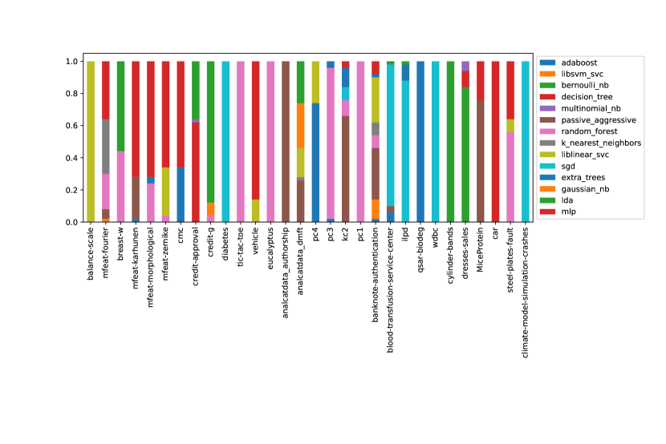

<figcaption>図21: 各データセットについて AutoSklearn ベースラインで用いられた分類器のアンサンブル重み。アンサンブル重みは、1 時間の訓練後の OpenML-CC18 ベンチマークの各データセットについて 5 分割にわたって平均される。</figcaption>
</figure>

表6: ベースラインのハイパーパラメータ空間。LightGBM を除くすべては先行研究から適応した。

### F.3 Used Datasets（用いたデータセット）

我々の手法を構築・評価するため、以下の 4 つのデータセット集合を用いた。

第 1 に、メタテスト集合（表 7 参照）は、OpenML-CC18 ベンチマークスイートの、最大 2,000 サンプル・100 特徴量・10 クラスのすべてのデータセットから成り、小規模な表形式データセットを表す 30 個のデータセットが残る。

第 2 に、メタ検証集合（表 8 と 9 参照）は OpenML.org からの 150 個のデータセットから成る。

このために、OpenML.org 上のすべてのデータセットを考慮し、以下のフィルタリング手順を適用した。メタテスト集合にあるすべてのデータセットと、2,000 サンプル・100 特徴量・10 クラスを超えるすべてのデータセットを落とした。

我々はまた重複を手動で確認し、特徴量・クラス・サンプルの数がメタテスト集合のデータセットと同一であるデータセットを除去した。

さらに、FOREX（時系列データセットであるため）と、Univ や Friedman データセットのような人工的に作成されたデータセットを手動で落とした。

残るメタ検証集合は 150 個のデータセットを含む。

このメタ検証集合は、付録 E.4 で述べたように、事前分布ハイパーパラメータの開発を導くために用いられた。

第 3 に、OpenML-AutoML ベンチマークからの 5 個のデータセットの部分集合は、OpenML-AutoML ベンチマークの最大 1,111 サンプル・100 特徴量・10 クラスのすべてのデータセットから成る。これは表 10 に与えられている。

OpenML-AutoML ベンチマークの 10 分割交差検証のため、これは上記のメタテストとメタ検証データセットの設定（最大 2,000 サンプルを 50-50 に訓練・テスト分割）と同一である。

第 4 に、付録 F.4 で述べるメタ汎化集合は、OpenML AutoML ベンチマークからの 18 個のより大きなデータセットから成る。

### F.4 Model Generalization（モデルの汎化）

第 10 節で述べたように、より長い系列での TabPFN の性能を検証するため、少なくとも 10,000 サンプルを含む OpenML AutoML ベンチマークからの 18 個のデータセットの集合を用いた。

用いたデータセットのリストは表 11 に記載されている。

この評価では、100 を超える特徴量を持つデータセットは最初の 100 特徴量に制限される。

データセットに 10 を超えるクラスが含まれる場合、最初の 10 クラス以外のサンプルは破棄される。

### F.5 Details on Time Comparisons（時間比較の詳細）

時間比較は、結合された当てはめ・調整・予測を指す。調整／当てはめと予測に分けた時間は表 2 を参照。

各ベースラインと TabPFN にかかる時間には、各手法の一度きりの開発コストは含まれない。

したがって、AutoML ベースラインについてはメタ学習コストは含まれない（例えば Auto-Sklearn のパイプラインメタ学習は 140 データセットで 24 時間のハイパーパラメータ探索を実行することを含んだ = 3360 CPU 時間）。

GBDT 手法については、適切なハイパーパラメータ空間を定義し、表形式データセットでよく機能するアルゴリズムを手作業で作り上げるのにかかった手作業の時間は測定が難しく、含まれていない。

TabPFN については、事前当てはめの段階（これは我々のアルゴリズム開発の一部、すなわちアイデアの開発、コードの記述、アイデアの試行である）は含まれない。

これはすべての手法に公平である。なぜならこれらのコストはユーザ側にはなく、時間をかけて償却（amortize）されるからである。
