# ベイズ推論: ステップバイステップガイド

> 原題: Bayesian Inference: A step-by-step guide
> 著者: Rahuldhrh
> 出典: Medium（2024-06-05）, https://rahuldhrh.medium.com/bayesian-inference-a-step-by-step-guide-f9db93109fa6

魅力的なベイズ推論（Bayesian Inference）の世界に飛び込んでみましょう。分かりやすい例を使って、その実用的な応用を順を追って説明していきます。

## ベイズ推論:

MLE についての手早い復習が必要なら、私の別のブログ [MLE](https://medium.com/@rahuldhrh/maximum-likelihood-estimation-a-step-by-step-guide-25af44b6fa23) を参照してください。

ベイズ推論を議論する前に、まず「私たちが何を持っていて、なぜ新しいものが必要なのか」を議論しましょう —— すでに最尤推定（Maximum Likelihood Estimation, MLE）について、既知のデータ（𝑋）から未知の量（θ）を推定する方法を議論しました。
では、MLE には何が欠けているのでしょうか ——

- MLE は推定する量を定数として扱います。これは、与えられた（観測された）データ（𝑋）の尤度を最大化するパラメータ（𝜃）を見つけようとします。

<figure>

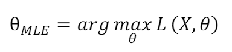

<figcaption>式: MLE の定義。θ_MLE = arg max_θ L(X, θ)。尤度 L(X, θ) を最大化する θ を点推定として求める。</figcaption>
</figure>

もし 𝜃 がそれ自身の分布から来るとしたら、それをどう取り込めばよいのでしょうか？

- MLE はパラメータを見つけるので点推定（point estimates）を与え、それに伴う不確実性（uncertainty）を一切定量化しません。
- MLE はデータに過適合（overfit）しやすく、特に推定するパラメータ数が多い複雑なモデルでその傾向が強くなります。

𝑋 から 𝜃 を推定する問題について、私たちは未知の量 𝜃 が固定されていると仮定するある種のアプローチを議論しました。このアプローチは頻度論的アプローチ（frequentist approach）と呼ばれます。MLE の欠点を克服するために、私たちは推論のための別の枠組み、すなわちベイズ的アプローチ（Bayesian approach）が必要でした。この枠組みでは、パラメータ θ を分布 𝑃(θ) から来る確率変数（random variable）として扱います。この分布 𝑃(θ) は事前分布（Prior distribution）として知られています。観測データ 𝑋 を得たら、そこから事前分布を事後分布（Posterior distribution）へと更新します。これはベイズ則（Bayes Rule）を使って行います ——

<figure>

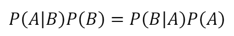

<figcaption>式: ベイズ則の積形式。P(A|B)P(B) = P(B|A)P(A)。</figcaption>
</figure>

**直感:**
ベイズ推論についての直感的なイメージを得るために、簡単な問題を調べてみましょう。
問: ある晩、居間に入ると、ソファが濡れているのを見つけて当惑します。あなたは探偵を演じて、これがどうして起きたのかの謎を解かねばなりません。
シナリオ1: おそらく弟が、お気に入りのテレビ番組に夢中になって、見ている間にうっかり水をこぼした。
シナリオ2: いたずら好きのサメが、こっそりあなたの家に侵入し、その通り道でソファを湿らせた。そして現れたときと同じく謎めいた形で、あなたが戻ってくるとサメは消え去る。
さて、どのシナリオがソファを濡らした原因だと思いますか？
シナリオ2 は現実離れしていて、あなたの弟が主犯だと容易に理解できるでしょう。しかし、確率の概念を使ってシナリオを分析してみましょう:

<figure>

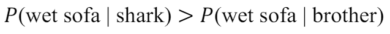

<figcaption>式: P(濡れたソファ | サメ) > P(濡れたソファ | 弟)。尤度だけ見るとサメの方が「濡れたソファ」をよく説明する。</figcaption>
</figure>

ちょっと待ってください、MLE によればシナリオ2 が最も適切な答えになる？ しかしそれは何の意味も成しません。
もし「サメが部屋に来る確率はあまりにも現実離れしている」という事前知識を使うなら、

<figure>

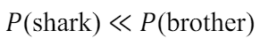

<figcaption>式: P(サメ) ≪ P(弟)。事前知識として、サメが来る確率は弟がいる確率よりはるかに小さい。</figcaption>
</figure>

この事前知識を使うと、

<figure>

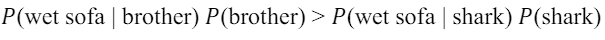

<figcaption>式: P(濡れたソファ | 弟) P(弟) > P(濡れたソファ | サメ) P(サメ)。尤度に事前確率を掛けると不等号が逆転する。</figcaption>
</figure>

<figure>

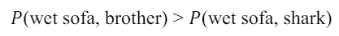

<figcaption>式: P(濡れたソファ, 弟) > P(濡れたソファ, サメ)。同時確率では「弟」の方が大きい＝事後的に弟が主犯。</figcaption>
</figure>

この簡単な分析から、最尤推定（MLE）はシナリオ2 を最も尤もらしい説明として示唆する一方で、事前の信念を取り込むと解がシナリオ2 から変わることが分かります。この修正された解は、MLE の解よりも、最初に得た直感とよく合致します。
この枠組みは**ベイズ推論（Bayesian inference）**として知られ、尤度（Likelihood）を**事前情報（Prior information）**で更新して修正された確率、すなわち**事後確率（Posterior probabilities）**を導くことを含みます。

## パラメトリック統計的推論の復習:

統計的推論問題の主要なトピックを復習しましょう ——

- 観測データ 𝑋 を持っている。
- 𝑋 を生成した確率分布については知らない。
- 統計モデル、すなわちデータを生成し得た確率分布を定義する。
- 提案したモデルをパラメータ 𝜃 でパラメータ化する。
- データ 𝑋 とモデルを使ってパラメータ 𝜃 を推定する。
- データ生成分布についての主張を行う。

ベイズ推論は、確率モデルを通じて事前知識を取り込むことで、パラメトリックなアプローチを拡張します。そして、ベイズの定理を使って信念を更新します。これは、事前知識と観測データから得た新しい証拠を組み合わせるのに役立ちます。その結果は、意思決定や結論の導出に使える事後分布の集合です。このアプローチは、パラメータを推定し意思決定を行う際の不確実性を扱うための、柔軟で徹底的な方法を私たちに与えてくれます。

ベイズ推論の構成要素を一つずつ議論しましょう ——

**尤度（Likelihood）:**
パラメトリックなベイズ推論の最初のステップは尤度です。これは、パラメータ 𝜃 が与えられたときにデータ 𝑋 を見る確率を単純に述べる関数です。

<figure>

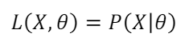

<figcaption>式: 尤度の定義。L(X, θ) = P(X|θ)。</figcaption>
</figure>

尤度は、データ生成分布のパラメータが 𝜃 であるときの 𝑋 の確率密度関数（pdf）に等しいです。
例 ——

𝑁 回のコイン投げから生成されたサンプルが

𝑋 = [𝑥1, 𝑥2, ⋯, 𝑥𝑁]（ここで 𝑥𝑖 = {0,1}）だとします。

データは独立同分布（Independent and identically distributed, IID）でベルヌーイ分布（Bernoulli distribution）に従います。ベルヌーイ分布はパラメータ 𝜇 を 1 つだけ持ちます。サンプル 𝑥𝑖 の pdf は

<figure>

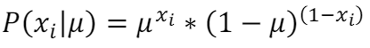

<figcaption>式: ベルヌーイ分布の pdf。P(xᵢ|μ) = μ^{xᵢ} (1−μ)^{(1−xᵢ)}。</figcaption>
</figure>

尤度は次のように書けます:

<figure>

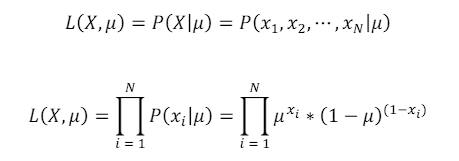

<figcaption>式: コイン投げの尤度。L(X, μ) = P(X|μ) = P(x₁, x₂, …, x_N|μ) = ∏_{i=1}^N P(xᵢ|μ) = ∏_{i=1}^N μ^{xᵢ} (1−μ)^{(1−xᵢ)}。IID 仮定により各サンプルの積になる。</figcaption>
</figure>

**事前分布（Prior distribution）:**
事前分布は、パラメータ 𝜃 に割り当てられる確率分布です。ベイズ更新を簡単に解釈するために、共役事前分布（conjugate priors）を使います。
もし尤度関数 𝑃(𝑋|θ) と事前確率分布 𝑃(𝜃) が同じ確率分布族に属するなら、結果として得られる事後分布 𝑃(𝜃|𝑋) も同じ族を共有します。このような場合、事前分布と事後分布は、その尤度関数に関して共役分布（conjugate distributions）であると言います。
例 —— 前の例では、事前分布としてベータ分布（Beta distribution）を使えます。

<figure>

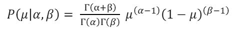

<figcaption>式: ベータ分布の事前分布。P(μ|α, β) = [Γ(α+β) / (Γ(α)Γ(β))] μ^{(α−1)} (1−μ)^{(β−1)}。</figcaption>
</figure>

ここで 𝛼 と 𝛽 は事前分布のパラメータです。𝛼 は成功回数を、𝛽 は失敗回数を表します。

**事後分布（Posterior distribution）:**
データ 𝑋 からの情報を使って、ベイズ則により事前分布を更新します:

<figure>

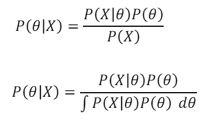

<figcaption>式: ベイズ則による事後分布。P(θ|X) = P(X|θ)P(θ) / P(X) = P(X|θ)P(θ) / ∫ P(X|θ)P(θ) dθ。分母は周辺尤度（正規化定数）。</figcaption>
</figure>

例 ——
前の例を続けると、
事後分布は次のようになります:

<figure>

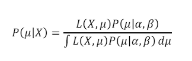

<figcaption>式: コイン投げ＋ベータ事前の事後分布。P(μ|X) = L(X, μ)P(μ|α, β) / ∫ L(X, μ)P(μ|α, β) dμ。</figcaption>
</figure>

この恐ろしげな式は、今のところ簡略化せずそのままにしておきます。というのも、ここから MAP 推定（MAP estimation）を使って 𝜇 を推定できるからです。しかし、これを観察することで、パラメトリックなベイズ推論に不可欠な鍵となる概念を掴むことができます。

## ベイズ推論の一般的な考え方:

目的は、与えられた確率変数（データ）𝑋 を観測することによって、未知の変数（パラメータ）θ についての情報を推論することです。これらの未知の変数 𝜃 は事前分布と結びついています。

<figure>

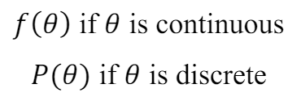

<figcaption>式: 事前分布の一般形。θ が連続なら f(θ)、θ が離散なら P(θ)。</figcaption>
</figure>

𝑋 の値を観測した後、𝜃 の事後分布を求めます。これは 𝑋 = x が与えられたときの 𝜃 の条件付き pdf（または pmf）です。

<figure>

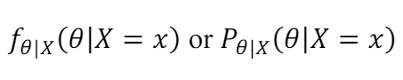

<figcaption>式: 事後分布の一般形。f_{θ|X}(θ|X = x)（連続）または P_{θ|X}(θ|X = x)（離散）。</figcaption>
</figure>

事後分布はベイズ則を使って求めることができます。

## 例:

すべての概念をいくつかの例で理解しましょう:

**例1**
コイン投げのデータ 𝑋 が [1,1,1,1,1,1,1,0,0,0] として与えられています。パラメータ θ = 𝑃(𝑋 = 1) を求める必要があります。
解:
**パラメータ: 𝛉 = 𝑷(𝑿 = 𝟏)**
**データ: 𝑋 = [1,1,1,1,1,1,1,0,0,0]**（1 は表、0 は裏を表す）。
**事前分布:** θ について何も知らないので、θ は一様分布（uniform distribution）から来ると仮定できます。

<figure>

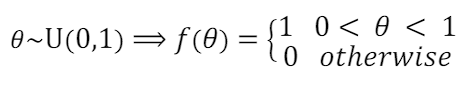

<figcaption>図: 事前分布。θ ~ U(0,1) ⟹ f(θ) = 1（0 < θ < 1）、0（それ以外）。一様分布の事前。</figcaption>
</figure>

**尤度:** 各サンプルはベルヌーイ分布に従い、IID 仮定を満たします。

<figure>

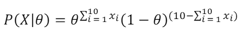

<figcaption>図: 尤度。P(X|θ) = θ^{Σ_{i=1}^{10} xᵢ} (1−θ)^{(10 − Σ_{i=1}^{10} xᵢ)}。</figcaption>
</figure>

**事後分布:** ベイズ則を使って事後分布を得ます。

<figure>

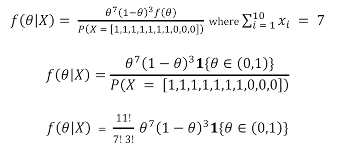

<figcaption>図: 事後分布。f(θ|X) = θ⁷(1−θ)³ f(θ) / P(X = [1,1,1,1,1,1,1,0,0,0])（ここで Σ_{i=1}^{10} xᵢ = 7）。一様事前 1{θ ∈ (0,1)} を代入し、正規化すると f(θ|X) = (11! / (7! 3!)) θ⁷(1−θ)³ 1{θ ∈ (0,1)}。</figcaption>
</figure>

<figure>

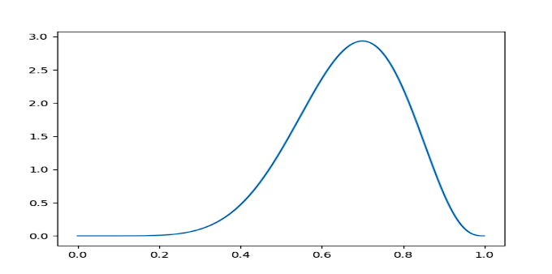

<figcaption>図: 𝜃 の事後分布 f(θ|X)。0〜1 上の分布で、表 7 回・裏 3 回を反映して θ ≈ 0.7 にピークを持つ。</figcaption>
</figure>

**例2:**
実数値データ 𝑋 が [66.75,70.24,67.19,67.09,63.65,64.64,69.81,69.79,73.52,71.74] として与えられ、母標準偏差は既知で値 3 を持つとします。パラメータ μ = Ε(𝑋) を求める必要があります。
**解:**
**パラメータ: 𝜇 = Ε(𝑋)**
**データ: 𝑋 = [66.75,70.24,67.19,67.09,63.65,64.64,69.81,69.79,73.52,71.74]**
**事前分布:** 𝜃 の平均が 60、標準偏差が 5 であると信じているとします。

<figure>

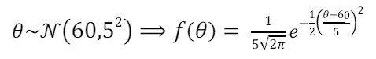

<figcaption>図: 事前分布。θ ~ 𝒩(60, 5²) ⟹ f(θ) = (1 / (5√(2π))) exp(−½((θ−60)/5)²)。正規分布の事前。</figcaption>
</figure>

**尤度:** 各サンプルは正規分布（Normal distribution）に従い、IID 仮定を満たします。

<figure>

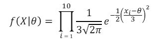

<figcaption>図: 尤度。f(X|θ) = ∏_{i=1}^{10} (1 / (3√(2π))) exp(−½((xᵢ−θ)/3)²)。既知の標準偏差 3 を使う。</figcaption>
</figure>

**事後分布:** ベイズ則を使って事後分布を得ます。

<figure>

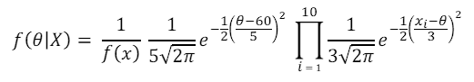

<figcaption>図: 事後分布。f(θ|X) = (1 / f(x)) · (1 / (5√(2π))) exp(−½((θ−60)/5)²) · ∏_{i=1}^{10} (1 / (3√(2π))) exp(−½((xᵢ−θ)/3)²)。</figcaption>
</figure>

いくつかの変形を経ると、次のように得られます（長すぎるので途中は省略）。

<figure>

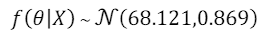

<figcaption>式: 簡略化した事後分布。f(θ|X) ~ 𝒩(68.121, 0.869)。正規事前×正規尤度の事後はふたたび正規分布になる（共役）。</figcaption>
</figure>

<figure>

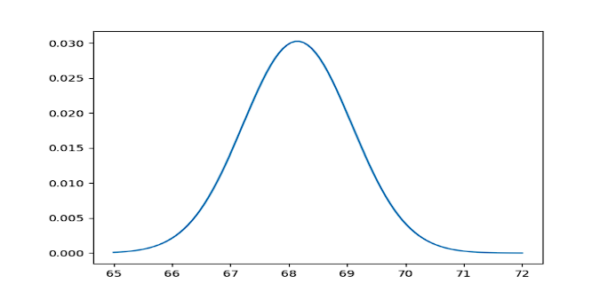

<figcaption>図: 𝜃 の事後分布 f(θ|X)。平均 ≈ 68.1 にピークを持つ釣鐘型。事前（平均 60）からデータ（平均 ≈ 68.4）の方へ引き寄せられている。</figcaption>
</figure>

## 反復学習（Iterative learning）:

ベイズの枠組みを使うことで、反復学習システムを構築できます。どうやってそれを行うか見てみましょう:

- パラメータ 𝜃 についての事前知識、すなわち 𝜃 ~ 𝑃(𝜃) から始める。
- 観測データ 𝑋 を取り込み、ベイズ則を使って事前分布 𝑃(𝜃) を事後分布 𝑃(𝜃|𝑋) へ更新する。

<figure>

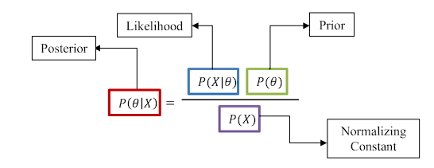

<figcaption>図: ベイズ則の構成要素。事後 P(θ|X)＝[尤度 P(X|θ) × 事前 P(θ)] / 正規化定数 P(X)。</figcaption>
</figure>

- 次に、その事後分布を事前分布に設定し、新たに観測されたデータ 𝑌 で更新し、これを続ける。これは逐次ベイズ推論（Sequential Bayesian Inference）として知られています。

## 結論:

結論として、ベイズ推論は、特に不確実性と事前知識が存在する場合の統計分析に、強力で柔軟な枠組みを提供します。事前分布を取り込み、新しい証拠に照らしてこれらの信念を更新するためにベイズの定理を使うことで、ベイズ的手法は、未知のパラメータについてより情報に基づいた繊細な推論を行うことを可能にします。このアプローチは、MLE のような従来手法の限界に対処するだけでなく、不確実性に直面した際の頑健な意思決定に不可欠な、包括的な確率的理解を提供します。計算能力が進歩し続けるにつれ、ベイズ推論の応用と関連性は今後も拡大し、さまざまな研究分野でより深い洞察を私たちに与えてくれる可能性が高いでしょう。
