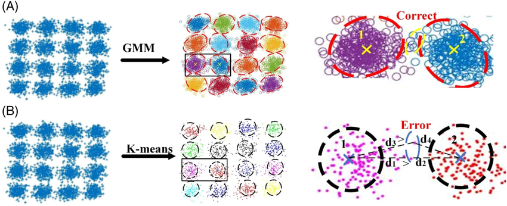
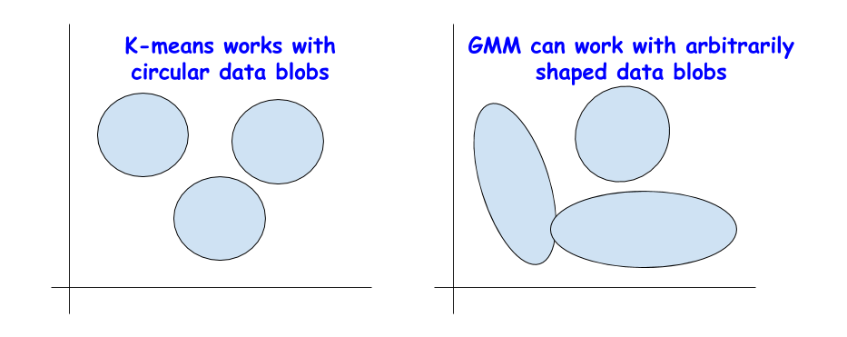
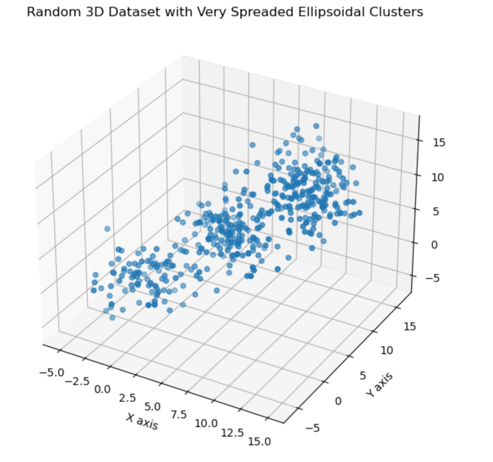
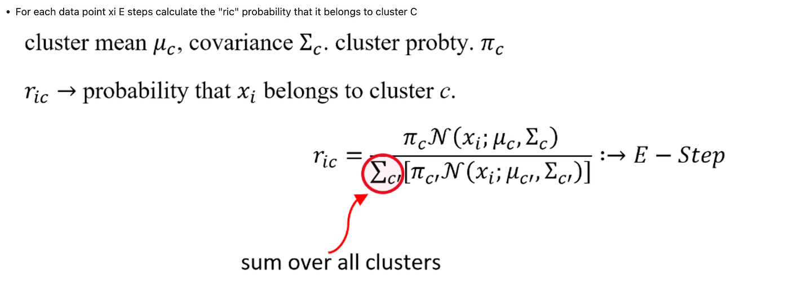
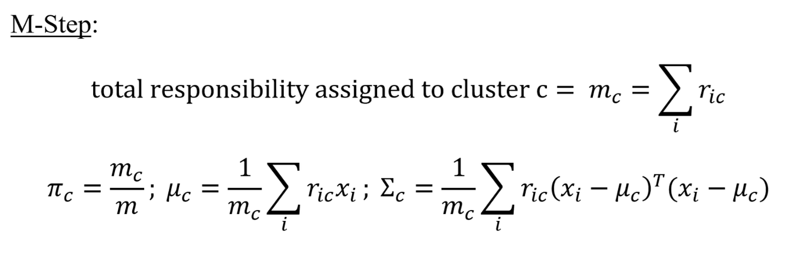
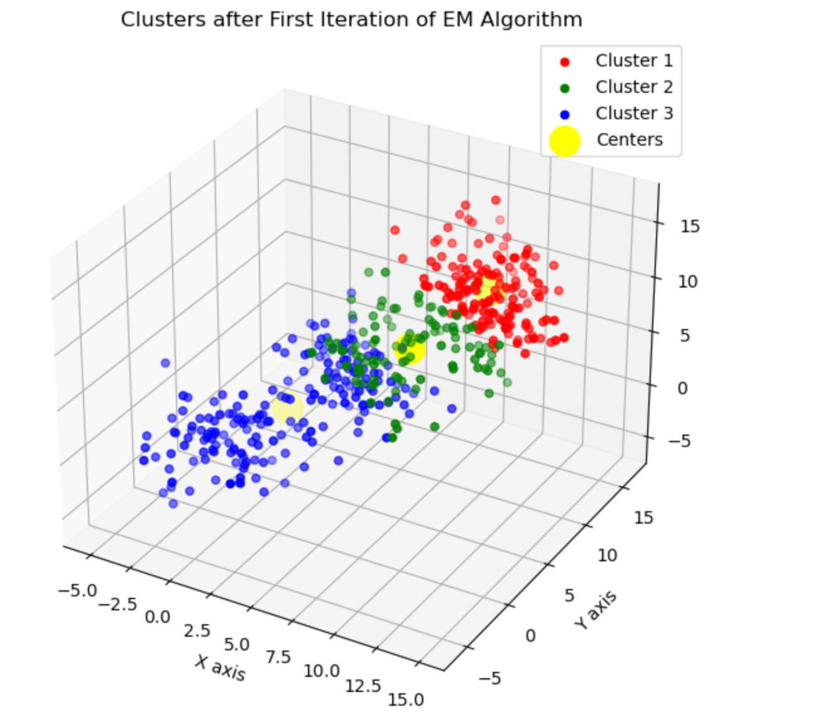
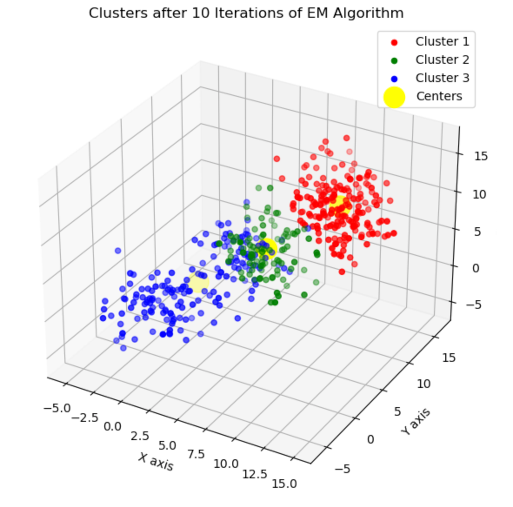
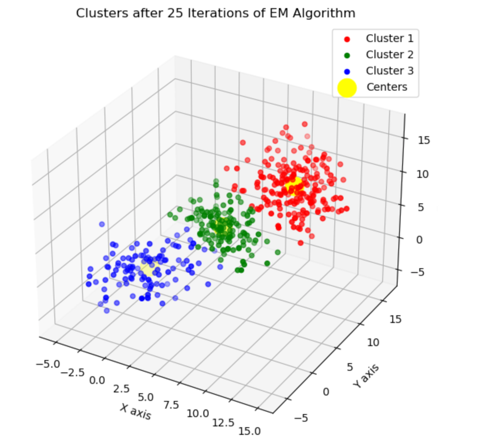
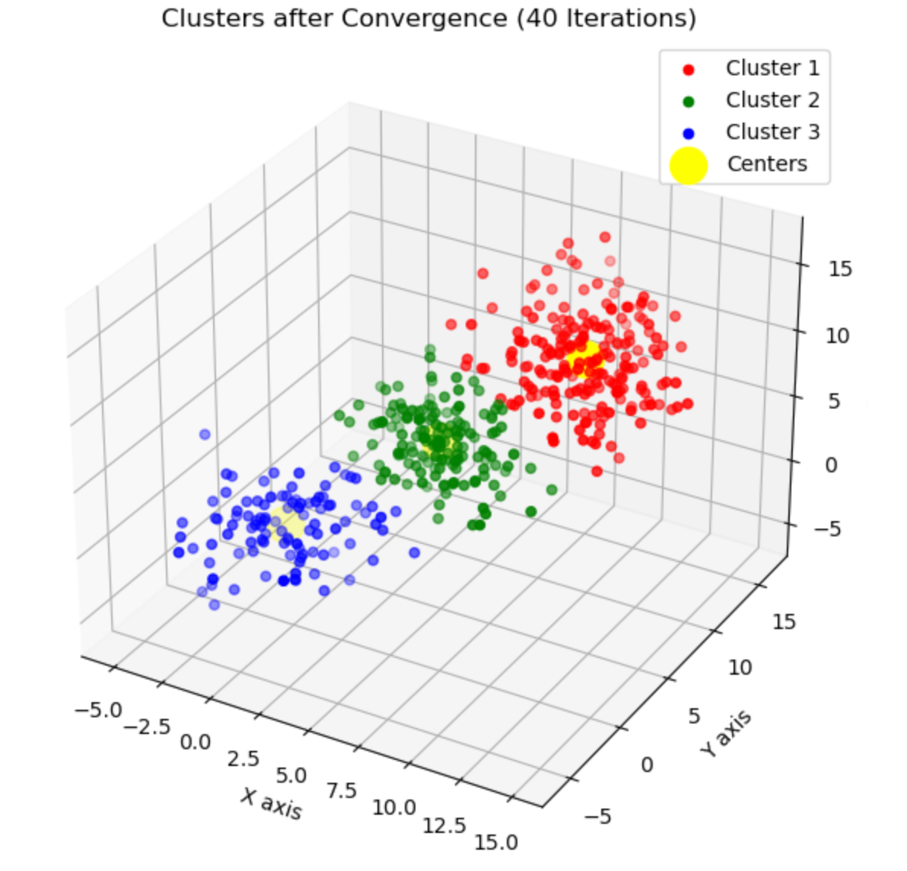

# ガウス混合モデルの解説: 効果的なデータクラスタリングのための GMM と EM の適用

> 原題: Gaussian Mixture Models Explained: Applying GMM and EM for Effective Data Clustering
> 著者: Tejas Pawar
> 出典: Medium（2024-05-08）, https://medium.com/@tejaspawar21/gaussian-mixture-models-explained-applying-gmm-and-em-for-effective-data-clustering-ca24f8911609

## はじめに

機械学習の広大な領域において、クラスタリングアルゴリズムは教師なし学習（unsupervised learning）の基本的な道具として際立っており、その目標はデータ内の本来的なグループ分けを発見することである。これらの中で、ガウス混合モデル（Gaussian Mixture Models, GMM）は特に強力な手法として現れ、k-means のようなより伝統的な技術の能力を超える、洗練されたクラスタリングへのアプローチを提供する。

**GMM を際立たせるものは何か？** 各データ点を単一のクラスタに割り当てる単純なクラスタリング手法と異なり、GMM は確率と不確実性の概念を取り入れる。この確率モデルは、データ点が複数のガウス分布の混合——各分布が1つのクラスタに対応する——から生成されると仮定する。これにより、より柔軟なクラスタの形状と、データ点が異なる度合いのメンバーシップで複数のクラスタに属しうる**ソフトクラスタリング（soft clustering）**が可能になる。

この記事では、ガウス混合モデルの仕組みと応用に踏み込み、伝統的なクラスタリング手法に対するその利点を強調する。合成された3次元データセットを生成し、期待値最大化（Expectation Maximization, EM）アルゴリズムを使って GMM を実装し、この優雅なアルゴリズムがどのように反復的に収束に達して根底のクラスタ構造を明らかにするかを可視化する。

GMM の繊細なダイナミクスを探り、この高度なクラスタリング技術の強力な能力を解き明かす旅に参加してほしい。あなたが熟練のデータサイエンティストであれ好奇心旺盛な愛好家であれ、GMM を理解することは分析の武器庫に強力な道具を加えるだろう。

## セクション1: ガウス混合モデル（GMM）を理解する

ガウス混合モデル（GMM）は、すべてのデータ点が、未知のパラメータを持つ有限個のガウス分布の混合から生成されると仮定する確率モデルである。複雑なデータセット内の本来的なグループ分けを特定するために使われる。

### 主要な概念と用語

- **ガウス分布（Gaussian Distribution）:** 正規分布とも呼ばれ、その釣鐘型の曲線で特徴づけられ、主に平均（中心）と分散（幅）で定義される。
- **混合モデル（Mixture Models）:** 全体の母集団内に部分母集団が存在することを表す統計モデルで、観測されたデータ集合が個々の観測がどの部分母集団に属するかを特定することを要求しない。
- **期待値最大化（Expectation-Maximization, EM）アルゴリズム:** 確率モデル、特に潜在変数（latent variables）を持つモデルにおいて、パラメータの最尤推定（maximum likelihood estimates）を見つけるために使われる計算的アプローチ。

### 伝統的なクラスタリング技術に対する GMM の利点

- **クラスタ共分散の柔軟性:** GMM はクラスタが異なる形状とサイズを持つことを許し、（K-means のように）すべてのクラスタが球状であると仮定するのではなく、データの本来的な分布に適応する。
- **ソフトクラスタリング能力:** 各データ点を単一のクラスタに割り当てるハードクラスタリング手法と異なり、GMM は各データ点に各混合成分に属する確率を割り当て、データのグループ分けのより繊細な理解を可能にする。
- **複雑な分布のモデル化:** GMM は多峰（multimodal, 複数のピークを持つ）でありうる複雑な分布をモデル化できる。これは、単峰の仮定（クラスタごとに1つのピーク）がしばしば不十分である現実世界のデータ分析において重要な利点である。

よりよい理解のために、GMM と K-Means の視覚的な比較を見よう。

<figure>



<figcaption>図1（Diagram 1）: 非線形ケースにおける GMM 対 K-means。(A) GMM は絡み合った複雑なクラスタの自然な非線形境界を捉え正しく分離する（Correct）。(B) K-means は重心への近さに頼るため、複雑な分布で誤る（Error）。</figcaption>
</figure>

第1の図は、複雑で絡み合ったパターンを持つデータセットへのガウス混合モデル（GMM）と K-means の適用を示している。GMM は、各クラスタを固有の形状と密度でモデル化し、自然な非線形のクラスタ境界を捉えることで優れている。この柔軟性により、GMM は硬直した円形の境界を押し付けることなく、別個のグループを正確に特定できる。

対照的に、K-means は同じデータセットに苦戦する。重心への近さを使うその方法は、クラスタ間の入り組んだ分離を見分けられないことが示すように、大きな誤差につながる。K-means は球状のクラスタを仮定するため、複雑な分布を持つデータでの性能が貧弱になる。

<figure>



<figcaption>図2（Diagram 2）: GMM と K-means における形状の柔軟性。GMM は楕円形や不規則な形状のクラスタを、さまざまな向きとスケールに対応して巧みに扱える。K-means は円形のクラスタに制限される。</figcaption>
</figure>

第2の図は、GMM が楕円形や不規則な形状のクラスタを、さまざまな向きとスケールに対応して巧みに扱えることを示すことで、この点をさらに強調している。しかし K-means は円形のクラスタに制限され、複雑なシナリオでその有効性が限られる。

GMM と K-means のこれらの視覚的な対比は、なぜ GMM がクラスタリングタスク、特にデータがしばしば多様で入り組んだパターンを示す現実世界の応用において、より汎用的で強力な道具であるかを浮き彫りにする。

## セクション2: 合成3次元データセットの生成

このセクションでは、3つの別個のクラスタを持つ合成3次元データセットを作成するプロセスを探る。このデータセットは、特に複雑で重なり合う分布を扱う際の、ガウス混合モデル（GMM）の能力を示す実践的な例として役立つ。

現実世界の複雑さを反映するデータセットを作るために、再現性のためのシード（seed）でデータ生成を初期化し、異なる平均・共分散・サイズを持つ3つのクラスタのパラメータを定義した。目標は、空間的な広がりが大きく異なる楕円体形状のクラスタをシミュレートし、クラスタリングタスクをより難しくして GMM の利点を強調することである。

クラスタを次のように定義した:

```c
# Seed for reproducibility
np.random.seed(42)

# Parameters for the three clusters
means = np.array([[0, 0, 0], [5, 5, 5], [10, 10, 10]])
covs = [np.eye(3), np.eye(3) * 2, np.eye(3) / 2]  # Different covariances for variety
sizes = [100, 150, 200]  # Different sizes for the clusters
covs_very_spreaded = [
    np.array([[5, 2, 1], [2, 5, 2], [1, 2, 5]]),
    np.array([[5, -2, 1], [-2, 5, -1], [1, -1, 5]]),
    np.array([[5, 0, -2], [0, 5, 2], [-2, 2, 5]])
]

# Generating very spreaded ellipsoidal clusters
clusters_very_spreaded = [np.random.multivariate_normal(mean, cov, size) for mean, cov, size in zip(means, covs_very_spreaded, sizes)]
data_very_spreaded = np.vstack(clusters_very_spreaded)

# Plotting the generated very spreaded ellipsoidal clusters
fig = plt.figure(figsize=(10, 7))
ax = fig.add_subplot(111, projection='3d')

ax.scatter(data_very_spreaded[:, 0], data_very_spreaded[:, 1], data_very_spreaded[:, 2])
ax.set_title('Random 3D Dataset with Very Spreaded Ellipsoidal Clusters')
ax.set_xlabel('X axis')
ax.set_ylabel('Y axis')
ax.set_zlabel('Z axis')
plt.show()
```

<figure>



<figcaption>図3: 非常に広がった楕円体クラスタを持つランダムな3次元データセット（生成結果の散布図）。</figcaption>
</figure>

## セクション3: 期待値最大化による GMM の実装

このセクションでは、与えられたデータに最もよく適合するよう GMM のパラメータを最適化する強力な反復プロセスである期待値最大化（EM）アルゴリズムを使った、ガウス混合モデル（GMM）の実践的な実装に踏み込む。

EM アルゴリズムは、GMM のような潜在変数を持つモデルで最尤推定を効率的に見つけるのに不可欠である。それは2つの主要なステップ——期待ステップ（E-step）と最大化ステップ（M-step）——を交互に行い、モデルのパラメータを反復的に改善する。

合成3次元データセットへの EM の適用を示すために、各成分の混合係数（mixing coefficients）・平均・共分散行列を含む GMM のパラメータを初期化することから始める。

**パラメータの初期化:**

```c
def initialize_parameters(data, n_components):
    np.random.seed(42)  # For reproducibility
    n_samples, n_features = data.shape

    # Randomly initialize means from the data points
    means_init = data[np.random.choice(n_samples, n_components, replace=False)]

    # Initialize the covariance matrices to be diagonal with large variances
    covariances_init = np.array([np.eye(n_features) for _ in range(n_components)])

    # Initialize the mixing coefficients (weights) uniformly
    weights_init = np.ones(n_components) / n_components

    return weights_init, means_init, covariances_init

# Initialize parameters
n_components = 3  # Number of Gaussian components
weights, means, covariances = initialize_parameters(data_very_spreaded, n_components)

(weights, means, covariances)
```

**E-Step（期待）:** E-step では、各データ点が各ガウス成分に属する責任（responsibilities, 事後確率）を計算する。このステップは、各成分のガウス仮定のもとでの各データ点の尤度を計算し、これらの値を成分にわたって正規化することを含む。

<figure>



<figcaption>図4: E-Step の式。各データ点 xᵢ について、それがクラスタ c に属する責任 rᵢ_c（事後確率）を計算する。クラスタ平均 μ_c・共分散 Σ_c・クラスタ確率 π_c を用い、rᵢ_c = π_c·N(xᵢ; μ_c, Σ_c) / Σ_c'[π_c'·N(xᵢ; μ_c', Σ_c')]（分母は全クラスタにわたる和）。</figcaption>
</figure>

```c
def e_step(data, weights, means, covariances, n_components):
    n_samples = data.shape[0]
    responsibilities = np.zeros((n_samples, n_components))
    
    # Calculate the probability of each data point under each component
    for i in range(n_components):
        rv = multivariate_normal(mean=means[i], cov=covariances[i])
        responsibilities[:, i] = rv.pdf(data) * weights[i]
    
    # Normalize the responsibilities so they sum to 1 for each data point
    responsibilities_sum = responsibilities.sum(axis=1)[:, np.newaxis]
    responsibilities = responsibilities / responsibilities_sum
    
    return responsibilities

# Perform the E-step with our initialized parameters
responsibilities = e_step(data_very_spreaded, weights, means, covariances, n_components)

# Display the shape of the responsibilities matrix to verify, and the first 5 rows to get a sense
responsibilities_shape = responsibilities.shape
responsibilities_first_5 = responsibilities[:5]

(responsibilities_shape, responsibilities_first_5)
```

**M-Step（最大化）:** M-step では、E-step で計算した責任を使ってモデルパラメータを更新する。推定された責任に従ってデータによりよく適合するよう、重み・平均・共分散行列の新しい値が計算される。

<figure>



<figcaption>図5: M-Step の式。クラスタ c に割り当てられた総責任 m_c = Σᵢ rᵢ_c。これを用いて π_c = m_c/m、μ_c = (1/m_c)Σᵢ rᵢ_c xᵢ、Σ_c = (1/m_c)Σᵢ rᵢ_c (xᵢ − μ_c)ᵀ(xᵢ − μ_c) を更新する。</figcaption>
</figure>

```c
def m_step(data, responsibilities, n_components):
    n_samples, n_features = data.shape

    # Calculate the new weights
    weights_new = responsibilities.sum(axis=0) / n_samples

    # Calculate the new means
    means_new = np.dot(responsibilities.T, data) / responsibilities.sum(axis=0)[:, np.newaxis]

    # Calculate the new covariances
    covariances_new = np.zeros((n_components, n_features, n_features))
    for i in range(n_components):
        data_centered = data - means_new[i]
        covariances_new[i] = np.dot(responsibilities[:, i] * data_centered.T, data_centered) / responsibilities[:, i].sum()
    
    return weights_new, means_new, covariances_new

# Perform the M-step with the responsibilities calculated in the E-step
weights_updated, means_updated, covariances_updated = m_step(data_very_spreaded, responsibilities, n_components)

(weights_updated, means_updated, covariances_updated)
```

EM アルゴリズムの反復的な性質により、パラメータ推定を段階的に洗練し、各反復でデータへの適合を改善できる。責任の計算（E-step）とパラメータの更新（M-step）を交互に行うことで、EM は現実世界のシナリオで一般的な、データの重なり合うクラスタやさまざまな形状の複雑さを効果的に扱う。

この実装は、GMM が EM アルゴリズムと組み合わさることで、特に複雑で重なり合うデータ分布の場合に、伝統的な手法が及ばないクラスタリングタスクに頑健な枠組みを提供する様子を示している。

## セクション4: E ステップと M ステップの可視化

このセクションは、一連の可視化を通じて、期待値最大化（EM）アルゴリズムを使ったガウス混合モデル（GMM）の反復的な洗練プロセスを示す。これらの可視化は、EM アルゴリズムの1回・10回・25回の反復後のクラスタ特定の段階的な改善を捉える。

### クラスタリングの進行の可視化

1. EM アルゴリズムの最初の反復後のクラスタ。最初の反復後、クラスタはパラメータの初期推測の周りにおおまかに形成される。可視化は、クラスタがまだうまく分離されておらず、モデルの暫定的な性質を反映していることを示す。

<figure>



<figcaption>図6: EM アルゴリズムの最初の反復後のクラスタ。まだ分離が不十分。</figcaption>
</figure>

2. EM アルゴリズムの10回の反復後のクラスタ。EM アルゴリズムを10回反復すると、クラスタはよりよい分離を示し始め、データの根底の分布をより正確に表すようになる。黄色のマーカーで表されるクラスタ中心は、データグループの真の中心に近づいている。

<figure>



<figcaption>図7: EM アルゴリズムの10回の反復後のクラスタ。分離が改善し、中心（黄）が真の中心に近づく。</figcaption>
</figure>

3. EM アルゴリズムの25回の反復後のクラスタ。25回の反復後、クラスタはよく定義され、実際のデータ分布によく一致する。中心は安定し、責任は明確に区切られ、GMM のパラメータを洗練する EM アルゴリズムの有効性を示す。

<figure>



<figcaption>図8: EM アルゴリズムの25回の反復後のクラスタ。よく定義され実データ分布に一致、中心が安定。</figcaption>
</figure>

## セクション5: 最終結果の分析

合成3次元データセットで期待値最大化（EM）アルゴリズムを収束まで実行した後、40回の反復にわたるモデルの性能を観察した。最終的なクラスタはよく区切られ、それぞれ別個の色で表され、大きな黄色のマーカーで示される計算された平均の周りを中心とする。この可視化は、各クラスタがどう構成され、空間領域でどれだけよく分離されているかを明確に描く。

<figure>



<figcaption>図9: 収束後のクラスタ（40回の反復）。3つのクラスタが別個の色で分離され、中心（黄）が各クラスタの中心に位置する3次元散布図。</figcaption>
</figure>

### GMM がどれだけうまく機能したか

GMM は EM アルゴリズムと組み合わさることで、最終出力でのクラスタ重心の明確な分離と正確な表現が示すように、根底のクラスタを効果的に特定した。この成功はいくつかの要因に帰せられる:

- **適応的共分散:** より単純なクラスタリング手法と異なり、GMM はクラスタ中心の位置だけでなく、適応的共分散行列を介してクラスタの形状と向きも調整した。
- **確率に基づく割り当て:** 各点が各クラスタに属する確率を計算するソフトクラスタリングのアプローチは、特に重なり合う領域で有用な、より繊細なグループ分けを可能にする。

### 結果の解釈と洞察

この複雑なクラスタリングシナリオにおける GMM と EM の有効性は、次を通じて示される:

- **正確なクラスタ特定:** 初期条件がおおまかな近似しか与えなかったにもかかわらず、各クラスタが正しく特定された。EM アルゴリズムの反復的な性質が、これらの初期推測をデータに正確に適合するよう洗練した。
- **重なりへの頑健性:** アルゴリズムは重なり合うクラスタを効果的に区別することに成功した。これは多くのクラスタリングアルゴリズムが苦戦する領域である。
- **収束のダイナミクス:** 対数尤度の変化が 1e-3 未満になることで示されるアルゴリズムの収束は、安定した解に達したことを示す。収束に達する反復回数（40）も、データの複雑さとアルゴリズムの効率を反映する。

```c
def em_algorithm_until_convergence(data, n_components, tol=1e-3):
    # Initialize parameters
    weights, means, covariances = initialize_parameters(data, n_components)
    log_likelihood_old = 0
    converged = False
    iteration = 0

    while not converged:
        # E-step
        responsibilities = e_step(data, weights, means, covariances, n_components)
        # M-step
        weights, means, covariances = m_step(data, responsibilities, n_components)
        
        # Compute log likelihood
        log_likelihood_new = np.sum([np.log(np.sum([weights[k] * multivariate_normal(means[k], covariances[k]).pdf(data) for k in range(n_components)], axis=0))])
        
        # Check for convergence
        if np.abs(log_likelihood_new - log_likelihood_old) < tol:
            converged = True
        log_likelihood_old = log_likelihood_new
        
        iteration += 1

    return weights, means, covariances, responsibilities, iteration

# Run the EM algorithm until convergence
weights_converged, means_converged, covariances_converged, responsibilities_converged, iterations_to_converge = em_algorithm_until_convergence(data_very_spreaded, n_components)

# Visualize the final clusters after convergence
cluster_assignments_converged = np.argmax(responsibilities_converged, axis=1)

# Plotting
fig = plt.figure(figsize=(10, 7))
ax = fig.add_subplot(111, projection='3d')

for i in range(n_components):
    # Select data points assigned to the i-th cluster
    data_i = data_very_spreaded[cluster_assignments_converged == i]
    ax.scatter(data_i[:, 0], data_i[:, 1], data_i[:, 2], c=colors[i], label=f'Cluster {i+1}')

# Plot the converged cluster centers
ax.scatter(means_converged[:, 0], means_converged[:, 1], means_converged[:, 2], s=300, c='yellow', label='Centers')

ax.set_title(f'Clusters after Convergence ({iterations_to_converge} Iterations)')
ax.set_xlabel('X axis')
ax.set_ylabel('Y axis')
ax.set_zlabel('Z axis')
ax.legend()
plt.show()
```

## 結論

この記事では、ガウス混合モデル（GMM）と、期待値最大化（EM）アルゴリズムによるその最適化に踏み込み、複雑なクラスタリングシナリオを扱う上でのその有効性を示した。合成3次元データセットの生成から始め、GMM が伝統的な手法より巧みに多様なクラスタ形状と重なりを扱える様子を図解した。

**クラスタリングのための GMM の力についての最終的な考え**

GMM は、さまざまなクラスタ構成をモデル化する柔軟性と、確率的な割り当てを扱う能力で際立っており、市場セグメンテーション・画像処理・バイオインフォマティクスのような分野の複雑な応用に理想的である。

**潜在的な応用と実験**

GMM のさまざまなデータ型への適応性は、多様な領域での応用を促す。あなたのデータセットに GMM を適用して、隠れたパターンを発見し、データのダイナミクスへの理解を深めることを勧める。顧客行動・金融トレンド・医療データのいずれを探っていても、GMM はより単純なクラスタリング手法が見逃しうる繊細な洞察を提供できる。

この探索は、高度なクラスタリング技術の実践的な利点を浮き彫りにし、あなた自身のプロジェクトで革新的なデータ分析戦略の機会を開く。
