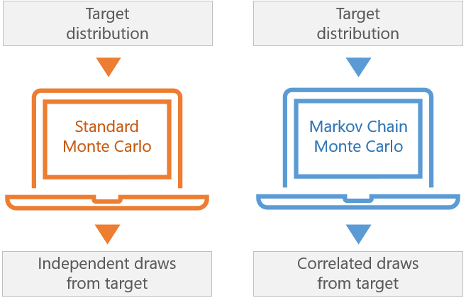

# マルコフ連鎖モンテカルロ（MCMC）法の基礎を理解する

> 原題: Understanding the basics of Markov Chain Monte Carlo (MCMC) Methods
> 著者: Sarowar Ahmed
> 出典: Medium（2024-06-23）, https://sarowarahmed.medium.com/understanding-the-basics-of-markov-chain-monte-carlo-mcmc-methods-495c257e9ebc

## MCMC 法とは何か？

MCMC 法は、複雑な確率分布を近似するために使われるアルゴリズムの一群であり、特にベイズ推論（Bayesian inference）で用いられる。それらは、定常分布（stationary distribution）が望む分布に一致するマルコフ連鎖（Markov chain）を生成することで機能する。直接サンプリングが難しいときに、分布からサンプルするための賢い方法だと考えればよい。

### 実生活の例

*シナリオ*: ある都市の人々の平均身長を推定したいが、限られたデータしか持っていないとする。

*問い*: MCMC 法を使って、身長の分布を近似し平均身長を推定するにはどうすればよいか？
MCMC 法を使う:

▪ ステップ1: モデルを定義する。身長について、正規分布のような確率分布を仮定する。
▪ ステップ2: 連鎖を初期化する。分布のパラメータの初期推測から始める。
▪ ステップ3: サンプルを生成する。MCMC 法を使って分布からサンプルを生成し、空間を効率的に探索するようパラメータを調整する。
▪ ステップ4: パラメータを推定する。生成したサンプルに基づいて平均身長を計算する。

<figure>



<figcaption>図: 標準モンテカルロ（Standard Monte Carlo）と マルコフ連鎖モンテカルロ（Markov Chain Monte Carlo）の対比。どちらも目標分布（target distribution）から出発するが、標準モンテカルロは目標から独立な抽出（independent draws）を、MCMC は目標から相関した抽出（correlated draws）を生む。</figcaption>
</figure>

### シナリオ

あなたが、ある都市の成人男性の平均身長を推定するプロジェクトに取り組むデータサイエンティストだとする。身長測定の小さなサンプルを集めたが、母集団の平均と、その推定の周りの不確実性を推論したい。

ベイズ推論を使って、母集団の平均身長（μ）と標準偏差（σ）を推定する。身長について正規分布を仮定し、MCMC を使ってパラメータの事後分布（posterior distribution）からサンプルする。

### ステップ

1. **モデルを定義する**: 身長が未知の平均 μ・標準偏差 σ で正規分布していると仮定する。
2. **事前分布を指定する**: μ と σ の事前分布を設定する。μ には正規事前分布、σ には半正規（half-normal）事前分布を使う。
3. **尤度**: 観測データに正規尤度（normal likelihood）を使う。
4. **事後分布**: MCMC を使ってパラメータの事後分布からサンプルする。

### サンプルデータ

以下の身長（cm）を観測データとして使う:
heights = [170,172,168,171,173,169,174,170,172,173]

### Python コード実装

Python の `pymc3` ライブラリを使う。これは MCMC 法を使ったベイズ推論によく適している。

```c
import pymc3 as pm
import numpy as np
import matplotlib.pyplot as plt
import seaborn as sns

# Observed data
heights = np.array([170, 172, 168, 171, 173, 169, 174, 170, 172, 173])

# Define the model
with pm.Model() as model:
    # Priors for unknown model parameters
    mu = pm.Normal('mu', mu=170, sigma=10)
    sigma = pm.HalfNormal('sigma', sigma=10)
    
    # Likelihood (sampling distribution) of observations
    likelihood = pm.Normal('likelihood', mu=mu, sigma=sigma, observed=heights)
    
    # Posterior distribution sampling using MCMC (NUTS is a type of MCMC algorithm)
    trace = pm.sample(2000, return_inferencedata=False)

# Summarize the trace
pm.summary(trace)

# Plot the trace and posterior distributions
pm.traceplot(trace)
plt.show()

# Plot posterior distributions using seaborn
plt.figure(figsize=(10, 5))
sns.histplot(trace['mu'], kde=True, label='Posterior of mu')
sns.histplot(trace['sigma'], kde=True, label='Posterior of sigma')
plt.legend()
plt.xlabel('Value')
plt.ylabel('Density')
plt.title('Posterior Distributions of Parameters')
plt.show()

# Print the mean and standard deviation of the posterior samples
mu_mean = np.mean(trace['mu'])
sigma_mean = np.mean(trace['sigma'])
print(f"Estimated mean height (mu): {mu_mean:.2f} cm")
print(f"Estimated standard deviation (sigma): {sigma_mean:.2f} cm")
```

### 説明

**モデルを定義する**: 身長の平均（`mu`）と標準偏差（`sigma`）の事前分布を持つ確率モデルを定義する。

**尤度**: 与えられた身長を観測する尤度を、パラメータ `mu` と `sigma` を持つ正規分布としてモデル化する。

- `mu` には、平均 170 cm・標準偏差 10 cm の正規事前分布を割り当てる。
- `sigma` には、標準偏差 10 cm の半正規事前分布を割り当てる。

**サンプリング**: `pm.sample` 関数を使って、NUTS（No-U-Turn Sampler）アルゴリズム——MCMC 法の一種——を用いて事後分布からサンプルを引く。

**要約と可視化**: トレースを要約して `mu` と `sigma` の事後推定を見る。また、トレースと事後分布をプロットして結果を可視化する。

**結果**: 事後サンプルから推定された平均身長と標準偏差を計算して出力する。

### 結論

MCMC 法、具体的には `pymc3` の NUTS サンプラーを使うことで、母集団の平均身長とその不確実性について、パラメータ `mu` と `sigma` の事後分布を推論できる。

### なぜこれらが重要か？

MCMC 法は、複雑な確率分布からサンプルする柔軟で効率的な方法を提供することで、ベイズ統計に革命をもたらす。それらは機械学習・金融・生物学のような分野で多様な応用を持ち、研究者が困難な推論問題を容易に扱うことを可能にする。
