# CausalPFN: 文脈内学習による償却的な因果効果推定

> 原題: CausalPFN: Amortized Causal Effect Estimation via In-Context Learning
> 著者: Vahid Balazadeh, Hamidreza Kamkari, Valentin Thomas, Benson Li, Junwei Ma, Jesse C. Cresswell, Rahul G. Krishnan（University of Toronto / Vector Institute / Layer 6 AI, Toronto, Canada）
> 出典: arXiv:2506.07918（ar5iv）・コード: https://github.com/vdblm/CausalPFN

## Abstract（要旨）

観測データからの因果効果推定は、さまざまな応用にわたって基盤的である。しかし、数十もの専門的手法の中から適切な推定器を選ぶには、相当な手作業と分野の専門知識が要求される。我々は CausalPFN を提示する。これは、このワークフローを*償却（amortize）*する単一の Transformer であり、無視可能性（ignorability）を満たすシミュレートされたデータ生成過程（DGP）の大規模ライブラリで一度だけ訓練され、新しい観測データセットに対してそのまま（out-of-the-box）因果効果を推論する。CausalPFN は、ベイズ因果推論のアイデアと、prior-fitted networks（PFN）の大規模訓練プロトコルを組み合わせ、生の観測から因果効果へと直接写像することを、タスク固有の調整なしに学習する。我々の手法は、異質処置効果（heterogeneous treatment effect）および平均処置効果の推定ベンチマーク（IHDP, Lalonde, ACIC）で優れた平均性能を達成する。さらに、アップリフトモデリングのタスクにおける現実世界の政策決定でも競争力ある性能を示す。CausalPFN は、ベイズ的原理に基づく信頼できる意思決定を支えるために、較正された不確実性推定を提供する。この即利用可能なモデルは、追加の訓練やチューニングを一切必要とせず、自動的な因果推論へ向けた一歩を踏み出すものである（https://github.com/vdblm/CausalPFN）。

## 1 Introduction（はじめに）

<figure>

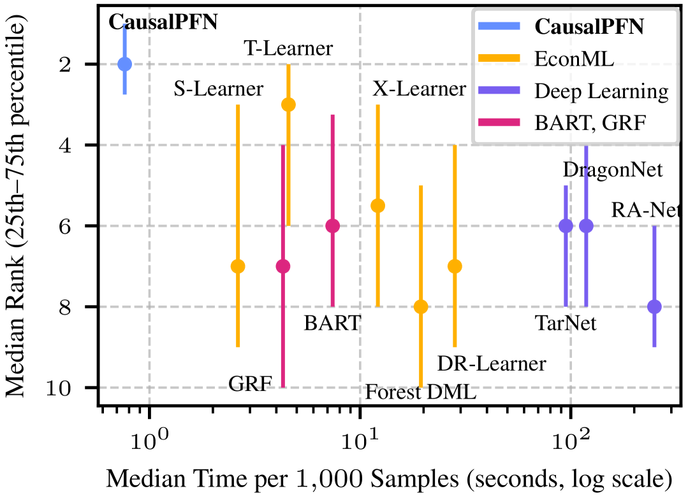

<figcaption>図1: 時間 vs 性能。IHDP, ACIC, Lalonde の 130 件の因果推論タスクにわたる比較。CausalPFN は（異質効果推定の精度で）最良の平均順位を達成しつつ、他のベースラインよりはるかに高速である。</figcaption>
</figure>

因果推論——データから介入の効果を推定すること——は、公共政策・経済学・医療をはじめ、数多くの分野で基盤的である。中心的な課題は、観測データ、すなわち明示的な介入なしに収集された記録から因果量を推定することにあり、そこでは交絡因子（confounding factors）が真の因果効果を覆い隠しうる。この課題に対処するために、さまざまな因果同定（causal identification）の設定が現れてきた。おそらく最も一般的なのは、未観測交絡（unobserved confounding）が存在しないと仮定すること（無視可能性 ignorability、またはバックドア backdoor）である。

概念的には単純な無視可能性の枠組みの中でさえ、研究者たちは過去40年にわたり数十もの専門的な因果推定器を開発してきた。代表例としては、メタ学習器（Meta-Learners）、二重頑健（doubly robust）法、二重機械学習（double machine learning, DML）、ニューラルネットワークによる手法などがある。この多数の推定器は、各応用に最も適した推定器を選択・チューニング・設計するために分野の専門知識を要するため、実務上の困難を生む。

ベイズのパラダイムは、これらの課題に対処するエレガントな枠組みを提供する。最良の推定器を手動で設計・選択するのではなく、次のようにできる。(1) もっともらしい背後の因果メカニズム、すなわちデータ生成過程（data-generating processes, DGP）に関する適切な事前分布をパラメータ化する。(2) 因果推定対象（causal estimand）を DGP パラメータの汎関数として定義する。(3) 観測データを条件とした DGP 上の事後分布を計算する。(4) 因果推定対象の事後予測分布（posterior predictive distribution, PPD）を導く。しかし、ベイズ手法の実用的な採用は依然として限られている。事後分布の計算は典型的には高コストなサンプリング法を要し、そのために研究者はしばしば、下流タスクの複雑さを必ずしも反映しない特定の DGP や事前分布の仮定を置くことになる。

一方で、深層文脈内学習（deep in-context learning）の新興分野は、観測のリスト全体を文脈として受け取ることで PPD を近似し、高コストな事後推論の過程を償却できる大規模モデルの利用を示唆している。成功例の一つが prior-fitted network（PFN）であり、表形式予測タスクで目覚ましい性能を達成した。PFN は、豊かな事前分布を表す大規模シミュレートされた DGP で訓練された Transformer アーキテクチャを用い、文脈内学習を通じて事後予測推論を行う。すなわち、入力-出力例のデータセットを文脈として与えると、新しい入力に対する出力を予測できる。PFN は計算負荷を推論時から（事前）訓練時へと移し、見たことのないデータセットに対して高速かつ正確な予測を行える単一のモデルパラメータ集合を生み出す。しかし、PFN は回帰と分類のために設計されているにすぎず、因果推論のためではない。

我々は、償却モデルの大規模訓練とベイズ因果推論を橋渡しすることを提案し、文脈内学習による因果効果推定のための Transformer モデル CausalPFN を導入する。我々の枠組みは、*無視可能性*の仮定に基づく汎用的な事前分布を活用して、シミュレートされた DGP の膨大なコレクションを生成する。これらの多様な DGP で訓練することで、本手法は観測データから直接、因果推定対象を推論することを学習する。我々のアプローチは最大7日間かかる高コストな事前訓練を必要とするが、ひとたび完了すれば、追加の訓練・ファインチューニング・ハイパーパラメータ最適化なしに、新しいデータセットでの推論にすぐ利用できる。したがって CausalPFN は、使いやすく、推論が効率的で、推定器として際立って強い性能を示す。図1は、本手法の相対的な性能と効率を標準的なベースラインと比較して示している。見たことのないデータセットでの推論では、CausalPFN は順伝播のみを必要とするのに対し、ベースライン手法はハイパーパラメータチューニングや交差検証などの追加コストを伴う。そこで我々は、新しいデータセットでの予測の総コストを反映するために、ベースラインについてはこれらすべての段階の計算時間を報告する。

<figure>

<figcaption>図2: 従来の因果推論 vs CausalPFN。(左): 分野の専門家が、与えられたデータに適切と判断した DGP に対して推定器を手動で構築または選択する。(右): 分野の専門家が事前訓練のために多様な DGP をシミュレートし、Transformer が因果推論を自動的に償却することを学習する。</figcaption>
</figure>

我々は CausalPFN のワークフローを従来の因果推論と比較して図2に示す。本研究の主要な貢献は次のとおりである。(i) 我々の知る限り初めて、シミュレートされた多様な DGP のライブラリで訓練された単一の Transformer ベースのモデルが、タスク固有のチューニングなしに、複数のデータセットにわたって専門的な推定器に匹敵するか上回りうることを示す。具体的には、CausalPFN は IHDP, ACIC, Lalonde のベンチマークで優れた平均性能を達成する。(ii) さまざまなアップリフトモデリングのタスクにおける現実世界の政策決定に対して、CausalPFN の即利用可能な競争力ある性能を強調する。(iii) CausalPFN の推定が漸近的に一致する（consistent）条件を理論的に特徴づける。(iv) 推定値に対する有限標本で較正された信用区間（credible interval）を生成するための、原理に基づく不確実性定量化の枠組みを開発する。(v) 最後に、有能な推定器としての CausalPFN の採用を容易にするため、ユーザーフレンドリーな API とともにモデルの重みを公開する。CausalPFN は高速で、即利用可能であり、追加の訓練やハイパーパラメータチューニングを一切必要としない。

## 2 Background（背景）

**因果効果推定。** 我々は因果推論に潜在結果（potential-outcomes）の枠組みを採用する。$T$ を処置（treatment）、$\boldsymbol{{\mathrm{X}}}$ を観測された共変量（covariates）、$\mathcal{T}$ を有限の処置集合とする。各 $t\in\mathcal{T}$ について、$Y_{t}$ は処置 $t$ のもとでの潜在結果（potential outcome）であり、一方で観測された（事実的 factual な）結果は $Y\coloneqq Y_{T}$ である。同時分布 $\operatorname{P}(\boldsymbol{{\mathrm{X}}},T,\{Y_{t}\}_{t\in\mathcal{T}},Y)$ を*データ生成過程*（DGP）と呼び、観測サンプル $(\boldsymbol{{\mathrm{X}}},T,Y)$ の周辺分布を観測分布あるいは $\operatorname{P}_{\mathrm{\text{obs}}}$ と呼ぶ。$\operatorname{P}_{\mathrm{\text{obs}}}$ からのサンプルが与えられたとき、中心的な目標は*条件付き期待潜在結果*（conditional expected potential outcomes, CEPO）を復元することである。

$$
\mu_{t}(\boldsymbol{{\mathrm{X}}})\coloneqq\operatorname{\mathbb{E}}[Y_{t}\mid\boldsymbol{{\mathrm{X}}}],\qquad\forall t\in\mathcal{T},\qquad\boldsymbol{{\mathrm{X}}}\sim\operatorname{P}.
$$

二値処置の場合、2つの一般的な推定対象、すなわち平均処置効果（average treatment effect, ATE）と条件付き平均処置効果（conditional average treatment effect, CATE）は CEPO から直接従う。我々は CEPO, CATE, ATE をまとめて*因果効果*（causal effects）と呼ぶ。

$$
\displaystyle\text{ATE}:\quad
$$

$$
\displaystyle\lambda\coloneqq\operatorname{\mathbb{E}}[Y_{1}-Y_{0}]=\operatorname{\mathbb{E}}[\mu_{1}(\boldsymbol{{\mathrm{X}}})-\mu_{0}(\boldsymbol{{\mathrm{X}}})],
$$
$$
\displaystyle\text{CATE}:\quad
$$

$$
\displaystyle\tau(\boldsymbol{{\mathrm{X}}})\coloneqq\operatorname{\mathbb{E}}[Y_{1}-Y_{0}\mid\boldsymbol{{\mathrm{X}}}]=\mu_{1}(\boldsymbol{{\mathrm{X}}})-\mu_{0}(\boldsymbol{{\mathrm{X}}}).
$$

観測データから因果効果を推定することは、さらなる仮定なしには不可能である。異なる DGP が同じ $\operatorname{P}_{\mathrm{\text{obs}}}$ を誘導しつつ、異なる因果効果を持ちうるからである。そこで我々は次を定義する。

###### 定義1（CEPO の同定可能性）。

各 DGP $\operatorname{P}(\boldsymbol{{\mathrm{X}}},T,\{Y_{t}\}_{t\in\mathcal{T}},Y)$ と $t\in\mathcal{T}$ について、CEPO $\mu_{t}$ は、それを観測分布 $\operatorname{P}_{\mathrm{\text{obs}}}$ の汎関数として書ける場合に*同定可能*（identifiable）である。

本稿を通じて、我々は*強い無視可能性*（strong ignorability）を仮定する。これは CEPO を同定可能にする標準的な*十分*条件である。強い無視可能性は、観測共変量を条件としたとき、処置割り当てがすべての $t\in\mathcal{T}$ について正の確率を持ち、かつすべての潜在結果から独立であることを要請する。

###### 仮定1（強い無視可能性）。

(i) すべての $t\in\mathcal{T}$ について $Y_{t}\perp\!\!\!\!\perp T\mid\boldsymbol{{\mathrm{X}}}$（無交絡 Unconfoundedness）、かつ (ii) すべての $t\in\mathcal{T}$ について $\operatorname{P}(T=t\mid\boldsymbol{{\mathrm{X}}})>0$ がほとんど至るところ（a.e.）成り立つ（正値性 Positivity）。

**ベイズ因果推論。** 因果推論のベイズ的定式化は、DGP に対する明示的な尤度モデルを考える。$\psi$ を DGP $\operatorname{P}^{\psi}\left(\boldsymbol{{\mathrm{X}}},T,\{Y_{t}\}_{t\in\mathcal{T}},Y\right)$ を添字づけるパラメータとする。事前分布 $\pi(\psi)$ はパラメータ $\psi$ に関する分野知識を符号化する。観測分布 $\operatorname{P}^{\psi}_{\mathrm{\text{obs}}}$ から得られる i.i.d. の観測 $\mathcal{D}_{\mathrm{\text{obs}}}=\left\{(\boldsymbol{{\mathrm{x}}}^{(n)},t^{(n)},y^{(n)})\right\}_{n=1}^{N}$ が与えられると、ベイズ則は事後分布 $\pi\left(\psi\mid\mathcal{D}_{\mathrm{\text{obs}}}\right)$ を与える。任意の汎関数 $g(\psi)$——例えば ATE に対する $g(\psi)=\operatorname{\mathbb{E}}^{\psi}[Y_{1}-Y_{0}]$——について、事後予測分布（PPD）

$$
\pi^{g}\left(\cdot\mid\mathcal{D}_{\mathrm{\text{obs}}}\right)\coloneqq B\;\mapsto\;\int\mathbb{I}\left(g(\psi)\in B\right)\pi(\psi\mid\mathcal{D}_{\mathrm{\text{obs}}})\mathop{}\!\mathrm{d}\psi,\qquad\forall B\in\mathcal{B},
$$

は事後分布 $\pi\left(\psi\mid\mathcal{D}_{\mathrm{\text{obs}}}\right)$ によって誘導される（$\mathcal{B}$ は $\mathbb{R}$ 上のボレル $\sigma$-代数を表す）。したがって点推定（事後平均）と信用区間はこれらの誘導された事後分布から自動的に生じる。事後分布が閉形式で得られることはまれなので、マルコフ連鎖モンテカルロ（MCMC）や変分推論（variational inference）のような近似推論に頼ることになる。そうした技法は、ノンパラメトリックな BART モデル、ディリクレ過程、ガウス過程を含む柔軟な事前分布とともに適用されてきた。要するに、ベイズのパラダイムは因果推定対象に関する推論の統一的な枠組みを提供し、自動的な不確実性定量化をもたらす。

**Prior-Fitted Networks による事後予測推論の償却。** データセットごとに新しい事後推論を実行することは、特に高次元の共変量では計算負荷が大きい。最近の研究は、文脈内 Transformer がベイズ予測を*償却*できることを示している。すなわち、テスト時に事後分布からサンプリングする代わりに、文脈集合を直接 PPD へ写像するよう単一のネットワークを訓練する。PFN はこのアイデアを教師あり学習に対して具体化する。

教師ありデータセット $\mathcal{D}^{\text{SL}}=\{(\boldsymbol{{\mathrm{x}}}^{(n)},y^{(n)})\}_{n=1}^{N}$ と、$\operatorname{P}^{\phi}\left(\boldsymbol{{\mathrm{X}}},Y\right)$ を添字づけるパラメータ $\phi$ 上の事前分布 $\pi^{\text{SL}}$ を考える。新しい入力 $\boldsymbol{{\mathrm{x}}}$ の出力を予測するベイズ的アプローチは、PPD

$$
\operatorname{P}\left(Y\mid\boldsymbol{{\mathrm{X}}}=\boldsymbol{{\mathrm{x}}},\mathcal{D}^{\text{SL}}\right):=\int\operatorname{P}^{\phi}\left(Y\mid\boldsymbol{{\mathrm{X}}}=\boldsymbol{{\mathrm{x}}}\right)\pi^{\text{SL}}\left(\phi\mid\mathcal{D}^{\text{SL}}\right)\mathop{}\!\mathrm{d}\phi.
$$

を用いることである。事後分布 $\pi^{\text{SL}}\left(\phi\mid\mathcal{D}^{\text{SL}}\right)$ を MCMC や変分推論で近似する代わりに、PFN は単一の Transformer モデル $q_{\theta}\left(Y\mid\boldsymbol{{\mathrm{X}}},\mathcal{D}^{\text{SL}}\right)$ を用いて PPD を直接パラメータ化し、*data-prior 損失*

$$
\ell_{\theta}:=\operatorname{\mathbb{E}}_{\phi\sim\pi^{\text{SL}},\ \mathcal{D}^{\text{SL}}\cup\{\boldsymbol{{\mathrm{X}}},Y\}\sim\operatorname{P}^{\phi}}\left[-\log q_{\theta}\!\left(Y\mid\boldsymbol{{\mathrm{X}}},\mathcal{D}^{\text{SL}}\right)\right].
$$

を最小化する。決定的に重要なのは、訓練が*事前分布*からのサンプル $(\phi,\mathcal{D}^{\text{SL}})$ のみを必要とし、事後分布のサンプリングを一切要さないことである。適切に豊かな事前分布があれば、単一の PFN は多様な回帰・分類問題に*すぐに*適用でき、しばしば専用モデルを上回る。

## 3 The Mathematical Framework of CausalPFN（CausalPFN の数理的枠組み）

我々の主たる関心の推定対象は定義1の CEPO である。式 (2) と (3) で示したように、CEPO は ATE と CATE の両方の推定を直接可能にする。したがって我々は、これらの量を観測データから正確に推論できる推定器の開発に焦点を当てる。具体的には、§2 で導入したベイズ因果推論のパラダイムに従い、CEPO を $\mu_{t}\left(\boldsymbol{{\mathrm{X}}}\,;\,\psi\right)$ とパラメータ化する。§4 で明示的に設計する、DGP 上の適切に豊かな事前分布 $\pi$ が与えられたとき、我々の目標を CEPO の事後予測分布として定義する。

###### 定義2（CEPO-PPD）。

各 $t\in\mathcal{T}$ と共変量ベクトル $\boldsymbol{{\mathrm{x}}}$ について、*CEPO-PPD* は

$$
\pi^{\mu_{t}}(\cdot\mid\boldsymbol{{\mathrm{X}}}=\boldsymbol{{\mathrm{x}}},\mathcal{D}_{\mathrm{\text{obs}}})\;\coloneqq\;B\;\mapsto\;\int\mathbb{I}\left(\mu_{t}(\boldsymbol{{\mathrm{X}}}=\boldsymbol{{\mathrm{x}}}\,;\,\psi)\in B\right)\pi(\psi\mid\mathcal{D}_{\mathrm{\text{obs}}})\mathop{}\!\mathrm{d}\psi,\qquad\forall B\in\mathcal{B}.
$$

**CEPO の一致推定。** CEPO-PPD は、事後分布に符号化された CEPO に関する認識論的不確実性（epistemic uncertainty）を捉える。集中した分布 $\pi^{\mu_{t}}$ は、観測 $\mathcal{D}_{\mathrm{\text{obs}}}$ が情報的であり、真の CEPO を正確に突き止めるのに十分なサンプルが利用可能であることを示し、一方で高分散の分布は、データが推定に十分でないことを意味する。これを踏まえ、我々は、観測 $\mathcal{D}_{\mathrm{\text{obs}}}$ のサイズを増やすことで CEPO-PPD から真の CEPO を正確に復元できるのはどのような条件下かを研究する。これは、CEPO-PPD が CEPO の一致推定を可能にする事前分布 $\pi$ への必要十分条件を与える、次の非形式的な結果（付録 B で形式的に再述・証明される）によって与えられる。

###### 命題1（非形式的）。

緩やかな正則性の仮定の下で、ほとんどすべての $\psi^{\star}\sim\pi$ と任意の i.i.d. サンプル集合 $\mathcal{D}_{\mathrm{\text{obs}}}\sim\operatorname{P}^{\psi^{\star}}_{\mathrm{\text{obs}}}$ について、$|\mathcal{D}_{\mathrm{\text{obs}}}|\to\infty$ のとき次が成り立つ。

$$
\operatorname{\mathbb{E}}^{\pi^{\mu_{t}}}\bigl{[}\mu\mid\boldsymbol{{\mathrm{X}}},\mathcal{D}_{\mathrm{\text{obs}}}\bigr{]}\overset{a.s.}{\longrightarrow}\mu_{t}(\boldsymbol{{\mathrm{X}}}\,;\,\psi^{\star}),\quad\forall t\in\mathcal{T},\quad\boldsymbol{{\mathrm{X}}}\sim\operatorname{P}^{\psi^{\star}},
$$

これが成り立つのは、事前分布 $\pi$ の台（support）が、ほとんど至るところ同定可能な CEPO を持つ $\psi$ のみを含む場合に限る（必要十分）。

（証明の概略）同じ観測分布 $\operatorname{P}_{\mathrm{\text{obs}}}^{\psi}$ を共有するすべての DGP $\psi$ を1つの同値類にまとめ、結果として得られる商空間上に $\pi$ から得られる新しい事前分布を誘導する。Doob の定理——ベイズ一致性理論の古典的結果——により、漸近的に多くの観測が与えられると、この新しい事前分布上の事後分布はほとんど確実に真の同値類に集中する。したがって、各同値類の中で一定であるような観測の任意の汎関数について、その事後予測はほとんど確実に真の値へ収束する。重要なことに、関心のある因果汎関数 $\mu_{t}$ は、対応する DGP が同定可能な CEPO を持つ場合に限り、観測の汎関数として書ける。よって、同定可能性は、$\mu_{t}$ が同値類全体で一定であること、ひいては一致性の結果が成り立つことの必要十分条件である。

（注意1）本論文のアルゴリズムは*強い無視可能性*を用いるが、命題1自体は完全に一般的な結果であり、必ずしも無視可能でないが定義1の同定可能性を満たす CEPO を持つ DGP へも拡張できる。実用的な設定で重要なのは、事前分布 $\pi$ が強い無視可能性を課すとき、命題1は CEPO-PPD が真の CEPO を一致的に復元することを示唆する、という点である。

（注意2）命題1は、事前分布 $\pi$ に対する2つの鍵となる設計原理を浮き彫りにする。$(i)$ $\pi$ は同定不能なケースを排除しなければならない。$(ii)$ ひとたび同定可能性が確保されれば、$\pi$ を広げるほど、特定の $\psi^{\star}$ がその台に入る可能性が高まり、その $\psi^{\star}$ に対する真の CEPO の一致復元が可能になる。

**CEPO-PPD の学習。** CEPO-PPD が真の CEPO の推定に有用であることを示したので、次にそれをどう学習するかを述べる。PFN に着想を得て、我々は単一の Transformer $q_{\theta}$ を訓練して完全な予測分布 $\pi^{\mu_{t}}$ を近似する。このモデルを当てはめるため、次の損失を導入する。

###### 定義3（因果 data-prior 損失）。

任意の $t\in\mathcal{T}$ について、因果 data-prior 損失を次のように定義する。

$$
\displaystyle\mathcal{L}_{t}(\theta)\;\coloneqq\;\operatorname{\mathbb{E}}_{\psi\sim\pi,\ \mathcal{D}_{\mathrm{\text{obs}}}\cup\{\boldsymbol{{\mathrm{X}}}\}\ \sim\ \operatorname{P}^{\psi}_{\mathrm{\text{obs}}}}\left[-\log{q_{\theta}(\mu_{t}(\boldsymbol{{\mathrm{X}}}\,;\,\psi)\mid\boldsymbol{{\mathrm{X}}},t,\mathcal{D}_{\mathrm{\text{obs}}})}\right].
$$

付録 C で、我々は $\mathcal{L}_{t}(\theta)$ を最小化することが、真の CEPO-PPD と $q_{\theta}$ の間の KL ダイバージェンスをも最小化し、すべての $t\in\mathcal{T}$ について $q_{\theta}\bigl{(}\cdot\mid\boldsymbol{{\mathrm{X}}},t,\mathcal{D}_{\mathrm{\text{obs}}}\bigr{)}\approx\pi^{\mu_{t}}\bigl{(}\cdot\mid\boldsymbol{{\mathrm{X}}},\mathcal{D}_{\mathrm{\text{obs}}}\bigr{)}$ に至ることを示す。この訓練過程全体は、計算負荷を推論から事前訓練へと移す。すなわち、テスト時に事後分布 $\pi(\psi\mid\mathcal{D}_{\mathrm{\text{obs}}})$ を評価して事後推論を実行するのではなく、モデルは観測データを対応する予測分布へ直接写像することを学習する。モデルがよく当てはめられ、事前分布が命題1の仮定を満たし、$\mathcal{D}_{\mathrm{\text{obs}}}$ が十分に大きいとき、予測された $q_{\theta}$ は真の CEPO を正確に突き止める。

図3は、確率的勾配降下を用いた因果 data-prior 損失の最適化を視覚的に示す。各反復で、DGP $\psi_{i}\sim\pi$ をサンプリングし、この DGP から観測データセット $\mathcal{D}_{\mathrm{\text{obs}}}$ を生成し、クエリ点 $(\boldsymbol{{\mathrm{x}}},t)$ を選ぶ。真値の CEPO $\mu_{t}\left(\boldsymbol{{\mathrm{X}}}=\boldsymbol{{\mathrm{x}}}\,;\,\psi_{i}\right)$ を計算（シミュレート）し、観測データとクエリの両方をモデルに与える。モデルは CEPO-PPD を出力し、我々は真の CEPO 値に割り当てる確率を増やすよう勾配降下で $\theta$ を更新する。訓練を通じて、$\theta$ は data-prior 損失を最小化し、事後分布を明示的に計算することなく、暗黙裡に事後予測推論を行い予測分布 $\pi^{\mu_{t}}$ を推定することを学習する。

<figure>

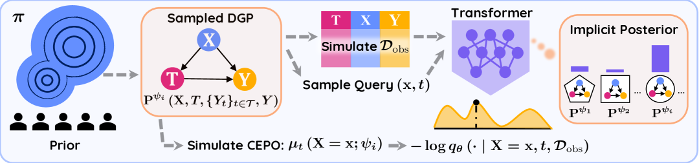

<figcaption>図3: 因果 Data-Prior 訓練。各反復で添字 ψ_i ∼ π がサンプリングされ（左）、DGP P^{ψ_i}(X, T, {Y_t}, Y) を生む。この DGP から観測の文脈 D_obs とクエリ (x, t)、およびその真の μ_t(X=x; ψ_i) をシミュレートする（中央）。(x, t, D_obs) を Transformer に通すと CEPO-PPD q_θ(· | X=x, t, D_obs) を予測し（黄色）、これは決して明示的には計算されない暗黙の事後分布 π(· | D_obs) から導かれる（右）。我々は因果 data-prior 損失を最小化するよう θ を訓練する（下）。</figcaption>
</figure>

**因果効果の点推定と分布推定。** 背後の $\psi^{\star}$ から得られた観測データ $\mathcal{D}_{\mathrm{\text{obs}}}$ が与えられたとき、CEPO の自然な点推定は、予測された CEPO-PPD の期待値、すなわち $\operatorname{\mathbb{E}}^{q_{\theta}}\left[\mu\mid\boldsymbol{{\mathrm{X}}},t,\mathcal{D}_{\mathrm{\text{obs}}}\right]\approx\mu_{t}(\boldsymbol{{\mathrm{X}}};\psi^{\star})$ である。これらの CEPO 推定は、式 (3) を用いて CATE の点推定を、式 (2) を用いて $\mathcal{D}_{\mathrm{\text{obs}}}$ 内のユニットにわたる経験平均によって ATE の点推定を形成することもできる。

点推定を超えて、推定された CEPO-PPD は因果効果に関する認識論的不確実性も捉えうる。我々は $q_{\theta}(\cdot\mid\boldsymbol{{\mathrm{X}}},t=1,\mathcal{D}_{\mathrm{\text{obs}}})$ と $q_{\theta}(\cdot\mid\boldsymbol{{\mathrm{X}}},t=0,\mathcal{D}_{\mathrm{\text{obs}}})$ からのサンプリングを通じて、CEPO・CATE・ATE のまわりの信用区間を構成するために $q_{\theta}$ を用いることができる。そしてこれらの区間を用いて、推定した因果効果の不確実性を定量化できる。

## 4 Implementing CausalPFN（CausalPFN の実装）

<figure>

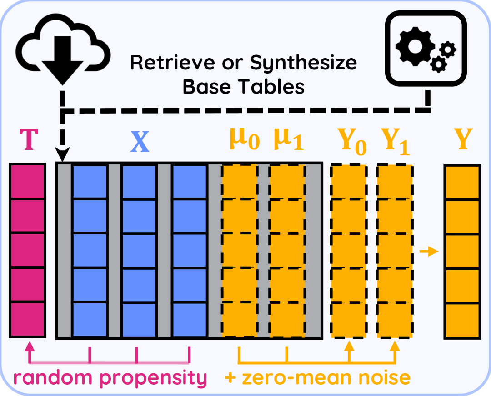

<figcaption>図4: 事前分布（prior）の構築。多様なベーステーブル（OpenML または合成 TabPFN）をサンプリングし、共変量 X を選び、ランダムな傾向スコアモデルで処置 T を引き、列 μ_0, μ_1 を選んで平均ゼロのノイズを加えて Y_0, Y_1 を作る、という流れ。</figcaption>
</figure>

§3 は同定と処置集合 $\mathcal{T}$ の最も一般的な形で枠組みを提示したが、実装では二値処置、すなわち $\mathcal{T}=\{0,1\}$ と強い無視可能性に焦点を当てる。これらの仮定は実務家が遭遇する最も一般的な設定を反映し、自然な出発点となる。実装とアルゴリズムをより一般的な設定へ拡張することは将来の課題として残す。

**スケーラブルな事前分布。** ここでは、命題1で確立した理論的要件を満たす、DGP 上の適切な事前分布 $\pi$ の設計に焦点を当てる。この事前分布は2つの要因のバランスを取らねばならない。第一に、現実世界のシナリオを近似する十分な被覆を持つ豊かな DGP 集合を含むべきである——TabPFN, TabDPT, TabICL のような成功した表形式予測モデルで用いられる事前分布と同様に。第二に、そして因果推論に固有のこととして、我々の事前分布のすべての DGP は、事前分布の同定可能性を直接含意する強い無視可能性を満たさねばならない。さらに、生成された DGP は、定義3の因果 data-prior 損失が訓練のために要求するように、真値の CEPO へアクセスできるものでなければならない。

これらの要件に対処するため、我々は*任意の*ベーステーブルを標準的な表形式事前分布から有効な因果データセットへ変換できる手続きを開発する（図4に図示）。(i) $N$ 行のベーステーブルを、表形式データの大規模ライブラリから取得するか合成する（詳細は §D.1）。(ii) 共変量の数を変化させながらランダムに列を選び $\boldsymbol{{\mathrm{X}}}$ とする。(iii) 他の2つの列を選び、$\mu_{0}(\boldsymbol{{\mathrm{X}}}),\mu_{1}(\boldsymbol{{\mathrm{X}}})$ とラベルし直す。(iv) 任意で $\mu_{0}(\boldsymbol{{\mathrm{X}}})$ と $\mu_{1}(\boldsymbol{{\mathrm{X}}})$ に平均ゼロのノイズを加えて $Y_{0}$ と $Y_{1}$ を得るか、単に $Y_{0}=\mu_{0}(\boldsymbol{{\mathrm{X}}})$、$Y_{1}=\mu_{1}(\boldsymbol{{\mathrm{X}}})$ とする。これら4ステップは同時分布 $(\boldsymbol{{\mathrm{X}}},Y_{0},Y_{1})$ からのサンプルをシミュレートする。(v) 共変量を処置のロジットへ写像するため、TabPFN と同様の合成関数を活用してランダムな関数 $f$ を生成する。(vi) 二値処置 $T\sim\mathrm{Bernoulli}\left(\mathrm{Sigmoid}\left(f(\boldsymbol{{\mathrm{X}}})\right)\right)$ をサンプリングする。(vii) 最後に、観測された結果 $Y:=Y_{T}$ を形成する。

上記の手続きは、背後の DGP から $\{t^{(n)},\boldsymbol{{\mathrm{x}}}^{(n)},\mu_{0}^{(n)},\mu_{1}^{(n)},y^{(n)}\}_{n=1}^{N}$ のコレクションを「シミュレート」し、これを用いて観測データをサンプリングし、訓練に必要な CEPO を得られる（図3を想起されたい）。このアプローチは強い無視可能性を*設計によって*保証する。処置 $T$ は $\boldsymbol{{\mathrm{X}}}$ のみから決まるので、潜在結果 $Y_{0},Y_{1}$ から条件付き独立だからである。加えて、シグモイド関数を適用することで $0<P(T=1\mid\boldsymbol{{\mathrm{X}}})<1$ を保証し、正値性を満たす。この手続きは主に二値処置を対象とするが、有限の離散処置へ自然に拡張できる。

$\pi$ の多様性の側面については、既存の表形式基盤モデルの経験的成功と、生成過程における意図的な設計に依拠する。実在の表と合成の表の混合から共変量を直接サンプリングすると、モデルが推論時に直面するシナリオを反映しやすいデータが得られる。我々は共変量と潜在結果に分布上の仮定を置かない。§D.1 では、合成 DGP における処置効果の異質性と正値性を制御する追加機構、および事前分布生成過程の詳細な構成を述べる。

**モデルアーキテクチャと並列訓練。** 我々は $q_{\theta}$ を、行トークンの列を*文脈*（すなわち $\mathcal{D}_{\mathrm{\text{obs}}}$）として受け取る PFN スタイルの Transformer エンコーダでモデル化する。各トークンは三つ組 $(t^{(n)},\boldsymbol{{\mathrm{x}}}^{(n)},y^{(n)})$ を埋め込む。各反復で、$B_{Q}$ 個のバッチ化された*クエリ*トークン $(t,\boldsymbol{{\mathrm{x}}})$ を埋め込む。次に20層の自己注意と MLP 層を適用し、最後の射影層を経て、バッチ化されたクエリ内のすべての $(t,\boldsymbol{{\mathrm{x}}})$ 対について $q_{\theta}\left(\cdot\mid\boldsymbol{{\mathrm{x}}},t,\mathcal{D}_{\mathrm{\text{obs}}}\right)$ を得る。Transformer は PFN で用いられる非対称マスキングを使う。文脈トークンとクエリトークンの両方が文脈トークンのみに注意を向け、予測された CEPO-PPD が相互に独立であることを保証する。

各 CEPO-PPD をモデル化するため、我々はそれを量子化されたヒストグラムで近似する。結果軸を $L=1024$ ビンに離散化し、ネットワークがクエリトークンを $L$ 個のロジットへ射影するようにする。次に SoftMax を適用してロジットを量子化分布 $q_{\theta}(\cdot\mid\boldsymbol{{\mathrm{x}}},t,\mathcal{D}_{\mathrm{\text{obs}}})[\ell],\forall\ell\in[L]$ に変える。勾配更新の各ラウンドで、真の CEPO $\mu_{t}(\boldsymbol{{\mathrm{x}}})$ に小さな $\sigma$ のガウス分布を置き、それをビン上で積分してガウス量子化確率 $\mathcal{N}(\mu_{t}(\boldsymbol{{\mathrm{x}}}),\sigma^{2})[\ell]$ を得て、*ヒストグラム損失*を最小化する。

$$
\texttt{HL}\bigl{[}{\mu}_{t}(\boldsymbol{{\mathrm{x}}})\,\|\,q_{\theta}\bigr{]}=-\sum_{\ell=1}^{L}{\mathcal{N}({\mu}_{t}(\boldsymbol{{\mathrm{x}}}),\sigma^{2})}[\ell]\cdot\log q_{\theta}[\ell].
$$

この損失は因果 data-prior 損失 (9) の近似形であり、$\sigma\to 0$ かつ $L\to\infty$ の極限で一致する。ヒストグラム損失は連続な CEPO-PPD に対する扱いやすい代理を提供する。

<figure>

<figcaption>図5: アーキテクチャ・訓練・推論の詳細。(左): 観測データと、真の CEPO 値を伴う B_Q 個のクエリのバッチが事前分布からサンプリングされる。処置・共変量・結果を含む各観測行は文脈トークンを成し、クエリトークンは処置と共変量のみから成る。(中央): 文脈トークンとクエリトークンは非対称な注意マスキングを持つ Transformer エンコーダに与えられ、文脈トークンとクエリトークンの両方が文脈トークンのみに注意を向ける。(右下): 出力トークンは 1024 次元のロジットベクトルへ射影され、softmax されて離散的な事後予測分布（CEPO-PPD）を成す。次に、各出力トークンに対応する真の CEPO 値を、狭い幅のガウスノイズを加えて平滑化し、交差エントロピー（ヒストグラム）損失を最小化して訓練する。これはヒストグラム損失の訓練を安定化するためによく使われる工夫である。(右上): 推論時には、点推定として CEPO-PPD の平均を返し、信用区間を推定するために CEPO-PPD からサンプリングする。</figcaption>
</figure>

詳細なアーキテクチャと訓練の設定、および因果効果の点推定と区間を得る手続きは、図5に図示され再訪される。パラメータ数・最適化設定・訓練計算量・推論時の技法のさらなる詳細については §D.2 を参照されたい。

## 5 Experiments（実験）

**ベースライン因果効果推定器。** 我々は広範なベースライン群と比較する。これには二重機械学習（DML）、二重頑健学習器（DR-Learner）、および EconML パッケージの一部である T-, S-, X-, ドメイン適応学習器（DA-Learner）が含まれる。さらに、CATENets ライブラリ経由で実装された TarNet, DragonNet, RA-Net といった深層学習ベースの手法も含む。最後に、逆傾向重み付け（inverse propensity weighting, IPW）、ベイズ回帰木（BART）、一般化ランダムフォレスト（generalized random forests, GRF）と比較する。IPW を除くすべてのベースラインは CATE と ATE の両方の推定を提供する。

*重要なことに、我々はほとんどのベースラインをグリッド探索による交差検証でチューニングする。ハイパーパラメータの集合とデフォルトハイパーパラメータでの結果はすべて §D.3 に詳述する。*

**真値の効果を持つベンチマーク。** ごく一部のベンチマークは真値の因果効果を提供し、推定誤差を直接測定できる。我々は ATE については相対誤差を、CATE については異質効果推定の精度（precision in estimation of heterogeneous effects, PEHE、予測 CATE と真 CATE の二乗平均平方根偏差として定義）を報告する。表1は、4つの標準的なデータセット群——IHDP の100実現、ACIC 2016 の10実現、Lalonde CPS と Lalonde PSID のコホート（その因果効果は RealCause により提供され、最初の10実現を用いる）——で CausalPFN をすべてのベースラインと比較する。我々のモデルは、IHDP データセットの ATE を除き、すべてのベンチマークで上位3モデル内に留まり、CATE と ATE の両タスクで優れた性能を示す。各手法の CATE 全体の性能を評価するため、PEHE がデータセット間で標準化されていないことを踏まえ、全130実現での各手法の平均順位（PEHE に基づく）を計算する。ATE については相対誤差を直接平均する。CausalPFN は両方の平均指標ですべてのベースラインを上回る。注目すべきは、対象データセットで直接訓練される他の手法と異なり、我々のモデルは完全にシミュレートデータで訓練され、評価データを*一度も*見ないことである。表1の一部のベースライン推定器は特定のデータセットで良い性能を示すが、他では劣る。対照的に CausalPFN の一貫した性能は、償却的アプローチがタスク固有の推定器設計という手作業の負担を取り除きうる可能性を示唆する。

表1: CATE & ATE の結果。列はベンチマーク群（IHDP, ACIC 2016, Lalonde CPS/PSID）に対応する。（左半分）平均 PEHE と全タスクをプールしたときの平均順位。（右半分）平均 ATE 相対誤差と全タスクでの平均。Lalonde の PEHE は千単位。列ごとの上位3つを青・紫・橙で示す。「—」のセルはその手法が適用不能または発散したことを示す。

（表本体は原典参照。CausalPFN は平均順位 2.22、平均 ATE 相対誤差 0.18 で全ベースライン中最良。）

**マーケティング無作為化試験での政策評価。** 真値の CATE は合成・準合成データセットでしか得られない。しかし無作為化比較試験（randomized controlled trial, RCT）が利用可能なら、そこから導かれる政策の性能を評価することで CATE 推定器の質を依然として評価できる。そうした政策を評価する一般的なツールが *Qini 曲線*であり、これはユニットを予測 CATE の降順にランク付けしたときの累積処置効果をプロットする。

形式的に、$(y^{(n)},t^{(n)})_{n=1}^{N}$ を RCT からの結果と二値処置とし、$\widehat{\tau}_{n}$ を対応する CATE 推定値で $\widehat{\tau}_{1}\geq\cdots\geq\widehat{\tau}_{N}$ と順序づけられたものとする。次を定義する。

$$
\lambda(q)\coloneqq\sum_{n=1}^{\lfloor qN\rfloor}\Bigl{(}\tfrac{t^{(n)}y^{(n)}}{r(q)}-\tfrac{(1-t^{(n)})y^{(n)}}{1-r(q)}\Bigr{)},\qquad Q(q)\coloneqq q\cdot\lambda(q)/\lambda,\qquad 0\leq q\leq 1,
$$

ここで $r(q)=\tfrac{1}{\lfloor qN\rfloor}\sum_{n}^{\lfloor qN\rfloor}t^{(n)}$ は最初の $q$ 分位のユニットの経験的処置率である。データが RCT から来るため、$\lambda(q)$ は予測 CATE でランク付けした上位 $q$ 分位のユニットの ATE を不偏推定する。$Q(q)$ を処置割合 $q$ に対してプロットすると（正規化された）Qini 曲線が得られ、この曲線の下の面積が *Qini スコア*と呼ばれる。ランダムなランク付けはベースライン曲線として $(0,0)$ から $(1,1)$ への直線を生む。Qini 曲線がこの線より上にあるほど、モデルはより大きな CATE 値を持つ高インパクトなユニットをうまく優先しており、より大きなリフトと政策上の便益につながる。

<figure>

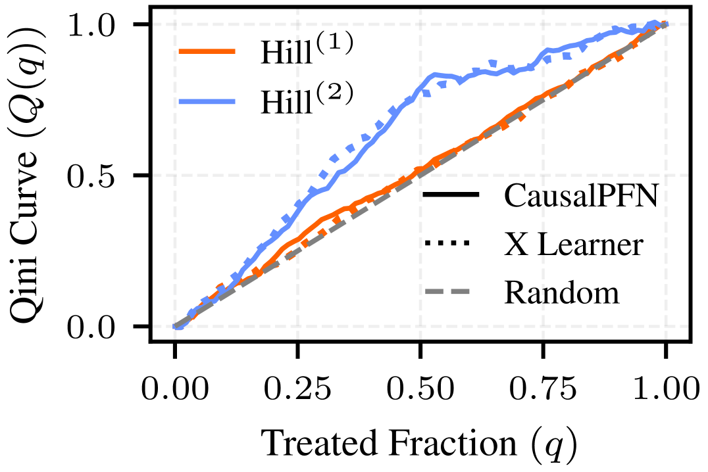

<figcaption>図6: Hill (1) & Hill (2) の Qini 曲線。</figcaption>
</figure>

我々は scikit-uplift ライブラリの5つの大規模マーケティング RCT で CausalPFN をベンチマークする。最初のデータセット Hillstrom は64,000人の顧客を含み、3つの処置——メールなし、紳士向け商品の広告メール、婦人向け商品の広告メール——のいずれかにランダムに割り当てる。結果は2週間以内にウェブサイト訪問が起きたか否か（二値）である。我々は2つの因果タスクを考える。Hill (1) は紳士向け商品メール（処置）vs メールなし（対照）、Hill (2) は婦人向け商品メール vs メールなしである。我々は CausalPFN（5分割の honest splitting）と X-Learner を用いて CATE を推定する。図6は Qini 曲線を示し、CausalPFN がターゲティング範囲全体で X-Learner に近接する。注目すべきは、Hill (2) がはるかに大きな利得を示すことで、*ウェブサイト訪問数の増加には、紳士向けより婦人向け商品の広告キャンペーンに注力する方が多くの利得を生みうる*ことを示唆する。我々はさらに4つの大規模キャンペーン——Lenta, Retail Hero (X5), Megafon (Mega), Criteo——でも CausalPFN を評価し、各々約 $10^{6}$ 行を持つ。扱いやすさのため、層化された 50k のサブサンプルで Qini スコアを計算する。表2は CausalPFN が最良の平均性能を達成することを示す。しかし、フルテーブル（§D.4 の表5参照）で実行すると性能の低下が見られ、これは大規模テーブルにおける PFN スタイル Transformer の既知の文脈長制約と整合する。それでも、強いサブサンプル結果は、CausalPFN をより長い文脈へスケールする可能性を浮き彫りにし、これは重要な将来の方向性として残る。

**不確実性と較正。** §3 で述べたように、各ユニット共変量 $\boldsymbol{{\mathrm{x}}}$ について、CausalPFN は CATE と CEPO の点推定と信用区間の両方を生成できる。我々は量子化分布 $q_{\theta}(\cdot\mid\boldsymbol{{\mathrm{X}}}=\boldsymbol{{\mathrm{x}}},t,\mathcal{D}_{\mathrm{\text{obs}}})$ から10,000サンプルを引き、任意の所望の有意水準 $\alpha$ で信用区間を構成する。ここでは、これらの区間を、モデルの較正に焦点を当てて評価する。また命題1の鍵となる仮定——推論時の DGP $\psi^{\star}$ が事前分布 $\pi$ の台の中にあるか、この仮定が破られたときモデルがどう振る舞うか——も評価する。

我々は、分布内（in-distribution）と分布外（out-of-distribution, OOD）の両シナリオをシミュレートするため、合成 DGP の族を定義する。各 DGP は共変量 $\boldsymbol{{\mathrm{X}}}$ を一様分布からサンプリングし、処置ロジット関数 $f$ と $t\in\{0,1\}$ の CEPO 関数 $\mu_{t}$ を定義し、$T\sim\mathrm{Bernoulli}\left(\mathrm{Sigmoid}\left(f(\boldsymbol{{\mathrm{X}}})\right)\right)$ で処置を割り当て、潜在結果を $Y_{t}=\mu_{t}(\boldsymbol{{\mathrm{X}}})+\epsilon_{t}$ として生成する。ここで $\epsilon_{t}$ は標準一様・ガウス・ラプラスのいずれかから引かれる。我々は2つの DGP 族を考える。$f$ と $\mu_{t}$ が正弦波成分を持つ関数である Sinusoidal、および $f$ と $\mu_{t}$ が次数の異なる多項式である Polynomial である（詳細な構成は §D.5 参照）。CausalPFN はテスト対象と同じ族で訓練されるか、別の族で訓練される（OOD）。

<figure>

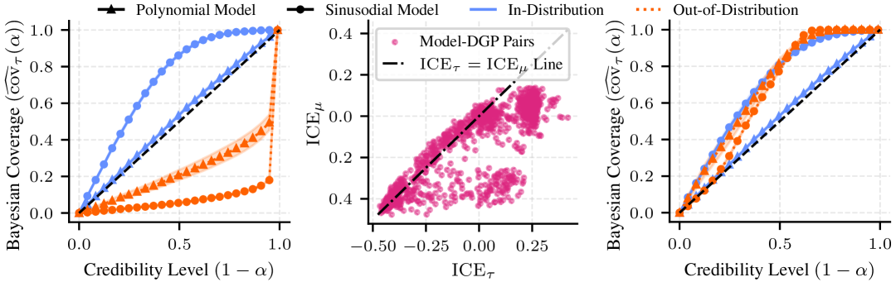

<figcaption>図7: 較正。(左): CATE の被覆率 vs 名目信用度。分布内 DGP（青）は対角線上またはそれ以上にあり（較正済み/保守的）、OOD DGP（橙）はそれ以下に落ちる（過信）。(中央): モデル-DGP 対にわたって、CATE の ICE（x軸）が回帰の ICE（y軸）を上回る。(右): 回帰 ICE に基づく温度スケーリングにより、分布内・分布外いずれの DGP でもモデルは較正済みか保守的になる。</figcaption>
</figure>

共変量 $\boldsymbol{{\mathrm{x}}}$ と有意水準 $\alpha$ を持つユニットについて、真の CATE が $q_{\theta}$ からのサンプルで得られる予測 $100(1-\alpha)\%$ 区間内にあるとき、$\tau(\boldsymbol{{\mathrm{x}}})$ は*被覆された*（covered）と言う。ベイズ被覆率を名目水準 $\alpha$ に対してプロットすると CATE 較正曲線が得られる。図7（左）に示すように、CausalPFN は分布内設定では信頼できる較正を示すが、OOD DGP（$\psi^{\star}\not\sim\pi$）で評価すると深刻に過信になる。これは、ニューラルモデルがしばしば分布シフト下で病的な過信を示すという先行観察と整合する。

これを補正するため、我々はモデルのロジットから量子化 CEPO-PPD を出力する SoftMax に温度パラメータ $\theta_{T}$ を適用する。我々は較正誤差を最小化するよう $\theta_{T}$ をチューニングしたいが、$\tau(\boldsymbol{{\mathrm{x}}})$ はテスト時に決して観測されないため、直接の CATE 較正は不可能である。代わりに、観測データに基づく*回帰較正*（regression calibration）を導入する。観測された三つ組 $(t,\boldsymbol{{\mathrm{x}}},y)$ は、$y$ がモデルの CEPO-PPD $\mu_{t}\left(\boldsymbol{{\mathrm{X}}}=\boldsymbol{{\mathrm{x}}}\,;\,\psi^{\star}\right)$ に対する予測区間内にあるとき、その予測信用区間に被覆される。これを踏まえ、$\widehat{\mathrm{cov}}_{\mu}(\alpha)$ と $\widehat{\mathrm{cov}}_{\tau}(\alpha)$ をそれぞれ回帰較正曲線と CATE 較正曲線の水準 $\alpha$ におけるベイズ被覆率とし、次を定義する。

$$
\mathrm{ICE}_{\mu}\coloneqq\int_{0}^{1}\bigl{(}\widehat{\mathrm{cov}}_{\mu}(\alpha)-\alpha\bigr{)}\,\mathop{}\!\mathrm{d}\alpha,\text{ and }\qquad\mathrm{ICE}_{\tau}\coloneqq\int_{0}^{1}\bigl{(}\widehat{\mathrm{cov}}_{\tau}(\alpha)-\alpha\bigr{)}\,\mathop{}\!\mathrm{d}\alpha,
$$

これを回帰と CATE の積分被覆誤差（integrated coverage error, ICE）とする（負値は過信を意味する）。

$\widehat{\mathrm{cov}}_{\mu}$ が較正されているとは期待しないことに注意されたい。回帰区間は CEPO の認識論的不確実性と $Y$ の還元不能な（偶然的 aleatoric な）ノイズを併せ持つので、$\mathrm{ICE}_{\mu}$ は偏る。それでも有用な信号を持つ。図7（中央）のすべてのモデル-DGP 対にわたって、我々は一貫して $\mathrm{ICE}_{\mu}\leq\mathrm{ICE}_{\tau}$ を観測する。回帰曲線は CATE 曲線の上にあるか同じ位置にある。$\mathrm{ICE}_{\tau}$ は真の CATE なしにはアクセス不能だが、$\mathrm{ICE}_{\mu}$ は観測データから計算できる。したがって、$\widehat{\mathrm{cov}}_{\mu}$ を対角線へ持ち上げるようロジットを温度スケーリングすることは、CATE 区間も較正するか保守的にする。我々は観測データ上の5分割較正を用いて $\mathrm{ICE}_{\mu}$ をゼロへ駆動するよう、グリッド探索で $\theta_{T}$ をチューニングする。図7（右）の較正された曲線は、温度スケーリング後、CausalPFN の OOD テスト集合での過信が消えることを確認する。追加の合成訓練/テスト DGP 対と現実世界データの実験は §D.5 に示す。

**TabPFN との比較。** 我々はまた、最新版の TabPFN とも比較し、その回帰出力を CEPO の代理として差し込む。表3が示すように、TabPFN は因果的なチューニングなしに驚くほど競争力があるが、CausalPFN は ACIC 2016 を除くすべてのベンチマークでそれを上回る。因果事前分布で訓練することの便益を、TabPFN の予測的な*同定不能*事前分布と比較して切り分けるため、我々は H100 GPU で48時間、我々の事前分布で TabPFN をファインチューニングする。この因果的ファインチューニングは性能を押し上げ、因果効果推定に対する同定可能な事前分布の付加価値を裏付ける。

表3: TabPFN 比較。PEHE（左半分）と ATE 相対誤差（右半分）。TabPFN⋆ は我々の事前分布でチューニングした最新の TabPFN モデル。最良の数値を強調。（CausalPFN が IHDP・Lalonde で最良、ACIC 2016 では TabPFN⋆ が最良。）

## 6 Related Work（関連研究）

**単一データセット推定器。** 因果効果推定の一般的手法は、単一のデータセットで訓練・適用される。代表例には X-, S-, DR-, RA-Learner、および IPW と DML が含まれる。これらのアプローチと並んで、TARNet, DragonNet, CEVAE, NCM のようないくつかのニューラル変種が提案されてきたが、それらはすべて依然としてデータセットごとの訓練を要し、複数のデータセットにわたって償却しない。

**償却的因果推論。** 償却的手法は、*単一*のネットワークを訓練して観測データを*複数*の DGP にわたる因果量へ写像する。既存手法は、観測データを表す因果グラフをまず復元してからそのグラフ上で介入を計算する（因果探索 causal-discovery のアイデアを反映する）か、効果を端から端へ（end-to-end）推論するかのいずれかである。並行して、環境やタスクをまたいで一般化する政策や決定を学習することを目標とする因果的意思決定にも償却的アプローチが探究されてきた。これらの手法はすべて概念的には償却的因果効果推定に使えるが、いずれも標準ベンチマークで専門的な単一データセット推定器を上回る即利用可能な推定器を提供しない。それらは概念実証として合成データセットに依拠するか、推論時に与えられるものと類似した複数のデータセットを推定器の訓練に要する。先行研究と異なり、本手法は一度訓練され、テスト時の DGP へのアクセスや適応を一切伴わずに因果効果を生成する。CausalPFN は大規模訓練を通じて、専門的な単一データセット推定器を上回る即利用可能な性能をもたらし、償却的手法の新たなマイルストーンを打ち立てる。

**文脈内 Transformer のスケーリング。** Transformer による文脈内学習は、さまざまな分野で目覚ましい結果を示してきた。この成功を担う背後のメカニズムは依然として活発な研究領域だが、モデルサイズと訓練データを増やすことは一貫して、間違いなく、より強い性能につながってきた。この成功は最近、TabPFN, TabDPT, TabICL のようなモデルとともに表形式予測へ拡張された。これらは広範な事前分布で訓練され、ファインチューニングなしに現実世界データで良い性能を示す。CausalPFN はこれらの研究を補完し、十分なスケールと訓練があれば、文脈内学習が因果推論へも効果的に適応できることを実証する。

## 7 Conclusions, Limitations, and Future Work（結論・限界・将来の課題）

本論文で、我々はベイズ因果推論と大規模な表形式訓練を組み合わせた、償却的因果効果推定の実用的なパラダイムを導入した。シミュレートデータのみから学習するにもかかわらず、CausalPFN は多様な現実世界の分野にわたって専門的な因果推定器に匹敵し、しばしば上回る。償却を通じて、我々は推論時の推定器選択の負担を大幅に削減し、採用を促進するため、コードとプリセットをオープンソース化した。

とはいえ、いくつかの重要な限界が残る。(i) 我々のアプローチは根本的に強い無視可能性を仮定するが、これは実際には検証不能な仮定である。この条件なしに、CausalPFN は妥当性の保証を持たない。この手法が適切か、それとも代替アプローチを使うべきかを判断するには、依然として分野の専門知識が不可欠である。(ii) 我々の理論的保証は理想的な仮定——well-specified な事前分布と漸近的に大きなデータセット——に依拠する。実用的な設定での推定器の挙動を特徴づける有限標本理論を我々は欠いている。事前分布の誤特定への頑健性の調査と有限標本保証の開発は未解決の問題として残る。妥当な調整集合の理論に関する最近の研究が、これらの課題に取り組む有望な方向を提供するかもしれない。(iii) 最大のマーケティングテーブル（表5）で性能の劣化が明らかであり、これは PFN スタイルモデルに内在する既知のサイズ-スケーラビリティのトレードオフを反映する。(iv) CausalPFN はすでに有限集合 $\mathcal{T}$ を持つ多腕の離散処置をサポートするが、我々は二値の $\mathcal{T}$ についてのみ実装した。加えて、$\mathcal{T}$ が有限でない連続処置の設定への拡張は完全に未探究のままである。(v) 最後に、我々の実装全体は強い無視可能性ないしバックドアの仮定に依拠する。操作変数（instrumental variables）のようなより豊かな分野情報に基づく事前分布へ枠組みを拡張すれば適用範囲を広げられるが、そうしたケースでスケーラブルな事前分布を設計することは自明ではない。

## Appendix A Notation, Definitions, and Assumptions（記法・定義・仮定）

**標本空間。** $\mathcal{B}$ を $\mathbb{R}$ のボレル $\sigma$-代数とする。確率変数 $Z=\left(\boldsymbol{{\mathrm{X}}},T,Y\right)$ を、$\sigma$-代数 $\mathcal{B}_{\mathcal{Z}}$ を持つポーランド空間 $\mathcal{Z}$ 上で定義される観測されたすべての確率変数とする。特に $\boldsymbol{{\mathrm{X}}}\in\mathcal{X}$、$T\in\mathcal{T}$（$\mathcal{T}$ は有限）、$Y\in\mathbb{R}$ である。反事実（counterfactuals）を扱うため、空間を拡大し、$\tilde{Z}=\left(\boldsymbol{{\mathrm{X}}},T,\{Y_{t}\}_{t\in\mathcal{T}},Y\right)$ を、観測されたものと観測されていない（潜在結果の）変数すべてを表す確率変数とし、$\sigma$-代数 $\mathcal{B}_{\tilde{\mathcal{Z}}}$ を持つ拡張標本空間 $\tilde{\mathcal{Z}}$ 上で定義する。

**データ生成パラメータ。** $\Psi$ を $\sigma$-代数 $\mathcal{B}_{\Psi}$ を持つポーランドのパラメータ空間とする。任意の $\psi\in\Psi$ について、パラメータ化された DGP は $(\tilde{\mathcal{Z}},\mathcal{B}_{\tilde{\mathcal{Z}}})$ 上の確率測度 $\operatorname{P}^{\psi}$ で指定され、結果として観測空間 $(\mathcal{Z},\mathcal{B}_{\mathcal{Z}})$ 上の（周辺）確率測度 $\operatorname{P}_{\mathrm{\text{obs}}}^{\psi}$ も誘導する。意味が文脈から明らかな場合、我々は記法をやや濫用し、確率変数とその実現値の両方を $\psi$ と書く。我々は、後で導入するすべての対象の可測性を保証し、一致性の証明を well-posed にする、最初の緩やかな*正則性*条件を課す。

###### 仮定2（可測性）。

写像 $\psi\mapsto\operatorname{P}^{\psi}$ は可測である。すなわち各 $B\in\mathcal{B}_{\tilde{\mathcal{Z}}}$ について $\psi\mapsto\operatorname{P}^{\psi}\left(B\right)$ が $\mathcal{B}_{\Psi}$-可測である。さらに写像 $[\cdot]=\psi\mapsto\operatorname{P}_{\mathrm{\text{obs}}}^{\psi}$ は可測で、その像 $[\Psi]=\{\operatorname{P}_{\mathrm{\text{obs}}}^{\psi}\,;\,\psi\in\Psi\}$ はポーランド空間のボレル部分集合である。

**パラメトリックな CEPO。** 任意の $t\in\mathcal{T}$、パラメータ $\psi\in\Psi$、および $\boldsymbol{{\mathrm{X}}}\sim\operatorname{P}^{\psi}$ について、CEPO を次のように定義する。

$$
\mu_{t}\left(\boldsymbol{{\mathrm{X}}}\,;\,\psi\right)\coloneqq\operatorname{\mathbb{E}}^{\operatorname{P}^{\psi}}\left[Y_{t}\mid\boldsymbol{{\mathrm{X}}}\right].
$$

**事前分布と事後分布。** 事前分布 $\pi$ をパラメータ空間 $(\Psi,\mathcal{B}_{\Psi})$ 上の確率測度として定義する。仮定2が成り立つので、$\psi\sim\pi$ とし $(\tilde{Z}_{i})_{i\geq 1}\mid\psi$ を $\operatorname{P}^{\psi}$ から i.i.d. とすることで、$\left(\left(\tilde{Z}_{1},\tilde{Z}_{2},\ldots\right),\psi\right)$ の同時分布 $\operatorname{P}^{\pi}$ を定義できる。具体的には、その周辺分布を表すのにも同じ記法 $\operatorname{P}^{\pi}$ を用い、$\tilde{Z}_{1}$ の観測共変量の周辺分布として $\boldsymbol{{\mathrm{X}}}\sim\operatorname{P}^{\pi}$ と書く。この測度を用いて、CEPO を含む2番目の*正則性*仮定を定義する。

###### 仮定3（可積分性）。

すべての $t_{0}\in\mathcal{T}$ と $\operatorname{P}^{\pi}$-ほとんどすべての $\boldsymbol{{\mathrm{x}}}_{0}$ について、$\mu_{t_{0}}(\boldsymbol{{\mathrm{X}}}=\boldsymbol{{\mathrm{x}}}_{0}\,;\,\psi)$ が存在し $\operatorname{\mathbb{E}}^{\pi}\left[|\mu_{t_{0}}(\boldsymbol{{\mathrm{X}}}=\boldsymbol{{\mathrm{x}}}_{0}\,;\,\psi)|\right]<\infty$ である。

同時分布 $\operatorname{P}^{\pi}$ が与えられると、観測データ $\mathcal{D}^{n}_{\mathrm{\text{obs}}}\coloneqq\left(Z_{1},Z_{2},\ldots,Z_{n}\right)$ を、$\operatorname{P}^{\pi}$ の周辺分布からサンプリングされた最初の $n$ 個の観測確率変数として定義できる。これにより事後分布 $\pi(\psi\mid\mathcal{D}_{\mathrm{\text{obs}}}^{n})$ を条件付き分布 $\operatorname{P}^{\pi}\left(\psi\mid\mathcal{D}_{\mathrm{\text{obs}}}^{n}\right)$ として定義できる。そして、任意の $t\in\mathcal{T}$ と $B\in\mathcal{B}$ について事後予測分布（CEPO-PPD）を次のように定義する。

$$
\pi^{\mu_{t}}\left(B\mid\boldsymbol{{\mathrm{X}}},\mathcal{D}_{\mathrm{\text{obs}}}^{n}\right)\coloneqq\int_{\Psi}\mathbb{I}\left(\mu_{t}\left(\boldsymbol{{\mathrm{X}}}\,;\,\psi\right)\in B\right)\mathop{}\!\mathrm{d}\pi\left(\psi\mid\mathcal{D}_{\mathrm{\text{obs}}}^{n}\right).
$$

**モデル。** クエリ $(t,\boldsymbol{{\mathrm{x}}})$ と文脈（観測データ）$\mathcal{D}_{\mathrm{\text{obs}}}^{n}$ が与えられると、パラメータ $\theta$ を持つモデルは CEPO 値上の予測分布 $q_{\theta}(\,\cdot\mid\boldsymbol{{\mathrm{X}}}=\boldsymbol{{\mathrm{x}}},t,\mathcal{D}_{\mathrm{\text{obs}}}^{n})$ を与える。CEPO-PPD $\pi^{\mu_{t}}$ とモデル $q_{\theta}$ の両方について、測度とその（ルベーグ）密度に同じ記号を用いる。最後に、特に断らない限り、$q_{\theta}$ と $\pi^{\mu_{t}}$ の両方が $\mathbb{R}$ 上で全台（full support）を持つと仮定する。

## Appendix B Consistency Result（一致性の結果）

### B.1 命題の再述

###### （形式版）。

仮定2と3の下で、$\operatorname{P}^{\pi}\left(\mathcal{X}_{0}\right)=1$ なる集合 $\mathcal{X}_{0}\subseteq\mathcal{X}$ と $\pi\left(\Psi^{\star}\right)=1$ なる集合 $\Psi^{\star}\subseteq\Psi$ が存在し、すべての $t_{0}\in\mathcal{T},\boldsymbol{{\mathrm{x}}}_{0}\in\mathcal{X}_{0}$、およびすべての $\psi^{\star}\in\Psi^{\star}$ について、$Z_{1},Z_{2},\ldots\sim\operatorname{P}^{\psi^{\star}}_{\mathrm{\text{obs}}}$ が i.i.d. ならば、

$$
\lim_{n\to\infty}\operatorname{\mathbb{E}}^{\pi^{\mu_{t_{0}}}}\bigl{[}\mu\mid\boldsymbol{{\mathrm{X}}}=\boldsymbol{{\mathrm{x}}}_{0},\mathcal{D}_{\mathrm{\text{obs}}}^{n}\bigr{]}\overset{a.s.}{=}\mu_{t_{0}}(\boldsymbol{{\mathrm{X}}}=\boldsymbol{{\mathrm{x}}}_{0}\,;\,\psi^{\star}),
$$

これが成り立つのは、事前分布 $\pi$ の台がほとんど至るところ同定可能な CEPO を持つ $\psi$ のみを含む場合に限る。

### B.2 命題の証明のための準備

ここで、証明の記述を簡略化するためのいくつかの概念を導入する。まず、同じ観測分布を持つ DGP の集合を特徴づける。

###### 定義4（観測商空間）。

$\Phi\coloneqq\Psi/\sim$ を次の関係の下での同値類の集合とする。$\psi_{1}\sim\psi_{2}$ であるのは $\operatorname{P}^{\psi_{1}}_{\mathrm{\text{obs}}}=\operatorname{P}^{\psi_{2}}_{\mathrm{\text{obs}}}$ の場合に限る。$\operatorname{P}^{\psi}_{\mathrm{\text{obs}}}$ は $\psi$ の同値類によって特徴づけられるので、仮定2の可測写像 $[\cdot]:\Psi\to\Phi$ を上書きし、パラメータ $\psi$ に対応する同値類を $[\psi]$ と書ける。

**同時測度 $\Pi$。** 技術的便宜のため、これまでに定義したすべての確率変数上の単一の同時測度 $\Pi$ を、次の写像による $\operatorname{P}^{\pi}$ の押し出し測度（pushforward measure）として定義する。

$$
\Big{(}\psi,(\tilde{Z}_{i})_{i\geq 1}\Big{)}\mapsto\Big{(}\psi,(\tilde{Z}_{i})_{i\geq 1},[\psi],(Z_{i})_{i\geq 1}\Big{)}.
$$

仮定2により上の写像は可測であり、よって $\Pi$ は well-defined である。特に、次の条件付き独立の言明が成り立つ。

$$
\Pi\big{(}(Z_{i})_{i\geq 1}\mid\psi,[\psi]\big{)}=\Pi\big{(}(Z_{i})_{i\geq 1}\mid[\psi]\big{)}\implies(Z_{i})_{i\geq 1}\perp\!\!\!\!\perp_{\Pi}\psi\mid[\psi].
$$

同時測度 $\Pi$ により、各量を単一の傘の下での周辺または条件付きとして見ることができる。重要なことに、命題1の期待 CEPO-PPD を次のように容易に書き直せる。

$$
\operatorname{\mathbb{E}}^{\pi^{\mu_{t_{0}}}}\bigl{[}\mu\mid\boldsymbol{{\mathrm{X}}}=\boldsymbol{{\mathrm{x}}}_{0},\mathcal{D}_{\mathrm{\text{obs}}}^{n}\bigr{]}=\operatorname{\mathbb{E}}[\mu_{t_{0}}(\boldsymbol{{\mathrm{X}}}=\boldsymbol{{\mathrm{x}}}_{0}\,;\,\psi)\mid\mathcal{D}_{\mathrm{\text{obs}}}^{n}]
$$

ここで右辺の期待は $\Pi$ に関して取られ、$\psi$ と $\mathcal{D}_{\mathrm{\text{obs}}}^{n}$ は $\Pi$ の下でのランダムな対象である。実際、特に断らない限り、以降すべての期待は $\Pi$ に関するものとする。

**記法に関する注意。** 我々は同じ記号 $\Pi$ を*同時*測度、およびその*周辺*ないし*条件付き*測度のいずれを表すのにも用いる。区別は文脈から明らかである。例えば、ある $\Psi^{\star}\subseteq\Psi$ について $\Pi\left(\Psi^{\star}\right)$ と書くことは、パラメータ上の $\Pi$ の周辺分布、すなわち $\pi\left(\Psi^{\star}\right)$ を指す。同様に、$\Pi$-ほとんどすべての $\psi$ という言明は $\pi$-ほとんどすべての $\psi$ と等価である。さらに、$\boldsymbol{{\mathrm{X}}}\sim\Pi$ と書くことは、$Z_{1}$ の観測共変量上の $\Pi$ の周辺分布から $\boldsymbol{{\mathrm{X}}}$ が引かれることを意味する。

**命題1の簡略化。** $\Pi$ とこれらの記法濫用を用いて、命題1を簡略化し、論じやすい次の等価な言明を書ける。

###### （簡略版）。

仮定2と3の下で、$\Pi(\mathcal{X}_{0})=1$ なる集合 $\mathcal{X}_{0}\subseteq\mathcal{X}$ が存在し、すべての $\boldsymbol{{\mathrm{x}}}_{0}\in\mathcal{X}_{0}$ と $t_{0}\in\mathcal{T}$ について次が成り立つ。$\Pi$-ほとんどすべての $\psi^{\star}$ と $\mathcal{D}_{\mathrm{\text{obs}}}^{n}\sim\Pi(Z_{1},\ldots Z_{n}\mid\psi^{\star})$ について

$$
\lim_{n\to\infty}\operatorname{\mathbb{E}}\left[\mu_{t_{0}}(\boldsymbol{{\mathrm{X}}}=\boldsymbol{{\mathrm{x}}}_{0}\,;\,\psi)\,\big{|}\,\boldsymbol{{\mathrm{X}}}=\boldsymbol{{\mathrm{x}}}_{0},\mathcal{D}^{n}_{\mathrm{\text{obs}}}\right]\stackrel{{\scriptstyle a.s.}}{{=}}\mu_{t_{0}}(\boldsymbol{{\mathrm{X}}}=\boldsymbol{{\mathrm{x}}}_{0}\,;\,\psi^{\star}),
$$

これが成り立つのは、$\Pi$-ほとんどすべての $\psi$ について同定可能な CEPO $\mu_{t_{0}}(\boldsymbol{{\mathrm{X}}}=\boldsymbol{{\mathrm{x}}}_{0}\,;\,\psi)$ を持つ場合に限る。

これを確立した上で、この簡略化された形の命題1の証明に進む。

### B.3 証明

与えられた $t$ と $\boldsymbol{{\mathrm{x}}}$ について、$\mu_{t}(\boldsymbol{{\mathrm{X}}}=\boldsymbol{{\mathrm{x}}}\,;\,\psi)$ は $\psi\in\Psi$ を $\mathbb{R}$ の元へ写す汎関数とみなせる。まず、商 $\Phi$ から $\mathbb{R}$ へ写す重要な汎関数 $g_{t}$ を定義する。

$$
g_{t}(\boldsymbol{{\mathrm{X}}}=\boldsymbol{{\mathrm{x}}}\,;\,\phi)=\operatorname{\mathbb{E}}\left[\mu_{t}(\boldsymbol{{\mathrm{X}}}=\boldsymbol{{\mathrm{x}}}\,;\,\psi)\mid\psi\in[\phi]^{-1}\right],
$$

ここで $[\phi]^{-1}$ は商写像 $[\cdot]$ の逆像であり、$\phi$ で特徴づけられる同じ観測分布を生むすべての DGP を表す。条件 $\psi\in[\phi]^{-1}$ が有効な部分 $\sigma$-代数を、ひいては有効な条件付き期待を定義するのは、$\Pi$ が正則性の仮定2の下で well-defined である場合に限ることに留意されたい。

ここで、我々が大いに活用する Doob の一致性定理の系（[78] の系2.3）を証明なしで提示する。結果は我々の並行する記法に合わせて再述する。

###### 定理2（Doob の一致性定理の系）。

$\mathcal{Z}$ と $\Phi$ がボレル可測空間であるとし、$\mathcal{B}_{\mathcal{Z}}$ と $\mathcal{B}_{\Phi}$ をそれらの誘導ボレル $\sigma$-代数とする。各 $\phi\in\Phi$ について、$\operatorname{P}^{\phi}$ を $\left(\mathcal{Z},\mathcal{B}_{\mathcal{Z}}\right)$ 上の確率測度、$\nu$ を $(\Phi,\mathcal{B}_{\Phi})$ 上の確率測度とする。与えられた可測汎関数 $g:\Phi\to\mathbb{R}$ について、次の仮定が成り立つとする。

1. ポーランド。$\mathcal{Z}$ と $\Phi$ はそれぞれポーランド空間のボレル部分集合である。
2. 可測性。すべての $B\in\mathcal{B}_{\mathcal{Z}}$ について $\phi\mapsto\operatorname{P}^{\phi}\left(B\right)$ が可測である。
3. 非冗長性。$\phi\neq\phi^{\prime}\implies\operatorname{P}^{\phi}\neq\operatorname{P}^{\phi^{\prime}}$。
4. 可積分性。$\operatorname{\mathbb{E}}^{\nu}\left[|g({\phi})|\right]<\infty$。

記法をやや濫用し、$\phi$ で確率変数とその実現値の両方を表すとして、$\big{(}(Z_{1},Z_{2},\ldots),\phi\big{)}$ 上の拡張同時確率測度 $\nu_{\text{tot}}$ を、まず $\phi\sim\nu$ を引き、次に $Z_{1},Z_{2},\ldots\mid\phi$ を $\operatorname{P}^{\phi}$ から i.i.d. にサンプリングして定義する。このとき、$\nu(\Phi_{0})=1$ なる $\Phi_{0}\subseteq\Phi$ が存在し、任意の $\phi_{0}\in\Phi_{0}$ と $Z_{1},Z_{2},\ldots\sim\operatorname{P}^{\phi_{0}}$ が i.i.d. について、次が成り立つ。

$$
\lim_{n\to\infty}\operatorname{\mathbb{E}}^{\Pi_{\text{tot}}}\left[g({\phi})\mid Z_{1},\ldots,Z_{n}\right]\stackrel{{\scriptstyle a.s.}}{{=}}g(\phi_{0}).
$$

次に、定理2を用いて CEPO-PPD を式 (20) で定義した新しい汎関数へ結びつける一致性の結果を確立する重要な補題を書く。

###### 補題3。

仮定2と3の下で、集合 $\mathcal{X}_{0}\subseteq\mathcal{X}$ が存在し、すべての $\boldsymbol{{\mathrm{x}}}_{0}\in\mathcal{X}_{0}$ と $t_{0}\in\mathcal{T}$ について次が成り立つ。$\Pi$-ほとんどすべての $\phi_{0}\in\Phi_{0}$ について、$\mathcal{D}^{n}_{\mathrm{\text{obs}}}\sim\Pi(Z_{1},\ldots,Z_{n}\mid\phi_{0})$ ならば、

$$
\lim_{n\to\infty}\operatorname{\mathbb{E}}\left[\mu_{t_{0}}(\boldsymbol{{\mathrm{X}}}=\boldsymbol{{\mathrm{x}}}_{0}\,;\,\psi)\mid\mathcal{D}^{n}_{\mathrm{\text{obs}}}\right]\stackrel{{\scriptstyle a.s.}}{{=}}g_{t_{0}}(\boldsymbol{{\mathrm{x}}}_{0}\,;\,\phi_{0}).
$$

###### 証明。

仮定3により、$\Pi(\mathcal{X}_{0})=1$ なる部分集合 $\mathcal{X}_{0}\subseteq\mathcal{X}$ が存在し、すべての $t_{0}\in\mathcal{T}$ と $x_{0}\in\mathcal{X}_{0}$ について $\operatorname{\mathbb{E}}\left[|\mu_{t_{0}}(\boldsymbol{{\mathrm{X}}}=\boldsymbol{{\mathrm{x}}}_{0}\,;\,\psi)|\right]<\infty$ である。これを用いて、後で使う新しい汎関数 $g_{t_{0}}(\boldsymbol{{\mathrm{X}}}=\boldsymbol{{\mathrm{x}}}_{0}\,;\,\phi)$ について類似の可積分性の言明ができることを確認する。

$$
\operatorname{\mathbb{E}}\left[|g_{t_{0}}(\boldsymbol{{\mathrm{X}}}=\boldsymbol{{\mathrm{x}}}_{0}\,;\,\phi)|\right]=\operatorname{\mathbb{E}}\Big{[}\big{|}\operatorname{\mathbb{E}}\left[\mu_{t_{0}}(\boldsymbol{{\mathrm{X}}}=\boldsymbol{{\mathrm{x}}}_{0}\,;\,\psi)\mid\psi\in[\phi]^{-1}\right]\big{|}\Big{]}\leq\operatorname{\mathbb{E}}[|\mu_{t_{0}}(\boldsymbol{{\mathrm{X}}}=\boldsymbol{{\mathrm{x}}}_{0}\,;\,\psi)|]<\infty.
$$

次に定理2を用い、$\mathcal{Z},\Phi,\mathcal{B}_{\mathcal{Z}},\mathcal{B}_{\Phi}$ を我々の記法から直接代入する。$\operatorname{P}^{\psi}_{\mathrm{\text{obs}}}$ は $\phi=[\psi]$ のとき分布 $\operatorname{P}^{\phi}$ として書けることに注意。これにより観測商空間上で Doob の系を扱える。さらに、商空間上の汎関数 $g_{t_{0}}(\boldsymbol{{\mathrm{X}}}=\boldsymbol{{\mathrm{x}}}_{0}\,;\,\phi)$ について定理2のすべての仮定が成り立つことを示す（ポーランド・可測性・非冗長性・可積分性はそれぞれ仮定2と上式から従う）。$\nu_{\text{tot}}$ と $\nu$ の代わりに周辺 $\Pi\Big{(}\left(Z_{1},Z_{2},\ldots\right),\phi\Big{)}$ と $\Pi(\phi)$ を代入し、汎関数 $g_{t_{0}}$ について次を得る。

$$
\lim_{n\to\infty}\operatorname{\mathbb{E}}\left[g_{t_{0}}(\boldsymbol{{\mathrm{X}}}=\boldsymbol{{\mathrm{x}}}_{0}\,;\,\phi)\mid\mathcal{D}_{\mathrm{\text{obs}}}^{n}\right]\stackrel{{\scriptstyle a.s.}}{{=}}g_{t_{0}}(\boldsymbol{{\mathrm{x}}}_{0}\,;\,\phi_{0}).
$$

最後の要素は、商空間上で定義された事後予測から、CEPO-PPD の基底パラメータ空間 $\Psi$ へ移ることである。全期待・条件付き独立 $\left(\psi\perp\!\!\!\!\perp_{\Pi}\mathcal{D}_{\mathrm{\text{obs}}}^{n}\mid\phi\right)$ を用いて

$$
\operatorname{\mathbb{E}}\left[g_{t_{0}}(\boldsymbol{{\mathrm{X}}}=\boldsymbol{{\mathrm{x}}}_{0}\,;\,\phi)\mid\mathcal{D}_{\mathrm{\text{obs}}}^{n}\right]=\operatorname{\mathbb{E}}\left[\mu_{t_{0}}(\boldsymbol{{\mathrm{X}}}=\boldsymbol{{\mathrm{x}}}_{0}\,;\,\psi)\mid\mathcal{D}^{n}_{\mathrm{\text{obs}}}\right].
$$

すべての $t_{0}\in\mathcal{T}$ と $\boldsymbol{{\mathrm{x}}}_{0}\in\mathcal{X}_{0}$ について繰り返すと、補題が証明される。∎

補題3は、CEPO-PPD と商空間上で定義した新しい汎関数の間の一致性の結果を確立する。観測商空間での一致性が証明されたので、残るはこれらの汎関数を元の CEPO へ結びつけることである。ここで同定可能性が役割を果たす。

ここで補題3を用いて $\mathcal{X}_{0}$ を定義し、商空間上の $\Pi$-ほとんどすべての言明ではなく、$\Pi(\Phi_{0})=1$ なる商空間上の集合 $\Phi_{0}\subseteq\Phi$ を明示的に表す。ここですべての $\phi_{0}\in\Phi_{0}$ について (22) が成り立つ。また商写像の下での $\Phi_{0}$ の逆像として $\Psi_{0}\coloneqq[\Phi_{0}]^{-1}$ を定義する。押し出しの定義から、$\Pi(\Phi_{0})=1$ のとき $\Pi(\Psi_{0})=1$ であることを確認できる。パラメータ空間上の測度1の集合 $\Psi_{0}$ は、命題の両側面を証明するのに用いる重要な集合である。

以下、$t_{0}\in\mathcal{T}$ と $\boldsymbol{{\mathrm{x}}}_{0}\in\mathcal{X}_{0}$ を固定する。

**同定可能性 $\Rightarrow$ 一致性。** 同定可能性の下で、$\Pi(\Psi_{1})=1$ なる $\Psi_{1}\subseteq\Psi$ が存在し、すべての $\psi_{0}^{\prime},\psi_{0}^{\prime\prime}\in\Psi_{1}$ について、$\mu_{t_{0}}(\boldsymbol{{\mathrm{X}}}=\boldsymbol{{\mathrm{x}}}_{0}\,;\,\psi_{0}^{\prime})=\mu_{t_{0}}(\boldsymbol{{\mathrm{X}}}=\boldsymbol{{\mathrm{x}}}_{0}\,;\,\psi_{0}^{\prime\prime})$ が成り立つのは $[\psi_{0}^{\prime}]=[\psi_{0}^{\prime\prime}]$ の場合に限る。よって $\Psi^{\star}\coloneqq\Psi_{1}\cap\Psi_{0}$ と定義すると、すべての $\psi^{\star}\in\Psi^{\star}$ について下の条件付き期待は $\Psi^{\star}$ 上で一定（ゆえにほとんど至るところ一定）であり、任意の代表元 $\psi^{\star}\in\Psi^{\star}$ の CEPO に等しい。

$$
\operatorname{\mathbb{E}}\Big{[}\mu_{t_{0}}(\boldsymbol{{\mathrm{X}}}=\boldsymbol{{\mathrm{x}}}_{0}\,;\,\psi\mid[\psi]=[\psi^{\star}]\Big{]}=\mu_{t_{0}}(\boldsymbol{{\mathrm{X}}}=\boldsymbol{{\mathrm{x}}}_{0}\,;\,\psi^{\star}).
$$

(31) の左辺はまさに $g_{t_{0}}(\boldsymbol{{\mathrm{X}}}=\boldsymbol{{\mathrm{x}}}_{0}\,;\,[\psi^{\star}])$ であり、これを (22) の右辺に代入するとすべての $\psi^{\star}\in\Psi^{\star}$ についてほとんど確実な収束が得られる。$\Pi(\Psi^{\star})=1$ なので、これは命題が述べるように $\Pi$-ほとんどすべての $\psi^{\star}$ について一致性が成り立つことと等価であり、一方の側面を証明する。

**一致性 $\Rightarrow$ 同定可能性。** 一致性が成り立つとき、$\Pi(\Psi^{\star})=1$ なる集合 $\Psi^{\star}\subseteq\Psi$ が存在し、$\Psi^{\star}$ 上絶対に至るところ (19) が成り立つ。同様に補題3により、絶対にすべての $\psi_{0}\in\Psi_{0}$ について (22) が成り立つ。これら2つの恒等式を用いて、$\Pi(\Psi_{1})=1$ なる $\Psi_{1}\coloneqq\Psi^{\star}\cap\Psi_{0}$ を定義でき、すべての $\psi_{1}\in\Psi_{1}$ について次が成り立つ。

$$
g_{t_{0}}(\boldsymbol{{\mathrm{X}}}=\boldsymbol{{\mathrm{x}}}_{0}\,;\,[\psi_{1}])=\mu_{t}(\boldsymbol{{\mathrm{X}}}=\boldsymbol{{\mathrm{x}}}_{0}\,;\,\psi_{1}).
$$

したがって、そうした任意の $\psi_{1}$ について CEPO は観測分布 $\operatorname{P}^{\psi_{1}}_{\mathrm{\text{obs}}}$（$[\psi_{1}]$ で等価に特徴づけられる）の汎関数として書ける。定義1により、これは $\mu_{t_{0}}(\boldsymbol{{\mathrm{X}}}=\boldsymbol{{\mathrm{x}}}_{0}\,;\,\psi_{1})$ がパラメータの測度1の部分集合 $\Psi_{1}$ の任意の元について同定可能であることを意味する。これは $\Pi$-ほとんどすべての $\psi$ について CEPO が同定可能であることと同じであり、もう一方の側面を与える。

すべての $t_{0}\in\mathcal{T}$ と $\boldsymbol{{\mathrm{x}}}_{0}\in\mathcal{X}_{0}$ について上の言明を繰り返すと、証明が完成する。

## Appendix C Validity of the Causal Data-Prior Loss（因果 Data-Prior 損失の妥当性）

ここで、因果 data-prior 損失が、CEPO-PPD とパラメータ化された分布 $q_{\theta}$ の間の期待前向き KL ダイバージェンスと等価であることを示す。理論的正当化のため、固定された観測サイズ $n$ を仮定し、簡略化のため上付き添字を落として $\mathcal{D}_{\mathrm{\text{obs}}}\coloneqq\mathcal{D}_{\mathrm{\text{obs}}}^{n}$ と定義する。

###### 定義5。

$\operatorname{P}_{\mathrm{\text{obs}}}\left(Z_{1},\ldots,Z_{n}\right)\coloneqq\int_{\Psi}\operatorname{P}^{\psi}_{\mathrm{\text{obs}}}\left(Z_{1},\ldots,Z_{n}\right)\mathop{}\!\mathrm{d}\pi(\psi)$ を $\pi$ の下での周辺観測分布とする。このとき、$\pi^{\mu_{t}}$ と $q_{\theta}$ の間の期待前向き KL ダイバージェンスを次のように定義する。

$$
\mathcal{L}_{t}^{\mathrm{KL}}(\theta)\coloneqq\operatorname{\mathbb{E}}_{\mathcal{D}_{\mathrm{\text{obs}}}\cup\{\boldsymbol{{\mathrm{x}}}\}\ \sim\ \operatorname{P}_{\mathrm{\text{obs}}}}\left[\mathrm{D}_{\mathrm{KL}}\left(\pi^{\mu_{t}}\left(\cdot\mid\boldsymbol{{\mathrm{x}}},\mathcal{D}_{\mathrm{\text{obs}}}\right)\ \middle\|\ q_{\theta}\left(\cdot\mid\boldsymbol{{\mathrm{x}}},t,\mathcal{D}_{\mathrm{\text{obs}}}\right)\right)\right],
$$

ここで $\mathcal{D}_{\mathrm{\text{obs}}}\cup\{\boldsymbol{{\mathrm{x}}}\}\ \sim\ \operatorname{P}_{\mathrm{\text{obs}}}$ は、まず $\psi\sim\pi$ をサンプリングし、次に $\mathcal{D}_{\mathrm{\text{obs}}}\cup\{\boldsymbol{{\mathrm{x}}}\}\ \sim\ \operatorname{P}^{\psi}_{\mathrm{\text{obs}}}$ をサンプリングすることを意味する。

###### 命題4。

定義3の因果 data-prior 損失と定義5の期待前向き KL ダイバージェンスは同じ最適解を持つ。言い換えれば、すべての $t\in\mathcal{T}$ について

$$
\arg\min_{\theta}\mathcal{L}_{t}^{\mathrm{KL}}(\theta)=\arg\min_{\theta}\mathcal{L}_{t}(\theta).
$$

###### 証明。

まず $\mathcal{L}^{\mathrm{KL}}_{t}(\theta)$ を積分の形で書き、CEPO-PPD の測度 $\pi^{\mu_{t}}(\cdot\mid\boldsymbol{{\mathrm{x}}},\mathcal{D}_{\mathrm{\text{obs}}})$ が関数 $f(\psi)=\mu_{t}(\boldsymbol{{\mathrm{x}}}\,;\,\psi)$ による測度 $\pi(\cdot\mid\mathcal{D}_{\mathrm{\text{obs}}})$ の押し出しであること（式 14 より）を用いる。したがって任意の可測関数 $h:\mathbb{R}\to\mathbb{R}$ について

$$
\operatorname{\mathbb{E}}_{\mu\sim\pi^{\mu_{t}}(\cdot\mid\boldsymbol{{\mathrm{x}}},\mathcal{D}_{\mathrm{\text{obs}}})}\left[h(\mu)\right]=\operatorname{\mathbb{E}}_{\psi\sim\pi\left(\cdot\mid\mathcal{D}_{\mathrm{\text{obs}}}\right)}\left[h(\mu_{t}(\boldsymbol{{\mathrm{x}}}\,;\,\psi))\right].
$$

$h(\mu)=\log\frac{\pi^{\mu_{t}}(\mu\mid\boldsymbol{{\mathrm{x}}},\mathcal{D}_{\mathrm{\text{obs}}})}{q_{\theta}(\mu\mid\boldsymbol{{\mathrm{x}}},t,\mathcal{D}_{\mathrm{\text{obs}}})}$ とおき、ベイズ則

$$
\underbrace{\operatorname{P}_{\mathrm{\text{obs}}}\left(\mathcal{D}_{\mathrm{\text{obs}}}\right)}_{\text{エビデンス}}\underbrace{\pi(\psi\mid\mathcal{D}_{\mathrm{\text{obs}}})}_{\text{事後}}=\underbrace{\pi(\psi)}_{\text{事前}}\underbrace{\operatorname{P}^{\psi}\left(\mathcal{D}_{\mathrm{\text{obs}}}\right)}_{\text{尤度}}.
$$

を組み合わせると、

$$
\mathcal{L}^{\mathrm{KL}}_{t}(\theta)=\operatorname{\mathbb{E}}_{\psi\sim\pi,\ \mathcal{D}_{\mathrm{\text{obs}}}\cup\{\boldsymbol{{\mathrm{x}}}\}\ \sim\ \operatorname{P}^{\psi}_{\mathrm{\text{obs}}}}\left[-\log{q_{\theta}(\mu_{t}(\boldsymbol{{\mathrm{x}}}\,;\,\psi)\mid\boldsymbol{{\mathrm{x}}},t,\mathcal{D}_{\mathrm{\text{obs}}})}\right]+\theta\text{ に関する定数項}={\mathcal{L}}_{t}(\theta)+\theta\text{ に関する定数項}.
$$

すべての $t\in\mathcal{T}$ について繰り返すと等価性が示され、証明が完成する。∎

**注意1。** 一般に前向き KL ダイバージェンス損失は計算不能である。真の CEPO-PPD へのアクセスを要するからである。しかしこの恒等式が確立されたことで、容易に計算可能な等価の因果 data-prior 損失の使用を正当化できる。式 (34) はこの最適化を前向き KL ダイバージェンスの最小化として解釈させる。$\mathcal{L}_{t}(\theta)$ を下げることは $\mathcal{L}^{\mathrm{KL}}_{t}(\theta)$ も下げ、これはほとんどすべての $\mathcal{D}_{\mathrm{\text{obs}}}\cup\{\boldsymbol{{\mathrm{x}}}\}\sim\operatorname{P}^{\pi}_{\mathrm{\text{obs}}}$ について $q_{\theta}(\,\cdot\mid\boldsymbol{{\mathrm{x}}},t,\mathcal{D}_{\mathrm{\text{obs}}})=\pi^{\mu_{t}}(\,\cdot\mid\boldsymbol{{\mathrm{x}}},\mathcal{D}_{\mathrm{\text{obs}}})$ がほとんど至るところ成り立つときちょうど下限 $0$ に達する。この等式はめったに達成可能でないが、等価性は、因果 data-prior 損失を最小化することが $q_{\theta}$ を、選んだパラメータ化 $\theta$ で表現可能な最も近い CEPO-PPD へ押しやることを保証する。

**注意2。** 理論的等価性は固定された処置 $t\in\mathcal{T}$ と固定された有限標本サイズ $n$ についてのみ証明される。実際には、訓練損失は $t$ と $n$ の両方を*ランダム化*しながら最小化される。最適化器がこのランダム化目的の大域的最小値に達するなら、同じ議論により、すべての $t\in\mathcal{T}$ と有限個を除くすべての $n=|\mathcal{D}_{\mathrm{\text{obs}}}|$ について $q_{\theta}\bigl{(}\cdot\mid\boldsymbol{{\mathrm{x}}},t,\mathcal{D}_{\mathrm{\text{obs}}}\bigr{)}=\pi^{\mu_{t}}\bigl{(}\cdot\mid\boldsymbol{{\mathrm{x}}},\mathcal{D}_{\mathrm{\text{obs}}}\bigr{)}$ が得られる。よって近似 $q_{\theta}\approx\pi^{\mu_{t}}$ は、実用上気にかけるすべての処置値とほとんどすべての標本サイズへ実効的に拡張できる。

## Appendix D Experimental Details（実験の詳細）

### D.1 Prior Generation & Simulating DGPs（事前分布の生成と DGP のシミュレーション）

図4に図示したように、我々の事前分布生成は、ベーステーブルの取得または合成、共変量 $\boldsymbol{{\mathrm{X}}}$ と CEPO $\mu_{0}, \mu_{1}$ のサブサンプリング、処置 $T$ の合成、潜在結果 $Y_{t}$、そして最後に観測結果 $Y$ から成る。各構成要素を分解して述べる。

**ベーステーブルのデータソース。** 我々はベーステーブルを2つのソースから引く。(i) OpenML の現実世界の表、(ii) 完全な合成データ。

- [35], AMLB, TabZilla で用いられた（[68] に列挙された）OpenML コレクションを用いる。被覆を広げるため CTR23 と CC18 の表も追加する。すべての OpenML ID はリンクにある。データリークは排除されている。テスト集合（Lalonde, IHDP, ACIC, Criteo, Megafon, Hillstrom, Lenta, X5）と共変量や結果を共有する表は訓練に含まれない。さらに傾向スコアは純粋に合成的にサンプリングされる。
- 追加の多様性のため、TabPFN v1 の訓練に用いられたランダムニューラルネットワークを用いて合成テーブルを生成する（同じハイパーパラメータ [43]）。標準ガウス分布からの入力をネットワークに与え、出力と隠れニューロンの部分集合を選んで表形式データを構成する。一部の列をランダムに離散化し、現実世界の表形式ドメインの構造を反映するカテゴリ変数・順序変数を生む。TabPFN v2 はより新しく強いモデルだが、その訓練データは公開されていないため、透明な評価とリーク制御を保証するために v1 生成器に限定する。

**異質性制御つき CEPO。** ベーステーブルが与えられると、ランダムに2列を選び $\mu_{\text{raw},0}$ と $\mu_{\text{raw},1}$ と名づける。しかし実際には、そうした列を CEPO に直接用いると CATE の分散（異質性）が大きくなりうる。そこで RealCause に着想を得た軽量な後処理を適用する。後処理は異質性ハイパーパラメータ $\gamma$ を要し、事前分布生成中に $[0,1]$ から一様サンプリングする。$N$ ユニットについて、$\tau_{\text{raw}}^{(n)}=\mu^{(n)}_{\text{raw},1}-\mu^{(n)}_{\text{raw},0}$ をユニット $n$ の CATE、$\lambda_{\text{raw}}=\tfrac{1}{N}\sum_{n=1}^{N}\tau_{\text{raw}}^{(n)}$ を標本 ATE とする。i.i.d. に $\{\alpha^{(n)}\}_{n=1}^{N}\sim\mathrm{Unif}[0,1]$ を引き、最終的な $\gamma$-拡張された CEPO を次のように構成する。

$$
\mu_{1}^{(n)}\coloneqq\bigl{[}\alpha^{(n)}+(1-\alpha^{(n)})\gamma\bigr{]}{\mu}_{\text{raw},1}^{(n)}+(1-\gamma)(1-\alpha^{(n)})({\mu}_{\text{raw},0}^{(n)}+{\lambda_{\text{raw}}}),
$$
$$
\mu_{0}^{(n)}\coloneqq\bigl{[}(1-\alpha^{(n)})+\alpha^{(n)}\gamma\bigr{]}{\mu}_{\text{raw},0}^{(n)}+(1-\gamma)\alpha^{(n)}({\mu}_{\text{raw},1}^{(n)}-{\lambda_{\text{raw}}}).
$$

簡単な代数的確認により

$$
\tau^{(n)}\;\coloneqq\;\mu_{1}^{(n)}-\mu_{0}^{(n)}\;=\;\gamma\,\tau_{\text{raw}}^{(n)}+(1-\gamma){\lambda_{\text{raw}}},\quad\operatorname{\mathrm{Var}}[\tau\mid\boldsymbol{{\mathrm{x}}}]=\gamma^{2}\operatorname{\mathrm{Var}}[{\tau}_{\text{raw}}\mid\boldsymbol{{\mathrm{x}}}].
$$

ゆえに、平均処置効果を保ちつつ、$\gamma=0$ は分散ゼロの CATE（完全に均質）を持つデータセットを生み、$\gamma=1$ は元の異質性を回復する。

**結果。** CEPO 列 $\mu_{0}(\boldsymbol{{\mathrm{x}}})$ と $\mu_{1}(\boldsymbol{{\mathrm{x}}})$ を構成した後、平均ゼロのノイズを加えてそれらを潜在結果に変える必要がある。データを特定のパラメトリックなノイズモデルに縛らないため、ベーステーブルからサンプリングした2つの追加の*ニューサンス（nuisance）*列 $\eta_{0}(\boldsymbol{{\mathrm{x}}})$ と $\eta_{1}(\boldsymbol{{\mathrm{x}}})$ を導入する。$\epsilon_{t}$ を $\boldsymbol{{\mathrm{x}}}$ から独立で $\operatorname{\mathbb{E}}[\epsilon_{t}]=0$ なるランダムスカラーとする。潜在結果を次のように定義する。

$$
Y_{t}\;=\;\mu_{t}(\boldsymbol{{\mathrm{x}}})\;+\;\eta_{t}(\boldsymbol{{\mathrm{x}}})\,\epsilon_{t},\quad t\in\mathcal{T}.
$$

この構成は条件付き平均を保つ、すなわち $\operatorname{\mathbb{E}}[Y_{t}\mid\boldsymbol{{\mathrm{x}}}]=\mu_{t}(\boldsymbol{{\mathrm{x}}})$ である。入力依存のスケール因子 $\eta_{t}(\boldsymbol{{\mathrm{x}}})$ は不均一分散（heteroscedastic）なノイズを許し、加法的パラメトリックノイズモデルより豊かな結果分布の族を捉える。訓練では、$\epsilon_{t}$ を $(0,\operatorname{\mathrm{Var}}(\mu_{t})]$ から一様に引いた分散を持つガウス分布からサンプリングする。これにより CEPO のスケールに近いノイズスケールが保証され、より情報的な信号対雑音比を持つ訓練データになる。

**正値性制御つき傾向スコア。** 共変量ベクトル $\boldsymbol{{\mathrm{x}}}$ が与えられると、強い無視可能性は傾向スコア $0<\operatorname{P}(T=1\mid\boldsymbol{{\mathrm{X}}}=\boldsymbol{{\mathrm{x}}})<1$ を要する。シグモイドの可逆性により、任意の関数 $f:\boldsymbol{{\mathrm{X}}}\to\mathbb{R}$ で処置ロジットを生成し、シグモイドを適用して $(0,1)$ 内の値を得れば十分である。異なる程度の交絡をシミュレートするため、次のいずれかの機構をランダムに選んで $f$ を決める。

- 無作為化処置（RCT）。処置は共変量から独立、すなわち $f$ は定数。$c\sim\texttt{Logistic}(0,1)$ をサンプリングし $f(\boldsymbol{{\mathrm{x}}})=c$ として一様な傾向スコアを得る。
- 線形ロジット。ランダムベクトル $\boldsymbol{{\mathrm{w}}}$ を標準ガウスから引き $f(\boldsymbol{{\mathrm{x}}})=\boldsymbol{{\mathrm{w}}}^{\top}\boldsymbol{{\mathrm{x}}}$ とする。
- 非線形ロジット。$\boldsymbol{{\mathrm{x}}}$ をランダム初期化した MLP（[43] と類似のアーキ）に与え $f(\boldsymbol{{\mathrm{x}}})$ を得る。

経験的に、上の手続きは人工的に高い正値性を生み、現実世界のシナリオを反映しない。そこで RealCause に着想を得た軽量な後処理変換を適用し、正値性の水準をよりよく制御する。具体的には、パラメータ $\xi\in[0,1]$ をサンプリングし、極端な傾向スコアを*悪化*させて貧弱な正値性を模す。

$$
\operatorname{P}(T=1\mid\boldsymbol{{\mathrm{X}}}=\boldsymbol{{\mathrm{x}}})\;\coloneqq\;\xi\,\mathrm{Sigmoid}\left(f(\boldsymbol{{\mathrm{x}}})\right)\;+\;(1-\xi)\,\mathbb{I}\bigl{[}{f}(\boldsymbol{{\mathrm{x}}})>0\bigr{]}.
$$

ここで $\xi=1$ は元の正値性をそのまま残す。しかし $\xi$ が小さいと、処置群と対照群の台がますます分離し、低正値性のシナリオを導く。

**処置割り当て。** 最後に、各ユニットの処置は $T\sim\mathrm{Bernoulli}\left(\mathrm{Sigmoid}\left(f(\boldsymbol{{\mathrm{X}}})\right)\right)$ として引かれ、観測結果 $Y$ は割り当てられた潜在結果を選ぶことで $Y\coloneqq Y_{T}$ として導かれる。

総合すると、上のすべてのステップは、実在と合成の表形式データソースから抽出した、さまざまな正値性と異質性の水準を持つ異なる DGP をシミュレートする。この手続きは CausalPFN のための広範な事前分布 $\pi$ を作り、これがモデルが実際にうまく働くために必要である。

### D.2 Model Details（モデルの詳細）

**アーキテクチャと訓練。** 各文脈行 $(t,\boldsymbol{{\mathrm{x}}},y)$ とクエリ行 $(t,\boldsymbol{{\mathrm{x}}})$ を、(1) $t$ の処置埋め込み、(2) $\boldsymbol{{\mathrm{x}}}$ の共変量埋め込み（長さ $F=100$ にパディング）、(3) $y$ の結果埋め込み（文脈行のみ）を足し合わせて、単一のトークンとして表す。埋め込みには線形層を用い、文脈集合の置換不変性を保つため位置エンコーディングを省く。これは他の PFN スタイル Transformer と同様である。

すべてのトークン——文脈とクエリ——は20層の Transformer に通される。隠れ次元384、QK 正規化（RMS）、並列の SwiGLU 活性化フィードフォワードブロックを持つ。

Transformer のクエリ出力は1024次元のロジットベクトルへ射影され、固定温度 $\theta_{T}=1.0$ で softmax されて区間 $[-10,10]$ 上の離散 CEPO 事後分布を成す。次に区間を結果のスケールに合わせてスケールし、範囲外の値をクリップする。推論時には、事後平均を点推定として返し、任意の所望の有意水準 $\alpha$ で信用区間を推定するため10,000回サンプリングする。

完全なモデルは約2000万（20M）パラメータを持ち、2段階で訓練される。(i) [68] の標準的な予測 PFN 訓練を模す予測フェーズ、(ii) CEPO 損失を最適化する因果フェーズである。予測フェーズではウォームアップとコサインアニーリングを伴う AdamW を、因果フェーズではスケジュールフリー最適化器を用いる。モデルは第1フェーズで最大文脈長16K、第2フェーズで2,048で訓練される。初期フェーズには4つの A100 GPU を最大1週間、第2フェーズには1つの H100 を2日間用いる。

最後に、並列訓練を高めるため、クエリとテーブルの両方をバッチ化する。1つの DGP と1つのクエリトークンのみをサンプリングするのではなく、各勾配更新で $B_{t}$ 個の DGP をサンプリングし、DGP ごとに $B_{q}$ 個のクエリを引き、すべてを単一のテンソルに連結する。テンソルを Transformer に通して $B_{t}B_{q}$ 個の CEPO-PPD を得る。最終損失はすべてのバッチで平均される。CausalPFN の訓練アルゴリズムの詳細な実演はアルゴリズム1を参照されたい。

> **アルゴリズム1: CausalPFN の並列訓練。**
> 入力: 事前分布 $\pi$、DGP と CEPO 値 $\operatorname{P}^{\psi}_{\mathrm{\text{obs}}}$・$\mu_{t}(\cdot\,;\,\psi)$、モデル $q_{\theta}$、DGP バッチサイズ $B_{t}$、クエリバッチサイズ $B_{q}$、固定特徴長 $F$、ヒストグラム損失 HL（式 10）。
> **収束するまで繰り返す:**
> 　$\psi[1],\ldots,\psi[B_{t}]\sim\pi$ をサンプリング
> 　$\mathcal{D}_{\mathrm{\text{obs}}}[i]\sim\operatorname{P}^{\psi[i]}_{\mathrm{\text{obs}}},\forall 1\leq i\leq B_{t}$ をサンプリング
> 　クエリ処置 $t^{(i,j)}$ を $1\leq i\leq B_{t},1\leq j\leq B_{q}$ についてランダムにサンプリング
> 　クエリ共変量 $\boldsymbol{{\mathrm{x}}}^{(i,j)}\sim\operatorname{P}^{\psi}_{\mathrm{\text{obs}}}[i]$ をサンプリング
> 　$\mu^{(i,j)}\leftarrow\mu_{t^{(i,j)}}\left(\boldsymbol{{\mathrm{x}}}^{(i,j)}\,;\,\psi[i]\right)$ とする
> 　$\boldsymbol{{\mathrm{x}}}^{(i,j)}$ をゼロパディングして $\boldsymbol{{\mathrm{x}}}^{(i,j)}\in\mathbb{R}^{F}$ にする
> 　$\widehat{\mathcal{L}}\leftarrow\frac{1}{B_{t}\cdot B_{q}}\sum_{i,j}\texttt{HL}\left[{\mu}^{(i,j)}\|q_{\theta}(\cdot\mid\boldsymbol{{\mathrm{x}}}^{(i,j)},t^{(i,j)},\mathcal{D}_{\mathrm{\text{obs}}}[i])\right]$
> 　勾配 $\nabla_{\theta}\widehat{\mathcal{L}}$ を用いて $\theta$ を更新
> **繰り返し終わり**

**推論時の大規模テーブルの扱い。** CausalPFN のデフォルトの最大文脈長は推論時4,096に設定されるが、現実世界のテーブルは数百万行を含みうる。そうした長い文脈で PFN スタイル Transformer を訓練することは、ハードウェアやアーキテクチャの制約により困難でありうる。TabICL のようにアーキテクチャ自体を変更する表形式基盤モデルもあるが、[104] は、各クエリについて推論時に関連する小さな行の部分集合を取得（retrieve）すれば、短い文脈長のモデルでもより長い文脈へよく一般化できることを示す。

我々はこの取得（retrieval）の哲学を CausalPFN に採用し、大規模テーブルでの因果効果推定を可能にする。まず、文脈データに軽量な勾配ブースティング回帰器を当てはめ、各共変量について弱い CATE 推定を生む。この回帰器は結果を処置と共変量に回帰し、$T=1$ と $T=0$ の予測結果の差を取ることで CATE を推定する。このステップはテーブルがモデルの最大文脈窓に収まらないほど大きいときのみ適用する。次に (i) 文脈行とクエリを弱い CATE 推定に基づいてソートして実効的にデータを層化し、(ii) 順序づけたクエリを連続するミニバッチに分割し、(iii) 各クエリバッチについて、弱い CATE 推定の範囲が最も近接する連続した文脈行の窓を高速な二分探索で選ぶ。結果として、各バッチは類似の因果効果を持つ行の近傍のみに曝され、すべての CEPO 予測を短い順伝播で計算できる。

### D.3 Baseline Hyperparameters and Results without Hyperparameter Tuning（ベースラインのハイパーパラメータとチューニングなしの結果）

**ハイパーパラメータチューニングなし。** 表4はハイパーパラメータチューニングなしでのすべての手法の性能をまとめる。実際、この設定でも CausalPFN は異質処置効果で一貫して1位か2位を達成し、ATE で全体最小の平均相対誤差を達成する。

**EconML のハイパーパラメータ。** 表4のチューニングなしの結果では、EconML の Jupyter ノートブックで推奨されるハイパーパラメータでモデルを実行した。表1のチューニング済みの結果では、傾向スコアモデルと結果モデルの両方について次の探索空間でグリッド探索を行った。モデル族 ∈ {ランダムフォレスト（100木）, 勾配ブースティング}、最大深さ ∈ {3, 5}、葉あたり最小サンプル数 ∈ {10, 50}。各候補構成は3分割交差検証で評価した。DR-Learner と DML については、共変量を2次項（多項式次数2）で拡張した。

**CATE Nets。** 表4のチューニングなしの結果では、デフォルトのハイパーパラメータとバッチサイズ512で実行した。表1のチューニング済みの結果では、ニューラルアーキテクチャについてグリッド探索を行った。層数 ∈ {2, 3}、表現次元 ∈ {128, 256}、隠れ出力層数 ∈ {1, 2}、隠れ出力層の幅 ∈ {128, 256}。残りのハイパーパラメータは変更しない。

**BART & GRF。** GRF 実装は内部チューニングオプションを含む。表1のチューニング実験ではこのオプションを有効にし、表4のチューニングなし実験では無効にする。一方 BART は同等のハイパーパラメータチューニング手順を提供しない。唯一の代替手段である完全な交差当てはめは法外に遅く、初歩的なベイズ手順を使う。したがって BART のスコアは表1と表4で変わらない。

表4: CATE & ATE の結果（チューニングなし）。PEHE（左半分）と ATE 相対誤差およびその全体平均（右半分）。Lalonde CPS/PSID の PEHE は千単位。最良は青、2番目は紫。（CausalPFN が平均 ATE 相対誤差 0.18 で最良。）

### D.4 Marketing Experiments（マーケティング実験）

**データセット。** 本文で説明した Hill (1), Hill (2) のほか、次のデータセットでも実験する。

1. Criteo。Criteo のオンライン*増分テスト（incrementality test）*からの2500万件の広告露出記録。ランダムに選ばれた*ホールドアウト*の視聴者には広告が表示されず、処置された視聴者には広告が表示される。目標はインプレッション後のコンバージョンフラグである。sklift が提供する250万件の層化サブセットを用いる。
2. Retail-Hero (X5)。X5 Retail Group のハッカソンの取引ログ。顧客にはランダムにパーソナライズされたクーポンが提供され（処置）、結果は顧客がその後にプロモーション商品を購入したかを記録する。
3. Lenta。ロシアの食料品チェーン Lenta が実施した SMS ベースのプロモーション実験。処置群はマーケティングのテキストメッセージを受け取り、結果はキャンペーン期間後の来店である。
4. Megafon (Mega)。MegaFon Uplift コンペティションのために公開された、合成だがドメインに忠実なデータ。ユーザーにはランダムに通信のアップセル提案が提供され（処置）、結果はそれを受け入れたかを示す。

**Qini 評価。** Qini 曲線を構築するため、scikit-uplift が推奨する、結果と処置に基づく5分割*層化*分割に従う。各分割で、データの20%をテスト行としてホールドアウトし、残りの80%でベースラインモデルを訓練する。CausalPFN についてはその同じ80%を文脈トークンとして用い、ホールドアウトの20%をクエリとして扱う。次に CATE 推定に基づいて行をランク付けし、Qini 曲線と対応する Qini スコアを計算する。

**文脈長の課題。** すべてのマーケティング実験で、モデルの最大文脈長をデフォルトの4,096から50,000トークンへ増やした。この文脈長は表2のサブサンプルされたデータセットには十分である。しかし*フルテーブル*実行で50Kを超えて拡張することは GPU メモリで実行不能である。よって §D.2 で説明した取得アプローチを用いてこの設定での CATE 推定を達成する。表5は CausalPFN の（取得アプローチを伴う）性能をフルテーブルデータセットでベースラインと比較して示す。表2と比べた相対的な性能低下は、この取得ヒューリスティックによると推測する。

**表5**: 正規化 Qini スコア（高いほど良い）。スコアはデータセットごとに、最良モデルが 1.0 になるよう正規化（太字）。全データセットはフル層化サブサンプル: Hill (1)/Hill (2)（64K行）, Criteo（2.5M行）, X5（200K行）, Lenta（687K行）, Mega（600K行）。

| 手法 | Hill (1) | Hill (2) | Criteo | X5 | Lenta | Mega | 平均 |
| --- | --- | --- | --- | --- | --- | --- | --- |
| S Learner | 1.000 | 1.000 | 1.000 | 1.000 | 1.000 | 0.913 | 0.985 |
| X Learner | 0.975 | 0.980 | 0.994 | 0.965 | 0.868 | 0.997 | 0.963 |
| DA Learner | 0.985 | 0.964 | 0.955 | 0.969 | 0.903 | 1.000 | 0.963 |
| T Learner | 0.991 | 0.972 | 0.902 | 0.953 | 0.833 | 0.987 | 0.940 |
| CausalPFN | 0.992 | 0.968 | 0.939 | 0.746 | 0.947 | 0.954 | 0.924 |

### D.5 Calibration, Coverage, and Credible Intervals（較正・被覆・信用区間）

**合成 DGP。** 図7の較正結果では、2つの合成 DGP の族、多項式（polynomials）と正弦波（sinusoidals）を用いる。一般的な作り方として、各 DGP は処置ロジット関数 $f(\boldsymbol{{\mathrm{x}}})\in\mathbb{R}$ を定義し、$\mathrm{Bernoulli}\left(\mathrm{Sigmoid}(f(\boldsymbol{{\mathrm{x}}}))\right)$ からサンプリングして処置を割り当てる。さらに各 DGP は2つの CEPO 関数 $\mu_{0},\mu_{1}:\boldsymbol{{\mathrm{x}}}\to\mathbb{R}$ を指定する。それから潜在結果を $Y_{t}=\mu_{t}\left(\boldsymbol{{\mathrm{x}}}\right)+\epsilon_{t}$（$t\in\{0,1\}$）でサンプリングする。ここでノイズ項 $\epsilon_{t}$ は等確率で $\mathrm{Normal}(0,1)$, $\mathrm{Laplace}(0,1)$, $\mathrm{Uniform}(-1,1)$ のいずれかである。各 DGP 族を詳しく述べる。

1. 多項式（Polynomial）。まず特徴数 $d\sim\mathrm{Unif}\{10,\dots,20\}$ を引き、共変量ベクトル $\boldsymbol{{\mathrm{x}}}\sim\mathrm{Unif}[-2,2]^{d}$ をサンプリングする。次に最大次数 $\deg\in\{1,2,3,4\}$ を固定し、共変量を冪 $\boldsymbol{{\mathrm{x}}}_{\text{ext}}=(x_{1},\dots,x_{d},x_{1}^{2},\dots,x_{d}^{\deg})$ で拡張し、重み $\boldsymbol{{\mathrm{w}}}_{\mu_{0}},\boldsymbol{{\mathrm{w}}}_{\mu_{1}},\boldsymbol{{\mathrm{w}}}_{T}\sim\mathrm{Unif}[-5,5]^{d\times\deg+1}$ をサンプリングし、$f(\boldsymbol{{\mathrm{x}}})=\boldsymbol{{\mathrm{w}}}_{T}^{\top}\boldsymbol{{\mathrm{x}}}_{\text{ext}}$、$\mu_{t}(\boldsymbol{{\mathrm{x}}})=\boldsymbol{{\mathrm{w}}}_{\mu_{t}}^{\top}\boldsymbol{{\mathrm{x}}}_{\text{ext}}$ と定義する。次数1, 2, 3, 4は線形・2次・3次・4次の部分族を与え、各次数は新しい項を加えるので下位次数すべての上位集合である。1つの次数族で訓練し他でテストして一般化を調べる。
2. 正弦波（Sinusoidal）。特徴数 $d\sim\mathrm{Unif}\{5,\dots,10\}$ を引き、共変量 $\boldsymbol{{\mathrm{x}}}\sim\mathrm{Unif}[-3,5]^{d}$ をサンプリングする。重みベクトル $\boldsymbol{{\mathrm{w}}}_{\mu_{0}},\boldsymbol{{\mathrm{w}}}_{\mu_{1}},\boldsymbol{{\mathrm{w}}}_{T}\sim\mathrm{Unif}[-10,6]^{d}$ と周波数 $\omega\in\mathbb{R}^{+}$ をサンプリングし、$f(\boldsymbol{{\mathrm{x}}})=\sin\bigl{(}\omega\,\{\boldsymbol{{\mathrm{w}}}_{T}^{\top}\boldsymbol{{\mathrm{x}}}\}\bigr{)}+\boldsymbol{{\mathrm{w}}}_{T}^{\top}\boldsymbol{{\mathrm{x}}}$、$\mu_{t}(\boldsymbol{{\mathrm{x}}})=\sin\bigl{(}\omega\,\{\boldsymbol{{\mathrm{w}}}_{\mu_{t}}^{\top}\boldsymbol{{\mathrm{x}}}\}\bigr{)}+\boldsymbol{{\mathrm{w}}}_{\mu_{t}}^{\top}\boldsymbol{{\mathrm{x}}}$ と定義する。訓練 DGP には3つの部分族 Linear（$\omega=0$）, L1（$\omega\in[0,1]$）, L2（$\omega\in(1,2]$）を作る。テスト時 DGP には Linear（$\omega=0$）, L1（$\omega\in[0.5,1]$）, L2（$\omega\in(1.5,2]$）, L3（$\omega\in(2.5,3]$）を用いる。これにより未見の周波数への外挿を測れる。例えば L2 訓練モデルは L1 と L2 の DGP を見たが L3 は見ていない。

**正弦波での合成実験。** 図8は回帰曲線 $\widehat{cov}_{\mu}$（橙）と CATE 曲線 $\widehat{cov}_{\tau}$ の両方を示す。モデルは OOD シナリオ（例: L1 訓練モデルで L2 をテスト）で過信になり、それ以外では較正済みか保守的である。回帰曲線は常に青の CATE 曲線の下にある。回帰曲線で較正を行うと（図9）、$\mathrm{ICE}_{\mu}$ が小さくなり、OOD シナリオでも較正済みか保守的なモデルになる。

<figure>

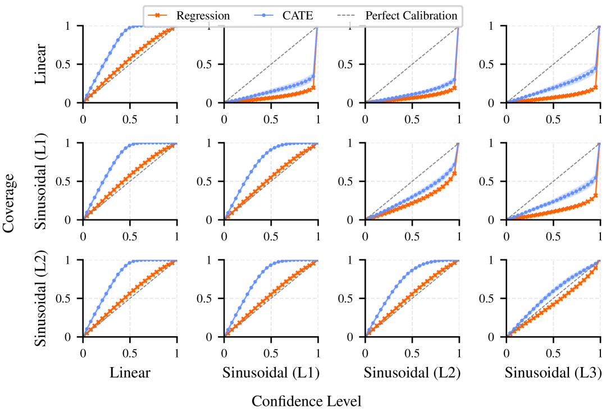

<figcaption>図8: 合成正弦波データセットで訓練したモデルの CATE 較正曲線と回帰較正曲線（較正前）。</figcaption>
</figure>

<figure>

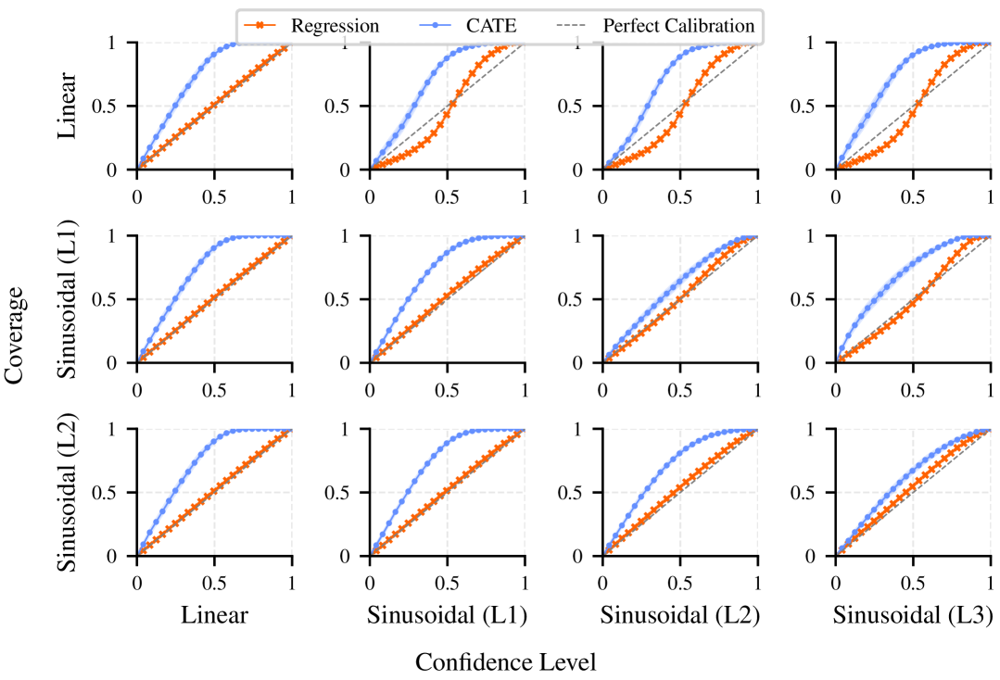

<figcaption>図9: 合成正弦波データセットで訓練したモデルの CATE 較正曲線と回帰較正曲線（較正後）。</figcaption>
</figure>

**多項式での合成実験。** 正弦波の設定と同様、較正前の曲線（図10）はモデルが OOD データ（例: 2次データで訓練したモデルを3次 DGP でテスト）で過信になることを示す。しかし回帰較正を適用すると、ほぼ完璧な CATE 較正が得られる（図11）。

<figure>

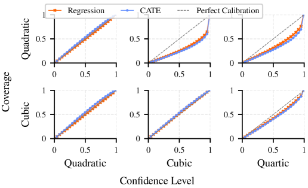

<figcaption>図10: 合成多項式データセットで訓練したモデルの CATE 較正曲線と回帰較正曲線（較正前）。</figcaption>
</figure>

<figure>

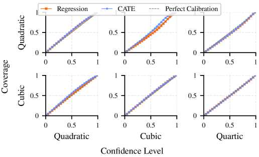

<figcaption>図11: 合成多項式データセットで訓練したモデルの CATE 較正曲線と回帰較正曲線（較正後）。</figcaption>
</figure>

**大規模 CausalPFN の較正。** 合成・現実世界の両ベンチマークで、大規模事前訓練済み CausalPFN の較正曲線を図12・図13・図14で評価する。モデルは概して保守的に見える。これはヒストグラム損失で用いるガウス平滑化に起因しうるが、この平滑化は訓練の安定性を達成するために必要である。いずれにせよ、すべてのデータセットで事後的な回帰較正は信頼性を向上させる。較正済み（ピンク）の曲線は較正前（青）よりはるかに対角線に近接する。図12・13では改善はほぼ完璧で、図14では基本モデルの IHDP・ACIC 2016 での強い保守性を補正し、Lalonde CPS/PSID でほぼ理想的な整合を達成する。

<figure>

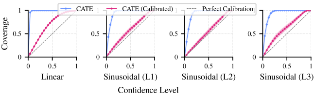

<figcaption>図12: CausalPFN の合成正弦波データセットでの CATE 較正曲線（較正前と較正後）。</figcaption>
</figure>

<figure>

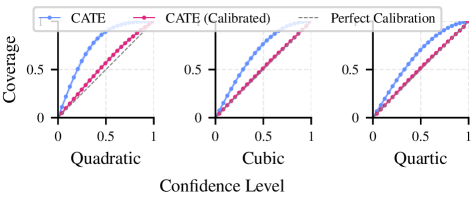

<figcaption>図13: CausalPFN の合成多項式データセットでの CATE 較正曲線（較正前と較正後）。</figcaption>
</figure>

<figure>

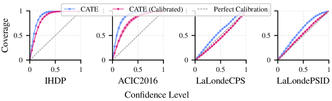

<figcaption>図14: CausalPFN の準合成ベンチマークでの CATE 較正曲線（較正前と較正後）。</figcaption>
</figure>
