# Chronos-2: 単変量から普遍的予測へ

> 原題: Chronos-2: From Univariate to Universal Forecasting
> 著者: Abdul Fatir Ansari, Oleksandr Shchur, Jaris Küken, Andreas Auer, Boran Han, Pedro Mercado, Syama Sundar Rangapuram, Huibin Shen, Lorenzo Stella, Xiyuan Zhang, Mononito Goswami, Shubham Kapoor, Danielle C. Maddix, Pablo Guerron, Tony Hu, Junming Yin, Nick Erickson, Prateek Mutalik Desai, Hao Wang, Huzefa Rangwala, George Karypis ほか（Amazon Web Services / Amazon / University of Freiburg / Johannes Kepler University Linz / Boston College / Rutgers University）
> 出典: arXiv:2510.15821（ar5iv）

## Abstract（要旨）

事前訓練済み時系列モデルは、タスク固有の訓練なしに正確な予測を生む推論のみ（inference-only）の予測システムを可能にしてきた。しかし、既存のアプローチは大部分が単変量（univariate）予測に焦点を当てており、多変量データと共変量（covariates）が決定的な役割を果たす現実世界のシナリオでの適用可能性を制限している。我々は Chronos-2 を提示する。これは単変量・多変量・共変量つき（covariate-informed）の予測タスクをゼロショットで扱える事前訓練済みモデルである。Chronos-2 は、グループ内の複数の時系列——関連する系列の集合、多変量系列の変量、あるいは予測タスクのターゲットと共変量を表しうる——にわたる効率的な情報共有を通じて文脈内学習（in-context learning, ICL）を促進する group attention 機構を採用する。これらの汎用的な能力は、単変量系列に多様な多変量構造を課した合成データセットでの訓練を通じて達成される。Chronos-2 は3つの包括的なベンチマーク——fev-bench、GIFT-Eval、Chronos Benchmark II——にわたって最先端の性能を発揮する。多変量・共変量つき予測を重視する fev-bench では、Chronos-2 の普遍的な ICL 能力が既存モデルに対する実質的な改善をもたらす。共変量を伴うタスクでは、ベースラインを一貫して大差で上回る。エネルギーと小売の領域でのケーススタディは、その実用上の利点をさらに浮き彫りにする。Chronos-2 の文脈内学習能力は、現実世界の予測パイプラインで「そのまま（as is）」使える汎用予測モデルとしての地位を確立する。

## 1 Introduction（はじめに）

事前訓練済みモデル（*基盤モデル（foundation models）*とも呼ばれる）の出現は、時系列予測にパラダイムシフトをもたらした。各時系列ごとにモデルを訓練する（*局所モデル（local models）*）、あるいはデータセットごとに訓練する（*タスク固有モデル（task-specific models）*）代わりに、大規模時系列データで一度訓練した単一のモデルを、異なる予測問題にわたって適用できる。事前訓練済みモデルは、各ユースケースごとにゼロから訓練する必要をなくし、予測パイプラインを大幅に単純化する。さらに注目すべきは、それらがしばしばタスク固有モデルの予測精度に匹敵、あるいは凌駕することである。

これらの進展にもかかわらず、根本的な限界が残る。ほとんどの事前訓練済みモデルは単変量データのみで動作し、単一の時系列の過去の観測だけを考慮して予測を生成する。単変量予測は重要だが、現実世界の予測タスクのクラスはそれをはるかに超えて広がる。実際には、複数の共進化する時系列を同時に予測する必要があるタスク（*多変量予測（multivariate forecasting）*）や、予測がさまざまな外部要因に依存するタスク（*共変量つき予測（covariate-informed forecasting）*）に遭遇しうる。例えば、CPU 使用率・メモリ消費・ストレージ I/O のようなクラウドインフラのメトリクスは共に変動し、共同モデル化から恩恵を受ける。同様に、小売需要はプロモーション活動に大きく影響され、エネルギー消費パターンは気象条件に駆動される。多変量・共変量つき予測能力の欠如は、現実世界の本番システムにおける事前訓練済みモデルの広範な採用を妨げる。

<figure>

<figcaption>図1: Chronos-2 の完全なパイプライン。入力時系列（ターゲットと共変量）はまずロバストスケーリング方式で正規化され、その後に時間インデックスとマスクのメタ特徴量が加えられる。得られた系列は非重複のパッチに分割され、残差ネットワークを介して高次元埋め込みに写像される。中核の Transformer スタックはこれらのパッチ埋め込み上で動作し、入力として与えられたマスクされた未来パッチに対応する複数パッチの分位点（quantile）出力を生成する。各 Transformer ブロックは time attention 層と group attention 層を交互に切り替える。time attention 層は単一の時系列内のパッチ間で情報を集約し、group attention 層は各パッチインデックスでグループ内の全系列にわたって情報を集約する。グループは関連性の柔軟な概念で、単一の時系列、ソースやメタデータを共有する複数の系列、多変量系列の変量、あるいはターゲットと関連する共変量に対応しうる。図は各1つの既知共変量を持つ2つの多変量時系列を示し、対応するグループを青と赤で強調している。この例は説明のためのもので、Chronos-2 は任意の数のターゲットと任意の共変量をサポートする。</figcaption>
</figure>

多変量依存と共変量の両方を扱える*普遍的（universal）*な事前訓練済みモデルの開発は、2つの要因により依然として困難である。第一に、予測問題の異質性はモデルアーキテクチャの再考を要求する。各下流タスクは次元の数とその意味論が異なる。未見のタスクで変数がどう相互作用するかを事前に知ることは不可能なので、モデルは利用可能な文脈からこれらの相互作用を推論しなければならない。第二に、多変量依存と情報的な共変量を持つ高品質の事前訓練データは希少である。

本研究で、我々は Chronos-2 を提示する。これは任意の予測タスク——単変量・多変量・共変量つき——を*ゼロショット*で扱うよう設計された事前訓練済みモデルである。Chronos-2 は文脈内学習（ICL）を活用して、多変量予測と任意の共変量（過去のみ past-only か未来値既知 known か、実数値かカテゴリかを問わない）をサポートする。その強化された ICL 能力は、バッチ内の単変量時系列間で情報を共有する*クロス学習（cross learning）*を可能にすることで、単変量予測をも改善し、より正確な予測につながる。

Chronos-2 の ICL 能力の中核にあるのが *group attention* 機構である。これは、関連する系列の任意の集合、多変量系列の変量、あるいは予測タスクのターゲットと共変量（過去のみと既知の両方）を表しうる時系列のグループ内での情報交換を可能にする。group attention 層は、ターゲットと共変量を連結して文脈を拡張するのではなく、バッチ軸にわたってグループ内で情報を共有し、変量数に対して優雅にスケールする。Chronos-2 の鍵となる革新は訓練アプローチにある。ICL 能力を可能にするため、基底の単変量生成器からサンプリングした時系列に多変量構造を課して生成した合成時系列データに大きく依拠する。トークン化とモデル化を含む Chronos-2 の完全な推論パイプラインを図1に示す。

fev-bench、GIFT-Eval、Chronos Benchmark II を含む包括的な予測ベンチマークでの経験的評価は、Chronos-2 が最先端の性能を達成することを示す。単変量・多変量・共変量つきという幅広い予測タスクにまたがる fev-bench で、Chronos-2 は全カテゴリでベースラインを上回る。最大の利得は共変量つきタスクで観測され、この実用上重要な設定における Chronos-2 の強みを実証する。Chronos-2 はこれらの新しい能力を、高い計算効率を維持しつつ提供し、単一の中級 GPU（NVIDIA A10G）上で毎秒300時系列のスループットで動作する。

本テクニカルレポートの残りは次のように構成される。§2 は時系列予測の背景と、事前訓練済みモデルに特に焦点を当てた既存の予測手法を紹介する。§3 で Chronos-2 のアーキテクチャを述べ、その訓練と推論のパイプラインを論じる。§4 は Chronos-2 の訓練コーパスを簡潔に論じる。§5 で3つの予測ベンチマークでの主要結果、エネルギーと小売領域のケーススタディ、アブレーションを示す。§6 でレポートを締めくくり、将来の課題を論じる。

## 2 Background and Related Work（背景と関連研究）

**表1**: 事前訓練済み予測モデルの能力比較。Past-Only Covariates: 過去にのみ観測される共変量のサポート。Known Covariates: 未来値が既知の共変量のサポート。Categorical Covariates: 共変量における名義特徴量のサポート。Cross Learning: 関連時系列にわたる文脈内学習のサポート。Memory Scaling: 変量総数 V（ターゲットと共変量の両方を含む）に対する推論メモリ要件。

| Model | 単変量予測 | 多変量予測 | 過去のみ共変量 | 既知共変量 | カテゴリ共変量 | クロス学習 | メモリスケーリング |
| --- | --- | --- | --- | --- | --- | --- | --- |
| Chronos-2 | ✓ | ✓ | ✓ | ✓ | ✓ | ✓ | $\mathcal{O}(V)$ |
| Toto-1.0 | ✓ | ✓ | ✓ | ✗ | ✗ | ✗ | $\mathcal{O}(V)$ |
| TabPFN-TS | ✓ | ✗ | ✗ | ✓ | ✓ | ✗ | $\mathcal{O}(V)$ |
| COSMIC | ✓ | ✗ | ✓ | ✓ | ✗ | ✗ | $\mathcal{O}(V^{2})$ |
| Moirai-1.0 | ✓ | ✓ | ✓ | ✓ | ✗ | ✗ | $\mathcal{O}(V^{2})$ |
| Chronos-Bolt | ✓ | ✗ | ✗ | ✗ | ✗ | ✗ | - |
| Moirai-2.0 | ✓ | ✗ | ✗ | ✗ | ✗ | ✗ | - |
| Sundial | ✓ | ✗ | ✗ | ✗ | ✗ | ✗ | - |
| TimesFM-2.5 | ✓ | ✗ | ✗ | ✗ | ✗ | ✗ | - |
| TiRex | ✓ | ✗ | ✗ | ✗ | ✗ | ✗ | - |

時系列予測は、過去の観測が与えられたときに時間的系列の未来値を予測することを目指す。形式的に、$\bm{Y}_{1:T}=[\bm{y}_{1},\dots,\bm{y}_{T}]$ を長さ $T$ の過去時系列とする。ここで各観測 $\bm{y}_{t}\in\mathbb{R}^{D}$ は単変量（$D=1$）または多変量（$D>1$）でありうる。この過去の文脈が与えられたとき、目標は次の $H$ 個の時間ステップ $\bm{Y}_{T+1:T+H}$ を予測することで、$H$ は予測の地平線（forecast horizon）を定義する。予測は共変量（*外生変数 exogenous variables* とも呼ばれる）$\bm{X}_{1:T+H}=[\bm{x}_{1},\dots,\bm{x}_{T+H}]$ で支えられうる。ここで $\bm{x}_{t}\in\mathbb{R}^{M}$ は過去（$t\leq T$）と未来（$t>T$）の両方の時間ステップにまたがりうる追加情報を表す。タスク自体は、各時間ステップで単一の未来値を予測する*点予測（point forecasting）*、あるいは予測の不確実性を捉えるため条件付き分布 $\mathcal{P}(\bm{Y}_{T+1:T+H}\mid\bm{Y}_{1:T},\bm{X}_{1:T+H})$ を推定する*確率的予測（probabilistic forecasting）*のいずれかとして定義できる。*ゼロショット予測（zero-shot forecasting）*は、追加の訓練・適応・ファインチューニングを一切必要とせず、以前に見たことのない時系列データセットに対して予測を生成する設定を指す。

事前訓練済みモデルのパラダイムに先立つ予測手法は、大きく局所モデルと大域モデルに分けられる。局所モデルは、データセット内の各時系列に対して1組のパラメータを当てはめる。これには ARIMA、指数平滑法、Theta のような古典的アプローチが含まれる。対照的に、大域モデルはパラメータを特定のデータセット内の全時系列で共有する。このカテゴリの深層学習アプローチは過去10年でますます一般的になった。大域モデルの著名な例には、DeepState・DeepAR・TimeGrad のような再帰型ニューラルネットワーク（RNN）、N-BEATS・N-HITS のような積層アーキテクチャ、TFT・PatchTST のような Transformer ベースのアーキテクチャがある。

事前訓練済み予測モデルは最近、時系列予測における新しいパラダイムとして現れた。初期の研究は予測のための限定的な転移学習能力を既に実証していたが、事前訓練済みモデルは大規模言語モデル（LLM）と類似の原理を採用し、多様なデータセットでのゼロショット汎化を可能にする。最初の試みは言語モデルを時系列タスクに直接適応させることに焦点を当てたが、より最近のアプローチは主に LLM からアーキテクチャの概念を借りつつ、時系列データで事前訓練する。

事前訓練済みモデルの大多数は単変量予測に限られ、多変量シナリオでは各次元を独立に扱い、共変量を無視する。著名な例外には Moirai-1 と Toto があり、これらは多変量構造をアーキテクチャに組み込む。Moirai-1 は多変量入力をサポートするが内部でそれを平坦化し、高次元のケースへのスケーラビリティを制限する。Toto は変量横断（cross-variate）の注意機構を導入するが、既知またはカテゴリの共変量をサポートしない。COSMIC は合成拡張を通じて共変量の利用を進めるが、単変量ターゲットに制限されたままである。TabPFN-TS は時系列に適応された表形式基盤モデルで、既知共変量を組み込めるが、過去のみの共変量や多変量ターゲットはモデル化しない。これらの進展にもかかわらず、経験的分析はほとんどのアプローチが単変量モデルに対してわずかな利益しか提供しないことを示し、複数の変量を共同モデル化し共変量をゼロショット設定で効果的に統合することが未解決の課題のままであることを示す。

我々のアプローチは、多変量予測のための交差注意アーキテクチャと複数の単変量系列にわたるクロス学習のアイデアを一般化する *group attention* 機構でこのギャップに対処する。先行アプローチと異なり、group attention は関連時系列のグループ上で動作し、アーキテクチャの変更やタスク固有の適応を要求せずに、単変量・多変量・共変量つきタスクを含む多様な予測設定を統一的な枠組みの中で自然に収容する。表1は Chronos-2 の能力を既存の事前訓練済みモデルと比較する。

## 3 The Chronos-2 Model（Chronos-2 モデル）

本節で Chronos-2 モデルを紹介する。スケーリングとトークン化から始め、続いて Chronos-2 の文脈内学習能力を可能にする group attention 機構を含むモデルアーキテクチャを述べる。その後、Chronos-2 の訓練と推論のパイプラインを論じる。Chronos-2 の完全な推論パイプラインは図1に可視化されている。

### 3.1 Scaling and Tokenization（スケーリングとトークン化）

#### 入力構築。

モデルはターゲット $\bm{Y}_{1:T}$ と共変量 $\bm{X}_{1:T+H}$ から導かれる2つの入力で動作する。すべての過去値を $\bm{V}=[\bm{v}_{1},\dots,\bm{v}_{T}]$ に連結する。ここで各 $\bm{v}_{t}\in\mathbb{R}^{D+M}$ はターゲット観測 $\bm{y}_{t}$ と対応する共変量ベクトル $\bm{x}_{t}$ からなる。同様に、未来値を $\bm{W}=[\bm{w}_{T+1},\dots,\bm{w}_{T+H}]$ と定義する。ここで $\bm{w}_{t}\in\mathbb{R}^{D+M}$ は利用可能なときは既知の未来共変量値 $\bm{x}_{t}$ を含み、ターゲットと過去のみの共変量に対応する要素は欠損値に設定される。

$\bm{X}_{1:T+H}$ のカテゴリ共変量は、$\bm{V}$ と $\bm{W}$ に連結される前に実数値表現に変換される。単変量ターゲットには、各カテゴリをターゲットとの関係に基づいて数値に写像するターゲットエンコーディングを適用する。多変量ターゲットには、各カテゴリに一意の整数を割り当てる順序エンコーディング（ordinal encoding）にフォールバックする。

#### ロバストスケーリング。

入力値 $\bm{V}$ と $\bm{W}$ は任意のスケールでありうるので、トークン化パイプラインは系列の正規化から始まる。我々は文献で広く用いられる正規化手法である*標準化（standardization）*を採用し、追加のステップを導入する。標準化した値に $\sinh^{-1}$ 変換を適用するのである。この対数様（log-like）の変換は分散をさらに安定化し、目的関数への外れ値の影響を低減する。これは計量経済学やエネルギー価格予測の文献で極値の扱いに用いられてきた。形式的に、各過去値 $v_{t,d}$ と未来値 $w_{t,d}$ は次のように正規化される。

$$
\tilde{v}_{t,d}=\sinh^{-1}\!\left(\frac{v_{t,d}-\mu_{d}}{\sigma_{d}}\right)\quad\text{for }t\in\{1,\dots,T\},
$$
$$
\tilde{w}_{t,d}=\sinh^{-1}\!\left(\frac{w_{t,d}-\mu_{d}}{\sigma_{d}}\right)\quad\text{for }t\in\{T+1,\dots,T+H\},
$$

ここで $\mu_{d}$ と $\sigma_{d}$ はそれぞれ過去値 $[v_{1,d},...,v_{T,d}]$ の平均と標準偏差である。$\bm{V}$ の欠損値は $\mu_{d}$ と $\sigma_{d}$ の計算時に除外される。正規化された過去値 $\tilde{\bm{V}}$ と未来値 $\tilde{\bm{W}}$ は連結されて入力行列 $\bm{U}=[\tilde{\bm{V}},\tilde{\bm{W}}]\in\mathbb{R}^{(T+H)\times(D+M)}$ を構成する。

#### メタ特徴量。

トークン化の間、$\bm{U}$ の各次元はモデルによって独立に処理される。トークン化手続きを述べるため、1つのターゲットまたは共変量の次元 $d$ に対応する単一の列 $\bm{u}_{d}=[u_{1,d},\dots,u_{T+H,d}]^{\top}$ を考える。各列には2つの追加メタ特徴量が付加される: 時間インデックスとマスクである。時間インデックス $\bm{j}=[-\frac{T}{C},-\frac{T-1}{C},\dots,0,\dots,\frac{H-1}{C}]$ は各時間ステップの相対位置を符号化する。ここで $C$ はモデルがサポートする最大文脈長である。これはモデルに時間的順序についての明示的情報を提供し、パッチベースの入力を使うとき有益である。マスク $\bm{m}_{d}$ は、値が観測されているとき1、そうでないとき0に等しい二値の指標である。これは2つの目的を果たす: 過去文脈のどの値が欠損かを示すこと、どの入力次元が未来既知の共変量に対応するかを指定することである。マスクの構築後、$\bm{u}_{d}$ のすべての欠損値はゼロに置き換えられる。

#### パッチ化と埋め込み。

対応するメタ特徴量 $\bm{j}$ と $\bm{m}_{d}$ を伴う入力 $\bm{u}_{d}$ は、長さ $P$ の非重複パッチに分割される。時系列とメタ特徴量の文脈部分と未来部分は別々にパッチに分割される。$T$ と $H$ が $P$ の倍数でないとき、左（文脈）または右（未来）にゼロパディングが適用される。$\overline{\bm{u}}_{p}$、$\overline{\bm{j}}_{p}$、$\overline{\bm{m}}_{p}$ をそれぞれ入力・時間インデックス・マスクの $p$ 番目のパッチとする。これらは連結され、残差ネットワーク $f^{\mathrm{in}}_{\phi}:\mathbb{R}^{3P}\to\mathbb{R}^{D_{\text{model}}}$ を用いて埋め込み空間に写像される。

$$
\bm{h}_{p}=f^{\mathrm{in}}_{\phi}\left(\left[\overline{\bm{u}}_{p},\overline{\bm{j}}_{p},\overline{\bm{m}}_{p}\right]\right),
$$

ここで $\phi$ は残差ネットワークのパラメータ、$D_{\text{model}}$ は Transformer モデルの隠れ次元を表す。文脈と未来のパッチ埋め込みの間に、区切りトークンと注意のシンク（attention sink）の両方として機能する特別な REG トークンを含める。

### 3.2 Architecture（アーキテクチャ）

Chronos-2 はエンコーダのみ（encoder-only）の Transformer モデルで、T5 エンコーダの設計に密接に従う。以下で Chronos-2 の鍵となるアーキテクチャ構成要素を論じる。

#### Time Attention。

time attention 層は、典型的な系列モデルに見られる通常の注意層である。時間軸に沿って自己注意を適用し、同じ入力次元のパッチ間で情報を集約する。我々は元の T5 モデルの自己注意層で用いられる相対位置埋め込みを、現代の Transformer ベースモデルで位置埋め込みの事実上の標準となった回転位置埋め込み（rotary position embeddings, RoPE）に置き換える。

#### Group Attention。

我々は Transformer スタックに *group attention* 層を導入する。これは Chronos-2 の文脈内学習能力を可能にする中心である。この層は、与えられたパッチインデックスで同じグループに属する時系列にわたって情報を集約する。グループは関連する時系列の集合を指し、予測タスクに応じて異なるものを指しうる。例えば、グループは次のものからなりうる。

- *単一の時系列*: 最小のグループ化で、モデルはバッチ内の他の時系列を参照せず単変量予測を行う。
- *ソースやメタデータを共有する時系列の集合*: このグループ化は、個々の時系列の過去だけを考慮して単変量予測を生成する代わりに、関連時系列に対して共同予測を行うことで、アイテム横断のクロス学習（*few-shot learning* とも呼ばれる）をモデルに可能にする。関連時系列間の情報共有は、すべてまたは一部（コールドスタートのシナリオ）の時系列が短い過去しか持たないとき、また下流データセットの特性が訓練データ分布と大きく異なるときに特に有益でありうる。
- *共有された力学を持つ変量の集合*: このグループ化は、モデルが共有された力学を持つすべての変量を共同で予測する多変量予測を可能にする。
- *ターゲット・過去のみの共変量・既知共変量の集合*: 最も一般的なケースで、モデルが共変量を考慮しつつターゲットを予測する。

サイズ $B$ のバッチ内で、それぞれグループ ID $\bm{g}$（長さ $B$ のベクトル）で識別される、さまざまなサイズの複数のグループが可能である。内部的に、group attention 層はこれらの ID を2次元の注意マスクに写像し、集約がグループ間ではなくグループ内でのみ起こることを保証する。グループ内の時系列は自然な順序を欠くので、group attention 層は位置埋め込みを省く。

#### Quantile Head（分位点ヘッド）。

time attention 層と group attention 層を交互に並べた系列の後、$D$ 個のターゲット次元の未来パッチの埋め込みは残差ブロックを通って、直接的な多ステップ分位点予測 $\hat{\bm{Z}}\in\mathbb{R}^{H\times D\times|\mathcal{Q}|}$ を生成する。単一の順伝播内で複数のターゲットパッチの予測を生成することで、モデルは長い予測地平線にわたる予測を効率的に生成できる。Chronos-2 は21個の分位点 $\mathcal{Q}=\{0.01,0.05,0.1,\dots,0.9,0.95,0.99\}$ を予測する。これは既存の事前訓練済みモデルで一般的に用いられる9分位点グリッド $\{0.1,0.2,...,0.9\}$ と比べて、予測分布のより豊かな表現をもたらす。極端な分位点（$0.01$ と $0.99$）の包含は稀なイベントの被覆を改善し、異常検知やリスクを意識した予測のようなタスクへのモデルの適用性を高める。

### 3.3 Training（訓練）

訓練の間、バッチは異質な予測タスク——単変量予測、多変量予測（過去のみの共変量を伴うタスクもカバー）、既知共変量つき多変量予測——を含むよう構成される。各タスクは、ターゲット次元数 $D$、共変量数 $M$、各次元の役割（ターゲット・過去のみ共変量・既知共変量）で特徴づけられる。各タスクに一意のグループ ID が割り当てられ、グループ ID $\bm{g}$ と未来入力 $\bm{W}$ が観測されるか否かの組み合わせが、特定の予測設定をモデルに推論させる。

モデルは分位点回帰目的（quantile regression objective）

$$
\sum_{q\in\mathcal{Q}}\Big(q\cdot\max(z-\hat{z}^{q},0)+(1-q)\cdot\max(\hat{z}^{q}-z,0)\Big),
$$

を用いて訓練される。ここで $\hat{z}^{q}$ は分位点水準 $q$ での予測、$z$ は式 (1) のように正規化された対応するターゲット値である。損失はバッチ内のすべての予測ステップとアイテムで平均され、ターゲット次元でのみ計算され、既知共変量や欠損ターゲット値に対応する要素は目的から除外される。出力パッチの数は訓練中に各バッチについてランダムにサンプリングされる。

訓練は2段階で進む。第一に、モデルは最大文脈長2048と少数の最大出力パッチで事前訓練される。第二段階で、文脈長は8192に拡張され、サンプリングされる出力パッチの最大数が増やされる。長い文脈は高頻度時系列の長期季節性をモデルに捉えさせ、複数パッチ出力はヒューリスティックに依存せず長地平線予測を可能にする。

### 3.4 Inference（推論）

**表2**: グループ ID と未来入力を適切に指定することで多様な予測タスクを解ける。ここで $\bm{g}$ と $\bm{W}$ はモデルに与えられるグループ ID と未来値を表す。ターゲットと過去のみ共変量の未来入力は欠損値（$\ast$ で表記）としてマスクされる。例は明確さのため固定数の変量を用いるが、Chronos-2 は任意の次元を扱える。（単変量予測＝3独立系列で $\bm{g}=(1,2,3)$／多変量予測＝3ターゲットで $\bm{g}=(1,1,1)$／共変量つき予測＝1ターゲット・1過去のみ共変量・2既知共変量で $\bm{g}=(1,1,1,1)$、既知共変量の未来値は $\bm{W}$ に含む。）

予測は、モデル予測 $\hat{z}_{t,d}^{q}$ を非正規化し式 (1) を反転することで生成される。形式的に、分位点ヘッドの出力 $\hat{z}_{t,d}^{q}$ は次のように変換される。

$$
\hat{y}_{t,d}^{q}=\mu_{d}+\sigma_{d}\cdot\sinh({\hat{z}_{t,d}^{q}}),
$$

これによりターゲット次元 $d$ に沿った時間ステップ $t$ における分位点水準 $q$ の予測 $\hat{y}_{t,d}^{q}$ を得る。

推論の間、バッチ内の複数の時系列をグループ化して異なる予測タスクを解ける。

- *単変量予測*: バッチ内の各アイテムに一意のグループ ID を割り当てる。これにより、モデルがバッチ内の各時系列について独立に予測することを保証する。
- *多変量予測*: 同じ多変量系列に属する各変量に同じグループ ID を割り当て、異なる多変量系列の変量は別個のグループ ID を持つ。これにより、モデルが多変量時系列の異なる変量間で力学情報を共有できる。
- *共変量つき予測*: 同じタスクに属するすべてのターゲット・過去のみ共変量・既知共変量に同じグループ ID を割り当てる。既知共変量に対応する未来入力 $\bm{W}$ はその既知の未来値を含む。共変量についてモデルが生成する予測は無視される。

表2は、異なる予測タスクを解くためにグループ ID と未来入力をどう指定すべきかをまとめる。これらに加えて、Chronos-2 は*完全クロス学習（full cross learning）*モードでも使える。これは、アイテムがターゲットか過去のみ共変量か既知共変量かに関わらず、バッチ内の各アイテムに同じグループ ID を割り当てるモードである。各アイテムが同じグループに属するので、モデルはバッチ内のアイテム間で情報を共有し、バッチ全体について共同予測を行う。

## 4 Training Data（訓練データ）

Chronos-2 のような汎用の事前訓練済みモデルにとって、訓練データはしばしばモデルの特定のアーキテクチャよりも決定的な役割を果たす。最近の取り組みは大規模時系列データセットの利用可能性を拡大したが、それらは主に単変量データを含む。この限界を克服し Chronos-2 に文脈内学習能力を付与するため、我々は合成データに大きく依拠した。

### 4.1 Univariate Data（単変量データ）

我々は Chronos と GIFT-Eval の事前訓練コーパスから選んだデータセットを Chronos-2 の訓練コーパスに組み込んだ。データセットの完全なリストは付録の表6に提供される。データの多様性をさらに高めるため、2つのアプローチで合成データを生成した。

- TSI（Trend, Seasonality, and Irregularity）: トレンド・季節性・不規則性の異なる成分をランダムに構成・結合することで、多様な合成系列を生成する生成器。
- TCM（Temporal Causal Model）: 時間的因果モデルからランダムな因果グラフをサンプリングし、そこから自己回帰を介して時系列を生成する生成器。

### 4.2 Multivariate Data（多変量データ）

多変量・共変量つきタスクには、完全に合成データに依拠した。広いクラスの多変量構造を可能にするため、*multivariatizer*（多変量化器）の概念を導入する。multivariatizer は基底の単変量生成器から複数の時系列をサンプリングし、それらの間に依存を課して多変量の力学を作り出す。基底の単変量生成器として、自己回帰（AR）モデル、指数平滑（ETS）モデル、TSI、KernelSynth を含む多様な集合を用いた。

2つの広いクラスの multivariatizer を用いた。

- *同時刻的（Cotemporaneous）multivariatizer* は、基底の単変量生成器からサンプリングした時系列にわたって同じ時間ステップで線形または非線形の変換を適用する。これは時系列間に瞬間的な相関を導入し、多変量時系列をもたらす。
- *逐次的（Sequential）multivariatizer* は時間にわたる依存を誘導し、リード・ラグ効果（lead-lag effects）や共和分（cointegration）のようなより豊かな多変量特性を生成する。

multivariatizer から生成された多変量時系列は、多変量タスク（すべての変量を予測する必要がある）と、変量の部分集合をランダムに既知共変量に指定する共変量つきタスクの両方を構成するのに用いられた。

## 5 Experiments（実験）

本節で経験的結果を示す。まず3つの包括的なベンチマークで Chronos-2 を最先端アプローチと比較評価する（§5.1）。次に単変量・多変量・共変量つき予測タスクでの文脈内学習による利得を実証する（§5.2）。続いて、正確な予測に共変量がしばしば重要なエネルギーと小売領域のタスクで Chronos-2 の性能を調べる（§5.3）。最後に、より小さいモデル、合成データのみで訓練した版、長文脈ポストトレーニング前のモデルを含む、Chronos-2 のアブレーション版の結果を報告する（§5.4）。

### 5.1 Benchmark Results（ベンチマーク結果）

**表3**: fev-bench の結果。平均勝率（win rate）とスキルスコアはスケール化分位点損失（scaled quantile loss, SQL）指標に関して計算される。両方とも高いほど良い。Chronos-2 は単変量・多変量・共変量つき予測タスクを含むこのベンチマークで、既存の全事前訓練済みモデルを実質的な差で上回る。（Chronos-2: 勝率 90.7%、スキルスコア 47.3%、中央値ランタイム 3.6s。以下 TiRex 80.8/42.6、TimesFM-2.5 75.9/42.3、Toto-1.0 66.6/40.7、COSMIC 65.6/39.0、Moirai-2.0 61.1/39.3、Chronos-Bolt 60.3/38.9、TabPFN-TS 59.3/39.6、Sundial 41.0/33.4、統計アンサンブル・AutoARIMA・AutoETS・AutoTheta・SeasonalNaive・Naive と続く。原典 表3参照。）

我々は1億2千万（120M）パラメータの*base* Chronos-2 モデルを3つの包括的な予測ベンチマーク——fev-bench、GIFT-Eval、Chronos Benchmark II——で評価した。その性能を文脈づけるため、これらのベンチマークで最強の結果を達成した最先端の時系列基盤モデルと比較した。これには TiRex、TimesFM-2.5、Toto-1.0、Moirai-2.0、TabPFN-TS、COSMIC、Sundial、そして Chronos の最新公開版である Chronos-Bolt が含まれる。追加のベースラインとして、統計予測の文献から確立された手法を代表する AutoARIMA、AutoETS、AutoTheta、およびそれらのアンサンブルも含めた。我々は Chronos-2 を上記のモデルとのみ比較し、タスク固有の深層学習モデルは評価から除外した。先行研究——本研究で考慮する3つのうち2つのベンチマーク GIFT-Eval と Chronos Benchmark II を含む——が、事前訓練済みモデルが平均的にタスク固有モデルと同等かそれ以上の性能を示すことを示しているからである。

<figure>

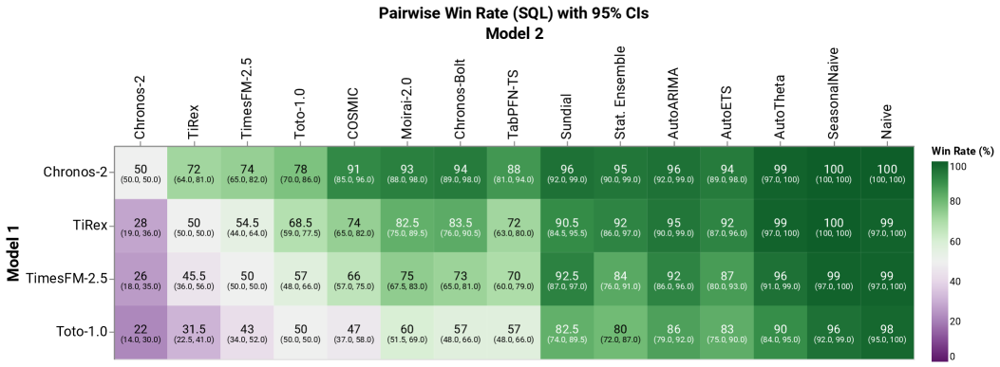

<figcaption>図2: fev-bench における全モデルのペアワイズ勝率行列（SQL 指標、95% 信頼区間）。Chronos-2 が次点の TiRex・TimesFM-2.5 を統計的に有意な差で上回る（Chronos-2 の各ベースラインに対するペアワイズ勝率・スキルスコアの信頼区間は 50%・0% を含まない）。</figcaption>
</figure>

[53] に従い、すべてのモデルについて平均勝率（$W$）とスキルスコア（$S$）の両方を報告する。これらの指標は、先行研究で用いられる平均順位（$R$）と*幾何平均相対誤差*（geometric mean relative error, $G$）の指標と数学的に等価である。具体的には $R=1+(1-\frac{W}{100})(N-1)$ と $G=1-\frac{S}{100}$ で、$N$ は評価モデル数である。しかし勝率とスキルスコアはより解釈しやすい要約を提供する。勝率はモデルが他のモデルを上回るペアワイズ比較の割合を測り、スキルスコアはベースライン——我々の場合は Seasonal Naive モデル——に対する平均的なパーセント改善を反映する。

**表4**: GIFT-Eval の結果。(a) 重み付き分位点損失（weighted quantile loss, WQL）と (b) 平均絶対スケール化誤差（mean absolute scaled error, MASE）の指標に関する平均勝率とスキルスコア。両方とも高いほど良い。Chronos-2 は従来最良のモデル TimesFM-2.5 と TiRex を上回る。（WQL: Chronos-2 81.9/51.4、TimesFM-2.5 77.5/51.0、TiRex 76.5/50.2…。MASE: Chronos-2 83.8/30.2、TimesFM-2.5 77.7/29.5…。原典 表4参照。）

#### fev-bench。

このベンチマークは100の予測タスクからなり、共変量を伴うタスクを含む多様な現実世界シナリオの最も包括的な被覆を提供する。これらのデータセットやタスクはいずれも Chronos-2 が訓練中に見ていない。表3は確率的予測性能を評価する SQL 指標に関する fev-bench の結果を報告する。Chronos-2 は勝率とスキルスコアの両方で既存の時系列基盤モデルを有意な差で上回る。fev-bench は「*モデル A はモデル B を統計的に有意に上回るか？*」のような問いに答えるツールも提供する。図2に示すこれらの95% 信頼区間（CI）つきのペアワイズ比較は、Chronos-2 が次点のモデル（TiRex と TimesFM-2.5）を統計的に有意な差で凌駕することをさらに確認する。

#### GIFT-Eval。

GIFT-Eval ベンチマークは55データセットから派生した97タスクからなり、高頻度時系列と長地平線予測を特に重視する。表4の結果は、Chronos-2 が WQL と MASE の両指標の下で勝率とスキルスコアにおいて従来の先頭モデル（TiRex と TimesFM-2.5）を凌駕することを示す。Chronos-2 の事前訓練コーパスを構成するとき、どのサンプリング頻度でも GIFT-Eval タスクのテスト部分と重複しないよう注意深く確保した。それでもコーパスは一部の GIFT-Eval データセットの訓練部分と部分的な重複を含む。厳密にゼロショットの結果については、合成データのみで訓練した Chronos-2 の版を評価する §5.4 を参照されたい。

**表5**: Chronos Benchmark II の結果。(a) WQL と (b) MASE の指標に関する平均勝率とスキルスコア。両方とも高いほど良い。Chronos-2 は全指標で最良の結果を達成する。（WQL: Chronos-2 79.8/46.6…。MASE: Chronos-2 81.5/26.5…。原典 表5参照。）

#### Chronos Benchmark II。

最初の Chronos モデルを評価するために [3] で当初提案されたこのベンチマークは27タスクからなり、その大多数が短い過去（平均300時間ステップ未満）を伴う。これらのデータセットはいずれも Chronos-2 の訓練コーパスに含まれない。このベンチマークで、Chronos-2 は表5に示すように確率的（WQL）と点（MASE）の両予測指標の下で勝率とスキルスコアにおいて既存モデルを一貫して上回る。

総合すると、これらの結果は Chronos-2 が3つのベンチマークにわたって全競合モデルを上回るだけでなく、その前身 Chronos-Bolt よりも実質的に改善することを示し、Chronos-2 のアーキテクチャと訓練の改善の影響を浮き彫りにする。

### 5.2 Improvements with In-context Learning（文脈内学習による改善）

§5.1 の結果は、ICL を有効にした、具体的には §3.4 で述べた*完全クロス学習*モードの Chronos-2 に対応する。本節では、単変量推論と比べた ICL からの利得を切り分ける。このため、fev-bench を3つの部分集合に分割する: 共変量なしの単一ターゲット時系列を伴う32タスクの*単変量部分集合*、複数ターゲットだが共変量なしの26タスクの*多変量部分集合*、少なくとも1つの過去のみまたは既知の共変量を含む42タスクの*共変量部分集合*である。これら3つの部分集合と、GIFT-Eval と Chronos Benchmark II で、ICL ありの Chronos-2 をその単変量推論モードと比較する。単変量モードでは、バッチ内の各時系列が独立に予測され、共変量があれば無視される。

<figure>

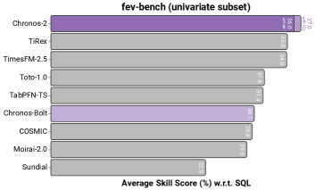

<figcaption>図3: fev-bench 単変量部分集合のスキルスコア（SQL 指標）。ICL は単変量タスクでもスキルスコアの改善をもたらす（特に短文脈の多い Chronos Benchmark II で顕著）。Chronos-2 が関連時系列の情報を活用して予測を改善できることを示す。</figcaption>
</figure>

#### 単変量タスク。

ICL は図3に示すように単変量タスクでスキルスコアの改善を提供する。効果は短文脈のタスクを多く含む Chronos Benchmark II で特に強い。これは、ICL が有効なとき、特に限られた時系列の過去しか利用できない場合に、Chronos-2 が関連時系列の情報を活用して予測を改善できることを実証する。

<figure>

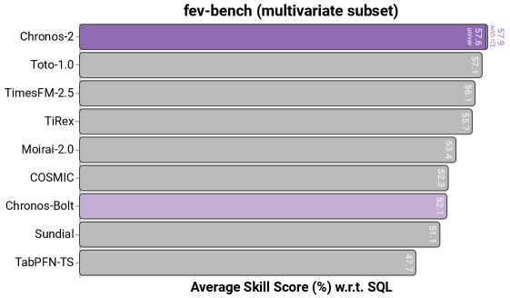

<figcaption>図4a: fev-bench 多変量部分集合のスキルスコア（SQL 指標）。ICL は単変量推論に対してわずかな利得しかもたらさない。興味深いことに、単変量モードでも Chronos-2 は、多変量予測をネイティブにサポートする Toto-1.0 を上回る。</figcaption>
</figure>

#### 多変量タスク。

fev-bench の多変量部分集合では、ICL は単変量推論に対してわずかな利得しかもたらさない（図4a）。興味深いことに、単変量モードでも Chronos-2 は、多変量予測をネイティブにサポートするモデル Toto-1.0 を上回る。これは、これらのタスクが潜在的に共有された力学を持つ複数の変量を伴うものの、明示的な多変量モデル化の利益が限定的でありうることを示唆する。直感の1つは Takens の埋め込み定理から来る。これは、システムの力学がしばしば単一変数の遅延観測から再構成できることを含意する。実際には、これは十分に長い過去があれば、強い単変量モデルが多変量モデルと同じ構造の多くを捉えうることを意味する。類似の経験的発見は他でも報告されている。例えば [32] は、単変量（「チャネル独立」）モデルがしばしば多変量（「チャネル依存」）モデルと同等の性能を示すことを観測した（別のベンチマークではあるが）。

#### 共変量を伴うタスク。

ICL による最大の利得は共変量を伴うタスクで観測される（図4b）。ここで、性能のマージンは、ICL ありの Chronos-2 が共変量を効果的に活用して、それらを無視する単変量推論と比べて予測を改善できることを明確に実証する。Chronos-2 はこの部分集合でベースラインを大差で上回る。当然ながら、2位は（既知）共変量をサポートする別のモデル TabPFN-TS が占める。これらの結果は、Chronos-2 の強みと、多くが共変量サポートを欠く既存の事前訓練済みモデルの限界——極めて実用的に重要な能力——の両方を強調する。

<figure>

<figcaption>図（§5.3, エネルギー領域・SQL）: エネルギー領域の共変量つきタスクのスキルスコア。Chronos-2（共変量つき＝ICL）が TabPFN-TS・TiRex・Chronos-Bolt を大差で上回る。Chronos-2 の単変量モード（"univar"）からの利得も示す。</figcaption>
</figure>

<figure>

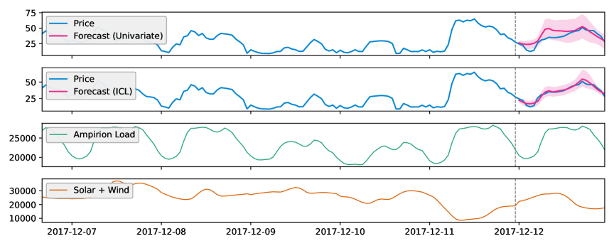

<figcaption>図6: エネルギー価格予測タスクにおける、単変量モード（上）すなわち共変量なし、と文脈内学習あり（上から2番目）の Chronos-2 の予測。破線の灰色の縦線が予測開始日、影付き領域が中央値予測まわりの80% 予測区間を表す。ICL により、Chronos-2 は Ampirion Load と Solar + Wind の共変量を活用してより正確な予測を生む。</figcaption>
</figure>

<figure>

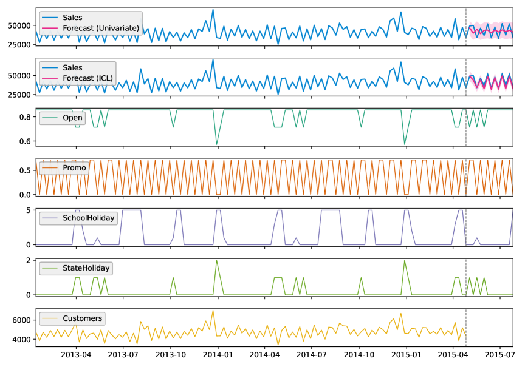

<figcaption>図7: Rossmann 売上予測タスクにおける、単変量モード（上）と文脈内学習あり（上から2番目）の Chronos-2 の予測。ICL により、Chronos-2 はプロモーションと祝日の共変量が将来の売上に与える影響を捉えて、実質的により正確な予測を生む。</figcaption>
</figure>

### 5.3 Domain Case Studies（領域ケーススタディ）

共変量がしばしば正確な予測に決定的な情報を提供する*エネルギー*と*小売*の領域のタスクで、さらなる分析を行った。両領域について、fev-bench から動的共変量を持つすべてのタスクを選び、エネルギーで16、小売で17タスクを得た。ベースラインとして、図4b に示す fev-bench の共変量部分集合で最強の2モデル TabPFN-TS と TiRex を用いた。図5a と 5b の結果は、Chronos-2 がこれらのベースラインを大差で一貫して上回ることを実証する。共変量の組み込みは Chronos-2 の性能を実質的に押し上げ、現実世界の予測タスクにおける共変量の決定的役割を補強する。図4b と整合して、2番目に良い結果は共変量を活用できる別のモデル TabPFN-TS が達成する。

ICL ありの Chronos-2 が共変量をどう使うかを説明するため、単変量モードと ICL ありで生成した予測を比較した。各領域から ICL が最大の利得をもたらすタスクを1つ選んだ。

図6はドイツのエネルギー価格予測タスク（EPF-DE）の予測を示す。ここでの目標は、過去の価格、負荷の翌日先予測、再生可能（太陽光と風力）エネルギー生成を用いて翌日の毎時エネルギー価格を予測することである。単変量モードでは、Chronos-2 は妥当だが不正確な予測を行う。しかし ICL ありでは、Chronos-2 は共変量を効果的に使い、有意により正確な予測を生む。

図7の小売タスクは、過去の売上と共変量——過去の客足に加え、店舗営業・プロモーション期間・祝日を示す既知共変量——を用いて、欧州のドラッグストアチェーン Rossmann の翌四半期の週次店舗売上を予測することを伴う。Chronos-2 の単変量予測はほぼ平坦で高い不確実性を持つ。対照的に、ICL 予測は共変量——特にプロモーションと祝日の情報——を活用して、予測地平線にわたる真の売上の力学を捉える。

### 5.4 Ablation Studies（アブレーション研究）

<figure>

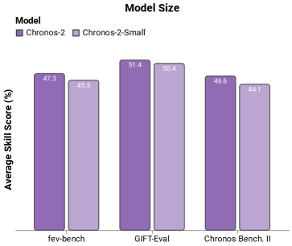

<figcaption>図8a: モデルサイズ。28M パラメータの small モデル（Chronos-2-Small）は、その縮小サイズにもかかわらず強い性能を発揮する。GIFT-Eval ではスキルスコアが base モデルにわずか1ポイント差まで迫りつつ、約2倍速い推論を提供する。</figcaption>
</figure>

本節では、異なる設計選択の影響を切り分ける追加の実験とアブレーションを示す。異なるパラメータ数にわたる Chronos-2 の性能を調べ、合成データのみで訓練したモデルを評価し、長文脈シナリオでのポストトレーニングの重要性を実証する。

#### モデルサイズ。

モデルサイズが予測性能に与える影響を理解するため、28M パラメータの*small* モデルを訓練した。図8a に示すように、small モデルは縮小サイズにもかかわらず強い性能を発揮する。例えば GIFT-Eval では、スキルスコアが base モデルにわずか1ポイント差で迫りつつ、約2倍速い推論を提供する。これは、CPU のみの設定のような低リソース環境や、最大予測精度より推論速度を優先するアプリケーションに特に適する。

#### 合成データのみ。

合成時系列データは事前訓練済み予測モデルの進歩に極めて重要な役割を果たしてきた。TabPFN-TS は、訓練が合成データのみに依拠しても強い性能が達成可能であることを実証した。このアプローチの限界を調べるため、合成データのみを用いて Chronos-2 の版を訓練した。Chronos Benchmark II と GIFT-Eval で、このモデル（Chronos-2-Synth）は事前訓練コーパスに実データを持つ版をわずかに下回るだけである（図8b）。fev-bench でも強い結果を出すが、より大きな性能差を伴う。これらの結果は合成データの重要性を強調し、さらなる研究により、効果的な事前訓練に実データすら必要でなくなる可能性を示唆する。

#### 長文脈ポストトレーニング。

§3.3 で述べたように、Chronos-2 は当初2,048時間ステップの文脈長で訓練され、その後8,192ステップに拡張した文脈でポストトレーニングされる。図8c は base モデル（Chronos-2-2K と表記）をポストトレーニング版と比較する。文脈長の拡張は、特に長い季節周期を持つ高頻度データセットを多く含む GIFT-Eval ベンチマークで利得をもたらす。

## 6 Discussion（議論）

我々は Chronos-2 を導入した。これは単変量・多変量・共変量つきタスクを含む幅広い予測シナリオをゼロショットで扱うよう設計された事前訓練済み時系列モデルである。3つの包括的なベンチマークにわたって、Chronos-2 は既存の基盤モデルを一貫して上回り、文脈内学習が多様なタスクタイプにわたって予測性能を高めることを実証する。

特に大きな性能差は共変量つきタスクで現れ、そこで Chronos-2 は従来の基盤モデルを実質的に凌駕する。これは既存モデルの限界と、正確な予測において文脈情報（例: 共変量）が果たす決定的役割の両方を浮き彫りにする。Chronos-2 は数値とカテゴリの共変量のみをサポートするが、テキストのようなマルチモーダル入力を組み込むよう事前訓練済みモデルを拡張することは、将来の研究の有望な方向を表す。

我々の結果はさらに、汎用予測を可能にする上での合成データの重要性を強調する。Chronos-2 の単変量予測を超えた能力は完全に合成データに依拠し、アブレーション研究は合成データのみで訓練したモデルが実データと合成データの混合で訓練したものをわずかに下回るだけであることを示す。我々は合成データが事前訓練済み時系列モデルの進歩においてますます中心的な役割を果たすと予想する。

最後に、Chronos-2 の柔軟な group attention 機構は、さらなる応用の機会を開く。例えば、疎なメタデータや密な埋め込みを用いて時系列をグループ化し、*検索拡張予測（retrieval-augmented forecasting）*を可能にすれば、小データやコールドスタートのシナリオで性能を改善しうる。

## Appendix A Training Data（訓練データ）

**表6**: Chronos-2 の事前訓練に用いた実単変量データセット。（Electricity, KDD Cup (2018), M4〔Daily/Hourly/Monthly/Weekly〕, Mexico City Bikes, Pedestrian Counts, Solar, Taxi, Uber TLC, USHCN, Weatherbench, Wiki, Wind Farms, Temperature-Rain, London Smart Meters, Alibaba Cluster Trace (2018), Azure VM Traces (2017), Borg Cluster Data (2011), LargeST (2017), Q-Traffic, Buildings 900K。エネルギー・交通・自然・クラウド運用・Web 等の領域、各種頻度。原典 表6参照。）

## Appendix B Additional Results（追加結果）

**表7**: fev-bench の結果。平均勝率とスキルスコアは MASE 指標に関して計算。両方とも高いほど良い。（Chronos-2 87.9/35.5、TiRex 75.1/30.0、TimesFM-2.5 74.4/30.3…。原典 表7参照。）

**表8**: fev-bench の結果。平均勝率とスキルスコアは WQL 指標に関して計算。（Chronos-2 88.5/51.5、TiRex 79.0/46.7…。原典 表8参照。）

**表9**: fev-bench の結果。平均勝率とスキルスコアは WAPE（weighted absolute percentage error, 重み付き絶対パーセント誤差）指標に関して計算。（Chronos-2 85.4/39.4…。原典 表9参照。）

<figure>

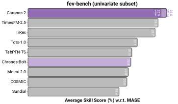

<figcaption>図（付録, MASE）: fev-bench 単変量部分集合のスキルスコア（MASE 指標）。図3（SQL）の MASE 版。ICL ありの Chronos-2 が首位。</figcaption>
</figure>

<figure>

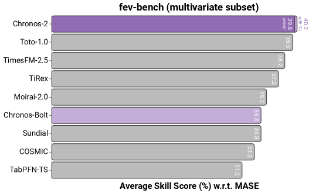

<figcaption>図（付録, MASE）: fev-bench 多変量部分集合のスキルスコア（MASE 指標）。図4a（SQL）の MASE 版。</figcaption>
</figure>

<figure>

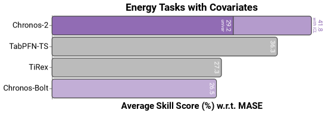

<figcaption>図（付録, MASE）: エネルギー領域の共変量つきタスクのスキルスコア（MASE 指標）。図5a（SQL）の MASE 版。Chronos-2 > TabPFN-TS > TiRex > Chronos-Bolt。</figcaption>
</figure>

<figure>

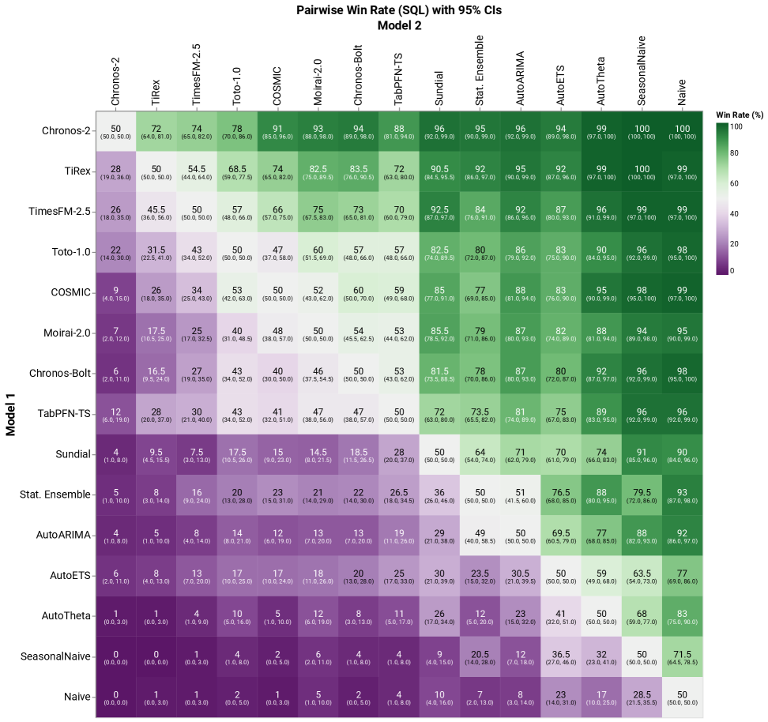

<figcaption>図12: fev-bench における全モデルのペアワイズ勝率（95% 信頼区間、SQL 指標）。</figcaption>
</figure>

<figure>

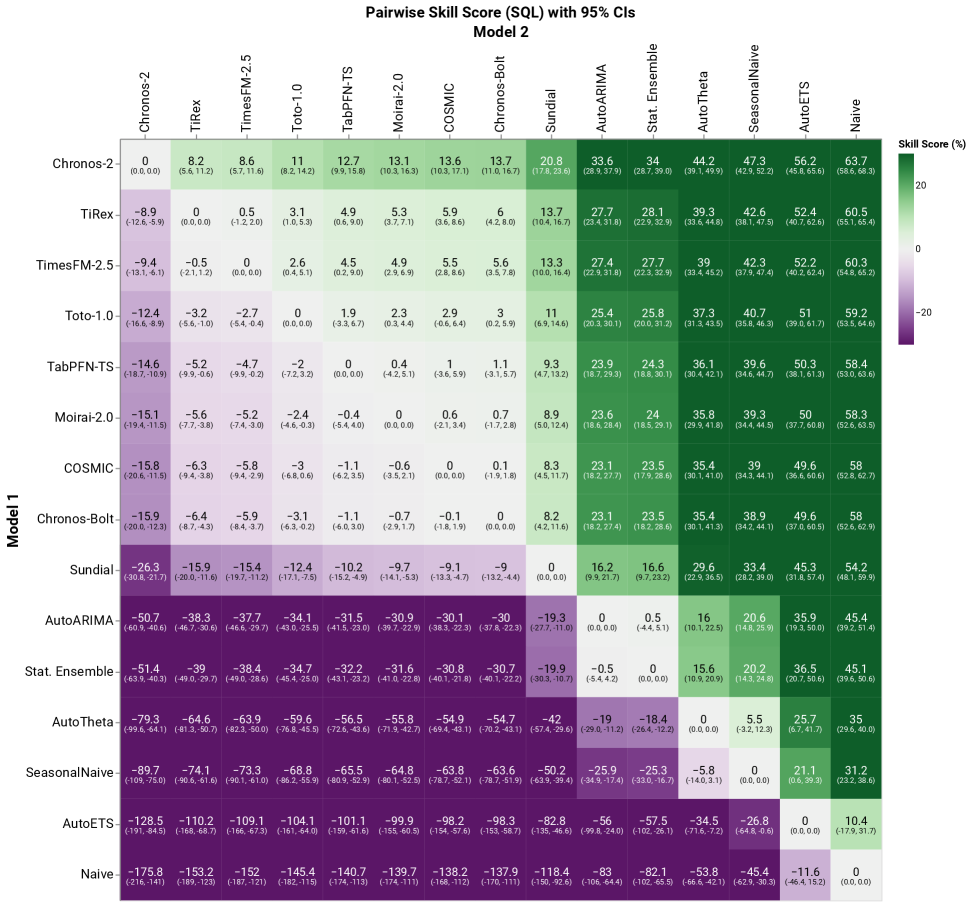

<figcaption>図13: fev-bench における全モデルのペアワイズスキルスコア（95% 信頼区間、SQL 指標）。</figcaption>
</figure>

<figure>

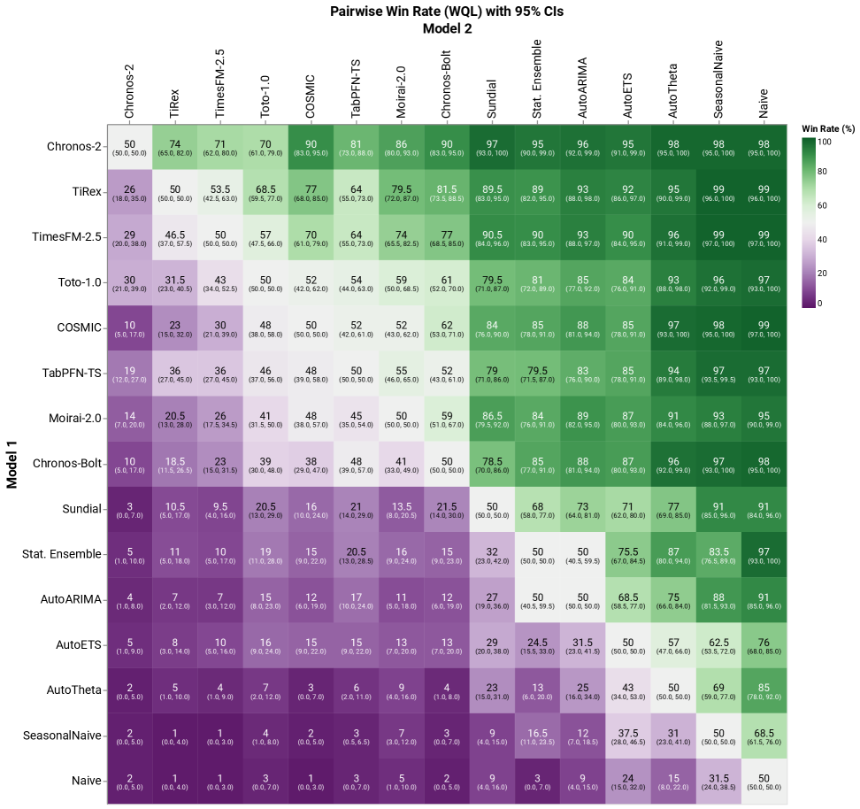

<figcaption>図14: fev-bench における全モデルのペアワイズ勝率（95% 信頼区間、WQL 指標）。</figcaption>
</figure>

<figure>

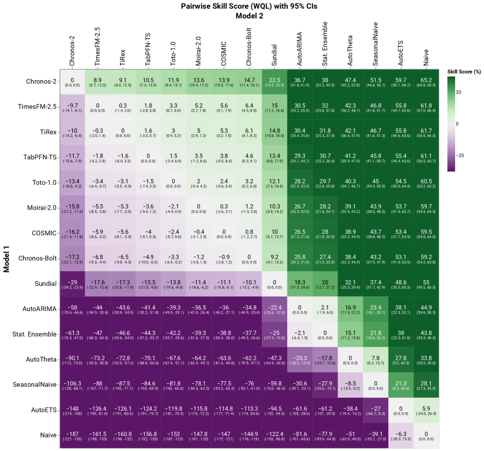

<figcaption>図15: fev-bench における全モデルのペアワイズスキルスコア（95% 信頼区間、WQL 指標）。</figcaption>
</figure>

<figure>

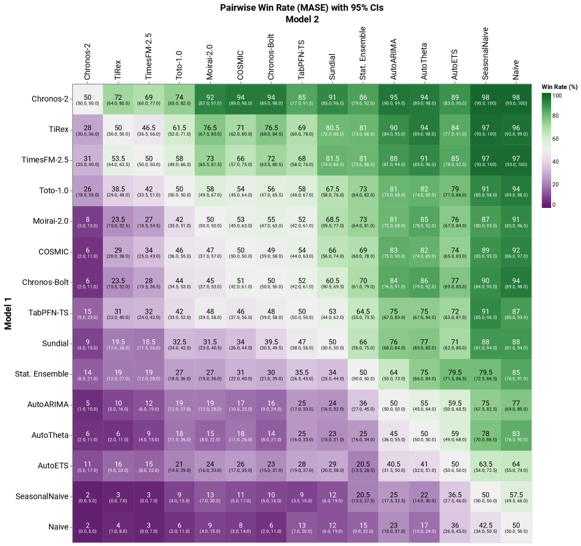

<figcaption>図16: fev-bench における全モデルのペアワイズ勝率（95% 信頼区間、MASE 指標）。</figcaption>
</figure>

<figure>

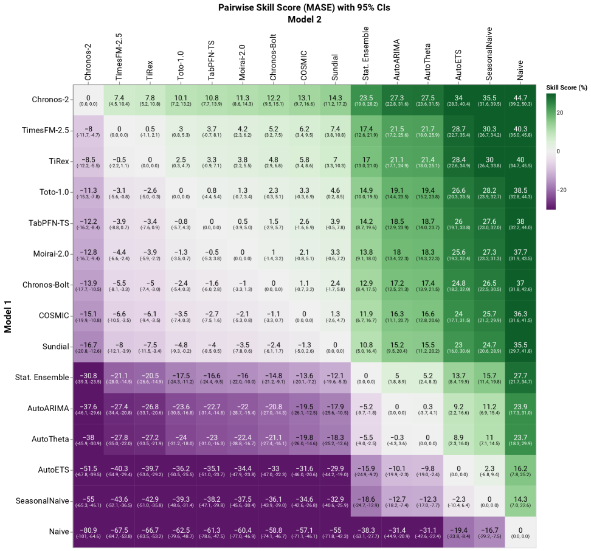

<figcaption>図17: fev-bench における全モデルのペアワイズスキルスコア（95% 信頼区間、MASE 指標）。</figcaption>
</figure>

<figure>

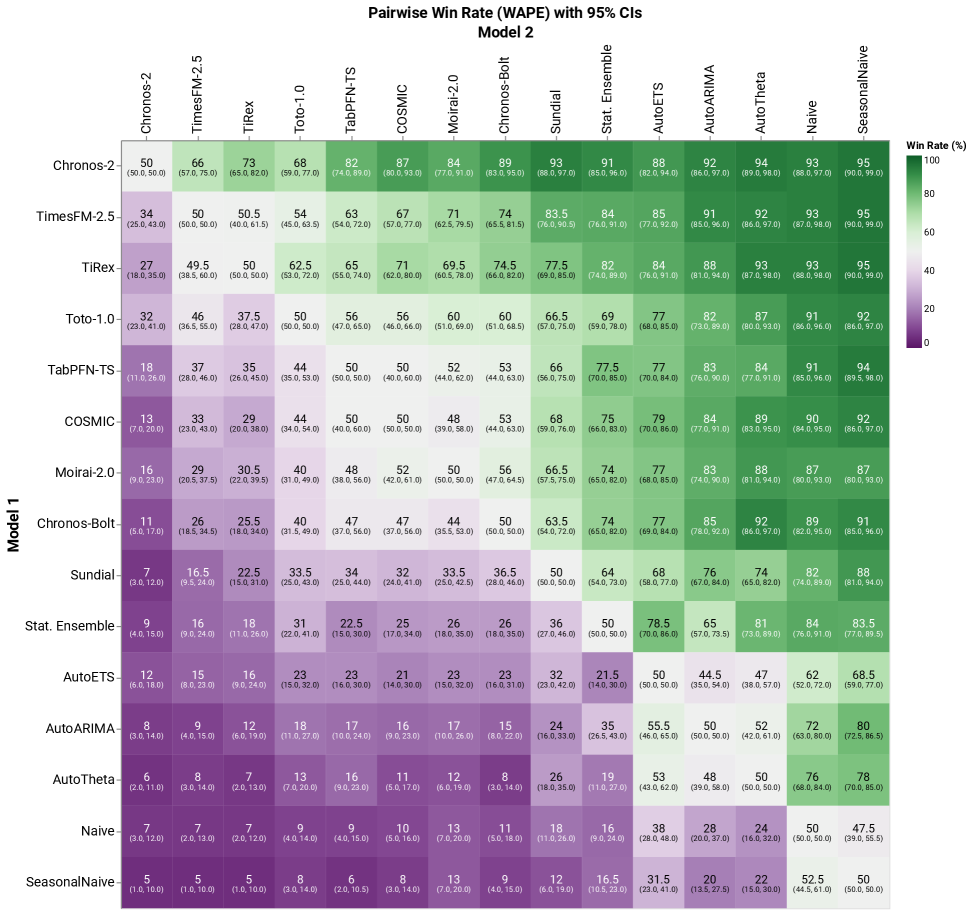

<figcaption>図18: fev-bench における全モデルのペアワイズ勝率（95% 信頼区間、WAPE 指標）。</figcaption>
</figure>

<figure>

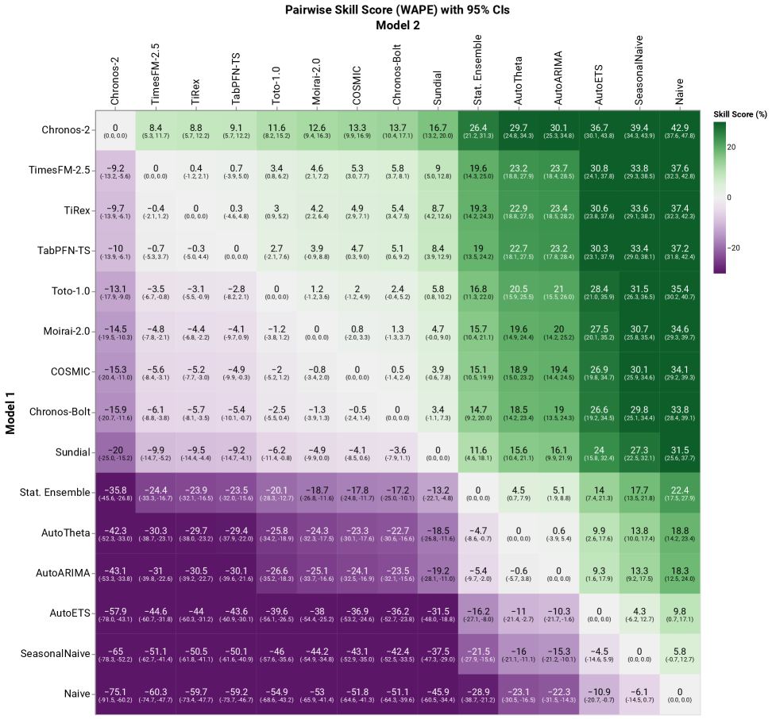

<figcaption>図19: fev-bench における全モデルのペアワイズスキルスコア（95% 信頼区間、WAPE 指標）。</figcaption>
</figure>

**表10**: エネルギー領域ケーススタディのための、動的共変量を持つ fev-bench データセットの部分集合。（ENTSO-e Load, EPF-BE/DE/FR/NP/PJM, GFC12/14/17, Solar with Weather, KDD Cup 2022 など。各タスクの頻度・地平線 H・系列数・ターゲット数・過去/既知/静的共変量数を記載。原典 表10参照。）

**表11**: 小売領域ケーススタディのための、動的共変量を持つ fev-bench データセットの部分集合。（Favorita Store Sales, Favorita Transactions など、月次/週次/日次。原典 表11参照。）
