# Do-PFN: 因果効果推定のための文脈内学習

> 原題: Do-PFN: In-Context Learning for Causal Effect Estimation
> 著者: Jake Robertson, Arik Reuter, Siyuan Guo, Noah Hollmann, Frank Hutter, Bernhard Schölkopf（ELLIS Institute Tübingen / Max Planck Institute for Intelligent Systems / University of Cambridge / University of Freiburg / Prior Labs）
> 出典: arXiv:2506.06039（ar5iv）

## Abstract（要旨）

因果効果の推定は、さまざまな科学分野にとって決定的に重要である。この課題に対する既存の手法は、介入データ（interventional data）を必要とするか、真の因果グラフに関する知識を必要とするか、あるいは無交絡性（unconfoundedness）のような仮定に依拠しており、現実世界での適用可能性が制限されている。表形式機械学習の領域では、prior-data fitted networks（PFN）が最先端の予測性能を達成しており、合成データで事前訓練されて文脈内学習（in-context learning）により表形式予測問題を解いてきた。これが因果効果推定というより難しい問題に転移できるかを評価するため、我々は介入を含む多種多様な因果構造から引いた合成データで PFN を事前訓練し、観測データが与えられたときに介入結果（interventional outcomes）を予測させる。合成ケーススタディでの広範な実験を通じて、我々のアプローチが、背後の因果グラフを知らなくても因果効果を正確に推定できることを示す。また、多様な因果的特性を持つデータセットにわたる Do-PFN のスケーラビリティと頑健性を明らかにするアブレーション研究も行う。

## 1 Introduction（はじめに）

因果効果の推定は、医学・経済学・社会科学のような科学分野にとって基盤的である。「新しい薬はがんのリスクを下げるか？」「最低賃金は雇用にどのような影響を与えるか？」といった問いは、問題の因果的な性質を考慮して初めて答えられる。

因果効果を評価するための広く受け入れられたゴールドスタンダードは無作為化比較試験（randomized controlled trials, RCT）である。RCT は因果効果の直接推定を可能にするが、時に非倫理的だったり高コストだったりし、多くの場合は単純に不可能である。RCT からの実験データとは対照的に、観測データ（observational data）はしばしばより入手しやすく、独立同一分布（i.i.d.）のデータ生成過程に干渉することなく収集される。観測データだけから因果効果を推定することは、厳しい仮定なしには困難、あるいは不可能ですらある。

因果効果推定の問題に対処するために、典型的には無交絡性（unconfoundedness）の仮定に依拠したさまざまな手法が提案されてきた。この仮定は、観測共変量の集合を条件としたとき、処置割り当てが潜在結果から独立であると述べる。この条件は観測データからの因果効果の同定を可能にするが、関連する交絡因子が観測され適切に考慮されることを要求するため、実際には検証や正当化が難しいことがある。無交絡性の仮定の下で、因果フォレスト（causal forests）や、傾向スコアモデリングと結果回帰を組み合わせる「二重頑健（doubly robust）」法を含む、さまざまな推定技法が開発されてきた。

<figure>

<figcaption>図1: Do-PFN の概観。Do-PFN は因果効果推定のための文脈内学習（ICL）を行い、観測データのみに基づいて条件付き介入分布（CID）を予測する。事前訓練では、多数の構造的因果モデル（SCM）がサンプリングされる。各 SCM について、M^ob 個の観測データ点からなるデータセット全体 D^ob = {(t^ob_j, x^ob_j, y^ob_j)} をサンプリングする。さらに M^in 個の介入データ D^in = {(t^in_k, x^pt_k, y^in_k)} もサンプリングする。推論を模すため、(t^in, x^pt) を観測データセット D^ob 全体（さまざまなサイズ・次元を取りうる）とともに入力する。続いて Transformer が予測 ŷ を行い、予測と真の介入結果 y^in との間の事前訓練損失 L(ŷ, y^in) を計算する。事前訓練は数百万のサンプリングされた SCM にわたってこの手続きを繰り返し、因果推論を文脈内で行う方法をメタ学習する。実世界の応用では、Do-PFN は事前訓練中に見た多数のシミュレートされた介入を活用して CID を予測し、観測データのみに依拠し因果グラフに関する情報を一切必要としない。</figcaption>
</figure>

因果性の応用の多くは表形式データを伴い、prior-data fitted networks（PFN）は最近、表形式機械学習の風景を一変させた。PFN を表形式分類タスクに応用した TabPFN は、当初は懐疑をもって迎えられた。これは、他の最先端の表形式機械学習手法と比べて作動原理が根本的に異なるためであった。一言で言えば、TabPFN は、ラベル付き訓練データ点のデータセット全体 $\{(\mathbf{x}_{i},y_{i})\}_{i=1}^{M}$ とラベルなしのテストデータ点 $\bm{x}_{\text{new}}$ を入力として受け取り、それを対応する $y_{\text{new}}$ の文脈内予測で「補完（complete）」するモデルである。大規模言語モデルがありそうな続きのテキストを生成して質問に答えるのに似ている。このアプローチはさまざまなサイズと次元のデータセットを扱える。

TabPFN は、数百万の合成データセットにわたってこの補完タスクを実行するよう訓練され、各データセットについて PFN の予測分布のもとでの真の $y_{\text{new}}$ の尤度を計算し、この尤度に対して確率的勾配降下を1ステップ行う。文脈（context）とは、一度にモデルに入力されるデータの塊を指す。言語モデルではこれは数千語であり、TabPFN の場合は訓練集合全体＋クエリデータ点であり、我々の場合はさらに介入が加わる。文脈内学習（in-context learning）とは、文脈に提供されたものに基づいて所望の量を出力する能力を指す。「学習（learning）」という語は、これが古典的にはしばしば学習を要するタスク（例: 回帰関数を推定してそれを使ってターゲットを予測する）を解くことを示す。我々にとって、所望の量は介入の効果である。そうしたモデルを訓練することは、文脈が与えられたときに所望の答えを提供する能力を（数百万のメタ訓練データセットにわたって）メタ学習することからなる。「メタ（meta）」という語は、それ自体すでに学習や推定の一形態である手続きの周りの外側ループであることを示す。

合成データのみで事前訓練されているにもかかわらず、TabPFN は実世界の機械学習ベンチマークで目覚ましい結果を生んできた。これらの注目すべき発見を踏まえると、同様のメタ学習アプローチが、単に予測的というよりは因果的な、より難しい問題に取り組むのに役立つかを評価するのは時宜にかなっている。因果推論の繊細な性質、それに関連するタスクの感度、そして真値を伴う実世界の因果効果推定データの希少性のため、我々は既知の真値を持つ合成データと、広く合意された因果グラフを持つ2つの実世界データセットを系統的に探究することでこれを行う。

最近の発展は、因果構造と因果効果の推論における特定の限界が、i.i.d. 観測データの混合という形のマルチドメインデータを用いることで対処できることを示してきた。興味深いことに、PFN も i.i.d. データの混合での事前訓練を活用して、テスト時に予測タスクを解く方法をメタ学習する。そこで我々は、因果タスクもまたマルチドメインデータでのメタ学習を通じて対処できるのではないかと仮説を立てる。第一歩として、我々の目標は PFN を条件付き介入分布（conditional interventional distributions, CID）の推定問題へと拡張することである。

TabPFN とは対照的に、我々はターゲット特徴量を予測するために観測表形式データをシミュレートするだけではない。むしろ、加えて因果的介入をシミュレートし、Do-PFN と名づけるモデルに、因果推論を行う方法をメタ学習するよう教える。

##### 我々の貢献

1. 我々は Do-PFN を提案する。これは観測データから介入結果を予測できる事前訓練済み基盤モデルであり、データ生成モデル上の選んだ事前分布に関して、条件付き介入分布（CID）の最適な近似を提供することを証明する。
2. 我々は1,000を超える合成データセットにわたる6つのケーススタディで Do-PFN の性能を評価する。CID と CATE の両方の予測について、Do-PFN は (1) 真の因果グラフ（実際には通常入手できない）へアクセスできるベースラインと競争力ある性能を達成し、(2) 介入結果の予測において標準的な回帰モデルを、また因果効果推定の一般的手法を統計的に有意に上回る。我々のアブレーションは、Do-PFN が小規模データセットでうまく働き、平均処置効果のベースレートの変化に頑健で、大きなグラフ構造でも一貫した性能を示すことを示す。

## 2 Background and related work（背景と関連研究）

##### 構造的因果モデル

構造的因果モデル（structural causal models, SCM）はデータ生成過程の構造を表す。SCM $\psi$ の最初の構成要素は有向非巡回グラフ（directed acyclic graph, DAG）$\mathcal{G}_{\psi}$ であり、これは $K$ 個のノードを持ち、各ノードは変数 $z_{k}$ を表すと仮定する。さらに SCM は、構造方程式 $z_{k}=f_{k}(z_{\text{PA}(k)},\epsilon_{k})$ を通じて変数をその（因果的な）親から生成する機構を指定する。ここで $f_{k}$ は関数、$z_{\text{PA}(k)}$ は $\mathcal{G}$ における変数 $k$ の親を表し、$\epsilon_{k}$ はランダムノイズ変数である。$\epsilon:=\left(\epsilon_{1},\epsilon_{2},\ldots,\epsilon_{K}\right)$ でノイズ項からなるベクトルを表す。我々のシミュレーションではこれらは同時に独立とするが、本手法はこれを要求しない。

##### 介入と因果効果

SCM の文脈では、SCM $\psi$ の一部である変数 $T\in\{z_{1},z_{2},\ldots,z_{K}\}$ に対して介入 $do(t)$ を行うことは、$t$ を表すノードへの入ってくる辺をすべて取り除き、変数 $T$ の値を $t$ に固定することに対応する。我々は「処置（treatment）」$T$ を二値、すなわち $t\in\{0,1\}$ と仮定する。結果 $y$ に対するこの介入の因果効果は $p(y|do(t),\psi)$ で捉えられる。本論文の中心的な関心の対象は、SCM 内のいくつかの変数からなるベクトル $\mathbf{x}$ にも加えて条件づける、条件付き介入分布（conditional interventional distribution）である。

$$
p(y|do(t),\mathbf{x}).
$$

CID は「(i) 患者が特徴量 $\mathbf{x}$ を持ち、(ii) 介入 $do(t)$ が行われたとき、結果の分布はどうなるか？」のような問いに答える。CID は条件付き平均処置効果（conditional average treatment effects, CATE）の推定を可能にする: $\tau(x):=\mathbb{E}\left[y|do(1),\mathbf{x}\right]-\mathbb{E}\left[y|do(0),\mathbf{x}\right]$。

##### 因果効果の推定

さまざまな手法が実験データからの因果効果の直接推定を可能にする。しかし RCT データはしばしばアクセスが難しい。受動的に収集されたサンプル $(y_{j}^{ob},t_{j}^{ob},x_{j}^{ob})\sim p(y,t,\mathbf{x})$ の観測データセット $\mathcal{D}_{ob}=\{(y^{ob}_{j},t_{j}^{ob},x_{j}^{ob})\}_{j=1}^{M_{ob}}$ にアクセスする方が容易、あるいは唯一の選択肢であることもある。

因果効果推定を do 計算（do-calculus）の枠組みから取り組むとき、実務家はまず、真値のデータ生成過程を表すと信じる（または推論した）SCM $\psi$ を構築する必要がある。do 計算の規則が続いて、所望の因果効果がデータから推定できるか、またどのように推定できるかを決定させる。バックドア（back-door）調整とフロントドア（front-door）調整は、所望の因果効果の推定を可能にする一般的な手法である。

Neyman-Rubin の枠組みは、因果効果を潜在結果 $y_{1}\sim p(y|do(1))$ と $y_{0}\sim p(y|do(0))$ の間のコントラストとして定義し、一連の鍵となる仮定、決定的には無視可能性（ignorability、または無交絡性）に依拠する。これは、観測共変量の集合が与えられたとき処置割り当てが潜在結果から独立であることを要求する。この枠組みで概念化された機械学習ベースの手法には、因果木（causal trees）、因果フォレスト、および T-, S-, X-Learner が含まれる。

##### Prior-data fitted networks と償却ベイズ推論

我々の文脈では、償却（amortized）（ベイズ）推論を、データセットから事後分布への写像 $\mathcal{D}\mapsto p(y|\mathbf{x},\mathcal{D})$ を学習することと定義する。すなわち償却はデータセットのレベルで起こる。この写像をパラメータ化するモデルは、$(\mathcal{D}_{i},y_{i},\mathbf{x}_{i})$ の形のサンプルを多数シミュレートし、続いて $\mathbf{x}_{i}$ と $\mathcal{D}_{i}$ を条件としつつ $y_{i}$ を予測するようモデルを訓練することで得られる。ニューラル過程（neural processes）やシミュレーションベース推論（simulation-based inference）の分野のさまざまな技法は、前述の方法で償却推論を行う。最近、PFN が償却推論の枠組みとして提案され、大規模事前訓練と、prior と呼ばれる合成データのリアルなシミュレータの役割を強調している。PFN の枠組みは、時系列予測・ベイズ最適化・因果公平性のような多様な問題にうまく適用されてきた。

##### 償却的因果推論

観測分布を超えた償却推論は、最初に因果探索（causal discovery）について探究された。[43] はメタ学習による因果推論の問題を考え、介入を行ったときの SCM 内の全ノードの分布のシフトを学習することを提案する。しかしこのアプローチは、2変数の設定ですら条件付けベースのベースラインを上回れない。[35] は、未見の処置への汎化を促進するためメタ学習アプローチを用いて、CATE のゼロショット推論の問題を考える。我々の研究と同時期に、[5] は償却推論を用いてさまざまな因果効果を学習することを提案するが、彼らは最大3ノードの低次元 SCM のみに焦点を当て、CID をターゲットとせず点推定のみで、ゆえに不確実性を無視している。

> **アルゴリズム1: SGD による prior-fitting。** Do-PFN は合成の観測・介入データセットのペアで事前訓練される。モデルは、共変量ベクトル $\mathbf{x}^{pt}$、介入の値 $t^{in}$、観測データセット $\mathcal{D}^{ob}$ が与えられたときに介入結果 $y^{in}$ を予測するよう訓練される。
> **for** $i=1,2,\ldots,N$ **do**
> 　$\psi_{i}\sim p(\psi)$ を引く; // SCM を引く
> 　$\mathcal{D}^{ob}_{i}\leftarrow\emptyset$ を初期化;
> 　$M_{ob}\sim\text{Uniform}(\{M_{min},\ldots,M_{max}\})$ を引く; // 観測データ点の数
> 　**for** $j=1,\ldots,M_{ob}$ **do**
> 　　ノイズ $\epsilon_{j}\sim p(\epsilon)$ をサンプリング;
> 　　$y_{j}^{ob},t_{j}^{ob},\mathbf{x}_{j}^{ob}\sim p(y^{ob},t^{ob},\mathbf{x}^{ob}|\psi_{i},\epsilon_{j})$ を引く; // 観測データを引く
> 　　$\mathcal{D}^{ob}_{i}\leftarrow\mathcal{D}^{ob}_{i}\cup\{(y_{j}^{ob},t_{j}^{ob},\mathbf{x}_{j}^{ob})\}$;
> 　**end for**
> 　$\mathcal{D}^{in}_{i}\leftarrow\emptyset$ を初期化; $M_{in}=M_{max}-M_{ob}$ とする;
> 　**for** $k=1,2,\ldots,M_{in}$ **do**
> 　　ノイズ $\epsilon_{k}\sim p(\epsilon)$ をサンプリング;
> 　　$\mathbf{x}_{k}^{pt}\sim p(\mathbf{x}^{pt}|\psi_{i},\epsilon_{k})$ を引く; // 共変量の処置前（pre-treatment）の値
> 　　$t_{k}^{in}\sim p(t^{in})$ を引く; // 介入の値を引く
> 　　$y_{k}^{in}\sim p(y^{in}|do(t_{k}^{in}),\psi_{i},\epsilon_{k})$ を引く; // 介入結果をサンプリング
> 　　$\mathcal{D}^{in}_{i}\leftarrow\mathcal{D}^{in}_{i}\cup\{(y_{k}^{in},t_{k}^{in},\mathbf{x}_{k}^{pt})\}$;
> 　**end for**
> 　$\mathcal{L}_{i}(\theta)=\sum_{k=1}^{M_{in}}-\log q_{\theta}(y_{k}^{in}|do(t_{k}^{in}),\mathbf{x}_{k}^{pt},\mathcal{D}^{ob}_{i})$ を計算; // 損失計算
> 　$\theta\leftarrow\theta-\alpha\nabla\mathcal{L}_{i}(\theta)$; // 勾配降下
> **end for**

## 3 Methodology: causal inference with PFNs（方法論: PFN による因果推論）

##### モデル化の仮定

我々はここで、PFN による因果推論をどう行うか、より正確には観測データ $\mathcal{D}^{ob}$ から $p(y|do(t),\mathbf{x})$ と定義される条件付き介入分布（CID）をどう推定するかを定式化する。因果効果推定への我々のアプローチの中心的構成要素は、SCM 上の事前分布 $p(\psi)$ を措定することである。さらに、サンプリングされた各 SCM $\psi\sim p(\psi)$ が、SCM $\psi$ を通じて伝播されるノイズ $\epsilon\sim p(\epsilon)$ をサンプリングすることで $p(y^{ob},t^{ob},\mathbf{x}^{ob}|\psi)$ から観測データをシミュレートできることを要求する。さらに、介入 $do(t^{in})$ を行うときの処置変数の可能な値について事前分布 $p(t^{in})$ を仮定する。この事前分布は介入の値をサンプリングするためにのみ必要で、十分な台を持つ限り CID（式1）のモデル化には影響しない。この介入が与えられたときの結果と共変量上の分布 $p(y^{in},\mathbf{x}^{pt}|\psi,do(t^{in}))$ からのサンプルは、介入された SCM を順方向に伝播することで得られる。我々は共変量 $\mathbf{x}^{pt}$ の値を介入 $do(t^{in})$ を行う前にサンプリングし、$\mathbf{x}^{pt}$ が処置前の値のみ（処置の子孫である変数についても）を含むようにする。これは、処置前の値のみが与えられたときの条件付き介入分布を学習するようモデルを訓練するためであり、これは実際にはより現実的な設定である。データ生成過程の詳細についてはアルゴリズム1と付録 B を参照されたい。上記の仮定は CID の次の形を含意する。

$$
p(y^{in}|do(t^{in}),\mathbf{x}^{pt})=\int p(y^{in}|do(t^{in}),\mathbf{x}^{pt},\psi)\;p(\psi|\mathbf{x}^{pt})d\psi.
$$

我々の枠組みでは $p(\psi|\mathbf{x}^{pt})\neq p(\psi)$ であることに注意。特徴量ベクトル $\mathbf{x}^{pt}$ を知ることは、それを生成した SCM に関する情報を提供するからである。SCM 上の、ひいては因果グラフ $\mathcal{G}_{\psi}$ 上の事前分布 $p(\psi)$ を仮定することは、典型的には固定された因果グラフ $\widetilde{\mathcal{G}_{\psi}}$、あるいは固定された SCM $\widetilde{\psi}$ を以後の推論の基礎として用いる、古典的な do 計算アプローチの拡張と見なせる。潜在結果の枠組みで典型的に置かれる仮定と比べて、我々の手法は無交絡性の仮定なしのシナリオも含む。

##### 条件付き介入分布の近似

最終的に、我々は、観測データ $\mathcal{D}^{ob}$ のみを考慮しつつ、すべての関連する処置値 $t$、SCM $\psi$、共変量ベクトル $\mathbf{x}^{pt}$ について、CID $p(y^{in}|do(t^{in}),\mathbf{x}^{pt},\psi)$ にできるだけ近いモデル $q_{\theta}(y^{in}|do(t^{in}),\mathbf{x}^{pt},\mathcal{D}^{ob})$ を得ることに関心がある。PFN の核心アイデアは、これを prior fitting によって達成すること、すなわち合成データ生成過程からのデータに対して負の対数尤度 $-\log q_{\theta}(y^{in}|do(t^{in}),\mathbf{x}^{pt},\mathcal{D}^{ob})$ を確率的勾配降下で最小化することである（アルゴリズム1の19・20行目）。次の命題は、アルゴリズム1に従う prior-fitting が観測データから CID の最適近似を得るという目標を達成することを示す。

###### 命題1。

アルゴリズム1に従って確率的勾配降下を行うことは、条件付き介入分布 $p(y^{in}|\mathbf{x}^{pt},do(t^{in}),\psi)$ と、モデルによってパラメータ化された分布 $q_{\theta}(y^{in}|do(t^{in}),\mathbf{x}^{pt},\mathcal{D}^{ob})$ の間の期待前向き Kullback-Leibler ダイバージェンスを最小化することに対応する。

$$
\mathbb{E}_{x^{in},t^{in},\mathcal{D}^{ob},\psi}\big{[}\mathbb{D}_{KL}\left[p(y^{in}|\mathbf{x}^{pt},do(t^{in}),\psi)||q_{\theta}(y^{in}|do(t^{in}),\mathbf{x}^{pt},\mathcal{D}^{ob})\right]\big{]}.
$$

ここで期待は、アルゴリズム1で定義されたデータ生成分布に関して取られる。

証明は付録 A に与えられ、アルゴリズム1のデータ生成過程によって含意される変数間の条件付き独立を適用することから従う。

命題1について少し洞察を提供しよう。(i) これは、伝統的な意味ですべての因果効果を推定できると述べているわけではない。これを見るため、期待が合成データ生成過程に関して取られていることに注意せよ。我々は SCM のノイズ項の独立性の仮定すら落として、非マルコフ的なケースをカバーするモデルを訓練でき、それでも命題は成り立つだろう。(ii) さらに、SCM 上の我々の事前分布は必ずしも因果効果の同定可能性を含意しないので、我々のモデルの理想的な性質は、$q_{\theta}(y^{in}|do(t^{in}),\mathbf{x}^{pt},\mathcal{D}^{ob})$ が、$do(t^{in})$ の $y^{in}$ への因果効果の同定不能性から生じる結果 $y$ の不確実性を正確に捉えることである。4.5 節は、Do-PFN が実際にこれを行えることを示す経験的結果を論じる。

##### アーキテクチャと訓練の詳細

Do-PFN は TabPFN と類似のアーキテクチャを持つ Transformer である。CID の予測のためにこのアーキテクチャを適合させるため、各入力データセットの内部表現に、最初の列が処置で残りが共変量であることを指定する特別な指示子（indicator）を加える。Do-PFN は730万パラメータを持ち、アルゴリズム1で訓練される（詳細は付録 B）。これは単一の RTX 2080 GPU で48時間かかる。

<figure>

<figcaption>図2: ケーススタディ。我々の6つの因果ケーススタディのグラフ構造の可視化。Do-PFN にフロントドア基準とバックドア基準に基づく調整を自動的に行うことを要求する。処置変数 t をオレンジ、共変量 x を赤、結果 y を青で可視化する。灰色の変数は観測されない変数で、どの手法にも示されないが生成データに影響する。</figcaption>
</figure>

## 4 Experiments（実験）

我々は、競争力ある因果・表形式機械学習ベースラインの集合に対して、CID 予測と CATE 推定における Do-PFN の性能を評価する。我々の結果の鍵となる要点は、Do-PFN が真値の因果グラフを考慮するモデルと同等の性能を達成し、（Do-PFN と同様に）この情報へアクセスできないベースラインを、特に CATE 推定のタスクで有意に上回ることである。加えて、Do-PFN は因果効果の同定不能性から生じる不確実性を正確に捉え、一方で同定可能なケースではやや自信過小（underconfident）である。さらに我々のアブレーションは、Do-PFN が小規模データセットでうまく働き、平均処置効果のベースレートの変化に頑健で、大きなグラフ構造でも一貫した性能を示すことを示す。最後に、広く合意された因果グラフを持つ2つの実世界データセットで Do-PFN の性能を評価し、その予測が我々のゴールドスタンダードのベースラインのものを反映することを示す。

### 4.1 Experimental setup（実験設定）

##### ケーススタディ

我々は、伝統的にフロントドア基準とバックドア基準を通じて取り組まれてきた、因果効果推定に独特の課題を提起するいくつかの因果ケーススタディを導入する（図2）。さらに「Unobserved Confounder（未観測交絡）」ケーススタディは同定不能な因果効果を特徴とし、それゆえ（正確な）因果効果推定にとって根本的に手に負えない問題を構成する。詳細は付録 C.1 を参照されたい。

##### 合成データ生成

図2で可視化された各ケーススタディについて、対応するグラフ構造で100個のデータセットを独立にサンプリングし、付録 B で述べるように SCM パラメータを変化させる。我々はまた、サンプル数、ノイズ項の標準偏差、辺の重み、非線形性も変化させる。我々のケーススタディの構造方程式、および SCM パラメータがどのようにサンプリングされるかの詳細は付録 C.1 と付録の表1に与えられている。我々はさらに、図2で可視化されていない3つのケーススタディを生成する。これらは、より小さいデータセットサイズ $M_{max}\sim\text{Uniform}([5,100])$、ノード数 $K\sim\text{Uniform}([4,10])$ の複雑なグラフ構造、そして最後に、標準的な回帰モデルでも容易に解けることを示す「Common Effect（共通効果）」ケーススタディ（付録図16）にわたるアブレーションである。

### 4.2 Predicting conditional interventional distributions (CIDs)（条件付き介入分布の予測）

まず、最も長く訓練したモデル Do-PFN を、CID $p(y|do(t),\mathbf{x})$ を予測するタスクのベースライン集合に対して評価する。図3で、我々は6つの因果ケーススタディにわたる回帰ベースラインの正規化平均二乗誤差（MSE）と95%信頼区間を描いた棒グラフを可視化する。正規化 MSE の説明は付録 C.2 を参照されたい。我々はまた、全ケーススタディにわたる平均順位を示す臨界差（critical difference, CD）ダイアグラムも下に提供する。CD 値は低いほど良く、太い線は性能が有意な量だけ異ならないモデルのペアを結ぶ（図3では非該当）。

<figure>

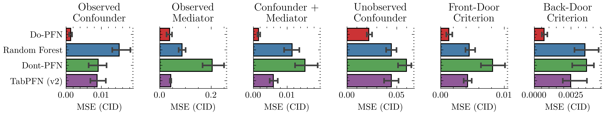

<figcaption>図3: 条件付き介入分布の予測。CID 予測における Do-PFN と回帰ベースラインの正規化平均二乗誤差（MSE）の分布を描いた、95%信頼区間つき棒グラフと臨界差（CD）ダイアグラム。6つの因果ケーススタディにわたって、Do-PFN は回帰ベースラインに対し MSE の統計的に有意な改善を達成し、我々の事前訓練目的が CID 予測に有効であることを示す。</figcaption>
</figure>

##### 事前訓練目的の有効性

図3で、まず Do-PFN が次の表形式回帰モデルより統計的に有意に良いことを観測する: Random Forest、TabPFN（v2）、および観測結果を予測するよう我々の prior で事前訓練した回帰モデル（"Dont-PFN" と呼ぶ）。この結果は2つの興味深い発見を提供する。

第一に、Do-PFN と Dont-PFN の間の実質的な性能差は、我々の事前訓練（アルゴリズム1）が、観測結果の単なる標準的な事後予測分布とはかなり異なる何かを近似していることの経験的証拠を提供し、これが今度は Do-PFN が因果効果を精密に推定することを可能にする。

第二に、Do-PFN は、観測集合 $\mathcal{D}^{ob}$ と $\mathcal{D}^{in}$ のサンプルが異なるデータ生成過程、すなわち元の SCM と介入された SCM から来るという事実を効果的に扱う。これは、処置 $t$ と共変量 $\mathbf{x}$ の間に有向辺があるときちょうど、同時分布 $p(t^{ob},y^{ob})$ と $p(t^{in},y^{in})$ の不一致を引き起こす。処置と共変量が独立にサンプリングされるとき、この不一致は消える。これは「Common Effect」ケーススタディ（付録図16）での Do-PFN と表形式回帰モデルの同様の性能によって経験的に裏づけられる。さらに、処置の効果が増大すると、TabPFN（v2）が全ケーススタディで性能を悪化させることを観測する（図7左）。

興味深いことに、Do-PFN は同定不能な「Unobserved Confounder」ケーススタディでも他の手法を上回る。このケースで正確な因果効果を推論することは証明上不可能だが、データ生成過程は依然として、可能な因果効果の集合を絞り込ませる因果的痕跡を残しうる。我々は、Do-PFN がこの微妙な種類の因果情報を活用して少なくとももっともらしい解の集合を出力すると考える——伝統的手法ではこのケースは完全に解けないと見なされるのと対照的に。我々はまた「Observed Mediator（観測媒介変数）」ケーススタディで Do-PFN の最も弱い性能を観測するが（図3、付録図12）、後に、これが CATE 推定では相殺される CID 設定での過剰予測（overprediction）に起因することを強調する。

##### 暗黙的なグラフ同定

Do-PFN を我々の「ゴールドスタンダード」ベースライン（付録図12）と比較すると、Do-PFN が DoWhy（Int.）と DoWhy（Cntf.）と競争力ある性能を示すことを観測する。これらは、観測データと真値のグラフ構造の両方が与えられたとき、それぞれ加法ノイズモデル（ANM）と可逆 SCM を当てはめるベースラインである。DoWhy はその後、構築した SCM を用いて介入結果と反事実結果を予測する。DoWhy ベースラインは、内生的な構造方程式を表すために事前訓練済みの TabPFN（v2）分類・回帰モデルを適用し、結果の因果モデルに大きな表現能力を備えさせていることに注意する。

我々の CD 分析（付録図12）で、Do-PFN が DoWhy（Int.）より平均で良く、真のグラフ構造へアクセスできないにもかかわらず、他のどのベースラインよりも DoWhy（Cntf.）に近い性能を示すことを観測する。さらに、付録図15で Do-PFN の異なる変種を比較すると、最も短く事前訓練したモデル Do-PFN-Short ですら、各ケーススタディについて対応するグラフ構造のみに引いたデータセットで事前訓練された Do-PFN-Graph と既に同様の性能を示すことを観測する。

### 4.3 Estimating conditional average treatment effects (CATEs)（条件付き平均処置効果の推定）

我々はここで、次を計算することで CATE 推定における Do-PFN の能力を評価する。

$$
\hat{\tau}(\mathbf{x}^{pt})=\mathbb{E}_{y^{in}\sim q_{\theta}(y^{in}|do(1),\mathbf{x}^{pt},\mathcal{D}^{ob})}[y^{in}]-\mathbb{E}_{y^{in}\sim q_{\theta}(y^{in}|do(0),\mathbf{x}^{pt},\mathcal{D}^{ob})}[y^{in}].
$$

##### 因果機械学習ベースラインとの比較

CATE 値の推定で、CATE 推定に適用された最大のモデル Do-PFN-CATE が、最先端のメタ学習器と二重機械学習（DML）アプローチを統計的に有意に上回ることを再び観測する（図4）。S-Learner として用いられた TabPFN（v2）の強い性能（Do-PFN-CATE に次ぐ2位）は、最近の発見と整合することに注意する。

<figure>

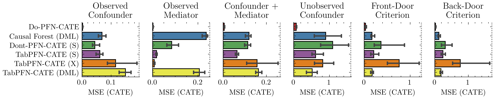

<figcaption>図4: 条件付き平均処置効果の推定。CATE 推定における Do-PFN-CATE と因果ベースラインの正規化平均二乗誤差（MSE）の分布を描いた、95%信頼区間つき棒グラフと臨界差（CD）ダイアグラム。6つの因果ケーススタディにわたって、Do-PFN-CATE は CATE 推定の一般的ベースラインを有意に上回る。</figcaption>
</figure>

##### ゴールドスタンダードベースラインとの比較

我々はまた、CATE 推定の設定で Do-PFN-CATE が DoWhy-CATE（Cntf.）と同じ同値クラスの性能を示し（付録図13）、十分性（sufficiency）の一般的な「先験的（a priori）」仮定が破られたときにはゴールドスタンダードのベースラインを上回ることを観測する（図6）。CATE 推定でのこの性能向上を調べるため、我々は付録 D.4 で、Do-PFN の予測における比較的高いバイアスと低い分散が、CID 予測と比べて CATE 推定での性能向上につながりうることを強調する。

### 4.4 Hybrid synthetic-real-world data（合成-実世界ハイブリッドデータ）

合成ケーススタディでの Do-PFN の強い性能が実世界データにも拡張するかを評価するため、広く合意された因果グラフを持つ2つの実世界データセットで実験を行う（付録図8）。これらの因果グラフは DoWhy ライブラリを用いてゴールドスタンダードの結果をシミュレートさせ、Do-PFN とベースラインの評価を可能にする。これらの結果の鍵となる要点は、合成データでの Do-PFN の強い性能が実世界データにもよく拡張するようで、広く受け入れられた因果グラフへアクセスできる我々のゴールドスタンダードベースラインと同様の予測を生むことである。

<figure>

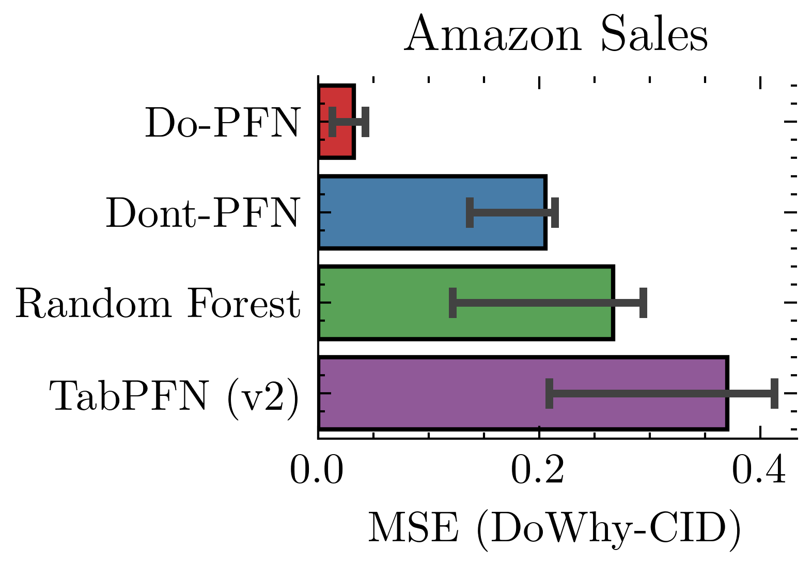

<figcaption>図5: 合成-実世界ハイブリッドデータ。介入結果予測（左）と CATE 推定（右）における、Do-PFN と因果・回帰ベースラインの正規化平均二乗誤差（MSE）の分布を描いた95%信頼区間つき棒グラフ。Do-PFN の合成設定での強い性能は、特に CATE 推定で、ハイブリッド合成-実世界シナリオにも拡張する。</figcaption>
</figure>

##### Amazon Sales

Amazon Sales データセットは、特別なショッピングイベント（"Shopping Event?"）がスマートフォン販売の利益（"Profit"）に与える効果のデータを含む。介入結果の予測では、Do-PFN が Dont-PFN、Random Forest、TabPFN（v2）よりも実質的に良い正規化平均二乗誤差（MSE）スコアを持つことが分かる（図5左）。CATE 推定では、Do-PFN-CATE が他の CATE ベースライン（性能の分散が比較的大きい）より低い中央値 MSE を持つ（図5中央右）。付録図9 は CID 予測と CATE 推定について Do-PFN とベースラインの予測 vs ゴールドスタンダードの介入結果を可視化し、Do-PFN の予測がゴールドスタンダードのターゲットによく整合することを示す。

##### Law School Admissions

Law School Admissions データセット（図8）は、1998年の LSAC National Longitudinal Bar Passage Study から引かれ、変数「Race」が保護属性として扱われた論文での登場により、反事実公平性（counterfactual fairness）の領域で有名になった。我々はアルゴリズムバイアスの話題には取り組まないが、「Race」への介入を行うことによる初年度平均（"FYA"）への効果をシミュレートすることに注意する。これは因果公平性で一般的な評価戦略である。CID 予測（図5中央左）と CATE 推定（図5右）の点で、Do-PFN が両方の量の近似で全ベースラインを上回ることが分かる。しかし特に CATE 推定で強い性能を観測し、そこでは Do-PFN が一般的な CATE 推定ベースラインより有意に良い。

<figure>

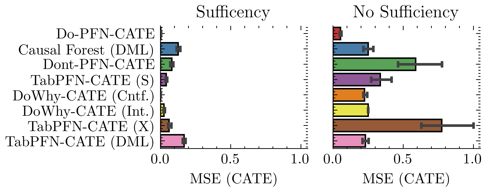

<figcaption>図6: 因果的仮定への頑健性。十分性（未観測変数がない）と無交絡性（共変量が与えられたとき処置割り当てが潜在結果から独立）が満たされる/破られるときの、CATE 推定における中央値 MSE を描いた棒グラフと95%信頼区間。すべての手法は十分性と無交絡性が破られると性能が劣化するが、Do-PFN は両設定で最も強い性能を維持する。</figcaption>
</figure>

### 4.5 Ablation studies（アブレーション研究）

最後に、異なるサイズのデータセットにわたって、またデータ生成 SCM 自体のいくつかの側面を変化させて、Do-PFN の挙動を評価するいくつかのアブレーション研究を行う。

##### 因果的仮定への頑健性

十分性（未観測変数がない）と無交絡性（共変量が与えられたとき処置が潜在結果から独立）の因果的仮定が満たされる/破られるときの CATE 推定における Do-PFN とベースライン集合の性能を比較すると、Do-PFN を含むすべての手法が十分性と無交絡性の充足から恩恵を受けることが分かる（図6）。これらの仮定は因果的観点から問題を実質的により容易にするが、Do-PFN は十分性や無交絡性が破られるケースでもその優れた性能を維持する。

##### データセットのサイズと複雑さ

第一に、図7（中央左）で Do-PFN が小規模データセットで強い性能を示すことを観測する。$M_{max}\sim\text{Uniform}([5,2000])$ となるよう引いたさまざまなサンプル数のデータセットにわたる CATE 推定の MSE の評価で、Do-PFN-CATE が DoWhy-CATE（Cntf.）と競争力ある性能を示し、その性能はデータセットサイズが増えるにつれて改善し続け、より一貫したものになることを観測する。我々はまた、Do-PFN がグラフの複雑さにわたって DoWhy-CATE（Cntf.）と競争力ある性能を示すことを見出す（図7右）。グラフの複雑さにわたる Do-PFN の性能を付録 D.1 でさらに分析する。さらに、Do-PFN が増大するノイズ水準を緩和するために追加のデータ点を効果的に使えることを見出す（付録 D.2）。

##### 処置効果

我々はまた図7（左）で、Do-PFN が平均処置効果（ATE）の異なるベースレート水準にわたって MSE において比較的一貫していることを示す。この結果は、Do-PFN が「処置は必ず結果に影響する」という帰納バイアスを保持せず、真の ATE のさまざまな大きさに頑健であることを示す。これは問題の誤特定のケース、例えば指定した処置が結果に影響しないときに有益である。

##### 不確実性の較正

次に、Do-PFN の不確実性較正を探る（付録 D.3）。そこでは Do-PFN が理論的に同定可能なケーススタディではやや自信過小であることが分かる。「Unobserved Confounder」ケーススタディでは、モデルの高い不確実性が出力分布の比較的大きいエントロピーに反映される（付録17）。しかし我々の PICP 結果は、このケーススタディに対するモデルの不確実性が正しく較正されていることを示す。全体として、我々の結果は、Do-PFN が、変動が同定不能性のために生じる場合でも、因果効果の変動を正しく捉えられることを示す。

<figure>

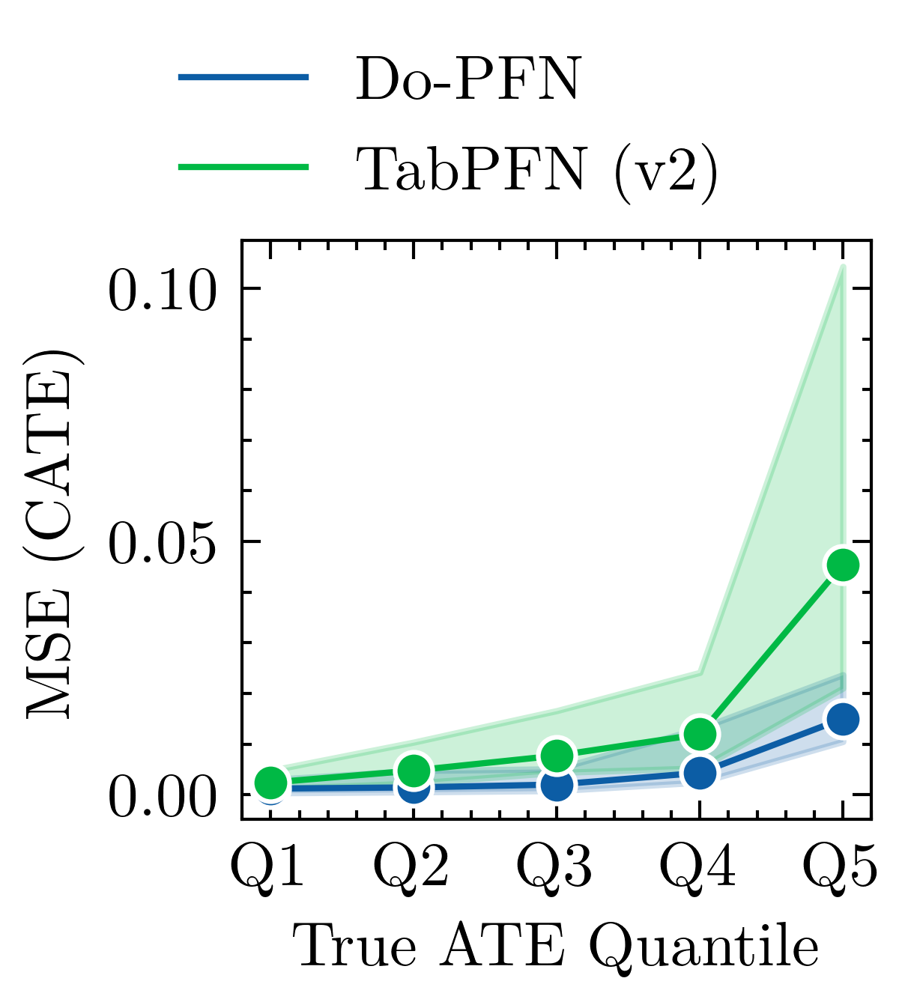

<figcaption>図7: アブレーション研究。Do-PFN は ATE のベースレートの変化に比較的鈍感（左）、観測サンプル数の増加とともに改善し（中央左）、大きなグラフ構造でも一貫している（右）。</figcaption>
</figure>

## 5 Discussion（議論）

我々は Do-PFN を導入した。これは ICL を活用して観測データから介入結果を予測することをメタ学習する事前訓練済み Transformer である。注意深く統制された合成・ハイブリッド合成-実世界の設定での我々の経験的結果は、Do-PFN が強い表形式・因果機械学習ベースライン集合を上回り、一方で真値の背後の因果グラフを与えられた同等に表現力あるモデルと競争力ある性能を示すことを示唆する。さらに Do-PFN は小規模データセットで強い性能を示し、グラフの複雑さとベース処置効果への不変性を示し、同定不能性から生じる不確実性を正しく考慮する。とはいえ、我々は一連の限界と将来の課題を論じる必要がある。

##### 実世界ベンチマーキング

第一に、Do-PFN の汎化能力は、SCM 上の合成事前分布 $p(\psi)$ が実世界の因果的複雑さを適切に捉えることに決定的に依存する。我々の現在の検証は主に合成データに基づくため、Do-PFN の prior-現実の不一致への頑健性と多様な実世界データセットでの性能は、prior 設計と検証の原理に基づく手法、および因果効果推定の包括的ベンチマークとともに、さらなる系統的探究を要する。我々を楽観的にさせるのは、初期のハイブリッド合成-実世界の結果と、合成 prior fitting が強い実世界性能につながりうるという強い証拠を提供するコミュニティからの経験的発見である。

##### 同定可能性理論と統計的保証

我々の実験は Do-PFN が訓練 prior からの不確実性（同定不能な効果を持つ SCM からのものを含む）を反映できることを示唆するが、この学習された予測的不確実性が形式的な因果同定可能性の境界とどう整合するかの完全な理論的特徴づけは、将来の研究の自明でない領域として残る。Do-PFN の償却推論アプローチは小規模データに直面したときに効率性を提供するが、既知の因果構造の下での伝統的な非償却推定器と比べて、統計的保証に関して異なる理論的基盤を持つ。しかし、そうした償却モデルの統計理論はまだ発展途上である。

##### 信頼と解釈可能性

命題1の理論的結果と、多様な因果設定での Do-PFN の強い経験的性能を合わせると、Do-PFN が因果推論を行う高度に効果的なアプローチであることを含意する。それゆえ Do-PFN は、まず問題の因果構造を発見し、それが第二段階で適切な調整を行わせる、という伝統的な因果推論アプローチに従っている可能性がある。Do-PFN の機構的解釈可能性（mechanistic interpretability）の将来の研究は、その内部動作を検証し、透明性と信頼の感覚を向上させるのに役立つだろう。

##### さらなる因果タスクへの拡張

多くの構成と種類の因果的課題は、この初期の研究では必然的に扱われなかった。これらには例えば、二値介入と反事実を超えたより広い介入タイプ、非 i.i.d. の入力データ、我々の現在の実験範囲に明示的に含まれないさまざまな観測データの特性やモダリティが含まれる。それらを我々のデータ生成 prior に組み込むことは、これらの難問のいくつかに対する全く新しい取っ掛かりを与えうる。

結論として、Do-PFN の鍵となる貢献は因果効果推定の新しい方法論である。我々は、それが標準的な ML ツールキットの一部となり、それによって因果効果推定にその実世界の関連性が値する広いアクセシビリティを与える手助けとなる見込みに楽観的である。

## Appendix A Proof of Proposition（命題の証明）

アルゴリズム1のように NLL 損失を用いるときの、単一の介入データ点に対するリスクは次の形を取る。

$$
\mathcal{R}_{\theta}=\int\int\int\int-\log(q_{\theta}(y^{in}|do(t^{in}),\mathbf{x}^{pt},\mathcal{D}^{ob}))p(\mathcal{D}^{ob},t^{in},y^{in},\mathbf{x}^{pt})d\mathcal{D}^{ob}dt^{in}dy^{in}d\mathbf{x}^{pt}
$$

$p(\mathcal{D}^{ob},t^{in},y^{in},\mathbf{x}^{pt})$ を考える。すると、まず構造的因果モデル（SCM）の分布 $p(\psi)$ を周辺化し、第二にアルゴリズム1のデータ生成過程が含意する同時分布の因数分解を利用することで、次を得られる。

$$
p(\mathcal{D}^{ob},t^{in},y^{in},\mathbf{x}^{pt})=\int p(\mathcal{D}^{ob},t^{in},y^{in},\mathbf{x}^{pt},\psi)d\psi=\\
\int p(y^{in},\mathbf{x}^{pt}|do(t^{in}),\psi)p(t^{in}|\mathcal{D}^{ob})p(\mathcal{D}^{ob}|\psi)p(\psi)d\psi
$$

ここで次を使える。

$$
p(y^{in},\mathbf{x}^{pt}|do(t^{in}),\psi)=p(y^{in}|\mathbf{x}^{pt},do(t^{in}),\psi)p(\mathbf{x}^{pt}|do(t^{in}),\psi).
$$

さらに、

$$
p(\mathbf{x}^{pt}|do(t^{in}),\psi)p(t^{in}|\mathcal{D}^{ob})p(\mathcal{D}^{ob}|\psi)p(\psi)=p(\mathcal{D}^{ob},t^{in},\mathbf{x}^{pt},\psi).
$$

これは次を含意する。

$$
p(\mathcal{D}^{ob},t^{in},y^{in},\mathbf{x}^{pt})=\int p(y^{in}|\mathbf{x}^{pt},do(t^{in}),\psi)p(\mathcal{D}^{ob},t^{in},\mathbf{x}^{pt},\psi)d\psi
$$

これを式5に代入し、続いて2つの分布 $p$ と $q$ の交差エントロピーが $p$ と $q$ の間の Kullback-Leibler ダイバージェンスに $p$ のエントロピーを足したものに等しいという事実、形式的には $H(p,q)=H(p)+\mathbb{D}_{KL}(p||q)$（[31] と [2] が類似のシナリオで用いた事実）を用いると、次が得られる。

$$
\mathcal{R}_{\theta}=\int\int\int\int\int-\log(q_{\theta}(y^{in}|do(t^{in}),\mathbf{x}^{pt},\mathcal{D}^{ob}))\\
p(y^{in}|\mathbf{x}^{pt},do(t^{in}),\psi)p(\mathcal{D}^{ob},t^{in},\mathbf{x}^{pt},\psi)d\mathcal{D}^{ob}dt^{in}dy^{in}d\mathbf{x}^{pt}d\psi\\
=\int\int\int\int\mathbb{D}_{KL}\left[p(y^{in}|\mathbf{x}^{pt},do(t^{in}),\psi)||q_{\theta}(y^{in}|do(t^{in}),\mathbf{x}^{pt},\mathcal{D}^{ob})\right]\\
p(\mathcal{D}^{ob},t^{in},\mathbf{x}^{pt},\psi)d\mathcal{D}^{ob}dt^{in}d\mathbf{x}^{pt}d\psi+C
$$

これは、$\mathcal{R}_{\theta}$ を最小化することが、$p(\psi,\mathcal{D}^{ob},t^{in},\mathbf{x}^{pt})$ からシミュレートされたデータに関する期待において、モデル $q_{\theta}(y^{in}|do(t^{in}),\mathbf{x}^{s},\mathcal{D}^{ob})$ による $p(y^{in}|do(t^{in}),\psi,\mathbf{x}^{s})$ の（前向き）Kullback-Leibler 最適な近似をもたらすことを含意する。

PFN と同様に、最適性は期待が合成データ生成過程に関して取られるときのみ成り立つことに注意されたい。しかし [32] による理論的結果と、PFN の実世界シナリオへの転移可能性に関する多数の経験的発見、および関連アプローチは、合成 prior fitting が強い実世界性能につながりうるという証拠を提供する。

## Appendix B Details on the prior-fitting procedure（prior-fitting 手続きの詳細）

本節では、我々のモデル化の仮定を表すアルゴリズム1のデータ生成過程の詳細を提供する。PFN の観点から、このデータ生成過程は Do-PFN の "prior" を表す。具体的に、我々の prior-fitting 手続きは次の鍵となるステップを含む。

##### SCM のサンプリング

第一に、各反復 $i=1,2,\ldots,N$ について、SCM $\psi_{i}$ がサンプリングされる。これは、頂点のトポロジカルソートを介してまず DAG をサンプリングすることで達成される。グラフの各ノード $k$ について、非線形性 $\gamma$ を次の関数のいずれかとして一様ランダムにサンプリングする: 二次関数 $x\mapsto x^{2}$、$x\mapsto\text{ReLU}(x)$、$x\mapsto\tanh(x)$。我々は SCM の機構を加法ノイズモデル（ANM）$f_{k}(z_{\text{PA}(k)},\epsilon_{k})=\gamma(\sum_{l\in\text{PA}(k)}w_{l}z_{l})+\epsilon_{k}$ の形を取ると定義する。SCM の重みは Kaiming 初期化 $w_{l}\sim\text{Uniform}(-\frac{1}{\sqrt{|\text{PA}(k)|}},\frac{1}{\sqrt{|\text{PA}(k)|}})$ を用いてサンプリングされる。ここで $|\text{PA}(k)|$ はノード $k$ の親の数を表す。

##### 観測データのサンプリング

次に、観測データが SCM $\psi_{i}$ に従ってサンプリングされる。より具体的には、データセット $\mathcal{D}_{i}^{ob}$ が $M_{ob}$ 個のデータ点で満たされる。データ点の数は $M_{min}=10$ と $M_{max}=2,200$ の間で一様に引かれる。$\mathcal{D}_{i}^{ob}$ の各要素は、まずノイズベクトル $\epsilon_{j}\sim p(\epsilon)$ をサンプリングし、それを SCM に通して各要素 $y_{j}^{ob},t_{j}^{ob},\mathbf{x}_{j}^{ob}$ を生成することで生成される。

##### 介入データのサンプリング

$M^{in}=M_{max}-M^{ob}$ 個のデータ点を持つ介入データセット $\mathcal{D}^{in}_{i}$ の要素をサンプリングするため、まずノイズベクトル $\epsilon_{k}\sim p(\epsilon)$ が再びサンプリングされる。続いて共変量ベクトル $\mathbf{x}_{k}^{pt}$ が $p(\mathbf{x}|\psi_{i},\epsilon_{k})$ からサンプリングされる。これにより、ベクトル $\mathbf{x}_{k}^{pt}$ が介入前の被験者 $k$ を特徴づけることが保証される。処置の値 $t_{k}^{in}$ をサンプリングした後、介入 $do(t_{k}^{in})$ を行い、前と同じノイズ $\epsilon_{k}$ を用いて介入された SCM から $y_{k}^{in}$ をサンプリングする。

##### 勾配降下

各反復 $i=1,2,\ldots,N$ について、観測データセット $\mathcal{D}^{ob}_{i}$ と介入データセット $\mathcal{D}^{in}_{i}$ が生成される。これらのデータセットは、我々のモデル $q_{\theta}$ のもとでの負の対数尤度を計算するために利用される。この損失は、介入の値 $t_{k}^{in}$、共変量 $\mathbf{x}_{k}^{pt}$、観測データセット $\mathcal{D}^{ob}_{i}$ に基づいて介入結果 $y_{k}^{in}$ を予測することに関して計算される。続いて、負の対数尤度に対して勾配ステップが取られる。実際には、Adam 最適化器を用いてミニバッチ確率的勾配降下を行う。

## Appendix C Experimental Details（実験の詳細）

### C.1 Details on the synthetic case studies（合成ケーススタディの詳細）

本節では、4.1 節で考慮したすべてのケーススタディの詳細を提供する。外生ノイズの標準偏差 $\sigma_{exo}$ は $\sigma_{exo}\sim\text{Uniform}([1,3])$ からサンプリングされる。加法ノイズ項の標準偏差については、$\beta\sim\text{Beta}(1,5)$ をサンプリングし、$\sigma_{\epsilon}=0.3\cdot\beta$ と設定する。

関数 $f_{z_{k}}$ は $f_{a}(z_{k},\epsilon)=\gamma(\sum_{l\in\text{PA}(k)}w_{l}z_{l})+\epsilon$ の形を取る。SCM の重みは Kaiming 初期化 $w_{l}\sim\text{Uniform}(-\frac{1}{\sqrt{|\text{PA}(k)|}},\frac{1}{\sqrt{|\text{PA}(k)|}})$ を用いてサンプリングされる。非線形性 $f_{a}$ は集合 $\{f_{1},f_{2},f_{3}\}$ から一様ランダムにサンプリングされる。ここで $f_{1}(x)=x^{2}$、$f_{2}(x)=\tanh(x)$、$f_{3}=ReLU(x)=\max(0,x)$ である。ケーススタディの詳細は表1に見られる。

**表1**: すべての因果ケーススタディの構造方程式。（Observed Confounder / Observed Mediator / Confounder + Mediator / Unobserved Confounder / Back-Door Criterion / Front-Door Criterion の6種。各々 $\epsilon\sim\mathcal{N}(0,\sigma_{\epsilon})$、外生変数 $\sim\mathcal{N}(0,\sigma_{exo})$、処置 $t$・共変量 $x$・結果 $y$ を上記 $f$ で生成。原典の表1を参照。）

### C.2 Evaluation metric（評価指標）

我々は結果を正規化平均二乗誤差（MSE）の点で評価する。これはデータセット間で結果を比較できるからである。正規化 MSE を以下に定義する。

$$
\text{MSE}(\mathbf{y},\hat{\mathbf{y}})=\frac{1}{n}\sum_{i=1}^{n}\left[\frac{y_{i}-\hat{y}_{i}}{\max(\mathbf{y})-\min(\mathbf{y})}\right]^{2}
$$

### C.3 Description of baselines（ベースラインの説明）

#### C.3.1 Conditional interventional distribution prediction（条件付き介入分布の予測）

- Dont-PFN: 事後予測分布（PPD）$p(y^{ob}|\mathbf{x}^{ob},\mathcal{D}^{ob})$ を近似するよう我々の prior で事前訓練された TabPFN 回帰モデル。
- DoWhy（Int./Cntf.）: 観測サンプル $\mathcal{D}^{ob}$ とグラフ構造 $\mathcal{G}_{\psi}$ に当てはめられた構造的因果モデル $\psi$。構築された SCM は介入（Int.）結果と反事実（Cntf.）結果を予測するために用いられる。決定的に重要なことに、二値・連続の構造方程式を近似するために TabPFNClassifier と TabPFNRegressor モデルが用いられる。
- Random Forest: $\mathcal{D}^{ob}$ で訓練された決定木のアンサンブル。
- Do-PFN-Graph: 我々のケーススタディの固定グラフ構造について CID $p(y^{do}|\mathbf{x}^{ob},\mathcal{D}^{ob})$ を近似するよう5時間事前訓練された TabPFN 回帰モデル。
- Do-PFN-Short: 最大5ノードのさまざまなグラフ構造について CID を近似するよう20時間事前訓練された TabPFN 回帰モデル。
- Do-PFN: 最大10ノードのさまざまなグラフ構造について CID を近似するよう40時間事前訓練された TabPFN 回帰モデル。
- Do-PFN-Mixed: 加法ノイズ項を平均ゼロのガウス・ラプラス・スチューデント t・ガンベル分布からサンプリングするかを変化させて事前訓練された Do-PFN-Short。

#### C.3.2 Conditional average treatment effect estimation（条件付き平均処置効果の推定）

- Causal Forest（DML）: 条件付き平均処置効果（CATE）を推定するために複数の因果木を組み合わせる二重機械学習（DML）アプローチ。ハイパーパラメータは網羅的探索でチューニングされる。
- Do-PFN-CATE: 次の特定の量を予測するために適用された Do-PFN:
	$$
	\hat{\tau}=\mathbb{E}_{y^{in}\sim q_{\theta}(y^{in}|do(t^{in}=1),\mathbf{x}^{pt},\mathcal{D}^{ob})}[y^{in}]-\mathbb{E}_{y^{in}\sim q_{\theta}(y^{in}|do(t^{in}=0),\mathbf{x}^{pt},\mathcal{D}^{ob})}[y^{in}]
	$$
- DoWhy-CATE（Int./Cntf.）: CATE を推定するために S-Learner として用いられた DoWhy（Int./Cntf.）。DoWhy（Cntf.）が用いられるとき、ノイズ項は推論され順伝播にわたって一定に保たれる。
- Dont-PFN-CATE: CATE を推定するために S-Learner として用いられた Dont-PFN。

#### C.3.3 Software（ソフトウェア）

我々はすべての実験を実装するために Pytorch を用いる。因果 prior の実装は Causal Playground ライブラリと TabPFN で用いられたコードベースに基づく。プロットには Matplotlib、Autorank、Seaborn を用いる。

## Appendix D Supplementary Results（補足結果）

<figure>

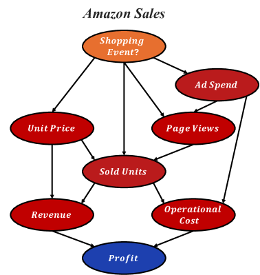

<figcaption>図8: 実世界ケーススタディ。我々の2つの実世界ケーススタディ Amazon Sales と Law School Admissions の、広く合意された因果グラフ。</figcaption>
</figure>

<figure>

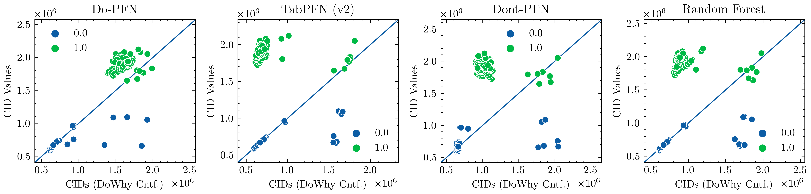

<figcaption>図9: Amazon Sales。Do-Why-(CATE)（Int./Cntf.）が生成したゴールドスタンダードの結果とベースライン予測の一致を描いた散布図。緑の散布点は介入 do(ShoppingEvent=1) が適用された個体、青の点は do(ShoppingEvent=0) を表す。</figcaption>
</figure>

<figure>

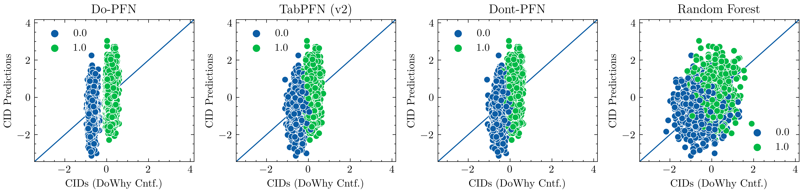

<figcaption>図10: Law School Admissions。Do-Why-(CATE)（Int./Cntf.）が生成したゴールドスタンダードの結果とベースライン予測の一致を描いた散布図。緑の散布点は介入 do(Race=1) が適用された個体、青の点は介入 do(Race=0) を表す。</figcaption>
</figure>

### D.1 Graph size and complexity（グラフのサイズと複雑さ）

我々は、増大する複雑さのグラフから生成されたデータにわたって Do-PFN の性能を評価し、4〜10ノードと2〜43辺からなるグラフ構造で生成された500データセットをサンプリングする。結果は図7（右）に可視化される。我々のデータ生成機構は数学的観点からは比較的単純だが、グラフ同定は組合せ的に難しい問題で、10ノードのユニークな有向非巡回グラフ（DAG）の数は $4.17\times 10^{18}$ に達することに注意する。Do-PFN はグラフの複雑さにわたって DoWhy-CATE（Cntf.）と競争力ある性能を示し、より複雑なグラフでわずかに大きい改善を示す。

### D.2 Robustness to additive noise（加法ノイズへの頑健性）

我々はまた図11（左）で、Do-PFN の性能が加法ノイズの標準偏差の増加とともに低下することを強調する。これはより大きな還元不能誤差に対応する。しかし図11（中央右）で、異なる加法ノイズ水準に対する Do-PFN の性能がデータセットサイズとともに増加するようであることも観測する。これは、一定量の加法ノイズを持つデータセットの MSE が、より多くのデータである程度まで減らせることを意味する。

<figure>

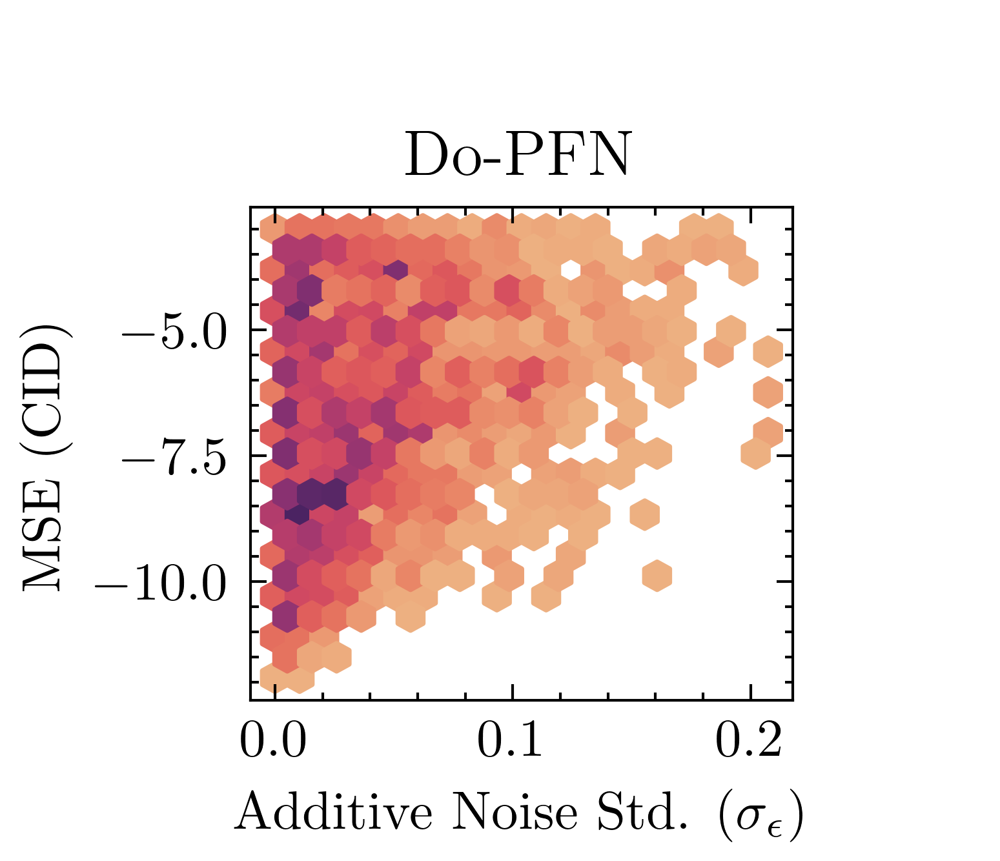

<figcaption>図11: 加法ノイズへの頑健性。加法ノイズ標準偏差の異なる分位（Q1-Q6）にわたる、CID 予測と CATE 推定における Do-PFN の性能の評価。密度プロット（左）は Do-PFN の性能が（還元不能な）加法ノイズとともに低下することを示す。しかしヒートマップ（中央）は、同様の加法ノイズ水準を持つデータセットでは Do-PFN の性能がデータセットサイズとともに増加することを示す。この効果は DoWhy-CATE（Cntf.）よりさらに強い。</figcaption>
</figure>

<figure>

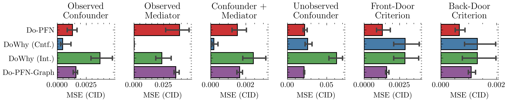

<figcaption>図12: ゴールドスタンダード比較（CID）。6つの合成ケーススタディでの CID 推定における Do-PFN と「ゴールドスタンダード」ベースラインの正規化 MSE の分布を描いた、95%信頼区間つき棒グラフと CD ダイアグラム。Do-PFN は Do-PFN-Graph と DoWhy（Int.）を有意に上回り、他のベースラインより DoWhy（Cntf.）に近い性能を示す。</figcaption>
</figure>

<figure>

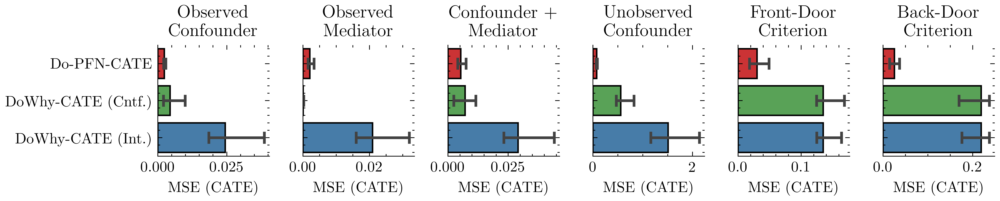

<figcaption>図13: ゴールドスタンダード比較（CATE）。6つの合成ケーススタディでの CATE 推定における Do-PFN の変種とベースラインの正規化 MSE の分布を描いた、95%信頼区間つき棒グラフと CD ダイアグラム。Do-PFN-CATE は DoWhy-CATE（Int.）を上回り、DoWhy-CATE（Cntf.）と競争力ある性能を示す。</figcaption>
</figure>

<figure>

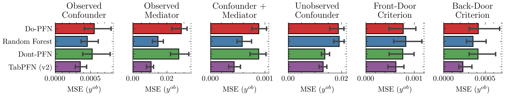

<figcaption>図14: 回帰問題での比較。6つの因果ケーススタディで観測結果（介入なし）を予測するときの、Do-PFN の変種とベースラインの正規化 MSE の分布を描いた、95%信頼区間つき棒グラフと CD ダイアグラム。</figcaption>
</figure>

<figure>

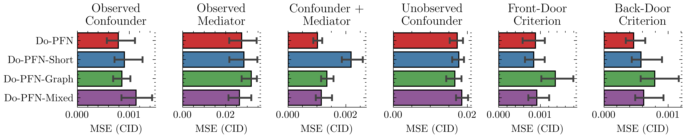

<figcaption>図15: Do-PFN 変種の比較（CID）。6つの合成ケーススタディでの CID 推定における Do-PFN 変種の正規化 MSE の分布を描いた、95%信頼区間つき棒グラフと CD ダイアグラム。Do-PFN は、半分の事前訓練時間で統計的に同様の性能を達成する Do-PFN-Mixed を除き、他の変種を有意に上回る。</figcaption>
</figure>

<figure>

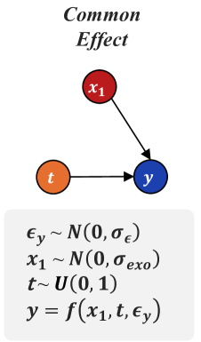

<figcaption>図16: 共通効果ケーススタディ。我々の「共通効果」ケーススタディのグラフ構造と構造方程式の可視化（左）、および CID 予測における Do-PFN 変種と回帰ベースラインの正規化 MSE の分布を描いた箱ひげ図。介入が D^ob と D^in の間に分布シフトを引き起こさないため、回帰ベースラインは Do-PFN 変種と同様の性能を示す。</figcaption>
</figure>

<figure>

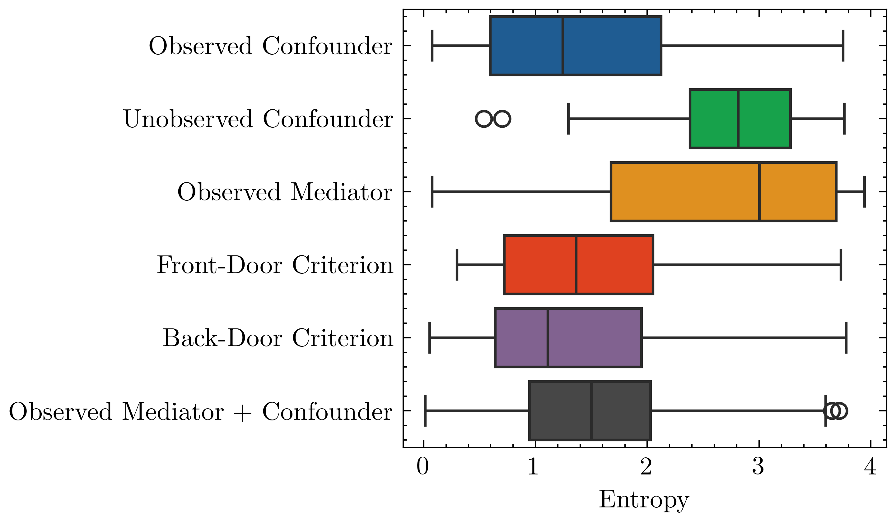

<figcaption>図17: 不確実性の定量化。Do-PFN のバー分布出力の交差エントロピー（CE）損失（右）とエントロピー（左）。Do-PFN は同定不能性のため「Unobserved Confounder」ケーススタディで高度に不確実である。Do-PFN は「Observed Mediator」ケーススタディでも高い不確実性を示すが、これはその唯一の外生項が二値変数であり、結果の連続効果が加法ノイズのみから来るためだと我々は論じる。</figcaption>
</figure>

### D.3 Uncertainty calibration（不確実性の較正）

我々は図7で予測区間被覆確率（prediction interval coverage probability, PICP）を可視化することで Do-PFN の較正を調べる。45度の対角線に等しい PICP 曲線は、ちょうど望ましい被覆を持つ予測区間を一貫して生むモデルに対応する。対角線より上にあることは自信過小、下にあることは自信過剰の予測区間に対応する。

要約すると、Do-PFN は同定可能なケーススタディではやや自信過小だが、同定不能な因果効果から生じる不確実性を正しく指定することが分かる。

<figure>

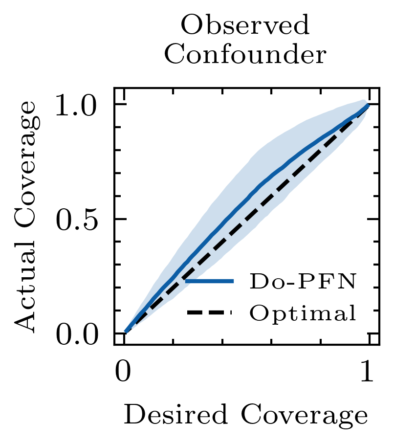

<figcaption>図18: 不確実性の較正。「Observed Mediator」「Confounder + Mediator」「Backdoor Criterion」「Frontdoor Criterion」のケースの予測区間被覆確率（PICP）プロット。実線の青は Do-PFN が達成する被覆と標準偏差を示し、望ましい確率0から1にわたる。破線は真値の CID へアクセスできるときに達成可能な理想的な較正を表す。Do-PFN は同定可能なケーススタディではやや自信過小で、決定的に重要なことに「unobserved confounder」ケースでは正しく自信過小（不確実）である。</figcaption>
</figure>

### D.4 Bias decomposition（バイアス分解）

<figure>

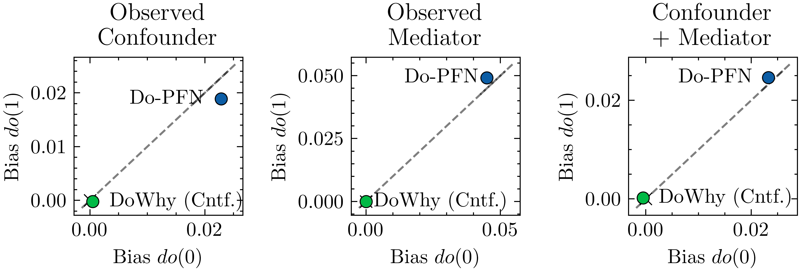

<figcaption>図19: バイアス分解。介入 do(0) と do(1) について、100個の合成データセットにわたる DoWhy（Cntf.）と Do-PFN のバイアスの中央値。ゴールドスタンダードの DoWhy（Cntf.）はすべてのケーススタディでゼロに非常に近いバイアスを維持するが、Do-PFN は小さい正のバイアスを持ち、それは両介入でほぼ同じ値を取る。</figcaption>
</figure>

Do-PFN が DoWhy（Int.）より良いが DoWhy（Cntf.）より悪かった CID 予測に対し、CATE 推定で比較的強い性能を示すことを調べるため、2つの介入 $do(0)$ と $do(1)$ のもとでの Do-PFN と DoWhy（Cntf.）のバイアスを分解し、全データセットにわたる平均残差誤差の中央値を計算する。図19で、DoWhy（Cntf.）が「Unobserved Confounder」を除くすべてのケーススタディで低いバイアスを持つ一方、Do-PFN のバイアスはより大きいが、介入 $do(0)$ と $do(1)$ の間でほぼ等しいことを観測する。これは Do-PFN を CID 予測で損なう。系統的にわずかに過剰予測するからである。しかし CATE 推定では、バイアス項が相殺され、介入結果を予測するより良い CATE 推定をもたらす。
