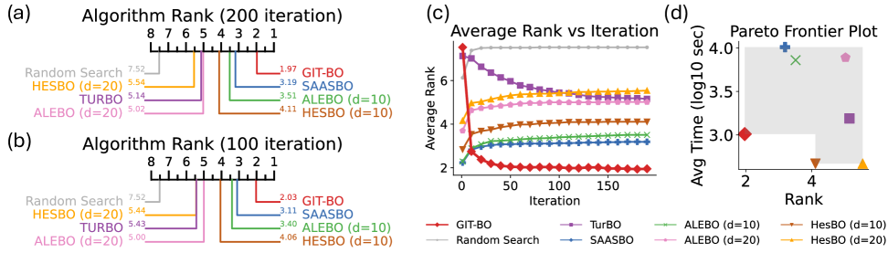
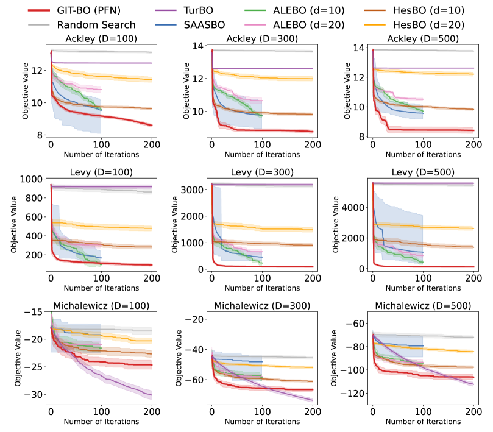
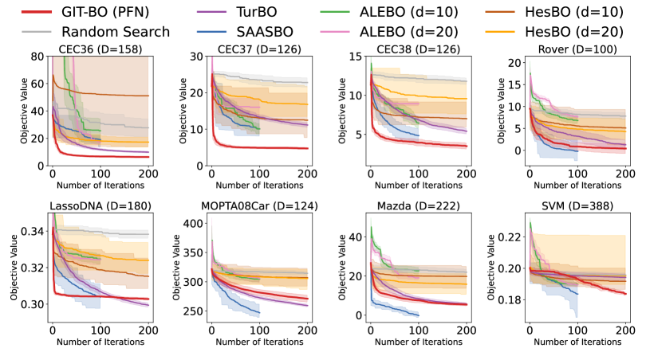

# GIT-BO: 表形式基盤モデルによる高次元ベイズ最適化

> 原題: GIT-BO: High-Dimensional Bayesian Optimization with Tabular Foundation Models
> 著者: Rosen Ting-Ying Yu, Cyril Picard, Faez Ahmed（Massachusetts Institute of Technology）
> 出典: arXiv:2505.20685

> 注: 本翻訳は **本文 §1〜6 のみ**を一文ずつ訳出する（ユーザーは appendix 指定なし）。付録 A〜C・References は対象外。数式は LaTeX を保持。原典は ar5iv 由来 markdown（ケース A）で、本文中の図はローカル保存して `<figure>` で配置する。**図1（アーキ概要）は ar5iv 側で画像変換に失敗（"NO IMAGE AVAILABLE"）していたため、キャプションのみ訳出**する。

## Abstract（要旨）

ベイズ最適化（BO; Bayesian Optimization）は高コストなブラックボックス関数を効果的に最適化するが、次元の呪いのため高次元空間（100 次元超）で大きな課題に直面する。

既存の高次元 BO 手法は通常、低次元埋め込みや構造仮定を活用してこの課題を緩和するが、これらのアプローチは反復的なサロゲート再訓練と固定仮定のため、しばしばかなりの計算オーバーヘッドと硬直性を招く。

これらの限界に対処するため、我々は**表形式基盤モデルを用いた勾配誘導ベイズ最適化（GIT-BO; Gradient-Informed Bayesian Optimization using Tabular Foundation Models）** を提案する。これは事前訓練済みの表形式基盤モデル（TFM; tabular foundation model）をサロゲートとして用い、その勾配情報を活用して最適化のための低次元部分空間を適応的に同定するアプローチである。

我々は、TFM の順伝播からの内部勾配計算を活用する方法を提案する。すなわち、TFM の予測の最も感度の高い方向を明らかにする**勾配誘導診断行列（gradient-informed diagnostic matrix）** を作ることで、繰り返しのモデル再訓練なしに、連続的に再推定される能動部分空間（active subspace）での最適化を可能にする。

23 個の合成・実世界ベンチマークにわたる広範な実証評価により、GIT-BO が 4 つの最先端のガウス過程（GP）ベース高次元 BO 手法を一貫して上回り、特に 500 次元まで次元が増えるにつれて優れたスケーラビリティと最適化性能を示すことを実証する。

本研究は、勾配誘導の適応的部分空間同定で強化した基盤モデルを、高次元ベイズ最適化タスクにおける伝統的な GP ベースアプローチの非常に競争力ある代替として確立する。

## 1 Introduction（はじめに）

ベイズ最適化（BO）は、ブラックボックス最適化の効果的でサンプル効率の良い技法として広く認識され、機械学習・工学設計・ハイパーパラメータ調整に不可欠である。

しかし BO は、次元の呪いのため高次元空間（特に次元 $D>100$）で苦戦し、従来のガウス過程（GP）ベース手法が複雑な目的関数を効果的に探索するのを難しくする。

既存の高次元 BO アプローチは、低次元部分空間を活用してこれらの課題を緩和するが、依然として反復的なモデル再訓練と構造仮定に大きく依存し、相当な計算オーバーヘッドを招く。

表形式基盤モデル（TFM）の最近の進歩は、ベイズ最適化におけるサロゲート再当てはめを回避するため、Prior-Data Fitted Networks（PFN）を使うことを提案した。

当初は単純な低次元 BO 問題で実証された PFN ベース BO は、その後制約付き工学問題でさらに検証され、Transformer アーキテクチャの並列処理能力を使って速度・性能の両方で他手法を上回った。

最近の TFM モデルである TabPFN v2 は、TabPFN の能力を最大 500 次元の入力を扱えるよう拡張し、ゼロショット分類・回帰・時系列予測タスクで優れた性能を実証した。

TabPFN v2 は計算効率と予測精度から高次元 BO サロゲートとして刺激的な機会を提示するが、その固定パラメータの基盤モデルアーキテクチャは、カーネルハイパーパラメータを動的に適応させる能力を制限する。

これは、最適化中にカーネルパラメータを調整して高次元空間の主要な探索方向を効果的に同定する伝統的な GP モデルとは対照的である。

この限界への対処には、基盤モデルの強みを活かしつつ部分空間探索の適応機構を導入できるアプローチが必要で、本研究はそのギャップを埋めることを目指す。

これに対処するため、我々は**勾配誘導表形式ベイズ最適化（GIT-BO）** を導入する。これは基盤モデルの順伝播からの勾配情報を使って適応的な部分空間探索を動的に導く枠組みである。具体的には、我々の貢献は次の通り。

- 表形式基盤モデルをサロゲートとして用いる新しいベイズ最適化アプローチ GIT-BO を提案し、伝統的な GP ベース手法が苦戦する複雑な最適化地形で優れたスケーリング特性と性能を実証する。
- 我々の勾配誘導部分空間同定技術は、最適化の軌跡中に基盤モデルの適応的な勾配知識を活用して、高次元空間の有望な探索方向を適応的に学習する。
- GIT-BO を、合成関数と実世界問題を含む 23 個の多様なベンチマークにわたって 4 つの人気の最先端（SOTA）GP 高次元 BO 手法と比較し、複雑なベイズ最適化タスクの実行可能な代替として基盤モデルサロゲートを導入する。

論文の残りの構成は次の通り。§2 で背景問題を述べ関連研究を議論する。§3 で GIT-BO アルゴリズムを提示する。§4 で対象のベンチマーク高次元 BO アルゴリズム・テスト問題集合・性能評価法を定義する。結果を §5 で示し、§6 を結論の議論とする。

## 2 Background（背景）

#### ベイズ最適化と高次元の課題

ベイズ最適化は、高コストなブラックボックス関数を最適化するサンプル効率の良いアプローチで、目的は $\mathcal{X}=[0,1]^{D}$ 上で $x^{*}\in\arg\min_{x\in\mathcal{X}}f(x)$ を見つけることである。

このアルゴリズムは、目的関数を近似するサロゲートモデル（通常 GP）を活用し、獲得関数を計算して次のクエリ点を決め、最適に収束するまで繰り返す。

次元 $D$ が増えると、空間を効果的に探索するのにより多くの観測 $n$ が必要になり、GP を高い計算コスト（$O(n^{3})$ の計算量）の領域に押しやる。

#### 高次元ベイズ最適化の課題に取り組む既存戦略

高次元 BO の課題に対処するいくつかのベースラインアプローチが開発されてきた。

ランダム埋め込みベイズ最適化（REMBO）は、最適化領域をランダムに選んだ低次元線形部分空間に射影する。しかし REMBO は、点を実行可能領域に戻すクリッピングのため目的値が歪み、GP の較正を損なう。

ハッシュ拡張部分空間ベイズ最適化（HESBO）は、ガウス射影を、各点を実行可能に保つスパースなハッシュスケッチで置き換えるが、能動部分空間を含む確率がわずかに小さくなる代償を払う。

別のアプローチである適応的線形埋め込みベイズ最適化（ALEBO）は、埋め込みの線形性を保つ線形制約を採用してより効果的な最適化枠組みを作り、最適化性能をさらに改善する。

ただしこれら 3 手法はすべて、埋め込み次元 $d$ をユーザーが定義する必要がある。BAXUS は、データが蓄積するにつれてランダム部分空間の入れ子列を成長させることでこの制約を取り除く。

補完的な研究の系譜は、全空間をモデル化しつつ構造を活用する。TURBO は、進歩があれば拡大し、なければ縮小する複数の GP 駆動の信頼領域（trust region）を維持し、数千回の評価で最大 200 変数まで強い結果を達成する。

SAASBO は、GP の長さスケールに half-Cauchy 縮小事前分布を置き、顕著な変数のスパースな軸並行部分集合を自動的に選ぶ。しかしその計算コストは、次元ではなくサンプル数に対して 3 乗で増える。

これらの手法は大きな改善を提供するが、固定次元の埋め込み選択や漸増する計算オーバーヘッドのような限界を依然抱えており、高次元最適化問題をより動的かつ効率的に扱える代替アプローチの必要性を浮き彫りにする。

#### ベイズ最適化サロゲートとしての基盤モデル

表形式基盤モデルは、ベイズ最適化で GP ベース手法の有望な代替として現れた。

Prior-data Fitted Networks（PFN）は、事前訓練済み表形式基盤モデルがサロゲートとして GP を効果的に置き換えられることを実証した。

PFNs4BO は、GP と比べて大幅に削減された計算オーバーヘッドで、低次元 BO タスクで競争力ある性能を示した。

しかし PFN は、最適化中にカーネルハイパーパラメータを動的に更新する GP の適応能力を本質的に欠き、高次元空間内の低ランク構造を発見する能力が制限される。

興味深いことに、1 回の順伝播は入力と隠れ状態に関する内部勾配を生む。

大規模言語モデル（LLM）分野の研究は、勾配情報を活用するとモデルの挙動を導いたり、分布シフトへの迅速な適応を行えたりすることを示す。

これらの知見は、特に高次元探索空間の本質的構造を活用するため、ベイズ最適化内での勾配誘導技術の探求を動機づける。

#### 勾配強化ベイズ最適化

先行研究は、導関数情報が様々な機構を通じてベイズ最適化を加速したり探索空間の構造を捉えたりできることを実証する。

明示的な導関数が利用可能なとき、勾配情報を直接統合する方法は、関数値と勾配をガウス過程で同時にモデル化することである。

バッチ BO の並列知識勾配法や、GP 対数尤度勾配を使って最も情報的な観測部分集合をサンプリングする戦略は、BO の収束を速めることを示した。しかしこれらは本質的に精密な GP モデリングに依存し、次元が増えると効果が薄れる。

これらの限界を克服するため、我々は GP を当てはめる必要のない GIT-BO アルゴリズムを導入した。

我々のアプローチは GP 勾配強化 BO 手法から根本的に逸脱する。すなわち、表形式基盤モデルの順伝播から直接得た勾配情報を組み合わせ、高次元最適化の確立された戦略である部分空間同定を統合する。

$\phi$-Sobolev 不等式に基づく主特徴検出枠組みを適応させることで、高次元のターゲット測度を低次元の更新で近似できる。

このアプローチは、基盤モデルの計算効率と部分空間同定能力を組み合わせ、高次元空間での効果的な探索を可能にする。

## 3 The GIT-BO Algorithm（GIT-BO アルゴリズム）

ここで我々の GIT-BO 高次元 BO 枠組みを提示する。枠組みは 4 つの主要構成要素から成る: サロゲートモデル（TabPFN v2）、勾配ベースの部分空間同定、獲得関数の選択、そしてこれらを結びつけるアルゴリズム。

#### TabPFN によるサロゲートモデリング

我々は TabPFN、具体的には 500 次元の TabPFN v2 TFM モデルを、文脈内学習で目的関数値を予測するサロゲートモデルとして用いる。

最適化目的は、領域 $x\in\mathcal{X}\subset\mathbb{R}^{D}$ 上で未知関数 $f(x)$ を最小化することと定義される。

任意の BO 反復で、$D_{n}=\{(x_{i},y_{i})\}_{i=1}^{n}$ をこれまでにサンプルした点とその観測関数値 $y_{i}=f(x_{i})$ のデータセットとする。

標準的な BO 設定では、これらのデータに GP 事後 $p(f|\mathcal{D}_n)$ を当てはめる。ここでは代わりに、TabPFN を活用して予測モデルを得る。

データセット $D_{n}$ を入力文脈として TabPFN に与え（ラベル付き例の集合を入力系列の一部として取る）、任意の候補点 $x$ でモデルの予測をクエリする。

TabPFN は、新点 $x$ と観測サンプルの文脈の両方に基づいて、近似的な事後予測分布 $\text{PFN}(y\mid x,D_{n})$ を返す。

実際には、TabPFN は与えられたデータに対する $f(x)$ のベイズ事後平均 $\mu_{n}(x)$ への近似として、1 回の順伝播で予測を生む。

我々の方法では、先行する一連の PFN 研究を見直し、最新の TabPFN v2 回帰モデルで予測平均 $\mu_{n}(x)$ と予測分散 $\sigma_{n}^{2}(x)$ の計算を実装する。

#### 勾配誘導部分空間の同定とサンプリング

能動部分空間の同定には、TabPFN の予測平均値に対する 1 ステップの誤差逆伝播で得られる勾配情報 $\nabla_{x}\mu_{n}(x)$ を活用する。これは各反復でデータ点ごとに自然に変化する。

非線形ベイズ逆問題の次元削減（$\phi$-Sobolev 不等式と勾配ベースアプローチを用いる）の研究に着想を得て、我々は診断行列（フィッシャー情報行列）${H}=\mathbb{E}_{\mu}[\nabla_{x}\mu_{n}(x)\,\nabla_{x}\mu_{n}(x)^{\top}]$ を近似する。

$D>100$ の高次元問題の本研究では、${H}$ の上位 $r\;(D>>r)$ の支配的固有ベクトルを、勾配誘導能動部分空間（GI 部分空間）を張る主ベクトル ${V}_{r}$ として選ぶ。

次に、次の探索をこの部分空間に制限し、探索候補を $x_{\text{cand}}=\bar{x}_{ref}+{V}_{r}{z},\;{z}\sim\mathrm{U}([-1,1]^{r})$ で元の空間に写像し戻す。ここで参照点 $\bar{x}_{ref}$ は観測データの重心である。

最後に、$x_{\text{cand}}$ を獲得関数に渡して次に評価するサンプルを決める。

GIT-BO では、観測データが増えると部分空間が変わるので、各反復で GI 部分空間を再計算する。

計算上の実用性と探索・活用のバランスのため、GIT-BO ではデフォルトで $r=15$ とする。$r$ の選択に関する詳細な感度分析は付録に示す。

#### 獲得関数

我々は、高次元 BO での過去の成功から、トンプソンサンプリング（TS; Thompson Sampling）獲得を獲得関数として実装する。

TS では、各サンプル $x$ で予測分布からサンプリングして近似し、サロゲートの事後から固定数 512 個のランダムサンプル $\tilde{f}(\cdot)$ を引く。

最も高いサンプル値を持つ候補 $x_{\text{next}}$ を次のクエリ $\tilde{f}(x_{\text{next}})$ として選ぶ。

これは予測の不確実性を完全に活用し、探索と活用を暗黙にバランスする傾向がある。

ここでの鍵となる違いは、$x$ を学習した GI 部分空間に制限することである。次のクエリ点 $x_{\text{next}}$ を選んだ後、真の目的関数を評価して $y_{\text{next}}$ を得る。

すべてを合わせると、図1 とアルゴリズム1 が、TabPFN と勾配誘導部分空間探索を組み合わせた GIT-BO 手続きを概説する。GIT-BO の実装詳細は付録に述べる。

> 図1（原典 ar5iv で画像変換に失敗・キャプションのみ訳出）: GIT-BO アルゴリズムの概観。本手法は 4 段階で動く: (1) 高次元空間 $\mathbb{R}^{D}$ で初期観測サンプルを収集; (2) 固定重みの表形式基盤モデル TabPFN v2 が、文脈内学習で推論時に目的空間の予測を生成; (3) TabPFN の順伝播からの勾配情報 $\nabla\hat{\mu}(x)$ を使って低次元の勾配誘導（GI）部分空間を同定。予測平均と分散 $\hat{\mu}(x),\hat{\sigma}^{2}(x)$ は獲得値の計算に使う; (4) この GI 部分空間内で最高の獲得値を持つ次のサンプル点 $x_{\text{next}}$ を選び、停止基準を満たすまで反復探索のためデータセットに追加する。

> アルゴリズム1（GIT-BO）: 目的 $f$、領域 $\mathcal{X}\subset\mathbb{R}^{D}$、初期サイズ $n_{0}$、反復予算 $I$、部分空間次元 $r$ を入力に取る。$n_{0}$ 個の LHS（ラテン超方格サンプリング）点 $x_i$ を引いて $y_i=f(x_i)$ とし、$D\leftarrow\{(x_i,y_i)\}$ とする。各反復 $i=1..I$ で: $D$ に TabPFN を当てはめ平均 $\mu_n$・分散 $\sigma^2_n$ を得る → 全 $(x_i,y_i)\in D$ で勾配 $\nabla_x\mu_n(x_i)$ を計算 → 診断行列 $H=\mathbb{E}_\mu[\nabla_x\mu_n(x)\nabla_x\mu_n(x)^\top]$ を作り上位 $r$ 固有ベクトル $V_r$ を取る → $x_{\text{cand}}\leftarrow x_{\text{ref}}+V_r z$（$x_{\text{ref}}=\bar{x}$, $z\sim\mathrm{U}([-1,1]^r)$）→ $x_{\text{next}}\leftarrow\arg\max_j\mathrm{ThompsonSampling}_n(x_{\text{cand}})$ → $y_{\text{next}}=f(x_{\text{next}})$ を評価し $D$ に追加。最後に $x^\star=\arg\min_{(x,y)\in D}y$ を返す。

## 4 Experiment（実験）

本節では、多様な合成最適化ベンチマークと実世界工学問題で GIT-BO の性能を評価する。

### 4.1 Experiment Setups（実験設定）

本節は、異なる高次元ベイズ最適化アルゴリズムを評価・比較する我々の実証的アプローチを、様々な複雑な合成・工学ベンチマークでの性能評価に焦点を当てて概説する。

#### ベンチマークアルゴリズム

GIT-BO を、ランダム探索と 4 つの高次元 BO 手法（SAASBO・TURBO・HESBO・ALEBO）と比較する。これらの高次元 GP BO アルゴリズムは §2 で紹介した。

HESBO と ALEBO では埋め込み次元を $d_{\text{embedding}}\in\{10,20\}$ で変え、HESBO/ALEBO (d={10,20}) と表記する。

SAASBO と TURBO の実装は BoTorch のチュートリアルから、HESBO と ALEBO の実装は元論文とコードから取った。アルゴリズム実装の追加詳細は付録に列挙する。

#### テスト問題

本研究は、11 個の合成問題と 12 個の実世界ベンチマークを含む多様な高次元最適化問題集合を取り込む。

合成・スケーラブル問題には Ackley・Rosenbrock・Dixon-Price・Levy・Powell・Griewank・Rastrigin・Styblin-Tang・Michalewicz が含まれる。加えて、LassoBench の 2 つの合成問題（LassoSyntheticMedium・LassoSyntheticHigh）と 1 つの実世界ハイパーパラメータ最適化（HPO）問題 LassoDNA でテストした。

残りの応用問題は過去の最適化研究と会議ベンチマークから集めた: CEC2020 の電力系統最適化問題・Rover・SVM HPO・MOPTA08 車問題・2 つの Mazda 車問題。

本研究は問題の高次元特性に焦点を当てるので、全ベンチマーク問題を単一目的かつ無制約にしてテストする。したがって、制約付きの全実世界問題にペナルティ変換を適用し、2 つの多目的 Mazda 問題には平均重み付けを行った。

23 ベンチマークのうち 10 個（合成＋Rover）はスケーラブル問題である。次元に対するアルゴリズムの性能を評価するため、スケーラブル問題を $D=\{100,200,300,400,500\}$ で解く。したがって、合計 $5\times 10+13=63$ 個の異なるベンチマーク問題の変種で実験した。

#### アルゴリズムテスト

アルゴリズム評価は、GIT-BO を現在の SOTA ベイズ最適化技法と徹底的に比較することを目指す。本研究は与えられたテスト問題の目的関数の最小化に焦点を当てる。

各テスト問題で、実験は 20 回の独立な試行から成り、各々が異なるランダムシードを使う。公平な比較のため、各アルゴリズムを、全試行で一貫したランダムシードのラテン超方格サンプリングで生成した同一の 200 サンプルで初期化する。各反復で、各アルゴリズムは次に評価する 1 サンプルを選ぶ。

この広範なベンチマーク処理の実行には、Intel Xeon Platinum 8480+ CPU と NVIDIA H100 GPU を備えた分散サーバインフラを使った。個々の実験は同じ計算量で行った: 24 CPU コアと 250GB RAM を持つ単一の H100 GPU ノード。

### 4.2 Evaluation Metrics（評価指標）

#### 固定予算の収束分析

固定予算評価は、実行に特定の計算資源を割り当てて最適化アルゴリズムの効率を比較する技法である。

我々は「固定反復」予算アプローチを用い、まず全アルゴリズム（GIT-BO・TurBO・HESBO・SAASBO・ALEBO）を 100 反復実行する。加えて、GIT-BO・TurBO・HESBO は SAASBO や ALEBO よりおよそ 2 桁速いので、長期の収束挙動をより徹底的に調べるため追加で 100 反復（計 200 反復）実行する。

#### 統計的ランキング

ベイズ最適化アルゴリズムの性能を包括的に比較・評価するため、最適化結果の直接的な性能測定の代わりに統計的ランキング技法を採用する。

本研究では、最適化性能の結果を、各アルゴリズムの 20 回の最適化試行にわたる見つかった最小結果（最終インカンベント）の中央値と定義する。

結果を統計的にランク付けすることで、様々な最適化課題が大きく異なる規模の目的値を生みうるため、異なる問題間で比較を標準化できた。さらにこのランキングを使うと、評価に影響しうる異常値や極端なデータ点の歪み効果を減らせた。

統計分析は Friedman 検定と Wilcoxon 符号順位検定を用い、Holm のアルファ補正で補完する。これらのノンパラメトリックなアプローチは、特定の分布を仮定せずにベンチマーク結果データを処理するのに優れ、外れ値を含む最適化結果の扱いに重要である。

これらの統計手法は、全アルゴリズムのテストに同じ初期サンプルとシードを使った我々の設定の依存関係を効果的に扱う。Wilcoxon 符号順位検定はアルゴリズム間の対比較に、Friedman 検定は問題固有のグループ化効果に対処する。複数アルゴリズム比較では、誤り率を制御するため Holm のアルファ補正を用いた。

#### アルゴリズム実行時間の記録

各アルゴリズムは 1 実験試行の実行にかかる総時間を計測する。20 試行と全ベンチマーク問題にわたる全体平均を取り、各アルゴリズムの平均実行時間を表す単一値 $t_{\text{avg}}$ を得る。

## 5 Results and Evaluations（結果と評価）

本節では、63 ベンチマーク最適化実験の部分集合でのアルゴリズム性能と、GIT-BO とバニラ TabPFN v2 BO のアブレーション研究を報告する。全合成・実世界工学問題の完全な最適化結果は付録に詳述する。

#### 全体の統計的ランキングと実行時間のトレードオフ

全問題変種にわたって、図2(a) は GIT-BO が最適化結果に基づく統計的性能ランクで首位（1.97）を達成し、SAASBO（3.51）・ALEBO (d=10)（4.11）・HESBO (d=20)（5.14）が続くことを示す。

100 反復の厳しい反復制限を課しても、GIT-BO は図2(b) に示す統計ランクで他の GP ベースアルゴリズムを依然上回る。

図2(c) の詳細なランク–反復進化曲線は、GIT-BO が最初の 25 反復以内に支配的になり、その先頭を保つことを示す。

図2(d) は各アルゴリズムの平均実行時間 $t_{\text{avg}}$ 対統計ランクをプロットする。GIT-BO は 1 試行あたり約 $10^{3}$ 秒を要し、SAASBO や ALEBO より 2 桁速い。ランク 1 位・$t_{\text{avg}}$ 3 位で、GIT-BO は速度と質のパレートフロンティアにある。

<figure>

<figcaption>図2: (a)(b): 63 ベンチマーク問題全体の統計ランキング。GIT-BO は固定 100・200 反復評価のどちらでも最適化結果で首位。(c): 各反復での平均アルゴリズムランクのプロット。計算制限のため ALEBO と SAASBO は 100 反復のみ実行し、その 100 反復後の最終結果を、200 反復実行の他アルゴリズムと比較。GIT-BO は 25 反復後に全アルゴリズムの首位を保ち、速い収束を達成。(d): 平均時間 対 全体統計ランクのプロット。時間が短くランクが小さいほど良い（左下）ので、GIT-BO はパレートフロントの最良アルゴリズムとして示される。</figcaption>
</figure>

#### スケーラブルな合成ベンチマーク（100 ≤ D ≤ 500）

全体として、GIT-BO はスケーラブル合成ベンチマーク問題の 45 変種のうち 35 で他の SOTA アルゴリズムを上回る。

これらスケーラブル合成問題の収束結果は、図3 で 3 つのカテゴリにまとめられる。第一に、GIT-BO はいくつかの問題（例: Ackley）で絶対的支配を持ち、全次元で他の全アルゴリズムを上回る。第二の、最もよく観察されるカテゴリは、ALEBO (d=10) や SAASBO が $D=100$ で GIT-BO に匹敵または上回るが、GIT-BO がより高次元 $D\geq 300$ で最適化効率の首位を保つもの（例: Levy）。最後に、GIT-BO はごく少数の問題（例: Michalewicz）で苦戦し、そこでは信頼領域と線形埋め込み探索戦略を持つ現行 SOTA 手法が支配する。

<figure>

<figcaption>図3: 合成ベンチマークでの本手法とベースラインアルゴリズムの最適化結果。実線は 20 試行で達成した最良関数値の中央値、陰影領域は 95% 信頼区間。GIT-BO は 15 変種中 9 で首位で、より高次元の問題でより良い性能と、最初の 100 反復での速い収束を示す。GIT-BO は他ベースラインより分散も低い。実務上、GIT-BO は期待値として速く収束するだけでなく、複数の再起動なしに確実に強い結果を出し、計算コストとリスクの両方を減らす。完全な統計検定と問題ごとのプロットは付録に。</figcaption>
</figure>

#### 実世界問題

図4 は 8 つの実世界問題の部分集合の収束結果を示す。

GIT-BO は、電力系統最適化の 4 つの 100+ 次元 CEC 工学タスクと、388 次元の SVM ハイパーパラメータ最適化問題で全ベースラインを上回り、実世界応用に取り組む大きな可能性を示す。

GIT-BO は LassoDNA 問題で 2 位、車問題（MOPTA08 Car・Mazda）で 3 位を達成する。1 つの可能な説明は、これら工学ベンチマークの分布が、我々の TFM である TabPFN v2 の訓練分布と非常に異なるかもしれないことである。

これらの問題で SAASBO が最良を達成するが、解くのに平均 3 時間かかる一方、2 番目に良い GIT-BO はわずか 15 分しかかからない。これは、解までの時間が重要な資源制約のある工学最適化タスクで、GIT-BO が魅力的なトレードオフを提供することを示す。

<figure>

<figcaption>図4: 工学ベンチマークでの本手法とベースラインの最適化結果。実線は 20 試行の最良関数値の中央値、陰影は 95% 信頼区間。GIT-BO は CEC 問題で最良で、実世界問題集合で平均 1.15 のランキングを保つ。</figcaption>
</figure>

#### アブレーション研究

勾配誘導部分空間探索の必要性を厳密に評価するため、GIT-BO を、適応的な勾配誘導部分空間同定なしのバニラ TabPFN v2 モデルを用いる変種と比較するアブレーション研究を行った。

バニラ TabPFN v2 で 2 つの獲得関数をテストした: 期待改善獲得（EI、元の PFNs4BO で使用）と、GIT-BO が使うトンプソンサンプリング（TS）。

図5 の収束プロット結果は、バニラ TabPFN v2 が EI でも TS でも GIT-BO と比べて高次元探索に大きく失敗したことを明確に示す。具体的には、収束速度と最終最適化結果の劇的な劣化を観察する。

これは、バニラ TabPFN v2 が、獲得関数の選択によらず、GI 部分空間の助けなしには高次元空間の重要な方向を捉えられないという我々の仮説を裏付ける。これは堅牢な性能達成における我々の勾配ベース精緻化戦略の決定的役割を補強する。

<figure>

<figcaption>図5: バニラ TabPFNv2 BO と GIT-BO のアブレーション研究。GIT-BO は GI 部分空間探索なしの他アルゴリズムを全テスト問題で一貫して上回り（リグレットで 8.6 倍良い）、GIT-BO が最良のアプローチで、バニラ TabPFNv2 は高次元 BO に理想的な候補でないことを示す。</figcaption>
</figure>

## 6 Discussion（議論）

#### 新規性と強み

我々の結果は、表形式基盤モデルが高次元ベイズ最適化で一流のサロゲートになりうることを実証する。

TabPFN のワンショット回帰を、各評価後に更新されるデータ駆動の勾配誘導部分空間と組み合わせることで、GIT-BO は 63 ベンチマークで丁寧に調整した GP ベースラインより速く収束し、次元が 500 次元に増えてもその先頭を保つ。

このアプローチは、GP 再訓練と潜在空間探索の計算ボトルネックを取り除きつつ、原理的な BO を特徴づける探索・活用バランスを保つ（SAASBO より 2 桁速い）。

これらの特性を合わせると、GIT-BO は、すでに大規模言語モデルに頼り、今や構造化データと設計最適化のための同等に強力なツールを求める技術者にとって、利用しやすい「ドロップイン」最適化器として位置づけられる。

#### 限界

我々のアプローチは効果的だが、いくつかの実務的限界に直面する。第一に、TabPFN の計算要件が大きなハードウェア制約を課す。大きな基盤モデルとして、TabPFN は効率的な推論に GPU アクセラレーションを要する。これは GPU を持たないユーザーのアクセス性を制限する。

第二に、現在の実装は 500 次元という厳しい次元上限を課す。基盤モデルがこの入力次元上限で特に訓練されたためである。この次元を超える問題は、アーキテクチャの変更やアンサンブルなしには直接扱えない。より高次元の空間への拡張は、拡張された特徴容量で基盤モデル全体を再訓練する必要があり、相当な計算投資を表す。

第三に、GIT-BO はほぼパラメータフリーだが、GI 部分空間のランク $r$ と逆射影の参照点 $x_{\text{ref}}$ の選択がアルゴリズムの性能に影響しうる。付録に初期の感度分析を示す。ただし今後の研究では、これらのハイパーパラメータの自動ヒューリスティックやメタ学習を探求する。

#### 社会的影響

GIT-BO は、事前訓練済み表形式基盤モデルからの勾配誘導部分空間同定を活用して高次元 BO を前進させ、最適化の堅牢性とスケーラビリティを大きく改善する。

この方法論的革新は、目的評価が高コストな工学設計の重要な応用領域で、これまで困難だった最適化問題に研究者・実務者が効率的に取り組む力を与えうる。

加えて、基盤モデルの事前訓練済みという性質は、多様なタスクをまたいだ効果的な再利用を可能にし、繰り返しの最適化研究で応用固有の予測モデルの訓練をなくして計算オーバーヘッドを下げる可能性がある。これは、創薬や材料発見のような適応的実験で特に恩恵をもたらす。

したがって GIT-BO は、高次元ベイズ最適化の方法論を民主化するだけでなく、長期の科学研究と産業の最適化サイクルの資源消費削減にも間接的に貢献する。

#### 結論と今後の課題

本論文では、表形式基盤モデルの計算効率と、ベイズ最適化のための適応的な勾配誘導部分空間同定戦略を統合した GIT-BO を導入した。

合成・実世界ベンチマークにわたる包括的評価により、GIT-BO が高次元最適化シナリオ（最大 500 次元）で最先端の GP ベース手法を一貫して凌駕することを実証した。

反復的なサロゲート再訓練をなくし、重要な部分空間を動的に同定することで、GIT-BO は伝統的な GP 手法と比べて収束を加速し計算コストを桁違いに減らす。

これまで扱いにくかった高次元最適化タスクを効率的かつ効果的に扱える能力は、ベイズ最適化の実用的適用範囲を広げる。

この進歩は、次元が歴史的に効率的最適化を妨げてきた自動機械学習パイプライン・科学実験・複雑な工学設計問題で特に影響が大きい。

表形式基盤モデルがモデルサイズを拡大し予測精度を改善し続けるにつれ、GIT-BO のようなアプローチからさらに大きな最適化性能を予期し、ベイズ最適化をさらに困難な実世界シナリオへ拡張できる。

今後の研究は、獲得関数と埋め込み技術の変更を通じて、制約付き最適化・混合整数問題・多目的最適化など複数の方向で我々の手法を活用できる。
