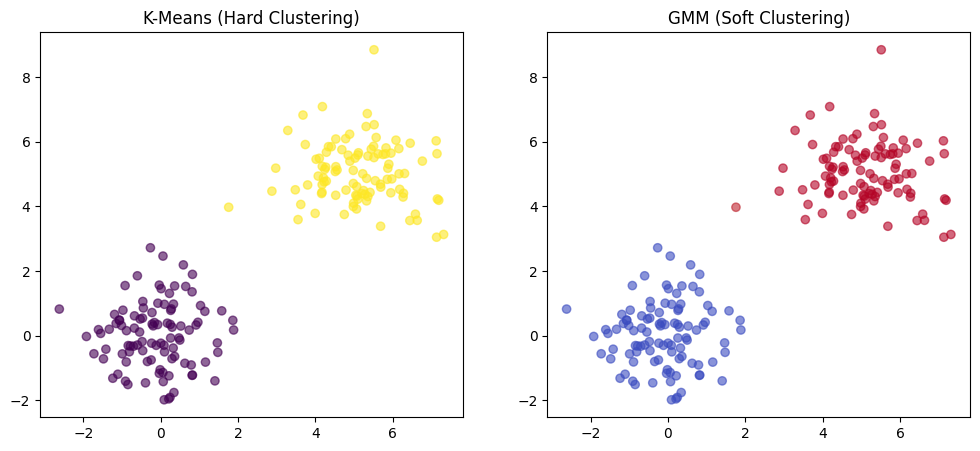
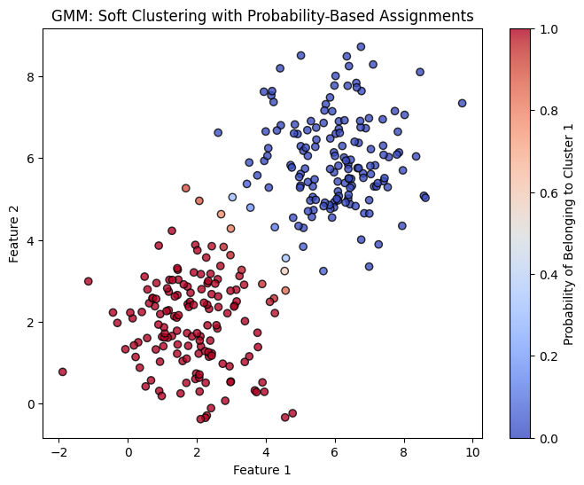
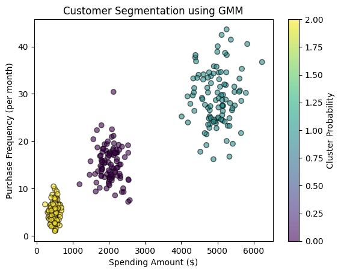
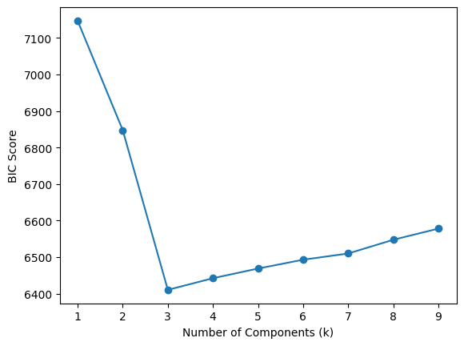

# ガウス混合モデル（GMM）の解説: Python 例つき完全ガイド

> 原題: Gaussian Mixture Models (GMM) Explained: A Complete Guide with Python Examples
> 著者: Lakhan Bukkawar
> 出典: GoPenAI（Medium, 2025-03-18）, https://blog.gopenai.com/gaussian-mixture-models-gmm-explained-a-complete-guide-with-python-examples-2d07185687fc

ガウス混合モデル（Gaussian Mixture Models, **GMM**）は、データを複数のガウス分布の混合としてモデル化する強力なクラスタリング技術である。K-Means と異なり、GMM は**ソフト割り当て（soft assignments）**を可能にし、**楕円形のクラスタ**を扱える。顧客セグメンテーション・異常検知・画像処理・音声認識で広く使われている。

このガイドでは次を扱う:
✅ **GMM の背後にある直感**
✅ **GMM の仕組み（数学的な分解）**
✅ **GMM 対 K-Means: いつどちらを使うか？**
✅ **GMM の実世界の応用**
✅ **Python での GMM の実装**（可視化つき）
✅ **GMM の課題と限界**

さあ始めよう！ 🚀

### 1. はじめに: なぜ GMM が必要か？

ショッピングモールでの顧客の支出を分析しているとしよう。ある買い物客は高級品を買い、ある人は予算重視の選択肢を好み、またある人はその中間に位置する。K-Means のような伝統的なクラスタリング手法は、これらの顧客を硬直したグループに無理やり押し込む。しかし、ある顧客が部分的に予算重視で部分的に高級品購入者だったらどうだろうか？

ここでガウス混合モデル（GMM）が輝く——ハードな割り当てではなく、確率に基づくソフトクラスタリングを可能にする。

❌ **クラスタが球状であると仮定する**
❌ **重なり合うクラスタをうまく扱えない**
❌ **ハードな割り当てを行う（各点はちょうど1つのクラスタに属する）**

ここで**ガウス混合モデル（GMM）**——これらの限界を克服する**確率的（probabilistic）**なアプローチ——の登場である。

### 2. ガウス混合モデル（GMM）とは何か？

**ガウス混合モデル（GMM）**は、データが複数のガウス（正規）分布の**混合**から生成されると仮定する。各ガウス成分は、それ自身の次を持つ**クラスタ**を表す:

📍 **平均（μ）** — 分布の中心
📍 **共分散（Σ）** — クラスタの形状と広がり
📍 **重み（π）** — 各ガウスに属する確率

K-Means のように各データ点を**1つのクラスタ**に割り当てる代わりに、**GMM は各クラスタに確率を割り当て**、より柔軟にする。

### 例: GMM の日常生活のたとえ

ショッピングモールでの**顧客の支出**を分析しているとしよう。顧客は**厳密な**カテゴリ（予算重視・中程度の支出者・高級品買い物客）に収まらない。むしろ、ある顧客は**部分的に中程度で部分的に高級品買い物客**かもしれない。

GMM は、**ハードな**境界を無理に作る代わりに、これらの**ソフトな**クラスタ割り当てをモデル化するのに役立つ。

### ハードクラスタリング対ソフトクラスタリングの可視化

**K-Means と GMM** の主な違いは、K-Means が**ハード**クラスタリングを使うのに対し、GMM は**ソフト**な割り当てを可能にすることである。

**Python 可視化: ハード対ソフトクラスタリング**

```c
import numpy as np
import matplotlib.pyplot as plt
from sklearn.mixture import GaussianMixture
from sklearn.cluster import KMeans

# Generate synthetic data
np.random.seed(42)
X = np.concatenate([
    np.random.normal(loc=0, scale=1, size=(100, 2)),
    np.random.normal(loc=5, scale=1, size=(100, 2))
])

# Fit models
kmeans = KMeans(n_clusters=2, random_state=42).fit(X)
gmm = GaussianMixture(n_components=2, random_state=42).fit(X)

# Predict clusters
kmeans_labels = kmeans.predict(X)
gmm_labels = gmm.predict_proba(X)[:, 1]  # Soft probabilities

# Plot
fig, ax = plt.subplots(1, 2, figsize=(12, 5))

ax[0].scatter(X[:, 0], X[:, 1], c=kmeans_labels, cmap='viridis', alpha=0.6)
ax[0].set_title("K-Means (Hard Clustering)")

ax[1].scatter(X[:, 0], X[:, 1], c=gmm_labels, cmap='coolwarm', alpha=0.6)
ax[1].set_title("GMM (Soft Clustering)")

plt.show()
```

<figure>



<figcaption>図: ハードクラスタリング（K-Means、左）対ソフトクラスタリング（GMM、右）。K-Means は各点を2色のいずれかに固定するが、GMM は確率に応じた連続的な色（ソフト割り当て）を与える。</figcaption>
</figure>

この可視化は、**GMM が点を単一のクラスタに硬直して割り当てる代わりにソフトな割り当てを提供する**様子を明確に示している。

### 3. GMM はどう機能するか？（期待値最大化アルゴリズム）

GMM は**期待値最大化（Expectation-Maximization, EM）アルゴリズム**を使って訓練され、クラスタ割り当てを反復的に改善する。

✅ **ステップ1: 初期化** — ガウス成分をランダムに割り当てる。
✅ **ステップ2: 期待ステップ（E-Step）** — 各点が各ガウスに属する確率を計算する。
✅ **ステップ3: 最大化ステップ（M-Step）** — ガウスのパラメータ（μ, Σ, π）をデータに最もよく適合するよう更新する。
✅ **ステップ4: 収束まで繰り返す**。

## GMM の数学的表現

GMM の確率密度関数（PDF）は次のとおり:

<figure>


<figcaption>図: GMM の確率密度関数。P(x) = Σ_{i=1}^k π_i · N(x|μ_i, Σ_i)。ここで k＝ガウス成分の数、π_i＝ガウス i の重み、N(x|μ_i, Σ_i)＝ガウス分布。</figcaption>
</figure>

この式は**複数のガウスの重み付き和**をモデル化し、K-Means のようなハードな境界ではなく**ソフトな割り当て**を可能にする。

### ソフト割り当ての可視化

K-Means と異なり、GMM は厳密なクラスタ境界を無理に作る代わりに**確率を割り当てる**。下のプロットは、データ点が確率的にどう割り当てられるかを図解する:

<figure>



<figcaption>図: GMM がクラスタに確率を割り当てる様子。点を単一のクラスタに硬直して割り当てる代わりに、部分的なメンバーシップを許す。中間にある点は両クラスタにほぼ等しい確率を持ち、中心に近い点ほど高い確信度を持つ。</figcaption>
</figure>

このプロットは、GMM がクラスタに確率を割り当てる様子を図解している。点を単一のクラスタに硬直して割り当てる代わりに、部分的なメンバーシップを許す。中間にある点は両クラスタにほぼ等しい確率を持ち、中心に近い点はより高い確信度を持つ。

### 4. 実世界の例: GMM を使った顧客セグメンテーション

**GMM を顧客セグメンテーション**に適用してみよう。ここでは**支出額**対**購入頻度**を分析して顧客をクラスタリングする。

可視化つき Python 実装

```c
import numpy as np
import matplotlib.pyplot as plt
from sklearn.mixture import GaussianMixture

# Simulated customer data: Spending vs. Purchase Frequency
np.random.seed(42)
X = np.vstack([
    np.random.normal(loc=[500, 5], scale=[100, 2], size=(100, 2)),  # Budget Shoppers
    np.random.normal(loc=[2000, 15], scale=[250, 4], size=(100, 2)),  # Regular Shoppers
    np.random.normal(loc=[5000, 30], scale=[400, 6], size=(100, 2))   # Luxury Shoppers
])

# Fit GMM with 3 clusters
gmm = GaussianMixture(n_components=3, random_state=42)
gmm.fit(X)

# Predict cluster labels and probabilities
labels = gmm.predict(X)
probs = gmm.predict_proba(X).max(axis=1)  # Get max probability for each point

# Plot clusters with soft assignments
plt.scatter(X[:, 0], X[:, 1], c=labels, cmap='viridis', alpha=0.6, edgecolors='k')
plt.colorbar(label="Cluster Probability")
plt.xlabel("Spending Amount ($)")
plt.ylabel("Purchase Frequency (per month)")
plt.title("Customer Segmentation using GMM")
plt.show()
```

<figure>



<figcaption>図: GMM を使った顧客セグメンテーション。横軸＝支出額（$）、縦軸＝購入頻度（月あたり）。3つのクラスタ（予算重視・通常・高級品）が色分けされる。</figcaption>
</figure>

🔹 **クラスタからの洞察:**
✔ **予算重視の買い物客** — 低支出・低頻度
✔ **通常の買い物客** — 中程度の支出・中頻度
✔ **高級品買い物客** — 高支出・高頻度

これは、支出パターンが**重なり合う**ため GMM が K-Means を上回り、ソフトクラスタリングが顧客をより正確に割り当てるのに役立つ**実世界のユースケース**である。

GMM の背後にある数学を見たので、最も一般的に使われるクラスタリング手法 **K-Means** と比較しよう。

### 5. GMM 対 K-Means: どちらを使うべきか？

**表: GMM と K-Means の比較**

| 特徴 | K-Means | GMM |
|---|---|---|
| **クラスタの形状** | 球状クラスタを仮定 | 楕円形クラスタを扱える |
| **割り当ての種類** | ハードクラスタリング | ソフト（確率的）クラスタリング |
| **重なり合うクラスタを扱えるか？** | ❌ いいえ | ✅ はい |
| **計算複雑性** | より速い | より遅い |
| **いつ使うか？** | 単純でよく分離したクラスタ | 複雑で重なり合うクラスタ |

🔹 **次の場合に GMM を使う:**
✔ クラスタが**重なり合う**
✔ **確率に基づく割り当て**が必要
✔ **楕円形のクラスタ**を持つ

### 6. GMM の課題と限界

❌ **遅い収束:** GMM は K-Means より時間がかかる
❌ **初期化に敏感:** 貧弱な初期化は局所最適につながりうる
❌ **成分数を事前に定義しなければならない:** 正しい **k** を選ぶのは難しい

📌 **最良の k をどう見つけるか？**
**ベイズ情報量規準（Bayesian Information Criterion, BIC）**または**赤池情報量規準（Akaike Information Criterion, AIC）**を使う。

ベイズ情報量規準（BIC）と赤池情報量規準（AIC）は、モデルの複雑さにペナルティを与えることで最適なガウス成分の数を決定するのに役立つ統計的な指標である。より低い BIC/AIC スコアは、よりよく適合するモデルを示す。

```c
bic_scores = [GaussianMixture(n, random_state=42).fit(X).bic(X) for n in range(1, 10)]
plt.plot(range(1, 10), bic_scores, marker='o')
plt.xlabel("Number of Components (k)")
plt.ylabel("BIC Score")
plt.show()
```

<figure>



<figcaption>図: 成分数 k に対する BIC スコア。スコアが最小になる k（この例では k=3）が最適な成分数を示す。</figcaption>
</figure>

### 7. 結論: なぜ GMM が重要か？

ガウス混合モデルは K-Means への強力な代替を提供し、重なり合うクラスタを持つデータセットに理想的である。顧客セグメンテーション・異常検知・画像処理のいずれに取り組んでいても、GMM は確率的クラスタリングを通じてより深い洞察を与えられる。
