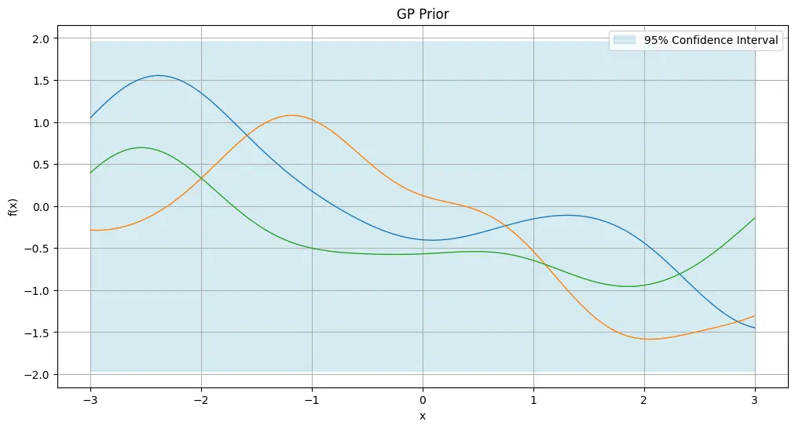
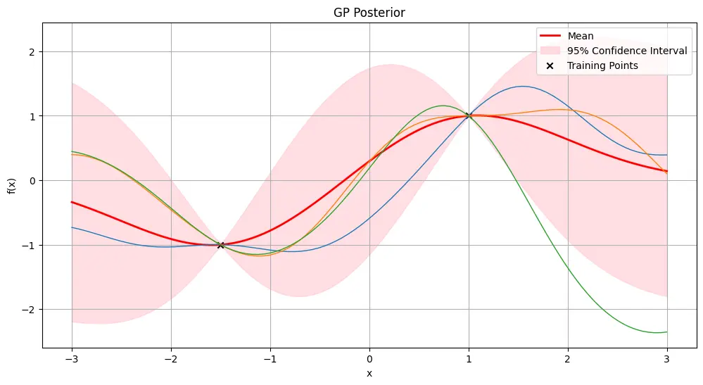
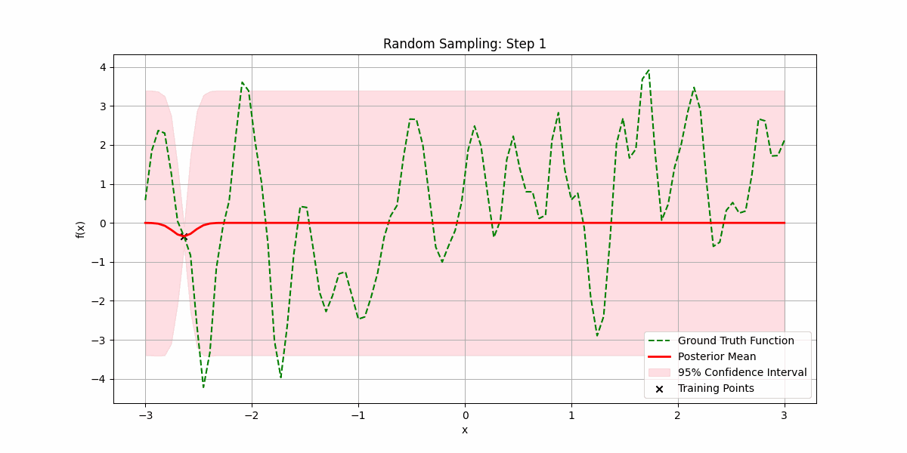
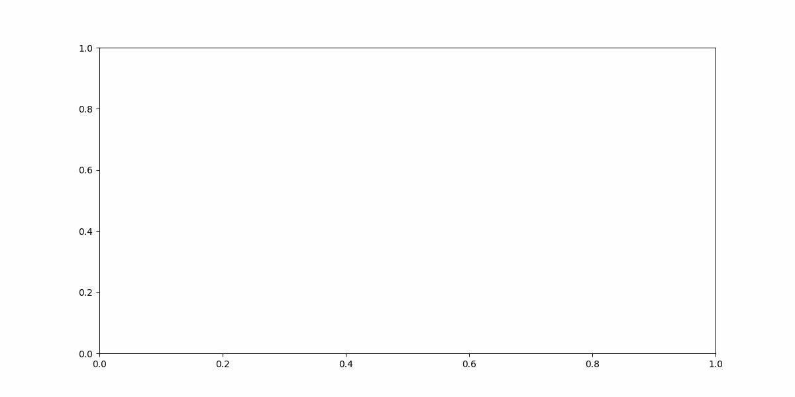
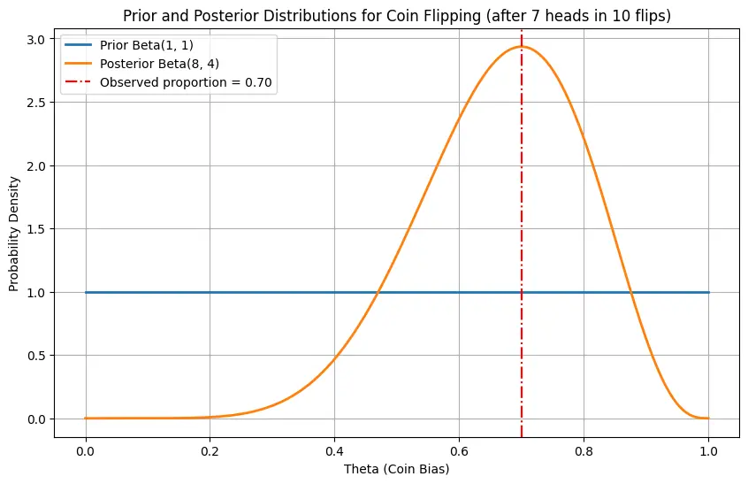
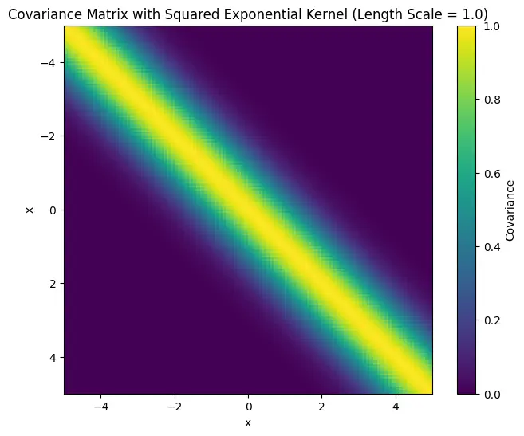

# ガウス過程への直感的入門

> 原題: An Intuitive Introduction to Gaussian Processes
> 著者: Fan Pu Zeng
> 出典: 個人ブログ fanpu.io, 2025-01-21（fanpu.io/blog/2025/gaussian-processes/）

> 注: 本翻訳は**本文を一文ずつ訳出**する。数式は LaTeX を保持する。図は原サイト fanpu.io から `raw/assets/2025-gp-intuitive-intro/` にローカル保存して該当位置に配置した（全 7 図＝webp 4・アニメ GIF 3）。コードのウォークスルー（§Code Walkthrough）は Jupyter ノートブックの `<iframe>` 埋め込みで画像ではないため、要約（sources）に参照リンクとして記載し、本文では埋め込み箇所を注記する。原典は数式の一部に表示上の崩れ（`sim` 等）があるが、文意に沿って正しい記法に直して訳出する。

---

深層学習は現在、パラメトリックモデル——訓練データセットのサイズによらず固定個数のパラメータを持つモデル——に支配されている。例として線形回帰モデルやニューラルネットワークがある。

しかし、時には一歩下がって、それがすべてではないことを思い出すのもよい。k-NN、決定木、カーネル密度推定のようなノンパラメトリックモデルは、固定の重みの集合に頼らず、データのサイズに応じて複雑さが増していく。

本稿では、概念的に重要だが、私見では過小評価されているノンパラメトリックな手法であり、現代のニューラルネットワークと深い結びつきを持つガウス過程について話す。最終的に示す興味深い動機づけの事実は、**ガウス重みで初期化されたニューラルネットワークが、無限幅の極限でガウス過程と等価になる**ことである。

### なぜ「ガウス過程」と呼ばれるのか？

（おそらく多次元の）確率変数の振る舞いは、その確率分布で特徴づけられる。すなわちガウス確率変数ならベル曲線である。

では、ランダムな**関数**の上の確率分布を考えたらどうなるか？ 変数から関数への一般化は**確率過程（stochastic process）**と呼ばれる。注意をガウス分布に従う過程だけに制限すれば、学習と推論に必要な計算は比較的容易になる。

### 動機（Motivation）

本稿では、回帰または分類の形を取りうる教師あり学習にガウス過程を使うことを扱う。

入力点の集合とそれに付随する値があり、これらすべての値を通って内挿する関数を見つけたいとする。

しかし、そのような関数は非可算個ある。では、どれを使うのが最良か、どう決めるのか？

これには 2 つのアプローチがある。

1. 考える関数のクラスを制限する（例: 深さ高々 3 の全決定木）。ただしこれは、仮説クラスが制限的すぎて貧弱なモデルになるか、逆に大きすぎて過学習になる危険を伴う。
2. すべての可能な関数の上に事前分布を置き、滑らかさのような良い性質を持つ関数により多くの確率質量を置く。ただし、関数が非可算個あるため、これをどう計算するのかは事前には不明である。

ここでガウス過程の出番である。関数を（非可算）無限次元のベクトルと見なし、各座標が関数の取る値をエンコードすると考えられる。目標は、関数の集合を訓練データセットと矛盾しないもの——特定の値を取るもの——だけに制限することである。そしてガウス過程の素晴らしい点は、**この有限のデータセット点だけを考えることで、非可算無限のすべての点での値を考えた場合と同じモデルが得られ、計算可能になる**ことである。

これがどう見えるかの図解を以下に示す。

<figure>

<figcaption>図1: 訓練前の関数上の事前分布。</figcaption>
</figure>

<figure>

<figcaption>図2: 2 つの訓練点を観測した後の関数上の事後分布。</figcaption>
</figure>

まだ何が正確に起きているかをあまり気にせず、予備的な観察をいくつかする。

1. 信頼区間から、事前分布が平均 0・標準偏差 1 で中心化されている（ゆえに 95% 信頼区間で $\pm 1.96$）ことが観察される。
2. 信頼帯が観測点で縮み、これらの点から離れるにつれて広がることに注目。これはガウス過程に使う特定のカーネル（後述）の選択によるもので、近い点ほどその値が相関しやすいという仮定を置いている。

ランダムにサンプリングした訓練データ点を増やしながら、ランダムな滑らかな関数を当てはめようとする様子を見よう。

<figure>

<figcaption>図3: 訓練点をランダムにサンプリングして、ランダムな滑らかな関数を当てはめる。</figcaption>
</figure>

下層の関数のサンプリングが高コストで、良い当てはめを得る前のサンプル数を最小化したい場合もある。

これは、**最も不確実性が高い領域を優先的にサンプリングする**ことで賢く行える。

<figure>

<figcaption>図4: 現在モデルのもとで最も不確実性が高い訓練点を選んで、ランダムな滑らかな関数を当てはめる。</figcaption>
</figure>

ガウス過程は時系列予測にも使え、将来の値の不確実性を定量化できる。以下は、本稿執筆時点から過去 120 日間の NVDA の株価を予測する例である。

<figure>

<figcaption>図5: 宿題——これで儲ける方法を考えてみよう。</figcaption>
</figure>

まあ……ここではあまりうまくいっていない。ガウス過程のカーネルは通常**定常性（stationarity）**を仮定する。これはデータの統計的特性（平均・分散・自己相関）が時間とともに変化しないことを意味するが、株式市場で起きていることとは明らかに違う。それでも試す価値はある！

これらの例が、ガウス過程がなぜ面白いのかの動機づけになれば幸いだ。

では、本題に入る前にベイズモデリングを手短に復習しよう。

### ベイズモデリング（Bayesian Modeling）

ベイズモデリングでは、データについての我々の信念を表す事前分布から始める。例えば、コインを投げてその偏り $\theta$ を決める前に、取りうる偏りについて一様な事前分布 $p(\theta)$ を持てる。これはベータ分布 $\text{Beta}(\alpha=1, \beta=1)$ で表せる。これが使われるのは、その事後更新もパラメータの異なるベータ分布になり、更新が計算的に単純になるからである。

多数のコイン投げを行い、その結果 $\mathcal{D}$ を使って $\theta$ についての信念を更新できる。$\theta$ の分布についての新しい信念を**事後分布**と呼ぶ。

事後分布の更新はベイズ則で与えられる。

$$
\text{posterior} = \frac{\text{likelihood} \times \text{prior}}{\text{marginal likelihood}},
$$

これはこの場合、次で与えられる。

$$
p(\theta \mid \mathcal{D}) = \frac{p(\mathcal{D} \mid \theta) p(\theta)}{p(\mathcal{D})} = \frac{p(\mathcal{D} \mid \theta) p(\theta)}{\int p(\mathcal{D} \mid \theta) p(\theta) d\theta},
$$

ここで 2 番目の形の分母は、$p(\mathcal{D})$ を直接知らないのが通常なので、すべての可能な事前分布にわたって周辺化している。

コイン投げの $\theta$ の事後分布もベータ分布に従うことが示せる。以下に可視化する。

<figure>

<figcaption>図6: 一様な事前分布と、表 7 回・裏 3 回の後に平均 0.7 に更新された事後分布。</figcaption>
</figure>

最後に、データでモデルを「訓練」した後、事後分布のもとでテストデータ点 $\mathcal{D}_*$ を観測する確率も得られる。これは**予測分布（predictive distribution）**として知られ、次で与えられる。

$$
p(\mathcal{D}_* \mid \mathcal{D}) = \int p(\mathcal{D}_* \mid \theta) p(\theta \mid \mathcal{D}) d\theta
$$

例えばコイン投げの場合、もう 1 回表を観測する確率は、ベータ事後分布の平均、すなわち 0.7 になる。

### ガウス過程（Gaussian Processes）

#### 定義

簡単のため、実過程 $f(x): \mathbb{R} \rightarrow \mathbb{R}$ の空間を考える（多次元への一般化は容易である）。

**定義（ガウス過程）**

ガウス過程とは確率変数の集まりであり、その任意の有限個が同時ガウス分布を持つ。

ガウス過程は、実過程 $f(x)$ の平均関数 $m(x)$ と共分散関数 $k(x, x')$ によって完全に規定でき、次で与えられる。

$$
(1)\ m(x) = \mathbb{E}[f(x)], \quad (2)\ k(x, x') = \mathbb{E}_{x, x'}[(f(x) - m(x))(f(x') - m(x'))].
$$

これは次のように書ける。

$$
f(x) \sim \mathcal{GP}(m(x), k(x, x')).
$$

記法を簡単にするため、平均は 0 と仮定する。

ゆえに共分散関数は、データのもとで可能な関数 $f$ に制限を置く。

#### 共分散関数

共分散関数の一般的な選択は、二乗指数（SE; squared exponential）関数で、放射基底関数（RBF; Radial Basis Function）とも呼ばれる。

$$
\text{cov}(f(x), f(x')) = k(x, x') = \exp\left(-\frac{(x - x')^2}{2\sigma^2}\right)
$$

$x$ と $x'$ が $f$ 上で取る値の間の相関は、それらの差のガウス分布に従うことがわかる。すなわち、近いとき 1 に近く、離れるにつれて 0 に減衰する。

$\sigma = 1$ での等間隔点上の共分散行列の可視化を以下に示す。

<figure>

<figcaption>図: 二乗指数カーネルの共分散行列（原典では「Figure 1」と表記）。</figcaption>
</figure>

#### ガウス過程での予測

簡単のため、$n$ 個のデータ観測 $(x_1, f_1), \ldots, (x_n, f_n)$ をする場合を考える。$\mathbf{X}$ と $\mathbf{f}$ で訓練入力と出力のベクトルをそれぞれ表す。

テスト入力の集合 $\mathbf{X}_*$ があり、訓練データが与えられたときにそれが取りうる値を知りたい。

これは、可能な関数の集合が共分散関数の構造を尊重しなければならないという形で、訓練データとテスト入力の同時分布を次のようにモデル化できることを意味する。

$$
\begin{bmatrix} \mathbf{f} \\ \mathbf{f}_* \end{bmatrix} \sim \mathcal{N}\left( \begin{bmatrix} 0 \\ 0 \end{bmatrix}, \begin{bmatrix} \mathbf{K}(\mathbf{X}, \mathbf{X}) & \mathbf{K}(\mathbf{X}, \mathbf{X}_*) \\ \mathbf{K}(\mathbf{X}_*, \mathbf{X}) & \mathbf{K}(\mathbf{X}_*, \mathbf{X}_*) \end{bmatrix} \right),
$$

これは計算不可能ではないかと心配し始めるかもしれないが、非常に幸運なことに、事後分布もガウスになる。

$$
\begin{aligned}
&(3)\ \mathbf{f}_* \mid \mathbf{X}_*, \mathbf{X}, \mathbf{f} \sim \mathcal{N}(\mu_*, \mathbf{\Sigma}_*), \\
&(4)\ \text{where}: \\
&(5)\ \mu_* = \mathbf{K}(\mathbf{X}_*, \mathbf{X}) \mathbf{K}(\mathbf{X}, \mathbf{X})^{-1} \mathbf{f}, \\
&(6)\ \mathbf{\Sigma}_* = \mathbf{K}(\mathbf{X}_*, \mathbf{X}_*) - \mathbf{K}(\mathbf{X}_*, \mathbf{X}) \mathbf{K}(\mathbf{X}, \mathbf{X})^{-1} \mathbf{K}(\mathbf{X}, \mathbf{X}_*).
\end{aligned}
$$

そして $\mathbf{X}_*$ が取りうる値を決めるには、1 つのアプローチとしてこのガウス分布からサンプリングする方法がある。

最大事後（MAP; maximum a posteriori）推定を使うもう 1 つのアプローチは、単に事後平均、すなわち $\mathbf{f}_* = \mu_*$ を取ればよい。

#### コードのウォークスルー

すべてをコードで見て具体化しよう。

> 訳注: 原典はここに Jupyter ノートブック（`gp.ipynb.html`）の `<iframe>` を埋め込んでいる。画像ではないため本翻訳には埋め込まず、参照先を要約ページ（[[sources/2025-gp-intuitive-intro]]）に記載する。

#### ニューラルネットワークとの関係

次のブログ記事では、ガウス重みで初期化されたニューラルネットワークが、無限幅の極限でガウス過程に収束することを示す。
