# Mitra: 表形式基盤モデルを強化する混合合成事前分布

> 原題: Mitra: Mixed Synthetic Priors for Enhancing Tabular Foundation Models
> 著者: Xiyuan Zhang, Danielle C. Maddix, Junming Yin, Nick Erickson, Abdul Fatir Ansari, Boran Han, Shuai Zhang, Leman Akoglu, Christos Faloutsos, Michael W. Mahoney, Cuixiong Hu, Huzefa Rangwala, George Karypis, Bernie Wang（Amazon、一部 CMU）
> 出典: arXiv:2510.21204

> 注: 本翻訳は **本文 §1〜5 ＋ 付録 A〜D** を一文ずつ訳出する（ユーザー指示により付録も含む）。References は対象外。数式は LaTeX を保持。原典は ar5iv 由来の markdown（ケース A）のため**図は全 26 枚をローカル保存して `<figure>` で該当位置に配置**する。大きな結果表は原典の数値を markdown 表として再掲し、キャプションを訳出する。

## Abstract（要旨）

TabPFN の画期的研究以来、文脈内学習（ICL; in-context learning）に基づく表形式基盤モデル（TFM; tabular foundation model）の研究は、機械学習の長年のパラダイムに挑戦してきた。

実世界データを一切見ずに、純粋に合成データセットで事前訓練されたモデルが、多様なデータセットにわたって——しばしば中程度の数の文脈内例だけを使って——著しくよく汎化する。

これは表形式機械学習の焦点を、モデルアーキテクチャの設計から、合成データセットの設計、より正確にはそれらを生成する事前分布（prior distribution）の設計へと移す。

しかし、事前分布設計の指針となる原理は、いまだよく理解されていない。

本研究は、このギャップに取り組む最初の試みである。

我々は、事前訓練済み TFM がよく汎化できるようにする合成事前分布の重要な性質を体系的に調査し同定する。

これらの洞察に基づき、我々は **Mitra** を導入する。Mitra は、多様性（diversity）・独自性（distinctiveness）・実世界表形式データでの性能を基準に厳選した合成事前分布の混合で訓練した TFM である。

Mitra は、分類・回帰の両ベンチマークにわたって、TabPFNv2 や TabICL のような最先端 TFM を一貫して上回り、より良いサンプル効率を持つ。

## 1 Introduction（はじめに）

表形式データは、医療・金融・eコマース・科学など、多くの実世界応用の中核にある。

表形式データ上の予測モデリングは統計的データ分析の中心であり、これら多様な領域にわたる意思決定システムを支える。

ランダムフォレスト・勾配ブースティング・アンサンブル法のような木ベースモデルは、その強い実証的性能と使いやすさから、長らく表形式予測を支配してきた。

しかしこれらの手法は通常、個々のデータセットに合わせて調整され、異なる分布をまたいで転移する能力に限界がある。

転移学習の進歩にもかかわらず、表形式予測に対する真に汎用的なアプローチは、TabPFN の登場まで捉えどころがなかった。

大規模言語モデル（LLM）の成功に触発され、TabPFN とその後続研究は、文脈内学習（ICL）に基づく表形式基盤モデル（TFM）の概念を導入した。

これらのモデルは合成的な表形式タスクで事前訓練され、下流タスクのラベル付き訓練サンプルを文脈内例として条件付けることで、実際の下流タスクで予測を行う。

事前訓練中にオンザフライで生成される合成データは、広いタスクカバレッジを提供し、大量の実世界の下流データを必要とせずに適応を可能にする。

これまでの TFM の取り組みの多くはアーキテクチャの革新に焦点を当ててきたが、我々は**データ事前分布——合成データセットを生成するのに使う分布——の設計**にもっと注意を払うべきだと主張する。

既存研究は通常、固定的またはヒューリスティックなデータ事前分布に依存しており、根本的な問いを未解決のままにしている。例えば、*何が合成データ事前分布を効果的にするのか？ より良い汎化のために事前分布の混合をどう構成すべきか？*

<figure>

<figcaption>図1: Mitra における事前分布の混合、汎化性行列 G と性能ベクトル P。良い事前分布には 3 つの要因を考える: (1) その事前分布のみから生成したデータで事前訓練した TFM の実表形式データ上での性能（点1、P）、(2) 混合に含めたときの多様性、(3) 独自性（点2・3、G の対角・非対角成分で捉える）。これが SCM・勾配ブースティング・ランダムフォレスト・決定木の事前分布から成る我々の混合に至る。</figcaption>
</figure>

本論文では、TFM の事前訓練に使う合成事前分布の重要な性質を同定する目的で、これらの問いを調査する。

我々の知見は、「事前分布の多様性が重要」という曖昧な経験則を鋭くする。

合成事前分布の有効性は次に依存することを示す: (1) *その事前分布のみから生成したデータで*事前訓練した TFM を、実表形式データで評価したときの性能、(2) その*多様性（diversity）*、すなわちこの事前分布で事前訓練した TFM が自分自身の分布に過適合するのがどれだけ難しいか、(3) *事前分布の混合内での独自性（distinctiveness）*、すなわちこの事前分布から生成したデータが、他の事前分布で事前訓練した TFM にどれだけ予測されにくいか。簡略な図解は図1 を参照。

我々の洞察に基づき、*構造的因果モデル（SCM; structural causal model）* と、勾配ブースティング・ランダムフォレスト・決定木・extra tree モデルを含む*木ベース事前分布（TBP; tree-based prior）* から成る合成事前分布の混合を構成する。

SCM を選ぶのは、多様性が高く、実表形式データセットで最良の単独性能を達成することを示すからである。

TBP を選ぶのは、SCM のデータで事前訓練した TFM が、TBP から生成された全種類のデータに必ずしもよく汎化しないこと——すなわち TBP の独自性——を同定したからである。

我々の事前分布の混合は、実世界の表形式データにおける多様な分布を効果的にカバーできる。

特筆すべきは、我々の事前分布が*モデル非依存（model-agnostic）* であり、行ベース 1D アテンションと、より高度な要素ベース 2D アテンションのアーキテクチャの両方で一貫して性能改善を示すことである。

2D アテンションアーキテクチャの上に、我々は Mitra を提案する。Mitra は我々の事前分布の混合で事前訓練した TFM で、最先端（SOTA）の結果を得る。

Mitra は、分類・回帰の両タスクで、TabPFNv2・TabICL や他の強力なベースラインを含む既存 TFM を上回る。

加えて、我々の事前分布の混合で事前訓練した Mitra は、より良いサンプル効率を示す。すなわち、より少ない文脈内例で一貫してより強い性能を持つ。

これは我々の原理的な事前分布混合分析の利点を浮き彫りにする。

我々の主要な貢献を以下にまとめる。

## 2 Related Work（関連研究）

##### 伝統的・深層学習ベースの表形式モデル

歴史的に、表形式領域は主に伝統的統計手法、最も顕著には勾配ブースティング（GB）決定木（XGBoost・LightGBM・CatBoost）に支配されてきた。

これらの手法は、強い性能・頑健性・解釈可能性から実務で広く採用される。

汎化と自動化をさらに改善するため、アンサンブルベースのシステム（例: AutoGluon）は複数のベース学習器を組み合わせ、ハイパーパラメータとスタッキング戦略を自動最適化する。

より最近では、表形式データの複雑で豊かな相互作用をモデル化するため、深層学習ベースのアプローチが提案された。例えば RealMLP は、広範なメタベンチマークデータセットで調整した最適化 MLP アーキテクチャを導入する。

伝統的統計手法もニューラルネットも多くの実世界ベンチマークで競争力を保つが、新しいデータセットごとにゼロから再訓練を要し、異なる分布をまたいで汎化するのが難しい。

この繰り返しのデータごとの再訓練の必要性は、スケーラビリティの課題を生み、実世界応用でのモデル再利用を制限する。

##### TFM: 意味的に豊かなモデル

最近の研究は、表をテキストに直列化することで LLM を構造化データに適応させることを探求してきた。

TabLLM・GTL・Tabula は、行とタスクをプロンプト可能な入力に整形することでゼロショット/few-shot 推論を可能にする。

TP-BERTa は、相対的大きさのトークン化と特徴量内アテンション機構を持つ、表形式予測タスク向けの事前訓練言語モデルを提案する。

テキスト直列化を超えて、いくつかのアプローチはクロステーブル技術を活用して非テキストの事前訓練に焦点を当てる。これらには独立した特徴量化器、マルチタスクマスク再構成によるモジュラーエンコーディング、プロンプトマスク表モデリングが含まれる。

CARTE は、下流の表形式タスクを促進するため、知識グラフと列レベルのメタデータでの事前訓練を活用する。

これらの手法はしばしば意味的メタデータ（列名やテキスト記述）・整備されたスキーマ・大規模な実コーパスに大きく依存する。

この依存は、こうした補助情報が利用できない・信頼できない状況での適用性を制限し、LLM への依存ゆえに実展開で高価な推論コストを要しうる。

##### TFM: ICL ベースのモデル

補完的な研究の系譜は、表形式予測を ICL タスクとして枠付ける。そこではモデルが合成または実データセットで事前訓練され、下流データセットが文脈内例として使われる。

これらの取り組みは主に 2 つの方向に焦点を当てる: (1) より良いデータ事前分布の設計、(2) モデルアーキテクチャの改善。

第一の方向では、TabPFN が、SCM 生成の合成データで Transformer を事前訓練し表形式分類問題の ICL をシミュレートすることで、このパラダイムを導入した。

TabDPT は、事前訓練中に実データセットを組み込むことでこのアプローチを拡張する。

いくつかの後続モデル——TabForestPFN・Attic・TabICL——は、合成データ生成のために木ベース事前分布と SCM を組み合わせる。具体的には、TabForestPFN と Attic は SCM を決定木と混ぜ、TabICL は SCM を XGBoost と組み合わせる。

これらのアプローチは木ベース事前分布をヒューリスティックに採用し、なぜこれらの事前分布を組み込むのが有益かを説明していない。

第二の方向では、Attic が要素ベースのアテンション機構を導入し、表の各セル（各行や各列ではなく）を Transformer の別個のトークンとして扱う。

TabPFNv2 は同様の要素単位 Transformer アーキテクチャを採用し、さらに合成事前分布を精緻化することでスケーラビリティと汎化を改善する。

より最近では、TabICL が、まず行の固定次元埋め込みを構築し、続いて ICL のための効率的なアテンション機構を行う 2 段階アーキテクチャを提案する。

最近の取り組みは、プロンプトの圧縮・情報的な文脈の選択・ハイパーネットワークを通じて ICL をスケールする方法も探求している。

## 3 Mitra: TFM Pretrained on a Mixture of Priors（事前分布の混合で事前訓練した TFM）

本節では、効果的な事前分布を次の 3 基準で特徴づける方法を述べる: (1) 実データでの強い性能、(2) 多様性、(3) 混合内での独自性。これらの特徴がともに、新しい SOTA TFM である Mitra の開発に至る。

### 3.1 Data-Generating Priors（データ生成事前分布）

教師あり表形式学習の設定で純粋な合成データで TFM を事前訓練するため、データ生成事前分布 $\mathcal{G}_{i}$ は、一様ランダムに生成したハイパーパラメータ（特徴量サイズ、サンプル数、クラス数（分類タスク）、カテゴリ特徴量数）を入力に取り、データセット $\mathcal{D}^{(i)}=\{(\mathbf{x}_{n}^{(i)},y_{n}^{(i)})\}_{n=1}^{N_{i}}$ を出力する。

このデータセットは $N_{i}$ 個の特徴量–ラベル対から成り、$\mathbf{x}^{(i)}_{n}\in\mathbb{R}^{d}$ は連続またはカテゴリ属性を持つ $d$ 次元特徴量ベクトル、$y^{(i)}_{n}$ は分類タスクの対応する目標ラベル（$\in\mathcal{Y}\subset\mathbb{Z}$）または回帰タスクの目標値（$\in\mathcal{Y}\subset\mathbb{R}$）を表す。

データセット全体は 2 次元の行列/表 $D^{(i)}\in\mathbb{R}^{N_{i}\times(d+1)}$ として表せる（問題設定と前提の詳細は付録 A.1 参照）。

Mitra では、$M$ 個のデータ生成事前分布 $\{\mathcal{G}_{i}\}_{i=1}^{M}$ の混合を使うことを提案する。具体的には次の種類の事前分布を含める: 構造的因果モデル（SCM）と木ベース事前分布（TBP）。

**SCM**　データ生成事前分布 $\mathcal{G}_{\text{SCM}}$（元々 TabPFN の事前訓練で導入された）は、表形式データで観測される列間の因果関係を捉えられる。

さらに SCM は、特徴量の依存関係と条件付き分布 $p(y|\mathbf{x})$ の両方をモデル化する。

$\mathcal{G}_{\text{SCM}}$ からデータセット $\mathcal{D}$ をサンプリングするには、まず有向非巡回グラフ（DAG）をランダムに構築し、その後 DAG 構造で定義される条件付き依存関係に従って特徴量 $\mathbf{x}$ と目標 $y$ を逐次的に生成する。

**TBP**　データ生成の木ベース事前分布 $\mathcal{G}_{\text{TBP}}$ は、木と木のアンサンブルから成る。これらは表形式タスクでの強い予測性能で知られ、表形式データの決定境界をモデル化するのによく使われる。

TBP は主に、複雑な閾値ベースの分割で $p(y|\mathbf{x})$ をモデル化し、アンサンブル木が結果として生じる軸並行な決定境界を滑らかにするのを助ける。

本研究では $\mathcal{G}_{\text{DT}}$, $\mathcal{G}_{\text{ET}}$, $\mathcal{G}_{\text{GB}}$, $\mathcal{G}_{\text{RF}}$ を考える（DT・ET・GB・RF はそれぞれ決定木・extra tree・勾配ブースティング・ランダムフォレスト）。

これらのモデルをデータ生成器として使うには、まず合成生成した訓練データセットで当てはめ、その後特徴量 $\mathbf{x}$ を単純な分布（例: 多変量標準正規）からサンプリングし、目標 $y$ を学習された条件付き分布 $\hat{p}(y\mid\mathbf{x})$ に従って引く（データ生成過程の追加詳細は付録 A.2.1 参照）。

これらの事前分布をまとめて「間接サンプリング（indirectly sampled）」事前分布と呼ぶ。

加えて、モデルの当てはめを必要としないカスタムの「直接サンプリング（directly sampled）」RF 事前分布 $\mathcal{G}_{\text{DSRF}}$ を導入する。代わりに、ランダムな分割インデックスと閾値をサンプリングして条件付き分布 $p(y\mid\mathbf{x})$ を直接構築する（各事前分布の詳細は付録 A.2.2 参照）。

<figure>

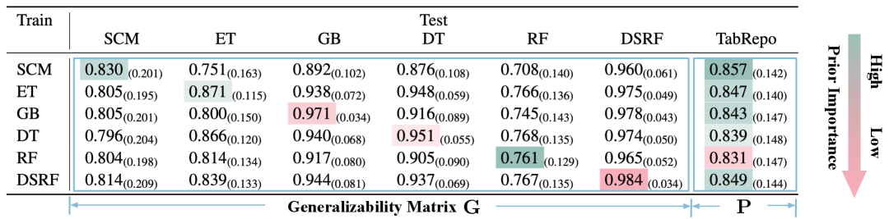

<figcaption>表1: 事前分布の重要性の 3 要因。汎化性行列の各成分 Gᵢⱼ は、𝒢ᵢ から生成したデータで事前訓練し 𝒢ⱼ のデータで評価した TFM の AUC を表す。性能ベクトルの各要素 Pᵢ は、𝒢ᵢ のデータで事前訓練し実世界データセットで評価した TFM の AUC に対応する。色のグラデーションで各事前分布の相対的な質を視覚的に示す。最良/最悪の事前分布は最も濃い緑/赤で示す。</figcaption>
</figure>

### 3.2 Prior Mixture Promoting Diversity and Distinctiveness（多様性と独自性を促す事前分布の混合）

ここでは、$\mathcal{G}=\{\mathcal{G}_{i}\}_{i=1}^{M}$ から成る $M'$ 個のデータ生成事前分布の効果的な混合 $\mathcal{G}'=\{\mathcal{G}'_{i}\}_{i=1}^{M'}$（$M'\leq M$）の特徴を詳しく研究する。

まず各候補事前分布のデータで $M$ 個のモデルを事前訓練し、事前分布をまたいで評価して**汎化性行列（generalizability matrix）** $\mathbf{G}\in\mathbb{R}^{M\times M}$ を構築する。$\mathbf{G}$ の行は $\mathcal{G}_{i}$ からの抽出で事前訓練したモデルを、列は $\mathcal{G}_{j}$ からの抽出で生成したテストデータを表し、$\mathbf{G}_{ij}$ がその指標値を表す。

これら $M$ 個のモデルを実世界データセットでも評価して**性能ベクトル（performance vector）** $\mathbf{P}\in\mathbb{R}^{M}$ を作る。$\mathbf{P}_{i}$ は $\mathcal{G}_{i}$ のデータで事前訓練し実データで評価したモデルの性能を表す。

良い事前分布を特徴づける 3 つの重要な要因を見出す: (1) **性能（Performance）**、$\mathbf{P}_{i}$ が高い値で定量化; (2) **多様性（Diversity）**、対角値 $\mathbf{G}_{ii}$ が低いことで定量化（同じ事前分布に過適合する難しさが大きいことを示す）; (3) **独自性（Distinctiveness）**、非対角値 $\mathbf{G}_{ij}$ が低いことで定量化（$\mathcal{G}_{i}$ で事前訓練したモデルが $\mathcal{G}_{j}$ のデータでどれだけうまくいくかを示す）。

より具体的には、現在の混合 $\mathcal{G}'$ が与えられたとき、$\mathcal{G}_{i}\in\mathcal{G}'$ となる $i$ について第 $j$ 列の非対角 $\mathbf{G}_{ij}$ の最大値が $\mathcal{G}_{j}$ の独自性の尺度になる。そして最小の最大値を持つ事前分布 $\mathcal{G}_{j}$、すなわち $\min_{1\leq j\leq M}\max_{1\leq i\leq M,\mathcal{G}_{i}\in\mathcal{G}'}\mathbf{G}_{ij}$ を追加すると、混合のカバレッジが増える。

最終的に、事前分布の重要性は性能と多様性のバランスを取る。

表1 は AUC 指標を使った例示で、これら 3 要因が我々のアブレーション研究（表6）の事前分布重要性の知見をどう説明するかを示す（他の集約指標での類似の知見は付録 C.1 参照）。

$\mathcal{G}_{\text{SCM}}$ は、多様性（低い対角値 $\mathbf{G}_{ii}$）と実データでの強い性能 $\mathbf{P}$ の両方により高品質であることがわかる。

興味深いことに、$\mathcal{G}_{\text{DSRF}}$ は $\mathbf{P}$ の性能で 2 位だが、3 番目に良い事前分布 $\mathcal{G}_{\text{ET}}$ の方が、多様性と独自性を増やす能力に基づき高品質であることが、表6 で検証される。

多様性については、$\mathcal{G}_{\text{DSRF}}$ の対角は $\mathcal{G}_{\text{ET}}$ の対角より有意に高い（0.984 対 0.871）。

独自性については、$\mathbf{G}$ の SCM 行の非対角が、次の事前分布から追加される固有情報の量を測る。$\mathcal{G}_{\text{SCM}}$ で事前訓練したモデルは、$\mathcal{G}_{\text{ET}}$ より $\mathcal{G}_{\text{DSRF}}$ からのテストデータを有意によく予測する（0.960 対 0.751）。これは $\mathcal{G}_{\text{ET}}$ の独自性が高いことを示す。

### 3.3 Pretraining TFM on Prior Mixture（事前分布の混合での TFM 事前訓練）

前小節の洞察を使い、混合 $\mathcal{G}'=\{\mathcal{G}_{i}'\}_{i=1}^{M'}$ の各事前分布に重み $w_{i}$ を割り当てる（$\sum_{i=1}^{M'}w_{i}=1$）。

事前訓練中、生成器 $\mathcal{G}_{i}'$ を $w_{i}$ に比例してサンプリングし、事前訓練用の合成データセットを生成する。

混合 $\mathcal{G}'$ の生成器 $\mathcal{G}_{i}'$ からサンプルした表 $D^{(i)}$ について、$s$ 個のエントリをサポート集合（文脈内例）として、$q$ 個のエントリをクエリサンプルとしてランダムにサブサンプリングする。

次にマスクされたクエリラベル上の尤度を最適化する: $\mathcal{L}=\mathbb{E}_{D}[\log p_{\theta}(y_{\text{qry}_{1}:\text{qry}_{q}}|\mathbf{x}_{\text{sup}_{1}:\text{sup}_{s}},y_{\text{sup}_{1}:\text{sup}_{s}},\mathbf{x}_{\text{qry}_{1}:\text{qry}_{q}})]$。

付録 A.3 のアルゴリズム1 が我々の合成事前分布生成手続きをまとめる。事前訓練の詳細は付録 B.3.2 で示す。

図2 は、2 つの人気アーキテクチャ——1 次元の行単位アテンションと 2 次元の要素単位アテンション——による Mitra モデル全体のパイプラインを示す。我々の事前分布はモデル非依存で、次節で両アーキテクチャでの有効性を実証する。

<figure>

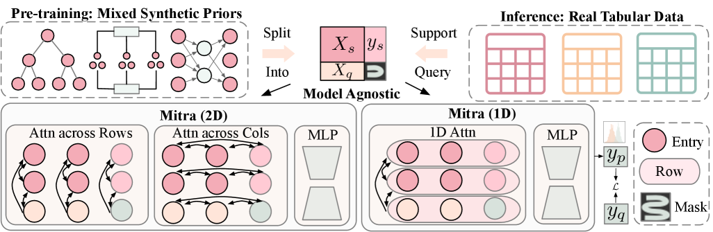

<figcaption>図2: Mitra パイプライン。1D または 2D アテンションで可視化したモデル非依存の構成。</figcaption>
</figure>

## 4 Empirical Results（実証結果）

本節では、Mitra が分類・回帰の両タスクで SOTA 性能を達成すること（§4.2）を示す。Mitra がモデル非依存で、1D アテンション（Mitra 1D）と 2D アテンションの両アーキテクチャで一貫して性能を改善すること（§4.3）を実証する。さらに、Mitra のより良いサンプル効率（§4.4）、高度なアンサンブル技術と組み合わせたときの強い性能（§4.5）、強いファインチューニング性能（§4.6）を強調する。各事前分布の重要性を定量化するアブレーション研究（§4.7）も行い、§3.2 の知見を裏付ける。最後にモデルサイズと合成データセットサイズの両方に関するスケーリング則を分析する（§4.8）。追加の実験設定の詳細は付録 B、追加の実験結果は付録 C を参照。

### 4.1 Experimental Settings（実験設定）

**データセット**　分類タスクでは、確立された 3 つの 10 分割ベンチマーク（TabRepo・Tabzilla・AutoML ベンチマーク）で Mitra を比較する。並行ベンチマーク TabArena でも付録 C.4 で評価する。回帰タスクでは 10 分割 TabRepo ベンチマークで比較する。

Mitra と、同じ事前分布混合で 1D アテンションモデルを訓練した変種 Mitra 1D の両方を評価する。

特徴量を最大 100 までサポートする 1D モデル（例: TabPFN）と最大 500 までサポートする 2D モデル（例: TabPFNv2）と比較するため、小特徴量・大特徴量の両ベンチマークで評価する。

小特徴量ベンチマークでは、TabPFN に従い最大 3,000 行・100 特徴量を持つ 66 の TabRepo 分類データセット、75 の TabZilla 分類データセット、10 の TabRepo 回帰データセットを使う。

大特徴量ベンチマークの評価には、最大 10,000 行・500 特徴量の AMLB ベンチマークから 29 分類データセットを使う。これは TabPFNv2 の評価プロトコルと整合する。データセット ID は付録 B.1 に示す。

**ベースライン**　Mitra を、SOTA TFM（TabPFNv2・TabICL・Attic・TabPFN・TabForestPFN）と、データセット固有の調整を要する競争力ある古典的/ニューラルベースライン（RealMLP・AutoGluon・LightGBM・XGBoost・CatBoost・MLP）の両方と比較する。後者には AutoGluon 1.3 で実装されたバギング版を使う。

**指標**　分類タスクでは集約指標 AUC-ROC（AUC）・正解率（ACC）・交差エントロピー（CE）を報告する。回帰タスクでは R²・二乗平均平方根誤差（RMSE）・平均絶対誤差（MAE）を報告する。

集約指標は、極端な性能を持つ少数のデータセットに不釣り合いに影響されうる。これに対処するため、データセット間の相対性能をよりよく捉える、より頑健で包括的なランクベース指標で補完する: 平均ランク・Elo・勝率（winrate）・再スケール正解率（RAcc）・チャンピオンデルタ（CΔ）。これらの定義は付録 B.2 に示す。

**評価プロトコル**　Mitra を含む TFM では次の 3 設定を評価する: (1) *文脈内学習（ICL）* 性能; (2) 特徴量シャッフル・クラス順シャッフル・ランダム特徴量変換の*アンサンブル* 技術付き ICL（以降 "+e" と表記）; (3) 目標データの訓練集合でモデルの訓練を継続する*ファインチューニング*（以降 "+f"）。バギングアンサンブルでのファインチューニングを「bagging」と呼び、その高度なアンサンブル性能を §4.5 で示す。

**表2**: Mitra は 3 つの分類ベンチマークすべてで勝つ（全体の統合結果を示し、個別ベンチマーク結果は紙幅の都合で付録 C.4＝表13(TabRepo)・表14(TabZilla)・表15(AMLB)に詳述）。勝者/次点を斜体で。+e は ICL でのアンサンブル、+f はファインチューニング。Elo は括弧内に 95% 信頼区間。集約指標は平均と標準偏差（括弧内）を示す。

| Model | Avg.Rank↓ | Elo↑ | Winrate↑ | RAcc↑ | CΔ↓ | AUC↑ | ACC↑ | CE↓ |
|---|---|---|---|---|---|---|---|---|
| Mitra (+ef) | 7.2 | 1136 | 0.69 | 0.82 | 20.1 | 0.905 | 0.858 | 0.328 |
| Attic (+ef) | 7.4 | 1128 | 0.68 | 0.81 | 21.7 | 0.903 | 0.857 | 0.332 |
| TabPFNv2 (+e) | 8.0 | 1107 | 0.65 | 0.80 | 23.3 | 0.901 | 0.856 | 0.338 |
| TabPFNv2 (+ef) | 8.6 | 1085 | 0.62 | 0.76 | 25.3 | 0.897 | 0.846 | 0.363 |
| TabICL (+e) | 9.5 | 1053 | 0.58 | 0.75 | 30.9 | 0.889 | 0.836 | 0.367 |
| Mitra (+e) | 9.7 | 1046 | 0.57 | 0.73 | 31.2 | 0.896 | 0.847 | 0.360 |
| TabPFNv2 | 9.8 | 1043 | 0.56 | 0.73 | 29.2 | 0.891 | 0.846 | 0.352 |
| Attic (+e) | 9.9 | 1037 | 0.55 | 0.73 | 31.8 | 0.896 | 0.848 | 0.364 |
| TabICL | 10.6 | 1015 | 0.52 | 0.70 | 33.5 | 0.884 | 0.832 | 0.374 |
| Mitra | 10.6 | 1015 | 0.52 | 0.69 | 32.9 | 0.891 | 0.841 | 0.368 |
| Mitra 1D (+f) | 11.2 | 992 | 0.49 | 0.68 | 34.5 | 0.893 | 0.842 | 0.367 |
| Attic | 11.2 | 992 | 0.49 | 0.68 | 35.2 | 0.884 | 0.834 | 0.376 |
| CatBoost | 11.3 | 988 | 0.48 | 0.67 | 35.7 | 0.888 | 0.837 | 0.375 |
| TabForestPFN (+f) | 11.6 | 980 | 0.47 | 0.65 | 35.3 | 0.886 | 0.840 | 0.377 |
| RealMLP | 12.2 | 958 | 0.44 | 0.62 | 35.4 | 0.878 | 0.827 | 0.412 |
| XGBoost | 13.1 | 926 | 0.40 | 0.58 | 39.5 | 0.883 | 0.833 | 0.388 |
| LightGBM | 13.4 | 917 | 0.38 | 0.56 | 39.8 | 0.876 | 0.829 | 0.393 |
| Random Forest | 13.7 | 903 | 0.36 | 0.54 | 44.1 | 0.874 | 0.822 | 0.471 |
| MLP | 13.7 | 903 | 0.36 | 0.51 | 40.1 | 0.869 | 0.820 | 0.414 |
| Mitra 1D | 14.0 | 894 | 0.35 | 0.55 | 42.5 | 0.869 | 0.815 | 0.414 |
| TabForestPFN | 14.3 | 883 | 0.34 | 0.52 | 42.6 | 0.864 | 0.814 | 0.414 |

**表3**: Mitra は 1D アテンションモデルでもより良い性能を示し、事前分布が*モデル非依存* であることを示す。勝者/次点を緑の濃淡で。Elo は括弧内に 95% 信頼区間。

| Model | Avg.Rank↓ | Elo↑ | Winrate↑ | RAcc↑ | CΔ↓ | AUC↑ | ACC↑ | CE↓ |
|---|---|---|---|---|---|---|---|---|
| Mitra 1D (+f) | 3.0 | 1057 | 0.60 | 0.68 | 16.5 | 0.886 | 0.835 | 0.380 |
| TabForestPFN (+f) | 3.2 | 1038 | 0.56 | 0.64 | 18.8 | 0.878 | 0.832 | 0.391 |
| TabPFN (+e) | 3.4 | 1012 | 0.52 | 0.60 | 24.4 | 0.862 | 0.809 | 0.418 |
| Mitra 1D | 3.7 | 972 | 0.45 | 0.53 | 27.2 | 0.865 | 0.812 | 0.417 |
| TabPFN | 3.8 | 970 | 0.45 | 0.53 | 26.3 | 0.860 | 0.808 | 0.426 |
| TabForestPFN | 3.9 | 951 | 0.42 | 0.49 | 27.7 | 0.859 | 0.810 | 0.419 |

**表4**: Mitra は TabRepo 10 分割回帰ベンチマークで勝つ。勝者/次点を緑の濃淡で。+e は ICL でのアンサンブル、+f はファインチューニング。

| Model | Avg.Rank↓ | Elo↑ | Winrate↑ | RAcc↑ | CΔ↓ | R²↑ | RMSE↓ | MAE↓ |
|---|---|---|---|---|---|---|---|---|
| Mitra (+ef) | 4.3 | 1140 | 0.70 | 0.82 | 10.9 | 0.636 | 2401.27 | 1351.15 |
| TabPFNv2 (+e) | 5.1 | 1090 | 0.63 | 0.72 | 12.7 | 0.615 | 2374.55 | 1304.54 |
| RealMLP | 5.8 | 1044 | 0.56 | 0.70 | 16.0 | 0.627 | 2424.34 | 1385.57 |
| CatBoost | 5.8 | 1044 | 0.56 | 0.69 | 15.7 | 0.629 | 2465.09 | 1444.57 |
| TabPFNv2 (+ef) | 6.1 | 1023 | 0.53 | 0.62 | 15.5 | 0.600 | 2372.76 | 1295.36 |
| Mitra (+e) | 6.4 | 1008 | 0.51 | 0.63 | 19.5 | 0.604 | 2469.12 | 1372.43 |
| TabPFNv2 | 6.4 | 1008 | 0.51 | 0.59 | 15.9 | 0.601 | 2436.86 | 1337.64 |
| XGBoost | 6.7 | 989 | 0.48 | 0.62 | 18.2 | 0.625 | 2572.80 | 1573.52 |
| LightGBM | 6.8 | 984 | 0.47 | 0.61 | 20.3 | 0.629 | 2665.90 | 1571.68 |
| Mitra | 7.1 | 963 | 0.44 | 0.59 | 20.6 | 0.599 | 2465.02 | 1387.39 |
| MLP | 8.1 | 904 | 0.36 | 0.50 | 22.3 | 0.595 | 2778.66 | 1557.71 |
| Random Forest | 9.4 | 804 | 0.23 | 0.32 | 27.9 | 0.585 | 2797.35 | 1705.43 |

### 4.2 Mitra achieves SOTA classification and regression performance（SOTA の分類・回帰性能を達成）

**分類**　3 つの分類ベンチマークを統合し、137 データセットの一意な集合を保って、全体ランキングと集約性能を表2 に報告する。詳細な手法設定と TabRepo（表13）・TabZilla（表14）・AMLB（表15）の個別結果は付録 C.4 に示す。

Mitra は全体結果と、特徴量次元やサンプルサイズの異なる 3 ベンチマークすべてで勝ち、ランクベース・集約指標の両方で、ファインチューニング・アンサンブルで一貫して最良性能を達成する。

特筆すべきは、Mitra の ICL 性能が、最大 16 特徴量（TabPFNv2 の最大事前訓練特徴量の 10 分の 1）で事前訓練したにもかかわらず TabPFNv2 に肉薄することで、我々の事前分布の強い汎化性を示す。

**回帰**　TabRepo 回帰データセット（表4）で評価する。Mitra は再び各種指標で最良性能を示し、我々の事前分布の混合がタスク非依存であることを示す。

### 4.3 Mitra priors are model agnostic（事前分布はモデル非依存）

表3 に示すように、同じ事前分布の混合で事前訓練したとき、Mitra 1D も、より多様性の低い事前分布に依存する他の 1D アテンションベースの対応物（TabPFN や TabForestPFN）を上回る。

これは我々の事前分布の混合がモデル非依存で、異なるアーキテクチャをまたいで一貫して性能を高められることを強調する。

なお TabForestPFN はネイティブなアンサンブルロジックを提供せず、TabPFN はネイティブなファインチューニングロジックを提供しない。公平な比較のため、各ベースラインで利用可能な能力の下で結果を報告する。

### 4.4 Mitra is more sample efficient（よりサンプル効率が良い）

表5 で、Mitra のサンプル効率を主要 TFM（TabPFNv2・TabICL）と比較する。

TabRepo 分類ベンチマークの ICL 例の数を元のサイズの 10%・25%・50%・75% にダウンサンプルし、Mitra はアンサンブルとファインチューニングで一貫してより良い性能を達成する。

付録 C.2 で、この改善が混合の事前分布の多様性の増加に帰せられること——これが限られたデータから汎化する能力を高めること——を実証する。

**表5**: Mitra はより良いサンプル効率を示す。勝者を緑の濃淡で。（ds はダウンサンプル比。Mitra・TabPFNv2・TabICL を ds=1/0.75/0.5/0.25/0.1 で比較。各 ds で Mitra が最良 Elo: ds=1 で Mitra 1234 / TabPFNv2 1217 / TabICL 1144、ds=0.1 で Mitra 740 / TabPFNv2 719 / TabICL 689 など、全 ds で Mitra > TabPFNv2 > TabICL。）

### 4.5 Mitra shows the best performance with advanced ensembling techniques（高度なアンサンブルで最良性能）

性能をさらに高めるため、Mitra にバギングベースのアンサンブル（Mitra (bagging) と表記）を実装する。

具体的には、8 分割（層化）交差検証アンサンブルの各分割について別個の Mitra インスタンスをファインチューニングし、テスト時に一様平均で予測を集約する。

これにより Mitra はデータレベルの多様性とモデルレベルの頑健性の両方の恩恵を受けられる。

交差検証アンサンブルは古典的表形式モデルで最高性能を達成するのに広く使われるが、我々の知る限り、ファインチューニングした TFM での交差検証アンサンブルを実証したのは本研究が初めてである。

Mitra (bagging) を、TabRepo の先行研究で報告された最強のアンサンブル手法——TabPFNv2 の Post-Hoc Ensemble（PHE）と、古典的/ニューラル表形式モデルの多様な集合を組み合わせる AutoGluon 1.3 best quality preset——と比較する。

図3 に示すように、データセットあたり 300・600・900・3600 秒の異なる訓練予算にわたって、Mitra (bagging) は TabPFNv2 PHE と AutoGluon アンサンブルの両方を一貫して上回り、最も競争的な設定で高度なアンサンブル技術での最良性能を実証する。表16 が統合分類ベンチマークでのランキングと集約性能の詳細を報告する。

<figure>

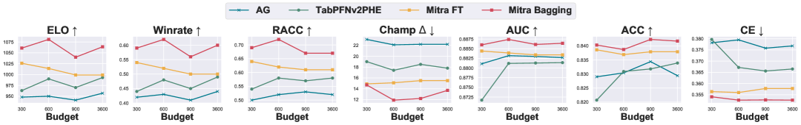

<figcaption>図3: Mitra (bagging) は、1 分割 TabRepo ベンチマークで 300〜3600 秒の予算にわたり、TabPFNv2 PHE・AutoGluon best-quality・Mitra (+ef) と比べて最良性能を示す。</figcaption>
</figure>

### 4.6 Mitra shows the best fine-tuning performance（最良のファインチューニング性能）

TabRepo で、Mitra のファインチューニング＋アンサンブルの組み合わせ性能を、アンサンブル内の推定器数の関数として TabPFNv2・TabICL・Attic と比較する。

図4 に示すように、Mitra は様々なアンサンブルサイズで一貫してより良いファインチューニング性能を示す。TabPFNv2 のファインチューニングとアンサンブルは、アンサンブル単独の性能をほとんど改善しない。

Mitra のファインチューニングによる強い向上の有力な理由は、最大 16 入力特徴量で事前訓練されているため、より大きな特徴量空間を持つ下流データセットへの適応が大きな利益を提供することである。

また、Mitra のより多様な事前分布がファインチューニングの有効性に寄与すると仮説する。より広い帰納バイアスの集合から汎化できるようになり、モデルがより汎化可能でタスク固有のファインチューニングに適応しやすくなるからである。

<figure>

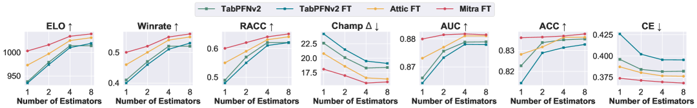

<figcaption>図4: Mitra はアンサンブルサイズにわたって有意に良いファインチューニング性能を示す。</figcaption>
</figure>

### 4.7 Prior Importance Ablation Study（事前分布重要性のアブレーション研究）

我々は、各ステップで最高性能の事前分布を反復的に追加することで、Mitra の事前分布混合における各事前分布の重要性を体系的に研究する（詳細は付録 C.3）。

表6 は、§3.2 の表1 の分析を裏付け拡張するいくつかの重要な知見を示す: (1) **多様性と実データでの性能の両方が重要**。全事前分布の中で $\mathcal{G}_{\text{SCM}}$ のデータが最高の重要性を示し、表1 の高い性能ベクトル値と低い対角と整合する。対照的に、$\mathcal{G}_{\text{DSRF}}$ は 2 番目に良い単独事前分布だが、高い対角（0.984）と他事前分布との強い重複（非対角 > 0.96）のため、混合に追加したときの寄与が最も少ない。一方、$\mathcal{G}_{\text{RF}}$ は低い重複（最低対角 0.761、非対角 [0.708, 0.768]）を示すが、性能ベクトルが示すように実データでの性能が最悪で、混合であまり有益でない理由を説明する。 (2) **我々の事前分布の混合は相補的な強みを促し汎化を改善する**。$\mathcal{G}_{\text{SCM}}$ をどの木ベース事前分布と組み合わせても単独より改善することを観察し、事前分布混合の重要性を強調する。特に $\mathcal{G}_{\text{ET}}$ を $\mathcal{G}_{\text{SCM}}$ と組み合わせると性能が大きく向上し、Elo が 63 改善する。これは表1 の知見——$\mathcal{G}_{\text{ET}}$ を混合に追加するのが効果的（低い対角 0.871 で多様、SCM 行の低い非対角 0.751 で独自的）——を裏付ける。同様に $\mathcal{G}_{\text{GB}}$ を混合に追加するとさらに性能が改善する。残りの $\mathcal{G}_{\text{DT}}, \mathcal{G}_{\text{DSRF}}, \mathcal{G}_{\text{RF}}$ を追加すると、実データで同程度に良いいくつかの構成に至る。これは表1 の知見——実データでの性能が低いか対角/非対角値が高いため重要性が低い——と整合する。これらの事前分布をより完全な木事前分布のファミリーを表すため最終混合に含めることを選ぶ。さらに、完全な混合に含めるとサンプル効率が改善する（付録 C.2 で、Mitra が $\{\mathcal{G}_{\text{SCM}}, \mathcal{G}_{\text{ET}}, \mathcal{G}_{\text{GB}}\}$（Mitra-Mix2）や Attic よりサンプル効率が良いことを示す）。

**表6**: 50% SCM＋50% TBP の等重み混合における各事前分布の効果に関する TabRepo 10 分割分類アブレーション研究。SCM 単独（Elo 1000）から始め、ET を加えると 1063、GB を加えると（SCM+ET+GB）1076 と Elo が向上。最終 6 種混合（SCM+ET+GB+DT+RF+DSRF＝Mitra）は Elo 1062。なお SCM+DT は Attic の変種。（Elo は括弧内に 95% 信頼区間。）

### 4.8 Scaling Behavior for TFMs（TFM のスケーリング挙動）

事前分布の構成を超えて、事前訓練に影響する 2 つの重要な要因はモデルサイズと訓練データ量である。

図5 でそれぞれのスケーリング挙動を調査する。異なるモデルサイズと様々な量の事前訓練データで TabRepo の性能を評価する。

具体的には、モデル深さを 6 構成（4・8・12・16・20・24 層）で変え、すべて同じオンザフライ生成の混合事前分布で事前訓練する。

*モデルサイズ* のスケーリング則では、より大きなモデルが早期訓練段階でより良い性能を達成し、より高い最終精度に収束することを観察する。しかし性能向上は 12 層を超えると飽和し始め、適切なモデルサイズ選択時のモデル容量と計算効率のトレードオフを示す。

*サンプルサイズ* のスケーリング則では、性能が早期段階で急速に改善し、その後徐々にプラトーに達し、約 18K ステップ後に収穫逓減することを見出す。我々の設定では各ステップが 2,048 個の新しい合成データセットを含むので、これはモデルが約 3,700 万個の一意なデータセットに遭遇した後に飽和することを示唆する。

<figure>

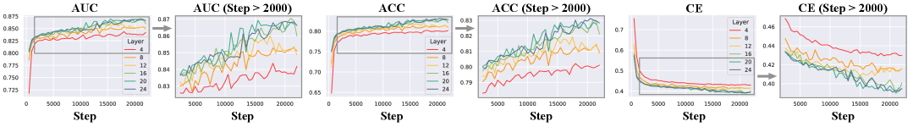

<figcaption>図5: モデルサイズのスケーリング則。モデルサイズを 6 構成（4・8・12・16・20・24 層）で変え、各々 4,500 万の一意なサンプルで事前訓練。性能傾向をより明確にするため 2,000 ステップ以降にズーム。このズーム領域のみに焦点を当てた大きい版は付録の図25 にある。</figcaption>
</figure>

## 5 Conclusion and Discussion（結論と議論）

**結論**　我々は TFM 事前訓練における合成事前分布の役割への最初の体系的調査を提供し、事前分布の有効性が、実表形式データでの単独性能と、混合内での多様性・独自性の両方にどう依存するかを実証した。

我々の分析に基づき、多様で高性能でモデル非依存な合成事前分布の混合を構成する。

この混合を活用して Mitra を開発した。Mitra は、分類・回帰の両タスクで既存 TFM や他の強力な表形式ベースラインを一貫して上回る SOTA TFM である。

限界は付録 D で議論する。

**より広い影響（Broader Impact）**　我々の研究は、構造化領域での基盤モデル事前訓練のための合成データの理解と設計を前進させ、高コストな実ラベルデータの必要性を減らし、機密な実世界記録での訓練に伴うプライバシーリスクを低減する。

## Appendix A Mitra

本節では、文脈内学習（ICL）の前提、データ生成手法と事前分布、Mitra アルゴリズム全体の詳細を提供する。

### A.1 TFM Preliminaries（TFM の前提）

純粋な合成データで TFM を事前訓練するため、各データセット $\mathcal{D}=\{(\mathbf{x}_{n},y_{n})\}_{n=1}^{N}$ は、特徴量数・サンプル数・クラス数（分類タスク）・カテゴリ属性数の異なるデータセットを生成する事前分布 $\mathcal{G}$ からサンプルされる。

TFM $f_{\theta}$ が事前訓練されると、次のように ICL を行える。モデルには、$s=N_{\text{sup}}$ 個のラベル付き行から成るサポート集合 $\mathcal{D}_{\text{sup}}$ と、$q=N_{\text{qry}}$ 個のラベルなしクエリ行（$s+q=N$）が与えられる。

そしてモデルは対応するクエリラベルを 1 回の順伝播で予測する:

$$
\hat{y}_{\text{qry}_{1}},\cdots,\hat{y}_{\text{qry}_{q}}=f_{\theta}([(\mathbf{x}_{\text{sup}_{1}},y_{\text{sup}_{1}}),\cdots,(\mathbf{x}_{\text{sup}_{s}},y_{\text{sup}_{s}}),\mathbf{x}_{\text{qry}_{1}},\cdots,\mathbf{x}_{\text{qry}_{q}}]),
$$

パラメータ $\theta$ を更新する必要なしに行う。

### A.2 Data Generation（データ生成）

ここでは、特徴量–目標対 $(\mathbf{x},y)\in\mathcal{D}$ のデータ生成における具体的なパラメータとモデリングの選択、および Mitra の事前分布混合で使う事前分布の詳細を議論する。

簡単のため、図6 は Mitra の事前分布混合から生成した 2D データセットの可視化を示す。加えて図7 は、事前訓練中に使う混合からの高次元データサンプルの t-SNE 可視化を示す。連続・カテゴリの両特徴量が表現されているのが見える。分類ラベル $y$ は色で示される。

#### A.2.1 Feature and Target Generation（特徴量と目標の生成）

**特徴量 𝐱**　$\mathbf{x}$ は $N_{\text{cont}}$ 個の連続成分と $N_{\text{cat}}$ 個のカテゴリ成分を含むよう設計する（$N_{\text{cont}}+N_{\text{cat}}=d$）。

カテゴリ成分数は $N_{\text{cat}}=\lfloor p_{\text{cat}}(d+1)\rfloor$ で決まる（$p_{\text{cat}}$ は一様サンプルしたカテゴリ割合）。

次に $N_{\text{cat}}$ 個のカテゴリ特徴量インデックス $\mathcal{I}_{\text{cat}}$ を $\mathcal{I}=\{1,\dots,d\}$ から非復元で一様サンプルする。

各連続特徴量インデックス $j\in\mathcal{I}_{\text{cont}}=\mathcal{I}\setminus\mathcal{I}_{\text{cat}}$ について、$\mathbf{x}_{j}$ を i.i.d. ガウスノイズとする。

各カテゴリ特徴量 $\mathbf{x}_{k}$ について、そのクラス数を幾何分布から生成する。最後に各 $\mathbf{x}_{k}$ をクラス数 $N_{\text{c}}^{k}$ 上の多項分布でモデル化する。

**目標 y**　各目標 $y\in\mathcal{Y}$ について、生成事前分布が「直接」サンプリングを使うか「間接」サンプリングを使うかで生成を変える。

直接サンプリングでは、ランダムな条件付き分布 $p(y\mid\mathbf{x})$ から $y$ を直接シミュレートする。

間接サンプリングでは、まず対応するタスクの合成生成した訓練データセット $(\mathbf{x},y)$ で分類器または回帰器を当てはめる必要がある。分類タスクでは、ラベル $y$ は前述のカテゴリ特徴量のラベル生成過程と同様に生成される。回帰タスクでは $y$ を正規とする。最終ラベル $y_{2}$ は、新しい特徴量ベクトル $\mathbf{x}_{2}$ に対する当てはめた推定器の出力として生成される。

<figure>

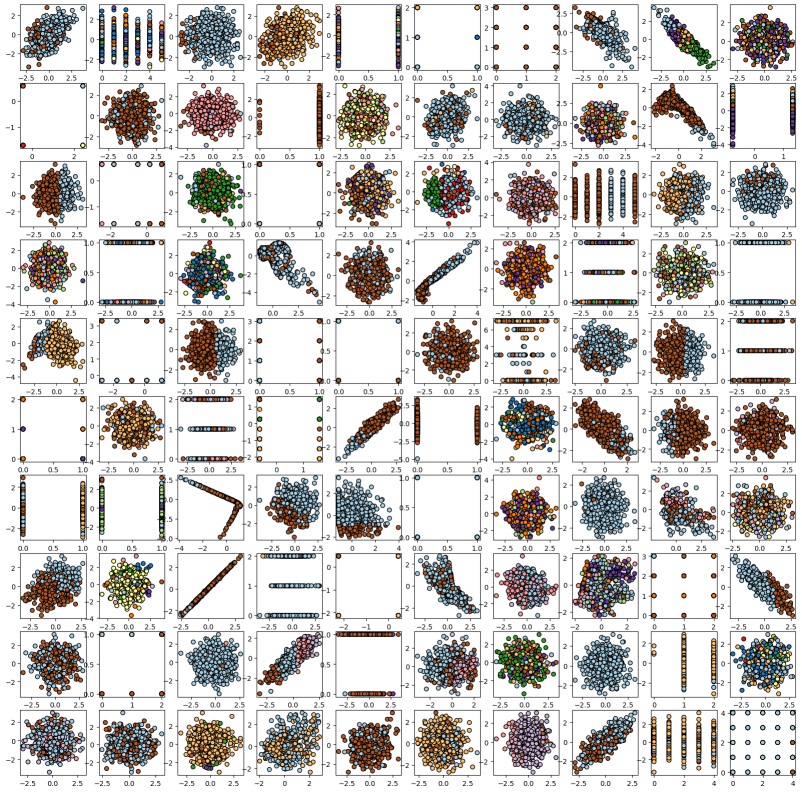

<figcaption>図6: Mitra の事前分布混合からランダム生成した 2D データセット。分類タスクで、SCM と TBP のデータ生成事前分布の混合から引いた特徴量 x∈ℝ²。分類ラベル y は色で示す。</figcaption>
</figure>

<figure>

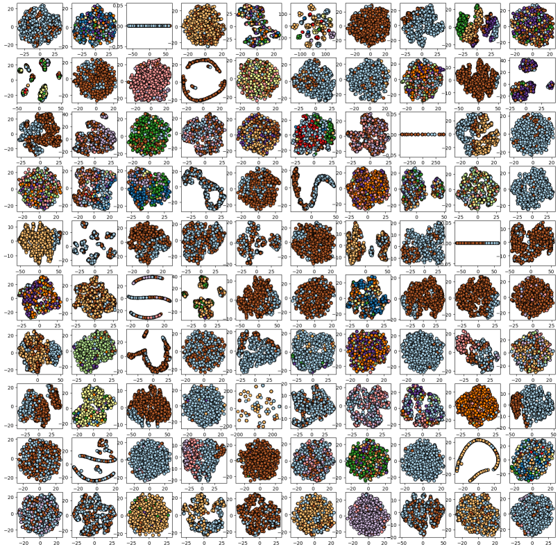

<figcaption>図7: Mitra の事前分布混合からのランダムな高次元データセットの t-SNE 可視化。SCM と TBP のデータ生成事前分布の混合から引いた特徴量 x∈ℝᵈ。分類ラベル y は色で示す。</figcaption>
</figure>

#### A.2.2 Synthetic Data-Generating Priors（合成データ生成事前分布）

我々は SCM と TBP の混合を含める。間接サンプリング（ET・GB・DT・RF）と直接サンプリング（SCM・DSRF）の両事前分布を持つ。

**間接サンプリング事前分布**　アルゴリズム2 が「間接」サンプリング事前分布のデータ生成手続きを示す。

これらを間接サンプリング法と呼ぶのは、まず推定器（対応するタスクの分類器/回帰器）を当てはめるための訓練データ $D=[\mathbf{X},\mathbf{Y}]\in\mathbb{R}^{B\times(d+1)}$ を要するからである（$B$ はベースサイズ）。

次に A.2.1 の特徴量生成手続きに従って特徴量 $\mathbf{X}_{2}\in\mathbb{R}^{N\times d}$ を生成する。最終的な $\mathbf{Y}_{2}\in\mathbb{R}^{N}$ は、当てはめた推定器がこの $\mathbf{X}_{2}$ 入力を予測して出力する。

TabForestPFN と Attic は間接サンプリングの DT 事前分布を、TabICL は間接サンプリングの XGBoost 事前分布を使う。

我々のデータ生成は TabForestPFN や Attic と類似するが、分類タスクで回帰器でなく分類器を直接当てはめる点と、目標ラベルとカテゴリ特徴量ラベルの両方に我々の直接多項ラベル生成手続き（A.2.1 参照）を使う点が異なる。

これにより、連続値をラベルにバケット化する分位点変換を使う必要をなくす。これら間接サンプリングの TBP には scikit-learn の分類器・回帰器を使う。

**直接サンプリング事前分布**　アルゴリズム5 が我々の直接サンプリングランダムフォレスト（DSRF）TBP 事前分布のデータ生成手続きを示す。

これらを直接サンプリングと呼ぶのは、まず関数空間 $\mathcal{F}$ から関数 $f\in\mathcal{F}$ をサンプルし、その後データ $\mathbf{x}_{n}$ の目標 $y_{n}=f(\mathbf{x}_{n})$ を生成するからである。

したがって直接サンプリング法は $\mathbf{X}_{2}\in\mathbb{R}^{N\times d}$ を一度だけ形成すればよく、その後直接サンプリングのデータ生成事前分布が直接 $\mathbf{Y}_{2}\in\mathbb{R}$ を出力する。

DSRF では、A.2.1 と同じ特徴量生成過程で特徴量 $\mathbf{X}_{2}$ を生成する。

DSRF では、まず $\mathcal{F}$ からランダムな木を構築する必要がある（アルゴリズム4）。そのため次をサンプルする: (1) $\{0,\dots,d-1\}$ のランダムな分割インデックス（$d$ は特徴量次元）; (2) 指定範囲 thres-int のランダムな分割閾値。

木の各ノードは対応する分割インデックスと分割閾値を格納する。アルゴリズム進行に伴い将来の分割でサンプルする、特徴量分割インデックスに対応する部分区間を追跡するため、分割区間を辞書に格納する。

DT の慣例に従い、木は特徴量インデックス $i$ と値 $v$ で分割され、$\mathbf{x}[i]\leq v$ の全データ点は木の左側に、$\mathbf{x}[i]>v$ のものは右側に分割される。

子のないノードの数も制御する。葉ノードのラベルはタスク型で異なる仕方で構築する。

分類では $\{0,\dots,N_{c}-1\}$ の開始インデックスを一様ランダムにサンプルし、追加する後続の各葉ノードについてクラス数の剰余で増やす。回帰では葉ノードをガウス分布からサンプルする。

推定器数（ランダム木）$N_{e}$ をサンプルし、各木を葉ノードに達するまで辿ってその木の目標値を得る（アルゴリズム3）。最後に、分類タスクではこれら $N_{e}$ 個の値の多数決、回帰タスクでは平均で最終ラベル $y$ を計算する。

SCM 事前分布の詳細は TabPFN 論文の付録 C.1 を参照。

### A.3 Algorithm（アルゴリズム）

アルゴリズム1 が我々の Mitra 手法の概要を提供する。

§3.3 の尤度の母集団版は、事前分布混合からサンプルした各表 $D$ 上の期待値の形を取る。サンプルした表が与えられると、モデルは $q$ 個のクエリ行が文脈内例を所与として条件付き独立と仮定するので、期待値内の対数尤度はクエリ行ごとに 1 つの $q$ 個の項の和に分解される。

クエリラベルが分類タスクに対応するとき、その（条件付き）分布はカテゴリ的と仮定され、訓練目的は交差エントロピー損失の最小化と等価になる。クエリラベルが回帰タスクに対応するとき、その分布はガウスと仮定され、訓練目的は平均二乗誤差（MSE）損失の最小化に対応する。

> **アルゴリズム1（Mitra: TFM 事前訓練のための合成事前分布の混合）**: データ生成器の集合 $\{\mathcal{G}_{i}\}_{i=1}^{M}$ と混合重み $\{w_{i}\}$（和 1）、サポート集合サイズ $s$、クエリ集合サイズ $q$、事前訓練ステップ数 $T$ を入力に取る。各 $t=1..T$ で: 生成器インデックス $i\sim w_{i}$ をサンプル → 合成データセット $\mathcal{D}^{(i)}\leftarrow\mathcal{G}_{i}$ をサンプル → サポート集合（サイズ $s$）とクエリ集合（サイズ $q$）にランダム分割 → 入力系列を構築 → TFM でクエリラベルを予測 → 損失 $\mathcal{L}=\log p_{\theta}(y^{(i)}_{\text{qry}_{1:q}}|\mathcal{D}^{(i)}_{\text{sup}},\mathbf{x}^{(i)}_{\text{qry}_{1:q}})$ を計算 → $\mathcal{L}$ の勾配でパラメータ $\theta$ を更新。

> **アルゴリズム2（間接サンプリング TBP）**: タスク生成器 TBP・ベースサイズ $B$・特徴量次元 $d$・サンプル数 $N$・クラス数 $N_c$・タスク型 $\mathcal{T}$ を入力に取る。A.2.1 の手続きで訓練データ $\mathbf{D}=[\mathbf{X},\mathbf{Y}]\in\mathbb{R}^{B\times(d+1)}$ を生成 → モデル $z$（分類なら TBPClassifier、回帰なら TBPRegressor）をインスタンス化 → $z.\text{fit}(\mathbf{X},\mathbf{Y})$ → テスト特徴量 $\mathbf{X}_2\in\mathbb{R}^{N\times d}$ をサンプル → $\mathbf{Y}_2\leftarrow z.\text{predict}(\mathbf{X}_2)$ → $[\mathbf{X}_2,\mathbf{Y}_2]$ を返す。

> **アルゴリズム3（DT 走査による目標生成）**: 関数 DT-Traversal($\mathbf{x}$, tree): tree.value から (ind, thres) を取得。葉ノードなら $y\leftarrow$ tree.target、$\mathbf{x}[\text{ind}]\leq\text{thres}$ なら左部分木を、そうでなければ右部分木を再帰的に辿り $y$ を返す。

> **アルゴリズム4（ランダム決定木 DT の構築）**: 特徴量次元 $d$・クラス数 $N_c$・タスク型 $\mathcal{T}$・最小/最大木深 $d_{\min},d_{\max}$・分割閾値区間 thres-int・子なし確率 $p_{\text{nc}}$・回帰葉のガウスパラメータ $(\mu,\sigma)$・大域葉カウンタ $N_{\text{leaf}}=0$ を入力に取る。Node クラスは value（分割規則: 特徴量インデックス, 閾値）・left/right（子）・depth・target（葉予測値）・rs（特徴量インデックスと分割区間の辞書）を持つ。関数 RandDT は、深さ>0 なら区間を rs に記録、ランダムな分割インデックス ind と区間内の閾値 thres をサンプルして tree.value=(ind, thres) とし、（深さが $d_{\max}$ 未満かつ確率 $\geq p_{\text{nc}}$、または深さ $<d_{\min}$ なら）左右に子を再帰生成、そうでなければ葉に目標値を割り当てる（分類は $N_{\text{leaf}}\bmod N_c$、回帰は $\mathcal{N}(\mu,\sigma)$）。

> **アルゴリズム5（直接サンプリングランダムフォレスト DSRF）**: 特徴量次元 $d$・サンプル数 $N$・クラス数 $N_c$・タスク型 $\mathcal{T}$・推定器数 $N_e$・最小/最大深・閾値区間・終端ノード確率・回帰葉のガウスパラメータを入力に取る。A.2.1 で特徴量行列 $\mathbf{X}_2\in\mathbb{R}^{N\times d}$ を生成。各 $n=1..N$、各 $i=1..N_e$ で: ランダム DT をサンプル（アルゴリズム4）→ 入力で木を評価（アルゴリズム3）。分類なら多数決、回帰なら平均で $\mathbf{Y}_2[n]$ を得る。$[\mathbf{X}_2,\mathbf{Y}_2]$ を返す。

## Appendix B Experimental Settings（実験設定）

本節では、ベンチマークデータセット・指標・実装の詳細を議論する。

### B.1 Benchmarking Datasets（ベンチマークデータセット）

表7 が、様々な行数・特徴量数のベンチマークデータセットの記述と統計を提供する。

§4.1 で議論したように、1D モデル（最大 100 特徴量の TabPFN）と 2D モデル（最大 500 特徴量の TabPFNv2）と比較するため、小特徴量・大特徴量の両ベンチマークで評価する。

小特徴量ベンチマークでは、TabPFN に従い最大 3,000 行・100 特徴量の 66 TabRepo 分類・75 TabZilla 分類・10 TabRepo 回帰データセットを使う。

大特徴量ベンチマークの評価には AMLB から最大 10,000 行・500 特徴量の 29 分類データセットを使う。

さらに、AMLB と OpenML-CTR23 から最大 10,000 行・500 特徴量の 28 データセットの大特徴量回帰ベンチマークでも評価する。これは TabPFNv2 の評価プロトコルと整合する。

データセットのタスク ID は原典に列挙されている（TabRepo 66 件・AMLB 29 件・TabZilla 75 件・TabRepoReg 10 件・AMLB+OpenML-CTR23 28 件）。

**表7**: ベンチマークデータセットの記述と統計。

| Dataset | Task | テーブル数 | 最大行数 | 最大特徴量数 |
| --- | --- | --- | --- | --- |
| TabRepo | 分類 | 66 | 3,000 | 100 |
| AMLB | 分類 | 29 | 10,000 | 500 |
| Tabzilla | 分類 | 75 | 3,000 | 100 |
| TabRepoReg | 回帰 | 10 | 3,000 | 100 |
| AMLB+OpenML-CTR23 | 回帰 | 28 | 10,000 | 500 |

### B.2 Metrics（指標）

データセットとタスクをまたいだ包括的な性能評価を保証するため、分類・回帰の両タスクで多様なランク指標と集約指標を用いる。以下にその形式的定義を示す。ランクベース指標の計算では、データセットの各分割を別個の評価単位とする。

#### B.2.1 Ranking-Based Metrics（ランクベース指標）

**平均ランク（Average Rank）**　モデル集合 $\mathcal{M}$、データセット集合 $\mathcal{D}$ とする。モデル $m$ のデータセット $\delta$ 上のランク（1 が最良）を $\text{rank}_{\delta}(m)$ とすると、平均ランクは $\text{Avg. Rank}(m)=\frac{1}{|\mathcal{D}|}\sum_{\delta\in\mathcal{D}}\text{rank}_{\delta}(m)$。

**Elo レーティング**　Elo レーティングはペアワイズの勝敗を競争的なレーティングシステムに一般化する。各モデルを選手として扱い、データセットをまたいだペアワイズ性能比較に基づいてレーティングを更新する。最終 Elo は全ペア対戦にわたるモデルの相対的強さを反映する。

**勝率（Winrate）**　勝率は、あるモデルが他モデルを上回るデータセットの割合を捉える: $\text{Winrate}(m)=\frac{1}{|\mathcal{D}||\mathcal{M}|-1}\sum_{\delta}\sum_{m'\neq m}(\mathbb{1}[\text{E}_{\delta}(m)<\text{E}_{\delta}(m')]+\frac{1}{2}\mathbb{1}[\text{E}_{\delta}(m)=\text{E}_{\delta}(m')])$。誤差は分類で $\text{E}=1-\text{AUC}$、回帰で $\text{E}=1-\text{R}^{2}$。引き分けは半勝。

**再スケール正解率（Rescaled Accuracy, RAcc）**　データセットの難易度の効果に対処するため、各データセット内の最高性能モデルでスケールする: $\text{RAcc}_{\delta}(m)=1-\frac{\text{E}(m)-\text{E}(m^{*})}{\text{E}(m')-\text{E}(m^{*})}$（$m^{*}$/$m'$ は誤差最小/最大のモデル）。全体は各データセットの平均。

**チャンピオンデルタ（Champion Delta, CΔ）**　チャンピオンモデル $m^{*}=\arg\min_{m}\text{E}(m)$ に対し、$\text{C}\Delta(m)=(1-\frac{\text{E}(m^{*})}{\text{E}(m)})\times 100$。現モデルと最高性能モデルの間の性能差の割合を反映する。

#### B.2.2 Aggregated Classification Metrics（集約分類指標）

**AUC（ROC 曲線下面積）**　二値分類器で、AUC は真陽性率（TPR）対偽陽性率（FPR）をプロットした ROC 曲線下の面積を測る: $\text{AUC}=\int_{0}^{1}\text{TPR}(t)\,d\,\text{FPR}(t)$。多クラスでは one-vs-one（OvO）戦略を採り、全ペアクラス比較の平均 AUC を計算する。

**正解率（ACC）**　正しく分類されたインスタンスの割合: $\text{ACC}=\frac{1}{N}\sum_{i=1}^{N}\mathbb{1}[y_{i}=\hat{y}_{i}]$。

**交差エントロピー（CE）**　$\text{CE}=-\frac{1}{N}\sum_{i=1}^{N}\sum_{c=1}^{C}y_{i,c}\log p_{i,c}$（$C$ はクラス数、$p_i$ は予測クラス確率ベクトル、$y_i$ は one-hot 正解ベクトル）。

#### B.2.3 Aggregated Regression Metrics（集約回帰指標）

**R²（決定係数）**　モデルが説明する分散の割合: $\text{R}^{2}=1-\frac{\sum_{i}(y_{i}-\hat{y}_{i})^{2}}{\sum_{i}(y_{i}-\bar{y})^{2}}$。

**RMSE（二乗平均平方根誤差）**　$\text{RMSE}=\sqrt{\frac{1}{N}\sum_{i}(y_{i}-\hat{y}_{i})^{2}}$。大きな予測誤差をより重く罰する。

**MAE（平均絶対誤差）**　$\text{MAE}=\frac{1}{N}\sum_{i}|y_{i}-\hat{y}_{i}|$。予測誤差の平均的な大きさを測る。

### B.3 Training and Inference（訓練と推論）

実装は PyTorch ベース。具体的な事前訓練の詳細とモデルハイパーパラメータを以下に議論する。

#### B.3.1 Transformer Architecture（Transformer アーキテクチャ）

Mitra は 12 層・512 埋め込みサイズ・4 アテンションヘッドの Transformer アーキテクチャ上に構築される。

各 Transformer 層は FlashAttention で実装された行単位アテンションと列単位アテンションの両方を含む。結果のモデルは 72M パラメータを含む。

Mitra 1D は Transformer アーキテクチャ上に構築され、各層は行単位アテンションを含む。結果のモデルは 37M パラメータを含む。

#### B.3.2 Mitra Pretraining（Mitra 事前訓練）

<figure>

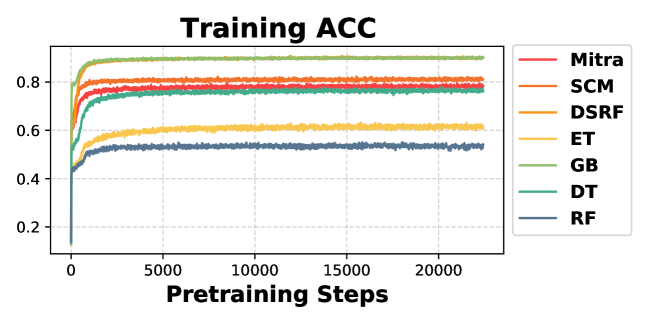

<figcaption>図8: Mitra の事前分布混合から生成したデータと、その個々の事前分布のデータでの、事前訓練ステップに対する訓練精度の比較。</figcaption>
</figure>

Mitra の事前訓練には 40GB A100 GPU を 8 個使う。Mitra は 4,500 万の合成生成データセットで訓練される。この訓練は 8 GPU（Nvidia A100）で約 60 時間かかる。

特徴量を正規化するため、サポート集合に基づく一様分位点変換を適用し、続いてサポート集合の平均・標準偏差に基づく標準正規化を行う。

回帰タスクでは、各表のサポート集合の最小・最大値を使って目標列に min-max 正規化を追加で適用する。

図8 は、訓練曲線が約 2000 ステップで急速に収束し振動的であることを示す。

興味深いことに、図8 は表9 の ACC 汎化性行列の対角の多様性の知見を強調する。より多様な事前分布のデータで生成したモデルほど訓練精度がより低い値に収束する。

Mitra の混合事前分布は、多様性の低い TBP（DSRF・GB）と多様性の高い TBP（RF・ET・DT）の中間、SCM のわずかに下に位置し、TBP が混合に多様性を加えることを示す。

我々の実験では、事前訓練が続くにつれ実世界データセットでの検証性能が改善することを観察する。

#### B.3.3 Ensembling and Finetuning Parameters for TFMs（TFM のアンサンブル・ファインチューニングパラメータ）

アンサンブルを組み込むモデルでは、各モデルのデフォルト推定器数を使う（TabPFNv2 は分類で 4、回帰で 8、TabICL は 32、TabPFN は 3）。

TabZilla と AMLB 分類ベンチマークでは、TabPFNv2 は 8 推定器の方が 4 推定器より良く、その後飽和することを見出した。これらでは TabPFNv2 の推定器を 8 に増やす。

全 +f モデルは 50 エポックでファインチューニングし、これはほとんどのデータセットで通常 early stopping を引き起こす設定である。

TabPFN は最大 100 特徴量しかサポートしないため AMLB 分類では評価しない。加えて TabPFN と TabICL は回帰をサポートしない。Attic は回帰タスクで訓練の安定性に問題があり、報告性能が XGBoost より劣るため、回帰のベースラインには XGBoost を含める。表8 が各データセットの推定器数をまとめる。

**表8**: アンサンブル TFM の推定器数。（TabRepo: Mitra(+ef)/Attic(+ef)/TabPFNv2(+ef,+e) は 4、(+e) 系は 32、TabPFN(+e) は 3。AMLB/Tabzilla: +ef 系は 8、+e 系は 32。回帰: Mitra/TabPFNv2 +ef は 8、+e は 32。）

#### B.3.4 Statistical Model Hyperparameters（統計モデルのハイパーパラメータ）

RealMLP・LightGBM・XGBoost・CatBoost・MLP には AutoGluon のデフォルトハイパーパラメータを使う。

## Appendix C Additional Empirical Results（追加の実証結果）

本節では、他の集約指標で計算した汎化性行列 $\mathbf{G}$ と性能ベクトル $\mathbf{P}$、追加のサンプル効率結果と 2D 決定境界可視化、アブレーション、分類・回帰のデータセットごとの結果、高度なバギング法による Mitra の集約指標上のさらなる性能改善を報告する。

### C.1 Generalizability Matrix and Performance Vector Metrics（汎化性行列と性能ベクトルの指標）

ここでは、表1 で報告した AUC に加え、TabRepo での汎化性行列 $\mathbf{G}$ と性能ベクトル $\mathbf{P}$ を、正解率（ACC、表9）と交差エントロピー（CE、表10）で示す。

$\mathbf{G}$ の行は各事前分布のデータで事前訓練したモデルを表す。それら事前訓練済みモデルを各事前分布から生成した合成データでテストする。各 $N=1000$ サンプル（サポート $s=800$、クエリ $q=200$）の 100 表を生成する。

様々な集約指標で類似の知見が成り立つ。特に表9 は TBP の ET の独自性をさらに強調し、$\mathcal{G}_{\text{ET}}$ のデータで事前訓練したモデルに対応する非対角 $\mathbf{G}_{ij}$ がわずか 0.577 である。各事前分布のランクベース指標は表6 を参照。

**表9**: 各事前分布の多様性（対角）と独自性（非対角）。各成分 $\mathbf{G}_{ij}$ は $\mathcal{G}_{i}$ で事前訓練し $\mathcal{G}_{j}$ で評価した TFM の ACC。性能ベクトル $\mathbf{P}_{i}$ は実データでの ACC。（行＝訓練元、列＝テスト先。対角＝SCM 0.841 / ET 0.715 / GB 0.942 / DT 0.861 / RF 0.602 / DSRF 0.952。最右列 TabRepo＝実データ性能 P: SCM 0.812 / ET 0.803 / GB 0.796 / DT 0.791 / RF 0.782 / DSRF 0.799。）

**表10**: 同上を CE で。（対角＝SCM 0.366 / ET 0.764 / GB 0.162 / DT 0.383 / RF 1.028 / DSRF 0.134。CE は小さいほど良いので、RF の対角が最大＝最も多様。）

### C.2 Sample Efficiency（サンプル効率）

表11 が、Mitra のアブレーション（Mitra-Mix2＝SCM+ET+GB、Attic＝SCM+DT の変種）と比較した改善されたサンプル効率を示す。

特に、ダウンサンプル比 ds が小さくなるほど Elo の差が大きくなり、最大の利得は ds=0.1 で生じる。この結果は、データ希少な状況での我々の混合事前分布の汎化性を、より少ない事前分布の混合と比べて強調する。

**表11**: より多様な事前分布（Mitra）はより良いサンプル効率を示す。各ダウンサンプル比 ds∈{1.0,0.75,0.5,0.25,0.1} で勝者を太字。（ds=1.0 で Mitra-Mix2 1234 / Mitra 1227 / Attic 1221。ds=0.1 で Mitra 700 / Mitra-Mix2 681 / Attic 680。ds が小さいほど Mitra の優位が拡大。）

### C.3 Ablations（アブレーション）

表6 で、混合の各事前分布の重要性を分析するアブレーション研究を行う。

各事前分布のデータで単独に事前訓練したモデルの性能をランク付けすることから始める。次のステップで最良性能の事前分布（この場合 SCM）を選ぶ。

その後、残りの各事前分布を選んだ事前分布と 1 つずつ追加して次の最良の組を決める。Mitra の全事前分布を前向きに追加し終えるまでこの手続きを続ける。

事前分布の降順ランクが $\{\text{SCM},\text{ET},\text{GB},\text{DT},\text{RF},\text{DSRF}\}$ であることがわかり、これは表1・表9・表10 の様々な指標での性能・多様性・独自性の知見と整合する。

表12 で、Mitra の事前分布混合における SCM と木ベース事前分布（TBP）の割合 $p$ の効果を TabRepo データセットで研究する。

実験では SCM と TBP の等重みのため $p=0.5$ とする。TabRepo では、混合が SCM 単独（$p=1.0$）や TBP 単独（$p=0$）を上回る $p$ の値がいくつかある。

$p=0.5, 0.4, 0.6$ の平均ランクは 3.2 で同点だが、$p=0.5$ の Elo がわずかに良い（1040 対 1030）。

加えて SCM 単独は TBP 単独より良い（平均ランク 3.7 対 4.4）。

SCM なしの TBP の混合は独自性に欠ける。TBP のデータで訓練したモデルが、SCM で訓練したモデルより、これら他の TBP のデータをよく予測できる（$\mathbf{G}$ の非対角が測る）からである。

混合から SCM を除くと、性能ベクトル $\mathbf{P}$ が測る最高性能の事前分布も除かれる。

先行研究は SCM を 1 つの TBP と組み合わせてきたが複数の TBP とは組み合わせていない。さらに SCM と対応する TBP の割合の効果を研究していない（TabICL は $p=0.7$ SCM＋$p=0.3$ XGBoost ベース SCM、TabForestPFN と Attic は $p=0.5$ SCM＋$p=0.5$ DT）。

**表12**: 混合中の SCM の割合 $p$（TBP は $1-p$）の効果に関する TabRepo 10 分割分類アブレーション。（$p=0.5$(Mitra) Elo 1040 / $p=0.4$ 1030 / $p=0.6$ 1030 / $p=0.7$ 1029 / $p=1.0$(SCM) 983 / $p=0.0$(TBP) 888。混合が両極端を上回る。）

### C.4 Classification（分類）

個別ベンチマークの詳細結果を表13（TabRepo）・表14（TabZilla）・表15（AMLB）に、3 ベンチマーク全体の集約結果を本文の表2 に報告する。これらの表は Mitra (+ef) が 3 ベンチマークすべてで最良性能であることを示し、集約結果と整合する。

性能をさらに高めるため、§4.5 の高度なバギング戦略を Mitra と最高性能ベースライン Attic の両方に適用する。表16 は統合 3 分類ベンチマークでの Mitra (bagging) と Attic (bagging) の結果を示す。特に Mitra (bagging) は Mitra (+ef) をさらに改善し、他ベースラインと比べてさらに大きな利得を示す。

加えて TabArena ベンチマークでも表17 で Mitra とベースラインを評価する。Mitra は TabArena で SOTA の表形式モデルであり続ける。具体的には、Mitra は訓練時間・推論時間の両方でパレート効率を達成し、TabPFNv2（HPO＋アンサンブル）は有意に遅い。Mitra は最強の単一モデルで、他手法が 200 反復のハイパーパラメータ調整をしても全手法を上回る。Mitra が上回られるのは TabPFNv2 のハイパーパラメータ構成をアンサンブルしたときのみである。Mitra の HPO・HPO＋アンサンブルの探索空間構築は今後の課題とする。

**表13**: Mitra は TabRepo 10 分割分類で勝つ。（Mitra(+ef) Elo 1141 が首位、Attic(+ef) 1135、TabPFNv2(+e) 1120 と続く。）

**表14**: Mitra は TabZilla 10 分割分類で勝つ。（Mitra(+ef) Elo 1110 首位、Attic(+ef) 1102、TabPFNv2(+e) 1079。）

**表15**: Mitra は AMLB 10 分割分類で勝つ。（Mitra(+ef) Elo 1202 首位、Attic(+ef) 1186、TabPFNv2(+e) 1156。）

**表16**: 本文の表2 に Mitra (bagging) と Attic (bagging) を追加した集約分類結果。（Mitra (bagging) Elo 1135 が首位、Mitra(+ef) 1124、Attic(bagging) 1119 と続く。）

**表17**: TabArena での追加結果。「Single」＝HPO なしの単一モデル、「HPO」＝200 反復のハイパーパラメータ最適化、「HPO + ensemble」＝その アンサンブル。Mitra は最強の単一モデルで、他手法が調整をしても上回る。「Train/Infer Time」＝1K 行あたりの訓練/推論時間の中央値（秒）。Mitra は訓練・推論時間でパレート効率を達成。

| Model | Avg.Rank↓ | Elo↑ | Winrate↑ | CΔ↓ | Train Time | Infer Time |
| --- | --- | --- | --- | --- | --- | --- |
| TabPFNv2 (HPO + ensemble) | 6.2 | 1745 | 0.89 | 0.05 | 3445.6 | 48.2 |
| Mitra (single) | 7.4 | 1699 | 0.86 | 0.07 | 457.2 | 34.6 |
| TabM (HPO + ensemble) | 9.9 | 1620 | 0.80 | 0.10 | 2828.4 | 1.6 |
| TabICL (single) | 10.1 | 1617 | 0.80 | 0.07 | 8.9 | 1.7 |
| RealMLP (HPO + ensemble) | 10.9 | 1597 | 0.78 | 0.09 | 6796.3 | 12.4 |
| TabPFNv2 (HPO) | 10.9 | 1596 | 0.78 | 0.08 | 3445.6 | 1.0 |
| AutoGluon1.3 (4h) | 12.6 | 1551 | 0.74 | 0.10 | 2309.2 | 2.6 |
| TabPFNv2 (single) | 12.7 | 1548 | 0.74 | 0.10 | 4.1 | 0.4 |
| TabDPT (single) | 22.7 | 1329 | 0.52 | 0.15 | 27.5 | 8.9 |
| …（以下、CatBoost・XGBoost・RandomForest・KNN 等のチューニング/単一版が続く） | | | | | | |

### C.5 Regression（回帰）

表18 で、AMLB と OpenML-CTR23 を組み合わせた、最大 500 特徴量・最大 10k 行のより大きなベンチマークでの追加回帰結果を報告する。

このベンチマークは他より多くの行を持つデータセットを含む。結果は Mitra (+ef) と TabPFNv2 (+ef) が類似の性能で、TabPFNv2 (+e) が最高性能であることを示す。

2 つの回帰ベンチマーク（表4 と表18）を分けたのは、小規模・大規模回帰データセットでの性能差を示すためである。

これらの結果は Mitra が小規模データセットでより良いことを示す。この大規模データセットでの性能の限界は、事前訓練で最大 16 特徴量・最大 640 行しか見ないことで説明できる。

特筆すべきは、TabPFNv2 の最大事前訓練特徴量の 10 分の 1・最大事前訓練行数の 3 分の 1 で事前訓練したにもかかわらず、最大 100 特徴量・3k 行のベンチマークで、そして最大 500 特徴量・10k 行の一部ベンチマークで TabPFNv2 を上回れることである。

これらの知見は Mitra が事前訓練の領域を大きく超えてよく汎化することを示唆する。今後の課題には事前訓練過程での最大行数・特徴量数の増加が含まれる。

**表18**: AMLB 10 分割回帰ベンチマーク。（TabPFNv2(+e) Elo 1137 首位、RealMLP 1097、Mitra(+ef) 1091、TabPFNv2(+ef) 1089。大規模回帰では TabPFNv2 がわずかに優勢。）

### C.6 Critical Differences（臨界差）

3 つの分類ベンチマーク（TabRepo＝図9、TabZilla＝図10、AMLB＝図11）と 2 つの回帰ベンチマーク（TabRepo＝図12、AMLB+OpenML-CTR23＝図13）で、Mitra とベースライン間の臨界差を可視化する。

<figure>

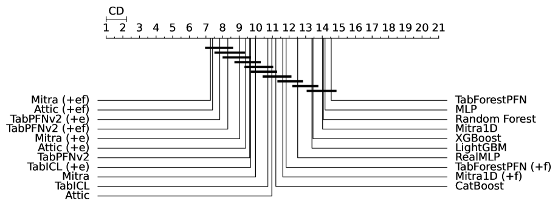

<figcaption>図9: TabRepo 分類ベンチマークの臨界差プロット。</figcaption>
</figure>

<figure>

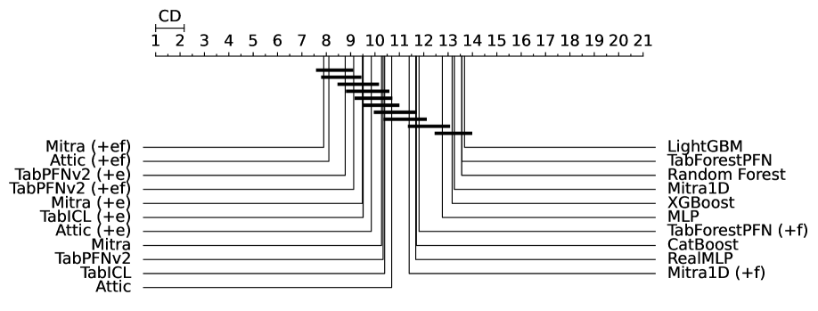

<figcaption>図10: TabZilla 分類ベンチマークの臨界差プロット。</figcaption>
</figure>

<figure>

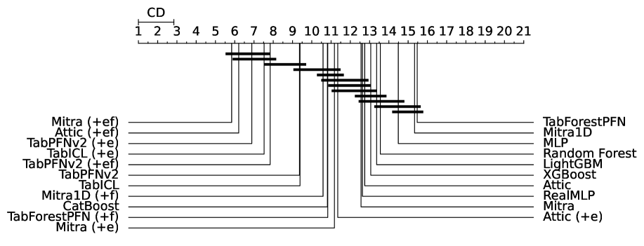

<figcaption>図11: AMLB 分類ベンチマークの臨界差プロット。</figcaption>
</figure>

<figure>

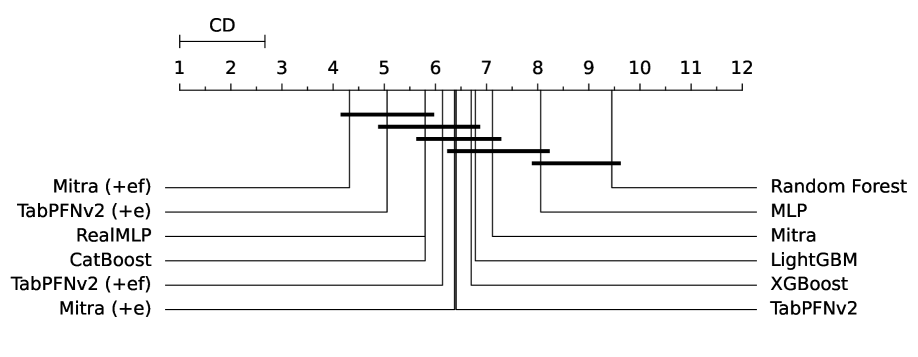

<figcaption>図12: TabRepo 回帰ベンチマークの臨界差プロット。</figcaption>
</figure>

<figure>

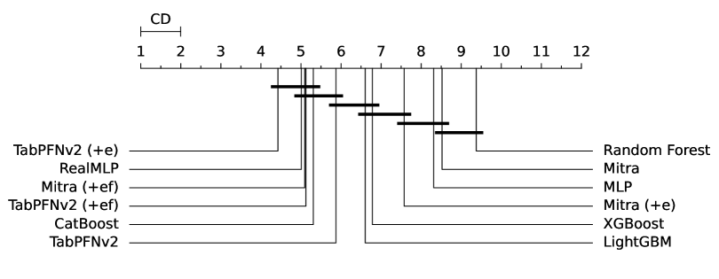

<figcaption>図13: AMLB + OpenML-CTR23 回帰ベンチマークの臨界差プロット。</figcaption>
</figure>

### C.7 Timing Efficiency（時間効率）

40GB A100 マシン 8 台で Mitra とベースラインの実行時間を計算する。

図14 で、TabRepo ベンチマークでの性能指標（Elo・勝率・AUC）と平均実行時間を示す。Mitra (+ef) は CatBoost に対し 138 Elo の利得を得つつ約 3.5 倍速い。

単一 GPU でのファインチューニング性能も測定した。単一 GPU の Mitra (+ef) は CatBoost（83 秒）と同程度の時間（89 秒）で 138 Elo の利得を達成する。TabArena での訓練・推論時間の詳細は表17 に示す。

<figure>

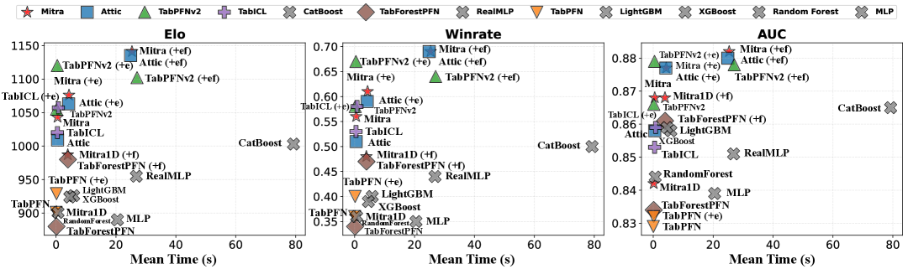

<figcaption>図14: TabRepo での平均実行時間 対 性能指標（Elo・勝率・AUC）。</figcaption>
</figure>

### C.8 Decision Boundary Visualizations（決定境界の可視化）

代表的な 2D シミュレーションデータセットの集合で、Mitra とベースライン手法の決定境界を可視化する。

各データセットは既知の真の分布から引いた 1,000 サンプルから成り、10% をサポートサンプル、残り 90% をクエリサンプルとする。

Mitra と TabPFNv2 ではアンサンブルなしの ICL 設定を採る。古典的モデルではデフォルトハイパーパラメータを使う。

全体として Mitra は効果的な few-shot 汎化能力を示す。

図15・図21 に示すように、データ分布が軸並行のとき、Mitra は TabPFNv2 より規則的で断片化の少ない決定境界を生む。この結果は、より低い関数複雑性がより良い汎化を支えるように見えることを示唆する。

他の代表的 2D データセット——GP データ（図16）・線形分離可能データ（図18）・ガウス混合（図19）・正弦波（図20）・星形分布（図23）——では、Mitra の決定境界は木ベース分類器と TabPFNv2 モデルの間に位置し、合成事前分布の混合での事前訓練の効果を強調する。

スパイラル（図22）と Swiss roll（図24）の例では、ガウス過程（GP）分類器が強い性能を示し、これが GP ベースの事前分布を事前訓練の混合に組み込むという今後の課題の動機になる。

<figure>

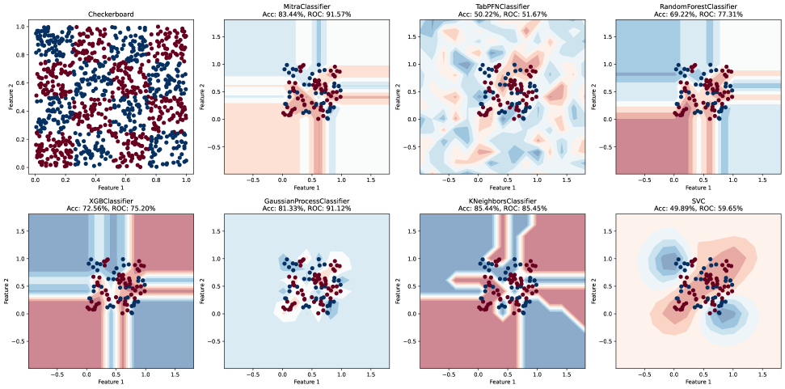

<figcaption>図15: 2D チェッカーボードデータでの Mitra とベースラインの決定境界。Mitra は TabPFNv2 より規則的で断片化の少ない決定境界を示す。</figcaption>
</figure>

<figure>

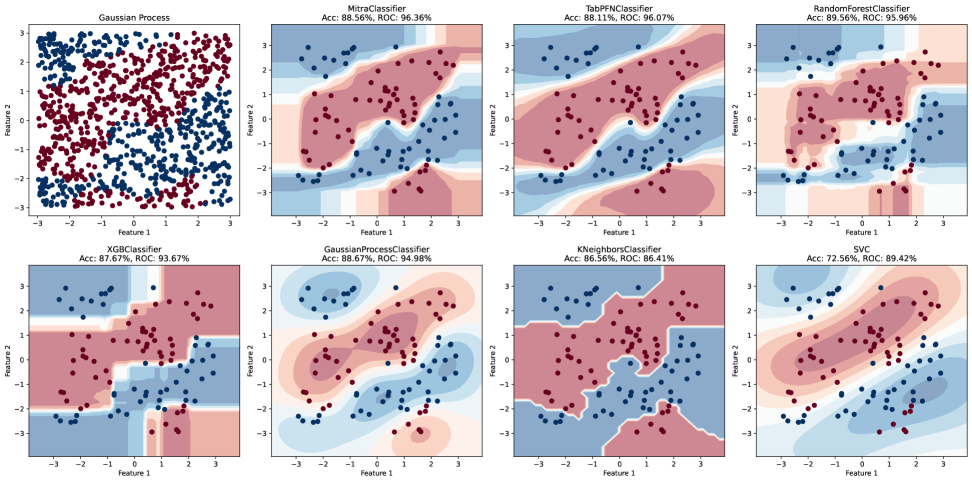

<figcaption>図16: 2D ガウス過程データでの決定境界。</figcaption>
</figure>

<figure>

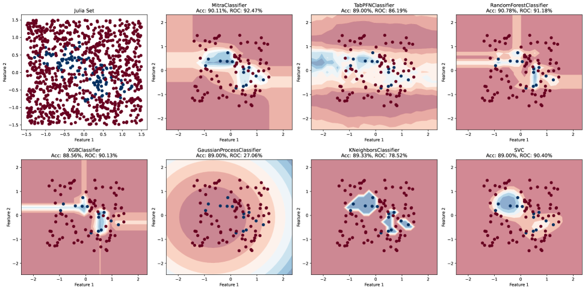

<figcaption>図17: 2D Julia 集合データでの決定境界。</figcaption>
</figure>

<figure>

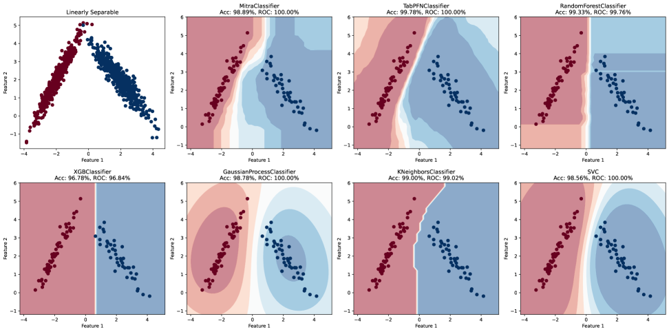

<figcaption>図18: 2D 線形分離可能データでの決定境界。</figcaption>
</figure>

<figure>

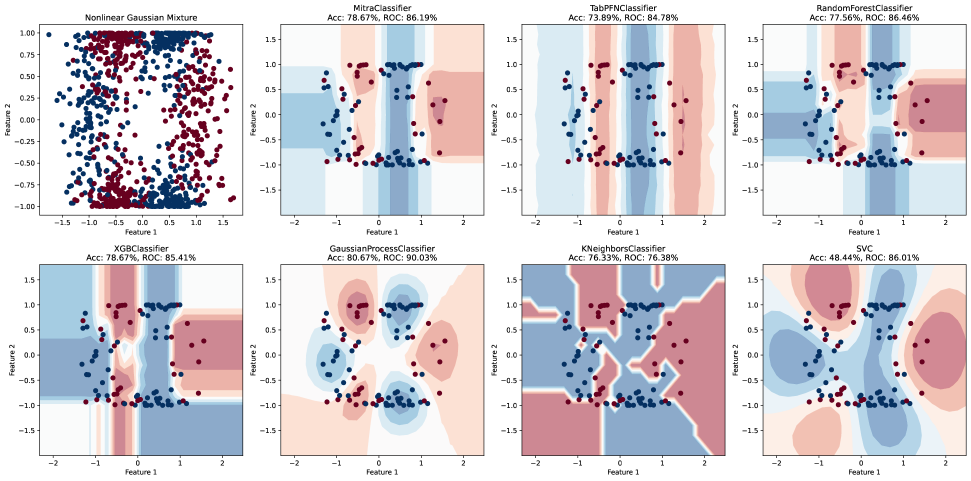

<figcaption>図19: 2D 非線形ガウス混合データでの決定境界。</figcaption>
</figure>

<figure>

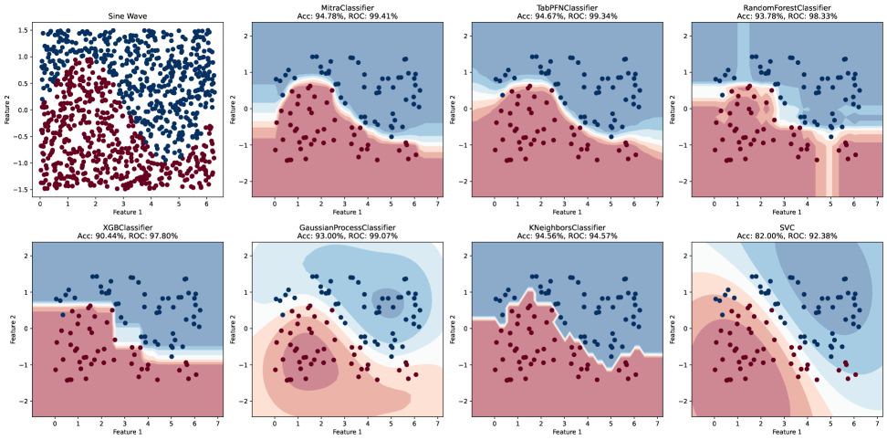

<figcaption>図20: 2D 正弦波データでの決定境界。</figcaption>
</figure>

<figure>

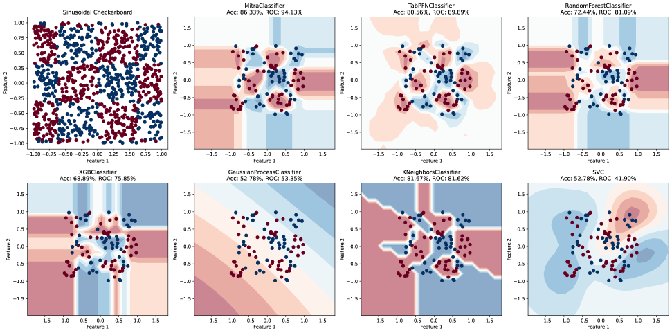

<figcaption>図21: 2D 正弦チェッカーボードデータでの決定境界。Mitra は TabPFNv2 より規則的で断片化の少ない境界を示す。</figcaption>
</figure>

<figure>

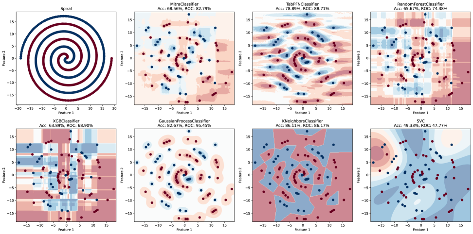

<figcaption>図22: 2D スパイラルデータでの決定境界。</figcaption>
</figure>

<figure>

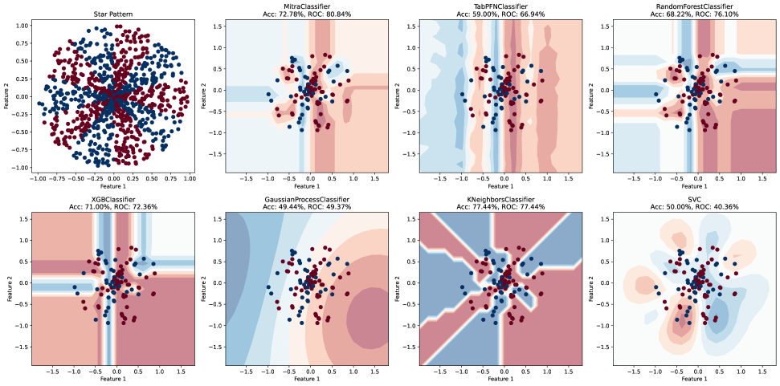

<figcaption>図23: 2D 星形データでの決定境界。</figcaption>
</figure>

<figure>

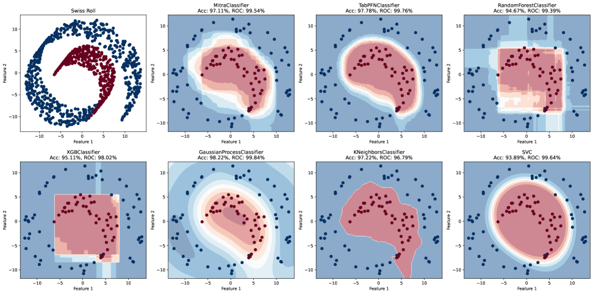

<figcaption>図24: 2D Swiss roll データでの決定境界。</figcaption>
</figure>

## Appendix D Limitations and Future Work（限界と今後の課題）

現在の事前分布の混合は強い性能を示すが、特定の下流タスクや領域に混合重みを適応させるハイパーパラメータ最適化（HPO）でさらに改善できる。

加えて、滑らかな境界を直接モデル化する他の連続事前分布（例: ガウス過程）を混合に組み込み、表形式領域外のタスク（例: 時系列予測）によりよく汎化することを計画する。

最後に、Mitra は全体として競争力ある結果を達成するが、大特徴量回帰タスクで TabPFNv2 を一貫して上回るわけではなく、実世界の高次元設定への汎化のさらなる利得のため、より多くの行数・特徴量数のデータセットへ事前訓練をスケールすることを計画する。

<figure>

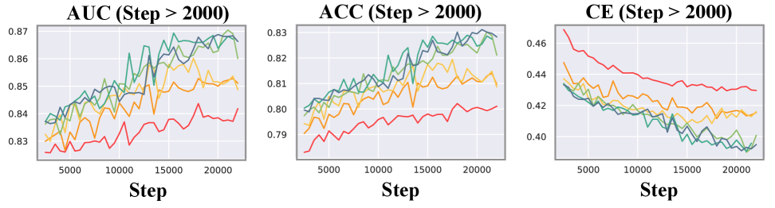

<figcaption>図25: 図5 の大きい版。より明確にするためズーム領域のみを示す。</figcaption>
</figure>
