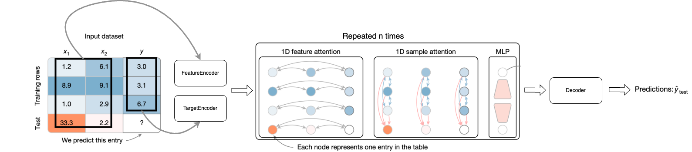
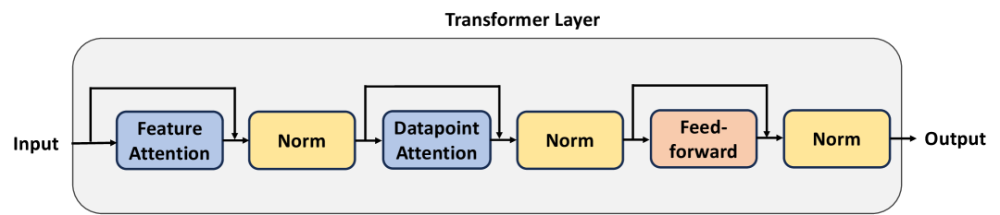
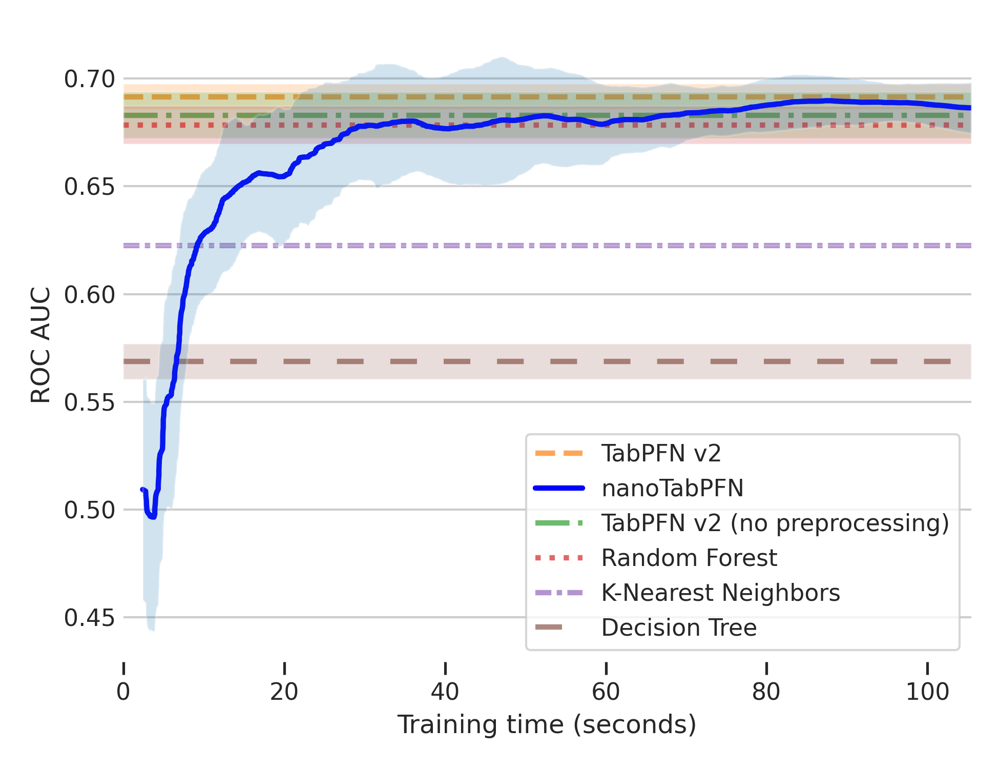
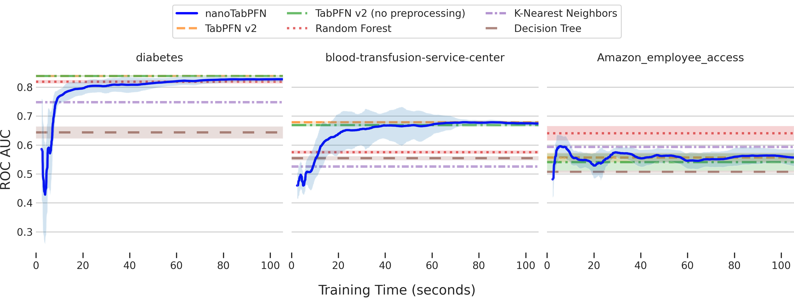

# nanoTabPFN: TabPFN の軽量かつ教育的な再実装

> 原題: nanoTabPFN: A Lightweight and Educational Reimplementation of TabPFN
> 著者: Alexander Pfefferle, Johannes Hog, Lennart Purucker, Frank Hutter（ELLIS Institute Tübingen / University of Freiburg / Prior Labs）
> 出典: arXiv:2511.03634（ar5iv）
> コード: https://github.com/automl/nanoTabPFN

## Abstract（要旨）

TabPFN のような表形式基盤モデルは、表形式データに対する予測的機械学習を革命的に変えてきた。それと同時に、この革命の駆動要因は理解しにくい。既存のオープンソースの表形式基盤モデルは、10,000 行を超えるコードを誇る複雑なパイプラインで実装されており、アーキテクチャのドキュメントやコード品質が不十分である。要するに、その実装は理解しにくく、初心者フレンドリーでなく、新しい実験のために適応させるのが複雑である。我々は nanoTabPFN を導入する。これは TabPFN v2 アーキテクチャの簡略化された軽量実装と、事前生成された訓練データを使用する対応する訓練ループである。nanoTabPFN は、表形式基盤モデルを学生と研究者の両方にとってよりアクセスしやすくする。例えば、小規模データの設定に制限すると、シングル GPU での1分間の事前訓練（TabPFN v2 の事前訓練より 160,000 倍速い）で従来の機械学習ベースラインに匹敵する性能を達成する。この大規模な計算資源の要件の排除は、教育目的で表形式基盤モデルの事前訓練をアクセス可能にする。コードは https://github.com/automl/nanoTabPFN で入手可能。

## 1 Introduction（はじめに）

表形式データの分野は最近、表形式基盤モデルの導入により大きな変化を遂げている。この革命は TabPFN の導入から始まり、TabDPT、TabICL、LimiX、TabPFN v2 のような新しい基盤モデルへと続いた。TabPFN v2 は、新しいアーキテクチャ、新しい訓練データ用事前分布、そして推論パイプラインの多くの小さな工夫を導入することで TabPFN を大幅に改善した。この改善は実装の複雑さの著しい増大を伴い、公式リポジトリは現在 10,000 行を超える Python コードを誇る。このような複雑さは、TabPFN を理解・改変したり、その上に構築したりしたい研究者と学生にとって相当な障壁となる。

我々はこの問題を、500 行未満のコードで TabPFN v2 アーキテクチャと訓練パイプラインの簡略化された軽量実装である nanoTabPFN を導入することで解決する。また、事前生成された訓練データを読み込むためのインターフェースも提供する。我々のコードを使えば、数分以内に小規模な表形式予測タスクのために nanoTabPFN を事前訓練できる。コードの軽量でモジュラーな設計により、ユーザーは表形式基盤モデルに素早く慣れ親しむことができ、事前分布・訓練パイプライン・アーキテクチャに関する研究アイデアの高速な反復が可能になる。我々は、nanoTabPFN が学生たちにとって TFM（表形式基盤モデル）への旅の第一歩として機能し、この研究分野をよりアクセスしやすくすると信じている。

本研究の貢献は以下のとおりである。(1) TabPFN v2 アーキテクチャの簡略化された再実装と詳細な説明を含む我々のリポジトリ自体、および (2) 小規模データの設定においてシングル GPU での1分間の事前訓練で nanoTabPFN が従来の機械学習ベースラインに匹敵する性能を達成することを示す実験。

## 3 nanoTabPFN

nanoTabPFN は2つの部分からなる: モデルアーキテクチャとその訓練ループである。本節では、これら両方の部分の詳細な説明、小さなコード例、そして元の TabPFN v2 実装との違いの説明を提供する。

<figure>

<figcaption>図1: nanoTabPFN のアーキテクチャ。アーキテクチャは、特徴量を正規化し埋め込む FeatureEncoder、ラベルを行の全長まで埋め込みターゲットを埋め込む TargetEncoder、繰り返される TransformerEncoderStack、そして高次元埋め込みを予測へ写像する Decoder から成る。TabPFN v2 の図1を元に改変。</figcaption>
</figure>

### 3.1 Model Architecture（モデルアーキテクチャ）

図1は nanoTabPFN のアーキテクチャを示す。これは4つの部分から構成される。`FeatureEncoder`は特徴量を正規化し、テーブルの特徴量部分の各セルの埋め込みを作成する。`TargetEncoder`は未知のテストターゲットセルを初期化し、テーブルのターゲット列の各セルの埋め込みを作成する。複数の `TransformerEncoderLayer`は、テーブル内のすべてのセルの埋め込みを適応させるメインのトランスフォーマー層である。そして `Decoder`は、未知のテストターゲットの高次元埋め込みを予測へ写像する。

抽象的なレベルでは、図2に示すように、TabPFN v2 は特徴量間の注意（attention）とテーブル上のデータポイント間の注意を交互に適用することで動作する。これを行うためには、まずテーブル内の各セルの埋め込みを作成しなければならない。`FeatureEncoder` を使ってすべての特徴量（`X_train` と `X_test`）の埋め込みを作成する。`FeatureEncoder` は訓練セットの平均と標準偏差に基づいて各特徴量を正規化し、大きすぎるまたは小さすぎる特徴量をクリッピングして外れ値を除去する。そしてテーブル内のスカラー値を高次元の特徴量埋め込みへ写像する線形層を適用する。我々の再実装では、データポイントと特徴量に対して置換不変性を持たせたいので位置埋め込みを使用しないことに注意されたい。`TargetEncoder` はターゲット列の埋め込みを作成する。これは `y_train` をその平均値で拡張して `y_test` のエントリを作成し、その後やはり線形層を適用する。

テーブル内の各セルの埋め込みが得られたので、複数の `TransformerEncoderLayer` を逐次的に適用する。それぞれは、テーブル内のセルの埋め込みに対して双方向注意（bi-attention、特徴量間の注意に続いてデータポイント間の注意）を適用する。データポイント間の注意では、訓練データはそれ自身にのみ注意を向けられ、テストデータには注意を向けられない。一方テストデータは訓練データにのみ注意を向けられる。この制約により、テストデータが注意を向けられないことが保証され、`X_test` へのデータポイントの追加・削除が他のデータポイントの予測を変えないことが保証される。

`TransformerEncoderLayer` は、特徴量注意とデータポイント注意の周りに別々のスキップ接続があり、その後に層正規化（layer normalization）が続く。双方向注意の後、埋め込みはセルごとの MLP（2つの全結合層からなる）によってさらに適応される。これはスキップ接続に囲まれ、層正規化が続く。図2を参照されたい。

アーキテクチャの最後の部分は `Decoder` で、`y_test` セルの埋め込みを入力として受け取り、2層の MLP を適用する。MLP の出力を分類のためのロジット（logit）として扱う。

<figure>

<figcaption>図2: Transformer 層。Transformer 層は、Feature Attention、Datapoint Attention、そして最後の2層 MLP から構成される。各 Attention ブロックと MLP の周りにスキップ接続がある。各スキップ接続の後に Layer Norm が続く。</figcaption>
</figure>

### 3.2 Training（訓練）

スケジューラーなし（scheduler-free）バージョンの AdamW 最適化器（重み減衰なし）を使用して、データローダーが与えるデータでモデルを訓練する、シンプルな訓練ループを提供する。ディスク上の HDF5 形式に事前生成・保存されたデータセットの読み込みをサポートする。ファイルダンプからデータセットを読み込めるようにすることは、アーキテクチャと訓練コードのより速いプロトタイピングを可能にする。事前分布から新しいバッチのデータを生成することはかなり高コストであるため、事前生成されたバージョンを読み込むことで訓練時間が大幅に短縮される。

### 3.3 Code Example（コード例）

図3は、正確に150データポイント・5特徴量・2クラスを持つ 80,000 個の事前生成済みデータセットリストで、3層の nanoTabPFN モデルを事前訓練するための小さなコード例を示す。我々は後に、まさにこのコードに関する結果を報告する。

> 図3: nanoTabPFN の訓練方法を示すコード例（Python）。
> NanoTabPFNModel（embedding_size=96, num_attention_heads=4, mlp_hidden_size=192, num_layers=3, num_outputs=2）を定義し、PriorDumpDataLoader（"300k_150x5_2.h5", num_steps=2500, batch_size=32）で事前生成データを読み込み、train(model, prior, lr=4e-3) で訓練する。

### 3.4 Differences to TabPFN v2（TabPFN v2 との違い）

nanoTabPFN は TabPFN のより理解しやすく軽量なバージョンであることを意図しており、そのためコア機能のみを含む。コードの複雑さを大幅に増加させ、解釈可能性を低下させ、特徴量の置換不変性を損なう「特徴量埋め込みを作成する際に隣接する特徴量のペアを組み合わせる」機能は含まない。また、データポイントを区別するためにテーブルに行ハッシュで埋めた列を追加する機能も含まない。最後に、実装を最小限に保つため、カテゴリ特徴量や欠損値の固有の処理は含まない。カテゴリ特徴量や欠損値を含むデータセットで nanoTabPFN を評価したい場合は、事前に前処理しなければならない。

## 4 Results（結果）

<figure>

<figcaption>図4: 1つのコンシューマ GPU での60秒の事前訓練で、nanoTabPFN は TabArena のサブセットサブサンプルデータセットで、従来の機械学習ベースラインに匹敵する平均 ROC AUC を達成する。</figcaption>
</figure>

我々は、教育目的での強い性能を示しながら、小規模データ設定で nanoTabPFN を評価する。

3層・4アテンションヘッド・埋め込みサイズ96・隠れ層サイズ192という小さなバージョンの nanoTabPFN を、バッチサイズ32で、各々正確に150データポイント・5特徴量・2クラスを持つ 80,000 個の合成生成データセットで、図3のコード例を使って事前訓練した。訓練は単一の NVIDIA GeForce RTX 2080 Ti GPU（11GB VRAM）で1分後に収束したが、TabPFN v2 はこれらの GPU を8台使って2週間かけて事前訓練された。これは 160,000 倍以上高速（14\*24\*60\*8=161,280）であり、参入の障壁を実質的に下げる。

使用する従来のベースラインは、k 近傍法（k-nearest neighbors）・決定木・ランダムフォレストで、いずれもデフォルトの scikit-learn 設定である。TabPFN については、デフォルト設定と、アンサンブリングと前処理を無効にした設定の2つの構成を評価する。後者の設定は nanoTabPFN の機能セットによりよく合致し、周辺のパイプラインではなく訓練モデルの公平な比較を可能にする。実験設定と評価戦略（使用したデータセットを含む）の詳細については付録 A を参照されたい。

図4は訓練時間に対する nanoTabPFN の平均 ROC-AUC を示す。60秒の訓練で nanoTabPFN は全ての従来の機械学習ベースラインより高い ROC AUC に達し、その有効性を実証する。さらに数秒後、prior と評価設定の類似したスケールにより、nanoTabPFN はこの制限された設定で素早く学習し、前処理なしの TabPFN 設定を上回った。データセットごとの結果を付録 B に示す。

## 5 Conclusion（結論）

本論文では、TabPFN v2 アーキテクチャの小さく軽量な実装である nanoTabPFN を導入した。nanoTabPFN は TabPFN のコア機能を含み、その結果、TabPFN リポジトリの 10,000 行以上のコードと比べ、500 行未満の実装になった。これにより、小規模データセットで従来の機械学習アルゴリズムに匹敵する性能のモデルを数分以内に訓練できる。nanoTabPFN の高速な訓練速度は、軽量実装と組み合わさって、研究者と学生が TabPFN の内部動作をより容易に理解し、新しい研究アイデアのより速いプロトタイピングを可能にする。これは、minGPT がそしてその後 nanoGPT が大規模言語モデルの空間でしたことと同じように。

nanoTabPFN は簡潔さと教育的価値に焦点を当てているため、TabPFN v2 の全機能を含んでいない。これは性能上の制限をもたらす。例えば、回帰・欠損値の処理・異なる前処理にわたるアンサンブリングのコードは含まない。これらの制限にもかかわらず、小規模データセットで良い性能を達成できる。我々は意図的に小規模データに焦点を当てている。リポジトリは小規模計算での教育的価値を目指しているからである。最後に、nanoTabPFN のリポジトリはアーキテクチャと訓練のコードを含むが、簡略化された prior の実装を欠いており、これは将来の課題として残す。

結論として、nanoTabPFN により、我々は TFM の分野を民主化し、参入の障壁を下げ、TFM の研究を加速するための重要な第一歩を踏み出す。我々は nanoTabPFN が TFM を教えるための多くの大学コースで使用されることを楽しみにしている。

## Appendix A Detailed Experimental Setup（詳細な実験設定）

#### ハイパーパラメータ最適化

我々は、200個の設定をサンプリングしたランダムサーチに基づいて、prior、モデル、訓練設定を選択した。訓練時間は2分に制限し、1600個のデータセットからなる合成 prior でのパフォーマンスで評価した。訓練データと評価データの生成には TabICL の prior 実装を活用した。事前生成済みデータを使ったベスト設定の再実行では、サンプリングはオンザフライで行われ、ランタイム測定には含まれない。探索空間とベスト設定を表1に示す。§4 での比較のために、設定値を訓練前に丸めた。

**表1**: ハイパーパラメータ探索空間と最適設定

| ハイパーパラメータ | 探索空間 | 最適値 |
| --- | --- | --- |
| lr | [1e-4, 5e-2]（対数スケール） | 0.003892 |
| weight_decay | [1e-9, 1e-4]（対数スケール） | 1.00e-7 |
| effective_batch_size | {8, 16, 32, 64} | 32 |
| num_features | [3, 13] | 4 |
| num_datapoints_max | [50, 300] | 154 |
| num_attention_heads | {2, 4, 8} | 4 |
| embedding_size | {64, 80, 96, 112, 128, 144, 160, 176, 192} | 96 |
| mlp_multiple | {2, 4} | 2 |

#### 実験設定

評価を TabArena の二値分類データセット（欠損値なし・最大10特徴量）に限定し、データポイント数を200にサブサンプリングした。評価には、20回繰り返しの層化5分割交差検証を採用した。累積訓練時間のみを計測し、各ステップでの評価時間は除外した。ベースラインは scikit-learn version 1.6.1 と tabpfn version 2.2.1 を使用した。

## Appendix B Additional Results（追加結果）

図5は §4 の事前訓練中の個々の評価データセットでの ROC AUC を示す。

<figure>

<figcaption>図5: データセットごとの結果。§4 の事前訓練中の個々の評価データセットでの ROC AUC（60秒以内に全データセットで従来 ML ベースラインに達するか上回る）。</figcaption>
</figure>
