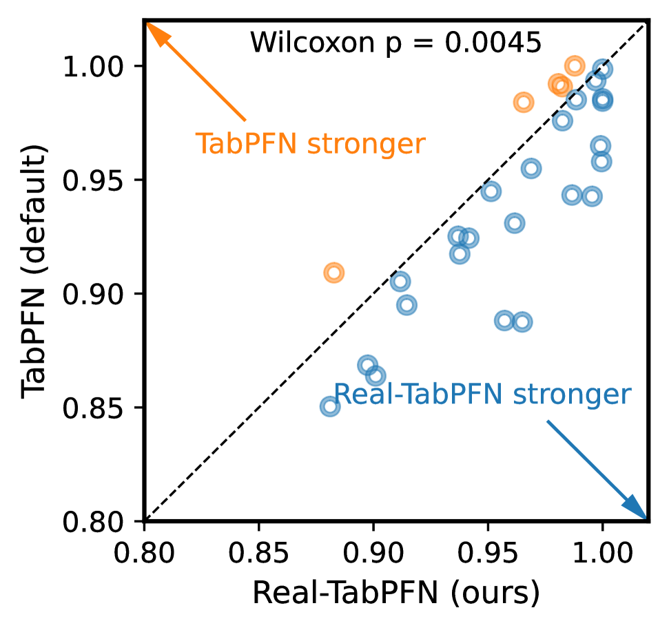
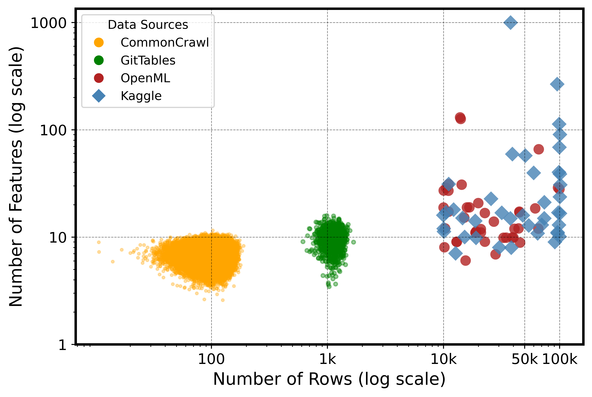
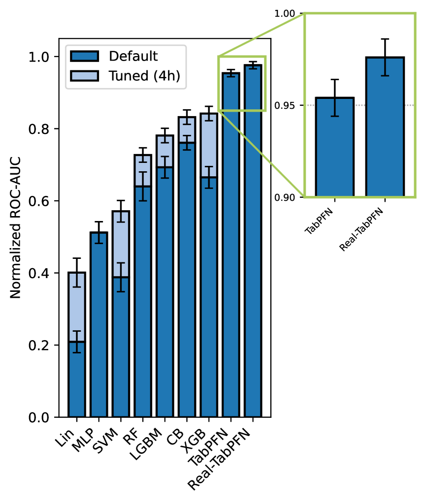
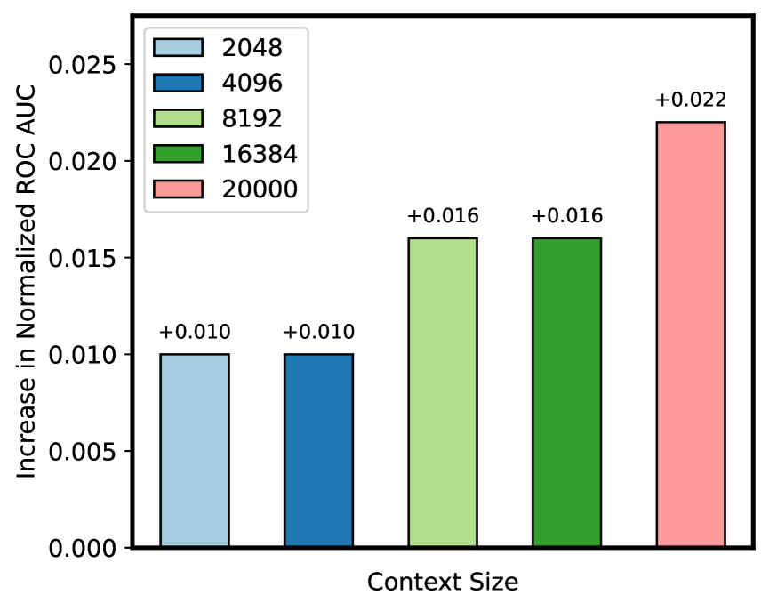
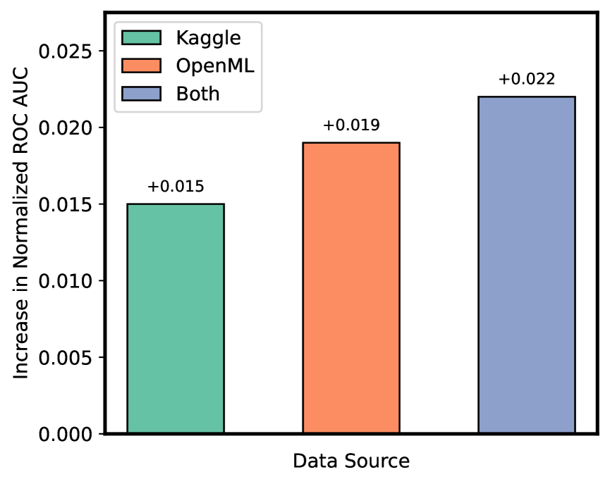
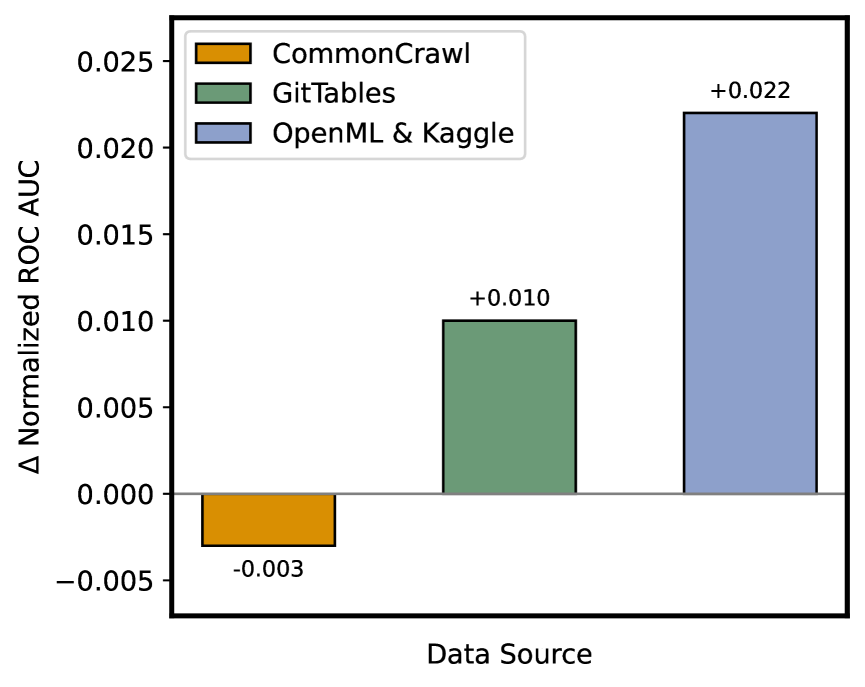

# Real-TabPFN: 実世界データでの継続事前訓練による表形式基盤モデルの改善

> 原題: Real-TabPFN: Improving Tabular Foundation Models via Continued Pre-training With Real-World Data
> 著者: Anurag Garg, Muhammad Ali, Noah Hollmann, Lennart Purucker, Samuel Müller, Frank Hutter（University of Freiburg / Prior Labs）
> 出典: arXiv:2507.03971

> 注: 本翻訳は **本文（§1, §3〜§6）のみ**を一文ずつ訳出する（ユーザーは appendix 指定なし）。Acknowledgements・References・Appendix A〜C は対象外。原典は ar5iv クリッピングで §2 が含まれていない。図は ar5iv 原典から `raw/assets/2025-real-tabpfn/` にローカル保存して該当位置に引用する。文献参照記号は省略。

## Abstract（要旨）

TabPFN のような表形式データの基盤モデルは、合成データのみで事前訓練されたとき、小規模データセットで強い性能を達成する。

我々は、この性能が標的を絞った継続事前訓練（continued pre-training）の段階によって大きく押し上げられることを示す。

具体的に、大きな実世界データセットの小さく厳選したコレクションを継続事前訓練に活用することが、CommonCrawl や GitTables のようなより広範で潜在的にノイズの多いコーパスを使うより、優れた下流予測精度をもたらすことを実証する。

得られたモデル Real-TabPFN は、OpenML AutoML Benchmark の 29 データセットで実質的な性能向上を達成する。

## 1 Introduction（はじめに）

<figure>

<figcaption>図1: OpenML AutoML Benchmark の 29 データセットでの TabPFN（default）と Real-TabPFN（本手法）のデータセットごとの正規化 ROC 比較。Wilcoxon p は両側ウィルコクソン符号順位検定の p 値。</figcaption>
</figure>

最近まで、XGBoost や CatBoost のような伝統的な木ベースアルゴリズムが、表形式予測タスクでニューラルネットワークを一貫して上回ってきた。しかし TabPFNv2 が最近、小規模データセット（最大 10,000 サンプル・500 特徴量）で改善された性能を実証し、表形式データの深層学習を大きく前進させた。

TabPFNv2 は強い平均性能をもたらすが、依然として普遍的に最良というわけではない。多くのデータセットはよく調整された木アンサンブルや、TabPFNv2 自体の入念なハイパーパラメータ探索でよりよく扱われる。TabPFNv2 モデルをさらに改善するのは容易でない。表形式問題に対する広範な事前分布を近似する 1 億超の合成テーブルで既に徹底的に訓練されているからである。しかし、わずかな精度向上でも、病院の再入院の減少やより正確な信用リスクスコアリング（表形式データが支配的な領域）といった具体的な利益につながりうる。

我々は、OpenML と Kaggle から注意深く選んだ実世界テーブルの集合で事前訓練を継続することで、TabPFNv2 の文脈内学習を強化する。得られたモデル Real-TabPFN は、OpenML AutoML Benchmark の分類タスクで TabPFNv2 を一貫して上回る（図 1）。実際、Real-TabPFN は表形式分類のための、デフォルト TabPFNv2 モデルよりも強い既製（off-the-shelf）ベースラインとして機能する。

我々の貢献は:
- 表形式基盤モデルの事前訓練中に合成データと併せて実世界データセットを使うことが文脈内学習性能を押し上げることを経験的に示し、有望な研究方向を開く。
- 新しいモデル Real-TabPFN とその公開重み。実世界データでの継続事前訓練で得た TabPFNv2 の拡張である。その文脈内学習は 29 の小規模表形式データセットで前身を上回る。

## 3 Pre-training and Evaluation Data（事前訓練・評価データ）

継続事前訓練を研究するため、継続事前訓練用と評価用のデータを決める必要があった。

**評価データ**　TabPFNv2 で先行研究が用いたのと同じデータセットを採用して我々の手法を評価する。OpenML AutoML Benchmark の同じ 29 データセットを使う（付録 B）。全データセットは最大 10,000 サンプル・500 特徴量を含む。

**継続事前訓練データ**　ImageNet・COCO・FineWeb・C4 のような注意深く厳選されたデータセットが多く利用可能な自然言語処理やコンピュータビジョンの領域と異なり、表形式学習向けの比較的高品質な資源は依然乏しい。

<figure>

<figcaption>図2: さまざまな出典のデータセットサイズ（行数・特徴量数）の分布。CommonCrawl や GitTable のような広範なコーパスでは小さいデータセットが多いのと対照的に、OpenML と Kaggle はより大きいデータセットを持つ。</figcaption>
</figure>

最近の取り組みがこのギャップに対処しようとしてきた。Web Table Corpus・TabLib・GitTables などである。これらを超え、研究者は合成データセットを生成するか、UCI・OpenML・Kaggle のような既存リポジトリに頼る。我々は後者を採り、OpenML と Kaggle から手作業で 71 個の高品質データセットを厳選する。図 2 は異なる出典のデータセットの特徴量数・行数の分布を示す。継続事前訓練に使った厳選データセットは付録 A に列挙する。71 データセットに最小限の前処理を適用する。カテゴリ特徴は Scikit-learn の OrdinalEncoder でエンコードし、ターゲット変数が 10 クラスを超える場合は最も多い 9 クラスを保持し残りを単一の 10 番目のクラスに統合する。

### Data Contamination（データ汚染）

訓練集合と評価集合の間のデータ汚染を注意深く避けた。多層のフィルタリングプロセスを実装した。(1) 全評価データセットがより少ないサンプルなので、10,000 サンプルを超えるデータセットのみ選ぶ。(2) データセット ID・名前・形状を相互参照し潜在的重複を特定。(3) データセット間で特徴量名を比較し類似/同一のデータ構造を検出。(4) 行と列のハッシュを生成し粒度の細かいレベルで潜在的なデータ重複を特定。(5) メタデータを手動検査し、訓練・評価データセットが共通の元データセットやそのサブサンプル版を共有しないことを保証。これらの基準を満たさないデータセットは事前訓練データから除外する。

## 4 Method: Continued Pre-training of TabPFN（手法: TabPFN の継続事前訓練）

我々の手法は、純粋に合成の訓練（例: TabPFN）と純粋に実データの訓練（例: TabDPT）を、両パラダイムの補完的な強みを活用して橋渡しする。

具体的に *2 段アプローチ* を採る。段 1 は元の TabPFNv2 チェックポイント（先行研究が大きく多様な合成テーブル集合で事前訓練したもの）に依拠し、これを出発点とする。段 2 は厳選した異質な実世界テーブルのコレクションのみで事前訓練を継続する。このアプローチは、合成サンプルと実サンプルを同時にモデルに与える *混合（mixed）* 訓練と対照的である。2 段アプローチを選んだのは、適用が容易で強い既存の合成ベースモデルの上に直接構築できるからである。

継続事前訓練は言語モデルで顕著な成功を示してきたが、表形式基盤モデルでの潜在能力はほぼ未探索のままである。狭いタスク固有データでなく多様な実データセットで事前訓練することで、我々のアプローチはクロスドメイン適応性を保ちつつ汎化を改善する。

ロバストな継続事前訓練を可能にするため、元の TabPFNv2 アーキテクチャを保持し、線形ウォームアップとそれに続くコサインアニーリングスケジュールを伴う AdamW オプティマイザで、削減した学習率 $3\times 10^{-7}$ で訓練した。

さらに、L2-Starting-Point（L2-SP）への距離を罰する正則化項を事前訓練目的に加えた。これは初期の事前訓練済み重みからの大きな逸脱を罰し、破滅的忘却（catastrophic forgetting）の緩和に使われる。より正確には、継続事前訓練が始まる事前訓練済みベースモデルのパラメータベクトルを $\mathbf{w}^{0}$ とする。L2-SP ペナルティはモデルパラメータをこの初期ベクトルへ向けて正則化する。形式的には

$$
\Omega(\mathbf{w})=\frac{\alpha}{2}\left\lVert\mathbf{w}-\mathbf{w}^{0}\right\rVert_{2}^{2},
$$

ここで $\alpha$ は正則化ペナルティの強さを制御し、$\lVert\cdot\rVert_{2}$ は L2 ノルム。この L2 ノルムを交差エントロピー損失に加え $\mathcal{L}=\mathcal{L}_{\text{CE}}+\Omega(\mathbf{w})$ を最終的な事前訓練目的とする。正則化強度 $\alpha$ は 0.003 を用いた。

バッチサイズ 1（すなわち単一データセット）で 20,000 ステップ継続事前訓練した。バッチサイズ 1 は、パディングや切り詰めなしに実世界データセットの可変な特徴量次元を自然に扱える単純なアプローチである。決定的に、これは各データセットの訓練文脈を最大 20,000 サンプルまで（主に GPU メモリで制限される、バッチ制約でなく）最大化することも可能にした。この上限より大きいデータセットでは最大 20,000 行を一様にサンプリングする。バッチごとに、順伝播のためデータを 60% の文脈（TabPFN の訓練データ）と 40% のクエリ（TabPFN のテストデータ）に分割する。訓練は単一の Nvidia RTX 2080 Ti GPU で行った。GPU メモリ制限内に収めるため、各データセットを総計 40 万セルに制限し、属性が多すぎるデータセットではサンプル数を相応に調整した。

## 5 Experiments and Results（実験と結果）

先行研究の評価プロトコルに従い、データセットごとに 10 分割交差検証で Real-TabPFN を評価する。さらに追加ベースラインの性能値は先行研究の報告結果を再利用する。ベースラインは 4 時間の時間予算で 5 分割交差検証のランダム探索により ROC-AUC で調整された。Real-TabPFN と TabPFNv2 は文脈内学習性能に焦点を当てるためハイパーパラメータ調整なしで我々が自ら実行する。

図 1 は TabPFNv2 と Real-TabPFN をデータセットごとに比較する。Real-TabPFN が TabPFNv2 を有意に上回ることを観察する。加えて図 3 は、Real-TabPFN が平均正規化 ROC-AUC を 0.954 から 0.976 に改善し、TabPFNv2 と同様に平均で全ベースラインを自然に上回ることを示す。全手法の各種追加性能指標の表を付録 C に提供する。

<figure>

<figcaption>図3: AutoMLBenchmark での、Real-TabPFN とベースラインのデフォルト・調整済み版すべての平均正規化 ROC AUC 比較。スコアはデータセットごとに正規化（全ベースラインに対し 1.0 が最良・0.0 が最悪）。</figcaption>
</figure>

<figure>

<figcaption>図4: 継続事前訓練の文脈が大きくなるにつれての正規化 ROC AUC の増加。利得は、文脈サイズ 2,048 で合成事前訓練したベース TabPFNv2 モデルの性能に対して示す。</figcaption>
</figure>

<figure>

<figcaption>図5: 訓練データ源を変えたときの正規化 ROC AUC の増加。利得は合成事前訓練したベース TabPFNv2 モデルに対して示す。</figcaption>
</figure>

<figure>

<figcaption>図6: 訓練データ源を変えたときの正規化 ROC AUC の変化。変化は合成事前訓練したベース TabPFNv2 モデルに対して示す。</figcaption>
</figure>

### Effect of Context Size（文脈サイズの効果）

継続事前訓練中のデータセットサイズの影響を、$2{,}048$ から $20{,}000$ サンプル（GPU メモリ上限）までのデータセットで事前訓練して調べる。図 4 は下流精度が大きい文脈サイズとともに増加することを示す。

### OpenML vs Kaggle

最終的に厳選した 71 訓練データのモデル性能への影響を理解するため、3 コーパス（(1) Kaggle のみ、(2) OpenML のみ、(3) 両者の和集合）で継続事前訓練を繰り返した。図 5 のように、OpenML のみで $+0.019$、Kaggle のみで $+0.015$ の利得。両者の組合せが最強の押し上げ $+0.022$ をもたらし、異質な出典が補完的な教師信号を提供することを確認する。OpenML データセットが個別にはわずかに良い性能を与える一方、両データ源の組合せが最良のモデルを生むことを示す。

### Effect of Training Data Source（訓練データ源の効果）

異なる訓練データ源の影響を評価するため、2 つの代替コーパス（(1) CommonCrawl、(2) GitTables）も試した。ロジスティック回帰とランダムフォレストでデータセットを評価しノイズの多いものを除去する積極的フィルタリングを適用し、続いてデータ汚染パイプライン（§3）を適用した。これにより約 97,000 の CommonCrawl と 658 の GitTables データセットが残った。

図 6 はこれら 2 コーパスでの性能を比較する。CommonCrawl（平均でデータセットあたり約 100 データ点・7 特徴量。図 2 参照）で訓練したモデルは性能低下を示す。主に小さいデータセットサイズが継続事前訓練段階でモデルに十分恩恵を与えなかったため、最終的に性能低下に至った。

対照的に、GitTables（平均で約 1000 データ点・9 特徴量）は性能改善につながる。最大の性能改善は、手作業で厳選した OpenML・Kaggle データセット（1 万〜10 万データ点・平均で数十特徴量）で達成される。データ汚染を効果的に防ぐため意図的に OpenML・Kaggle の小さく厳選した集合を選んだので、GitTables や CommonCrawl データセットと組み合わせなかった。

## 6 Conclusion and Future Work（結論と今後の課題）

我々は、厳選した実世界の表形式データでの TabPFNv2 の継続事前訓練が、より強いデフォルトモデル Real-TabPFN を生むことを示す（オープンソース化予定）。合成から実への gap を橋渡しし、Real-TabPFN はほとんどのデータセットでデフォルト TabPFNv2 を上回り、評価した全データセットで他のすべての最先端ベースラインを上回る。追加実験も同じメッセージを伝える。継続事前訓練中に *より多くの文脈* ——時間的（より長い窓）であれ統計的（より大きいデータセットの豊かな混合）であれ——を見ることが、より大きな改善を生む。
