# TabICL: 大規模データでの文脈内学習のための表形式基盤モデル

> 原題: TabICL: A Tabular Foundation Model for In-Context Learning on Large Data
> 著者: Jingang Qu, David Holzmüller, Gaël Varoquaux, Marine Le Morvan（Inria, Soda チーム）
> 出典: arXiv:2502.05564（ICML 2025）

> 注: 本翻訳は **本文 §1〜6 ＋ 付録 A〜E を含む**（ユーザー指示で appendix も対象）。Acknowledgements（謝辞）と References（参考文献一覧）は対象外。図は ar5iv 原典から `raw/assets/2025-tabicl/` にローカル保存して該当位置に引用する。文献参照記号は省略。

## Abstract（要旨）

表形式データにおける勾配ブースティング決定木の長年の優位は、文脈内学習（In-Context Learning, ICL）を用いる表形式基盤モデルによって今や挑戦を受けている。ICL とは、訓練データをテストデータの文脈として設定し、パラメータ更新なしに 1 順伝播で予測することである。

ごく最近の TabPFNv2 基盤モデル（2025）は最大 1 万サンプルの表で優れるが、その列方向・行方向アテンションの交互適用は、大きな訓練集合の扱いを計算的に法外にする。では、ICL を効果的にスケールさせ、より大きな表で利益を出せるのか。

我々は TabICL を導入する。分類のための表形式基盤モデルで、最大 6 万サンプルの合成データセットで事前訓練され、手頃な資源で 50 万サンプルを扱える。これは新しい 2 段アーキテクチャ——行の固定次元埋め込みを構築する列→行アテンション機構と、それに続く効率的 ICL のための Transformer——によって可能になる。

TALENT ベンチマークの 200 分類データセットにわたり、TabICL は TabPFNv2 と同等でありながら系統的に高速（最大 10 倍）で、他のすべての手法を有意に上回る。1 万サンプル超の 56 データセットでは TabICL が TabPFNv2 と CatBoost の両方を上回り、大規模データに対する ICL の潜在能力を示す。

推論コードと事前訓練済みモデルは [https://github.com/soda-inria/tabicl](https://github.com/soda-inria/tabicl) で公開。

## 1 Introduction（はじめに）

行と列で構造化された表形式データは、医療・金融など産業で広く使われ、表形式分類問題が多くの実世界応用を支える。他のデータモダリティでは、基盤モデル（特に大規模言語モデル, LLM）が新タスクや few-shot 学習の能力を大きく前進させた。これは主にその顕著な文脈内学習（ICL）能力——パラメータ更新なしにプロンプト中のパターンを捉える——による。この成功と表の遍在性が、表形式基盤モデルへの関心を喚起した。

LLM は主に自然言語をモデル化するよう設計されているが、表形式データ向けにファインチューンする試みも現れた。これらは表のシリアライゼーション（行をテキスト/文に変換しトークン化する処理）に依拠する。ある研究は Llama 3-8B をシリアライズした表のコーパスでファインチューンし、few-shot 設定で木ベースモデルに対する有効性を示した。しかしこうした言語モデルベースの手法は、大きなシリアライズ表を収める文脈窓のサイズに制約される（例: 最大 32 または 64 ショット）。さらに、LLM が数値を効果的に扱えるかは不明である。最後に、LLM が多くの人気データセットで事前訓練されている証拠があるため、表形式予測タスクでの評価は慎重に行うべきである。

著しく異なるアプローチとして、TabPFN が導入された。これは合成表形式データセットのみで事前訓練された、分類タスクのための Transformer ベースの表形式基盤モデルである。TabPFN の鍵となる特徴は表での ICL で、トークン化を不要にし、最大 1K サンプル・100 特徴量の小さな表を効率的に扱える。ごく最近、同じ著者が TabPFNv2 を導入した。改良版で、最大 1 万サンプル・500 特徴量の小〜中規模データセットで木ベース・ニューラルネット競合を有意に上回る。表形式 ICL の大きな可能性が新しい研究の流れを生んだが（§2.3 参照）、自己アテンションの二次コストがそれらすべてのスケーラビリティの脅威である。TabPFNv2 は列方向と行方向のアテンションを交互に行う双方向アテンション機構を用いるが、これが大規模データセットでのスケーラビリティを制限する。産業データセットが数百万サンプルを含みうる実世界シナリオでは、TabPFNv2 の高い計算・メモリ需要が実用性を妨げる。

本論文で我々は TabICL を導入する。分類タスク向けにスケーラブルで効率的に設計された表形式基盤モデルである。最大 6 万サンプルの合成データセットで事前訓練され、最大 50 万サンプル・500 特徴量を効果的に扱え、表に対する ICL のスケーラビリティ境界を大幅に拡張し、表形式基盤モデルの基礎技術として確立する。

任意サイズの表をアーキテクチャ的変更で扱うため、TabICL は個々のセルを基本要素として扱う。各列は特徴固有の分布と意味を捉えるセル値の集合として、各行は各サンプルの全体像を与える相互依存的な特徴値から成るとみなす。TabICL は表形式データの効率的 ICL を達成するため 2 段アーキテクチャを用いる。第一に、行（ターゲットラベルを除く）を密なベクトル埋め込みにエンコードする。各埋め込みは表全体の情報を捉えられるよう設計される。この段は列次元を効果的に潰し、後続 ICL の計算量とメモリフットプリントを大幅に削減する。第二に、これらのコンパクトだが情報豊富な埋め込みを対応するラベルと結合し、ICL を行う。したがって TabICL の核心は第 1 段の埋め込み戦略にあり、行を意味的に豊かな埋め込みに変換する。

テキスト中の語句はしばしば明確な意味を持ち、情報的な埋め込みと自然に結びつく。しかし表形式データはそのような固有構造を欠き、セル値は列名やデータ型のようなメタデータなしでは曖昧になりうる。この課題に対処するため、TabICL は (1) 各列内の統計的規則性を捉える分布認識の列ごと特徴量埋め込みと、(2) 列間の依存をモデル化するアテンションベースの行ごと相互作用を組み合わせた、よく制約された埋め込み戦略を採用し、表形式データの意味的に根拠ある表現を構築する。

特徴量埋め込みは、各特徴についてスカラーのセル値を高次元ベクトルに写像することで、モデル性能の重要因子となる。特徴はしばしば大きく異なる分布を示すため、従来手法は典型的にパラメータ共有のない特徴固有の埋め込みモジュールを使うが、これは表間転移性を制限する。本研究では特徴量埋め込みを **集合入力（set-input）問題** として再定式化する。すなわち、置換不変なセル値の集合を入力とし、出力は対応する一対一の埋め込みである。これを達成するため Set Transformer——効率的な誘導自己アテンションで集合を処理するよう設計されたモデル——を活用する。これは極値の特定や一意要素の数え上げのようなタスクで優れ、各列内の分布関連メタデータの発見と、異なるデータ型の特徴の区別能力を高める。

特徴量埋め込みは次に別の Transformer で行ごとに処理され、学習可能な [CLS] トークンを使って単一ベクトルに集約される。これは複雑な特徴量相互作用を効果的に捉え、可変な特徴量数に対応する。全体として、この列→行のアテンションベース埋め込みは、表の列/行の固有構造を強い帰納バイアスとして活用し、全セルにわたる効率的な疎アテンションを達成する。最後に、得られた行ごと埋め込みが ICL のための最終 Transformer で扱われる。

上記の革新に加え、いくつかの改善を導入する。(1) 木ベースモデルの帰納バイアスを取り込むため、TabPFN の事前訓練合成データセットに新しい木ベースのデータ生成モデルを追加して精緻化する。(2) 事前訓練データセットのサイズを 1K から 60K へ徐々にスケールするカリキュラム学習を採用する。(3) 10 クラスを超える分類問題（事前訓練の上限）に対処するため、階層的分類を用い、$\leq$ 10 クラスの部分問題の階層構造に分解する。タスク数の増加は TabICL の高速な ICL ベース予測で大きく相殺される。

貢献の要約: (1) 任意のサンプル数・特徴量数・クラス数に対応できる、分類タスク向けの新しいスケーラブルな表形式基盤モデル TabICL を提示する。実際、約 20GB の GPU メモリで最大 50 万サンプル・500 特徴量を扱う。(2) 多様な性質の特徴を統一的に扱う分布認識の特徴量埋め込みを導入し、表間転移性の新たな可能性を開く。(3) TabICL は 1 順伝播でタスクを行い、ハイパーパラメータ調整を要する表形式手法より桁違いに高速でありながら、多くの場合より良い性能を示す。TabPFNv2 より一貫して高速（最大 10 倍）で、効率利得はデータセットサイズが大きいほど増す。(4) TALENT ベンチマーク（様々な領域・サイズの 200 分類データセット、最大 15 万サンプル）で評価する。TabICL は中規模で TabPFNv2 と同等、他のすべての手法を有意に上回る。1 万サンプル超の 55 の大規模データセットでは TabPFNv2 と CatBoost の両方を上回る。

## 2 Related Work（関連研究）

<figure>

<figcaption>図1: TabICL のアーキテクチャ概観。まず列ごと埋め込みが入力表の各セルを Transformer TF_col（§3.2）で埋め込みベクトルに変換し E を生む。次に行ごと相互作用が 4 つの学習可能 [CLS] トークンを前置し、回転位置エンコーディングを適用し、Transformer TF_row で行ごとに処理。[CLS] 出力の連結が最終的な行ごと埋め込み H を与える。最後にデータセット単位 ICL が H に作用し、Transformer TF_icl で 1 順伝播でテスト集合のラベルを予測する。TabICL は計 3 つの Transformer から成る。</figcaption>
</figure>

### 2.1 Foundation Models and In-Context Learning（基盤モデルと文脈内学習）

近年、深層学習は基盤モデルの出現で変革された。基盤モデルは大規模で多様なデータセットで事前訓練され、下流タスクの汎用バックボーンとして機能する。これら Transformer ベースモデルは文脈内学習（ICL）を可能にする。入力–出力ペアを含むプロンプトを解析してタスクを行い、明示的な訓練やパラメータ更新を要しない。ICL はその場の推論の一形態として働く。ICL の基底メカニズムは依然として不明瞭で、暗黙的ベイズ推論・勾配降下最適化・アルゴリズム学習といった説明が主流である。

### 2.2 Tabular Deep Learning Models（表形式深層学習モデル）

CatBoost や XGBoost のような勾配ブースティング決定木（GBDT）は長く表形式領域を支配してきた。しかし表形式 DL モデルを開発する取り組みが増えている。最近の研究は GBDT と表形式 DL モデルの性能差が縮小していることを示す。

表形式 DL が改善するにつれ、表間転移性が重要トピックとして浮上する。この方向の注目すべき取り組みに XTab や CARTE があり、転移可能な構成要素（典型的に共有可能なバックボーン）と、新タスクごとにファインチューンを要するデータセット固有の構成要素を組み込む。表形式基盤モデルの登場は表間学習に新たな可能性をもたらし、表をまたぐ大規模事前訓練と転移学習への道を開く。

### 2.3 TabPFN and its Offsprings（TabPFN とその子孫）

TabPFN（Tabular Prior-Data Fitted Network の略）は表形式基盤モデルである。広範な合成データセットで事前訓練され、ICL を通じて表形式分類タスクを行う Transformer である。TabPFN は ICL を、合成データセットにわたる近似事後予測分布としてベイズ的に解釈する。スケーラビリティ向上を狙う変種がいくつかある。プロンプトチューニングで訓練データをコンパクトな学習文脈に蒸留するもの、テストサンプルごとに最も関連する訓練データ部分集合を選ぶもの、二次アテンションを線形アテンションで置き換えるもの、ICL ベースのハイパーネットで小さなタスク固有ニューラルネットを生成するもの。しかしほとんどの変種は TabPFN を構造的に改善せず、文脈内サンプルを減らすプロンプトエンジニアリングとして働く。

他のアプローチは事前訓練データの品質改善を試みる。木ベース合成データセットを取り込む TabForestPFN や、実世界データセットをキュレートして使う TabDPT など。

ごく最近（2025年1月）TabPFNv2 が公開され、予測性能とスケーラビリティの両面で TabPFN を大きく改善した。我々の貢献モデル TabICL は、TabPFNv2 と同等の性能を、よりスケーラブルかつ計算効率的に達成する。

## 3 The TabICL Architecture（TabICL のアーキテクチャ）

入力空間 $\mathcal{X}\in\mathbb{R}^{m}$ とターゲット空間 $\mathcal{Y}\in[1,\cdots,C]$ を持つ表形式分類タスクを考える。入力–出力ペアの訓練データセット $\mathcal{D}_{\text{train}}=\{(x_{\text{train}}^{(i)},y_{\text{train}}^{(i)})\}_{i=1}^{n_{\text{tr}}}$ とテストサンプル $X_{\text{test}}=\{x_{\text{test}}^{(i)}\}_{i=1}^{n_{\text{te}}}$ が与えられたとき、目標はクラス確率 $p(\cdot|x_{\text{test}},\mathcal{D}_{\text{train}})$ を予測することである。

<figure>

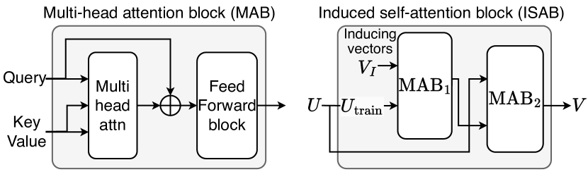

<figcaption>図2(a): 効率的な誘導自己アテンション（ISAB）。誘導ベクトルを介して自己アテンションの計算量を O(n) に削減しつつ、二段アテンションで大域情報を捉える。</figcaption>
</figure>

### 3.1 High-level Structure: Embedding then ICL（高レベル構造: 埋め込みののち ICL）

TabICL は 2 つの主要モジュールから成る。表形式埋め込みモジュールに続く ICL モジュールで、ラベルは ICL モジュールでのみ用いられる。表形式埋め込みモジュールは、列–行の固有構造を考慮しつつ表の行を密なベクトル表現にエンコードする。これは 2 成分から成る。個々の列の統計的特性を捉える分布認識の列ごと埋め込みと、特徴間の依存をモデル化する文脈認識の行ごと相互作用である。ICL モジュールはその後、訓練・テスト埋め込みを Transformer で処理し、1 順伝播でテスト集合全体の予測を可能にする。全体アーキテクチャは図 1 に描かれている。

### 3.2 Distribution-aware Column-wise Embedding（分布認識の列ごと埋め込み）

列ごと埋め込み（特徴量埋め込み）は、列 $c_{j}\in\mathbb{R}^{n}$ の各スカラーセルを $d$ 次元埋め込みに写像する。各列に別々の線形層を割り当てる典型的なアプローチと異なり、我々は共有可能な Set Transformer $\text{TF}_{\text{col}}$ で全列を埋め込む。次のように定式化される（各セルに固有の重みとバイアスが割り当てられる）。

$$
W,B=\text{TF}_{\text{col}}(c_{j})\in\mathbb{R}^{n\times d},\qquad e_{j}=W\odot c_{j}+B\in\mathbb{R}^{n\times d}
$$

本質的に、特徴量埋め込みは集合入力問題として枠組み化でき、$\text{TF}_{\text{col}}$ は置換不変なセル値集合を入力に取り分布認識の重みとバイアスを生成するハイパーネットとして機能する。

$\text{TF}_{\text{col}}$ 内部の演算は次のように展開する。列 $c$（簡単のため添字 $j$ を省く）は線形層で $d$ 次元空間（$d=128$）に射影され、$\text{MAB}_1$ と $\text{MAB}_2$ から成る ISAB で処理され、線形層を通って $W, B$ を生成する。

$$
U=\text{Lin}(c)\in\mathbb{R}^{n\times d},\quad M=\text{MAB}_1(V_I,U_{\text{train}},U_{\text{train}})\in\mathbb{R}^{k\times d},\quad V=\text{MAB}_2(U,M,M)\in\mathbb{R}^{n\times d},\quad W,B=\text{Lin}(V)
$$

ここで Lin は線形層、MAB はマルチヘッドアテンションブロック、ISAB は誘導自己アテンションブロック（図 2(a)）。

ISAB は二段アテンション機構で大域情報を捉える能力を保ちつつ自己アテンションの計算量を $\mathcal{O}(n)$ に削減する。$\text{MAB}_1$ では誘導ベクトル $V_I$ がクエリとして訓練サンプル $U_{\text{train}}$ にアテンションして誘導表現 $M$ を生成する。$\text{MAB}_2$ では入力 $U$（訓練・テスト両方）がクエリとして $M$ にアテンションし、大域情報が全訓練サンプルに伝播する。誘導ベクトル $k=128$、MAB で 4 アテンションヘッド、3 つの ISAB ブロックを用いる。決定的に、$\text{MAB}_1$ ではキー/値として訓練サンプルのみが働く。これにより ISAB の出力が訓練データのみに依存し、データリークを防ぐ。

<figure>

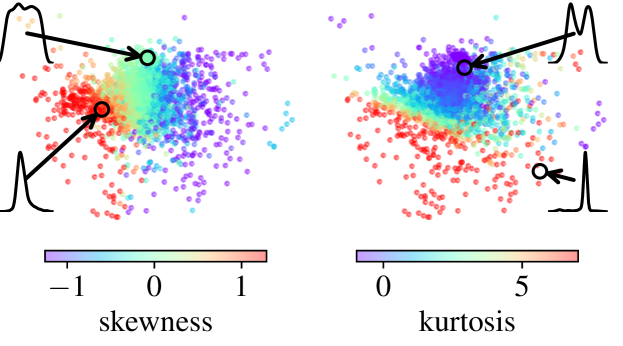

<figcaption>図3: 学習された列ごと埋め込みは特徴量分布の統計的性質をエンコードする。合成データセットの 4 万特徴について、これらの埋め込みを第 1・第 2 主成分に射影して可視化。歪度・尖度の似た列がクラスタ化する。</figcaption>
</figure>

学習された特徴量埋め込みが捉える情報の洞察を得るため、$\text{TF}_{\text{col}}$ の最終 ISAB ブロックが生む $M\in\mathbb{R}^{k\times d}$ を可視化する。$M$ を第 1 次元方向に和を取って（全誘導ベクトルの誘導表現を集約して）列ごとに単一ベクトルにまとめ、主成分分析を適用する。図 3 は、似た歪度（resp. 尖度）の列がクラスタ化する傾向を示す。すなわち非対称分布が対称分布と区別され（左）、重い裾の分布が軽い裾と区別される。これは $\text{TF}_{\text{col}}$ が分布的性質を構造的にエンコードし、列内のセルがその統計的役割（min, max, mean, mode など）を反映して埋め込まれている可能性を示唆する。したがって学習された特徴量埋め込みは固有の分布的性質に基づいて特徴を区別し、事実上の特徴量識別子として機能する。これは意味的な列名に依存する手法や特徴量識別子ベクトルを学習する手法と対照的である。

### 3.3 Context-aware Row-wise Interaction（文脈認識の行ごと相互作用）

すべての特徴量埋め込み $E=[e_{1},\cdots,e_{m}]\in\mathbb{R}^{n\times m\times d}$ を得た後、8 アテンションヘッドの 3 層 Transformer $\text{TF}_{\text{row}}$ が特徴間相互作用のため $E$ を処理する。埋め込みを単一ベクトルに集約するため、4 つの学習可能 [CLS] トークンが $E$ の各行に前置され、その最終出力が連結される。4 トークンを使い、後続 ICL のため計 $4\times d=512$ の埋め込みサイズでより豊かな表現を提供しつつ、$\text{TF}_{\text{col}}$ と $\text{TF}_{\text{row}}$ ではメモリ消費削減のため低い埋め込みサイズ（$d=128$）を保つ。

表形式データの定義的特徴は、列に自然な順序がないことである。理想的には表形式手法は列の置換に不変であるべきだ。TabPFN（v1）と異なり、TabICL は行ごとアテンションを通じてこの不変性を自然に組み込む。しかし実験的に、$\text{TF}_{\text{row}}$ が表現崩壊（representation collapse）問題に苦しみうることを観察した。前述のように、列ごと埋め込み後、特徴は分布的性質で識別される。したがって似た分布由来の特徴は区別しにくくなる。全特徴が同じ分布から引かれる極端な場合、$\text{TF}_{\text{row}}$ はサンプルをその列置換版から区別できず、本来別個のサンプルにほぼ同一の表現を与えてしまう（表現崩壊）。この現象は balance scale データセットで例示される（図 4）。このデータセットでは全特徴が同じ離散分布に従い 5 値しか取れないため崩壊が起こりやすい。$\text{TF}_{\text{row}}$ 処理後、多くのサンプルが（本来別個なのに）同じ表現に崩壊するのが観察される。

同一分布の特徴間の対称性を破るため、$\text{TF}_{\text{row}}$ に回転位置埋め込み（rotary positional embedding, RoPE）を組み込む。RoPE は近年の LLM で広く採用され、クエリとキーのベクトルを回転させることで相対位置情報を直接アテンション機構にエンコードする。回転角は系列中の位置 $p$ と次元インデックス $i$ で決まり、$\theta_{i}=p/(\text{base}^{2i/d})$ と定義される（$d$ は埋め込み次元、base は周波数スケーリング因子）。詳細は付録 C。

<figure>

<figcaption>図4: balance scale データセットでの RoPE なしの学習崩壊の例。(上) 4 特徴が同じ離散分布に従うヒストグラム。(下) 入力特徴と学習された行ごと埋め込み H の t-SNE 可視化（RoPE あり/なし）。RoPE が表現崩壊を効果的に緩和することを示す。色は 3 クラス。</figcaption>
</figure>

RoPE の使用は置換不変性を破るが、表現崩壊を緩和できる。例えば balance scale で RoPE は異なるサンプルに別個の表現を保つ（図 4 中央）。先行研究に従い、訓練時に見た数（最大 100）より多い特徴量数への汎化を高めるため RoPE に大きなスケーリング因子 100,000 を設定する。置換不変性を近似的に回復するため、TabICL は他の TabPFN 系モデルと同じ戦略を採り、複数の列置換にわたって予測をアンサンブルする。

### 3.4 Dataset-wise In-Context Learning（データセット単位の文脈内学習）

全サンプルを埋め込み $H\in\mathbb{R}^{n\times 4d}$ に変換した後、訓練ラベルを one-hot エンコーディングで $H$ と同じ空間に写像する。訓練集合の $X$ と $y$ の埋め込みを足して最終的な訓練埋め込み $H_{\text{train}}$ を作る。次に $H_{\text{train}}$ と $H_{\text{test}}$ を、4 アテンションヘッドの 12 層 Transformer $\text{TF}_{\text{icl}}$ で処理する。$H_{\text{train}}$ 内の埋め込みは互いにアテンションでき、$H_{\text{test}}$ 内のものは $H_{\text{train}}$ にのみアテンションできる。最後に 2 層 MLP が $H_{\text{test}}$ の出力をテストサンプルのクラス確率に変換する。

## 4 Pretraining and Inference（事前訓練と推論）

### 4.1 Improved Pretraining Synthetic Datasets（改良された事前訓練合成データセット）

TabICL は合成データセットのみで事前訓練される。変数間の現実的な依存を保証するため、TabPFN（v1）のアプローチに従い構造的因果モデル（SCM）でこれらを生成する。まず依存を定義する有向非巡回グラフ（DAG）をサンプリングする。完全結合 MLP の構造に従い、各ニューロンが 1 変数に対応する。各特徴 $c$ はグラフ内の親変数 $\text{Pa}(c)$ の関数 $f$ として、独立ノイズ $\epsilon$ を加えてモデル化される。すなわち $c=f(\text{Pa}(c))+\epsilon$。先行研究と比べ、データセット生成を 2 点で豊かにする。(i) その帰納バイアスを活かすため木ベース SCM を導入し、(ii) モデリング関数 $f$ の多様性を増す。

#### 木ベース生成（Tree-based generation）

木ベースモデルは表形式データで優れるため、変数間の複雑な相互作用と階層的依存をモデル化する能力を活かすべく木ベース SCM を導入する。$f$ を XGBoost 回帰モデルで定義する。実務者に広く好まれ多出力回帰をサポートするからである。グラフの各層で、親変数の値を入力に、ガウスノイズから引いた偽ターゲットで XGBoost モデルを訓練する。得られた予測が子変数の値になる。データ生成のバランスを取るため、SCM（70%）と木ベース SCM（30%）を組み合わせる。詳細と生成データ例は付録 B。

#### 活性化関数の多様化（Diversifying activation functions）

TabPFN（v1）では $f$ は $[\text{Identity},\text{Tanh},\text{Leaky ReLU},\text{ELU}]$ から選んだ活性化関数を持つランダムアフィン写像（線形層）として定義される。我々はこの集合を 15 個の追加活性化関数で豊かにし、非線形依存の多様性を高め、例えば非単調・不連続な関数を導入する。ランダムなカーネルを持つガウス過程からサンプリングした活性化関数も含める。ガウス過程関数は時系列基盤モデルの合成データ生成に使われてきたが、活性化関数として、異なる種類のカーネルで使うのは新しい。最後に、層ごとに異なる活性化関数を使うオプションを加え、各活性化関数の前に標準化＋ランダム再スケールを適用した。図 B.1 は使用した活性化関数を可視化する。

### 4.2 Curriculum Learning for Large-scale Pretraining（大規模事前訓練のためのカリキュラム学習）

LLM を短い文で事前訓練してから長い文へ移るのと同様に、メモリ制約に対応するため勾配蓄積に使うマイクロバッチサイズ $N_{\mathcal{B}}$ を調整しつつ、合成データセットのサイズ（サンプル数）を徐々に増やす。

1. $N_{\mathcal{B}}=4$、固定サイズ 1,024 で 100K ステップ。
2. $N_{\mathcal{B}}=1$、サイズは 1K〜40K の対数一様分布からランダムに引き 2K ステップ。1 万サンプル超のデータセットでは活性化チェックポイントを有効にし、OOM 回避のため特徴量数を相応に減らす。
3. $N_{\mathcal{B}}=1$、サイズは 40K〜60K で一様サンプリングし 50 ステップ。$\text{TF}_{\text{icl}}$ のみ訓練し他の成分は凍結。

各ステップは 512 データセットから成り、特徴量数（$\leq 100$）とクラス数（$\leq 10$）はランダムにサンプリングされる。FlashAttention と自動混合精度を全体に適用。事前訓練は 40GB メモリの A100 GPU 3 台で 2 週間（段 1/2/3 でそれぞれ 10/3/1 日）。詳細は §D.1。

### 4.3 Hierarchical Class-extension Strategy（階層的クラス拡張戦略）

10 クラス超の多クラス分類問題に階層的分類で対処する。具体的には、クラスを最大 10 クラスの部分群へ再帰的かつ均等に分割し、多層の分類木を形成する。$k$ クラスの分類問題は深さ $r=\lceil\log_{10}k\rceil$ の階層を要する。木の各ノードはその部分群の確率を予測する部分タスクに対応する。推論時、あるクラスの最終確率は根から葉までの全関連ノードの確率を掛けて得る。

前述のようにラベルは最終 ICL ブロックでのみ使われる。したがって階層木はデータセット単位 ICL 中に構築され、全部分タスクが学習された行埋め込み $H$ と同じ $\text{TF}_{\text{icl}}$ を共有する。この共有が階層分類シナリオでの TabICL の効率を大きく高める。

### 4.4 Memory-efficient Inference（メモリ効率的推論）

系列長に対して線形メモリ計算量を提供する FlashAttention を用い、推論時のピーク活性化メモリが多項式回帰でよく近似できることを観察した: $\alpha_{1}\times\text{batch\_size}+\alpha_{2}\times\text{seq\_len}+\alpha_{3}\times\text{batch\_size}\times\text{seq\_len}+\alpha_{4}$。これにより系列長と利用可能 GPU メモリに基づいてバッチサイズを動的に調整できる。バッチ次元は文脈で異なる役割を持つ。列ごと埋め込みでは列数、行ごと相互作用ではサンプル数、データセット単位 ICL ではデータセット数を表す。中間活性化を必要に応じ CPU・ディスクへオフロードしメモリ消費をさらに削減できる。これらの最適化により TabICL は 5GB の GPU メモリと 32GB の RAM だけで 10 万サンプル・500 特徴量のデータセットを扱える。これはほとんどの実世界応用に十分である。詳細は §D.2。

## 5 Experiments（実験）

### 5.1 Benchmark（ベンチマーク）

TabICL を、ここで「TALENT」と呼ぶベンチマークで評価する。200 分類データセット（二値 120・多クラス 80）から成り、30 超のベースライン結果が付属する。まず TabICL と TabPFNv2 がネイティブに扱える、最大 10 クラスの 188 データセットを分析する。

データセットは 64% 訓練・16% 検証・20% テストに分割される。ほとんどのモデルは早期終了とハイパーパラメータ調整に検証集合を使うが、TabICL と TabPFNv2 は使わない。それでも TabICL と TabPFNv2 を訓練データのみで訓練することにし、これは両者に不利に働く。一方で両者は他の深層学習モデルと違いアンサンブルを活用する。公平な比較には他モデルもアンサンブルとして訓練する必要があるが、計算的に高コストで元のベンチマークの一部でなく、本実験では実装していない。TabICL と TabPFNv2 は列・クラスをランダムにシャッフルし異なる前処理器を使った 32 予測を平均する。TabICL は全入力特徴に（べき変換あり/なしの）$z$ 正規化を適用する。OOM 回避のため TabPFNv2 では訓練集合を 3 万サンプルにサブサンプリングするが、TabICL はサブサンプリングなしで全データセットを予測できた。さらに再現性と一貫した時間測定のため、全手法で推論時の自動混合精度を無効化する。

### 5.2 Results（結果）

<figure>

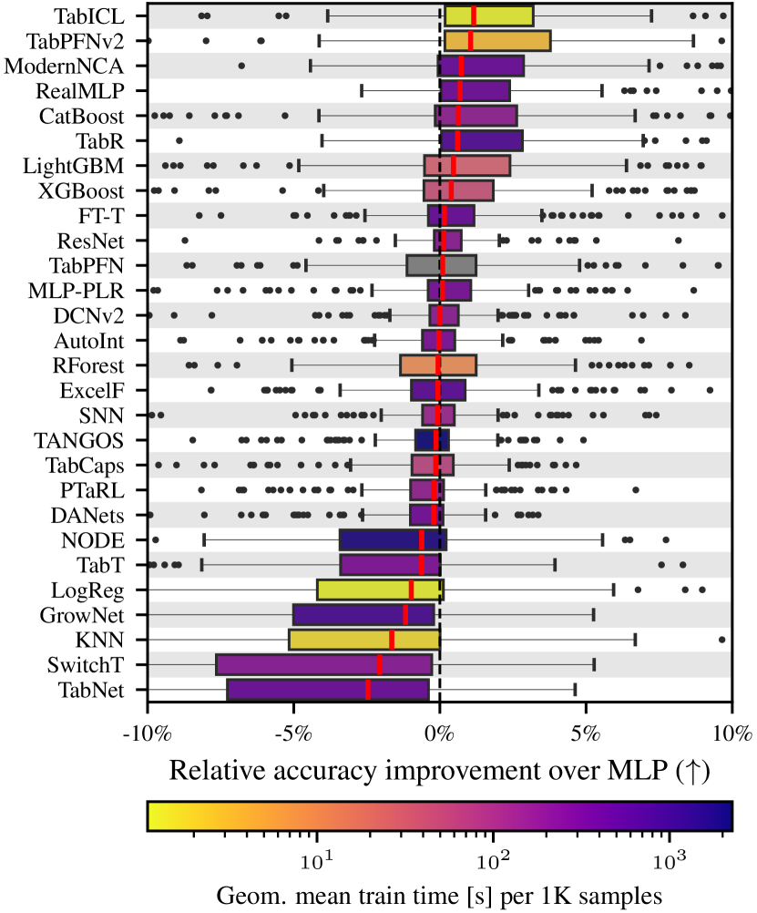

<figcaption>図5: TALENT ベンチマーク（最大 10 クラス）での精度と訓練/推論時間。TabICL/TabPFNv2 は A100 GPU での訓練＋推論時間、他モデルは訓練＋ハイパラ調整を含む。TabICL は調整済み SOTA モデルよりはるかに高速で最良の相対精度中央値を得る。</figcaption>
</figure>

#### TabICL は最先端の精度を得る。

図 5 は全モデルの、調整済み MLP に対する相対精度を示す。TabICL は全データセットで最良の相対精度中央値を得つつ、伝統的な SOTA モデルよりはるかに高速である。TabICL の 1K サンプルあたり訓練＋推論時間の幾何平均は 1.1 秒、一方 CPU での CatBoost 調整は約 3 分、GPU での RealMLP・ModernNCA は約 7 分。得られた精度に基づく各手法のランクを見ると、臨界差図（図 E.1）は TabICL と TabPFNv2 が競合を大差で上回り、両者の差は統計的に有意でないことを示す。

#### TabPFNv2 に対する高速化。

図 6 は TabICL が小さいデータセットで TabPFNv2 より 1.5 倍、大きいデータセットで 3〜10 倍速いことを示す。これは TabICL のハイブリッドアーキテクチャ——高コストな行方向・列方向アテンション層をより少なく、より小さい埋め込み次元で使い、トークン化した行に対して ICL する——により促進される。1 万サンプル・100 特徴量のデータセットで TabICL は約 20 秒、TabPFNv2 は 1 分 40 秒。1000 サンプル・10 特徴量では TabICL 1 秒、TabPFNv2 2 秒。図 A.1 で、サンプル数・特徴量数に基づき両者の実行時間を予測する単純なスケーリング則を当てはめる。これは大規模データで TabICL の平均高速化が約 5 倍であることを示す。

<figure>

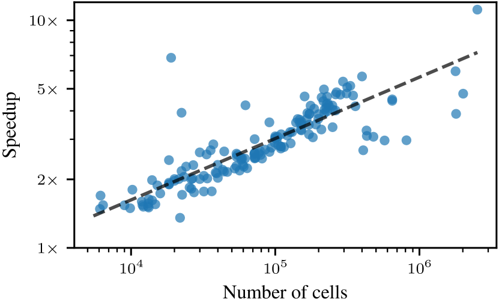

<figcaption>図6: 3 万サンプル未満・最大 10 クラスのデータセットでの TabICL 対 TabPFNv2 の高速化。</figcaption>
</figure>

#### TabICL は大規模データセットでの ICL を可能にする。

TabPFNv2 は最大 1 万サンプルで優れた性能を達成するが、最大 2048 訓練サンプルでしか事前訓練されておらず、メモリ使用量のため 3 万サンプル超のデータセットで失敗しうる。図 7 は、TabPFNv2 と違い TabICL の性能がより大きいデータセットでも強いままであることを示す。ICL は few-shot 設定でよく使われるが、これは基盤モデルが、木ベース/深層学習が最も潜在能力を持つ大規模サンプル領域でも、最良のモデルと競合できることを示す。付録 A の追加結果は、TabICL が多クラス・多特徴量・高いカテゴリ特徴比率でもよく機能することを示す。

#### TabICL は信頼できる確率を生む。

多くの実践状況で、推定確率の品質は意思決定に決定的である。そこで適切なスコアリング則（proper scoring rule）であり確率の正確な予測を報いる対数損失（交差エントロピー損失）も報告する。TabICL はハイパラ調整を活用しないため、その予測は精度に特化して最適化されていない。付録 E の臨界差図は、TabICL と TabPFNv2 が対数損失で精度調整した競合を有意に上回ること（両者の差は有意でない）を示し、両者が他モデルより信頼できる確率推定を生むことを示す。

#### TabICL は 10 クラス超でも有効。

10 クラス超のデータセットには §4.3 の階層的分類戦略を TabICL に適用する。全部分分類器で共有できるラベル非依存の行埋め込みのおかげで、TabICL は多数クラスへ効率的にスケールする。図 8 は、TabPFNv2 がネイティブに 10 クラス超を扱えない中、TabICL がこれらのデータセットで正規化精度平均で 2 番目に良い結果を達成することを示す。

<figure>

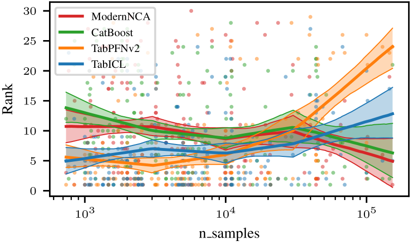

<figcaption>図7: サンプルサイズの関数としてのモデルランキング。各点は 1 手法の 1 データセットでのランク（低いほど良い）。線は区分線形当てはめのブートストラップ中央値と 10%/90% 信頼区間。</figcaption>
</figure>

<figure>

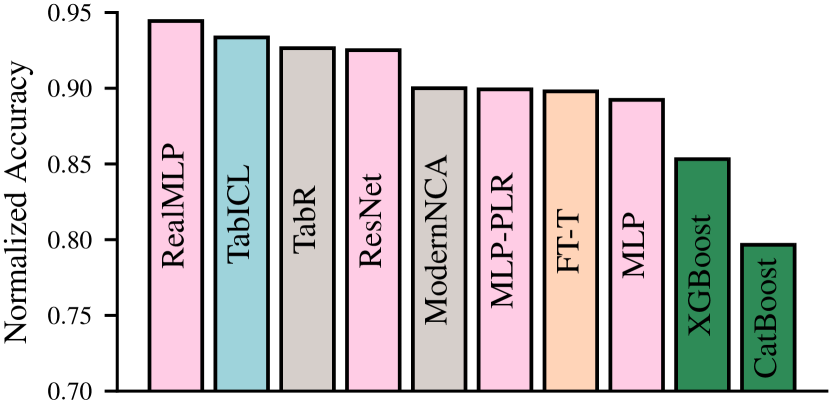

<figcaption>図8: 10 クラス超の 12 データセットでの正規化精度。色は木ベース（緑）・深層学習（ピンク）・検索（灰）・Transformer（橙）・文脈内（青）モデルを示す。</figcaption>
</figure>

## 6 Conclusion（結論）

我々は TabICL を導入した。既存の表形式基盤モデルのスケーラビリティを 1 桁拡張する新しい表形式基盤モデルである。最大 10 万訓練サンプルのデータセットで評価し、ハイパラ調整なしで優れた性能を出し、調整を要する他の表形式手法よりほぼ 2 桁高速にする。TabICL はハイブリッドアーキテクチャとメモリ節約最適化でこれを達成する。新公開の主導的表形式基盤モデル TabPFNv2 と比べ、TabICL は同等の性能をよりスケーラブルかつ高速に達成する。

#### Limitations（限界）

他の基盤モデルと同様、TabICL は推論速度の遅さに苦しむ。ただし TabPFNv2 はキャッシュでこの問題をある程度緩和できることを示した。現状 TabICL は分類問題に限られるが、TabPFNv2 が示したように回帰問題も類似の方法論で扱える。我々の評価は TALENT ベンチマークの長所と短所を継承する。特に TALENT は他の多くのベンチと同様、ホールドアウト法で調整した単一モデルを訓練するが、交差検証で評価したアンサンブルモデルは性能を改善しうる。バギングは計算コストを増すが、TabICL は検証集合不要で全データで訓練できる。

#### Outlook（展望）

表形式データの文脈内学習は元々、小さい表の高速化として導入された。Transformer の 1 順伝播の表現力は限られるように見え、十分なデータがあれば ICL が優位を失うのではと思うかもしれない。我々は、大規模データでも事前訓練が暗黙的な事前分布を作り、文脈内 Transformer に競争上の優位を与えることを見出す。

## Appendix A Further Experiments（付録 A: 追加実験）

#### TabICL と TabPFNv2 の実行時間予測。

TabICL と TabPFNv2 の 1 順伝播（訓練＋推論）の時間の大まかな予測を得るため、列方向・行方向アテンションモジュールの実行時間計算量を活用する。$n$ 行・$m$ 列の表で、列内アテンションは各列で別々に行うため $O(n^2 m)$、行内アテンションは $O(nm^2)$ の時間計算量。合わせて $O(nm(n+m))$（$nm$ は表のセル数）。この量を図 A.1 の $x$ 軸にプロットし、$\text{time}=\alpha+\beta(nm(n+m))^{\gamma}$ の形のモデルを MSLE 損失（対数変換した時間と予測の MSE）で当てはめる。簡単な比較のため両モデルで $\gamma\coloneqq 0.8$ に固定（良好な当てはめを与える）。漸近的には $\gamma=1$ を使うべきと思われるが、良い当てはめにはさらに項が要る。このモデルで、大規模データでの TabICL の TabPFNv2 に対する高速化は 5 に近づき、小規模では 1.4。

<figure>

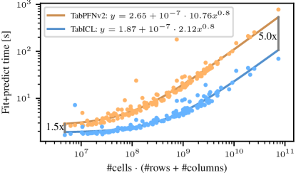

<figcaption>図A.1: TabICL と TabPFNv2 の訓練＋推論時間。各点は A100 GPU での 1 データセットの時間。TabPFNv2 が大規模ではサブサンプリング適用のため、3 万サンプル未満のデータセットのみ使用。</figcaption>
</figure>

#### メタ特徴量（Metafeatures）。

TabICL・TabPFNv2・CatBoost・ModernNCA のランクの、各データセットメタ特徴量への依存を分析する。単一メタ特徴量に応じてランクを予測する、事前定義ノードを持つ区分線形回帰を当てはめる。

図 A.2 はクラス数とのスケーリング。TabICL の性能は 3 クラスのデータセットで劣化するが、より多いクラスでは劣化しない。これが本当にクラス数によるのか、3 クラスデータセットに存在する別の特性によるのかは不明。

図 A.3 は特徴量数とのスケーリング。これらのプロットは、TabICL がラベルを見る前にネットワーク中間で行全体をトークン化するにもかかわらず、多数特徴量でよく振る舞うことを示す。

図 A.4 はカテゴリ対数値変数比への依存。一般に多くのカテゴリ変数の存在で TabICL・TabPFNv2 の性能はやや劣化する。しかし TabPFNv2 がその事前分布でより洗練されたカテゴリ特徴生成を持つにもかかわらず、TabICL がそうしたデータセットで TabPFNv2 をわずかに上回るのは注目に値する。

<figure>

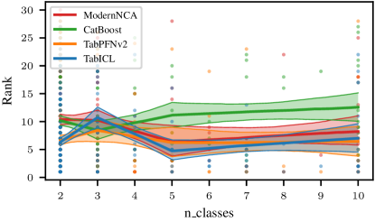

<figcaption>図A.2: ベンチマークランクのクラス数への依存。各点は 1 手法の 1 データセットでのランク（低いほど良い）。線は区分線形当てはめのブートストラップ中央値と 10%/90% 信頼区間。</figcaption>
</figure>

<figure>

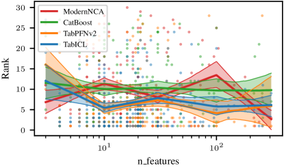

<figcaption>図A.3: ベンチマークランクの特徴量数への依存。各点は 1 手法の 1 データセットでのランク。</figcaption>
</figure>

<figure>

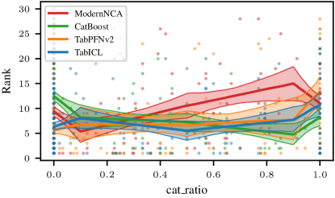

<figcaption>図A.4: ベンチマークランクの「カテゴリ特徴/全特徴」比への依存。各点は 1 手法の 1 データセットでのランク。</figcaption>
</figure>

## Appendix B Synthetic Datasets for Pretraining（付録 B: 事前訓練用合成データセット）

### B.1 SCM prior with more activation functions（より多くの活性化関数を持つ SCM 事前分布）

TabPFN 事前分布で、活性化層を以下の層の系列で置き換える。

- 各特徴をバッチ（サンプル）次元で標準化する標準化層。
- 各ニューロン $i$ について $x_{i}\leftarrow\exp(2a)(x_{i}+b)$ を計算するランダム再スケール層（$a,b\sim\mathcal{N}(0,1)$ を層ごとに 1 回サンプリング）。
- ランダム活性化関数。確率 1/2 で各層が同じ種類の活性化関数を使い、そうでなければ各層が独立に種類をサンプリングする。

元の活性化関数 $\{$Identity, tanh, LeakyReLU, ELU$\}$ に加え、以下を追加する: ReLU, ReLU6, SELU, SiLU, Softplus, $\text{Hardtanh}(x)=\max(-1,\min(1,x))$, 符号関数, Sine, $\text{RBF}(x)=\exp(-x^2)$, 指数関数, $f(x)=\sqrt{|x|}$, $f(x)=1_{|x|\leq 1}$, $f(x)=x^2$, $f(x)=|x|$、およびランダム関数 $f(x)=\phi(x)^{\top}\mathbf{z}$（$\mathbf{z}\sim\mathcal{N}(0,1)$、特徴写像 $\phi$ はランダムに定義）。

$$
\phi(x)\coloneqq\frac{\mathbf{w}}{\|\mathbf{w}\|_2}\odot\sin(\mathbf{a}x+\mathbf{b})\in\mathbb{R}^{N},\quad N\coloneqq 256,\quad b_i\sim\mathcal{U}[0,2\pi],\quad a_i\sim\mathcal{U}[0,N],\quad w_i\coloneqq a_i^{-\exp(u)},\quad u\sim\mathcal{U}[0.7,3.0]
$$

全ランダムパラメータは層ごとに 1 回引かれ、$\odot$ は要素積。固定された特徴写像 $\phi$ について、ランダム関数 $f(x)=\phi(x)^{\top}\mathbf{z}$ は共分散カーネル $k(x,x')=\phi(x)^{\top}\phi(x')$ を持つガウス過程である、という事実が動機。$\phi$ の設計はランダムフーリエ特徴に着想を得る。ランダムに引いた指数 $-\exp(u)$ は周波数増加に伴う係数の異なる減衰を生み、サンプリングされた関数に異なる滑らかさのレベルを与える（図 B.1 右）。この活性化関数はランダム関数の直前に標準化を適用するため、ランダム再スケールは効果を持たない。

ここでランダム関数は、多くの異なる関数を表せることを考慮し、他の活性化関数より 10 倍高い確率でサンプリングされる。図 B.1 は使用した活性化関数を可視化する。図 B.2 は得られた事前分布からのデータセットを示す。

<figure>

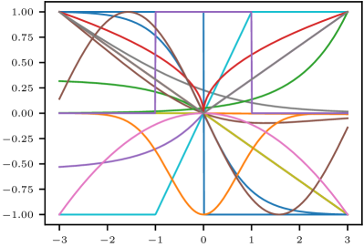

<figcaption>図B.1: SCM 事前分布の活性化関数。左: 標準化・ランダム再スケールなしの非ランダム活性化関数（空間を活かすため x/y 軸でランダムに反転）。右: ランダム活性化関数のランダムなインスタンス（入力の自動標準化込み）。</figcaption>
</figure>

<figure>

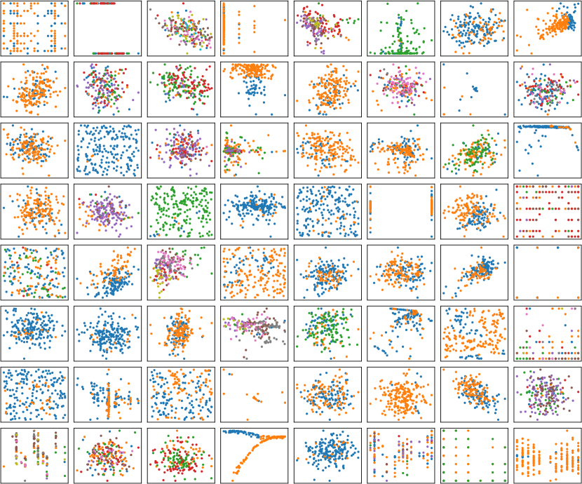

<figcaption>図B.2: SCM 事前分布からランダム生成した 2D データセット。色はクラスラベル。</figcaption>
</figure>

### B.2 Tree-based SCM prior（木ベース SCM 事前分布）

木ベース SCM 事前分布は、SCM 事前分布の線形層と活性化層を、ランダムデータに当てはめた XGBoost モデルで置き換える。具体的には次のように生成する。

- n_estimators と max_depth を、それぞれ $\min\{4,1+\text{Exponential}(\lambda=0.5)\}$ と $\min\{4,2+\text{Exponential}(\lambda=0.5)\}$ として独立にサンプリング。
- $n$ 入力・$m$ 出力ニューロンの各層で、上記パラメータの XGBoost 多出力回帰器を、層入力 $x_i$ に対し標準正規ターゲット $y_i\in\mathbb{R}^m$ で当てはめ、得たモデルで所与入力上を予測する。

図 B.3 は木 SCM 事前分布からのデータセットを示す。

<figure>

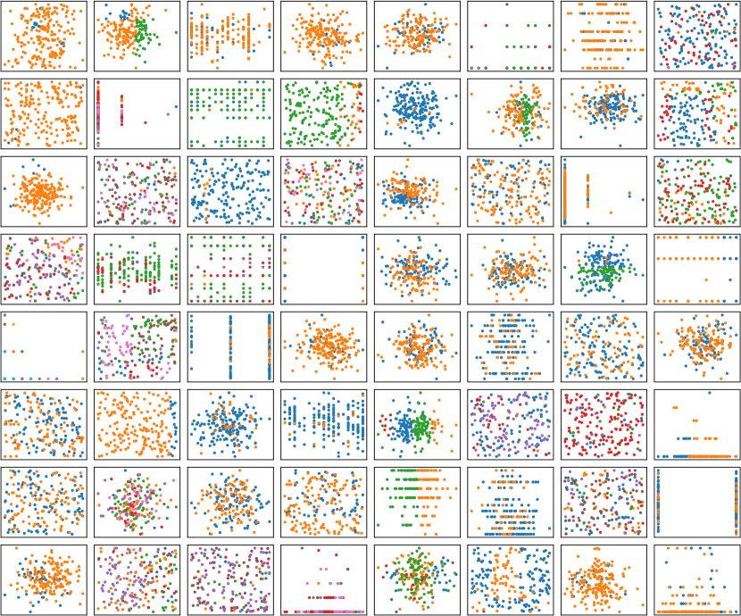

<figcaption>図B.3: 木ベース SCM 事前分布からランダム生成した 2D データセット。色はクラスラベル。</figcaption>
</figure>

## Appendix C Rotary Positional Embedding（付録 C: 回転位置埋め込み）

回転位置エンコーディング（RoPE）は、入力データの位置情報を表すために Transformer モデルで使われる技術である。RoPE は、自己アテンションのクエリ・キーベクトルに適用する回転行列を通じて位置情報を直接アテンション機構にエンコードする。位置 $p$、周波数 $\omega$、ベクトル $x$（クエリまたはキー）が与えられたとき、

$$
x_p=\text{RoPE}(x,p)=R(p)x
$$

ここで $R(p)$ は $x$ に適用する回転行列で、正弦関数で位置情報をエンコードする。$R(p)$ は正弦関数に基づき、$x$ の 2 次元部分空間ごとに独立に回転を適用する。各 2D ペア $(x_{2i},x_{2i+1})$ について、

$$
R(p)\begin{bmatrix}x_{2i}\\ x_{2i+1}\end{bmatrix}\coloneqq\begin{bmatrix}\cos(\theta_i)&-\sin(\theta_i)\\ \sin(\theta_i)&\cos(\theta_i)\end{bmatrix}\begin{bmatrix}x_{2i}\\ x_{2i+1}\end{bmatrix},\qquad \theta_i\coloneqq\frac{p}{10000^{2i/d}}
$$

ここで $d$ は埋め込み次元、$\omega_i=10000^{2i/d}$ が各次元の周波数を決める。各次元ペア $(2i,2i+1)$ について、ベクトルは位置 $p$ と周波数 $\omega_i$ に比例した角度で回転される。RoPE は自己アテンションのクエリ $Q$・キー $K$ を直接修正する。

$$
\text{Attention}(Q,K,V)=\text{softmax}\left(\frac{(R(p_Q)Q)\cdot(R(p_K)K)^{T}}{\sqrt{d}}\right)V
$$

相対位置情報が内積に保存されるため、アテンションスコアは位置 $p_Q$ と $p_K$ の相対距離を自然にエンコードする。

ある研究は、我々の用法とよく合う RoPE の別解釈を与える。低い添字 $i$ では回転角が $p$ の増加とともに速く変わり、位置情報をエンコードするランダムノイズ的な高周波振動を生む。逆に高い添字 $i$ では回転角が遅く変わり、意味情報を運ぶ安定値を生む。我々の場合、RoPE は制御され予測可能で汎化可能な形で、各特徴にその識別子としてノイズを効果的に導入する。

RoPE は長期減衰（相対距離が増すとトークンの相関が減る）を示すとも主張される。しかしこの主張は、クエリとキーが等しいという非現実的な過度の単純化に依存するとして疑問視されている。

## Appendix D Setup of TabICL（付録 D: TabICL のセットアップ）

### D.1 Pretraining details（事前訓練の詳細）

本文で概説したように、事前訓練中に合成データセットのサイズ（サンプル数）を漸増させるカリキュラム学習を採る。勾配蓄積のマイクロバッチサイズを調整して 3 段で展開する。

1. $N_{\mathcal{B}}=4$、固定サイズ 1,024 で最初の 100K ステップ。
2. $N_{\mathcal{B}}=1$、サイズは 1K〜40K の対数一様分布から 2K ステップ。1 万サンプル超で活性化チェックポイント有効化、OOM 回避のため特徴量数を減らす。
3. $N_{\mathcal{B}}=1$、サイズは 40K〜60K で一様サンプリング 50 ステップ。$\text{TF}_{\text{icl}}$ のみ訓練し他は凍結。

各ステップは 512 データセット。第 1 段では全データセットが同じサンプル数。第 2・3 段では各マイクロバッチ内は同じサンプル数だが、マイクロバッチ間で変わる。Adam を使い勾配ノルムを 1 にクリップ。学習率スケジュールは図 1(c)。

<figure>

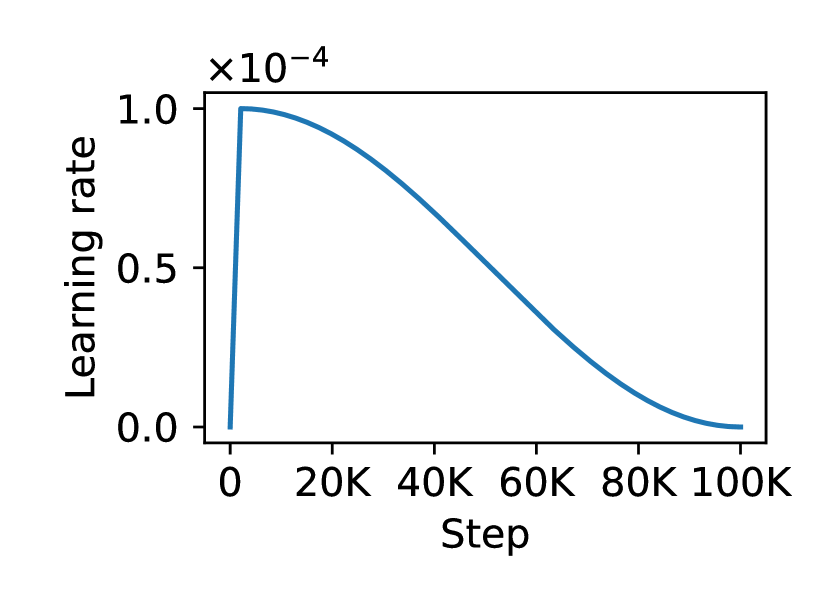

<figcaption>図D.1(a): 第 1 段のウォームアップ付きコサイン減衰の学習率スケジュール。</figcaption>
</figure>

### D.2 Memory-efficient inference（メモリ効率的推論）

FlashAttention を用い、TabICL の 3 つの Transformer（列ごと埋め込み $\text{TF}_{\text{col}}$・行ごと相互作用 $\text{TF}_{\text{row}}$・データセット単位 ICL $\text{TF}_{\text{icl}}$）の推論ピーク GPU メモリ消費が以下の多項式回帰でよく近似できることを観察した。

$$
\text{MEM}=\alpha_1\times\text{batch\_size}+\alpha_2\times\text{seq\_len}+\alpha_3\times\text{batch\_size}\times\text{seq\_len}+\alpha_4
$$

バッチサイズと系列長の具体的な意味は Transformer ごとに変わる。

**表D.1**: 各 Transformer のバッチサイズと系列長の概念

|  | バッチサイズ | 系列長 |
| --- | --- | --- |
| $\text{TF}_{\text{col}}$ | 特徴量数 | サンプル数 |
| $\text{TF}_{\text{row}}$ | サンプル数 | 特徴量数 |
| $\text{TF}_{\text{icl}}$ | データセット数 | サンプル数 |

入力 $X\in\mathbb{R}^{b\times n\times m}$（$b$ データセット数・$n$ サンプル数・$m$ 特徴量数）が与えられると、$X$ はまず $\mathbb{R}^{(b\times m)\times n}$ に reshape され $\text{TF}_{\text{col}}$ で処理されて $E=\mathbb{R}^{(b\times m)\times n\times d}$ を得る。次に $E$ は $\mathbb{R}^{(b\times n)\times m\times d}$ に reshape され $\text{TF}_{\text{row}}$ に渡されて $H\in\mathbb{R}^{b\times n\times 4d}$ を生む。最後に $H$ を $\text{TF}_{\text{icl}}$ に与え ICL でテスト集合全体を予測する。各 Transformer に適切なバッチサイズを設定して GPU を効率利用し OOM を避ける必要があり、上記の多項式回帰がここで役立つ。

A100 40GB でバッチサイズと系列長を変えてピーク GPU メモリを系統的に追跡し、上記多項式回帰のパラメータを当てはめた（メモリ単位 MB）。

$$
\text{MEM}_{\text{col}}=0.0708\times\text{bs}+7.29\times10^{-6}\times\text{sl}+0.00391\times\text{bs}\times\text{sl}+137.62
$$
$$
\text{MEM}_{\text{row}}=-2.07\times10^{-5}\times\text{bs}+2.27\times10^{-4}\times\text{sl}+0.00537\times\text{bs}\times\text{sl}+138.54
$$
$$
\text{MEM}_{\text{icl}}=-0.260\times\text{bs}+4.77\times10^{-7}\times\text{sl}+0.0195\times\text{bs}\times\text{sl}+140.58
$$

バッチサイズ調整に加え、中間活性化を必要に応じ CPU・ディスクへオフロードし GPU メモリ制約をさらに緩和する。図 D.2 は 10 万サンプル・500 特徴量（訓練 80%・テスト 20%）の大規模データセットの CPU/GPU メモリ消費を示す。GPU 5GB・CPU 25GB のみ使い、非常に手頃な計算構成である。図 D.3 は 50 万サンプル・500 特徴量での消費を示す。GPU 14GB 未満、CPU は約 120GB に達するが、メモリマッピングによるオプションのディスクオフロードで大幅削減できる。

列ごと埋め込みと行ごと相互作用の段で GPU メモリ消費が周期的に変動するのは、データセット全体が（多項式回帰で動的に決まるバッチサイズで）複数バッチに自動分割されるため。また列ごと埋め込み中、$\text{TF}_{\text{col}}$ の出力が順次 CPU にオフロードされるため、この段で CPU メモリ使用が漸増する。自動混合精度の有効化はメモリ消費と計算時間の両方を大きく減らす。

<figure>

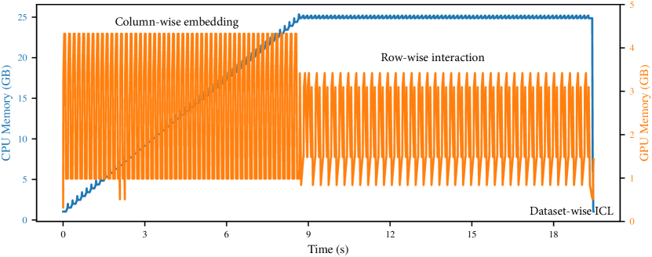

<figcaption>図D.2: 10 万サンプル・500 特徴量データセットでの CPU/GPU メモリ使用（自動混合精度なし）。GPU 5GB・CPU 25GB 程度で済む。</figcaption>
</figure>

<figure>

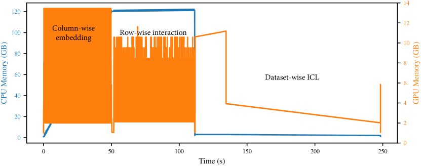

<figcaption>図D.3: 50 万サンプル・500 特徴量データセットでの CPU/GPU メモリ使用（自動混合精度なし）。GPU 14GB 未満。</figcaption>
</figure>

## Appendix E Average Performance and Rankings（付録 E: 平均性能とランキング）

本節では、データセットカテゴリ別（二値・多クラス $\leq$10・小規模 $\leq$10K・大規模 $>$10K）の全手法の平均ランクを提示する。ランクは精度・AUC・対数損失に基づき計算する。平均ランクは臨界差図で、有意水準 0.05 の Wilcoxon-Holm 検定とともに示す。ランク値が低いほど性能が良い。精度が表形式手法のハイパラ調整の目的指標である点に注意。

<figure>

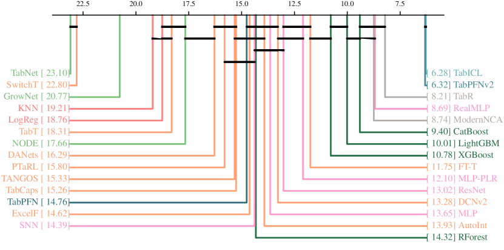

<figcaption>図E.1: 全データセット（最大 10 クラス）の精度に基づく臨界差図。TabICL と TabPFNv2 が競合を大差で上回り、両者の差は有意でない。</figcaption>
</figure>

<figure>

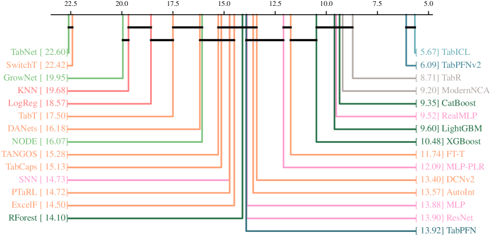

<figcaption>図E.2: 二値分類データセットでのランキング（精度ほか）の臨界差図。</figcaption>
</figure>

<figure>

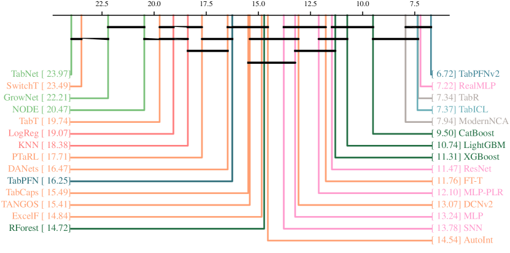

<figcaption>図E.3: 多クラス（$\leq$10 クラス）データセットでのランキングの臨界差図。</figcaption>
</figure>

<figure>

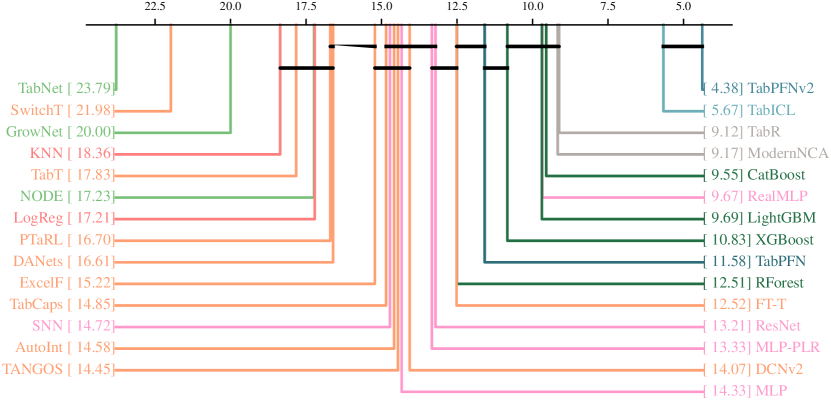

<figcaption>図E.4: 小規模（$\leq$10K サンプル）データセットでのランキングの臨界差図。</figcaption>
</figure>

<figure>

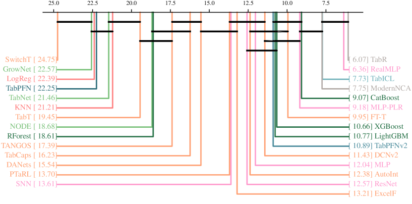

<figcaption>図E.5: 大規模（$>$10K サンプル）データセットでのランキングの臨界差図。TabICL が TabPFNv2・CatBoost を上回る。</figcaption>
</figure>
